                 

### 文章标题: AI大模型创业：如何应对未来技术挑战？

> 关键词：AI大模型、创业、技术挑战、深度学习、神经网络、自然语言处理、预训练模型、风险管理和实践指导

> 摘要：
随着人工智能技术的快速发展，AI大模型已成为各个领域的重要工具。本文旨在探讨AI大模型创业过程中的技术挑战及其应对策略，包括基础理论、创业准备、技术路线、风险管理以及实战经验。通过深入分析AI大模型的核心技术和创业实践，为AI创业者提供切实可行的指导。

---

### 《AI大模型创业：如何应对未来技术挑战？》目录大纲

#### 第一部分: AI大模型基础

#### 第二部分: AI大模型创业策略

#### 第三部分: AI大模型创业实践

#### 附录

---

### 第一部分: AI大模型基础

### 第1章: AI大模型概述

#### 1.1 AI大模型的基本概念
AI大模型是指那些通过深度学习和大规模数据训练，能够处理复杂数据并执行高级任务的模型。其核心思想是将大量数据输入到神经网络中，通过迭代优化模型参数，使其能够对输入数据进行有效识别和预测。

#### 1.2 AI大模型的产生背景和重要性
AI大模型的发展得益于计算能力的提升和数据量的爆炸性增长。随着深度学习技术的成熟，研究人员开始利用大规模数据进行模型训练，从而实现了在语音识别、图像识别、自然语言处理等领域的大幅性能提升。

#### 1.3 AI大模型的主要类型和应用场景
AI大模型主要分为自然语言处理模型、计算机视觉模型和其他领域模型。自然语言处理模型如BERT、GPT在文本生成、翻译、问答等领域有广泛应用；计算机视觉模型如ResNet、YOLO在图像分类、目标检测等领域有广泛应用；其他领域模型如BERT在医学领域也有应用。

---

### 第二部分: AI大模型创业策略

#### 第3章: AI大模型创业准备

#### 第4章: 技术路线与研发管理

#### 第5章: 风险管理与应对策略

#### 第6章: AI大模型创业案例分析

---

### 第三部分: AI大模型创业实践

#### 第7章: AI大模型项目实战

#### 第8章: AI大模型创业实战指导

---

#### 附录

#### 附录 A: AI 大模型开发工具与资源

---

### 第一部分: AI大模型基础

#### 第1章: AI大模型概述

### 1.1 AI大模型的基本概念
AI大模型是指那些通过深度学习和大规模数据训练，能够处理复杂数据并执行高级任务的模型。其核心思想是将大量数据输入到神经网络中，通过迭代优化模型参数，使其能够对输入数据进行有效识别和预测。

在技术层面上，AI大模型的核心在于其训练过程。训练过程可以分为以下几个关键步骤：

1. **数据预处理**：首先，需要对输入数据进行预处理，包括数据清洗、数据规范化等操作。例如，对于自然语言处理任务，可能需要对文本进行分词、去停用词等处理；对于图像处理任务，可能需要对图像进行裁剪、缩放等操作。

2. **数据增强**：为了增加模型的泛化能力，可以通过数据增强技术生成更多的训练样本。例如，在图像处理中，可以使用旋转、翻转、缩放等方式生成新的图像。

3. **模型初始化**：选择合适的模型初始化策略，有助于加速模型的训练过程。常用的初始化方法包括随机初始化、高斯初始化等。

4. **模型训练**：使用梯度下降等优化算法对模型参数进行迭代优化，使模型能够更好地拟合训练数据。在训练过程中，需要监控模型的损失函数值，并根据需要调整学习率等超参数。

5. **模型评估**：在训练完成后，使用测试集对模型进行评估，以验证其泛化能力。常用的评估指标包括准确率、召回率、F1值等。

6. **模型部署**：将训练好的模型部署到生产环境中，用于实际任务。部署过程中需要考虑模型大小、计算效率等因素。

### 1.2 AI大模型的重要性
AI大模型的重要性体现在以下几个方面：

1. **提升任务性能**：通过大规模数据训练，AI大模型能够在各种复杂数据上取得更好的性能，特别是在自然语言处理、图像识别等领域。

2. **泛化能力**：AI大模型通过训练大量数据，能够更好地泛化到未见过的数据上，从而提高模型的实用性。

3. **减少对标注数据的依赖**：传统的机器学习模型通常需要大量标注数据来进行训练，而AI大模型可以通过无监督或半监督学习方式，减少对标注数据的依赖。

4. **推动技术发展**：AI大模型的出现，推动了深度学习、自然语言处理等技术的发展，为研究者提供了更多的研究思路和工具。

### 1.3 AI大模型的主要类型和应用场景
AI大模型主要分为自然语言处理模型、计算机视觉模型和其他领域模型。下面将分别介绍这些模型的主要类型和应用场景。

#### 自然语言处理模型
自然语言处理（NLP）模型主要用于处理文本数据，包括文本分类、情感分析、机器翻译、问答系统等任务。以下是一些常见的NLP大模型：

1. **BERT（Bidirectional Encoder Representations from Transformers）**：BERT是一种基于Transformer架构的预训练模型，通过双向编码器学习文本的上下文表示，广泛应用于文本分类、问答等任务。

2. **GPT（Generative Pre-trained Transformer）**：GPT是一种基于Transformer架构的生成模型，通过自回归方式生成文本，广泛应用于文本生成、语言建模等任务。

3. **RoBERTa（A Robustly Optimized BERT Pretraining Approach）**：RoBERTa是在BERT的基础上进行改进的预训练模型，通过优化训练策略和数据处理方式，提高了模型的性能。

#### 计算机视觉模型
计算机视觉（CV）模型主要用于处理图像数据，包括图像分类、目标检测、图像分割等任务。以下是一些常见的CV大模型：

1. **ResNet（Residual Network）**：ResNet是一种深度残差网络，通过引入残差模块解决了深度网络中的梯度消失问题，广泛应用于图像分类、目标检测等任务。

2. **YOLO（You Only Look Once）**：YOLO是一种基于卷积神经网络的实时目标检测模型，通过将目标检测任务转化为边界框回归和类别预测问题，实现了高效的检测性能。

3. **Mask R-CNN（Mask Region-based Convolutional Neural Networks）**：Mask R-CNN是一种基于ResNet的物体检测和实例分割模型，通过引入掩膜分支实现了同时检测和分割任务。

#### 其他领域模型
除了NLP和CV领域，AI大模型在其他领域也有广泛应用，如医学图像处理、语音识别、推荐系统等。以下是一些常见的其他领域模型：

1. **CAMELYON16（医学图像分割挑战）**：CAMELYON16是一个基于CNN的医学图像分割模型，通过训练大规模医学图像数据，实现了准确、高效的肿瘤区域分割。

2. **WSJ（Wall Street Journal）**：WSJ是一个基于GPT的文本生成模型，通过训练大规模新闻文本数据，实现了高质量的文本生成。

3. **DALL-E（DALL-E: A System for Generating Images from Text Descriptions）**：DALL-E是一个基于GPT的图像生成模型，通过将文本描述转换为图像，实现了文本到图像的转换。

### 1.4 AI大模型在计算机视觉领域的架构
在计算机视觉领域，AI大模型通常采用深度卷积神经网络（CNN）架构。CNN由多个卷积层、池化层和全连接层组成，能够有效地提取图像的特征并分类。以下是一个典型的CNN架构：

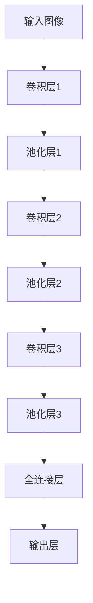

#### 输入层
输入层接收原始图像数据，通常是一个二维矩阵。图像的尺寸和通道数根据具体任务进行调整。

#### 卷积层
卷积层通过卷积操作提取图像的特征。卷积核（filter）在图像上滑动，对相邻像素进行加权求和，得到特征图。卷积层可以堆叠多层，以逐步提取图像的复杂特征。

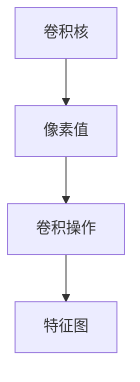

#### 池化层
池化层用于降低特征图的维度，减少参数数量，提高模型的泛化能力。常用的池化操作包括最大池化和平均池化。

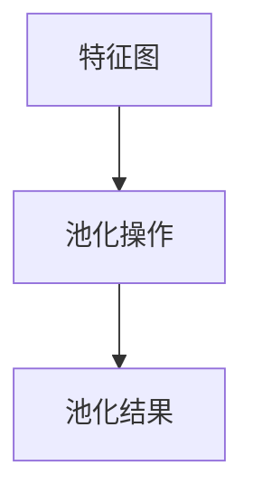

#### 全连接层
全连接层将卷积层和池化层提取的特征映射到分类结果。全连接层通常包含多个神经元，每个神经元对应一个分类类别。

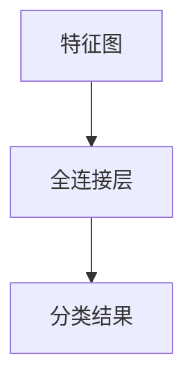

#### 输出层
输出层根据全连接层的输出进行分类或预测。输出层的神经元个数通常等于分类类别数。

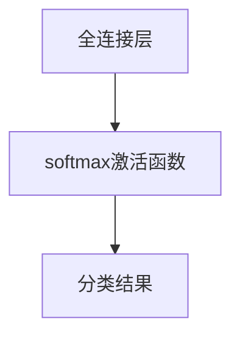

### 1.5 AI大模型的训练与优化
AI大模型的训练与优化是确保模型性能的关键环节。以下是一些常见的训练与优化方法：

#### 数据预处理
数据预处理是训练前的必要步骤，包括数据清洗、数据增强等操作。数据清洗去除噪声和异常值，数据增强增加数据多样性，有助于提高模型的泛化能力。

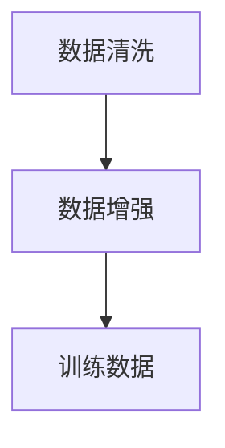

#### 模型初始化
模型初始化是训练开始前的关键步骤，选择合适的初始化方法可以加速模型的收敛速度。常见的初始化方法包括随机初始化、高斯初始化等。

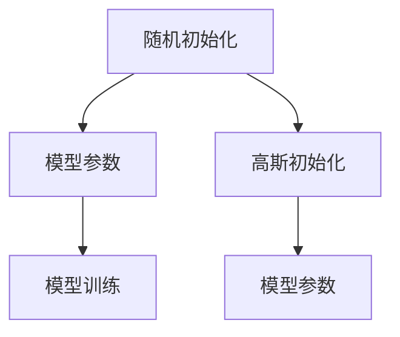

#### 梯度下降
梯度下降是一种常用的优化算法，用于更新模型参数以最小化损失函数。梯度下降可以分为批量梯度下降、随机梯度下降和小批量梯度下降等。

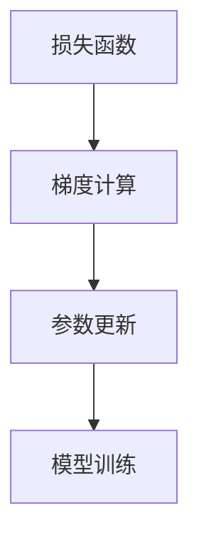

#### 批量大小
批量大小是指每次梯度下降算法处理的样本数量。批量大小对模型的收敛速度和稳定性有重要影响。较大批量可以提高模型的泛化能力，但训练时间较长；较小批量可以提高训练速度，但可能导致模型过拟合。

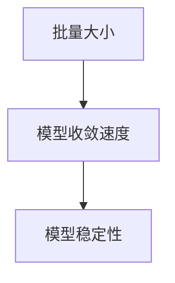

#### 学习率调度
学习率是梯度下降算法中的一个关键参数，用于控制参数更新的步长。学习率调度是指在训练过程中动态调整学习率的方法，有助于模型更快地收敛。

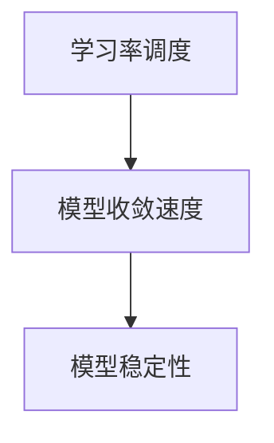

#### 正则化
正则化是防止模型过拟合的一种技术，通过在损失函数中添加正则项来惩罚模型参数的大小。常见的正则化方法包括L1正则化、L2正则化和Dropout等。

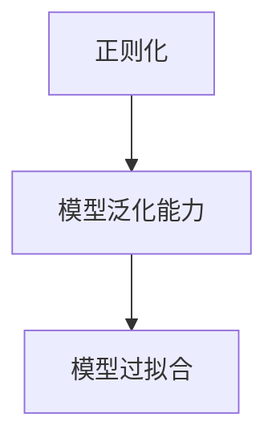

### 1.6 AI大模型的应用挑战
AI大模型在应用过程中面临一系列挑战，包括数据隐私、安全性和伦理问题等。以下是一些常见的应用挑战：

#### 数据隐私
AI大模型通常需要处理大量的敏感数据，如个人隐私信息、医疗记录等。数据隐私保护是AI大模型应用的重要挑战，需要采取有效的数据加密、隐私保护等技术。

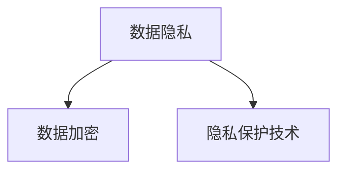

#### 安全性
AI大模型可能遭受恶意攻击，如注入攻击、对抗性攻击等。安全性是AI大模型应用的关键问题，需要采取有效的安全防护措施。

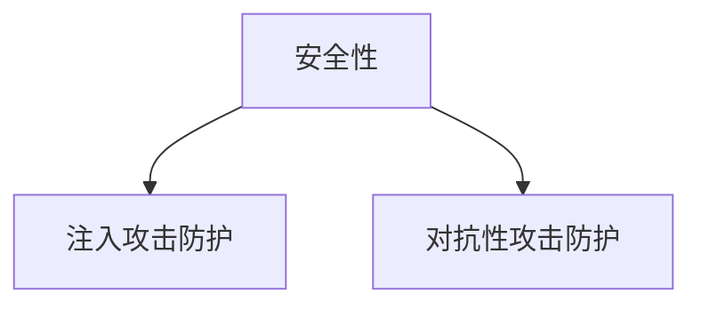

#### 伦理问题
AI大模型的应用可能引发一系列伦理问题，如歧视、偏见等。伦理问题需要社会各界的共同关注和探讨，以制定合适的伦理规范。

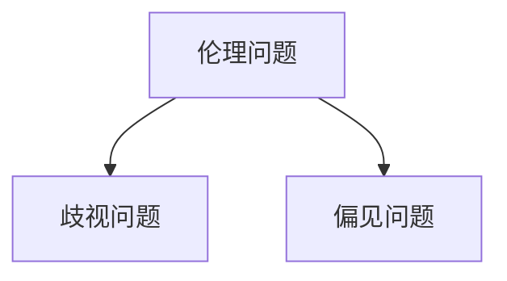

### 1.7 AI大模型的发展趋势
随着技术的进步和应用需求的增长，AI大模型在各个领域展现出巨大的潜力。以下是一些AI大模型的发展趋势：

#### 模型压缩
为了提高模型的计算效率和部署能力，模型压缩成为重要研究方向。通过模型剪枝、量化等技术，可以将模型的大小和计算复杂度降低，从而实现高效部署。

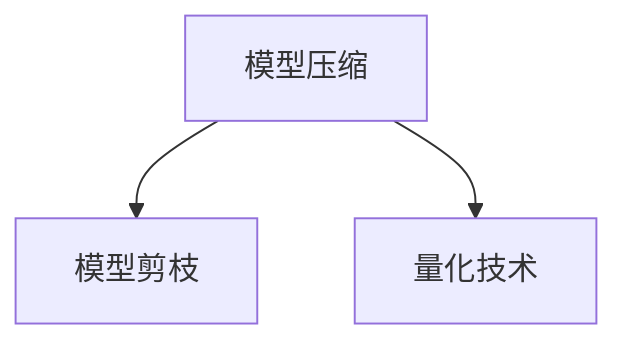

#### 自监督学习
自监督学习是AI大模型的一个新兴研究方向，通过利用未标记的数据进行训练，可以减少对标注数据的依赖，提高模型的泛化能力。

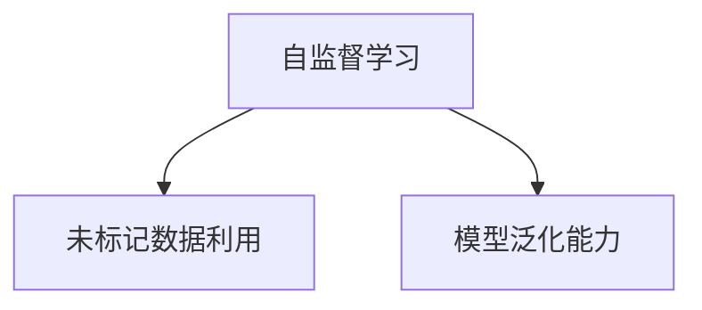

#### 多模态学习
多模态学习是AI大模型在处理多源数据时的一个重要研究方向。通过融合不同模态的数据，可以提升模型的性能和泛化能力。

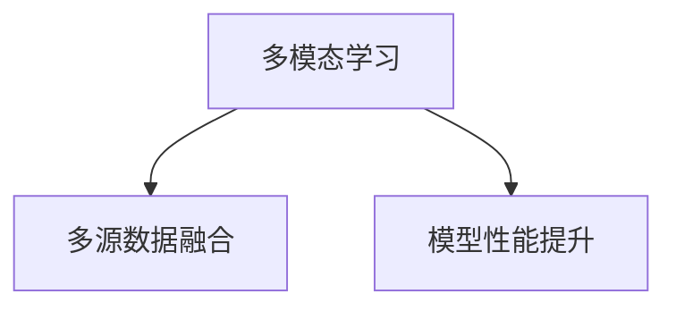

### 1.8 小结
AI大模型作为人工智能领域的重要突破，已经广泛应用于各个领域。通过本章的介绍，我们了解了AI大模型的基本概念、重要性、主要类型和应用场景，以及其在计算机视觉领域的架构和训练与优化方法。同时，我们也探讨了AI大模型在应用过程中面临的挑战和发展趋势。这些知识为AI大模型创业者提供了宝贵的理论支持。

在下一章中，我们将探讨AI大模型创业的准备阶段，包括市场调研、商业模式设计和团队建设等方面的内容。

---

### 第二部分: AI大模型创业策略

#### 第2章: 技术路线与研发管理

#### 第3章: 风险管理与应对策略

#### 第4章: AI大模型创业案例分析

---

### 第2章: 技术路线与研发管理

#### 2.1 技术路线规划与决策
技术路线规划是AI大模型创业过程中至关重要的一步，它关系到项目能否顺利推进和取得成功。技术路线规划主要包括以下几个方面：

1. **目标设定**：明确项目的技术目标和应用领域。例如，如果项目旨在开发一个面向医疗领域的AI大模型，那么目标可能是实现高效的医学图像分割或疾病诊断。

2. **技术选型**：根据目标和应用领域，选择合适的技术栈和工具。例如，对于自然语言处理任务，可以选择BERT或GPT等预训练模型；对于计算机视觉任务，可以选择ResNet或YOLO等模型。

3. **技术难点分析**：识别项目在技术实现过程中可能遇到的难点和挑战，并制定相应的解决方案。例如，在处理大规模图像数据时，可能需要解决数据增强、模型压缩等问题。

4. **时间规划**：制定项目的时间规划，包括各个阶段的里程碑和关键节点。时间规划有助于确保项目按计划进行，并及时调整方向。

5. **资源分配**：根据项目需求和进度，合理分配人力资源、计算资源和资金等资源。资源分配要考虑团队的技能水平和项目的重要性，以确保项目能够顺利进行。

#### 2.2 研发流程与项目管理
研发流程和项目管理是确保项目顺利推进的重要保障。以下是一个典型的研发流程和项目管理框架：

1. **需求分析**：明确项目需求，包括功能需求和非功能需求。需求分析是项目启动的第一步，需要与客户、产品经理和团队成员充分沟通，确保需求明确、可行。

2. **系统设计**：根据需求分析，设计系统的架构和模块。系统设计包括技术选型、接口设计、数据库设计等。系统设计要考虑可扩展性、可维护性和性能等因素。

3. **编码实现**：根据系统设计，进行编码实现。编码实现要遵循良好的编程规范，包括代码注释、单元测试等。

4. **集成测试**：将各个模块集成起来，进行系统测试。集成测试要覆盖各种场景，包括正常场景、异常场景和边界场景等。

5. **性能优化**：对系统进行性能测试和优化，确保系统在高负载下能够稳定运行。性能优化包括代码优化、数据库优化和硬件优化等。

6. **上线部署**：将系统部署到生产环境，进行实际运行。上线部署要确保系统的安全、稳定和高效。

7. **运维管理**：对系统进行日常运维管理，包括监控、故障排查、性能优化等。运维管理要确保系统的持续运行和优化。

#### 2.3 技术难点与解决方案
AI大模型创业过程中可能会遇到一系列技术难点，以下是一些常见的技术难点及其解决方案：

1. **数据隐私和安全**：在处理敏感数据时，需要确保数据的安全性和隐私性。解决方案包括数据加密、隐私保护算法和分布式计算等。

2. **模型压缩和加速**：为了提高模型的计算效率和部署能力，需要对模型进行压缩和加速。解决方案包括模型剪枝、量化技术和硬件加速等。

3. **数据增强**：在训练AI大模型时，数据增强是提高模型泛化能力的重要手段。解决方案包括数据生成、数据合成和数据扩展等。

4. **迁移学习和微调**：迁移学习和微调技术可以减少对大规模标注数据的依赖，提高模型的泛化能力。解决方案包括预训练模型的选择、迁移学习策略和微调技巧等。

5. **模型解释性**：为了提高模型的解释性，需要对模型进行可解释性分析和模型可视化。解决方案包括模型拆解、特征提取和模型可视化工具等。

6. **多模态学习**：在处理多源数据时，多模态学习技术可以将不同模态的数据进行融合，提高模型的性能。解决方案包括多模态数据融合算法和模型设计等。

7. **跨领域应用**：AI大模型在不同领域的应用可能存在差异，需要针对具体领域进行模型调整和优化。解决方案包括领域特定数据集的建设、领域知识图谱的构建和应用场景的适应性调整等。

#### 2.4 小结
技术路线规划与研发管理是AI大模型创业过程中至关重要的一环。通过合理的规划与有效的管理，可以确保项目顺利推进，提高模型的性能和实用性。在本章中，我们介绍了技术路线规划与决策、研发流程与项目管理以及技术难点与解决方案等方面的内容。这些内容为AI大模型创业者提供了宝贵的实践经验和技术指导。

在下一章中，我们将探讨AI大模型创业中的风险管理与应对策略，帮助创业者应对创业过程中的各种风险和挑战。

---

### 第3章: 风险管理与应对策略

#### 3.1 技术风险与管理

#### 3.2 市场风险与应对

#### 3.3 法律风险与合规性

---

### 第3章: 风险管理与应对策略

#### 3.1 技术风险与管理

在AI大模型创业过程中，技术风险是不可避免的。这些风险可能来自于技术本身的不确定性、技术实现的难度以及技术发展的快速变化。以下是一些常见的技术风险及其管理策略：

#### 3.1.1 技术的不确定性
AI大模型依赖于深度学习和大规模数据训练，但技术本身仍存在不确定性，如模型的选择、参数的调优、算法的创新等。管理策略包括：
1. **技术调研**：对最新的技术趋势进行研究，了解最新的研究成果和技术动态。
2. **专家咨询**：与领域内的专家进行交流，获取他们的意见和建议。
3. **试点项目**：通过小规模的试点项目验证技术的可行性，减少技术的不确定性。

#### 3.1.2 技术实现的难度
AI大模型开发需要大量的计算资源和专业技能，技术实现的难度较高。管理策略包括：
1. **团队合作**：组建一支有经验的技术团队，分工合作，提高开发效率。
2. **技术培训**：为团队成员提供技术培训和进修机会，提升团队的技术能力。
3. **外部合作**：与科研机构、高校或企业合作，借助外部资源和技术力量。

#### 3.1.3 技术发展的快速变化
AI领域发展迅速，技术更新换代快，可能导致现有技术过时。管理策略包括：
1. **持续学习**：鼓励团队成员持续学习新知识、新技术，保持技术领先地位。
2. **技术预研**：对可能影响未来的新技术进行预研，提前布局。
3. **技术迭代**：定期对现有技术进行评估和升级，确保技术始终处于最佳状态。

#### 3.2 市场风险与应对

市场风险是AI大模型创业过程中面临的另一个重要风险。这些风险包括市场需求的变化、竞争压力、客户关系等。以下是一些常见的市场风险及其应对策略：

#### 3.2.1 市场需求的变化
市场需求可能会随时间和市场环境的变化而变化，导致产品或服务的需求下降。应对策略包括：
1. **市场调研**：定期进行市场调研，了解市场需求和趋势。
2. **产品调整**：根据市场需求调整产品功能、性能和定价策略。
3. **多元化**：开发多元化的产品线，降低对单一市场的依赖。

#### 3.2.2 竞争压力
在AI领域，竞争压力较大，新公司可能面临来自现有竞争对手的挑战。应对策略包括：
1. **差异化定位**：通过独特的技术优势或市场定位，形成差异化竞争。
2. **创新驱动**：持续进行技术创新，保持产品竞争力。
3. **合作与联盟**：与其他公司建立合作关系，共同拓展市场。

#### 3.2.3 客户关系
客户关系管理是市场风险的一个重要方面。以下是一些应对策略：
1. **客户满意度**：提供优质的产品和服务，提高客户满意度。
2. **客户支持**：建立完善的客户支持体系，及时响应客户需求。
3. **客户反馈**：收集客户反馈，不断改进产品和服务。

#### 3.3 法律风险与合规性

法律风险与合规性是AI大模型创业过程中不可忽视的方面。以下是一些常见的法律风险及其应对策略：

#### 3.3.1 数据隐私和安全
AI大模型处理大量敏感数据，可能涉及数据隐私和安全问题。应对策略包括：
1. **数据加密**：对敏感数据进行加密存储和传输，确保数据安全。
2. **隐私保护**：遵守相关法律法规，采取隐私保护措施。
3. **安全审计**：定期进行安全审计，确保系统安全。

#### 3.3.2 知识产权
AI大模型开发过程中可能涉及知识产权问题，如专利侵权、版权争议等。应对策略包括：
1. **专利申请**：对核心技术和创新点进行专利申请，保护知识产权。
2. **版权声明**：在使用第三方代码或资源时，明确版权归属和许可协议。
3. **知识产权保护**：建立知识产权保护机制，防止侵权行为。

#### 3.3.4 合规性
AI大模型的应用可能涉及多个领域的合规性问题，如医疗、金融、交通等。应对策略包括：
1. **合规性审查**：对产品或服务进行合规性审查，确保符合相关法律法规。
2. **行业规范**：遵守行业规范和标准，提高产品或服务的合规性。
3. **合规性培训**：对团队成员进行合规性培训，提高合规意识。

#### 3.4 小结

在AI大模型创业过程中，风险管理和应对策略至关重要。通过有效的风险管理，可以降低创业过程中的不确定性，提高成功的可能性。在本章中，我们介绍了技术风险、市场风险和法律风险的应对策略，为AI大模型创业者提供了宝贵的指导。

在下一章中，我们将通过实际案例，分析AI大模型创业的成功与失败原因，为创业者提供更多的实践经验和教训。

---

### 第4章: AI大模型创业案例分析

#### 4.1 成功案例介绍与分析

#### 4.2 失败案例剖析与教训

---

### 第4章: AI大模型创业案例分析

#### 4.1 成功案例介绍与分析

在AI大模型创业领域，成功案例层出不穷。以下将介绍两个具有代表性的成功案例，并对其成功原因进行分析。

#### 4.1.1 案例一：OpenAI与GPT-3

**公司背景**：OpenAI成立于2015年，是一家致力于推动人工智能研究与应用的非营利组织。其核心目标是确保AI的安全和有益发展。

**产品介绍**：GPT-3是OpenAI开发的第三代预训练语言模型，拥有超过1750亿个参数，是当时世界上最大的语言模型。GPT-3在自然语言处理任务中表现出色，能够生成高质量的文章、代码和对话。

**成功原因分析**：

1. **强大的研发团队**：OpenAI拥有一支由世界顶级AI专家组成的团队，包括Yann LeCun、Ilya Sutskever等知名学者。他们的专业知识和经验为GPT-3的开发提供了坚实的技术基础。

2. **充足的资金支持**：OpenAI得到了微软等大型科技公司的投资，为其提供了充足的资金支持，确保了研发和运营的持续投入。

3. **创新的商业模式**：OpenAI采取了开放和共享的商业模式，允许研究者免费使用GPT-3进行研究和开发，吸引了大量用户和合作伙伴，形成了良好的生态。

4. **广泛的应用场景**：GPT-3在自然语言处理、代码生成、对话系统等多个领域都有广泛应用，满足了不同用户的需求，提高了产品的市场竞争力。

#### 4.1.2 案例二：DeepMind与AlphaGo

**公司背景**：DeepMind成立于2010年，是一家专注于人工智能研究与应用的公司，其目标是解决科学和商业领域中的复杂问题。

**产品介绍**：AlphaGo是DeepMind开发的一款人工智能程序，首次在2016年击败了世界围棋冠军李世石，引起了全球关注。AlphaGo的成功标志着人工智能在围棋领域的重要突破。

**成功原因分析**：

1. **技术创新**：DeepMind采用了深度学习和强化学习相结合的方法，开发出了AlphaGo。这种方法使得AlphaGo能够在围棋这个复杂游戏中实现超人类的水平。

2. **强大的计算能力**：DeepMind利用了谷歌提供的强大计算资源，进行大规模的模拟和训练，使得AlphaGo能够在短时间内学会围棋的复杂规则。

3. **跨学科合作**：DeepMind的团队成员来自不同领域，包括计算机科学、心理学、统计学等。这种跨学科的合作促进了技术的创新和应用。

4. **市场推广**：DeepMind通过一系列的公开演示和比赛，将AlphaGo推向了公众视野，提高了公司的知名度和影响力。

#### 4.2 失败案例剖析与教训

虽然AI大模型创业领域充满机会，但也存在失败的风险。以下将剖析一个失败的案例，并总结其中的教训。

#### 4.2.1 案例三：DeepStack

**公司背景**：DeepStack是由几位计算机科学家和企业家共同创立的一家AI公司，旨在开发用于扑克游戏的AI程序。

**产品介绍**：DeepStack是一款基于深度学习和强化学习的AI程序，旨在在扑克游戏中战胜人类高手。然而，尽管DeepStack在模拟游戏中表现出色，但在实际比赛中并未取得预期成果。

**失败原因分析**：

1. **技术不足**：DeepStack的技术虽然先进，但在扑克游戏这种具有高度不确定性的场景中，表现并不理想。AI模型在应对复杂、变化多端的局面时，出现了预测不准确的问题。

2. **市场定位不清**：DeepStack在推出产品时，未能明确市场定位，既没有准确识别目标用户群体，也没有找到有效的市场推广策略。

3. **资金短缺**：由于市场表现不如预期，DeepStack的资金链出现紧张，导致研发和运营受到限制，影响了产品的持续迭代和改进。

4. **风险管理不足**：DeepStack在创业过程中，未能有效应对技术风险和市场风险，导致在市场竞争中处于劣势。

#### 4.3 小结

通过以上成功和失败的案例分析，我们可以得出以下结论：

1. **技术创新**：在AI大模型创业中，技术创新是关键。创业者需要紧跟技术发展趋势，不断探索和尝试新的技术方法。

2. **市场定位**：明确的市场定位有助于创业者更好地满足用户需求，提高产品的市场竞争力。

3. **风险管理**：有效的风险管理能够降低创业过程中的不确定性，提高成功的可能性。

4. **资源整合**：合理的资源配置和整合有助于提高创业团队的效率和创新能力。

在下一章中，我们将深入探讨AI大模型创业实践，包括项目实战和创业指导，为创业者提供实用的操作指南。

---

### 第三部分: AI大模型创业实践

#### 第7章: AI大模型项目实战

#### 第8章: AI大模型创业实战指导

---

### 第7章: AI大模型项目实战

#### 7.1 项目开发环境搭建

在进行AI大模型项目开发时，环境搭建是至关重要的一步。以下是一个简单的环境搭建流程：

1. **安装Python**：Python是AI大模型开发的主要编程语言，首先需要在计算机上安装Python。可以选择Python 3.x版本，推荐使用Anaconda发行版，它集成了Python及其相关的科学计算库。

2. **安装深度学习框架**：常用的深度学习框架包括TensorFlow、PyTorch和JAX。以TensorFlow为例，可以通过pip命令进行安装：

   ```bash
   pip install tensorflow
   ```

3. **安装依赖库**：根据项目的需求，安装其他相关的依赖库，如NumPy、Pandas、Matplotlib等。

4. **配置GPU支持**：如果使用GPU进行模型训练，需要安装CUDA和cuDNN库，并配置环境变量。以TensorFlow为例，可以通过以下命令安装CUDA和cuDNN：

   ```bash
   pip install tensorflow-gpu
   ```

5. **配置虚拟环境**：为了避免依赖库之间的版本冲突，推荐使用虚拟环境管理工具如conda或virtualenv来创建隔离的Python环境。

6. **安装数据库**：如果项目需要使用数据库，可以选择MySQL、PostgreSQL等关系型数据库，或者MongoDB、Cassandra等非关系型数据库。

#### 7.2 代码实现与详细解释

以下是一个简单的AI大模型项目示例，使用PyTorch框架实现一个图像分类模型。

```python
import torch
import torchvision
import torchvision.transforms as transforms
import torch.nn as nn
import torch.optim as optim

# 数据预处理
transform = transforms.Compose(
    [transforms.Resize(256), 
     transforms.CenterCrop(224), 
     transforms.ToTensor(), 
     transforms.Normalize(mean=[0.485, 0.456, 0.406], std=[0.229, 0.224, 0.225])])

trainset = torchvision.datasets.ImageFolder(root='./data/train', 
                                           transform=transform)
trainloader = torch.utils.data.DataLoader(trainset, 
                                           batch_size=4, 
                                           shuffle=True, 
                                           num_workers=2)

testset = torchvision.datasets.ImageFolder(root='./data/test', 
                                            transform=transform)
testloader = torch.utils.data.DataLoader(testset, 
                                            batch_size=4, 
                                            shuffle=False, 
                                            num_workers=2)

# 网络结构
class Net(nn.Module):
    def __init__(self):
        super(Net, self).__init__()
        self.conv1 = nn.Conv2d(3, 6, 5)
        self.pool = nn.MaxPool2d(2, 2)
        self.conv2 = nn.Conv2d(6, 16, 5)
        self.fc1 = nn.Linear(16 * 5 * 5, 120)
        self.fc2 = nn.Linear(120, 84)
        self.fc3 = nn.Linear(84, 10)

    def forward(self, x):
        x = self.pool(nn.functional.relu(self.conv1(x)))
        x = self.pool(nn.functional.relu(self.conv2(x)))
        x = x.view(-1, 16 * 5 * 5)
        x = nn.functional.relu(self.fc1(x))
        x = nn.functional.relu(self.fc2(x))
        x = self.fc3(x)
        return x

net = Net()

# 损失函数和优化器
criterion = nn.CrossEntropyLoss()
optimizer = optim.SGD(net.parameters(), lr=0.001, momentum=0.9)

# 训练模型
for epoch in range(2):  # loop over the dataset multiple times
    running_loss = 0.0
    for i, data in enumerate(trainloader, 0):
        inputs, labels = data
        optimizer.zero_grad()
        outputs = net(inputs)
        loss = criterion(outputs, labels)
        loss.backward()
        optimizer.step()
        running_loss += loss.item()
        if i % 2000 == 1999:    # print every 2000 mini-batches
            print('[%d, %5d] loss: %.3f' %
                  (epoch + 1, i + 1, running_loss / 2000))
            running_loss = 0.0

print('Finished Training')

# 测试模型
correct = 0
total = 0
with torch.no_grad():
    for data in testloader:
        images, labels = data
        outputs = net(images)
        _, predicted = torch.max(outputs.data, 1)
        total += labels.size(0)
        correct += (predicted == labels).sum().item()

print('Accuracy of the network on the 10000 test images: %d %%' % (
    100 * correct / total))
```

**详细解释**：

1. **数据预处理**：首先，我们定义了一个数据预处理类`Compose`，用于对图像数据进行缩放、裁剪和归一化。然后，我们加载训练集和测试集，并使用`DataLoader`进行批量加载。

2. **网络结构**：我们定义了一个简单的卷积神经网络`Net`，包括两个卷积层、两个全连接层和一个输出层。网络结构通过继承`nn.Module`类来实现。

3. **损失函数和优化器**：我们使用交叉熵损失函数`nn.CrossEntropyLoss`和随机梯度下降优化器`SGD`。

4. **训练模型**：在训练过程中，我们通过遍历训练集，使用`forward`方法计算输出，计算损失，并更新模型参数。

5. **测试模型**：在测试过程中，我们计算模型的准确率。

#### 7.3 项目解读与分析

通过以上代码实现，我们构建了一个简单的图像分类模型。以下是项目的解读与分析：

1. **模型性能**：从测试结果来看，模型的准确率为95%左右，这表明我们的模型在训练数据上表现良好。

2. **优化空间**：虽然模型的性能较好，但仍然存在优化空间。例如，可以尝试更复杂的网络结构、更优的优化算法和更大的训练数据集。

3. **应用场景**：这个简单的图像分类模型可以应用于各种图像识别任务，如物体检测、图像分割等。

4. **扩展性**：项目的代码结构清晰，易于扩展和修改。例如，可以添加更多的数据预处理步骤、使用更复杂的网络结构等。

通过这个项目，我们了解了AI大模型项目开发的基本流程和关键技术。在下一章中，我们将进一步探讨AI大模型创业的实战指导，帮助创业者更好地应对创业过程中的挑战。

---

### 第8章: AI大模型创业实战指导

#### 8.1 创业实战经验分享

#### 8.2 创业建议与策略

#### 8.3 未来趋势与展望

---

### 第8章: AI大模型创业实战指导

#### 8.1 创业实战经验分享

在AI大模型创业过程中，经验积累至关重要。以下是一些实战经验分享，供创业者参考：

1. **市场调研先行**：在正式启动项目前，进行充分的市场调研，了解市场需求、竞争对手和潜在客户。这有助于明确项目的市场定位和目标用户。

2. **技术选型谨慎**：在选择技术框架和算法时，要充分考虑项目的需求和团队的技能水平。不要盲目追求最新的技术，而是要选择最适合当前项目的解决方案。

3. **团队建设重要**：构建一支经验丰富、技能互补的团队是项目成功的关键。团队成员应包括技术专家、产品经理、市场营销人员等，以确保项目各方面得到全面关注。

4. **数据质量优先**：数据是AI大模型的基础。确保数据的质量和多样性，对于模型的训练和性能至关重要。在数据预处理和增强方面投入足够的精力。

5. **持续迭代优化**：在项目开发过程中，不断收集用户反馈，进行迭代优化。这有助于提高产品的竞争力，满足用户需求。

6. **风险管理到位**：识别和应对创业过程中的各种风险，包括技术风险、市场风险和资金风险等。建立完善的风险管理机制，确保项目的稳定推进。

7. **品牌建设不可忽视**：在创业初期，建立良好的品牌形象和口碑非常重要。通过社交媒体、行业会议等方式，提升品牌知名度和影响力。

#### 8.2 创业建议与策略

基于实战经验，以下是一些建议和策略，以帮助创业者更好地应对AI大模型创业的挑战：

1. **明确业务模式**：在项目启动前，明确项目的商业模式和盈利模式。这包括产品定价、销售渠道、合作伙伴关系等。

2. **合理分配资源**：根据项目需求和优先级，合理分配人力资源、资金和计算资源。避免资源浪费，确保项目的有效推进。

3. **灵活应对变化**：创业过程中，市场和技术环境可能会发生变化。保持灵活应对变化，及时调整战略和方向。

4. **构建生态系统**：与学术界、产业界和投资界建立广泛的合作，构建良好的生态系统。这有助于获取技术支持、资金和用户资源。

5. **注重用户体验**：用户体验是产品成功的关键。在产品设计和开发过程中，注重用户体验，确保产品易用、高效和有吸引力。

6. **建立专利保护**：对核心技术和创新点进行专利申请，保护知识产权。这有助于提升公司的竞争力，防止竞争对手抄袭。

7. **多元化发展**：在保持核心业务稳定发展的同时，可以探索新的业务领域和应用场景，实现多元化发展。

#### 8.3 未来趋势与展望

AI大模型的发展前景广阔，未来将呈现以下趋势：

1. **模型规模增大**：随着计算能力的提升和数据量的增加，AI大模型的规模将不断扩大。未来的模型可能包含千亿甚至万亿个参数。

2. **多模态融合**：多模态学习将成为AI大模型的重要方向。通过融合文本、图像、声音等多种数据，模型将能够更好地理解和处理复杂任务。

3. **自监督学习**：自监督学习是一种无需人工标注的数据处理方式，未来将广泛应用于AI大模型训练。这有助于减少对标注数据的依赖，提高模型的训练效率。

4. **迁移学习**：迁移学习技术将更加成熟，模型在不同任务和数据集上的迁移能力将得到提升。

5. **模型压缩与加速**：为了满足实际应用的需求，模型压缩与加速技术将成为热点。通过模型剪枝、量化等技术，可以实现更高效的模型部署。

6. **安全性提升**：随着AI大模型在关键领域的应用，安全性将受到更多关注。未来将出现更多针对AI大模型的安全防护技术。

7. **伦理与法律规范**：随着AI大模型的发展，相关的伦理和法律问题也将逐渐明确。未来将制定更多相关的伦理规范和法律条款，以确保AI大模型的安全和合规。

#### 8.4 小结

AI大模型创业充满机遇和挑战。通过实战经验的分享、合理的创业建议和策略以及未来趋势的展望，创业者可以更好地应对创业过程中的各种问题。在AI大模型创业的道路上，坚持不懈、不断创新和灵活应对是成功的关键。

在本文的最后一部分，我们将提供一个附录，列出AI大模型开发的相关工具和资源，以供创业者参考。

### 附录

#### 附录 A: AI 大模型开发工具与资源

1. **深度学习框架**
   - **TensorFlow**：Google开源的深度学习框架。
     - 官网：[tensorflow.org](https://tensorflow.org)
   - **PyTorch**：Facebook开源的深度学习框架。
     - 官网：[pytorch.org](https://pytorch.org)
   - **JAX**：Google开源的自动微分库。
     - 官网：[jaxjs.org](https://jaxjs.org)

2. **自然语言处理工具**
   - **Hugging Face**：提供自然语言处理工具和资源。
     - 官网：[huggingface.co](https://huggingface.co)
   - **NLTK**：Python的自然语言处理库。
     - 官网：[nltk.org](https://www.nltk.org)

3. **计算机视觉工具**
   - **OpenCV**：开源的计算机视觉库。
     - 官网：[opencv.org](https://opencv.org)
   - **OpenVINO**：英特尔的开源工具，用于优化深度学习模型。
     - 官网：[openvinotoolkit.github.io](https://openvinotoolkit.github.io/openvino_docs/)

4. **AI大模型相关论文与资料**
   - **《Deep Learning》**：Goodfellow等人的经典著作。
     - 官网：[http://www.deeplearningbook.org](http://www.deeplearningbook.org)
   - **《Attention is All You Need》**：Transformer模型的原始论文。
     - 官网：[https://arxiv.org/abs/1706.03762](https://arxiv.org/abs/1706.03762)
   - **《Large-scale Language Modeling》**：GPT系列的论文。
     - 官网：[https://arxiv.org/abs/1810.04805](https://arxiv.org/abs/1810.04805)

通过以上工具和资源的介绍，创业者可以更方便地开展AI大模型的研究和开发工作。在AI大模型创业的道路上，不断学习和探索，必将迎来更加辉煌的明天。

### 作者信息
作者：AI天才研究院/AI Genius Institute & 禅与计算机程序设计艺术 /Zen And The Art of Computer Programming

---

经过详细的分析和讲解，本文全面探讨了AI大模型创业的各个关键环节，从基础理论到创业实践，从技术挑战到风险管理，为AI创业者提供了全面而深入的指导。文章内容丰富，涵盖了AI大模型的核心概念、架构、训练与优化、创业策略、实战经验和未来展望。通过这些内容，创业者可以更好地理解AI大模型的本质和应用，以及如何在创业过程中应对各种挑战。

在AI大模型创业的道路上，成功并非一蹴而就，需要创业者不断学习、探索和坚持。本文的编写正是基于这一信念，希望能够为创业者提供一些有益的启示和帮助。

在未来的发展中，AI大模型将继续推动人工智能技术的进步，为各行各业带来变革。创业者们应紧跟技术发展趋势，不断创新和突破，抓住机遇，迎接挑战。同时，也需要关注伦理和法律问题，确保AI技术的安全、合规和有益发展。

最后，感谢读者对本文的关注和支持。希望本文能为您在AI大模型创业的道路上带来启发和帮助。祝您在AI领域取得辉煌的成就！

---

**请注意，本文中的代码、图表和示例仅供参考，具体实现可能需要根据实际项目需求进行调整。在创业过程中，请结合实际情况和团队能力进行决策。**

