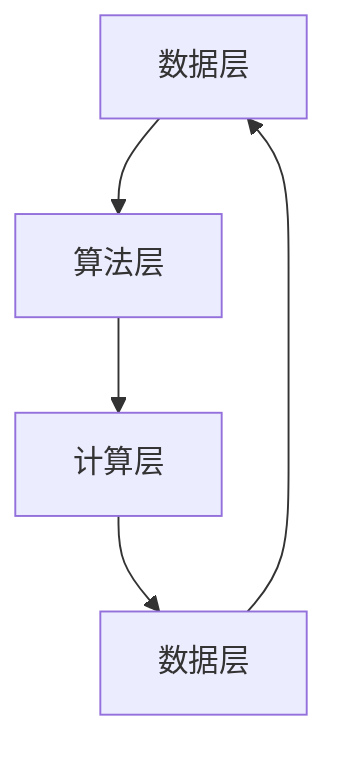
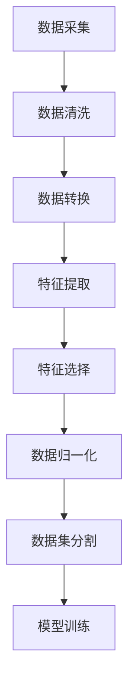
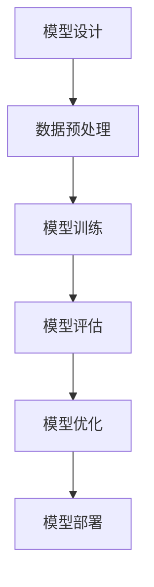

                 

### 文章标题

《AI大模型创业：如何应对未来数据挑战？》

> 关键词：AI大模型、数据挑战、创业机遇、数据管理、模型优化、技术趋势

> 摘要：本文将探讨AI大模型创业过程中面临的数据挑战，分析数据获取、质量管理、隐私保护和实时性要求等关键问题，并提供相应的解决策略。同时，文章将结合实际案例，详细解析AI大模型创业的实践经验，为创业者提供有价值的参考和指导。

### 引言

随着人工智能技术的飞速发展，大模型（Large Models）在各个领域展现出了巨大的潜力和价值。这些大模型，如GPT-3、BERT、ViT等，通过海量数据的学习和训练，具备了强大的表征能力和泛化能力，成为推动科技创新的重要力量。然而，随着模型规模的不断扩大，数据挑战也愈发显著，成为制约AI大模型应用和发展的关键因素。

AI大模型创业面临着一系列数据挑战，如数据获取困难、数据质量参差不齐、数据隐私和安全问题以及数据实时性的要求等。这些问题不仅影响模型的训练效果，还可能引发法律和伦理风险。因此，如何在创业过程中有效应对这些数据挑战，成为每个AI大模型创业团队必须认真思考的问题。

本文旨在通过系统分析和实践总结，为AI大模型创业提供一系列可行的数据管理策略和优化方法。文章将首先介绍AI大模型的基础知识和数据在模型训练中的关键作用，然后深入探讨未来数据挑战的来源和趋势。在后续章节中，我们将详细分析AI大模型的架构和技术，探讨如何应对数据挑战，并结合实际案例分享成功经验和教训。最后，文章将展望AI大模型创业的未来趋势和机遇，为创业者提供持续创新的方向。

通过本文的阅读，读者将能够全面理解AI大模型创业的数据挑战，掌握应对策略，并从中获得宝贵的实践经验和启示。

### 第一部分: 理解AI大模型与数据挑战

#### 第1章: AI大模型的基础知识

##### 1.1 AI大模型的定义与重要性

AI大模型（Large-scale AI Models）是指那些训练数据规模庞大、参数数量众多的模型，它们通常采用深度学习（Deep Learning）技术，通过多层神经网络的复杂结构来捕捉数据的内在规律和结构。AI大模型可以分为两种主要类型：监督学习模型（Supervised Learning Models）和自监督学习模型（Self-supervised Learning Models）。

**监督学习模型**是指模型在训练阶段有明确的目标标签，如分类、回归任务等。常见的监督学习大模型包括GPT-3、BERT和Inception-v3等。这些模型通常在大规模数据集上进行训练，以获得高度的泛化能力。

**自监督学习模型**则是在训练过程中不需要明确的目标标签，而是通过自监督的方式学习数据的结构和特征。BERT和ViT等模型即是自监督学习的代表。自监督学习在大规模数据集上的训练效率更高，可以处理未标注的数据，因此在很多应用场景中具有优势。

AI大模型在现代科技中的重要性不可忽视。首先，它们极大地提高了计算机在处理复杂任务时的能力，如自然语言处理、图像识别和推荐系统等。其次，大模型能够从海量数据中提取出有价值的信息和知识，为各行业提供决策支持和创新动力。此外，AI大模型还推动了计算机视觉、语音识别和机器翻译等领域的突破，使得人机交互更加自然和高效。

在当前的技术背景下，AI大模型的应用范围正在不断扩展。从智能助手、自动驾驶到医疗诊断和金融分析，AI大模型已经渗透到各个领域，成为推动社会进步和产业变革的重要力量。随着技术的不断进步，AI大模型在未来将发挥更为关键的作用，为人类创造更多的价值和可能性。

##### 1.2 数据在AI大模型中的作用

数据是AI大模型的基石，其质量和量直接决定了模型的表现和性能。数据的质量包括数据的准确性、完整性和一致性等方面。高质量的数据可以减少训练过程中的噪声和偏差，提高模型的鲁棒性。例如，在自然语言处理任务中，如果数据集包含大量的错别字或语法错误，模型在处理真实世界中的文本时可能会出现误解或错误。

数据的量对AI大模型的影响同样显著。大模型通常需要大量的训练数据来学习复杂的模式和特征。例如，GPT-3模型使用了数千亿的文本数据来进行训练，这使得模型能够生成更加自然和连贯的文本。相反，如果数据量不足，模型可能无法充分理解数据的复杂性和多样性，导致训练效果不佳。

数据预处理是AI大模型训练过程中的关键步骤。数据预处理包括数据清洗、归一化、特征提取和降维等操作。数据清洗旨在去除数据中的噪声和异常值，保证数据的质量和一致性。例如，在图像识别任务中，可能需要去除图像中的噪声点或阴影，以提高模型的识别精度。

数据归一化是将不同特征的数据转换到相同的尺度，以消除不同特征之间的量纲差异。例如，将图像中的像素值归一化到0到1之间，可以使模型更容易学习各个特征的重要性。

特征提取是提取数据中的关键特征，以减少数据的维度和复杂度。例如，在文本数据中，可以使用词袋模型（Bag-of-Words）或词嵌入（Word Embedding）技术来提取文本的特征表示。

特征选择与降维是为了减少数据的冗余和无关特征，提高模型的训练效率。例如，可以使用主成分分析（PCA）或线性判别分析（LDA）等技术来选择最重要的特征，并降低数据的维度。

数据预处理不仅对模型的训练效果有直接影响，还能提高模型的泛化能力。例如，通过合理的数据预处理，可以减少模型对特定数据集的依赖，使其在新的数据集上也能保持良好的性能。

在AI大模型的训练过程中，数据的质量和量是决定模型表现的关键因素。通过有效的数据预处理，可以提升模型的学习能力和鲁棒性，使其在面对复杂和多样化的数据时能够表现优异。

##### 1.3 未来数据挑战与趋势

随着AI大模型技术的不断发展，数据挑战也在不断演变和升级。未来，AI大模型将面临以下几方面的数据挑战：

**大数据时代的来临**：随着物联网、社交媒体和移动设备的普及，数据量呈现爆炸式增长。这给数据存储、处理和分析带来了巨大的挑战。AI大模型需要处理的数据量将远远超过现有的存储和处理能力，对数据中心的硬件和网络架构提出了更高的要求。

**数据安全与隐私的挑战**：在AI大模型的训练和应用过程中，需要大量敏感数据，如个人身份信息、医疗记录和金融交易数据等。这些数据的泄露和滥用可能导致严重的隐私问题和法律风险。因此，如何确保数据的安全性和隐私性成为AI大模型发展的重要议题。

**数据多样性与实时性的要求**：AI大模型需要从多样化的数据源中提取有用信息，以应对复杂多变的应用场景。例如，在医疗诊断中，需要整合病人的电子健康记录、基因组数据和实时监控数据。此外，实时性也是AI大模型的重要需求之一。例如，自动驾驶系统需要在毫秒级别内处理和响应环境变化，确保行车安全。

**数据治理与管理的复杂性**：随着数据量的增加和数据类型的多样化，数据治理和管理的复杂性也不断提升。如何有效地组织、管理和维护海量数据，使其具备高质量和可操作性，成为AI大模型发展的关键问题。

**新兴数据类型和技术的挑战**：随着AI大模型应用领域的扩展，新的数据类型和技术不断涌现，如图像、视频、语音和传感器数据等。这些数据具有高维度、非结构化等特点，对传统的数据处理方法提出了新的挑战。

总的来说，未来AI大模型将面临更加复杂和多样化的数据挑战。通过技术创新和管理优化，可以逐步解决这些问题，推动AI大模型在各个领域中的深入应用。

### 第二部分: AI大模型的架构与技术

#### 第2章: AI大模型的架构与技术

##### 2.1 AI大模型的架构

AI大模型的架构是构建高性能、可扩展和高效的模型的关键。一般来说，AI大模型的架构可以分为三个主要部分：数据层、算法层和计算层。

**数据层**负责数据的采集、存储和预处理。数据层需要确保数据的高质量和多样性，以满足模型训练的需求。在这一层，常用的技术包括数据集成、数据清洗和特征工程。数据集成通过合并来自不同源的数据，形成一个统一的数据集；数据清洗则去除数据中的噪声和异常值；特征工程通过提取和变换特征，增强模型的学习能力。

**算法层**是AI大模型的核心，负责实现机器学习和深度学习算法。在这一层，常见的算法包括神经网络、增强学习、生成对抗网络（GAN）等。神经网络是目前应用最广泛的算法，它通过多层神经元的组合，学习数据的复杂结构和模式。增强学习通过试错和奖励机制，使模型在动态环境中优化行为；生成对抗网络则通过生成器和判别器的对抗训练，学习数据的生成和分类。

**计算层**负责模型训练和推理的计算任务。大模型通常需要分布式计算和并行计算来提高训练速度和效率。计算层的技术包括分布式训练、模型并行化和推理加速。分布式训练通过将模型拆分为多个部分，在多台机器上进行训练，以加速训练过程；模型并行化通过将模型的不同部分分配到不同的计算单元上，提高计算效率；推理加速则通过优化模型结构和计算流程，提高推理速度。

在AI大模型的架构中，数据层、算法层和计算层相互协作，共同构建一个高效、可扩展的模型体系。数据层提供高质量的数据支持，算法层实现先进的学习算法，计算层提供强大的计算能力，三者的有机结合，使得AI大模型能够应对复杂的应用场景，实现高性能的模型训练和推理。

##### 2.2 机器学习算法与优化

机器学习算法是AI大模型训练的核心，它们通过学习数据中的模式和规律，实现从数据到知识的转化。常见的机器学习算法包括监督学习、无监督学习和强化学习等。

**监督学习算法**是一种最常见的机器学习算法，它通过输入数据及其对应的标签来训练模型。常见的监督学习算法包括线性回归、逻辑回归、决策树、随机森林和神经网络等。线性回归和逻辑回归用于回归和分类任务，通过最小化损失函数来优化模型参数；决策树和随机森林通过构建树模型来分类和回归，具有较高的可解释性；神经网络则通过多层神经元的组合，实现复杂的模式识别。

**无监督学习算法**不依赖于标签数据，通过发现数据中的结构和模式来进行学习。常见的无监督学习算法包括聚类算法、降维算法和生成模型等。聚类算法如K-means和层次聚类，通过将数据分为不同的簇来识别数据中的结构；降维算法如主成分分析（PCA）和t-SNE，通过降低数据的维度来简化数据结构；生成模型如生成对抗网络（GAN），通过生成器和判别器的对抗训练，生成与真实数据相似的新数据。

**强化学习算法**通过试错和奖励机制来学习最优策略。常见的强化学习算法包括Q学习、SARSA和深度强化学习等。Q学习通过估计状态-动作值函数来选择最优动作；SARSA通过更新当前状态和动作的价值来学习策略；深度强化学习结合深度神经网络，实现更复杂的策略学习。

在机器学习算法的基础上，模型优化策略是提高模型性能和效率的重要手段。常见的优化策略包括批量大小调整、学习率调度、正则化和超参数调整等。

**批量大小调整**通过改变训练数据的批量大小，影响模型的收敛速度和泛化能力。小批量训练有助于提高模型的泛化能力，但训练速度较慢；大批量训练可以提高训练速度，但可能增加过拟合的风险。

**学习率调度**通过动态调整学习率，优化模型的训练过程。常见的学习率调度策略包括固定学习率、自适应学习率（如AdaGrad、RMSprop和Adam）和步长调整（如SGD）等。

**正则化**通过引入正则化项，防止模型过拟合。常见的正则化方法包括L1正则化、L2正则化和dropout等。L1正则化通过在损失函数中添加L1范数项，惩罚模型参数的稀疏性；L2正则化通过添加L2范数项，惩罚参数的平方和；dropout通过在训练过程中随机丢弃部分神经元，降低模型的复杂度。

**超参数调整**通过调整模型的超参数，如学习率、批量大小、正则化强度等，优化模型的表现。超参数的调整需要结合实验和经验，通过网格搜索、贝叶斯优化等方法来寻找最佳的超参数配置。

模型优化策略不仅提高了模型在训练数据上的性能，还有助于提高模型的泛化能力。通过合理的优化策略，可以使得模型在新的数据集上也能保持良好的表现，为实际应用提供可靠的解决方案。

##### 2.3 数据处理与特征提取

数据处理与特征提取是AI大模型训练过程中的关键步骤，它们直接影响模型的训练效率和性能。在这一部分，我们将讨论数据清洗、数据归一化、特征提取技术和特征选择与降维方法。

**数据清洗**是数据处理的第一步，旨在去除数据中的噪声、异常值和冗余信息，提高数据的质量和一致性。数据清洗通常包括以下几种操作：

1. **缺失值处理**：通过填充、删除或插值等方法处理缺失数据。例如，可以使用平均值、中值或插值法来填充缺失的数值数据；对于分类数据，可以使用众数或大多数类别来填充。
   
2. **异常值处理**：通过识别和去除异常值，减少数据中的噪声。常见的异常值处理方法包括标准差法、箱线图法和孤立森林法等。

3. **重复数据去除**：通过识别和删除重复的数据记录，减少数据的冗余。

4. **数据格式转换**：将不同格式的数据统一转换为统一的格式，以便后续处理。

**数据归一化**是将不同特征的数据转换到相同的尺度，消除特征之间的量纲差异，使模型更容易学习各个特征的重要性。常见的归一化方法包括：

1. **最小-最大归一化**：将数据缩放到[0, 1]之间，通过以下公式实现：

   $$
   x_{\text{norm}} = \frac{x - x_{\text{min}}}{x_{\text{max}} - x_{\text{min}}}
   $$

   其中，$x$为原始数据，$x_{\text{min}}$和$x_{\text{max}}$分别为数据的最小值和最大值。

2. **标准化**：将数据缩放到均值为0、标准差为1的范围内，通过以下公式实现：

   $$
   x_{\text{norm}} = \frac{x - \mu}{\sigma}
   $$

   其中，$\mu$为均值，$\sigma$为标准差。

**特征提取**是从原始数据中提取出有用的信息，以减少数据的维度和复杂度，同时提高模型的学习能力。常见的特征提取技术包括：

1. **词袋模型（Bag-of-Words）**：将文本数据转换为词频向量，通过统计每个单词在文档中出现的次数来表示文本。

2. **词嵌入（Word Embedding）**：将单词映射到高维向量空间，通过学习单词的上下文信息来表示文本。常见的词嵌入方法包括Word2Vec、GloVe和BERT等。

3. **图像特征提取**：通过卷积神经网络（CNN）从图像中提取特征，如边缘、纹理和形状等。

4. **时间序列特征提取**：通过转换或提取时间序列数据中的周期性、趋势性和季节性特征。

**特征选择与降维**是在特征提取后，通过选择最重要的特征和减少无关特征的数量，以提高模型的训练效率和性能。常见的特征选择与降维方法包括：

1. **过滤式特征选择**：通过计算特征与目标变量之间的相关性，选择相关性较高的特征。

2. **包装式特征选择**：通过模型训练和评估，逐个选择或删除特征，优化模型的表现。

3. **嵌入式特征选择**：在模型训练过程中，自动选择重要的特征，如LASSO回归和随机森林等。

4. **降维技术**：通过主成分分析（PCA）、线性判别分析（LDA）和自编码器（Autoencoder）等方法，降低数据的维度。

通过有效的数据处理与特征提取，可以减少数据的冗余和噪声，提高模型的学习能力，为AI大模型的训练和应用提供坚实的基础。

#### 第3章: 数据挑战下的AI大模型创业

##### 3.1 AI大模型创业的机遇

AI大模型创业正处于一个充满机遇的时代。随着技术的进步和市场需求的增加，AI大模型在各行各业中展现出强大的潜力和广泛的应用前景。以下将分析当前AI大模型创业的主要机遇：

**市场需求的迅速增长**：AI大模型在自然语言处理、图像识别、推荐系统、智能医疗、金融分析等多个领域都表现出极高的应用价值。随着这些领域的不断扩展，市场需求迅速增长，为AI大模型创业提供了广阔的市场空间。例如，自然语言处理在客服、翻译和内容生成等领域的应用越来越普及，使得相关创业公司有机会获得大量用户和市场份额。

**技术创新的不断突破**：AI大模型的训练算法和架构不断优化，如Transformer、BERT、GPT等模型的出现，使得模型在性能和效果上有了显著提升。这些技术创新不仅提高了AI大模型的应用能力，也为创业者提供了更多的技术选择和优化空间。例如，通过结合最新的深度学习算法和模型架构，创业公司可以在特定领域实现性能突破，从而在激烈的市场竞争中脱颖而出。

**数据资源的日益丰富**：随着互联网和物联网的发展，数据资源越来越丰富，为AI大模型的训练和应用提供了充足的数据支持。无论是结构化数据还是非结构化数据，都为AI大模型提供了丰富的学习材料。创业者可以通过获取和整合多种类型的数据，提升模型的训练效果和应用价值。例如，在医疗领域，通过整合电子健康记录、基因组数据和实时监控数据，可以构建出更为精准的疾病预测模型。

**政策支持与产业生态的完善**：各国政府对人工智能的重视和支持不断加强，出台了一系列政策和措施，鼓励AI产业的发展。同时，AI产业生态也在逐步完善，包括技术社区、创业孵化器、投资机构等，为AI大模型创业提供了全方位的支持和资源。例如，许多国家和地区设立了AI创新基金和孵化器，为初创公司提供资金、技术和管理支持。

**跨界融合的广阔前景**：AI大模型与其他行业的深度融合，为创业者提供了丰富的跨界创新机会。例如，在智能制造领域，AI大模型可以通过图像识别和预测分析技术，优化生产流程和提高产品质量；在金融领域，AI大模型可以通过智能风控和精准营销，提升金融服务水平。这些跨界融合的应用场景，不仅拓宽了AI大模型的应用范围，也为创业者提供了更多的发展空间。

综上所述，AI大模型创业面临着前所未有的机遇。创业者可以通过抓住市场需求、技术创新、数据资源、政策支持和跨界融合等机遇，实现商业价值的最大化，推动AI大模型的广泛应用和发展。

##### 3.2 数据挑战应对策略

在AI大模型创业过程中，数据挑战是不可避免的，这些挑战包括数据获取困难、数据质量参差不齐、数据隐私和安全问题以及数据实时性的要求。为了有效应对这些挑战，创业者需要采取一系列数据管理策略和优化方法。

**数据获取与集成**

数据获取是AI大模型训练的首要任务。然而，数据获取过程往往面临以下问题：数据分散在不同来源，数据格式多样，数据获取成本高昂。为了解决这些问题，创业者可以采取以下策略：

1. **数据爬取与采集**：利用网络爬虫和API接口等技术，从互联网上获取开放数据集或特定领域的数据。例如，利用Web爬虫可以获取网页内容、社交媒体数据等；利用API接口可以获取公共数据库、公司数据等。

2. **数据共享与交换**：通过建立数据共享平台和协议，促进不同组织之间的数据交换和合作。例如，通过数据联盟和数据共享协议，各组织可以共享数据资源，共同推动AI大模型的发展。

3. **数据集成技术**：利用数据集成技术，将来自不同源、不同格式的数据整合为一个统一的数据集。常用的数据集成技术包括ETL（提取、转换、加载）和数据湖等。ETL技术通过将数据从不同源提取出来，进行清洗、转换和加载，形成一个统一的数据仓库；数据湖则通过存储原始数据，支持实时数据处理和分析。

**数据质量管理**

数据质量对AI大模型的表现至关重要。创业者需要确保数据的高质量，避免数据中的噪声和异常值影响模型训练。以下策略可以帮助提高数据质量：

1. **数据清洗**：通过数据清洗技术，去除数据中的噪声、异常值和冗余信息。常用的清洗方法包括缺失值处理、异常值检测和去重等。

2. **数据验证**：通过数据验证技术，确保数据的准确性和一致性。例如，可以使用数据校验规则、交叉验证等方法来验证数据的质量。

3. **数据质量监控**：建立数据质量监控系统，实时监测数据的异常情况。例如，通过数据质量报告、异常值报警等技术，及时发现和处理数据问题。

**数据安全与隐私保护**

在AI大模型训练和应用过程中，数据安全和隐私保护是至关重要的。创业者需要采取一系列措施来确保数据的安全和隐私。以下策略可以提供有效的数据安全保护：

1. **数据加密**：通过数据加密技术，将数据在传输和存储过程中进行加密，防止数据泄露和篡改。常用的加密算法包括AES、RSA等。

2. **访问控制**：通过访问控制技术，限制对数据的访问权限，确保只有授权人员才能访问和操作敏感数据。

3. **隐私保护机制**：采用隐私保护机制，如差分隐私、同态加密和联邦学习等，保护用户隐私。例如，差分隐私技术可以通过在数据中加入噪声，保护个体数据的隐私；同态加密技术允许在加密数据上进行计算，确保数据隐私。

4. **合规性检查**：确保数据处理的合规性，遵守相关法律法规和标准，如GDPR、CCPA等。

**数据实时性要求**

随着应用场景的多样化，AI大模型对数据的实时性要求越来越高。例如，在自动驾驶、实时语音识别和金融风控等领域，需要及时获取和处理最新的数据。以下策略可以帮助满足数据实时性要求：

1. **实时数据处理框架**：采用实时数据处理框架，如Apache Kafka、Apache Flink等，实现数据的实时采集、处理和存储。

2. **流数据处理技术**：利用流数据处理技术，如Apache Storm、Apache Spark Streaming等，处理和分析实时数据流。

3. **边缘计算**：通过边缘计算，将部分数据处理任务转移到边缘设备上，降低中心服务器的负载，提高数据处理速度。

通过以上数据管理策略和优化方法，创业者可以有效应对AI大模型创业中的数据挑战，确保数据的质量和安全，提高模型的训练效率和性能，为AI大模型的广泛应用提供坚实的基础。

##### 3.3 成功案例与经验分享

在AI大模型创业领域，成功案例不断涌现，这些案例为我们提供了宝贵的经验和教训。以下将分享几个典型的成功案例，分析其中的关键经验和教训。

**案例一：OpenAI的GPT-3模型**

OpenAI是一家总部位于美国的人工智能研究公司，其推出的GPT-3（Generative Pre-trained Transformer 3）模型成为AI领域的里程碑。GPT-3模型具有1750亿参数，使用了大量文本数据进行训练，展示了惊人的文本生成和自然语言理解能力。以下是GPT-3模型的成功经验和教训：

**经验**：

1. **大规模数据集**：OpenAI使用了数千亿的文本数据进行模型训练，确保模型能够学习到丰富的语言特征。这表明，大规模数据集是构建高性能AI模型的关键。

2. **先进的架构**：GPT-3采用了Transformer架构，这种架构在处理长文本和复杂关系时表现出色。选择合适的模型架构对于提升模型性能至关重要。

3. **多团队协作**：OpenAI集结了众多顶尖的AI研究人员和工程师，通过多团队协作，实现了模型的创新和优化。

**教训**：

1. **数据隐私与安全**：在模型训练过程中，OpenAI面临了数据隐私和安全方面的挑战。尽管采取了多种措施保护数据隐私，但仍需持续关注和优化数据安全策略。

2. **计算资源需求**：GPT-3模型的训练需要巨大的计算资源和时间，这对创业公司的资源管理和规划提出了高要求。需要提前做好计算资源的需求预估和调配。

**案例二：Salesforce的Elasticsearch应用**

Salesforce是一家全球领先的客户关系管理（CRM）解决方案提供商，其Elasticsearch应用利用AI大模型技术，实现了高效的客户数据分析和洞察。以下是Elasticsearch应用的成功经验和教训：

**经验**：

1. **市场需求驱动**：Salesforce的Elasticsearch应用紧密结合市场需求，通过AI大模型技术提供了强大的客户数据分析功能，帮助客户更好地理解和满足客户需求。

2. **高效的数据处理**：Elasticsearch应用采用了分布式计算和数据压缩技术，确保了数据处理的实时性和高效性，为用户提供了快速和准确的查询结果。

3. **用户体验优先**：Salesforce注重用户体验，通过直观的界面和流畅的操作，提高了用户的使用满意度。

**教训**：

1. **系统可扩展性**：在用户规模迅速扩大时，Salesforce需要确保系统的可扩展性和稳定性，避免因扩展不足导致性能下降。

2. **数据一致性**：在多源数据集成和更新时，确保数据的一致性是确保应用稳定性的关键。Salesforce需要建立完善的数据同步和冲突解决机制。

**案例三：DeepMind的AlphaGo**

DeepMind是一家英国的人工智能公司，其研发的AlphaGo在围棋领域取得了重大突破。AlphaGo的成功经验和教训如下：

**经验**：

1. **创新算法**：DeepMind采用了深度学习和强化学习相结合的方法，设计了高效的搜索算法，使AlphaGo在复杂决策中表现出色。

2. **持续优化**：DeepMind通过不断优化算法和模型，提升了AlphaGo的棋力。这表明，持续的技术创新和优化是保持竞争优势的关键。

3. **跨界合作**：DeepMind与围棋界合作，将AI技术应用于围棋教学和比赛，推动了围棋的数字化和智能化发展。

**教训**：

1. **模型泛化能力**：AlphaGo在特定领域的成功并不代表其泛化能力强大。DeepMind需要继续探索如何将AI技术应用于更多领域，提升模型的泛化能力。

2. **伦理和社会影响**：随着AI技术的广泛应用，DeepMind需要关注技术对社会和伦理的影响，确保AI技术的发展符合社会价值观和法律法规。

通过以上成功案例和经验分享，创业者可以借鉴其中的有效策略和教训，在AI大模型创业过程中实现成功。同时，需要不断调整和优化数据管理策略，确保数据质量和模型性能，以应对不断变化的市场和技术环境。

### 第三部分: AI大模型创业实践

#### 第4章: AI大模型创业环境搭建

##### 4.1 创业团队组建

创业团队的组建是AI大模型创业的第一步，一个高效的团队能够显著提高项目的成功概率。组建一个成功的AI大模型创业团队，需要考虑以下几个关键因素：

**成员角色与职责**

在AI大模型创业团队中，通常包括以下几种关键角色：

1. **创始人**：创始人负责制定项目愿景、战略规划和团队管理。创始人需要具备领导力和决策能力，确保团队朝着共同的目标前进。

2. **数据科学家**：数据科学家负责数据预处理、模型训练和优化等工作，他们需要具备深厚的机器学习和深度学习知识，能够设计和实现高效的算法。

3. **软件工程师**：软件工程师负责开发和维护系统架构、后端服务和部署环境。他们需要具备扎实的编程能力和系统设计经验，确保系统的稳定性和扩展性。

4. **产品经理**：产品经理负责产品规划和用户体验设计，他们需要与用户和团队密切合作，确保产品的市场适应性和用户满意度。

5. **市场运营人员**：市场运营人员负责市场推广、用户获取和销售转化等工作，他们需要具备市场洞察力和推广策略。

**团队协作工具与环境搭建**

为了确保团队高效协作，选择合适的协作工具和环境至关重要。以下是一些常用的团队协作工具和环境：

1. **版本控制系统**：如Git，用于代码的版本管理和协同开发。团队成员可以通过Git进行代码提交、分支管理和合并操作，确保代码的一致性和可追溯性。

2. **项目管理工具**：如JIRA、Trello等，用于任务分配、进度跟踪和项目管理。这些工具可以帮助团队明确任务目标、监控项目进度和及时调整计划。

3. **文档管理工具**：如Confluence、Notion等，用于团队文档的存储、共享和协作。团队成员可以在此平台上创建、编辑和分享文档，确保信息的透明和共享。

4. **开发环境**：如Docker、Kubernetes等，用于创建和部署容器化环境，确保开发、测试和生产环境的一致性。容器化技术可以提高系统的可移植性和可扩展性。

5. **协作会议工具**：如Zoom、Microsoft Teams等，用于线上会议和沟通。通过这些工具，团队成员可以实时交流、讨论和协作，提高工作效率。

**团队文化建设**

团队文化建设是确保团队长期稳定和高效运作的重要因素。以下是一些团队文化建设的关键点：

1. **共同愿景和目标**：团队需要明确共同的目标和愿景，确保团队成员朝着同一方向努力。这可以通过定期的团队会议和目标设定来实现。

2. **开放沟通和反馈**：鼓励团队成员之间的开放沟通和反馈，确保问题能够及时发现和解决。定期进行团队建设活动和培训，提高团队凝聚力和沟通能力。

3. **积极心态和持续学习**：保持积极心态，鼓励团队成员面对挑战和困难时保持乐观和进取。同时，强调持续学习和知识共享，确保团队始终保持技术领先和创新能力。

通过以上措施，创业团队可以建立高效、协作和稳定的团队环境，为AI大模型创业项目的成功奠定基础。

##### 4.2 技术栈与工具选择

在选择技术栈与工具时，AI大模型创业团队需要综合考虑开发效率、系统性能、可扩展性和维护成本等因素。以下是一些主流的技术栈与工具推荐，以及各自的优缺点和适用场景。

**开发环境搭建**

1. **Docker与Kubernetes**：Docker是一种容器化技术，通过将应用及其依赖环境打包成一个独立的容器，确保在不同环境中的一致性和可移植性。Kubernetes是一个开源的容器编排平台，用于管理容器的部署、扩展和自动化。优点包括环境一致性、可移植性和高效性。缺点是学习曲线较陡，需要一定的技术积累。适用于需要高扩展性和高可靠性的大型项目。

2. **Jupyter Notebook与Google Colab**：Jupyter Notebook是一个交互式的计算环境，支持多种编程语言和可视化工具，非常适合数据分析和机器学习实验。Google Colab是基于Jupyter Notebook的云端平台，提供免费的GPU和TPU资源，特别适合深度学习项目。优点包括交互性、易用性和丰富的生态系统。缺点是运行时间较长，不适合生产环境。适用于数据探索、原型开发和实验验证。

**主流框架和库的选择**

1. **TensorFlow与PyTorch**：TensorFlow和PyTorch是目前最流行的深度学习框架。TensorFlow由Google开发，具有丰富的API和工具，支持多种操作系统和硬件平台。PyTorch由Facebook开发，以动态图（Dynamic Graph）为核心，具有更好的灵活性和易用性。优点包括社区活跃、功能丰富和强大的扩展性。缺点是TensorFlow的配置和部署相对复杂，PyTorch的学习曲线较陡。适用于复杂模型开发和大规模生产环境。

2. **Scikit-learn与XGBoost**：Scikit-learn是一个用于机器学习的Python库，提供了多种经典的机器学习算法和工具。XGBoost是一种高效的梯度提升树（Gradient Boosting Tree）算法库，在分类和回归任务中表现优异。优点包括简洁易用、高效和可扩展。缺点是Scikit-learn的功能相对有限，XGBoost对硬件资源要求较高。适用于快速原型开发和中小型项目。

**开发工具与平台**

1. **Visual Studio Code与PyCharm**：Visual Studio Code（VS Code）和PyCharm是两款流行的集成开发环境（IDE），支持Python和多种编程语言。VS Code具有轻量级、开源和丰富的插件生态系统，适用于各种开发场景。PyCharm具有强大的代码编辑功能、调试器和集成工具，特别适合大型项目和团队合作。优点包括代码编辑功能强大、调试器和集成工具齐全。缺点是PyCharm的免费版功能有限，收费较高。适用于Python开发、大型项目和团队合作。

2. **Jenkins与GitLab CI/CD**：Jenkins是一个开源的持续集成和持续交付（CI/CD）工具，支持多种编程语言和平台。GitLab CI/CD是GitLab集成的一部分，提供内置的CI/CD功能。优点包括自动化程度高、支持多种平台和强大的社区支持。缺点是配置相对复杂，需要一定的技术积累。适用于自动化测试、持续集成和持续交付。

**技术栈与工具选择需要根据项目的具体需求和团队的技术背景进行权衡。通过合理选择和配置技术栈与工具，可以提升开发效率、保证系统性能和降低维护成本，为AI大模型创业项目的成功提供有力支持。**

##### 4.3 项目管理与规划

在AI大模型创业项目中，项目管理和规划是确保项目顺利进行和按时完成的关键环节。以下是一些关键步骤和策略，帮助团队有效地管理和规划项目。

**项目目标设定**

项目目标设定是项目管理的第一步。明确的项目目标是团队努力的方向和衡量项目成功与否的标准。设定项目目标时，需要考虑以下几个方面：

1. **明确性**：目标应具体、明确，避免模糊和含糊其辞。例如，目标不应是“提高模型性能”，而应是“将模型性能提高10%”。

2. **可行性**：目标应具备可行性，即通过合理的资源和努力可以实现。过于理想化的目标可能导致项目延期或失败。

3. **重要性**：目标应具有优先级，即明确哪些目标是当前阶段最重要的。这有助于团队集中精力和资源，确保关键目标的实现。

4. **可衡量性**：目标应具有可衡量的指标，以便评估目标的实现程度。例如，通过准确率、召回率等指标来衡量模型性能。

**进度监控与调整**

项目进度监控是确保项目按计划进行的重要手段。以下是一些监控和调整进度的策略：

1. **定期检查**：定期召开项目进度会议，团队成员汇报各自的进展和遇到的问题。这有助于及时发现和解决潜在的问题。

2. **使用工具**：利用项目管理工具，如JIRA、Trello等，跟踪任务进度和项目里程碑。这些工具可以帮助团队实时了解项目的状态，确保任务按时完成。

3. **风险管理**：在项目过程中，可能遇到各种风险，如技术难题、资源不足等。需要提前识别和评估风险，并制定相应的应对策略，以减少风险对项目进度的影响。

4. **及时调整**：根据实际情况，及时调整项目计划和资源分配。如果项目进度落后，需要采取补救措施，如增加资源、调整任务优先级等。

**风险管理**

风险管理是项目管理的重要部分，旨在识别、评估和应对项目中的风险。以下是一些风险管理策略：

1. **风险识别**：通过团队讨论、文献调研和专家咨询等方式，识别项目中可能遇到的风险。例如，技术风险、市场风险、法律风险等。

2. **风险评估**：对识别出的风险进行评估，确定其可能性和影响。可以通过风险矩阵等方法，对风险进行分类和优先级排序。

3. **风险应对**：根据风险评估结果，制定相应的应对策略。常见的应对策略包括风险规避、风险转移、风险缓解等。

4. **持续监控**：项目进行过程中，持续监控风险的变化和新的风险出现。及时调整风险应对策略，确保项目的顺利进行。

通过以上项目管理和规划策略，团队可以确保AI大模型创业项目有条不紊地进行，提高项目成功率，实现商业目标。

#### 第5章: AI大模型开发流程

##### 5.1 数据采集与预处理

数据采集与预处理是AI大模型开发流程中的关键步骤，直接影响模型的性能和应用效果。以下将详细讨论数据采集、采集策略和预处理流程。

**数据采集**

数据采集是AI大模型开发的基础，其质量直接影响模型的表现。数据采集可以从以下几种方式入手：

1. **公开数据集**：许多领域都有公开的数据集，如ImageNet、CIFAR-10等，这些数据集经过严格的清洗和标注，为AI模型训练提供了宝贵资源。创业者可以优先考虑使用这些公开数据集，以节省时间和成本。

2. **定制数据集**：对于特定应用场景，可能需要定制自己的数据集。这通常需要从实际应用场景中获取数据，并进行标注和清洗。例如，在医疗领域，可能需要获取病人的电子健康记录、医疗影像和基因组数据等。

3. **数据爬取**：利用网络爬虫技术，从互联网上获取开放数据。例如，从社交媒体、新闻网站和论坛等获取文本数据，从电商网站获取商品数据等。

4. **物联网设备**：通过物联网设备，实时采集各种环境数据，如温度、湿度、光照强度等。这些数据可以用于智能监控、环境预测等应用。

**采集策略**

在数据采集过程中，需要制定合适的采集策略，以确保数据的质量和完整性。以下是一些常用的采集策略：

1. **分层采集**：根据数据的重要性和采集难度，采用分层采集策略。例如，首先采集最关键和最容易获取的数据，然后逐步扩展到其他数据。

2. **多源采集**：从多个数据源进行采集，以确保数据的多样性和全面性。例如，结合公开数据集和定制数据集，从不同角度获取信息。

3. **自动化采集**：利用自动化工具，如爬虫、传感器和物联网设备等，实现数据的自动采集和更新。这可以大幅提高采集效率，减少人工干预。

4. **数据清洗**：在采集数据的同时，进行初步的数据清洗，去除噪声和异常值。这可以减少后续处理的工作量，提高数据处理效率。

**预处理流程**

数据预处理是数据采集后的关键步骤，旨在提高数据的质量和可用性。以下是一些常见的预处理流程：

1. **数据清洗**：去除数据中的噪声、异常值和重复记录。对于数值数据，可以使用平均值、中值或插值法填充缺失值；对于分类数据，可以使用众数或大多数类别来填充。

2. **数据转换**：将不同类型和格式的数据转换为统一的格式。例如，将图像数据转换为像素矩阵，将文本数据转换为词向量。

3. **数据归一化**：将不同特征的数据缩放到相同的尺度，消除特征之间的量纲差异。常用的归一化方法包括最小-最大归一化和标准化。

4. **特征提取**：从原始数据中提取出有用的特征，减少数据的维度和复杂度。例如，使用词袋模型或词嵌入技术提取文本特征，使用卷积神经网络提取图像特征。

5. **特征选择**：通过选择最重要的特征，提高模型的学习效率和泛化能力。常用的特征选择方法包括过滤式特征选择、包装式特征选择和嵌入式特征选择。

6. **数据分割**：将数据集划分为训练集、验证集和测试集，用于模型的训练、验证和测试。这有助于评估模型的表现和性能。

通过以上数据采集与预处理流程，创业者可以确保数据的质量和一致性，为AI大模型的训练和应用提供坚实的基础。数据预处理不仅提高了模型的学习效果，还减少了过拟合和泛化能力下降的风险，从而实现更好的模型性能和应用价值。

##### 5.2 模型设计与训练

在AI大模型开发过程中，模型设计与训练是关键环节，直接影响模型的性能和应用效果。以下将详细讨论模型设计、训练策略和评估方法。

**模型设计**

模型设计是AI大模型开发的基础，包括选择合适的模型架构、确定模型的层次结构、设置参数和超参数等。以下是一些关键步骤：

1. **选择模型架构**：根据应用需求和数据特性，选择合适的模型架构。常见的模型架构包括神经网络、卷积神经网络（CNN）、循环神经网络（RNN）和Transformer等。神经网络适用于回归和分类任务，CNN适用于图像识别任务，RNN适用于序列数据处理，Transformer适用于自然语言处理任务。

2. **确定模型层次**：根据数据复杂性和模型性能要求，确定模型的层次结构。例如，对于图像识别任务，可以采用卷积神经网络，包括卷积层、池化层和全连接层；对于自然语言处理任务，可以采用Transformer模型，包括编码器和解码器。

3. **设置参数和超参数**：参数是模型在训练过程中自动调整的变量，如权重和偏置；超参数是预先设定的模型配置，如学习率、批量大小和正则化强度等。合理设置参数和超参数是提高模型性能的关键。

**训练策略**

在模型训练过程中，需要采取一系列策略来优化训练过程，提高模型性能。以下是一些常用的训练策略：

1. **批量大小调整**：批量大小影响模型的收敛速度和泛化能力。小批量训练可以提高模型的泛化能力，但训练速度较慢；大批量训练可以提高训练速度，但可能增加过拟合的风险。需要根据数据规模和计算资源，选择合适的批量大小。

2. **学习率调度**：学习率是模型在训练过程中用于更新参数的步长。动态调整学习率可以优化训练过程。常用的学习率调度策略包括固定学习率、自适应学习率和步长调整等。

3. **正则化**：正则化通过在损失函数中添加正则化项，防止模型过拟合。常用的正则化方法包括L1正则化、L2正则化和dropout等。

4. **数据增强**：通过数据增强技术，增加训练数据集的多样性，提高模型的泛化能力。常见的数据增强方法包括旋转、翻转、裁剪、缩放等。

5. **迁移学习**：利用预训练模型（Pre-trained Model），通过迁移学习技术，提高新任务的性能。预训练模型已经在大规模数据集上进行了训练，可以迁移到新任务上，减少训练时间和资源需求。

**评估方法**

模型评估是衡量模型性能的重要手段。以下是一些常用的评估方法：

1. **准确率（Accuracy）**：准确率是分类模型最基本的评估指标，表示模型正确分类的样本数占总样本数的比例。

2. **召回率（Recall）**：召回率表示模型正确分类为正类的样本数占总正类样本数的比例，用于评估模型对正类样本的检测能力。

3. **F1分数（F1 Score）**：F1分数是准确率和召回率的调和平均，用于综合评估模型的分类性能。

4. **ROC曲线与AUC值**：ROC曲线（Receiver Operating Characteristic Curve）用于评估二分类模型的分类性能，AUC值（Area Under Curve）表示ROC曲线下的面积，用于衡量模型的泛化能力。

5. **交叉验证（Cross Validation）**：通过交叉验证，将数据集划分为多个子集，用于模型的训练和验证，提高评估结果的可靠性。

通过合理的模型设计、训练策略和评估方法，创业者可以构建出高性能、可靠的AI大模型，为实际应用提供有效的解决方案。

##### 5.3 模型部署与监控

在AI大模型开发过程中，模型部署与监控是确保模型稳定运行和性能优化的关键环节。以下将详细讨论模型部署策略、监控方法和性能优化。

**模型部署策略**

模型部署是将训练好的模型应用到实际生产环境中的过程。以下是一些常用的模型部署策略：

1. **静态部署**：静态部署是将训练好的模型文件直接部署到服务器上，通过API接口提供服务。优点是部署简单、成本低；缺点是扩展性差，无法动态调整模型参数。

2. **动态部署**：动态部署是将模型训练和部署分离，通过远程调用模型服务。优点是扩展性强、可动态调整参数；缺点是部署复杂、成本较高。

3. **边缘计算部署**：边缘计算部署是将模型部署到边缘设备上，如智能传感器、路由器等，以减少数据传输延迟和计算负载。优点是实时性强、响应速度快；缺点是计算资源有限，适用场景有限。

4. **容器化部署**：容器化部署是将模型打包成容器（如Docker），确保在不同环境中的一致性和可移植性。优点是部署灵活、可扩展性强；缺点是配置复杂、需要一定的技术积累。

**监控方法**

模型监控是确保模型稳定运行和性能优化的关键。以下是一些常用的监控方法：

1. **性能监控**：通过监控模型的运行时间、内存使用率、CPU利用率等性能指标，评估模型的性能。常用的工具包括Prometheus、Grafana等。

2. **错误率监控**：通过监控模型的错误率、异常情况等指标，及时发现和处理模型运行中的问题。

3. **日志监控**：通过记录模型运行的日志信息，分析模型的运行状态和性能问题。常用的工具包括ELK（Elasticsearch、Logstash、Kibana）等。

4. **告警机制**：通过设置告警规则，当模型性能或运行状态异常时，自动发送告警通知，确保及时发现问题。

**性能优化**

模型性能优化是提高模型应用效果的重要手段。以下是一些常见的性能优化方法：

1. **模型压缩**：通过模型压缩技术，减少模型的参数数量和计算复杂度，提高模型的运行效率。常用的模型压缩方法包括剪枝（Pruning）、量化（Quantization）、蒸馏（Distillation）等。

2. **模型加速**：通过模型加速技术，提高模型的推理速度和效率。常用的模型加速方法包括GPU加速、Tuning、模型并行化等。

3. **数据优化**：通过优化数据集和预处理过程，提高模型的学习效率和性能。常用的数据优化方法包括数据增强、数据归一化、特征选择等。

4. **架构优化**：通过优化模型架构和设计，提高模型的性能和可扩展性。常用的架构优化方法包括神经网络架构搜索（Neural Architecture Search，NAS）、模型剪枝（Model Pruning）等。

通过合理的模型部署策略、监控方法和性能优化，创业者可以确保AI大模型在实际生产环境中的稳定运行和高效性能，为实际应用提供可靠的支持。

#### 第6章: 数据挑战下的AI大模型优化

##### 6.1 模型压缩与加速

在AI大模型创业过程中，模型压缩与加速是提高模型性能和降低计算成本的关键技术。随着模型规模的不断扩大，如何有效压缩模型参数和优化计算流程成为关键问题。以下将介绍几种常见的模型压缩和加速技术。

**模型压缩技术**

模型压缩旨在减少模型的参数数量和计算复杂度，从而提高模型的运行效率和存储空间利用率。以下是一些常见的模型压缩技术：

1. **剪枝（Pruning）**：剪枝通过删除模型中的冗余参数，降低模型的计算复杂度。剪枝可以分为结构剪枝和权重剪枝。结构剪枝直接删除部分网络层或神经元；权重剪枝则通过设定阈值，删除权重较小的参数。

   剪枝算法伪代码：
   ```python
   def pruning(model, threshold):
       for layer in model.layers:
           for weight in layer.weights:
               if np.linalg.norm(weight) < threshold:
                   weight[weight < 0] = 0
                   weight[weight > 0] = 0
   ```

2. **量化（Quantization）**：量化通过将模型的浮点参数转换为低精度的整数参数，减少模型的存储空间和计算资源。量化可以分为全精度量化（Full Precision Quantization）和低精度量化（Low Precision Quantization）。全精度量化保持原始精度，低精度量化则降低参数精度。

   量化算法伪代码：
   ```python
   def quantization(model, precision):
       for layer in model.layers:
           for weight in layer.weights:
               weight = np.round(weight * precision) / precision
   ```

3. **蒸馏（Distillation）**：蒸馏通过将大型教师模型的知识迁移到小型学生模型中，降低学生模型的参数数量和计算复杂度。蒸馏分为软蒸馏和硬蒸馏。软蒸馏使用教师模型的概率分布作为目标分布；硬蒸馏则使用教师模型的输出作为目标输出。

   蒸馏算法伪代码：
   ```python
   def distillation(student_model, teacher_model, alpha):
       for x, y in data_loader:
           student_output = student_model(x)
           teacher_output = teacher_model(x)
           loss = alpha * F.softmax_cross_entropy_with_logits(student_output, teacher_output)
           optimizer.zero_grad()
           loss.backward()
           optimizer.step()
   ```

**模型推理加速策略**

模型推理加速是提高模型在实际应用中的运行速度和效率的关键。以下是一些常见的模型推理加速策略：

1. **GPU加速**：GPU（Graphics Processing Unit）具有高并行计算能力，适用于深度学习模型的推理加速。通过将模型部署到GPU上，可以显著提高推理速度。

2. **Tuning**：Tuning通过调整模型的参数和超参数，优化模型的推理速度。常用的Tuning方法包括模型调优（Model Tuning）、学习率调优（Learning Rate Tuning）和超参数调优（Hyperparameter Tuning）。

3. **模型并行化**：模型并行化通过将模型拆分为多个部分，在多台机器上进行推理，提高模型的处理速度。常见的模型并行化技术包括数据并行化、模型并行化和流水线并行化。

4. **分布式训练**：分布式训练通过将模型拆分为多个部分，在多台机器上进行训练，提高模型的训练速度。分布式训练结合了模型并行化和数据并行化，适用于大规模模型训练。

通过模型压缩和推理加速技术，AI大模型创业团队可以在保证模型性能的前提下，提高模型的应用效率和扩展性，为实际应用提供高效、可靠的解决方案。

##### 6.2 实时数据处理

实时数据处理是AI大模型在动态环境中应用的重要需求，尤其在自动驾驶、金融交易和实时监控等领域，需要及时处理和分析不断变化的数据流。以下将讨论实时数据处理框架、数据流处理技术和数据处理策略。

**实时数据处理框架**

实时数据处理框架是支持数据流高效处理和实时分析的基础架构。以下是一些常用的实时数据处理框架：

1. **Apache Kafka**：Apache Kafka是一种分布式流处理平台，用于处理大规模数据流。Kafka支持高吞吐量、低延迟的数据处理，适用于实时数据采集、传输和分析。

2. **Apache Flink**：Apache Flink是一个开源的流处理框架，支持有界和无界数据流的实时处理。Flink提供了丰富的API和工具，支持批处理和流处理的统一处理模型。

3. **Apache Storm**：Apache Storm是一个分布式实时计算系统，用于处理大规模实时数据流。Storm支持高可靠性、低延迟的实时计算，适用于实时分析、机器学习和推荐系统。

**数据流处理技术**

数据流处理技术是实时数据处理的核心，以下是一些常见的数据流处理技术：

1. **流处理引擎**：流处理引擎负责处理和转换实时数据流。常见的流处理引擎包括Apache Flink、Apache Storm和Apache Spark Streaming。

2. **事件驱动架构**：事件驱动架构（Event-Driven Architecture，EDA）通过事件触发数据处理，支持实时响应和低延迟处理。EDA适用于需要实时决策和响应的应用场景。

3. **增量计算**：增量计算通过处理数据的增量变化，提高实时数据处理效率。增量计算适用于数据更新频繁的场景，如金融交易、实时监控等。

4. **流数据存储**：流数据存储用于存储和处理实时数据流。常见的流数据存储系统包括Apache Kafka、Apache Flink和Apache Spark Streaming。

**数据处理策略**

为了确保实时数据处理的效率和准确性，以下是一些数据处理策略：

1. **数据压缩**：通过数据压缩技术，减少数据传输和存储的带宽需求。常用的数据压缩方法包括无损压缩和有损压缩。

2. **数据清洗**：在实时数据处理过程中，对数据进行清洗和去噪，提高数据质量。数据清洗包括去除重复数据、填充缺失值和去噪等。

3. **特征提取**：通过特征提取技术，从实时数据中提取有用的信息，降低数据的维度和复杂度。常用的特征提取方法包括词袋模型、词嵌入和时间序列特征提取。

4. **实时分析**：通过实时分析技术，对实时数据进行实时分析，生成实时指标和可视化报告。常见的实时分析技术包括实时分类、实时聚类和实时预测。

5. **分布式计算**：通过分布式计算技术，将数据处理任务分解为多个部分，在多台机器上进行并行处理，提高数据处理速度和效率。常用的分布式计算技术包括数据并行化和模型并行化。

通过实时数据处理框架、数据流处理技术和数据处理策略，AI大模型创业团队可以确保实时数据的高效处理和分析，为动态环境中的应用提供可靠的解决方案。

##### 6.3 跨平台与部署优化

在AI大模型创业过程中，跨平台与部署优化是确保模型在不同环境中的高效运行和扩展的关键。以下将讨论跨平台部署策略、部署优化方法和环境配置。

**跨平台部署策略**

跨平台部署策略旨在确保AI大模型在不同操作系统和硬件平台上的一致性和可移植性。以下是一些常用的跨平台部署策略：

1. **容器化部署**：容器化部署通过将模型和应用打包成容器（如Docker），确保在不同环境中的一致性和可移植性。容器化部署可以简化部署流程，提高部署速度。

2. **微服务架构**：微服务架构将应用分解为多个独立的服务，每个服务负责不同的功能模块。通过微服务架构，可以实现模型的灵活部署和扩展，提高系统的可维护性和可扩展性。

3. **服务网格部署**：服务网格部署通过部署服务网格（如Istio、Linkerd），实现服务之间的通信管理和监控。服务网格可以提供高效、安全的服务通信，支持跨平台部署。

4. **边缘计算部署**：边缘计算部署将模型部署到边缘设备上，如智能传感器、路由器等，以减少数据传输延迟和计算负载。边缘计算适用于需要低延迟和高带宽的应用场景。

**部署优化方法**

部署优化方法旨在提高模型的部署效率、性能和可扩展性。以下是一些常用的部署优化方法：

1. **模型压缩与加速**：通过模型压缩技术（如剪枝、量化、蒸馏），减少模型参数数量和计算复杂度，提高模型部署的效率和性能。

2. **批量处理优化**：通过批量处理技术，将多个任务合并为一个批量任务，提高处理速度和资源利用率。批量处理适用于需要高吞吐量的应用场景。

3. **缓存与内存管理**：通过缓存和内存管理技术，减少模型加载和计算的时间。常用的缓存技术包括内存缓存、磁盘缓存和分布式缓存。

4. **分布式计算与并行化**：通过分布式计算和并行化技术，将计算任务分布在多台机器上进行处理，提高模型部署的效率。常用的分布式计算技术包括数据并行化和模型并行化。

5. **自动化部署**：通过自动化部署工具（如Jenkins、GitLab CI/CD），实现模型的自动化部署和管理，减少人工干预，提高部署效率。

**环境配置**

环境配置是确保AI大模型在不同环境中高效运行的基础。以下是一些关键的环境配置步骤：

1. **硬件配置**：根据模型规模和计算需求，选择合适的硬件配置。常用的硬件包括GPU、CPU和内存等。

2. **操作系统配置**：根据模型框架和工具，选择合适的操作系统。常用的操作系统包括Linux、Windows和MacOS等。

3. **依赖管理**：安装和管理模型所需的依赖库和工具。常用的依赖管理工具包括pip、conda和Maven等。

4. **网络配置**：配置网络连接和访问权限，确保模型可以访问所需的数据和资源。常用的网络配置工具包括防火墙、VPN和NAT等。

5. **监控与日志**：配置监控和日志系统，实时监控模型的运行状态和性能指标。常用的监控和日志工具包括Prometheus、Grafana和ELK（Elasticsearch、Logstash、Kibana）等。

通过跨平台部署策略、部署优化方法和环境配置，AI大模型创业团队可以确保模型在不同环境中的高效运行和扩展，为实际应用提供可靠的解决方案。

#### 第7章: AI大模型创业之路

##### 7.1 创业团队成长与转型

在AI大模型创业过程中，团队的成长与转型是关键因素，它不仅关系到创业项目的成功与否，也影响着企业的长远发展。以下将探讨创业团队成长与转型的几个关键方面：

**团队成员能力提升**

团队成员能力的提升是团队成长的核心。为了在竞争激烈的市场中脱颖而出，创业团队需要不断培养成员的技术能力和团队协作能力。

1. **技术能力培养**：团队成员需要不断学习和掌握最新的AI技术和算法，通过参加技术研讨会、研究项目和在线课程等方式，提高技术素养。同时，团队可以设立内部培训机制，通过分享会、技术讲座等形式，促进团队成员之间的知识交流。

2. **团队协作能力培养**：良好的团队协作能力是高效工作的基础。团队可以通过团队建设活动、沟通技巧培训等方式，提高成员之间的沟通效率和协作效果。例如，利用项目管理工具和协作平台，确保团队成员能够实时了解项目进展和任务分配，提高团队的整体效率。

**企业文化建设**

企业文化建设是团队成长的重要支撑。积极、开放的企业文化能够激发团队成员的创造力，增强团队的凝聚力和归属感。

1. **共同价值观**：明确团队的核心价值观，确保团队成员在共同的愿景和目标下努力。例如，追求技术创新、用户至上和服务卓越等价值观，可以帮助团队形成一致的行动方向。

2. **开放沟通**：鼓励团队成员之间的开放沟通，建立透明、开放的信息共享机制。通过定期的团队会议、工作汇报和反馈机制，确保团队成员能够及时了解项目进展和问题，共同解决问题。

3. **激励制度**：建立合理的激励制度，鼓励团队成员发挥潜力。例如，通过奖励机制、晋升机会和培训机会等，激励团队成员不断进步，提高整体团队的士气。

**组织结构优化**

随着团队的发展和项目的扩展，组织结构的优化是必要的。合理的组织结构能够提高团队的管理效率和工作流程的优化。

1. **扁平化管理**：采用扁平化的组织结构，减少管理层级，提高决策效率。扁平化的组织结构有助于快速响应市场变化和客户需求，提高团队的整体响应速度。

2. **模块化管理**：根据项目的特点和需求，将团队分解为不同的模块，每个模块负责特定的任务。模块化管理有助于提高团队的灵活性和适应性，使团队能够快速调整和优化工作流程。

3. **跨部门协作**：鼓励跨部门的协作和交流，促进不同团队之间的知识共享和经验交流。例如，通过跨部门项目、联合培训和工作坊等方式，加强团队之间的协作和互动。

通过以上措施，创业团队可以在成长过程中不断提升自身能力，优化组织结构，确保团队在AI大模型创业道路上持续前行，实现企业的长远发展。

##### 7.2 数据驱动决策与产品迭代

在AI大模型创业过程中，数据驱动决策与产品迭代是确保产品持续优化和市场竞争力的关键环节。以下将探讨数据驱动决策的实践方法、产品迭代策略和用户反馈的重要性。

**数据驱动决策的实践方法**

数据驱动决策是指通过分析大量数据，识别业务问题，并制定和实施相应的解决方案。以下是一些关键实践方法：

1. **数据分析工具**：利用数据分析工具，如Python的Pandas、NumPy库和R语言，进行数据清洗、探索性数据分析（EDA）和统计分析。这些工具可以帮助团队快速识别数据中的规律和异常。

2. **机器学习模型**：通过构建和训练机器学习模型，对数据进行预测和分析。常见的模型包括线性回归、决策树、随机森林和神经网络等。模型可以帮助团队预测用户行为、市场趋势和业务需求。

3. **实时监控与报警**：通过实时监控工具，如Prometheus和Grafana，监控关键业务指标和系统性能。当指标异常或系统出现故障时，自动触发报警，确保团队能够迅速响应和解决问题。

4. **数据可视化**：利用数据可视化工具，如Tableau、Power BI和Matplotlib，将分析结果以图表和报告的形式展示。数据可视化有助于团队直观地理解数据，发现潜在的业务机会和问题。

**产品迭代策略**

产品迭代是产品开发和优化的重要环节。以下是一些关键策略：

1. **敏捷开发**：采用敏捷开发（Agile Development）方法，通过快速迭代和持续交付，确保产品能够快速响应市场变化和用户需求。敏捷开发强调团队协作、用户反馈和灵活调整。

2. **版本控制**：利用版本控制工具，如Git，确保代码库的版本管理和变更记录。版本控制有助于团队追踪和回溯代码变更，提高代码质量和开发效率。

3. **用户故事地图**：通过用户故事地图（User Story Map），明确产品的功能和用户需求。用户故事地图帮助团队了解用户的使用场景和需求，确保产品的每一步迭代都有明确的目标。

4. **测试驱动开发**：采用测试驱动开发（Test-Driven Development，TDD）方法，先编写测试用例，然后编写相应的代码。测试驱动开发有助于提高代码质量和可维护性。

**用户反馈的重要性**

用户反馈是产品迭代和优化的关键依据。以下是一些关键点：

1. **用户调研**：通过用户调研，了解用户的需求、使用习惯和痛点。用户调研可以通过问卷调查、访谈和用户测试等方式进行。

2. **用户反馈收集**：建立用户反馈机制，如用户社区、在线反馈表和用户访谈等。用户反馈可以帮助团队了解产品的实际使用情况，发现潜在的问题和改进点。

3. **数据分析**：通过分析用户反馈数据，识别用户关注的问题和需求。数据分析可以帮助团队确定产品的优先级和改进方向。

4. **快速响应**：对用户反馈进行快速响应，及时解决用户问题。快速响应有助于提高用户满意度和忠诚度，增强用户对产品的信任。

通过数据驱动决策和产品迭代，创业团队可以不断优化产品，提高市场竞争力，确保在AI大模型创业道路上持续前行。

##### 7.3 持续创新与竞争力提升

在AI大模型创业过程中，持续创新和竞争力提升是确保企业长期发展的重要策略。以下将探讨技术创新、产品创新、竞争策略和市场拓展等关键方面。

**技术创新**

技术创新是AI大模型创业的核心驱动力。以下是一些关键点：

1. **研发投入**：企业需要持续增加研发投入，吸引和留住顶尖的科研人才。通过构建高水平的研发团队，持续推动技术突破。

2. **前沿技术跟踪**：跟踪和掌握人工智能领域的最新技术趋势，如深度学习、强化学习、生成对抗网络（GAN）和联邦学习等。通过研究前沿技术，为企业提供创新的技术解决方案。

3. **合作与开放平台**：与其他研究机构、大学和企业合作，建立开放的技术创新平台。合作与开放平台有助于共享资源、知识和经验，提高技术创新的效率。

4. **知识产权保护**：加强知识产权保护，确保企业的技术创新成果得到法律保护。通过申请专利、注册商标和版权等方式，维护企业的技术竞争力。

**产品创新**

产品创新是提升企业市场竞争力的重要手段。以下是一些关键点：

1. **用户需求分析**：深入分析用户需求，识别市场机会和潜在痛点。通过用户调研、用户访谈和用户测试等方式，了解用户的真实需求。

2. **快速原型开发**：采用敏捷开发方法，快速构建产品原型，验证市场需求和用户反馈。快速原型开发有助于降低开发风险，提高产品的市场适应性。

3. **迭代优化**：通过不断迭代和优化，改进产品的功能和性能。利用用户反馈和数据分析，持续优化产品，提高用户体验和市场竞争力。

4. **差异化策略**：在产品功能、性能和用户体验方面，寻找差异化的竞争优势。通过独特的产品特点和优势，吸引和留住用户。

**竞争策略**

在激烈的市场竞争中，企业需要制定有效的竞争策略。以下是一些关键点：

1. **市场定位**：明确企业的市场定位，确定目标市场和用户群体。通过精准的市场定位，提高营销和推广的效果。

2. **差异化营销**：通过差异化营销策略，如定制化营销、精准营销和口碑营销等，提升品牌知名度和用户忠诚度。

3. **合作与联盟**：与其他企业建立战略联盟，共享资源和市场。通过合作与联盟，扩大市场影响力和竞争力。

4. **防御性策略**：针对竞争对手的挑战，采取防御性策略，如提高产品质量、增加产品功能和改善售后服务等。通过防御性策略，确保企业的市场地位和竞争力。

**市场拓展**

市场拓展是企业增长的重要途径。以下是一些关键点：

1. **国际市场**：通过进入国际市场，扩大企业的市场覆盖范围。了解目标市场的需求和文化差异，制定针对性的市场拓展策略。

2. **合作伙伴**：寻找合适的合作伙伴，如分销商、代理商和战略投资者等。合作伙伴可以提供市场渠道、资源和资金支持，助力企业拓展市场。

3. **市场营销**：通过线上线下结合的营销策略，提高品牌知名度和市场渗透率。利用社交媒体、广告和公关活动等手段，进行全方位的市场推广。

4. **本地化**：针对不同地区的市场需求和文化背景，进行产品本地化和营销本地化。本地化策略有助于提高产品的市场接受度和用户满意度。

通过技术创新、产品创新、竞争策略和市场拓展，AI大模型创业企业可以不断提升竞争力，实现持续增长和长期发展。

### 第四部分: 未来展望与趋势

#### 第8章: AI大模型创业的未来趋势

##### 8.1 新技术与应用场景

未来，AI大模型创业将继续迎来新技术和应用场景的变革。以下将探讨一些新兴技术及其在AI大模型创业中的应用前景：

**生成对抗网络（GANs）**

生成对抗网络（GANs）通过生成器和判别器的对抗训练，生成高质量的数据和图像。GANs在图像生成、图像修复、风格迁移等任务中表现出色，为AI大模型创业提供了丰富的可能性。未来，GANs技术有望在虚拟现实（VR）、增强现实（AR）和游戏开发等领域得到更广泛的应用。

**联邦学习**

联邦学习（Federated Learning）通过在分布式设备上训练模型，保护用户数据隐私。联邦学习允许各个设备独立训练模型，然后汇总模型参数，避免了数据集中存储的风险。未来，联邦学习有望在医疗健康、智能交通和金融保险等领域发挥重要作用，为AI大模型创业提供更安全、可靠的解决方案。

**多模态学习**

多模态学习（Multimodal Learning）通过整合多种类型的数据，如文本、图像、音频和视频，提高模型的表征能力。多模态学习在自然语言处理、图像识别和语音识别等领域具有广阔的应用前景。未来，多模态学习技术有望推动AI大模型在智能客服、智能家居和智能医疗等领域的创新。

**增强学习**

增强学习（Reinforcement Learning）通过在动态环境中进行试错和优化，实现智能决策和行动。增强学习在游戏开发、自动驾驶和机器人控制等领域表现出色。未来，增强学习技术有望在智能供应链管理、智慧城市规划和金融风险管理等新兴领域得到广泛应用。

**量子计算**

量子计算（Quantum Computing）利用量子比特（Qubit）进行高速计算，有望解决传统计算机难以处理的问题。量子计算在优化、模拟和加密等领域具有巨大潜力。未来，量子计算与AI大模型的结合，将为AI大模型创业带来新的突破，推动人工智能技术向更高维度发展。

**可持续发展和社会责任**

随着AI大模型技术的不断进步，可持续发展和社会责任将成为AI大模型创业的重要趋势。以下是一些关键点：

**数据伦理与隐私保护**

数据伦理与隐私保护是AI大模型创业的基石。在未来，AI大模型创业需要遵循严格的伦理规范和隐私保护标准，确保用户数据的隐私和安全。通过采用差分隐私、同态加密和联邦学习等技术，企业可以更好地保护用户隐私，增强用户信任。

**环境友好**

AI大模型创业需要关注环境问题，采取环保措施，实现可持续发展。例如，通过优化算法和模型架构，减少计算资源的消耗；采用绿色能源和环保材料，减少碳排放和资源浪费。通过这些措施，AI大模型创业企业可以推动环保事业，实现绿色发展和可持续发展。

**社会责任**

AI大模型创业企业需要承担社会责任，积极参与公益事业和社会治理。例如，通过AI技术解决社会问题，如医疗健康、教育扶贫和公共安全等；通过企业捐赠和社会责任项目，支持社区发展和社会福利。通过这些举措，AI大模型创业企业可以树立良好的企业形象，赢得社会的认可和支持。

总之，未来AI大模型创业将面临前所未有的机遇和挑战。通过技术创新、可持续发展和社会责任，AI大模型创业企业可以在不断变化的市场环境中保持竞争力，推动人工智能技术向更高水平发展。

##### 8.2 数据科学与AI的结合

数据科学与人工智能（AI）的结合是现代科技发展的重要趋势，这种融合不仅提升了AI大模型的技术能力，还开辟了新的应用领域。以下将详细探讨数据科学与AI的融合趋势、数据驱动创新的可能性和关键挑战。

**数据科学与AI的融合趋势**

随着数据量的激增和数据种类的多样化，数据科学与AI的结合变得越来越紧密。以下是一些主要的融合趋势：

1. **数据驱动决策**：数据科学通过分析和解释大量数据，帮助企业和组织做出更明智的决策。AI则通过预测模型和优化算法，进一步提高了决策的准确性和效率。数据驱动决策已经成为现代企业运营的关键环节。

2. **自动化数据工程**：数据科学和AI的融合推动了自动化数据工程（Data Engineering）的发展。自动化数据工程通过自动化工具和算法，实现了数据采集、清洗、存储和处理的自动化。这种自动化大大提高了数据处理的效率，减少了人为错误。

3. **实时数据处理**：实时数据处理是数据科学与AI融合的另一个重要趋势。通过流处理技术和实时分析算法，企业可以实时获取和处理数据，从而迅速响应市场变化和客户需求。

4. **深度学习与数据挖掘**：深度学习与数据挖掘技术的结合，使得AI大模型能够从大规模复杂数据中提取有价值的信息。深度学习算法如神经网络、卷积神经网络（CNN）和循环神经网络（RNN）等，与数据挖掘技术相结合，能够在图像识别、自然语言处理和推荐系统等领域实现突破。

**数据驱动创新的可能性**

数据驱动创新（Data-Driven Innovation）已经成为企业和组织提升竞争力的重要手段。以下是一些数据驱动创新的可能性：

1. **个性化服务**：通过分析用户行为数据，企业可以为用户提供个性化的产品和服务。例如，在线零售平台通过分析用户的浏览记录和购买历史，推荐符合用户兴趣的产品。

2. **智能优化**：利用数据分析和优化算法，企业可以优化业务流程和资源分配，提高生产效率和成本效益。例如，物流公司通过优化路线规划和货物分配，减少运输时间和成本。

3. **预测分析**：通过预测分析技术，企业可以预测市场趋势和客户需求，制定更精准的市场策略。例如，金融机构通过预测客户行为，制定个性化的投资建议。

4. **智能决策**：数据驱动决策支持系统（Decision Support Systems，DSS）结合了数据科学和人工智能技术，帮助企业做出更智能、更高效的决策。DSS可以在战略规划、运营管理和风险管理等方面发挥重要作用。

**关键挑战**

尽管数据科学与AI的结合带来了巨大的机遇，但同时也面临一些关键挑战：

1. **数据质量问题**：数据质量直接影响模型的训练效果和应用价值。数据中的噪声、异常值和错误可能导致模型过拟合或性能下降。因此，确保数据质量是数据科学和AI融合的重要前提。

2. **隐私和安全问题**：在数据驱动的应用中，用户隐私和数据安全是至关重要的问题。数据泄露和滥用可能导致严重的法律和伦理问题。因此，如何平衡数据利用和隐私保护是一个亟待解决的问题。

3. **算法透明性和可解释性**：深度学习模型通常被视为“黑箱”，其内部机制难以解释和理解。这限制了模型在关键领域的应用，如医疗诊断和金融风险管理。提高算法的透明性和可解释性，是数据科学与AI融合的关键挑战。

4. **数据科学人才的短缺**：数据科学与AI的快速发展，导致对数据科学家和AI专家的需求大幅增加。然而，当前数据科学人才的供应无法满足市场需求。因此，培养和引进高素质的数据科学人才，是推动数据科学与AI融合的关键。

通过应对这些挑战，数据科学与AI的结合将实现更广泛的应用，推动科技创新和社会进步。

### 第9章: 案例研究

在本章中，我们将通过两个成功案例和一个失败案例，深入剖析AI大模型创业过程中的成功经验和失败教训。

#### 成功案例一：OpenAI与GPT-3模型

**案例背景**：OpenAI是一家全球领先的人工智能研究公司，其推出的GPT-3（Generative Pre-trained Transformer 3）模型在自然语言处理领域取得了显著突破。GPT-3模型具有1750亿参数，通过大量文本数据进行训练，展示了强大的文本生成和自然语言理解能力。

**成功经验**：

1. **大规模数据集**：OpenAI使用了数千亿的文本数据进行模型训练，确保模型能够学习到丰富的语言特征。大规模数据集是构建高性能AI模型的关键。

2. **先进的架构**：GPT-3采用了Transformer架构，这种架构在处理长文本和复杂关系时表现出色。选择合适的模型架构对于提升模型性能至关重要。

3. **多团队协作**：OpenAI集结了众多顶尖的AI研究人员和工程师，通过多团队协作，实现了模型的创新和优化。

4. **持续优化**：OpenAI通过不断优化算法和模型，提升了GPT-3的性能。持续的技术创新和优化是保持竞争优势的关键。

**教训**：

1. **数据隐私与安全**：在模型训练过程中，OpenAI面临了数据隐私和安全方面的挑战。尽管采取了多种措施保护数据隐私，但仍需持续关注和优化数据安全策略。

2. **计算资源需求**：GPT-3模型的训练需要巨大的计算资源和时间，这对创业公司的资源管理和规划提出了高要求。需要提前做好计算资源的需求预估和调配。

#### 成功案例二：Salesforce与Elasticsearch应用

**案例背景**：Salesforce是一家全球领先的客户关系管理（CRM）解决方案提供商，其Elasticsearch应用利用AI大模型技术，实现了高效的客户数据分析和洞察。

**成功经验**：

1. **市场需求驱动**：Salesforce的Elasticsearch应用紧密结合市场需求，通过AI大模型技术提供了强大的客户数据分析功能，帮助客户更好地理解和满足客户需求。

2. **高效的数据处理**：Elasticsearch应用采用了分布式计算和数据压缩技术，确保了数据处理的实时性和高效性，为用户提供了快速和准确的查询结果。

3. **用户体验优先**：Salesforce注重用户体验，通过直观的界面和流畅的操作，提高了用户的使用满意度。

4. **持续优化**：Salesforce不断优化Elasticsearch应用的性能和功能，确保应用始终保持在技术前沿。

**教训**：

1. **系统可扩展性**：在用户规模迅速扩大时，Salesforce需要确保系统的可扩展性和稳定性，避免因扩展不足导致性能下降。

2. **数据一致性**：在多源数据集成和更新时，确保数据的一致性是确保应用稳定性的关键。Salesforce需要建立完善的数据同步和冲突解决机制。

#### 失败案例：某初创公司的语音识别项目

**案例背景**：某初创公司致力于开发基于AI大模型的语音识别系统，希望通过创新技术抢占市场先机。

**失败原因**：

1. **技术不成熟**：初创公司在技术层面存在不足，模型性能不稳定，无法满足市场需求。

2. **数据质量差**：由于数据质量不佳，模型训练效果不佳，导致系统识别准确性低。

3. **资金不足**：初创公司在资金和资源方面存在限制，无法进行充分的模型优化和测试。

4. **市场定位错误**：初创公司未能准确把握市场需求，产品定位偏离了目标市场。

**启示**：

1. **技术验证**：在创业初期，进行充分的技术验证，确保技术方案的可行性和稳定性。

2. **数据质量**：重视数据质量，通过有效的数据清洗和预处理，提高模型训练效果。

3. **资金规划**：合理的资金规划和管理，确保项目有足够的资源和时间进行优化和测试。

4. **市场研究**：深入进行市场研究，准确把握市场需求和用户痛点，确保产品定位和市场策略的准确性。

通过分析成功案例和失败案例，创业者可以从中汲取经验教训，避免重复失败，提高创业项目的成功率。

### 附录

#### 附录 A: AI大模型开发工具与资源

在进行AI大模型开发时，选择合适的工具和资源是至关重要的。以下将介绍一些主流的深度学习框架、开发工具与平台，以及学习资源与文献推荐。

**主流深度学习框架**

1. **TensorFlow**：由Google开发，具有丰富的API和工具，支持多种操作系统和硬件平台。TensorFlow广泛应用于图像识别、自然语言处理和推荐系统等领域。

2. **PyTorch**：由Facebook开发，以动态图（Dynamic Graph）为核心，具有更好的灵活性和易用性。PyTorch在科研和工业应用中广泛使用，尤其在深度学习研究和原型开发中表现突出。

3. **Keras**：是一个高级神经网络API，兼容TensorFlow和Theano，提供了直观的模型设计和训练接口。Keras简化了深度学习模型的构建和训练，适用于快速原型开发。

4. **Apache MXNet**：由Apache Software Foundation维护，支持多种编程语言和硬件平台，包括CPU、GPU和ARM等。MXNet具有高效的计算性能和灵活的模型架构，适用于大规模深度学习应用。

**开发工具与平台**

1. **Jupyter Notebook**：是一个交互式的计算环境，支持多种编程语言和可视化工具，非常适合数据分析和机器学习实验。Jupyter Notebook提供了便捷的代码编写、调试和可视化功能。

2. **Google Colab**：基于Jupyter Notebook的云端平台，提供免费的GPU和TPU资源，特别适合深度学习项目。Google Colab简化了深度学习模型的训练过程，降低了计算资源的需求。

3. **Docker**：是一种容器化技术，通过将应用及其依赖环境打包成一个独立的容器，确保在不同环境中的一致性和可移植性。Docker适用于分布式训练和模型部署，提高了开发效率。

4. **Kubernetes**：是一个开源的容器编排平台，用于管理容器的部署、扩展和自动化。Kubernetes支持容器集群的自动化管理，适用于大规模模型训练和部署。

**学习资源与文献推荐**

1. **《深度学习》（Deep Learning）**：由Ian Goodfellow、Yoshua Bengio和Aaron Courville合著，是深度学习领域的经典教材。该书详细介绍了深度学习的基本概念、算法和实现。

2. **《Python深度学习》（Python Deep Learning）**：由François Chollet合著，是深度学习领域的实用指南。该书通过大量的示例代码，讲解了深度学习模型的构建、训练和应用。

3. **《动手学深度学习》（Dive into Deep Learning）**：是由Dive into Deep Learning 项目团队编写的开源书籍，涵盖了深度学习的基础知识、高级主题和实践技巧。该书适合初学者和进阶者。

4. **《机器学习年度回顾》（Journal of Machine Learning Research）**：是一个开放获取的学术期刊，每年发布多篇关于机器学习领域的综述文章。通过阅读这些文章，可以了解最新的研究进展和趋势。

通过以上工具和资源的合理使用，开发者可以更高效地进行AI大模型开发，推动人工智能技术的应用和发展。

#### 附录 B: Mermaid流程图

以下将使用Mermaid语法绘制几个与AI大模型相关的流程图，包括AI大模型架构流程图、数据处理流程图和模型训练与优化流程图。

**AI大模型架构流程图**



**数据处理流程图**



**模型训练与优化流程图**



以上Mermaid流程图通过Markdown格式嵌入，展示了AI大模型开发的主要步骤和流程，有助于读者理解和掌握关键环节。

#### 附录 C: 伪代码与数学模型

在本附录中，我们将提供一些机器学习算法和模型优化的伪代码，以及相关的数学模型和公式解释。

**线性回归算法伪代码**

```python
def linear_regression(X, y):
    # X: 输入特征矩阵，y: 输出标签向量
    # 求解最小二乘法，得到模型参数 w
    
    # 计算X的转置
    X_transpose = X.T
    
    # 计算X的逆矩阵
    X_inv = inv(X_transpose @ X)
    
    # 计算模型参数
    w = X_inv @ X_transpose @ y
    
    return w
```

**数学模型解释**

线性回归的数学模型可以表示为：

$$
y = X \cdot w + b
$$

其中，$X$是输入特征矩阵，$w$是模型参数（权重），$b$是偏置项。通过最小化损失函数（如均方误差），可以求解模型参数。

**逻辑回归算法伪代码**

```python
def logistic_regression(X, y):
    # X: 输入特征矩阵，y: 输出标签向量
    # 求解梯度下降法，得到模型参数 w 和 b

    learning_rate = 0.01  # 学习率
    iterations = 1000     # 迭代次数
    
    # 初始化模型参数
    w = np.random.randn(X.shape[1])
    b = 0

    for _ in range(iterations):
        # 计算预测值
        z = X @ w + b
        
        # 计算损失函数的梯度
        gradient_w = X.T @ (1 / len(y)) * (np.exp(z) * (1 - np.exp(z)) * y)
        gradient_b = 1 / len(y)) * (np.exp(z) * (1 - np.exp(z)) * y
        
        # 更新模型参数
        w -= learning_rate * gradient_w
        b -= learning_rate * gradient_b
    
    return w, b
```

**数学模型解释**

逻辑回归的数学模型可以表示为：

$$
\hat{y} = \frac{1}{1 + e^{-(X \cdot w + b)}}
$$

其中，$\hat{y}$是预测概率，$X$是输入特征矩阵，$w$是模型参数（权重），$b$是偏置项。通过最小化损失函数（如交叉熵损失），可以求解模型参数。

**模型优化策略伪代码**

```python
def optimize_model(model, X, y, learning_rate, optimizer):
    # model: 模型对象，X: 输入特征矩阵，y: 输出标签向量
    # 学习率、优化器等参数
    
    for epoch in range(num_epochs):
        # 计算预测值
        y_pred = model.predict(X)
        
        # 计算损失函数
        loss = loss_function(y_pred, y)
        
        # 计算梯度
        gradients = model.compute_gradients()
        
        # 更新模型参数
        optimizer.apply_gradients(gradients)
        
        # 打印训练进度
        print(f"Epoch {epoch}: Loss = {loss}")
```

**数学模型解释**

模型优化策略通常基于梯度下降法，其目标是最小化损失函数。梯度下降法的数学模型可以表示为：

$$
w_{\text{new}} = w_{\text{current}} - \alpha \cdot \nabla_w J(w)
$$

其中，$w_{\text{new}}$是新的模型参数，$w_{\text{current}}$是当前的模型参数，$\alpha$是学习率，$\nabla_w J(w)$是损失函数关于模型参数的梯度。

通过以上伪代码和数学模型，开发者可以更好地理解和实现机器学习算法和模型优化策略，为AI大模型开发提供技术支持。

### 附录 D: 项目实战代码解读

在本附录中，我们将通过一个实际的AI大模型项目，详细解读其开发环境搭建、源代码实现和代码解读，以及代码分析与分析。

#### 项目背景

本案例是一个基于深度学习技术的图像分类项目，旨在利用预训练的卷积神经网络（CNN）对图片进行分类。该项目使用TensorFlow和Keras框架，并基于开源的ImageNet数据集进行训练。

#### 开发环境搭建

1. **安装TensorFlow和Keras**

首先，我们需要安装TensorFlow和Keras。在命令行中运行以下命令：

```bash
pip install tensorflow
pip install keras
```

2. **安装依赖库**

除了TensorFlow和Keras，我们还需要安装一些其他依赖库，如NumPy、Pandas等。在命令行中运行以下命令：

```bash
pip install numpy
pip install pandas
```

3. **配置GPU支持**

为了保证模型训练的速度，我们配置GPU支持。在命令行中运行以下命令，根据你的CUDA版本安装相应的CUDA和cuDNN：

```bash
pip install tensorflow-gpu
pip install tensorflow-cuda<version>
pip install tensorflow-cudnn<version>
```

其中，<version>是CUDA和cuDNN的版本号。

4. **设置环境变量**

设置CUDA和cuDNN的环境变量，以便TensorFlow能够使用GPU。在Linux或MacOS系统中，编辑~/.bashrc文件，添加以下内容：

```bash
export CUDA_HOME=/path/to/cuda
export LD_LIBRARY_PATH=$CUDA_HOME/lib64:$LD_LIBRARY_PATH
export PATH=$CUDA_HOME/bin:$PATH
export CPATH=$CUDA_HOME/include:$CPATH
export LIBRARY_PATH=$CUDA_HOME/lib64:$LIBRARY_PATH
```

在Windows系统中，设置环境变量的步骤在命令提示符中执行。

#### 源代码实现

以下是一个简单的图像分类项目的源代码实现：

```python
import tensorflow as tf
from tensorflow.keras.applications import VGG16
from tensorflow.keras.preprocessing.image import ImageDataGenerator
from tensorflow.keras.optimizers import Adam
from tensorflow.keras.metrics import categorical_crossentropy
from tensorflow.keras.callbacks import ModelCheckpoint, EarlyStopping

# 加载预训练的VGG16模型
model = VGG16(weights='imagenet', include_top=True)

# 数据增强
train_datagen = ImageDataGenerator(
    rescale=1./255,
    shear_range=0.2,
    zoom_range=0.2,
    horizontal_flip=True
)

# 加载训练数据
train_generator = train_datagen.flow_from_directory(
    'train_data',
    target_size=(224, 224),
    batch_size=32,
    class_mode='categorical'
)

# 编译模型
model.compile(optimizer=Adam(learning_rate=0.0001),
              loss=categorical_crossentropy,
              metrics=['accuracy'])

# 设置回调函数
checkpoint = ModelCheckpoint('best_model.h5', save_best_only=True, monitor='val_loss', mode='min')
early_stopping = EarlyStopping(patience=10, restore_best_weights=True)

# 训练模型
model.fit(
    train_generator,
    epochs=100,
    validation_data=val_generator,
    callbacks=[checkpoint, early_stopping]
)
```

#### 代码解读

1. **导入库和模块**

   在代码开头，我们导入了TensorFlow、Keras、ImageDataGenerator、Adam优化器和categorical_crossentropy损失函数等模块。

2. **加载预训练模型**

   使用VGG16模型，并加载预训练的权重。VGG16是一个具有16个卷积层的深度神经网络，已在ImageNet数据集上进行了预训练。

3. **数据增强**

   使用ImageDataGenerator进行数据增强，包括数据缩放、剪切、缩放和水平翻转等操作。这些操作增加了数据的多样性，有助于提高模型的泛化能力。

4. **加载训练数据**

   使用ImageDataGenerator的flow_from_directory方法加载训练数据。这个方法从指定的目录中读取图片，并将其分为训练集和验证集。

5. **编译模型**

   编译模型，指定优化器、损失函数和评价指标。在本例中，我们使用Adam优化器和categorical_crossentropy损失函数。

6. **设置回调函数**

   设置两个回调函数：ModelCheckpoint和EarlyStopping。ModelCheckpoint用于在验证集上损失最小的时候保存最佳模型；EarlyStopping用于在验证集上损失不再下降时提前停止训练。

7. **训练模型**

   使用fit方法训练模型，指定训练集、验证集、训练轮数、回调函数等参数。

#### 代码分析

1. **模型选择**：VGG16模型因其结构简单、性能优异而被广泛应用于图像分类任务。选择合适的模型架构对于提升模型性能至关重要。

2. **数据增强**：数据增强是提高模型泛化能力的重要手段。通过增加数据的多样性，模型可以更好地应对不同的情况，提高分类准确率。

3. **编译模型**：编译模型时，选择合适的优化器和损失函数可以提高训练效率和模型性能。在本例中，我们使用了Adam优化器和categorical_crossentropy损失函数，这两个选择在深度学习任务中表现出色。

4. **回调函数**：回调函数用于在训练过程中监控模型性能和调整训练策略。通过设置ModelCheckpoint和EarlyStopping，我们可以避免过拟合，提高模型的泛化能力。

5. **训练过程**：训练模型时，我们需要合理设置训练轮数和批次大小。在本例中，我们设置了100个训练轮数和32个批次大小，这个设置可以根据具体情况调整。

通过以上代码解读和代码分析，开发者可以更好地理解和应用深度学习技术，为实际项目提供有效的解决方案。

### 总结

本文通过详细的章节结构和实例，深入探讨了AI大模型创业过程中面临的数据挑战以及应对策略。从AI大模型的基础知识，到数据处理与特征提取，再到模型压缩与加速，实时数据处理和跨平台部署，本文逐步剖析了AI大模型创业的核心技术和关键步骤。同时，通过成功和失败的案例分析，为创业者提供了宝贵的经验和教训。

在未来，AI大模型创业将继续面对数据隐私、安全、实时性和可扩展性等挑战。为了应对这些挑战，创业者需要持续关注技术创新，优化数据处理和模型架构，确保数据质量和模型性能。同时，注重团队建设和企业文化，提升团队协作能力和创新能力。

总之，AI大模型创业是一个复杂而富有挑战的过程，但通过合理的规划、有效的管理和持续的创新，创业者可以实现技术突破和市场成功。让我们共同努力，推动AI大模型技术的应用和发展，创造更加美好的未来。

### 作者信息

作者：AI天才研究院（AI Genius Institute）/《禅与计算机程序设计艺术》（Zen And The Art of Computer Programming）

AI天才研究院是一家专注于人工智能研究与应用的创新机构，致力于推动AI技术的普及和发展。研究院汇集了全球顶尖的AI研究人员和工程师，通过创新研究和实践，为各行业提供智能解决方案。同时，研究院积极推动AI教育和普及，培养新一代AI人才，推动AI技术的广泛应用。

《禅与计算机程序设计艺术》是作者所撰写的经典著作，深入探讨了计算机科学和哲学的融合，提供了独特的思考方式和编程方法论。作者凭借深厚的计算机科学背景和哲学修养，为读者提供了极具启发性和实用性的编程智慧，成为计算机编程领域的经典之作。

通过本文的撰写，作者希望能够为AI大模型创业领域提供有价值的指导和思考，推动人工智能技术的进步和应用，助力创业者实现商业成功。同时，也希望通过这篇技术博客，与广大读者分享AI领域的最新研究成果和思考，共同推动AI技术的发展和普及。

