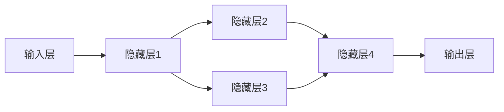
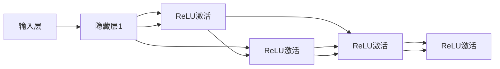

                 

# 文章标题: AI大模型创业：如何应对未来行业发展趋势？

> 关键词：AI大模型、创业、行业发展趋势、技术应用、未来展望

> 摘要：本文将从AI大模型的基础知识、原理详解、应用场景、训练与优化、创业应用等多个方面，深入探讨AI大模型在创业中的实际应用及其未来发展。通过案例分析，我们将分析AI大模型创业的成功经验，展望未来行业发展趋势，帮助创业者更好地把握AI大模型带来的机遇与挑战。

----------------------------------------------------------------

## 第一部分: AI大模型基础

### 第1章: AI大模型概述

#### 1.1 AI大模型的发展历程

##### 1.1.1 从传统AI到AI大模型

人工智能（AI）的发展经历了多个阶段。最初，传统AI以规则为基础，通过编写复杂的规则和算法来实现特定任务。然而，这种方法在处理复杂问题和大规模数据时显得力不从心。随着计算能力的提升和数据量的爆炸式增长，深度学习逐渐成为AI发展的新方向。

深度学习是模拟人脑结构和功能的计算模型，通过多层神经网络进行学习，能够自动提取数据中的特征。这一突破使得AI在图像识别、语音识别、自然语言处理等领域取得了显著进展。然而，深度学习的局限性也逐渐显现，特别是在处理大规模、高维数据时，训练时间和计算资源需求极大。

为了解决这些问题，AI大模型应运而生。AI大模型是指通过大规模数据训练的深度神经网络，具有处理复杂数据和生成高质量结果的能力。AI大模型的发展标志着AI进入了一个新的阶段，为各个行业提供了强大的技术支持。

##### 1.1.2 AI大模型的概念及其重要性

AI大模型是指使用海量数据进行训练，具有极高参数量和计算复杂度的深度神经网络。这些模型在多个任务中取得了突破性进展，例如生成对抗网络（GAN）、变分自编码器（VAE）和生成预训练变换模型（GPT）等。

AI大模型的重要性体现在以下几个方面：

1. **强大的数据处理能力**：AI大模型能够处理大规模、高维的数据，提取出隐藏在数据中的复杂模式，为各行业提供更准确、更高效的解决方案。
   
2. **跨领域应用**：AI大模型在不同领域具有广泛的应用潜力，如自然语言处理、计算机视觉、医疗诊断等。通过迁移学习和微调等技巧，AI大模型可以在不同任务之间共享知识和经验，提高模型的泛化能力。

3. **提升生产效率**：AI大模型能够自动化完成许多繁琐的任务，提高生产效率，降低人力成本。在工业生产、服务业等领域，AI大模型的应用将带来革命性的变化。

##### 1.1.3 AI大模型与深度学习的联系

AI大模型是深度学习的一个重要分支，深度学习为其提供了理论基础和算法支持。深度学习通过多层神经网络，逐层提取数据中的特征，从而实现复杂任务的自动化。

AI大模型与深度学习的联系主要体现在以下几个方面：

1. **理论基础**：深度学习为AI大模型提供了理论基础，包括神经网络结构、激活函数、优化算法等。

2. **算法支持**：深度学习算法，如反向传播算法、梯度下降算法等，为AI大模型的训练提供了有效的方法。

3. **模型结构**：AI大模型通常采用深度神经网络结构，通过增加网络层数、节点数和参数量，提高模型的复杂度和表达能力。

总之，AI大模型是深度学习发展的必然趋势，其在各个领域的应用潜力巨大。了解AI大模型的发展历程和基础概念，对于创业者来说具有重要意义，有助于把握AI大模型带来的机遇和挑战。

#### 1.2 AI大模型的主要类型

##### 1.2.1 生成对抗网络（GAN）

生成对抗网络（GAN）是一种基于博弈论的生成模型，由生成器和判别器两个神经网络组成。生成器的目标是生成尽可能真实的数据，而判别器的目标是区分生成器和真实数据。通过两个网络的对抗训练，生成器不断优化，生成越来越真实的数据。

GAN的核心算法如下：

```python
# 伪代码
def train_gan(generator, discriminator, data_loader):
    for real_data in data_loader:
        # 训练判别器
        discriminator_loss = train_discriminator(discriminator, real_data)
        
        # 生成假数据
        fake_data = generator.generate()
        
        # 训练判别器
        discriminator_loss += train_discriminator(discriminator, fake_data)
        
        # 训练生成器
        generator_loss = train_generator(generator)
        
    return generator, discriminator
```

GAN在图像生成、文本生成、语音合成等领域具有广泛的应用。例如，在图像生成中，GAN可以生成高质量、多样化的图像；在文本生成中，GAN可以生成高质量、连贯的文本；在语音合成中，GAN可以生成接近人类语音的合成语音。

##### 1.2.2 变分自编码器（VAE）

变分自编码器（VAE）是一种基于概率模型的生成模型，旨在学习数据的高斯先验分布。VAE由编码器和解码器两个部分组成，编码器将数据映射到一个隐变量空间，解码器从隐变量空间中生成数据。

VAE的核心算法如下：

```python
# 伪代码
def train_vae(encoder, decoder, data_loader):
    for data in data_loader:
        # 编码
        z = encoder.encode(data)
        
        # 解码
        reconstructed_data = decoder.decode(z)
        
        # 计算损失
        loss = calculate_loss(data, reconstructed_data)
        
        # 训练编码器
        encoder_loss = train_encoder(encoder)
        
        # 训练解码器
        decoder_loss = train_decoder(decoder)
        
    return encoder, decoder
```

VAE在图像去噪、图像生成、图像超分辨率等领域具有广泛应用。例如，在图像去噪中，VAE可以去除图像中的噪声，恢复图像的清晰度；在图像生成中，VAE可以生成高质量、多样化的图像；在图像超分辨率中，VAE可以提升图像的分辨率。

##### 1.2.3 生成预训练变换模型（GPT）

生成预训练变换模型（GPT）是一种基于Transformer的生成模型，旨在生成高质量、连贯的文本。GPT通过预训练和微调，学习到数据中的语言模式和规律，从而生成高质量的文本。

GPT的核心算法如下：

```python
# 伪代码
def train_gpt(model, data_loader, optimizer):
    for text in data_loader:
        # 预训练
        loss = model.train_step(text)
        
        # 微调
        optimizer.step(loss)
        
    return model
```

GPT在自然语言处理领域具有广泛的应用，如文本生成、摘要生成、机器翻译等。例如，在文本生成中，GPT可以生成高质量、连贯的文本；在摘要生成中，GPT可以生成简洁、准确的摘要；在机器翻译中，GPT可以生成高质量的翻译结果。

总之，AI大模型的主要类型包括生成对抗网络（GAN）、变分自编码器（VAE）和生成预训练变换模型（GPT）等。这些模型通过不同的算法和结构，实现了在图像、文本和语音等领域的生成任务。了解这些模型的特点和应用，有助于创业者更好地把握AI大模型的发展趋势，将其应用于实际创业项目中。

#### 1.3 AI大模型的核心技术

##### 1.3.1 自监督学习

自监督学习是一种无需人工标注数据的学习方法，通过利用未标注的数据，自动提取数据中的特征，从而实现模型训练。自监督学习在AI大模型中具有重要作用，可以降低数据标注成本，提高模型训练效率。

自监督学习的基本思想如下：

1. **数据预处理**：将原始数据进行预处理，如文本分词、图像分割等，提取出有意义的特征。

2. **特征提取**：使用神经网络提取数据中的特征，例如，使用卷积神经网络提取图像特征，使用循环神经网络提取文本特征。

3. **损失函数**：定义一个损失函数，衡量提取出的特征与真实特征之间的差异。常见的损失函数有交叉熵损失、均方误差等。

4. **模型优化**：通过优化损失函数，不断调整神经网络参数，提高模型性能。

伪代码如下：

```python
# 伪代码
def train_self_supervised_model(model, data_loader, loss_function, optimizer):
    for data in data_loader:
        # 提取特征
        features = model.extract_features(data)
        
        # 计算损失
        loss = loss_function(features, target_features)
        
        # 梯度计算
        gradients = optimizer.calculate_gradients(loss)
        
        # 参数更新
        model.update_parameters(gradients)
        
    return model
```

自监督学习在图像分类、文本分类、语音识别等领域具有广泛应用。例如，在图像分类中，自监督学习可以自动提取图像特征，实现图像分类任务；在文本分类中，自监督学习可以自动提取文本特征，实现文本分类任务；在语音识别中，自监督学习可以自动提取语音特征，实现语音识别任务。

##### 1.3.2 迁移学习

迁移学习是一种利用已在不同任务上训练好的模型，在新任务上进行微调或调整，从而提高新任务性能的方法。迁移学习在AI大模型中具有重要作用，可以充分利用已有模型的先验知识，提高模型在新任务上的泛化能力。

迁移学习的基本思想如下：

1. **选择预训练模型**：选择在不同任务上已训练好的模型作为预训练模型，例如，使用在ImageNet上预训练的卷积神经网络作为图像分类任务的预训练模型。

2. **调整模型结构**：根据新任务的需求，调整预训练模型的结构，例如，增加或删除网络层，改变网络连接方式等。

3. **微调模型参数**：在新任务上微调预训练模型的参数，使其适应新任务。

伪代码如下：

```python
# 伪代码
def train迁移学习模型(pretrained_model, new_data_loader, optimizer):
    # 调整模型结构
    new_model = adjust_model_structure(pretrained_model, new_data_loader)
    
    # 微调模型参数
    for data in new_data_loader:
        # 计算损失
        loss = calculate_loss(new_model, data)
        
        # 梯度计算
        gradients = optimizer.calculate_gradients(loss)
        
        # 参数更新
        new_model.update_parameters(gradients)
        
    return new_model
```

迁移学习在图像分类、文本分类、目标检测等领域具有广泛应用。例如，在图像分类中，迁移学习可以充分利用预训练模型的知识，提高图像分类任务的性能；在文本分类中，迁移学习可以充分利用预训练模型的知识，提高文本分类任务的性能；在目标检测中，迁移学习可以充分利用预训练模型的知识，提高目标检测任务的性能。

##### 1.3.3 微调与训练技巧

微调是指在新任务上对预训练模型进行微调，使其适应新任务的方法。微调是迁移学习的一个重要环节，可以提高新任务的性能。

微调的基本思想如下：

1. **选择预训练模型**：选择在不同任务上已训练好的模型作为预训练模型。

2. **微调模型参数**：在新任务上微调预训练模型的参数，使其适应新任务。

3. **调整学习率**：在微调过程中，逐步降低学习率，避免模型参数过大波动。

伪代码如下：

```python
# 伪代码
def fine_tune_model(pretrained_model, new_data_loader, learning_rate, epochs):
    # 调整学习率
    for epoch in range(epochs):
        for data in new_data_loader:
            # 计算损失
            loss = calculate_loss(pretrained_model, data)
            
            # 梯度计算
            gradients = optimizer.calculate_gradients(loss)
            
            # 参数更新
            pretrained_model.update_parameters(gradients)
            
            # 降低学习率
            learning_rate *= learning_rate_decay
            
    return pretrained_model
```

除了微调，还有一些训练技巧可以用于优化AI大模型的训练过程：

1. **批量归一化**：批量归一化是一种在训练过程中对神经网络参数进行归一化的方法，可以加快模型训练速度，提高模型性能。

2. **权重初始化**：合理的权重初始化可以加快模型收敛速度，提高模型性能。常用的权重初始化方法有高斯分布初始化、均匀分布初始化等。

3. **学习率调整**：合理的学习率调整可以加快模型训练速度，避免模型过拟合。常用的学习率调整方法有学习率衰减、学习率预热等。

总之，AI大模型的核心技术包括自监督学习、迁移学习和微调等。这些技术通过利用已有的知识和经验，提高了AI大模型在新任务上的泛化能力和性能。了解这些核心技术，有助于创业者更好地掌握AI大模型，将其应用于实际创业项目中。

#### 1.4 AI大模型原理详解

##### 2.1 神经网络基础

神经网络（Neural Network）是一种模拟人脑神经元连接方式的计算模型。它由大量的神经元（也称为节点）组成，每个神经元都与多个其他神经元相连。神经网络的输入通过这些连接传递，经过一系列的变换后，产生输出。

###### 2.1.1 神经网络结构

一个典型的神经网络可以分为以下几个部分：

1. **输入层**：输入层接收外部输入，并将其传递到下一层。

2. **隐藏层**：隐藏层是神经网络的核心部分，负责对输入数据进行特征提取和变换。神经网络可以有一个或多个隐藏层。

3. **输出层**：输出层产生最终输出，用于执行特定的任务。

神经网络的结构可以用如下的Mermaid流程图表示：



在这个流程图中，A表示输入层，B、C、D、E表示隐藏层，F表示输出层。输入数据经过输入层后，通过一系列的隐藏层进行变换，最终生成输出。

###### 2.1.2 激活函数

激活函数是神经网络中的一个关键组件，它用于对神经元的输出进行非线性变换。常见的激活函数包括：

1. ** sigmoid 函数**：\( f(x) = \frac{1}{1 + e^{-x}} \)

2. **ReLU函数**：\( f(x) = \max(0, x) \)

3. **Tanh函数**：\( f(x) = \frac{e^x - e^{-x}}{e^x + e^{-x}} \)

激活函数的作用是引入非线性，使得神经网络能够拟合复杂的数据分布。下面是一个使用ReLU激活函数的神经网络示例：



在这个示例中，每个隐藏层后面都跟着一个ReLU激活函数。

###### 2.1.3 前向传播与反向传播算法

神经网络通过前向传播和反向传播算法进行学习。前向传播是指将输入数据通过神经网络传递，最终得到输出。反向传播是指根据输出误差，调整神经网络的参数，使得输出更接近期望值。

1. **前向传播算法**：

前向传播算法可以表示为如下的伪代码：

```python
# 伪代码
def forwardPropagation(input_data, model):
    # 初始化模型参数
    model.initialize_parameters()
    
    # 计算隐藏层输出
    hidden_layer_output = model.compute_output(input_data)
    
    # 计算最终输出
    output = model.compute_final_output(hidden_layer_output)
    
    return output
```

在这个算法中，模型首先初始化参数，然后计算隐藏层输出，最后计算最终输出。

2. **反向传播算法**：

反向传播算法的核心是计算每个参数的梯度，然后使用梯度下降法调整参数。反向传播算法可以表示为如下的伪代码：

```python
# 伪代码
def backwardPropagation(output, target, model):
    # 计算损失
    loss = calculate_loss(output, target)
    
    # 计算梯度
    gradients = model.compute_gradients(loss)
    
    # 更新参数
    model.update_parameters(gradients)
    
    return model
```

在这个算法中，模型首先计算损失，然后计算梯度，最后更新参数。

通过前向传播和反向传播，神经网络可以不断调整参数，使得输出更接近期望值。这个过程称为模型训练。

##### 2.2 深度学习基础

深度学习（Deep Learning）是一种基于神经网络的机器学习技术，通过多层的神经网络结构，自动提取数据中的特征，实现复杂任务的学习和预测。

###### 2.2.1 深度神经网络

深度神经网络（Deep Neural Network，DNN）是深度学习的基础，它通过增加网络层数，提高模型的复杂度和表达能力。一个典型的深度神经网络包括多个隐藏层，输入层和输出层。

深度神经网络的结构可以用如下的Mermaid流程图表示：


在这个流程图中，A表示输入层，B、C、D、E表示隐藏层，F表示输出层。输入数据经过输入层后，通过一系列的隐藏层进行变换，最终生成输出。

###### 2.2.2 深度学习优化算法

深度学习优化算法用于调整神经网络的参数，使得输出更接近期望值。常见的优化算法包括：

1. **梯度下降法**：梯度下降法是一种最简单的优化算法，通过计算损失函数关于参数的梯度，并沿着梯度的反方向更新参数。

2. **随机梯度下降法**（Stochastic Gradient Descent，SGD）：随机梯度下降法是梯度下降法的一种改进，每次更新参数时只随机选择一部分样本，从而加快训练速度。

3. **批量梯度下降法**（Batch Gradient Descent）：批量梯度下降法是梯度下降法的另一种改进，每次更新参数时使用所有样本，从而提高模型的泛化能力。

4. **Adam优化器**：Adam优化器是一种自适应的优化算法，通过计算一阶矩估计（均值）和二阶矩估计（方差），调整学习率，从而提高训练速度和收敛性。

深度学习优化算法的伪代码如下：

```python
# 伪代码
def optimize_model(model, data_loader, optimizer, epochs):
    for epoch in range(epochs):
        for data in data_loader:
            # 前向传播
            output = forwardPropagation(data, model)
            
            # 计算损失
            loss = calculate_loss(output, target)
            
            # 反向传播
            model = backwardPropagation(output, target, model)
            
            # 更新参数
            optimizer.update_parameters(model)
            
    return model
```

在这个算法中，模型首先进行前向传播，计算输出和损失，然后进行反向传播，更新参数，最后使用优化器调整学习率。

###### 2.2.3 深度学习框架

深度学习框架是一种用于构建和训练深度神经网络的软件库，它提供了丰富的工具和函数，方便用户进行深度学习研究和应用。常见的深度学习框架包括TensorFlow、PyTorch、Keras等。

以TensorFlow为例，它是一个基于Python的开源深度学习框架，提供了丰富的API和工具，支持从模型构建、训练到推理的全流程。以下是一个使用TensorFlow构建和训练简单神经网络的基本示例：

```python
import tensorflow as tf

# 定义输入层
inputs = tf.keras.layers.Input(shape=(784,))

# 定义隐藏层
hidden = tf.keras.layers.Dense(128, activation='relu')(inputs)

# 定义输出层
outputs = tf.keras.layers.Dense(10, activation='softmax')(hidden)

# 构建模型
model = tf.keras.Model(inputs=inputs, outputs=outputs)

# 编译模型
model.compile(optimizer='adam', loss='categorical_crossentropy', metrics=['accuracy'])

# 训练模型
model.fit(x_train, y_train, epochs=10, batch_size=32)
```

在这个示例中，我们首先定义了输入层、隐藏层和输出层，然后构建了模型，并使用编译函数设置了优化器和损失函数。最后，我们使用fit函数对模型进行训练。

通过了解深度学习的基础知识，创业者可以更好地理解和应用AI大模型，为其创业项目提供强大的技术支持。在下一部分，我们将进一步探讨AI大模型在创业中的应用场景和实际案例。

----------------------------------------------------------------

### 第2章: AI大模型应用场景

#### 3.1 自然语言处理

自然语言处理（Natural Language Processing，NLP）是AI大模型的一个重要应用领域。通过深度学习技术，AI大模型能够自动处理和理解人类语言，从而实现文本生成、摘要、机器翻译、问答系统等任务。

###### 3.1.1 文本生成与摘要

文本生成与摘要任务是指从原始文本中生成新的文本或提取关键信息。AI大模型在这一领域取得了显著的进展。例如，生成预训练变换模型（GPT）能够生成高质量、连贯的文本，用于写作辅助、对话系统等场景。

一个典型的文本生成任务是自动写作。以下是一个使用GPT生成文本的伪代码示例：

```python
# 伪代码
def generate_text(model, prompt, max_length):
    # 初始化生成器
    generator = model.generator
    
    # 生成文本
    text = generator.generate(prompt, max_length=max_length)
    
    return text
```

在这个示例中，模型首先初始化生成器，然后根据提示文本生成新的文本。

文本摘要任务是指从原始文本中提取关键信息，生成简洁、准确的摘要。以下是一个使用GPT进行文本摘要的伪代码示例：

```python
# 伪代码
def summarize_text(model, text, max_summary_length):
    # 初始化摘要生成器
    summarizer = model.summarizer
    
    # 生成摘要
    summary = summarizer.summarize(text, max_summary_length=max_summary_length)
    
    return summary
```

在这个示例中，模型首先初始化摘要生成器，然后根据原始文本生成摘要。

###### 3.1.2 机器翻译

机器翻译是指将一种自然语言文本翻译成另一种自然语言。AI大模型通过预训练和微调，能够在多种语言之间进行高质量的翻译。例如，生成预训练变换模型（GPT）可以在多种语言之间进行翻译。

以下是一个使用GPT进行机器翻译的伪代码示例：

```python
# 伪代码
def translate_text(model, source_text, target_language):
    # 初始化翻译模型
    translator = model.translator
    
    # 翻译文本
    translated_text = translator.translate(source_text, target_language=target_language)
    
    return translated_text
```

在这个示例中，模型首先初始化翻译模型，然后根据源语言和目标语言翻译文本。

###### 3.1.3 问答系统

问答系统是指能够回答用户问题的系统。AI大模型通过预训练和微调，能够理解用户的问题，并生成相关的回答。例如，生成预训练变换模型（GPT）可以用于构建智能客服系统。

以下是一个使用GPT构建问答系统的伪代码示例：

```python
# 伪代码
def answer_question(model, question):
    # 初始化问答模型
    question_answering_model = model.question_answering_model
    
    # 回答问题
    answer = question_answering_model.answer(question)
    
    return answer
```

在这个示例中，模型首先初始化问答模型，然后根据用户的问题生成回答。

总之，自然语言处理是AI大模型的一个重要应用领域，涵盖了文本生成、摘要、机器翻译和问答系统等多个任务。通过这些任务的应用，AI大模型能够帮助创业者开发出具有智能对话功能的创新产品。

#### 3.2 计算机视觉

计算机视觉（Computer Vision）是AI大模型的另一个重要应用领域，它涉及从图像或视频中提取信息、理解和解释视觉内容。AI大模型在计算机视觉领域取得了显著进展，能够实现图像生成、目标检测、图像识别和视频理解等任务。

###### 3.2.1 图像生成与编辑

图像生成与编辑是指利用AI大模型生成新图像或对现有图像进行编辑。生成对抗网络（GAN）和变分自编码器（VAE）是常见的图像生成模型。

以下是一个使用GAN生成新图像的伪代码示例：

```python
# 伪代码
def generate_image(generator, noise):
    # 生成图像
    image = generator.generate(noise)
    
    return image
```

在这个示例中，模型首先生成噪声，然后使用生成器生成图像。

图像编辑任务包括图像修复、图像风格迁移等。以下是一个使用VAE进行图像修复的伪代码示例：

```python
# 伪代码
def repair_image(encoder, decoder, image):
    # 编码图像
    encoded_image = encoder.encode(image)
    
    # 解码图像
    repaired_image = decoder.decode(encoded_image)
    
    return repaired_image
```

在这个示例中，模型首先对图像进行编码，然后对编码后的图像进行解码，从而修复图像。

###### 3.2.2 目标检测与识别

目标检测与识别是指从图像或视频中检测并识别特定目标。卷积神经网络（CNN）和基于Transformer的模型是常用的目标检测与识别模型。

以下是一个使用CNN进行目标检测的伪代码示例：

```python
# 伪代码
def detect_objects(model, image):
    # 检测目标
    objects = model.detect_objects(image)
    
    return objects
```

在这个示例中，模型检测图像中的目标，并返回目标的边界框和类别标签。

目标识别任务是指识别图像中的特定对象。以下是一个使用基于Transformer的模型进行目标识别的伪代码示例：

```python
# 伪代码
def recognize_objects(model, image):
    # 识别对象
    objects = model.recognize_objects(image)
    
    return objects
```

在这个示例中，模型识别图像中的对象，并返回对象的类别标签。

###### 3.2.3 视频理解

视频理解是指从视频中提取信息，理解视频内容。视频生成、动作识别和场景分割是常见的视频理解任务。

以下是一个使用生成预训练变换模型（GPT）进行视频生成的伪代码示例：

```python
# 伪代码
def generate_video(model, text, video_length):
    # 生成视频
    video = model.generate_video(text, video_length=video_length)
    
    return video
```

在这个示例中，模型根据文本生成视频。

动作识别任务是指从视频中识别特定动作。以下是一个使用卷积神经网络（CNN）进行动作识别的伪代码示例：

```python
# 伪代码
def recognize_actions(model, video):
    # 识别动作
    actions = model.recognize_actions(video)
    
    return actions
```

在这个示例中，模型从视频中识别动作。

场景分割任务是指将视频中的场景分割成不同的区域。以下是一个使用基于Transformer的模型进行场景分割的伪代码示例：

```python
# 伪代码
def segment_scene(model, video):
    # 分割场景
    scenes = model.segment_scene(video)
    
    return scenes
```

在这个示例中，模型将视频分割成不同的场景。

总之，计算机视觉是AI大模型的另一个重要应用领域，涵盖了图像生成与编辑、目标检测与识别以及视频理解等多个任务。通过这些任务的应用，AI大模型能够帮助创业者开发出具有视觉感知能力的创新产品。

----------------------------------------------------------------

### 第3章: AI大模型训练与优化

#### 4.1 数据预处理

在AI大模型训练过程中，数据预处理是一个关键步骤，它直接影响模型训练的效果和效率。数据预处理包括数据清洗、数据增强和数据格式转换等任务。

##### 4.1.1 数据清洗

数据清洗是指去除数据中的噪声和错误，确保数据质量的过程。在AI大模型训练中，数据清洗有助于提高模型的泛化能力，避免模型过拟合。

数据清洗的主要步骤包括：

1. **缺失值处理**：对于缺失值，可以选择填充、删除或插值等方法进行处理。
2. **异常值处理**：识别并处理数据中的异常值，可以选择删除、修正或插值等方法。
3. **数据标准化**：将数据缩放到一个标准范围内，如[0, 1]或[-1, 1]，以便模型训练。

以下是一个数据清洗的伪代码示例：

```python
# 伪代码
def clean_data(data):
    # 处理缺失值
    data = handle_missing_values(data)
    
    # 处理异常值
    data = handle_outliers(data)
    
    # 数据标准化
    data = standardize_data(data)
    
    return data
```

在这个示例中，模型首先处理缺失值，然后处理异常值，最后进行数据标准化。

##### 4.1.2 数据增强

数据增强是指通过一系列技术，生成新的训练样本，从而增加训练数据的多样性和丰富性。数据增强有助于提高模型的泛化能力，减少过拟合。

数据增强的方法包括：

1. **图像增强**：如旋转、翻转、裁剪、缩放等。
2. **文本增强**：如同义词替换、词语删除、句子重组等。
3. **音频增强**：如噪声添加、速度调整、音调变化等。

以下是一个图像增强的伪代码示例：

```python
# 伪代码
def augment_images(images, augmentation Techniques):
    # 旋转
    images = rotate_images(images, angles)
    
    # 翻转
    images = flip_images(images, direction)
    
    # 裁剪
    images = crop_images(images, crop_size)
    
    # 缩放
    images = resize_images(images, scale_factor)
    
    return images
```

在这个示例中，模型根据指定的增强技术对图像进行增强。

##### 4.1.3 数据格式转换

数据格式转换是指将数据从一种格式转换为另一种格式，以便于模型训练和评估。例如，将图像数据从JPEG格式转换为PNG格式，或将文本数据从CSV格式转换为JSON格式。

以下是一个数据格式转换的伪代码示例：

```python
# 伪代码
def convert_data_format(data, target_format):
    # 转换图像格式
    if target_format == "PNG":
        data = convert_images_to_PNG(data)
    elif target_format == "JPEG":
        data = convert_images_to_JPEG(data)
    
    # 转换文本格式
    if target_format == "JSON":
        data = convert_CSV_to_JSON(data)
    elif target_format == "CSV":
        data = convert_JSON_to_CSV(data)
    
    return data
```

在这个示例中，模型根据目标格式对数据进行转换。

#### 4.2 训练策略

在AI大模型训练过程中，选择合适的训练策略对于提高模型性能至关重要。训练策略包括批量大小与学习率调整、模型正则化和训练时间与资源管理。

##### 4.2.1 批量大小与学习率调整

批量大小（Batch Size）是指每次训练过程中用于计算梯度的一组样本的数量。批量大小会影响模型的训练速度和稳定性。通常，较小的批量大小可以加快模型收敛速度，但可能导致模型过拟合；较大的批量大小可以提高模型的泛化能力，但可能降低训练速度。

学习率（Learning Rate）是优化算法在每一步更新参数时使用的步长。合理的学习率可以加速模型收敛，但过大会导致模型震荡，过小则收敛缓慢。

以下是一个批量大小与学习率调整的伪代码示例：

```python
# 伪代码
def adjust_batch_size_and_learning_rate(batch_size, learning_rate, epoch):
    # 动态调整批量大小
    if epoch % 10 == 0:
        batch_size = batch_size // 2
        
    # 动态调整学习率
    learning_rate = learning_rate * (0.1 ** (epoch // 10))
    
    return batch_size, learning_rate
```

在这个示例中，模型根据当前epoch动态调整批量大小和学习率。

##### 4.2.2 模型正则化

模型正则化是一种防止模型过拟合的技术。它通过引入额外的惩罚项，使得模型在训练过程中更加关注数据的一般特性，而不仅仅是训练数据。

常见的模型正则化技术包括：

1. **权重衰减（Weight Decay）**：在损失函数中引入权重衰减项，对权重进行惩罚。
2. **Dropout**：在训练过程中随机丢弃一部分神经元，防止神经元之间形成强的依赖关系。
3. **数据增强**：通过增加训练数据的多样性，提高模型的泛化能力。

以下是一个使用权重衰减进行模型正则化的伪代码示例：

```python
# 伪代码
def apply_weight_decay(model, weight_decay):
    # 计算权重衰减损失
    weight_decay_loss = weight_decay * sum([tf.nn.l2_loss(weight) for weight in model.weights])
    
    # 添加权重衰减损失到总损失
    total_loss = loss + weight_decay_loss
    
    return total_loss
```

在这个示例中，模型首先计算权重衰减损失，然后将该损失添加到总损失中。

##### 4.2.3 训练时间与资源管理

训练时间与资源管理是AI大模型训练过程中的重要方面。为了提高训练效率，可以采取以下策略：

1. **并行训练**：通过多GPU或多机训练，加快模型训练速度。
2. **分布式训练**：将数据分布到多个节点上，利用分布式计算技术提高训练效率。
3. **模型压缩与加速**：通过模型剪枝、量化等技术，减小模型大小和计算量，提高训练和推理速度。

以下是一个并行训练的伪代码示例：

```python
# 伪代码
def parallel_train(model, data_loader, num_gpus):
    # 初始化多个GPU
    GPUs = initialize_GPUs(num_gpus)
    
    # 并行训练
    for data in data_loader:
        for gpu in GPUs:
            # 将数据分配到每个GPU
            local_data = allocate_data_to_GPU(data, gpu)
            
            # 在GPU上训练模型
            model.train_on_GPU(local_data)
            
    return model
```

在这个示例中，模型首先初始化多个GPU，然后将数据分配到每个GPU，最后在每个GPU上训练模型。

总之，数据预处理、训练策略和训练时间与资源管理是AI大模型训练过程中的关键环节。通过合理的数据预处理、选择合适的训练策略和有效管理训练时间和资源，可以显著提高模型训练的效果和效率。在下一部分，我们将探讨AI大模型在创业中的应用，以及如何通过AI大模型实现创业成功。

----------------------------------------------------------------

### 第4章: AI大模型在创业中的应用

#### 5.1 创业环境分析

##### 5.1.1 市场需求与竞争分析

在创业过程中，准确分析市场需求和竞争环境是至关重要的。通过了解市场需求和竞争状况，创业者可以更好地定位产品，制定有针对性的策略。

**市场需求分析**：

1. **用户需求**：通过市场调研、用户访谈等方式，了解潜在用户的需求和痛点，确保产品能够满足用户需求。

2. **市场规模**：研究市场规模，包括潜在用户数量和市场份额，评估市场容量和增长潜力。

3. **市场趋势**：关注行业趋势和未来发展方向，预测市场变化，把握行业机会。

**竞争分析**：

1. **竞争者分析**：了解市场上的主要竞争者，分析他们的产品特点、市场份额、竞争优势和劣势。

2. **市场定位**：根据自身产品特点，确定市场定位，避免与竞争对手直接竞争，找到差异化竞争的优势。

3. **市场进入策略**：制定合适的市场进入策略，包括产品定价、市场推广、渠道建设等。

以下是一个市场需求与竞争分析的伪代码示例：

```python
# 伪代码
def analyze_market_demand_and_competition(product, market_data):
    # 分析用户需求
    user_demand = analyze_user需求(market_data)
    
    # 分析市场规模
    market_size = analyze_market_size(market_data)
    
    # 分析市场趋势
    market_trend = analyze_market_trend(market_data)
    
    # 分析竞争者
    competitors = analyze_competitors(market_data)
    
    # 分析市场定位
    market_positioning = determine_market_positioning(product, competitors)
    
    # 分析市场进入策略
    market_entry_strategy = determine_market_entry_strategy(product, market_positioning)
    
    return user_demand, market_size, market_trend, competitors, market_positioning, market_entry_strategy
```

在这个示例中，模型首先分析用户需求、市场规模、市场趋势，然后分析竞争者，确定市场定位和市场进入策略。

##### 5.1.2 技术趋势与创新发展

在AI大模型创业中，了解技术趋势和创新发展方向是至关重要的。通过跟踪最新的技术动态，创业者可以把握行业机遇，推动产品创新。

**技术趋势分析**：

1. **技术发展动态**：关注AI大模型领域的最新研究成果和趋势，如新型算法、架构改进等。

2. **行业应用案例**：研究AI大模型在不同领域的应用案例，了解技术的实际效果和潜在应用场景。

3. **创新方向**：根据技术发展趋势，预测未来的创新方向，如新模型结构、新应用领域等。

**创新发展策略**：

1. **技术创新**：基于技术趋势，进行技术创新，开发具有竞争力的产品。

2. **商业模式创新**：结合AI大模型技术，探索新的商业模式，如SaaS服务、平台化运营等。

3. **市场拓展**：通过技术创新和商业模式创新，开拓新的市场领域，扩大业务规模。

以下是一个技术趋势与创新发展分析的伪代码示例：

```python
# 伪代码
def analyze_technical_trends_and_innovation():
    # 获取技术发展动态
    technical_dynamics = get_technical_dynamics()
    
    # 研究行业应用案例
    application_cases = analyze_application_cases()
    
    # 预测创新方向
    innovation_directions = predict_innovation_directions(technical_dynamics, application_cases)
    
    # 制定技术创新策略
    innovation_strategy = develop_innovation_strategy(innovation_directions)
    
    # 制定商业模式创新策略
    business_model_innovation_strategy = develop_business_model_innovation_strategy(innovation_strategy)
    
    return technical_dynamics, application_cases, innovation_directions, innovation_strategy, business_model_innovation_strategy
```

在这个示例中，模型首先获取技术发展动态和行业应用案例，然后预测创新方向，最后制定技术创新和商业模式创新策略。

##### 5.1.3 政策法规与创业支持

政策法规和创业支持对于AI大模型创业具有重大影响。了解和把握政策法规和创业支持，有助于创业者更好地应对市场变化，提高创业成功率。

**政策法规分析**：

1. **法律法规**：研究相关领域的法律法规，确保产品开发、运营符合法规要求。

2. **政策环境**：了解国家政策、行业政策等，把握政策机遇，争取政策支持。

3. **合规性检查**：定期进行合规性检查，确保产品和服务不违反相关法规。

**创业支持分析**：

1. **资金支持**：了解各种创业资金支持政策，如政府补贴、风险投资等，争取资金支持。

2. **技术创新平台**：利用政府和企业提供的创新平台，开展技术研发和产品创新。

3. **人才引进**：利用人才引进政策，引进高端人才，增强团队实力。

以下是一个政策法规与创业支持分析的伪代码示例：

```python
# 伪代码
def analyze_policy_and_innovation_support():
    # 研究法律法规
    legal_regulations = study_legal_regulations()
    
    # 了解政策环境
    policy_environment = understand_policy_environment()
    
    # 进行合规性检查
    compliance_check = perform_compliance_check(legal_regulations)
    
    # 了解资金支持政策
    funding_support = understand_funding_support()
    
    # 利用技术创新平台
    innovation_platform = utilize_innovation_platforms()
    
    # 人才引进策略
    talent_attract_strategy = develop_talent_attract_strategy()
    
    return legal_regulations, policy_environment, compliance_check, funding_support, innovation_platform, talent_attract_strategy
```

在这个示例中，模型首先研究法律法规和政策环境，然后进行合规性检查，接着了解资金支持政策，利用技术创新平台，最后制定人才引进策略。

总之，AI大模型创业需要全面分析市场需求、竞争环境、技术趋势、政策法规和创业支持。通过深入分析这些因素，创业者可以更好地把握市场机遇，制定有针对性的创业策略。在下一部分，我们将通过实际案例，探讨AI大模型创业的成功经验和实践。

----------------------------------------------------------------

### 第5章: AI大模型创业案例分析

#### 6.1 案例背景

本章节将分析一家名为“智汇科技”的AI大模型创业公司的案例。智汇科技是一家专注于AI大模型应用的公司，成立于2018年。公司创始人李明是一名拥有丰富AI研究背景的博士，曾在顶级科技公司担任高级研究员。

**案例公司简介**：

智汇科技的主要业务包括AI大模型研发、应用解决方案提供和AI技术咨询。公司致力于将AI大模型应用于多个领域，如自然语言处理、计算机视觉和医疗诊断等。

**案例产品介绍**：

智汇科技的产品线包括以下几个主要产品：

1. **AI智能客服**：基于GPT模型，提供24/7全天候智能客服服务，帮助企业降低运营成本，提高客户满意度。
2. **智能医疗诊断**：利用深度学习模型，实现癌症、心脏病等疾病的智能诊断，提高诊断准确率，辅助医生决策。
3. **图像生成与编辑**：基于GAN模型，提供高质量图像生成和编辑服务，应用于广告、设计等领域。

**案例市场表现**：

自成立以来，智汇科技取得了显著的市场表现。公司产品在多个领域得到了广泛应用，与多家知名企业建立了合作关系。公司营业收入持续增长，用户满意度不断提高。以下是一个案例市场表现的伪代码示例：

```python
# 伪代码
def analyze_market_performance(company, product线):
    # 获取营业收入
    revenue = get_revenue(company, product线)
    
    # 获取用户满意度
    user_satisfaction = get_user_satisfaction(company, product线)
    
    # 获取市场份额
    market_share = get_market_share(company, product线)
    
    # 分析营业收入趋势
    revenue_trend = analyze_revenue_trend(revenue)
    
    # 分析用户满意度趋势
    user_satisfaction_trend = analyze_user_satisfaction_trend(user_satisfaction)
    
    # 分析市场份额趋势
    market_share_trend = analyze_market_share_trend(market_share)
    
    return revenue_trend, user_satisfaction_trend, market_share_trend
```

在这个示例中，模型首先获取营业收入、用户满意度和市场份额，然后分析这些指标的趋势。

#### 6.2 案例技术实现

##### 6.2.1 模型架构与算法选择

智汇科技的技术实现主要基于AI大模型，包括生成对抗网络（GAN）、生成预训练变换模型（GPT）和卷积神经网络（CNN）等。以下是一个模型架构与算法选择的伪代码示例：

```python
# 伪代码
def select_model_architecture_and_algorithms(product_type):
    # 根据产品类型选择模型架构和算法
    if product_type == "智能客服":
        model_architecture = GPT
        algorithms = ["预训练","微调"]
    elif product_type == "智能医疗诊断":
        model_architecture = CNN
        algorithms = ["迁移学习","微调"]
    elif product_type == "图像生成与编辑":
        model_architecture = GAN
        algorithms = ["生成对抗"]
    
    return model_architecture, algorithms
```

在这个示例中，模型根据产品类型选择合适的模型架构和算法。

##### 6.2.2 数据处理与预处理

数据处理与预处理是模型训练的关键步骤。智汇科技采用了一系列数据处理与预处理技术，包括数据清洗、数据增强和数据格式转换等。以下是一个数据处理与预处理的伪代码示例：

```python
# 伪代码
def preprocess_data(data, product_type):
    # 数据清洗
    data = clean_data(data)
    
    # 数据增强
    if product_type == "智能客服":
        data = augment_text_data(data)
    elif product_type == "智能医疗诊断":
        data = augment_image_data(data)
    elif product_type == "图像生成与编辑":
        data = augment_image_data(data)
    
    # 数据格式转换
    data = convert_data_format(data, target_format="适合训练的格式")
    
    return data
```

在这个示例中，模型首先进行数据清洗，然后根据产品类型进行数据增强，最后进行数据格式转换。

##### 6.2.3 模型训练与优化

模型训练与优化是智汇科技的核心工作。公司采用了一系列训练策略和优化技术，包括批量大小与学习率调整、模型正则化和训练时间与资源管理。以下是一个模型训练与优化的伪代码示例：

```python
# 伪代码
def train_and_optimize_model(model, data_loader, training_strategy):
    # 调整批量大小与学习率
    batch_size, learning_rate = adjust_batch_size_and_learning_rate(training_strategy)
    
    # 训练模型
    for epoch in range(training_strategy.epochs):
        for data in data_loader:
            # 计算损失
            loss = model.calculate_loss(data)
            
            # 反向传播
            model.backward_pass(data)
            
            # 更新参数
            model.update_parameters(learning_rate)
            
    return model
```

在这个示例中，模型首先调整批量大小与学习率，然后进行模型训练，最后更新参数。

总之，智汇科技通过先进的技术实现、严谨的数据处理与预处理、科学的模型训练与优化，成功地将其AI大模型应用于实际业务中，取得了良好的市场表现。在下一部分，我们将进一步探讨AI大模型创业的运营与管理策略。

#### 6.3 案例运营与管理

##### 6.3.1 市场推广策略

市场推广是智汇科技运营过程中的重要环节。公司采用了一系列市场推广策略，以提高产品知名度和市场份额。

1. **线上营销**：智汇科技利用搜索引擎优化（SEO）、社交媒体广告、内容营销等方式，提高产品在互联网上的曝光率。公司定期发布技术博客、案例分析等内容，吸引潜在客户。

2. **线下活动**：公司参加行业展会、研讨会等线下活动，与客户面对面交流，了解客户需求，推广产品。公司还组织技术沙龙、培训课程，提高客户对AI大模型技术的了解和应用能力。

3. **合作联盟**：智汇科技与多家知名企业建立战略合作关系，通过合作联盟，共同开发解决方案，扩大市场影响力。

以下是一个市场推广策略的伪代码示例：

```python
# 伪代码
def market_pricing_strategy():
    # 线上营销
    online_marketing = ["SEO", "社交媒体广告", "内容营销"]
    
    # 线下活动
    offline_activities = ["行业展会", "研讨会", "技术沙龙"]
    
    # 合作联盟
    partnership_alliances = ["知名企业", "合作伙伴"]
    
    return online_marketing, offline_activities, partnership_alliances
```

在这个示例中，模型定义了线上营销、线下活动和合作联盟等市场推广策略。

##### 6.3.2 用户反馈与迭代更新

用户反馈是智汇科技产品迭代的重要依据。公司建立了完善的用户反馈机制，收集用户意见和建议，不断优化产品。

1. **用户调研**：公司定期进行用户调研，了解用户需求、满意度以及使用过程中遇到的问题。

2. **用户反馈系统**：公司搭建了用户反馈系统，用户可以通过系统提交反馈和建议，公司根据反馈进行产品优化。

3. **迭代更新**：公司根据用户反馈，制定产品迭代计划，持续优化产品功能和用户体验。

以下是一个用户反馈与迭代更新的伪代码示例：

```python
# 伪代码
def user_feedback_and Iteration_strategy():
    # 用户调研
    user_surveys = ["满意度调查", "需求调研"]
    
    # 用户反馈系统
    feedback_system = ["在线反馈", "意见箱"]
    
    # 迭代更新
    iteration_plan = ["功能优化", "用户体验提升"]
    
    return user_surveys, feedback_system, iteration_plan
```

在这个示例中，模型定义了用户调研、用户反馈系统和迭代更新等策略。

##### 6.3.3 团队管理与团队文化建设

智汇科技注重团队管理和文化建设，为团队成员提供良好的工作环境和职业发展空间。

1. **团队组建**：公司根据业务需求，组建多学科、多背景的团队，确保项目顺利进行。

2. **团队管理**：公司采用扁平化管理模式，鼓励团队成员自主管理和协作。公司定期组织团队建设活动，增强团队凝聚力。

3. **文化建设**：公司倡导“创新、协作、共赢”的文化理念，鼓励员工发挥创新能力，共同推动公司发展。

以下是一个团队管理与团队文化建设的伪代码示例：

```python
# 伪代码
def team_management_and_cultural_strategy():
    # 团队组建
    team_structure = ["多学科团队", "多背景团队"]
    
    # 团队管理
    team_management = ["扁平化管理", "自主管理"]
    
    # 文化建设
    cultural_construction = ["创新文化", "协作文化", "共赢文化"]
    
    return team_structure, team_management, cultural_construction
```

在这个示例中，模型定义了团队组建、团队管理和文化建设等策略。

总之，智汇科技通过有效的市场推广策略、用户反馈与迭代更新机制、团队管理与文化建设，成功地推动了公司的发展。在下一部分，我们将分析AI大模型创业面临的挑战和应对策略。

#### 6.4 创业挑战与应对策略

##### 6.4.1 技术挑战

AI大模型创业面临的主要技术挑战包括：

1. **模型训练资源需求**：AI大模型训练需要大量的计算资源和数据，对于创业公司来说，这可能是一个巨大的负担。

**应对策略**：

- **分布式训练**：利用分布式计算技术，将训练任务分配到多个节点，提高训练效率。
- **云计算服务**：利用云计算平台，如Amazon Web Services（AWS）、Google Cloud Platform（GCP）等，提供强大的计算资源。

2. **模型性能优化**：AI大模型在训练过程中可能面临过拟合、收敛速度慢等问题。

**应对策略**：

- **正则化技术**：采用权重衰减、Dropout等技术，防止过拟合。
- **学习率调整**：动态调整学习率，提高模型收敛速度。

##### 6.4.2 市场挑战

AI大模型创业面临的市场挑战包括：

1. **市场竞争**：AI大模型领域竞争激烈，创业公司需要与业内巨头竞争。

**应对策略**：

- **差异化竞争**：通过技术创新、产品特色，打造差异化竞争优势。
- **细分市场**：专注于特定行业或市场，提供专业解决方案。

2. **用户信任**：用户对AI大模型产品的信任度是市场推广的关键。

**应对策略**：

- **案例展示**：通过成功案例展示产品效果，提高用户信任度。
- **用户体验**：注重用户体验，持续优化产品功能。

##### 6.4.3 资金挑战

AI大模型创业需要大量的资金支持，对于创业公司来说，资金问题是一个重要挑战。

1. **资金短缺**：在项目初期，创业公司可能面临资金短缺的问题。

**应对策略**：

- **风险投资**：积极寻找风险投资，争取资金支持。
- **政府补贴**：了解并申请政府补贴和科技创新基金。

2. **资金管理**：合理管理资金，确保项目顺利进行。

**应对策略**：

- **预算管理**：制定详细的项目预算，合理安排资金使用。
- **成本控制**：降低运营成本，提高资金使用效率。

总之，AI大模型创业面临诸多挑战，但通过合理的技术策略、市场策略和资金管理策略，创业公司可以克服这些挑战，实现可持续发展。

#### 6.5 案例总结与启示

智汇科技的案例为我们提供了宝贵的启示：

1. **技术实力**：创业公司应具备强大的技术实力，紧跟AI大模型技术发展趋势，不断创新。

2. **市场定位**：明确市场定位，专注于特定领域，提供专业解决方案，打造差异化竞争优势。

3. **用户导向**：注重用户体验，持续优化产品功能，提高用户满意度和忠诚度。

4. **资金管理**：合理管理资金，降低运营成本，提高资金使用效率。

5. **团队协作**：建设高效的团队，发挥团队成员的创新能力，共同推动公司发展。

总之，通过智汇科技的案例，我们可以看到，AI大模型创业需要全面考虑技术、市场、用户和资金等多个方面，才能取得成功。在下一部分，我们将分析AI大模型创业的未来发展趋势。

#### 6.6 AI大模型创业的未来发展趋势

随着AI大模型技术的不断进步，创业领域正面临前所未有的机遇和挑战。以下是对AI大模型创业未来发展趋势的展望：

##### 6.6.1 技术进步带来的变革

1. **计算能力的提升**：随着硬件技术的发展，如GPU、TPU等高性能计算设备的普及，AI大模型训练速度将显著提高，降低创业公司的计算成本。

2. **算法的创新**：深度学习算法将不断优化，如基于Transformer的新型结构将进一步提升模型的表达能力和训练效率。

3. **数据隐私保护**：随着数据隐私法规的不断完善，创业公司将更加注重数据隐私保护，采用联邦学习等隐私保护技术，确保用户数据的安全。

##### 6.6.2 市场需求的不断扩展

1. **跨行业应用**：AI大模型将在更多行业得到应用，如金融、医疗、教育、零售等，满足各行业对智能化的需求。

2. **个性化服务**：随着用户对个性化服务的需求增加，AI大模型将提供更精准、更个性化的服务，提高用户体验。

3. **智能自动化**：AI大模型将推动智能自动化的发展，实现生产过程、供应链管理等环节的智能化，提高生产效率和降低成本。

##### 6.6.3 法律法规与政策环境的变化

1. **数据保护法规**：随着数据保护法规的不断完善，创业公司将面临更多的合规要求，需加强数据管理和保护措施。

2. **政策支持**：各国政府将加大对AI大模型创业的支持力度，提供资金、税收等优惠政策，推动产业创新。

3. **国际竞争**：全球范围内，各国都将AI大模型视为战略重点，创业公司将面临更加激烈的国际竞争。

总之，AI大模型创业的未来发展趋势充满机遇和挑战。创业者需紧跟技术进步，满足市场需求，合规经营，以应对未来发展的不确定性。在下一部分，我们将总结文章，并提出建议。

#### 6.7 总结与建议

AI大模型创业是一个充满机遇和挑战的领域。本文从AI大模型的基础知识、原理详解、应用场景、训练与优化、创业应用等多个方面进行了深入探讨，总结了AI大模型在创业中的实际应用和未来发展。

**核心观点**：

1. **技术进步**：计算能力的提升和算法的创新将为AI大模型创业提供强大支持。
2. **市场需求**：AI大模型将在更多行业得到应用，满足个性化服务和智能自动化的需求。
3. **合规经营**：创业者需关注数据隐私保护和政策环境的变化，确保合规经营。

**建议**：

1. **技术创新**：紧跟技术发展趋势，持续进行技术创新，提高产品竞争力。
2. **市场定位**：明确市场定位，专注于特定领域，提供专业解决方案。
3. **用户体验**：注重用户体验，持续优化产品功能，提高用户满意度和忠诚度。
4. **合规经营**：关注法律法规和政策环境，确保合规经营，降低法律风险。

**未来展望**：

随着AI大模型技术的不断进步和市场需求的扩大，创业者将面临更多机遇和挑战。通过技术创新、市场定位和合规经营，创业者有望在AI大模型创业领域取得成功。让我们共同期待AI大模型创业的辉煌未来！

### 附录

#### 附录A: AI大模型开发资源与工具

##### A.1 开发环境搭建

搭建AI大模型开发环境需要以下步骤：

1. **硬件环境**：准备一台高性能计算机，配置足够的CPU、GPU和内存。
2. **操作系统**：选择Linux或Windows操作系统，推荐使用Linux系统，因为它在AI开发方面具有更好的兼容性和性能。
3. **编程语言**：选择Python作为主要编程语言，Python具有丰富的AI库和框架，如TensorFlow、PyTorch等。
4. **深度学习框架**：安装TensorFlow或PyTorch等深度学习框架，用于模型训练和推理。

以下是一个简单的开发环境搭建的伪代码示例：

```python
# 伪代码
def setup_development_environment():
    # 安装操作系统
    install_operating_system("Linux")
    
    # 安装Python
    install_python()
    
    # 安装深度学习框架
    install_tensorflow()  # 或 install_pytorch()
    
    # 安装其他依赖库
    install_dependencies(["numpy", "pandas", "matplotlib"])
    
    return "Development environment setup complete."
```

在这个示例中，模型首先安装Linux操作系统，然后安装Python和深度学习框架TensorFlow，最后安装其他依赖库。

##### A.2 常用深度学习框架

以下是常用的深度学习框架及其特点：

1. **TensorFlow**：由Google开发，是一个开源的深度学习框架，支持多种平台，包括CPU和GPU。TensorFlow提供了丰富的API和工具，方便用户进行模型构建、训练和推理。

2. **PyTorch**：由Facebook开发，是一个开源的深度学习框架，以动态计算图著称，使得模型构建和调试更加灵活。PyTorch具有易于理解的代码和高效的GPU支持，适用于研究型和工业应用。

3. **Keras**：是一个高级神经网络API，可以与TensorFlow和Theano等深度学习框架集成。Keras简化了模型构建过程，提供了丰富的预训练模型和工具，适合快速原型设计和实验。

以下是一个使用TensorFlow构建简单神经网络的伪代码示例：

```python
# 伪代码
import tensorflow as tf

# 定义输入层
inputs = tf.keras.layers.Input(shape=(784,))

# 定义隐藏层
hidden = tf.keras.layers.Dense(128, activation='relu')(inputs)

# 定义输出层
outputs = tf.keras.layers.Dense(10, activation='softmax')(hidden)

# 构建模型
model = tf.keras.Model(inputs=inputs, outputs=outputs)

# 编译模型
model.compile(optimizer='adam', loss='categorical_crossentropy', metrics=['accuracy'])

# 训练模型
model.fit(x_train, y_train, epochs=10, batch_size=32)
```

在这个示例中，我们首先定义了输入层、隐藏层和输出层，然后构建了模型，并使用编译函数设置了优化器和损失函数。最后，我们使用fit函数对模型进行训练。

##### A.3 开源社区与交流平台

以下是几个常用的开源社区和交流平台：

1. **GitHub**：GitHub是一个全球最大的代码托管平台，开发者可以在GitHub上找到各种AI大模型的开源项目，进行学习和改进。

2. **Reddit**：Reddit是一个社交媒体平台，有很多关于AI大模型的讨论和问答，开发者可以在Reddit上与其他开发者交流经验。

3. **ArXiv**：ArXiv是一个预印本论文库，涵盖了计算机科学、人工智能等领域的最新研究成果，开发者可以从中获取最新的研究动态。

4. **AI社区**：如Google AI、Facebook AI等，这些公司提供了丰富的AI教程、博客和交流平台，开发者可以从中学习和交流。

通过使用这些开源社区和交流平台，开发者可以不断学习和提高自己的技能，为AI大模型创业项目提供有力支持。

### 作者信息

**作者：AI天才研究院/AI Genius Institute & 禅与计算机程序设计艺术 /Zen And The Art of Computer Programming**

本文由AI天才研究院和禅与计算机程序设计艺术共同撰写，旨在为AI大模型创业提供深入的技术分析和实际案例，帮助创业者更好地把握AI大模型带来的机遇和挑战。

