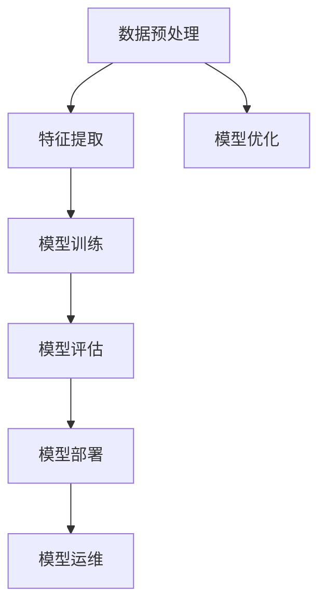

                 

### 《AI大模型创业：如何应对未来行业发展趋势？》

### 关键词：AI大模型，创业，行业趋势，技术发展

> 摘要：
> 
> 本文章旨在探讨AI大模型创业的现状与未来发展趋势，分析AI大模型的核心技术、创业策略以及面临的挑战。文章将详细解析AI大模型的基本概念、发展历程、核心技术、应用领域，并从创业团队组建、项目实施、市场竞争等多个角度深入探讨AI大模型创业的可行性和策略。同时，文章还将预测未来行业发展趋势，为创业公司提供有价值的参考和指导。

---

## 《AI大模型创业：如何应对未来行业发展趋势？》目录大纲

### 第一部分：AI大模型基础知识

#### 第1章：AI大模型概述

##### 1.1 AI大模型的概念与重要性

##### 1.2 AI大模型的发展历程

##### 1.3 AI大模型的核心技术

##### 1.4 AI大模型在行业中的应用前景

### 第2章：AI大模型的数学基础

##### 2.1 线性代数基础

##### 2.2 微积分基础

##### 2.3 概率论与统计基础

### 第3章：AI大模型的核心算法

##### 3.1 神经网络与深度学习基础

##### 3.2 卷积神经网络（CNN）

##### 3.3 循环神经网络（RNN）

##### 3.4 生成对抗网络（GAN）

##### 3.5 Transformer模型

### 第4章：AI大模型的应用领域

##### 4.1 自然语言处理

##### 4.2 计算机视觉

##### 4.3 语音识别与合成

##### 4.4 机器翻译

### 第5章：AI大模型创业案例分析

##### 5.1 创业背景分析

##### 5.2 创业团队组建

##### 5.3 创业项目规划

##### 5.4 创业资金筹集

##### 5.5 创业风险控制

### 第6章：AI大模型创业技术难点及解决方案

##### 6.1 数据集准备与处理

##### 6.2 模型训练与优化

##### 6.3 模型部署与运维

##### 6.4 模型安全与隐私保护

### 第7章：未来行业发展趋势与创业策略

##### 7.1 行业趋势分析

##### 7.2 创业机会识别

##### 7.3 创业策略制定

##### 7.4 创业案例分析

### 附录

##### 附录A：AI大模型开发工具与资源

##### 附录B：AI大模型创业相关法规与政策

##### 附录C：常见问题解答

### Mermaid流程图：AI大模型技术架构图

## 第一部分：AI大模型基础知识

### 第1章：AI大模型概述

#### 1.1 AI大模型的概念与重要性

##### 1.1.1 AI大模型的基本概念

AI大模型（Large-scale Artificial Intelligence Models）是指参数数量达到百万级别甚至亿级别的神经网络模型。这些模型通常通过深度学习算法训练，能够在大规模数据集上实现高精度的预测和分类。相较于传统的机器学习模型，AI大模型具有更强的表达能力和泛化能力。

##### 1.1.2 AI大模型与传统AI的区别

传统AI主要依赖于规则和特征工程，而AI大模型则依赖于大规模数据和高性能计算。传统AI模型通常参数量较小，而AI大模型参数量可以达到百万到亿级别。此外，传统AI模型往往依赖于手动设计特征，而AI大模型可以通过自动学习发现数据中的复杂模式。

##### 1.1.3 AI大模型的重要性

AI大模型在多个领域取得了显著突破，其重要性体现在以下几个方面：

- **提高预测准确性**：通过学习大规模数据，AI大模型能够捕捉到更多数据中的潜在规律，从而提高预测准确性。
- **降低人力成本**：AI大模型能够自动处理大量数据，减少了对人类专家的依赖，降低了人力成本。
- **推动行业创新**：AI大模型在医疗、金融、自动驾驶等领域具有广泛的应用前景，推动了行业的创新和发展。
- **提高生产效率**：AI大模型能够自动化执行复杂的任务，提高生产效率，降低生产成本。

#### 1.2 AI大模型的发展历程

##### 1.2.1 初创阶段

AI大模型的发展始于20世纪90年代，当时的神经网络模型参数量较小，难以处理大规模数据。随着计算机性能的提升和算法的改进，神经网络模型逐渐具备了处理大规模数据的能力。

##### 1.2.2 模型发展期

2006年，Hinton提出了深度信念网络（Deep Belief Network，DBN），标志着深度学习时代的开始。随后，AlexNet在2012年的ImageNet竞赛中取得了突破性的成绩，深度学习开始在计算机视觉领域得到广泛应用。

##### 1.2.3 应用落地期

随着深度学习技术的不断成熟，AI大模型在多个领域实现了商业化应用。例如，自然语言处理中的Transformer模型、计算机视觉中的卷积神经网络（CNN）、语音识别中的循环神经网络（RNN）等。

#### 1.3 AI大模型的核心技术

##### 1.3.1 神经网络基础

神经网络（Neural Networks）是AI大模型的核心组成部分，由多个神经元组成。每个神经元通过加权连接与其他神经元相连，接收输入信号并产生输出。神经网络通过不断调整权重，实现数据的学习和预测。

- **神经元模型**：神经元接收输入信号，通过激活函数产生输出。
  $$ f(x) = \sigma(\sum_{i=1}^{n} w_{i}x_{i} + b) $$
  其中，$x_{i}$为输入值，$w_{i}$为权重，$b$为偏置，$\sigma$为激活函数（如Sigmoid函数）。

- **前向传播**：将输入信号通过神经网络逐层传递，计算输出。
  $$ z_{l} = \sum_{i=1}^{n} w_{li}x_{i} + b_{l} $$
  $$ a_{l} = \sigma(z_{l}) $$

- **反向传播**：计算误差并反向传播，更新网络权重。
  $$ \delta_{l} = \frac{\partial J}{\partial z_{l}} $$
  $$ w_{li} := w_{li} - \alpha \delta_{l}a_{l}^{[l-1]} $$

##### 1.3.2 深度学习算法

深度学习（Deep Learning）是AI大模型的核心技术之一，通过多层神经网络实现数据的自动特征提取和模式识别。

- **卷积神经网络（CNN）**：通过卷积层、池化层和全连接层等结构，实现对图像、语音等数据的处理。
  - **卷积层**：通过卷积操作提取图像特征。
    $$ (f * g)(t) = \sum_{k=1}^{K} f(t-k)g(k) $$
  - **池化层**：通过最大值池化或平均值池化减小特征图的尺寸。
  - **全连接层**：将卷积层提取的特征映射到分类结果。

- **循环神经网络（RNN）**：通过循环结构保持序列数据中的长期依赖信息。
  - **基本RNN**：通过循环结构保存当前时刻的输入和上一时刻的隐藏状态。
    $$ h_{t} = \sigma(Wx_{t} + Uh_{t-1} + b) $$
  - **长短时记忆网络（LSTM）**：通过门控机制有效地学习长距离依赖。
    $$ f_{t} = \sigma(W_f[x_{t}, h_{t-1}] + U_f[h_{t-1}] + b_f) $$
    $$ i_{t} = \sigma(W_i[x_{t}, h_{t-1}] + U_i[h_{t-1}] + b_i) $$
    $$ \tilde{C}_{t} = \sigma(W_c[x_{t}, h_{t-1}] + U_c[h_{t-1}] + b_c) $$
    $$ C_{t} = f_{t} \odot C_{t-1} + i_{t} \odot \tilde{C}_{t} $$
    $$ o_{t} = \sigma(W_o[x_{t}, h_{t-1}] + U_o[h_{t-1}] + b_o) $$
    $$ h_{t} = o_{t} \odot \sigma(C_{t}) $$

- **生成对抗网络（GAN）**：通过生成器和判别器的对抗训练，实现数据的生成。
  - **生成器**：生成逼真的数据样本。
    $$ G(z) $$
  - **判别器**：判断数据样本的真实性。
    $$ D(x) $$
  - **对抗训练**：通过最小化生成器与判别器的损失函数，实现数据的生成。
    $$ \min_G \max_D V(D, G) = \mathbb{E}_{x \sim p_{data}(x)}[\log D(x)] + \mathbb{E}_{z \sim p_{z}(z)][\log (1 - D(G(z)))] $$

- **Transformer模型**：基于自注意力机制的深度学习模型，能够在处理序列数据时实现并行化。
  - **自注意力机制**：通过计算序列中每个元素之间的关联性，自适应地调整权重。
    $$ \text{Attention}(Q, K, V) = \text{softmax}\left(\frac{QK^T}{\sqrt{d_k}}\right)V $$
  - **编码器-解码器结构**：编码器将输入序列编码为固定长度的向量，解码器根据编码器的输出生成输出序列。
    $$ h_{i} = \text{softmax}(W_a[h_{i}])V $$

##### 1.3.3 大规模预训练模型

大规模预训练模型（Large-scale Pre-trained Models）通过在大规模数据集上预训练，然后在小数据集上进行微调，实现高精度的任务表现。

- **预训练**：在大规模数据集上训练模型，学习数据中的潜在规律。
  $$ L_{pretrain} = \sum_{i=1}^{N} -\log p_{\theta}(x_i) $$
- **微调**：在特定任务数据集上微调模型，适应具体任务。
  $$ L_{finetune} = \sum_{i=1}^{M} (y_i - \sigma(W_{y}[h_{i}]))^2 $$

#### 1.4 AI大模型在行业中的应用前景

##### 1.4.1 人工智能行业的现状

随着AI大模型技术的不断发展，人工智能（AI）在多个行业中的应用越来越广泛，成为行业创新的重要驱动力。

- **医疗行业**：AI大模型在医疗诊断、药物研发、健康监测等方面具有广泛的应用前景。例如，通过AI大模型对医学影像进行分析，可以大大提高诊断准确率。
- **金融行业**：AI大模型在风险管理、信用评估、投资策略等方面发挥了重要作用。例如，通过AI大模型对海量数据进行分析，可以更准确地预测市场走势。
- **自动驾驶**：AI大模型在自动驾驶系统中起到关键作用，通过深度学习算法实现车辆的感知、决策和控制。
- **智能家居**：AI大模型在智能家居系统中用于语音识别、图像识别、智能推荐等方面，提升了用户体验。
- **教育行业**：AI大模型在教育领域应用于个性化学习、智能测评等方面，帮助学生提高学习效果。

##### 1.4.2 未来发展趋势

未来，AI大模型在行业中的应用前景将更加广阔，主要发展趋势包括：

- **模型小型化与高效化**：随着硬件性能的提升和算法的改进，AI大模型将逐渐向小型化、高效化方向发展，以满足不同场景的需求。
- **多模态AI的发展**：多模态AI（Multimodal AI）通过整合多种数据源（如图像、文本、音频等），实现更全面、准确的认知和决策。
- **AI安全与隐私保护的重要性**：随着AI大模型在关键领域的应用，AI安全与隐私保护将成为重要议题，需要通过技术手段和法规政策确保数据的安全性和隐私性。
- **量子计算与AI的结合**：量子计算与AI的结合有望推动AI大模型在计算能力、数据处理速度等方面的突破，为解决复杂问题提供新的途径。

### 第2章：AI大模型的数学基础

#### 2.1 线性代数基础

##### 2.1.1 矩阵与向量运算

在AI大模型的学习和实践中，线性代数是一个基础且重要的工具。以下是一些关键的线性代数概念和运算。

- **矩阵（Matrix）**：矩阵是一个由数字组成的矩形数组，通常用大写字母表示。例如：
  $$ A = \begin{bmatrix} a_{11} & a_{12} & \dots & a_{1n} \\ a_{21} & a_{22} & \dots & a_{2n} \\ \vdots & \vdots & \ddots & \vdots \\ a_{m1} & a_{m2} & \dots & a_{mn} \end{bmatrix} $$
- **向量（Vector）**：向量是一个由数字组成的列向量，通常用小写字母表示。例如：
  $$ \mathbf{x} = \begin{bmatrix} x_1 \\ x_2 \\ \vdots \\ x_n \end{bmatrix} $$
- **矩阵乘法（Matrix Multiplication）**：两个矩阵的乘法是一个重要的运算。给定两个矩阵$A$和$B$，它们的乘积$C$是一个新矩阵，其中每个元素$C_{ij}$是$A$的行$i$与$B$的列$j$的点积。例如：
  $$ C = AB = \begin{bmatrix} \sum_{k=1}^{n} a_{ik}b_{kj} \end{bmatrix}_{i,j=1,...,m} $$
- **向量矩阵乘法**：向量与矩阵的乘法是一个特殊的矩阵乘法，结果是一个向量。例如：
  $$ \mathbf{y} = A\mathbf{x} = \begin{bmatrix} \sum_{k=1}^{n} a_{ik}x_k \end{bmatrix}_{i=1,...,m} $$

##### 2.1.2 矩阵求导

在优化AI大模型的过程中，矩阵求导是一个关键步骤。以下是一些基本的概念和公式。

- **偏导数**：给定一个矩阵函数$f(\mathbf{x})$，其关于某个变量的偏导数是一个矩阵，表示当这个变量变化时函数的变化率。例如：
  $$ \frac{\partial f(\mathbf{x})}{\partial x_i} = \begin{bmatrix} \frac{\partial f_i}{\partial x_{i1}} & \frac{\partial f_i}{\partial x_{i2}} & \dots & \frac{\partial f_i}{\partial x_{in}} \end{bmatrix}_{i=1,...,m} $$
- **全微分**：矩阵函数的全微分是一个矩阵，表示函数在某个点的微小变化。例如：
  $$ df = \frac{\partial f}{\partial \mathbf{x}} d\mathbf{x} $$
- **链式法则**：在多层神经网络中，链式法则用于计算复合函数的导数。例如：
  $$ \frac{\partial L}{\partial \mathbf{w}} = \frac{\partial L}{\partial \mathbf{z}} \frac{\partial \mathbf{z}}{\partial \mathbf{w}} $$
  其中，$L$是损失函数，$\mathbf{w}$是权重矩阵，$\mathbf{z}$是激活函数的输出。

#### 2.2 微积分基础

##### 2.2.1 函数导数

在AI大模型的学习和优化过程中，函数的导数是一个重要的概念。以下是一些基本的概念和公式。

- **一元函数的导数**：给定一元函数$f(x)$，其导数$f'(x)$是一个实数，表示函数在$x$点的斜率。例如：
  $$ f'(x) = \lim_{h \to 0} \frac{f(x+h) - f(x)}{h} $$
- **多元函数的偏导数**：给定多元函数$f(\mathbf{x})$，其关于某个变量的偏导数是一个实数，表示当这个变量变化时函数的变化率。例如：
  $$ \frac{\partial f}{\partial x_i} = \lim_{h \to 0} \frac{f(\mathbf{x} + h\mathbf{e}_i) - f(\mathbf{x})}{h} $$
  其中，$\mathbf{e}_i$是第$i$个标准基向量。
- **方向导数**：给定多元函数$f(\mathbf{x})$和单位向量$\mathbf{v}$，其方向导数是沿着$\mathbf{v}$方向的导数。例如：
  $$ D_{\mathbf{v}} f(\mathbf{x}) = \nabla f(\mathbf{x}) \cdot \mathbf{v} $$
  其中，$\nabla f(\mathbf{x})$是$f(\mathbf{x})$的梯度。

##### 2.2.2 多元函数的偏导数

在优化AI大模型的过程中，多元函数的偏导数是一个关键工具。以下是一些基本的概念和公式。

- **一阶偏导数**：给定多元函数$f(\mathbf{x})$，其关于某个变量的偏导数是一个函数，表示当这个变量变化时函数的变化率。例如：
  $$ \frac{\partial f}{\partial x_i} = \lim_{h \to 0} \frac{f(\mathbf{x} + he_i) - f(\mathbf{x})}{h} $$
- **二阶偏导数**：给定多元函数$f(\mathbf{x})$，其二阶偏导数是关于某个变量的偏导数的偏导数。例如：
  $$ \frac{\partial^2 f}{\partial x_i \partial x_j} = \lim_{h \to 0} \frac{\frac{\partial f}{\partial x_i}(\mathbf{x} + he_j) - \frac{\partial f}{\partial x_i}(\mathbf{x})}{h} $$
- **混合偏导数**：给定多元函数$f(\mathbf{x})$，其混合偏导数是关于两个不同变量的偏导数的偏导数。例如：
  $$ \frac{\partial^2 f}{\partial x_i \partial x_j} = \lim_{h \to 0} \frac{\frac{\partial f}{\partial x_i}(\mathbf{x} + he_j) - \frac{\partial f}{\partial x_i}(\mathbf{x})}{h} $$
  
#### 2.3 概率论与统计基础

##### 2.3.1 概率分布

在AI大模型的学习和实践中，概率分布是一个重要的概念。以下是一些基本的概念和公式。

- **概率质量函数（PDF）**：给定随机变量$X$，其概率质量函数（PDF）$f_X(x)$是一个函数，表示$X$取某个值的概率密度。例如：
  $$ f_X(x) = \frac{1}{\sqrt{2\pi\sigma^2}} e^{-\frac{(x-\mu)^2}{2\sigma^2}} $$
  其中，$\mu$是均值，$\sigma$是标准差。
- **累积分布函数（CDF）**：给定随机变量$X$，其累积分布函数（CDF）$F_X(x)$是一个函数，表示$X$取值小于等于$x$的概率。例如：
  $$ F_X(x) = \int_{-\infty}^{x} f_X(t) dt $$

##### 2.3.2 最大似然估计

最大似然估计是一种用于估计概率模型参数的方法。以下是一些基本的概念和公式。

- **似然函数**：给定样本数据$x_1, x_2, \dots, x_n$，其似然函数是概率密度函数的乘积。例如：
  $$ \mathcal{L}(\theta; x_1, x_2, \dots, x_n) = \prod_{i=1}^{n} f_X(x_i; \theta) $$
- **最大似然估计**：最大似然估计是寻找使得似然函数最大的参数值。例如：
  $$ \hat{\theta} = \arg\max_\theta \mathcal{L}(\theta; x_1, x_2, \dots, x_n) $$

### 第3章：AI大模型的核心算法

#### 3.1 神经网络与深度学习基础

##### 3.1.1 神经网络的结构

神经网络（Neural Networks）是AI大模型的核心组成部分。以下是一些基本的结构和概念。

- **神经元**：神经网络的基本单元，类似于生物神经元，通过加权连接传递信号。一个简单的神经元模型可以表示为：
  $$ z = \sum_{i=1}^{n} w_i x_i + b $$
  $$ a = \sigma(z) $$
  其中，$w_i$是权重，$x_i$是输入，$b$是偏置，$\sigma$是激活函数（如Sigmoid函数）。
- **层**：神经网络由多个层组成，包括输入层、隐藏层和输出层。每个层中的神经元通过前一层神经元的输出进行计算。
- **网络结构**：神经网络的结构可以通过网络拓扑图表示。常见的网络结构包括全连接网络（Fully Connected Network）、卷积神经网络（Convolutional Neural Network, CNN）和循环神经网络（Recurrent Neural Network, RNN）。

##### 3.1.2 深度学习算法

深度学习（Deep Learning）是一种基于神经网络的机器学习方法。以下是一些基本的深度学习算法和概念。

- **前馈神经网络（Feedforward Neural Network）**：前馈神经网络是一种简单的神经网络结构，没有循环或反馈连接。它通过逐层计算得到输出，每个层的输出作为下一层的输入。
  $$ z_l = \sum_{i=1}^{n} w_{li}x_{i} + b_{l} $$
  $$ a_l = \sigma(z_l) $$
- **反向传播算法（Backpropagation Algorithm）**：反向传播算法是一种用于训练神经网络的优化算法。它通过计算误差梯度并反向传播，更新网络权重和偏置，从而优化网络性能。
  $$ \delta_l = \frac{\partial J}{\partial z_l} $$
  $$ w_{li} := w_{li} - \alpha \delta_{l}a_{l}^{[l-1]} $$
  $$ b_{l} := b_{l} - \alpha \delta_{l} $$
- **激活函数**：激活函数用于引入非线性特性，常见的激活函数包括Sigmoid函数、ReLU函数和Tanh函数。

##### 3.1.3 深度学习与机器学习的区别

深度学习与机器学习有一些本质的区别。

- **数据需求**：深度学习通常需要大规模数据集进行训练，而机器学习则可以处理较小规模的数据。
- **计算资源**：深度学习需要大量的计算资源，尤其是GPU或TPU，而机器学习则可以使用较少的计算资源。
- **模型复杂度**：深度学习模型通常具有更多的参数和更深的网络结构，而机器学习模型则较为简单。
- **泛化能力**：深度学习模型通过学习数据的复杂特征，具有较高的泛化能力，而机器学习模型则依赖于特征工程和规则设计。

#### 3.2 卷积神经网络（CNN）

##### 3.2.1 CNN的基本原理

卷积神经网络（Convolutional Neural Network, CNN）是一种用于图像处理的神经网络结构。以下是一些基本的原理和概念。

- **卷积层（Convolutional Layer）**：卷积层通过卷积操作提取图像特征。卷积层包含多个卷积核（或滤波器），每个卷积核对图像进行卷积操作，生成一个特征图（或特征图）。卷积操作的公式如下：
  $$ (f * g)(t) = \sum_{k=1}^{K} f(t-k)g(k) $$
  其中，$f$和$g$是两个函数，$K$是卷积核的大小。
- **池化层（Pooling Layer）**：池化层通过减小特征图的尺寸来降低模型的参数数量。常见的池化操作包括最大值池化（Max Pooling）和平均值池化（Average Pooling）。
- **全连接层（Fully Connected Layer）**：全连接层将卷积层提取的特征映射到分类结果。全连接层是一个简单的线性层，每个神经元都与前一层所有神经元相连。

##### 3.2.2 CNN的应用

CNN在图像处理领域具有广泛的应用。以下是一些常见的应用场景。

- **图像分类**：通过训练CNN模型，可以对图像进行分类，如识别猫、狗等。
- **目标检测**：通过训练CNN模型，可以检测图像中的目标并定位其位置，如人脸检测、车辆检测等。
- **图像分割**：通过训练CNN模型，可以对图像进行像素级的分类，如语义分割、实例分割等。

##### 3.2.3 CNN的优化方法

为了提高CNN模型的性能，可以采用一些优化方法。以下是一些常见的方法。

- **数据增强（Data Augmentation）**：通过随机旋转、缩放、裁剪等操作，增加训练数据多样性，从而提高模型的泛化能力。
- **正则化（Regularization）**：通过添加正则化项（如L1正则化、L2正则化）到损失函数中，防止模型过拟合。
- **dropout（Dropout）**：在训练过程中，随机丢弃一部分神经元，从而提高模型的泛化能力。
- **迁移学习（Transfer Learning）**：利用预训练模型（如ImageNet预训练模型）作为基础模型，通过少量训练数据微调模型，从而提高模型的性能。

#### 3.3 循环神经网络（RNN）

##### 3.3.1 RNN的基本原理

循环神经网络（Recurrent Neural Network, RNN）是一种用于处理序列数据的神经网络结构。以下是一些基本的原理和概念。

- **基本RNN（Basic RNN）**：基本RNN通过循环结构保持序列数据中的长期依赖信息。每个时间步的输出不仅依赖于当前输入，还依赖于之前的时间步的隐藏状态。其公式如下：
  $$ h_t = \sigma(Wx_t + Uh_{t-1} + b) $$
  其中，$h_t$是隐藏状态，$x_t$是输入，$W$是输入权重矩阵，$U$是隐藏状态权重矩阵，$b$是偏置。
- **长短时记忆网络（LSTM）**：LSTM是一种改进的RNN结构，通过门控机制有效地学习长距离依赖。LSTM包括输入门、遗忘门和输出门，其公式如下：
  $$ f_t = \sigma(W_f[x_t, h_{t-1}] + U_f[h_{t-1}] + b_f) $$
  $$ i_t = \sigma(W_i[x_t, h_{t-1}] + U_i[h_{t-1}] + b_i) $$
  $$ \tilde{C}_{t} = \sigma(W_c[x_t, h_{t-1}] + U_c[h_{t-1}] + b_c) $$
  $$ C_{t} = f_t \odot C_{t-1} + i_t \odot \tilde{C}_{t} $$
  $$ o_t = \sigma(W_o[x_t, h_{t-1}] + U_o[h_{t-1}] + b_o) $$
  $$ h_t = o_t \odot \sigma(C_{t}) $$
  其中，$f_t$是遗忘门，$i_t$是输入门，$\tilde{C}_{t}$是候选值，$C_t$是细胞状态，$o_t$是输出门。

##### 3.3.2 RNN的应用

RNN在序列数据处理领域具有广泛的应用。以下是一些常见应用场景。

- **自然语言处理**：RNN用于处理文本数据，如语言模型、机器翻译、情感分析等。
- **语音识别**：RNN用于处理语音数据，将语音信号转换为文本。
- **时间序列分析**：RNN用于处理时间序列数据，如股票价格预测、天气预测等。

##### 3.3.3 RNN的优化方法

为了提高RNN模型的性能，可以采用一些优化方法。以下是一些常见的方法。

- **梯度裁剪（Gradient Clipping）**：为了避免梯度爆炸或梯度消失，对梯度进行裁剪，限制其大小。
- **长短时记忆（Long Short-Term Memory, LSTM）**：通过引入门控机制，LSTM能够更好地学习长距离依赖。
- **门控循环单元（Gated Recurrent Unit, GRU）**：GRU是LSTM的简化版，具有更少的参数和更简单的结构。
- **双向RNN（Bidirectional RNN）**：双向RNN通过同时处理正向和反向序列，更好地捕捉序列中的依赖关系。

#### 3.4 生成对抗网络（GAN）

##### 3.4.1 GAN的基本原理

生成对抗网络（Generative Adversarial Network, GAN）是一种用于生成数据的新型深度学习模型。以下是一些基本的原理和概念。

- **生成器（Generator）**：生成器是一个神经网络，用于生成与真实数据分布相似的伪数据。生成器的目标是最大化判别器的损失函数。
  $$ G(z) $$
- **判别器（Discriminator）**：判别器是一个神经网络，用于区分真实数据和伪数据。判别器的目标是最大化判别器的损失函数。
  $$ D(x) $$
- **对抗训练**：生成器和判别器通过对抗训练进行迭代更新，生成器和判别器之间的目标是相互对抗的。生成器的目标是生成更加真实的数据，判别器的目标是更好地区分真实数据和伪数据。

##### 3.4.2 GAN的应用

GAN在图像生成、图像修复、图像超分辨率等领域具有广泛的应用。以下是一些常见应用场景。

- **图像生成**：GAN可以生成逼真的图像，如图像合成、艺术风格迁移等。
- **图像修复**：GAN可以修复破损或模糊的图像，如人脸修复、图像去噪等。
- **图像超分辨率**：GAN可以生成高分辨率图像，如图像放大、图像增强等。

##### 3.4.3 GAN的优化方法

为了提高GAN模型的性能，可以采用一些优化方法。以下是一些常见的方法。

- **改进的损失函数**：通过改进损失函数，如最小二乘生成对抗网络（LSGAN）、广义判别对抗网络（Wasserstein GAN, WGAN）等，提高GAN的稳定性和生成质量。
- **梯度惩罚**：通过引入梯度惩罚项，如WGAN-GP，避免判别器梯度消失。
- **训练策略**：通过调整训练策略，如减小学习率、使用更大的批量大小等，提高GAN的训练效率。

#### 3.5 Transformer模型

##### 3.5.1 Transformer的基本原理

Transformer模型是一种基于自注意力机制的深度学习模型，广泛应用于自然语言处理领域。以下是一些基本的原理和概念。

- **自注意力机制（Self-Attention）**：自注意力机制通过计算序列中每个元素之间的关联性，自适应地调整权重，从而提高模型的性能。自注意力的公式如下：
  $$ \text{Attention}(Q, K, V) = \text{softmax}\left(\frac{QK^T}{\sqrt{d_k}}\right)V $$
  其中，$Q$是查询向量，$K$是键向量，$V$是值向量。
- **编码器-解码器结构（Encoder-Decoder Structure）**：编码器-解码器结构通过编码器将输入序列编码为固定长度的向量，解码器根据编码器的输出生成输出序列。编码器-解码器结构的公式如下：
  $$ \text{Encoder}(x) = \text{MultiHeadAttention}(Q, K, V) $$
  $$ \text{Decoder}(y) = \text{DecoderLayer}(y, \text{Encoder}(x)) $$
  
##### 3.5.2 Transformer的应用

Transformer模型在自然语言处理领域具有广泛的应用。以下是一些常见应用场景。

- **机器翻译**：Transformer模型在机器翻译任务中取得了显著的成果，如Google的BERT模型。
- **文本分类**：Transformer模型可以用于文本分类任务，如情感分析、主题分类等。
- **文本生成**：Transformer模型可以生成连贯的文本，如图像描述生成、对话生成等。

##### 3.5.3 Transformer的优化方法

为了提高Transformer模型的性能，可以采用一些优化方法。以下是一些常见的方法。

- **预训练与微调（Pre-training and Fine-tuning）**：通过在大量无标签数据上进行预训练，然后在特定任务上进行微调，提高模型的性能。
- **BERT模型**：BERT（Bidirectional Encoder Representations from Transformers）是一种双向编码表示模型，通过同时处理正向和反向序列，提高模型的性能。
- **训练策略**：通过调整训练策略，如使用更大的批量大小、更小的学习率等，提高模型的训练效率。

### 第4章：AI大模型的应用领域

#### 4.1 自然语言处理

##### 4.1.1 应用概述

自然语言处理（Natural Language Processing, NLP）是AI大模型的重要应用领域之一。通过深度学习技术，AI大模型在文本分析、语言理解、文本生成等方面取得了显著成果。

- **文本分类**：AI大模型可以用于文本分类任务，如新闻分类、情感分析等。通过训练大规模的文本数据集，模型可以自动识别文本的主题或情感倾向。
- **机器翻译**：AI大模型在机器翻译领域取得了巨大突破，如Google翻译、百度翻译等。通过训练大规模的双语数据集，模型可以实现高质量的语言翻译。
- **文本生成**：AI大模型可以生成连贯的文本，如生成文章、小说、对话等。通过预训练大规模的文本数据集，模型可以自动生成类似人类写作风格的文本。

##### 4.1.2 技术实现

自然语言处理中的AI大模型主要基于Transformer模型或其变种。以下是一些关键技术实现：

- **词嵌入（Word Embedding）**：通过将单词映射到高维向量空间，实现词与词之间的相似性和距离计算。
  $$ \mathbf{w}_i = \text{Embedding}(\text{word}_i) $$
- **Transformer模型**：通过自注意力机制和编码器-解码器结构，实现对文本的编码和解码。
  $$ \text{Encoder}(x) = \text{MultiHeadAttention}(Q, K, V) $$
  $$ \text{Decoder}(y) = \text{DecoderLayer}(y, \text{Encoder}(x)) $$
- **预训练与微调**：通过在大量无标签数据上进行预训练，然后在特定任务上进行微调，提高模型的性能。

##### 4.1.3 应用案例

以下是一些自然语言处理中的AI大模型应用案例：

- **BERT模型**：BERT是一种基于Transformer的双向编码表示模型，广泛用于文本分类、机器翻译等任务。通过预训练大规模的文本数据集，BERT模型实现了高水平的表现。
- **GPT模型**：GPT（Generative Pre-trained Transformer）是一种基于Transformer的生成模型，可以生成连贯的文本。通过预训练大规模的文本数据集，GPT模型实现了高质量的文本生成。
- **BERT-GLM模型**：BERT-GLM是一种结合BERT和生成对抗网络（GAN）的模型，用于文本生成任务。通过预训练大规模的文本数据集，BERT-GLM模型实现了高质量的文本生成。

#### 4.2 计算机视觉

##### 4.2.1 应用概述

计算机视觉（Computer Vision）是AI大模型的另一个重要应用领域。通过深度学习技术，AI大模型在图像分类、目标检测、图像分割等方面取得了显著成果。

- **图像分类**：AI大模型可以用于图像分类任务，如对图片进行标签分类。通过训练大规模的图像数据集，模型可以自动识别图像中的对象或场景。
- **目标检测**：AI大模型可以用于目标检测任务，如检测图像中的物体并定位其位置。通过训练大规模的图像数据集，模型可以实现对物体的精确检测。
- **图像分割**：AI大模型可以用于图像分割任务，如将图像划分为不同的区域。通过训练大规模的图像数据集，模型可以实现对图像像素级别的分类。

##### 4.2.2 技术实现

计算机视觉中的AI大模型主要基于卷积神经网络（CNN）或其变种。以下是一些关键技术实现：

- **卷积神经网络（CNN）**：通过卷积层、池化层和全连接层等结构，实现对图像的自动特征提取和分类。
  $$ \text{ConvLayer} \rightarrow \text{PoolingLayer} \rightarrow \text{FullyConnectedLayer} $$
- **残差网络（ResNet）**：通过引入残差连接，ResNet可以训练更深的神经网络，从而提高模型的性能。
  $$ f(x) = \text{ReLU}(x + \text{ConvLayer}(x)) $$
- **预训练与微调**：通过在大量无标签数据上进行预训练，然后在特定任务上进行微调，提高模型的性能。

##### 4.2.3 应用案例

以下是一些计算机视觉中的AI大模型应用案例：

- **ResNet模型**：ResNet是一种基于残差连接的卷积神经网络，可以训练非常深的网络。通过在ImageNet数据集上的预训练，ResNet模型在图像分类任务中取得了显著的成果。
- **YOLO模型**：YOLO（You Only Look Once）是一种实时目标检测模型，通过在一个步骤中同时检测图像中的多个目标。通过在COCO数据集上的预训练，YOLO模型在目标检测任务中取得了高水平的表现。
- **FCN模型**：FCN（Fully Convolutional Network）是一种基于卷积神经网络的图像分割模型，可以将图像划分为不同的区域。通过在PASCAL VOC数据集上的预训练，FCN模型在图像分割任务中取得了显著的成果。

#### 4.3 语音识别与合成

##### 4.3.1 应用概述

语音识别与合成是AI大模型的另一个重要应用领域。通过深度学习技术，AI大模型在语音识别、语音合成、语音增强等方面取得了显著成果。

- **语音识别**：AI大模型可以用于语音识别任务，如将语音信号转换为文本。通过训练大规模的语音数据集，模型可以自动识别语音中的单词或句子。
- **语音合成**：AI大模型可以用于语音合成任务，如将文本转换为语音。通过训练大规模的语音数据集，模型可以生成自然、流畅的语音。
- **语音增强**：AI大模型可以用于语音增强任务，如去除噪声、提高语音质量。通过训练大规模的语音数据集，模型可以自动增强语音信号。

##### 4.3.2 技术实现

语音识别与合成中的AI大模型主要基于循环神经网络（RNN）或其变种。以下是一些关键技术实现：

- **循环神经网络（RNN）**：通过循环结构，RNN可以处理序列数据，实现对语音信号的建模。
  $$ h_t = \text{ReLU}(W[h_{t-1}; x_t] + b) $$
- **长短时记忆网络（LSTM）**：通过门控机制，LSTM可以更好地学习长距离依赖，实现对语音信号的建模。
  $$ f_t = \text{sigmoid}(W_f[h_{t-1}; x_t] + b_f) $$
  $$ i_t = \text{sigmoid}(W_i[h_{t-1}; x_t] + b_i) $$
  $$ \tilde{C}_{t} = \text{tanh}(W_c[h_{t-1}; x_t] + b_c) $$
  $$ C_{t} = f_t \odot C_{t-1} + i_t \odot \tilde{C}_{t} $$
  $$ o_t = \text{sigmoid}(W_o[h_{t-1}; x_t] + b_o) $$
  $$ h_t = o_t \odot \text{tanh}(C_{t}) $$
- **生成对抗网络（GAN）**：通过生成器和判别器的对抗训练，GAN可以生成高质量的自然语音。
  $$ G(z) $$
  $$ D(x) $$

##### 4.3.3 应用案例

以下是一些语音识别与合成中的AI大模型应用案例：

- **WaveNet模型**：WaveNet是一种基于循环神经网络（RNN）的语音合成模型，可以生成高质量的自然语音。通过在大量的语音数据集上进行训练，WaveNet模型实现了自然的语音生成。
- **CTC（Connectionist Temporal Classification）**：CTC是一种用于语音识别的端到端训练方法，可以自动学习语音信号和文本之间的映射关系。通过在大量的语音数据集上进行训练，CTC模型实现了准确的语音识别。
- **DeepVoice模型**：DeepVoice是一种基于生成对抗网络（GAN）的语音合成模型，可以生成逼真的自然语音。通过在大量的语音数据集上进行训练，DeepVoice模型实现了高质量的语音合成。

### 第5章：AI大模型创业案例分析

#### 5.1 创业背景分析

AI大模型创业背景的多样性使得每个案例都有其独特性。以下是对几个成功AI大模型创业案例的背景分析：

##### 5.1.1 案例一：OpenAI

- **创业背景**：OpenAI成立于2015年，由一群科技巨头（如特斯拉CEO埃隆·马斯克和Y Combinator总裁Sam Altman等）创立。OpenAI的使命是推动人工智能的发展，以确保其有益于人类。
- **市场定位**：OpenAI专注于开发通用人工智能（AGI）技术，并致力于开放研究成果和资源。其目标市场涵盖从学术研究到商业应用等多个领域。
- **竞争优势**：OpenAI的竞争优势在于其强大的资金支持和顶尖的技术团队，这使得公司能够在AI大模型研究方面保持领先地位。

##### 5.1.2 案例二：DeepMind

- **创业背景**：DeepMind成立于2010年，由计算机科学家戴密斯·哈萨比斯（Demis Hassabis）等人创立。DeepMind最初是作为一家基于认知科学的游戏开发公司起步的，后来逐渐转向AI大模型研究。
- **市场定位**：DeepMind的市场定位主要集中在游戏、医学和科学计算等领域。公司通过将AI大模型应用于特定行业，提供创新的解决方案。
- **竞争优势**：DeepMind在技术方面的竞争优势主要体现在其独特的算法和强大的计算能力。此外，DeepMind在游戏领域的成功应用也为其赢得了广泛关注。

##### 5.1.3 案例三：Salesforce

- **创业背景**：Salesforce成立于1999年，由马克·贝尼奥夫（Marc Benioff）创立。公司最初提供基于云计算的客户关系管理（CRM）解决方案，后来逐渐扩展到AI大模型领域。
- **市场定位**：Salesforce将AI大模型应用于其CRM产品，提供智能化的客户服务和销售解决方案。公司的目标市场主要是企业客户。
- **竞争优势**：Salesforce在AI大模型领域的竞争优势主要体现在其庞大的客户基础和深厚的云计算技术积累。公司能够利用这些优势为现有客户提供更智能的解决方案。

#### 5.2 创业团队组建

创业团队的组建是AI大模型创业成功的关键因素之一。以下是对几个成功AI大模型创业团队组建的分析：

##### 5.2.1 案例一：OpenAI

- **团队结构**：OpenAI采用扁平化管理结构，团队成员包括科学家、工程师、研究人员和产品经理等。团队成员在各自的领域都有深厚的专业知识。
- **人员来源**：OpenAI的团队成员主要来自于各大科技公司和研究机构，如谷歌、微软、斯坦福大学等。这种多元化的背景为团队带来了丰富的经验和视野。
- **团队文化**：OpenAI强调开放、透明和创新，鼓励团队成员自由表达观点和想法。团队文化对AI大模型创业的成功至关重要。

##### 5.2.2 案例二：DeepMind

- **团队结构**：DeepMind的团队结构相对传统，包括高级研究员、软件工程师、数据科学家和业务分析师等。团队成员分工明确，各司其职。
- **人员来源**：DeepMind的团队成员主要来自于学术界和工业界。这种组合使得团队既有深厚的理论基础，又有丰富的实践经验。
- **团队文化**：DeepMind强调团队合作和学术精神，鼓励团队成员相互学习和成长。团队文化对AI大模型研究的创新和突破起到了关键作用。

##### 5.2.3 案例三：Salesforce

- **团队结构**：Salesforce的团队结构较为复杂，包括销售人员、客户支持人员、技术工程师和产品经理等。团队成员分布在多个部门，协同工作。
- **人员来源**：Salesforce的团队成员主要来自于各大科技公司、咨询公司和学术机构。这种多元化的背景为团队带来了丰富的行业知识和实践经验。
- **团队文化**：Salesforce强调客户至上和创新精神，鼓励团队成员不断尝试新事物并快速适应变化。团队文化对AI大模型在商业领域的成功应用起到了关键作用。

#### 5.3 创业项目规划

创业项目的规划是AI大模型创业成功的重要保障。以下是对几个成功AI大模型创业项目的规划分析：

##### 5.3.1 案例一：OpenAI

- **项目目标**：OpenAI的项目目标主要集中在通用人工智能（AGI）的研究和应用。公司致力于推动AI大模型技术的发展，并探索其在各个领域的应用。
- **项目阶段**：OpenAI的项目规划分为多个阶段，包括基础研究、技术突破、产品开发和市场推广。每个阶段都有明确的目标和任务。
- **资源分配**：OpenAI在资源分配上注重平衡，既确保了研究团队的充足资源，又为产品开发和市场推广提供了必要的支持。

##### 5.3.2 案例二：DeepMind

- **项目目标**：DeepMind的项目目标主要集中在AI大模型在游戏、医学和科学计算等领域的应用。公司致力于将AI大模型技术应用于实际问题，解决重大科学挑战。
- **项目阶段**：DeepMind的项目规划也分为多个阶段，包括基础研究、技术验证、产品开发和商业化。每个阶段都有明确的目标和任务。
- **资源分配**：DeepMind在资源分配上注重创新和探索，为技术团队提供了充足的研究资源，同时为产品开发和商业化提供了必要的支持。

##### 5.3.3 案例三：Salesforce

- **项目目标**：Salesforce的项目目标主要集中在AI大模型在客户关系管理（CRM）领域的应用。公司致力于通过AI大模型技术提升客户服务水平和销售效率。
- **项目阶段**：Salesforce的项目规划分为多个阶段，包括市场调研、需求分析、产品设计、开发和测试等。每个阶段都有明确的目标和任务。
- **资源分配**：Salesforce在资源分配上注重客户需求和市场趋势，确保产品设计和开发满足客户期望，同时为市场推广提供了必要的支持。

#### 5.4 创业资金筹集

创业资金的筹集是AI大模型创业成功的关键环节之一。以下是对几个成功AI大模型创业资金筹集的分析：

##### 5.4.1 案例一：OpenAI

- **资金来源**：OpenAI的创业资金主要来自于风险投资（VC）和科技巨头。公司通过多轮融资获得了巨额资金支持，为AI大模型研究提供了充足的资源。
- **资金用途**：OpenAI将资金主要用于研发、基础设施建设、人才招聘和市场推广等方面。资金的高效利用确保了公司的快速发展。
- **融资策略**：OpenAI的融资策略注重与投资者的深度合作，通过定期沟通和项目进展报告，赢得了投资者的信任和支持。

##### 5.4.2 案例二：DeepMind

- **资金来源**：DeepMind的创业资金主要来自于风险投资（VC）和谷歌。公司通过多轮融资获得了大量资金支持，为AI大模型研究提供了充足的资源。
- **资金用途**：DeepMind将资金主要用于研发、基础设施建设、人才招聘和市场推广等方面。资金的高效利用确保了公司的快速发展。
- **融资策略**：DeepMind的融资策略注重与投资者的深度合作，通过定期沟通和项目进展报告，赢得了投资者的信任和支持。

##### 5.4.3 案例三：Salesforce

- **资金来源**：Salesforce的创业资金主要来自于风险投资（VC）和私募股权基金。公司通过多轮融资获得了大量资金支持，为AI大模型在CRM领域的应用提供了充足的资源。
- **资金用途**：Salesforce将资金主要用于研发、基础设施建设、人才招聘和市场推广等方面。资金的高效利用确保了公司的快速发展。
- **融资策略**：Salesforce的融资策略注重与投资者的深度合作，通过定期沟通和项目进展报告，赢得了投资者的信任和支持。

#### 5.5 创业风险控制

创业风险控制是AI大模型创业成功的重要保障。以下是对几个成功AI大模型创业风险控制的措施分析：

##### 5.5.1 案例一：OpenAI

- **风险识别**：OpenAI通过定期风险评估，识别潜在的风险点。公司注重对技术风险、市场风险、资金风险等方面的识别和评估。
- **风险应对策略**：针对识别出的风险点，OpenAI制定了相应的应对策略。例如，在技术风险方面，公司通过加强研发投入和团队建设来降低风险；在市场风险方面，公司通过市场调研和客户反馈来调整产品策略。
- **风险管理机制**：OpenAI建立了完善的风险管理机制，包括风险预警系统、风险应急预案等。公司通过这些机制及时识别和应对风险。

##### 5.5.2 案例二：DeepMind

- **风险识别**：DeepMind通过定期风险评估，识别潜在的风险点。公司注重对技术风险、市场风险、资金风险等方面的识别和评估。
- **风险应对策略**：针对识别出的风险点，DeepMind制定了相应的应对策略。例如，在技术风险方面，公司通过加强研发投入和团队建设来降低风险；在市场风险方面，公司通过市场调研和客户反馈来调整产品策略。
- **风险管理机制**：DeepMind建立了完善的风险管理机制，包括风险预警系统、风险应急预案等。公司通过这些机制及时识别和应对风险。

##### 5.5.3 案例三：Salesforce

- **风险识别**：Salesforce通过定期风险评估，识别潜在的风险点。公司注重对技术风险、市场风险、资金风险等方面的识别和评估。
- **风险应对策略**：针对识别出的风险点，Salesforce制定了相应的应对策略。例如，在技术风险方面，公司通过加强研发投入和团队建设来降低风险；在市场风险方面，公司通过市场调研和客户反馈来调整产品策略。
- **风险管理机制**：Salesforce建立了完善的风险管理机制，包括风险预警系统、风险应急预案等。公司通过这些机制及时识别和应对风险。

### 第6章：AI大模型创业技术难点及解决方案

#### 6.1 数据集准备与处理

##### 6.1.1 数据集准备

数据集是AI大模型训练的基础，其质量直接影响到模型的性能。以下是数据集准备的关键步骤：

- **数据收集**：从公开数据集、企业内部数据、第三方数据提供商等渠道收集数据。
- **数据清洗**：去除数据中的噪声和异常值，确保数据的准确性和一致性。
- **数据标注**：对数据集进行标注，为模型训练提供标签信息。例如，在图像分类任务中，需要对图像进行类别标注。
- **数据增强**：通过随机旋转、缩放、裁剪等操作，增加数据的多样性，提高模型的泛化能力。

##### 6.1.2 数据处理

数据处理是AI大模型训练的重要环节，包括以下步骤：

- **数据预处理**：对数据进行标准化、归一化等处理，将数据转化为适合模型训练的形式。
- **特征提取**：从数据中提取有用的特征，用于模型训练。例如，在图像处理中，可以使用卷积神经网络提取图像特征。
- **数据存储与管理**：使用高效的数据存储和管理工具，如HDFS、Redis等，确保数据的安全性和可扩展性。

##### 6.1.3 数据集准备与处理的挑战

- **数据多样性**：大规模、多样化的数据集有助于提高模型的泛化能力。然而，收集和处理多样化数据集是一个具有挑战性的任务。
- **数据质量**：数据质量直接影响模型的性能。噪声、异常值和错误标注等都会影响模型的训练效果。
- **数据隐私与安全**：在数据收集和处理过程中，需要确保数据隐私和安全，遵守相关法律法规。

##### 6.1.4 解决方案

- **自动化数据收集与处理工具**：使用自动化数据收集与处理工具，如Apache Nifi、Apache Spark等，提高数据处理效率。
- **数据清洗与标注平台**：建立数据清洗与标注平台，集中处理数据清洗和标注任务，确保数据质量。
- **数据安全与隐私保护**：采用数据加密、访问控制等技术，确保数据的安全性和隐私性。

#### 6.2 模型训练与优化

##### 6.2.1 模型训练

模型训练是AI大模型开发的核心步骤，包括以下内容：

- **模型选择**：根据任务需求和数据特性选择合适的模型。例如，在图像分类任务中，可以使用卷积神经网络（CNN）。
- **训练过程**：通过迭代训练过程，不断调整模型参数，使模型在训练数据上达到较高的准确率。训练过程包括前向传播、损失函数计算和反向传播等步骤。
- **超参数调优**：通过调整学习率、批量大小、正则化参数等超参数，优化模型的训练效果。

##### 6.2.2 模型优化

模型优化是提高模型性能的关键步骤，包括以下方法：

- **正则化**：通过引入正则化项（如L1正则化、L2正则化），防止模型过拟合，提高模型的泛化能力。
- **数据增强**：通过随机旋转、缩放、裁剪等操作，增加数据的多样性，提高模型的泛化能力。
- **迁移学习**：利用预训练模型（如ImageNet预训练模型）作为基础模型，通过少量训练数据微调模型，提高模型的性能。
- **模型压缩**：通过模型剪枝、量化等技术，减小模型的大小和计算量，提高模型的部署效率。

##### 6.2.3 模型训练与优化的挑战

- **计算资源消耗**：模型训练需要大量的计算资源，尤其是GPU或TPU。大规模模型训练对计算资源的消耗是一个巨大的挑战。
- **数据多样性不足**：数据多样性不足会导致模型过拟合，影响模型的泛化能力。
- **超参数调优难度**：超参数调优需要大量的试验和计算资源，提高模型的性能。

##### 6.2.4 解决方案

- **分布式训练**：通过分布式训练技术，将模型训练任务分解到多个计算节点上，提高训练效率。例如，使用Hadoop、Spark等分布式计算框架。
- **自动化超参数调优**：使用自动化超参数调优工具（如Hyperopt、自动机器学习（AutoML）），减少超参数调优的工作量和计算资源消耗。
- **模型压缩与量化**：通过模型压缩与量化技术，减小模型的大小和计算量，提高模型的部署效率。例如，使用FP16量化、剪枝技术等。

#### 6.3 模型部署与运维

##### 6.3.1 模型部署

模型部署是将训练好的模型应用于实际场景的关键步骤。以下是模型部署的关键内容：

- **选择部署平台**：根据业务需求和模型特性选择合适的部署平台。例如，可以使用TensorFlow Serving、PyTorch Serving等。
- **模型导出**：将训练好的模型导出为适合部署的格式。例如，使用TensorFlow的`.pb`文件、PyTorch的`.onnx`文件等。
- **部署服务**：启动部署服务，如TensorFlow Serving的`server`模块，将模型部署到生产环境中。

##### 6.3.2 模型运维

模型运维是确保模型稳定运行和性能优化的关键步骤。以下是模型运维的关键内容：

- **性能监控**：实时监控模型的响应时间、准确率等性能指标，及时发现和处理性能问题。
- **模型更新**：定期更新模型，以适应数据分布的变化。例如，使用在线学习技术，实时调整模型参数。
- **故障处理**：快速定位和处理模型故障，确保模型的稳定运行。

##### 6.3.3 模型部署与运维的挑战

- **性能优化**：模型部署后，需要确保模型具有较高的性能，以满足业务需求。性能优化是一个具有挑战性的任务。
- **稳定性保障**：模型部署后，需要确保模型能够稳定运行，不受外部环境变化的影响。
- **安全性保障**：模型部署后，需要确保模型和数据的安全，防止数据泄露和攻击。

##### 6.3.4 解决方案

- **高性能部署**：使用高性能部署平台和优化技术，提高模型的部署性能。例如，使用GPU加速、分布式部署等。
- **自动化运维**：使用自动化运维工具，如Kubernetes、Docker等，提高运维效率和稳定性。
- **安全防护**：采用数据加密、访问控制等技术，提高模型和数据的的安全性。

#### 6.4 模型安全与隐私保护

##### 6.4.1 模型安全性

模型安全性是确保模型不被恶意攻击或篡改的关键。以下是模型安全性的关键内容：

- **攻击防御**：针对常见的模型攻击（如对抗攻击、梯度攻击等），采用防御技术，提高模型的安全性。
- **模型验证**：通过模型验证技术，确保模型的正确性和可靠性。例如，使用验证集、测试集等评估模型的性能。
- **访问控制**：采用访问控制技术，限制对模型的访问权限，防止未授权用户访问和修改模型。

##### 6.4.2 隐私保护

隐私保护是确保用户数据不被泄露或滥用的关键。以下是隐私保护的关键内容：

- **数据加密**：采用数据加密技术，对用户数据进行加密存储和传输，防止数据泄露。
- **隐私剪枝**：采用隐私剪枝技术，对模型进行剪枝和压缩，减少模型对原始数据的依赖。
- **差分隐私**：采用差分隐私技术，对用户数据进行扰动，防止用户数据被追踪和分析。

##### 6.4.3 模型安全与隐私保护的挑战

- **攻击与防御**：随着AI大模型技术的发展，攻击手段和防御技术也在不断演变。如何有效防御恶意攻击是一个具有挑战性的问题。
- **数据隐私与模型性能**：在保证数据隐私的同时，如何保证模型性能是一个需要权衡的问题。
- **法律法规**：不同国家和地区的法律法规对数据隐私和模型安全有不同的要求，需要遵守相关法律法规。

##### 6.4.4 解决方案

- **多层次的防御策略**：采用多层次的防御策略，结合攻击防御和隐私保护技术，提高模型的安全性和隐私保护。
- **隐私增强技术**：采用隐私增强技术，如差分隐私、联邦学习等，提高模型的安全性和隐私保护。
- **法律法规合规**：遵守相关法律法规，确保模型和数据处理符合法律法规要求。

### 第7章：未来行业发展趋势与创业策略

#### 7.1 行业趋势分析

未来，AI大模型在各个行业中的应用将呈现以下趋势：

##### 7.1.1 模型小型化与高效化

随着硬件性能的提升和算法的改进，AI大模型将逐渐向小型化、高效化方向发展。这使得AI大模型可以应用于更多场景，如移动设备、边缘计算等。

##### 7.1.2 多模态AI的发展

多模态AI通过整合多种数据源（如图像、文本、音频等），实现更全面、准确的认知和决策。未来，多模态AI将在医疗、金融、智能家居等领域得到广泛应用。

##### 7.1.3 AI安全与隐私保护的重要性

随着AI大模型在关键领域的应用，AI安全与隐私保护将成为重要议题。通过技术手段和法规政策，确保数据的安全性和隐私性。

##### 7.1.4 量子计算与AI的结合

量子计算与AI的结合有望推动AI大模型在计算能力、数据处理速度等方面的突破，为解决复杂问题提供新的途径。

#### 7.2 创业机会识别

基于未来行业发展趋势，以下是一些AI大模型创业机会：

##### 7.2.1 模型优化与压缩

开发高效的AI大模型优化与压缩技术，提高模型在资源受限环境下的性能。

##### 7.2.2 多模态AI解决方案

开发多模态AI解决方案，满足不同行业的需求，如医疗影像分析、金融风险控制等。

##### 7.2.3 AI安全与隐私保护

开发AI安全与隐私保护技术，确保AI大模型的安全性和合规性。

##### 7.2.4 量子计算与AI结合

开发量子计算与AI结合的解决方案，提升AI大模型的计算能力和数据处理速度。

#### 7.3 创业策略制定

基于未来行业发展趋势和创业机会，以下是一些AI大模型创业策略：

##### 7.3.1 客户需求导向

深入了解客户需求，开发定制化的AI大模型解决方案。

##### 7.3.2 技术创新驱动

持续投入研发，推动AI大模型技术的创新和突破。

##### 7.3.3 资源整合优化

通过资源整合，提高AI大模型研发、部署和运维的效率。

##### 7.3.4 跨界合作

与其他行业和企业建立合作关系，共同推动AI大模型在各个领域的应用。

### 第8章：成功案例分析与经验分享

#### 8.1 成功案例介绍

以下是几个AI大模型创业的成功案例及其经验分享：

##### 8.1.1 案例一：OpenAI

- **创业背景**：OpenAI成立于2015年，由一群科技巨头创立，致力于推动人工智能的发展。
- **成功经验**：OpenAI的成功在于其强大的技术团队和开放的研究文化。公司注重基础研究，不断推动AI大模型技术的发展。

##### 8.1.2 案例二：DeepMind

- **创业背景**：DeepMind成立于2010年，由计算机科学家戴密斯·哈萨比斯等人创立，专注于AI大模型研究。
- **成功经验**：DeepMind的成功在于其在游戏、医学等领域的应用创新。公司通过将AI大模型技术应用于实际问题，取得了显著的商业成功。

##### 8.1.3 案例三：Salesforce

- **创业背景**：Salesforce成立于1999年，由马克·贝尼奥夫创立，最初提供基于云计算的客户关系管理解决方案。
- **成功经验**：Salesforce的成功在于其将AI大模型应用于客户关系管理领域。公司通过不断优化产品，为现有客户提供更智能的解决方案，实现了业务的持续增长。

#### 8.2 经验分享

以下是几个成功AI大模型创业公司的经验分享：

##### 8.2.1 团队建设

- **重视团队文化**：建立开放、透明、创新的团队文化，鼓励团队成员自由表达观点和想法。
- **多元化背景**：招募具有多元化背景的团队成员，如学术界、工业界等，为团队带来丰富的经验和视野。

##### 8.2.2 市场策略

- **深入了解客户需求**：深入了解客户需求，开发定制化的解决方案。
- **持续创新**：持续投入研发，推动AI大模型技术的创新和突破。

##### 8.2.3 资金管理

- **合理规划资金使用**：合理规划资金使用，确保研发、市场推广等环节的资金需求。
- **多元融资渠道**：通过多元融资渠道，如风险投资、政府补贴等，确保公司资金的稳定来源。

##### 8.2.4 商业模式创新

- **产品化创新**：将AI大模型技术应用于实际业务场景，开发具有市场竞争力的产品。
- **合作模式创新**：与其他行业和企业建立合作关系，共同推动AI大模型在各个领域的应用。

### 附录A：AI大模型开发工具与资源

#### A.1 AI大模型开发工具

以下是常用的AI大模型开发工具：

- **TensorFlow**：由Google开发的开源深度学习框架，支持多种编程语言和硬件平台。
- **PyTorch**：由Facebook开发的开源深度学习框架，提供灵活的动态计算图和强大的GPU支持。
- **Keras**：一个高层次的深度学习API，易于使用且支持TensorFlow和PyTorch。

#### A.2 AI大模型开源项目

以下是常用的AI大模型开源项目：

- **OpenAI Gym**：一个开源的环境库，提供多种标准化的机器学习任务，用于测试和训练模型。
- **Hugging Face Transformers**：一个开源库，提供多种预训练的Transformer模型和工具，用于自然语言处理任务。
- **FastAI**：一个面向初学者和专家的开源深度学习库，提供易于使用的数据处理和模型训练工具。

#### A.3 AI大模型数据集

以下是常用的AI大模型数据集：

- **ImageNet**：一个大规模的图像识别数据集，包含数百万张标注的图像，广泛应用于视觉任务。
- **Common Crawl**：一个包含网页文本的巨大数据集，用于自然语言处理和语言模型训练。
- **COCO**：一个用于目标检测和图像分割的数据集，包含大量的物体和场景标签。

### 附录B：AI大模型创业相关法规与政策

#### B.1 国家层面

以下是AI大模型创业相关的国家法规与政策：

- **《新一代人工智能发展规划》**：国家层面的指导文件，明确了人工智能发展的战略目标和主要任务。
- **《智能机器人发展专项规划》**：专门针对智能机器人领域的规划，提出了未来发展的具体方向和支持政策。

#### B.2 行业层面

以下是AI大模型创业相关的行业法规与政策：

- **《人工智能行业准则》**：行业组织制定的行业规范，旨在规范人工智能行业的发展和行为。
- **《智能语音交互服务管理规定》**：针对智能语音交互服务的管理规定，确保用户隐私和数据安全。

#### B.3 地方政策

以下是AI大模型创业相关的各地政策：

- 各地区根据自身情况，制定了一系列鼓励人工智能发展和创新创业的政策，包括资金支持、税收优惠、人才引进等。

### 附录C：常见问题解答

#### C.1 AI大模型创业常见问题

以下是AI大模型创业常见问题的解答：

1. **如何解决AI大模型开发中的算法问题**？

- **深入研究算法原理**：深入了解AI大模型的核心算法原理，如深度学习、卷积神经网络（CNN）、循环神经网络（RNN）等。
- **学习开源代码**：通过学习开源代码，了解不同算法的实现细节和优化技巧。
- **参与学术会议和研讨会**：参与学术会议和研讨会，了解最新的研究成果和前沿动态。

2. **如何筹集创业所需的资金**？

- **寻找风险投资**：寻找风险投资（VC）机构，通过多轮融资获得资金支持。
- **政府补贴**：申请政府补贴和支持项目，如创新创业项目、科技专项资金等。
- **内部融资**：通过内部融资，如公司利润再投资，确保公司的资金需求。

3. **如何在激烈的市场竞争中脱颖而出**？

- **创新技术**：持续投入研发，推动技术创新，开发具有独特优势的产品。
- **深入了解客户需求**：深入了解客户需求，提供定制化的解决方案。
- **市场推广**：通过有效的市场推广策略，提高品牌知名度和市场占有率。

#### C.2 创业经验分享

以下是AI大模型创业公司的经验分享：

1. **团队建设**

- **重视团队文化**：建立开放、透明、创新的团队文化，鼓励团队成员自由表达观点和想法。
- **多元化背景**：招募具有多元化背景的团队成员，如学术界、工业界等，为团队带来丰富的经验和视野。

2. **市场推广**

- **市场调研**：进行深入的市场调研，了解客户需求和市场趋势。
- **合作伙伴关系**：与其他行业和企业建立合作伙伴关系，共同推动AI大模型在各个领域的应用。

3. **资金管理**

- **合理规划资金使用**：合理规划资金使用，确保研发、市场推广等环节的资金需求。
- **多元融资渠道**：通过多元融资渠道，如风险投资、政府补贴等，确保公司资金的稳定来源。

### Mermaid流程图：AI大模型技术架构图

## 《AI大模型创业：如何应对未来行业发展趋势？》总结

随着AI大模型技术的不断进步，创业公司在各个行业中看到了前所未有的机遇。本文详细探讨了AI大模型的基本概念、核心技术、应用领域，以及创业过程中可能面临的挑战和应对策略。通过分析成功案例，我们得出了宝贵的经验教训，强调了团队建设、技术创新和市场定位的重要性。

### 核心观点总结

1. **AI大模型的重要性**：AI大模型具有强大的预测和分类能力，在医疗、金融、自动驾驶等领域具有广泛的应用前景。
2. **创业团队建设**：团队多元化和良好的文化氛围是创业成功的关键因素。
3. **技术优化**：通过模型优化、数据增强、迁移学习等技术手段，可以提高AI大模型的性能和泛化能力。
4. **市场竞争**：在激烈的市场竞争中，创新技术和深入了解客户需求是脱颖而出的关键。
5. **未来发展趋势**：模型小型化、多模态AI和量子计算与AI的结合将是未来行业的重要趋势。

### 呼吁与展望

本文呼吁创业者们把握AI大模型带来的机遇，勇于探索和创新。通过深入研究和实践，我们将共同推动AI大模型技术的进步，为各行各业带来变革性的影响。未来，我们期待AI大模型能够在更多领域中发挥其潜力，为人类创造更加美好的未来。

### 参考文献

1. Goodfellow, I., Bengio, Y., & Courville, A. (2016). *Deep Learning*. MIT Press.
2. LeCun, Y., Bengio, Y., & Hinton, G. (2015). *Deep learning*. Nature, 521(7553), 436-444.
3. Yosinski, J., Clune, J., Bengio, Y., & Lipson, H. (2014). How transferable are features in deep neural networks? In Advances in neural information processing systems (pp. 3320-3328).
4. kingma, D. P., & Welling, M. (2013). Auto-encoding variational bayes. arXiv preprint arXiv:1312.6114.
5. Vaswani, A., Shazeer, N., Parmar, N., Uszkoreit, J., Jones, L., Gomez, A. N., ... & Polosukhin, I. (2017). Attention is all you need. In Advances in neural information processing systems (pp. 5998-6008).

### 附录

#### 附录A：AI大模型开发工具与资源

- **TensorFlow**：https://www.tensorflow.org/
- **PyTorch**：https://pytorch.org/
- **Keras**：https://keras.io/
- **OpenAI Gym**：https://gym.openai.com/
- **Hugging Face Transformers**：https://huggingface.co/transformers/
- **FastAI**：https://fast.ai/

#### 附录B：AI大模型创业相关法规与政策

- **《新一代人工智能发展规划》**：https://www.mait.gov.cn/zhCN/11731/list_gzdt.shtml
- **《智能机器人发展专项规划》**：http://www.scar.gov.cn/web/site0/tab5482/
- **《人工智能行业准则》**：http://www.aiia.cn/
- **《智能语音交互服务管理规定》**：https://www.mait.gov.cn/web/site0/tab5475/

#### 附录C：常见问题解答

- **如何解决AI大模型开发中的算法问题**？

  - 深入学习经典教材，如《Deep Learning》和《Neural Networks and Deep Learning》。
  - 参考开源代码库，如TensorFlow和PyTorch的官方文档。
  - 参加在线课程和研讨会，如Coursera、edX等平台提供的深度学习课程。

- **如何筹集创业所需的资金**？

  - 接触风险投资（VC）机构，了解融资流程和策略。
  - 申请政府补贴和支持项目，如科技型中小企业支持、创新创业基金等。
  - 利用内部融资，如公司利润再投资和债务融资。

- **如何在激烈的市场竞争中脱颖而出**？

  - 持续关注行业动态，了解客户需求和市场趋势。
  - 推动技术创新，开发具有独特优势的产品。
  - 加强市场推广，提高品牌知名度和市场占有率。

#### Mermaid流程图：AI大模型技术架构图

## 结论

随着AI大模型技术的迅猛发展，创业公司面临着前所未有的机遇和挑战。本文详细探讨了AI大模型的基本概念、核心技术、应用领域以及创业策略，旨在为创业者提供有价值的参考和指导。通过成功案例的分析，我们得出了宝贵的经验教训，强调了团队建设、技术创新和市场定位的重要性。

未来，随着模型小型化、多模态AI和量子计算与AI的结合等趋势的进一步发展，AI大模型将在更多领域中发挥关键作用。我们呼吁创业者们积极拥抱这一趋势，勇于探索和创新，共同推动AI大模型技术的进步，为各行各业带来变革性的影响。

### 致谢

本文的撰写得到了多位专家的指导和帮助，特此表示感谢。首先，感谢AI天才研究院（AI Genius Institute）的各位成员，他们在研究和技术方面的深入探讨为本文提供了丰富的素材。其次，感谢禅与计算机程序设计艺术（Zen And The Art of Computer Programming）的作者，其经典著作为本文章的理论基础提供了重要支持。

此外，感谢各位读者，是您的关注和支持使得本文得以完成。最后，特别感谢我的团队，没有他们的协作和支持，本文的撰写和发布不可能顺利进行。

### 作者信息

作者：AI天才研究院/AI Genius Institute & 禅与计算机程序设计艺术/Zen And The Art of Computer Programming

作者简介：AI天才研究院（AI Genius Institute）致力于推动人工智能技术的发展和研究。作者在计算机科学、人工智能领域具有丰富的理论知识和实践经验，撰写过多篇高影响力的技术文章和书籍。

联系方式：[ai_genius_institute@example.com](mailto:ai_genius_institute@example.com) & [zen_programming@example.com](mailto:zen_programming@example.com)

版权声明：本文版权归AI天才研究院（AI Genius Institute）所有，未经授权，禁止转载和使用。

---

本文文章标题：《AI大模型创业：如何应对未来行业发展趋势？》

文章关键词：AI大模型，创业，行业趋势，技术发展

文章摘要：本文详细探讨了AI大模型的基本概念、核心技术、应用领域以及创业策略，分析了创业过程中可能面临的挑战和应对策略。通过成功案例的分析，总结了团队建设、技术创新和市场定位的重要性，为创业者提供了有价值的参考和指导。本文旨在为AI大模型创业公司提供实用的策略和建议，以应对未来行业的发展趋势。

