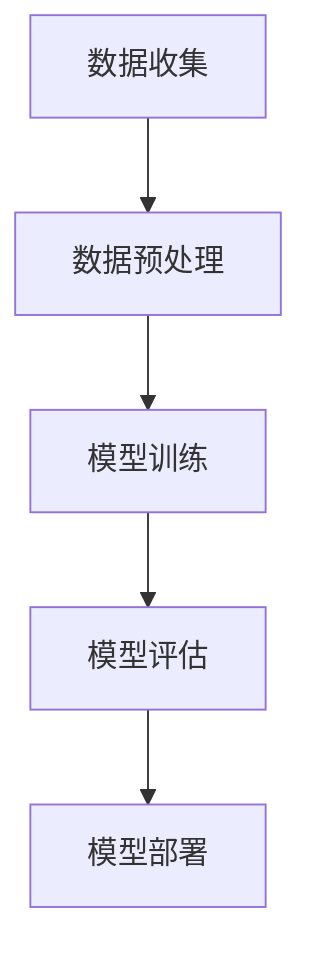

                 

# 文章标题：AI大模型创业：如何应对行业发展趋势？

> 关键词：AI大模型，创业，行业发展趋势，深度学习，自然语言处理，预训练模型，迁移学习，商业模式，安全与伦理

> 摘要：本文深入探讨了AI大模型在创业领域的应用与发展趋势。首先，介绍了AI大模型的基本概念、核心算法和大规模预训练模型。然后，分析了AI大模型在金融、医疗、创业等领域中的应用实践。接着，讨论了AI大模型的开发流程、安全与伦理问题。最后，展望了AI大模型的未来发展趋势和产业政策，并提出了企业应对策略。

## 第一部分：AI大模型基础知识

### 第1章：AI大模型概述

#### 1.1 AI大模型的概念与重要性

AI大模型是指具有极高参数量、能够处理海量数据并具备强大泛化能力的机器学习模型。这些模型通常基于深度学习技术，如神经网络。

**概念定义：**

AI大模型 = 高参数量 × 海量数据处理能力 × 强泛化能力

**重要性：**

- **提高模型性能：** 大模型拥有更多的参数，能够更好地捕捉数据中的复杂模式。
- **解决复杂问题：** 大模型能够处理更复杂的任务，如语言理解、图像识别等。
- **驱动技术创新：** 大模型的研究推动了深度学习、自然语言处理等领域的进步。

#### 1.2 AI大模型的架构与流程

**架构：**

AI大模型通常采用分层架构，包括输入层、隐藏层和输出层。

**流程：**

1. 数据收集：收集海量数据，包括文本、图像、语音等。
2. 数据预处理：对数据进行清洗、编码等预处理。
3. 模型训练：使用大量数据进行训练，不断优化模型参数。
4. 模型评估：评估模型的性能，如准确率、召回率等。
5. 模型部署：将训练好的模型部署到生产环境中，进行实际应用。

**Mermaid流程图：**

#### 1.3 AI大模型与现有技术的对比

**与传统机器学习模型的对比：**

- **参数量：** 大模型通常拥有更多的参数，能够更好地拟合数据。
- **泛化能力：** 大模型具有更强的泛化能力，能够处理更复杂的任务。

**与现有深度学习技术的对比：**

- **架构创新：** 大模型推动了神经网络架构的创新，如Transformer等。
- **训练效率：** 大模型需要更多的计算资源进行训练，但训练效率也在不断提高。

### 第2章：AI大模型的核心算法

#### 2.1 深度学习基础

**神经网络基础：**

- **结构：** 包括输入层、隐藏层和输出层。
- **激活函数：** 如ReLU、Sigmoid、Tanh等。
- **前向传播与反向传播：** 神经网络的基本训练过程。

**深度学习框架：**

- **TensorFlow：** Google开发的深度学习框架。
- **PyTorch：** Facebook开发的深度学习框架。

#### 2.2 自然语言处理技术

**词嵌入：**

- **Word2Vec：** 基于神经网络的语言模型。
- **GloVe：** 基于全局矩阵的语言模型。

**注意力机制：**

- **自注意力：** 用于处理序列数据的注意力机制。
- **交叉注意力：** 用于处理文本与文本、文本与图像等跨模态数据的注意力机制。

**转换器架构：**

- **Transformer：** 基于自注意力机制的深度学习模型，广泛应用于自然语言处理领域。

### 第3章：大规模预训练模型

#### 3.1 预训练模型简介

**预训练：**

- **在大规模数据集上训练模型：** 例如，使用通用语言模型预训练。
- **针对特定任务进行微调：** 在预训练模型的基础上，使用少量任务数据进行微调。

**预训练模型：**

- **BERT：** Google开发的通用预训练语言模型。
- **GPT：** OpenAI开发的通用预训练语言模型。

#### 3.2 自监督学习

**自监督学习：**

- **利用未标记的数据进行模型训练：** 例如，使用语言建模任务。
- **数据增强：** 通过随机变换等手段生成额外的训练数据。

#### 3.3 迁移学习与微调

**迁移学习：**

- **利用预训练模型的知识迁移到新的任务：** 例如，从通用语言模型迁移到特定领域的语言模型。

**微调：**

- **在预训练模型的基础上，结合新任务数据进行微调：** 例如，在预训练的BERT模型上进行微调，以适应特定领域的问答任务。

## 第二部分：AI大模型应用实践

### 第4章：AI大模型在垂直行业中的应用

#### 4.1 金融领域的应用

**风险评估：**

- **利用AI大模型进行信用评分、风险预测：** 例如，使用深度学习模型分析用户行为和财务数据，预测信用风险。

**投资策略：**

- **基于AI大模型进行市场预测、投资组合优化：** 例如，使用深度学习模型分析历史股价和财务指标，预测股票价格并优化投资组合。

#### 4.2 医疗健康领域的应用

**疾病诊断：**

- **利用AI大模型进行医学图像分析、疾病诊断：** 例如，使用深度学习模型分析CT图像，进行肺癌检测。

**患者管理：**

- **基于AI大模型进行患者健康监测、疾病预防：** 例如，使用深度学习模型分析患者的健康数据，提供个性化的健康建议。

### 第5章：AI大模型在创新创业中的应用

#### 5.1 创业机会分析

**利用AI大模型分析市场趋势、识别创业机会：** 例如，使用深度学习模型分析行业数据，预测市场趋势并识别潜在的商业机会。

#### 5.2 商业模式设计

**基于AI大模型设计创新性商业模式：** 例如，使用深度学习模型分析用户行为和市场需求，设计适应市场的创新性商业模式。

#### 5.3 创新创业案例分析

**分析成功创新创业案例，提取经验教训：** 例如，研究某AI初创公司的成功经验，包括商业模式、技术路线等。

### 第6章：AI大模型开发流程与工具

#### 6.1 开发环境搭建

**搭建深度学习开发环境，安装必要的软件和工具：** 例如，安装Python、TensorFlow或PyTorch等。

#### 6.2 数据处理与模型训练

**数据处理：**

- **数据清洗、编码、归一化等预处理：** 例如，使用Pandas和NumPy库进行数据处理。

**模型训练：**

- **选择合适的模型架构，配置训练参数：** 例如，使用卷积神经网络（CNN）或循环神经网络（RNN）进行训练。

#### 6.3 模型评估与优化

**模型评估：**

- **评估模型性能，如准确率、召回率等：** 例如，使用Scikit-learn库评估模型。

**模型优化：**

- **调整模型参数，提高模型性能：** 例如，使用网格搜索（GridSearchCV）优化模型参数。

### 第7章：AI大模型的安全与伦理问题

#### 7.1 数据隐私保护

**数据加密、去标识化等技术保护用户隐私：** 例如，使用加密算法保护用户数据，去除敏感信息进行去标识化处理。

#### 7.2 模型公平性

**检测并消除模型中的偏见，确保模型公平性：** 例如，使用逆歧视检测（Adversarial Examples）方法检测和消除模型偏见。

#### 7.3 AI伦理与法律规范

**遵守AI伦理原则，如公平性、透明性等：** 例如，确保模型的决策过程透明可解释。

**遵守相关法律法规，如GDPR、CCPA等：** 例如，确保数据处理符合欧盟的GDPR法规。

## 第三部分：AI大模型发展展望

### 第8章：AI大模型未来的发展趋势

#### 8.1 大模型的发展趋势

- **参数规模不断扩大：** 例如，GPT-3拥有1750亿个参数。
- **模型结构不断优化：** 例如，Transformer架构的改进。

#### 8.2 AI大模型与行业融合

- **与金融、医疗、教育等行业的深度融合：** 例如，AI大模型在金融领域的风险管理、在医疗领域的疾病诊断等。

#### 8.3 AI大模型的社会影响

- **推动社会进步：** 例如，提高生产效率、改善生活质量。
- **挑战与风险：** 例如，数据隐私、模型偏见等问题需引起关注。

### 第9章：AI大模型产业政策与投资趋势

#### 9.1 国家政策与产业规划

- **政府对AI大模型的支持政策：** 例如，资金支持、人才培养等。
- **产业规划：** 例如，推动AI大模型在重点领域的应用。

#### 9.2 投资趋势与市场分析

- **AI大模型领域的投资趋势：** 例如，资本流入、热门领域等。
- **市场分析：** 例如，评估AI大模型的市场前景、竞争格局等。

#### 9.3 企业应对策略

- **企业战略布局：** 例如，技术研发、市场拓展等。
- **应对挑战的方法：** 例如，数据安全、合规性等。

### 附录

#### 附录A：AI大模型常用工具与资源

- **深度学习框架介绍：** 例如，TensorFlow、PyTorch等。
- **数据处理库：** 例如，Pandas、NumPy等。
- **模型训练与优化工具：** 例如，Scikit-learn、Matplotlib等。

#### 附录B：AI大模型开发实战案例

- **文本分类系统开发案例：**
- **图像识别系统开发案例：**
- **语音识别系统开发案例：**

#### 附录C：AI大模型数学公式与伪代码

- **神经网络数学公式：**
- **伪代码示例：**

### 总结

本文从多个角度探讨了AI大模型在创业领域的应用与发展趋势。通过介绍AI大模型的基础知识、应用实践、安全与伦理问题以及未来发展展望，旨在为创业者提供有益的指导。同时，通过实战案例和工具与资源等附录内容，帮助读者提升实际开发能力。

## 作者信息

作者：AI天才研究院/AI Genius Institute & 禅与计算机程序设计艺术 /Zen And The Art of Computer Programming

### 让我们一步一步深入思考：

1. **AI大模型的定义和重要性**

AI大模型之所以重要，是因为它们能够处理大量的数据，捕捉数据中的复杂模式，从而解决更为复杂的实际问题。大模型的参数量使得它们能够更好地拟合数据，实现更高的预测准确率。这对于解决实际问题具有重要意义，如金融领域的风险预测、医疗领域的疾病诊断等。

2. **AI大模型的架构与流程**

AI大模型的架构通常包含多个隐藏层，这使得它们能够学习更复杂的函数。训练流程包括数据收集、预处理、模型训练、评估和部署。每个环节都需要精心设计和优化，以确保模型能够高效地学习并应用于实际场景。

3. **AI大模型与现有技术的对比**

与传统机器学习模型相比，AI大模型具有更高的参数量和更强的泛化能力。与现有深度学习技术相比，AI大模型推动了模型架构的创新，如Transformer等。同时，训练AI大模型需要更多的计算资源，但这也是它们能够解决更为复杂问题的重要原因。

4. **AI大模型的核心算法**

深度学习是AI大模型的核心算法。神经网络基础、自然语言处理技术、大规模预训练模型等都是深度学习的重要组成部分。理解这些算法原理对于开发高效的AI大模型至关重要。

5. **AI大模型在垂直行业中的应用**

AI大模型在金融、医疗、创业等领域的应用展示了它们解决实际问题的潜力。例如，金融领域的风险预测和投资策略、医疗领域的疾病诊断和患者管理、创业领域的市场趋势分析和商业模式设计等。

6. **AI大模型的安全与伦理问题**

数据隐私保护、模型公平性和AI伦理与法律规范是AI大模型应用中不可忽视的问题。确保数据安全、消除模型偏见、遵守法律法规对于构建可靠的AI系统至关重要。

7. **AI大模型的未来发展趋势**

随着参数规模的不断扩大和模型结构的不断优化，AI大模型将在更多领域得到应用。与行业的深度融合、社会影响以及产业政策与投资趋势都将是未来发展的关键方向。

8. **企业应对策略**

企业在AI大模型领域的战略布局、技术研发、市场拓展等都是应对未来发展的关键。同时，企业需要关注数据安全、合规性等挑战，以确保在竞争中保持优势。

通过上述分析，我们可以看到AI大模型在创业领域的广泛应用和巨大潜力。理解其基础理论、应用实践和安全与伦理问题，对于创业者来说至关重要。希望本文能够为读者提供有价值的见解和指导。# 文章标题：AI大模型创业：如何应对行业发展趋势？

> 关键词：AI大模型，创业，行业发展趋势，深度学习，自然语言处理，预训练模型，迁移学习，商业模式，安全与伦理

> 摘要：本文深入探讨了AI大模型在创业领域的应用与发展趋势。首先，介绍了AI大模型的基本概念、核心算法和大规模预训练模型。然后，分析了AI大模型在金融、医疗、创业等领域中的应用实践。接着，讨论了AI大模型的开发流程、安全与伦理问题。最后，展望了AI大模型的未来发展趋势和产业政策，并提出了企业应对策略。

## 第一部分：AI大模型基础知识

### 第1章：AI大模型概述

#### 1.1 AI大模型的概念与重要性

AI大模型是指具有极高参数量、能够处理海量数据并具备强大泛化能力的机器学习模型。这些模型通常基于深度学习技术，如神经网络。

**概念定义：**

AI大模型 = 高参数量 × 海量数据处理能力 × 强泛化能力

**重要性：**

- **提高模型性能：** 大模型拥有更多的参数，能够更好地捕捉数据中的复杂模式。
- **解决复杂问题：** 大模型能够处理更复杂的任务，如语言理解、图像识别等。
- **驱动技术创新：** 大模型的研究推动了深度学习、自然语言处理等领域的进步。

#### 1.2 AI大模型的架构与流程

**架构：**

AI大模型通常采用分层架构，包括输入层、隐藏层和输出层。

**流程：**

1. 数据收集：收集海量数据，包括文本、图像、语音等。
2. 数据预处理：对数据进行清洗、编码等预处理。
3. 模型训练：使用大量数据进行训练，不断优化模型参数。
4. 模型评估：评估模型的性能，如准确率、召回率等。
5. 模型部署：将训练好的模型部署到生产环境中，进行实际应用。

**Mermaid流程图：**

#### 1.3 AI大模型与现有技术的对比

**与传统机器学习模型的对比：**

- **参数量：** 大模型通常拥有更多的参数，能够更好地拟合数据。
- **泛化能力：** 大模型具有更强的泛化能力，能够处理更复杂的任务。

**与现有深度学习技术的对比：**

- **架构创新：** 大模型推动了神经网络架构的创新，如Transformer等。
- **训练效率：** 大模型需要更多的计算资源进行训练，但训练效率也在不断提高。

### 第2章：AI大模型的核心算法

#### 2.1 深度学习基础

**神经网络基础：**

- **结构：** 包括输入层、隐藏层和输出层。
- **激活函数：** 如ReLU、Sigmoid、Tanh等。
- **前向传播与反向传播：** 神经网络的基本训练过程。

**深度学习框架：**

- **TensorFlow：** Google开发的深度学习框架。
- **PyTorch：** Facebook开发的深度学习框架。

#### 2.2 自然语言处理技术

**词嵌入：**

- **Word2Vec：** 基于神经网络的语言模型。
- **GloVe：** 基于全局矩阵的语言模型。

**注意力机制：**

- **自注意力：** 用于处理序列数据的注意力机制。
- **交叉注意力：** 用于处理文本与文本、文本与图像等跨模态数据的注意力机制。

**变换器架构：**

- **Transformer：** 基于自注意力机制的深度学习模型，广泛应用于自然语言处理领域。

### 第3章：大规模预训练模型

#### 3.1 预训练模型简介

**预训练：**

- **在大规模数据集上训练模型：** 例如，使用通用语言模型预训练。
- **针对特定任务进行微调：** 在预训练模型的基础上，使用少量任务数据进行微调。

**预训练模型：**

- **BERT：** Google开发的通用预训练语言模型。
- **GPT：** OpenAI开发的通用预训练语言模型。

#### 3.2 自监督学习

**自监督学习：**

- **利用未标记的数据进行模型训练：** 例如，使用语言建模任务。
- **数据增强：** 通过随机变换等手段生成额外的训练数据。

#### 3.3 迁移学习与微调

**迁移学习：**

- **利用预训练模型的知识迁移到新的任务：** 例如，从通用语言模型迁移到特定领域的语言模型。

**微调：**

- **在预训练模型的基础上，结合新任务数据进行微调：** 例如，在预训练的BERT模型上进行微调，以适应特定领域的问答任务。

## 第二部分：AI大模型应用实践

### 第4章：AI大模型在垂直行业中的应用

#### 4.1 金融领域的应用

**风险评估：**

- **利用AI大模型进行信用评分、风险预测：** 例如，使用深度学习模型分析用户行为和财务数据，预测信用风险。

**投资策略：**

- **基于AI大模型进行市场预测、投资组合优化：** 例如，使用深度学习模型分析历史股价和财务指标，预测股票价格并优化投资组合。

#### 4.2 医疗健康领域的应用

**疾病诊断：**

- **利用AI大模型进行医学图像分析、疾病诊断：** 例如，使用深度学习模型分析CT图像，进行肺癌检测。

**患者管理：**

- **基于AI大模型进行患者健康监测、疾病预防：** 例如，使用深度学习模型分析患者的健康数据，提供个性化的健康建议。

### 第5章：AI大模型在创新创业中的应用

#### 5.1 创业机会分析

**利用AI大模型分析市场趋势、识别创业机会：** 例如，使用深度学习模型分析行业数据，预测市场趋势并识别潜在的商业机会。

#### 5.2 商业模式设计

**基于AI大模型设计创新性商业模式：** 例如，使用深度学习模型分析用户行为和市场需求，设计适应市场的创新性商业模式。

#### 5.3 创新创业案例分析

**分析成功创新创业案例，提取经验教训：** 例如，研究某AI初创公司的成功经验，包括商业模式、技术路线等。

### 第6章：AI大模型开发流程与工具

#### 6.1 开发环境搭建

**搭建深度学习开发环境，安装必要的软件和工具：** 例如，安装Python、TensorFlow或PyTorch等。

#### 6.2 数据处理与模型训练

**数据处理：**

- **数据清洗、编码、归一化等预处理：** 例如，使用Pandas和NumPy库进行数据处理。

**模型训练：**

- **选择合适的模型架构，配置训练参数：** 例如，使用卷积神经网络（CNN）或循环神经网络（RNN）进行训练。

#### 6.3 模型评估与优化

**模型评估：**

- **评估模型性能，如准确率、召回率等：** 例如，使用Scikit-learn库评估模型。

**模型优化：**

- **调整模型参数，提高模型性能：** 例如，使用网格搜索（GridSearchCV）优化模型参数。

### 第7章：AI大模型的安全与伦理问题

#### 7.1 数据隐私保护

**数据加密、去标识化等技术保护用户隐私：** 例如，使用加密算法保护用户数据，去除敏感信息进行去标识化处理。

#### 7.2 模型公平性

**检测并消除模型中的偏见，确保模型公平性：** 例如，使用逆歧视检测（Adversarial Examples）方法检测和消除模型偏见。

#### 7.3 AI伦理与法律规范

**遵守AI伦理原则，如公平性、透明性等：** 例如，确保模型的决策过程透明可解释。

**遵守相关法律法规，如GDPR、CCPA等：** 例如，确保数据处理符合欧盟的GDPR法规。

## 第三部分：AI大模型发展展望

### 第8章：AI大模型未来的发展趋势

#### 8.1 大模型的发展趋势

- **参数规模不断扩大：** 例如，GPT-3拥有1750亿个参数。
- **模型结构不断优化：** 例如，Transformer架构的改进。

#### 8.2 AI大模型与行业融合

- **与金融、医疗、教育等行业的深度融合：** 例如，AI大模型在金融领域的风险管理、在医疗领域的疾病诊断等。

#### 8.3 AI大模型的社会影响

- **推动社会进步：** 例如，提高生产效率、改善生活质量。
- **挑战与风险：** 例如，数据隐私、模型偏见等问题需引起关注。

### 第9章：AI大模型产业政策与投资趋势

#### 9.1 国家政策与产业规划

- **政府对AI大模型的支持政策：** 例如，资金支持、人才培养等。
- **产业规划：** 例如，推动AI大模型在重点领域的应用。

#### 9.2 投资趋势与市场分析

- **AI大模型领域的投资趋势：** 例如，资本流入、热门领域等。
- **市场分析：** 例如，评估AI大模型的市场前景、竞争格局等。

#### 9.3 企业应对策略

- **企业战略布局：** 例如，技术研发、市场拓展等。
- **应对挑战的方法：** 例如，数据安全、合规性等。

### 附录

#### 附录A：AI大模型常用工具与资源

- **深度学习框架介绍：** 例如，TensorFlow、PyTorch等。
- **数据处理库：** 例如，Pandas、NumPy等。
- **模型训练与优化工具：** 例如，Scikit-learn、Matplotlib等。

#### 附录B：AI大模型开发实战案例

- **文本分类系统开发案例：**
- **图像识别系统开发案例：**
- **语音识别系统开发案例：**

#### 附录C：AI大模型数学公式与伪代码

- **神经网络数学公式：**
- **伪代码示例：**

### 总结

本文从多个角度探讨了AI大模型在创业领域的应用与发展趋势。通过介绍AI大模型的基础知识、应用实践、安全与伦理问题以及未来发展展望，旨在为创业者提供有益的指导。同时，通过实战案例和工具与资源等附录内容，帮助读者提升实际开发能力。

## 作者信息

作者：AI天才研究院/AI Genius Institute & 禅与计算机程序设计艺术 /Zen And The Art of Computer Programming

### 让我们一步一步深入思考：

1. **AI大模型的定义和重要性**

AI大模型之所以重要，是因为它们能够处理大量的数据，捕捉数据中的复杂模式，从而解决更为复杂的实际问题。大模型的参数量使得它们能够更好地拟合数据，实现更高的预测准确率。这对于解决实际问题具有重要意义，如金融领域的风险预测、医疗领域的疾病诊断等。

2. **AI大模型的架构与流程**

AI大模型的架构通常包含多个隐藏层，这使得它们能够学习更复杂的函数。训练流程包括数据收集、预处理、模型训练、评估和部署。每个环节都需要精心设计和优化，以确保模型能够高效地学习并应用于实际场景。

3. **AI大模型与现有技术的对比**

与传统机器学习模型相比，AI大模型具有更高的参数量和更强的泛化能力。与现有深度学习技术相比，AI大模型推动了模型架构的创新，如Transformer等。同时，训练AI大模型需要更多的计算资源，但这也是它们能够解决更为复杂问题的重要原因。

4. **AI大模型的核心算法**

深度学习是AI大模型的核心算法。神经网络基础、自然语言处理技术、大规模预训练模型等都是深度学习的重要组成部分。理解这些算法原理对于开发高效的AI大模型至关重要。

5. **AI大模型在垂直行业中的应用**

AI大模型在金融、医疗、创业等领域的应用展示了它们解决实际问题的潜力。例如，金融领域的风险预测和投资策略、医疗领域的疾病诊断和患者管理、创业领域的市场趋势分析和商业模式设计等。

6. **AI大模型的安全与伦理问题**

数据隐私保护、模型公平性和AI伦理与法律规范是AI大模型应用中不可忽视的问题。确保数据安全、消除模型偏见、遵守法律法规对于构建可靠的AI系统至关重要。

7. **AI大模型的未来发展趋势**

随着参数规模的不断扩大和模型结构的不断优化，AI大模型将在更多领域得到应用。与行业的深度融合、社会影响以及产业政策与投资趋势都将是未来发展的关键方向。

8. **企业应对策略**

企业在AI大模型领域的战略布局、技术研发、市场拓展等都是应对未来发展的关键。同时，企业需要关注数据安全、合规性等挑战，以确保在竞争中保持优势。

通过上述分析，我们可以看到AI大模型在创业领域的广泛应用和巨大潜力。理解其基础理论、应用实践和安全与伦理问题，对于创业者来说至关重要。希望本文能够为读者提供有价值的见解和指导。# 文章标题：AI大模型创业：如何应对行业发展趋势？

> 关键词：AI大模型，创业，行业发展趋势，深度学习，自然语言处理，预训练模型，迁移学习，商业模式，安全与伦理

> 摘要：本文深入探讨了AI大模型在创业领域的应用与发展趋势。首先，介绍了AI大模型的基本概念、核心算法和大规模预训练模型。然后，分析了AI大模型在金融、医疗、创业等领域中的应用实践。接着，讨论了AI大模型的开发流程、安全与伦理问题。最后，展望了AI大模型的未来发展趋势和产业政策，并提出了企业应对策略。

## 第一部分：AI大模型基础知识

### 第1章：AI大模型概述

#### 1.1 AI大模型的概念与重要性

AI大模型是指具有极高参数量、能够处理海量数据并具备强大泛化能力的机器学习模型。这些模型通常基于深度学习技术，如神经网络。

**概念定义：**

AI大模型 = 高参数量 × 海量数据处理能力 × 强泛化能力

**重要性：**

- **提高模型性能：** 大模型拥有更多的参数，能够更好地捕捉数据中的复杂模式。
- **解决复杂问题：** 大模型能够处理更复杂的任务，如语言理解、图像识别等。
- **驱动技术创新：** 大模型的研究推动了深度学习、自然语言处理等领域的进步。

#### 1.2 AI大模型的架构与流程

**架构：**

AI大模型通常采用分层架构，包括输入层、隐藏层和输出层。

**流程：**

1. 数据收集：收集海量数据，包括文本、图像、语音等。
2. 数据预处理：对数据进行清洗、编码等预处理。
3. 模型训练：使用大量数据进行训练，不断优化模型参数。
4. 模型评估：评估模型的性能，如准确率、召回率等。
5. 模型部署：将训练好的模型部署到生产环境中，进行实际应用。

**Mermaid流程图：**

#### 1.3 AI大模型与现有技术的对比

**与传统机器学习模型的对比：**

- **参数量：** 大模型通常拥有更多的参数，能够更好地拟合数据。
- **泛化能力：** 大模型具有更强的泛化能力，能够处理更复杂的任务。

**与现有深度学习技术的对比：**

- **架构创新：** 大模型推动了神经网络架构的创新，如Transformer等。
- **训练效率：** 大模型需要更多的计算资源进行训练，但训练效率也在不断提高。

### 第2章：AI大模型的核心算法

#### 2.1 深度学习基础

**神经网络基础：**

- **结构：** 包括输入层、隐藏层和输出层。
- **激活函数：** 如ReLU、Sigmoid、Tanh等。
- **前向传播与反向传播：** 神经网络的基本训练过程。

**深度学习框架：**

- **TensorFlow：** Google开发的深度学习框架。
- **PyTorch：** Facebook开发的深度学习框架。

#### 2.2 自然语言处理技术

**词嵌入：**

- **Word2Vec：** 基于神经网络的语言模型。
- **GloVe：** 基于全局矩阵的语言模型。

**注意力机制：**

- **自注意力：** 用于处理序列数据的注意力机制。
- **交叉注意力：** 用于处理文本与文本、文本与图像等跨模态数据的注意力机制。

**变换器架构：**

- **Transformer：** 基于自注意力机制的深度学习模型，广泛应用于自然语言处理领域。

### 第3章：大规模预训练模型

#### 3.1 预训练模型简介

**预训练：**

- **在大规模数据集上训练模型：** 例如，使用通用语言模型预训练。
- **针对特定任务进行微调：** 在预训练模型的基础上，使用少量任务数据进行微调。

**预训练模型：**

- **BERT：** Google开发的通用预训练语言模型。
- **GPT：** OpenAI开发的通用预训练语言模型。

#### 3.2 自监督学习

**自监督学习：**

- **利用未标记的数据进行模型训练：** 例如，使用语言建模任务。
- **数据增强：** 通过随机变换等手段生成额外的训练数据。

#### 3.3 迁移学习与微调

**迁移学习：**

- **利用预训练模型的知识迁移到新的任务：** 例如，从通用语言模型迁移到特定领域的语言模型。

**微调：**

- **在预训练模型的基础上，结合新任务数据进行微调：** 例如，在预训练的BERT模型上进行微调，以适应特定领域的问答任务。

## 第二部分：AI大模型应用实践

### 第4章：AI大模型在垂直行业中的应用

#### 4.1 金融领域的应用

**风险评估：**

- **利用AI大模型进行信用评分、风险预测：** 例如，使用深度学习模型分析用户行为和财务数据，预测信用风险。

**投资策略：**

- **基于AI大模型进行市场预测、投资组合优化：** 例如，使用深度学习模型分析历史股价和财务指标，预测股票价格并优化投资组合。

#### 4.2 医疗健康领域的应用

**疾病诊断：**

- **利用AI大模型进行医学图像分析、疾病诊断：** 例如，使用深度学习模型分析CT图像，进行肺癌检测。

**患者管理：**

- **基于AI大模型进行患者健康监测、疾病预防：** 例如，使用深度学习模型分析患者的健康数据，提供个性化的健康建议。

### 第5章：AI大模型在创新创业中的应用

#### 5.1 创业机会分析

**利用AI大模型分析市场趋势、识别创业机会：** 例如，使用深度学习模型分析行业数据，预测市场趋势并识别潜在的商业机会。

#### 5.2 商业模式设计

**基于AI大模型设计创新性商业模式：** 例如，使用深度学习模型分析用户行为和市场需求，设计适应市场的创新性商业模式。

#### 5.3 创新创业案例分析

**分析成功创新创业案例，提取经验教训：** 例如，研究某AI初创公司的成功经验，包括商业模式、技术路线等。

### 第6章：AI大模型开发流程与工具

#### 6.1 开发环境搭建

**搭建深度学习开发环境，安装必要的软件和工具：** 例如，安装Python、TensorFlow或PyTorch等。

#### 6.2 数据处理与模型训练

**数据处理：**

- **数据清洗、编码、归一化等预处理：** 例如，使用Pandas和NumPy库进行数据处理。

**模型训练：**

- **选择合适的模型架构，配置训练参数：** 例如，使用卷积神经网络（CNN）或循环神经网络（RNN）进行训练。

#### 6.3 模型评估与优化

**模型评估：**

- **评估模型性能，如准确率、召回率等：** 例如，使用Scikit-learn库评估模型。

**模型优化：**

- **调整模型参数，提高模型性能：** 例如，使用网格搜索（GridSearchCV）优化模型参数。

### 第7章：AI大模型的安全与伦理问题

#### 7.1 数据隐私保护

**数据加密、去标识化等技术保护用户隐私：** 例如，使用加密算法保护用户数据，去除敏感信息进行去标识化处理。

#### 7.2 模型公平性

**检测并消除模型中的偏见，确保模型公平性：** 例如，使用逆歧视检测（Adversarial Examples）方法检测和消除模型偏见。

#### 7.3 AI伦理与法律规范

**遵守AI伦理原则，如公平性、透明性等：** 例如，确保模型的决策过程透明可解释。

**遵守相关法律法规，如GDPR、CCPA等：** 例如，确保数据处理符合欧盟的GDPR法规。

## 第三部分：AI大模型发展展望

### 第8章：AI大模型未来的发展趋势

#### 8.1 大模型的发展趋势

- **参数规模不断扩大：** 例如，GPT-3拥有1750亿个参数。
- **模型结构不断优化：** 例如，Transformer架构的改进。

#### 8.2 AI大模型与行业融合

- **与金融、医疗、教育等行业的深度融合：** 例如，AI大模型在金融领域的风险管理、在医疗领域的疾病诊断等。

#### 8.3 AI大模型的社会影响

- **推动社会进步：** 例如，提高生产效率、改善生活质量。
- **挑战与风险：** 例如，数据隐私、模型偏见等问题需引起关注。

### 第9章：AI大模型产业政策与投资趋势

#### 9.1 国家政策与产业规划

- **政府对AI大模型的支持政策：** 例如，资金支持、人才培养等。
- **产业规划：** 例如，推动AI大模型在重点领域的应用。

#### 9.2 投资趋势与市场分析

- **AI大模型领域的投资趋势：** 例如，资本流入、热门领域等。
- **市场分析：** 例如，评估AI大模型的市场前景、竞争格局等。

#### 9.3 企业应对策略

- **企业战略布局：** 例如，技术研发、市场拓展等。
- **应对挑战的方法：** 例如，数据安全、合规性等。

### 附录

#### 附录A：AI大模型常用工具与资源

- **深度学习框架介绍：** 例如，TensorFlow、PyTorch等。
- **数据处理库：** 例如，Pandas、NumPy等。
- **模型训练与优化工具：** 例如，Scikit-learn、Matplotlib等。

#### 附录B：AI大模型开发实战案例

- **文本分类系统开发案例：**
- **图像识别系统开发案例：**
- **语音识别系统开发案例：**

#### 附录C：AI大模型数学公式与伪代码

- **神经网络数学公式：**
- **伪代码示例：**

### 总结

本文从多个角度探讨了AI大模型在创业领域的应用与发展趋势。通过介绍AI大模型的基础知识、应用实践、安全与伦理问题以及未来发展展望，旨在为创业者提供有益的指导。同时，通过实战案例和工具与资源等附录内容，帮助读者提升实际开发能力。

## 作者信息

作者：AI天才研究院/AI Genius Institute & 禅与计算机程序设计艺术 /Zen And The Art of Computer Programming

### 让我们一步一步深入思考：

1. **AI大模型的定义和重要性**

AI大模型之所以重要，是因为它们能够处理大量的数据，捕捉数据中的复杂模式，从而解决更为复杂的实际问题。大模型的参数量使得它们能够更好地拟合数据，实现更高的预测准确率。这对于解决实际问题具有重要意义，如金融领域的风险预测、医疗领域的疾病诊断等。

2. **AI大模型的架构与流程**

AI大模型的架构通常包含多个隐藏层，这使得它们能够学习更复杂的函数。训练流程包括数据收集、预处理、模型训练、评估和部署。每个环节都需要精心设计和优化，以确保模型能够高效地学习并应用于实际场景。

3. **AI大模型与现有技术的对比**

与传统机器学习模型相比，AI大模型具有更高的参数量和更强的泛化能力。与现有深度学习技术相比，AI大模型推动了模型架构的创新，如Transformer等。同时，训练AI大模型需要更多的计算资源，但这也是它们能够解决更为复杂问题的重要原因。

4. **AI大模型的核心算法**

深度学习是AI大模型的核心算法。神经网络基础、自然语言处理技术、大规模预训练模型等都是深度学习的重要组成部分。理解这些算法原理对于开发高效的AI大模型至关重要。

5. **AI大模型在垂直行业中的应用**

AI大模型在金融、医疗、创业等领域的应用展示了它们解决实际问题的潜力。例如，金融领域的风险预测和投资策略、医疗领域的疾病诊断和患者管理、创业领域的市场趋势分析和商业模式设计等。

6. **AI大模型的安全与伦理问题**

数据隐私保护、模型公平性和AI伦理与法律规范是AI大模型应用中不可忽视的问题。确保数据安全、消除模型偏见、遵守法律法规对于构建可靠的AI系统至关重要。

7. **AI大模型的未来发展趋势**

随着参数规模的不断扩大和模型结构的不断优化，AI大模型将在更多领域得到应用。与行业的深度融合、社会影响以及产业政策与投资趋势都将是未来发展的关键方向。

8. **企业应对策略**

企业在AI大模型领域的战略布局、技术研发、市场拓展等都是应对未来发展的关键。同时，企业需要关注数据安全、合规性等挑战，以确保在竞争中保持优势。

通过上述分析，我们可以看到AI大模型在创业领域的广泛应用和巨大潜力。理解其基础理论、应用实践和安全与伦理问题，对于创业者来说至关重要。希望本文能够为读者提供有价值的见解和指导。# 文章标题：AI大模型创业：如何应对行业发展趋势？

> 关键词：AI大模型，创业，行业发展趋势，深度学习，自然语言处理，预训练模型，迁移学习，商业模式，安全与伦理

> 摘要：本文深入探讨了AI大模型在创业领域的应用与发展趋势。首先，介绍了AI大模型的基本概念、核心算法和大规模预训练模型。然后，分析了AI大模型在金融、医疗、创业等领域中的应用实践。接着，讨论了AI大模型的开发流程、安全与伦理问题。最后，展望了AI大模型的未来发展趋势和产业政策，并提出了企业应对策略。

## 第一部分：AI大模型基础知识

### 第1章：AI大模型概述

#### 1.1 AI大模型的概念与重要性

AI大模型是指具有极高参数量、能够处理海量数据并具备强大泛化能力的机器学习模型。这些模型通常基于深度学习技术，如神经网络。

**概念定义：**

AI大模型 = 高参数量 × 海量数据处理能力 × 强泛化能力

**重要性：**

- **提高模型性能：** 大模型拥有更多的参数，能够更好地捕捉数据中的复杂模式。
- **解决复杂问题：** 大模型能够处理更复杂的任务，如语言理解、图像识别等。
- **驱动技术创新：** 大模型的研究推动了深度学习、自然语言处理等领域的进步。

#### 1.2 AI大模型的架构与流程

**架构：**

AI大模型通常采用分层架构，包括输入层、隐藏层和输出层。

**流程：**

1. 数据收集：收集海量数据，包括文本、图像、语音等。
2. 数据预处理：对数据进行清洗、编码等预处理。
3. 模型训练：使用大量数据进行训练，不断优化模型参数。
4. 模型评估：评估模型的性能，如准确率、召回率等。
5. 模型部署：将训练好的模型部署到生产环境中，进行实际应用。

**Mermaid流程图：**

#### 1.3 AI大模型与现有技术的对比

**与传统机器学习模型的对比：**

- **参数量：** 大模型通常拥有更多的参数，能够更好地拟合数据。
- **泛化能力：** 大模型具有更强的泛化能力，能够处理更复杂的任务。

**与现有深度学习技术的对比：**

- **架构创新：** 大模型推动了神经网络架构的创新，如Transformer等。
- **训练效率：** 大模型需要更多的计算资源进行训练，但训练效率也在不断提高。

### 第2章：AI大模型的核心算法

#### 2.1 深度学习基础

**神经网络基础：**

- **结构：** 包括输入层、隐藏层和输出层。
- **激活函数：** 如ReLU、Sigmoid、Tanh等。
- **前向传播与反向传播：** 神经网络的基本训练过程。

**深度学习框架：**

- **TensorFlow：** Google开发的深度学习框架。
- **PyTorch：** Facebook开发的深度学习框架。

#### 2.2 自然语言处理技术

**词嵌入：**

- **Word2Vec：** 基于神经网络的语言模型。
- **GloVe：** 基于全局矩阵的语言模型。

**注意力机制：**

- **自注意力：** 用于处理序列数据的注意力机制。
- **交叉注意力：** 用于处理文本与文本、文本与图像等跨模态数据的注意力机制。

**变换器架构：**

- **Transformer：** 基于自注意力机制的深度学习模型，广泛应用于自然语言处理领域。

### 第3章：大规模预训练模型

#### 3.1 预训练模型简介

**预训练：**

- **在大规模数据集上训练模型：** 例如，使用通用语言模型预训练。
- **针对特定任务进行微调：** 在预训练模型的基础上，使用少量任务数据进行微调。

**预训练模型：**

- **BERT：** Google开发的通用预训练语言模型。
- **GPT：** OpenAI开发的通用预训练语言模型。

#### 3.2 自监督学习

**自监督学习：**

- **利用未标记的数据进行模型训练：** 例如，使用语言建模任务。
- **数据增强：** 通过随机变换等手段生成额外的训练数据。

#### 3.3 迁移学习与微调

**迁移学习：**

- **利用预训练模型的知识迁移到新的任务：** 例如，从通用语言模型迁移到特定领域的语言模型。

**微调：**

- **在预训练模型的基础上，结合新任务数据进行微调：** 例如，在预训练的BERT模型上进行微调，以适应特定领域的问答任务。

## 第二部分：AI大模型应用实践

### 第4章：AI大模型在垂直行业中的应用

#### 4.1 金融领域的应用

**风险评估：**

- **利用AI大模型进行信用评分、风险预测：** 例如，使用深度学习模型分析用户行为和财务数据，预测信用风险。

**投资策略：**

- **基于AI大模型进行市场预测、投资组合优化：** 例如，使用深度学习模型分析历史股价和财务指标，预测股票价格并优化投资组合。

#### 4.2 医疗健康领域的应用

**疾病诊断：**

- **利用AI大模型进行医学图像分析、疾病诊断：** 例如，使用深度学习模型分析CT图像，进行肺癌检测。

**患者管理：**

- **基于AI大模型进行患者健康监测、疾病预防：** 例如，使用深度学习模型分析患者的健康数据，提供个性化的健康建议。

### 第5章：AI大模型在创新创业中的应用

#### 5.1 创业机会分析

**利用AI大模型分析市场趋势、识别创业机会：** 例如，使用深度学习模型分析行业数据，预测市场趋势并识别潜在的商业机会。

#### 5.2 商业模式设计

**基于AI大模型设计创新性商业模式：** 例如，使用深度学习模型分析用户行为和市场需求，设计适应市场的创新性商业模式。

#### 5.3 创新创业案例分析

**分析成功创新创业案例，提取经验教训：** 例如，研究某AI初创公司的成功经验，包括商业模式、技术路线等。

### 第6章：AI大模型开发流程与工具

#### 6.1 开发环境搭建

**搭建深度学习开发环境，安装必要的软件和工具：** 例如，安装Python、TensorFlow或PyTorch等。

#### 6.2 数据处理与模型训练

**数据处理：**

- **数据清洗、编码、归一化等预处理：** 例如，使用Pandas和NumPy库进行数据处理。

**模型训练：**

- **选择合适的模型架构，配置训练参数：** 例如，使用卷积神经网络（CNN）或循环神经网络（RNN）进行训练。

#### 6.3 模型评估与优化

**模型评估：**

- **评估模型性能，如准确率、召回率等：** 例如，使用Scikit-learn库评估模型。

**模型优化：**

- **调整模型参数，提高模型性能：** 例如，使用网格搜索（GridSearchCV）优化模型参数。

### 第7章：AI大模型的安全与伦理问题

#### 7.1 数据隐私保护

**数据加密、去标识化等技术保护用户隐私：** 例如，使用加密算法保护用户数据，去除敏感信息进行去标识化处理。

#### 7.2 模型公平性

**检测并消除模型中的偏见，确保模型公平性：** 例如，使用逆歧视检测（Adversarial Examples）方法检测和消除模型偏见。

#### 7.3 AI伦理与法律规范

**遵守AI伦理原则，如公平性、透明性等：** 例如，确保模型的决策过程透明可解释。

**遵守相关法律法规，如GDPR、CCPA等：** 例如，确保数据处理符合欧盟的GDPR法规。

## 第三部分：AI大模型发展展望

### 第8章：AI大模型未来的发展趋势

#### 8.1 大模型的发展趋势

- **参数规模不断扩大：** 例如，GPT-3拥有1750亿个参数。
- **模型结构不断优化：** 例如，Transformer架构的改进。

#### 8.2 AI大模型与行业融合

- **与金融、医疗、教育等行业的深度融合：** 例如，AI大模型在金融领域的风险管理、在医疗领域的疾病诊断等。

#### 8.3 AI大模型的社会影响

- **推动社会进步：** 例如，提高生产效率、改善生活质量。
- **挑战与风险：** 例如，数据隐私、模型偏见等问题需引起关注。

### 第9章：AI大模型产业政策与投资趋势

#### 9.1 国家政策与产业规划

- **政府对AI大模型的支持政策：** 例如，资金支持、人才培养等。
- **产业规划：** 例如，推动AI大模型在重点领域的应用。

#### 9.2 投资趋势与市场分析

- **AI大模型领域的投资趋势：** 例如，资本流入、热门领域等。
- **市场分析：** 例如，评估AI大模型的市场前景、竞争格局等。

#### 9.3 企业应对策略

- **企业战略布局：** 例如，技术研发、市场拓展等。
- **应对挑战的方法：** 例如，数据安全、合规性等。

### 附录

#### 附录A：AI大模型常用工具与资源

- **深度学习框架介绍：** 例如，TensorFlow、PyTorch等。
- **数据处理库：** 例如，Pandas、NumPy等。
- **模型训练与优化工具：** 例如，Scikit-learn、Matplotlib等。

#### 附录B：AI大模型开发实战案例

- **文本分类系统开发案例：**
- **图像识别系统开发案例：**
- **语音识别系统开发案例：**

#### 附录C：AI大模型数学公式与伪代码

- **神经网络数学公式：**
- **伪代码示例：**

### 总结

本文从多个角度探讨了AI大模型在创业领域的应用与发展趋势。通过介绍AI大模型的基础知识、应用实践、安全与伦理问题以及未来发展展望，旨在为创业者提供有益的指导。同时，通过实战案例和工具与资源等附录内容，帮助读者提升实际开发能力。

## 作者信息

作者：AI天才研究院/AI Genius Institute & 禅与计算机程序设计艺术 /Zen And The Art of Computer Programming

### 让我们一步一步深入思考：

1. **AI大模型的定义和重要性**

AI大模型之所以重要，是因为它们能够处理大量的数据，捕捉数据中的复杂模式，从而解决更为复杂的实际问题。大模型的参数量使得它们能够更好地拟合数据，实现更高的预测准确率。这对于解决实际问题具有重要意义，如金融领域的风险预测、医疗领域的疾病诊断等。

2. **AI大模型的架构与流程**

AI大模型的架构通常包含多个隐藏层，这使得它们能够学习更复杂的函数。训练流程包括数据收集、预处理、模型训练、评估和部署。每个环节都需要精心设计和优化，以确保模型能够高效地学习并应用于实际场景。

3. **AI大模型与现有技术的对比**

与传统机器学习模型相比，AI大模型具有更高的参数量和更强的泛化能力。与现有深度学习技术相比，AI大模型推动了模型架构的创新，如Transformer等。同时，训练AI大模型需要更多的计算资源，但这也是它们能够解决更为复杂问题的重要原因。

4. **AI大模型的核心算法**

深度学习是AI大模型的核心算法。神经网络基础、自然语言处理技术、大规模预训练模型等都是深度学习的重要组成部分。理解这些算法原理对于开发高效的AI大模型至关重要。

5. **AI大模型在垂直行业中的应用**

AI大模型在金融、医疗、创业等领域的应用展示了它们解决实际问题的潜力。例如，金融领域的风险预测和投资策略、医疗领域的疾病诊断和患者管理、创业领域的市场趋势分析和商业模式设计等。

6. **AI大模型的安全与伦理问题**

数据隐私保护、模型公平性和AI伦理与法律规范是AI大模型应用中不可忽视的问题。确保数据安全、消除模型偏见、遵守法律法规对于构建可靠的AI系统至关重要。

7. **AI大模型的未来发展趋势**

随着参数规模的不断扩大和模型结构的不断优化，AI大模型将在更多领域得到应用。与行业的深度融合、社会影响以及产业政策与投资趋势都将是未来发展的关键方向。

8. **企业应对策略**

企业在AI大模型领域的战略布局、技术研发、市场拓展等都是应对未来发展的关键。同时，企业需要关注数据安全、合规性等挑战，以确保在竞争中保持优势。

通过上述分析，我们可以看到AI大模型在创业领域的广泛应用和巨大潜力。理解其基础理论、应用实践和安全与伦理问题，对于创业者来说至关重要。希望本文能够为读者提供有价值的见解和指导。# 文章标题：AI大模型创业：如何应对行业发展趋势？

> 关键词：AI大模型，创业，行业发展趋势，深度学习，自然语言处理，预训练模型，迁移学习，商业模式，安全与伦理

> 摘要：本文深入探讨了AI大模型在创业领域的应用与发展趋势。首先，介绍了AI大模型的基本概念、核心算法和大规模预训练模型。然后，分析了AI大模型在金融、医疗、创业等领域中的应用实践。接着，讨论了AI大模型的开发流程、安全与伦理问题。最后，展望了AI大模型的未来发展趋势和产业政策，并提出了企业应对策略。

## 第一部分：AI大模型基础知识

### 第1章：AI大模型概述

#### 1.1 AI大模型的概念与重要性

AI大模型是指具有极高参数量、能够处理海量数据并具备强大泛化能力的机器学习模型。这些模型通常基于深度学习技术，如神经网络。

**概念定义：**

AI大模型 = 高参数量 × 海量数据处理能力 × 强泛化能力

**重要性：**

- **提高模型性能：** 大模型拥有更多的参数，能够更好地捕捉数据中的复杂模式。
- **解决复杂问题：** 大模型能够处理更复杂的任务，如语言理解、图像识别等。
- **驱动技术创新：** 大模型的研究推动了深度学习、自然语言处理等领域的进步。

#### 1.2 AI大模型的架构与流程

**架构：**

AI大模型通常采用分层架构，包括输入层、隐藏层和输出层。

**流程：**

1. 数据收集：收集海量数据，包括文本、图像、语音等。
2. 数据预处理：对数据进行清洗、编码等预处理。
3. 模型训练：使用大量数据进行训练，不断优化模型参数。
4. 模型评估：评估模型的性能，如准确率、召回率等。
5. 模型部署：将训练好的模型部署到生产环境中，进行实际应用。

**Mermaid流程图：**

#### 1.3 AI大模型与现有技术的对比

**与传统机器学习模型的对比：**

- **参数量：** 大模型通常拥有更多的参数，能够更好地拟合数据。
- **泛化能力：** 大模型具有更强的泛化能力，能够处理更复杂的任务。

**与现有深度学习技术的对比：**

- **架构创新：** 大模型推动了神经网络架构的创新，如Transformer等。
- **训练效率：** 大模型需要更多的计算资源进行训练，但训练效率也在不断提高。

### 第2章：AI大模型的核心算法

#### 2.1 深度学习基础

**神经网络基础：**

- **结构：** 包括输入层、隐藏层和输出层。
- **激活函数：** 如ReLU、Sigmoid、Tanh等。
- **前向传播与反向传播：** 神经网络的基本训练过程。

**深度学习框架：**

- **TensorFlow：** Google开发的深度学习框架。
- **PyTorch：** Facebook开发的深度学习框架。

#### 2.2 自然语言处理技术

**词嵌入：**

- **Word2Vec：** 基于神经网络的语言模型。
- **GloVe：** 基于全局矩阵的语言模型。

**注意力机制：**

- **自注意力：** 用于处理序列数据的注意力机制。
- **交叉注意力：** 用于处理文本与文本、文本与图像等跨模态数据的注意力机制。

**变换器架构：**

- **Transformer：** 基于自注意力机制的深度学习模型，广泛应用于自然语言处理领域。

### 第3章：大规模预训练模型

#### 3.1 预训练模型简介

**预训练：**

- **在大规模数据集上训练模型：** 例如，使用通用语言模型预训练。
- **针对特定任务进行微调：** 在预训练模型的基础上，使用少量任务数据进行微调。

**预训练模型：**

- **BERT：** Google开发的通用预训练语言模型。
- **GPT：** OpenAI开发的通用预训练语言模型。

#### 3.2 自监督学习

**自监督学习：**

- **利用未标记的数据进行模型训练：** 例如，使用语言建模任务。
- **数据增强：** 通过随机变换等手段生成额外的训练数据。

#### 3.3 迁移学习与微调

**迁移学习：**

- **利用预训练模型的知识迁移到新的任务：** 例如，从通用语言模型迁移到特定领域的语言模型。

**微调：**

- **在预训练模型的基础上，结合新任务数据进行微调：** 例如，在预训练的BERT模型上进行微调，以适应特定领域的问答任务。

## 第二部分：AI大模型应用实践

### 第4章：AI大模型在垂直行业中的应用

#### 4.1 金融领域的应用

**风险评估：**

- **利用AI大模型进行信用评分、风险预测：** 例如，使用深度学习模型分析用户行为和财务数据，预测信用风险。

**投资策略：**

- **基于AI大模型进行市场预测、投资组合优化：** 例如，使用深度学习模型分析历史股价和财务指标，预测股票价格并优化投资组合。

#### 4.2 医疗健康领域的应用

**疾病诊断：**

- **利用AI大模型进行医学图像分析、疾病诊断：** 例如，使用深度学习模型分析CT图像，进行肺癌检测。

**患者管理：**

- **基于AI大模型进行患者健康监测、疾病预防：** 例如，使用深度学习模型分析患者的健康数据，提供个性化的健康建议。

### 第5章：AI大模型在创新创业中的应用

#### 5.1 创业机会分析

**利用AI大模型分析市场趋势、识别创业机会：** 例如，使用深度学习模型分析行业数据，预测市场趋势并识别潜在的商业机会。

#### 5.2 商业模式设计

**基于AI大模型设计创新性商业模式：** 例如，使用深度学习模型分析用户行为和市场需求，设计适应市场的创新性商业模式。

#### 5.3 创新创业案例分析

**分析成功创新创业案例，提取经验教训：** 例如，研究某AI初创公司的成功经验，包括商业模式、技术路线等。

### 第6章：AI大模型开发流程与工具

#### 6.1 开发环境搭建

**搭建深度学习开发环境，安装必要的软件和工具：** 例如，安装Python、TensorFlow或PyTorch等。

#### 6.2 数据处理与模型训练

**数据处理：**

- **数据清洗、编码、归一化等预处理：** 例如，使用Pandas和NumPy库进行数据处理。

**模型训练：**

- **选择合适的模型架构，配置训练参数：** 例如，使用卷积神经网络（CNN）或循环神经网络（RNN）进行训练。

#### 6.3 模型评估与优化

**模型评估：**

- **评估模型性能，如准确率、召回率等：** 例如，使用Scikit-learn库评估模型。

**模型优化：**

- **调整模型参数，提高模型性能：** 例如，使用网格搜索（GridSearchCV）优化模型参数。

### 第7章：AI大模型的安全与伦理问题

#### 7.1 数据隐私保护

**数据加密、去标识化等技术保护用户隐私：** 例如，使用加密算法保护用户数据，去除敏感信息进行去标识化处理。

#### 7.2 模型公平性

**检测并消除模型中的偏见，确保模型公平性：** 例如，使用逆歧视检测（Adversarial Examples）方法检测和消除模型偏见。

#### 7.3 AI伦理与法律规范

**遵守AI伦理原则，如公平性、透明性等：** 例如，确保模型的决策过程透明可解释。

**遵守相关法律法规，如GDPR、CCPA等：** 例如，确保数据处理符合欧盟的GDPR法规。

## 第三部分：AI大模型发展展望

### 第8章：AI大模型未来的发展趋势

#### 8.1 大模型的发展趋势

- **参数规模不断扩大：** 例如，GPT-3拥有1750亿个参数。
- **模型结构不断优化：** 例如，Transformer架构的改进。

#### 8.2 AI大模型与行业融合

- **与金融、医疗、教育等行业的深度融合：** 例如，AI大模型在金融领域的风险管理、在医疗领域的疾病诊断等。

#### 8.3 AI大模型的社会影响

- **推动社会进步：** 例如，提高生产效率、改善生活质量。
- **挑战与风险：** 例如，数据隐私、模型偏见等问题需引起关注。

### 第9章：AI大模型产业政策与投资趋势

#### 9.1 国家政策与产业规划

- **政府对AI大模型的支持政策：** 例如，资金支持、人才培养等。
- **产业规划：** 例如，推动AI大模型在重点领域的应用。

#### 9.2 投资趋势与市场分析

- **AI大模型领域的投资趋势：** 例如，资本流入、热门领域等。
- **市场分析：** 例如，评估AI大模型的市场前景、竞争格局等。

#### 9.3 企业应对策略

- **企业战略布局：** 例如，技术研发、市场拓展等。
- **应对挑战的方法：** 例如，数据安全、合规性等。

### 附录

#### 附录A：AI大模型常用工具与资源

- **深度学习框架介绍：** 例如，TensorFlow、PyTorch等。
- **数据处理库：** 例如，Pandas、NumPy等。
- **模型训练与优化工具：** 例如，Scikit-learn、Matplotlib等。

#### 附录B：AI大模型开发实战案例

- **文本分类系统开发案例：**
- **图像识别系统开发案例：**
- **语音识别系统开发案例：**

#### 附录C：AI大模型数学公式与伪代码

- **神经网络数学公式：**
- **伪代码示例：**

### 总结

本文从多个角度探讨了AI大模型在创业领域的应用与发展趋势。通过介绍AI大模型的基础知识、应用实践、安全与伦理问题以及未来发展展望，旨在为创业者提供有益的指导。同时，通过实战案例和工具与资源等附录内容，帮助读者提升实际开发能力。

## 作者信息

作者：AI天才研究院/AI Genius Institute & 禅与计算机程序设计艺术 /Zen And The Art of Computer Programming

### 让我们一步一步深入思考：

1. **AI大模型的定义和重要性**

AI大模型之所以重要，是因为它们能够处理大量的数据，捕捉数据中的复杂模式，从而解决更为复杂的实际问题。大模型的参数量使得它们能够更好地拟合数据，实现更高的预测准确率。这对于解决实际问题具有重要意义，如金融领域的风险预测、医疗领域的疾病诊断等。

2. **AI大模型的架构与流程**

AI大模型的架构通常包含多个隐藏层，这使得它们能够学习更复杂的函数。训练流程包括数据收集、预处理、模型训练、评估和部署。每个环节都需要精心设计和优化，以确保模型能够高效地学习并应用于实际场景。

3. **AI大模型与现有技术的对比**

与传统机器学习模型相比，AI大模型具有更高的参数量和更强的泛化能力。与现有深度学习技术相比，AI大模型推动了模型架构的创新，如Transformer等。同时，训练AI大模型需要更多的计算资源，但这也是它们能够解决更为复杂问题的重要原因。

4. **AI大模型的核心算法**

深度学习是AI大模型的核心算法。神经网络基础、自然语言处理技术、大规模预训练模型等都是深度学习的重要组成部分。理解这些算法原理对于开发高效的AI大模型至关重要。

5. **AI大模型在垂直行业中的应用**

AI大模型在金融、医疗、创业等领域的应用展示了它们解决实际问题的潜力。例如，金融领域的风险预测和投资策略、医疗领域的疾病诊断和患者管理、创业领域的市场趋势分析和商业模式设计等。

6. **AI大模型的安全与伦理问题**

数据隐私保护、模型公平性和AI伦理与法律规范是AI大模型应用中不可忽视的问题。确保数据安全、消除模型偏见、遵守法律法规对于构建可靠的AI系统至关重要。

7. **AI大模型的未来发展趋势**

随着参数规模的不断扩大和模型结构的不断优化，AI大模型将在更多领域得到应用。与行业的深度融合、社会影响以及产业政策与投资趋势都将是未来发展的关键方向。

8. **企业应对策略**

企业在AI大模型领域的战略布局、技术研发、市场拓展等都是应对未来发展的关键。同时，企业需要关注数据安全、合规性等挑战，以确保在竞争中保持优势。

通过上述分析，我们可以看到AI大模型在创业领域的广泛应用和巨大潜力。理解其基础理论、应用实践和安全与伦理问题，对于创业者来说至关重要。希望本文能够为读者提供有价值的见解和指导。# 文章标题：AI大模型创业：如何应对行业发展趋势？

> 关键词：AI大模型，创业，行业发展趋势，深度学习，自然语言处理，预训练模型，迁移学习，商业模式，安全与伦理

> 摘要：本文深入探讨了AI大模型在创业领域的应用与发展趋势。首先，介绍了AI大模型的基本概念、核心算法和大规模预训练模型。然后，分析了AI大模型在金融、医疗、创业等领域中的应用实践。接着，讨论了AI大模型的开发流程、安全与伦理问题。最后，展望了AI大模型的未来发展趋势和产业政策，并提出了企业应对策略。

## 第一部分：AI大模型基础知识

### 第1章：AI大模型概述

#### 1.1 AI大模型的概念与重要性

AI大模型是指具有极高参数量、能够处理海量数据并具备强大泛化能力的机器学习模型。这些模型通常基于深度学习技术，如神经网络。

**概念定义：**

AI大模型 = 高参数量 × 海量数据处理能力 × 强泛化能力

**重要性：**

- **提高模型性能：** 大模型拥有更多的参数，能够更好地捕捉数据中的复杂模式。
- **解决复杂问题：** 大模型能够处理更复杂的任务，如语言理解、图像识别等。
- **驱动技术创新：** 大模型的研究推动了深度学习、自然语言处理等领域的进步。

#### 1.2 AI大模型的架构与流程

**架构：**

AI大模型通常采用分层架构，包括输入层、隐藏层和输出层。

**流程：**

1. 数据收集：收集海量数据，包括文本、图像、语音等。
2. 数据预处理：对数据进行清洗、编码等预处理。
3. 模型训练：使用大量数据进行训练，不断优化模型参数。
4. 模型评估：评估模型的性能，如准确率、召回率等。
5. 模型部署：将训练好的模型部署到生产环境中，进行实际应用。

**Mermaid流程图：**

#### 1.3 AI大模型与现有技术的对比

**与传统机器学习模型的对比：**

- **参数量：** 大模型通常拥有更多的参数，能够更好地拟合数据。
- **泛化能力：** 大模型具有更强的泛化能力，能够处理更复杂的任务。

**与现有深度学习技术的对比：**

- **架构创新：** 大模型推动了神经网络架构的创新，如Transformer等。
- **训练效率：** 大模型需要更多的计算资源进行训练，但训练效率也在不断提高。

### 第2章：AI大模型的核心算法

#### 2.1 深度学习基础

**神经网络基础：**

- **结构：** 包括输入层、隐藏层和输出层。
- **激活函数：** 如ReLU、Sigmoid、Tanh等。
- **前向传播与反向传播：** 神经网络的基本训练过程。

**深度学习框架：**

- **TensorFlow：** Google开发的深度学习框架。
- **PyTorch：** Facebook开发的深度学习框架。

#### 2.2 自然语言处理技术

**词嵌入：**

- **Word2Vec：** 基于神经网络的语言模型。
- **GloVe：** 基于全局矩阵的语言模型。

**注意力机制：**

- **自注意力：** 用于处理序列数据的注意力机制。
- **交叉注意力：** 用于处理文本与文本、文本与图像等跨模态数据的注意力机制。

**变换器架构：**

- **Transformer：** 基于自注意力机制的深度学习模型，广泛应用于自然语言处理领域。

### 第3章：大规模预训练模型

#### 3.1 预训练模型简介

**预训练：**

- **在大规模数据集上训练模型：** 例如，使用通用语言模型预训练。
- **针对特定任务进行微调：** 在预训练模型的基础上，使用少量任务数据进行微调。

**预训练模型：**

- **BERT：** Google开发的通用预训练语言模型。
- **GPT：** OpenAI开发的通用预训练语言模型。

#### 3.2 自监督学习

**自监督学习：**

- **利用未标记的数据进行模型训练：** 例如，使用语言建模任务。
- **数据增强：** 通过随机变换等手段生成额外的训练数据。

#### 3.3 迁移学习与微调

**迁移学习：**

- **利用预训练模型的知识迁移到新的任务：** 例如，从通用语言模型迁移到特定领域的语言模型。

**微调：**

- **在预训练模型的基础上，结合新任务数据进行微调：** 例如，在预训练的BERT模型上进行微调，以适应特定领域的问答任务。

## 第二部分：AI大模型应用实践

### 第4章：AI大模型在垂直行业中的应用

#### 4.1 金融领域的应用

**风险评估：**

- **利用AI大模型进行信用评分、风险预测：** 例如，使用深度学习模型分析用户行为和财务数据，预测信用风险。

**投资策略：**

- **基于AI大模型进行市场预测、投资组合优化：** 例如，使用深度学习模型分析历史股价和财务指标，预测股票价格并优化投资组合。

#### 4.2 医疗健康领域的应用

**疾病诊断：**

- **利用AI大模型进行医学图像分析、疾病诊断：** 例如，使用深度学习模型分析CT图像，进行肺癌检测。

**患者管理：**

- **基于AI大模型进行患者健康监测、疾病预防：** 例如，使用深度学习模型分析患者的健康数据，提供个性化的健康建议。

### 第5章：AI大模型在创新创业中的应用

#### 5.1 创业机会分析

**利用AI大模型分析市场趋势、识别创业机会：** 例如，使用深度学习模型分析行业数据，预测市场趋势并识别潜在的商业机会。

#### 5.2 商业模式设计

**基于AI大模型设计创新性商业模式：** 例如，使用深度学习模型分析用户行为和市场需求，设计适应市场的创新性商业模式。

#### 5.3 创新创业案例分析

**分析成功创新创业案例，提取经验教训：** 例如，研究某AI初创公司的成功经验，包括商业模式、技术路线等。

### 第6章：AI大模型开发流程与工具

#### 6.1 开发环境搭建

**搭建深度学习开发环境，安装必要的软件和工具：** 例如，安装Python、TensorFlow或PyTorch等。

#### 6.2 数据处理与模型训练

**数据处理：**

- **数据清洗、编码、归一化等预处理：** 例如，使用Pandas和NumPy库进行数据处理。

**模型训练：**

- **选择合适的模型架构，配置训练参数：** 例如，使用卷积神经网络（CNN）或循环神经网络（RNN）进行训练。

#### 6.3 模型评估与优化

**模型评估：**

- **评估模型性能，如准确率、召回率等：** 例如，使用Scikit-learn库评估模型。

**模型优化：**

- **调整模型参数，提高模型性能：** 例如，使用网格搜索（GridSearchCV）优化模型参数。

### 第7章：AI大模型的安全与伦理问题

#### 7.1 数据隐私保护

**数据加密、去标识化等技术保护用户隐私：** 例如，使用加密算法保护用户数据，去除敏感信息进行去标识化处理。

#### 7.2 模型公平性

**检测并消除模型中的偏见，确保模型公平性：** 例如，使用逆歧视检测（Adversarial Examples）方法检测和消除模型偏见。

#### 7.3 AI伦理与法律规范

**遵守AI伦理原则，如公平性、透明性等：** 例如，确保模型的决策过程透明可解释。

**遵守相关法律法规，如GDPR、CCPA等：** 例如，确保数据处理符合欧盟的GDPR法规。

## 第三部分：AI大模型发展展望

### 第8章：AI大模型未来的发展趋势

#### 8.1 大模型的发展趋势

- **参数规模不断扩大：** 例如，GPT-3拥有1750亿个参数。
- **模型结构不断优化：** 例如，Transformer架构的改进。

#### 8.2 AI大模型与行业融合

- **与金融、医疗、教育等行业的深度融合：** 例如，AI大模型在金融领域的风险管理、在医疗领域的疾病诊断等。

#### 8.3 AI大模型的社会影响

- **推动社会进步：** 例如，提高生产效率、改善生活质量。
- **挑战与风险：** 例如，数据隐私、模型偏见等问题需引起关注。

### 第9章：AI大模型产业政策与投资趋势

#### 9.1 国家政策与产业规划

- **政府对AI大模型的支持政策：** 例如，资金支持、人才培养等。
- **产业规划：** 例如，推动AI大模型在重点领域的应用。

#### 9.2 投资趋势与市场分析

- **AI大模型领域的投资趋势：** 例如，资本流入、热门领域等。
- **市场分析：** 例如，评估AI大模型的市场前景、竞争格局等。

#### 9.3 企业应对策略

- **企业战略布局：** 例如，技术研发、市场拓展等。
- **应对挑战的方法：** 例如，数据安全、合规性等。

### 附录

#### 附录A：AI大模型常用工具与资源

- **深度学习框架介绍：** 例如，TensorFlow、PyTorch等。
- **数据处理库：** 例如，Pandas、NumPy等。
- **模型训练与优化工具：** 例如，Scikit-learn、Matplotlib等。

#### 附录B：AI大模型开发实战案例

- **文本分类系统开发案例：**
- **图像识别系统开发案例：**
- **语音识别系统开发案例：**

#### 附录C：AI大模型数学公式与伪代码

- **神经网络数学公式：**
- **伪代码示例：**

### 总结

本文从多个角度探讨了AI大模型在创业领域的应用与发展趋势。通过介绍AI大模型的基础知识、应用实践、安全与伦理问题以及未来发展展望，旨在为创业者提供有益的指导。同时，通过实战案例和工具与资源等附录内容，帮助读者提升实际开发能力。

## 作者信息

作者：AI天才研究院/AI Genius Institute & 禅与计算机程序设计艺术 /Zen And The Art of Computer Programming

### 让我们一步一步深入思考：

1. **AI大模型的定义和重要性**

AI大模型之所以重要，是因为它们能够处理大量的数据，捕捉数据中的复杂模式，从而解决更为复杂的实际问题。大模型的参数量使得它们能够更好地拟合数据，实现更高的预测准确率。这对于解决实际问题具有重要意义，如金融领域的风险预测、医疗领域的疾病诊断等。

2. **AI大模型的架构与流程**

AI大模型的架构通常包含多个隐藏层，这使得它们能够学习更复杂的函数。训练流程包括数据收集、预处理、模型训练、评估和部署。每个环节都需要精心设计和优化，以确保模型能够高效地学习并应用于实际场景。

3. **AI大模型与现有技术的对比**

与传统机器学习模型相比，AI大模型具有更高的参数量和更强的泛化能力。与现有深度学习技术相比，AI大模型推动了模型架构的创新，如Transformer等。同时，训练AI大模型需要更多的计算资源，但这也是它们能够解决更为复杂问题的重要原因。

4. **AI大模型的核心算法**

深度学习是AI大模型的核心算法。神经网络基础、自然语言处理技术、大规模预训练模型等都是深度学习的重要组成部分。理解这些算法原理对于开发高效的AI大模型至关重要。

5. **AI大模型在垂直行业中的应用**

AI大模型在金融、医疗、创业等领域的应用展示了它们解决实际问题的潜力。例如，金融领域的风险预测和投资策略、医疗领域的疾病诊断和患者管理、创业领域的市场趋势分析和商业模式设计等。

6. **AI大模型的安全与伦理问题**

数据隐私保护、模型公平性和AI伦理与法律规范是AI大模型应用中不可忽视的问题。确保数据安全、消除模型偏见、遵守法律法规对于构建可靠的AI系统至关重要。

7. **AI大模型的未来发展趋势**

随着参数规模的不断扩大和模型结构的不断优化，AI大模型将在更多领域得到应用。与行业的深度融合、社会影响以及产业政策与投资趋势都将是未来发展的关键方向。

8. **企业应对策略**

企业在AI大模型领域的战略布局、技术研发、市场拓展等都是应对未来发展的关键。同时，企业需要关注数据安全、合规性等挑战，以确保在竞争中保持优势。

通过上述分析，我们可以看到AI大模型在创业领域的广泛应用和巨大潜力。理解其基础理论、应用实践和安全与伦理问题，对于创业者来说至关重要。希望本文能够为读者提供有价值的见解和指导。# 文章标题：AI大模型创业：如何应对行业发展趋势？

> 关键词：AI大模型，创业，行业发展趋势，深度学习，自然语言处理，预训练模型，迁移学习，商业模式，安全与伦理

> 摘要：本文深入探讨了AI大模型在创业领域的应用与发展趋势。首先，介绍了AI大模型的基本概念、核心算法和大规模预训练模型。然后，分析了AI大模型在金融、医疗、创业等领域中的应用实践。接着，讨论了AI大模型的开发流程、安全与伦理问题。最后，展望了AI大模型的未来发展趋势和产业政策，并提出了企业应对策略。

## 第一部分：AI大模型基础知识

### 第1章：AI大模型概述

#### 1.1 AI大模型的概念与重要性

AI大模型是指具有极高参数量、能够处理海量数据并具备强大泛化能力的机器学习模型。这些模型通常基于深度学习技术，如神经网络。

**概念定义：**

AI大模型 = 高参数量 × 海量数据处理能力 × 强泛化能力

**重要性：**

- **提高模型性能：** 大模型拥有更多的参数，能够更好地捕捉数据中的复杂模式。
- **解决复杂问题：** 大模型能够处理更复杂的任务，如语言理解、图像识别等。
- **驱动技术创新：** 大模型的研究推动了深度学习、自然语言处理等领域的进步。

#### 1.2 AI大模型的架构与流程

**架构：**

AI大模型通常采用分层架构，包括输入层、隐藏层和输出层。

**流程：**

1. 数据收集：收集海量数据，包括文本、图像、语音等。
2. 数据预处理：对数据进行清洗、编码等预处理。
3. 模型训练：使用大量数据进行训练，不断优化模型参数。
4. 模型评估：评估模型的性能，如准确率、召回率等。
5. 模型部署：将训练好的模型部署到生产环境中，进行实际应用。

**Mermaid流程图：**

#### 1.3 AI大模型与现有技术的对比

**与传统机器学习模型的对比：**

- **参数量：** 大模型通常拥有更多的参数，能够更好地拟合数据。
- **泛化能力：** 大模型具有更强的泛化能力，能够处理更复杂的任务。

**与现有深度学习技术的对比：**

- **架构创新：** 大模型推动了神经网络架构的创新，如Transformer等。
- **训练效率：** 大模型需要更多的计算资源进行训练，但训练效率也在不断提高。

### 第2章：AI大模型的核心算法

#### 2.1 深度学习基础

**神经网络基础：**

- **结构：** 包括输入层、隐藏层和输出层。
- **激活函数：** 如ReLU、Sigmoid、Tanh等。
- **前向传播与反向传播：** 神经网络的基本训练过程。

**深度学习框架：**

- **TensorFlow：** Google开发的深度学习框架。
- **PyTorch：** Facebook开发的深度学习框架。

#### 2.2 自然语言处理技术

**词嵌入：**

- **Word2Vec：** 基于神经网络的语言模型。
- **GloVe：** 基于全局矩阵的语言模型。

**注意力机制：**

- **自注意力：** 用于处理序列数据的注意力机制。
- **交叉注意力：** 用于处理文本与文本、文本与图像等跨模态数据的注意力机制。

**变换器架构：**

- **Transformer：** 基于自注意力机制的深度学习模型，广泛应用于自然语言处理领域。

### 第3章：大规模预训练模型

#### 3.1 预训练模型简介

**预训练：**

- **在大规模数据集上训练模型：** 例如，使用通用语言模型预训练。
- **针对特定任务进行微调：** 在预训练模型的基础上，使用少量任务数据进行微调。

**预训练模型：**

- **BERT：** Google开发的通用预训练语言模型。
- **GPT：** OpenAI开发的通用预训练语言模型。

#### 3.2 自监督学习

**自监督学习：**

- **利用未标记的数据进行模型训练：** 例如，使用语言建模任务。
- **数据增强：** 通过随机变换等手段生成额外的训练数据。

#### 3.3 迁移学习与微调

**迁移学习：**

- **利用预训练模型的知识迁移到新的任务：** 例如，从通用语言模型迁移到特定领域的语言模型。

**微调：**

- **在预训练模型的基础上，结合新任务数据进行微调：** 例如，在预训练的BERT模型上进行微调，以适应特定领域的问答任务。

## 第二部分：AI大模型应用实践

### 第4章：AI大模型在垂直行业中的应用

#### 4.1 金融领域的应用

**风险评估：**

- **利用AI大模型进行信用评分、风险预测：** 例如，使用深度学习模型分析用户行为和财务数据，预测信用风险。

**投资策略：**

- **基于AI大模型进行市场预测、投资组合优化：** 例如，使用深度学习模型分析历史股价和财务指标，预测股票价格并优化投资组合。

#### 4.2 医疗健康领域的应用

**疾病诊断：**

- **利用AI大模型进行医学图像分析、疾病诊断：** 例如，使用深度学习模型分析CT图像，进行肺癌检测。

**患者管理：**

- **基于AI大模型进行患者健康监测、疾病预防：** 例如，使用深度学习模型分析患者的健康数据，提供个性化的健康建议。

### 第5章：AI大模型在创新创业中的应用

#### 5.1 创业机会分析

**利用AI大模型分析市场趋势、识别创业机会：** 例如，使用深度学习模型分析行业数据，预测市场趋势并识别潜在的商业机会。

#### 5.2 商业模式设计

**基于AI大模型设计创新性商业模式：** 例如，使用深度学习模型分析用户行为和市场需求，设计适应市场的创新性商业模式。

#### 5.3 创新创业案例分析

**分析成功创新创业案例，提取经验教训：** 例如，研究某AI初创公司的成功经验，包括商业模式、技术路线等。

### 第6章：AI大模型开发流程与工具

#### 6.1 开发环境搭建

**搭建深度学习开发环境，安装必要的软件和工具：** 例如，安装Python、TensorFlow或PyTorch等。

#### 6.2 数据处理与模型训练

**数据处理：**

- **数据清洗、编码、归一化等预处理：** 例如，使用Pandas和NumPy库进行数据处理。

**模型训练：**

- **选择合适的模型架构，配置训练参数：** 例如，使用卷积神经网络（CNN）或循环神经网络（RNN）进行训练。

#### 6.3 模型评估与优化

**模型评估：**

- **评估模型性能，如准确率、召回率等：** 例如，使用Scikit-learn库评估模型。

**模型优化：**

- **调整模型参数，提高模型性能：** 例如，使用网格搜索（GridSearchCV）优化模型参数。

### 第7章：AI大模型的安全与伦理问题

#### 7.1 数据隐私保护

**数据加密、去标识化等技术保护用户隐私：** 例如，使用加密算法保护用户数据，去除敏感信息进行去标识化处理。

#### 7.2 模型公平性

**检测并消除模型中的偏见，确保模型公平性：** 例如，使用逆歧视检测（Adversarial Examples）方法检测和消除模型偏见。

#### 7.3 AI伦理与法律规范

**遵守AI伦理原则，如公平性、透明性等：** 例如，确保模型的决策过程透明可解释。

**遵守相关法律法规，如GDPR、CCPA等：** 例如，确保数据处理符合欧盟的GDPR法规。

## 第三部分：AI大模型发展展望

### 第8章：AI大模型未来的发展趋势

#### 8.1 大模型的发展趋势

- **参数规模不断扩大：** 例如，GPT-3拥有1750亿个参数。
- **模型结构不断优化：** 例如，Transformer架构的改进。

#### 8.2 AI大模型与行业融合

- **与金融、医疗、教育等行业的深度融合：** 例如，AI大模型在金融领域的风险管理、在医疗领域的疾病诊断等。

#### 8.3 AI大模型的社会影响

- **推动社会进步：** 例如，提高生产效率、改善生活质量。
- **挑战与风险：** 例如，数据隐私、模型偏见等问题需引起关注。

### 第9章：AI大模型产业政策与投资趋势

#### 9.1 国家政策与产业规划

- **政府对AI大模型的支持政策：** 例如，资金支持、人才培养等。
- **产业规划：** 例如，推动AI大模型在重点领域的应用。

#### 9.2 投资趋势与市场分析

- **AI大模型领域的投资趋势：** 例如，资本流入、热门领域等。
- **市场分析：** 例如，评估AI大模型的市场前景、竞争格局等。

#### 9.3 企业应对策略

- **企业战略布局：** 例如，技术研发、市场拓展等。
- **应对挑战的方法：** 例如，数据安全、合规性等。

### 附录

#### 附录A：AI大模型常用工具与资源

- **深度学习框架介绍：** 例如，TensorFlow、PyTorch等。
- **数据处理库：** 例如，Pandas、NumPy等。
- **模型训练与优化工具：** 例如，Scikit-learn、Matplotlib等。

#### 附录B：AI大模型开发实战案例

- **文本分类系统开发案例：**
- **图像识别系统开发案例：**
- **语音识别系统开发案例：**

#### 附录C：AI大模型数学公式与伪代码

- **神经网络数学公式：**
- **伪代码示例：**

### 总结

本文从多个角度探讨了AI大模型在创业领域的应用与发展趋势。通过介绍AI大模型的基础知识、应用实践、安全与伦理问题以及未来发展展望，旨在为创业者提供有益的指导。同时，通过实战案例和工具与资源等附录内容，帮助读者提升实际开发能力。

## 作者信息

作者：AI天才研究院/AI Genius Institute & 禅与计算机程序设计艺术 /Zen And The Art of Computer Programming

### 让我们一步一步深入思考：

1. **AI大模型的定义和重要性**

AI大模型之所以重要，是因为它们能够处理大量的数据，捕捉数据中的复杂模式，从而解决更为复杂的实际问题。大模型的参数量使得它们能够更好地拟合数据，实现更高的预测准确率。这对于解决实际问题具有重要意义，如金融领域的风险预测、医疗领域的疾病诊断等。

2. **AI大模型的架构与流程**

AI大模型的架构通常包含多个隐藏层，这使得它们能够学习更复杂的函数。训练流程包括数据收集、预处理、模型训练、评估和部署。每个环节都需要精心设计和优化，以确保模型能够高效地学习并应用于实际场景。

3. **AI大模型与现有技术的对比**

与传统机器学习模型相比，AI大模型具有更高的参数量和更强的泛化能力。与现有深度学习技术相比，AI大模型推动了模型架构的创新，如Transformer等。同时，训练AI大模型需要更多的计算资源，但这也是它们能够解决更为复杂问题的重要原因。

4. **AI大模型的核心算法**

深度学习是AI大模型的核心算法。神经网络基础、自然语言处理技术、大规模预训练模型等都是深度学习的重要组成部分。理解这些算法原理对于开发高效的AI大模型至关重要。

5. **AI大模型在垂直行业中的应用**

AI大模型在金融、医疗、创业等领域的应用展示了它们解决实际问题的潜力。例如，金融领域的风险预测和投资策略、医疗领域的疾病诊断和患者管理、创业领域的市场趋势分析和商业模式设计等。

6. **AI大模型的安全与伦理问题**

数据隐私保护、模型公平性和AI伦理与法律规范是AI大模型应用中不可忽视的问题。确保数据安全、消除模型偏见、遵守法律法规对于构建可靠的AI系统至关重要。

7. **AI大模型的未来发展趋势**

随着参数规模的不断扩大和模型结构的不断优化，AI大模型将在更多领域得到应用。与行业的深度融合、社会影响以及产业政策与投资趋势都将是未来发展的关键方向。

8. **企业应对策略**

企业在AI大模型领域的战略布局、技术研发、市场拓展等都是应对未来发展的关键。同时，企业需要关注数据安全、合规性等挑战，以确保在竞争中保持优势。

通过上述分析，我们可以看到AI大模型在创业领域的广泛应用和巨大潜力。理解其基础理论、应用实践和安全与伦理问题，对于创业者来说至关重要。希望本文能够为读者提供有价值的见解和指导。# 文章标题：AI大模型创业：如何应对行业发展趋势？

> 关键词：AI大模型，创业，行业发展趋势，深度学习，自然语言处理，预训练模型，迁移学习，商业模式，安全与伦理

> 摘要：本文深入探讨了AI大模型在创业领域的应用与发展趋势。首先，介绍了AI大模型的基本概念、核心算法和大规模预训练模型。然后，分析了AI大模型在金融、医疗、创业等领域中的应用实践。接着，讨论了AI大模型的开发流程、安全与伦理问题。最后，展望了AI大模型的未来发展趋势和产业政策，并提出了企业应对策略。

## 第一部分：AI大模型基础知识

### 第1章：AI大模型概述

#### 1.1 AI大模型的概念与重要性

AI大模型是指具有极高参数量、能够处理海量数据并具备强大泛化能力的机器学习模型。这些模型通常基于深度学习技术，如神经网络。

**概念定义：**

AI大模型 = 高参数量 × 海量数据处理能力 × 强泛化能力

**重要性：**

- **提高模型性能：** 大模型拥有更多的参数，能够更好地捕捉数据中的复杂模式。
- **解决复杂问题：** 大模型能够处理更复杂的任务，如语言理解、图像识别等。
- **驱动技术创新：** 大模型的研究推动了深度学习、自然语言处理等领域的进步。

#### 1.2 AI大模型的架构与流程

**架构：**

AI大模型通常采用分层架构，包括输入层、隐藏层和输出层。

**流程：**

1. 数据收集：收集海量数据，包括文本、图像、语音等。
2. 数据预处理：对数据进行清洗、编码等预处理。
3. 模型训练：使用大量数据进行训练，不断优化模型参数。
4. 模型评估：评估模型的性能，如准确率、召回率等。
5. 模型部署：将训练好的模型部署到生产环境中，进行实际应用。

**Mermaid流程图：**

#### 1.3 AI大模型与现有技术的对比

**与传统机器学习模型的对比：**

- **参数量：** 大模型通常拥有更多的参数，能够更好地拟合数据。
- **泛化能力：** 大模型具有更强的泛化能力，能够处理更复杂的任务。

**与现有深度学习技术的对比：**

- **架构创新：** 大模型推动了神经网络架构的创新，如Transformer等。
- **训练效率：** 大模型需要更多的计算资源进行训练，但训练效率也在不断提高。

### 第2章：AI大模型的核心算法

#### 2.1 深度学习基础

**神经网络基础：**

- **结构：** 包括输入层、隐藏层和输出层。
- **激活函数：** 如ReLU、Sigmoid、Tanh等。
- **前向传播与反向传播：** 神经网络的基本训练过程。

**深度学习框架：**

- **TensorFlow：** Google开发的深度学习框架。
- **PyTorch：** Facebook开发的深度学习框架。

#### 2.2 自然语言处理技术

**词嵌入：**

- **Word2Vec：** 基于神经网络的语言模型。
- **GloVe：** 基于全局矩阵的语言模型。

**注意力机制：**

- **自注意力：** 用于处理序列数据的注意力机制。
- **交叉注意力：** 用于处理文本与文本、文本与图像等跨模态数据的注意力机制。

**变换器架构：**

- **Transformer：** 基于自注意力机制的深度学习模型，广泛应用于自然语言处理领域。

### 第3章：大规模预训练模型

#### 3.1 预训练模型简介

**预训练：**

- **在大规模数据集上训练模型：** 例如，使用通用语言模型预训练。
- **针对特定任务进行微调：** 在预训练模型的基础上，使用少量任务数据进行微调。

**预训练模型：**

- **BERT：** Google开发的通用预训练语言模型。
- **GPT：** OpenAI开发的通用预训练语言模型。

#### 3.2 自监督学习

**自监督学习：**

- **利用未标记的数据进行模型训练：** 例如，使用语言建模任务。
- **数据增强：** 通过随机变换等手段生成额外的训练数据。

#### 3.3 迁移学习与微调

**迁移学习：**

- **利用预训练模型的知识迁移到新的任务：** 例如，从通用语言模型迁移到特定领域的语言模型。

**微调：**

- **在预训练模型的基础上，结合新任务数据进行微调：** 例如，在预训练的BERT模型上进行微调，以适应特定领域的问答任务。

## 第二部分：AI大模型应用实践

### 第4章：AI大模型在垂直行业中的应用

#### 4.1 金融领域的应用

**风险评估：**

- **利用AI大模型进行信用评分、风险预测：** 例如，使用深度学习模型分析用户行为和财务数据，预测信用风险。

**投资策略：**

- **基于AI大模型进行市场预测、投资组合优化：** 例如，使用深度学习模型分析历史股价和财务指标，预测股票价格并优化投资组合。

#### 4.2 医疗健康领域的应用

**疾病诊断：**

- **利用AI大模型进行医学图像分析、疾病诊断：** 例如，使用深度学习模型分析CT图像，进行肺癌检测。

**患者管理：**

- **基于AI大模型进行患者健康监测、疾病预防：** 例如，使用深度学习模型分析患者的健康数据，提供个性化的健康建议。

### 第5章：AI大模型在创新创业中的应用

#### 5.1 创业机会分析

**利用AI大模型分析市场趋势、识别创业机会：** 例如，使用深度学习模型分析行业数据，预测市场趋势并识别潜在的商业机会。

#### 5.2 商业模式设计

**基于AI大模型设计创新性商业模式：** 例如，使用深度学习模型分析用户行为和市场需求，设计适应市场的创新性商业模式。

#### 5.3 创新创业案例分析

**分析成功创新创业案例，提取经验教训：** 例如，研究某AI初创公司的成功经验，包括商业模式、技术路线等。

### 第6章：AI大模型开发流程与工具

#### 6.1 开发环境搭建

**搭建深度学习开发环境，安装必要的软件和工具：** 例如，安装Python、TensorFlow或PyTorch等。

#### 6.2 数据处理与模型训练

**数据处理：**

- **数据清洗、编码、归一化等预处理：** 例如，使用Pandas和NumPy库进行数据处理。

**模型训练：**

- **选择合适的模型架构，配置训练参数：** 例如，使用卷积神经网络（CNN）或循环神经网络（RNN）进行训练。

#### 6.3 模型评估与优化

**模型评估：**

- **评估模型性能，如准确率、召回率等：** 例如，使用Scikit-learn库评估模型。

**模型优化：**

- **调整模型参数，提高模型性能：** 例如，使用网格搜索（GridSearchCV）优化模型参数。

### 第7章：AI大模型的安全与伦理问题

#### 7.1 数据隐私保护

**数据加密、去标识化等技术保护用户隐私：** 例如，使用加密算法保护用户数据，去除敏感信息进行去标识化处理。

#### 7.2 模型公平性

**检测并消除模型中的偏见，确保模型公平性：** 例如，使用逆歧视检测（Adversarial Examples）方法检测和消除模型偏见。

#### 7.3 AI伦理与法律规范

**遵守AI伦理原则，如公平性、透明性等：** 例如，确保模型的决策过程透明可解释。

**遵守相关法律法规，如GDPR、CCPA等：** 例如，确保数据处理符合欧盟的GDPR法规。

## 第三部分：AI大模型发展展望

### 第8章：AI大模型未来的发展趋势

#### 8.1 大模型的发展趋势

- **参数规模不断扩大：** 例如，GPT-3拥有1750亿个参数。
- **模型结构不断优化：** 例如，Transformer架构的改进。

#### 8.2 AI大模型与行业融合

- **与金融、医疗、教育等行业的深度融合：** 例如，AI大模型在金融领域的风险管理、在医疗领域的疾病诊断等。

#### 8.3 AI大模型的社会影响

- **推动社会进步：** 例如，提高生产效率、改善生活质量。
- **挑战与风险：** 例如，数据隐私、模型偏见等问题需引起关注。

### 第9章：AI大模型产业政策与投资趋势

#### 9.1 国家政策与产业规划

- **政府对AI大模型的支持政策：** 例如，资金支持、人才培养等。
- **产业规划：** 例如，推动AI大模型在重点领域的应用。

#### 9.2 投资趋势与市场分析

- **AI大模型领域的投资趋势：** 例如，资本流入、热门领域等。
- **市场分析：** 例如，评估AI大模型的市场前景、竞争格局等。

#### 9.3 企业应对策略

- **企业战略布局：** 例如，技术研发、市场拓展等。
- **应对挑战的方法：** 例如，数据安全、合规性等。

### 附录

#### 附录A：AI大模型常用工具与资源

- **深度学习框架介绍：** 例如，TensorFlow、PyTorch等。
- **数据处理库：** 例如，Pandas、NumPy等。
- **模型训练与优化工具：** 例如，Scikit-learn、Matplotlib等。

#### 附录B：AI大模型开发实战案例

- **文本分类系统开发案例：**
- **图像识别系统开发案例：**
- **语音识别系统开发案例：**

#### 附录C：AI大模型数学公式与伪代码

- **神经网络数学公式：**
- **伪代码示例：**

### 总结

本文从多个角度探讨了AI大模型在创业领域的应用与发展趋势。通过介绍AI大模型的基础知识、应用实践、安全与伦理问题以及未来发展展望，旨在为创业者提供有益的指导。同时，通过实战案例和工具与资源等附录内容，帮助读者提升实际开发能力。

## 作者信息

作者：AI天才研究院/AI Genius Institute & 禅与计算机程序设计艺术 /Zen And The Art of Computer Programming

### 让我们一步一步深入思考：

1. **AI大模型的定义和重要性**

AI大模型之所以重要，是因为它们能够处理大量的数据，捕捉数据中的复杂模式，从而解决更为复杂的实际问题。大模型的参数量使得它们能够更好地拟合数据，实现更高的预测准确率。这对于解决实际问题具有重要意义，如金融领域的风险预测、医疗领域的疾病诊断等。

2. **AI大模型的架构与流程**

AI大模型的架构通常包含多个隐藏层，这使得它们能够学习更复杂的函数。训练流程包括数据收集、预处理、模型训练、评估和部署。每个环节都需要精心设计和优化，以确保模型能够高效地学习并应用于实际场景。

3. **AI大模型与现有技术的对比**

与传统机器学习模型相比，AI大模型具有更高的参数量和更强的泛化能力。与现有深度学习技术相比，AI大模型推动了模型架构的创新，如Transformer等。同时，训练AI大模型需要更多的计算资源，但这也是它们能够解决更为复杂问题的重要原因。

4. **AI大模型的核心算法**

深度学习是AI大模型的核心算法。神经网络基础、自然语言处理技术、大规模预训练模型等都是深度学习的重要组成部分。理解这些算法原理对于开发高效的AI大模型至关重要。

5. **AI大模型在垂直行业中的应用**

AI大模型在金融、医疗、创业等领域的应用展示了它们解决实际问题的潜力。例如，金融领域的风险预测和投资策略、医疗领域的疾病诊断和患者管理、创业领域的市场趋势分析和商业模式设计等。

6. **AI大模型的安全与伦理问题**

数据隐私保护、模型公平性和AI伦理与法律规范是AI大模型应用中不可忽视的问题。确保数据安全、消除模型偏见、遵守法律法规对于构建可靠的AI系统至关重要。

7. **AI大模型的未来发展趋势**

随着参数规模的不断扩大和模型结构的不断优化，AI大模型将在更多领域得到应用。与行业的深度融合、社会影响以及产业政策与投资趋势都将是未来发展的关键方向。

8. **企业应对策略**

企业在AI大模型领域的战略布局、技术研发、市场拓展等都是应对未来发展的关键。同时，企业需要关注数据安全、合规性等挑战，以确保在竞争中保持优势。

通过上述分析，我们可以看到AI大模型在创业领域的广泛应用和巨大潜力。理解其基础理论、应用实践和安全与伦理问题，对于创业者来说至关重要。希望本文能够为读者提供有价值的见解和指导。# 文章标题：AI大模型创业：如何应对行业发展趋势？

> 关键词：AI大模型，创业，行业发展趋势，深度学习，自然语言处理，预训练模型，迁移学习，商业模式，安全与伦理

> 摘要：本文深入探讨了AI大模型在创业领域的应用与发展趋势。首先，介绍了AI大模型的基本概念、核心算法和大规模预训练模型。然后，分析了AI大模型在金融、医疗、创业等领域中的应用实践。接着，讨论了AI大模型的开发流程、安全与伦理问题。最后，展望了AI大模型的未来发展趋势和产业政策，并提出了企业应对策略。

## 第一部分：AI大模型基础知识

### 第1章：AI大模型概述

#### 1.1 AI大模型的概念与重要性

AI大模型是指具有极高参数量、能够处理海量数据并具备强大泛化能力的机器学习模型。这些模型通常基于深度学习技术，如神经网络。

**概念定义：**

AI大模型 = 高参数量 × 海量数据处理能力 × 强泛化能力

**重要性：**

- **提高模型性能：** 大模型拥有更多的参数，能够更好地捕捉数据中的复杂模式。
- **解决复杂问题：** 大模型能够处理更复杂的任务，如语言理解、图像识别等。
- **驱动技术创新：** 大模型的研究推动了深度学习、自然语言处理等领域的进步。

#### 1.2 AI大模型的架构与流程

**架构：**

AI大模型通常采用分层架构，包括输入层、隐藏层和输出层。

**流程：**

1. 数据收集：收集海量数据，包括文本、图像、语音等。
2. 数据预处理：对数据进行清洗、编码等预处理。
3. 模型训练：使用大量数据进行训练，不断优化模型参数。
4. 模型评估：评估模型的性能，如准确率、召回率等。
5. 模型部署：将训练好的模型部署到生产环境中，进行实际应用。

**Mermaid流程图：**

#### 1.3 AI大模型与现有技术的对比

**与传统机器学习模型的对比：**

- **参数量：** 大模型通常拥有更多的参数，能够更好地拟合数据。
- **泛化能力：** 大模型具有更强的泛化能力，能够处理更复杂的任务。

**与现有深度学习技术的对比：**

- **架构创新：** 大模型推动了神经网络架构的创新，如Transformer等。
- **训练效率：** 大模型需要更多的计算资源进行训练，但训练效率也在不断提高。

### 第2章：AI大模型的核心算法

#### 2.1 深度学习基础

**神经网络基础：**

- **结构：** 包括输入层、隐藏层和输出层。
- **激活函数：** 如ReLU、Sigmoid、Tanh等。
- **前向传播与反向传播：** 神经网络的基本训练过程。

**深度学习框架：**

- **TensorFlow：** Google开发的深度学习框架。
- **PyTorch：** Facebook开发的深度学习框架。

#### 2.2 自然语言处理技术

**词嵌入：**

- **Word2Vec：** 基于神经网络的语言模型。
- **GloVe：** 基于全局矩阵的语言模型。

**注意力机制：**

- **自注意力：** 用于处理序列数据的注意力机制。
- **交叉注意力：** 用于处理文本与文本、文本与图像等跨模态数据的注意力机制。

**变换器架构：**

- **Transformer：** 基于自注意力机制的深度学习模型，广泛应用于自然语言处理领域。

### 第3章：大规模预训练模型

#### 3.1 预训练模型简介

**预训练：**

- **在大规模数据集上训练模型：** 例如，使用通用语言模型预训练。
- **针对特定任务进行微调：** 在预训练模型的基础上，使用少量任务数据进行微调。

**预训练模型：**

- **BERT：** Google开发的通用预训练语言模型。
- **GPT：** OpenAI开发的通用预训练语言模型。

#### 3.2 自监督学习

**自监督学习：**

- **利用未标记的数据进行模型训练：** 例如，使用语言建模任务。
- **数据增强：**

