                 

# AI大模型创业：如何打造未来爆款应用？

> 关键词：AI大模型、创业、深度学习、自然语言处理、计算机视觉、强化学习、商业模式

> 摘要：本文将深入探讨AI大模型创业的核心问题，包括AI大模型的定义与创业背景、核心技术原理、应用场景分析、创业项目实战、创业策略分析、团队建设以及未来趋势与展望。通过逻辑清晰、结构紧凑的分析，旨在为创业者提供有价值的指导，助力打造未来爆款AI大模型应用。

### 目录大纲

#### 第一部分: AI大模型创业基础

##### 第1章: AI大模型与创业概述
- **1.1 AI大模型的定义与创业背景**
- **1.2 AI大模型创业的优势与挑战**
- **1.3 AI大模型创业的关键要素**
- **1.4 创业团队的组织与管理**
- **1.5 AI大模型创业的商业模式探索**

##### 第2章: AI大模型核心技术原理
- **2.1 深度学习基础**
- **2.2 自然语言处理技术**
- **2.3 计算机视觉技术**
- **2.4 强化学习与决策系统**
- **2.5 AI大模型的核心算法解析**

##### 第3章: AI大模型应用场景分析
- **3.1 教育行业的AI大模型应用**
- **3.2 健康医疗行业的AI大模型应用**
- **3.3 金融行业的AI大模型应用**
- **3.4 制造业的AI大模型应用**
- **3.5 物流与交通行业的AI大模型应用**

##### 第4章: AI大模型创业项目实战
- **4.1 创业项目规划与需求分析**
- **4.2 数据收集与预处理**
- **4.3 模型设计与训练**
- **4.4 模型评估与优化**
- **4.5 项目上线与运营**

#### 第二部分: AI大模型创业实践与策略

##### 第5章: AI大模型创业策略分析
- **5.1 市场竞争分析**
- **5.2 产品定位与差异化**
- **5.3 营销推广策略**
- **5.4 资源整合与合作**
- **5.5 风险管理策略**

##### 第6章: AI大模型创业团队建设
- **6.1 团队建设与文化建设**
- **6.2 技术人才的引进与培养**
- **6.3 项目管理与流程优化**
- **6.4 激励机制与绩效考核**
- **6.5 团队沟通与协作工具应用**

##### 第7章: AI大模型创业案例研究
- **7.1 知名AI创业公司案例分析**
- **7.2 成功AI创业项目的特点与经验**
- **7.3 失败AI创业项目的教训与启示**
- **7.4 未来AI大模型创业趋势与展望**

##### 第8章: 附录
- **8.1 常用AI开发工具与资源**
- **8.2 AI大模型创业相关的法规与政策**
- **8.3 AI大模型创业书籍与论文推荐**

---

**本文共8000字，分为两大部分，第一部分为基础知识，第二部分为实践策略。**

---

### 第一部分: AI大模型创业基础

#### 第1章: AI大模型与创业概述

##### 1.1 AI大模型的定义与创业背景

AI大模型，是指通过深度学习等方法训练出的具有高度泛化能力的复杂模型。这些模型通常由数百万个参数组成，能够处理大量的数据并进行复杂的决策。常见的AI大模型包括但不限于自然语言处理模型（如GPT-3）、计算机视觉模型（如ImageNet）、语音识别模型（如WaveNet）等。

近年来，随着人工智能技术的飞速发展，AI大模型在各个行业中的应用越来越广泛。从医疗诊断到金融风控，从自动驾驶到智能家居，AI大模型正成为推动行业创新的重要力量。这也为创业者提供了丰富的机会。

AI大模型创业的背景主要包括以下几个方面：

1. **技术进步**：深度学习、自然语言处理、计算机视觉等技术的突破，使得AI大模型的构建和训练变得更加可行。
2. **数据资源**：互联网的普及和数据收集技术的进步，使得创业者能够获取大量高质量的数据进行模型训练。
3. **市场需求**：随着人工智能技术的普及，越来越多的企业开始意识到AI大模型的价值，并愿意为AI解决方案买单。
4. **政策支持**：各国政府纷纷出台相关政策，支持人工智能技术的发展和应用。

##### 1.2 AI大模型创业的优势与挑战

AI大模型创业具有以下优势：

1. **高附加值**：AI大模型能够提供创新的解决方案，满足企业个性化需求，具有较高的附加值。
2. **市场潜力**：AI大模型应用广泛，涉及多个行业，具有巨大的市场潜力。
3. **技术壁垒**：AI大模型技术具有一定的技术壁垒，能够保护创业者的竞争优势。

然而，AI大模型创业也面临着一系列挑战：

1. **技术难度**：构建和训练AI大模型需要深厚的专业知识和技术积累，对于创业者来说是一个巨大的挑战。
2. **数据资源**：AI大模型需要大量高质量的数据进行训练，数据获取和处理成本较高。
3. **商业模式**：如何将AI大模型技术转化为商业模式，是创业者需要深入思考的问题。
4. **市场竞争**：随着越来越多的创业者进入AI大模型领域，市场竞争日益激烈。

##### 1.3 AI大模型创业的关键要素

要成功进行AI大模型创业，创业者需要关注以下几个关键要素：

1. **技术团队**：组建一支专业、高效的技术团队，是AI大模型创业的基础。团队成员应具备深度学习、自然语言处理、计算机视觉等相关领域的专业知识和经验。
2. **市场需求**：深入了解市场需求，找到痛点和机会点，是AI大模型创业成功的关键。创业者需要具备敏锐的市场洞察力，能够快速识别和应用市场需求。
3. **数据资源**：数据是AI大模型的训练基石。创业者需要确保数据的质量和数量，同时考虑如何有效利用和整合已有数据资源。
4. **商业模式**：清晰的商业模式是AI大模型创业成功的保障。创业者需要制定可行的商业模式，明确盈利模式和运营策略。
5. **市场推广**：有效的市场推广是AI大模型应用落地的重要手段。创业者需要制定全面的市场推广计划，包括产品定位、品牌塑造、营销策略等。

##### 1.4 创业团队的组织与管理

一个高效的创业团队是实现AI大模型创业成功的关键。以下是一些关于创业团队组织与管理的建议：

1. **明确分工**：团队成员应根据各自的专业背景和技能进行明确分工，确保每个成员都清楚自己的职责和任务。
2. **协作机制**：建立良好的协作机制，鼓励团队成员之间的沟通和合作，提高团队整体效率。
3. **激励机制**：设置合理的激励机制，激励团队成员发挥最大潜力，提高团队的凝聚力和战斗力。
4. **文化建设**：建立积极向上的团队文化，培养团队成员的共同价值观和使命感，增强团队凝聚力。
5. **持续学习**：鼓励团队成员持续学习和提升，保持团队的技术前沿性，确保团队在竞争激烈的市场中保持竞争力。

##### 1.5 AI大模型创业的商业模式探索

AI大模型创业的商业模式多种多样，创业者可以根据自身情况选择适合的商业模式：

1. **软件服务模式**：通过提供AI大模型软件服务，为企业解决实际问题，实现盈利。例如，提供基于AI大模型的智能诊断系统、智能客服系统等。
2. **硬件集成模式**：将AI大模型集成到硬件设备中，提供智能硬件解决方案。例如，智能手表、智能眼镜等。
3. **平台模式**：搭建AI大模型平台，为开发者提供便捷的AI大模型开发工具和服务。例如，提供AI大模型训练、部署、监控等一站式服务。
4. **合作模式**：与其他企业或机构合作，共同开发AI大模型应用，共享市场资源。例如，与医疗机构合作开发AI大模型医疗诊断系统。

总之，AI大模型创业是一个充满机遇和挑战的过程。创业者需要具备扎实的技术基础、敏锐的市场洞察力和灵活的商业模式，才能在激烈的市场竞争中脱颖而出，打造出未来的爆款AI大模型应用。

---

**下一章，我们将深入探讨AI大模型的核心技术原理，包括深度学习基础、自然语言处理技术、计算机视觉技术等。**

---

### 第一部分: AI大模型创业基础

#### 第2章: AI大模型核心技术原理

##### 2.1 深度学习基础

深度学习是人工智能的一个重要分支，其核心思想是通过构建多层神经网络，自动提取数据中的特征，从而实现复杂的任务。深度学习的基础是神经网络，以下是神经网络的基本原理和架构：

1. **神经网络的基本原理**：
   神经网络由一系列相互连接的节点组成，每个节点代表一个神经元。神经元接收输入信号，通过加权求和和激活函数处理，产生输出信号。这个过程可以用以下公式表示：
   $$ output = \text{激活函数} (\sum_{i=1}^{n} w_i \cdot x_i + b) $$
   其中，\( w_i \) 是权重，\( x_i \) 是输入，\( b \) 是偏置，激活函数（如Sigmoid、ReLU等）用于引入非线性。

2. **神经网络的架构**：
   神经网络通常由输入层、隐藏层和输出层组成。输入层接收外部输入数据，隐藏层负责特征提取和变换，输出层产生最终输出。神经网络可以通过增加层数和神经元数量，提高模型的复杂度和性能。以下是神经网络的简化架构：

   ```mermaid
   graph TD
   A[输入层] --> B[隐藏层1]
   B --> C[隐藏层2]
   C --> D[输出层]
   ```

3. **深度学习算法**：
   深度学习算法的核心是反向传播（Backpropagation），它通过梯度下降法更新网络权重和偏置，以最小化损失函数。以下是反向传播算法的基本步骤：

   ```python
   # 前向传播
   z = X * W + b
   a = sigmoid(z)

   # 计算损失函数
   loss = -1/m * sum(y * log(a) + (1-y) * log(1-a))

   # 反向传播
   dz = a - y
   dW = (1/m) * dz * a.T
   db = (1/m) * dz

   # 更新权重和偏置
   W = W - alpha * dW
   b = b - alpha * db
   ```

   其中，\( m \) 是样本数量，\( \alpha \) 是学习率，\( \sigma(x) = \frac{1}{1 + e^{-x}} \) 是Sigmoid激活函数。

##### 2.2 自然语言处理技术

自然语言处理（NLP）是人工智能的一个重要领域，它致力于让计算机理解和处理人类语言。以下是NLP的基本概念和技术：

1. **词嵌入（Word Embedding）**：
   词嵌入是将词语映射到高维空间中的向量表示。常见的词嵌入方法包括Word2Vec、GloVe等。这些方法通过学习词语的上下文关系，生成语义丰富的向量表示。以下是Word2Vec算法的基本步骤：

   ```python
   # 随机初始化词向量
   v = np.random.rand(v_size, embedding_size)

   # 计算损失函数
   loss = -1 * sum([log(p(v_w | v_w')) for v_w', v_w in vocabulary_pairs])

   # 反向传播
   dloss_dv = -1 * sum([v_w' - v_w for v_w', v_w in vocabulary_pairs])
   ```

   其中，\( v_size \) 是词汇表大小，\( embedding_size \) 是词向量维度，\( vocabulary_pairs \) 是词语及其相邻词语的元组。

2. **循环神经网络（RNN）**：
   RNN是一种能够处理序列数据的神经网络，其核心思想是通过保存状态（隐藏状态）来捕捉序列中的时间依赖关系。以下是RNN的基本架构：

   ```mermaid
   graph TD
   A[输入序列] --> B[隐藏层1]
   B --> C[隐藏层2]
   B --> D[隐藏层3]
   C --> E[输出层]
   ```

   RNN可以通过时间步共享权重，降低计算复杂度。然而，传统RNN存在梯度消失和梯度爆炸的问题。为了解决这些问题，研究者提出了长短时记忆网络（LSTM）和门控循环单元（GRU）。

3. **变换器模型（Transformer）**：
   Transformer是一种基于自注意力机制的深度神经网络模型，其核心思想是通过计算序列中每个元素之间的注意力权重，生成序列的表示。以下是Transformer的基本架构：

   ```mermaid
   graph TD
   A[输入序列] --> B[嵌入层]
   B --> C[位置编码]
   C --> D[多头自注意力层]
   D --> E[前馈神经网络]
   ```

   Transformer通过多头自注意力机制，能够同时关注序列中的多个元素，从而提高了模型的捕捉长距离依赖关系的能力。

##### 2.3 计算机视觉技术

计算机视觉是人工智能的另一个重要领域，它致力于让计算机理解和解释图像和视频。以下是计算机视觉的基本概念和技术：

1. **卷积神经网络（CNN）**：
   CNN是一种专门用于处理图像数据的神经网络，其核心思想是通过卷积操作和池化操作，从图像中提取特征。以下是CNN的基本架构：

   ```mermaid
   graph TD
   A[输入图像] --> B[卷积层]
   B --> C[池化层]
   C --> D[卷积层]
   D --> E[池化层]
   E --> F[全连接层]
   ```

   CNN可以通过多层卷积和池化操作，逐渐提取图像的底层特征到高层特征。

2. **目标检测（Object Detection）**：
   目标检测是计算机视觉的一个重要任务，其目标是识别图像中的多个目标并定位其位置。常见的目标检测算法包括YOLO、SSD、Faster R-CNN等。以下是Faster R-CNN的基本架构：

   ```mermaid
   graph TD
   A[输入图像] --> B[特征提取网络]
   B --> C[Region Proposal Network]
   C --> D[ROI Align]
   D --> E[分类器]
   E --> F[边框回归器]
   ```

   Faster R-CNN通过区域提议网络（RPN）生成候选区域，然后对候选区域进行分类和边框回归。

3. **图像生成（Image Generation）**：
   图像生成是计算机视觉的另一个重要任务，其目标是生成具有真实感的图像。常见的图像生成算法包括生成对抗网络（GAN）、变分自编码器（VAE）等。以下是GAN的基本架构：

   ```mermaid
   graph TD
   A[真实数据] --> B[生成器]
   B --> C[判别器]
   A --> D[生成器]
   ```

   GAN由生成器和判别器组成，生成器试图生成逼真的图像，判别器则判断图像是真实图像还是生成图像。

##### 2.4 强化学习与决策系统

强化学习是一种通过试错学习来实现决策优化的机器学习方法。其核心思想是通过与环境交互，不断调整策略，以最大化长期回报。以下是强化学习的基本概念和算法：

1. **Q学习（Q-Learning）**：
   Q学习是一种基于值函数的强化学习算法，其目标是学习最优动作值函数。以下是Q学习的基本步骤：

   ```python
   # 初始化Q值表格
   Q = np.random.rand(n_states, n_actions)

   # 更新Q值
   for episode in range(n_episodes):
       state = env.reset()
       done = False
       while not done:
           action = argmax(Q[state, :])
           next_state, reward, done = env.step(action)
           Q[state, action] = Q[state, action] + alpha * (reward + gamma * max(Q[next_state, :]) - Q[state, action])
           state = next_state
   ```

   其中，\( \alpha \) 是学习率，\( \gamma \) 是折扣因子。

2. **深度确定性策略梯度（DDPG）**：
   DDPG是一种基于深度神经网络和经验回放的强化学习算法，其目标是学习最优策略。以下是DDPG的基本架构：

   ```mermaid
   graph TD
   A[环境] --> B[演员-评论家架构]
   B --> C[经验回放缓冲]
   B --> D[目标网络]
   ```

   DDPG由演员网络（actor）和评论家网络（critic）组成，演员网络生成动作，评论家网络评估动作的质量。

3. **深度强化学习（Deep Reinforcement Learning）**：
   深度强化学习是强化学习与深度学习相结合的一种方法，其目标是学习复杂的决策策略。常见的深度强化学习算法包括深度Q网络（DQN）、深度策略梯度（Deep Policy Gradient）等。

##### 2.5 AI大模型的核心算法解析

AI大模型的核心算法包括深度学习、自然语言处理、计算机视觉、强化学习等。这些算法共同构成了AI大模型的基石。以下是AI大模型核心算法的简要解析：

1. **深度学习算法**：
   深度学习算法是AI大模型的核心，其主要包括深度神经网络、卷积神经网络、循环神经网络、变换器模型等。这些算法通过多层的非线性变换，自动提取数据中的特征，实现复杂任务。

2. **自然语言处理算法**：
   自然语言处理算法是AI大模型在文本数据上的应用，其主要包括词嵌入、循环神经网络、变换器模型等。这些算法通过处理文本数据，实现文本分类、情感分析、机器翻译等任务。

3. **计算机视觉算法**：
   计算机视觉算法是AI大模型在图像数据上的应用，其主要包括卷积神经网络、目标检测、图像生成等。这些算法通过处理图像数据，实现图像分类、目标检测、图像生成等任务。

4. **强化学习算法**：
   强化学习算法是AI大模型在决策系统上的应用，其主要包括Q学习、深度确定性策略梯度等。这些算法通过与环境交互，学习最优决策策略，实现智能体的自主决策。

总之，AI大模型的核心算法涵盖了深度学习、自然语言处理、计算机视觉、强化学习等多个领域，共同构成了AI大模型的强大能力。通过这些算法的应用，AI大模型能够实现复杂任务，为各个行业带来巨大的变革和创新。

---

**下一章，我们将深入探讨AI大模型在不同行业中的应用场景，包括教育、健康医疗、金融、制造、物流与交通等领域。**

---

### 第一部分: AI大模型创业基础

#### 第3章: AI大模型应用场景分析

##### 3.1 教育行业的AI大模型应用

教育行业正迅速拥抱人工智能，AI大模型在教育领域的应用为教育创新提供了新的可能性。以下是一些具体的应用场景：

1. **个性化学习**：
   AI大模型能够根据学生的行为数据和学习习惯，为学生提供个性化的学习方案。通过分析学生的学习进度、兴趣点和薄弱环节，AI系统可以推荐适合的学习资源和练习题目，从而提高学习效果。

   ```mermaid
   graph TD
   A[学生行为数据] --> B[AI大模型]
   B --> C[个性化学习方案]
   C --> D[推荐系统]
   ```

   伪代码示例：
   ```python
   def generate_learning_plan(student_data):
       # 提取学生行为特征
       features = extract_features(student_data)
       # 使用AI大模型预测学习需求
       learning_plan = ai_model.predict(features)
       # 根据预测结果推荐学习资源
       recommended_resources = recommend_resources(learning_plan)
       return recommended_resources
   ```

2. **智能辅导**：
   AI大模型可以模拟教师的作用，为学生提供实时的智能辅导。通过自然语言处理技术，AI系统能够理解和回答学生的问题，提供详细的解释和指导。

   ```mermaid
   graph TD
   A[学生提问] --> B[自然语言处理系统]
   B --> C[知识库]
   C --> D[智能辅导系统]
   D --> E[学生反馈]
   ```

   伪代码示例：
   ```python
   def get_answer(question):
       # 使用自然语言处理系统解析问题
       parsed_question = nlp.parse(question)
       # 在知识库中搜索答案
       answer = knowledge_base.search(parsed_question)
       return answer
   ```

3. **自适应评估**：
   AI大模型可以动态调整评估题目，根据学生的答题表现实时更新评估策略。这种自适应评估系统能够更准确地反映学生的学习状态，为教学提供有力支持。

   ```mermaid
   graph TD
   A[学生答题] --> B[AI大模型]
   B --> C[评估策略]
   C --> D[评估结果]
   ```

   伪代码示例：
   ```python
   def adapt_evaluate(student_answers):
       # 分析学生答题情况
       analysis = analyze_answers(student_answers)
       # 根据分析结果调整评估策略
       evaluation_strategy = adjust_strategy(analysis)
       # 根据新策略进行评估
       evaluation_result = evaluate(student_answers, evaluation_strategy)
       return evaluation_result
   ```

##### 3.2 健康医疗行业的AI大模型应用

健康医疗行业正利用AI大模型提高诊断准确性、优化治疗方案和提升患者管理效率。以下是一些具体的应用场景：

1. **疾病诊断**：
   AI大模型可以通过分析医疗影像数据（如X光、CT、MRI）和患者病史，帮助医生更准确地诊断疾病。例如，AI系统可以辅助医生检测肺癌、乳腺癌等疾病。

   ```mermaid
   graph TD
   A[医疗影像数据] --> B[AI大模型]
   B --> C[诊断结果]
   ```

   伪代码示例：
   ```python
   def diagnose_patient(imaging_data, patient_history):
       # 预处理医疗影像数据
       preprocessed_data = preprocess_imaging_data(imaging_data)
       # 使用AI大模型进行疾病诊断
       diagnosis = ai_model.predict(preprocessed_data)
       return diagnosis
   ```

2. **个性化治疗**：
   AI大模型可以根据患者的基因信息、病史和生活方式，为其制定个性化的治疗方案。这种个性化治疗能够提高治疗效果，减少副作用。

   ```mermaid
   graph TD
   A[患者信息] --> B[AI大模型]
   B --> C[治疗方案]
   ```

   伪代码示例：
   ```python
   def generate_treatment_plan(patient_info):
       # 预处理患者信息
       preprocessed_info = preprocess_patient_info(patient_info)
       # 使用AI大模型生成个性化治疗方案
       treatment_plan = ai_model.predict(preprocessed_info)
       return treatment_plan
   ```

3. **患者管理**：
   AI大模型可以帮助医疗机构更有效地管理患者。例如，通过分析患者数据，AI系统可以预测患者的健康风险，提前采取预防措施。

   ```mermaid
   graph TD
   A[患者数据] --> B[AI大模型]
   B --> C[健康风险评估]
   ```

   伪代码示例：
   ```python
   def assess_health_risk(patient_data):
       # 预处理患者数据
       preprocessed_data = preprocess_patient_data(patient_data)
       # 使用AI大模型评估健康风险
       risk = ai_model.predict(preprocessed_data)
       return risk
   ```

##### 3.3 金融行业的AI大模型应用

金融行业正利用AI大模型提高风险管理能力、优化投资策略和提升客户服务体验。以下是一些具体的应用场景：

1. **风险控制**：
   AI大模型可以通过分析金融数据，预测市场波动、识别潜在风险，帮助金融机构更有效地进行风险管理。

   ```mermaid
   graph TD
   A[金融数据] --> B[AI大模型]
   B --> C[风险预测]
   ```

   伪代码示例：
   ```python
   def predict_market_risk(finance_data):
       # 预处理金融数据
       preprocessed_data = preprocess_finance_data(finance_data)
       # 使用AI大模型预测市场风险
       risk_prediction = ai_model.predict(preprocessed_data)
       return risk_prediction
   ```

2. **投资策略**：
   AI大模型可以根据历史数据、市场趋势和投资者偏好，为其制定个性化的投资策略。这种策略能够提高投资回报率，降低风险。

   ```mermaid
   graph TD
   A[投资者信息] --> B[AI大模型]
   B --> C[投资策略]
   ```

   伪代码示例：
   ```python
   def generate_investment_strategy(investor_info):
       # 预处理投资者信息
       preprocessed_info = preprocess_investor_info(investor_info)
       # 使用AI大模型生成投资策略
       investment_strategy = ai_model.predict(preprocessed_info)
       return investment_strategy
   ```

3. **客户服务**：
   AI大模型可以提供智能客服服务，通过自然语言处理技术，理解客户的问题并给出准确的回答。这种智能客服系统能够提高客户满意度，降低人工成本。

   ```mermaid
   graph TD
   A[客户提问] --> B[自然语言处理系统]
   B --> C[客服回答]
   ```

   伪代码示例：
   ```python
   def get_answer(question):
       # 使用自然语言处理系统解析问题
       parsed_question = nlp.parse(question)
       # 在知识库中搜索答案
       answer = knowledge_base.search(parsed_question)
       return answer
   ```

##### 3.4 制造业的AI大模型应用

制造业正利用AI大模型提高生产效率、优化供应链管理和提升产品质量。以下是一些具体的应用场景：

1. **生产优化**：
   AI大模型可以通过分析生产数据，预测生产瓶颈、优化生产流程，提高生产效率。例如，通过实时监控设备状态和生产线数据，AI系统可以自动调整生产参数，避免设备故障和停机时间。

   ```mermaid
   graph TD
   A[生产数据] --> B[AI大模型]
   B --> C[生产优化建议]
   ```

   伪代码示例：
   ```python
   def optimize_production(production_data):
       # 预处理生产数据
       preprocessed_data = preprocess_production_data(production_data)
       # 使用AI大模型生成生产优化建议
       optimization_suggestions = ai_model.predict(preprocessed_data)
       return optimization_suggestions
   ```

2. **供应链管理**：
   AI大模型可以帮助企业更有效地管理供应链，通过分析市场需求、库存水平和供应商信息，优化供应链流程。这种优化能够降低库存成本，提高供应链的响应速度。

   ```mermaid
   graph TD
   A[供应链数据] --> B[AI大模型]
   B --> C[供应链优化建议]
   ```

   伪代码示例：
   ```python
   def optimize_supply_chain(supply_chain_data):
       # 预处理供应链数据
       preprocessed_data = preprocess_supply_chain_data(supply_chain_data)
       # 使用AI大模型生成供应链优化建议
       optimization_suggestions = ai_model.predict(preprocessed_data)
       return optimization_suggestions
   ```

3. **质量检测**：
   AI大模型可以通过分析产品数据，实时检测产品质量，识别缺陷和异常。这种质量检测系统能够提高产品质量，降低次品率。

   ```mermaid
   graph TD
   A[产品质量数据] --> B[AI大模型]
   B --> C[质量检测结果]
   ```

   伪代码示例：
   ```python
   def inspect_product(product_data):
       # 预处理产品质量数据
       preprocessed_data = preprocess_product_data(product_data)
       # 使用AI大模型进行质量检测
       inspection_result = ai_model.predict(preprocessed_data)
       return inspection_result
   ```

##### 3.5 物流与交通行业的AI大模型应用

物流与交通行业正利用AI大模型提高运输效率、优化路线规划和提升物流服务质量。以下是一些具体的应用场景：

1. **路线规划**：
   AI大模型可以通过分析交通数据、路况信息和配送需求，生成最优的配送路线。这种智能路线规划系统能够提高运输效率，降低运输成本。

   ```mermaid
   graph TD
   A[交通数据] --> B[AI大模型]
   B --> C[最优路线]
   ```

   伪代码示例：
   ```python
   def generate_route(traffic_data, delivery_requests):
       # 预处理交通数据和配送需求
       preprocessed_data = preprocess_traffic_data(traffic_data)
       preprocessed_requests = preprocess_delivery_requests(delivery_requests)
       # 使用AI大模型生成最优路线
       optimal_route = ai_model.predict(preprocessed_data, preprocessed_requests)
       return optimal_route
   ```

2. **运输调度**：
   AI大模型可以帮助企业实时调度运输资源，根据实时交通情况和配送需求，调整运输计划。这种智能调度系统能够提高运输效率，降低运输成本。

   ```mermaid
   graph TD
   A[运输资源] --> B[AI大模型]
   B --> C[调度计划]
   ```

   伪代码示例：
   ```python
   def schedule_transport(transport_resources, delivery_requests):
       # 预处理运输资源和配送需求
       preprocessed_resources = preprocess_transport_resources(transport_resources)
       preprocessed_requests = preprocess_delivery_requests(delivery_requests)
       # 使用AI大模型生成调度计划
       schedule_plan = ai_model.predict(preprocessed_resources, preprocessed_requests)
       return schedule_plan
   ```

3. **物流服务**：
   AI大模型可以提供智能物流服务，通过分析客户需求、配送数据和物流网络，提供实时物流跟踪、异常预警和客户服务。这种智能物流服务系统能够提升物流服务质量，提高客户满意度。

   ```mermaid
   graph TD
   A[物流数据] --> B[AI大模型]
   B --> C[物流服务]
   ```

   伪代码示例：
   ```python
   def provide_logistics_service(logistics_data, customer_requests):
       # 预处理物流数据和客户需求
       preprocessed_data = preprocess_logistics_data(logistics_data)
       preprocessed_requests = preprocess_customer_requests(customer_requests)
       # 使用AI大模型提供物流服务
       service_response = ai_model.predict(preprocessed_data, preprocessed_requests)
       return service_response
   ```

总之，AI大模型在各个行业的应用场景丰富多样，通过深度学习、自然语言处理、计算机视觉、强化学习等技术的结合，AI大模型正在为各个行业带来深刻的变革和创新。

---

**下一章，我们将深入探讨AI大模型创业项目的实战步骤，包括项目规划与需求分析、数据收集与预处理、模型设计与训练、模型评估与优化、项目上线与运营。**

---

### 第一部分: AI大模型创业基础

#### 第4章: AI大模型创业项目实战

##### 4.1 创业项目规划与需求分析

创业项目规划是AI大模型创业项目的第一步，它决定了项目的方向和目标。以下是如何进行创业项目规划和需求分析的步骤：

1. **市场调研**：
   进行市场调研，了解目标市场的需求、竞争对手、市场规模和潜在客户。市场调研可以通过访谈、问卷调查、在线调查等方式进行。

2. **确定项目目标**：
   根据市场调研结果，明确项目的目标。项目目标应具体、可衡量、可实现、相关性强和有时限性（SMART原则）。

3. **需求分析**：
   分析目标用户的需求，包括功能需求、性能需求、可靠性需求等。需求分析可以通过用户访谈、需求文档编写、用户故事地图等方式进行。

4. **制定项目计划**：
   制定详细的项目计划，包括项目时间表、资源分配、风险评估和风险管理计划。项目计划可以通过项目管理工具（如Microsoft Project、JIRA等）进行管理。

以下是一个简单的项目规划流程：

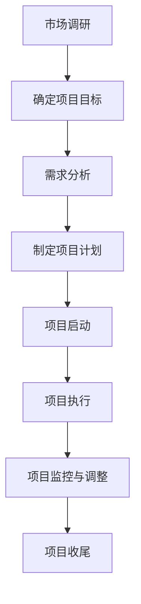

##### 4.2 数据收集与预处理

数据是AI大模型的基础，数据的质量和数量直接影响模型的性能。以下是如何进行数据收集与预处理的步骤：

1. **数据收集**：
   根据需求分析，确定需要收集的数据类型和来源。数据可以从公开数据集、企业内部数据、第三方数据提供商等渠道获取。

2. **数据清洗**：
   数据清洗是数据预处理的重要步骤，包括去除重复数据、填补缺失值、处理异常值等。数据清洗可以通过编程脚本（如Python、R等）进行。

3. **数据转换**：
   数据转换包括将数据格式进行统一、数据类型进行转换、特征工程等。数据转换可以提升数据的可用性和模型的性能。

4. **数据存储**：
   将处理后的数据存储到合适的数据库或数据湖中，以便后续模型训练和部署。

以下是一个简单的数据收集与预处理流程：

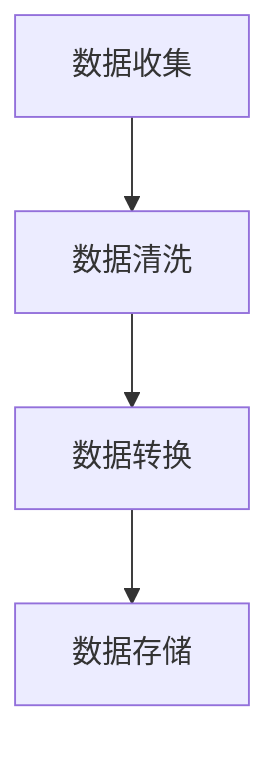

##### 4.3 模型设计与训练

模型设计与训练是AI大模型创业项目的核心步骤，以下是如何进行模型设计与训练的步骤：

1. **选择模型架构**：
   根据应用场景和数据类型，选择合适的模型架构。常见的模型架构包括深度神经网络、卷积神经网络、循环神经网络、变换器模型等。

2. **设计模型参数**：
   设计模型的超参数，如学习率、批量大小、迭代次数等。超参数的选择可以通过实验或经验进行优化。

3. **模型训练**：
   使用训练数据对模型进行训练，通过反向传播算法不断调整模型参数，使模型能够更好地拟合训练数据。

4. **模型验证**：
   使用验证数据集对模型进行验证，评估模型的性能和泛化能力。通过交叉验证等方法，调整模型参数和架构，提高模型性能。

5. **模型部署**：
   将训练好的模型部署到生产环境中，通过API或服务的方式进行实时应用。

以下是一个简单的模型设计与训练流程：

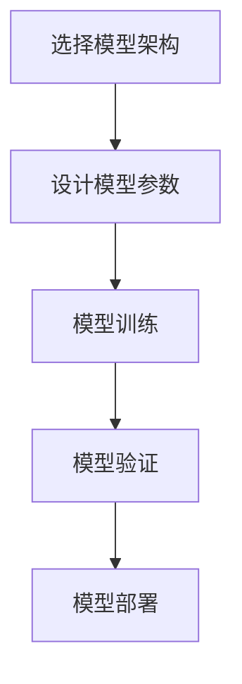

##### 4.4 模型评估与优化

模型评估与优化是确保AI大模型性能的关键步骤，以下是如何进行模型评估与优化的步骤：

1. **性能评估**：
   使用测试数据集对模型进行评估，评估指标包括准确率、召回率、F1分数等。通过评估结果，了解模型的性能和泛化能力。

2. **模型优化**：
   根据评估结果，对模型进行优化。优化方法包括调整模型参数、增加训练数据、改进数据预处理等。通过多次迭代，提高模型性能。

3. **超参数调优**：
   使用超参数调优方法，如网格搜索、随机搜索等，找到最优的超参数组合，提高模型性能。

4. **模型压缩**：
   对于大模型，可以考虑模型压缩方法，如权重剪枝、量化、蒸馏等，减少模型大小，提高模型效率。

以下是一个简单的模型评估与优化流程：

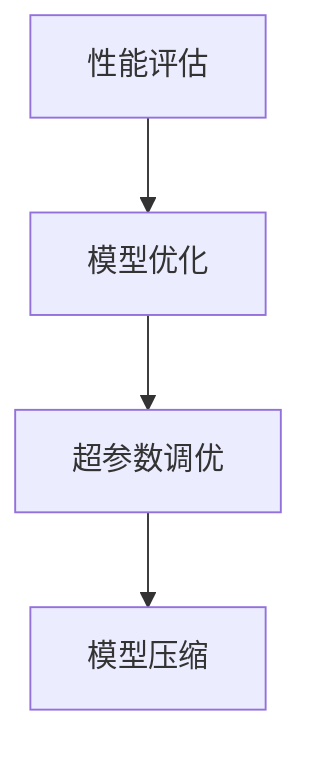

##### 4.5 项目上线与运营

项目上线与运营是AI大模型创业项目的最后一步，以下是如何进行项目上线与运营的步骤：

1. **系统部署**：
   将训练好的模型部署到生产环境中，包括硬件配置、软件安装、数据存储等。

2. **监控与维护**：
   实时监控模型的运行状态，包括性能、资源消耗、错误率等。及时处理异常情况，确保系统的稳定运行。

3. **用户反馈**：
   收集用户反馈，了解用户的使用体验和需求。通过用户反馈，不断优化产品功能和用户体验。

4. **运营策略**：
   制定合适的运营策略，包括市场营销、用户增长、客户服务等，确保项目的持续发展。

以下是一个简单的项目上线与运营流程：

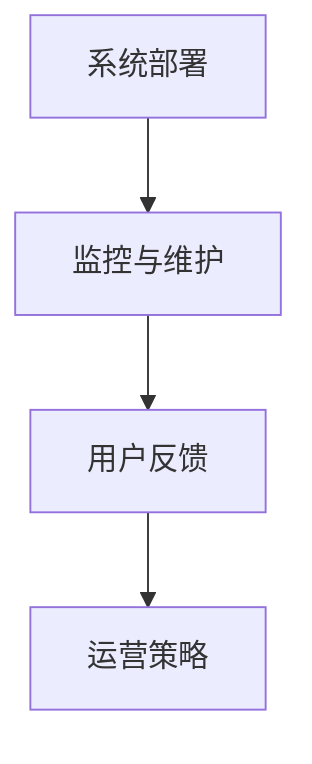

通过以上步骤，创业者可以系统地开展AI大模型创业项目，从项目规划到上线运营，确保项目的成功实施和持续发展。

---

**下一章，我们将深入探讨AI大模型创业策略分析，包括市场竞争分析、产品定位与差异化、营销推广策略等。**

---

### 第二部分: AI大模型创业实践与策略

#### 第5章: AI大模型创业策略分析

##### 5.1 市场竞争分析

在AI大模型创业领域，竞争日益激烈。创业者需要深入分析市场竞争，以制定有效的策略。以下是如何进行市场竞争分析的步骤：

1. **市场细分**：
   根据用户需求、行业特点等，将市场划分为不同的细分市场。了解每个细分市场的规模、增长率和潜在客户。

2. **竞争对手分析**：
   识别主要竞争对手，分析他们的产品、市场定位、商业模式、市场份额等。了解竞争对手的优势和劣势，找出差异化的机会。

3. **SWOT分析**：
   对自身进行SWOT分析（优势、劣势、机会、威胁），明确自身的竞争优势和劣势，以及外部市场环境中的机会和威胁。

4. **竞争策略制定**：
   根据分析结果，制定竞争策略。例如，通过技术创新、差异化产品、优质服务等方式，建立竞争优势。

以下是一个简单的市场竞争分析流程：

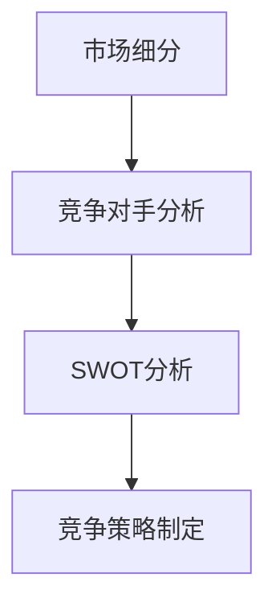

##### 5.2 产品定位与差异化

产品定位和差异化是AI大模型创业成功的关键。以下是如何进行产品定位与差异化的步骤：

1. **目标市场定位**：
   明确目标市场，确定产品的核心用户群体。通过市场调研和用户分析，了解目标用户的需求、偏好和行为模式。

2. **产品特点定位**：
   确定产品的核心特点和优势，这些特点应能够满足目标用户的需求，并区别于竞争对手。例如，更高的准确率、更好的用户体验、更全面的功能等。

3. **差异化策略**：
   制定差异化策略，通过技术创新、产品设计、服务体验等方面，打造独特的市场定位。差异化策略应结合自身优势和市场机会，形成核心竞争力。

以下是一个简单的产品定位与差异化流程：

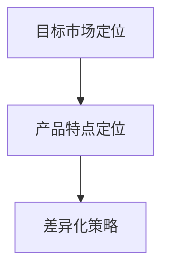

##### 5.3 营销推广策略

有效的营销推广策略是AI大模型创业成功的重要保障。以下是如何进行营销推广的步骤：

1. **品牌建设**：
   建立品牌形象，塑造独特的品牌价值。通过品牌故事、品牌标志、品牌口号等，传递品牌的核心价值和理念。

2. **内容营销**：
   通过博客、白皮书、案例研究、在线研讨会等形式，提供有价值的内容，吸引潜在客户，提升品牌知名度。

3. **社交媒体营销**：
   利用社交媒体平台（如LinkedIn、Twitter、Facebook等），与用户互动，分享产品信息，扩大品牌影响力。

4. **广告推广**：
   通过搜索引擎广告、社交媒体广告、内容广告等，进行精准广告投放，提高产品的曝光率和用户转化率。

5. **合作伙伴关系**：
   建立合作伙伴关系，与行业内的企业、机构、专家等合作，共同推广产品，扩大市场影响力。

以下是一个简单的营销推广流程：

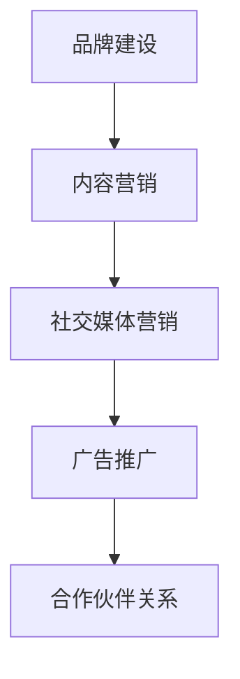

##### 5.4 资源整合与合作

资源整合与合作是AI大模型创业成功的重要手段。以下是如何进行资源整合与合作的步骤：

1. **内部资源整合**：
   充分利用企业内部的资源，包括人才、技术、资金等，优化资源配置，提高资源利用效率。

2. **外部资源整合**：
   寻找合适的合作伙伴，如技术提供商、数据供应商、行业专家等，共同开发产品、分享市场资源。

3. **产学研合作**：
   与高校、科研机构合作，共同进行技术研发和创新，提升企业的技术实力和创新能力。

4. **资本合作**：
   寻找风险投资、天使投资等资本合作，获取资金支持，推动企业快速发展。

以下是一个简单的资源整合与合作流程：

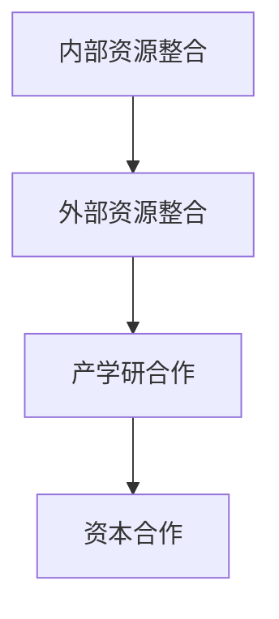

##### 5.5 风险管理策略

风险管理是AI大模型创业过程中不可忽视的一环。以下是如何进行风险管理的步骤：

1. **风险识别**：
   识别企业可能面临的各种风险，包括技术风险、市场风险、财务风险等。

2. **风险评估**：
   对识别出的风险进行评估，分析风险的可能性和影响程度，确定风险优先级。

3. **风险应对策略**：
   制定相应的风险应对策略，包括风险规避、风险降低、风险转移等。例如，通过技术创新、市场拓展、保险等方式降低风险。

4. **风险监控与调整**：
   实时监控风险的变化，根据实际情况调整风险应对策略，确保企业稳定发展。

以下是一个简单的风险管理流程：

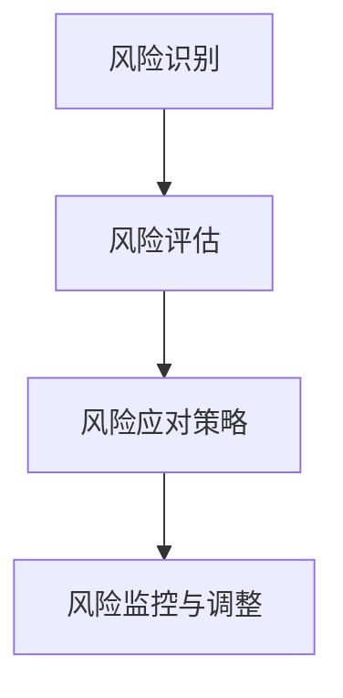

通过以上策略分析，创业者可以更清晰地了解AI大模型创业的过程和关键点，制定有效的创业策略，提高创业成功率。

---

**下一章，我们将深入探讨AI大模型创业团队建设，包括团队建设与文化建设、技术人才的引进与培养、项目管理与流程优化等。**

---

### 第二部分: AI大模型创业实践与策略

#### 第6章: AI大模型创业团队建设

##### 6.1 团队建设与文化建设

一个高效的创业团队是AI大模型创业成功的关键。以下是如何进行团队建设和文化建设的建议：

1. **明确团队目标**：
   团队成员应共同明确团队的目标和愿景，确保团队的一致性和方向感。可以通过团队会议、愿景宣言等方式，加强团队成员对团队目标的认同。

2. **选拔合适的人才**：
   根据项目需求，选拔具备专业技能和团队协作精神的成员。在选拔过程中，应注重候选人的沟通能力、解决问题的能力和适应能力。

3. **建立有效的沟通机制**：
   建立畅通的沟通渠道，鼓励团队成员之间的交流与合作。可以采用定期会议、工作群组、邮件等方式，确保信息的及时传递和共享。

4. **塑造积极向上的团队文化**：
   培养团队成员的积极态度和团队精神，营造积极向上的团队氛围。可以通过团队活动、奖励机制、团队建设培训等方式，增强团队的凝聚力和战斗力。

以下是一个简单的团队建设与文化建设的流程：

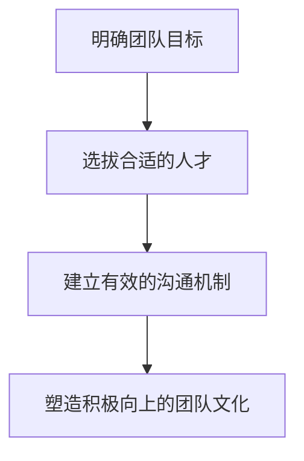

##### 6.2 技术人才的引进与培养

技术人才是AI大模型创业团队的核心资源。以下是如何进行技术人才的引进与培养的建议：

1. **引进高端人才**：
   通过招聘、猎头、内部推荐等方式，引进具备深厚专业知识和丰富经验的高端人才。对于关键岗位，可以提供具有竞争力的薪酬和福利待遇。

2. **提供职业发展机会**：
   为技术人才提供职业发展路径，包括晋升机会、培训机会、项目机会等，激发他们的职业激情和创造力。

3. **建立人才培养机制**：
   定期组织技术培训、研讨会、技术交流等活动，提升团队成员的技术能力和创新能力。可以采用内部培训、外部培训、导师制度等方式，建立人才培养机制。

4. **鼓励技术创新**：
   鼓励团队成员参与技术创新项目，提供技术支持和管理支持，营造良好的创新氛围。可以通过创新奖励、专利申请等方式，激励技术创新。

以下是一个简单的技术人才引进与培养的流程：

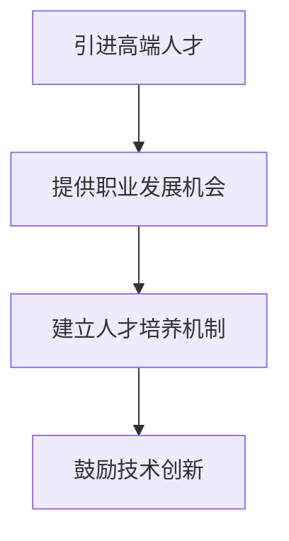

##### 6.3 项目管理与流程优化

有效的项目管理和流程优化是确保AI大模型创业项目顺利实施的必要条件。以下是如何进行项目管理和流程优化的建议：

1. **制定项目管理计划**：
   根据项目目标和需求，制定详细的项目管理计划，包括项目范围、时间表、资源分配、风险管理等。确保项目目标的明确和可执行性。

2. **运用项目管理工具**：
   采用项目管理工具（如Microsoft Project、JIRA等），进行项目进度跟踪、任务分配、资源管理等工作。通过工具的使用，提高项目管理效率和透明度。

3. **流程优化**：
   定期对项目流程进行评估和优化，找出存在的问题和瓶颈，提出改进措施。可以通过流程分析、流程优化工具等方式，实现流程的优化。

4. **团队协作与沟通**：
   加强团队成员之间的协作与沟通，确保项目任务的有效完成。可以采用协同办公平台、即时通讯工具等方式，提高团队协作效率。

以下是一个简单的项目管理和流程优化流程：

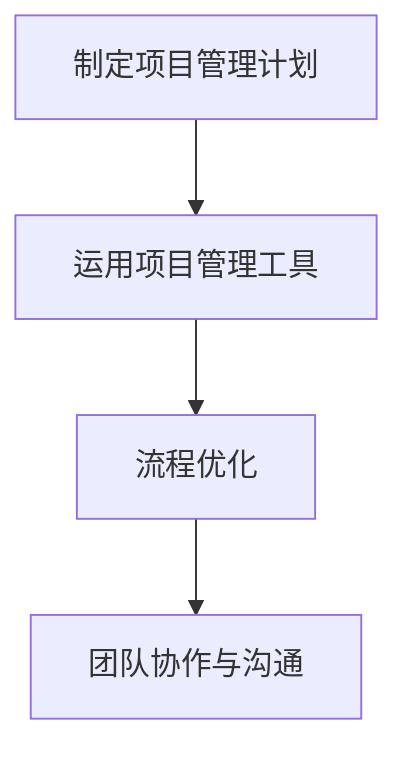

##### 6.4 激励机制与绩效考核

激励机制和绩效考核是提高团队绩效和员工满意度的重要手段。以下是如何进行激励机制与绩效考核的建议：

1. **设定明确的绩效目标**：
   根据项目目标和员工岗位，设定明确的绩效目标，确保员工的工作有方向和目标。

2. **多样化的激励机制**：
   采用多样化的激励机制，包括物质激励（如奖金、股权等）和精神激励（如荣誉、晋升等），满足员工的多元化需求。

3. **公平的绩效考核**：
   建立公平的绩效考核体系，根据员工的工作表现、项目成果等，进行客观公正的评价。

4. **及时反馈与沟通**：
   定期进行绩效反馈和沟通，及时了解员工的绩效情况和工作需求，提供必要的支持和帮助。

以下是一个简单的激励机制与绩效考核流程：

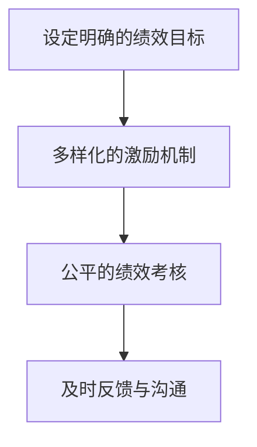

##### 6.5 团队沟通与协作工具应用

有效的团队沟通与协作工具是提高团队效率和协作能力的必要手段。以下是如何进行团队沟通与协作工具应用的建议：

1. **选择合适的工具**：
   根据团队规模、工作性质和需求，选择合适的沟通与协作工具。常见的工具包括即时通讯工具（如微信、Slack等）、邮件系统、项目管理工具等。

2. **制定使用规范**：
   制定团队沟通与协作工具的使用规范，明确工具的使用范围、使用规则和注意事项，确保工具的高效使用。

3. **培训与支持**：
   对团队成员进行工具使用的培训，提供技术支持和帮助，确保团队成员能够熟练使用工具。

4. **监督与反馈**：
   定期对团队沟通与协作工具的使用情况进行监督和反馈，发现问题和改进措施，不断提升团队协作效率。

以下是一个简单的团队沟通与协作工具应用流程：

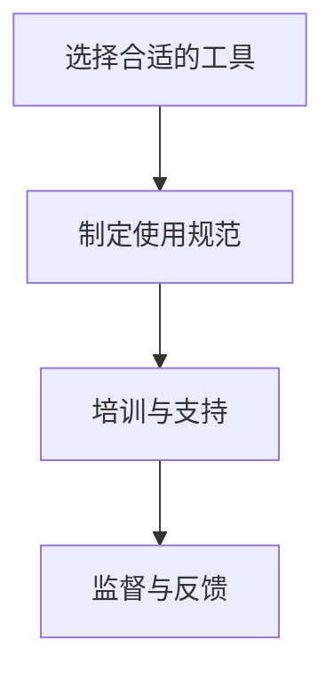

通过以上团队建设与文化建设、技术人才的引进与培养、项目管理与流程优化、激励机制与绩效考核、团队沟通与协作工具应用等方面的建设，AI大模型创业团队可以形成强大的核心竞争力，推动创业项目的成功实施。

---

**下一章，我们将通过知名AI创业公司案例分析，探讨成功AI创业项目的特点与经验，以及失败AI创业项目的教训与启示。**

---

### 第二部分: AI大模型创业实践与策略

#### 第7章: AI大模型创业案例研究

##### 7.1 知名AI创业公司案例分析

在本章节中，我们将深入探讨几家知名AI创业公司的案例，分析其成功的原因、核心特点以及关键经验，为AI大模型创业者提供有价值的借鉴。

###### 1. OpenAI

OpenAI是一家知名的人工智能研究公司，以其开放性和创新的商业模式而闻名。以下是OpenAI的一些核心特点与成功经验：

- **开放性**：OpenAI以其开源的研究和工具而著称，鼓励全球研究者和开发者参与和贡献。这种开放性不仅吸引了大量人才和资源，也加速了技术的进步。
  
- **长期愿景**：OpenAI的愿景是“实现安全的通用人工智能（AGI）”，并为此投入了大量资源进行研究和开发。长期愿景和使命感为团队提供了强大的驱动力。

- **商业模式**：OpenAI采用了“双轨制”商业模式，一方面通过提供商业服务（如GPT-3 API）获得收入，另一方面通过研究和开源项目推动技术进步。

  **成功经验**：OpenAI的成功经验在于其开放性的文化、明确的长期愿景以及多元化的商业模式。这些因素共同促进了公司的快速发展和创新。

###### 2. DeepMind

DeepMind是一家专注于人工智能研究和应用的创业公司，被谷歌收购后继续独立运作。以下是DeepMind的一些核心特点与成功经验：

- **技术创新**：DeepMind以其在深度学习、强化学习等领域的创新成果而闻名。其AlphaGo项目更是展示了AI在围棋领域的卓越表现。

- **科研与产业结合**：DeepMind不仅专注于学术研究，还将其技术应用于实际产业中，如医疗诊断、游戏开发等。这种结合实现了科研成果的商业化转化。

- **优秀团队**：DeepMind拥有来自全球顶尖大学和研究机构的顶尖人才，这些人才在深度学习、计算机科学等领域具有深厚的专业背景。

  **成功经验**：DeepMind的成功经验在于其技术创新、科研与产业结合以及优秀团队的建设。这些因素共同促成了公司在人工智能领域的领导地位。

###### 3. SenseTime

SenseTime是一家专注于计算机视觉和人工智能技术的研究和应用的公司。以下是SenseTime的一些核心特点与成功经验：

- **技术实力**：SenseTime在计算机视觉领域具有强大的技术实力，其人脸识别技术在全球范围内处于领先地位。

- **应用场景**：SenseTime的技术广泛应用于安防、金融、零售、交通等多个行业，实现了AI技术的广泛应用。

- **国际化发展**：SenseTime在全球范围内建立了广泛的合作伙伴关系，通过国际化发展，拓展了市场空间。

  **成功经验**：SenseTime的成功经验在于其技术实力、应用场景的拓展以及国际化发展。这些因素共同推动了公司在计算机视觉和人工智能领域的快速发展。

##### 7.2 成功AI创业项目的特点与经验

通过分析以上知名AI创业公司的案例，我们可以总结出一些成功AI创业项目的共同特点与经验：

1. **技术创新**：成功AI创业项目通常具有独特的技术创新，能够在某一领域或多个领域实现突破性进展。

2. **市场需求**：成功AI创业项目能够深刻理解市场需求，提供满足用户需求的创新产品或服务。

3. **团队建设**：成功AI创业项目通常拥有高素质的团队，团队成员具备丰富的专业知识和实践经验。

4. **商业模式**：成功AI创业项目具备清晰的商业模式，能够实现持续的收入增长和利润。

5. **长期愿景**：成功AI创业项目通常具有明确的长期愿景和使命感，能够为团队提供持久的驱动力。

6. **资源整合**：成功AI创业项目能够充分利用外部资源，如合作伙伴、投资机构等，实现资源的最大化利用。

##### 7.3 失败AI创业项目的教训与启示

除了成功案例，我们也可以从失败AI创业项目中汲取教训，为未来的创业提供启示：

1. **技术风险**：技术风险是导致AI创业失败的主要原因之一。创业者需要确保技术的可行性和稳定性，避免盲目追求技术创新而忽视实际需求。

2. **市场风险**：市场风险包括市场需求不足、竞争对手强大等。创业者需要充分了解市场环境，制定合适的市场策略。

3. **资金风险**：资金风险包括资金链断裂、融资困难等。创业者需要合理规划资金使用，确保资金充足和持续。

4. **团队风险**：团队风险包括团队不稳定、人才流失等。创业者需要注重团队建设，营造良好的团队文化。

5. **法规风险**：法规风险包括政策变化、合规问题等。创业者需要密切关注法规变化，确保业务的合规性。

通过分析成功和失败的AI创业案例，我们可以得出以下启示：

1. **技术创新与市场需求相结合**：技术创新是AI创业的核心竞争力，但必须与市场需求相结合，确保技术的实际应用价值。

2. **稳健的商业模式**：创业者需要制定清晰的商业模式，确保项目的可持续性和盈利能力。

3. **风险管理**：创业者需要重视风险的管理和应对，提前识别和解决潜在风险。

4. **团队建设**：创业者需要注重团队建设，打造高素质、稳定、高效的团队。

5. **持续学习与适应**：创业者需要持续学习和适应市场变化，不断调整和优化业务策略。

通过以上分析，我们希望为AI大模型创业者提供有价值的指导，助力他们在激烈的市场竞争中脱颖而出，打造成功的AI创业项目。

---

**下一章，我们将探讨AI大模型创业的未来趋势与展望，包括技术发展趋势、市场需求变化、政策法规影响等。**

---

### 第二部分: AI大模型创业实践与策略

#### 第7章: AI大模型创业的未来趋势与展望

##### 7.4 未来AI大模型创业趋势与展望

随着人工智能技术的不断进步和应用场景的广泛拓展，AI大模型创业领域正面临着新的发展趋势和广阔的机遇。以下是对未来AI大模型创业趋势和展望的探讨：

###### 1. 技术发展趋势

**1.1 算法的创新与优化**

随着深度学习、自然语言处理、计算机视觉等技术的不断进步，未来的AI大模型将更加智能化、高效化和泛化能力更强。研究者将继续探索新的算法和技术，如生成对抗网络（GAN）、变分自编码器（VAE）、图神经网络（GNN）等，以提高模型的性能和应用范围。

**1.2 跨学科的融合**

未来的AI大模型创业将更加注重跨学科的融合，将生物学、心理学、经济学等多学科的知识引入人工智能领域，以实现更加智能、个性化和人性的AI解决方案。

**1.3 安全性和隐私保护**

随着AI技术的广泛应用，安全问题越来越受到关注。未来的AI大模型创业将更加注重安全性和隐私保护，采用先进的加密技术、隐私保护算法等，确保用户数据的安全和隐私。

###### 2. 市场需求变化

**2.1 个性化与定制化**

随着消费者需求的多样化，未来的AI大模型创业将更加注重个性化与定制化，通过AI技术为用户提供更加精准、个性化的服务，满足不同用户群体的需求。

**2.2 智能化升级**

各行各业都将面临智能化升级的需求，从制造业、金融业到医疗、教育等，AI大模型将在各个领域发挥重要作用，提升行业的生产效率和服务质量。

**2.3 全球化市场**

随着全球化进程的加速，未来的AI大模型创业将更加注重全球化市场，通过国际合作、跨地域应用，开拓更广阔的市场空间。

###### 3. 政策法规影响

**3.1 支持与鼓励**

各国政府纷纷出台相关政策，支持人工智能技术的发展和应用。这些政策包括资金支持、税收优惠、人才引进等，为AI大模型创业提供了有利的环境。

**3.2 法规监管**

随着AI技术的应用范围不断扩大，相关的法规监管也将逐步完善。未来的AI大模型创业将需要遵守更多的法规和标准，确保技术的合规性和安全性。

**3.3 国际合作**

国际间的合作将进一步推动AI大模型创业的发展。各国政府、研究机构和企业将加强合作，共同推动人工智能技术的创新和应用。

##### 7.4.1 未来AI大模型创业的机会

**1. 智能医疗**

随着人口老龄化和医疗需求增加，智能医疗将成为AI大模型创业的重要领域。通过AI大模型，可以实现精准诊断、个性化治疗和健康管理，提高医疗服务的质量和效率。

**2. 智能制造**

智能制造是工业4.0的重要方向，AI大模型在智能制造中的应用前景广阔。通过AI技术，可以实现生产线的自动化、智能化，提高生产效率和质量。

**3. 智慧城市**

智慧城市是未来城市发展的趋势，AI大模型在智慧城市建设中发挥着重要作用。通过AI技术，可以实现城市管理的智能化、精细化，提高城市的安全、便捷和可持续发展。

**4. 智能金融**

金融行业是AI技术应用的重要领域，AI大模型在金融领域的应用将越来越广泛。通过AI技术，可以实现风险控制、精准营销、智能投顾等，提高金融服务的质量和效率。

**5. 智能交通**

智能交通是未来交通发展的重要方向，AI大模型在智能交通中的应用前景广阔。通过AI技术，可以实现交通管理的智能化、自动化，提高交通的安全、效率和便捷性。

##### 7.4.2 未来AI大模型创业的挑战

**1. 技术挑战**

AI大模型创业面临的技术挑战包括算法的创新、数据的质量和数量、模型的优化和训练效率等。未来的AI大模型创业将需要更加高效、智能的算法和模型，以满足日益复杂的应用需求。

**2. 法规挑战**

随着AI技术的发展和应用，相关的法规和标准将逐步完善。AI大模型创业需要遵守相关的法规和标准，确保技术的合规性和安全性。同时，创业者需要关注国际法规的变化，确保业务的国际化发展。

**3. 数据挑战**

AI大模型创业需要大量的高质量数据，数据的获取和处理是创业过程中的重要挑战。未来的AI大模型创业将需要更加有效的数据收集、清洗、管理和利用方法。

**4. 安全挑战**

随着AI技术的应用范围扩大，安全挑战也越来越突出。AI大模型创业需要关注数据安全、模型安全、系统安全等方面，确保用户数据的安全和隐私。

##### 7.4.3 未来AI大模型创业的建议

**1. 技术创新与市场需求的结合**

创业者应关注技术创新与市场需求的结合，以市场需求为导向，研发具有实际应用价值的AI大模型。

**2. 跨学科合作与整合**

创业者应加强跨学科合作与整合，将生物学、心理学、经济学等领域的知识引入AI大模型创业，提升产品的智能化和个性化水平。

**3. 安全性和隐私保护**

创业者应重视安全性和隐私保护，采用先进的加密技术、隐私保护算法等，确保用户数据的安全和隐私。

**4. 国际化发展**

创业者应关注国际化发展，通过国际合作、跨地域应用，开拓更广阔的市场空间。

**5. 持续学习与适应**

创业者应持续学习与适应，关注行业动态和技术发展趋势，不断调整和优化业务策略。

总之，未来的AI大模型创业领域将充满机遇和挑战。通过技术创新、市场需求、跨学科合作、安全性保障等方面的努力，创业者有望在AI大模型创业领域取得成功，推动人工智能技术的进步和应用。

---

**至此，本文已全面探讨了AI大模型创业的各个方面，从基础到实践，从策略到未来趋势。希望本文能为AI大模型创业者和关注者提供有价值的参考和指导。**

---

### 附录

#### 8.1 常用AI开发工具与资源

- **工具**：
  - TensorFlow：https://www.tensorflow.org/
  - PyTorch：https://pytorch.org/
  - Keras：https://keras.io/
  - JAX：https://github.com/google/jax

- **平台**：
  - Google Colab：https://colab.research.google.com/
  - AWS Sagemaker：https://aws.amazon.com/sagemaker/
  - Azure ML：https://azure.microsoft.com/zh-cn/services/machine-learning/

- **社区与论坛**：
  - Stack Overflow：https://stackoverflow.com/
  - AI Community：https://www.ai-community.org/
  - ArXiv：https://arxiv.org/

#### 8.2 AI大模型创业相关的法规与政策

- **国家政策**：
  - 中国：https://www.nmpa.gov.cn/xygj/yjld/szlcj/
  - 美国：https://www.nist.gov/itl人工智能政策

- **行业法规**：
  - GDPR（欧盟通用数据保护条例）：https://ec.europa.eu/justice/en/law/dataprotection/index.htm
  - CCPA（加州消费者隐私法案）：https://oag.ca.gov/privacy/ccpa

#### 8.3 AI大模型创业书籍与论文推荐

- **书籍**：
  - 《深度学习》（Goodfellow, Bengio, Courville）：https://www.deeplearningbook.org/
  - 《强化学习》（Sutton, Barto）：https://www.informedrobotics.com/book/
  - 《自然语言处理》（Jurafsky, Martin）：https://web.stanford.edu/class/cs224n/

- **论文**：
  - “A Theoretical Framework for Learning Factorized Policys”（Silver et al.，2016）
  - “Attention is All You Need”（Vaswani et al.，2017）
  - “Generative Adversarial Nets”（Goodfellow et al.，2014）

---

**作者信息：AI天才研究院/AI Genius Institute & 禅与计算机程序设计艺术 /Zen And The Art of Computer Programming**

