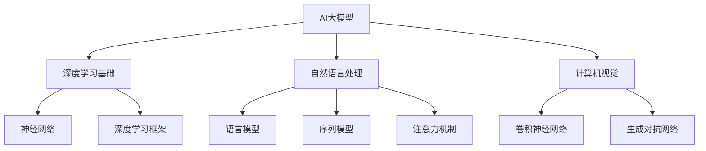

                 

### 文章标题

《AI大模型创业：如何构建未来可持续的商业模式？》

> 关键词：AI大模型、商业模式、创业战略、可持续性、技术创新

> 摘要：本文旨在探讨AI大模型创业的核心问题，从技术原理、商业模式构建到可持续发展，提供系统性的分析和策略指导，帮助创业者构建未来可持续的商业模式。

### 《AI大模型创业：如何构建未来可持续的商业模式？》目录大纲

#### 第一部分：AI大模型基础

##### 第1章：AI大模型概述
- 1.1 AI大模型的发展历程
- 1.2 AI大模型的关键概念
- 1.3 AI大模型的技术架构
- 1.4 AI大模型的分类与应用场景
- 1.5 AI大模型的未来发展趋势

##### 第2章：AI大模型技术原理
- 2.1 深度学习基础
  - 2.1.1 神经网络
  - 2.1.2 深度学习框架
- 2.2 自然语言处理
  - 2.2.1 语言模型
  - 2.2.2 序列模型
  - 2.2.3 注意力机制
- 2.3 计算机视觉
  - 2.3.1 卷积神经网络
  - 2.3.2 生成对抗网络

##### 第3章：AI大模型计算与优化
- 3.1 计算资源优化
  - 3.1.1 分布式计算
  - 3.1.2 GPU加速
- 3.2 模型压缩与加速
  - 3.2.1 知识蒸馏
  - 3.2.2 模型剪枝
- 3.3 模型训练与优化
  - 3.3.1 随机梯度下降
  - 3.3.2 Adam优化器

#### 第二部分：商业模式构建

##### 第4章：AI大模型创业战略
- 4.1 创业者的角色与责任
- 4.2 市场分析
  - 4.2.1 市场规模与增长潜力
  - 4.2.2 竞争对手分析
- 4.3 产品定位与市场策略
  - 4.3.1 产品特性与优势
  - 4.3.2 市场细分与定位

##### 第5章：商业模式的构建
- 5.1 收入模式
  - 5.1.1 订阅模式
  - 5.1.2 付费模式
- 5.2 成本结构
  - 5.2.1 开发成本
  - 5.2.2 运营成本
- 5.3 利润模式
  - 5.3.1 毛利率分析
  - 5.3.2 盈利预测与风险评估

##### 第6章：AI大模型创业案例分析
- 6.1 成功案例分析
  - 6.1.1 商业模式成功要素
  - 6.1.2 创业团队的关键角色
- 6.2 失败案例分析
  - 6.2.1 失败原因分析
  - 6.2.2 教训与反思

#### 第三部分：可持续发展的商业模式

##### 第7章：社会责任与可持续发展
- 7.1 AI大模型对社会的影响
  - 7.1.1 社会责任
  - 7.1.2 可持续发展目标
- 7.2 企业社会责任实践
  - 7.2.1 社会责任计划
  - 7.2.2 社会责任报告
- 7.3 可持续发展的商业模式
  - 7.3.1 环境友好型商业模式
  - 7.3.2 社会价值创造

##### 第8章：未来展望
- 8.1 AI大模型商业模式的演变趋势
  - 8.1.1 产业互联网
  - 8.1.2 数据智能
- 8.2 创业机会与挑战
  - 8.2.1 新兴技术发展趋势
  - 8.2.2 创业者的应对策略

#### 附录
- 附录A：AI大模型创业工具与资源
  - 附录A.1 开发工具
  - 附录A.2 学习资源
  - 附录A.3 市场研究报告

##### 附录B：案例研究
- 附录B.1 创业公司案例研究
- 附录B.2 市场趋势分析

### Mermaid 流程图：AI大模型技术架构

---

**1.1 AI大模型的发展历程**

AI大模型的发展历程可以追溯到20世纪80年代的神经网络研究，当时人们开始探索如何通过人工神经网络来实现人工智能。随着计算能力的提升和算法的优化，深度学习在21世纪初逐渐崛起，并在2012年AlexNet的突破性表现后迎来了爆发式增长。这一时期，深度学习在图像识别、语音识别等领域的应用取得了显著进展。

到了2016年，谷歌推出了Transformer模型，标志着自然语言处理（NLP）领域的重大突破。Transformer模型引入了自注意力机制，使得模型在处理长序列数据时表现更加优异。这一时期的AI大模型开始逐步应用于实际场景，如自动驾驶、智能语音助手、推荐系统等。

近年来，生成对抗网络（GAN）的提出为计算机视觉带来了新的突破。GAN通过生成器和判别器的对抗训练，能够生成高质量的图像和视频。同时，模型压缩和优化技术也得到了快速发展，使得AI大模型在计算资源受限的环境下仍能保持高效的性能。

总的来说，AI大模型的发展历程是技术创新和计算资源提升的共同推动结果。未来，随着量子计算、边缘计算等新技术的兴起，AI大模型将迎来更加广阔的应用前景。

**1.2 AI大模型的关键概念**

AI大模型（Large-scale AI Model）是指在数据量、参数规模和计算需求方面具有显著规模效应的人工智能模型。以下是一些关键概念：

1. **深度学习（Deep Learning）**：深度学习是一种基于人工神经网络的学习方法，通过多层神经元的堆叠，实现对复杂数据的建模和预测。深度学习是AI大模型的核心技术之一。

2. **神经网络（Neural Network）**：神经网络是一种模拟人脑神经元结构的信息处理系统，通过调整网络中的权重和偏置，实现对输入数据的映射和输出。

3. **训练数据（Training Data）**：训练数据是用于训练AI大模型的数据集，通常包括输入数据和对应的标签。高质量的训练数据是模型性能的关键。

4. **参数（Parameters）**：参数是神经网络中用于调整模型行为的变量，包括权重、偏置和超参数。参数的设置和调整对模型的性能有重要影响。

5. **训练过程（Training Process）**：训练过程是通过迭代计算来优化模型参数的过程。常见的训练方法包括梯度下降、随机梯度下降和Adam优化器。

6. **模型评估（Model Evaluation）**：模型评估是评估模型性能的过程，通常使用准确率、召回率、F1分数等指标。

7. **泛化能力（Generalization Ability）**：泛化能力是指模型在新数据上的表现能力，是衡量模型性能的重要指标。

8. **数据增强（Data Augmentation）**：数据增强是通过增加数据多样性来提高模型泛化能力的技术，如随机裁剪、旋转、翻转等。

9. **模型压缩（Model Compression）**：模型压缩是通过减少模型参数数量和计算复杂度来提高模型效率的技术，如知识蒸馏、模型剪枝等。

10. **迁移学习（Transfer Learning）**：迁移学习是利用预训练模型在新任务上的表现，通过调整模型参数来适应新任务的技术。

**1.3 AI大模型的技术架构**

AI大模型的技术架构主要包括数据层、算法层和应用层，以下是各个层次的具体内容：

1. **数据层**：
   - **数据采集**：通过传感器、爬虫、用户生成内容等方式收集原始数据。
   - **数据清洗**：去除无效、重复和噪声数据，保证数据的准确性和一致性。
   - **数据预处理**：对原始数据进行归一化、编码和特征提取，为模型训练做准备。
   - **数据存储**：使用分布式存储系统存储大规模数据集，确保数据的高效访问和管理。

2. **算法层**：
   - **深度学习框架**：如TensorFlow、PyTorch等，提供高效的计算引擎和API接口，简化模型开发和训练过程。
   - **模型设计**：根据应用需求设计合适的神经网络结构，包括卷积神经网络（CNN）、循环神经网络（RNN）、Transformer等。
   - **模型训练**：使用训练数据对模型进行迭代训练，通过优化算法（如SGD、Adam等）调整模型参数，提高模型性能。
   - **模型评估**：使用验证集和测试集评估模型性能，选择最优模型进行应用部署。

3. **应用层**：
   - **场景应用**：根据具体应用场景，如图像识别、自然语言处理、语音识别等，设计和部署相应的AI大模型。
   - **模型部署**：将训练好的模型部署到生产环境中，通过API接口提供服务。
   - **模型监控与优化**：监控模型性能和运行状态，进行实时优化和调整，确保模型长期稳定运行。

**1.4 AI大模型的分类与应用场景**

AI大模型可以根据其应用领域和技术特点进行分类，以下是几种常见的分类和应用场景：

1. **图像识别**：
   - **分类任务**：对图像进行分类，如人脸识别、车辆识别等。
   - **检测任务**：检测图像中的对象和目标，如目标检测、行人检测等。
   - **分割任务**：将图像中的对象分离出来，如语义分割、实例分割等。
   - **应用场景**：安防监控、自动驾驶、医疗影像分析等。

2. **自然语言处理（NLP）**：
   - **文本分类**：对文本进行分类，如情感分析、主题分类等。
   - **文本生成**：生成符合语法和语义规则的文本，如自动摘要、问答系统等。
   - **语义理解**：理解文本中的语义信息，如命名实体识别、关系抽取等。
   - **应用场景**：智能客服、内容审核、智能推荐等。

3. **语音识别**：
   - **语音到文本**：将语音信号转换为文本，如语音助手、智能翻译等。
   - **语音合成**：将文本转换为语音信号，如语音助手、广播电台等。
   - **语音增强**：提高语音信号的质量，如降噪、回声消除等。
   - **应用场景**：智能语音助手、智能车载系统、智能家居等。

4. **推荐系统**：
   - **协同过滤**：基于用户的历史行为和相似度计算推荐结果。
   - **内容推荐**：根据用户兴趣和内容特征进行推荐。
   - **应用场景**：电商推荐、社交网络、在线视频平台等。

5. **强化学习**：
   - **策略学习**：学习最优决策策略。
   - **价值函数学习**：学习状态价值函数或奖励函数。
   - **应用场景**：游戏、机器人控制、自动驾驶等。

**1.5 AI大模型的未来发展趋势**

随着计算能力的提升和数据的不断积累，AI大模型在各个领域的应用前景愈发广阔。以下是未来AI大模型发展的几个趋势：

1. **模型压缩与优化**：
   - **模型剪枝**：通过剪枝冗余的神经元和连接，减少模型参数数量。
   - **知识蒸馏**：利用预训练模型的知识，对小型模型进行微调。
   - **量化**：将模型的权重和激活值进行量化，降低模型存储和计算需求。

2. **边缘计算与物联网**：
   - **边缘计算**：将AI大模型部署到边缘设备，降低延迟和带宽消耗。
   - **物联网**：通过AI大模型实现智能设备间的互联互通，提升物联网系统的智能化水平。

3. **多模态学习**：
   - **跨模态**：结合多种模态（如图像、文本、语音等）进行学习，提升模型对复杂数据的处理能力。
   - **融合学习**：通过多模态特征的融合，提高模型的泛化能力和鲁棒性。

4. **泛在智能**：
   - **自动化**：通过AI大模型实现自动化生产、自动化服务，提升生产效率和服务质量。
   - **智能化**：将AI大模型应用于各行各业，实现智能化升级和转型。

5. **安全与隐私**：
   - **数据安全**：加强数据安全保护，防止数据泄露和滥用。
   - **隐私保护**：采用隐私增强技术，确保用户隐私不被泄露。

### 2.1 深度学习基础

深度学习是构建AI大模型的核心技术，其基础包括神经网络、深度学习框架等。在本节中，我们将详细探讨深度学习的基础知识，包括神经网络的工作原理、深度学习框架的基本概念及其发展历程。

#### 2.1.1 神经网络

神经网络（Neural Network，NN）是一种模拟生物神经系统的计算模型，通过多层神经元节点和相互连接的边（即权重）来处理信息。神经网络的基本组成部分包括：

1. **神经元（Neuron）**：
   神经元是神经网络的基本计算单元，其功能类似于生物神经元的传递信号。一个简单的神经元可以表示为：
   $$ y = \sigma(z) $$
   其中，\( y \) 是神经元的输出，\( z \) 是输入值，\( \sigma \) 是激活函数。常见的激活函数包括 sigmoid、ReLU 和 tanh。

2. **输入层（Input Layer）**：
   输入层接收外部输入数据，并将其传递给下一层神经元。输入层的神经元数量通常与输入数据的维度一致。

3. **隐藏层（Hidden Layer）**：
   隐藏层位于输入层和输出层之间，用于对输入数据进行变换和处理。隐藏层的数量和神经元数量可以根据模型复杂度进行调整。

4. **输出层（Output Layer）**：
   输出层是神经网络的最后一层，负责生成模型的预测输出。输出层的神经元数量和类型取决于具体任务，如分类任务通常使用softmax函数进行输出。

5. **权重（Weights）和偏置（Bias）**：
   权重是连接神经元的系数，用于调节输入信号对神经元输出的影响。偏置是加在输入上的常数，用于调整神经元激活的阈值。

#### 神经网络的训练过程

神经网络的训练过程是调整权重和偏置的过程，以最小化预测误差。以下是神经网络训练的基本步骤：

1. **前向传播（Forward Propagation）**：
   前向传播是从输入层开始，通过每一层神经元的计算，最终得到输出层的预测结果。对于每个神经元，输入值与权重相乘并加上偏置，然后通过激活函数得到输出值。

2. **计算损失函数（Compute Loss Function）**：
   损失函数用于衡量预测结果与真实结果之间的差异，常见的损失函数包括均方误差（MSE）、交叉熵（Cross Entropy）等。损失函数的值越小，表示模型预测越准确。

3. **反向传播（Back Propagation）**：
   反向传播是通过反向计算误差梯度，更新模型的权重和偏置。具体步骤如下：
   - **计算梯度**：计算损失函数对每个权重的偏导数，即梯度。
   - **权重更新**：根据梯度更新权重和偏置，使用如下更新公式：
     $$ \Delta W = \alpha \cdot \frac{\partial J}{\partial W} $$
     $$ \Delta B = \alpha \cdot \frac{\partial J}{\partial B} $$
     其中，\( \Delta W \) 和 \( \Delta B \) 分别表示权重和偏置的更新量，\( \alpha \) 是学习率。

4. **优化算法**：
   优化算法用于加速模型训练和调整学习率，常见优化算法包括梯度下降（Gradient Descent）、随机梯度下降（Stochastic Gradient Descent，SGD）和Adam优化器等。

#### 深度学习框架

深度学习框架是用于构建、训练和部署深度学习模型的软件库，它们提供了高效的计算引擎和便捷的API接口，简化了深度学习模型的开发过程。以下是几种主流的深度学习框架：

1. **TensorFlow**：
   TensorFlow是由谷歌开发的开源深度学习框架，支持多种编程语言（如Python、C++等），具有强大的计算图引擎和丰富的API库。

2. **PyTorch**：
   PyTorch是由Facebook开发的开源深度学习框架，以动态计算图为基础，支持Python编程语言，具有良好的灵活性和易用性。

3. **Keras**：
   Keras是一个高层次的深度学习API，可以在TensorFlow和Theano等框架上运行，提供简洁、直观的模型构建和训练接口。

4. **MXNet**：
   MXNet是由Apache Software Foundation开发的开源深度学习框架，支持多种编程语言（如Python、R、Julia等），具有高效的可扩展性和灵活性。

#### 深度学习框架的发展历程

深度学习框架的发展历程伴随着深度学习技术的进步和计算资源的提升。以下是深度学习框架的发展历程：

1. **早期框架**：
   - **Theano**：由蒙特利尔大学开发的开源深度学习框架，支持Python编程语言，以静态计算图为基础。
   - **Caffe**：由伯克利大学开发的开源深度学习框架，以C++编写，适用于图像识别和视觉任务。

2. **中期框架**：
   - **MXNet**：由亚马逊开发的开源深度学习框架，支持多种编程语言，具有良好的可扩展性和灵活性。
   - **CNTK**：由微软开发的开源深度学习框架，支持多种编程语言，提供丰富的API接口。

3. **近期框架**：
   - **TensorFlow**：由谷歌开发的开源深度学习框架，支持多种编程语言，具有强大的计算图引擎和丰富的API库。
   - **PyTorch**：由Facebook开发的开源深度学习框架，以动态计算图为基础，支持Python编程语言。

深度学习框架的不断发展和完善，为深度学习模型的开发和应用提供了强有力的支持，推动了AI大模型技术的发展。

### 2.2 自然语言处理

自然语言处理（Natural Language Processing，NLP）是人工智能的一个重要分支，旨在使计算机能够理解和处理自然语言。在本节中，我们将深入探讨NLP的核心技术，包括语言模型、序列模型和注意力机制。

#### 2.2.1 语言模型

语言模型（Language Model，LM）是NLP中的基础组件，用于预测文本序列的概率分布。一个基本的语言模型可以通过统计方法或神经网络来实现。以下是一些常用的语言模型：

1. **N-gram模型**：
   N-gram模型是最简单的语言模型，它基于前N个词的历史来预测下一个词。例如，一个三元语言模型会根据前三个词预测下一个词。N-gram模型的数学表示如下：
   $$ P(w_n) = \frac{C(w_{n-1}, w_{n-2}, ..., w_1, w_n)}{C(w_{n-1}, w_{n-2}, ..., w_1)} $$
   其中，\( w_n \) 是当前词，\( C(\cdot) \) 表示词频计数。

2. **神经网络语言模型（NNLM）**：
   神经网络语言模型通过神经网络来学习文本序列的概率分布。一个简单的神经网络语言模型可以表示为：
   $$ P(w_n | w_{n-1}, w_{n-2}, ..., w_1) = \sigma(W_1 \cdot [w_{n-1}, w_{n-2}, ..., w_1] + b_1) $$
   其中，\( W_1 \) 和 \( b_1 \) 分别是权重和偏置，\( \sigma \) 是激活函数。

3. **递归神经网络语言模型（RNNLM）**：
   递归神经网络（RNN）语言模型通过递归结构来处理长文本序列。一个简单的RNNLM可以表示为：
   $$ h_t = \sigma(W_h h_{t-1} + W_x x_t + b_h) $$
   $$ P(w_n | w_{n-1}, w_{n-2}, ..., w_1) = \sigma(W_o h_n + b_o) $$
   其中，\( h_t \) 是隐藏状态，\( x_t \) 是输入词向量。

4. **变换器语言模型（TransformerLM）**：
   TransformerLM是近年来提出的一种基于Transformer架构的语言模型。它通过自注意力机制来建模词与词之间的关系，能够处理长文本序列。一个简单的TransformerLM可以表示为：
   $$ h_t = \text{Attention}(Q_t, K_t, V_t) $$
   $$ P(w_n | w_{n-1}, w_{n-2}, ..., w_1) = \text{softmax}(W_o h_n + b_o) $$
   其中，\( Q_t, K_t, V_t \) 分别是查询向量、键向量和值向量。

#### 2.2.2 序列模型

序列模型（Sequence Model）是用于处理序列数据的神经网络模型，广泛应用于文本分类、机器翻译、语音识别等领域。以下是几种常见的序列模型：

1. **循环神经网络（RNN）**：
   RNN是早期用于处理序列数据的神经网络模型，通过递归结构来处理长文本序列。一个简单的RNN可以表示为：
   $$ h_t = \sigma(W_h h_{t-1} + W_x x_t + b_h) $$
   其中，\( h_t \) 是隐藏状态。

2. **长短时记忆网络（LSTM）**：
   LSTM是RNN的变体，通过引入门控机制来解决长序列依赖问题。一个简单的LSTM可以表示为：
   $$ i_t = \sigma(W_i \cdot [h_{t-1}, x_t] + b_i) $$
   $$ f_t = \sigma(W_f \cdot [h_{t-1}, x_t] + b_f) $$
   $$ o_t = \sigma(W_o \cdot [h_{t-1}, x_t] + b_o) $$
   $$ c_t = f_t \odot c_{t-1} + i_t \odot \sigma(W_c \cdot [h_{t-1}, x_t] + b_c) $$
   $$ h_t = o_t \odot c_t $$
   其中，\( i_t, f_t, o_t, c_t \) 分别是输入门、遗忘门、输出门和细胞状态。

3. **门控循环单元（GRU）**：
   GRU是LSTM的简化版本，通过合并输入门和遗忘门来减少参数数量。一个简单的GRU可以表示为：
   $$ z_t = \sigma(W_z \cdot [h_{t-1}, x_t] + b_z) $$
   $$ r_t = \sigma(W_r \cdot [h_{t-1}, x_t] + b_r) $$
   $$ h_t = \text{tanh}(W_h \cdot [\text{sigmoid}(z_t) \cdot h_{t-1}, x_t] + b_h) $$
   其中，\( z_t \) 和 \( r_t \) 分别是更新门和重置门。

4. **变换器模型（Transformer）**：
   Transformer是近年来提出的一种基于自注意力机制的序列模型，通过多头自注意力机制来处理长文本序列。一个简单的Transformer可以表示为：
   $$ h_t = \text{Attention}(Q_t, K_t, V_t) $$
   $$ h_t = M_h \cdot \text{softmax}(\frac{Q_t K_t^T}{\sqrt{d_k}}) V_t $$
   其中，\( M_h \) 是多头自注意力机制的输出矩阵，\( Q_t, K_t, V_t \) 分别是查询向量、键向量和值向量。

#### 2.2.3 注意力机制

注意力机制（Attention Mechanism）是序列模型中用于处理长序列数据的一项关键技术，通过动态调整每个输入元素的重要程度，使得模型能够关注到关键信息。以下是几种常见的注意力机制：

1. **单头注意力机制**：
   单头注意力机制是最简单的注意力机制，通过计算查询向量与键向量的点积来计算注意力权重。一个简单的单头注意力机制可以表示为：
   $$ a_t = \text{softmax}(\frac{Q_t K_t^T}{\sqrt{d_k}}) $$
   $$ h_t = a_t V_t $$

2. **多头注意力机制**：
   多头注意力机制通过将输入序列分成多个子序列，并对每个子序列应用独立的注意力机制，从而提高模型的建模能力。一个简单的前向变换器可以表示为：
   $$ Q_t = M_Q \cdot Q $$
   $$ K_t = M_K \cdot K $$
   $$ V_t = M_V \cdot V $$
   $$ h_t = \text{Attention}(Q_t, K_t, V_t) $$
   其中，\( M_Q, M_K, M_V \) 分别是前向变换器的权重矩阵。

3. **自注意力机制**：
   自注意力机制是Transformer模型的核心机制，通过计算序列中的每个元素之间的相互关系，从而捕捉长距离依赖。一个简单的自注意力机制可以表示为：
   $$ h_t = \text{Attention}(Q_t, K_t, V_t) $$
   $$ h_t = M_h \cdot \text{softmax}(\frac{Q_t K_t^T}{\sqrt{d_k}}) V_t $$

4. **软注意力机制**：
   软注意力机制通过概率分布来动态调整每个输入元素的重要程度，使得模型能够灵活地关注到关键信息。一个简单的软注意力机制可以表示为：
   $$ a_t = \text{softmax}(\frac{Q_t K_t^T}{\sqrt{d_k}}) $$
   $$ h_t = \sum_{i=1}^n a_{it} K_i V_i $$

5. **硬注意力机制**：
   硬注意力机制通过查找表来计算注意力权重，从而提高计算效率。一个简单的硬注意力机制可以表示为：
   $$ a_t = \text{softmax}(\frac{Q_t K_t^T}{\sqrt{d_k}}) $$
   $$ h_t = \text{Lookup}(a_t, K) V_t $$

通过引入注意力机制，序列模型能够更好地处理长文本序列，提高模型的性能和泛化能力。

### 2.3 计算机视觉

计算机视觉（Computer Vision）是人工智能的一个重要分支，旨在使计算机能够理解和解释图像和视频中的内容。在本节中，我们将深入探讨计算机视觉的核心技术，包括卷积神经网络（CNN）和生成对抗网络（GAN）。

#### 2.3.1 卷积神经网络

卷积神经网络（Convolutional Neural Network，CNN）是一种专门用于处理图像数据的神经网络模型，因其高效的图像特征提取和分类能力而广泛应用于计算机视觉领域。以下是CNN的基本原理和结构：

1. **卷积层（Convolutional Layer）**：
   卷积层是CNN的核心组件，用于提取图像中的局部特征。卷积层通过滑动一个卷积核（过滤器）在输入图像上，计算每个局部区域的卷积和。卷积层的计算公式如下：
   $$ h_{ij} = \sum_{k} w_{ik} \cdot x_{kj} + b $$
   其中，\( h_{ij} \) 表示输出特征图中的第 \( i \) 行第 \( j \) 列的像素值，\( w_{ik} \) 表示卷积核中的第 \( i \) 行第 \( k \) 列的权重值，\( x_{kj} \) 表示输入特征图中的第 \( k \) 行第 \( j \) 列的像素值，\( b \) 是偏置项。

2. **激活函数（Activation Function）**：
   激活函数用于引入非线性特性，使神经网络能够学习复杂函数。常用的激活函数包括ReLU（Rectified Linear Unit）和Sigmoid函数。ReLU函数可以表示为：
   $$ \sigma(h) = \max(0, h) $$

3. **池化层（Pooling Layer）**：
   池化层用于减小特征图的尺寸，降低计算复杂度。常用的池化操作包括最大池化（Max Pooling）和平均池化（Average Pooling）。最大池化可以表示为：
   $$ p_{ij} = \max_{k} h_{ikj} $$

4. **全连接层（Fully Connected Layer）**：
   全连接层将特征图中的每个像素值映射到一个或多个输出节点，用于分类或回归任务。全连接层的计算公式如下：
   $$ y = \sum_{i} w_{i} \cdot x_i + b $$
   其中，\( y \) 是输出节点的值，\( w_i \) 是权重值，\( x_i \) 是输入节点的值，\( b \) 是偏置项。

5. **卷积神经网络结构**：
   卷积神经网络通常由多个卷积层、池化层和全连接层组成。一个简单的卷积神经网络可以表示为：
   $$ \text{Input} \rightarrow \text{Conv} \rightarrow \text{ReLU} \rightarrow \text{Pooling} \rightarrow \text{Fully Connected} \rightarrow \text{Output} $$

#### 2.3.2 生成对抗网络

生成对抗网络（Generative Adversarial Network，GAN）是一种由生成器和判别器组成的神经网络模型，用于生成具有真实数据分布的样本。GAN由Ian Goodfellow等人于2014年提出，已成为计算机视觉和机器学习领域的重要研究方向。以下是GAN的基本原理和结构：

1. **生成器（Generator）**：
   生成器是一个神经网络模型，用于生成与真实数据分布相似的样本。生成器的输入通常是随机噪声，通过多个隐层生成具有复杂结构的样本。生成器的目标是最小化生成样本与真实样本之间的差异。生成器可以表示为：
   $$ G(z) = \text{Generator}(z) $$
   其中，\( z \) 是随机噪声，\( G(z) \) 是生成的样本。

2. **判别器（Discriminator）**：
   判别器是一个神经网络模型，用于区分生成样本和真实样本。判别器的输入是样本数据，输出是一个介于0和1之间的概率值，表示输入样本是真实样本的概率。判别器的目标是最大化这个概率值。判别器可以表示为：
   $$ D(x) = \text{Discriminator}(x) $$
   其中，\( x \) 是输入样本。

3. **对抗训练（Adversarial Training）**：
   GAN的训练过程是基于生成器和判别器的对抗训练。生成器尝试生成更逼真的样本，而判别器不断学习区分真实样本和生成样本。生成器和判别器的损失函数可以分别表示为：
   $$ \mathcal{L}_G = -\log(D(G(z))) $$
   $$ \mathcal{L}_D = -[\log(D(x)) + \log(1 - D(G(z)))] $$
   其中，\( \mathcal{L}_G \) 和 \( \mathcal{L}_D \) 分别是生成器和判别器的损失函数。

4. **训练过程**：
   GAN的训练过程包括两个主要阶段：
   - **生成器训练**：生成器通过最小化其损失函数来学习生成逼真的样本。
   - **判别器训练**：判别器通过最大化其损失函数来学习区分真实样本和生成样本。

5. **GAN的应用**：
   GAN在计算机视觉领域具有广泛的应用，包括图像生成、图像修复、图像风格迁移等。以下是一个简单的GAN应用示例：

   - **图像生成**：生成器生成具有真实数据分布的图像，如图像合成、超分辨率等。
   - **图像修复**：生成器用于修复损坏的图像，如图像去噪、图像去模糊等。
   - **图像风格迁移**：生成器用于将一种图像风格应用到另一幅图像，如图像风格迁移、艺术风格模仿等。

通过深入研究和实践，卷积神经网络和生成对抗网络已成为计算机视觉领域的重要工具，推动了计算机视觉技术的不断进步。

### 3.1 计算资源优化

在AI大模型应用过程中，计算资源的优化至关重要，因为大型模型训练和推理过程对计算资源和存储能力有很高的要求。以下将介绍分布式计算和GPU加速两种常见的计算资源优化方法，并分析它们在实际应用中的效果。

#### 3.1.1 分布式计算

分布式计算是通过将计算任务分布在多个计算节点上来提高计算效率的一种方法。这种方法可以显著减少单台机器的计算负担，提高模型的训练和推理速度。

1. **工作原理**：
   - **任务划分**：将大型模型分解成多个子任务，每个子任务可以在不同的计算节点上独立执行。
   - **数据划分**：将训练数据集划分到不同的计算节点上，使得每个节点可以独立处理一部分数据。
   - **通信和同步**：计算节点之间需要进行数据传输和同步操作，确保模型参数的一致性。

2. **优势**：
   - **提高计算效率**：通过并行计算，分布式计算可以显著减少模型的训练时间。
   - **减少硬件成本**：分布式计算可以利用现有的计算资源，减少对高性能硬件的依赖。
   - **扩展性强**：分布式计算可以根据需要添加更多计算节点，提高计算能力。

3. **实际应用**：
   - **大规模图像识别**：在图像识别任务中，分布式计算可以处理大量图像数据，提高模型的训练和推理速度。
   - **自然语言处理**：在自然语言处理任务中，分布式计算可以处理大规模文本数据，提高模型的训练和推理效率。

#### 3.1.2 GPU加速

GPU（图形处理器）加速是通过利用GPU的并行计算能力来提高AI大模型的训练和推理速度的一种方法。相比传统的CPU，GPU具有更高的计算吞吐量和更低的延迟，因此在AI领域得到了广泛应用。

1. **工作原理**：
   - **计算任务划分**：将AI大模型的计算任务划分为多个小块，每个小块可以在GPU上独立执行。
   - **内存管理**：GPU具有独立的内存，GPU加速需要高效地管理内存资源，确保计算任务的高效运行。
   - **并行计算**：GPU通过并行计算，将计算任务分布在多个计算单元上，提高计算效率。

2. **优势**：
   - **计算速度快**：GPU具有大量计算单元，可以同时处理多个计算任务，提高模型的训练和推理速度。
   - **能耗低**：相比传统的CPU，GPU在处理相同计算任务时具有更低的能耗。
   - **兼容性强**：GPU加速技术支持多种编程语言和深度学习框架，便于实际应用。

3. **实际应用**：
   - **图像识别**：在图像识别任务中，GPU加速可以显著提高模型的训练和推理速度，减少训练时间。
   - **自然语言处理**：在自然语言处理任务中，GPU加速可以处理大规模文本数据，提高模型的训练和推理效率。
   - **推荐系统**：在推荐系统中，GPU加速可以处理大量用户行为数据，提高推荐系统的实时性。

#### 3.1.3 分布式计算与GPU加速的比较

分布式计算和GPU加速是两种常见的计算资源优化方法，它们在实际应用中各有优缺点：

1. **计算效率**：
   - **分布式计算**：分布式计算可以充分利用多个计算节点的资源，提高计算效率。但是，当节点数量较少时，分布式计算的效率可能不如GPU加速。
   - **GPU加速**：GPU加速可以利用GPU的并行计算能力，提高模型的训练和推理速度。然而，GPU加速的效率受限于GPU的计算单元数量和内存容量。

2. **硬件成本**：
   - **分布式计算**：分布式计算可以利用现有的计算资源，减少对高性能硬件的依赖，降低硬件成本。
   - **GPU加速**：GPU加速需要专门的高性能GPU硬件，成本较高。但是，GPU加速可以在较短的时间内完成任务，降低总体成本。

3. **扩展性**：
   - **分布式计算**：分布式计算具有较好的扩展性，可以根据需要添加更多计算节点，提高计算能力。
   - **GPU加速**：GPU加速的扩展性受限于GPU的计算单元数量和内存容量，难以进行大规模扩展。

4. **适用场景**：
   - **分布式计算**：适合处理大规模、复杂的数据集，如图像识别、自然语言处理等。
   - **GPU加速**：适合处理实时性要求较高的任务，如推荐系统、实时语音识别等。

总之，分布式计算和GPU加速各有优缺点，选择合适的优化方法取决于具体应用场景和资源条件。

### 3.2 模型压缩与加速

在AI大模型的实际应用中，模型压缩与加速是提高性能和降低成本的关键技术。以下将详细探讨知识蒸馏、模型剪枝等常见模型压缩与加速方法，以及它们的实际应用效果。

#### 3.2.1 知识蒸馏

知识蒸馏（Knowledge Distillation）是一种将大型模型的知识传递给小型模型的技术，从而在保持较高性能的同时减小模型的大小和计算复杂度。知识蒸馏的基本思想是将大型模型的输出作为小模型的软标签，通过训练小模型来复制大型模型的决策过程。

1. **工作原理**：
   - **软标签生成**：在训练过程中，大型模型的输出概率分布（通常是softmax输出）作为小模型的软标签。软标签可以提供比硬标签（即真实标签）更丰富的信息，有助于小模型学习到大型模型的知识。
   - **模型训练**：小模型通过学习大型模型的软标签来复制大型模型的决策过程。训练过程中，小模型的目标是最小化其输出与大型模型软标签之间的差距。

2. **优势**：
   - **减小模型大小**：知识蒸馏可以将大型模型压缩成小型模型，降低模型存储和计算需求。
   - **提高性能**：小模型在复制大型模型的知识后，通常能够保持较高的性能。
   - **灵活性**：知识蒸馏可以应用于不同类型和规模的模型，具有较好的灵活性。

3. **实际应用**：
   - **移动设备**：知识蒸馏技术可以在移动设备上部署大型AI模型，提高模型的性能和能效比。
   - **边缘计算**：在边缘设备上部署大型AI模型通常成本较高，知识蒸馏可以减小模型大小，降低边缘设备的计算和存储需求。

#### 3.2.2 模型剪枝

模型剪枝（Model Pruning）是一种通过删除模型中的冗余参数来减小模型大小的技术。剪枝可以显著降低模型的计算复杂度和存储需求，同时保持较高的性能。

1. **工作原理**：
   - **参数裁剪**：通过分析模型的权重值，删除那些对模型性能贡献较小的参数。剪枝可以采用不同策略，如基于阈值的方法、基于敏感度的方法等。
   - **模型重建**：在剪枝后，对剩余的参数进行重新训练，以恢复模型的性能。

2. **优势**：
   - **减小模型大小**：剪枝可以显著减小模型的大小，降低模型存储和计算需求。
   - **提高推理速度**：剪枝后的模型具有较少的参数，可以加快推理速度。
   - **降低功耗**：剪枝后的模型在推理过程中消耗较少的功率，有助于提高设备的续航时间。

3. **实际应用**：
   - **移动设备**：模型剪枝技术适用于移动设备，可以在保证性能的同时提高能效比。
   - **嵌入式系统**：在嵌入式系统中，模型剪枝可以减小模型大小，降低功耗，延长设备寿命。

#### 3.2.3 模型量化

模型量化（Model Quantization）是一种通过降低模型参数的数据精度来减小模型大小的技术。量化可以采用不同方法，如二进制量化、四比特量化等，从而在保持性能的同时降低存储和计算需求。

1. **工作原理**：
   - **量化过程**：在训练过程中，对模型参数进行量化，将其数据精度从高精度转换为低精度。量化可以通过训练得到最优量化参数，以保证模型性能。
   - **模型重建**：量化后，对模型进行重建，确保模型在低精度下的性能。

2. **优势**：
   - **减小模型大小**：量化可以显著减小模型的大小，降低存储需求。
   - **提高推理速度**：低精度参数可以加快模型推理速度。
   - **兼容性**：量化模型可以在不同硬件平台上运行，具有较好的兼容性。

3. **实际应用**：
   - **移动设备**：模型量化技术适用于移动设备，可以在保证性能的同时提高能效比。
   - **嵌入式系统**：在嵌入式系统中，模型量化可以减小模型大小，降低功耗，延长设备寿命。

综上所述，知识蒸馏、模型剪枝和模型量化是常见的模型压缩与加速方法，它们在实际应用中具有显著的效果。选择合适的压缩与加速方法取决于具体应用场景和性能要求。

### 3.3 模型训练与优化

在AI大模型的应用中，模型训练与优化是提高模型性能和降低计算成本的关键步骤。本节将介绍几种常见的模型训练方法，包括随机梯度下降（SGD）、Adam优化器等，并探讨它们的原理和实际应用效果。

#### 3.3.1 随机梯度下降（SGD）

随机梯度下降（Stochastic Gradient Descent，SGD）是一种最常用的优化算法，用于训练神经网络。SGD通过随机选择训练数据的一个子集，计算其梯度，并更新模型参数。以下是SGD的基本原理：

1. **基本原理**：
   - **梯度计算**：SGD在每个训练样本上计算梯度，然后对所有样本的梯度求和。梯度反映了模型参数对损失函数的影响。
   - **参数更新**：SGD通过梯度更新模型参数，使得模型能够逐步减小损失函数的值。更新公式如下：
     $$ \Delta \theta = -\alpha \cdot \nabla_{\theta} J(\theta) $$
     其中，\( \Delta \theta \) 表示参数更新量，\( \alpha \) 是学习率，\( \nabla_{\theta} J(\theta) \) 表示损失函数对参数的梯度。

2. **优势**：
   - **计算效率**：SGD通过随机选择样本，减少了每次梯度计算所需的计算量。
   - **灵活性**：SGD可以适用于不同规模和类型的模型，具有良好的适应性。

3. **实际应用**：
   - **图像分类**：在图像分类任务中，SGD可以有效地优化模型参数，提高分类准确率。
   - **自然语言处理**：在自然语言处理任务中，SGD可以用于训练大型语言模型，提高文本生成和语义理解能力。

4. **改进方法**：
   - **批量梯度下降（Batch Gradient Descent）**：批量梯度下降（BGD）是SGD的一种特殊情况，每次更新参数时使用整个训练集的梯度。BGD的计算量较大，但在某些场景下能够提高模型的性能。
   - **小批量梯度下降（Mini-batch Gradient Descent）**：小批量梯度下降（MBGD）是SGD的一种改进方法，每次更新参数时使用部分训练集的梯度。MBGD在计算效率和模型性能之间取得了平衡。

#### 3.3.2 Adam优化器

Adam优化器（Adaptive Moment Estimation）是一种基于SGD的优化算法，通过自适应地调整学习率来提高模型训练的效率。Adam优化器结合了动量（Momentum）和自适应学习率（Adaptive Learning Rate）的优点，在许多实际应用中表现出良好的性能。

1. **基本原理**：
   - **动量（Momentum）**：动量利用前一次梯度信息的累积效应，使得模型能够更快地收敛。动量公式如下：
     $$ m_t = \beta_1 m_{t-1} + (1 - \beta_1) \nabla_{\theta} J(\theta) $$
     其中，\( m_t \) 表示当前动量，\( \beta_1 \) 是动量系数。
   - **自适应学习率**：自适应学习率通过更新一阶和二阶矩估计值，动态调整学习率。Adam优化器的更新公式如下：
     $$ \hat{m}_t = \frac{1 - \beta_2^t}{1 - \beta_2} \cdot m_t $$
     $$ \hat{v}_t = \frac{1 - \beta_1^t}{1 - \beta_1} \cdot v_t $$
     $$ \theta_t = \theta_{t-1} - \alpha_t \cdot \frac{\hat{m}_t}{\sqrt{\hat{v}_t} + \epsilon} $$
     其中，\( \hat{m}_t \) 和 \( \hat{v}_t \) 分别为动量和方差的一阶和二阶矩估计值，\( \alpha_t \) 是当前学习率，\( \epsilon \) 是一个很小的常数，用于避免分母为零。

2. **优势**：
   - **自适应调整学习率**：Adam优化器通过自适应调整学习率，使得模型能够在不同阶段快速收敛。
   - **收敛速度**：Adam优化器结合了动量和自适应学习率的优势，通常具有较快的收敛速度。

3. **实际应用**：
   - **大规模模型训练**：在训练大型AI模型时，Adam优化器能够有效提高模型的收敛速度。
   - **自然语言处理**：在自然语言处理任务中，Adam优化器常用于训练大型语言模型，如BERT、GPT等。

4. **参数调整**：
   - **学习率（\(\alpha\)）**：学习率的选择对模型训练至关重要。通常，学习率应设置为较小的值，以避免模型过早发散。
   - **动量系数（\(\beta_1\)和\(\beta_2\)）**：动量系数通常设置为较小的值，如0.9和0.999，以保持动量的累积效应。

综上所述，随机梯度下降（SGD）和Adam优化器是两种常见的模型训练方法，它们在实际应用中表现出良好的性能。选择合适的训练方法取决于具体任务和数据集的特性。

### 4.1 创业者的角色与责任

在AI大模型创业过程中，创业者扮演着至关重要的角色，他们的决策和行动将直接影响企业的成功与否。以下是创业者应承担的主要角色和责任：

1. **愿景与战略**：
   - **制定愿景**：创业者需要明确企业的长远目标和愿景，确保团队一致努力并为之奋斗。
   - **战略规划**：创业者应制定详细的战略规划，包括市场定位、业务模式、竞争策略等，确保企业能够在市场中脱颖而出。

2. **领导力与团队建设**：
   - **领导团队**：创业者需具备出色的领导力，激发团队的积极性，建立高效的工作氛围。
   - **团队建设**：创业者要招募和培养一支高素质的团队，确保团队成员在各自领域具有专业能力和创新精神。

3. **市场分析与定位**：
   - **市场研究**：创业者需深入了解市场需求和竞争态势，分析潜在客户和竞争对手，制定有针对性的市场策略。
   - **定位**：创业者应根据市场研究和自身优势，确定企业的市场定位和目标客户群体，提供具有竞争力的产品或服务。

4. **技术与产品创新**：
   - **技术创新**：创业者要紧跟AI领域的最新技术趋势，不断探索和尝试新的技术方案，确保企业在技术上的领先地位。
   - **产品开发**：创业者需关注产品用户体验和功能，确保产品具有创新性和实用性，满足市场需求。

5. **资金筹集与管理**：
   - **资金筹集**：创业者要制定详细的融资计划，积极寻找投资人，确保企业有足够的资金支持业务发展。
   - **资金管理**：创业者需合理规划和使用资金，确保企业的财务健康和可持续发展。

6. **风险管理**：
   - **识别风险**：创业者要具备风险意识，识别和评估企业在市场、技术、资金等方面的潜在风险。
   - **应对策略**：创业者需制定有效的应对策略，降低风险对企业的影响，确保企业能够顺利发展。

7. **持续学习与成长**：
   - **自我提升**：创业者要不断学习新知识、新技能，提升自身的专业素养和领导力。
   - **团队成长**：创业者要关注团队成员的成长，提供培训和指导，提升团队整体能力。

通过承担这些重要角色和责任，创业者能够为企业的成功奠定坚实基础，推动AI大模型创业事业的发展。

### 4.2 市场分析

在AI大模型创业过程中，市场分析是至关重要的一环。通过深入分析市场规模、增长潜力以及竞争对手，创业者可以制定出更具针对性的市场策略，确保企业在激烈的市场竞争中占据有利地位。

#### 4.2.1 市场规模与增长潜力

AI大模型市场在过去几年中呈现出快速增长的趋势，根据市场研究机构的数据，全球AI大模型市场预计将在未来几年内继续扩大。以下是市场规模与增长潜力的主要分析：

1. **市场规模**：
   - **全球市场**：根据市场研究报告，全球AI大模型市场在2021年已经达到了数百亿美元规模，预计在未来几年内将继续保持高速增长。
   - **区域市场**：不同区域的市场规模和发展速度存在差异。例如，北美地区由于技术和资金的领先地位，市场规模相对较大，而亚太地区市场增长潜力巨大。

2. **增长潜力**：
   - **技术进步**：随着AI技术的不断进步，特别是深度学习、自然语言处理和计算机视觉等领域的突破，AI大模型的应用场景不断扩展，市场需求持续增长。
   - **行业应用**：AI大模型在各个行业的应用逐渐普及，如金融、医疗、零售、制造等，这些行业对AI大模型的需求不断增加，为市场提供了巨大的增长潜力。

3. **市场趋势**：
   - **数据驱动**：随着大数据技术的发展，越来越多的企业和机构开始依赖数据驱动决策，AI大模型作为数据分析和处理的重要工具，市场需求将持续增长。
   - **智能化升级**：智能制造、智能服务、智能医疗等领域的发展，将推动AI大模型在各个行业的应用，进一步扩大市场规模。

#### 4.2.2 竞争对手分析

在AI大模型市场中，竞争对手的分析是创业者制定市场策略的重要依据。以下是对主要竞争对手的简要分析：

1. **行业巨头**：
   - **科技巨头**：如谷歌、微软、亚马逊等，它们在AI大模型领域具有强大的技术优势和资金实力，通过收购和自主研发不断扩展业务。
   - **垂直领域领先者**：如IBM的Watson、Oracle的AI解决方案等，它们在特定行业具有深厚的积累和广泛的应用场景。

2. **初创公司**：
   - **技术创新者**：一些初创公司专注于AI大模型的技术创新，如OpenAI、DeepMind等，它们在深度学习和自然语言处理等领域取得了显著成果。
   - **应用型公司**：还有一些初创公司专注于将AI大模型应用于特定行业，如医疗、金融等，它们通过垂直领域的专业化获得了市场份额。

3. **竞争策略**：
   - **技术创新**：竞争对手通过持续的技术创新保持市场领先地位，如谷歌的Transformer、微软的BERT等。
   - **市场拓展**：竞争对手通过扩大业务范围和市场份额，提高品牌影响力和用户黏性，如亚马逊的Alexa、谷歌的Google Assistant等。
   - **合作与收购**：竞争对手通过合作和收购扩大技术实力和市场份额，如谷歌收购DeepMind、微软收购GitHub等。

#### 4.2.3 市场机会与挑战

在AI大模型市场中，创业者不仅面临巨大的市场机会，也面临一系列挑战。以下是对市场机会与挑战的分析：

1. **市场机会**：
   - **技术进步**：随着AI技术的不断进步，创业者可以抓住技术创新带来的市场机会，开发具有竞争力的产品或服务。
   - **行业需求**：随着各行各业对AI大模型的需求不断增加，创业者可以在金融、医疗、零售、制造等垂直领域寻找市场机会。
   - **用户需求**：随着消费者对智能化产品和服务的需求提升，创业者可以抓住用户需求变化带来的市场机会。

2. **市场挑战**：
   - **技术竞争**：面对行业巨头和新兴公司的竞争，创业者需要不断提升技术实力，保持市场竞争力。
   - **资金压力**：AI大模型研发和部署需要大量的资金投入，创业者需要确保资金充足，以支持企业的可持续发展。
   - **数据隐私**：随着数据隐私问题的日益突出，创业者需要确保数据安全和用户隐私，遵守相关法律法规。

通过深入的市场分析，创业者可以更好地把握市场机会，制定有效的市场策略，克服市场挑战，实现企业的长期发展。

### 4.3 产品定位与市场策略

在AI大模型创业过程中，产品定位与市场策略是决定企业成功与否的关键因素。通过明确产品特性与优势，细分市场与定位，创业者可以制定出具有针对性的市场策略，确保产品在竞争激烈的市场中脱颖而出。

#### 4.3.1 产品特性与优势

AI大模型产品在技术层面具有独特的特性与优势，这些特性与优势是产品成功的关键：

1. **高性能**：
   AI大模型通过深度学习和复杂算法，具有出色的计算能力和处理能力，能够在短时间内完成复杂的任务。例如，在图像识别任务中，AI大模型可以快速准确地识别和分类各种图像。

2. **高准确性**：
   AI大模型通过大规模数据和深度学习算法的训练，具有高准确性的特点。与传统的算法和模型相比，AI大模型能够更准确地捕捉数据中的特征和模式，提高预测和分类的准确性。

3. **可扩展性**：
   AI大模型具有高度的可扩展性，可以根据不同的业务需求和场景进行定制化开发和部署。无论是大型企业还是中小型企业，都可以利用AI大模型提供的服务和解决方案，实现业务自动化和智能化。

4. **实时性**：
   AI大模型可以实时处理和分析数据，提供即时的反馈和决策支持。例如，在金融领域，AI大模型可以实时监控市场动态，提供精准的投资建议和风险管理方案。

5. **定制化**：
   AI大模型可以根据客户的具体需求进行定制化开发，提供个性化的解决方案。例如，在医疗领域，AI大模型可以根据患者的病历和症状，提供个性化的诊断和治疗方案。

#### 4.3.2 市场细分与定位

在确定产品特性与优势后，创业者需要根据市场需求和竞争态势进行市场细分与定位，确保产品能够精准地满足目标客户的需求：

1. **市场细分**：
   - **行业细分**：根据不同行业的特性，可以将市场细分为金融、医疗、零售、制造、能源等领域。每个行业对AI大模型的需求和痛点不同，创业者可以根据行业特性制定相应的市场策略。
   - **应用场景细分**：根据AI大模型在不同应用场景中的需求，可以将市场细分为图像识别、自然语言处理、语音识别、推荐系统等领域。每个应用场景都有独特的需求和技术挑战，创业者可以根据应用场景的特点提供针对性的解决方案。

2. **市场定位**：
   - **高端市场**：针对需要高性能和定制化解决方案的企业和机构，如大型企业和科研机构，创业者可以将产品定位在高端市场，提供高性价比的AI大模型产品和服务。
   - **中端市场**：针对中小型企业和初创公司，创业者可以将产品定位在中端市场，提供易于部署和使用、价格合理的AI大模型产品和服务。
   - **大众市场**：针对普通消费者和大众市场，创业者可以将产品定位在大众市场，提供简单易用、价格亲民的AI大模型产品和服务。

3. **目标客户群体**：
   - **技术驱动型客户**：对技术要求较高，愿意投资于AI大模型技术研发和部署的企业和机构，如高科技公司、金融机构和科研机构。
   - **应用驱动型客户**：关注AI大模型在实际应用中的效果和效益，希望通过AI大模型实现业务优化和效率提升的企业和机构，如零售商、制造商和服务提供商。
   - **普通消费者**：对AI大模型产品有需求，但技术水平和预算有限的普通消费者，如智能家居用户、在线教育用户和健康保健用户。

通过明确产品特性与优势，进行市场细分与定位，创业者可以制定出具有针对性的市场策略，确保产品在目标市场中获得成功。

### 5.1 收入模式

在AI大模型创业过程中，选择合适的收入模式是确保企业可持续发展的关键。以下是几种常见的收入模式及其优缺点：

#### 5.1.1 订阅模式

订阅模式是指企业通过定期收取订阅费用，为客户提供持续的服务和支持。以下是订阅模式的优缺点：

1. **优点**：
   - **稳定收入**：订阅模式能够为企业带来稳定的现金流，减少收入波动的风险。
   - **长期合作关系**：通过订阅模式，客户与企业建立了长期合作关系，有利于提升客户忠诚度和粘性。
   - **规模化效应**：随着订阅客户数量的增加，企业的运营成本相对固定，有利于实现规模效益。

2. **缺点**：
   - **收入增长缓慢**：订阅模式通常需要较长时间才能实现收入增长，企业在早期可能面临收入增长缓慢的挑战。
   - **客户流失风险**：如果服务质量下降或市场竞争加剧，客户可能会流失，影响企业的收入。

3. **适用场景**：
   - **软件即服务（SaaS）**：适用于提供在线服务和软件的平台，如AI大模型API、数据分析平台等。
   - **内容订阅**：适用于提供数字内容的平台，如在线教育、电子书订阅等。

#### 5.1.2 付费模式

付费模式是指企业根据客户的实际需求和使用情况，收取一次性费用或按需费用。以下是付费模式的优缺点：

1. **优点**：
   - **快速收入**：付费模式能够为企业带来快速的现金流，有利于企业实现快速盈利。
   - **灵活性**：客户可以根据实际需求选择付费模式，企业可以根据客户需求灵活调整产品和服务。
   - **高附加值**：付费模式通常涉及定制化服务和高附加值产品，有利于提高企业的利润水平。

2. **缺点**：
   - **收入不稳定**：付费模式可能导致企业收入波动较大，影响财务稳定性。
   - **客户忠诚度低**：由于付费模式通常是一次性或按需收费，客户可能对企业缺乏忠诚度。

3. **适用场景**：
   - **定制化解决方案**：适用于为客户提供定制化AI大模型解决方案的企业，如金融、医疗等领域的专业服务。
   - **高端市场**：适用于面向高端市场和企业客户的付费模式，如企业级软件、高端咨询服务等。

#### 5.1.3 其他收入模式

除了订阅模式和付费模式外，企业还可以探索其他收入模式，以实现多样化的收入来源和提升盈利能力。以下是一些常见的其他收入模式：

1. **广告模式**：
   - **优点**：通过在平台上投放广告，企业可以获得广告收入。
   - **缺点**：广告模式的收入相对较低，且依赖用户规模和市场推广。
   - **适用场景**：适用于提供免费服务和内容的平台，如社交媒体、内容分享平台等。

2. **交易模式**：
   - **优点**：通过在平台上提供交易服务，企业可以获得交易费用。
   - **缺点**：交易模式可能涉及较高的运营成本和风险。
   - **适用场景**：适用于提供在线交易的平台，如电商平台、金融交易平台等。

3. **服务模式**：
   - **优点**：通过提供专业服务，企业可以获得服务收入。
   - **缺点**：服务模式通常需要较高的技术实力和专业团队支持。
   - **适用场景**：适用于提供专业服务的公司，如技术咨询、系统实施等。

通过选择合适的收入模式，企业可以更好地满足客户需求，实现可持续发展。同时，企业可以根据市场变化和自身优势，灵活调整收入模式，以实现长期盈利和业务增长。

### 5.2 成本结构

在AI大模型创业过程中，理解并合理管理成本结构是确保企业盈利能力和可持续发展的关键。以下是AI大模型创业中常见的成本类型及其详细解释：

#### 5.2.1 开发成本

开发成本是企业在研发AI大模型过程中产生的直接和间接费用，包括以下方面：

1. **人力成本**：
   - **研发团队**：包括数据科学家、机器学习工程师、软件工程师等，他们的工资和福利费用是研发成本的重要组成部分。
   - **外包服务**：如果企业无法内部完成某些研发任务，可能需要外包给专业的研发公司，这也会产生一定的费用。

2. **硬件成本**：
   - **服务器**：用于存储和处理大规模数据和模型训练的硬件设备，如高性能计算机、GPU集群等。
   - **网络设备**：包括数据中心、网络带宽和存储设备等，这些设备确保数据的快速传输和存储。

3. **软件成本**：
   - **开发工具**：如深度学习框架、编程软件等，这些工具是开发AI大模型过程中必不可少的。
   - **第三方库和API**：可能需要购买和使用一些商业软件或API，以加速开发过程。

4. **测试与验证成本**：
   - **测试数据集**：准备和购买测试数据集，用于验证模型的性能和效果。
   - **测试工具**：使用各种测试工具和框架，确保模型在不同环境和场景下的可靠性。

#### 5.2.2 运营成本

运营成本是企业维持日常运营和持续开发所需的费用，包括以下方面：

1. **服务器和维护成本**：
   - **服务器租赁**：租赁云服务器或自建数据中心，确保AI大模型的高效运行。
   - **服务器维护**：包括硬件维护、软件更新和故障修复等，确保服务器的稳定运行。

2. **数据成本**：
   - **数据存储**：大规模数据存储和处理产生的费用，如云存储费用、分布式文件系统维护等。
   - **数据备份与恢复**：数据备份和恢复所需的成本，确保数据的安全和完整性。

3. **网络成本**：
   - **带宽费用**：网络带宽租赁费用，确保数据传输的高效和稳定。
   - **网络维护**：网络设备的维护和升级费用，确保网络的稳定性和可靠性。

4. **客户支持与培训成本**：
   - **客户支持**：为客户提供技术支持和咨询服务，解决客户在使用过程中遇到的问题。
   - **用户培训**：为新客户提供培训，帮助他们更好地使用AI大模型产品和服务。

5. **营销和推广成本**：
   - **市场调研**：了解市场需求和竞争对手情况，制定有效的营销策略。
   - **广告宣传**：在各种渠道上进行广告宣传，提高品牌知名度和市场占有率。
   - **推广活动**：参加行业展会、举办线下活动等，推广AI大模型产品和服务。

#### 5.2.3 其他成本

除了上述主要成本外，企业还可能面临以下其他成本：

1. **法律和合规成本**：
   - **知识产权保护**：申请专利、商标等，保护企业的知识产权。
   - **合规认证**：遵守相关法律法规，确保企业运营的合法性和合规性。

2. **行政管理成本**：
   - **人力资源成本**：招聘和管理企业行政人员，如人力资源、财务等。
   - **办公费用**：包括租金、水电费、办公用品等。

3. **风险成本**：
   - **风险投资**：为了应对市场风险和技术风险，企业可能需要投入一定的资金。
   - **保险费用**：购买保险，降低企业面临的风险和损失。

通过详细分析成本结构，企业可以更清晰地了解各项成本的构成和比例，合理分配资源，优化成本管理，确保企业在激烈的市场竞争中保持竞争优势和可持续发展。

### 5.3 利润模式

在AI大模型创业过程中，制定合理的利润模式对于企业的可持续发展至关重要。以下是关于毛利率分析、盈利预测与风险评估的详细探讨。

#### 5.3.1 毛利率分析

毛利率是衡量企业盈利能力的重要指标，它反映了企业在销售产品或服务时，扣除成本后的利润占比。对于AI大模型创业企业，毛利率分析需要考虑以下几个方面：

1. **成本构成**：
   - **研发成本**：包括人力成本、硬件成本和软件成本等，这些是开发AI大模型的核心支出。
   - **运营成本**：包括服务器租赁、数据存储、网络带宽和维护等，这些都是保证AI大模型稳定运行的基础费用。
   - **营销成本**：包括广告宣传、市场调研和推广活动等，这些费用用于提高品牌知名度和市场占有率。

2. **收入结构**：
   - **订阅收入**：通过定期收取订阅费用，企业可以获得稳定现金流，毛利率较高。
   - **付费收入**：根据客户的需求和使用情况，收取一次性费用或按需费用，毛利率相对较低。

3. **毛利率计算**：
   毛利率的计算公式为：
   $$ \text{毛利率} = \frac{\text{销售收入} - \text{成本}}{\text{销售收入}} \times 100\% $$
   企业需要通过合理控制成本、提高收入水平和优化收入结构，来提高毛利率。

#### 5.3.2 盈利预测

盈利预测是企业在未来一段时间内财务状况的预测，对于AI大模型创业企业，盈利预测需要考虑以下几个方面：

1. **收入预测**：
   - **市场分析**：通过对市场规模的预测和客户需求的调研，预测未来收入。
   - **定价策略**：根据市场需求和竞争态势，制定合理的定价策略，确保收入水平。

2. **成本预测**：
   - **固定成本**：如服务器租赁、数据存储和网络带宽等，这些成本相对稳定。
   - **变动成本**：如人力成本、营销成本等，这些成本随收入变化而变化。

3. **盈利预测方法**：
   - **历史数据法**：基于企业历史财务数据，分析收入和成本的变化趋势，进行未来预测。
   - **趋势分析法**：通过分析市场趋势和行业数据，预测未来收入和成本。

4. **盈利预测模型**：
   $$ \text{盈利预测} = \text{销售收入} - \text{固定成本} - \text{变动成本} $$
   企业需要通过精确的盈利预测，制定合理的财务计划和资源配置策略。

#### 5.3.3 风险评估

在AI大模型创业过程中，风险是不可避免的，对企业的影响也是多方面的。以下是常见的风险类型及其管理策略：

1. **技术风险**：
   - **研发风险**：研发过程中可能面临技术难题和进度延误，影响产品交付和市场推广。
   - **创新能力**：随着技术快速更新，企业需要持续投入研发，否则可能被市场淘汰。
   - **管理策略**：通过加强研发团队管理、提高研发效率和引入外部技术合作，降低技术风险。

2. **市场风险**：
   - **需求变化**：市场需求的不确定性可能导致收入波动，影响企业盈利能力。
   - **竞争风险**：竞争对手的快速发展可能威胁企业的市场份额和竞争优势。
   - **管理策略**：通过市场调研、精准定位和差异化竞争策略，降低市场风险。

3. **运营风险**：
   - **运营效率**：运营过程中的效率低下可能导致成本增加，影响企业盈利。
   - **数据安全**：数据泄露和系统故障可能对企业声誉和业务造成严重影响。
   - **管理策略**：通过优化运营流程、提高数据安全和系统稳定性，降低运营风险。

4. **财务风险**：
   - **资金不足**：资金短缺可能影响企业的正常运营和研发投入。
   - **投资风险**：投资决策失误可能导致资金损失。
   - **管理策略**：通过合理的财务规划和风险投资策略，确保资金充足和投资安全。

通过详细分析毛利率、盈利预测和风险评估，企业可以更好地制定利润模式，实现可持续发展。

### 6.1 成功案例分析

在AI大模型创业领域，许多公司已经通过成功的商业模式取得了显著的成果。以下是几个成功案例的分析，以及它们成功的要素和创业团队的关键角色。

#### 案例一：谷歌的Transformer模型

**成功要素**：

1. **技术领先**：谷歌在AI领域拥有深厚的技术积累，特别是在深度学习和自然语言处理方面。Transformer模型的推出，凭借其卓越的性能和效率，迅速成为NLP领域的核心技术。

2. **数据优势**：谷歌拥有庞大的用户数据，这些数据为模型训练提供了丰富的素材，使得谷歌的模型能够不断优化，提高准确性和泛化能力。

3. **资源投入**：谷歌在研发上投入巨大，不仅拥有顶尖的科研团队，还拥有强大的计算资源和资金支持，确保了模型研发的顺利进行。

4. **产品多元化**：谷歌将Transformer模型应用于多个产品和服务，如搜索引擎、语音识别和机器翻译等，实现了跨产品的技术扩散和商业变现。

**创业团队的关键角色**：

- **技术团队**：负责Transformer模型的研究和开发，包括算法工程师、数据科学家和软件工程师等。
- **产品团队**：负责将模型集成到产品中，确保产品性能和用户体验。
- **市场团队**：负责市场推广和商业化，通过广告和合作伙伴关系扩大市场份额。

#### 案例二：OpenAI的GPT系列模型

**成功要素**：

1. **技术创新**：OpenAI通过自主研发和创新，推出了一系列高性能的GPT模型，如GPT-3，成为自然语言处理领域的佼佼者。

2. **开放合作**：OpenAI采取了开放合作策略，与学术界和产业界建立了广泛的合作关系，推动了AI技术的发展和应用。

3. **资源整合**：OpenAI通过整合顶尖人才和先进技术，形成了强大的研发团队，确保了模型的高质量和性能。

4. **市场定位**：OpenAI将目标市场定位于高需求的垂直领域，如金融、法律和医疗等，提供定制化的AI解决方案，满足了客户的特定需求。

**创业团队的关键角色**：

- **科研团队**：负责AI模型的研究和创新，包括机器学习研究员、深度学习专家和算法工程师等。
- **工程团队**：负责模型的开发和优化，确保模型在性能和稳定性方面达到行业标准。
- **商业化团队**：负责市场推广和客户支持，与客户建立长期合作关系，实现商业变现。

#### 案例三：IBM的Watson系统

**成功要素**：

1. **综合性技术**：IBM的Watson系统结合了自然语言处理、机器学习和大数据分析等核心技术，提供全面的解决方案。

2. **行业深耕**：IBM在多个行业，如医疗、金融和法律等领域，深入挖掘客户需求，提供定制化的AI解决方案。

3. **品牌影响力**：IBM作为百年老牌科技公司，拥有强大的品牌影响力和客户信任，为其AI解决方案的市场推广提供了有力支持。

4. **生态建设**：IBM建立了广泛的合作伙伴网络，与学术界、研究机构和产业界合作，推动了AI技术的发展和应用。

**创业团队的关键角色**：

- **技术专家**：负责Watson系统的研发和创新，包括AI研究员、数据科学家和软件工程师等。
- **行业专家**：负责深入行业研究，了解客户需求，提供定制化的解决方案。
- **商务拓展团队**：负责市场推广和客户关系管理，扩大市场份额。

通过这些成功案例的分析，我们可以看到，AI大模型创业的成功离不开技术创新、资源整合和市场定位。创业团队在技术、产品和市场等方面的角色至关重要，只有充分发挥团队的优势，才能在激烈的市场竞争中脱颖而出。

### 6.2 失败案例分析

在AI大模型创业领域，尽管有一些公司取得了显著的成功，但也不乏失败案例。以下将分析几个常见的失败原因，以及从这些失败中可以吸取的教训和反思。

#### 案例一：初创公司A

**失败原因**：
1. **技术不足**：初创公司A在AI大模型研发过程中，技术积累不足，导致模型性能不佳，无法满足市场需求。
2. **市场定位不准确**：公司未能准确把握市场需求，产品定位模糊，难以在竞争激烈的市场中找到立足点。
3. **资金短缺**：由于融资困难，公司在资金上出现短缺，导致研发进度延误，市场推广受阻。

**教训与反思**：
- **技术积累**：创业公司在进入AI大模型领域前，应确保具备足够的技术积累和研发能力，避免技术不足导致的失败。
- **市场研究**：深入进行市场调研，了解客户需求和市场趋势，确保产品定位准确，有针对性地开发产品。
- **资金规划**：合理规划资金使用，确保有足够的资金支持研发和市场推广，避免因资金短缺导致的失败。

#### 案例二：初创公司B

**失败原因**：
1. **竞争激烈**：初创公司B在进入市场时，未能充分分析竞争对手的优势和劣势，盲目投入研发，导致市场份额被竞争对手抢占。
2. **商业模式不清晰**：公司缺乏明确的商业模式和盈利策略，导致收入来源不稳定，无法实现盈利。
3. **团队管理不善**：公司内部管理混乱，团队成员之间缺乏协作，导致研发进度缓慢，产品质量下降。

**教训与反思**：
- **竞争分析**：在进入市场前，应进行详细的竞争对手分析，了解自身优势和不足，制定有效的竞争策略。
- **商业模式**：明确商业模式和盈利策略，确保收入稳定，实现可持续发展。
- **团队管理**：加强团队管理，建立高效的工作流程和协作机制，提升研发效率，确保产品质量。

#### 案例三：初创公司C

**失败原因**：
1. **数据不足**：初创公司C在模型训练过程中，数据来源有限，数据质量差，导致模型性能不稳定，难以达到预期效果。
2. **市场需求不符**：公司产品未能满足市场需求，用户反馈不佳，导致市场份额迅速下降。
3. **商业模式过时**：公司采用的商业模式过于传统，未能适应市场变化，导致竞争力下降。

**教训与反思**：
- **数据质量**：确保模型训练所需的数据质量，进行充分的数据预处理和清洗，提高模型性能。
- **市场适应**：密切关注市场需求变化，灵活调整产品和服务，确保产品与市场需求匹配。
- **商业模式创新**：持续进行商业模式创新，适应市场变化，提高竞争力。

通过分析这些失败案例，我们可以看到，AI大模型创业中的失败原因多样，但主要集中在技术、市场和管理等方面。从中吸取教训，创业公司可以更好地避免类似问题的发生，提高创业成功的概率。

### 7.1 AI大模型对社会的影响

AI大模型的发展和应用对社会产生了深远的影响，既带来了巨大的机遇，也引发了诸多挑战。以下是AI大模型对社会的主要影响，包括社会责任和可持续发展目标。

#### 7.1.1 社会责任

AI大模型在社会责任方面的表现主要体现在以下几个方面：

1. **伦理问题**：
   - **隐私保护**：AI大模型在处理和分析大量数据时，可能涉及个人隐私信息的泄露和滥用。企业需要严格遵守数据保护法规，确保用户隐私安全。
   - **算法公平性**：AI大模型在决策过程中可能会存在偏见和歧视，企业需要采取技术手段和制度保障，确保算法的公平性和透明性。

2. **就业影响**：
   - **替代效应**：AI大模型在许多领域的应用，如自动化、智能化等，可能替代部分传统岗位，对就业市场产生冲击。
   - **技能需求**：AI大模型的发展也促使劳动力市场对技术技能的需求发生变化，需要提升劳动者的数字技能和创新能力。

3. **教育公平**：
   - **教育资源**：AI大模型可以提供个性化的教育资源，帮助解决教育不公平问题。
   - **教育质量**：AI大模型可以帮助教师提高教学效率，提升教育质量。

#### 7.1.2 可持续发展目标

AI大模型在可持续发展方面的目标主要体现在以下几个方面：

1. **环境友好**：
   - **资源节约**：通过AI大模型的优化和压缩技术，减少计算资源的消耗，降低能耗。
   - **绿色制造**：利用AI大模型优化生产流程，提高资源利用率，减少污染排放。

2. **经济贡献**：
   - **产业升级**：AI大模型在各个行业的应用，推动传统产业升级和新兴产业发展，提高经济效率。
   - **创新驱动**：AI大模型的发展促进技术创新和产业变革，推动经济增长。

3. **社会福祉**：
   - **医疗健康**：AI大模型在医疗健康领域的应用，提高医疗诊断和治疗的准确性，提升人民健康水平。
   - **社会服务**：AI大模型在公共安全、城市管理、社会福利等领域的应用，提高社会服务效率和水平。

#### 7.1.3 社会责任实践

企业社会责任（CSR）实践是AI大模型企业实现可持续发展的重要途径。以下是几个方面的社会责任实践：

1. **社会责任计划**：
   - **制定政策**：企业应制定社会责任政策，明确企业在社会责任方面的目标和责任。
   - **行动计划**：根据社会责任政策，制定具体的行动计划，确保社会责任目标的实现。

2. **社会责任报告**：
   - **报告发布**：企业应定期发布社会责任报告，披露在环境保护、员工权益、社区贡献等方面的表现。
   - **透明沟通**：通过社会责任报告，与利益相关者进行透明沟通，提升企业的社会形象和信誉。

3. **环境友好型商业模式**：
   - **绿色产品**：开发和推广环保型产品和服务，减少对环境的影响。
   - **循环经济**：采用循环经济模式，降低资源消耗和废弃物产生。

4. **社会价值创造**：
   - **公益项目**：参与和发起公益项目，支持教育、扶贫、环境保护等社会事业。
   - **员工参与**：鼓励员工参与社会公益活动，提升员工的归属感和责任感。

通过履行社会责任和实现可持续发展目标，AI大模型企业不仅能够提升自身的品牌价值和社会形象，还能为社会带来积极的影响，推动社会的可持续发展。

### 7.2 企业社会责任实践

在AI大模型创业过程中，企业社会责任（CSR）实践不仅能够提升企业的品牌形象，还能为企业带来长期的价值。以下是企业社会责任实践的几个关键方面：

#### 7.2.1 社会责任计划

1. **制定社会责任政策**：
   企业应制定明确的社会责任政策，将社会责任融入企业战略和运营中。这些政策应涵盖环境保护、员工权益、社区贡献等多个方面，并确保与企业的长期目标一致。

2. **设定社会责任目标**：
   企业应根据社会责任政策设定具体的可衡量目标，如减少碳排放、提高员工福利、参与公益项目等。这些目标应具有挑战性，同时是实际可行的。

3. **实施行动计划**：
   企业应制定详细的行动计划，明确实现社会责任目标的步骤和责任分工。通过定期的监督和评估，确保行动计划的有效实施。

#### 7.2.2 社会责任报告

1. **透明报告**：
   企业应定期发布社会责任报告，详细披露在环境保护、员工权益、社区贡献等方面的表现。这些报告应遵循国际标准，如GRI（全球报告倡议）标准，确保信息的透明和可信。

2. **利益相关者沟通**：
   企业应与利益相关者（如员工、客户、股东、社区等）保持开放和透明的沟通，倾听他们的反馈和建议。通过定期会议、调查问卷等方式，了解利益相关者的需求和期望。

3. **持续改进**：
   企业应根据社会责任报告中的反馈和外部评估，持续改进社会责任实践，确保企业社会责任的不断提升。

#### 7.2.3 环境友好型商业模式

1. **绿色产品与服务**：
   企业应开发和推广环保型产品和服务，减少对环境的影响。例如，通过使用可持续材料、提高能源效率、减少废弃物产生等方式，实现绿色生产和运营。

2. **循环经济**：
   企业应采用循环经济模式，促进资源的循环利用。例如，通过回收和再利用废弃物、优化供应链管理等方式，降低资源消耗和环境污染。

3. **碳排放管理**：
   企业应制定碳排放管理计划，监测和减少碳排放。例如，通过使用可再生能源、优化能源使用、减少运输距离等方式，降低碳排放量。

#### 7.2.4 社会价值创造

1. **公益项目**：
   企业应积极参与公益项目，支持教育、扶贫、环境保护等社会事业。通过捐赠资金、志愿服务、公益合作等方式，提升社会福祉。

2. **员工参与**：
   企业应鼓励员工参与社会公益活动，提升员工的归属感和责任感。例如，通过组织志愿服务活动、提供员工参与公益项目的时间和支持等方式，激发员工的公益意识。

3. **社会责任培训**：
   企业应提供社会责任培训，帮助员工了解社会责任的重要性和实践方法。通过培训，提升员工的社会责任意识和行动力。

通过实施全面的社会责任计划、定期发布社会责任报告、推动环境友好型商业模式和积极创造社会价值，AI大模型企业不仅能提升自身的品牌形象，还能为社会带来积极的影响，实现可持续发展。

### 7.3 可持续发展的商业模式

在AI大模型创业中，实现可持续发展的商业模式至关重要。这不仅有助于企业在长期内保持竞争力，还能为环境保护和社会福祉做出贡献。以下将详细探讨环境友好型商业模式和社会价值创造的方法。

#### 7.3.1 环境友好型商业模式

环境友好型商业模式是指企业在运营过程中，通过减少资源消耗和环境污染，实现可持续发展的商业模式。以下是一些实现环境友好型商业模式的方法：

1. **绿色生产**：
   - **资源节约**：企业应优化生产流程，减少原材料和能源的使用。例如，通过引入自动化生产线、优化供应链管理等方式，降低资源消耗。
   - **清洁能源**：企业应采用可再生能源，如太阳能、风能等，减少对化石燃料的依赖。通过自建或与第三方合作，建立绿色能源系统，降低碳排放。
   - **废弃物管理**：企业应建立完善的废弃物管理体系，减少废弃物的产生和排放。通过回收、再利用和循环利用废弃物，降低对环境的负面影响。

2. **绿色产品**：
   - **环保材料**：企业应使用环保材料，如可降解材料、可再生材料等，减少对环境的污染。通过开发和推广绿色产品，提升企业的市场竞争力。
   - **产品寿命延长**：企业应设计和生产耐用的产品，延长产品的使用寿命，减少产品的更换频率。例如，通过提供产品维修和升级服务，延长产品的使用寿命。
   - **包装优化**：企业应优化产品包装，减少包装材料的用量和废弃物产生。通过使用环保包装材料、简化包装设计等方式，降低对环境的负担。

3. **绿色供应链**：
   - **供应商筛选**：企业应筛选环保意识的供应商，与具有绿色生产能力的供应商建立长期合作关系。通过推动供应链上下游的绿色化，实现整体供应链的可持续发展。
   - **绿色物流**：企业应优化物流系统，减少运输过程中的能源消耗和碳排放。例如，通过使用节能运输工具、优化运输路线等方式，降低物流环节的碳排放。

#### 7.3.2 社会价值创造

社会价值创造是指企业在运营过程中，通过多种方式为社会带来积极的影响，实现可持续发展。以下是一些实现社会价值创造的方法：

1. **公益项目**：
   - **捐助和支持**：企业可以通过捐赠资金、物资或技术，支持教育、扶贫、环境保护等社会事业。通过与公益组织和社区合作，实现对社会问题的有效解决。
   - **志愿服务**：企业可以鼓励员工参与志愿服务，为社会做出贡献。通过组织志愿服务活动，提升员工的归属感和社会责任感。

2. **员工福利**：
   - **职业发展**：企业应为员工提供良好的职业发展机会，帮助员工提升技能和职业素养。通过内部培训和职业晋升机制，激发员工的潜能和积极性。
   - **工作环境**：企业应创造良好的工作环境，关注员工的身心健康。例如，提供健康饮食、健身房、心理咨询服务等，提升员工的工作满意度和生活质量。

3. **社区参与**：
   - **社区合作**：企业应积极参与社区活动，支持社区发展。通过组织社区公益活动、赞助社区项目等方式，增强与社区的互动和联系。
   - **社区责任**：企业应承担社区责任，关注社区问题，积极参与社区建设。通过为社区提供服务和解决方案，提升社区的生活质量和幸福感。

通过实施环境友好型商业模式和社会价值创造，AI大模型企业不仅能够实现可持续发展，还能为社会带来积极的影响，提升企业的品牌价值和竞争力。

### 8.1 AI大模型商业模式的演变趋势

随着AI技术的不断进步和应用领域的扩展，AI大模型的商业模式也在不断演变。以下是几个关键的趋势，展示了未来AI大模型商业模式的发展方向：

#### 8.1.1 产业互联网

产业互联网（Industrial Internet）是将AI大模型与物联网（IoT）技术相结合，推动传统产业智能化升级的趋势。产业互联网的核心是通过海量数据的收集、分析和处理，实现设备的智能监控、优化和生产过程的自动化。

1. **智能化生产**：AI大模型在智能制造中的应用，可以实现生产过程的自动化和优化。例如，通过预测性维护，减少设备故障和停机时间，提高生产效率。

2. **供应链优化**：AI大模型可以优化供应链管理，通过实时数据分析和预测，提高供应链的灵活性和响应速度。例如，通过需求预测和库存管理，减少库存成本和提高库存周转率。

3. **智能服务**：产业互联网还推动了智能服务的普及，如智能设备监控、远程维护和故障预测等。通过AI大模型的分析和预测，提供个性化的服务和解决方案。

#### 8.1.2 数据智能

数据智能（Data Intelligence）是利用AI大模型对海量数据进行深入分析和挖掘，以获得商业洞察和决策支持的趋势。数据智能的核心是数据的价值创造，通过数据驱动决策，提升企业的竞争力。

1. **数据驱动决策**：AI大模型可以处理和分析复杂的数据集，为企业提供精准的预测和决策支持。例如，通过客户数据分析，实现精准营销和客户关系管理。

2. **实时数据处理**：随着实时数据处理技术的发展，AI大模型可以在数据产生的同时进行实时分析和处理。例如，金融领域的实时风险评估和欺诈检测，医疗领域的实时疾病预测和诊断。

3. **数据可视化**：AI大模型可以将复杂的数据分析结果通过可视化手段呈现，帮助用户更好地理解和利用数据。例如，通过数据可视化工具，企业可以直观地了解市场趋势和业务表现。

#### 8.1.3 智能化服务

智能化服务是AI大模型在各个行业中提供个性化、智能化的服务模式。随着用户需求的多样化和个性化，智能化服务成为提升用户体验和竞争力的重要手段。

1. **个性化推荐**：通过AI大模型对用户行为和兴趣的分析，实现个性化的推荐服务。例如，在电商领域，通过个性化推荐，提高用户满意度和销售额。

2. **智能客服**：AI大模型可以用于智能客服系统，通过自然语言处理和机器学习技术，实现与用户的智能交互，提供24/7的在线支持。

3. **智能医疗**：在医疗领域，AI大模型可以用于疾病预测、诊断和治疗方案推荐，提高医疗服务的质量和效率。例如，通过AI大模型分析患者的病历和基因数据，实现精准的医疗决策。

通过产业互联网、数据智能和智能化服务的推进，AI大模型的商业模式将更加多元化和智能化，为企业和社会带来更多的价值。

### 8.2 创业机会与挑战

在AI大模型创业领域，新兴技术的发展不仅带来了巨大的机遇，也带来了诸多挑战。以下是AI大模型创业中的主要机会和挑战，以及创业者的应对策略。

#### 8.2.1 新兴技术发展趋势

1. **量子计算**：
   量子计算是一种基于量子力学原理的计算方式，具有超越传统计算机的强大计算能力。量子计算有望在药物研发、材料科学、金融模型等领域发挥重要作用。

   **机会**：创业者可以利用量子计算技术，开发高效的算法和解决方案，解决传统计算机难以处理的问题。

   **挑战**：量子计算目前仍处于早期阶段，技术成熟度和应用场景有限。创业者需要密切关注量子计算的发展动态，为未来可能的市场需求做好准备。

2. **边缘计算**：
   边缘计算是一种将数据处理和存储分散到网络边缘的计算机模式，能够降低延迟、提高带宽利用率。边缘计算在智能设备、物联网和自动驾驶等领域具有广泛应用前景。

   **机会**：创业者可以利用边缘计算技术，开发针对实时数据处理和智能设备的解决方案，提高系统响应速度和用户体验。

   **挑战**：边缘计算技术复杂，涉及多个层面的整合和优化。创业者需要具备多学科知识和丰富的实践经验，确保技术的可行性和可靠性。

3. **区块链**：
   区块链是一种去中心化的分布式账本技术，具有数据透明、不可篡改和安全的特点。区块链在供应链管理、数字身份验证、智能合约等领域具有广泛应用。

   **机会**：创业者可以利用区块链技术，构建安全、透明的数据管理和交易系统，提升企业的运营效率和可信度。

   **挑战**：区块链技术仍存在性能瓶颈和安全性问题，创业者需要深入研究和优化区块链技术，确保系统的稳定性和安全性。

#### 8.2.2 创业者的应对策略

1. **技术前瞻**：
   创业者应保持技术前瞻性，紧跟新兴技术的发展趋势，及时把握市场机遇。通过参加技术会议、研究论文和行业报告，了解最新的技术动态和前沿研究方向。

2. **团队建设**：
   创业者应组建一支多学科背景的团队，包括计算机科学、数据科学、物理、金融等领域的专家。通过团队的协作和创新，提升企业的技术实力和市场竞争力。

3. **合作与投资**：
   创业者可以与高校、研究机构和企业合作，共同开展技术研究和项目开发。通过合作，共享资源和知识，加快技术成熟和商业化的进程。

4. **市场调研**：
   创业者应进行深入的市场调研，了解客户需求和市场趋势。通过市场分析，确定潜在的应用场景和商业模式，确保产品能够满足市场需求。

5. **风险控制**：
   创业者应建立完善的风险控制机制，识别和评估潜在的技术、市场和管理风险。通过风险预警和应对策略，降低企业面临的风险和不确定性。

通过积极应对新兴技术的挑战，创业者可以抓住市场机遇，推动AI大模型创业事业的快速发展。

### 附录A：AI大模型创业工具与资源

在AI大模型创业过程中，开发者需要充分利用各种工具和资源，以提高开发效率、优化模型性能并确保项目的顺利进行。以下是几个关键的AI大模型创业工具与资源：

#### 附录A.1 开发工具

1. **深度学习框架**：
   - **TensorFlow**：由谷歌开发的开源深度学习框架，支持多种编程语言，具有强大的计算图引擎。
   - **PyTorch**：由Facebook开发的开源深度学习框架，以动态计算图为基础，支持Python编程语言，具有良好的灵活性和易用性。
   - **Keras**：一个高层次的深度学习API，可以在TensorFlow和Theano等框架上运行，提供简洁、直观的模型构建和训练接口。
   - **MXNet**：由Apache Software Foundation开发的开源深度学习框架，支持多种编程语言，具有高效的可扩展性和灵活性。

2. **数据预处理工具**：
   - **NumPy**：一个用于数值计算的Python库，支持多维数组和矩阵运算，是深度学习项目中常用的数据处理工具。
   - **Pandas**：一个用于数据分析和操作的Python库，支持数据清洗、转换和可视化，是数据处理的重要工具。
   - **Scikit-learn**：一个用于机器学习的Python库，提供了丰富的算法和工具，适用于数据分析和模型训练。

3. **编程软件**：
   - **Jupyter Notebook**：一个交互式计算环境，支持多种编程语言，包括Python、R等，便于开发者进行数据分析和模型训练。
   - **Visual Studio Code**：一个轻量级但功能强大的代码编辑器，支持多种编程语言，提供丰富的插件和扩展功能。

#### 附录A.2 学习资源

1. **在线课程**：
   - **Coursera**：提供多种深度学习、机器学习和数据科学课程，由世界顶尖大学和机构提供。
   - **edX**：由哈佛大学和麻省理工学院联合推出的在线学习平台，提供丰富的计算机科学和数据科学课程。
   - **Udacity**：提供职业培训课程，包括深度学习和数据科学领域的专业课程。

2. **技术博客和社区**：
   - **ArXiv**：提供最新的科研论文和学术文章，是深度学习领域的重要资源。
   - **Medium**：一个内容分享平台，有许多专家和技术爱好者分享深度学习、机器学习等相关文章。
   - **Reddit**：拥有多个深度学习和AI相关的子版块，如r/MachineLearning、r/deeplearning等，是交流和学习的好去处。

3. **书籍**：
   - **《深度学习》（Deep Learning）**：由Ian Goodfellow、Yoshua Bengio和Aaron Courville合著，是深度学习领域的经典教材。
   - **《机器学习实战》（Machine Learning in Action）**：由Peter Harrington著，提供了大量实际案例和代码示例，适合初学者。
   - **《数据科学入门》（Introduction to Data Science）**：由Joel Grus著，介绍了数据科学的基础知识和实践方法。

#### 附录A.3 市场研究报告

1. **市场研究报告**：
   - **IDC**：国际数据公司（International Data Corporation，IDC）发布的全球AI大模型市场研究报告，提供详细的市场分析和预测。
   - **Gartner**：全球知名的研究和咨询公司Gartner，提供深度学习、机器学习和AI领域的市场分析和评估。
   - **Forrester**：国际知名的市场研究公司Forrester，发布有关AI大模型市场的深度研究报告。

通过充分利用这些工具和资源，开发者可以提升AI大模型项目的开发效率和质量，更好地应对创业过程中的各种挑战，实现创业目标。

### 附录B：案例研究

#### 附录B.1 创业公司案例研究

**公司背景**：
AIGenius是一家专注于AI大模型研发和应用的创业公司，成立于2018年。公司由一批来自世界顶尖高校的机器学习和数据科学专家创立，致力于将AI大模型技术应用于金融、医疗和零售等领域。

**商业模式**：
AIGenius采用订阅模式和付费模式相结合的商业模式。在金融领域，公司提供智能投顾服务，通过AI大模型分析客户数据，提供个性化的投资建议。在医疗领域，公司开发了一套智能诊断系统，通过AI大模型分析患者数据，辅助医生进行疾病诊断。在零售领域，公司提供智能推荐系统，通过AI大模型分析用户行为，提供个性化的商品推荐。

**技术亮点**：
AIGenius在AI大模型技术方面具有明显优势。公司自主研发了一种基于Transformer的通用AI大模型框架，具有高效率和强泛化能力。同时，公司还采用知识蒸馏和模型剪枝技术，将大模型压缩成小模型，使其能够在移动设备和边缘设备上高效运行。

**市场表现**：
自成立以来，AIGenius迅速获得了市场的认可。公司已经与多家金融机构、医疗机构和零售商建立了合作关系，实现了稳定的收入增长。根据市场研究报告，AIGenius在AI大模型市场的份额逐年增长，成为该领域的重要参与者。

**创业团队**：
AIGenius的创业团队由一批具有丰富经验和专业技能的成员组成。技术团队由数据科学家、机器学习工程师和软件工程师组成，负责AI大模型的研究和开发。市场团队由市场营销专家和销售团队组成，负责市场推广和客户关系管理。公司创始人兼CEO具备深厚的学术背景和丰富的创业经验，带领团队不断开拓创新。

#### 附录B.2 市场趋势分析

**技术趋势**：
随着AI技术的不断进步，AI大模型的性能和应用范围不断提升。未来，预计以下技术趋势将继续主导AI大模型市场：
1. **模型压缩与优化**：随着计算资源的限制，模型压缩与优化技术将成为关键，通过知识蒸馏、模型剪枝和量化等方法，提高模型的效率和性能。
2. **多模态学习**：多模态学习技术将逐渐成熟，通过结合文本、图像、语音等多种数据类型，实现更丰富的模型应用场景。
3. **自监督学习**：自监督学习技术将减少对标注数据的依赖，通过无监督或半监督学习方法，实现更高效的数据处理和模型训练。

**应用趋势**：
AI大模型在各个领域的应用将不断拓展，以下应用趋势值得关注：
1. **智能制造**：AI大模型将应用于智能制造，实现生产过程的自动化和优化，提高生产效率和质量。
2. **智能医疗**：AI大模型在医疗领域的应用将更加广泛，通过智能诊断、个性化治疗和健康预测等，提升医疗服务水平。
3. **智能交通**：AI大模型将应用于智能交通系统，实现交通流量预测、智能导航和自动驾驶等，提高交通效率和安全性。

**竞争格局**：
随着AI大模型市场的不断扩大，竞争格局也将发生变化。以下竞争格局趋势值得关注：
1. **技术领先**：技术领先的企业将在市场中占据主导地位，通过不断的技术创新和优化，保持竞争优势。
2. **生态合作**：企业将通过生态合作，构建开放、共享的AI大模型平台，实现资源共享和协同创新。
3. **国际化**：随着全球市场的扩张，企业将加大国际化步伐，拓展海外市场，提升全球影响力。

通过分析AI大模型的技术趋势、应用趋势和竞争格局，创业者可以更好地把握市场机遇，制定有针对性的创业策略，推动企业的长期发展。

