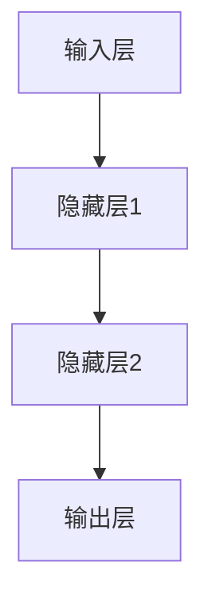
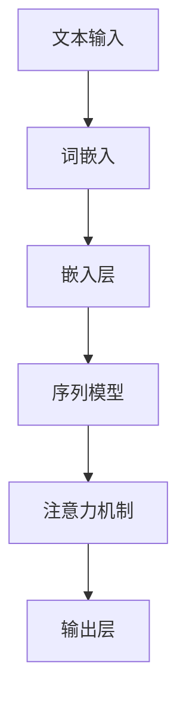
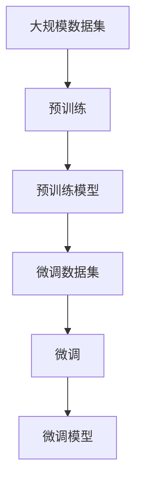

                 

### 文章标题：AI大模型创业：如何构建未来可持续的商业模式？

> 关键词：AI大模型、商业模式、创新、创业、可持续发展

> 摘要：本文将探讨AI大模型在创业领域中的应用，从基础概念、应用领域、成功与失败案例分析，到商业模式的设计与构建，详细解析如何利用AI大模型构建未来可持续的商业模式。文章旨在为创业者提供有益的参考和指导，助力其在激烈的市场竞争中脱颖而出。

### 引言

随着人工智能技术的飞速发展，AI大模型已经成为各行各业的关键驱动因素。从金融、医疗到教育、娱乐，AI大模型的应用正在深刻改变着我们的生活方式和社会结构。在这一背景下，越来越多的创业者将目光投向了AI大模型领域，希望通过创新性的商业模式实现商业价值和社会效益的双重提升。

然而，AI大模型的创业并非易事。一方面，AI大模型的研发和运营成本高昂，需要创业者具备强大的技术实力和资金支持；另一方面，市场环境复杂多变，创业者需要敏锐地捕捉市场机遇，设计出具有竞争力的商业模式。

本文将围绕AI大模型创业这一主题，从基础概念、应用领域、成功与失败案例分析，到商业模式的设计与构建，进行深入探讨。希望通过本文的阐述，为创业者提供一些有益的思考和建议，助力他们在AI大模型创业的道路上走得更远、更稳。

### 第一部分：AI大模型基础

#### 第1章：AI大模型概述

##### 1.1 AI大模型的基本概念

AI大模型是指具有大规模参数和高度复杂结构的机器学习模型，能够处理海量数据并进行复杂任务。这类模型通过深度学习、自然语言处理等先进技术，实现自动化的知识获取、推理和决策。相比于传统的小型模型，AI大模型具有更高的精度、更广泛的应用范围和更强的泛化能力。

###### 1.1.1 AI大模型定义

AI大模型通常具有以下几个特征：

1. **大规模参数**：AI大模型通常拥有数十亿、甚至千亿级别的参数，这使得它们能够捕捉到数据中的复杂模式。
2. **深度结构**：AI大模型采用深度神经网络结构，包括多层感知器、卷积神经网络（CNN）和递归神经网络（RNN）等，能够对数据进行多层次的特征提取和抽象。
3. **自学习能力**：AI大模型通过大规模数据训练，能够自动调整内部参数，优化模型性能。

###### 1.1.2 AI大模型的重要性

AI大模型的重要性体现在以下几个方面：

1. **提升决策能力**：AI大模型能够处理复杂的业务场景，提供更加精准的决策支持，帮助企业降低运营成本、提高效率。
2. **拓展应用领域**：AI大模型的广泛应用推动了人工智能技术在各个领域的渗透，从工业制造、金融服务到医疗健康、教育娱乐，AI大模型都在发挥着重要作用。
3. **创新商业模式**：AI大模型的出现为创业者提供了新的商业机会，通过设计创新性的商业模式，可以实现商业价值和社会效益的双赢。

##### 1.2 AI大模型的技术发展历史

AI大模型的发展历程可以追溯到20世纪80年代，从那时起，AI技术经历了从规则驱动到数据驱动的转变。

###### 1.2.1 从传统AI到深度学习

1. **传统AI**：20世纪80年代，传统AI以知识表示和推理为核心，代表性技术包括专家系统、逻辑推理等。然而，这些方法受限于知识的表示和推理能力，难以处理复杂问题。
2. **数据驱动AI**：随着计算机性能的提升和大数据技术的发展，20世纪90年代后期，机器学习方法开始兴起，特别是支持向量机（SVM）和决策树等算法。这些算法通过训练数据学习特征，提高了模型的性能和泛化能力。
3. **深度学习崛起**：2006年，Hinton等人提出了深度信念网络（DBN），标志着深度学习技术的崛起。深度学习通过多层神经网络对数据进行层次化的特征提取，显著提升了模型的性能。
4. **大规模预训练**：2018年，GPT-3的发布标志着大规模预训练模型的成熟。大规模预训练模型通过在海量数据上预训练，获得了强大的语义理解和生成能力，成为AI大模型的重要技术路径。

###### 1.2.2 大模型的崛起

1. **计算能力的提升**：随着云计算和GPU等计算资源的普及，大规模训练AI大模型成为可能。高性能计算平台的提升为AI大模型的发展提供了强有力的支持。
2. **数据量的爆发**：互联网和物联网的快速发展，产生了海量数据，这些数据为AI大模型的训练提供了丰富的素材。
3. **算法的进步**：深度学习算法的不断改进，特别是优化算法和模型结构的优化，使得大规模训练AI大模型变得更加高效。

##### 1.3 AI大模型的核心技术

AI大模型的核心技术主要包括深度学习基础、自然语言处理技术和大规模预训练模型原理。

###### 1.3.1 深度学习基础

深度学习是AI大模型的核心技术，其基本原理是通过多层神经网络对数据进行特征提取和抽象。以下是深度学习的一些基本概念：

1. **神经网络**：神经网络由多个神经元（或节点）组成，每个神经元接收输入信号，通过加权求和处理产生输出。
2. **反向传播**：反向传播是一种用于训练神经网络的方法，通过计算输出误差，反向更新网络权重，优化模型性能。
3. **激活函数**：激活函数用于引入非线性因素，使得神经网络能够学习到复杂函数。

以下是一个简单的神经网络结构的Mermaid流程图：

###### 1.3.2 自然语言处理技术

自然语言处理（NLP）是AI大模型的重要应用领域，其核心任务包括文本分类、情感分析、机器翻译、文本生成等。以下是NLP的一些关键技术：

1. **词嵌入**：词嵌入是将文本中的词语映射到高维空间中的向量表示，用于捕捉词语的语义信息。
2. **序列模型**：序列模型如循环神经网络（RNN）和长短期记忆网络（LSTM），用于处理序列数据，能够捕捉到时间序列中的依赖关系。
3. **注意力机制**：注意力机制是一种用于提高模型处理长序列数据的能力的技术，通过动态调整不同部分对模型输出的贡献，提高模型的性能。

以下是一个简单的NLP流程图：

###### 1.3.3 大规模预训练模型原理

大规模预训练模型是当前AI大模型的主流技术路径，其基本思想是在大规模数据集上进行预训练，然后针对特定任务进行微调。以下是大规模预训练模型的一些关键技术：

1. **预训练**：预训练是指在大规模数据集上进行无监督学习，使得模型能够自动从数据中学习到丰富的语义知识。
2. **预训练目标**：预训练目标包括语言建模、文本分类、问答等任务，通过这些任务，模型能够学习到不同的语言和知识表示。
3. **微调**：微调是指将预训练模型应用于特定任务，通过有监督学习调整模型的参数，提高模型在特定任务上的性能。

以下是一个简单的预训练和微调流程图：

#### 第2章：AI大模型的应用领域

##### 2.1 AI大模型在行业中的应用

AI大模型在多个行业中得到了广泛应用，显著提升了行业效率和创新能力。以下是AI大模型在几个主要行业中的应用：

###### 2.1.1 金融行业的应用

在金融行业，AI大模型被广泛应用于风险控制、投资决策、客户服务和自动化交易等方面。具体应用包括：

1. **风险控制**：AI大模型可以通过分析历史交易数据和市场动态，预测潜在风险，为金融机构提供风险管理建议。
2. **投资决策**：AI大模型可以根据市场数据、经济指标和公司财务报表等信息，提供投资组合优化建议。
3. **客户服务**：通过自然语言处理技术，AI大模型可以构建智能客服系统，实现24/7的在线客户服务，提高客户满意度。

###### 2.1.2 医疗保健的应用

在医疗保健领域，AI大模型的应用主要体现在诊断辅助、治疗方案推荐和医疗数据分析等方面。具体应用包括：

1. **诊断辅助**：AI大模型可以通过分析医疗影像和患者病历，辅助医生进行疾病诊断，提高诊断准确率。
2. **治疗方案推荐**：AI大模型可以根据患者的病情、基因信息和其他医疗数据，推荐个性化的治疗方案。
3. **医疗数据分析**：AI大模型可以对海量医疗数据进行挖掘和分析，发现潜在的医疗趋势和疾病模式，为医学研究提供支持。

###### 2.1.3 教育行业的应用

在教育行业，AI大模型的应用主要体现在个性化学习、自动评估和教学资源推荐等方面。具体应用包括：

1. **个性化学习**：AI大模型可以根据学生的学习习惯、成绩和学习进度，提供个性化的学习建议和资源，提高学习效果。
2. **自动评估**：AI大模型可以通过自然语言处理技术，自动评估学生的作业和考试答案，减轻教师的工作负担。
3. **教学资源推荐**：AI大模型可以根据学生的学习需求和兴趣，推荐相关的教学资源和课程，丰富学习体验。

##### 2.2 AI大模型的社会影响

AI大模型的发展不仅改变了行业的运行模式，也对整个社会产生了深远的影响。以下是AI大模型对社会的一些影响：

###### 2.2.1 对就业市场的影响

AI大模型的发展可能导致某些传统职业的消失，但同时也创造了新的就业机会。具体影响包括：

1. **职业替代**：AI大模型在数据分析和决策支持方面的应用，可能替代一些低技能岗位，如数据处理员和客服代表。
2. **职业创造**：AI大模型的发展也催生了新的职业，如数据科学家、机器学习工程师和AI产品经理等。
3. **技能需求变化**：随着AI技术的普及，对高技能人才的需求增加，特别是在算法设计、数据分析和系统运维等方面。

###### 2.2.2 对隐私和数据安全的影响

AI大模型在处理海量数据时，可能涉及个人隐私和数据安全问题。具体影响包括：

1. **隐私泄露**：AI大模型在训练和推理过程中，可能无意中泄露用户的隐私信息。
2. **数据滥用**：未经授权的数据访问和使用，可能导致数据滥用和隐私侵犯。
3. **安全防护**：为了防止数据泄露和滥用，需要加强数据安全和隐私保护机制，如数据加密、访问控制和隐私计算等。

###### 2.2.3 对伦理和道德的影响

AI大模型的应用引发了一系列伦理和道德问题，需要社会和科技界共同探讨和解决。具体影响包括：

1. **算法偏见**：AI大模型在训练过程中可能学习到人类社会的偏见，导致不公平的决策。
2. **责任归属**：当AI大模型造成损害时，责任归属问题变得复杂，需要明确责任主体和责任范围。
3. **透明性和可解释性**：为了提高AI大模型的透明性和可解释性，需要开发相应的技术，使得AI决策过程更加透明和可追溯。

#### 第3章：AI大模型创业案例分析

##### 3.1 成功案例解析

在AI大模型创业领域，有许多成功的案例，这些企业通过创新性的商业模式和卓越的技术实力，取得了显著的成就。以下是两个具有代表性的成功案例：

###### 3.1.1 企业A的成功经验

企业A是一家专注于自然语言处理技术的初创公司，通过以下策略取得了成功：

1. **技术创新**：企业A在自然语言处理领域进行了深入的技术研发，推出了多项创新技术，如自动问答系统、文本生成和情感分析等。
2. **市场需求**：企业A敏锐地捕捉到了市场对智能客服和内容生成的需求，将技术产品应用于金融、电商和媒体等行业，迅速占领了市场。
3. **商业模式**：企业A采用了订阅制和合作开发两种模式，一方面通过订阅服务实现稳定的现金流，另一方面通过合作开发获取新的市场份额和技术合作机会。
4. **市场推广**：企业A通过参加行业展会、发布白皮书和建立合作伙伴关系等方式，扩大了品牌影响力，提高了市场认知度。

###### 3.1.2 企业B的崛起之路

企业B是一家专注于医疗影像分析的初创公司，其成功经验主要体现在以下几个方面：

1. **技术优势**：企业B在医疗影像分析领域拥有深厚的技术积累，其自主研发的AI算法在肿瘤检测和疾病诊断方面具有极高的准确率。
2. **合作网络**：企业B与多家顶级医院和科研机构建立了紧密的合作关系，通过临床应用验证和科研合作，不断提升产品的科学性和实用性。
3. **商业模式**：企业B采用了B2B2C的模式，即与医院和科研机构合作，为临床医生提供诊断辅助工具，同时通过患者数据积累，实现个性化医疗和健康管理服务。
4. **市场定位**：企业B精准定位在高端医疗市场，通过提供高品质的AI诊断工具，赢得了广大医生的信任和支持。

##### 3.2 失败案例分析

尽管AI大模型创业具有巨大的潜力，但仍有不少企业在竞争激烈的市场中遭遇失败。以下是两个具有代表性的失败案例：

###### 3.2.1 企业C的困境

企业C是一家专注于金融科技领域的初创公司，其失败原因主要有以下几点：

1. **技术短板**：企业C在AI算法和模型构建方面存在明显短板，导致其产品性能和稳定性无法与竞争对手相媲美。
2. **市场定位不准确**：企业C在初期市场定位上存在偏差，过于追求市场占有率，忽视了产品的质量和用户体验。
3. **资金链断裂**：由于产品性能不佳和市场推广不足，企业C在市场上缺乏竞争力，导致现金流紧张，最终资金链断裂。

###### 3.2.2 企业D的失败原因

企业D是一家专注于智能驾驶技术的初创公司，其失败原因包括：

1. **市场竞争激烈**：智能驾驶领域竞争异常激烈，企业D在技术积累和市场经验方面与领先企业存在较大差距。
2. **产品稳定性不足**：企业D的智能驾驶系统在测试过程中多次出现故障，导致用户对产品的信任度降低。
3. **商业模式不清**：企业D在商业模式设计上缺乏清晰的战略，没有形成稳定的盈利模式，导致公司运营困难。

#### 第4章：AI大模型商业模式设计

##### 4.1 商业模式概述

商业模式是指企业如何通过产品和服务创造、传递和获取价值的一种系统化方法。在AI大模型创业中，商业模式的设计至关重要，它决定了企业的盈利模式、市场定位和竞争优势。以下是商业模式的核心要素和几种创新策略。

###### 4.1.1 商业模式的核心要素

1. **价值主张**：价值主张是企业通过产品或服务为用户创造的价值，是商业模式的核心。对于AI大模型创业来说，价值主张可以是提高效率、降低成本、提供个性化服务等。
2. **目标市场**：目标市场是企业所服务的用户群体，包括市场规模、用户需求和竞争状况等。明确目标市场有助于企业聚焦资源，提供有针对性的产品和服务。
3. **渠道策略**：渠道策略是企业如何将产品和服务传递给用户的方式，包括直销、代理商、线上销售等。选择合适的渠道策略可以提高市场覆盖率和用户满意度。
4. **客户关系**：客户关系是企业与用户之间的互动和管理方式，包括用户获取、留存和增值等。建立良好的客户关系有助于提高用户忠诚度和复购率。
5. **收入来源**：收入来源是企业通过商业模式获取收入的途径，包括产品销售、服务订阅、广告收入等。多样化的收入来源可以提高企业的盈利能力和抗风险能力。
6. **成本结构**：成本结构是企业运营所需投入的成本，包括研发成本、运营成本、营销成本等。优化成本结构有助于提高企业的盈利水平和市场竞争力。

###### 4.1.2 商业模式的创新策略

1. **多元化收入模式**：通过提供多种收入来源，如产品销售、服务订阅、广告收入等，降低对单一收入来源的依赖，提高企业的抗风险能力。
2. **跨界合作**：通过与不同行业的企业合作，实现资源共享和优势互补，拓展市场空间，提高商业模式的创新性和竞争力。
3. **平台化运营**：构建开放的平台，吸引第三方开发者和服务提供商加入，形成生态系统，提升平台价值和用户粘性。
4. **数据驱动的决策**：利用大数据和人工智能技术，对用户行为和市场趋势进行深入分析，优化产品和服务，提高市场响应速度和决策准确性。

##### 4.2 AI大模型商业模式的构建

构建AI大模型商业模式需要综合考虑市场需求、技术能力、资金实力和团队建设等因素。以下是构建AI大模型商业模式的几个关键步骤：

###### 4.2.1 服务模式设计

1. **明确服务目标**：根据市场需求和自身技术优势，明确AI大模型的服务目标，如智能客服、医疗诊断、个性化推荐等。
2. **定义服务内容**：详细描述服务内容，包括功能模块、服务流程和用户体验等。
3. **制定服务标准**：制定服务质量标准，如服务响应时间、准确率和稳定性等，确保服务质量满足用户需求。

###### 4.2.2 收益模式构建

1. **产品销售**：通过销售AI大模型产品，如软件、硬件和解决方案等，获取直接收入。
2. **服务订阅**：提供基于云平台的AI大模型服务，用户通过订阅模式使用服务，实现持续收入。
3. **合作开发**：与行业伙伴合作开发应用场景，通过分成模式获取收益。
4. **广告收入**：通过平台广告、内容推广等方式获取广告收入。

###### 4.2.3 风险管理策略

1. **市场风险**：通过市场调研和竞争分析，了解市场动态，制定灵活的市场应对策略。
2. **技术风险**：加大技术研发投入，确保技术领先优势，同时储备备用技术方案。
3. **资金风险**：制定科学的财务规划，确保资金链的稳定性，同时寻求多渠道融资。
4. **法律风险**：严格遵守相关法律法规，建立完善的法律合规体系，防范法律风险。

##### 4.3 持续创新与未来趋势

AI大模型创业不仅需要解决当前的技术和市场问题，还需要关注持续创新和未来趋势。以下是AI大模型商业模式中的一些新兴趋势：

###### 4.3.1 AI大模型在新兴行业的应用

1. **智能制造**：AI大模型在智能制造领域有广泛的应用前景，如生产过程优化、设备故障预测和供应链管理等。
2. **智慧城市**：AI大模型可以帮助实现城市智能化管理，如交通流量优化、环境监测和公共安全等。
3. **智慧农业**：AI大模型在农业领域可用于作物病虫害检测、种植优化和农产品质量监测等。

###### 4.3.2 AI大模型与区块链的结合

1. **数据隐私保护**：通过区块链技术，实现数据的安全存储和隐私保护，提高AI大模型的数据可信度。
2. **智能合约**：利用AI大模型和区块链技术，实现智能合约的自动执行和监督，提高交易效率和安全性。
3. **供应链管理**：AI大模型与区块链技术结合，可以优化供应链管理，提高供应链的透明度和效率。

###### 4.3.3 AI大模型在智能家居领域的应用

1. **智能助手**：AI大模型可以构建智能助手，实现语音交互、智能家居控制等功能，提高家庭生活便利性。
2. **家居安全**：AI大模型可以通过视频监控和分析，提高家庭安全性，如入侵检测、火警报警等。
3. **能源管理**：AI大模型可以优化家居能源使用，提高能源效率，实现绿色环保。

### 第二部分：AI大模型创业实战

#### 第5章：创业准备

##### 5.1 创业者素质要求

成功创业不仅需要良好的商业计划，更需要创业者具备一定的素质和能力。以下是创业者需要具备的几种关键素质：

###### 5.1.1 技术能力

作为AI大模型创业的创业者，技术能力是基础。创业者需要具备以下技术素养：

1. **深度学习基础**：理解深度学习的基本原理，能够设计和实现神经网络模型。
2. **自然语言处理**：掌握自然语言处理的基本技术，如词嵌入、序列模型和注意力机制等。
3. **编程技能**：熟练掌握至少一门编程语言，如Python、Java或C++等，能够编写高效、可维护的代码。

###### 5.1.2 商业眼光

创业者需要有敏锐的商业眼光，能够洞察市场趋势，识别商机。具体包括：

1. **市场调研**：通过市场调研，了解用户需求、竞争对手和市场规模，为商业决策提供依据。
2. **商业模式设计**：能够设计创新性的商业模式，实现可持续的盈利模式。
3. **财务规划**：具备基本的财务知识，能够进行财务分析和预算管理，确保企业的资金链稳定。

###### 5.1.3 团队管理能力

创业者需要具备团队管理能力，能够吸引、培养和留住优秀人才。具体包括：

1. **领导力**：具备领导力，能够激发团队成员的积极性和创造力。
2. **沟通能力**：具备良好的沟通能力，能够与团队成员、合作伙伴和客户有效沟通。
3. **协调能力**：能够协调团队成员的工作，确保项目进度和质量。

##### 5.2 市场调研与分析

市场调研和分析是创业成功的关键步骤，通过市场调研，创业者可以深入了解目标市场，为商业决策提供依据。以下是市场调研和分析的几个关键方面：

###### 5.2.1 市场规模分析

1. **市场规模**：了解目标市场的整体规模，包括用户数量、市场份额和增长趋势等。
2. **市场增长率**：分析目标市场的增长率，预测未来市场规模的发展趋势。

###### 5.2.2 市场竞争分析

1. **竞争对手**：识别主要竞争对手，分析其市场份额、产品特点和市场策略等。
2. **竞争环境**：了解市场竞争状况，包括市场集中度、竞争格局和竞争规则等。

###### 5.2.3 用户需求分析

1. **用户需求**：通过调研和用户访谈，了解目标用户的需求、偏好和行为习惯等。
2. **用户痛点**：识别用户在当前解决方案中的痛点，为产品设计和功能优化提供依据。

#### 第6章：团队组建与运营

##### 6.1 团队组建策略

组建一支高效、专业的团队是AI大模型创业成功的关键。以下是团队组建的几个关键策略：

###### 6.1.1 技术团队的构建

1. **核心成员**：组建核心团队，包括AI算法专家、软件工程师和数据处理专家等，确保技术实力。
2. **人员招募**：通过招聘、内部推荐和合作伙伴推荐等方式，吸引优秀人才加入团队。
3. **技能培训**：定期组织技术培训，提升团队整体技术能力。

###### 6.1.2 管理团队的构建

1. **领导层**：建立高效的领导层，包括CEO、CTO、CMO和CFO等，明确各自职责和权限。
2. **管理架构**：建立合理的管理架构，确保团队协作和高效决策。
3. **激励机制**：制定激励机制，激发团队成员的积极性和创造力。

###### 6.1.3 市场与销售团队的构建

1. **市场团队**：组建市场团队，包括市场分析师、市场推广人员和品牌经理等，负责市场调研、品牌建设和推广活动。
2. **销售团队**：组建销售团队，包括销售经理、销售代表和客户经理等，负责客户开拓、销售谈判和售后服务。

##### 6.2 运营策略

有效的运营策略是确保AI大模型创业企业稳定发展的关键。以下是运营的几个关键策略：

###### 6.2.1 产品开发周期管理

1. **需求分析**：通过用户调研和市场需求分析，明确产品需求，制定产品开发计划。
2. **设计开发**：组建产品开发团队，按照需求分析结果，进行产品设计、开发和测试。
3. **迭代优化**：根据用户反馈和市场变化，不断优化产品功能，提高产品竞争力。

###### 6.2.2 营销与推广策略

1. **品牌建设**：通过线上线下活动、公关宣传和内容营销等方式，提升品牌知名度。
2. **市场推广**：制定有效的市场推广策略，包括广告投放、合作伙伴关系建立和用户活动策划等。
3. **客户关系管理**：建立完善的客户关系管理系统，通过客户关怀、售后支持和用户调研等方式，提高客户满意度和忠诚度。

###### 6.2.3 数据分析与优化

1. **数据收集**：通过用户行为数据分析、市场数据和运营数据收集，获取有价值的信息。
2. **数据分析**：利用数据分析工具，对收集到的数据进行分析，发现问题和机会。
3. **数据优化**：根据数据分析结果，不断优化产品和服务，提高运营效率和用户体验。

#### 第7章：融资与上市

##### 7.1 融资策略

融资是AI大模型创业企业发展的关键环节，合理的融资策略可以确保企业的资金链稳定，支持企业的快速发展。以下是AI大模型创业企业的几种常见融资策略：

###### 7.1.1 初创阶段的融资

1. **天使投资**：寻找天使投资者，通过私人资金或个人投资者提供初始资金。
2. **种子融资**：通过种子轮融资，吸引风险投资机构和天使投资者，获取资金支持。
3. **政府补助**：申请政府科技创新基金和补贴，降低融资成本。

###### 7.1.2 成长阶段的融资

1. **A轮融资**：在产品初步成熟和市场有一定规模后，通过A轮融资，吸引风险投资机构，获得更大资金支持。
2. **B轮融资**：在产品成熟、市场扩展阶段，通过B轮融资，进一步扩大市场份额。
3. **战略融资**：与行业内的大型企业合作，通过战略投资获取资金和市场资源。

###### 7.1.3 上市融资

1. **IPO上市**：通过IPO（首次公开募股），在证券交易所上市，获得大规模资金支持。
2. **并购融资**：通过并购其他企业，获得资金和市场资源。
3. **私募融资**：通过私募市场，吸引大型私募基金和企业投资者，获得资金支持。

##### 7.2 上市流程与注意事项

上市是AI大模型创业企业的一个重要里程碑，以下是上市的流程和注意事项：

###### 7.2.1 上市的条件与流程

1. **上市条件**：了解证券交易所的上市条件，包括财务要求、公司治理结构要求等。
2. **上市流程**：制定详细的上市计划，包括财务审计、法律审查、股东批准、证券交易所审核等步骤。
3. **上市准备**：组建IPO团队，进行上市准备工作，包括财务优化、法律合规性检查、公司治理结构完善等。

###### 7.2.2 上市对公司的影响

1. **资本扩张**：通过上市，企业可以获取大规模的资金支持，支持企业的进一步发展。
2. **品牌提升**：上市可以提升企业的品牌知名度和市场影响力，增强企业的竞争力。
3. **股东价值**：上市可以提高股东的价值，通过股票交易获得资本回报。

###### 7.2.3 上市后的持续发展策略

1. **持续融资**：上市后，企业可以通过定期的融资活动，获取持续的资金支持。
2. **市场拓展**：通过上市，企业可以拓展海外市场，提高国际竞争力。
3. **技术创新**：持续进行技术创新，保持技术领先地位，推动企业的持续发展。

### 附录

#### 附录A：AI大模型创业工具与资源

##### A.1 开发工具

在进行AI大模型创业时，选择合适的开发工具是至关重要的。以下是几种常用的AI开发工具：

###### A.1.1 深度学习框架

1. **TensorFlow**：由Google开发的开源深度学习框架，支持多种神经网络架构，广泛应用于各种AI项目。
2. **PyTorch**：由Facebook开发的开源深度学习框架，具有灵活的动态计算图和强大的社区支持。

###### A.1.2 自然语言处理工具

1. **spaCy**：一个高效的Python自然语言处理库，支持多种语言，适用于文本分类、命名实体识别等任务。
2. **NLTK**：一个经典的Python自然语言处理库，提供多种文本处理和情感分析功能。

###### A.1.3 数据可视化工具

1. **Matplotlib**：一个强大的Python数据可视化库，支持多种图表类型和自定义样式。
2. **Seaborn**：基于Matplotlib的统计图形可视化库，提供多种内置的统计图表和高级样式选项。

##### A.2 学习资源

为了更好地进行AI大模型创业，以下是一些推荐的学习资源：

###### A.2.1 在线课程

1. **Coursera**：提供大量的计算机科学和人工智能相关课程，由世界顶尖大学提供。
2. **Udacity**：提供实践性强的AI和深度学习课程，适合初学者和进阶者。

###### A.2.2 专业书籍

1. **《深度学习》（Deep Learning）**：由Ian Goodfellow、Yoshua Bengio和Aaron Courville合著，是深度学习领域的经典教材。
2. **《自然语言处理综论》（Speech and Language Processing）**：由Daniel Jurafsky和James H. Martin合著，是自然语言处理领域的权威著作。

###### A.2.3 行业报告与资讯

1. **IDC**：国际数据公司（International Data Corporation）发布的人工智能行业报告，提供全球和区域市场的深度分析。
2. **CBInsights**：提供人工智能领域的最新资讯、趋势分析和市场数据。

通过这些工具和资源，创业者可以更好地掌握AI大模型的技术原理和实践技能，为创业成功奠定坚实基础。

