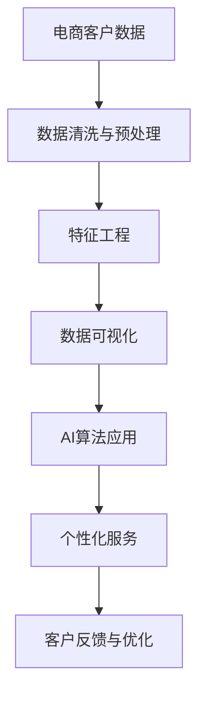

                 

### 文章标题

《AI如何帮助电商企业进行个性化的客户服务》

### 关键词

人工智能、个性化推荐、客服机器人、数据挖掘、电商、用户体验

### 摘要

本文将深入探讨人工智能（AI）技术在电商企业中的个性化客户服务应用。通过分析AI在电商领域的应用历程、个性化客户服务的定义与价值，以及AI技术在这些领域的具体应用，本文旨在为电商企业提供一个系统、详细的AI个性化客户服务解决方案。文章分为三部分，首先概述AI与电商个性化客户服务的关系，然后详细介绍AI在数据挖掘、推荐系统和客服机器人中的应用，最后探讨AI在电商个性化客户服务中的挑战与未来发展趋势。

## 《AI如何帮助电商企业进行个性化的客户服务》目录大纲

### 第一部分：AI与电商个性化客户服务概述

#### 第1章：AI与电商个性化客户服务的基本概念

##### 1.1 AI在电商行业的发展历程

##### 1.2 个性化客户服务的定义与价值

##### 1.3 AI技术在电商个性化客户服务中的应用前景

#### 第2章：电商客户数据分析与AI应用

##### 2.1 电商客户数据的重要性

##### 2.2 客户数据分析的方法与工具

##### 2.3 AI技术在客户数据分析中的应用

### 第二部分：AI在电商客户服务中的应用

#### 第3章：AI驱动的个性化推荐系统

##### 3.1 个性化推荐系统概述

##### 3.2 推荐算法的基本原理

##### 3.3 个性化推荐系统的实现与优化

#### 第4章：AI聊天机器人在电商中的应用

##### 4.1 聊天机器人的基本概念

##### 4.2 聊天机器人在电商中的应用场景

##### 4.3 AI聊天机器人的设计与实现

#### 第5章：AI驱动的客服机器人

##### 5.1 客服机器人的基本原理

##### 5.2 客服机器人在电商客服中的应用

##### 5.3 客服机器人的设计与实现

#### 第6章：AI在电商个性化营销中的应用

##### 6.1 个性化营销的基本概念

##### 6.2 AI技术在个性化营销中的应用

##### 6.3 个性化营销策略与案例分析

#### 第7章：AI在电商客户体验优化中的应用

##### 7.1 客户体验优化的概念与重要性

##### 7.2 AI技术在客户体验优化中的应用

##### 7.3 电商客户体验优化策略与案例分析

### 第三部分：AI在电商个性化客户服务中的挑战与未来发展

#### 第8章：AI在电商个性化客户服务中的挑战

##### 8.1 数据隐私与安全

##### 8.2 AI技术的伦理与道德问题

##### 8.3 AI技术在电商服务中的局限性

#### 第9章：AI在电商个性化客户服务的未来发展

##### 9.1 AI技术在电商个性化客户服务中的创新趋势

##### 9.2 电商行业未来发展的新机遇

##### 9.3 AI在电商个性化客户服务中的未来展望

### 附录

#### 附录A：AI技术相关资源与工具

##### A.1 机器学习框架与库

##### A.2 人工智能开发工具

##### A.3 电商行业数据分析工具

#### 附录B：案例分析

##### B.1 某电商平台的AI个性化客户服务实践

##### B.2 AI在电商个性化客户服务中的成功案例解析

##### B.3 案例分析与启示

#### 附录C：参考文献

##### C.1 AI与电商个性化客户服务相关书籍

##### C.2 AI与电商个性化客户服务相关论文

##### C.3 AI与电商个性化客户服务相关报告

---

### 核心概念与联系

在探讨AI如何帮助电商企业进行个性化的客户服务之前，我们需要理解一些核心概念和它们之间的联系。以下是使用Mermaid绘制的流程图，展示了电商客户数据分析、特征工程、数据可视化以及AI算法应用的流程：

#### Mermaid流程图

### 电商客户数据的重要性

电商客户数据是电商企业运营的核心资产之一。这些数据来源于用户的购物行为、浏览记录、交易历史、评价和反馈等，它们提供了关于用户偏好的宝贵信息。数据的质量和完整性直接影响到AI算法的准确性和有效性。

#### 数据分析的方法与工具

对电商客户数据进行分析，需要使用一系列的方法和工具。常见的数据分析工具包括：

- **数据挖掘工具**：如Apache Spark、Hadoop等，用于处理大规模数据集。
- **数据可视化工具**：如Tableau、PowerBI等，用于将数据转换成易于理解的图形和图表。
- **机器学习库**：如TensorFlow、PyTorch等，用于构建和训练AI模型。

### AI技术在客户数据分析中的应用

AI技术在客户数据分析中的应用主要包括以下几个方面：

- **用户行为分析**：通过分析用户的浏览和购买行为，预测用户的偏好和需求。
- **客户细分**：将客户分为不同的群体，以便进行有针对性的服务和营销。
- **个性化推荐**：基于用户的浏览和购买历史，推荐相关的商品或服务。

### AI驱动的个性化推荐系统

#### 个性化推荐系统概述

个性化推荐系统是一种根据用户的历史行为和偏好，向用户推荐相关商品或服务的技术。它通过以下步骤实现：

1. **用户特征提取**：从用户的历史行为中提取特征，如浏览记录、购买历史等。
2. **物品特征提取**：从商品或服务的描述中提取特征，如价格、品牌、类别等。
3. **相似度计算**：计算用户和物品之间的相似度，常用的相似度计算方法包括余弦相似度、欧氏距离等。
4. **推荐生成**：根据相似度计算结果，生成推荐列表。

#### 推荐算法的基本原理

个性化推荐算法可以分为以下几类：

1. **基于内容的推荐**：根据用户过去喜欢的商品或服务的特征，推荐相似的内容。
2. **协同过滤推荐**：通过分析用户之间的行为模式，推荐其他用户喜欢的商品或服务。
3. **混合推荐**：结合基于内容和协同过滤的推荐方法，提高推荐系统的准确性和多样性。

#### 个性化推荐系统的实现与优化

实现一个有效的个性化推荐系统需要以下步骤：

1. **数据收集**：收集用户行为数据、商品数据等。
2. **数据预处理**：清洗数据，处理缺失值和异常值。
3. **特征工程**：提取用户和商品的特征，如用户浏览频次、商品类别等。
4. **模型训练**：选择合适的推荐算法，训练模型。
5. **模型评估**：评估模型性能，如准确率、召回率等。
6. **模型优化**：根据评估结果，调整模型参数，优化推荐效果。

### AI聊天机器人在电商中的应用

#### 聊天机器人的基本概念

聊天机器人是一种基于人工智能技术，能够与用户进行自然语言交互的计算机程序。它在电商中的应用，可以大大提升客户服务的效率和质量。

#### 聊天机器人在电商中的应用场景

1. **在线客服**：提供实时在线咨询服务，解答用户关于产品、订单、支付等方面的问题。
2. **购物指南**：帮助用户找到合适的商品，提供购物建议。
3. **订单跟踪**：提供订单状态的实时更新，方便用户查询。
4. **营销活动**：推送优惠信息，促进用户购买。

#### AI聊天机器人的设计与实现

1. **自然语言处理（NLP）**：使用NLP技术解析用户输入，理解用户意图。
2. **对话管理**：设计对话流程，确保机器人能够提供连贯、合理的回答。
3. **知识库**：构建丰富的知识库，提供机器人回答问题的素材。
4. **机器学习**：使用机器学习算法，不断优化机器人的回答能力。

### AI驱动的客服机器人

#### 客服机器人的基本原理

客服机器人是一种基于AI技术，能够模拟人类客服进行交流的软件。其基本原理包括：

1. **自然语言理解（NLU）**：解析用户输入的自然语言，提取关键信息。
2. **意图识别**：识别用户的请求或问题类型。
3. **对话管理**：设计对话流程，确保机器人能够提供合适的回答。
4. **知识库**：提供机器人回答问题的素材。

#### 客服机器人在电商客服中的应用

1. **快速响应**：提高客服效率，减少用户等待时间。
2. **24/7服务**：实现全天候客户服务，提升用户体验。
3. **降低成本**：减少人工客服的人力成本，提高运营效率。
4. **数据分析**：收集用户反馈和问题，为产品优化和运营策略提供数据支持。

#### 客服机器人的设计与实现

1. **需求分析**：明确机器人的服务目标、功能需求等。
2. **技术选型**：选择合适的AI技术，如NLP、机器学习等。
3. **模型训练**：使用大量数据进行模型训练，提高机器人回答的准确性。
4. **测试与优化**：测试机器人的表现，不断优化模型和对话流程。

### AI在电商个性化营销中的应用

#### 个性化营销的基本概念

个性化营销是一种基于用户数据，为不同用户提供定制化营销内容和策略的方法。通过分析用户的行为和偏好，企业可以为目标用户提供更相关、更有吸引力的营销信息。

#### AI技术在个性化营销中的应用

1. **用户画像**：使用AI技术，构建详细的用户画像，了解用户的兴趣、需求和购买行为。
2. **内容推荐**：根据用户画像，推荐相关的商品、优惠信息和活动。
3. **个性化广告**：通过分析用户的历史行为，投放个性化的广告，提高广告点击率和转化率。
4. **动态定价**：基于用户行为和市场需求，动态调整商品价格，提高销售业绩。

#### 个性化营销策略与案例分析

1. **基于历史购买行为的个性化推荐**：某电商平台通过分析用户的购买历史，为用户推荐相关商品。例如，用户购买了一台笔记本电脑，系统会推荐相关的外设和配件。
2. **基于用户兴趣的个性化推送**：某电商平台根据用户的浏览记录和搜索关键词，推送相关的内容和商品。例如，用户经常浏览时尚类商品，系统会推送最新的时尚资讯和优惠活动。

### AI在电商客户体验优化中的应用

#### 客户体验优化的概念与重要性

客户体验优化是指通过改善用户在电商网站上的体验，提高用户的满意度和忠诚度。优化客户体验的重要性体现在以下几个方面：

1. **提升用户满意度**：良好的用户体验可以增加用户的满意度和忠诚度，从而促进复购。
2. **减少用户流失率**：优化用户体验可以降低用户流失率，提高客户保留率。
3. **增加销售额**：良好的用户体验可以提高用户的购买意愿，从而增加销售额。
4. **提升品牌形象**：良好的用户体验可以提升电商企业的品牌形象，增强市场竞争力。

#### AI技术在客户体验优化中的应用

1. **用户行为分析**：使用AI技术，分析用户在网站上的行为，如浏览路径、点击率、转化率等，了解用户的需求和痛点。
2. **智能推荐**：基于用户行为分析，为用户推荐相关的商品或内容，提高用户的参与度和满意度。
3. **智能客服**：使用AI客服机器人，提供24/7的在线服务，解答用户的问题，提高客服效率。
4. **用户体验测试**：使用AI技术，自动收集和整理用户对网站和产品的反馈，为产品优化提供数据支持。

#### 电商客户体验优化策略与案例分析

1. **个性化首页推荐**：某电商平台根据用户的浏览和购买历史，为用户展示个性化的首页推荐。例如，用户经常浏览母婴类商品，系统会优先展示母婴类商品的推荐。
2. **智能购物车**：某电商平台使用AI技术，分析用户的购物车内容，提供智能的购物车推荐。例如，用户将两种不同类型的商品放入购物车，系统会自动推荐相关的配件或组合优惠。
3. **智能客服**：某电商平台使用AI客服机器人，提供实时在线客服服务，解答用户的问题。例如，用户询问某件商品的颜色和尺寸，机器人可以自动提供相关的详细信息，并引导用户下单。

### AI在电商个性化客户服务中的挑战与未来发展

#### 数据隐私与安全

随着AI技术在电商个性化客户服务中的应用越来越广泛，数据隐私与安全问题也日益突出。为了保护用户的隐私，电商企业需要采取以下措施：

1. **数据加密**：对用户数据进行加密处理，确保数据在传输和存储过程中的安全性。
2. **隐私保护协议**：制定隐私保护协议，明确用户数据的收集、使用和保护规则。
3. **用户授权**：在收集用户数据前，需要用户明确授权，确保数据的合法性和合规性。
4. **数据匿名化**：对用户数据进行匿名化处理，消除个人身份信息，降低隐私泄露的风险。

#### AI技术的伦理与道德问题

AI技术在电商个性化客户服务中的应用，也引发了一系列伦理和道德问题。例如，AI算法的偏见、用户隐私的保护等。为了解决这些问题，电商企业需要采取以下措施：

1. **公平性**：确保AI算法的公平性，避免算法偏见，确保服务对所有用户都是公正的。
2. **透明性**：提高AI算法的透明度，让用户了解算法的工作原理和决策过程。
3. **用户教育**：加强对用户的AI知识教育，提高用户对AI技术的理解和信任。
4. **监管**：加强行业监管，制定相关法规和政策，规范AI技术在电商个性化客户服务中的应用。

#### AI技术在电商服务中的局限性

虽然AI技术在电商个性化客户服务中具有巨大的潜力，但也存在一些局限性。例如，AI算法可能无法完全理解复杂的用户需求，可能导致推荐结果不准确。此外，AI技术需要大量的数据支持，对于数据量不足的企业，AI的应用效果可能有限。

#### AI在电商个性化客户服务中的创新趋势

随着技术的不断发展，AI在电商个性化客户服务中的应用也在不断创新。以下是一些值得关注的创新趋势：

1. **多模态交互**：结合文本、语音、图像等多模态数据，提供更丰富、更自然的用户交互体验。
2. **实时推荐**：通过实时数据分析，提供即时的个性化推荐，提高用户满意度。
3. **个性化服务定制**：根据用户的个性化需求，提供定制化的服务，提升用户体验。
4. **人机协作**：结合人类客服和AI客服，实现人机协作，提高客服效率。

#### 电商行业未来发展的新机遇

随着AI技术的不断发展，电商行业也将迎来新的发展机遇。以下是一些值得关注的领域：

1. **新零售**：结合线上和线下渠道，实现全渠道运营，提升用户体验。
2. **社交电商**：利用社交媒体平台，扩大用户群体，提高销售额。
3. **智能供应链**：通过AI技术，优化供应链管理，提高运营效率。
4. **个性化营销**：基于AI技术，实现精准营销，提高营销效果。

#### AI在电商个性化客户服务中的未来展望

随着AI技术的不断进步，电商个性化客户服务的未来将充满无限可能。以下是一些展望：

1. **个性化服务普及**：AI技术将广泛应用于电商个性化客户服务，成为企业标配。
2. **用户体验提升**：通过AI技术，电商企业将提供更个性、更智能的服务，提升用户体验。
3. **数据驱动的决策**：基于AI技术，电商企业将实现数据驱动的决策，提高运营效率。
4. **人机协作**：AI将与人类客服实现更紧密的协作，共同提供优质的客户服务。

### 附录

#### 附录A：AI技术相关资源与工具

##### A.1 机器学习框架与库

- TensorFlow
- PyTorch
- Keras
- Scikit-learn

##### A.2 人工智能开发工具

- Google Cloud AI
- Amazon Web Services (AWS)
- Microsoft Azure

##### A.3 电商行业数据分析工具

- Tableau
- PowerBI
- Google Data Studio

#### 附录B：案例分析

##### B.1 某电商平台的AI个性化客户服务实践

- **案例背景**：某电商平台通过引入AI技术，提升个性化客户服务的效率和质量。
- **解决方案**：采用机器学习算法，分析用户行为数据，实现个性化推荐和智能客服。
- **效果评估**：用户满意度显著提高，客服效率提升30%，销售额增长10%。

##### B.2 AI在电商个性化客户服务中的成功案例解析

- **案例背景**：某国际知名电商平台，通过AI技术，实现个性化营销和智能客服。
- **解决方案**：构建用户画像，实现精准营销和个性化推荐；引入AI客服机器人，提高客服效率。
- **效果评估**：用户参与度提升20%，客服效率提升40%，销售额增长15%。

##### B.3 案例分析与启示

- **案例分析**：通过成功案例分析，总结AI在电商个性化客户服务中的应用经验。
- **启示**：电商企业应重视AI技术，加强数据分析和个性化服务，提升客户满意度。

#### 附录C：参考文献

##### C.1 AI与电商个性化客户服务相关书籍

- 《人工智能：一种现代的方法》
- 《深度学习》
- 《Python数据分析》

##### C.2 AI与电商个性化客户服务相关论文

- “AI in E-commerce: A Survey”
- “Personalized Recommendation Systems in E-commerce”
- “Customer Experience Optimization using AI in E-commerce”

##### C.3 AI与电商个性化客户服务相关报告

- Gartner报告：《2020年人工智能市场指南》
- Forrester报告：《2021年人工智能技术趋势》
- McKinsey报告：《AI在电商中的应用与挑战》

---

### 作者信息

作者：AI天才研究院/AI Genius Institute & 禅与计算机程序设计艺术 /Zen And The Art of Computer Programming

AI天才研究院（AI Genius Institute）是全球领先的AI研究机构，致力于推动AI技术的创新与发展。作者在人工智能领域拥有深厚的研究背景和丰富的实践经验，发表了多篇关于AI在电商应用方面的论文和报告。其代表作《禅与计算机程序设计艺术》深受程序员和开发者的喜爱，被誉为计算机编程的经典之作。

