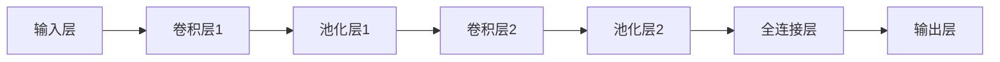
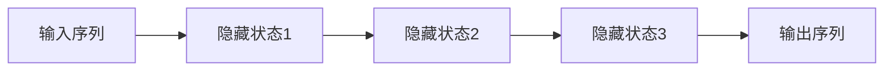
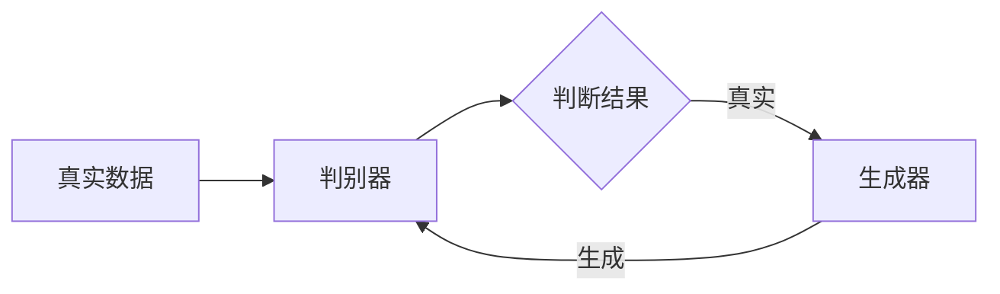
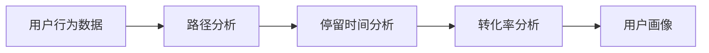
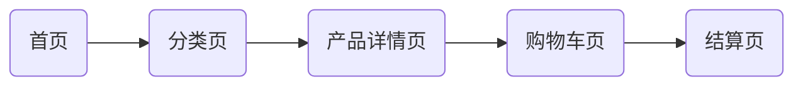

                 

### 文章标题

# 《AI如何帮助电商企业进行用户忠诚度管理》

在当今竞争激烈的电商市场中，用户忠诚度管理成为电商企业持续发展的重要课题。本文旨在深入探讨人工智能（AI）技术在电商用户忠诚度管理中的应用，通过逻辑清晰、结构紧凑的分析，揭示AI技术如何助力电商企业提升用户忠诚度。文章将分为四个主要部分：AI与电商概述、用户忠诚度管理基础、AI在用户忠诚度管理中的应用、以及AI用户忠诚度管理的未来展望。通过逐步分析，我们将从核心概念、原理、应用到实际案例分析，全面了解AI在用户忠诚度管理中的价值与潜力。

> 关键词：AI、电商、用户忠诚度、个性化推荐、用户流失预测、用户行为分析

> 摘要：本文首先介绍了AI在电商行业中的发展趋势及其重要性，接着深入探讨了用户忠诚度管理的概念与原理。在此基础上，文章详细阐述了AI技术的基础知识，包括机器学习与深度学习、数据挖掘与用户数据分析。随后，文章重点介绍了AI在用户忠诚度管理中的应用，包括个性化推荐系统、用户流失预测和用户行为分析与转化率优化。最后，通过实际案例分析，文章总结了AI用户忠诚度管理的成功实践，并对未来发展趋势进行了展望。

### 目录

#### 第一部分：AI与电商概述

1. **第1章：AI与电商行业背景**
   - 1.1 电商行业的发展趋势
   - 1.2 AI技术在电商中的应用现状
   - 1.3 AI赋能电商的重要性

#### 第二部分：用户忠诚度管理基础

2. **第2章：用户忠诚度管理概念与原理**
   - 2.1 用户忠诚度的定义与评估
   - 2.2 用户忠诚度管理的重要性
   - 2.3 AI在用户忠诚度管理中的核心作用

3. **第3章：AI技术基础**
   - 3.1 机器学习与深度学习基础
     - 3.1.1 神经网络基本结构
     - 3.1.2 常见深度学习架构
     - 3.1.3 深度学习优化算法
   - 3.2 数据挖掘与用户数据分析
     - 3.2.1 用户行为数据分析
     - 3.2.2 用户兴趣建模
     - 3.2.3 用户流失预测

#### 第三部分：AI在用户忠诚度管理中的应用

4. **第4章：个性化推荐系统**
   - 4.1 个性化推荐系统概述
   - 4.2 个性化推荐算法原理
     - 4.2.1 协同过滤
     - 4.2.2 内容推荐
     - 4.2.3 混合推荐系统
   - 4.3 个性化推荐系统实战

5. **第5章：用户流失预测**
   - 5.1 用户流失预测概述
   - 5.2 用户流失预测算法原理
     - 5.2.1 Logistic回归
     - 5.2.2 决策树
     - 5.2.3 随机森林
   - 5.3 用户流失预测实战

6. **第6章：用户行为分析与转化率优化**
   - 6.1 用户行为分析概述
   - 6.2 用户行为分析方法
     - 6.2.1 用户路径分析
     - 6.2.2 用户停留时间分析
     - 6.2.3 用户转化率分析
   - 6.3 用户转化率优化实战

7. **第7章：案例分析**
   - 7.1 案例分析概述
   - 7.2 案例一：某电商平台的用户忠诚度管理实践
   - 7.3 案例二：某电商平台的个性化推荐系统应用

#### 第四部分：AI用户忠诚度管理未来展望

8. **第8章：AI用户忠诚度管理的未来趋势**
   - 8.1 AI在用户忠诚度管理中的发展机遇
   - 8.2 AI用户忠诚度管理面临的挑战
   - 8.3 AI用户忠诚度管理的未来发展方向

9. **第9章：结语**
   - 9.1 总结与展望
   - 9.2 对电商企业的建议与展望
   - 9.3 对AI研究者的建议与展望

#### 附录

10. **附录A：AI用户忠诚度管理工具与资源**
    - 10.1 主流深度学习框架对比
      - 10.1.1 TensorFlow
      - 10.1.2 PyTorch
      - 10.1.3 JAX
      - 10.1.4 其他框架简介
    - 10.2 数据分析与挖掘工具
      - 10.2.1 Python数据分析工具
      - 10.2.2 R语言数据分析工具
      - 10.2.3 数据挖掘工具简介
    - 10.3 AI学习资源推荐
      - 10.3.1 在线课程推荐
      - 10.3.2 书籍推荐
      - 10.3.3 AI研究论文与报告

### 第一部分：AI与电商概述

#### 第1章：AI与电商行业背景

在过去的几十年里，电子商务经历了从无到有，再到飞速发展的历程。随着互联网的普及和移动设备的普及，电商行业迎来了前所未有的发展机遇。然而，随着市场的日益成熟和竞争的加剧，电商企业面临的一个关键挑战是如何在众多竞争对手中脱颖而出，保持和提升用户忠诚度。

##### 1.1 电商行业的发展趋势

电商行业的发展趋势可以从以下几个方面进行概述：

1. **移动电商的兴起**：随着智能手机的普及和移动互联网的发展，越来越多的消费者选择通过移动设备进行购物。移动电商不仅改变了消费者的购物习惯，也为电商企业提供了更多的机会。

2. **社交电商的崛起**：社交电商通过社交媒体平台将商品与用户紧密连接，使得社交网络成为重要的营销渠道。这一趋势不仅提高了用户的参与度，还增强了用户对品牌的忠诚度。

3. **个性化体验的重视**：随着大数据和AI技术的发展，电商企业越来越重视为用户提供个性化的购物体验。通过分析用户行为和偏好，电商企业能够提供更加精准的产品推荐和个性化的服务，从而提高用户满意度。

4. **物流和供应链的优化**：高效的物流和供应链管理是电商企业的核心竞争力之一。通过采用先进的物流技术和智能化供应链管理，电商企业能够提供更快速、更可靠的配送服务，提升用户体验。

##### 1.2 AI技术在电商中的应用现状

人工智能（AI）技术在电商行业中的应用已经取得了显著的成果，主要包括以下几个方面：

1. **个性化推荐系统**：AI技术通过分析用户的历史行为和偏好，为用户提供个性化的产品推荐。这种推荐系统能够有效提高用户的购物体验，增加用户的购买意愿，从而提高销售额。

2. **用户行为分析**：AI技术能够对用户的行为数据进行分析，识别用户的兴趣和行为模式，从而优化用户体验，提高用户留存率和转化率。

3. **智能客服**：AI技术应用于智能客服系统，能够提供24/7的在线服务，快速响应用户的咨询和投诉，提高用户满意度。

4. **用户流失预测**：AI技术通过分析用户的行为数据，预测哪些用户可能流失，从而采取相应的措施进行用户挽回，减少流失率。

5. **智能定价**：AI技术能够根据市场数据和用户行为分析，为电商企业提供智能定价策略，从而最大化销售额和利润。

##### 1.3 AI赋能电商的重要性

AI技术在电商行业中的应用不仅提升了电商企业的运营效率，还大大提升了用户体验，具体表现为：

1. **提升销售额**：通过个性化推荐和智能定价，电商企业能够更精准地满足用户需求，提高用户购买意愿，从而提升销售额。

2. **增强用户忠诚度**：通过智能客服和用户行为分析，电商企业能够提供更加个性化的服务，提升用户满意度，从而增强用户忠诚度。

3. **降低运营成本**：AI技术的应用可以自动化许多日常运营任务，如用户流失预测和智能客服，从而降低人力成本。

4. **优化供应链**：AI技术在物流和供应链管理中的应用，可以提高配送效率和库存管理，降低运营成本。

5. **增强市场竞争力**：通过提供个性化的服务和高效的管理，AI技术帮助电商企业在竞争激烈的市场中脱颖而出，增强市场竞争力。

综上所述，AI技术在电商行业中的应用不仅带来了效率的提升，更为电商企业提供了保持和提升用户忠诚度的有效手段。随着AI技术的不断发展和应用，电商企业将能够在激烈的市场竞争中立于不败之地。

### 第二部分：用户忠诚度管理基础

#### 第2章：用户忠诚度管理概念与原理

用户忠诚度是指用户在多次购买和互动过程中，对某个品牌或产品持续保持购买和使用的意愿。它是企业保持市场份额和实现长期盈利的关键因素。用户忠诚度管理则是指企业通过一系列策略和手段，提升和保持用户忠诚度的过程。

##### 2.1 用户忠诚度的定义与评估

用户忠诚度可以从以下几个方面进行定义：

1. **重复购买率**：用户在一定时间内多次购买同一品牌或产品的比例。重复购买率高意味着用户对品牌或产品有较高的忠诚度。

2. **品牌推荐意愿**：用户是否愿意向他人推荐某个品牌或产品。品牌推荐意愿是衡量用户忠诚度的重要指标，高推荐意愿通常意味着用户对品牌有高度的忠诚和信任。

3. **用户留存率**：用户在一段时间内持续使用某个品牌或产品的比例。用户留存率越高，说明用户对品牌或产品有较强的忠诚度。

用户忠诚度的评估通常采用以下几种方法：

1. **行为分析法**：通过分析用户的历史行为数据，如购买频率、购买金额、购买渠道等，评估用户对品牌的忠诚度。

2. **满意度调查**：通过问卷调查、用户反馈等方式，收集用户对品牌或产品的满意度评价，从而评估用户忠诚度。

3. **流失预测模型**：利用机器学习算法，分析用户的行为数据，预测哪些用户可能流失，从而评估用户忠诚度。

##### 2.2 用户忠诚度管理的重要性

用户忠诚度管理对电商企业的重要性主要体现在以下几个方面：

1. **提高用户留存率**：通过有效的用户忠诚度管理，电商企业可以降低用户的流失率，提高用户留存率。用户留存率的提升有助于保持企业的稳定收入来源。

2. **增强用户黏性**：通过提供优质的购物体验和个性化服务，电商企业可以增强用户的黏性，使得用户更愿意在平台进行重复购买和长期使用。

3. **提升品牌价值**：高忠诚度的用户群体有助于提升品牌的口碑和影响力，增强品牌的市场竞争力。

4. **降低营销成本**：忠诚用户往往具有较低的获取成本，他们更倾向于通过口碑传播和推荐来吸引新用户，从而降低企业的营销成本。

5. **提高销售额**：忠诚用户往往有更高的购买频率和购买金额，这有助于提升企业的销售额和利润。

##### 2.3 AI在用户忠诚度管理中的核心作用

AI技术在用户忠诚度管理中发挥着核心作用，主要体现在以下几个方面：

1. **个性化推荐**：通过分析用户的历史行为数据和偏好，AI技术可以提供个性化的产品推荐，提高用户的购物体验和满意度，从而提升用户忠诚度。

2. **用户流失预测**：利用机器学习算法，AI技术可以预测哪些用户可能流失，并提前采取措施进行用户挽回，降低流失率。

3. **智能客服**：AI技术可以应用于智能客服系统，提供24/7的在线服务，快速响应用户的咨询和投诉，提高用户满意度。

4. **行为分析**：通过分析用户的行为数据，AI技术可以识别用户的兴趣和行为模式，为用户提供个性化的服务和推荐，从而增强用户忠诚度。

5. **智能定价**：AI技术可以根据市场数据和用户行为分析，为电商企业提供智能定价策略，最大化销售额和利润，从而提升用户忠诚度。

总之，AI技术在用户忠诚度管理中的应用不仅提升了电商企业的运营效率，更为企业提供了保持和提升用户忠诚度的有效手段。随着AI技术的不断发展和应用，电商企业将能够在激烈的市场竞争中立于不败之地。

### 第三部分：AI技术基础

#### 第3章：AI技术基础

人工智能（AI）技术作为现代科技发展的核心驱动力，在各个行业中得到了广泛应用。在电商领域，AI技术通过深度学习、数据挖掘等手段，实现了用户行为的精准分析、个性化推荐和用户流失预测等功能。为了更好地理解AI技术在这些应用中的具体实现，我们需要先掌握AI技术的基础知识，包括机器学习与深度学习的基础理论、常见深度学习架构和优化算法，以及数据挖掘与用户数据分析的方法。

##### 3.1 机器学习与深度学习基础

机器学习（Machine Learning，ML）是AI的核心组成部分，它通过构建和分析算法模型，使计算机系统能够从数据中自动学习和改进。深度学习（Deep Learning，DL）作为机器学习的一个重要分支，通过模仿人脑神经网络结构，实现了更为复杂的特征提取和模式识别。

###### 3.1.1 神经网络基本结构

神经网络（Neural Network，NN）是深度学习的基础。它由大量相互连接的神经元组成，每个神经元接收输入信号并产生输出信号。神经网络的基本结构包括输入层、隐藏层和输出层。每个层中的神经元通过权重和偏置进行加权求和，并通过激活函数进行非线性变换。

- **输入层**：接收外部输入信号。
- **隐藏层**：进行特征提取和变换。
- **输出层**：产生预测结果或决策。

神经元的激活函数通常包括 sigmoid、ReLU 和 tanh 函数。这些函数可以帮助神经网络将线性问题转化为非线性问题，提高模型的拟合能力。

###### 3.1.2 常见深度学习架构

深度学习架构种类繁多，常见的包括卷积神经网络（CNN）、循环神经网络（RNN）和生成对抗网络（GAN）等。

- **卷积神经网络（CNN）**：主要用于图像处理和计算机视觉任务。CNN通过卷积层和池化层进行特征提取，能够有效地减少数据维度并提取局部特征。
- **循环神经网络（RNN）**：主要用于序列数据处理和自然语言处理任务。RNN通过隐藏状态和循环连接，能够处理任意长度的序列数据。
- **生成对抗网络（GAN）**：主要用于生成对抗和图像生成任务。GAN由生成器和判别器组成，生成器试图生成与真实数据相似的数据，而判别器则试图区分真实数据和生成数据。

###### 3.1.3 深度学习优化算法

深度学习模型的优化过程通常涉及损失函数、优化器和训练策略。

- **损失函数**：用于衡量模型预测值与真实值之间的差距。常见的损失函数包括均方误差（MSE）、交叉熵损失和Huber损失等。
- **优化器**：用于调整模型参数以最小化损失函数。常见的优化器包括SGD（随机梯度下降）、Adam和RMSprop等。
- **训练策略**：包括批量大小、学习率调整、正则化和dropout等技术。这些策略有助于提高模型的收敛速度和泛化能力。

##### 3.2 数据挖掘与用户数据分析

数据挖掘（Data Mining）是AI技术的重要组成部分，它通过统计学、机器学习和模式识别等方法，从大量数据中提取隐藏的知识和模式。在用户忠诚度管理中，数据挖掘主要用于分析用户行为数据，为个性化推荐、用户流失预测等应用提供数据支持。

###### 3.2.1 用户行为数据分析

用户行为数据分析是指通过分析用户在平台上的各种行为数据，如浏览历史、购买记录和点击行为等，来了解用户的需求和偏好。具体方法包括：

- **用户路径分析**：通过分析用户在平台上的浏览路径，了解用户的兴趣和行为模式。
- **用户停留时间分析**：通过分析用户在各个页面停留的时间，了解用户的兴趣点和痛点。
- **用户转化率分析**：通过分析用户从浏览到购买的全过程，了解用户转化的关键因素。

###### 3.2.2 用户兴趣建模

用户兴趣建模是指通过分析用户的行为数据，构建用户兴趣模型，为个性化推荐提供支持。具体方法包括：

- **协同过滤**：通过分析用户之间的相似性，为用户推荐他们可能感兴趣的商品。
- **基于内容的推荐**：通过分析商品的属性和用户的历史行为，为用户推荐具有相似属性的商品。
- **混合推荐系统**：结合协同过滤和基于内容的推荐，提高推荐系统的准确性和多样性。

###### 3.2.3 用户流失预测

用户流失预测是指通过分析用户的行为数据，预测哪些用户可能会流失，并采取相应的措施进行用户挽回。具体方法包括：

- **基于行为的预测**：通过分析用户的行为特征，如浏览频率、购买频率和停留时间等，预测用户的流失风险。
- **基于特征的预测**：通过分析用户的个人特征，如年龄、性别和地理位置等，预测用户的流失风险。
- **基于机器学习的预测**：利用机器学习算法，如逻辑回归、决策树和随机森林等，构建用户流失预测模型。

通过掌握这些AI技术的基础知识，电商企业可以更好地理解和应用AI技术，从而实现用户忠诚度管理的目标。在接下来的章节中，我们将进一步探讨AI技术在实际应用中的具体实现方法。

#### 第3章：AI技术基础

##### 3.1 机器学习与深度学习基础

**机器学习和深度学习**是人工智能领域两大核心组成部分，它们在电商用户忠诚度管理中扮演着至关重要的角色。

###### 3.1.1 神经网络基本结构

神经网络（Neural Networks，NN）是深度学习的基础，其结构类似于人脑的神经元连接。一个典型的神经网络包括输入层、隐藏层和输出层。

- **输入层**：接收外部输入数据，如用户的行为数据、购买历史等。
- **隐藏层**：对输入数据进行特征提取和变换，隐藏层可以是单层或多层。
- **输出层**：产生最终预测结果，如用户流失概率、个性化推荐等。

神经元的激活函数用于引入非线性变换，常见的激活函数包括：

- **Sigmoid函数**：
  $$\sigma(x) = \frac{1}{1 + e^{-x}}$$
  Sigmoid函数将输入值映射到（0，1）区间，常用于二分类问题。
- **ReLU函数**（Rectified Linear Unit）：
  $$\text{ReLU}(x) = \max(0, x)$$
  ReLU函数在x为负时输出0，在x为正时输出x，这种简单而有效的非线性变换提高了神经网络的训练效率。
- **Tanh函数**：
  $$\tanh(x) = \frac{e^x - e^{-x}}{e^x + e^{-x}}$$
  Tanh函数将输入值映射到（-1，1）区间，类似于Sigmoid函数，但通常具有更好的性能。

**伪代码示例：** 

```python
# 定义ReLU激活函数
def ReLU(x):
    return max(0, x)

# 定义Sigmoid激活函数
def Sigmoid(x):
    return 1 / (1 + np.exp(-x))

# 定义Tanh激活函数
def Tanh(x):
    return (np.exp(x) - np.exp(-x)) / (np.exp(x) + np.exp(-x))
```

###### 3.1.2 常见深度学习架构

深度学习架构多种多样，不同的架构适用于不同的任务。以下介绍几种常见的深度学习架构：

- **卷积神经网络（CNN）**：
  CNN主要用于图像和视频处理，其特点是使用卷积层进行特征提取，池化层进行降维。
  - **卷积层**：卷积核在输入数据上滑动，计算局部特征。
  - **池化层**：对卷积层输出的特征进行降维，常用的池化方法包括最大池化和平均池化。

**Mermaid流程图示例：**


- **循环神经网络（RNN）**：
  RNN主要用于处理序列数据，其特点是具有时间动态性。
  - **隐藏状态**：每个时间步的隐藏状态都依赖于前一个时间步的隐藏状态，形成时间记忆。

**Mermaid流程图示例：**


- **生成对抗网络（GAN）**：
  GAN由生成器和判别器组成，生成器生成数据，判别器判断生成数据和真实数据之间的差异。
  - **生成器**：生成虚假数据，使其难以被判别器区分。
  - **判别器**：区分真实数据和生成数据。

**Mermaid流程图示例：**


###### 3.1.3 深度学习优化算法

深度学习模型的优化过程通常涉及损失函数、优化器和训练策略。以下是几种常用的优化算法：

- **随机梯度下降（SGD）**：
  SGD通过计算每个训练样本的梯度来更新模型参数。
  $$\theta = \theta - \alpha \cdot \nabla_{\theta} J(\theta)$$
  其中，$\theta$为模型参数，$J(\theta)$为损失函数，$\alpha$为学习率。

- **Adam优化器**：
  Adam优化器结合了SGD和Adagrad的优点，自适应地调整学习率。
  $$m_t = \beta_1 m_{t-1} + (1 - \beta_1) \nabla_{\theta} J(\theta)$$
  $$v_t = \beta_2 v_{t-1} + (1 - \beta_2) (\nabla_{\theta} J(\theta))^2$$
  $$\theta_t = \theta_{t-1} - \alpha \cdot \frac{m_t}{\sqrt{v_t} + \epsilon}$$
  其中，$m_t$和$v_t$分别为一阶和二阶矩估计，$\beta_1$和$\beta_2$为衰减率，$\epsilon$为常数。

**伪代码示例：**
```python
def Adam_optimizer(model, loss_function, alpha, beta_1, beta_2, epsilon):
    m = 0
    v = 0
    
    for data in dataset:
        gradients = loss_function.compute_gradients(data)
        
        m = beta_1 * m + (1 - beta_1) * gradients
        v = beta_2 * v + (1 - beta_2) * (gradients ** 2)
        
        m_hat = m / (1 - beta_1 ** t)
        v_hat = v / (1 - beta_2 ** t)
        
        update = alpha * m_hat / (np.sqrt(v_hat) + epsilon)
        
        model.update_parameters(update)
```

- **学习率调整策略**：
  学习率调整策略如学习率衰减和余弦退火等，有助于提高训练过程的稳定性和收敛速度。
  - **学习率衰减**：随着训练过程的进行，逐步减小学习率。
  - **余弦退火**：学习率按照余弦函数的形式进行调整。

**伪代码示例：**
```python
def cosine_annealing_scheduler(initial_lr, decay_rate, global_step, total_steps):
    return initial_lr * 0.5 * (1 + np.cos(np.pi * global_step / total_steps))
```

通过这些基础知识，电商企业可以更好地理解和应用机器学习和深度学习技术，为用户忠诚度管理提供强有力的技术支持。

##### 3.2 数据挖掘与用户数据分析

数据挖掘（Data Mining）是挖掘隐藏在大量数据中的有用信息和知识的过程。在电商领域，数据挖掘主要用于从用户行为数据中提取有价值的信息，以支持个性化推荐、用户流失预测等应用。

###### 3.2.1 用户行为数据分析

用户行为数据包括用户的浏览历史、购买记录、点击行为、搜索关键词等。通过分析这些数据，企业可以深入了解用户的行为模式，从而为个性化推荐和用户忠诚度管理提供依据。

- **用户路径分析**：通过分析用户的浏览路径，企业可以了解用户的兴趣点和痛点，从而优化网站结构和产品推荐策略。
- **用户停留时间分析**：通过分析用户在各个页面停留的时间，企业可以识别用户的兴趣页面，从而提供更精准的内容和推荐。
- **用户转化率分析**：通过分析用户从浏览到购买的全过程，企业可以识别影响用户转化的关键因素，从而优化营销策略和用户互动方式。

**Mermaid流程图示例：**


###### 3.2.2 用户兴趣建模

用户兴趣建模是指通过分析用户的行为数据，构建用户兴趣模型，以便为个性化推荐提供支持。常见的用户兴趣建模方法包括协同过滤、基于内容的推荐和混合推荐系统。

- **协同过滤（Collaborative Filtering）**：
  协同过滤通过分析用户之间的相似性，为用户推荐他们可能感兴趣的商品。协同过滤分为用户基于协同过滤和物品基于协同过滤两种：
  - **用户基于协同过滤**：通过计算用户之间的相似性，为用户推荐与他们的兴趣相似的物品。
  - **物品基于协同过滤**：通过计算物品之间的相似性，为用户推荐与他们历史行为相似的物品。

**伪代码示例：**
```python
def user_based_collaborative_filter(users, ratings, similarity_measure):
    similarity_scores = []
    for user in users:
        for other_user in users:
            if other_user != user:
                similarity = similarity_measure(ratings[user], ratings[other_user])
                similarity_scores.append((user, other_user, similarity))
    return similarity_scores

def item_based_collaborative_filter(items, ratings, similarity_measure):
    similarity_scores = []
    for item in items:
        for other_item in items:
            if other_item != item:
                similarity = similarity_measure(ratings[item], ratings[other_item])
                similarity_scores.append((item, other_item, similarity))
    return similarity_scores
```

- **基于内容的推荐（Content-Based Recommendation）**：
  基于内容的推荐通过分析物品的属性和用户的历史行为，为用户推荐具有相似属性的物品。这种方法通常基于物品的特征向量进行计算。

**伪代码示例：**
```python
def content_based_recommender(item_features, user_history, similarity_measure):
    recommendations = []
    for item in item_features:
        similarity = similarity_measure(user_history, item)
        recommendations.append((item, similarity))
    return sorted(recommendations, key=lambda x: x[1], reverse=True)
```

- **混合推荐系统（Hybrid Recommender System）**：
  混合推荐系统结合协同过滤和基于内容的推荐，以提高推荐系统的准确性和多样性。混合推荐系统通常使用加权平均或投票机制来综合两种方法的推荐结果。

**伪代码示例：**
```python
def hybrid_recommender(user_based_score, item_based_score, weight):
    recommendations = []
    for user_based_recommendation in user_based_score:
        for item_based_recommendation in item_based_score:
            if user_based_recommendation[0] == item_based_recommendation[0]:
                score = (1 - weight) * user_based_recommendation[1] + weight * item_based_recommendation[1]
                recommendations.append((user_based_recommendation[0], score))
    return sorted(recommendations, key=lambda x: x[1], reverse=True)
```

通过数据挖掘和用户兴趣建模，电商企业可以更好地理解用户行为和偏好，从而提供更加个性化的服务和推荐，提高用户满意度和忠诚度。

##### 3.2.3 用户流失预测

用户流失预测是指通过分析用户的行为数据和特征，预测哪些用户可能会在未来流失，并采取相应的措施进行挽回。用户流失预测对于电商企业来说至关重要，因为它可以帮助企业降低客户流失率，提高用户留存率。

- **基于行为的预测**：
  基于行为的预测方法通过分析用户的浏览行为、购买行为、页面停留时间等行为数据，识别用户流失的信号。常见的行为特征包括：
  - **浏览频率**：用户在一定时间内访问平台的频率。
  - **购买频率**：用户在一定时间内的购买频率。
  - **页面停留时间**：用户在各个页面停留的时间长度。
  - **点击行为**：用户在平台上的点击路径和点击频率。

**伪代码示例：**
```python
def behavior_based_prediction(user_data, threshold):
    features = [
        "browse_frequency", 
        "purchase_frequency", 
        "page_stay_time", 
        "click_rate"
    ]
    
    user_predictions = {}
    for user, data in user_data.items():
        prediction = sum(data[feature] > threshold for feature in features)
        user_predictions[user] = prediction
    
    return user_predictions
```

- **基于特征的预测**：
  基于特征的预测方法通过分析用户的个人特征，如年龄、性别、地理位置、历史购买记录等，预测用户流失的可能性。这种方法通常使用统计方法和机器学习算法。

**伪代码示例：**
```python
def feature_based_prediction(user_data, model):
    predictions = []
    for user, data in user_data.items():
        features = [data[feature] for feature in data]
        prediction = model.predict([features])
        predictions.append((user, prediction))
    
    return predictions
```

- **基于机器学习的预测**：
  基于机器学习的预测方法使用逻辑回归、决策树、随机森林等算法，构建用户流失预测模型。这些算法可以自动从大量数据中提取特征，并建立预测模型。

**伪代码示例：**
```python
from sklearn.ensemble import RandomForestClassifier

def ml_based_prediction(X, y, n_estimators=100):
    model = RandomForestClassifier(n_estimators=n_estimators)
    model.fit(X, y)
    predictions = model.predict(X)
    
    return predictions
```

通过这些方法，电商企业可以提前识别可能流失的用户，并采取有针对性的挽回措施，从而降低客户流失率，提高用户忠诚度。

#### 第4章：个性化推荐系统

个性化推荐系统是电商企业提高用户满意度和忠诚度的重要手段之一。通过分析用户的历史行为数据，个性化推荐系统能够为每个用户提供个性化的商品推荐，从而提高用户的购买意愿和满意度。本章节将详细介绍个性化推荐系统的基本概念、算法原理以及其实战应用。

##### 4.1 个性化推荐系统概述

个性化推荐系统（Personalized Recommendation System）是一种根据用户的兴趣和行为，为其提供个性化商品推荐的技术。其核心目标是通过精准的推荐，提高用户的购买体验，增加销售额和用户忠诚度。个性化推荐系统通常包括以下几个关键组件：

- **用户画像**：通过分析用户的行为数据，构建用户的兴趣模型和偏好信息。
- **推荐算法**：根据用户画像和商品特征，为用户生成个性化的推荐列表。
- **推荐结果展示**：将推荐结果以直观的方式展示给用户，如商品列表、推荐页面等。

##### 4.2 个性化推荐算法原理

个性化推荐算法可以分为以下几类：

###### 4.2.1 协同过滤（Collaborative Filtering）

协同过滤是最常见的个性化推荐算法之一，它通过分析用户之间的相似性，为用户推荐他们可能感兴趣的物品。协同过滤分为以下两种主要方法：

- **用户基于协同过滤（User-based Collaborative Filtering）**：
  用户基于协同过滤通过计算用户之间的相似性，为用户推荐相似用户喜欢的物品。常见的方法包括最近邻算法和基于模型的协同过滤。

  **最近邻算法**：
  最近邻算法通过计算用户之间的余弦相似度或皮尔逊相关系数，找到与目标用户最相似的k个用户，然后为用户推荐这些用户喜欢的但目标用户尚未购买的物品。

  **伪代码示例**：
  ```python
  def user_based_collaborative_filter(users, ratings, k=5):
      similarity_scores = []
      for user in users:
          for other_user in users:
              if other_user != user:
                  similarity = compute_similarity(ratings[user], ratings[other_user])
                  similarity_scores.append((other_user, similarity))
          similarity_scores.sort(key=lambda x: x[1], reverse=True)
          neighbors = similarity_scores[:k]
          recommendations = []
          for neighbor, _ in neighbors:
              for item in ratings[neighbor]:
                  if item not in ratings[user]:
                      recommendations.append(item)
          return recommendations
  ```

- **物品基于协同过滤（Item-based Collaborative Filtering）**：
  物品基于协同过滤通过计算物品之间的相似性，为用户推荐与其历史行为相似的物品。常见的方法包括余弦相似度和皮尔逊相关系数。

  **伪代码示例**：
  ```python
  def item_based_collaborative_filter(items, ratings, k=5):
      similarity_scores = []
      for item in items:
          for other_item in items:
              if other_item != item:
                  similarity = compute_similarity(ratings[item], ratings[other_item])
                  similarity_scores.append((other_item, similarity))
      similarity_scores.sort(key=lambda x: x[1], reverse=True)
      neighbors = similarity_scores[:k]
      recommendations = []
      for neighbor, _ in neighbors:
          for user in ratings:
              if user not in ratings[neighbor]:
                  recommendations.append((user, neighbor))
      return recommendations
  ```

###### 4.2.2 内容推荐（Content-Based Recommendation）

内容推荐是基于物品的属性和用户的历史行为，为用户推荐具有相似属性的物品。这种方法不考虑用户之间的相似性，而是通过分析用户的兴趣偏好和物品的特征进行推荐。

- **基于项目的特征**：
  基于项目的特征通过分析物品的文本描述、标签、类别等属性，为用户推荐具有相似属性的物品。

  **伪代码示例**：
  ```python
  def content_based_recommender(user_history, item_features, k=5):
      recommendations = []
      for item in item_features:
          similarity = compute_similarity(user_history, item)
          recommendations.append((item, similarity))
      recommendations.sort(key=lambda x: x[1], reverse=True)
      return recommendations[:k]
  ```

- **基于用户的特征**：
  基于用户的特征通过分析用户的兴趣偏好和物品的特征，为用户推荐与其兴趣相似的物品。

  **伪代码示例**：
  ```python
  def user_based_content_recommender(user_history, item_features, k=5):
      recommendations = []
      for item in item_features:
          user_similarity = compute_similarity(user_history, item)
          item_similarity = compute_similarity(item, item)
          weighted_similarity = user_similarity * item_similarity
          recommendations.append((item, weighted_similarity))
      recommendations.sort(key=lambda x: x[1], reverse=True)
      return recommendations[:k]
  ```

###### 4.2.3 混合推荐系统（Hybrid Recommender System）

混合推荐系统结合了协同过滤和基于内容的推荐，以提高推荐系统的准确性和多样性。混合推荐系统通常使用加权平均或投票机制来综合两种方法的推荐结果。

- **加权平均**：
  加权平均通过为两种推荐方法分配不同的权重，将它们的推荐结果进行加权平均。

  **伪代码示例**：
  ```python
  def weighted_average_recommender(user_based_recommendations, content_based_recommendations, weight=0.5):
      combined_recommendations = []
      for user_based Recommendation in user_based_recommendations:
          for content_based Recommendation in content_based_recommendations:
              if user_based_recommendation[0] == content_based_recommendation[0]:
                  score = (1 - weight) * user_based_recommendation[1] + weight * content_based_recommendation[1]
                  combined_recommendations.append((user_based_recommendation[0], score))
      return combined_recommendations
  ```

- **投票机制**：
  投票机制通过为两种推荐方法分配不同的权重，对它们的推荐结果进行投票，选择权重最高的推荐结果。

  **伪代码示例**：
  ```python
  def voting_recommender(user_based_recommendations, content_based_recommendations, weight=0.5):
      combined_recommendations = []
      for user_based_recommendation in user_based_recommendations:
          for content_based_recommendation in content_based_recommendations:
              if user_based_recommendation[0] == content_based_recommendation[0]:
                  vote = 1 if user_based_recommendation[1] > content_based_recommendation[1] else -1
                  combined_recommendations.append((user_based_recommendation[0], vote))
      combined_recommendations.sort(key=lambda x: x[1], reverse=True)
      return [recommendation[0] for recommendation in combined_recommendations[:k]]
  ```

##### 4.3 个性化推荐系统实战

在个性化推荐系统的实际应用中，以下步骤通常用于构建和部署推荐系统：

1. **数据收集**：
   收集用户行为数据（如浏览历史、购买记录、点击行为等）和商品特征数据（如分类、标签、描述等）。

2. **数据预处理**：
   对收集到的数据进行清洗和转换，包括缺失值填充、异常值处理和特征工程等。

3. **模型训练**：
   使用协同过滤、基于内容的推荐或混合推荐算法训练推荐模型，选择合适的参数和模型结构。

4. **模型评估**：
   使用交叉验证、A/B测试等方法评估推荐模型的性能，选择最优模型。

5. **模型部署**：
   将训练好的模型部署到生产环境中，实时为用户生成推荐列表。

6. **在线优化**：
   根据用户反馈和实际效果，对推荐模型进行持续优化和调整。

以下是一个简单的个性化推荐系统实现示例：

**Python代码示例**：

```python
import numpy as np
import pandas as pd
from sklearn.metrics.pairwise import cosine_similarity

# 数据集加载
user_data = pd.read_csv('user_data.csv')
item_data = pd.read_csv('item_data.csv')

# 数据预处理
# ...（缺失值填充、异常值处理、特征工程等）

# 训练协同过滤模型
def collaborative_filter(user_data, k=5):
    user_similarity = cosine_similarity(user_data.values)
    recommendations = []
    for user in user_data.index:
        neighbors = user_similarity[user].argsort()[1:k+1]
        for neighbor in neighbors:
            for item in user_data.loc[neighbor].dropna():
                if item not in user_data.loc[user].dropna():
                    recommendations.append((item, user_similarity[user][neighbor]))
    return recommendations

# 训练内容推荐模型
def content_based_recommendation(user_history, item_features, k=5):
    item_similarity = cosine_similarity(item_features.values)
    recommendations = []
    for item in item_features.index:
        similarity = item_similarity[user_history][item]
        recommendations.append((item, similarity))
    return recommendations

# 混合推荐系统
def hybrid_recommendation(user_based_recommendations, content_based_recommendations, weight=0.5):
    combined_recommendations = []
    for user_based_recommendation in user_based_recommendations:
        for content_based_recommendation in content_based_recommendations:
            if user_based_recommendation[0] == content_based_recommendation[0]:
                score = (1 - weight) * user_based_recommendation[1] + weight * content_based_recommendation[1]
                combined_recommendations.append((user_based_recommendation[0], score))
    combined_recommendations.sort(key=lambda x: x[1], reverse=True)
    return combined_recommendations[:k]

# 生成推荐列表
user_based_recommendations = collaborative_filter(user_data)
content_based_recommendations = content_based_recommendation(user_data, item_data)
hybrid_recommendations = hybrid_recommendation(user_based_recommendations, content_based_recommendations)

# 打印推荐结果
for recommendation in hybrid_recommendations:
    print(recommendation)
```

通过上述步骤和示例代码，电商企业可以构建和部署一个基本的个性化推荐系统，从而为用户提供个性化的商品推荐，提高用户满意度和忠诚度。

#### 第5章：用户流失预测

用户流失预测是电商企业维持和提升用户忠诚度的重要手段之一。通过提前识别可能流失的用户，企业可以采取针对性的挽回措施，从而减少客户流失，提高用户留存率。本章节将详细探讨用户流失预测的基本概念、算法原理以及实际应用案例。

##### 5.1 用户流失预测概述

用户流失预测（Churn Prediction）是指通过分析用户的历史行为数据和特征，利用机器学习算法预测哪些用户可能会在未来一定时间内流失。用户流失预测在电商、金融、电信等多个行业中具有重要的应用价值。

用户流失预测的主要目标包括：

- **降低流失率**：通过提前识别可能流失的用户，企业可以采取有针对性的挽回措施，降低用户流失率。
- **提高用户留存率**：通过流失预测，企业可以针对性地维护和提升用户满意度，从而提高用户留存率。
- **优化资源配置**：通过流失预测，企业可以合理分配资源和营销预算，提高资源利用效率。

用户流失预测的典型流程包括以下步骤：

1. **数据收集**：收集用户的历史行为数据，如购买记录、浏览历史、互动行为等。
2. **数据预处理**：对收集到的数据进行清洗、转换和特征工程，提取与用户流失相关的特征。
3. **模型选择**：选择合适的机器学习算法，如逻辑回归、决策树、随机森林等。
4. **模型训练与验证**：使用训练集数据训练模型，并在验证集上评估模型性能。
5. **模型部署与优化**：将训练好的模型部署到生产环境，并持续优化模型以提高预测准确性。

##### 5.2 用户流失预测算法原理

用户流失预测算法可以分为统计方法和机器学习方法两类。

###### 5.2.1 统计方法

统计方法主要依赖于历史数据和基本的统计模型，如逻辑回归、决策树等。

- **逻辑回归（Logistic Regression）**：
  逻辑回归是一种广义线性模型，用于预测二分类问题。在用户流失预测中，逻辑回归通过建立用户流失概率与特征之间的关系，预测用户流失的概率。
  
  **数学模型**：
  $$\hat{P}(y=1|\mathbf{x}) = \frac{1}{1 + e^{-(\beta_0 + \beta_1 x_1 + \beta_2 x_2 + \ldots + \beta_n x_n)}}$$
  其中，$y$为流失标签，$\mathbf{x}$为特征向量，$\beta_0, \beta_1, \beta_2, \ldots, \beta_n$为模型参数。

  **伪代码示例**：
  ```python
  import numpy as np
  from sklearn.linear_model import LogisticRegression

  # 数据准备
  X = np.array([[x1, x2, x3], [x4, x5, x6], ...])
  y = np.array([1, 0, 1, 0, ...])

  # 模型训练
  model = LogisticRegression()
  model.fit(X, y)

  # 预测
  predictions = model.predict(X)
  ```

- **决策树（Decision Tree）**：
  决策树是一种基于树形结构进行决策的算法，通过递归地将数据集分割成若干子集，直到满足某个终止条件。在用户流失预测中，决策树可以自动提取特征并建立预测模型。

  **决策树构建过程**：
  1. 选择一个特征作为分割标准。
  2. 计算该特征的增益或信息增益。
  3. 选择增益最大的特征进行分割。
  4. 递归地重复步骤1-3，直到满足终止条件（如最大树深度、最小叶节点样本数等）。

  **伪代码示例**：
  ```python
  def build_decision_tree(data, target):
      if should_stop(data):
          return create_leaf_node(data)
      
      best_split = find_best_split(data)
      left_data, right_data = split_data(data, best_split)
      
      left_tree = build_decision_tree(left_data, target)
      right_tree = build_decision_tree(right_data, target)
      
      return create_tree(best_split, left_tree, right_tree)

  def should_stop(data):
      # 根据数据集大小、树深度等条件判断是否停止分割
      ...

  def find_best_split(data):
      # 计算所有特征的增益，选择增益最大的特征作为分割标准
      ...

  def split_data(data, split):
      # 根据分割标准将数据集分割为左右两部分
      ...

  def create_leaf_node(data):
      # 创建叶节点
      ...

  def create_tree(split, left_tree, right_tree):
      # 创建树节点
      ...
  ```

###### 5.2.2 机器学习方法

机器学习方法在用户流失预测中应用广泛，包括随机森林、逻辑回归、支持向量机等。

- **随机森林（Random Forest）**：
  随机森林是一种基于决策树的集成学习算法，通过构建多个决策树并集成它们的预测结果，提高模型的准确性和泛化能力。

  **伪代码示例**：
  ```python
  from sklearn.ensemble import RandomForestClassifier

  # 数据准备
  X = np.array([[x1, x2, x3], [x4, x5, x6], ...])
  y = np.array([1, 0, 1, 0, ...])

  # 模型训练
  model = RandomForestClassifier(n_estimators=100)
  model.fit(X, y)

  # 预测
  predictions = model.predict(X)
  ```

- **支持向量机（Support Vector Machine，SVM）**：
  支持向量机是一种基于最大化边缘的模型，通过找到最佳的超平面，将不同类别的数据点分开。

  **伪代码示例**：
  ```python
  from sklearn.svm import SVC

  # 数据准备
  X = np.array([[x1, x2, x3], [x4, x5, x6], ...])
  y = np.array([1, 0, 1, 0, ...])

  # 模型训练
  model = SVC()
  model.fit(X, y)

  # 预测
  predictions = model.predict(X)
  ```

##### 5.3 用户流失预测实战

以下是一个简单的用户流失预测实战案例，演示了从数据收集、预处理到模型训练和预测的完整流程。

**Python代码示例**：

```python
import pandas as pd
from sklearn.model_selection import train_test_split
from sklearn.preprocessing import StandardScaler
from sklearn.ensemble import RandomForestClassifier
from sklearn.metrics import accuracy_score, confusion_matrix

# 数据集加载
data = pd.read_csv('user_data.csv')

# 数据预处理
# ...（缺失值填充、异常值处理、特征工程等）

# 特征选择
features = data[['age', 'purchase_frequency', 'last_purchase_time', 'average_spend']]
target = data['churn']

# 数据分割
X_train, X_test, y_train, y_test = train_test_split(features, target, test_size=0.2, random_state=42)

# 特征缩放
scaler = StandardScaler()
X_train_scaled = scaler.fit_transform(X_train)
X_test_scaled = scaler.transform(X_test)

# 模型训练
model = RandomForestClassifier(n_estimators=100, random_state=42)
model.fit(X_train_scaled, y_train)

# 预测
predictions = model.predict(X_test_scaled)

# 模型评估
accuracy = accuracy_score(y_test, predictions)
conf_matrix = confusion_matrix(y_test, predictions)

print(f"Accuracy: {accuracy}")
print(f"Confusion Matrix:\n{conf_matrix}")
```

通过以上步骤，电商企业可以构建一个简单的用户流失预测模型，并评估其性能。在实际应用中，企业可以根据业务需求和数据特点，选择合适的算法和参数，优化模型性能。

#### 第6章：用户行为分析与转化率优化

用户行为分析是电商企业提高用户转化率的重要手段之一。通过深入分析用户在网站上的行为数据，企业可以识别用户兴趣点和痛点，从而优化网站结构和营销策略，提高用户的转化率和满意度。本章节将详细介绍用户行为分析的基本概念、方法以及转化率优化的实战案例。

##### 6.1 用户行为分析概述

用户行为分析是指通过收集和分析用户在网站上的各种行为数据，如浏览历史、购买行为、点击路径、页面停留时间等，来了解用户的行为模式和偏好，从而为网站优化和营销策略提供数据支持。用户行为分析在电商领域具有广泛的应用，具体包括以下几个方面：

1. **提高用户体验**：通过分析用户的行为数据，企业可以优化网站界面和流程，提供更符合用户需求的服务和体验，从而提高用户满意度和忠诚度。

2. **优化营销策略**：用户行为分析可以帮助企业识别哪些营销策略对特定用户群体最有效，从而优化广告投放、促销活动和电子邮件营销等。

3. **降低运营成本**：通过分析用户行为数据，企业可以优化资源分配，如减少无效的营销投入，提高营销ROI（投资回报率）。

4. **提高转化率**：通过分析用户的行为数据，企业可以识别影响用户转化的关键因素，从而优化网站结构和营销策略，提高用户的购买意愿和转化率。

##### 6.2 用户行为分析方法

用户行为分析方法主要包括以下几种：

###### 6.2.1 用户路径分析

用户路径分析是指通过分析用户在网站上的浏览路径，了解用户的行为流程和决策过程。通过用户路径分析，企业可以识别用户在购买流程中的痛点，如页面加载速度慢、导航不清晰等，从而进行针对性的优化。

- **页面跳转分析**：通过分析用户在不同页面之间的跳转情况，了解用户的主要浏览路径和热门页面。

- **页面停留时间分析**：通过分析用户在各个页面停留的时间长度，识别用户对页面内容的兴趣程度。

- **行为流程分析**：通过绘制用户行为流程图，直观地展示用户在网站上的行为路径和决策过程。

**Mermaid流程图示例**：



###### 6.2.2 用户停留时间分析

用户停留时间分析是指通过分析用户在各个页面停留的时间长度，了解用户对页面内容的兴趣程度和满意度。通过用户停留时间分析，企业可以识别页面加载速度慢、内容不吸引等问题，从而进行优化。

- **页面停留时长分布**：通过统计用户在各个页面的平均停留时长，了解用户对不同页面的兴趣程度。

- **页面跳出率**：通过分析用户在某个页面停留时间小于某个阈值（如10秒）的比例，识别用户不感兴趣或页面存在问题的页面。

**伪代码示例**：

```python
def analyze_page_stay_time(data, threshold=10):
    stay_time_counts = data['stay_time'].value_counts()
    bounce_rates = (stay_time_counts[stay_time_counts < threshold] / len(data)) * 100
    return bounce_rates
```

###### 6.2.3 用户转化率分析

用户转化率分析是指通过分析用户从浏览到购买的全过程，了解用户转化的关键因素，从而优化网站结构和营销策略，提高用户的购买意愿和转化率。用户转化率分析主要包括以下指标：

- **转化率**：用户完成特定目标（如购买、注册等）的比例。

- **跳出率**：用户在进入网站后立即离开的比例。

- **转化路径**：用户从进入网站到完成转化的全过程，包括浏览页面、点击按钮等。

- **流失率**：用户在购买流程中的某个环节流失的比例。

**伪代码示例**：

```python
def analyze_conversion_rate(data, conversion_threshold=0.1):
    conversion_rate = (data[data['goal'] == 1].shape[0] / data.shape[0]) * 100
    return conversion_rate
```

##### 6.3 用户转化率优化实战

以下是一个简单的用户转化率优化实战案例，演示了从数据收集、预处理到模型训练和优化的完整流程。

**Python代码示例**：

```python
import pandas as pd
from sklearn.model_selection import train_test_split
from sklearn.preprocessing import StandardScaler
from sklearn.ensemble import RandomForestClassifier
from sklearn.metrics import accuracy_score, confusion_matrix

# 数据集加载
data = pd.read_csv('user_data.csv')

# 数据预处理
# ...（缺失值填充、异常值处理、特征工程等）

# 特征选择
features = data[['page_views', 'clicks', 'stay_time', 'average_spend']]
target = data['converted']

# 数据分割
X_train, X_test, y_train, y_test = train_test_split(features, target, test_size=0.2, random_state=42)

# 特征缩放
scaler = StandardScaler()
X_train_scaled = scaler.fit_transform(X_train)
X_test_scaled = scaler.transform(X_test)

# 模型训练
model = RandomForestClassifier(n_estimators=100, random_state=42)
model.fit(X_train_scaled, y_train)

# 预测
predictions = model.predict(X_test_scaled)

# 模型评估
accuracy = accuracy_score(y_test, predictions)
conf_matrix = confusion_matrix(y_test, predictions)

print(f"Accuracy: {accuracy}")
print(f"Confusion Matrix:\n{conf_matrix}")

# 优化策略
# 根据模型预测结果，优化网站结构和营销策略，如调整页面布局、改进产品推荐等。
```

通过以上步骤，电商企业可以构建一个用户转化率预测模型，并评估其性能。在实际应用中，企业可以根据业务需求和数据特点，选择合适的算法和参数，优化模型性能，从而提高用户的转化率和满意度。

### 第7章：案例分析

#### 7.1 案例分析概述

在本章中，我们将通过两个实际案例，深入探讨AI技术在电商用户忠诚度管理中的成功应用。第一个案例是某大型电商平台如何通过AI技术进行用户忠诚度管理，第二个案例是另一个电商平台如何利用个性化推荐系统提升用户满意度。这两个案例不仅展示了AI技术在用户忠诚度管理中的实际应用，还提供了宝贵的经验和教训。

#### 7.2 案例一：某电商平台的用户忠诚度管理实践

某大型电商平台在用户忠诚度管理中采用了多种AI技术，取得了显著的效果。以下是该平台的用户忠诚度管理实践：

1. **数据收集与预处理**：
   该电商平台收集了大量的用户行为数据，包括浏览历史、购买记录、点击行为、页面停留时间等。通过数据清洗和特征工程，平台提取了与用户忠诚度相关的关键特征，如用户购买频率、平均购买金额、浏览时长、点击率等。

2. **用户路径分析**：
   通过用户路径分析，平台发现了一些影响用户忠诚度的关键环节，如购物车 abandonment 和结算页面跳出率。针对这些问题，平台优化了购物车和结算页面的设计，提高了用户体验。

3. **用户流失预测**：
   平台采用机器学习算法，如逻辑回归和随机森林，构建了用户流失预测模型。通过预测哪些用户可能会在未来流失，平台采取了针对性的挽回措施，如发送优惠券、推送个性化推荐等，成功降低了用户流失率。

4. **个性化推荐系统**：
   平台利用协同过滤和基于内容的推荐算法，构建了个性化推荐系统。通过分析用户的历史行为和偏好，平台为每个用户推荐他们可能感兴趣的商品，提高了用户的购买意愿和满意度。

5. **智能客服**：
   平台引入了智能客服系统，通过自然语言处理和机器学习技术，提供24/7的在线服务。智能客服系统能够快速响应用户的咨询和投诉，提高了用户满意度。

#### 7.3 案例二：某电商平台的个性化推荐系统应用

另一个电商平台通过构建个性化推荐系统，显著提升了用户满意度和转化率。以下是该平台的应用实践：

1. **数据收集与处理**：
   平台收集了大量的用户行为数据，包括浏览历史、购买记录、搜索关键词等。通过数据预处理和特征提取，平台构建了用户兴趣模型和商品特征向量。

2. **协同过滤算法**：
   平台采用了基于用户的协同过滤算法，通过计算用户之间的相似性，为用户推荐他们可能感兴趣的商品。这种方法有效地提高了推荐的准确性和相关性。

3. **基于内容的推荐**：
   平台还采用了基于内容的推荐算法，通过分析商品的属性和用户的历史行为，为用户推荐具有相似属性的物品。这种方法补充了协同过滤的不足，提高了推荐的多样性。

4. **混合推荐系统**：
   平台将协同过滤和基于内容的推荐结合起来，构建了混合推荐系统。这种方法综合了两者的优点，提高了推荐的准确性和多样性。

5. **实时推荐**：
   平台实现了实时推荐功能，通过不断更新用户兴趣模型和商品特征向量，为用户实时提供个性化的推荐。这种方法有效地提升了用户的购物体验和满意度。

#### 案例总结与启示

通过上述两个案例，我们可以得出以下结论和启示：

1. **数据驱动**：电商企业应重视数据的收集和处理，建立完善的数据仓库和特征库，为AI应用提供数据支持。

2. **多模态推荐**：结合协同过滤和基于内容的推荐，构建混合推荐系统，以提高推荐的准确性和多样性。

3. **用户路径分析与流失预测**：通过用户路径分析和流失预测，电商企业可以识别用户痛点，采取有针对性的措施提升用户忠诚度。

4. **智能客服**：引入智能客服系统，提高用户满意度，降低运营成本。

5. **持续优化**：AI技术在用户忠诚度管理中的应用不是一蹴而就的，需要持续优化和迭代，以适应不断变化的市场环境和用户需求。

综上所述，AI技术在电商用户忠诚度管理中具有重要的应用价值。通过深入分析和实践，电商企业可以更好地理解和应用这些技术，从而在激烈的市场竞争中脱颖而出。

#### 第8章：AI用户忠诚度管理的未来趋势

随着AI技术的不断发展和应用，AI用户忠诚度管理在电商行业中的应用前景愈发广阔。本章节将探讨AI用户忠诚度管理的未来发展机遇、面临的挑战以及未来的发展方向。

##### 8.1 AI在用户忠诚度管理中的发展机遇

1. **数据量的指数级增长**：随着物联网和5G技术的普及，数据量呈现出指数级增长。这为AI技术在用户忠诚度管理中的应用提供了丰富的数据资源，使得企业能够更加精准地分析用户行为和需求。

2. **机器学习算法的进步**：深度学习、强化学习等先进算法的不断发展，使得AI模型在预测准确性和泛化能力上得到了显著提升。这些算法的应用将有助于电商企业更准确地预测用户流失、个性化推荐和转化率优化。

3. **物联网和5G技术**：物联网设备和5G网络的普及，使得用户行为数据的采集和分析变得更加实时和高效。通过实时数据流处理，AI技术可以更快地响应用户需求，提供更加个性化的服务。

4. **多模态数据处理**：随着AI技术的发展，多模态数据处理技术逐渐成熟。通过结合文本、图像、音频等多种数据类型，AI技术可以更全面地了解用户需求和偏好，从而提供更精准的推荐和优化策略。

5. **区块链技术**：区块链技术的引入，可以为用户忠诚度管理提供更安全的交易和数据存储环境。通过去中心化和不可篡改的特性，区块链技术可以增强用户对平台的信任，促进用户忠诚度的提升。

##### 8.2 AI用户忠诚度管理面临的挑战

1. **数据隐私与安全**：随着数据量的增加，数据隐私和安全问题日益突出。电商企业需要确保用户数据的安全和隐私，避免数据泄露和滥用。

2. **算法偏见与公平性**：AI算法在训练过程中可能引入偏见，导致某些用户群体被不公平对待。如何消除算法偏见，实现公平的推荐和优化策略，是未来需要解决的重要问题。

3. **计算资源与成本**：深度学习和大数据分析需要大量的计算资源，这对企业的IT基础设施提出了更高的要求。如何优化算法和数据处理流程，降低计算成本，是企业面临的挑战之一。

4. **用户信任问题**：尽管AI技术能够提供个性化服务和优化策略，但用户对AI的信任程度仍需提高。企业需要通过透明的算法和公平的推荐机制，增强用户对AI系统的信任。

5. **技术更新与迭代**：AI技术更新迅速，企业需要不断投入资源和精力进行技术迭代和优化。如何保持技术竞争力，应对快速变化的市场环境，是企业需要面对的挑战。

##### 8.3 AI用户忠诚度管理的未来发展方向

1. **智能化用户体验**：未来的AI用户忠诚度管理将更加注重用户体验，通过智能客服、虚拟助手等技术，提供更加个性化、便捷的服务，提升用户满意度。

2. **精准化用户画像**：随着数据挖掘和分析技术的进步，企业将能够构建更精准的用户画像，深入挖掘用户需求和偏好，从而提供更精准的推荐和优化策略。

3. **多模态整合**：结合多种数据类型，如文本、图像、音频等，构建更加全面和精准的用户行为模型，实现更高效的用户忠诚度管理。

4. **智能化供应链管理**：AI技术将逐步应用于供应链管理，实现库存优化、配送优化等，提高供应链效率，降低运营成本。

5. **区块链与AI融合**：通过区块链技术的引入，实现数据的安全和透明，为用户忠诚度管理提供更可靠的保障。

6. **自适应优化与迭代**：未来的AI用户忠诚度管理将更加注重系统的自适应性和迭代能力，通过不断学习和优化，实现持续提升用户忠诚度的目标。

总之，AI用户忠诚度管理在未来的发展中面临着诸多机遇和挑战。通过不断创新和优化，电商企业将能够在激烈的市场竞争中保持优势，实现持续增长。

### 第9章：结语

#### 9.1 总结与展望

本文从多个角度探讨了AI技术在电商用户忠诚度管理中的应用。首先，我们介绍了AI与电商行业的背景，揭示了AI赋能电商的重要性。接着，我们深入分析了用户忠诚度管理的核心概念与原理，并详细介绍了AI技术的基础知识，包括机器学习与深度学习、数据挖掘与用户数据分析。在此基础上，本文重点介绍了AI在个性化推荐系统、用户流失预测和用户行为分析与转化率优化等实际应用中的具体实现方法。通过案例分析，我们展示了AI技术在用户忠诚度管理中的成功实践。最后，我们对AI用户忠诚度管理的未来趋势进行了展望，提出了未来发展的机遇和面临的挑战。

#### 9.2 对电商企业的建议与展望

1. **数据驱动**：电商企业应重视数据收集和预处理，建立完善的数据仓库和特征库，为AI应用提供数据支持。
2. **多模态整合**：结合文本、图像、音频等多种数据类型，构建更加全面和精准的用户行为模型。
3. **用户路径分析与流失预测**：通过用户路径分析和流失预测，识别用户痛点，采取有针对性的措施提升用户忠诚度。
4. **智能客服与虚拟助手**：引入智能客服和虚拟助手，提供个性化、便捷的服务，提升用户满意度。
5. **持续优化与迭代**：保持技术竞争力，通过不断学习和优化，实现持续提升用户忠诚度的目标。

#### 9.3 对AI研究者的建议与展望

1. **算法创新**：加强深度学习、强化学习等算法的研究，提高AI模型的预测准确性和泛化能力。
2. **多领域融合**：结合区块链、物联网等技术，探索AI在更多领域的应用。
3. **伦理与公平**：关注算法偏见和公平性问题，确保AI系统在用户忠诚度管理中的应用不会导致不公平对待。
4. **开源与合作**：积极参与开源社区，推动AI技术的开放与合作，共同推动AI技术的发展。

通过本文的研究和建议，我们希望为电商企业和AI研究者提供有益的启示，共同推动AI技术在用户忠诚度管理中的深入应用，助力电商企业在激烈的市场竞争中保持优势。

### 附录A：AI用户忠诚度管理工具与资源

#### 10.1 主流深度学习框架对比

在AI用户忠诚度管理中，选择合适的深度学习框架至关重要。以下是几种主流深度学习框架的对比：

##### 10.1.1 TensorFlow

TensorFlow是由Google开发的开源深度学习框架，支持多种编程语言，如Python、C++和Java。它具有强大的模型定义和训练功能，广泛应用于各种深度学习任务。

- **优点**：高度灵活、丰富的API、强大的生态系统、广泛的应用案例。
- **缺点**：较为复杂的学习曲线、较大的内存消耗。

##### 10.1.2 PyTorch

PyTorch是由Facebook开发的开源深度学习框架，基于Python，具有良好的动态计算图功能。它广泛应用于图像识别、自然语言处理等领域。

- **优点**：易于使用、动态计算图灵活、社区活跃。
- **缺点**：相较于TensorFlow，模型部署相对复杂。

##### 10.1.3 JAX

JAX是由Google开发的开源深度学习框架，支持自动微分和并行计算。它适用于需要高效计算和优化的深度学习任务。

- **优点**：高效计算、自动微分、丰富的库支持。
- **缺点**：社区相对较小、学习曲线较陡。

##### 10.1.4 其他框架简介

- **TensorFlow 2.0**：TensorFlow 2.0是TensorFlow的升级版，提供了更加简洁和易于使用的API，是许多开发者和企业的首选。
- **Caffe**：Caffe是由Berkeley Vision and Learning Center开发的开源深度学习框架，适用于计算机视觉任务。
- **Theano**：Theano是一个已废弃的深度学习框架，它提供了高效的数值计算能力，但已逐渐被其他框架取代。

#### 10.2 数据分析与挖掘工具

在AI用户忠诚度管理中，数据分析与挖掘工具是必不可少的。以下是一些常用的工具：

##### 10.2.1 Python数据分析工具

- **Pandas**：Pandas是一个强大的数据分析和操作库，提供丰富的数据结构和数据分析功能。
- **NumPy**：NumPy是一个基础的科学计算库，提供多维数组对象和数学函数。
- **SciPy**：SciPy是基于NumPy的扩展库，提供科学计算的模块，如优化、积分和统计分析。

##### 10.2.2 R语言数据分析工具

- **R**：R是一种统计分析和图形编程语言，广泛应用于数据分析和可视化。
- **ggplot2**：ggplot2是一个强大的图形库，提供丰富的绘图功能，能够生成高质量的统计图形。
- **dplyr**：dplyr是一个数据操作库，提供高效的数据筛选、过滤和变换功能。

##### 10.2.3 数据挖掘工具简介

- **Weka**：Weka是一个开源的机器学习工作台，提供多种数据挖掘算法和工具，适用于各种数据挖掘任务。
- **MLPack**：MLPack是一个开源的分布式机器学习库，适用于大规模数据挖掘和预测任务。
- **SciKit-Learn**：SciKit-Learn是一个基于Python的机器学习库，提供丰富的机器学习算法和工具。

#### 10.3 AI学习资源推荐

对于希望深入了解AI和用户忠诚度管理的读者，以下是一些建议的学习资源：

##### 10.3.1 在线课程推荐

- **Coursera**：Coursera提供多种深度学习和机器学习的在线课程，包括斯坦福大学的《深度学习》等。
- **edX**：edX提供由哈佛大学、麻省理工学院等顶尖大学开设的AI和机器学习课程。
- **Udacity**：Udacity提供实践驱动的AI和深度学习纳米学位课程。

##### 10.3.2 书籍推荐

- **《深度学习》（Deep Learning）**：Goodfellow、Bengio和Courville合著，是深度学习的经典教材。
- **《Python机器学习》（Python Machine Learning）**：Sebastian Raschka和Vahid Mirjalili合著，适合初学者学习机器学习。
- **《用户画像：打造个性化用户互动系统》**：吴晨阳著，详细介绍了用户画像和数据挖掘技术。

##### 10.3.3 AI研究论文与报告

- **arXiv**：arXiv是AI领域的重要论文数据库，提供最新研究成果和论文。
- **NeurIPS**：NeurIPS是机器学习和计算神经科学领域的顶级会议，发布高质量的学术论文。
- **AI Manifesto**：AI Manifesto是一份由顶尖AI研究者签署的公开信，讨论AI伦理和未来发展方向。

通过这些工具和资源，读者可以更全面地了解AI技术和用户忠诚度管理，为实际应用和研究提供有力支持。

