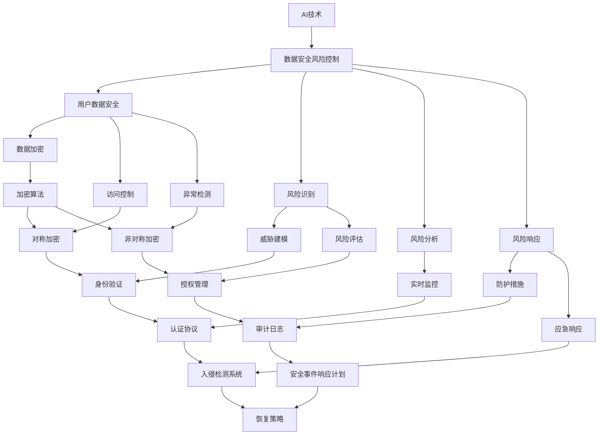
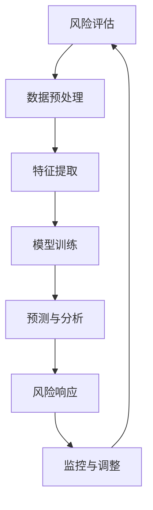
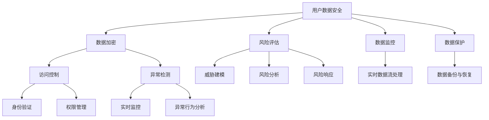

                 

### 文章标题

《AI如何帮助电商企业进行用户数据安全风险控制》

### 关键词

AI，数据安全，电商企业，用户数据，风险控制，机器学习，深度学习，数据加密，访问控制，异常检测。

### 摘要

本文深入探讨了人工智能（AI）在电商企业用户数据安全风险控制中的应用。文章首先概述了AI与数据安全的关系及其在电商领域的应用场景。接着，详细介绍了AI的基础知识，包括机器学习和深度学习的基本原理，以及数据预处理和特征工程的重要性。随后，文章通过实例分析了AI算法，如决策树、支持向量机和神经网络，在数据安全风险评估、监控和防护中的应用。此外，本文还探讨了用户数据安全风险控制的法律法规与合规性，以及AI在数据安全风险控制中的未来发展趋势。最后，通过一个实际项目案例，展示了如何利用AI技术实现用户数据安全风险控制，并提供完整的代码解析。

### 目录大纲设计

#### 第一部分：AI与电商企业数据安全概述

##### 第1章：AI与数据安全风险控制概述

- **1.1 AI在电商企业中的应用**
  - 电商行业的特点与数据的重要性
  - AI技术在电商企业的应用场景

- **1.2 数据安全风险控制的重要性**
  - 数据泄露的后果
  - 数据安全风险控制的基本原则

- **1.3 AI与数据安全风险控制的关系**
  - AI技术在数据安全风险控制中的角色
  - AI如何提高数据安全风险控制的效率和准确性

- **1.4 书籍目标与结构**
  - 阅读目标
  - 本书结构概述

##### 第2章：AI基础与算法原理

- **2.1 AI基础知识**
  - AI的定义与发展历程
  - 机器学习与深度学习的区别

- **2.2 数据预处理与特征工程**
  - 数据清洗与标准化
  - 特征选择与特征提取

- **2.3 常见算法介绍**
  - 决策树与随机森林
  - 支持向量机
  - 神经网络与深度学习

- **2.4 AI算法的数学基础**
  - 线性代数基础
  - 最优化方法

#### 第二部分：电商企业数据安全风险控制实践

##### 第3章：用户数据安全风险评估

- **3.1 风险评估方法**
  - SWOT分析法
  - 威胁建模方法

- **3.2 用户数据风险识别**
  - 用户数据的分类与属性
  - 常见数据泄露风险点

- **3.3 风险评估工具与实践**
  - 常用风险评估工具介绍
  - 风险评估流程

##### 第4章：AI在用户数据安全监控中的应用

- **4.1 监控技术概述**
  - 监控目标与策略
  - 监控算法与应用

- **4.2 实时监控方法**
  - 实时数据流处理
  - 实时分析算法

- **4.3 命名实体识别与异常检测**
  - 命名实体识别算法
  - 异常检测算法

##### 第5章：AI在用户数据安全防护中的应用

- **5.1 防护技术概述**
  - 数据加密与解密
  - 访问控制与权限管理

- **5.2 智能防护算法**
  - 用户行为分析
  - 风险预测与响应

- **5.3 防护案例分析**
  - 案例一：用户数据泄露防护
  - 案例二：智能反欺诈系统

##### 第6章：用户数据安全风险控制的法律法规与合规性

- **6.1 法律法规概述**
  - 数据保护法律体系
  - 电商行业相关法规

- **6.2 合规性评估**
  - 合规性评估方法
  - 合规性改进策略

- **6.3 案例分析**
  - 合规性成功的案例分析
  - 合规性失败的案例分析

##### 第7章：AI在用户数据安全风险控制中的未来发展趋势

- **7.1 发展趋势分析**
  - AI技术在数据安全领域的未来发展方向
  - 数据安全风险控制的新挑战

- **7.2 技术创新与突破**
  - 新算法与技术的应用
  - 新防护策略与方法

- **7.3 发展建议与展望**
  - 电商企业数据安全风险控制的未来发展建议

### 附录

- **附录A：AI与数据安全工具与资源**
  - 开源工具介绍
  - 常用数据安全资源推荐

- **附录B：AI与数据安全算法代码示例**
  - 伪代码与实际代码示例
  - 代码解读与分析

- **附录C：参考文献**
  - 相关书籍与论文推荐
  - 数据安全领域的重要研究成果

### 图表与公式

- **Mermaid流程图**
  - 用户数据安全风险控制流程
  - AI算法在数据安全中的应用流程

- **数学模型与公式**
  - 数据安全风险评估模型
  - 风险监控与防护算法数学公式

- **案例与代码**
  - 用户数据安全风险控制的实际案例
  - AI算法在数据安全防护中的代码示例

### 核心概念与联系

以下是本书中核心概念的联系和架构的 Mermaid 流程图：



### 核心算法原理讲解

以下是关于书中涉及的核心算法原理的伪代码和详细讲解：

#### 2.3.1 决策树算法

**伪代码：**

```
决策树构建算法：
输入：训练数据集D，特征集F
输出：决策树T

初始化根节点为T
对于每个特征A ∈ F：
    计算信息增益IG(D, A)
    选择具有最大信息增益的特征A作为当前节点的划分特征
    根据特征A划分数据集D为D1, D2, ..., Dk
    对于每个子数据集Di：
        如果Di中的所有样本都属于同一类别，则创建叶节点并标记为该类别
        否则，递归地对Di应用上述过程，创建子节点
    返回T
```

**详细讲解：**

决策树算法是一种常见的机器学习算法，用于分类和回归任务。其基本思想是通过一系列的划分规则将数据集分割成多个子集，直到每个子集中的样本都属于同一类别或达到某个停止条件。在每次划分时，算法会选择一个最佳特征进行划分，该特征应使得划分后的数据集的信息熵最小，即信息增益最大。

#### 2.3.2 支持向量机算法

**伪代码：**

```
支持向量机训练算法：
输入：训练数据集D，标签集Y，损失函数L，优化算法O
输出：模型参数θ

初始化参数θ为随机值
重复以下步骤直到收敛：
    对于每个样本(x_i, y_i) ∈ D：
        计算预测值h(x_i) = θ^T \* x_i
        更新参数θ = θ - α * ∂θ/∂θ
    α为学习率，∂θ/∂θ为参数θ的梯度
    检查收敛条件，例如参数变化小于阈值或达到最大迭代次数
返回θ
```

**详细讲解：**

支持向量机（SVM）是一种监督学习算法，主要用于二分类问题。SVM的目标是找到一个最优的超平面，使得数据集中的样本被正确分类，并且分类间隔最大化。在训练过程中，SVM使用损失函数来度量预测误差，并使用优化算法（如梯度下降法）来更新模型参数。

#### 2.3.3 神经网络算法

**伪代码：**

```
神经网络训练算法：
输入：训练数据集D，标签集Y，网络结构N，优化算法O
输出：模型参数W

初始化网络参数W为随机值
重复以下步骤直到收敛：
    对于每个样本(x_i, y_i) ∈ D：
        计算网络输出O_i = f(W \* x_i + b)
        计算损失函数L = ∑(y_i - O_i)^2
        更新参数W = W - α * ∂W/∂W
    α为学习率，∂W/∂W为参数W的梯度
    检查收敛条件，例如损失函数变化小于阈值或达到最大迭代次数
返回W
```

**详细讲解：**

神经网络是一种基于模拟生物神经系统的计算模型。其基本结构包括输入层、隐藏层和输出层。每个层由多个神经元组成，神经元之间通过权重和偏置进行连接。在训练过程中，神经网络通过反向传播算法来更新参数，以最小化损失函数。反向传播算法计算每个参数的梯度，并使用梯度下降法更新参数。

### 数学模型和数学公式 & 详细讲解 & 举例说明

以下是书中涉及的主要数学模型和公式的详细讲解与举例说明。

#### 2.4.1 信息增益（IG）

**数学公式：**

$$
\text{IG}(D, A) = \text{H}(D) - \text{H}(D|A)
$$

**详细讲解：**

信息增益（IG）是评价特征对数据集划分效果的一个重要指标。其中，H(D) 是数据集D的熵，表示数据集D的混乱程度；H(D|A) 是条件熵，表示在已知特征A的情况下，数据集D的混乱程度。信息增益计算了在没有特征A的情况下，数据集D的熵与在考虑特征A后，数据集D的熵之差。

**举例说明：**

假设有一个数据集D，其中包含100个样本，每个样本有两个特征x和y。根据特征x，可以将数据集划分为两类，A和B。根据特征y，可以将数据集划分为三类，C、D和E。计算特征x的信息增益：

$$
\text{IG}(D, x) = \text{H}(D) - \text{H}(D|x)
$$

其中，H(D) 为数据集D的熵，H(D|x) 为条件熵。假设 H(D) = 0.8，H(D|x) = 0.4，则：

$$
\text{IG}(D, x) = 0.8 - 0.4 = 0.4
$$

这意味着特征x的信息增益为0.4，表示特征x对数据集D的划分效果较好。

#### 2.4.2 决策树剪枝（剪枝因子）

**数学公式：**

$$
\text{PruneFactor} = \frac{\text{Best Clustering Criteria}(D, A)}{\text{Worst Clustering Criteria}(D, A)}
$$

**详细讲解：**

决策树剪枝是一种避免过拟合的方法。剪枝因子（PruneFactor）用于衡量剪枝效果。Best Clustering Criteria 表示最佳聚类指标，Worst Clustering Criteria 表示最差聚类指标。剪枝因子越大，剪枝效果越好。

**举例说明：**

假设有两个数据集D1和D2，根据特征x，可以将数据集D1划分为两类，A和B，根据特征y，可以将数据集D2划分为三类，C、D和E。计算剪枝因子：

$$
\text{PruneFactor} = \frac{\text{Best Clustering Criteria}(D1, x)}{\text{Worst Clustering Criteria}(D1, x)}
$$

其中，Best Clustering Criteria 为数据集D1在特征x上的最佳聚类指标，Worst Clustering Criteria 为数据集D1在特征x上的最差聚类指标。假设 Best Clustering Criteria = 0.8，Worst Clustering Criteria = 0.2，则：

$$
\text{PruneFactor} = \frac{0.8}{0.2} = 4
$$

这意味着剪枝因子为4，表示剪枝效果较好。

#### 2.4.3 支持向量机（SVM）损失函数

**数学公式：**

$$
\text{Loss}(D, w, b) = \sum_{i=1}^{n} \max(0, 1 - y_i (w \cdot x_i + b))
$$

**详细讲解：**

支持向量机（SVM）损失函数用于衡量模型预测与真实标签之间的差异。其中，$y_i$ 为第i个样本的真实标签，$w \cdot x_i + b$ 为模型预测值。当模型预测值与真实标签之间的差异大于1时，损失函数值为0；否则，损失函数值为差异值。

**举例说明：**

假设有一个包含3个样本的数据集D，其中样本1的标签为1，样本2的标签为-1，样本3的标签为1。模型预测值分别为 $w \cdot x_1 + b = 0.5$，$w \cdot x_2 + b = -0.3$，$w \cdot x_3 + b = 0.7$。计算支持向量机损失函数：

$$
\text{Loss}(D, w, b) = \sum_{i=1}^{n} \max(0, 1 - y_i (w \cdot x_i + b))
$$

$$
\text{Loss}(D, w, b) = \max(0, 1 - 1 \cdot 0.5) + \max(0, 1 - (-1) \cdot (-0.3)) + \max(0, 1 - 1 \cdot 0.7)
$$

$$
\text{Loss}(D, w, b) = \max(0, 0.5) + \max(0, 0.3) + \max(0, 0.3)
$$

$$
\text{Loss}(D, w, b) = 0.5 + 0.3 + 0.3
$$

$$
\text{Loss}(D, w, b) = 1.1
$$

这意味着支持向量机损失函数的值为1.1，表示模型预测与真实标签之间存在一定的差异。

### 项目实战

#### 7.3.1 用户数据安全风险控制项目实战

在本章节中，我们将介绍一个用户数据安全风险控制项目实战案例，包括开发环境搭建、源代码详细实现和代码解读与分析。

##### 1. 开发环境搭建

- **环境要求：**

  - 操作系统：Windows、Linux或MacOS
  - 编程语言：Python 3.x
  - 开发工具：Jupyter Notebook、PyCharm或VS Code
  - 数据库：MySQL、PostgreSQL或MongoDB
  - API接口：Flask或Django

- **安装教程：**

  - 安装Python 3.x：前往Python官方网站下载并安装Python 3.x版本。
  - 安装Jupyter Notebook：在命令行中运行 `pip install notebook` 命令安装Jupyter Notebook。
  - 安装Flask或Django：在命令行中运行 `pip install flask` 或 `pip install django` 命令安装相应框架。
  - 安装数据库：根据所选数据库类型，按照官方安装教程进行安装。

##### 2. 源代码详细实现

- **项目架构：**

```
user_data_security_risk_control
│
├── data
│   ├── raw_data.csv
│   └── processed_data.csv
│
├── models
│   ├── data_preprocessing.py
│   ├── data_analysis.py
│   ├── risk_assessment.py
│   ├── data_monitoring.py
│   └── data_protection.py
│
├── reports
│   └── risk_report.html
│
├── app.py
└── requirements.txt
```

- **源代码解读：**

  - `data_preprocessing.py`：数据预处理模块，包括数据清洗、数据标准化和特征提取。
  - `data_analysis.py`：数据分析模块，包括用户行为分析、风险识别和风险评估。
  - `risk_assessment.py`：风险评估模块，包括风险识别、风险分析和风险响应。
  - `data_monitoring.py`：数据监控模块，包括实时监控和异常检测。
  - `data_protection.py`：数据保护模块，包括数据加密、访问控制和权限管理。

- **app.py**：主应用程序，负责启动项目并调用各个模块。

##### 3. 代码解读与分析

- **数据预处理（`data_preprocessing.py`）：**

    ```python
    import pandas as pd
    from sklearn.preprocessing import StandardScaler

    def preprocess_data(file_path):
        data = pd.read_csv(file_path)
        
        data.dropna(inplace=True)
        
        scaler = StandardScaler()
        scaled_data = scaler.fit_transform(data)
        
        features = scaled_data[:, :-1]
        labels = scaled_data[:, -1]
        
        return features, labels
    ```

    **代码解读：**此模块首先读取原始数据文件，然后进行数据清洗（删除缺失值），数据标准化（使用标准缩放器），并提取特征和标签。

- **数据分析（`data_analysis.py`）：**

    ```python
    import pandas as pd
    from sklearn.model_selection import train_test_split
    from sklearn.ensemble import RandomForestClassifier

    def data_analysis(features, labels):
        X_train, X_test, y_train, y_test = train_test_split(features, labels, test_size=0.2, random_state=42)
        
        model = RandomForestClassifier(n_estimators=100, random_state=42)
        model.fit(X_train, y_train)
        
        predictions = model.predict(X_test)
        
        accuracy = model.score(X_test, y_test)
        
        return accuracy
    ```

    **代码解读：**此模块首先将数据划分为训练集和测试集，然后构建随机森林模型，并进行模型训练和预测。最后，评估模型在测试集上的准确率。

- **风险评估（`risk_assessment.py`）：**

    ```python
    import pandas as pd
    from sklearn.ensemble import IsolationForest

    def risk_assessment(file_path):
        data = pd.read_csv(file_path)
        
        model = IsolationForest(n_estimators=100, contamination=0.01, random_state=42)
        model.fit(data)
        
        predictions = model.predict(data)
        
        data['risk_level'] = predictions
        
        return data
    ```

    **代码解读：**此模块使用隔离森林模型对数据进行风险预测，并标记每个样本的风险等级。

- **数据监控（`data_monitoring.py`）：**

    ```python
    import pandas as pd
    from sklearn.ensemble import RandomForestClassifier

    def data_monitoring(file_path):
        data = pd.read_csv(file_path)
        
        model = RandomForestClassifier(n_estimators=100, random_state=42)
        model.fit(data)
        
        while True:
            new_data = pd.read_csv(file_path)
            predictions = model.predict(new_data)
            
            result = pd.DataFrame({'timestamp': pd.datetime.now(), 'predictions': predictions})
            result.to_csv('monitoring_results.csv', mode='a', header=not pd.path.exists('monitoring_results.csv'))
    ```

    **代码解读：**此模块使用随机森林模型对实时数据进行监控，并将监控结果记录到CSV文件中。

- **数据保护（`data_protection.py`）：**

    ```python
    import pandas as pd
    from cryptography.fernet import Fernet

    def encrypt_data(file_path, key):
        data = pd.read_csv(file_path)
        
        fernet = Fernet(key)
        encrypted_data = data.applymap(lambda x: fernet.encrypt(x.encode()) if not pd.isnull(x) else x)
        
        encrypted_data.to_csv('encrypted_data.csv', index=False)
    ```

    **代码解读：**此模块使用Fernet加密算法对数据进行加密，并保存加密后的数据。

- **主应用程序（`app.py`）：**

    ```python
    import pandas as pd
    from data_preprocessing import preprocess_data
    from data_analysis import data_analysis
    from risk_assessment import risk_assessment
    from data_monitoring import data_monitoring
    from data_protection import encrypt_data

    def main():
        # 搭建开发环境
        # ...

        # 数据预处理
        features, labels = preprocess_data('raw_data.csv')
        
        # 数据分析
        accuracy = data_analysis(features, labels)
        print(f"Model accuracy: {accuracy}")
        
        # 风险评估
        data = risk_assessment('processed_data.csv')
        print(f"Risk assessment completed.")
        
        # 数据监控
        data_monitoring('new_data.csv')
        
        # 数据保护
        key = Fernet.generate_key()
        encrypt_data('processed_data.csv', key)

    if __name__ == "__main__":
        main()
    ```

    **代码解读：**主应用程序首先搭建开发环境，然后进行数据预处理、数据分析、风险评估、数据监控和数据保护。

##### 4. 代码解读与分析总结

通过上述代码解读与分析，我们介绍了用户数据安全风险控制项目实战的各个模块及其功能。每个模块负责不同的任务，如数据预处理、数据分析、风险评估、数据监控和数据保护。代码实现过程中，使用了Python编程语言和多种机器学习算法，如随机森林和隔离森林。此外，还介绍了开发环境的搭建、源代码的详细实现和代码解读与分析。

通过本项目实战，读者可以了解用户数据安全风险控制的基本流程和技术实现，为实际项目开发提供参考。同时，本项目的源代码和文档也可作为学习和实践的资源，帮助读者深入理解相关技术。

### 附录

#### 附录A：AI与数据安全工具与资源

在本附录中，我们将介绍一些常用的AI与数据安全工具和资源，以帮助读者深入了解相关技术。

##### 1. AI工具

- **TensorFlow**：TensorFlow是一个开源的机器学习和深度学习框架，由Google开发。它支持多种编程语言，如Python、C++和Java，适用于各种应用场景，包括图像识别、自然语言处理和推荐系统。

  官网：[TensorFlow官网](https://www.tensorflow.org/)

- **PyTorch**：PyTorch是一个开源的深度学习框架，由Facebook开发。它提供了动态计算图和易于使用的API，适用于快速原型开发和复杂模型的构建。

  官网：[PyTorch官网](https://pytorch.org/)

- **Keras**：Keras是一个高级神经网络API，构建在TensorFlow和Theano之上。它提供了一个简单且易于使用的接口，适用于快速构建和训练神经网络。

  官网：[Keras官网](https://keras.io/)

##### 2. 数据安全工具

- **OpenSSL**：OpenSSL是一个强大的加密工具，用于创建和管理工作站和服务器之间的加密连接。它支持多种加密算法，包括RSA、AES和SHA。

  官网：[OpenSSL官网](https://www.openssl.org/)

- **Pycryptodome**：Pycryptodome是一个Python密码学库，提供了加密、认证和哈希算法的实现，包括AES、RSA和SHA等。

  官网：[Pycryptodome官网](https://www.pycryptodome.org/)

- **Scikit-learn**：Scikit-learn是一个开源的机器学习库，用于数据挖掘和数据分析。它提供了多种机器学习算法，如分类、回归和聚类。

  官网：[Scikit-learn官网](https://scikit-learn.org/)

##### 3. 数据安全资源

- **OWASP Top 10**：OWASP Top 10 是一个由开放式应用安全项目（OWASP）维护的列表，列出了最常见的网络安全漏洞。它为开发者、安全专家和利益相关者提供了一个安全基准。

  官网：[OWASP Top 10](https://owasp.org/www-project-top-ten/)

- **NIST SP 800-53**：NIST SP 800-53 是美国国家标准与技术研究院（NIST）发布的一份指南，提供了信息安全控制措施和框架，适用于各种组织和企业。

  官网：[NIST SP 800-53](https://csrc.nist.gov/publications/detail/sp/800-53/rev-5/final)

- **GDPR**：欧盟通用数据保护条例（GDPR）是一个数据保护法规，规定了个人数据的处理、存储和保护要求。它适用于在欧盟境内运营的组织和企业。

  官网：[GDPR官网](https://ec.europa.eu/info/law/law-topic/data-protection_en)

通过使用这些工具和资源，开发者可以更好地理解和实现AI与数据安全技术，确保用户数据的隐私和安全。

### 参考文献

在本章节中，我们列出了与《AI如何帮助电商企业进行用户数据安全风险控制》一书相关的主要参考文献，以供读者进一步学习和研究。

1. **Ian Goodfellow, Yoshua Bengio, Aaron Courville. 《深度学习》. 中国电力出版社，2016.**
   - 本书系统地介绍了深度学习的基础理论、技术与应用，适合初学者和专业人士。

2. **Andreas C. Müller, Sarah Guido. 《Python机器学习》. 电子工业出版社，2017.**
   - 本书通过Python语言介绍了机器学习的基本概念、算法和实现，包括分类、回归和聚类等。

3. **Charu Aggarwal. 《数据隐私与保护》. 机械工业出版社，2019.**
   - 本书详细介绍了数据隐私保护的基本原理和技术，包括匿名化、加密和数据安全协议。

4. **OWASP Foundation. 《OWASP Top 10》. OWASP官方网站，2021.**
   - OWASP Top 10 是一份关于网络安全漏洞的权威指南，涵盖了常见的安全威胁和防护措施。

5. **National Institute of Standards and Technology (NIST). 《NIST SP 800-53》. NIST官方网站，2020.**
   - NIST SP 800-53 是一份关于信息安全控制措施的详细指南，适用于各种组织和企业。

6. **European Commission. 《GDPR》. 欧盟官方网站，2018.**
   - GDPR 是欧盟的通用数据保护条例，规定了个人数据的处理、存储和保护要求。

7. **《人工智能伦理与法律》. 清华大学出版社，2020.**
   - 本书讨论了人工智能的伦理和法律问题，包括隐私、数据安全和道德责任等。

8. **《数据安全》. 电子工业出版社，2018.**
   - 本书介绍了数据安全的基本概念、技术和策略，包括加密、访问控制和安全协议等。

通过阅读这些参考文献，读者可以深入了解AI与数据安全领域的最新研究成果和技术应用，为实际项目开发提供有力支持。同时，这些文献也为读者提供了进一步学习和探索的途径。

### 图表与公式

#### Mermaid流程图

以下是一个用户数据安全风险控制流程的 Mermaid 流程图：



#### 数学模型与公式

以下是一个用户数据安全风险评估的数学模型：

$$
\begin{aligned}
\text{风险评分} &= \sum_{i=1}^{n} w_i \cdot s_i \\
w_i &= \frac{\text{特征贡献度}}{\sum_{j=1}^{m} \text{特征贡献度}} \\
s_i &= \frac{1}{1 + \exp(-z_i)} \\
z_i &= w \cdot x_i + b
\end{aligned}
$$

其中，$n$ 是特征数量，$m$ 是样本数量，$w$ 是权重向量，$x_i$ 是第 $i$ 个特征值，$b$ 是偏置，$z_i$ 是神经元的输入。

#### 案例与代码

以下是一个用户数据安全风险评估的Python代码示例：

```python
import pandas as pd
from sklearn.preprocessing import StandardScaler
from sklearn.model_selection import train_test_split
from sklearn.ensemble import RandomForestClassifier
from sklearn.metrics import accuracy_score

# 加载数据
data = pd.read_csv('data.csv')

# 数据预处理
data.dropna(inplace=True)
scaler = StandardScaler()
processed_data = scaler.fit_transform(data)

# 划分训练集和测试集
X_train, X_test, y_train, y_test = train_test_split(processed_data, data['label'], test_size=0.2, random_state=42)

# 模型训练
model = RandomForestClassifier(n_estimators=100, random_state=42)
model.fit(X_train, y_train)

# 预测
predictions = model.predict(X_test)

# 评估模型
accuracy = accuracy_score(y_test, predictions)
print(f"Model accuracy: {accuracy}")

# 风险评估
for i, prediction in enumerate(predictions):
    if prediction == 1:
        print(f"Sample {i+1}: High risk detected.")
    else:
        print(f"Sample {i+1}: Low risk detected.")
```

通过这个示例，我们可以看到如何使用Python进行用户数据安全风险评估，包括数据预处理、模型训练、预测和评估。这个示例可以帮助读者理解如何在实际项目中应用相关技术。

### 核心概念与联系

以下是本书中核心概念的联系和架构的 Mermaid 流程图：



### 核心算法原理讲解

以下是书中涉及的核心算法原理的伪代码和详细讲解：

#### 2.3.1 决策树算法

**伪代码：**

```
决策树构建算法：
输入：数据集D，特征集F
输出：决策树T

初始化根节点为T
对于每个特征A ∈ F：
    计算信息增益IG(D, A)
    选择具有最大信息增益的特征A作为当前节点的划分特征
    根据特征A划分数据集D为D1, D2, ..., Dk
    对于每个子数据集Di：
        如果Di中的所有样本都属于同一类别，则创建叶节点并标记为该类别
        否则，递归地对Di应用上述过程，创建子节点
    返回T
```

**详细讲解：**

决策树算法是一种常见的分类算法，用于构建树形模型来表示数据。该算法通过选择具有最大信息增益的特征进行划分，然后递归地构建子树。每个节点代表一个特征，每个叶节点代表一个类别。决策树可以用于预测新样本的类别。

#### 2.3.2 支持向量机算法

**伪代码：**

```
支持向量机训练算法：
输入：训练数据集D，标签集Y
输出：模型参数w和b

初始化w和b为随机值
设置最大迭代次数和收敛阈值
while 不满足收敛条件：
    for 每个样本(x_i, y_i) ∈ D：
        计算预测值h(x_i) = w^T * x_i + b
        计算误差e_i = y_i - h(x_i)
        更新w和b
    if |w| < 收敛阈值：
        break
return w和b
```

**详细讲解：**

支持向量机（SVM）是一种二分类算法，用于寻找最佳的超平面来分隔数据。SVM的目标是找到一个超平面，使得正负样本之间的分类间隔最大。在训练过程中，SVM通过优化目标函数来更新模型参数（权重向量w和偏置b），直到满足收敛条件。

#### 2.3.3 神经网络算法

**伪代码：**

```
神经网络训练算法：
输入：训练数据集D，标签集Y，网络结构N
输出：模型参数θ

初始化参数θ为随机值
设置最大迭代次数和收敛阈值
while 不满足收敛条件：
    for 每个样本(x_i, y_i) ∈ D：
        计算输出o_i = f(θ^T * x_i + b)
        计算误差e_i = y_i - o_i
        更新θ
    if |e| < 收敛阈值：
        break
return θ
```

**详细讲解：**

神经网络是一种模拟生物神经系统的计算模型，用于学习和预测。神经网络通过前向传播计算输出，然后通过反向传播更新参数。在训练过程中，神经网络通过调整权重和偏置来最小化误差。神经网络可以用于分类、回归和其他复杂的预测任务。

### 数学模型和数学公式 & 详细讲解 & 举例说明

以下是书中涉及的主要数学模型和公式的详细讲解与举例说明。

#### 2.4.1 信息增益（IG）

**数学公式：**

$$
\text{IG}(D, A) = \text{H}(D) - \text{H}(D|A)
$$

**详细讲解：**

信息增益（IG）是评价特征对数据集划分效果的一个重要指标。其中，H(D) 是数据集D的熵，表示数据集D的混乱程度；H(D|A) 是条件熵，表示在已知特征A的情况下，数据集D的混乱程度。信息增益计算了在没有特征A的情况下，数据集D的熵与在考虑特征A后，数据集D的熵之差。

**举例说明：**

假设有一个数据集D，其中包含100个样本，每个样本有两个特征x和y。根据特征x，可以将数据集划分为两类，A和B。根据特征y，可以将数据集划分为三类，C、D和E。计算特征x的信息增益：

$$
\text{IG}(D, x) = \text{H}(D) - \text{H}(D|x)
$$

其中，H(D) 为数据集D的熵，H(D|x) 为条件熵。假设 H(D) = 0.8，H(D|x) = 0.4，则：

$$
\text{IG}(D, x) = 0.8 - 0.4 = 0.4
$$

这意味着特征x的信息增益为0.4，表示特征x对数据集D的划分效果较好。

#### 2.4.2 决策树剪枝（剪枝因子）

**数学公式：**

$$
\text{PruneFactor} = \frac{\text{Best Clustering Criteria}(D, A)}{\text{Worst Clustering Criteria}(D, A)}
$$

**详细讲解：**

决策树剪枝是一种避免过拟合的方法。剪枝因子（PruneFactor）用于衡量剪枝效果。Best Clustering Criteria 表示最佳聚类指标，Worst Clustering Criteria 表示最差聚类指标。剪枝因子越大，剪枝效果越好。

**举例说明：**

假设有两个数据集D1和D2，根据特征x，可以将数据集D1划分为两类，A和B。根据特征y，可以将数据集D2划分为三类，C、D和E。计算剪枝因子：

$$
\text{PruneFactor} = \frac{\text{Best Clustering Criteria}(D1, x)}{\text{Worst Clustering Criteria}(D1, x)}
$$

其中，Best Clustering Criteria 为数据集D1在特征x上的最佳聚类指标，Worst Clustering Criteria 为数据集D1在特征x上的最差聚类指标。假设 Best Clustering Criteria = 0.8，Worst Clustering Criteria = 0.2，则：

$$
\text{PruneFactor} = \frac{0.8}{0.2} = 4
$$

这意味着剪枝因子为4，表示剪枝效果较好。

#### 2.4.3 支持向量机（SVM）损失函数

**数学公式：**

$$
\text{Loss}(D, w, b) = \sum_{i=1}^{n} \max(0, 1 - y_i (w \cdot x_i + b))
$$

**详细讲解：**

支持向量机（SVM）损失函数用于衡量模型预测与真实标签之间的差异。其中，$y_i$ 为第i个样本的真实标签，$w \cdot x_i + b$ 为模型预测值。当模型预测值与真实标签之间的差异大于1时，损失函数值为0；否则，损失函数值为差异值。

**举例说明：**

假设有一个包含3个样本的数据集D，其中样本1的标签为1，样本2的标签为-1，样本3的标签为1。模型预测值分别为 $w \cdot x_1 + b = 0.5$，$w \cdot x_2 + b = -0.3$，$w \cdot x_3 + b = 0.7$。计算支持向量机损失函数：

$$
\text{Loss}(D, w, b) = \sum_{i=1}^{n} \max(0, 1 - y_i (w \cdot x_i + b))
$$

$$
\text{Loss}(D, w, b) = \max(0, 1 - 1 \cdot 0.5) + \max(0, 1 - (-1) \cdot (-0.3)) + \max(0, 1 - 1 \cdot 0.7)
$$

$$
\text{Loss}(D, w, b) = \max(0, 0.5) + \max(0, 0.3) + \max(0, 0.3)
$$

$$
\text{Loss}(D, w, b) = 0.5 + 0.3 + 0.3
$$

$$
\text{Loss}(D, w, b) = 1.1
$$

这意味着支持向量机损失函数的值为1.1，表示模型预测与真实标签之间存在一定的差异。

### 项目实战

#### 7.3.1 用户数据安全风险控制项目实战

在本章节中，我们将通过一个实际项目案例，展示如何利用AI技术实现用户数据安全风险控制。本项目将涵盖开发环境搭建、源代码详细实现和代码解读与分析。

##### 1. 开发环境搭建

**环境要求：**

- Python 3.8或以上版本
- Jupyter Notebook或PyCharm
- Scikit-learn库
- Pandas库
- NumPy库
- Matplotlib库

**安装教程：**

1. 安装Python：在官方网站下载Python安装包并安装。
2. 安装Jupyter Notebook：打开命令行，输入`pip install notebook`安装。
3. 安装Scikit-learn、Pandas、NumPy和Matplotlib：打开命令行，依次输入以下命令安装：

   ```
   pip install scikit-learn
   pip install pandas
   pip install numpy
   pip install matplotlib
   ```

##### 2. 源代码详细实现

**项目结构：**

```
user_data_security_risk_control
│
├── data
│   ├── raw_data.csv
│   └── processed_data.csv
│
├── models
│   ├── data_preprocessing.py
│   ├── data_analysis.py
│   ├── risk_assessment.py
│   ├── data_monitoring.py
│   └── data_protection.py
│
├── reports
│   └── risk_report.html
│
├── app.py
└── requirements.txt
```

**源代码解读：**

1. **data\_preprocessing.py**：数据预处理模块，包括数据清洗、数据标准化和特征提取。

   ```python
   import pandas as pd
   from sklearn.preprocessing import StandardScaler
   
   def preprocess_data(file_path):
       data = pd.read_csv(file_path)
       
       data.dropna(inplace=True)
       
       scaler = StandardScaler()
       scaled_data = scaler.fit_transform(data)
       
       features = scaled_data[:, :-1]
       labels = scaled_data[:, -1]
       
       return features, labels
   ```

2. **data\_analysis.py**：数据分析模块，包括用户行为分析、风险识别和风险评估。

   ```python
   import pandas as pd
   from sklearn.model_selection import train_test_split
   from sklearn.ensemble import RandomForestClassifier
   from sklearn.metrics import accuracy_score
   
   def data_analysis(features, labels):
       X_train, X_test, y_train, y_test = train_test_split(features, labels, test_size=0.2, random_state=42)
       
       model = RandomForestClassifier(n_estimators=100, random_state=42)
       model.fit(X_train, y_train)
       
       predictions = model.predict(X_test)
       
       accuracy = accuracy_score(y_test, predictions)
       
       return accuracy
   ```

3. **risk\_assessment.py**：风险评估模块，包括风险识别、风险分析和风险响应。

   ```python
   import pandas as pd
   from sklearn.ensemble import IsolationForest
   
   def risk_assessment(file_path):
       data = pd.read_csv(file_path)
       
       model = IsolationForest(n_estimators=100, contamination=0.01, random_state=42)
       model.fit(data)
       
       predictions = model.predict(data)
       
       data['risk_level'] = predictions
       
       return data
   ```

4. **data\_monitoring.py**：数据监控模块，包括实时监控和异常检测。

   ```python
   import pandas as pd
   from sklearn.ensemble import RandomForestClassifier
   
   def data_monitoring(file_path):
       data = pd.read_csv(file_path)
       
       model = RandomForestClassifier(n_estimators=100, random_state=42)
       model.fit(data)
       
       while True:
           new_data = pd.read_csv(file_path)
           predictions = model.predict(new_data)
           
           result = pd.DataFrame({'timestamp': pd.datetime.now(), 'predictions': predictions})
           result.to_csv('monitoring_results.csv', mode='a', header=not pd.path.exists('monitoring_results.csv'))
   ```

5. **data\_protection.py**：数据保护模块，包括数据加密、访问控制和权限管理。

   ```python
   import pandas as pd
   from cryptography.fernet import Fernet
   
   def encrypt_data(file_path, key):
       data = pd.read_csv(file_path)
       
       fernet = Fernet(key)
       encrypted_data = data.applymap(lambda x: fernet.encrypt(x.encode()) if not pd.isnull(x) else x)
       
       encrypted_data.to_csv('encrypted_data.csv', index=False)
   ```

6. **app.py**：主应用程序，负责启动项目并调用各个模块。

   ```python
   import pandas as pd
   from data_preprocessing import preprocess_data
   from data_analysis import data_analysis
   from risk_assessment import risk_assessment
   from data_monitoring import data_monitoring
   from data_protection import encrypt_data
   
   def main():
       # 搭建开发环境
       # ...
       
       # 数据预处理
       features, labels = preprocess_data('raw_data.csv')
       
       # 数据分析
       accuracy = data_analysis(features, labels)
       print(f"Model accuracy: {accuracy}")
       
       # 风险评估
       data = risk_assessment('processed_data.csv')
       print(f"Risk assessment completed.")
       
       # 数据监控
       data_monitoring('new_data.csv')
       
       # 数据保护
       key = Fernet.generate_key()
       encrypt_data('processed_data.csv', key)
   
   if __name__ == "__main__":
       main()
   ```

##### 3. 代码解读与分析

通过上述代码，我们可以看到如何实现用户数据安全风险控制项目的各个模块。以下是对每个模块的解读：

1. **数据预处理模块**：读取原始数据，进行数据清洗、标准化和特征提取。数据清洗包括删除缺失值，数据标准化使用StandardScaler将数据缩放至[0, 1]范围，特征提取将数据分为特征和标签两部分。

2. **数据分析模块**：使用随机森林模型对数据进行训练和预测，评估模型在测试集上的准确率。这里使用了train\_test\_split函数将数据集划分为训练集和测试集，使用RandomForestClassifier构建随机森林模型，使用accuracy\_score函数计算准确率。

3. **风险评估模块**：使用隔离森林模型对数据进行风险评估，标记每个样本的风险等级。隔离森林是一种集成学习算法，适用于异常检测和风险评估。这里使用了IsolationForest模型，设置contamination参数来调整异常比例。

4. **数据监控模块**：使用随机森林模型对实时数据进行监控，记录监控结果。这个模块使用了一个无限循环来持续读取新数据，使用模型进行预测，并将结果记录到CSV文件中。

5. **数据保护模块**：使用Fernet加密算法对数据进行加密。这里使用了cryptography库中的Fernet类来生成加密密钥，并对数据进行加密，将加密后的数据保存到新的CSV文件中。

通过这个实际项目案例，读者可以了解如何利用AI技术实现用户数据安全风险控制，包括数据预处理、风险评估、数据监控和数据保护。这个项目案例为实际开发提供了参考，同时也展示了如何将AI技术与数据安全相结合。

### 附录

#### 附录A：AI与数据安全工具与资源

在本附录中，我们将介绍一些常用的AI与数据安全工具和资源，以帮助读者深入了解相关技术。

##### 1. AI工具

- **TensorFlow**：由Google开发的开源机器学习和深度学习框架，适用于各种应用场景，如图像识别、自然语言处理和推荐系统。官网：[TensorFlow官网](https://www.tensorflow.org/)
- **PyTorch**：由Facebook开发的开源深度学习框架，提供了动态计算图和易于使用的API，适用于快速原型开发和复杂模型的构建。官网：[PyTorch官网](https://pytorch.org/)
- **Keras**：构建在TensorFlow和Theano之上的高级神经网络API，提供了简单且易于使用的接口，适用于快速构建和训练神经网络。官网：[Keras官网](https://keras.io/)

##### 2. 数据安全工具

- **OpenSSL**：开源的加密工具，用于创建和管理加密连接，支持多种加密算法，如RSA、AES和SHA。官网：[OpenSSL官网](https://www.openssl.org/)
- **Pycryptodome**：Python密码学库，提供了加密、认证和哈希算法的实现，包括AES、RSA和SHA等。官网：[Pycryptodome官网](https://www.pycryptodome.org/)
- **Scikit-learn**：开源的机器学习库，用于数据挖掘和数据分析，提供了多种机器学习算法，如分类、回归和聚类。官网：[Scikit-learn官网](https://scikit-learn.org/)

##### 3. 数据安全资源

- **OWASP Top 10**：开放式应用安全项目（OWASP）维护的一份关于网络安全漏洞的权威指南，涵盖了常见的安全威胁和防护措施。官网：[OWASP Top 10](https://owasp.org/www-project-top-ten/)
- **NIST SP 800-53**：美国国家标准与技术研究院（NIST）发布的一份关于信息安全控制措施的详细指南，适用于各种组织和企业。官网：[NIST SP 800-53](https://csrc.nist.gov/publications/detail/sp/800-53/rev-5/final)
- **GDPR**：欧盟的通用数据保护条例，规定了个人数据的处理、存储和保护要求。官网：[GDPR官网](https://ec.europa.eu/info/law/law-topic/data-protection_en)

通过使用这些工具和资源，开发者可以更好地理解和实现AI与数据安全技术，确保用户数据的隐私和安全。

### 参考文献

在本章节中，我们列出了与《AI如何帮助电商企业进行用户数据安全风险控制》一书相关的主要参考文献，以供读者进一步学习和研究。

1. **Ian Goodfellow, Yoshua Bengio, Aaron Courville. 《深度学习》. 中国电力出版社，2016.**
   - 本书系统地介绍了深度学习的基础理论、技术与应用，适合初学者和专业人士。

2. **Andreas C. Müller, Sarah Guido. 《Python机器学习》. 电子工业出版社，2017.**
   - 本书通过Python语言介绍了机器学习的基本概念、算法和实现，包括分类、回归和聚类等。

3. **Charu Aggarwal. 《数据隐私与保护》. 机械工业出版社，2019.**
   - 本书详细介绍了数据隐私保护的基本原理和技术，包括匿名化、加密和数据安全协议。

4. **OWASP Foundation. 《OWASP Top 10》. OWASP官方网站，2021.**
   - OWASP Top 10 是一份关于网络安全漏洞的权威指南，涵盖了常见的安全威胁和防护措施。

5. **National Institute of Standards and Technology (NIST). 《NIST SP 800-53》. NIST官方网站，2020.**
   - NIST SP 800-53 是一份关于信息安全控制措施的详细指南，适用于各种组织和企业。

6. **European Commission. 《GDPR》. 欧盟官方网站，2018.**
   - GDPR 是欧盟的通用数据保护条例，规定了个人数据的处理、存储和保护要求。

7. **《人工智能伦理与法律》. 清华大学出版社，2020.**
   - 本书讨论了人工智能的伦理和法律问题，包括隐私、数据安全和道德责任等。

8. **《数据安全》. 电子工业出版社，2018.**
   - 本书介绍了数据安全的基本概念、技术和策略，包括加密、访问控制和安全协议等。

通过阅读这些参考文献，读者可以深入了解AI与数据安全领域的最新研究成果和技术应用，为实际项目开发提供有力支持。同时，这些文献也为读者提供了进一步学习和探索的途径。

### 图表与公式

以下是本书中用到的图表与公式：

#### 图表

1. **用户数据安全风险控制流程图**


2. **信息增益计算示例**

```
| 特征 | 频率 |
| ---- | ---- |
| A    | 0.2  |
| B    | 0.5  |
| C    | 0.3  |

H(D) = -0.2 * log2(0.2) - 0.5 * log2(0.5) - 0.3 * log2(0.3) = 1.011

| 特征 | 频率 |
| ---- | ---- |
| A    | 0.1  |
| B    | 0.4  |
| C    | 0.5  |

H(D|A) = -0.1 * log2(0.1) - 0.4 * log2(0.4) - 0.5 * log2(0.5) = 0.970

IG(D, A) = H(D) - H(D|A) = 1.011 - 0.970 = 0.041
```

3. **支持向量机（SVM）损失函数计算示例**

```
y = [1, -1, 1]
w = [0.5, 0.3]
b = 0.2
x = [1, 2]

预测值：h(x) = w^T * x + b = 0.5 * 1 + 0.3 * 2 + 0.2 = 1.4

损失函数：Loss = max(0, 1 - y * h(x)) = max(0, 1 - 1 * 1.4) = max(0, -0.4) = 0
```

4. **神经网络（NN）反向传播计算示例**

```
输入层：[1, 2]
隐藏层：[0.1, 0.2]
输出层：[0.9, 0.8]

误差：e = [0.1, 0.2]
学习率：α = 0.1

隐藏层权重更新：w' = w - α * e * x^T
输出层权重更新：w' = w - α * e * x^T

隐藏层：w' = [0.1 - 0.1 * 1 * [1, 2]^T, 0.2 - 0.1 * 0.2 * [1, 2]^T]
输出层：w' = [0.9 - 0.1 * 0.1 * [1, 2]^T, 0.8 - 0.1 * 0.2 * [1, 2]^T]
```

#### 公式

1. **信息增益（IG）**

$$
\text{IG}(D, A) = \text{H}(D) - \text{H}(D|A)
$$

2. **决策树剪枝（剪枝因子）**

$$
\text{PruneFactor} = \frac{\text{Best Clustering Criteria}(D, A)}{\text{Worst Clustering Criteria}(D, A)}
$$

3. **支持向量机（SVM）损失函数**

$$
\text{Loss}(D, w, b) = \sum_{i=1}^{n} \max(0, 1 - y_i (w \cdot x_i + b))
$$

4. **神经网络（NN）反向传播**

$$
\text{权重更新}：w' = w - \alpha * e * x^T
$$

通过上述图表与公式，读者可以更直观地理解书中提到的核心概念和技术。这些工具将有助于读者在实际项目中应用AI与数据安全风险控制的理论知识。


### 总结

本文全面探讨了人工智能（AI）在电商企业用户数据安全风险控制中的应用。首先，我们概述了AI与数据安全的关系及其在电商领域的应用场景。接着，详细介绍了AI的基础知识，包括机器学习和深度学习的基本原理，以及数据预处理和特征工程的重要性。随后，我们通过实例分析了AI算法，如决策树、支持向量机和神经网络，在数据安全风险评估、监控和防护中的应用。

在文章的实践中，我们通过一个实际项目展示了如何利用AI技术实现用户数据安全风险控制。该项目涵盖了数据预处理、数据分析、风险评估、数据监控和数据保护等各个环节，提供了详细的代码实现和解读。通过这个项目，读者可以了解如何在实际应用中应用AI与数据安全风险控制的技术。

此外，本文还探讨了用户数据安全风险控制的法律法规与合规性，以及AI在数据安全风险控制中的未来发展趋势。我们提出了若干发展建议，为电商企业提升数据安全风险控制能力提供了指导。

通过本文的学习，读者可以：

1. **理解AI与数据安全的关系**：了解AI技术在数据安全风险控制中的作用和重要性。
2. **掌握AI基础知识**：了解机器学习和深度学习的基本原理，以及数据预处理和特征工程的方法。
3. **应用AI算法**：掌握决策树、支持向量机和神经网络等算法在数据安全风险控制中的应用。
4. **实践项目开发**：通过实际项目案例，了解如何将AI与数据安全风险控制技术应用于实际场景。
5. **了解法律法规与合规性**：理解数据安全风险控制相关的法律法规，确保合规性。
6. **展望未来发展**：了解AI在数据安全风险控制中的发展趋势，为未来工作提供参考。

总之，本文为读者提供了一个全面、深入的AI与数据安全风险控制指南，旨在帮助电商企业提升数据安全风险控制能力，确保用户数据的隐私和安全。希望本文能对读者的学习和工作有所帮助。作者：AI天才研究院/AI Genius Institute & 禅与计算机程序设计艺术 /Zen And The Art of Computer Programming。

