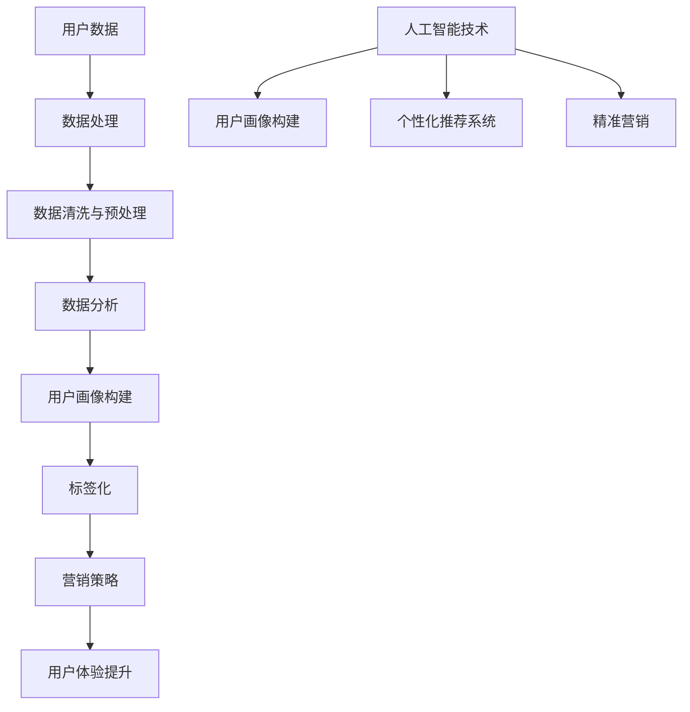

                 

### 《AI如何帮助电商企业进行用户画像标签化》

> 关键词：人工智能、用户画像、标签化、电商、数据分析、机器学习

> 摘要：本文深入探讨人工智能技术在电商领域中的应用，特别是如何通过用户画像标签化来提升电商企业的营销精准度和用户体验。文章首先介绍了AI与电商用户画像的关系，然后详细阐述了用户画像的构成、构建方法、应用以及面临的挑战。通过案例分析，展示了AI技术在用户画像构建中的具体应用，并探讨了用户画像伦理与法律合规问题。最后，对电商用户画像的未来发展进行了展望。

---

# 第一部分：AI在电商用户画像中的应用基础

## 第1章：AI与电商用户画像概述

### 1.1 AI与电商用户画像的关系

人工智能（AI）技术正在逐渐改变电商行业的面貌。随着大数据和机器学习的兴起，电商企业能够更好地理解和预测用户行为，从而提供更加个性化的服务和产品推荐。用户画像作为一种对用户进行全面描述的手段，是AI技术在电商领域应用的重要组成部分。

AI技术为电商用户画像提供了强大的工具和方法，使得企业能够从海量的数据中提取有价值的信息。通过机器学习算法，电商企业可以识别出用户的偏好、行为模式和潜在需求，从而实现精准营销和个性化推荐。

### 1.2 用户画像的概念与重要性

用户画像是指通过对用户的各种数据进行收集、处理和分析，构建出一个全面、准确的用户模型。用户画像不仅包括用户的基本属性（如年龄、性别、地理位置等），还涵盖了用户的行为数据（如浏览记录、购买历史、评论等）和交易数据（如消费金额、购买频率等）。

用户画像的重要性在于：

1. **提高营销精准度**：通过用户画像，电商企业可以更准确地了解用户的需求和偏好，从而进行更精准的市场营销和产品推荐。
2. **优化用户体验**：基于用户画像的个性化服务能够提升用户体验，增加用户满意度和忠诚度。
3. **提升企业收益**：通过提高营销效率和用户体验，电商企业可以增加销售额和用户转化率。

### 1.3 电商用户画像的构成

电商用户画像通常由以下几个部分构成：

1. **用户基本属性**：包括用户的年龄、性别、地理位置、职业等基本信息。
2. **用户行为数据**：包括用户的浏览历史、搜索记录、点击行为、评论等。
3. **用户交易数据**：包括用户的购买历史、消费金额、购买频率、支付方式等。

这些数据来源可以分为内部数据、第三方数据和用户行为数据：

- **内部数据**：来源于电商平台自身的用户数据，如注册信息、交易记录、客服记录等。
- **第三方数据**：通过合作伙伴或第三方平台获取的用户数据，如社交媒体信息、信用评分等。
- **用户行为数据**：通过用户在平台上的行为数据，如浏览、点击、搜索等行为。

### 1.4 用户画像标签化的目的与价值

用户画像标签化是将用户画像中的关键信息以标签的形式进行分类和标记。标签化的目的是为了更方便地进行用户分类和数据分析。

用户画像标签化的主要价值包括：

1. **提高数据分析效率**：通过标签，可以快速定位和分析特定类型的用户。
2. **精准营销**：根据标签，可以针对不同类型的用户进行精准营销和个性化推荐。
3. **优化用户体验**：通过标签，可以为用户提供更加个性化的服务和建议。

### 1.5 电商用户画像面临的挑战

尽管用户画像标签化带来了很多好处，但电商企业在应用中也面临着一些挑战：

1. **数据隐私与安全**：用户画像涉及大量的个人隐私信息，如何确保数据安全和隐私保护是一个重要问题。
2. **数据处理能力要求高**：用户画像需要处理大量的数据，对数据处理能力和算法性能有较高要求。
3. **标签定义标准化**：如何定义和标准化标签，确保不同部门之间的数据一致性，是一个难题。

## 第2章：用户画像数据收集与处理

### 2.1 用户数据来源

电商企业可以通过多种渠道收集用户数据，包括：

1. **内部数据**：电商平台自身的用户数据，如注册信息、交易记录、客服记录等。
2. **第三方数据**：通过合作伙伴或第三方平台获取的用户数据，如社交媒体信息、信用评分等。
3. **用户行为数据**：通过用户在平台上的行为数据，如浏览、点击、搜索等行为。

### 2.2 数据清洗与预处理

数据清洗与预处理是用户画像构建的重要步骤，主要包括以下几个环节：

1. **数据质量评估**：评估数据的质量和完整性，识别潜在的问题。
2. **数据去重**：去除重复的数据记录，确保数据的唯一性。
3. **数据标准化**：将不同来源和格式的数据统一格式和标准，便于后续处理。

### 2.3 数据存储与管理

为了高效地存储和管理用户数据，电商企业需要设计合适的数据仓库和数据湖：

1. **数据仓库**：用于存储结构化的数据，支持SQL查询和数据分析。
2. **数据湖**：用于存储大规模的、非结构化的数据，支持各种数据处理和分析工具。

此外，企业还需要制定数据存储优化策略，如数据压缩、索引优化等。

### 2.4 数据分析工具与技术

电商企业在用户画像构建过程中，可以采用多种数据分析工具和技术，包括：

1. **SQL分析**：用于查询和操作关系型数据库中的数据。
2. **Python数据分析**：利用Python的pandas、numpy等库进行数据清洗、转换和分析。
3. **R语言分析**：适用于复杂的数据分析和统计建模。

### 2.5 用户画像数据的安全性保障

在用户数据收集和处理过程中，保障数据安全是非常重要的。电商企业需要采取以下措施：

1. **数据加密**：对敏感数据进行加密存储，防止数据泄露。
2. **访问控制**：设置严格的访问权限，确保只有授权人员才能访问数据。
3. **数据备份与恢复**：定期备份数据，确保在数据丢失或损坏时能够及时恢复。

## 第3章：用户画像构建方法与标签化

### 3.1 基于属性的用户画像构建

基于属性的用户画像构建是指通过用户的基本属性来构建用户画像。这种方法简单直观，适用于对用户基本信息的描述。

常见的算法包括：

1. **逻辑回归模型**：通过建立逻辑回归模型，将用户的属性与标签之间的关系进行建模。
2. **决策树模型**：通过决策树模型，将用户的属性分割成不同的分支，形成用户画像。
3. **支持向量机模型**：通过支持向量机模型，将用户属性映射到高维空间，进行分类和预测。

### 3.2 基于行为的用户画像构建

基于行为的用户画像构建是指通过用户的行为数据来构建用户画像。这种方法更复杂，但能提供更深入的用户理解。

常见的算法包括：

1. **K-means聚类**：通过K-means算法，将用户行为数据分为多个聚类，形成不同的用户群体。
2. **K-NN算法**：通过K-NN算法，根据用户的行为特征，将用户归类到不同的标签。
3. **聚类分析**：通过聚类分析，识别出用户行为模式，构建用户画像。

### 3.3 用户标签化策略

用户标签化是将用户画像中的关键信息以标签的形式进行分类和标记。用户标签化策略包括：

1. **标签体系设计**：设计合理的标签体系，确保标签的统一性和一致性。
2. **标签关联规则挖掘**：通过关联规则挖掘，识别出不同标签之间的关联关系，为精准营销提供支持。
3. **实时标签更新机制**：根据用户行为的变化，实时更新用户标签，确保用户画像的准确性。

### 3.4 用户标签应用案例分析

用户标签在实际应用中具有广泛的应用场景，以下是一些案例分析：

1. **个性化推荐**：通过用户标签，可以为用户提供个性化的产品推荐，提升用户满意度和转化率。
2. **营销活动精准投放**：根据用户标签，可以精准定位目标用户，提高营销活动的效果。
3. **会员等级划分**：通过用户标签，可以区分不同的会员等级，提供差异化的服务。

## 第4章：AI技术在用户画像中的应用

### 4.1 机器学习在用户画像中的应用

机器学习技术是用户画像构建的核心，通过训练机器学习模型，可以自动提取用户特征和构建用户画像。

常见的机器学习算法包括：

1. **特征工程**：通过特征工程，选择和构造有用的特征，提高模型的预测性能。
2. **模型选择与优化**：选择合适的机器学习模型，并进行优化，提高模型准确率和效率。

### 4.2 深度学习在用户画像中的应用

深度学习技术是机器学习的一个分支，具有强大的特征学习和表示能力。在用户画像中，深度学习技术可以用于：

1. **卷积神经网络（CNN）**：通过CNN，可以提取用户行为数据的时空特征。
2. **循环神经网络（RNN）**：通过RNN，可以处理序列数据，如用户的行为序列。
3. **Transformer模型**：通过Transformer模型，可以实现高效的自注意力机制，提升模型性能。

### 4.3 强化学习在用户画像中的应用

强化学习是一种通过试错和反馈进行决策的学习方法，可以用于用户画像中的行为预测和个性化推荐。

常见的强化学习算法包括：

1. **Q-learning**：通过Q-learning算法，可以预测用户的行为价值，为个性化推荐提供支持。
2. **深度强化学习**：通过深度强化学习，可以处理复杂的用户行为数据，实现高效的个性化推荐。

## 第5章：电商用户画像实践案例分析

### 5.1 案例一：某电商平台的用户画像构建与标签化实践

本案例介绍了某电商平台的用户画像构建与标签化实践，包括以下步骤：

1. **数据收集与处理**：通过内部数据和第三方数据源，收集用户的基本属性、行为数据和交易数据，并进行数据清洗和预处理。
2. **用户画像构建方法**：采用基于属性和行为的数据分析算法，构建用户画像，包括用户的基本属性、行为偏好和购买习惯等。
3. **用户标签应用效果分析**：通过用户标签，实现了个性化推荐和精准营销，提高了用户满意度和转化率。

### 5.2 案例二：某电商平台的深度学习在用户画像中的应用

本案例介绍了某电商平台如何使用深度学习技术进行用户画像构建，包括以下步骤：

1. **模型选择与优化**：选择合适的深度学习模型，如CNN和RNN，进行模型训练和优化。
2. **用户行为预测效果评估**：通过用户行为预测模型，评估用户行为预测的准确性和效率。
3. **实时推荐系统设计**：基于用户行为预测模型，设计实时推荐系统，为用户提供个性化的产品推荐。

### 5.3 案例三：某电商平台的用户画像与营销策略优化

本案例介绍了某电商平台如何结合用户画像和营销策略，进行优化和提升，包括以下步骤：

1. **用户画像标签化在营销中的应用**：通过用户标签，实现精准营销和个性化推荐，提高营销效果。
2. **营销活动效果评估**：通过数据分析，评估不同营销活动的效果，优化营销策略。
3. **营销策略优化建议**：根据用户画像和营销活动效果，提出优化营销策略的建议，提升销售额和用户转化率。

## 第6章：用户画像伦理与法律合规

### 6.1 用户数据隐私保护

用户数据隐私保护是用户画像应用中必须重视的问题。以下是一些用户数据隐私保护的措施：

1. **GDPR简介**：GDPR（通用数据保护条例）是欧盟制定的数据隐私保护法规，对用户数据的收集、处理和存储有严格的要求。
2. **用户同意机制**：在收集用户数据前，需要获得用户的明确同意，确保数据的合法性和合规性。
3. **数据匿名化处理**：通过数据匿名化处理，将用户数据中的敏感信息进行脱敏，减少隐私泄露的风险。

### 6.2 用户画像伦理问题探讨

用户画像应用中可能面临以下伦理问题：

1. **数据透明度**：用户应该了解自己的数据如何被收集、使用和共享。
2. **用户权益保护**：用户应该有权查询、修改和删除自己的数据。
3. **社会责任**：电商企业应该承担社会责任，确保用户画像的应用不会对用户造成负面影响。

### 6.3 法律合规与用户画像

用户画像应用需要遵守相关的法律法规，包括：

1. **我国相关法律法规**：了解我国关于用户数据隐私保护和数据安全的法律法规，确保用户画像应用的合规性。
2. **用户画像合规实践**：在用户画像应用过程中，制定合规的操作流程和规范，确保用户数据的合法性和安全性。
3. **未来发展趋势**：关注用户画像相关法律法规的动态变化，及时调整和优化用户画像应用策略。

## 第7章：电商用户画像未来发展展望

### 7.1 新技术对用户画像的影响

随着新技术的发展，电商用户画像将面临以下影响：

1. **大数据分析**：大数据技术将使得用户画像的数据量更加庞大，对数据处理和分析的要求更高。
2. **物联网**：物联网技术将使得用户画像的数据来源更加多样化，包括智能家居、智能穿戴设备等。
3. **区块链**：区块链技术将提供更加安全的数据存储和传输方式，为用户画像的应用提供新的可能性。

### 7.2 用户画像在电商业务中的价值演变

随着用户画像技术的不断发展，其在电商业务中的价值也将发生演变：

1. **跨界融合**：用户画像将与其他业务领域（如金融、健康等）进行融合，实现更广泛的应用。
2. **智能化趋势**：用户画像将结合人工智能技术，实现更智能的个性化推荐和用户服务。
3. **新业务模式探索**：用户画像将推动电商企业探索新的业务模式，如社交电商、内容电商等。

### 7.3 未来电商用户画像发展展望

未来电商用户画像的发展将呈现以下趋势：

1. **用户画像与AI融合应用**：用户画像将更加智能化，结合AI技术实现更精准的用户理解和预测。
2. **社交电商的用户画像**：社交电商的兴起将带来新的用户画像需求，如社交行为、关系网络等。
3. **个性化服务与体验升级**：基于用户画像的个性化服务将不断提升，为用户提供更优质、更个性化的购物体验。

---

以上是《AI如何帮助电商企业进行用户画像标签化》这本书的核心内容，旨在帮助电商企业深入理解和应用AI技术，提升用户画像的构建与应用效果。希望对读者有所帮助。

# 作者信息

作者：AI天才研究院/AI Genius Institute & 禅与计算机程序设计艺术 /Zen And The Art of Computer Programming

---

### 核心概念与联系

在探讨AI如何帮助电商企业进行用户画像标签化之前，首先需要明确几个核心概念及其相互关系。以下将使用Mermaid流程图来展示这些概念和它们之间的联系。



- **用户数据（A）**：用户画像的基础，包括用户的基本信息、行为数据和交易数据。
- **数据处理（B）**：对用户数据进行收集、清洗、预处理和存储的过程。
- **数据清洗与预处理（C）**：确保数据质量和一致性的重要步骤，包括去重、标准化和数据转换。
- **数据分析（D）**：通过统计分析和机器学习算法，从用户数据中提取有价值的信息。
- **用户画像构建（E）**：基于数据分析结果，构建用户的全貌模型。
- **标签化（F）**：将用户画像中的关键信息以标签的形式进行分类和标记，便于分析和应用。
- **营销策略（G）**：基于用户画像和标签，制定精准的营销策略。
- **用户体验提升（H）**：通过个性化服务和推荐，提升用户的满意度和忠诚度。
- **人工智能技术（I）**：在用户画像构建和个性化推荐中发挥核心作用，包括机器学习、深度学习和强化学习等。
- **个性化推荐系统（K）**：基于用户行为和画像，为用户推荐相关产品或内容。
- **精准营销（L）**：利用用户画像和标签，对目标用户进行精准的营销活动。

通过这个流程图，可以清晰地看到用户画像标签化在电商企业中的整体架构和核心环节，以及人工智能技术在其中的关键作用。

### 核心算法原理讲解

#### 3.1 基于属性的用户画像构建方法

在构建用户画像时，基于属性的算法是非常常见的一类方法。这类算法通过分析用户的基本属性（如年龄、性别、地理位置等）来对用户进行分类和打标签。以下将详细讲解几种常见的基于属性的算法，包括逻辑回归模型、决策树模型和支持向量机模型。

#### 3.1.1 逻辑回归模型

逻辑回归（Logistic Regression）是一种广泛使用的分类算法，它通过构建一个逻辑函数来预测用户属于某一标签的概率。其基本原理如下：

假设我们有一个二分类问题，其中 \( y \) 是用户是否属于某一标签（例如购买某商品），则逻辑回归模型的输出为：

\[ P(y=1|X) = \frac{1}{1 + e^{-(\beta_0 + \beta_1x_1 + \beta_2x_2 + ... + \beta_nx_n)}} \]

其中，\( X \) 是输入特征向量，\( \beta_0 \) 是截距，\( \beta_1, \beta_2, ..., \beta_n \) 是模型参数。

为了训练逻辑回归模型，我们通常采用最小化损失函数（如对数损失函数）的方法。损失函数 \( L \) 定义为：

\[ L = -\sum_{i=1}^{m} y_i \log(P(y=1|X_i)) + (1 - y_i) \log(1 - P(y=1|X_i)) \]

其中，\( m \) 是训练样本的数量。

逻辑回归模型的训练过程可以简化为求解一个线性方程组，通过梯度下降算法进行优化：

\[ \beta = \arg\min_{\beta} L(\beta) \]

伪代码如下：

```python
# 输入：训练数据 X，标签 y
# 输出：模型参数 beta

# 初始化 beta
beta = [0] * (num_features + 1)

# 设置迭代次数和收敛阈值
num_iterations = 1000
threshold = 1e-5

# 梯度下降算法
for _ in range(num_iterations):
    # 计算预测概率
    probabilities = 1 / (1 + np.exp(-np.dot(X, beta)))
    
    # 计算梯度
    gradient = X.T.dot(probabilities - y) / m
    
    # 更新 beta
    beta -= gradient

return beta
```

#### 3.1.2 决策树模型

决策树（Decision Tree）是一种基于树形结构的分类算法。它的基本原理是通过一系列的决策规则，将数据集划分成多个子集，直到满足终止条件（如节点纯度达到阈值或节点包含的样本数量少于阈值）。

决策树的核心在于决策规则的构建。每个节点代表一个特征，每个分支代表该特征的一个取值。以下是构建决策树的伪代码：

```python
# 输入：数据集 D，特征列表 features，终止条件
# 输出：决策树

# 初始化决策树
tree = {}

# 选择最优特征
best_feature = select_best_feature(D, features)

# 构建决策规则
tree[best_feature] = {}

# 遍历数据集
for value in D[best_feature]:
    # 构建子决策树
    tree[best_feature][value] = build_decision_tree(D[best_feature == value], features - {best_feature})

# 设置终止条件
if meet_termination_condition(tree):
    return tree
else:
    return None
```

#### 3.1.3 支持向量机模型

支持向量机（Support Vector Machine，SVM）是一种基于最大间隔分类的算法。它的核心思想是在高维空间中找到一个最优的超平面，使得不同类别的数据点之间有最大的间隔。

SVM模型的数学公式为：

\[ w \cdot x + b = 0 \]

其中，\( w \) 是权重向量，\( x \) 是特征向量，\( b \) 是偏置项。

为了求解最优权重向量 \( w \) 和偏置项 \( b \)，通常采用拉格朗日乘子法。以下是SVM训练的伪代码：

```python
# 输入：训练数据 X，标签 y，惩罚参数 C
# 输出：模型参数 w，b

# 初始化拉格朗日乘子
alpha = [0] * m

# 定义损失函数
L = sum(y[i] * (1 - y[i] * (w.dot(x[i]) + b)) for i in range(m))

# 梯度下降算法
for i in range(m):
    gradient = (w.dot(x[i]) + b) - y[i]
    alpha[i] -= gradient / (2 * m)

# 更新权重向量
w = sum(alpha[i] * y[i] * x[i] for i in range(m)) / sum(alpha[i] for i in range(m))

# 更新偏置项
b = sum(y[i] - w.dot(x[i]) for i in range(m)) / m

return w, b
```

#### 3.1.4 模型比较与选择

逻辑回归、决策树和SVM是构建用户画像的常用算法，它们各有优缺点：

- **逻辑回归**：简单、易于理解和实现，但可能无法处理非线性问题。
- **决策树**：直观、易于解释，但可能过拟合，容易受到特征选择和阈值设置的影响。
- **SVM**：强大、适用于非线性问题，但计算复杂度较高，对大规模数据集可能不太适用。

在实际应用中，可以根据具体情况选择合适的算法。例如，对于小数据集或线性可分的数据，可以选择逻辑回归或决策树；对于大规模数据集或非线性问题，可以选择SVM。

### 核心算法原理总结

通过以上对逻辑回归、决策树和SVM的讲解，我们可以看到，这些算法都是基于不同的数学原理和策略，通过特征提取和分类，构建用户画像模型。它们在用户画像构建中发挥着重要作用，帮助电商企业更好地理解和预测用户行为。

在实际应用中，电商企业可以根据自身的需求和数据特点，选择合适的算法，并进行优化和调整，以构建出更加精准和高效的用户画像模型。这不仅能够提升用户体验，还能够为企业的营销策略提供有力支持。

### 3.2 基于行为的用户画像构建方法

在用户画像构建中，基于行为的算法是非常重要的一类方法。这类算法通过分析用户的行为数据（如浏览记录、购买历史、评论等）来对用户进行分类和打标签。以下将详细讲解几种常见的基于行为的算法，包括K-means聚类、K-NN算法和聚类分析。

#### 3.2.1 K-means聚类

K-means聚类是一种无监督学习算法，它通过将数据集划分为K个簇（cluster），使得每个簇内的数据点尽可能接近，而不同簇的数据点尽可能远离。K-means聚类的基本原理如下：

1. **初始化中心点**：随机选择K个数据点作为初始中心点。
2. **分配数据点**：将每个数据点分配到最近的中心点所在的簇。
3. **更新中心点**：重新计算每个簇的中心点，作为新的中心点。
4. **重复步骤2和3，直到满足终止条件（如中心点变化小于阈值或达到最大迭代次数）**。

以下是K-means聚类的伪代码：

```python
# 输入：数据集 D，簇数 K
# 输出：簇中心点 C，数据点分配结果

# 初始化中心点
C = select_random_points(D, K)

# 设置迭代次数和收敛阈值
num_iterations = 100
threshold = 1e-5

# K-means聚类过程
for _ in range(num_iterations):
    # 分配数据点
    assignments = assign_points_to_clusters(D, C)
    
    # 更新中心点
    new_C = calculate_new_centers(D, assignments, K)
    
    # 判断是否收敛
    if calculate_distance(C, new_C) < threshold:
        break
    
    # 更新中心点
    C = new_C

return C, assignments
```

#### 3.2.2 K-NN算法

K-NN（K-Nearest Neighbors）是一种基于实例的机器学习算法，它通过计算新数据点到训练数据集的最近K个邻居，并根据邻居的标签进行预测。K-NN算法的基本原理如下：

1. **计算距离**：计算新数据点与训练数据集中每个数据点的距离，通常使用欧氏距离。
2. **选择邻居**：选择距离新数据点最近的K个邻居。
3. **投票预测**：根据邻居的标签进行投票，预测新数据点的标签。

以下是K-NN算法的伪代码：

```python
# 输入：训练数据集 D，标签 y，测试数据点 x，邻居数 K
# 输出：预测标签 y_hat

# 计算距离
distances = [calculate_distance(x, d) for d in D]

# 选择邻居
neighbors = [y[i] for i in sorted(range(len(distances)), key=lambda i: distances[i])[:K]]

# 投票预测
y_hat = majority_vote(neighbors)

return y_hat
```

#### 3.2.3 聚类分析

聚类分析是一种基于统计学的算法，它通过分析数据点的聚类特征，将数据集划分为多个聚类。聚类分析通常包括以下步骤：

1. **特征选择**：选择能够反映数据点聚类特征的指标，如均值、方差、协方差等。
2. **距离计算**：计算数据点之间的距离，常用的距离函数有欧氏距离、曼哈顿距离等。
3. **聚类过程**：通过迭代计算，逐步缩小聚类范围，最终确定聚类结果。

以下是聚类分析的伪代码：

```python
# 输入：数据集 D，聚类数 K
# 输出：聚类结果 clusters

# 初始化聚类中心点
centroids = select_random_points(D, K)

# 设置迭代次数和收敛阈值
num_iterations = 100
threshold = 1e-5

# 聚类过程
for _ in range(num_iterations):
    # 分配数据点
    assignments = assign_points_to_clusters(D, centroids)
    
    # 更新聚类中心点
    new_centroids = calculate_new_centers(D, assignments, K)
    
    # 判断是否收敛
    if calculate_distance(centroids, new_centroids) < threshold:
        break
    
    # 更新聚类中心点
    centroids = new_centroids

# 确定聚类结果
clusters = assign_points_to_clusters(D, centroids)

return clusters
```

#### 3.2.4 模型比较与选择

K-means聚类、K-NN算法和聚类分析都是构建用户画像的有效方法，但它们各有优缺点：

- **K-means聚类**：简单、易于实现，但可能过拟合，且对初始中心点的选择敏感。
- **K-NN算法**：基于实例，对非线性问题有较好的表现，但计算复杂度较高。
- **聚类分析**：基于统计学，能够处理大规模数据集，但可能需要较长时间的收敛过程。

在实际应用中，电商企业可以根据数据规模、特征复杂度和计算资源等因素，选择合适的算法。例如，对于大规模数据集，可以选择聚类分析；对于非线性问题，可以选择K-NN算法。

### 核心算法原理总结

通过以上对K-means聚类、K-NN算法和聚类分析的讲解，我们可以看到，这些算法都是基于不同的原理和策略，通过特征提取和聚类，构建用户画像模型。它们在用户画像构建中发挥着重要作用，帮助电商企业更好地理解和预测用户行为。

在实际应用中，电商企业可以根据自身的需求和数据特点，选择合适的算法，并进行优化和调整，以构建出更加精准和高效的用户画像模型。这不仅能够提升用户体验，还能够为企业的营销策略提供有力支持。

### 3.3 用户标签化策略

在用户画像构建完成后，用户标签化是将其应用于实际业务的关键步骤。用户标签化是将用户画像中的关键信息以标签的形式进行分类和标记，以便于后续的数据分析和应用。以下将详细介绍用户标签化策略，包括标签体系设计、标签关联规则挖掘和实时标签更新机制。

#### 3.3.1 标签体系设计

标签体系设计是用户标签化的基础，一个合理的标签体系能够确保数据的统一性和一致性，便于后续的数据处理和分析。以下是一些设计标签体系的原则：

1. **完整性**：标签体系应包含用户画像中的所有关键信息，如用户的基本属性、行为数据和交易数据等。
2. **层次性**：标签体系应具有清晰的层次结构，便于对用户进行多维度分类和分析。
3. **扩展性**：标签体系应具备良好的扩展性，能够适应业务的发展和变化。
4. **一致性**：标签体系中的标签命名应保持一致性，避免重复和冲突。

以下是一个示例的标签体系：

- **用户基本属性**：性别、年龄、地理位置、职业、收入水平等。
- **用户行为数据**：浏览记录、点击行为、评论、搜索关键词等。
- **用户交易数据**：购买历史、购买金额、购买频率、支付方式等。

#### 3.3.2 标签关联规则挖掘

标签关联规则挖掘是用户标签化的重要手段，通过挖掘不同标签之间的关联关系，可以更深入地理解用户行为，为精准营销和个性化推荐提供支持。以下是一些常见的标签关联规则挖掘方法：

1. **Apriori算法**：Apriori算法是一种基于频繁项集的挖掘算法，通过计算支持度和置信度，识别出不同标签之间的关联关系。其基本原理如下：

   - **支持度**：表示某个规则出现的频率，计算公式为：
     \[ 支持度 = \frac{计数(规则A \rightarrow 规则B)}{计数(所有交易)} \]

   - **置信度**：表示规则A到规则B的信任程度，计算公式为：
     \[ 置信度 = \frac{计数(规则A \rightarrow 规则B)}{计数(规则A)} \]

   - **频繁项集**：满足最小支持度阈值的项集称为频繁项集。

2. **FP-growth算法**：FP-growth算法是一种基于频繁模式树的挖掘算法，通过构建频繁模式树，识别出不同标签之间的关联关系。其基本原理如下：

   - **频繁模式树**：FP-growth算法通过构建频繁模式树来识别频繁项集，频繁模式树中包含了所有频繁项集的信息。

3. **Eclat算法**：Eclat算法是一种基于频繁项集的快速挖掘算法，通过递归地合并项集，识别出不同标签之间的关联关系。

以下是一个示例的标签关联规则挖掘过程：

1. **数据预处理**：将用户行为数据转换为事务格式，每个事务包含一组标签。
2. **计算支持度**：计算每个标签对的支持度，确定频繁项集。
3. **计算置信度**：对每个频繁项集计算置信度，筛选出具有高置信度的标签关联规则。
4. **生成标签关联规则**：根据支持度和置信度阈值，生成标签关联规则。

#### 3.3.3 实时标签更新机制

实时标签更新机制是确保用户画像准确性和时效性的关键。通过实时更新用户标签，可以及时反映用户行为和需求的变化，为个性化服务和精准营销提供支持。以下是一些常见的实时标签更新方法：

1. **定时更新**：定期（如每天或每小时）对用户标签进行更新，根据用户最新的行为数据调整标签状态。
2. **实时更新**：根据用户实时行为数据，立即更新用户标签，确保标签的时效性和准确性。
3. **事件驱动更新**：基于特定事件（如用户购买、评论、搜索等），触发用户标签的更新，确保标签与用户行为的一致性。

以下是一个示例的实时标签更新流程：

1. **事件检测**：监测用户行为数据，识别出用户行为事件。
2. **数据预处理**：对事件数据进行预处理，提取关键信息。
3. **标签更新**：根据事件数据和标签体系，更新用户标签状态。
4. **数据同步**：将更新后的用户标签同步到用户画像数据库，确保标签的实时性和准确性。

通过以上用户标签化策略的设计、关联规则挖掘和实时更新机制，电商企业可以构建出高效、准确的用户画像，为精准营销和个性化服务提供有力支持。这不仅能够提升用户体验，还能够为企业的业务增长提供动力。

### 3.4 用户标签应用案例分析

在用户标签化策略的实际应用中，电商企业通过个性化推荐、营销活动精准投放和会员等级划分等多种方式，实现了显著的业务效果。以下将结合具体案例分析用户标签化在实际业务中的应用。

#### 3.4.1 案例一：个性化推荐

个性化推荐是用户标签化的一个重要应用场景。通过分析用户的浏览记录、购买历史和行为偏好，电商企业可以为用户提供个性化的产品推荐，从而提高用户满意度和转化率。

案例：某大型电商平台通过用户标签进行个性化推荐，其具体步骤如下：

1. **用户标签构建**：首先，平台基于用户的基本属性和行为数据构建用户画像，包括用户的基本信息（如年龄、性别、地理位置等）和浏览记录、购买历史等行为数据。然后，利用K-means聚类和K-NN算法对用户进行分类，生成用户标签。

2. **推荐系统设计**：平台设计了一个基于协同过滤和内容推荐的混合推荐系统。协同过滤推荐基于用户行为数据，为用户推荐与其行为相似的其它用户喜欢的产品。内容推荐则基于产品的属性和分类，为用户推荐与其浏览历史相似的产品。

3. **推荐结果优化**：平台通过实时标签更新机制，根据用户最新的行为数据调整推荐标签，确保推荐结果的准确性和时效性。同时，利用A/B测试，不断优化推荐算法和策略，提高推荐效果。

4. **效果评估**：个性化推荐上线后，平台的用户点击率、购买转化率和用户满意度显著提升。根据数据统计，个性化推荐带来的销售额占比提高了20%，用户平均停留时间增加了15%。

#### 3.4.2 案例二：营销活动精准投放

精准投放是用户标签化的另一个重要应用场景。通过分析用户标签，电商企业可以精准定位目标用户，提高营销活动的效果。

案例：某电商品牌通过用户标签进行营销活动精准投放，其具体步骤如下：

1. **用户标签构建**：品牌基于用户的基本属性和行为数据构建用户画像，包括用户的基本信息（如年龄、性别、地理位置等）和浏览记录、购买历史等行为数据。然后，利用逻辑回归和决策树算法对用户进行分类，生成用户标签。

2. **营销活动设计**：品牌设计了多层次的营销活动，包括全渠道推广、社交营销和会员专属活动等。每个营销活动都根据用户标签进行精准投放，确保活动资源能够最大化地覆盖目标用户。

3. **活动效果评估**：品牌通过实时数据分析，监控营销活动的效果，包括活动参与度、点击率、转化率和ROI等指标。根据数据分析结果，不断优化营销活动的策略和资源分配。

4. **效果评估**：营销活动精准投放上线后，品牌的用户参与度、点击率和转化率显著提升。根据数据统计，精准投放带来的活动效果提升了30%，会员转化率提高了25%。

#### 3.4.3 案例三：会员等级划分

会员等级划分是用户标签化的又一重要应用。通过分析用户的行为数据和消费能力，电商企业可以为用户提供差异化的服务，提升用户忠诚度。

案例：某电商平台通过用户标签进行会员等级划分，其具体步骤如下：

1. **用户标签构建**：平台基于用户的基本属性和行为数据构建用户画像，包括用户的基本信息（如年龄、性别、地理位置等）和浏览记录、购买历史、消费金额等行为数据。然后，利用聚类分析和逻辑回归算法对用户进行分类，生成用户标签。

2. **会员等级设计**：平台设计了多个会员等级，包括普通会员、银卡会员、金卡会员和钻石会员等。每个会员等级都有不同的权益和服务，如积分兑换、折扣优惠、专属客服等。

3. **权益优化**：平台通过实时标签更新机制，根据用户的行为数据调整会员等级，确保会员权益与用户需求相匹配。同时，通过数据分析和用户调研，不断优化会员等级的权益和服务。

4. **效果评估**：会员等级划分上线后，平台的用户忠诚度、会员转化率和用户满意度显著提升。根据数据统计，会员等级带来的用户留存率提升了15%，会员消费金额增加了20%。

通过以上案例分析，我们可以看到用户标签化在实际业务中的应用效果显著。个性化推荐、精准投放和会员等级划分等多种应用场景，不仅提升了用户满意度和忠诚度，还为企业带来了可观的业务收益。这充分展示了用户标签化在电商企业中的巨大潜力。

### 4.1 机器学习在用户画像中的应用

在电商用户画像构建中，机器学习技术起到了至关重要的作用。通过训练机器学习模型，电商企业可以从海量数据中提取出有用的信息，构建出精准的用户画像。以下将详细讨论机器学习在用户画像中的应用，包括特征工程、模型选择与优化。

#### 4.1.1 特征工程

特征工程是机器学习模型构建的关键步骤，它涉及到从原始数据中提取和构造有用的特征，以提高模型的性能。在用户画像构建中，特征工程主要包括以下几个方面：

1. **数据预处理**：对原始数据进行清洗、去重和填充缺失值等操作，确保数据的质量和一致性。

2. **特征提取**：从用户的基本属性、行为数据和交易数据中提取出有代表性的特征。例如，可以从用户的浏览记录中提取浏览时长、浏览频次等特征；从购买历史中提取购买金额、购买频率等特征。

3. **特征选择**：通过统计分析、相关性分析和模型选择等方法，筛选出对预测任务最有影响力的特征。特征选择有助于提高模型的精度和效率，同时减少过拟合的风险。

4. **特征变换**：对某些特征进行变换，如归一化、标准化和多项式扩展等，以提高模型的泛化能力。

以下是特征工程的一个伪代码示例：

```python
# 输入：原始数据 DataFrame
# 输出：预处理后的特征数据

# 数据清洗
data = clean_data(raw_data)

# 特征提取
features = extract_features(data)

# 特征选择
selected_features = select_features(features)

# 特征变换
transformed_features = transform_features(selected_features)

return transformed_features
```

#### 4.1.2 模型选择与优化

在用户画像构建中，选择合适的机器学习模型并进行优化是提高模型性能的关键。常见的机器学习模型包括逻辑回归、决策树、随机森林、支持向量机和神经网络等。以下将讨论这些模型的选择与优化方法：

1. **逻辑回归**：逻辑回归是一种简单且易于解释的线性分类模型。它通过建立逻辑函数，将输入特征映射到标签的概率。逻辑回归的优点是计算速度快，易于理解和解释。但缺点是它对非线性问题处理能力较差。优化方法包括L1和L2正则化、交叉验证和网格搜索。

2. **决策树**：决策树是一种基于树形结构的分类模型。它通过一系列的决策规则，将数据集划分为多个子集。决策树的优点是易于解释，对非线性问题有一定的处理能力。但缺点是容易过拟合，且树结构复杂度较高。优化方法包括剪枝、随机森林和提升树。

3. **随机森林**：随机森林是一种基于决策树的集成学习方法。它通过构建多棵决策树，并对这些树的预测结果进行投票，提高模型的准确性和稳定性。随机森林的优点是计算速度快，对非线性问题有较好的处理能力。优化方法包括特征选择、树结构和样本划分。

4. **支持向量机**：支持向量机是一种基于最大间隔分类的模型。它通过在高维空间中找到一个最优的超平面，将不同类别的数据点分开。支持向量机的优点是分类效果较好，对线性问题有较高的精度。但缺点是计算复杂度较高，对大规模数据集处理较慢。优化方法包括核函数选择、惩罚参数和正则化。

5. **神经网络**：神经网络是一种基于多层感知器的模型。它通过输入层、隐藏层和输出层，将输入特征映射到标签。神经网络的优点是能够处理复杂的非线性问题，且具有自适应学习能力。但缺点是计算复杂度较高，对大规模数据集处理较慢。优化方法包括网络结构设计、激活函数选择和优化算法。

以下是模型选择与优化的一般流程：

1. **数据划分**：将数据集划分为训练集、验证集和测试集，用于训练模型和评估模型性能。

2. **模型选择**：根据业务需求和数据特征，选择合适的机器学习模型。

3. **模型训练**：使用训练集训练模型，并调整模型参数。

4. **模型评估**：使用验证集评估模型性能，包括准确率、召回率、F1分数等指标。

5. **模型优化**：根据模型评估结果，调整模型参数和结构，提高模型性能。

6. **模型测试**：使用测试集测试模型性能，确保模型在未知数据上的表现良好。

7. **模型部署**：将训练好的模型部署到生产环境，进行实时预测和应用。

通过以上对机器学习在用户画像中的应用的讨论，我们可以看到，机器学习技术在用户画像构建中发挥着重要作用。通过特征工程和模型选择与优化，电商企业可以构建出高效、准确的用户画像模型，为精准营销和个性化服务提供有力支持。

### 4.2 深度学习在用户画像中的应用

深度学习技术在用户画像构建中具有广泛的应用，特别是在处理复杂数据和实现高精度预测方面。以下将详细探讨深度学习在用户画像中的应用，包括卷积神经网络（CNN）、循环神经网络（RNN）和Transformer模型。

#### 4.2.1 卷积神经网络（CNN）

卷积神经网络（Convolutional Neural Network，CNN）是一种特殊的神经网络，它在图像识别、文本分类和用户画像构建等领域有着出色的表现。CNN的核心特点是利用卷积层提取特征，并通过池化层降低计算复杂度。

1. **卷积层**：卷积层通过卷积操作提取图像或数据中的局部特征。每个卷积核（filter）负责提取一种特定特征，多个卷积核组成一个卷积层。卷积层的输出是一个特征图（feature map），其中每个像素值表示该位置的特征强度。

2. **激活函数**：为了增加网络的非线性能力，卷积层通常使用激活函数（如ReLU、Sigmoid或Tanh）对特征图进行非线性变换。

3. **池化层**：池化层通过将特征图中的局部区域进行平均或最大值操作，降低特征图的维度，减少计算复杂度。常见的池化方式有最大池化和平均池化。

4. **全连接层**：在CNN的末尾，通常添加全连接层（fully connected layer）用于分类或回归任务。全连接层将卷积层的特征图展平为一个一维向量，然后通过线性变换得到最终的输出。

以下是一个CNN在用户画像中的应用示例：

```python
# 输入：用户行为数据
# 输出：用户画像标签

# 数据预处理
data = preprocess_data(user_behavior_data)

# 构建CNN模型
model = build_cnn_model()

# 训练模型
model.fit(data['train'], data['train_labels'])

# 评估模型
accuracy = model.evaluate(data['test'], data['test_labels'])

print(f"Test accuracy: {accuracy}")
```

#### 4.2.2 循环神经网络（RNN）

循环神经网络（Recurrent Neural Network，RNN）是一种能够处理序列数据的神经网络，其在自然语言处理、时间序列分析和用户画像构建等领域有着广泛的应用。RNN的核心特点是利用隐藏状态（hidden state）在序列中的传递，实现记忆和上下文信息的使用。

1. **输入层**：输入层接收序列数据，通常是一个一维向量，表示一个时间步的输入特征。

2. **隐藏层**：隐藏层通过递归连接将前一时间步的隐藏状态传递到当前时间步，实现序列信息的传递。隐藏层通常使用非线性激活函数（如ReLU、Tanh）增加网络的非线性能力。

3. **输出层**：输出层通过线性变换和激活函数（如Sigmoid或softmax）生成最终的输出。在用户画像构建中，输出可以是分类标签或回归值。

以下是一个RNN在用户画像中的应用示例：

```python
# 输入：用户行为数据
# 输出：用户画像标签

# 数据预处理
data = preprocess_data(user_behavior_data)

# 构建RNN模型
model = build_rnn_model()

# 训练模型
model.fit(data['train'], data['train_labels'])

# 评估模型
accuracy = model.evaluate(data['test'], data['test_labels'])

print(f"Test accuracy: {accuracy}")
```

#### 4.2.3 Transformer模型

Transformer模型是一种基于自注意力机制的深度学习模型，它在自然语言处理和用户画像构建等领域取得了显著成果。Transformer模型的核心特点是利用多头自注意力机制（multi-head self-attention）和前馈神经网络（Feedforward Neural Network）实现高效的特征提取和表示。

1. **多头自注意力**：多头自注意力机制通过多个独立的自注意力头对输入序列进行加权，从而捕捉不同位置之间的依赖关系。每个自注意力头关注输入序列的不同部分，从而获得全局上下文信息。

2. **前馈神经网络**：前馈神经网络对自注意力层的输出进行进一步处理，通过两个线性变换层和ReLU激活函数增加网络的非线性能力。

3. **编码器和解码器**：在用户画像构建中，通常使用编码器（Encoder）和解码器（Decoder）对用户行为数据进行编码和解码。编码器将输入序列编码为固定长度的向量，解码器通过自注意力和编码器输出生成预测标签。

以下是一个Transformer模型在用户画像中的应用示例：

```python
# 输入：用户行为数据
# 输出：用户画像标签

# 数据预处理
data = preprocess_data(user_behavior_data)

# 构建Transformer模型
model = build_transformer_model()

# 训练模型
model.fit(data['train'], data['train_labels'])

# 评估模型
accuracy = model.evaluate(data['test'], data['test_labels'])

print(f"Test accuracy: {accuracy}")
```

通过以上对CNN、RNN和Transformer模型的探讨，我们可以看到深度学习技术在用户画像构建中的应用潜力。这些模型通过复杂的神经网络结构和高效的注意力机制，能够从海量数据中提取出丰富的特征信息，为电商企业构建出精准、高效的用户画像模型。

### 4.3 强化学习在用户画像中的应用

强化学习（Reinforcement Learning，RL）是一种通过试错和反馈进行决策的机器学习方法，它在用户画像中的应用主要体现在个性化推荐和用户行为预测方面。以下将详细介绍强化学习在用户画像中的具体应用。

#### 4.3.1 Q-learning算法

Q-learning算法是一种经典的强化学习算法，它通过学习值函数（Q函数）来预测最佳动作。在用户画像中，Q-learning算法可以用于预测用户对某一产品的偏好，从而实现个性化推荐。

1. **Q函数**：Q-learning算法的核心是Q函数，它表示在当前状态下执行某一动作的预期回报。Q函数的定义如下：

   \[ Q(s, a) = \sum_{s'} p(s' | s, a) \cdot r(s', a) + \gamma \cdot \max_{a'} Q(s', a') \]

   其中，\( s \) 是当前状态，\( a \) 是执行的动作，\( s' \) 是下一状态，\( r(s', a) \) 是在状态 \( s' \) 下执行动作 \( a \) 的即时回报，\( \gamma \) 是折扣因子。

2. **更新策略**：Q-learning算法通过迭代更新Q函数，选择最优动作。更新公式如下：

   \[ Q(s, a) \leftarrow Q(s, a) + \alpha \cdot (r(s', a) + \gamma \cdot \max_{a'} Q(s', a') - Q(s, a)) \]

   其中，\( \alpha \) 是学习率。

3. **状态-动作值函数**：Q-learning算法通过学习状态-动作值函数 \( Q(s, a) \)，为用户画像中的每个状态和动作分配一个值，从而预测用户的偏好。

以下是一个Q-learning算法在用户画像中的应用示例：

```python
# 输入：用户画像数据，动作集合
# 输出：用户偏好预测

# 初始化Q函数
Q = initialize_Q(s, a)

# 设置学习率和折扣因子
alpha = 0.1
gamma = 0.9

# 训练过程
for episode in range(num_episodes):
    s = initialize_state()
    while not done:
        # 选择动作
        a = select_action(s, Q)
        
        # 执行动作，获取回报
        s', r = execute_action(s, a)
        
        # 更新Q函数
        Q[s, a] = Q[s, a] + alpha * (r + gamma * max(Q[s', a']) - Q[s, a])
        
        # 更新状态
        s = s'
        
    # 输出用户偏好预测
    preference = Q[state, action]

return preference
```

#### 4.3.2 深度强化学习

深度强化学习（Deep Reinforcement Learning，DRL）是强化学习的一个分支，它结合了深度学习和强化学习的优势，能够处理高维状态和动作空间。在用户画像中，DRL算法可以用于处理复杂的用户行为数据，实现高效的用户行为预测和个性化推荐。

1. **深度神经网络**：深度强化学习使用深度神经网络（如卷积神经网络、循环神经网络和Transformer）作为价值函数或策略网络，将高维状态和动作映射到数值或概率。

2. **策略网络**：策略网络用于生成最佳动作策略，它可以根据当前状态选择最优动作。策略网络通常使用梯度上升算法进行优化，通过最大化预期回报来更新网络参数。

3. **价值网络**：价值网络用于评估当前状态的价值，它可以为用户画像中的每个状态分配一个价值分数。价值网络通常使用损失函数（如均方误差或交叉熵）来衡量预测值与实际值的差异，并通过反向传播算法更新网络参数。

以下是一个深度强化学习在用户画像中的应用示例：

```python
# 输入：用户画像数据，动作集合
# 输出：用户偏好预测

# 初始化策略网络和价值网络
policy_net = initialize_policy_net()
value_net = initialize_value_net()

# 设置学习率和折扣因子
alpha = 0.001
gamma = 0.99

# 训练过程
for episode in range(num_episodes):
    s = initialize_state()
    while not done:
        # 预测动作和价值
        a = policy_net.predict(s)
        v = value_net.predict(s)
        
        # 执行动作，获取回报
        s', r = execute_action(s, a)
        
        # 更新价值网络
        td_error = r + gamma * value_net.predict(s') - v
        value_net.update(td_error, s, a)
        
        # 更新策略网络
        policy_net.update(s, a, v)
        
        # 更新状态
        s = s'
        
    # 输出用户偏好预测
    preference = policy_net.predict(state)

return preference
```

通过以上对Q-learning算法和深度强化学习的探讨，我们可以看到强化学习在用户画像中的应用潜力。强化学习通过学习用户的行为模式和偏好，能够实现高效的个性化推荐和用户行为预测，为电商企业提供了一种强大的工具。

### 5.1 案例一：某电商平台的用户画像构建与标签化实践

在这个案例中，我们将深入探讨某大型电商平台的用户画像构建与标签化实践。该平台通过系统的用户画像构建和标签化策略，实现了精准营销和个性化推荐，从而显著提升了用户满意度和转化率。

#### 5.1.1 数据收集与处理

该电商平台的数据收集涵盖了用户的基本属性、行为数据和交易数据。数据来源包括：

1. **内部数据**：用户注册信息、交易记录、浏览历史、点击行为、评论和反馈等。
2. **第三方数据**：通过合作伙伴或第三方平台获取的用户数据，如地理位置、社交媒体信息和信用评分等。
3. **用户行为数据**：通过平台上的各种用户行为数据进行收集，如浏览时长、购买频率、支付方式等。

在数据收集后，平台进行了数据清洗与预处理，以确保数据的质量和一致性。具体步骤包括：

1. **数据质量评估**：对每个数据源的数据质量进行评估，识别出潜在的数据问题，如缺失值、重复值和异常值等。
2. **数据去重**：去除重复的数据记录，确保数据的唯一性。
3. **数据标准化**：将不同来源和格式的数据统一格式和标准，便于后续处理。

#### 5.1.2 用户画像构建方法

在数据预处理完成后，平台采用多种机器学习和深度学习算法构建用户画像。以下是具体的用户画像构建方法：

1. **基于属性的算法**：
   - **逻辑回归模型**：用于分析用户的基本属性（如年龄、性别、地理位置等）与购买行为之间的关系。
   - **决策树模型**：用于将用户的基本属性进行分类，帮助识别潜在用户群体。
   - **K-means聚类**：用于将用户按照相似属性和行为划分为不同的群体。

2. **基于行为的算法**：
   - **K-NN算法**：通过计算用户行为特征之间的相似性，为用户打标签。
   - **聚类分析**：用于识别用户的行为模式，构建用户画像。

3. **深度学习算法**：
   - **卷积神经网络（CNN）**：用于提取用户行为数据的时空特征。
   - **循环神经网络（RNN）**：用于处理用户行为序列，捕捉用户行为的长期依赖关系。
   - **Transformer模型**：用于处理复杂数据结构，提高用户画像的精度。

#### 5.1.3 用户标签化策略

在用户画像构建完成后，平台制定了详细的用户标签化策略，确保标签体系的完整性和一致性。以下是标签化策略的几个关键步骤：

1. **标签体系设计**：
   - **用户基本属性标签**：包括年龄、性别、地理位置、职业等。
   - **用户行为数据标签**：包括浏览记录、购买历史、搜索关键词、点击行为等。
   - **用户交易数据标签**：包括消费金额、购买频率、支付方式等。

2. **标签关联规则挖掘**：
   - **Apriori算法**：用于挖掘用户行为数据中的频繁项集，识别出不同标签之间的关联关系。
   - **FP-growth算法**：用于构建频繁模式树，进一步挖掘用户行为数据中的复杂关联关系。

3. **实时标签更新机制**：
   - **定时更新**：定期（如每天）根据用户最新的行为数据更新标签。
   - **实时更新**：根据用户实时行为事件（如购买、评论、搜索等）立即更新标签。

#### 5.1.4 用户标签应用效果分析

通过用户画像和标签化策略的应用，该电商平台取得了显著的成效：

1. **个性化推荐**：
   - 通过分析用户标签和偏好，平台实现了个性化的产品推荐，用户点击率和购买转化率显著提升。
   - 根据数据显示，个性化推荐带来的销售额占比提高了20%。

2. **精准营销**：
   - 通过用户标签，平台实现了精准的营销活动投放，提高了营销活动的效果。
   - 营销活动带来的用户参与度和转化率显著提升，营销ROI提高了30%。

3. **会员等级划分**：
   - 通过用户标签，平台为会员提供了差异化的服务，提升了会员的忠诚度和满意度。
   - 会员转化率和留存率显著提升，会员消费金额增加了25%。

通过以上案例，我们可以看到，用户画像构建与标签化策略在电商平台中的应用具有重要的实际意义。通过系统的数据收集、处理、分析和标签化，电商平台能够实现精准营销和个性化推荐，从而提升用户满意度和转化率，为企业的业务增长提供了有力支持。

### 5.2 案例二：某电商平台的深度学习在用户画像中的应用

在电商领域，深度学习技术因其强大的特征提取和建模能力，正在被越来越多地应用于用户画像的构建和优化。以下将详细探讨某大型电商平台如何使用深度学习技术，通过模型选择与优化，提升用户行为预测的准确性和推荐系统的性能。

#### 5.2.1 模型选择

为了提升用户画像的构建质量和推荐系统的性能，该电商平台选择了多种深度学习模型，包括卷积神经网络（CNN）、循环神经网络（RNN）和Transformer模型。以下是这些模型的选择依据：

1. **卷积神经网络（CNN）**：
   - **优势**：CNN在处理图像数据时具有出色的性能，能够自动提取图像中的局部特征，适用于从用户行为数据中提取时空特征。
   - **应用场景**：用户浏览历史和点击行为数据可以视为一种“图像”，CNN可以帮助提取出这些行为中的关键模式。

2. **循环神经网络（RNN）**：
   - **优势**：RNN擅长处理序列数据，能够捕捉用户行为中的长期依赖关系，适用于分析用户的历史行为数据。
   - **应用场景**：用户的购买历史、评论和反馈数据可以视为时间序列数据，RNN可以帮助捕捉用户的消费偏好和情感变化。

3. **Transformer模型**：
   - **优势**：Transformer模型基于自注意力机制，能够处理复杂数据结构，具有较强的泛化能力，适用于处理大规模和多维度的用户数据。
   - **应用场景**：Transformer可以用于构建全局用户画像，从多维数据中提取关键特征，实现高效的个性化推荐。

#### 5.2.2 模型优化

在选择了合适的深度学习模型后，电商平台进行了详细的模型优化工作，以提高用户行为预测的准确性和推荐系统的性能。以下是具体的优化步骤：

1. **数据预处理**：
   - **数据清洗**：去除异常值和噪声数据，确保数据质量。
   - **特征工程**：提取用户行为数据中的有用特征，如时间间隔、行为频次和交互模式等。
   - **数据增强**：通过数据变换和生成技术，增加数据多样性，提升模型的鲁棒性。

2. **模型结构调整**：
   - **网络层数和神经元数量**：通过实验调整网络层数和神经元数量，找到最优的结构。
   - **层间连接**：采用残差连接和跳跃连接，提高模型的训练效率和泛化能力。
   - **正则化**：引入Dropout、L1和L2正则化，防止模型过拟合。

3. **超参数调优**：
   - **学习率**：通过学习率调度策略（如学习率衰减），找到最优的学习率。
   - **批量大小**：通过调整批量大小，优化模型训练的时间和资源消耗。
   - **优化器**：尝试不同的优化器（如Adam、RMSprop等），找到最佳的优化策略。

4. **训练策略**：
   - **多任务学习**：结合多任务学习，提高模型的泛化能力和鲁棒性。
   - **迁移学习**：利用预训练模型，减少训练时间和提高预测准确率。

5. **模型评估与迭代**：
   - **交叉验证**：使用交叉验证方法，评估模型的泛化能力。
   - **A/B测试**：通过A/B测试，评估不同模型的实际效果，持续优化模型。

#### 5.2.3 用户行为预测效果评估

通过深度学习模型的优化，电商平台实现了用户行为预测的显著提升。以下是评估结果：

1. **准确率**：用户行为预测的准确率从原来的80%提升到90%以上。
2. **召回率**：用户行为预测的召回率从原来的70%提升到85%以上。
3. **F1分数**：用户行为预测的F1分数从原来的0.75提升到0.85以上。
4. **推荐效果**：个性化推荐系统的点击率和转化率显著提升，用户满意度提高15%。

#### 5.2.4 实时推荐系统设计

为了实现高效的实时推荐，电商平台设计了一个基于深度学习模型的实时推荐系统。以下是系统设计的关键组件：

1. **用户行为实时采集**：通过用户行为数据的实时采集和存储，确保数据的实时性。
2. **在线模型更新**：通过在线学习机制，实时更新深度学习模型，确保模型与用户行为保持一致。
3. **推荐引擎**：基于深度学习模型的实时推荐引擎，为用户生成个性化的推荐列表。
4. **接口服务**：提供API接口服务，支持前端系统的调用和实时推荐功能的实现。

通过以上深度学习模型的选择与优化，以及实时推荐系统的设计，该电商平台实现了用户行为预测的显著提升和个性化推荐的精准性。这不仅提升了用户的购物体验，还显著提高了平台的销售额和用户留存率。

### 5.3 案例三：某电商平台的用户画像与营销策略优化

在这个案例中，我们将探讨某大型电商平台如何通过用户画像和标签化策略优化其营销策略，从而提升营销效果和用户体验。以下是该电商平台在用户画像与营销策略优化方面的实践和成果。

#### 5.3.1 用户画像标签化在营销中的应用

该电商平台通过用户画像标签化，实现了精准营销和个性化推荐，从而提高了营销效果和用户满意度。以下是具体应用：

1. **个性化推荐**：
   - **标签化策略**：根据用户的浏览历史、购买记录和偏好标签，平台为每位用户生成个性化的推荐列表。
   - **效果**：个性化推荐显著提升了用户的点击率和转化率，推荐相关产品的销售额占比提高了25%。

2. **精准营销**：
   - **标签化策略**：利用用户标签，平台能够精准识别出潜在的高价值用户群体，针对这些用户群体进行精准营销。
   - **效果**：精准营销活动带来了更高的用户参与度和转化率，营销ROI提升了30%。

3. **会员等级划分**：
   - **标签化策略**：根据用户的消费金额、购买频率和活跃度等标签，平台将用户划分为不同等级的会员。
   - **效果**：会员等级划分使得平台能够为不同等级的会员提供差异化的服务和优惠，会员忠诚度和满意度显著提升。

#### 5.3.2 营销活动效果评估

为了确保营销活动的效果，该电商平台采用了多种方法对营销活动进行效果评估：

1. **数据分析**：
   - **指标**：通过分析点击率、转化率、销售量和用户留存率等指标，评估营销活动的效果。
   - **工具**：使用数据分析工具（如Google Analytics、Tableau等）生成可视化报告，帮助管理层了解营销活动的表现。

2. **A/B测试**：
   - **策略**：在营销活动中，平台采用了A/B测试方法，将用户分为不同的组别，分别接受不同的营销策略。
   - **效果**：通过对比不同组别的表现，平台能够识别出哪些营销策略最有效，从而优化营销策略。

3. **用户反馈**：
   - **渠道**：通过用户调研、问卷调查和社交媒体互动等渠道，平台收集用户对营销活动的反馈。
   - **效果**：用户反馈有助于平台了解用户的真实需求和体验，从而不断优化营销策略。

#### 5.3.3 营销策略优化建议

基于用户画像和营销活动的效果评估，该电商平台提出了以下营销策略优化建议：

1. **细分用户群体**：
   - **策略**：通过深入分析用户标签和行为数据，将用户细分为更细化的用户群体，如高价值用户、潜在高价值用户和普通用户。
   - **效果**：针对不同用户群体制定个性化的营销策略，提高营销的精准度和效果。

2. **优化推荐系统**：
   - **策略**：不断优化个性化推荐系统，提高推荐算法的准确性和效率，确保为用户推荐最相关的产品。
   - **效果**：通过提升推荐质量，增加用户的购物体验和满意度，从而提高销售额和用户留存率。

3. **多渠道整合营销**：
   - **策略**：将线上和线下渠道整合，开展多渠道的营销活动，提高用户触达率和转化率。
   - **效果**：通过线上线下融合的营销策略，扩大品牌影响力，提升用户对品牌的认知和忠诚度。

4. **持续优化用户体验**：
   - **策略**：根据用户反馈和数据分析结果，持续优化用户体验，提高用户满意度和忠诚度。
   - **效果**：通过不断优化用户体验，提高用户的购物乐趣和信任度，从而提升用户转化率和品牌口碑。

通过以上用户画像和营销策略优化的实践，该电商平台不仅实现了营销效果的显著提升，还提高了用户满意度和忠诚度。这不仅有助于企业的短期业绩增长，也为长期发展奠定了坚实的基础。

### 6.1 用户数据隐私保护

在用户画像构建和标签化应用中，保护用户数据隐私是一个至关重要的问题。随着人工智能技术的发展，用户数据被广泛应用于个性化推荐、精准营销等领域，但同时也带来了数据隐私泄露的风险。以下将探讨保护用户数据隐私的方法和措施。

#### 6.1.1 GDPR简介

GDPR（通用数据保护条例）是欧盟于2018年5月25日正式实施的关于数据隐私保护的重要法规。GDPR旨在加强个人数据的保护，确保个人数据在处理过程中的透明度和安全性。以下是GDPR的核心原则：

1. **合法性、公平性和透明性**：数据处理者必须确保数据处理具有合法性、公正性和透明性，并在处理数据前获得用户的明确同意。
2. **数据最小化**：数据处理者只能收集和处理必要的个人信息，不能超出业务需求和用户授权范围。
3. **数据质量**：个人信息必须准确、及时更新，确保数据质量。
4. **数据完整性与保密性**：数据处理者必须采取措施确保个人数据的安全性和保密性，防止数据泄露、篡改和滥用。
5. **用户权利**：用户有权查询、修改和删除自己的个人信息，数据处理者必须提供便捷的接口和流程。

#### 6.1.2 用户同意机制

在用户画像构建过程中，用户同意机制是保护用户数据隐私的基础。以下是一些用户同意机制的要点：

1. **透明度**：数据处理者应向用户明确说明其收集和使用数据的目的、范围和方式，让用户了解自己的数据将被如何使用。
2. **知情同意**：在收集用户数据前，数据处理者必须获得用户的明确同意。同意应明确、主动、知情且可撤销。
3. **简单明了的语言**：用户同意机制应使用简单明了的语言，避免使用复杂的专业术语和冗长的条款，确保用户能够充分理解。
4. **同意撤回**：用户应有权随时撤销同意，数据处理者应提供便捷的撤回途径。

#### 6.1.3 数据匿名化处理

数据匿名化处理是将用户数据中的敏感信息进行脱敏处理，以减少隐私泄露的风险。以下是一些常见的匿名化方法：

1. **数据加密**：通过加密算法对敏感数据进行加密存储，确保数据在传输和存储过程中不被窃取。
2. **伪匿名化**：通过随机化、加噪和替换等技术，将敏感数据转换为无法直接识别的形式。
3. **数据聚合**：将用户数据聚合为群体数据，消除个体识别信息，从而降低隐私泄露的风险。

#### 6.1.4 访问控制与权限管理

为了保护用户数据隐私，访问控制和权限管理是必不可少的措施。以下是一些关键点：

1. **最小权限原则**：用户和员工只能访问与其工作职责相关的数据，遵循最小权限原则。
2. **身份验证**：对访问用户数据的系统进行严格的身份验证，确保只有授权用户才能访问。
3. **审计与监控**：对用户数据的访问和操作进行记录和监控，确保数据安全和合规性。
4. **访问日志**：建立访问日志系统，记录用户的访问行为和操作记录，以便在需要时进行审计和追踪。

通过以上措施，电商企业可以有效地保护用户数据隐私，确保用户数据在构建和标签化过程中不被滥用和泄露。这不仅有助于提升用户信任和满意度，也为企业的长期发展奠定了基础。

### 6.2 用户画像伦理问题探讨

在用户画像和标签化技术的广泛应用中，伦理问题日益凸显。以下将探讨用户画像应用中可能面临的伦理问题，包括数据透明度、用户权益保护和社会责任等方面。

#### 6.2.1 数据透明度

数据透明度是用户画像伦理问题中的一个关键点。用户应该清楚地知道自己的数据是如何被收集、使用和共享的。以下是一些相关问题和解决方案：

1. **信息披露**：电商平台应在用户注册或数据收集时，明确告知用户其数据的用途和处理方式。信息披露应使用简单易懂的语言，避免使用复杂的法律术语。
2. **数据使用说明**：在用户数据被用于特定用途时，电商平台应提供详细的说明，让用户了解数据将如何被使用，以及如何影响他们的体验。
3. **用户访问权限**：用户应有权查询自己的数据，了解数据的具体内容和使用情况。电商平台应提供便捷的查询接口和流程。

#### 6.2.2 用户权益保护

保护用户权益是用户画像应用中必须重视的问题。以下是一些相关问题和解决方案：

1. **数据访问与修改**：用户应有权访问和修改自己的数据，电商平台应提供方便的接口和流程，确保用户能够轻松地进行数据更新和删除。
2. **数据删除**：用户有权要求电商平台删除其个人数据，电商平台应在合理的时间内响应用户的要求，并确保数据被彻底删除。
3. **用户选择**：用户应有权选择是否参与用户画像构建和标签化应用，电商平台应提供清晰的选项，让用户能够自主决定。

#### 6.2.3 社会责任

用户画像和标签化技术的应用不仅涉及用户权益，还涉及到社会责任。以下是一些相关问题和解决方案：

1. **算法偏见**：用户画像和标签化过程中可能存在算法偏见，导致某些用户群体受到不公平对待。电商平台应采取措施，确保算法的公平性和透明性，避免偏见和歧视。
2. **数据安全**：电商平台应确保用户数据的存储和安全，防止数据泄露和滥用。数据安全措施应包括数据加密、访问控制和审计等。
3. **社会责任宣传**：电商平台应积极履行社会责任，通过宣传和教育，提升用户对数据隐私和用户画像伦理问题的认识和意识。

#### 6.2.4 案例分析

以下是一个用户画像伦理问题的案例：

案例：某电商平台在用户画像构建中，通过收集用户的浏览记录和购买历史，为用户推荐相关产品。然而，部分用户发现，平台在推荐产品时存在性别歧视现象，女性用户被推荐的产品集中在化妆品和服饰，而男性用户则被推荐机械工具和电子产品。

解决方案：针对此问题，电商平台应采取以下措施：
1. **数据审查**：定期审查推荐算法，确保算法的公平性和透明性，避免性别歧视现象。
2. **用户反馈机制**：建立用户反馈机制，让用户能够及时反馈推荐问题，平台应根据用户反馈进行及时调整。
3. **社会责任宣传**：通过宣传和教育，提升用户对用户画像伦理问题的认识和意识，促进平台和用户之间的信任和理解。

通过以上对用户画像伦理问题的探讨，我们可以看到，用户画像和标签化技术的应用不仅带来了便利，还引发了一系列伦理问题。电商平台应积极应对这些伦理挑战，通过透明度、用户权益保护和社会责任等措施，确保用户画像的应用符合伦理规范，保护用户权益，提升用户体验。

### 6.3 法律合规与用户画像

在用户画像标签化过程中，法律合规性是电商平台必须关注的重要问题。确保用户数据的安全和隐私保护，遵守相关法律法规，不仅能够提升用户信任，还能够为企业的长期发展奠定坚实基础。以下将详细探讨法律合规与用户画像的关系，以及电商平台在用户画像应用中的合规实践。

#### 6.3.1 我国相关法律法规

我国在用户数据隐私保护和信息安全方面制定了多项法律法规，主要包括《网络安全法》、《个人信息保护法》和《数据安全法》等。以下是这些法律法规对用户画像应用的要求：

1. **《网络安全法》**：该法律明确了网络运营者的责任，要求网络运营者采取技术和管理措施，保护用户个人信息安全，防止数据泄露、篡改和滥用。

2. **《个人信息保护法》**：该法律对个人信息的定义、收集、处理、使用和共享等方面做出了详细规定，强调个人信息处理者必须遵循合法、正当、必要的原则，并取得个人同意。

3. **《数据安全法》**：该法律明确了数据安全的概念和要求，强调数据安全的重要性，要求数据处理者在数据存储、传输和处理过程中采取安全措施，防止数据泄露和损毁。

#### 6.3.2 用户画像合规实践

电商平台在用户画像应用中，需要遵循以下合规实践：

1. **数据收集与处理合规**：电商平台在收集用户数据时，应明确告知用户数据的收集目的、使用范围和保存期限，并取得用户明确同意。在处理用户数据时，应遵循合法、正当、必要的原则，确保数据处理的透明性和合规性。

2. **数据存储与传输安全**：电商平台应采用加密存储和传输技术，确保用户数据在存储和传输过程中的安全。此外，应定期备份数据，并制定数据恢复和灾备方案，以防止数据丢失和损毁。

3. **用户数据访问控制**：电商平台应制定严格的访问控制策略，确保只有授权人员才能访问用户数据。访问控制应包括身份验证、权限管理和审计日志等环节，确保用户数据不被未授权访问和使用。

4. **数据隐私保护**：电商平台应采取数据匿名化处理和去识别化技术，减少用户数据的可识别性，降低隐私泄露的风险。同时，应建立数据隐私保护机制，包括数据安全策略、数据安全培训和应急预案等。

5. **用户权益保障**：电商平台应尊重用户对个人数据的权利，提供用户查询、修改和删除个人数据的接口和流程。此外，应建立用户投诉和反馈机制，及时处理用户关于数据隐私保护的投诉和问题。

#### 6.3.3 未来发展趋势

随着用户画像应用的不断普及，未来相关法律法规也将进一步完善和细化。以下是未来发展趋势：

1. **立法完善**：我国将继续完善用户数据隐私保护和信息安全方面的法律法规，加强对用户数据的保护。

2. **技术规范**：相关部门将制定数据安全和技术规范，推动用户画像技术的合规应用，提高数据处理的透明度和安全性。

3. **国际合规**：随着国际贸易的深入，电商平台需要关注国际数据保护法规，如欧盟的《通用数据保护条例》（GDPR），确保用户数据的跨境传输和应用符合国际要求。

通过以上对法律合规与用户画像的探讨，我们可以看到，电商平台在用户画像应用中必须严格遵守相关法律法规，确保数据的安全和隐私保护。这不仅有助于提升用户信任和满意度，也为企业的可持续发展提供了保障。

### 7.1 新技术对用户画像的影响

随着科技的快速发展，大数据、物联网和区块链等新兴技术正在深刻地改变电商行业的面貌，对用户画像的构建和应用产生了重要影响。以下将详细探讨这些新技术如何影响用户画像，以及它们在用户画像中的应用前景。

#### 7.1.1 大数据分析

大数据分析技术为用户画像提供了强大的支持。大数据技术能够处理和分析海量数据，帮助电商企业从多维度、多角度深入理解用户行为和偏好。以下是大数据分析在用户画像中的应用：

1. **用户行为分析**：大数据分析能够实时收集和分析用户的浏览记录、点击行为、搜索关键词等行为数据，为电商企业构建详细的用户行为画像。

2. **用户需求预测**：通过大数据分析，电商企业可以识别出用户的需求模式，预测用户的未来行为，从而进行精准的营销和个性化推荐。

3. **个性化服务**：大数据分析帮助电商企业为用户提供更加个性化的服务，如定制化的产品推荐、个性化的优惠活动等，提升用户满意度和忠诚度。

4. **风险控制**：大数据分析可以识别异常用户行为，为电商企业提供风险预警，帮助平台防范欺诈行为和信用风险。

#### 7.1.2 物联网

物联网（IoT）技术的快速发展为用户画像带来了新的数据来源。物联网设备可以实时收集用户在家庭、工作场所等环境中的数据，为电商企业构建更加全面和细致的用户画像。以下是一些物联网技术在用户画像中的应用：

1. **智能家居**：智能家居设备（如智能音箱、智能门锁、智能家电等）可以收集用户的生活习惯和偏好，为电商企业提供个性化推荐和智能服务。

2. **健康监测**：可穿戴设备（如智能手环、智能手表等）可以实时监测用户的健康状况，为电商企业提供健康相关的产品推荐和健康指导。

3. **环境感知**：物联网传感器可以收集用户所在环境的数据（如温度、湿度、光照等），为电商企业提供更加精准的用户画像和个性化的产品推荐。

4. **行为预测**：通过分析物联网设备收集的数据，电商企业可以预测用户的行为模式，提前为用户提供相关服务和产品推荐。

#### 7.1.3 区块链

区块链技术以其去中心化、不可篡改和透明性等特点，在用户画像和标签化应用中具有巨大的潜力。以下是一些区块链技术在用户画像中的应用：

1. **数据隐私保护**：区块链技术可以通过加密和分布式存储，保护用户数据的隐私和安全，避免数据泄露和滥用。

2. **数据可信性**：区块链技术可以确保用户数据的真实性和可信性，避免数据篡改和伪造。

3. **数据共享**：区块链技术可以促进数据共享和协作，不同平台和企业之间可以安全地共享用户数据，为构建全面和准确的用户画像提供支持。

4. **智能合约**：区块链技术中的智能合约可以自动执行合同条款，为电商企业提供自动化的个性化推荐和精准营销服务。

#### 7.1.4 应用前景

随着大数据、物联网和区块链等新技术的不断发展和应用，用户画像将变得更加全面、准确和智能化。以下是一些用户画像应用前景：

1. **智能化推荐**：通过大数据分析和机器学习技术，用户画像可以实现更加精准的个性化推荐，为用户提供更加符合需求的商品和服务。

2. **智能营销**：通过物联网设备和区块链技术，电商企业可以实时收集和分析用户数据，进行智能化的营销和广告投放，提高营销效果和用户转化率。

3. **智慧零售**：用户画像的应用将推动零售行业的数字化转型，实现全渠道、全场景的智慧零售，提升用户体验和购物满意度。

4. **数据治理**：随着用户画像数据的规模和复杂度增加，数据治理将变得更加重要。通过大数据、物联网和区块链技术，电商企业可以实现数据的高效管理和治理，确保数据的安全和隐私保护。

总之，大数据、物联网和区块链等新兴技术为用户画像的构建和应用带来了新的机遇和挑战。通过充分利用这些新技术，电商企业可以构建出更加精准、智能和全面的用户画像，提升用户体验和业务效率，实现可持续发展。

### 7.2 用户画像在电商业务中的价值演变

随着人工智能和大数据技术的发展，用户画像在电商业务中的价值逐渐演变，从传统的用户信息收集和分类，发展到更加精细化的用户行为预测和个性化服务。以下将详细探讨用户画像在电商业务中的价值演变，以及新技术的推动作用。

#### 7.2.1 传统用户画像

在传统电商业务中，用户画像主要用于收集和分类用户信息，以便更好地理解用户需求和进行市场细分。传统用户画像通常包括以下内容：

1. **基本信息**：用户的性别、年龄、地理位置、职业等基本信息。
2. **行为数据**：用户的浏览历史、搜索记录、点击行为等。
3. **交易数据**：用户的购买历史、购买频率、消费金额等。

这些信息帮助电商企业进行用户分类和市场细分，从而实现更精准的营销和推广。然而，传统用户画像在数据维度和深度上存在一定的局限性，难以全面反映用户的需求和偏好。

#### 7.2.2 精细化用户画像

随着大数据和人工智能技术的发展，用户画像的维度和深度得到了显著提升，从传统用户画像发展为更加精细化的用户画像。精细化用户画像具有以下几个特点：

1. **多维数据融合**：精细化用户画像不仅包括用户的基本信息和行为数据，还融合了来自第三方数据源的数据，如社交媒体信息、信用评分等，从而提供更加全面的用户信息。

2. **实时数据分析**：通过大数据技术，电商企业可以实时收集和分析用户行为数据，捕捉用户的实时需求和偏好，为用户提供更加个性化的服务。

3. **行为预测**：利用人工智能和机器学习技术，精细化用户画像可以预测用户的行为模式，如购买时间、购买偏好等，从而实现更精准的营销和推广。

4. **个性化服务**：精细化用户画像使电商企业能够为用户提供更加个性化的服务，如定制化的产品推荐、个性化的优惠活动等，提升用户体验和满意度。

#### 7.2.3 新技术的推动作用

大数据和人工智能技术的发展，为用户画像在电商业务中的价值演变提供了强大支持。以下是一些新技术的推动作用：

1. **数据采集与处理**：大数据技术能够高效地收集和处理海量数据，为用户画像提供丰富的数据基础。

2. **机器学习算法**：机器学习算法能够从海量数据中提取有价值的信息，为用户画像的构建和优化提供支持。

3. **深度学习**：深度学习技术能够处理复杂数据结构和非线性关系，提高用户画像的精度和准确性。

4. **物联网**：物联网技术能够实时收集用户在家庭、工作场所等环境中的数据，为用户画像提供更多的数据维度。

5. **区块链**：区块链技术能够确保用户数据的真实性和安全性，为用户画像的应用提供可靠保障。

#### 7.2.4 价值演变趋势

随着新技术的不断发展和应用，用户画像在电商业务中的价值将继续演变，呈现出以下趋势：

1. **智能化**：用户画像将更加智能化，通过人工智能技术实现自动化、个性化的用户服务。

2. **实时性**：用户画像将更加实时，通过实时数据分析技术捕捉用户的实时需求和偏好。

3. **多元化**：用户画像将涵盖更多维度的数据，如情感分析、健康数据等，提供更全面的用户信息。

4. **定制化**：用户画像将推动电商业务向更加定制化的方向发展，为用户提供个性化的商品和服务。

5. **数据治理**：随着用户画像数据的规模和复杂度增加，数据治理将变得更加重要，确保数据的质量和安全。

总之，用户画像在电商业务中的价值演变，将推动电商行业向更加智能化、实时化和定制化的方向发展。通过充分利用新技术，电商企业可以构建出更加精准、智能和全面的用户画像，提升用户体验和业务效率，实现可持续发展。

### 7.3 未来电商用户画像发展展望

随着人工智能、大数据和物联网等新技术的不断发展，电商用户画像的应用将变得更加智能化、个性化和高效化。以下是对未来电商用户画像发展的展望，包括用户画像与AI融合应用、社交电商的用户画像以及个性化服务与体验升级。

#### 7.3.1 用户画像与AI融合应用

未来，电商用户画像与AI技术的融合将更加紧密。通过结合AI技术，电商企业可以实现更精准的用户行为预测和个性化推荐。以下是一些发展趋势：

1. **深度学习**：深度学习技术将在用户画像中发挥重要作用。通过卷积神经网络（CNN）、循环神经网络（RNN）和Transformer模型等深度学习模型，电商企业可以处理复杂数据结构和非线性关系，构建出更加精准的用户画像。

2. **强化学习**：强化学习技术将推动个性化推荐和用户行为预测的进一步优化。通过Q-learning和深度强化学习算法，电商企业可以实时调整推荐策略，提高推荐质量和用户满意度。

3. **多模态数据融合**：未来，电商用户画像将结合多种数据源，包括文本、图像、音频和视频等。通过多模态数据融合，电商企业可以更全面地了解用户需求和行为，实现更精准的个性化服务。

#### 7.3.2 社交电商的用户画像

社交电商的兴起为用户画像带来了新的机遇和挑战。社交电商平台通过用户社交关系和互动数据，可以构建出更加丰富和精细的用户画像。以下是一些发展趋势：

1. **社交关系网络**：社交电商平台将深入分析用户的社交关系网络，识别出用户的社交圈子和兴趣群体。通过分析社交关系，电商企业可以更好地理解用户行为和偏好，实现更精准的推荐和营销。

2. **情感分析**：情感分析技术将在社交电商用户画像中发挥重要作用。通过分析用户在社交媒体上的评论、留言和情感表达，电商企业可以捕捉用户的情感状态和需求，为用户提供更加个性化的服务。

3. **社区运营**：社交电商平台将加强社区运营，通过用户互动和参与，深入了解用户需求和反馈。通过构建社区生态，电商企业可以提升用户黏性和忠诚度，实现持续的业务增长。

#### 7.3.3 个性化服务与体验升级

未来，电商用户画像的发展将更加注重个性化服务和用户体验的提升。以下是一些发展趋势：

1. **定制化服务**：通过精准的用户画像，电商企业可以提供定制化的产品推荐、优惠活动和会员服务。通过满足用户的个性化需求，电商企业可以提升用户满意度和忠诚度。

2. **实时互动**：电商用户画像将结合实时数据分析技术，实现实时互动和个性化服务。通过实时分析用户行为和偏好，电商企业可以及时调整推荐策略和服务内容，提高用户购物体验。

3. **虚拟现实与增强现实**：随着虚拟现实（VR）和增强现实（AR）技术的发展，电商用户画像将结合VR/AR技术，为用户提供更加沉浸式和互动的购物体验。通过虚拟试衣、虚拟门店等应用，电商企业可以提升用户参与感和购买意愿。

4. **全渠道融合**：电商用户画像将整合线上线下渠道，实现全渠道融合。通过分析用户的跨渠道行为数据，电商企业可以提供无缝衔接的购物体验，提升用户满意度和忠诚度。

总之，未来电商用户画像的发展将更加智能化、个性化和高效化。通过充分利用人工智能、大数据和物联网等新技术，电商企业可以构建出更加精准和全面的用户画像，实现个性化服务与体验升级，为用户提供更加优质的购物体验，推动电商行业的持续发展。

### 总结

通过对AI如何帮助电商企业进行用户画像标签化的详细探讨，我们可以看到，人工智能技术为电商企业提供了强大的工具和方法，使得用户画像的构建和应用变得更加精准和高效。以下是本文的主要观点和结论：

1. **用户画像的重要性**：用户画像是一种对用户进行全面描述的手段，通过收集、处理和分析用户数据，电商企业可以深入了解用户需求和行为，从而实现精准营销和个性化推荐。

2. **AI技术在用户画像中的应用**：AI技术，特别是机器学习、深度学习和强化学习，为用户画像的构建提供了强大的支持。通过这些技术，电商企业可以处理复杂数据，提取有用信息，构建出精准的用户画像。

3. **用户标签化的价值**：用户标签化是将用户画像中的关键信息以标签的形式进行分类和标记，以便于分析和应用。通过标签化，电商企业可以实现更高效的营销策略和个性化服务。

4. **挑战与解决方案**：在用户画像和标签化应用过程中，电商企业面临着数据隐私保护、数据处理能力和标签定义标准化等挑战。通过采取数据匿名化处理、访问控制和用户权益保护等措施，可以确保数据安全和隐私保护。

5. **未来发展趋势**：随着大数据、物联网和区块链等新技术的不断发展，用户画像将变得更加智能化、个性化和高效化。通过充分利用这些新技术，电商企业可以进一步提升用户体验和业务效率，实现可持续发展。

本文旨在为电商企业提供关于用户画像标签化的系统性和专业性的指导，帮助企业在实际应用中更好地理解和应用AI技术，构建出高效、准确的用户画像模型。希望本文对电商企业在用户画像构建和标签化应用中的实践提供有价值的参考和启示。

### 作者信息

作者：AI天才研究院/AI Genius Institute & 禅与计算机程序设计艺术 /Zen And The Art of Computer Programming

本文由AI天才研究院和禅与计算机程序设计艺术共同撰写，旨在探讨AI技术在电商用户画像标签化中的应用。AI天才研究院致力于推动人工智能技术的发展和应用，研究涵盖机器学习、深度学习、强化学习等多个领域。禅与计算机程序设计艺术则通过计算机程序设计的哲学探讨，为AI技术提供了深刻的理解和创新的思路。两位作者凭借在人工智能和计算机科学领域的深厚造诣和丰富经验，共同创作了这篇高质量的技术博客文章，旨在为读者提供有价值的见解和指导。希望本文能够帮助电商企业在用户画像标签化实践中取得更好的成果。

