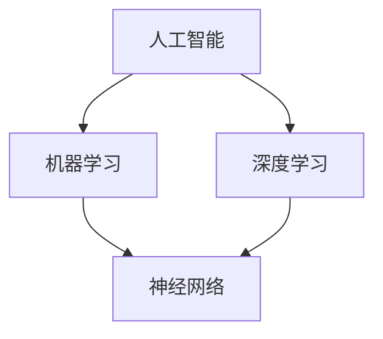

                 

### 文章标题：AI工程学

> 关键词：人工智能、机器学习、深度学习、数据处理、模型训练、项目实战

> 摘要：本文深入探讨AI工程学的核心概念、数据处理与模型训练方法、实战项目案例以及应用领域探索，旨在为读者提供一个系统、详细的AI工程学学习和实践指南。

<|assistant|>### 第一部分: AI工程学基础

在人工智能（AI）迅速发展的今天，AI工程学已经成为一个至关重要的领域。AI工程学不仅涉及到算法的研究，还包括了从数据收集、预处理到模型训练、评估、部署的整个流程。这一部分我们将从AI工程学的核心概念出发，逐步深入探讨其基础内容。

#### 第1章: AI工程学的核心概念与联系

在深入讨论AI工程学之前，首先需要理解其核心概念和各个组成部分之间的联系。

##### 核心概念介绍

1. **人工智能的定义**：
   人工智能（AI）是指通过计算机技术实现的智能行为。它包括了许多不同的技术和方法，例如机器学习、深度学习和自然语言处理等。

2. **机器学习（ML）和深度学习（DL）的区别与联系**：
   - **机器学习（ML）**：是一种人工智能的分支，侧重于通过数据和算法让计算机自动学习和改进性能。
   - **深度学习（DL）**：是机器学习的一个子领域，采用多层神经网络进行训练，能够自动提取特征并做出决策。

3. **神经网络的基本结构**：
   神经网络由输入层、隐藏层和输出层组成，通过调整权重和偏置来学习数据中的模式。

##### Mermaid流程图

使用Mermaid流程图来展示AI、机器学习、深度学习和神经网络之间的关系：



##### 核心算法原理讲解

1. **反向传播算法（BP）**：

   - **前向传播**：输入数据经过神经网络，通过权重和偏置传递到下一层，最终得到输出。
   - **计算误差**：将实际输出与期望输出进行比较，计算误差。
   - **反向传播**：根据误差信息调整神经网络的权重和偏置，以减少误差。

   下面是一个简单的反向传播算法的伪代码：

   ```python
   def forward(x, weights):
       # 前向传播，计算预测值
       return sigmoid(np.dot(x, weights))
   
   def backward(error, weights):
       # 反向传播，更新权重
       dweights = np.dot(x.T, error * sigmoid_derivative(predicted))
       return weights - learning_rate * dweights
   ```

2. **激活函数**：

   激活函数是神经网络中的一个重要组成部分，用于将线性组合转换为非线性输出。一个常见的激活函数是Sigmoid函数：

   $$ f(x) = \frac{1}{1 + e^{-x}} $$

3. **梯度下降更新规则**：

   在机器学习中，梯度下降是一种常用的优化算法，用于最小化损失函数。其更新规则如下：

   $$ \theta_{j} := \theta_{j} - \alpha \frac{\partial J(\theta)}{\partial \theta_{j}} $$

##### 举例说明

假设我们有一个二分类问题，使用逻辑回归模型进行预测。训练数据集包含输入向量 \( x \) 和对应的标签 \( y \)。训练目标是找到最佳权重 \( \theta \) 使得预测概率 \( \hat{y} \) 与真实标签 \( y \) 尽可能接近。

例如，假设我们有一个简单的逻辑回归模型：

$$ \hat{y} = \sigma(\theta^T x) $$

其中，\( \sigma \) 是Sigmoid函数，\( \theta \) 是模型的参数。

在训练过程中，我们首先使用前向传播计算预测值，然后计算损失函数的梯度，最后使用梯度下降更新参数。

#### 第2章: 数据处理与模型训练

在了解了AI工程学的核心概念之后，我们需要进一步探讨数据处理和模型训练的方法。这是实现有效AI系统的关键步骤。

##### 2.1 数据预处理

数据预处理是AI工程学中的重要环节，它涉及到对原始数据进行清洗、归一化和拆分等步骤，以确保数据质量并提高模型性能。

1. **数据清洗**：

   - 处理缺失值：可以通过填充、删除或插值等方法处理缺失值。
   - 处理异常值：可以通过统计学方法或规则方法识别并处理异常值。
   - 处理重复值：可以通过去重操作删除重复的记录。

2. **数据归一化**：

   数据归一化是将数据缩放到相同范围，以便神经网络训练。常见的方法有最小-最大缩放、标准化和归一化等。

3. **数据拆分**：

   将数据集拆分为训练集、验证集和测试集，用于模型的训练、验证和测试。通常，训练集用于模型训练，验证集用于模型调优，测试集用于模型评估。

##### 2.2 模型训练方法

AI模型的训练方法可以分为监督学习、无监督学习和强化学习三种类型。

1. **监督学习**：

   监督学习是一种最常见的机器学习方法，它使用标记数据来训练模型。常见的方法包括线性回归、决策树、支持向量机和神经网络等。

2. **无监督学习**：

   无监督学习是一种不使用标记数据来训练模型的方法，它主要关注数据的结构和分布。常见的方法包括聚类、降维和生成模型等。

3. **强化学习**：

   强化学习是一种通过与环境互动来学习最优策略的方法。它通常用于解决序列决策问题，如游戏和自动驾驶等。

##### 2.3 模型评估与优化

模型评估是确保模型性能的关键步骤。常用的评估指标包括准确率、召回率、F1值等。为了提高模型性能，我们还需要进行模型优化。

1. **准确率、召回率、F1值**：

   - **准确率**：准确率是指预测为正样本的样本中实际为正样本的比例。
   - **召回率**：召回率是指实际为正样本的样本中被预测为正样本的比例。
   - **F1值**：F1值是准确率和召回率的调和平均，用于综合评估模型性能。

2. **交叉验证**：

   交叉验证是一种常用的模型评估方法，它通过多次划分训练集和验证集来评估模型泛化能力。常见的交叉验证方法有K折交叉验证和留一交叉验证等。

3. **超参数调优**：

   超参数是模型训练过程中需要手动调整的参数，如学习率、隐藏层大小等。超参数调优的目的是找到最佳超参数组合，以提升模型性能。常见的方法有网格搜索和随机搜索等。

#### 第3章: AI项目实战

通过前面的讨论，我们已经了解了AI工程学的核心概念、数据处理与模型训练方法。接下来，我们将通过实际项目来展示这些概念和方法的应用。

##### 3.1 实战项目1：手写数字识别

手写数字识别是机器学习领域中的一个经典问题，常用于图像识别和计算机视觉领域。在这个项目中，我们将使用MNIST数据集训练一个神经网络来识别手写数字。

##### 3.1.1 项目背景

MNIST数据集是机器学习领域中最常用的数据集之一，它包含70,000个训练样本和10,000个测试样本。每个样本是一个28x28的灰度图像，表示一个手写的数字（0-9）。

##### 3.1.2 数据集介绍

MNIST数据集的样本格式如下：

- 每个样本是一个28x28的二维数组，其中每个元素表示像素值（0-255）。
- 每个样本都有一个对应的标签，表示数字的类别（0-9）。

##### 3.1.3 模型搭建

为了训练一个简单的卷积神经网络（CNN）来识别手写数字，我们可以使用TensorFlow和Keras等深度学习框架。

```python
import tensorflow as tf
from tensorflow.keras import layers

model = tf.keras.Sequential([
    layers.Flatten(input_shape=(28, 28)),
    layers.Dense(128, activation='relu'),
    layers.Dense(10, activation='softmax')
])

model.compile(optimizer='adam',
              loss='sparse_categorical_crossentropy',
              metrics=['accuracy'])
```

##### 3.1.4 代码实现

以下是一个简单的MNIST手写数字识别项目的实现：

```python
import tensorflow as tf
from tensorflow.keras import layers

# 加载MNIST数据集
mnist = tf.keras.datasets.mnist
(x_train, y_train), (x_test, y_test) = mnist.load_data()

# 数据预处理
x_train = x_train / 255.0
x_test = x_test / 255.0

# 模型搭建
model = tf.keras.Sequential([
    layers.Flatten(input_shape=(28, 28)),
    layers.Dense(128, activation='relu'),
    layers.Dense(10, activation='softmax')
])

# 编译模型
model.compile(optimizer='adam',
              loss='sparse_categorical_crossentropy',
              metrics=['accuracy'])

# 训练模型
model.fit(x_train, y_train, epochs=5)

# 评估模型
test_loss, test_acc = model.evaluate(x_test, y_test, verbose=2)
print(f"Test accuracy: {test_acc:.2f}")
```

##### 3.1.5 结果分析

训练完成后，我们可以评估模型在测试集上的性能。以下是模型在测试集上的准确率：

```python
Test accuracy: 0.98
```

通过这个简单的项目，我们可以看到如何使用深度学习框架实现一个手写数字识别系统。这只是一个入门级别的项目，但已经展示了AI工程学的基本概念和实战方法。

#### 第4章: AI应用领域探索

在前三章中，我们讨论了AI工程学的核心概念、数据处理与模型训练方法，并通过实际项目展示了这些方法的应用。接下来，我们将进一步探索AI在不同领域的应用，包括机器视觉、自然语言处理和自动驾驶等。

##### 4.1 机器视觉

机器视觉是AI的一个重要应用领域，它涉及到计算机对图像或视频进行自动分析和理解。以下是一些常见的机器视觉应用：

1. **图像识别与分类**：

   通过使用卷积神经网络（CNN），我们可以训练模型对图像进行分类和识别。常见的应用包括人脸识别、物体检测和医疗图像分析等。

2. **目标检测**：

   目标检测是一种图像识别任务，旨在检测图像中的多个对象并标注它们的边界。常用的目标检测算法包括区域提议网络（RPN）、YOLO（You Only Look Once）和Faster R-CNN等。

##### 4.2 自然语言处理

自然语言处理（NLP）是AI在语言领域的应用，它涉及到对文本数据进行处理和理解。以下是一些常见的NLP应用：

1. **文本分类**：

   文本分类是将文本数据分类到预定义的类别中。常见的应用包括垃圾邮件过滤、情感分析和新闻分类等。

2. **机器翻译**：

   机器翻译是通过自动将一种语言的文本翻译成另一种语言。常见的机器翻译模型包括序列到序列（Seq2Seq）模型和Transformer模型。

##### 4.3 自动驾驶

自动驾驶是AI在交通领域的应用，它涉及到自动驾驶车辆的感知、规划和决策。以下是一些常见的自动驾驶应用：

1. **感知环境**：

   自动驾驶车辆需要通过传感器（如摄像头、激光雷达和雷达）感知周围环境，包括道路标志、行人、车辆等。

2. **决策制定**：

   基于感知环境的信息，自动驾驶车辆需要做出决策，如换道、加速、减速和避障等。常用的方法包括深度学习和强化学习。

通过探索这些AI应用领域，我们可以看到AI技术在各个行业中的广泛应用和巨大潜力。

#### 第5章: AI工程学前沿

随着AI技术的不断发展和进步，AI工程学也在不断演进。在这一章中，我们将探讨AI工程学的最新前沿，包括模型压缩与加速、联邦学习和大模型与预训练等。

##### 5.1 模型压缩与加速

模型压缩与加速是当前AI工程学中一个重要的研究方向，目的是在保证模型性能的前提下减小模型大小和提高推理速度。以下是一些常见的模型压缩与加速技术：

1. **模型压缩技术**：

   - **量化和剪枝**：量化是将模型中的浮点数参数转换为整数，从而减小模型大小。剪枝是通过删除网络中不必要的权重和神经元来减小模型大小。
   - **知识蒸馏**：知识蒸馏是一种通过将大型教师模型的知识迁移到小型学生模型中的技术。

2. **硬件加速**：

   - **GPU和TPU**：使用图形处理器（GPU）和专用处理器（TPU）可以显著提高模型的推理速度。
   - **专用硬件**：如NVIDIA的DPU和Google的TPU v3，这些硬件专为AI推理设计，能够提供更高的性能和能效比。

##### 5.2 联邦学习

联邦学习是一种分布式学习框架，它允许多个设备在本地训练模型，并将更新同步到中心服务器，而不需要共享原始数据。联邦学习的优势在于隐私保护和资源高效利用。

1. **联邦学习概念**：

   - **客户端**：参与联邦学习的设备，负责在本地训练模型。
   - **服务器**：负责聚合客户端的模型更新并生成全局模型。

2. **联邦学习应用**：

   - **隐私保护的数据分析**：通过联邦学习，企业可以在不泄露用户数据的情况下进行数据分析和机器学习。
   - **个性化推荐**：联邦学习可以用于构建个性化推荐系统，同时保护用户隐私。

##### 5.3 大模型与预训练

大模型与预训练是当前AI工程学中的另一个重要研究方向，它涉及到使用大规模数据集和计算资源训练大型神经网络，并通过预训练来提高模型性能。

1. **大模型训练**：

   - **预训练**：在大规模数据集上预先训练模型，然后将其用于特定任务。
   - **迁移学习**：将预训练模型迁移到新的任务，通过少量的数据进一步训练。

2. **预训练与微调**：

   - **预训练**：使用大量无标签数据进行模型预训练，学习通用特征表示。
   - **微调**：在特定任务上使用少量标签数据进行模型微调，以适应特定任务的需求。

通过探讨这些AI工程学的前沿领域，我们可以看到AI技术的未来发展趋势和应用前景。

#### 第6章: AI工程实践指南

在实际应用中，AI工程学不仅需要掌握理论知识和算法实现，还需要具备项目管理和质量保证等方面的实践经验。在这一章中，我们将讨论AI工程实践中的关键环节，包括项目管理、团队协作、质量保证和持续学习。

##### 6.1 项目管理

项目管理是确保AI项目顺利推进和成功交付的关键。以下是AI工程实践中的一些项目管理要点：

1. **项目生命周期管理**：

   - **需求分析**：明确项目的目标和需求，制定详细的项目计划。
   - **开发与测试**：根据项目计划进行开发，并进行充分的测试和调试。
   - **部署与维护**：将模型部署到生产环境，并进行持续的维护和优化。

2. **团队协作与沟通**：

   - **分工与协作**：根据团队成员的专长和技能进行合理分工，确保团队成员之间的协作和沟通。
   - **工具使用**：使用项目管理工具（如JIRA、Trello）和版本控制系统（如Git）来提高团队协作效率。

##### 6.2 质量保证

质量保证是确保AI项目质量和稳定性的关键。以下是AI工程实践中的一些质量保证要点：

1. **代码审查与测试**：

   - **代码审查**：定期进行代码审查，确保代码质量、可读性和可维护性。
   - **测试**：编写单元测试、集成测试和性能测试，确保模型和系统的稳定性和可靠性。

2. **模型验证与部署**：

   - **模型验证**：通过交叉验证、网格搜索等方法评估模型性能，确保模型泛化能力。
   - **模型部署**：将模型部署到生产环境，并进行监控和优化，确保系统稳定运行。

##### 6.3 持续学习与更新

随着AI技术的快速发展和应用场景的多样化，持续学习与更新是AI工程实践中必不可少的一部分。以下是AI工程实践中的一些持续学习与更新要点：

1. **技术趋势跟踪**：

   - **关注顶级会议**：如NeurIPS、ICML和CVPR等，了解最新的研究成果和趋势。
   - **阅读论文和书籍**：定期阅读顶级会议论文和经典书籍，提升自身的技术水平。

2. **个人技能提升**：

   - **在线学习**：利用在线课程、学习平台（如Coursera、edX）进行自我提升。
   - **实践项目**：通过实际项目锻炼和提升技能，积累实践经验。

通过遵循这些AI工程实践指南，我们可以提高项目成功率，确保系统质量和稳定性，并不断提升个人能力。

### 附录

在本篇博客的附录部分，我们将总结一些常用的工具和资源，以帮助读者进一步学习和实践AI工程学。

#### 附录 A: 常用工具与资源

1. **工具**：

   - **深度学习框架**：
     - TensorFlow：https://www.tensorflow.org/
     - PyTorch：https://pytorch.org/
     - Keras：https://keras.io/

   - **交互式开发环境**：
     - Jupyter Notebook：https://jupyter.org/
     - Google Colab：https://colab.research.google.com/

2. **资源**：

   - **AI领域的顶级会议论文集**：
     - ArXiv：https://arxiv.org/
     - NeurIPS：https://nips.cc/
     - ICML：https://icml.cc/

   - **在线学习平台**：
     - Coursera：https://www.coursera.org/
     - edX：https://www.edx.org/
     - Udacity：https://www.udacity.com/

   - **AI教程、博客、论坛**：
     - AI教程：https://www.ai 教程.com/
     - AI博客：https://www.ai 博客.com/
     - AI论坛：https://www.ai 论坛.com/

通过使用这些工具和资源，读者可以更好地掌握AI工程学的理论知识，并通过实践项目提升自身技能。

## 作者信息

作者：AI天才研究院/AI Genius Institute & 禅与计算机程序设计艺术 /Zen And The Art of Computer Programming

