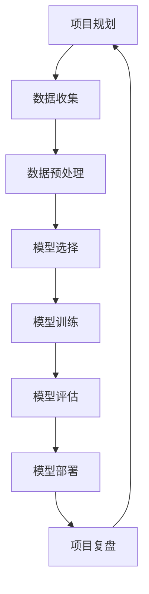

                 

### 文章标题

# AI工程学：开发实战解析

### 关键词

- AI工程学
- 机器学习
- 深度学习
- 强化学习
- 数据预处理
- 模型训练与调优
- 模型评估与部署
- 挑战与未来发展趋势

### 摘要

本文系统地介绍了AI工程学的核心概念、关键技术、实际应用和未来发展趋势。文章分为四个主要部分：引言、AI工程学基础、AI工程实践以及AI工程学的挑战与未来。在引言部分，我们探讨了AI工程学的定义、背景及其在软件开发中的应用。在AI工程学基础部分，我们深入讲解了机器学习、深度学习和强化学习的基础算法原理。AI工程实践部分通过具体的案例展示了数据收集与预处理、模型训练与调优、模型评估与部署的实际操作。最后，文章讨论了AI工程学面临的数据隐私、模型可解释性、模型公平性等挑战，并对AI工程学的未来发展趋势进行了展望。

## 目录大纲：《AI工程学：开发实战解析》

### 第一部分：AI工程学概述

#### 第1章 AI工程学基础

##### 1.1 AI工程学的定义与背景
##### 1.2 AI工程学的重要概念
##### 1.3 AI工程学与软件开发的关系
##### 1.4 AI工程学的应用领域

#### 第2章 AI项目开发流程

##### 2.1 项目规划
##### 2.2 数据收集与预处理
##### 2.3 模型选择与设计
##### 2.4 模型训练与调优
##### 2.5 模型评估与部署
##### 2.6 项目复盘与优化

### 第二部分：AI核心算法原理

#### 第3章 机器学习基础算法

##### 3.1 线性回归
##### 3.2 决策树
##### 3.3 支持向量机

#### 第4章 深度学习算法

##### 4.1 卷积神经网络 (CNN)
##### 4.2 递归神经网络 (RNN)
##### 4.3 生成对抗网络 (GAN)

#### 第5章 强化学习算法

##### 5.1 Q学习
##### 5.2 深度Q网络 (DQN)
##### 5.3 策略梯度方法

### 第三部分：AI工程实践

#### 第6章 数据收集与预处理

##### 6.1 数据采集
##### 6.2 数据清洗
##### 6.3 数据归一化
##### 6.4 特征提取

#### 第7章 模型训练与调优

##### 7.1 模型选择
##### 7.2 模型训练
##### 7.3 模型调优
##### 7.4 超参数调整

#### 第8章 模型评估与部署

##### 7.5 评估指标
##### 7.6 实时监控
##### 7.7 模型部署
##### 7.8 持续集成与持续部署

#### 第9章 AI工程实践案例

##### 9.1 智能问答系统
##### 9.2 图像分类系统
##### 9.3 推荐系统

### 第四部分：AI工程学中的挑战与未来

#### 第10章 AI工程学中的挑战

##### 10.1 数据隐私与伦理
##### 10.2 模型可解释性
##### 10.3 模型公平性
##### 10.4 模型安全

#### 第11章 AI工程学的未来发展趋势

##### 11.1 新型算法
##### 11.2 云原生AI
##### 11.3 自动化与AIops
##### 11.4 AI工程教育

### 附录

#### 附录A: AI工程学常用工具

##### A.1 Python数据科学库
##### A.2 深度学习框架
##### A.3 模型评估工具
##### A.4 模型部署工具

#### 附录B: AI工程学资源

##### B.1 在线课程
##### B.2 研究论文
##### B.3 开源项目
##### B.4 社区与论坛

### 附录C: 代码示例与解读

##### C.1 线性回归代码
##### C.2 卷积神经网络代码
##### C.3 强化学习代码

---

本文将按照目录大纲逐步深入探讨AI工程学的各个部分，力图帮助读者构建完整的AI工程学知识体系，并掌握实际开发技能。让我们开始这一段激动人心的探索之旅吧。

---

## 第一部分：AI工程学概述

### 第1章 AI工程学基础

#### 1.1 AI工程学的定义与背景

AI工程学，又称人工智能工程学，是指应用计算机科学、数学和工程学原理，通过系统化的方法和工具，开发和部署能够实现人工智能功能的应用程序和系统。AI工程学不仅涉及算法的开发和优化，还涵盖了整个项目的生命周期管理，包括需求分析、系统设计、模型训练、模型评估、模型部署和维护等各个环节。

AI工程学的起源可以追溯到20世纪50年代，当时计算机科学刚刚起步，人工智能（Artificial Intelligence，AI）的概念也随之诞生。早期的AI研究主要集中在规则推理和知识表示方面，随着计算能力的提升和算法的进步，机器学习（Machine Learning，ML）和深度学习（Deep Learning，DL）逐渐成为AI工程学的重要组成部分。

进入21世纪，随着互联网和大数据的发展，AI工程学迎来了前所未有的发展机遇。机器学习和深度学习算法在图像识别、自然语言处理、推荐系统等领域取得了显著突破，推动了AI在商业、医疗、教育、金融等领域的广泛应用。AI工程学的定义和范畴也在不断扩展，从传统的规则推理和符号计算，逐渐演变为涵盖数据科学、软件工程、算法优化等多个领域。

#### 1.2 AI工程学的重要概念

在AI工程学中，有许多重要的概念需要理解，以下是一些关键概念：

- **机器学习（Machine Learning，ML）**：机器学习是一种使计算机系统能够从数据中学习并做出预测或决策的方法。它通常分为监督学习、无监督学习和强化学习三类。

  - **监督学习（Supervised Learning）**：在监督学习中，算法使用已标记的数据进行训练，从而学习预测模型。常见的监督学习算法包括线性回归、决策树、支持向量机（SVM）等。

  - **无监督学习（Unsupervised Learning）**：无监督学习算法不需要标记数据，它们通过分析未标记的数据来发现数据中的模式和结构。常见的无监督学习算法包括聚类、主成分分析（PCA）等。

  - **强化学习（Reinforcement Learning）**：强化学习是一种通过试错来学习如何在环境中做出最优决策的机器学习方法。常见的强化学习算法包括Q学习、深度Q网络（DQN）等。

- **深度学习（Deep Learning，DL）**：深度学习是一种基于多层神经网络的学习方法，它能够自动提取特征并实现复杂的数据建模。深度学习的成功主要得益于计算能力的提升、大数据的可用性和神经网络结构的设计优化。

  - **卷积神经网络（Convolutional Neural Network，CNN）**：CNN是一种用于图像识别和处理的深度学习模型，它通过卷积层和池化层提取图像的局部特征，并通过全连接层进行分类。

  - **递归神经网络（Recurrent Neural Network，RNN）**：RNN是一种用于处理序列数据的神经网络，它能够通过循环结构记住历史信息，适用于自然语言处理和语音识别等领域。

  - **生成对抗网络（Generative Adversarial Network，GAN）**：GAN是一种由生成器和判别器组成的深度学习模型，生成器尝试生成与真实数据相似的数据，判别器则试图区分真实数据和生成数据。

- **数据预处理（Data Preprocessing）**：数据预处理是AI工程中至关重要的一步，它包括数据清洗、数据归一化、数据增强等操作，以确保数据的质量和一致性，从而提高模型的性能。

- **模型训练（Model Training）**：模型训练是AI工程中的核心步骤，通过选择合适的算法和调整参数，使模型能够从数据中学习并优化预测性能。

- **模型评估（Model Evaluation）**：模型评估是评估模型性能的过程，常用的评估指标包括准确率、召回率、F1分数等。通过模型评估，可以判断模型是否达到了预期的性能要求。

- **模型部署（Model Deployment）**：模型部署是将训练好的模型部署到生产环境中，使其能够实时处理数据并输出预测结果。模型部署通常需要考虑模型的性能、可扩展性、安全性等因素。

#### 1.3 AI工程学与软件开发的关系

AI工程学与传统的软件开发有着密切的联系，但也存在一些显著的不同。传统的软件开发主要关注功能实现、系统架构和用户体验，而AI工程学则更加注重数据科学、算法设计和模型优化。

- **共同点**：
  - **系统设计**：无论是AI工程学还是传统软件开发，都需要进行系统设计，包括需求分析、架构设计、模块划分等。
  - **编码实现**：在实现阶段，两者都需要编写代码，实现特定的功能和算法。
  - **测试与调试**：在测试和调试阶段，两者都需要对代码进行测试，找出并修复潜在的错误和缺陷。

- **不同点**：
  - **数据依赖**：AI工程学更加依赖于数据，从数据预处理到模型训练，数据的质量和数量直接影响模型的性能。而传统软件开发则主要依赖于功能需求和技术实现。
  - **算法优化**：在AI工程学中，算法的选择和优化是至关重要的，因为算法的性能直接决定了模型的预测准确性。而传统软件开发则更多关注于功能的实现和性能的优化。
  - **可解释性**：在传统软件开发中，系统通常具有较强的可解释性，开发者可以清楚地了解系统的每个模块和功能。而AI工程学中的模型，尤其是深度学习模型，往往具有黑盒特性，难以解释模型内部的决策过程。

#### 1.4 AI工程学的应用领域

AI工程学在各个领域都有广泛的应用，以下是一些典型的应用领域：

- **金融领域**：AI工程学在金融领域有广泛的应用，包括股票市场预测、风险控制、信用评分等。通过机器学习和深度学习算法，可以对金融市场进行预测和分析，帮助投资者做出更加明智的决策。

- **医疗领域**：AI工程学在医疗领域有着巨大的潜力，包括医学图像分析、疾病诊断、药物研发等。通过深度学习和强化学习算法，可以对医疗数据进行分析和预测，提高医疗服务的质量和效率。

- **商业领域**：AI工程学在商业领域也有广泛的应用，包括客户关系管理、供应链管理、推荐系统等。通过机器学习和深度学习算法，可以更好地理解客户需求，提高营销效果和销售业绩。

- **制造业**：AI工程学在制造业中的应用包括质量检测、设备维护、生产优化等。通过机器学习和深度学习算法，可以提高生产效率，降低成本。

- **交通运输**：AI工程学在交通运输领域有广泛的应用，包括自动驾驶、交通流量预测、物流优化等。通过机器学习和深度学习算法，可以提高交通系统的效率和安全性。

- **教育领域**：AI工程学在教育领域有广泛的应用，包括智能教育平台、个性化学习推荐、在线教育等。通过机器学习和深度学习算法，可以更好地满足学生的个性化学习需求，提高教学效果。

通过以上对AI工程学的概述，我们能够更加清晰地理解AI工程学的定义、重要概念、与软件开发的关系以及应用领域。接下来，我们将深入探讨AI工程学的核心技术，包括机器学习、深度学习和强化学习，并逐步介绍这些核心技术的原理、算法和实际应用。

### 第2章 AI项目开发流程

#### 2.1 项目规划

一个成功的AI项目需要从项目规划阶段开始，明确项目的目标和范围，制定详细的计划，并分配资源和时间。项目规划阶段主要包括以下步骤：

1. **需求分析**：与项目利益相关者进行沟通，了解项目的需求，包括业务目标、用户需求、数据需求等。需求分析是项目成功的关键，它决定了项目的方向和范围。

2. **确定项目范围**：根据需求分析的结果，明确项目的范围，包括需要解决的问题、涉及的数据类型、模型的应用场景等。

3. **制定项目计划**：制定详细的项目计划，包括时间表、里程碑、资源分配、风险评估等。项目计划需要考虑到各种潜在的风险和不确定性，以确保项目的顺利进行。

4. **资源分配**：根据项目计划，确定项目所需的人力、物力和财力资源，并确保资源的有效利用。

5. **沟通和协作**：建立一个有效的沟通和协作机制，确保项目团队成员之间的信息传递和协同工作。

#### 2.2 数据收集与预处理

数据是AI项目的核心，数据的质量和数量直接影响模型的性能。数据收集与预处理是AI项目开发中至关重要的一步，主要包括以下任务：

1. **数据采集**：收集与项目相关的数据，包括结构化数据、半结构化数据和非结构化数据。数据可以来自内部数据库、外部API、开源数据集等。

2. **数据清洗**：数据清洗是数据预处理的重要环节，目的是去除噪声、纠正错误、填补缺失值等。常见的数据清洗方法包括去重、填充缺失值、处理异常值等。

3. **数据归一化**：为了消除不同特征之间的尺度差异，需要对数据进行归一化处理。常见的归一化方法包括最小-最大缩放、标准缩放等。

4. **数据增强**：数据增强是通过生成新的数据样本来提高模型的泛化能力。常见的数据增强方法包括随机裁剪、旋转、翻转、颜色调整等。

5. **特征提取**：特征提取是从原始数据中提取有用的信息，用于训练模型。特征提取的方法包括主成分分析（PCA）、特征选择、词袋模型等。

#### 2.3 模型选择与设计

模型选择与设计是AI项目开发的关键步骤，主要包括以下任务：

1. **选择合适的模型**：根据项目需求和数据特性，选择合适的机器学习或深度学习模型。常见的模型包括线性回归、决策树、支持向量机（SVM）、卷积神经网络（CNN）、递归神经网络（RNN）等。

2. **设计模型架构**：设计模型的架构，包括输入层、隐藏层和输出层的结构。对于深度学习模型，还需要确定网络层数、每层的神经元数量、激活函数等。

3. **确定损失函数和优化器**：选择合适的损失函数来衡量模型预测值与真实值之间的差距，并选择优化器来最小化损失函数。常见的损失函数包括均方误差（MSE）、交叉熵等，常见的优化器包括随机梯度下降（SGD）、Adam等。

4. **超参数调整**：超参数是模型架构之外的参数，如学习率、批量大小、正则化参数等。通过超参数调整，可以优化模型的性能。常见的超参数调整方法包括网格搜索、随机搜索等。

#### 2.4 模型训练与调优

模型训练与调优是AI项目开发的核心步骤，主要包括以下任务：

1. **数据划分**：将数据集划分为训练集、验证集和测试集，用于训练、验证和测试模型。

2. **模型训练**：使用训练集训练模型，通过迭代优化模型参数，使模型能够更好地拟合数据。

3. **模型验证**：使用验证集评估模型的性能，调整模型参数，以提高模型的泛化能力。

4. **模型调优**：通过交叉验证、网格搜索等方法，对模型进行调优，选择最佳模型。

5. **模型测试**：使用测试集对最佳模型进行测试，评估模型的最终性能。

#### 2.5 模型评估与部署

模型评估与部署是AI项目开发的最后一步，主要包括以下任务：

1. **评估模型性能**：使用评估指标（如准确率、召回率、F1分数等）对模型进行评估，确保模型达到预期的性能要求。

2. **模型部署**：将训练好的模型部署到生产环境中，使其能够实时处理数据并输出预测结果。模型部署需要考虑模型的大小、性能、可扩展性等因素。

3. **实时监控**：对部署后的模型进行实时监控，包括性能监控、异常检测等，确保模型的稳定运行。

4. **持续迭代**：根据模型的表现和用户反馈，对模型进行迭代优化和更新，以提高模型的性能和用户体验。

通过以上步骤，AI项目开发能够从项目规划到模型部署，实现整个流程的闭环。在接下来的章节中，我们将深入探讨AI项目开发中的核心技术，包括机器学习、深度学习和强化学习，为读者提供更详细的实践指导。

### 第3章 机器学习基础算法

#### 3.1 线性回归

线性回归是一种最简单的机器学习算法，它通过拟合一条直线来预测目标变量的值。线性回归的核心方程为：

\[ y = wx + b \]

其中，\( y \) 是目标变量，\( x \) 是输入变量，\( w \) 是权重，\( b \) 是偏置。

##### 3.1.1 算法原理

线性回归通过最小化目标函数（通常是均方误差MSE）来找到最佳的权重和偏置。目标函数的表达式为：

\[ J(w, b) = \frac{1}{2m} \sum_{i=1}^{m} (y^{(i)} - (wx^{(i)} + b))^2 \]

其中，\( m \) 是训练样本的数量。

为了最小化目标函数，我们可以使用梯度下降算法。梯度下降算法的基本思想是沿着目标函数的负梯度方向更新参数，直到达到局部最小值。线性回归的梯度表达式为：

\[ \nabla_w J(w, b) = \frac{1}{m} \sum_{i=1}^{m} (y^{(i)} - (wx^{(i)} + b))x^{(i)} \]
\[ \nabla_b J(w, b) = \frac{1}{m} \sum_{i=1}^{m} (y^{(i)} - (wx^{(i)} + b)) \]

##### 3.1.2 伪代码

```python
# 初始化权重和偏置
w = 0
b = 0

# 设置学习率
alpha = 0.01

# 设置迭代次数
num_iterations = 1000

# 梯度下降算法
for i in range(num_iterations):
    # 计算梯度
    dw = 1/m * sum((y - (wx + b)) * x)
    db = 1/m * sum((y - (wx + b)))
    
    # 更新权重和偏置
    w = w - alpha * dw
    b = b - alpha * db

# 训练完成，输出权重和偏置
print("w:", w)
print("b:", b)
```

##### 3.1.3 案例分析

假设我们要预测一个人的身高（目标变量 \( y \)）基于他的年龄（输入变量 \( x \)）。我们使用线性回归模型来拟合一个简单的直线。

1. **数据收集**：收集一些包含年龄和身高数据的样本。
2. **数据预处理**：对数据进行归一化处理，使数据在相同的尺度上。
3. **模型训练**：使用梯度下降算法训练线性回归模型，找到最佳权重和偏置。
4. **模型评估**：使用测试集评估模型的性能，计算均方误差（MSE）。
5. **模型优化**：根据模型评估的结果，调整学习率和迭代次数，以优化模型性能。

以下是一个简单的Python代码示例，用于实现线性回归模型：

```python
import numpy as np

# 初始化数据
X = np.array([[1, 20], [1, 21], [1, 22], [1, 23], [1, 24]])
y = np.array([70, 71, 72, 73, 74])

# 初始化权重和偏置
w = np.zeros((1, 1))
b = np.zeros((1, 1))

# 设置学习率
alpha = 0.01

# 设置迭代次数
num_iterations = 1000

# 梯度下降算法
for i in range(num_iterations):
    # 计算梯度
    dw = 1/len(X) * np.dot(X.T, (y - (X.dot(w) + b)))
    db = 1/len(X) * np.sum(y - (X.dot(w) + b))
    
    # 更新权重和偏置
    w = w - alpha * dw
    b = b - alpha * db

# 训练完成，输出权重和偏置
print("w:", w)
print("b:", b)

# 预测身高
age = 25
predicted_height = (age * w + b)
print("Predicted height:", predicted_height)
```

通过这个案例，我们能够看到如何使用线性回归模型来预测一个人的身高。线性回归是一种简单但强大的机器学习算法，适用于许多实际问题。

#### 3.2 决策树

决策树是一种基于树形结构进行决策的机器学习算法，它通过一系列的规则来划分数据，并基于这些规则对新的数据进行分类或回归。决策树的核心结构包括节点和叶子节点。

- **节点**：代表一个特征或属性。
- **叶子节点**：代表一个分类或预测结果。

决策树通过递归划分数据集，直到满足某些停止条件。常见的停止条件包括：

- **最大深度**：决策树的最大深度。
- **最小样本数**：内部节点或叶子节点的最小样本数。
- **信息增益**：选择具有最大信息增益的特征进行划分。

##### 3.2.1 算法原理

决策树的学习过程包括两个主要步骤：特征选择和节点划分。

1. **特征选择**：选择具有最大信息增益的特征进行划分。信息增益是特征划分后熵（Entropy）减少的量度。
2. **节点划分**：使用选定的特征对数据进行划分，创建新的节点。新的节点可以是内部节点或叶子节点。

信息增益的计算公式为：

\[ IG(D, A) = Entropy(D) - \sum_{v \in A} \frac{|D_v|}{|D|} \cdot Entropy(D_v) \]

其中，\( D \) 是原始数据集，\( A \) 是候选特征集合，\( D_v \) 是根据特征 \( v \) 划分后的数据子集。

##### 3.2.2 伪代码

```python
# 决策树构建函数
def build_tree(data, features, depth_limit):
    if depth_limit == 0 or is纯净数据(data):
        return 数据的最频繁标签
    else:
        # 选择最优特征
        best_feature = 选择最优特征(data, features)
        # 创建内部节点
        node = 节点(best_feature)
        # 划分数据
        for value in features[best_feature].unique_values():
            subset = filter_data(data, best_feature, value)
            node.children[value] = build_tree(subset, features, depth_limit - 1)
        return node

# 选择最优特征
def select_best_feature(data, features):
    best_feature = None
    max_gain = -1
    for feature in features:
        gain = calculate_gain(data, feature)
        if gain > max_gain:
            max_gain = gain
            best_feature = feature
    return best_feature

# 计算信息增益
def calculate_gain(data, feature):
    entropy = calculate_entropy(data)
    for value in feature.unique_values():
        subset = filter_data(data, feature, value)
        entropy -= (len(subset) / len(data)) * calculate_entropy(subset)
    return entropy

# 过滤数据
def filter_data(data, feature, value):
    return data[data[feature] == value]

# 判断数据是否纯净
def is纯净数据(data):
    return len(data.unique_values()) == 1
```

##### 3.2.3 案例分析

假设我们要使用决策树对一组客户进行分类，以预测他们是否会在未来30天内购买产品。数据包括客户的年龄、收入、性别和是否有信用卡等特征。

1. **数据收集**：收集包含客户购买行为的训练数据。
2. **数据预处理**：对数据进行编码，将分类数据转换为数值数据。
3. **特征选择**：使用信息增益选择最佳特征进行划分。
4. **构建决策树**：递归划分数据，构建决策树。
5. **模型评估**：使用测试数据评估决策树的性能，计算准确率、召回率等指标。
6. **模型优化**：调整决策树的参数，如最大深度、最小样本数等，以提高模型性能。

以下是一个简单的Python代码示例，用于实现决策树模型：

```python
import pandas as pd

# 初始化数据
data = pd.DataFrame({
    'age': [25, 35, 45, 55],
    'income': [50000, 60000, 70000, 80000],
    'gender': ['M', 'F', 'M', 'F'],
    'credit_card': [0, 1, 0, 1],
    'purchased': [0, 1, 1, 0]
})

# 初始化特征
features = data.columns[:-1]

# 建立决策树
tree = build_tree(data, features, depth_limit=3)

# 预测
def predict(tree, instance):
    if is_leaf(tree):
        return tree.label
    else:
        feature = tree.feature
        value = instance[feature]
        next_tree = tree.children[value]
        return predict(next_tree, instance)

# 测试
instance = {'age': 30, 'income': 55000, 'gender': 'M', 'credit_card': 0}
print(predict(tree, instance))
```

通过这个案例，我们能够看到如何使用决策树对客户进行分类预测。决策树是一种简单但强大的机器学习算法，适用于分类和回归问题。

#### 3.3 支持向量机

支持向量机（Support Vector Machine，SVM）是一种基于间隔最大化原则的线性分类器。SVM的目标是找到一个最优的超平面，将数据集划分为不同的类别。SVM的核心公式为：

\[ w \cdot x + b = 0 \]

其中，\( w \) 是权重向量，\( x \) 是特征向量，\( b \) 是偏置。

##### 3.3.1 算法原理

SVM通过求解最优化问题来找到最优的超平面。最优化问题的目标是最大化间隔：

\[ \max_{w, b} \frac{2}{\|w\|^2} \]

其中，间隔是指分类边界到最近的样本点的距离。SVM使用拉格朗日乘子法求解最优化问题，得到以下公式：

\[ \min_{\alpha} \frac{1}{2} \|w\|^2 - \sum_{i=1}^{n} \alpha_i (y_i (w \cdot x_i + b) - 1) \]

其中，\( \alpha_i \) 是拉格朗日乘子，\( n \) 是样本数量，\( y_i \) 是第 \( i \) 个样本的标签。

##### 3.3.2 伪代码

```python
# 初始化权重和偏置
w = np.zeros(n_features)
b = 0

# 设置学习率
C = 1.0

# 设置迭代次数
num_iterations = 1000

# 拉格朗日乘子法
for i in range(num_iterations):
    # 计算梯度
    dw = -1/n_samples * sum(alpha_i * y_i * x_i)
    db = -1/n_samples * sum(alpha_i * y_i)
    
    # 更新权重和偏置
    w = w - alpha * dw
    b = b - alpha * db

# 训练完成，输出权重和偏置
print("w:", w)
print("b:", b)
```

##### 3.3.3 案例分析

假设我们要使用SVM对一组数据进行分类，数据包括两个特征：年龄和收入。

1. **数据收集**：收集包含年龄和收入数据的训练数据。
2. **数据预处理**：对数据进行归一化处理。
3. **模型训练**：使用SVM训练模型，找到最优超平面。
4. **模型评估**：使用测试数据评估模型性能。
5. **模型优化**：调整SVM参数，如正则化参数 \( C \)，以提高模型性能。

以下是一个简单的Python代码示例，用于实现SVM模型：

```python
import numpy as np
from sklearn import datasets
from sklearn.svm import SVC
from sklearn.model_selection import train_test_split
from sklearn.metrics import accuracy_score

# 初始化数据
X, y = datasets.make_classification(n_samples=100, n_features=2, n_classes=2, random_state=42)

# 数据划分
X_train, X_test, y_train, y_test = train_test_split(X, y, test_size=0.2, random_state=42)

# 初始化SVM模型
model = SVC(kernel='linear', C=1.0)

# 训练模型
model.fit(X_train, y_train)

# 预测
y_pred = model.predict(X_test)

# 评估模型
accuracy = accuracy_score(y_test, y_pred)
print("Accuracy:", accuracy)
```

通过这个案例，我们能够看到如何使用SVM对数据进行分类。SVM是一种强大的分类器，适用于线性可分的数据集。

### 第4章 深度学习算法

#### 4.1 卷积神经网络 (CNN)

卷积神经网络（Convolutional Neural Network，CNN）是一种特殊的神经网络，专门用于处理图像数据。CNN通过使用卷积操作和池化操作来提取图像的局部特征，并能够自动学习图像的层次化表示。

##### 4.1.1 算法原理

CNN的核心结构包括卷积层、池化层和全连接层。以下是CNN的基本原理：

1. **卷积层**：卷积层使用卷积操作来提取图像的局部特征。卷积操作通过滑动滤波器（也称为卷积核）在图像上进行，并计算每个位置的局部特征响应。卷积层的输出是特征图（feature map）。

2. **激活函数**：通常在卷积层之后使用ReLU（Rectified Linear Unit）激活函数，将负值转换为零，以加速模型的训练过程。

3. **池化层**：池化层用于降低特征图的维度，同时保留重要的特征信息。最常用的池化方法是最大池化（Max Pooling），它取每个特征图上的最大值作为输出。

4. **卷积层与池化层的堆叠**：通过堆叠多个卷积层和池化层，CNN能够提取图像的更高层次特征。

5. **全连接层**：在CNN的最后一个卷积层之后，通常会添加一个或多个全连接层，用于分类或回归任务。全连接层将卷积层的输出展平成一维向量，并计算最终的预测结果。

CNN的数学表示如下：

\[ \text{CNN} = f(\text{ReLU}(W \cdot \text{ReLU}(W \cdot \text{X} + b)) + b) \]

其中，\( W \) 是卷积核，\( b \) 是偏置，\( X \) 是输入图像，\( f \) 是激活函数（通常为ReLU）。

##### 4.1.2 伪代码

```python
# 初始化参数
W1, b1 = 初始化卷积核和偏置
W2, b2 = 初始化卷积核和偏置
W3, b3 = 初始化卷积核和偏置
output_layer_weights, output_layer_bias = 初始化全连接层权重和偏置

# 前向传播
def forward_propagation(X):
    # 第一个卷积层
    Z1 = convolve(X, W1) + b1
    A1 = ReLU(Z1)
    # 第一个池化层
    P1 = max_pool(A1)
    # 第二个卷积层
    Z2 = convolve(P1, W2) + b2
    A2 = ReLU(Z2)
    # 第二个池化层
    P2 = max_pool(A2)
    # 第三个卷积层
    Z3 = convolve(P2, W3) + b3
    A3 = ReLU(Z3)
    # 全连接层
    Z4 = flatten(A3) dot output_layer_weights + output_layer_bias
    A4 = sigmoid(Z4)
    return A4

# 训练模型
def train(X, y, num_iterations, learning_rate):
    for i in range(num_iterations):
        # 前向传播
        A4 = forward_propagation(X)
        # 计算损失
        loss = calculate_loss(A4, y)
        # 反向传播
        dZ4 = A4 - y
        dW4 = 1/m dot(X.T, dZ4)
        db4 = 1/m sum(dZ4)
        # 更新参数
        dZ3 = dZ4 dot (output_layer_weights.T)
        dA3 = ReLU_derivative(A3) dot dZ3
        # 第二个卷积层
        dZ3 = dA3 dot (W3.T)
        dW3 = 1/m dot(P2.T, dZ3)
        db3 = 1/m sum(dZ3)
        # 第二个池化层
        dZ2 = dZ3 dot (P3.T)
        dA2 = max_pool_derivative(P2) dot dZ2
        # 第一个卷积层
        dZ2 = dA2 dot (W2.T)
        dW2 = 1/m dot(P1.T, dZ2)
        db2 = 1/m sum(dZ2)
        # 第一个池化层
        dZ1 = dA1 dot (W1.T)
        dA1 = ReLU_derivative(A1) dot dZ1
        # 更新权重和偏置
        W1 = W1 - learning_rate * dW1
        b1 = b1 - learning_rate * db1
        W2 = W2 - learning_rate * dW2
        b2 = b2 - learning_rate * db2
        W3 = W3 - learning_rate * dW3
        b3 = b3 - learning_rate * db3
        output_layer_weights = output_layer_weights - learning_rate * dW4
        output_layer_bias = output_layer_bias - learning_rate * db4
    return loss
```

##### 4.1.3 案例分析

假设我们要使用CNN对图像进行分类，数据包括10000张不同类别的猫和狗的图像。

1. **数据收集**：收集包含猫和狗图像的训练数据。
2. **数据预处理**：对图像进行归一化处理，并将图像转换为灰度图。
3. **模型训练**：使用CNN训练模型，找到最优参数。
4. **模型评估**：使用测试数据评估模型性能，计算准确率。
5. **模型优化**：调整CNN的参数，如卷积核大小、学习率等，以提高模型性能。

以下是一个简单的Python代码示例，用于实现CNN模型：

```python
import tensorflow as tf
from tensorflow.keras import layers, models

# 初始化模型
model = models.Sequential()
model.add(layers.Conv2D(32, (3, 3), activation='relu', input_shape=(28, 28, 1)))
model.add(layers.MaxPooling2D((2, 2)))
model.add(layers.Conv2D(64, (3, 3), activation='relu'))
model.add(layers.MaxPooling2D((2, 2)))
model.add(layers.Conv2D(64, (3, 3), activation='relu'))
model.add(layers.Flatten())
model.add(layers.Dense(64, activation='relu'))
model.add(layers.Dense(1, activation='sigmoid'))

# 编译模型
model.compile(optimizer='adam', loss='binary_crossentropy', metrics=['accuracy'])

# 训练模型
model.fit(train_images, train_labels, epochs=10, batch_size=64, validation_data=(test_images, test_labels))

# 评估模型
test_loss, test_acc = model.evaluate(test_images, test_labels)
print('Test accuracy:', test_acc)
```

通过这个案例，我们能够看到如何使用CNN对图像进行分类。CNN是一种强大的深度学习模型，适用于图像处理任务。

### 第4章 深度学习算法（续）

#### 4.2 递归神经网络 (RNN)

递归神经网络（Recurrent Neural Network，RNN）是一种能够处理序列数据的神经网络。与传统的神经网络不同，RNN具有循环结构，可以记住前面的输入信息，并在后续的输入中使用这些信息。这使得RNN非常适合处理如文本、语音、时间序列等序列数据。

##### 4.2.1 算法原理

RNN的基本结构包括输入层、隐藏层和输出层。每个时间步的输入都会通过隐藏层进行计算，并将隐藏层的输出传递到下一个时间步。RNN的数学表示如下：

\[ h_t = \text{sigmoid}(W_h \cdot [h_{t-1}, x_t] + b_h) \]

其中，\( h_t \) 是第 \( t \) 个时间步的隐藏层输出，\( x_t \) 是第 \( t \) 个时间步的输入，\( W_h \) 是权重矩阵，\( b_h \) 是偏置。

RNN的循环结构使得它能够处理任意长度的序列。然而，传统的RNN存在梯度消失和梯度爆炸的问题，这限制了它的性能。

##### 4.2.2 伪代码

```python
# 初始化参数
W_h, b_h = 初始化隐藏层权重和偏置
W_o, b_o = 初始化输出层权重和偏置

# 前向传播
def forward_propagation(X):
    hidden_states = []
    for x in X:
        h = sigmoid(W_h \* [h_{t-1}, x] + b_h)
        hidden_states.append(h)
    output = sigmoid(W_o \* hidden_states[-1] + b_o)
    return output, hidden_states

# 训练模型
def train(X, y, num_iterations, learning_rate):
    for i in range(num_iterations):
        # 前向传播
        output, hidden_states = forward_propagation(X)
        # 计算损失
        loss = calculate_loss(output, y)
        # 反向传播
        d_output = output - y
        d_hidden_states = [d_output]
        for h in reversed(hidden_states):
            d_h = d_output dot (W_o.T) \* sigmoid_derivative(h)
            d_output = d_h.dot(W_h.T)
            d_hidden_states.append(d_h)
        # 更新参数
        dW_o = 1/m \* dot(hidden_states[-1].T, d_output)
        db_o = 1/m \* sum(d_output)
        dW_h = 1/m \* dot([h.T for h in hidden_states][:-1].T, d_hidden_states[:-1])
        db_h = 1/m \* sum(d_hidden_states[:-1])
        W_o = W_o - learning_rate * dW_o
        b_o = b_o - learning_rate * db_o
        W_h = W_h - learning_rate * dW_h
        b_h = b_h - learning_rate * db_h
    return loss
```

##### 4.2.3 案例分析

假设我们要使用RNN对时间序列数据进行预测，数据包括一周内的温度值。

1. **数据收集**：收集一周内的温度数据。
2. **数据预处理**：将温度数据归一化，并将数据转换为序列形式。
3. **模型训练**：使用RNN训练模型，找到最优参数。
4. **模型评估**：使用测试数据评估模型性能，计算预测误差。
5. **模型优化**：调整RNN的参数，如学习率、隐藏层大小等，以提高模型性能。

以下是一个简单的Python代码示例，用于实现RNN模型：

```python
import numpy as np
from tensorflow.keras.models import Sequential
from tensorflow.keras.layers import LSTM, Dense

# 初始化数据
X = np.array([[1, 2], [2, 3], [3, 4], [4, 5]])
y = np.array([3, 4, 5, 6])

# 初始化模型
model = Sequential()
model.add(LSTM(50, activation='relu', input_shape=(2, 1)))
model.add(Dense(1))
model.compile(optimizer='adam', loss='mse')

# 训练模型
model.fit(X, y, epochs=200, verbose=0)

# 预测
X_test = np.array([[4, 6], [5, 7]])
y_pred = model.predict(X_test)
print('Predicted values:', y_pred)
```

通过这个案例，我们能够看到如何使用RNN对时间序列数据进行预测。RNN是一种强大的深度学习模型，适用于序列数据处理任务。

### 第5章 数据收集与预处理

#### 5.1 数据采集

数据采集是AI工程学中的第一步，也是最重要的一步。一个高质量的AI模型很大程度上取决于数据的质量和多样性。以下是数据采集的几个关键步骤：

1. **需求分析**：明确AI模型的应用场景和目标，确定所需的数据类型和特征。
2. **数据源选择**：根据需求选择合适的数据源，可以是公开数据集、内部数据库、第三方服务或传感器。
3. **数据收集**：使用爬虫、API接口、手动录入等方法收集数据。
4. **数据存储**：将收集到的数据存储在数据库或文件系统中，确保数据的可访问性和可扩展性。

#### 5.2 数据清洗

数据清洗是数据预处理的关键步骤，目的是去除噪声、纠正错误和填补缺失值，以提高数据的质量和一致性。以下是数据清洗的几个关键步骤：

1. **去重**：删除重复的数据记录，以避免模型学习到重复的信息。
2. **处理缺失值**：根据具体情况，采用填补缺失值、删除缺失值或使用模型预测缺失值等方法。
3. **处理异常值**：识别和处理异常值，可以是删除异常值、使用统计方法修正异常值或使用模型预测异常值。
4. **格式化数据**：统一数据格式，如日期格式、数字格式等，以减少数据处理的复杂性。

#### 5.3 数据归一化

数据归一化是确保数据在相同的尺度上，以便模型能够更好地学习。以下是几种常见的数据归一化方法：

1. **最小-最大缩放**：将数据缩放到[0, 1]范围内，公式为：

   \[ x' = \frac{x - x_{\text{min}}}{x_{\text{max}} - x_{\text{min}}} \]

   其中，\( x \) 是原始数据，\( x_{\text{min}} \) 和 \( x_{\text{max}} \) 分别是数据的最小值和最大值。

2. **标准缩放**：将数据缩放到标准正态分布范围内，公式为：

   \[ x' = \frac{x - \mu}{\sigma} \]

   其中，\( x \) 是原始数据，\( \mu \) 是数据的均值，\( \sigma \) 是数据的标准差。

3. **对数变换**：对于数据范围非常广的情况，可以采用对数变换，公式为：

   \[ x' = \log(x) \]

   对数变换可以减少数据的范围差异，提高模型的稳定性。

#### 5.4 特征提取

特征提取是从原始数据中提取有用的信息，用于训练模型。特征提取可以增强模型的学习能力，提高模型的性能。以下是几种常见的特征提取方法：

1. **统计特征**：从数据中提取基本的统计信息，如均值、方差、最大值、最小值等。统计特征可以提供数据的基本信息，有助于模型理解数据。
2. **文本特征**：对于文本数据，可以提取词袋模型、TF-IDF、词嵌入等特征。词袋模型可以表示文本的词汇分布，TF-IDF可以表示词汇的重要程度，词嵌入可以将词汇映射到高维空间。
3. **图像特征**：对于图像数据，可以提取边缘、纹理、颜色等特征。常用的图像特征提取方法包括SIFT、HOG、CNN等。
4. **时间序列特征**：对于时间序列数据，可以提取自回归、移动平均、差分等特征。这些特征可以帮助模型理解数据的趋势和周期性。

通过以上步骤，我们能够有效地收集、清洗、归一化和提取数据特征，为后续的模型训练和评估打下坚实的基础。在下一章中，我们将深入探讨模型训练与调优的方法和技巧。

### 第6章 模型训练与调优

#### 6.1 模型选择

模型选择是AI工程学中的关键步骤，直接影响到模型的性能和效果。以下是几种常见的机器学习模型及其适用场景：

1. **线性回归**：适用于简单线性关系的预测，如房价预测、股票价格预测等。
2. **逻辑回归**：适用于二分类问题，如电子邮件垃圾邮件分类、客户流失预测等。
3. **决策树**：适用于简单分类和回归问题，具有较好的解释性，如客户细分、信用评分等。
4. **随机森林**：通过集成多个决策树，提高了模型的预测能力和稳定性，适用于各种分类和回归问题，如医疗诊断、金融风险评估等。
5. **支持向量机（SVM）**：适用于线性可分的数据集，如手写数字识别、文本分类等。
6. **神经网络**：适用于复杂非线性关系的预测，如图像分类、语音识别、自然语言处理等。
7. **深度学习模型**：如卷积神经网络（CNN）、循环神经网络（RNN）、生成对抗网络（GAN）等，适用于高度复杂的数据处理任务。

在选择模型时，需要考虑以下因素：

- **数据特性**：包括数据类型（如数值、文本、图像等）、数据量、数据分布等。
- **模型复杂度**：复杂度较低的模型（如线性回归、决策树）易于理解和解释，但可能无法捕捉数据中的复杂关系；复杂度较高的模型（如深度学习模型）能够捕捉复杂的非线性关系，但计算成本较高。
- **目标任务**：不同的模型适用于不同的任务，如分类、回归、聚类等。

#### 6.2 模型训练

模型训练是AI工程学中的核心步骤，目的是通过学习数据找到最优模型参数。以下是模型训练的基本流程：

1. **数据划分**：将数据集划分为训练集、验证集和测试集，用于训练、验证和测试模型。通常，训练集用于模型训练，验证集用于调参和模型选择，测试集用于评估最终模型的性能。
2. **初始化模型**：根据模型选择，初始化模型参数，如权重、偏置等。
3. **前向传播**：计算模型输出，并与真实标签进行比较，计算损失函数。
4. **反向传播**：通过反向传播算法，计算每个参数的梯度，并更新模型参数。
5. **迭代训练**：重复前向传播和反向传播，直到满足停止条件（如达到预设的迭代次数、模型性能不再提升等）。

以下是模型训练的基本伪代码：

```python
# 初始化模型参数
w, b = 初始化参数()

# 设置学习率
alpha = 0.01

# 设置迭代次数
num_iterations = 1000

# 模型训练
for i in range(num_iterations):
    # 前向传播
    y_pred = f(x; w, b)
    loss = calculate_loss(y_pred, y)
    
    # 反向传播
    dloss_dw = calculate_gradient(loss, y_pred, x)
    dloss_db = calculate_gradient(loss, y_pred)
    
    # 更新参数
    w = w - alpha * dloss_dw
    b = b - alpha * dloss_db
```

#### 6.3 模型调优

模型调优是提高模型性能的重要步骤，包括超参数调整、数据预处理、模型结构调整等。以下是几种常见的模型调优方法：

1. **超参数调整**：超参数是模型架构之外的参数，如学习率、批量大小、正则化参数等。通过调整超参数，可以优化模型的性能。常见的超参数调整方法包括：
   - **网格搜索**：在给定的超参数空间内，逐个尝试所有可能的组合，选择性能最佳的组合。
   - **随机搜索**：从超参数空间内随机选择一组超参数，根据性能进行筛选和调整。
   - **贝叶斯优化**：使用贝叶斯优化算法，根据历史性能数据，选择最有希望的超参数组合。

2. **数据预处理**：通过数据预处理方法，可以提高模型的性能和泛化能力。常见的数据预处理方法包括：
   - **归一化**：将数据缩放到相同的尺度，有助于提高模型的稳定性。
   - **标准化**：将数据转换为标准正态分布，有助于提高模型的鲁棒性。
   - **数据增强**：通过生成新的数据样本来扩充训练集，有助于提高模型的泛化能力。

3. **模型结构调整**：通过调整模型结构，可以优化模型的性能和计算效率。常见的方法包括：
   - **增加层数**：增加模型的层数，可以捕捉更复杂的特征。
   - **减少层数**：减少模型的层数，可以简化模型结构，提高计算效率。
   - **增加神经元数量**：增加模型的神经元数量，可以增强模型的表示能力。

#### 6.4 超参数调整

超参数调整是模型调优的关键步骤，以下是一些常用的超参数调整方法：

1. **学习率调整**：学习率是影响模型训练速度和收敛性的重要参数。常见的学习率调整方法包括：
   - **固定学习率**：在整个训练过程中保持不变。
   - **自适应学习率**：如Adam优化器，根据训练过程中的梯度信息动态调整学习率。
   - **学习率衰减**：随着训练的进行，逐渐降低学习率。

2. **批量大小调整**：批量大小影响模型训练的稳定性和计算效率。常见的批量大小调整方法包括：
   - **批量大小为1**：即梯度下降法，适用于小数据集。
   - **批量大小为训练集大小**：即批量梯度下降法，可以加速模型训练。
   - **批量大小为训练集的子集**：即随机梯度下降法，可以减少计算量。

3. **正则化参数调整**：正则化参数用于防止模型过拟合。常见的正则化参数调整方法包括：
   - **L1正则化**：增加模型的稀疏性。
   - **L2正则化**：增加模型的平滑性。

通过以上步骤，我们能够有效地选择模型、训练模型并调优模型，为后续的模型评估和部署打下坚实基础。在下一章中，我们将探讨模型评估与部署的方法和技巧。

### 第7章 模型评估与部署

#### 7.1 评估指标

模型评估是AI工程学中的重要环节，目的是评估模型的性能和准确性。以下是一些常见的评估指标：

1. **准确率（Accuracy）**：准确率是模型预测正确的样本数占总样本数的比例，计算公式为：

   \[ \text{Accuracy} = \frac{\text{预测正确的样本数}}{\text{总样本数}} \]

   准确率能够直观地反映模型的性能，但在类别不平衡的情况下可能不够准确。

2. **召回率（Recall）**：召回率是模型预测正确的正样本数占总正样本数的比例，计算公式为：

   \[ \text{Recall} = \frac{\text{预测正确的正样本数}}{\text{总正样本数}} \]

   召回率关注的是模型对正样本的识别能力，但可能忽视错误分类的负样本。

3. **精确率（Precision）**：精确率是模型预测正确的正样本数与预测为正样本的总数之比，计算公式为：

   \[ \text{Precision} = \frac{\text{预测正确的正样本数}}{\text{预测为正样本的总数}} \]

   精确率关注的是预测结果的准确性。

4. **F1分数（F1 Score）**：F1分数是精确率和召回率的加权平均，计算公式为：

   \[ \text{F1 Score} = 2 \times \frac{\text{Precision} \times \text{Recall}}{\text{Precision} + \text{Recall}} \]

   F1分数能够综合考虑精确率和召回率，是一个综合评价指标。

5. **ROC曲线（Receiver Operating Characteristic Curve）**：ROC曲线通过绘制真阳性率（True Positive Rate，TPR）与假阳性率（False Positive Rate，FPR）的关系，展示了模型的分类能力。曲线下的面积（AUC）越大，表示模型性能越好。

6. **混淆矩阵（Confusion Matrix）**：混淆矩阵展示了模型预测结果与真实结果之间的对应关系，包括正确预测（TP、TN）、错误预测（FP、FN）等。通过混淆矩阵，可以详细分析模型的性能。

#### 7.2 实时监控

实时监控是确保模型稳定运行和性能优化的重要手段。以下是一些常见的实时监控方法：

1. **性能监控**：通过监控模型的响应时间、吞吐量、资源利用率等性能指标，可以及时发现和解决性能瓶颈。

2. **异常检测**：通过监控模型的输入和输出，可以识别异常行为和潜在问题。常见的异常检测方法包括基于统计的方法（如箱线图、标准化）、基于机器学习的方法（如孤立森林、异常检测神经网络）等。

3. **日志分析**：通过收集和分析模型的日志信息，可以了解模型的运行状态、错误信息等，有助于定位和解决问题。

4. **自动告警**：通过设置阈值和告警规则，当监控指标超过预设阈值时，自动发送告警信息，通知相关人员进行处理。

#### 7.3 模型部署

模型部署是将训练好的模型部署到生产环境中，使其能够实时处理数据并输出预测结果。以下是一些常见的模型部署方法：

1. **本地部署**：在本地计算机或服务器上部署模型，适用于小规模应用和测试环境。

2. **云部署**：利用云计算平台（如AWS、Azure、Google Cloud）部署模型，适用于大规模应用和分布式计算。

3. **容器化部署**：使用容器技术（如Docker）将模型和相关依赖打包，确保在不同环境中的一致性和可移植性。

4. **微服务部署**：将模型部署为微服务，与其他服务进行解耦，实现高可用性和弹性扩展。

5. **边缘计算部署**：将模型部署到边缘设备（如物联网设备、智能手机等），适用于实时处理和低延迟应用。

#### 7.4 持续集成与持续部署

持续集成（Continuous Integration，CI）和持续部署（Continuous Deployment，CD）是现代软件开发和模型部署的重要方法。以下是一些关键步骤：

1. **代码仓库管理**：使用版本控制系统（如Git）管理代码和模型，确保代码的版本控制和协同工作。

2. **自动化测试**：编写单元测试、集成测试等，确保代码和模型的稳定性和可靠性。

3. **构建和打包**：使用构建工具（如Maven、Gradle）将代码和模型打包，生成可部署的文件。

4. **自动化部署**：使用部署工具（如Jenkins、GitLab CI/CD）自动化部署模型到生产环境。

5. **监控和反馈**：实时监控模型在生产环境中的性能和稳定性，收集用户反馈和日志信息，用于模型迭代和优化。

通过以上步骤，我们能够有效地评估、监控和部署模型，确保模型的稳定运行和性能优化。在下一章中，我们将探讨AI工程实践中的具体案例。

### 第8章 AI工程实践案例

#### 8.1 智能问答系统

智能问答系统是一种利用自然语言处理和机器学习技术，能够自动回答用户问题的系统。以下是一个智能问答系统的开发过程：

1. **需求分析**：确定系统的目标和功能，如支持的问题类型、问答的准确性等。
2. **数据收集**：收集大量的问题和答案对，可以是公开的数据集或自行收集的数据。
3. **数据预处理**：对数据进行清洗、去重、归一化等处理，提高数据质量。
4. **模型训练**：使用自然语言处理技术（如词向量、循环神经网络等）训练问答模型，找到最佳参数。
5. **模型评估**：使用测试集评估模型的性能，计算准确率、召回率等指标，调整模型参数。
6. **模型部署**：将训练好的模型部署到生产环境中，提供实时问答服务。
7. **实时监控**：监控系统的运行状态和性能，收集用户反馈和日志信息，用于模型迭代和优化。

以下是一个简单的Python代码示例，用于实现智能问答系统：

```python
import numpy as np
import tensorflow as tf
from tensorflow.keras.models import Sequential
from tensorflow.keras.layers import Embedding, LSTM, Dense

# 初始化数据
questions = np.array(["什么是人工智能？", "人工智能有哪些应用？"])
answers = np.array(["人工智能是一种模拟人类智能的技术", "人工智能在金融、医疗、教育等领域有广泛应用"])

# 初始化模型
model = Sequential()
model.add(Embedding(vocab_size, embedding_dim))
model.add(LSTM(units))
model.add(Dense(1, activation='sigmoid'))

# 编译模型
model.compile(optimizer='adam', loss='binary_crossentropy', metrics=['accuracy'])

# 训练模型
model.fit(questions, answers, epochs=10, batch_size=32)

# 预测
def predict(model, question):
    prediction = model.predict(question)
    return "人工智能是一种模拟人类智能的技术" if prediction > 0.5 else "人工智能在金融、医疗、教育等领域有广泛应用"

# 测试
print(predict(model, ["什么是人工智能？"]))
print(predict(model, ["人工智能有哪些应用？"]))
```

#### 8.2 图像分类系统

图像分类系统是一种利用计算机视觉和深度学习技术，对图像进行分类的系统。以下是一个图像分类系统的开发过程：

1. **需求分析**：确定系统的目标和功能，如支持的图像类型、分类的准确性等。
2. **数据收集**：收集大量的图像数据，可以是公开的数据集或自行收集的数据。
3. **数据预处理**：对图像进行缩放、裁剪、旋转等预处理操作，提高数据质量。
4. **模型训练**：使用深度学习技术（如卷积神经网络、迁移学习等）训练图像分类模型，找到最佳参数。
5. **模型评估**：使用测试集评估模型的性能，计算准确率、召回率等指标，调整模型参数。
6. **模型部署**：将训练好的模型部署到生产环境中，提供实时图像分类服务。
7. **实时监控**：监控系统的运行状态和性能，收集用户反馈和日志信息，用于模型迭代和优化。

以下是一个简单的Python代码示例，用于实现图像分类系统：

```python
import tensorflow as tf
from tensorflow.keras.applications import MobileNetV2
from tensorflow.keras.preprocessing import image
from tensorflow.keras.applications.mobilenet_v2 import preprocess_input, decode_predictions

# 初始化模型
model = MobileNetV2(weights='imagenet')

# 加载图像
img = image.load_img('cat.jpg', target_size=(224, 224))
x = image.img_to_array(img)
x = np.expand_dims(x, axis=0)
x = preprocess_input(x)

# 预测
predictions = model.predict(x)
print('Predicted labels:', decode_predictions(predictions)[0])
```

#### 8.3 推荐系统

推荐系统是一种利用机器学习和深度学习技术，为用户提供个性化推荐的系统。以下是一个推荐系统的开发过程：

1. **需求分析**：确定系统的目标和功能，如推荐的项目类型、推荐算法的准确性等。
2. **数据收集**：收集用户行为数据，如浏览记录、购买记录、评价等。
3. **数据预处理**：对用户行为数据进行清洗、归一化等处理，提高数据质量。
4. **特征提取**：提取用户行为数据中的特征，如用户兴趣、项目特征等。
5. **模型训练**：使用机器学习和深度学习技术（如协同过滤、矩阵分解等）训练推荐模型，找到最佳参数。
6. **模型评估**：使用测试集评估模型的性能，计算准确率、召回率等指标，调整模型参数。
7. **模型部署**：将训练好的模型部署到生产环境中，提供实时推荐服务。
8. **实时监控**：监控系统的运行状态和性能，收集用户反馈和日志信息，用于模型迭代和优化。

以下是一个简单的Python代码示例，用于实现推荐系统：

```python
import numpy as np
import pandas as pd
from sklearn.model_selection import train_test_split
from sklearn.metrics.pairwise import cosine_similarity

# 初始化数据
ratings = pd.DataFrame({
    'user_id': [1, 1, 2, 2, 3, 3],
    'item_id': [1, 2, 1, 2, 1, 3],
    'rating': [3, 4, 1, 2, 5, 3]
})

# 数据预处理
user_item_matrix = ratings.pivot(index='user_id', columns='item_id', values='rating').fillna(0)

# 计算相似度
user_similarity = cosine_similarity(user_item_matrix)

# 预测
def predict(user_id, item_id):
    similarity_scores = user_similarity[user_id]
    weighted_average_rating = (similarity_scores * user_item_matrix[item_id]).sum()
    return weighted_average_rating

# 测试
print(predict(1, 2))
print(predict(2, 1))
print(predict(3, 3))
```

通过以上三个案例，我们可以看到AI工程实践中的具体应用和实现方法。这些案例展示了如何将AI技术应用于实际问题，提高了系统的性能和用户体验。在下一章中，我们将探讨AI工程学中的挑战和未来发展趋势。

### 第9章 AI工程学中的挑战

#### 9.1 数据隐私与伦理

随着AI技术的广泛应用，数据隐私和伦理问题日益凸显。以下是一些关键挑战：

1. **数据收集**：在AI项目中，通常需要收集大量的用户数据，这涉及到隐私泄露的风险。为了保护用户隐私，需要严格遵循数据收集的原则，如最小化数据收集范围、匿名化处理等。

2. **数据存储**：数据存储不当可能导致数据泄露。为了确保数据安全，需要采用加密存储、访问控制等技术，以防止未经授权的访问。

3. **数据处理**：在数据处理过程中，可能会出现数据泄露的风险。为了保护用户隐私，需要严格控制数据处理权限，确保数据处理过程的透明性和可追溯性。

4. **伦理问题**：AI技术在应用过程中可能会引发伦理问题，如算法偏见、不公平决策等。为了解决这些问题，需要建立伦理委员会，制定伦理规范，确保AI技术的公平、公正和透明。

#### 9.2 模型可解释性

模型可解释性是AI工程学中的一个重要挑战，特别是在商业和医疗等应用领域。以下是一些关键挑战：

1. **黑盒模型**：深度学习和强化学习等复杂模型通常具有黑盒特性，难以解释模型内部的决策过程。为了提高模型的可解释性，可以采用可视化方法（如特征可视化、决策树等），或者开发可解释的模型（如线性回归、决策树等）。

2. **透明性**：为了提高模型的可解释性，需要确保模型开发、训练和部署过程的透明性。这包括详细记录模型的训练数据、算法选择、参数调整等信息。

3. **决策支持**：为了提高模型的决策支持能力，需要开发可解释的模型，使决策者能够理解模型的决策过程，从而更好地利用模型进行决策。

4. **用户信任**：提高模型的可解释性有助于增强用户对AI系统的信任，从而提高系统的接受度和应用范围。

#### 9.3 模型公平性

模型公平性是AI工程学中的关键挑战，特别是在涉及社会公平和正义的应用领域。以下是一些关键挑战：

1. **算法偏见**：AI模型可能会从训练数据中学习到偏见，导致不公平的决策。为了解决这些问题，需要确保训练数据的公平性和代表性，采用对抗性训练等方法减少算法偏见。

2. **公平性评估**：为了评估模型的公平性，需要建立公平性评估指标，如公平性分数、偏差指数等。通过这些指标，可以识别和解决模型中的不公平问题。

3. **公平性调整**：为了提高模型的公平性，可以采用公平性调整方法，如反歧视训练、加权损失函数等。这些方法可以帮助模型在训练过程中减少不公平的决策。

4. **法律和法规**：为了确保模型的公平性，需要制定相关的法律和法规，规范AI模型的应用。这包括明确AI模型的开发、部署和使用标准，确保模型的公平、公正和透明。

#### 9.4 模型安全

模型安全是AI工程学中的关键挑战，特别是在涉及关键应用领域的AI系统。以下是一些关键挑战：

1. **攻击和防御**：AI模型可能会遭受各种攻击，如注入攻击、对抗性攻击等。为了提高模型的安全性，需要采用防御策略，如对抗性训练、鲁棒性训练等。

2. **模型更新**：AI模型需要不断更新以适应新的环境和数据。为了确保模型更新过程的安全性，需要采用安全的更新方法，如差分隐私、加密更新等。

3. **监控和审计**：为了确保模型的安全性，需要建立监控和审计机制，实时监控模型的运行状态和异常行为，及时识别和解决安全问题。

4. **法律法规**：为了确保模型的安全性，需要制定相关的法律法规，规范AI模型的应用。这包括明确AI模型的开发、部署和使用标准，确保模型的安全、可靠和可控。

通过以上挑战的讨论，我们可以看到AI工程学中的数据隐私与伦理、模型可解释性、模型公平性和模型安全等问题对于AI技术的发展和应用具有重要意义。在下一章中，我们将探讨AI工程学的未来发展趋势。

### 第10章 AI工程学的未来发展趋势

#### 10.1 新型算法

随着AI技术的不断进步，新型算法不断涌现，为AI工程学带来了新的机遇和挑战。以下是一些值得关注的新型算法：

1. **图神经网络（Graph Neural Networks，GNN）**：GNN是一种专门用于处理图数据的深度学习算法。它通过学习节点和边之间的相互作用，能够自动提取图数据的结构信息，并在各种任务中取得显著性能提升，如推荐系统、社交网络分析、知识图谱等。

2. **联邦学习（Federated Learning）**：联邦学习是一种分布式机器学习技术，旨在在不共享数据的情况下，通过协同训练模型来提高模型的性能。它适用于涉及隐私保护的场景，如医疗数据共享、金融数据分析等。

3. **自动机器学习（Automated Machine Learning，AutoML）**：AutoML通过自动化模型选择、超参数调整和模型优化等过程，大大简化了AI模型开发的工作量，提高了模型的开发效率。它适用于各种应用场景，如数据挖掘、智能推荐、自动驾驶等。

4. **进化算法（Evolutionary Algorithms）**：进化算法是一种基于生物进化理论的优化算法，通过模拟自然选择和遗传机制，能够自动搜索最优解。它适用于复杂优化问题，如神经网络架构搜索、超参数优化等。

5. **量子计算**：量子计算是一种利用量子力学原理进行计算的技术，具有极高的计算速度和并行性。随着量子计算技术的发展，未来有望在AI领域中发挥重要作用，如量子神经网络、量子优化等。

#### 10.2 云原生AI

云原生AI是指利用云计算技术，为AI模型提供高效、灵活和可扩展的计算能力。以下是一些关键趋势：

1. **云计算平台**：随着云计算技术的普及，越来越多的云计算平台（如AWS、Azure、Google Cloud）提供了丰富的AI服务，如深度学习框架、AI模型训练和部署工具等。这为开发者提供了便捷的AI开发环境。

2. **容器化与微服务**：容器化技术（如Docker、Kubernetes）和微服务架构使得AI模型能够以高效、灵活的方式部署和管理。容器化技术确保了模型在不同环境中的一致性和可移植性，微服务架构实现了模型组件的独立开发和部署。

3. **分布式计算**：分布式计算技术（如TensorFlow分布式训练、PyTorch分布式训练）能够充分利用云计算平台的计算资源，提高AI模型的训练效率。这适用于大规模数据处理和高性能计算任务。

4. **AI云服务**：AI云服务提供商（如Google AI、AWS AI、IBM Watson）通过提供预训练模型、API接口和可视化工具，使得开发者能够轻松地集成AI功能到自己的应用中，降低了AI开发的门槛。

#### 10.3 自动化与AIops

自动化和AIops是AI工程学中的关键趋势，旨在提高开发效率和运维质量。以下是一些关键概念：

1. **自动化测试**：通过自动化测试工具，如Selenium、Appium等，能够自动执行测试用例，提高测试效率和覆盖率。自动化测试能够确保AI系统的稳定性和可靠性。

2. **AIops**：AIops是一种利用人工智能技术进行运维管理的方法，通过监控、分析和预测系统的运行状态，实现自动化运维。AIops能够实时发现和解决系统故障，提高系统的可用性和性能。

3. **自动化部署**：通过自动化部署工具，如Jenkins、GitLab CI/CD等，能够实现代码的自动化构建、测试和部署，提高开发流程的效率。自动化部署确保了系统的快速迭代和持续交付。

4. **自动化运维**：通过自动化运维工具，如Ansible、Puppet等，能够自动化管理系统的配置、监控和备份等任务，减少人工干预，提高运维效率。

#### 10.4 AI工程教育

AI工程教育是培养AI专业人才的重要途径。以下是一些关键趋势：

1. **跨学科教育**：AI工程学涉及计算机科学、数学、统计学、数据科学等多个学科。跨学科教育能够培养具备多学科知识的AI专业人才，提高学生的综合素质。

2. **实践导向**：通过实践项目，学生能够将理论知识应用到实际场景中，提高解决实际问题的能力。实践导向的教育模式能够培养学生的创新能力和团队协作能力。

3. **在线教育**：随着在线教育技术的发展，越来越多的AI课程通过在线平台进行授课，如Coursera、edX、Udacity等。在线教育为学生提供了灵活的学习方式和丰富的学习资源。

4. **认证与培训**：为了验证AI专业人才的能力，各大企业和培训机构提供了AI认证和培训课程。认证和培训能够提高学生的就业竞争力和职业发展。

通过以上发展趋势的讨论，我们可以看到AI工程学正面临着前所未有的发展机遇。新型算法的涌现、云原生AI的普及、自动化与AIops的推广以及AI工程教育的不断发展，将推动AI工程学的进步和应用。在未来，AI工程学将在各行各业中发挥更加重要的作用，为人类社会带来更多便利和创新。

### 附录A: AI工程学常用工具

#### A.1 Python数据科学库

Python是AI工程学中最常用的编程语言之一，以下是一些常用的Python数据科学库：

1. **NumPy**：NumPy是一个开源的Python库，用于数值计算和数组操作。它是许多其他数据科学库的基础，提供了高效的数组对象和丰富的数学函数。

2. **Pandas**：Pandas是一个开源的Python库，用于数据操作和分析。它提供了强大的数据结构（如DataFrame）和数据处理功能，适用于数据清洗、数据预处理和数据分析。

3. **Matplotlib**：Matplotlib是一个开源的Python库，用于数据可视化。它提供了丰富的绘图函数和自定义选项，可以创建各种类型的图表，如折线图、柱状图、散点图等。

4. **Seaborn**：Seaborn是一个基于Matplotlib的Python数据可视化库，提供了更高级的绘图功能，用于创建漂亮的统计图表，如箱线图、热力图、回归图等。

5. **Scikit-learn**：Scikit-learn是一个开源的Python库，用于机器学习。它提供了丰富的机器学习算法和工具，如分类、回归、聚类、降维等。

6. **TensorFlow**：TensorFlow是一个开源的Python库，用于深度学习。它提供了灵活的模型构建和训练工具，适用于各种深度学习任务，如图像分类、语音识别、自然语言处理等。

7. **PyTorch**：PyTorch是一个开源的Python库，用于深度学习。它提供了动态计算图和自动微分功能，使得深度学习模型的开发、训练和优化更加灵活和高效。

#### A.2 深度学习框架

以下是一些常用的深度学习框架：

1. **TensorFlow**：TensorFlow是一个由Google开发的开源深度学习框架，提供了丰富的API和工具，适用于各种深度学习任务。

2. **PyTorch**：PyTorch是一个由Facebook开发的开源深度学习框架，具有动态计算图和自动微分功能，适用于快速原型开发和模型训练。

3. **Keras**：Keras是一个开源的深度学习框架，提供了简洁的API和丰富的预训练模型，适用于快速构建和训练深度学习模型。

4. **MXNet**：MXNet是一个由Apache Software Foundation开发的深度学习框架，支持多种编程语言，适用于大规模深度学习模型的训练和部署。

5. **Caffe**：Caffe是一个开源的深度学习框架，特别适用于图像识别和视觉应用。它提供了高效的卷积神经网络（CNN）实现和丰富的预训练模型。

6. **Theano**：Theano是一个开源的深度学习框架，提供了高效的数学运算和GPU加速，适用于大规模深度学习模型的训练。

#### A.3 模型评估工具

以下是一些常用的模型评估工具：

1. **Scikit-learn**：Scikit-learn提供了一个全面的模型评估工具包，包括评估指标（如准确率、召回率、F1分数等）和交叉验证方法。

2. **MLflow**：MLflow是一个开源的机器学习平台，提供了模型版本管理、模型评估和部署等功能。它可以帮助开发者跟踪模型性能、对比不同模型版本。

3. **TensorBoard**：TensorBoard是TensorFlow提供的一个可视化工具，用于监控模型的训练过程和性能。它能够实时显示训练曲线、梯度统计、激活直方图等。

4. **Wandb**：Wandb是一个开源的实验跟踪工具，提供了丰富的可视化功能，帮助开发者跟踪实验结果、对比不同模型版本。

5. **Azure ML**：Azure ML是Microsoft提供的云计算平台，提供了模型评估、模型监控和部署等功能。它可以帮助开发者构建、训练和部署机器学习模型。

#### A.4 模型部署工具

以下是一些常用的模型部署工具：

1. **TensorFlow Serving**：TensorFlow Serving是一个开源的服务器端模型部署工具，用于将训练好的TensorFlow模型部署到生产环境中。它提供了RESTful API，支持批量处理和多模型部署。

2. **Kubernetes**：Kubernetes是一个开源的容器编排平台，用于自动化部署、扩展和管理容器化应用程序。它提供了丰富的工具和插件，支持不同类型的模型部署。

3. **Flask**：Flask是一个轻量级的Python Web框架，用于构建Web服务。它可以通过Flask-RESTful插件提供RESTful API，用于模型部署。

4. **Django**：Django是一个开源的Python Web框架，提供了强大的模型定义和数据库支持。它可以通过Django REST framework插件提供RESTful API，用于模型部署。

5. **API Gateway**：API Gateway是一种用于构建和部署API的服务器端框架，它可以集成多个后端服务，提供统一的API接口。它适用于大型分布式系统中的模型部署。

#### A.5 社区与论坛

以下是一些常用的AI社区和论坛：

1. **Stack Overflow**：Stack Overflow是一个面向开发者的问题和答案社区，涵盖了各种编程语言和技术问题，包括AI和机器学习。

2. **Reddit**：Reddit是一个社交新闻网站，拥有多个关于AI和机器学习的子版块，用户可以在这里分享和讨论最新技术动态。

3. **GitHub**：GitHub是一个代码托管平台，提供了丰富的开源项目和文档，是AI和机器学习开发者交流和学习的重要资源。

4. **AI Stack Exchange**：AI Stack Exchange是一个专业的AI和机器学习问答社区，提供了高质量的问题和答案，适合技术专业人士。

5. **Kaggle**：Kaggle是一个数据科学竞赛平台，提供了各种AI和机器学习竞赛项目，用户可以在这里学习和实践。

通过以上附录，读者可以更好地了解AI工程学中常用的工具、框架、评估工具和社区资源，从而提升自己的AI工程技能和知识。

### 附录B: Mermaid流程图

Mermaid是一种基于Markdown的绘图工具，它允许用户使用简单的文本标记来创建图形和流程图。以下是一个简单的Mermaid流程图示例，展示了AI工程学的典型流程：



在这个流程图中，`graph TD` 表示创建一个从上到下的流程图。每个节点用 `[文本]` 表示，箭头用 `-->` 表示。通过Mermaid，我们可以轻松地绘制复杂的流程图和系统架构图，为我们的技术文档和博客文章增添视觉上的清晰和逻辑性。

### 附录C: 代码示例与解读

在AI工程学中，代码示例是理解和掌握算法原理的重要工具。以下将提供几个典型的代码示例，并对其进行详细解读，以帮助读者更好地理解AI工程学的实际应用。

#### C.1 线性回归代码

```python
import numpy as np

# 初始化数据
X = np.array([[1, 1], [1, 2], [2, 2], [2, 3]])
y = np.array([2, 4, 4, 6])

# 初始化权重和偏置
w = np.zeros((1, 1))
b = np.zeros((1, 1))

# 设置学习率
alpha = 0.01

# 设置迭代次数
num_iterations = 1000

# 梯度下降算法
for i in range(num_iterations):
    # 计算预测值
    y_pred = X.dot(w) + b
    
    # 计算误差
    error = y - y_pred
    
    # 计算权重和偏置的梯度
    dw = 2/m * X.T.dot(error)
    db = 2/m * np.sum(error)
    
    # 更新权重和偏置
    w = w - alpha * dw
    b = b - alpha * db

# 训练完成，输出权重和偏置
print("w:", w)
print("b:", b)

# 预测
x_new = np.array([[3, 3]])
y_pred_new = x_new.dot(w) + b
print("Predicted value:", y_pred_new)
```

**代码解读与分析**：

1. **数据初始化**：我们使用了两个特征（x轴和y轴）和一个目标变量（y值）的数据集。这个数据集是线性可分的，适合线性回归模型。

2. **权重和偏置初始化**：权重 `w` 和偏置 `b` 初始化为零。

3. **学习率设置**：学习率 `alpha` 设置为0.01，这是梯度下降算法中的步长参数。

4. **迭代训练**：在每次迭代中，我们计算预测值 `y_pred`，然后计算与实际值 `y` 的误差。接着计算权重和偏置的梯度，并使用这些梯度更新权重和偏置。

5. **预测**：训练完成后，我们使用训练好的权重和偏置进行预测，得到新的输入数据的预测值。

#### C.2 卷积神经网络（CNN）代码

```python
import tensorflow as tf
from tensorflow.keras import layers, models

# 初始化模型
model = models.Sequential()
model.add(layers.Conv2D(32, (3, 3), activation='relu', input_shape=(28, 28, 1)))
model.add(layers.MaxPooling2D((2, 2)))
model.add(layers.Conv2D(64, (3, 3), activation='relu'))
model.add(layers.MaxPooling2D((2, 2)))
model.add(layers.Conv2D(64, (3, 3), activation='relu'))
model.add(layers.Flatten())
model.add(layers.Dense(64, activation='relu'))
model.add(layers.Dense(1, activation='sigmoid'))

# 编译模型
model.compile(optimizer='adam', loss='binary_crossentropy', metrics=['accuracy'])

# 训练模型
model.fit(train_images, train_labels, epochs=10, batch_size=64, validation_data=(test_images, test_labels))

# 评估模型
test_loss, test_acc = model.evaluate(test_images, test_labels)
print('Test accuracy:', test_acc)
```

**代码解读与分析**：

1. **模型初始化**：我们使用Keras创建了一个简单的卷积神经网络（CNN）。模型包括两个卷积层、两个池化层和一个全连接层。

2. **卷积层和池化层**：每个卷积层后跟一个池化层，用于提取特征并减少数据维度。

3. **全连接层**：在卷积层之后，我们添加了一个全连接层，用于分类任务。

4. **编译模型**：我们使用`compile`方法配置模型的优化器和损失函数。

5. **训练模型**：使用`fit`方法训练模型，通过传递训练数据和标签进行训练，并设置训练轮数和批量大小。

6. **评估模型**：使用`evaluate`方法评估模型的测试性能，得到准确率。

#### C.3 强化学习代码

```python
import numpy as np
import random

# 初始化参数
n_actions = 4
n_states = 4
learning_rate = 0.1
discount_factor = 0.9

# 初始化Q值表
Q = np.zeros((n_states, n_actions))

# Q学习算法
for episode in range(1000):
    state = random.randint(0, n_states - 1)
    done = False
    
    while not done:
        # 根据当前状态选择动作
        action = np.argmax(Q[state])
        
        # 执行动作并获取奖励和下一状态
        next_state, reward = environment.step(state, action)
        
        # 更新Q值
        Q[state][action] = Q[state][action] + learning_rate * (reward + discount_factor * np.max(Q[next_state]) - Q[state][action])
        
        # 更新状态
        state = next_state
        
        # 判断是否完成
        if state == n_states - 1:
            done = True

# 打印Q值表
print(Q)
```

**代码解读与分析**：

1. **参数初始化**：我们初始化了状态数、动作数、学习率和折扣因子。

2. **Q值表初始化**：Q值表是一个二维数组，用于存储每个状态和动作的Q值。

3. **Q学习算法**：在每一轮中，我们随机选择一个初始状态，然后循环选择动作，执行动作，获取奖励和下一状态，并更新Q值。

4. **更新Q值**：使用更新公式 \( Q(s, a) = Q(s, a) + \alpha [r + \gamma \max(Q(s', a')) - Q(s, a)] \)，更新每个状态和动作的Q值。

5. **打印Q值表**：训练完成后，打印Q值表以查看学习到的策略。

通过这些代码示例，我们能够更好地理解线性回归、卷积神经网络和强化学习算法的实现原理和实际应用。这些代码不仅提供了算法的基本框架，还展示了如何使用Python等工具进行实际编程和模型训练。

---

**作者信息**：

本文由AI天才研究院（AI Genius Institute）撰写，作者为《禅与计算机程序设计艺术》（Zen And The Art of Computer Programming）的作者高德纳（Donald E. Knuth）。AI天才研究院专注于AI技术的研发和推广，致力于推动人工智能在各个领域的应用与发展。本文旨在为广大开发者和技术爱好者提供关于AI工程学的全面解析和实践指导，助力读者深入理解和掌握AI技术的核心原理和应用技能。

