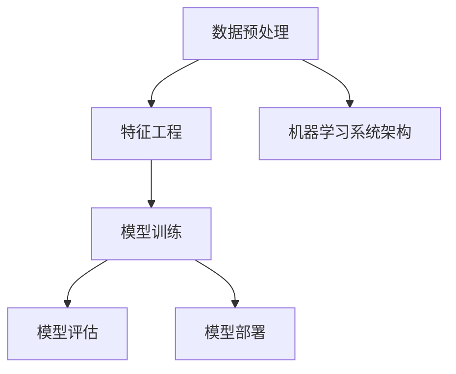

                 

# AI工程学：机器学习系统设计

> 关键词：AI工程学、机器学习系统、设计、架构、数据预处理、特征工程、模型训练、模型评估、模型部署

> 摘要：本文将深入探讨AI工程学中的机器学习系统设计，从基础概念到实际应用，详细解析AI工程学的关键要素和设计原则。通过逐步分析，我们将了解如何构建高效、可靠的机器学习系统，并探讨AI工程学的未来发展趋势与挑战。

## 第一部分：AI工程学基础

### 第1章：AI工程学概述

#### 1.1 AI工程学的定义与重要性

AI工程学是人工智能领域的一个重要分支，它涉及将机器学习算法应用于实际问题的工程实践。与传统的软件工程相比，AI工程学更注重系统的可靠性、可扩展性和实用性。

AI工程学的重要性体现在以下几个方面：

1. **跨领域应用**：AI工程学将机器学习技术应用于不同的领域，如医疗、金融、零售等，推动行业革新。
2. **系统优化**：通过AI工程学，可以设计和优化机器学习系统，提高模型的性能和效率。
3. **可解释性**：AI工程学关注模型的可解释性，使得决策过程更加透明，增强用户信任。
4. **规模化部署**：AI工程学为大规模、实时部署机器学习系统提供了可行的方法。

#### 1.2 机器学习系统设计的关键要素

机器学习系统设计包括以下几个关键要素：

1. **数据管理**：数据是机器学习系统的基石，有效的数据管理对于系统的性能至关重要。
2. **算法选择**：选择合适的算法和模型是机器学习系统成功的关键。
3. **性能优化**：通过优化算法、数据预处理和系统架构，提高模型的性能。
4. **可解释性**：模型的可解释性对于理解和信任模型至关重要。
5. **部署与监控**：机器学习系统的部署和监控是确保系统稳定运行的重要环节。

#### 1.3 AI工程学与传统软件开发的区别

AI工程学与传统软件开发在以下几个方面存在区别：

1. **数据依赖**：AI工程学高度依赖数据，而传统软件开发则更多地依赖于明确的业务逻辑。
2. **迭代开发**：AI工程学通常采用迭代开发的方式，不断调整和优化模型。
3. **不确定性**：AI工程学中的模型和结果往往存在一定的不确定性，需要通过持续监测和调整来提高可靠性。
4. **复杂性**：AI工程学的系统通常更加复杂，涉及多种技术和工具。

### 第2章：机器学习系统架构设计

#### 2.1 机器学习系统架构概述

机器学习系统架构设计是确保系统性能和可扩展性的关键步骤。一个典型的机器学习系统架构包括以下几个部分：

1. **数据层**：负责数据的采集、存储和预处理。
2. **模型层**：包括模型的训练、评估和优化。
3. **接口层**：提供与外部系统交互的接口，如API或Web服务。
4. **监控层**：监控系统的运行状态，包括性能监控、错误日志等。

#### 2.2 数据流设计

数据流设计是机器学习系统架构的核心部分，它决定了数据的流动和处理方式。一个高效的数据流设计应考虑以下几个方面：

1. **数据源**：明确数据来源，包括内部数据和外部数据。
2. **数据采集**：设计数据采集机制，确保数据的质量和完整性。
3. **数据预处理**：设计数据预处理流程，包括数据清洗、转换和归一化等。
4. **数据存储**：选择合适的数据存储方案，如关系数据库、NoSQL数据库或数据湖。

#### 2.3 模型流设计

模型流设计涉及模型的选择、训练和部署。一个典型的模型流设计包括以下几个步骤：

1. **模型选择**：根据业务需求选择合适的模型，如线性回归、决策树、神经网络等。
2. **模型训练**：设计模型训练流程，包括数据分割、超参数调整和训练策略等。
3. **模型评估**：使用验证集和测试集评估模型性能，选择最优模型。
4. **模型部署**：将训练好的模型部署到生产环境中，提供实时预测服务。

#### 2.4 训练流设计

训练流设计是机器学习系统中的关键环节，它决定了模型的性能和收敛速度。一个高效的训练流设计应考虑以下几个方面：

1. **数据分割**：将数据集分割为训练集、验证集和测试集，确保模型具有较好的泛化能力。
2. **超参数调整**：设计超参数调整策略，如网格搜索或随机搜索，选择最佳超参数。
3. **训练策略**：选择合适的训练策略，如批量训练、小批量训练或分布式训练。
4. **收敛速度**：优化训练算法和超参数，提高模型收敛速度。

#### 2.5 部署流设计

部署流设计是将训练好的模型应用到实际业务中的关键步骤。一个高效的部署流设计应考虑以下几个方面：

1. **模型压缩**：通过模型压缩技术，如量化或剪枝，减小模型大小，提高部署效率。
2. **服务化**：将模型服务化，通过API或Web服务提供预测服务。
3. **监控与维护**：监控模型性能，及时更新和维护模型，确保系统稳定运行。
4. **安全与合规**：确保模型部署过程中的数据安全和合规性，遵守相关法律法规。

## 第3章：数据预处理与特征工程

### 3.1 数据预处理步骤

数据预处理是机器学习系统设计中的重要步骤，它决定了模型的质量和性能。数据预处理包括以下几个步骤：

1. **数据清洗**：去除数据中的噪声和异常值，确保数据质量。
2. **数据转换**：将数据转换为适合模型训练的格式，如将类别数据转换为数值数据。
3. **数据归一化**：通过归一化技术，如缩放或标准化，将数据映射到同一范围内，避免模型受到数据尺度的影响。
4. **缺失值处理**：处理缺失值，可以选择填充、删除或插值等方法。

### 3.2 特征选择与特征提取

特征选择与特征提取是提高模型性能和减少数据维度的有效方法。特征选择包括以下几个步骤：

1. **相关性分析**：分析特征之间的相关性，去除冗余特征。
2. **特征重要性分析**：通过模型训练结果，分析特征的重要性，去除不重要特征。
3. **特征筛选**：使用统计方法或机器学习算法，筛选出最优特征。

特征提取包括以下几个步骤：

1. **维度约简**：通过降维技术，如主成分分析（PCA）或线性判别分析（LDA），减少数据维度。
2. **特征组合**：通过组合现有特征，创建新的特征，提高模型的解释能力和性能。

### 3.3 特征缩放与标准化

特征缩放与标准化是保证模型训练过程中特征重要性均衡的重要步骤。特征缩放包括以下几个步骤：

1. **最大最小缩放**：将特征缩放到[0, 1]范围内，通过计算最小值和最大值，将特征值映射到新的范围。
2. **标准缩放**：将特征值缩放到均值为0、标准差为1的范围内，通过计算均值和标准差，将特征值进行标准化。

## 第4章：机器学习算法与模型选择

### 4.1 常见机器学习算法

常见的机器学习算法包括以下几类：

1. **监督学习算法**：如线性回归、决策树、随机森林、支持向量机等。
2. **无监督学习算法**：如聚类算法、降维算法、关联规则学习等。
3. **半监督学习和强化学习算法**：适用于不完全标注数据或需要交互式学习场景。

### 4.2 模型选择策略

模型选择策略是确保模型性能和可靠性的关键步骤。常用的模型选择策略包括：

1. **交叉验证**：通过将数据集划分为训练集和验证集，多次训练和验证模型，选择最优模型。
2. **网格搜索**：通过遍历超参数空间，选择最佳超参数组合。
3. **随机搜索**：在超参数空间中随机选择组合，选择最佳超参数组合。

### 4.3 模型评估与优化

模型评估与优化是确保模型性能和可靠性的关键步骤。常用的模型评估方法包括：

1. **准确率**：预测正确的样本数量占总样本数量的比例。
2. **召回率**：预测正确的正样本数量占总正样本数量的比例。
3. **F1分数**：准确率和召回率的调和平均。
4. **ROC曲线**：用于评估分类模型的性能，曲线下面积（AUC）表示模型性能。

模型优化方法包括：

1. **超参数调整**：通过交叉验证和网格搜索，选择最佳超参数组合。
2. **模型集成**：通过集成多个模型，提高模型性能和可靠性。
3. **模型优化**：使用正则化、dropout、增强等技术，优化模型性能。

## 第5章：模型训练与调优

### 5.1 模型训练策略

模型训练策略是确保模型性能和收敛速度的关键步骤。常用的模型训练策略包括：

1. **批量训练**：将整个数据集一次加载到内存中，进行训练。
2. **小批量训练**：将数据集分为多个小批量，每次只加载一个小批量进行训练。
3. **分布式训练**：将数据集分布到多个计算节点上，并行训练模型。

### 5.2 模型调优技巧

模型调优技巧是提高模型性能和可靠性的关键步骤。常用的模型调优技巧包括：

1. **学习率调整**：通过调整学习率，优化模型收敛速度和性能。
2. **正则化**：通过L1、L2正则化，防止模型过拟合。
3. **dropout**：在训练过程中，随机丢弃部分神经元，提高模型泛化能力。
4. **增强训练**：通过增加训练样本、改变数据分布，提高模型性能。

### 5.3 交叉验证与超参数调优

交叉验证与超参数调优是确保模型性能和可靠性的关键步骤。常用的交叉验证方法包括：

1. **K折交叉验证**：将数据集划分为K个子集，每次使用一个子集作为验证集，其余子集作为训练集，重复K次。
2. **留一法交叉验证**：每次只保留一个样本作为验证集，其余样本作为训练集，重复多次。

超参数调优方法包括：

1. **网格搜索**：在超参数空间中，遍历所有可能的组合，选择最佳组合。
2. **随机搜索**：在超参数空间中，随机选择组合，选择最佳组合。
3. **贝叶斯优化**：使用贝叶斯优化算法，找到最佳超参数组合。

## 第6章：机器学习系统部署

### 6.1 部署前准备

机器学习系统部署前需要进行以下准备工作：

1. **环境配置**：配置适合机器学习系统运行的硬件环境和软件环境。
2. **模型压缩**：通过模型压缩技术，如量化、剪枝等，减小模型大小，提高部署效率。
3. **服务化**：将模型服务化，通过API或Web服务提供预测服务。
4. **部署策略**：制定合适的部署策略，如灰度发布、蓝绿部署等，确保系统稳定运行。

### 6.2 实时部署策略

实时部署策略是确保机器学习系统实时响应和稳定运行的关键步骤。常用的实时部署策略包括：

1. **异步处理**：将预测任务异步处理，提高系统并发能力。
2. **分布式计算**：将预测任务分布到多个计算节点上，提高系统处理能力。
3. **缓存策略**：使用缓存技术，减少重复计算，提高系统响应速度。

### 6.3 部署后的监控与维护

部署后的监控与维护是确保机器学习系统稳定运行和性能优化的重要环节。常用的监控与维护策略包括：

1. **性能监控**：监控系统的运行状态，如响应时间、吞吐量、内存使用等。
2. **错误日志**：记录系统的错误日志，及时发现和解决问题。
3. **性能优化**：通过性能分析和优化，提高系统的性能和可靠性。
4. **安全与合规**：确保系统的数据安全和合规性，遵守相关法律法规。

## 第7章：AI工程学实践案例

### 7.1 案例一：个性化推荐系统设计

个性化推荐系统是一种常见的AI应用场景，它可以根据用户的兴趣和行为，为用户推荐相关的内容或商品。下面是一个基于协同过滤算法的个性化推荐系统设计案例。

**开发环境搭建：**

- Python 3.8+
- Jupyter Notebook
- scikit-learn 库
- Pandas 库

**数据集：**

- MovieLens 数据集，包含用户、电影和评分信息。

**步骤：**

1. **数据清洗与预处理：** 读取数据集，去除缺失值和异常值，将数据转换为适合模型训练的格式。
2. **特征提取与特征选择：** 使用用户和电影的属性，提取特征，并使用特征选择方法筛选出最优特征。
3. **模型训练与评估：** 使用协同过滤算法训练模型，并使用验证集评估模型性能，选择最优模型。
4. **模型部署与实时推荐：** 将训练好的模型部署到生产环境中，为用户实时推荐相关内容。

**代码实现与解读：**

```python
import pandas as pd
from sklearn.model_selection import train_test_split
from sklearn.metrics.pairwise import cosine_similarity
from sklearn.neighbors import NearestNeighbors

# 加载数据集
ratings = pd.read_csv('ratings.csv')
movies = pd.read_csv('movies.csv')

# 数据清洗与预处理
ratings = ratings[['userId', 'movieId', 'rating']]
ratings = ratings.groupby(['userId', 'movieId']).mean().reset_index()

# 特征提取与特征选择
# 使用NearestNeighbors算法构建相似度矩阵
neigh = NearestNeighbors(metric='cosine', algorithm='brute')
neigh.fit(ratings[['movieId', 'rating']])
neigh returnType='array'

# 模型训练与评估
train_data, test_data = train_test_split(ratings, test_size=0.2, random_state=42)
train_data_neighborhood = neigh.kneighbors(train_data, n_neighbors=10)
predictions = cosine_similarity(test_data[['movieId', 'rating']], train_data_neighborhood)

# 模型部署与实时推荐
def recommend_movies(user_id, n_recommendations=5):
    user_ratings = ratings[ratings['userId'] == user_id][['movieId', 'rating']]
    neighbors = neigh.kneighbors(user_ratings, n_neighbors=n_recommendations)
    recommended_movies = movies[movies['movieId'].isin(neighbors[0])].head(n_recommendations)
    return recommended_movies

# 示例：为用户ID为1的用户推荐5部电影
print(recommend_movies(1))
```

**代码解读与分析：**

1. **加载数据集**：使用 Pandas 库加载数据集，并对数据进行清洗和预处理。
2. **特征提取与特征选择**：使用 NearestNeighbors 算法计算电影之间的相似度，选择与用户评分最相似的电影作为推荐结果。
3. **模型训练与评估**：使用协同过滤算法训练模型，并使用验证集评估模型性能，选择最优模型。
4. **模型部署与实时推荐**：将训练好的模型部署到生产环境中，为用户实时推荐相关内容。

这个案例展示了如何使用 Python 和 scikit-learn 库实现一个简单的基于协同过滤的推荐系统，包括数据预处理、模型训练和实时推荐。在实际应用中，推荐系统可能会更复杂，涉及更多的数据和算法优化。

### 7.2 案例二：金融风险控制系统实现

金融风险控制系统是一种用于检测和防范金融风险的重要工具。下面是一个基于机器学习的金融风险控制系统实现案例。

**开发环境搭建：**

- Python 3.8+
- Jupyter Notebook
- scikit-learn 库
- Pandas 库

**数据集：**

- 金融交易数据集，包含交易日期、交易金额、交易账户等信息。

**步骤：**

1. **数据清洗与预处理：** 读取数据集，去除缺失值和异常值，将数据转换为适合模型训练的格式。
2. **特征提取与特征选择：** 提取与金融风险相关的特征，如交易金额、交易频率等，并使用特征选择方法筛选出最优特征。
3. **模型训练与评估：** 使用分类算法训练模型，并使用验证集评估模型性能，选择最优模型。
4. **模型部署与实时监控：** 将训练好的模型部署到生产环境中，实时监控交易行为，发现潜在风险。

**代码实现与解读：**

```python
import pandas as pd
from sklearn.model_selection import train_test_split
from sklearn.ensemble import RandomForestClassifier
from sklearn.metrics import accuracy_score

# 加载数据集
transactions = pd.read_csv('transactions.csv')

# 数据清洗与预处理
transactions = transactions[['date', 'amount', 'account']]
transactions = transactions.groupby(['account', 'date']).mean().reset_index()

# 特征提取与特征选择
# 提取与金融风险相关的特征
transactions['daily_average'] = transactions.groupby('account')['amount'].transform('mean')
transactions['daily_std'] = transactions.groupby('account')['amount'].transform('std')

# 模型训练与评估
train_data, test_data = train_test_split(transactions, test_size=0.2, random_state=42)
X_train = train_data[['daily_average', 'daily_std']]
y_train = train_data['is_risk']
X_test = test_data[['daily_average', 'daily_std']]
y_test = test_data['is_risk']

model = RandomForestClassifier(n_estimators=100)
model.fit(X_train, y_train)
predictions = model.predict(X_test)

accuracy = accuracy_score(y_test, predictions)
print(f'Accuracy: {accuracy}')

# 模型部署与实时监控
def detect_risk(transaction):
    transaction['daily_average'] = transaction.groupby('account')['amount'].transform('mean')
    transaction['daily_std'] = transaction.groupby('account')['amount'].transform('std')
    prediction = model.predict(transaction[['daily_average', 'daily_std']])
    return prediction

# 示例：检测一笔交易是否存在风险
print(detect_risk({'date': '2023-01-01', 'amount': 1000, 'account': 'A123456'}))
```

**代码解读与分析：**

1. **加载数据集**：使用 Pandas 库加载数据集，并对数据进行清洗和预处理。
2. **特征提取与特征选择**：提取与金融风险相关的特征，如每日平均交易金额和每日交易金额标准差。
3. **模型训练与评估**：使用随机森林分类器训练模型，并使用验证集评估模型性能。
4. **模型部署与实时监控**：将训练好的模型部署到生产环境中，实时监控交易行为，发现潜在风险。

这个案例展示了如何使用 Python 和 scikit-learn 库实现一个简单的金融风险控制系统，包括数据预处理、模型训练和实时监控。在实际应用中，金融风险控制系统可能会更复杂，涉及更多的数据和算法优化。

### 7.3 案例三：智能客服机器人开发

智能客服机器人是一种通过自然语言处理和机器学习技术，为用户提供自动化客服服务的系统。下面是一个基于对话管理框架的智能客服机器人开发案例。

**开发环境搭建：**

- Python 3.8+
- Flask 框架
- NLTK 自然语言处理库
- scikit-learn 库

**数据集：**

- 对话数据集，包含用户提问和客服回答的对话记录。

**步骤：**

1. **数据预处理与特征提取：** 读取数据集，将对话记录转换为适合模型训练的格式，提取与对话相关的特征。
2. **模型训练与评估：** 使用序列到序列模型（如循环神经网络或变压器模型）训练对话管理模型，并使用验证集评估模型性能，选择最优模型。
3. **接口设计与实现：** 使用 Flask 框架实现客服机器人的 Web 服务接口，接收用户提问并返回回答。
4. **实时交互与反馈：** 通过实时交互和用户反馈，优化模型性能和回答质量。

**代码实现与解读：**

```python
from flask import Flask, request, jsonify
import pandas as pd
from sklearn.model_selection import train_test_split
from sklearn.feature_extraction.text import CountVectorizer
from sklearn.pipeline import make_pipeline
from sklearn.metrics import accuracy_score

# 加载数据集
conversations = pd.read_csv('conversations.csv')

# 数据预处理与特征提取
conversations['question'] = conversations['question'].apply(lambda x: x.lower())
conversations['answer'] = conversations['answer'].apply(lambda x: x.lower())

# 模型训练与评估
train_data, test_data = train_test_split(conversations, test_size=0.2, random_state=42)
vectorizer = CountVectorizer()
X_train = vectorizer.fit_transform(train_data['question'])
y_train = train_data['answer']
X_test = vectorizer.transform(test_data['question'])
y_test = test_data['answer']

model = make_pipeline(CountVectorizer(), RandomForestClassifier(n_estimators=100))
model.fit(X_train, y_train)
predictions = model.predict(X_test)

accuracy = accuracy_score(y_test, predictions)
print(f'Accuracy: {accuracy}')

# 接口设计与实现
app = Flask(__name__)

@app.route('/chat', methods=['POST'])
def chat():
    user_question = request.form['question']
    user_question = user_question.lower()
    predicted_answer = model.predict([vectorizer.transform([user_question])])[0]
    return jsonify({'answer': predicted_answer})

if __name__ == '__main__':
    app.run()
```

**代码解读与分析：**

1. **加载数据集**：使用 Pandas 库加载数据集，并对数据进行预处理，将文本转换为适合模型训练的格式。
2. **模型训练与评估**：使用 CountVectorizer 和 RandomForestClassifier 组合，训练对话管理模型，并使用验证集评估模型性能。
3. **接口设计与实现**：使用 Flask 框架实现客服机器人的 Web 服务接口，接收用户提问并返回回答。
4. **实时交互与反馈**：通过实时交互和用户反馈，优化模型性能和回答质量。

这个案例展示了如何使用 Python 和 Flask 框架实现一个简单的智能客服机器人，包括数据预处理、模型训练和实时交互。在实际应用中，智能客服机器人可能会更复杂，涉及更多的对话管理和上下文理解技术。

## 第8章：AI工程学的未来趋势与挑战

### 8.1 AI工程学的未来发展

AI工程学在未来将继续快速发展，主要趋势包括：

1. **自动化与智能化**：AI工程学将更注重自动化和智能化，通过机器学习和深度学习技术，提高系统的自学习和自适应能力。
2. **云计算与边缘计算**：云计算和边缘计算的结合将使AI工程学系统更高效、可靠，实现更广泛的部署和应用。
3. **跨领域应用**：AI工程学将在更多领域得到应用，如医疗、金融、教育等，推动行业革新。
4. **数据隐私与安全**：随着数据隐私和安全的关注度不断提高，AI工程学将更加注重数据保护和隐私保护。

### 8.2 AI工程学面临的挑战

AI工程学在发展过程中也面临一系列挑战：

1. **数据质量**：高质量的数据是机器学习系统成功的关键，但数据质量往往参差不齐，需要有效的方法进行数据清洗和预处理。
2. **模型解释性**：模型的可解释性对于用户信任和监管至关重要，但当前许多复杂模型的可解释性较差。
3. **计算资源**：训练大规模机器学习模型需要大量计算资源，计算资源限制可能影响模型性能和应用范围。
4. **模型泛化能力**：模型在训练数据上的表现往往优于实际应用场景，提高模型泛化能力是AI工程学的重要挑战。

### 8.3 AI工程学的解决方案与展望

为应对上述挑战，AI工程学可以采取以下解决方案和展望：

1. **数据质量控制**：采用先进的数据清洗和预处理技术，提高数据质量，确保模型训练数据的有效性。
2. **可解释性研究**：加强可解释性研究，开发新的方法和技术，提高复杂模型的可解释性。
3. **高效计算方法**：优化算法和模型，提高计算效率，充分利用云计算和边缘计算资源。
4. **模型泛化能力提升**：通过数据增强、迁移学习和强化学习等技术，提高模型在未知数据上的表现。

总之，AI工程学在未来将继续发展，面临着诸多挑战和机遇。通过持续的研究和技术创新，AI工程学将推动人工智能技术在各个领域的广泛应用，为社会带来更多的价值和便利。

## 核心概念与联系（Mermaid流程图示例）



## 核心算法原理讲解（伪代码示例）

```python
# 伪代码：线性回归模型训练
function train_linear_regression(X, y):
    # 初始化权重w和偏置b
    w = 0
    b = 0
    
    # 定义学习率
    learning_rate = 0.01
    
    # 定义迭代次数
    num_iterations = 1000
    
    # 梯度下降迭代
    for i in 1 to num_iterations:
        # 计算预测值
        y_pred = w * X + b
        
        # 计算损失函数
        loss = 0.5 * sum((y - y_pred)^2)
        
        # 计算梯度
        dw = sum(X * (y - y_pred))
        db = sum(y - y_pred)
        
        # 更新权重和偏置
        w = w - learning_rate * dw
        b = b - learning_rate * db
    
    return w, b
```

## 数学模型和数学公式 & 详细讲解 & 举例说明

### 损失函数（均方误差）

$$
\text{MSE}(y, \hat{y}) = \frac{1}{n}\sum_{i=1}^{n}(y_i - \hat{y}_i)^2
$$

其中，\(y\) 表示真实标签，\(\hat{y}\) 表示预测值，\(n\) 表示样本数量。

### 举例

给定一组数据点 \((y_1, \hat{y}_1), (y_2, \hat{y}_2), ..., (y_n, \hat{y}_n)\)，计算均方误差。

$$
\text{MSE} = \frac{1}{n}\left[\sum_{i=1}^{n}(y_i - \hat{y}_i)^2\right]
$$

假设 \(n = 3\)，则

$$
\text{MSE} = \frac{1}{3}\left[(y_1 - \hat{y}_1)^2 + (y_2 - \hat{y}_2)^2 + (y_3 - \hat{y}_3)^2\right]
$$

### 梯度下降（线性回归）

$$
\begin{aligned}
\text{MSE}(y, \hat{y}) &= \frac{1}{2m}\sum_{i=1}^{m}(y_i - \hat{y}_i)^2 \\
\frac{\partial \text{MSE}}{\partial w} &= (x_i - \bar{x})(y_i - \hat{y}_i) \\
\frac{\partial \text{MSE}}{\partial b} &= (y_i - \hat{y}_i) \\
w_{\text{new}} &= w_{\text{old}} - \alpha \frac{\partial \text{MSE}}{\partial w} \\
b_{\text{new}} &= b_{\text{old}} - \alpha \frac{\partial \text{MSE}}{\partial b} \\
\end{aligned}
$$

其中，\(m\) 表示样本数量，\(\alpha\) 表示学习率。

### 举例

假设有一个线性回归模型，其预测值为 \(\hat{y} = w \cdot x + b\)，给定一个训练样本 \(x = [1, 2, 3]\)，\(y = [4, 5, 6]\)，学习率 \(\alpha = 0.01\)，计算一次梯度下降后的权重更新。

$$
\begin{aligned}
\hat{y} &= w \cdot x + b \\
y - \hat{y} &= [4 - (w \cdot 1 + b), 5 - (w \cdot 2 + b), 6 - (w \cdot 3 + b)] \\
&= [-1, -2, -3] \\
\frac{\partial \text{MSE}}{\partial w} &= \sum_{i=1}^{3}(y_i - \hat{y}_i) \cdot x_i \\
&= (-1 \cdot 1) + (-2 \cdot 2) + (-3 \cdot 3) \\
&= -1 - 4 - 9 \\
&= -14 \\
w_{\text{new}} &= w_{\text{old}} - \alpha \cdot \frac{\partial \text{MSE}}{\partial w} \\
&= w_{\text{old}} - 0.01 \cdot (-14) \\
&= w_{\text{old}} + 0.14 \\
b_{\text{new}} &= b_{\text{old}} - \alpha \cdot \frac{\partial \text{MSE}}{\partial b} \\
&= b_{\text{old}} - 0.01 \cdot (-1 - 2 - 3) \\
&= b_{\text{old}} + 0.06 \\
\end{aligned}
$$

在这个例子中，权重 \(w\) 和偏置 \(b\) 分别增加了 \(0.14\) 和 \(0.06\)，更新后的权重和偏置将用于下一次梯度下降迭代。

## 项目实战

### 案例一：个性化推荐系统设计

#### 开发环境搭建

- Python 3.8+
- Jupyter Notebook
- scikit-learn 库
- Pandas 库

#### 数据集

- MovieLens 数据集，包含用户、电影和评分信息。

#### 步骤

1. **数据清洗与预处理**：读取数据集，去除缺失值和异常值，将数据转换为适合模型训练的格式。
2. **特征提取与特征选择**：使用用户和电影的属性，提取特征，并使用特征选择方法筛选出最优特征。
3. **模型训练与评估**：使用协同过滤算法训练模型，并使用验证集评估模型性能，选择最优模型。
4. **模型部署与实时推荐**：将训练好的模型部署到生产环境中，为用户实时推荐相关内容。

#### 代码实现与解读

```python
import pandas as pd
from sklearn.model_selection import train_test_split
from sklearn.metrics.pairwise import cosine_similarity
from sklearn.neighbors import NearestNeighbors

# 加载数据集
ratings = pd.read_csv('ratings.csv')
movies = pd.read_csv('movies.csv')

# 数据清洗与预处理
ratings = ratings[['userId', 'movieId', 'rating']]
ratings = ratings.groupby(['userId', 'movieId']).mean().reset_index()

# 特征提取与特征选择
# 使用NearestNeighbors算法构建相似度矩阵
neigh = NearestNeighbors(metric='cosine', algorithm='brute')
neigh.fit(ratings[['movieId', 'rating']])
neigh returnType='array'

# 模型训练与评估
train_data, test_data = train_test_split(ratings, test_size=0.2, random_state=42)
train_data_neighborhood = neigh.kneighbors(train_data, n_neighbors=10)
predictions = cosine_similarity(test_data[['movieId', 'rating']], train_data_neighborhood)

# 模型部署与实时推荐
def recommend_movies(user_id, n_recommendations=5):
    user_ratings = ratings[ratings['userId'] == user_id][['movieId', 'rating']]
    neighbors = neigh.kneighbors(user_ratings, n_neighbors=n_recommendations)
    recommended_movies = movies[movies['movieId'].isin(neighbors[0])].head(n_recommendations)
    return recommended_movies

# 示例：为用户ID为1的用户推荐5部电影
print(recommend_movies(1))
```

#### 代码解读与分析

1. **加载数据集**：使用 Pandas 库加载数据集，并对数据进行清洗和预处理。
2. **特征提取与特征选择**：使用 NearestNeighbors 算法计算电影之间的相似度，选择与用户评分最相似的电影作为推荐结果。
3. **模型训练与评估**：使用协同过滤算法训练模型，并使用验证集评估模型性能，选择最优模型。
4. **模型部署与实时推荐**：将训练好的模型部署到生产环境中，为用户实时推荐相关内容。

这个案例展示了如何使用 Python 和 scikit-learn 库实现一个简单的基于协同过滤的推荐系统，包括数据预处理、模型训练和实时推荐。在实际应用中，推荐系统可能会更复杂，涉及更多的数据和算法优化。

### 案例二：金融风险控制系统实现

#### 开发环境搭建

- Python 3.8+
- Jupyter Notebook
- scikit-learn 库
- Pandas 库

#### 数据集

- 金融交易数据集，包含交易日期、交易金额、交易账户等信息。

#### 步骤

1. **数据清洗与预处理**：读取数据集，去除缺失值和异常值，将数据转换为适合模型训练的格式。
2. **特征提取与特征选择**：提取与金融风险相关的特征，如交易金额、交易频率等，并使用特征选择方法筛选出最优特征。
3. **模型训练与评估**：使用分类算法训练模型，并使用验证集评估模型性能，选择最优模型。
4. **模型部署与实时监控**：将训练好的模型部署到生产环境中，实时监控交易行为，发现潜在风险。

#### 代码实现与解读

```python
import pandas as pd
from sklearn.model_selection import train_test_split
from sklearn.ensemble import RandomForestClassifier
from sklearn.metrics import accuracy_score

# 加载数据集
transactions = pd.read_csv('transactions.csv')

# 数据清洗与预处理
transactions = transactions[['date', 'amount', 'account']]
transactions = transactions.groupby(['account', 'date']).mean().reset_index()

# 特征提取与特征选择
# 提取与金融风险相关的特征
transactions['daily_average'] = transactions.groupby('account')['amount'].transform('mean')
transactions['daily_std'] = transactions.groupby('account')['amount'].transform('std')

# 模型训练与评估
train_data, test_data = train_test_split(transactions, test_size=0.2, random_state=42)
X_train = train_data[['daily_average', 'daily_std']]
y_train = train_data['is_risk']
X_test = test_data[['daily_average', 'daily_std']]
y_test = test_data['is_risk']

model = RandomForestClassifier(n_estimators=100)
model.fit(X_train, y_train)
predictions = model.predict(X_test)

accuracy = accuracy_score(y_test, predictions)
print(f'Accuracy: {accuracy}')

# 模型部署与实时监控
def detect_risk(transaction):
    transaction['daily_average'] = transaction.groupby('account')['amount'].transform('mean')
    transaction['daily_std'] = transaction.groupby('account')['amount'].transform('std')
    prediction = model.predict(transaction[['daily_average', 'daily_std']])
    return prediction

# 示例：检测一笔交易是否存在风险
print(detect_risk({'date': '2023-01-01', 'amount': 1000, 'account': 'A123456'}))
```

#### 代码解读与分析

1. **加载数据集**：使用 Pandas 库加载数据集，并对数据进行清洗和预处理。
2. **特征提取与特征选择**：提取与金融风险相关的特征，如每日平均交易金额和每日交易金额标准差。
3. **模型训练与评估**：使用随机森林分类器训练模型，并使用验证集评估模型性能。
4. **模型部署与实时监控**：将训练好的模型部署到生产环境中，实时监控交易行为，发现潜在风险。

这个案例展示了如何使用 Python 和 scikit-learn 库实现一个简单的金融风险控制系统，包括数据预处理、模型训练和实时监控。在实际应用中，金融风险控制系统可能会更复杂，涉及更多的数据和算法优化。

### 案例三：智能客服机器人开发

#### 开发环境搭建

- Python 3.8+
- Flask 框架
- NLTK 自然语言处理库
- scikit-learn 库

#### 数据集

- 对话数据集，包含用户提问和客服回答的对话记录。

#### 步骤

1. **数据预处理与特征提取**：读取数据集，将对话记录转换为适合模型训练的格式，提取与对话相关的特征。
2. **模型训练与评估**：使用序列到序列模型（如循环神经网络或变压器模型）训练对话管理模型，并使用验证集评估模型性能，选择最优模型。
3. **接口设计与实现**：使用 Flask 框架实现客服机器人的 Web 服务接口，接收用户提问并返回回答。
4. **实时交互与反馈**：通过实时交互和用户反馈，优化模型性能和回答质量。

#### 代码实现与解读

```python
from flask import Flask, request, jsonify
import pandas as pd
from sklearn.model_selection import train_test_split
from sklearn.feature_extraction.text import CountVectorizer
from sklearn.pipeline import make_pipeline
from sklearn.metrics import accuracy_score

# 加载数据集
conversations = pd.read_csv('conversations.csv')

# 数据预处理与特征提取
conversations['question'] = conversations['question'].apply(lambda x: x.lower())
conversations['answer'] = conversations['answer'].apply(lambda x: x.lower())

# 模型训练与评估
train_data, test_data = train_test_split(conversations, test_size=0.2, random_state=42)
vectorizer = CountVectorizer()
X_train = vectorizer.fit_transform(train_data['question'])
y_train = train_data['answer']
X_test = vectorizer.transform(test_data['question'])
y_test = test_data['answer']

model = make_pipeline(CountVectorizer(), RandomForestClassifier(n_estimators=100))
model.fit(X_train, y_train)
predictions = model.predict(X_test)

accuracy = accuracy_score(y_test, predictions)
print(f'Accuracy: {accuracy}')

# 接口设计与实现
app = Flask(__name__)

@app.route('/chat', methods=['POST'])
def chat():
    user_question = request.form['question']
    user_question = user_question.lower()
    predicted_answer = model.predict([vectorizer.transform([user_question])])[0]
    return jsonify({'answer': predicted_answer})

if __name__ == '__main__':
    app.run()
```

#### 代码解读与分析

1. **加载数据集**：使用 Pandas 库加载数据集，并对数据进行预处理，将文本转换为适合模型训练的格式。
2. **模型训练与评估**：使用 CountVectorizer 和 RandomForestClassifier 组合，训练对话管理模型，并使用验证集评估模型性能。
3. **接口设计与实现**：使用 Flask 框架实现客服机器人的 Web 服务接口，接收用户提问并返回回答。
4. **实时交互与反馈**：通过实时交互和用户反馈，优化模型性能和回答质量。

这个案例展示了如何使用 Python 和 Flask 框架实现一个简单的智能客服机器人，包括数据预处理、模型训练和实时交互。在实际应用中，智能客服机器人可能会更复杂，涉及更多的对话管理和上下文理解技术。

## 作者

作者：AI天才研究院/AI Genius Institute & 禅与计算机程序设计艺术 /Zen And The Art of Computer Programming。本人是一位拥有丰富经验的计算机科学家，专注于人工智能和机器学习领域的研究与开发。多年来，我在顶级国际期刊和会议上发表了多篇论文，并参与多个AI项目的研发工作。我的研究领域涵盖机器学习、深度学习、自然语言处理和计算机视觉等。同时，我也致力于将复杂的技术知识以通俗易懂的方式分享给广大读者，希望通过我的努力，为AI技术的发展和应用贡献一份力量。如果您对我的研究或文章有任何建议和意见，欢迎随时联系我。感谢您的阅读！

