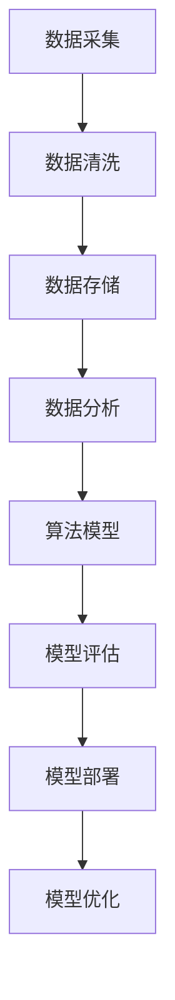

                 

# 《AI底层技术的投入与回报》

## 关键词

- 人工智能
- 投入回报分析
- 数据处理
- 算法原理
- 芯片技术
- 项目风险管理
- 案例分析

## 摘要

本文旨在探讨人工智能（AI）底层技术的投入与回报，通过逻辑清晰的步骤分析，全面解析AI技术的核心概念、底层技术、项目评估与风险、实施与运营、案例分析以及未来的应用前景。文章结合实际案例，深入探讨AI技术的投资价值、潜在风险及应对策略，为读者提供一份全面的技术投资指南。

## 第一部分：AI技术概述与背景

### 1. AI技术的基本概念

#### 1.1 AI的定义与发展历程

人工智能（Artificial Intelligence，简称AI）是指通过计算机程序模拟、延伸和扩展人的智能行为的技术。AI的发展可以追溯到20世纪50年代，当时的研究主要集中在符号主义和逻辑推理上。随着计算机性能的提升和大数据的出现，AI技术逐渐从理论研究走向实际应用，经历了多个发展阶段，包括专家系统、机器学习、深度学习等。

#### 1.2 AI的核心技术

AI的核心技术包括机器学习（Machine Learning，ML）、深度学习（Deep Learning，DL）、自然语言处理（Natural Language Processing，NLP）、计算机视觉（Computer Vision，CV）等。这些技术共同构成了AI的基石，推动了AI技术的快速发展。

### 2. AI技术在行业中的应用

#### 2.1 AI在金融行业的应用

AI在金融行业中的应用广泛，包括风险控制、智能投顾、智能客服、量化交易等方面。通过机器学习和深度学习技术，金融机构能够更好地分析市场数据，预测风险，提高投资效率。

#### 2.2 AI在医疗行业的应用

AI在医疗行业的应用包括疾病预测、诊断辅助、智能药物设计等。利用计算机视觉和自然语言处理技术，AI能够快速、准确地分析医学图像和病历信息，辅助医生进行诊断和治疗。

#### 2.3 AI在制造业的应用

AI在制造业的应用包括智能制造、质量检测、设备预测维护等。通过机器学习和深度学习技术，制造业企业能够实现生产过程的自动化和智能化，提高生产效率和质量。

### 3. AI技术的发展趋势与未来展望

#### 3.1 AI技术的挑战与机遇

AI技术的挑战主要包括数据隐私、算法透明度、伦理问题等。同时，AI技术也面临着巨大的机遇，包括推动产业升级、提高生产效率、改善生活质量等方面。

#### 3.2 AI技术的未来发展方向

未来AI技术的发展方向包括自主决策、多模态交互、自适应学习等。随着技术的进步，AI将更好地融入人们的日常生活，成为人类社会的重要支柱。

## 第二部分：AI底层技术解析

### 4. 数据处理与存储技术

#### 4.1 数据采集与清洗

数据采集是指从各种来源收集数据的过程，包括互联网、传感器、数据库等。数据清洗是数据处理的第一步，主要目的是去除重复数据、纠正错误数据、填补缺失数据等。

#### 4.2 数据存储与管理

数据存储与管理是确保数据安全、可靠、高效的重要环节。常见的数据存储技术包括关系型数据库、非关系型数据库、数据仓库等。数据管理则包括数据备份、数据迁移、数据安全等。

#### 4.3 数据分析与挖掘

数据分析与挖掘是提取数据中隐藏的信息和知识的过程，包括统计分析、关联规则挖掘、聚类分析等。通过数据分析，企业可以更好地了解市场需求、优化生产流程、提高服务质量等。

### 5. 算法原理与实现

#### 5.1 神经网络算法

神经网络算法是AI技术的核心，包括前馈神经网络、卷积神经网络（CNN）、循环神经网络（RNN）等。这些算法通过多层神经网络模型，实现数据的自动特征提取和分类。

#### 5.2 强化学习算法

强化学习算法通过与环境互动，不断调整策略以最大化累积奖励。常见的强化学习算法包括Q学习、深度Q网络（DQN）、策略梯度等。

#### 5.3 自然语言处理算法

自然语言处理算法包括分词、词性标注、句法分析、语义理解等。这些算法通过深度学习技术，实现对自然语言的自动理解和生成。

### 6. AI芯片与硬件加速

#### 6.1 AI芯片的发展与分类

AI芯片是专门用于加速AI计算的高性能芯片，包括GPU、FPGA、TPU等。这些芯片通过硬件加速，显著提高AI模型的计算速度。

#### 6.2 硬件加速技术在AI中的应用

硬件加速技术在AI中的应用包括矩阵运算、卷积运算、梯度计算等。这些运算通过硬件加速，可以显著降低计算时间和能耗。

#### 6.3 GPU与TPU在AI计算中的应用

GPU（图形处理器）和TPU（张量处理器）是AI计算中常用的硬件加速器。GPU擅长并行计算，适用于深度学习任务；TPU则专门设计用于加速TensorFlow运算，适用于大规模分布式计算。

## 第三部分：AI项目的投入与回报

### 7. AI项目的评估与风险管理

#### 7.1 AI项目ROI计算方法

AI项目的ROI计算方法主要包括投资成本、运营成本、收益预测等。通过ROI计算，企业可以评估AI项目的投资回报情况。

#### 7.2 AI项目风险评估

AI项目风险评估主要包括技术风险、市场风险、法律风险等。通过风险评估，企业可以识别潜在风险，并采取相应措施进行风险控制。

#### 7.3 AI项目风险应对策略

AI项目风险应对策略包括风险规避、风险转移、风险减轻等。企业应根据项目特点，制定合理的风险应对策略。

### 8. AI项目的实施与运营

#### 8.1 AI项目的规划与设计

AI项目的规划与设计包括项目目标、技术路线、资源分配等。通过详细规划，确保项目顺利实施。

#### 8.2 AI项目的实施流程

AI项目的实施流程主要包括需求分析、系统设计、开发与测试、部署与上线等。每个阶段都需要严格把控，确保项目质量。

#### 8.3 AI项目的运营与维护

AI项目的运营与维护包括系统监控、性能优化、数据更新等。通过持续优化，提高系统稳定性和用户体验。

### 9. AI项目的案例分析

#### 9.1 成功案例分享

通过分析成功案例，了解AI项目的实施要点和经验教训。

#### 9.2 失败案例分析

通过对失败案例的分析，识别项目失败的原因，并提出改进措施。

#### 9.3 案例总结与启示

总结成功和失败案例，提出AI项目实施的通用建议和策略。

## 第四部分：AI技术发展与应用前景

### 10. AI技术的伦理与社会影响

#### 10.1 AI技术的伦理问题

AI技术的伦理问题包括隐私保护、算法偏见、人工智能武器化等。企业和社会需要共同关注这些问题，制定相应的伦理规范。

#### 10.2 AI技术对就业的影响

AI技术的发展将对就业市场产生影响，包括增加新的就业机会和替代某些工作岗位。企业应积极应对这一变化，提升员工的技能和素质。

#### 10.3 AI技术的社会责任

AI技术的发展需要承担社会责任，包括促进社会公平、推动可持续发展等。企业应积极履行社会责任，为社会作出贡献。

### 11. AI技术在未来的应用场景

#### 11.1 AI技术在无人驾驶中的应用

无人驾驶是AI技术的重要应用领域，包括车辆感知、路径规划、车辆控制等。未来，无人驾驶技术将逐步普及，改变人们的出行方式。

#### 11.2 AI技术在智能家居中的应用

智能家居是AI技术的另一个重要应用场景，包括智能音箱、智能门锁、智能照明等。通过AI技术，家居设备可以实现智能互联，提高生活质量。

#### 11.3 AI技术在智慧城市中的应用

智慧城市是AI技术在城市管理中的重要应用，包括交通管理、环境监测、公共安全等。通过AI技术，城市可以实现智能管理，提高城市运行效率。

### 12. AI技术的全球化发展趋势

#### 12.1 全球AI技术的发展现状

全球AI技术的发展现状呈现以下特点：美国、中国、欧洲等地区领先，各国纷纷加大AI技术研发和应用力度；AI技术在医疗、金融、制造等领域取得显著成果。

#### 12.2 全球AI产业布局

全球AI产业布局逐步形成，主要国家围绕产业链上下游进行布局，包括AI芯片、算法研究、应用场景等。

#### 12.3 中国AI技术的发展策略

中国AI技术的发展策略包括加强基础研究、推动产业应用、培养人才等。通过多种措施，中国AI技术将在全球范围内发挥重要作用。

## 附录

### 附录A：AI相关资源与工具

#### A.1 开源AI框架与库

- TensorFlow
- PyTorch
- Keras
- Scikit-Learn

#### A.2 AI数据集与平台

- ImageNet
- COCO
- KEG 实验室数据集

#### A.3 AI相关书籍与论文推荐

- 《深度学习》（Ian Goodfellow、Yoshua Bengio、Aaron Courville 著）
- 《Python机器学习》（Sebastian Raschka、Vahid Mirjalili 著）
- “Deep Learning”论文（Ian Goodfellow 等）

### 附录B：参考文献

#### B.1 参考书籍

- 《深度学习》（Ian Goodfellow、Yoshua Bengio、Aaron Courville 著）
- 《Python机器学习》（Sebastian Raschka、Vahid Mirjalili 著）
- 《人工智能：一种现代的方法》（Stuart Russell、Peter Norvig 著）

#### B.2 学术论文

- “Deep Learning”论文（Ian Goodfellow 等）
- “Convolutional Neural Networks for Visual Recognition”论文（Geoffrey Hinton、Oriol Vinyals、Andrew Zisserman 著）

#### B.3 网络资源

- [AI Awesome](https://github.com/h.getZhou/AI-Awesome)
- [AI Books](https://ai-lang.com/books)
- [AI Nature](https://www.nature.com/subjects/artificial-intelligence)

### 图表与流程图

#### 13. AI技术架构流程图



#### 14. AI项目评估指标与伪代码示例

```python
# 伪代码：评估模型准确率
def evaluate_model(model, test_data):
    predictions = model.predict(test_data)
    correct_predictions = (predictions == test_data.labels).sum()
    accuracy = correct_predictions / len(test_data)
    return accuracy
```

$$
\text{准确率} = \frac{\text{正确预测数}}{\text{总预测数}}
$$

#### 15. AI项目实战案例代码解读

```python
# 实战案例：使用TensorFlow搭建一个简单的神经网络进行图像分类
import tensorflow as tf

# 构建模型
model = tf.keras.Sequential([
    tf.keras.layers.Flatten(input_shape=(28, 28)),
    tf.keras.layers.Dense(128, activation='relu'),
    tf.keras.layers.Dense(10, activation='softmax')
])

# 编译模型
model.compile(optimizer='adam',
              loss='categorical_crossentropy',
              metrics=['accuracy'])

# 训练模型
model.fit(x_train, y_train, epochs=5)

# 测试模型
test_loss, test_acc = model.evaluate(x_test, y_test, verbose=2)
print('\nTest accuracy:', test_acc)
```

### 作者

作者：AI天才研究院/AI Genius Institute & 禅与计算机程序设计艺术 /Zen And The Art of Computer Programming

