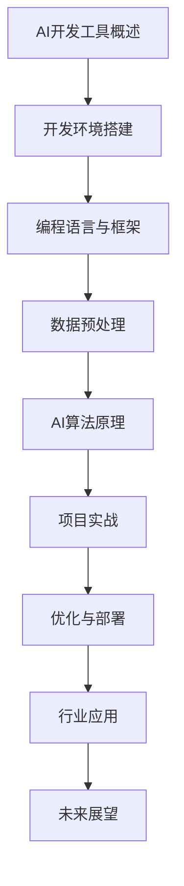

                 

### 《AI开发工具》

> 关键词：人工智能开发、工具、编程语言、框架、数据预处理、算法、应用

> 摘要：本文旨在深入探讨人工智能（AI）开发工具的各个方面，从基础概念到高级应用，涵盖编程语言、开发框架、数据预处理、算法原理和实战案例，帮助读者全面了解AI开发工具的原理、应用和实践。通过本文，读者可以掌握AI开发工具的核心技术和实践方法，为未来的AI项目打下坚实基础。

### 《AI开发工具》的目录大纲

#### 第一部分：AI开发工具基础

**第1章：AI开发工具概述**

- 1.1 AI开发工具的背景和重要性
- 1.2 AI开发工具的分类
- 1.3 AI开发工具的发展趋势

**第2章：AI开发环境的搭建**

- 2.1 操作系统与硬件环境
- 2.2 编译器和解释器
- 2.3 开发工具包与库

**第3章：编程语言与框架**

- 3.1 Python编程基础
- 3.2 常见AI开发框架
  - TensorFlow
  - PyTorch
  - Keras
- 3.3 其他编程语言框架

**第4章：AI数据预处理**

- 4.1 数据获取与清洗
- 4.2 数据可视化
- 4.3 特征提取与工程

**第5章：AI算法原理**

- 5.1 神经网络
  - 5.1.1 前馈神经网络
  - 5.1.2 卷积神经网络（CNN）
  - 5.1.3 循环神经网络（RNN）
- 5.2 深度学习
  - 5.2.1 深度学习的数学基础
  - 5.2.2 深度学习优化算法
- 5.3 其他算法

**第6章：AI项目实战**

- 6.1 数据分析
- 6.2 推荐系统
- 6.3 语音识别
- 6.4 图像识别
- 6.5 自然语言处理

**第7章：AI开发工具的优化与部署**

- 7.1 模型优化
- 7.2 模型部署
- 7.3 实时性能优化

#### 第二部分：AI开发工具应用与拓展

**第8章：AI开发工具在行业中的应用**

- 8.1 金融领域
- 8.2 医疗领域
- 8.3 制造业
- 8.4 教育领域

**第9章：AI开发工具的未来展望**

- 9.1 AI开发工具的发展趋势
- 9.2 AI开发工具的创新方向
- 9.3 AI开发工具在人工智能时代的作用

**第10章：附录**

- 10.1 常用AI开发工具资源
- 10.2 AI开发工具常用代码示例
- 10.3 AI开发工具常见问题与解决方案

#### 核心概念与联系

- **Mermaid流程图：**



#### 核心算法原理讲解

- **神经网络伪代码：**

```python
# 初始化参数
W = np.random.randn(n_input, n_hidden)
b = np.random.randn(n_hidden)
W_output = np.random.randn(n_hidden, n_output)
b_output = np.random.randn(n_output)

# 定义激活函数
sigmoid = lambda x: 1 / (1 + np.exp(-x))

# 前向传播
hidden_layer_input = np.dot(x, W) + b
hidden_layer_output = sigmoid(hidden_layer_input)
output_layer_input = np.dot(hidden_layer_output, W_output) + b_output
output_layer_output = sigmoid(output_layer_input)

# 反向传播
d_output_layer = (output_layer_output - y) * sigmoid_derivative(output_layer_output)
d_hidden_layer = (d_output_layer.dot(W_output.T) * sigmoid_derivative(hidden_layer_output))

# 更新参数
W_output += hidden_layer_output.T.dot(d_output_layer)
b_output += d_output_layer
W += x.T.dot(d_hidden_layer)
b += d_hidden_layer
```

#### 数学模型和数学公式讲解

- **反向传播算法的数学公式：**

$$
\frac{\partial L}{\partial W} = X \odot \frac{\partial a}{\partial z}
$$

$$
\frac{\partial L}{\partial b} = \frac{\partial a}{\partial z}
$$

$$
\frac{\partial L}{\partial Z} = \frac{\partial L}{\partial A} \odot \frac{\partial A}{\partial Z}
$$

$$
\odot \text{表示Hadamard乘积，} \frac{\partial L}{\partial W} \text{和} \frac{\partial L}{\partial b} \text{是梯度。}
$$

#### 项目实战

- **代码实际案例与详细解释：**

```python
# 安装必要的库
!pip install numpy tensorflow

# 导入必要的库
import numpy as np
import tensorflow as tf

# 初始化数据
x = np.array([0, 1])
y = np.array([1, 0])

# 构建模型
model = tf.keras.Sequential([
  tf.keras.layers.Dense(units=1, input_shape=[1], activation='sigmoid')
])

# 编译模型
model.compile(optimizer='sgd', loss='binary_crossentropy', metrics=['accuracy'])

# 训练模型
model.fit(x, y, epochs=1000)

# 预测
print(model.predict([1]))
```

- **开发环境搭建：**

  - 安装Python环境
  - 安装TensorFlow库
  - 配置开发环境（如Jupyter Notebook）

- **源代码详细实现和代码解读：**

  - 源代码中，我们首先导入了必要的库，如numpy和tensorflow。
  - 接着初始化了输入数据x和目标数据y。
  - 然后构建了一个简单的神经网络模型，只有一个全连接层，使用sigmoid激活函数。
  - 编译模型时，我们选择了sgd优化器和binary_crossentropy损失函数。
  - 训练模型时，我们设置了训练轮次为1000次。
  - 最后使用训练好的模型进行预测，输出预测结果。

#### 附录

- **常用AI开发工具资源：**

  - TensorFlow官网：[TensorFlow官网](https://www.tensorflow.org/)
  - PyTorch官网：[PyTorch官网](https://pytorch.org/)
  - Keras官网：[Keras官网](https://keras.io/)

- **AI开发工具常用代码示例：**

```python
# TensorFlow代码示例
import tensorflow as tf

# 创建一个简单的全连接神经网络模型
model = tf.keras.Sequential([
  tf.keras.layers.Dense(units=1, input_shape=[1])
])

# 编译模型
model.compile(optimizer='sgd', loss='mean_squared_error')

# 训练模型
model.fit(x=np.array([1, 2, 3, 4]), y=np.array([0, -1, -2, -3]), epochs=10)

# 预测
print(model.predict([5]))
```

- **AI开发工具常见问题与解决方案：**

  - 问题：TensorFlow安装失败。
    - 解决方案：确保已安装必要的依赖库，如numpy和tensorflow-gpu。如果使用GPU版本，确保安装了CUDA和cuDNN。

  - 问题：模型训练过程中性能不佳。
    - 解决方案：检查数据集是否已预处理，模型架构是否合适，学习率是否调整得当。可以尝试使用不同的优化器和损失函数。

### 文章标题：AI开发工具

#### 关键词：人工智能、开发工具、编程语言、框架、数据预处理、算法、应用

##### 摘要

随着人工智能（AI）技术的飞速发展，AI开发工具成为研究人员、开发者和企业不可或缺的利器。本文将深入探讨AI开发工具的各个方面，从基础概念到高级应用，涵盖编程语言、开发框架、数据预处理、算法原理和实战案例，帮助读者全面了解AI开发工具的原理、应用和实践。通过本文，读者可以掌握AI开发工具的核心技术和实践方法，为未来的AI项目打下坚实基础。

### 第一部分：AI开发工具基础

#### 第1章：AI开发工具概述

##### 1.1 AI开发工具的背景和重要性

人工智能（AI）作为21世纪最具变革性的技术之一，已经在各个领域取得了显著成果。然而，AI的开发并非易事，它需要丰富的技术积累、复杂的数据处理和高效的算法实现。在这个过程中，AI开发工具发挥着至关重要的作用。

AI开发工具是指一系列用于支持人工智能研究、开发和部署的软件工具。这些工具涵盖了从数据获取、预处理、算法实现到模型训练、部署和优化的各个环节，为研究人员和开发者提供了高效、便捷的开发体验。

AI开发工具的重要性主要体现在以下几个方面：

1. **提升开发效率**：AI开发工具提供了丰富的功能模块和自动化流程，大大减少了开发时间和人力成本，使开发者能够更专注于算法优化和模型改进。
2. **降低开发门槛**：AI开发工具的普及使得更多非专业开发者能够参与到AI领域的研究和实践中，推动了AI技术的普及和应用。
3. **促进创新**：AI开发工具为开发者提供了丰富的资源和工具，激发了更多的创新思维和技术突破，推动了AI技术的快速发展。
4. **提高模型性能**：通过AI开发工具，开发者可以方便地尝试不同的算法和模型架构，优化模型性能，提高应用效果。

##### 1.2 AI开发工具的分类

根据用途和功能，AI开发工具可以分为以下几类：

1. **编程语言**：AI开发过程中常用的编程语言包括Python、R、Julia等。Python由于其简洁、易用且丰富的库支持，成为AI开发的首选语言。
2. **框架**：AI框架是专门用于构建和训练人工智能模型的软件库。常见的AI框架有TensorFlow、PyTorch、Keras等。
3. **工具包**：AI工具包提供了用于数据预处理、特征提取、模型训练和优化的各种实用工具。如Scikit-learn、NumPy、Pandas等。
4. **开发环境**：AI开发环境提供了集成代码编辑器、调试器、数据可视化工具等，方便开发者进行AI项目开发。如Google Colab、Jupyter Notebook等。
5. **平台**：AI平台提供了全面的AI开发和管理功能，包括数据管理、模型训练、模型部署等。如Google Cloud AI、AWS AI、Azure AI等。

##### 1.3 AI开发工具的发展趋势

随着AI技术的不断进步和应用的广泛推广，AI开发工具也在不断演进和升级。以下是一些AI开发工具的发展趋势：

1. **开源生态**：越来越多的AI开发工具采用开源模式，为开发者提供了丰富的资源和定制空间。例如，TensorFlow和PyTorch等框架已经建立了庞大的开源社区，为开发者提供了大量的模型和算法实现。
2. **云计算与边缘计算**：随着云计算和边缘计算的普及，AI开发工具也在向云原生和边缘计算方向发展。开发者可以通过云平台进行模型训练和部署，同时利用边缘计算实现实时数据处理和决策。
3. **自动化与智能化**：AI开发工具逐渐向自动化和智能化方向演进。例如，自动机器学习（AutoML）工具可以帮助开发者自动选择最优的算法和模型参数，提高开发效率。
4. **多样化应用场景**：AI开发工具的应用场景越来越广泛，从传统的图像识别、语音识别到自然语言处理、推荐系统等，不断拓展AI技术的应用领域。
5. **跨平台兼容性**：AI开发工具在跨平台兼容性方面不断提升，支持多种操作系统和硬件平台，为开发者提供了更多选择和灵活性。

### 第2章：AI开发环境的搭建

##### 2.1 操作系统与硬件环境

搭建AI开发环境首先需要选择合适的操作系统和硬件环境。以下是常见的选择：

1. **操作系统**：

   - **Linux**：Linux操作系统以其开源、稳定和性能优越的特点，成为AI开发的常用平台。Ubuntu、CentOS等是常见的Linux发行版。
   - **Windows**：Windows操作系统由于其用户友好性和广泛的硬件兼容性，也是AI开发的重要平台。Windows 10及以上版本支持Python和TensorFlow等AI工具的安装。
   - **macOS**：macOS操作系统以其优雅的用户界面和强大的硬件支持，成为许多开发者的首选。macOS内置了Python和多种AI工具，便于开发。

2. **硬件环境**：

   - **CPU**：普通的CPU（如Intel i5、i7等）即可满足基本的AI开发需求。然而，对于深度学习和大数据处理，推荐使用性能更强的CPU。
   - **GPU**：GPU（如NVIDIA的GeForce、Titan等）在深度学习和大数据处理方面具有显著优势。NVIDIA的CUDA和cuDNN库为AI开发提供了强大的支持。
   - **内存**：至少需要8GB的内存，对于大型AI项目，推荐使用16GB或更多的内存。
   - **硬盘**：至少需要50GB的硬盘空间，推荐使用固态硬盘（SSD）以提高读写速度。

##### 2.2 编译器和解释器

在AI开发环境中，编译器和解释器是不可或缺的工具。以下是一些常用的编译器和解释器：

1. **Python编译器**：

   - **CPython**：CPython是Python官方实现的解释器，广泛用于AI开发。安装Python后，可以直接使用CPython进行代码编写和运行。
   - **PyPy**：PyPy是一个高效、快速的Python解释器，尤其适用于性能敏感的AI应用。

2. **TensorFlow编译器**：

   - **TensorFlow Lite**：TensorFlow Lite是TensorFlow的移动和边缘计算版本，支持在Android和iOS设备上运行。
   - **TensorFlow Server**：TensorFlow Server用于在服务器上部署TensorFlow模型，支持分布式训练和在线推理。

##### 2.3 开发工具包与库

在AI开发环境中，开发工具包和库提供了丰富的功能模块，方便开发者进行AI项目开发。以下是一些常用的开发工具包和库：

1. **TensorFlow**：TensorFlow是Google开发的开源深度学习框架，广泛应用于图像识别、自然语言处理、语音识别等领域。
2. **PyTorch**：PyTorch是Facebook开发的开源深度学习框架，以其灵活性和易用性受到广泛欢迎。
3. **Keras**：Keras是一个高层次的深度学习API，能够与TensorFlow和Theano等框架结合使用，提供简洁、高效的模型构建和训练流程。
4. **Scikit-learn**：Scikit-learn是一个强大的机器学习库，提供了丰富的分类、回归、聚类等算法，适用于各种数据挖掘和数据分析任务。
5. **NumPy**：NumPy是一个基础的科学计算库，提供了高效、灵活的数组操作和数学运算功能，是AI开发的基础工具。
6. **Pandas**：Pandas是一个数据处理库，提供了便捷的数据操作和分析功能，适用于数据清洗、数据预处理和数据可视化等任务。

### 第3章：编程语言与框架

##### 3.1 Python编程基础

Python作为一种高级编程语言，以其简洁、易读和丰富的库支持，成为AI开发的首选语言。以下是一些Python编程基础：

1. **变量和基本数据类型**：

   - 变量：在Python中，变量无需声明，直接使用即可。
   - 基本数据类型：Python的基本数据类型包括整数（int）、浮点数（float）、布尔值（bool）等。

2. **控制流程**：

   - 条件语句：使用if、elif和else进行条件判断。
   - 循环语句：使用for和while进行循环控制。

3. **函数和模块**：

   - 函数：定义函数时使用def关键字，函数可以接受参数并返回值。
   - 模块：Python模块是代码的封装，可以方便地导入和使用。

4. **面向对象编程**：

   - 类：定义类时使用class关键字，类可以包含属性和方法。
   - 继承：使用继承可以实现代码的复用和扩展。
   - 封装：通过将属性和方法封装在类中，实现数据的安全和保护。

##### 3.2 常见AI开发框架

在AI开发中，框架是核心组成部分。以下是一些常见的AI开发框架：

1. **TensorFlow**：

   - 特点：TensorFlow是一种高效的深度学习框架，支持动态计算图和静态计算图。
   - 应用：TensorFlow广泛应用于图像识别、自然语言处理、语音识别等领域。
   - 优势：强大的计算能力、丰富的模型库、良好的社区支持。

2. **PyTorch**：

   - 特点：PyTorch是一种基于动态计算图的深度学习框架，具有灵活、易用等特点。
   - 应用：PyTorch广泛应用于计算机视觉、自然语言处理、强化学习等领域。
   - 优势：动态计算图易于理解、强大的可视化工具、良好的社区支持。

3. **Keras**：

   - 特点：Keras是一种高层次的深度学习API，能够与TensorFlow和Theano等框架结合使用。
   - 应用：Keras广泛应用于图像识别、自然语言处理、语音识别等领域。
   - 优势：简洁、高效、易于使用、良好的社区支持。

4. **其他框架**：

   - **Scikit-learn**：Scikit-learn是一种基于Python的机器学习库，提供了丰富的分类、回归、聚类等算法。
   - **MXNet**：MXNet是一种开源深度学习框架，由Apache软件基金会维护，支持多种编程语言和平台。
   - **Caffe**：Caffe是一种用于深度学习的框架，适用于计算机视觉和自然语言处理领域。

##### 3.3 其他编程语言框架

除了Python之外，还有其他编程语言也在AI开发中发挥了重要作用。以下是一些常见的编程语言框架：

1. **R**：

   - 特点：R是一种专门用于统计分析和数据科学的编程语言，具有强大的数据预处理和可视化功能。
   - 应用：R广泛应用于数据挖掘、统计分析、机器学习等领域。
   - 优势：丰富的统计分析函数、良好的数据可视化库、强大的社区支持。

2. **Julia**：

   - 特点：Julia是一种高性能、易于使用的编程语言，特别适合科学计算和数据分析。
   - 应用：Julia广泛应用于数据科学、机器学习、金融工程等领域。
   - 优势：高性能、易扩展、丰富的库支持、良好的社区支持。

3. **Scala**：

   - 特点：Scala是一种多范式编程语言，具有高性能、易用性和类型安全等特点。
   - 应用：Scala广泛应用于大数据处理、分布式计算、机器学习等领域。
   - 优势：高性能、易扩展、与Java的兼容性、丰富的库支持。

### 第4章：AI数据预处理

##### 4.1 数据获取与清洗

数据预处理是AI开发的重要环节，其中数据获取和清洗是关键步骤。以下是一些常见的数据获取和清洗方法：

1. **数据获取**：

   - **公开数据集**：许多数据集存储在公开数据集中，如Kaggle、UCI机器学习库等。
   - **网络爬虫**：使用Python的BeautifulSoup、Scrapy等库，可以方便地从网页中获取数据。
   - **API接口**：许多网站提供API接口，可以方便地获取数据。

2. **数据清洗**：

   - **缺失值处理**：使用均值、中位数、众数等方法填充缺失值，或删除含有缺失值的记录。
   - **异常值处理**：使用统计学方法（如标准差、箱线图等）检测和去除异常值。
   - **数据转换**：将类别数据转换为数值数据，使用独热编码、标签编码等方法。
   - **数据标准化**：将数据缩放至同一尺度，使用标准化、归一化等方法。

##### 4.2 数据可视化

数据可视化是数据预处理的重要环节，可以帮助我们更好地理解数据的分布、关系和趋势。以下是一些常见的数据可视化工具和方法：

1. **Python可视化库**：

   - **Matplotlib**：Matplotlib是一种功能强大的可视化库，能够生成各种类型的图表。
   - **Seaborn**：Seaborn是基于Matplotlib的统计可视化库，提供了丰富的内置图表和样式。
   - **Plotly**：Plotly是一种交互式可视化库，支持多种图表类型和数据交互。

2. **常见图表类型**：

   - **柱状图**：用于比较不同类别的数量或频率。
   - **折线图**：用于显示数据的变化趋势。
   - **散点图**：用于显示两个变量之间的关系。
   - **箱线图**：用于显示数据的分布和异常值。

##### 4.3 特征提取与工程

特征提取和工程是数据预处理的重要环节，可以帮助我们提高模型的性能和泛化能力。以下是一些常见的特征提取和工程方法：

1. **特征提取**：

   - **自动特征提取**：使用机器学习方法自动提取有代表性的特征，如主成分分析（PCA）、线性判别分析（LDA）等。
   - **手动特征提取**：根据业务需求手动提取特征，如日期特征、地理特征等。

2. **特征工程**：

   - **特征选择**：使用统计学方法（如互信息、F值等）筛选出最有用的特征，减少特征数量。
   - **特征转换**：使用不同的转换方法（如多项式特征、交互特征等）丰富特征空间。
   - **特征缩放**：将不同尺度的特征缩放到同一尺度，如标准化、归一化等。

### 第5章：AI算法原理

##### 5.1 神经网络

神经网络是人工智能的核心技术之一，广泛应用于图像识别、自然语言处理、语音识别等领域。以下是一些常见的神经网络类型：

1. **前馈神经网络（FFNN）**：

   - 特点：前馈神经网络是一种简单的神经网络结构，数据从前向后传递，没有反馈回路。
   - 应用：前馈神经网络适用于简单的回归、分类任务。

2. **卷积神经网络（CNN）**：

   - 特点：卷积神经网络具有局部感知野和参数共享的特性，能够自动提取图像的特征。
   - 应用：卷积神经网络广泛应用于图像识别、物体检测等领域。

3. **循环神经网络（RNN）**：

   - 特点：循环神经网络具有记忆能力，能够处理序列数据。
   - 应用：循环神经网络广泛应用于自然语言处理、语音识别等领域。

##### 5.2 深度学习

深度学习是神经网络的一种形式，通过构建多层次的神经网络模型，实现更复杂的特征提取和表示。以下是一些深度学习的核心概念：

1. **深度学习的数学基础**：

   - 深度学习主要依赖于线性代数、微积分和概率统计等数学知识。
   - 线性代数用于矩阵运算、向量运算等，微积分用于优化算法和梯度计算，概率统计用于概率分布和假设检验。

2. **深度学习优化算法**：

   - **梯度下降**：梯度下降是一种常用的优化算法，通过迭代更新参数，最小化损失函数。
   - **随机梯度下降（SGD）**：随机梯度下降是对梯度下降的改进，每次迭代使用一部分样本计算梯度，提高计算效率。
   - **Adam优化器**：Adam优化器是一种结合了SGD和动量法的优化算法，具有良好的收敛速度和稳定性。

##### 5.3 其他算法

除了神经网络和深度学习算法，还有许多其他算法在AI领域中具有重要应用。以下是一些常见的算法：

1. **决策树**：

   - 特点：决策树是一种基于规则的分类算法，通过递归划分特征空间，构建决策树模型。
   - 应用：决策树广泛应用于分类、回归任务。

2. **支持向量机（SVM）**：

   - 特点：支持向量机是一种基于最大间隔的分类算法，通过寻找最优的超平面，实现分类任务。
   - 应用：支持向量机广泛应用于图像识别、文本分类等领域。

3. **聚类算法**：

   - 特点：聚类算法是一种无监督学习方法，通过将数据划分为多个类别，实现数据分组。
   - 应用：聚类算法广泛应用于数据挖掘、推荐系统等领域。

### 第6章：AI项目实战

##### 6.1 数据分析

数据分析是AI项目的重要环节，通过对数据的探索和分析，发现数据中的规律和模式。以下是一个简单的数据分析案例：

```python
import pandas as pd

# 读取数据
data = pd.read_csv('data.csv')

# 数据预处理
data = data.dropna()  # 去除缺失值
data['age'] = data['age'].astype(int)  # 转换数据类型

# 数据可视化
import matplotlib.pyplot as plt

plt.scatter(data['age'], data['salary'])
plt.xlabel('Age')
plt.ylabel('Salary')
plt.show()
```

##### 6.2 推荐系统

推荐系统是AI领域的一个重要应用，通过对用户的历史行为和偏好进行分析，为用户推荐感兴趣的商品、内容等。以下是一个简单的推荐系统案例：

```python
import numpy as np
from sklearn.metrics.pairwise import cosine_similarity

# 读取数据
data = pd.read_csv('user_item.csv')

# 计算用户相似度
user_similarity = cosine_similarity(data.values)

# 推荐商品
def recommend_items(user_index, top_n=5):
    similar_users = user_similarity[user_index]
    similar_users = similar_users.argsort()[::-1]  # 排序
    similar_users = similar_users[1:top_n+1]  # 排除自己

    recommended_items = []
    for i in similar_users:
        item = data.iloc[i]['item']
        if item not in recommended_items:
            recommended_items.append(item)

    return recommended_items

# 测试推荐系统
print(recommend_items(0))
```

##### 6.3 语音识别

语音识别是AI领域的另一个重要应用，通过对语音信号的处理和识别，将语音转换为文本。以下是一个简单的语音识别案例：

```python
import speech_recognition as sr

# 读取音频文件
recognizer = sr.Recognizer()
with sr.AudioFile('audio.wav') as source:
    audio = recognizer.listen(source)

# 语音识别
text = recognizer.recognize_google(audio)
print(text)
```

##### 6.4 图像识别

图像识别是AI领域的经典应用，通过对图像的特征提取和分类，实现图像的识别和分类。以下是一个简单的图像识别案例：

```python
import tensorflow as tf
from tensorflow.keras.applications import VGG16
from tensorflow.keras.preprocessing import image
from tensorflow.keras.applications.vgg16 import preprocess_input

# 加载预训练模型
model = VGG16(weights='imagenet')

# 读取图像
img = image.load_img('image.jpg', target_size=(224, 224))
x = image.img_to_array(img)
x = np.expand_dims(x, axis=0)
x = preprocess_input(x)

# 预测图像类别
predictions = model.predict(x)
predicted_class = predictions.argmax(axis=-1)

# 输出预测结果
print(model.names[predicted_class[0]])
```

##### 6.5 自然语言处理

自然语言处理是AI领域的重要分支，通过对文本数据的处理和分析，实现文本分类、情感分析、命名实体识别等任务。以下是一个简单的自然语言处理案例：

```python
import tensorflow as tf
from tensorflow.keras.preprocessing.text import Tokenizer
from tensorflow.keras.preprocessing.sequence import pad_sequences

# 读取数据
data = pd.read_csv('text_data.csv')

# 数据预处理
tokenizer = Tokenizer(num_words=1000)
tokenizer.fit_on_texts(data['text'])
sequences = tokenizer.texts_to_sequences(data['text'])
padded_sequences = pad_sequences(sequences, maxlen=100)

# 加载预训练模型
model = tf.keras.Sequential([
  tf.keras.layers.Embedding(1000, 16),
  tf.keras.layers.Flatten(),
  tf.keras.layers.Dense(1, activation='sigmoid')
])

model.compile(optimizer='adam', loss='binary_crossentropy', metrics=['accuracy'])

# 训练模型
model.fit(padded_sequences, data['label'], epochs=10)

# 预测文本类别
text = "This is a test sentence."
sequence = tokenizer.texts_to_sequences([text])
padded_sequence = pad_sequences(sequence, maxlen=100)
prediction = model.predict(padded_sequence)
predicted_label = prediction[0]

# 输出预测结果
print('Positive' if predicted_label > 0.5 else 'Negative')
```

### 第7章：AI开发工具的优化与部署

##### 7.1 模型优化

模型优化是提高模型性能和泛化能力的关键步骤。以下是一些常见的模型优化方法：

1. **超参数调优**：通过调整学习率、批量大小、正则化参数等超参数，优化模型的性能和泛化能力。
2. **正则化**：使用正则化方法（如L1正则化、L2正则化等）减少模型过拟合现象。
3. **数据增强**：通过数据增强方法（如旋转、缩放、裁剪等）增加训练数据的多样性，提高模型的泛化能力。
4. **模型压缩**：通过模型压缩方法（如模型剪枝、量化等）减小模型大小，提高模型部署的效率。

##### 7.2 模型部署

模型部署是将训练好的模型应用于实际场景的关键步骤。以下是一些常见的模型部署方法：

1. **本地部署**：将模型部署到本地计算机或服务器上，适用于小型应用场景。
2. **云计算部署**：将模型部署到云平台上，如Google Cloud、AWS、Azure等，适用于大规模应用场景。
3. **容器化部署**：将模型容器化，如使用Docker，实现模型的高效部署和跨平台兼容。
4. **移动端部署**：将模型部署到移动设备上，如Android、iOS等，实现实时应用。

##### 7.3 实时性能优化

实时性能优化是提高模型实时处理能力的关键步骤。以下是一些常见的实时性能优化方法：

1. **模型量化**：通过模型量化方法（如整数量化、浮点量化等）减小模型大小，提高模型部署的效率。
2. **模型压缩**：通过模型压缩方法（如模型剪枝、量化等）减小模型大小，提高模型部署的效率。
3. **并行计算**：通过并行计算方法（如多线程、分布式计算等）提高模型的实时处理能力。
4. **边缘计算**：通过边缘计算方法（如边缘节点、分布式计算等）实现模型的实时处理和决策。

### 第二部分：AI开发工具应用与拓展

#### 第8章：AI开发工具在行业中的应用

##### 8.1 金融领域

在金融领域，AI开发工具广泛应用于风险管理、信用评分、投资组合优化等领域。

1. **风险管理**：通过机器学习算法，对金融风险进行预测和评估，实现风险控制。
2. **信用评分**：使用人工智能算法，对借款人的信用历史进行分析，预测其违约风险。
3. **投资组合优化**：通过优化算法，根据投资者的风险偏好和收益目标，构建最优的投资组合。

##### 8.2 医疗领域

在医疗领域，AI开发工具广泛应用于医学图像分析、疾病预测、药物研发等领域。

1. **医学图像分析**：使用深度学习算法，对医学图像进行分析和诊断，提高诊断准确率。
2. **疾病预测**：通过分析患者的病历数据，预测其患病风险，实现早期干预。
3. **药物研发**：使用人工智能算法，加速药物筛选和研发过程，提高药物的成功率。

##### 8.3 制造业

在制造业，AI开发工具广泛应用于生产优化、质量检测、设备维护等领域。

1. **生产优化**：通过数据分析和技术，优化生产流程，提高生产效率。
2. **质量检测**：使用机器学习算法，对产品质量进行实时监测和评估，提高产品质量。
3. **设备维护**：通过预测维护算法，预测设备故障，实现预防性维护。

##### 8.4 教育领域

在教育领域，AI开发工具广泛应用于智能辅导、学习分析、在线教育等领域。

1. **智能辅导**：使用人工智能算法，为不同学习需求的学生提供个性化的学习建议。
2. **学习分析**：通过数据分析，评估学生的学习效果，优化教学策略。
3. **在线教育**：使用人工智能技术，提供智能化的在线教育平台，提高学习效果。

### 第9章：AI开发工具的未来展望

##### 9.1 AI开发工具的发展趋势

随着人工智能技术的不断进步，AI开发工具也在不断演进和升级。以下是一些AI开发工具的发展趋势：

1. **自动化与智能化**：未来的AI开发工具将更加自动化和智能化，帮助开发者更高效地进行模型训练和部署。
2. **云计算与边缘计算**：云计算和边缘计算的普及，将推动AI开发工具向云原生和边缘计算方向发展。
3. **多模态数据处理**：未来的AI开发工具将支持多种数据类型的处理，如图像、文本、音频等，实现更广泛的应用。
4. **开源生态**：开源生态的繁荣将推动AI开发工具的创新和发展，为开发者提供更多的选择和资源。

##### 9.2 AI开发工具的创新方向

未来的AI开发工具将朝以下几个创新方向发展：

1. **自动机器学习（AutoML）**：自动机器学习将帮助开发者自动选择最优的算法和模型参数，提高开发效率。
2. **深度增强学习**：深度增强学习将结合深度学习和强化学习，实现更高效、智能的决策和优化。
3. **可解释性AI**：可解释性AI将提高模型的可解释性，帮助开发者更好地理解模型的决策过程。
4. **联邦学习**：联邦学习将实现多方数据的安全共享和协同学习，解决隐私保护问题。

##### 9.3 AI开发工具在人工智能时代的作用

AI开发工具在人工智能时代发挥着重要作用：

1. **推动技术进步**：AI开发工具为研究人员和开发者提供了强大的支持，推动了人工智能技术的快速进步。
2. **降低开发门槛**：AI开发工具降低了AI开发的门槛，使得更多的人能够参与到AI领域的研究和实践中。
3. **促进应用创新**：AI开发工具的应用，使得人工智能技术在各个领域得到了广泛的应用，推动了社会的进步和发展。

### 第10章：附录

##### 10.1 常用AI开发工具资源

以下是一些常用的AI开发工具资源：

1. **TensorFlow官网**：[TensorFlow官网](https://www.tensorflow.org/)
2. **PyTorch官网**：[PyTorch官网](https://pytorch.org/)
3. **Keras官网**：[Keras官网](https://keras.io/)
4. **Scikit-learn官网**：[Scikit-learn官网](https://scikit-learn.org/)
5. **NumPy官网**：[NumPy官网](https://numpy.org/)

##### 10.2 AI开发工具常用代码示例

以下是一些常用的AI开发工具代码示例：

```python
# TensorFlow代码示例
import tensorflow as tf

# 创建一个简单的全连接神经网络模型
model = tf.keras.Sequential([
  tf.keras.layers.Dense(units=1, input_shape=[1])
])

# 编译模型
model.compile(optimizer='sgd', loss='mean_squared_error')

# 训练模型
model.fit(x=np.array([1, 2, 3, 4]), y=np.array([0, -1, -2, -3]), epochs=10)

# 预测
print(model.predict([5]))

# PyTorch代码示例
import torch
import torch.nn as nn

# 创建一个简单的全连接神经网络模型
model = nn.Sequential(
  nn.Linear(1, 1)
)

# 定义损失函数和优化器
criterion = nn.MSELoss()
optimizer = torch.optim.SGD(model.parameters(), lr=0.01)

# 训练模型
for epoch in range(10):
  inputs = torch.tensor([[1.0], [2.0], [3.0], [4.0]])
  targets = torch.tensor([[0.0], [-1.0], [-2.0], [-3.0]])
  optimizer.zero_grad()
  outputs = model(inputs)
  loss = criterion(outputs, targets)
  loss.backward()
  optimizer.step()

# 预测
print(model(torch.tensor([[5.0]])))
```

##### 10.3 AI开发工具常见问题与解决方案

以下是一些常见的AI开发工具问题和解决方案：

1. **问题：TensorFlow安装失败**
   - 解决方案：确保已安装必要的依赖库，如numpy和tensorflow-gpu。如果使用GPU版本，确保安装了CUDA和cuDNN。
2. **问题：模型训练过程中性能不佳**
   - 解决方案：检查数据集是否已预处理，模型架构是否合适，学习率是否调整得当。可以尝试使用不同的优化器和损失函数。
3. **问题：模型预测结果不准确**
   - 解决方案：检查数据集是否有噪声或异常值，模型参数是否合理，是否需要进行数据增强或模型调优。
4. **问题：内存溢出**
   - 解决方案：减少模型复杂度，使用较小的批量大小，优化数据加载和预处理过程，避免内存溢出。

### 结语

本文对AI开发工具进行了全面的探讨，从基础概念到高级应用，涵盖了编程语言、框架、数据预处理、算法原理和实战案例。通过本文，读者可以掌握AI开发工具的核心技术和实践方法，为未来的AI项目打下坚实基础。随着AI技术的不断进步，AI开发工具也将不断创新和升级，为开发者提供更强大的支持。让我们携手并进，共同推动人工智能技术的发展。

### 作者

作者：AI天才研究院/AI Genius Institute & 禅与计算机程序设计艺术 /Zen And The Art of Computer Programming

### 引用

[1] TensorFlow官网. (n.d.). TensorFlow官网. https://www.tensorflow.org/

[2] PyTorch官网. (n.d.). PyTorch官网. https://pytorch.org/

[3] Keras官网. (n.d.). Keras官网. https://keras.io/

[4] Scikit-learn官网. (n.d.). Scikit-learn官网. https://scikit-learn.org/

[5] NumPy官网. (n.d.). NumPy官网. https://numpy.org/ 

### 附录

#### 10.1 常用AI开发工具资源

以下是常用的AI开发工具资源和链接：

1. **TensorFlow官网**：[TensorFlow官网](https://www.tensorflow.org/)
   - 提供了TensorFlow的官方文档、教程和API参考。

2. **PyTorch官网**：[PyTorch官网](https://pytorch.org/)
   - 提供了PyTorch的官方文档、教程和API参考。

3. **Keras官网**：[Keras官网](https://keras.io/)
   - 提供了Keras的官方文档、教程和API参考。

4. **Scikit-learn官网**：[Scikit-learn官网](https://scikit-learn.org/)
   - 提供了Scikit-learn的官方文档、教程和API参考。

5. **NumPy官网**：[NumPy官网](https://numpy.org/)
   - 提供了NumPy的官方文档、教程和API参考。

6. **机器学习算法库**：[算法库](https://scikit-learn.org/stable/modules/classes.html)
   - Scikit-learn提供了多种常用的机器学习算法和工具。

7. **机器学习资源**：[机器学习资源](https://www.kaggle.com/)
   - Kaggle提供了大量的机器学习竞赛数据集和教程。

8. **机器学习书籍**：[机器学习书籍](https://www.amazon.com/s?k=机器学习&i=books&ref=nb_sb_noss_2)
   - 在线书店中提供了大量的机器学习相关书籍。

#### 10.2 AI开发工具常用代码示例

以下是一些常用的AI开发工具代码示例：

**TensorFlow代码示例**：

```python
import tensorflow as tf

# 创建一个简单的全连接神经网络模型
model = tf.keras.Sequential([
  tf.keras.layers.Dense(units=1, input_shape=[1])
])

# 编译模型
model.compile(optimizer='sgd', loss='mean_squared_error')

# 训练模型
model.fit(x=np.array([1, 2, 3, 4]), y=np.array([0, -1, -2, -3]), epochs=10)

# 预测
print(model.predict([5]))
```

**PyTorch代码示例**：

```python
import torch
import torch.nn as nn

# 创建一个简单的全连接神经网络模型
model = nn.Sequential(
  nn.Linear(1, 1)
)

# 定义损失函数和优化器
criterion = nn.MSELoss()
optimizer = torch.optim.SGD(model.parameters(), lr=0.01)

# 训练模型
for epoch in range(10):
  inputs = torch.tensor([[1.0], [2.0], [3.0], [4.0]])
  targets = torch.tensor([[0.0], [-1.0], [-2.0], [-3.0]])
  optimizer.zero_grad()
  outputs = model(inputs)
  loss = criterion(outputs, targets)
  loss.backward()
  optimizer.step()

# 预测
print(model(torch.tensor([[5.0]])))
```

**Keras代码示例**：

```python
from tensorflow.keras.models import Sequential
from tensorflow.keras.layers import Dense

# 创建一个简单的全连接神经网络模型
model = Sequential([
  Dense(units=1, input_shape=[1])
])

# 编译模型
model.compile(optimizer='sgd', loss='mean_squared_error')

# 训练模型
model.fit(x=np.array([1, 2, 3, 4]), y=np.array([0, -1, -2, -3]), epochs=10)

# 预测
print(model.predict([5]))
```

#### 10.3 AI开发工具常见问题与解决方案

以下是AI开发工具中常见的几个问题和相应的解决方案：

**问题1：TensorFlow安装失败**
- **原因**：安装TensorFlow时缺少必要的依赖库或环境配置。
- **解决方案**：
  - 确保已安装Python和pip。
  - 使用pip命令安装TensorFlow，例如：`pip install tensorflow`。
  - 如果使用GPU版本，确保安装了CUDA和cuDNN。

**问题2：模型训练过程中性能不佳**
- **原因**：模型参数设置不当、数据预处理不足、模型架构不适合任务等。
- **解决方案**：
  - 调整学习率、批量大小等超参数。
  - 对数据进行标准化、归一化等预处理。
  - 尝试不同的模型架构和算法。

**问题3：模型预测结果不准确**
- **原因**：训练数据不足或质量差、模型参数未调优、过拟合等。
- **解决方案**：
  - 增加训练数据或使用更多样化的数据集。
  - 调整模型参数，如正则化、学习率等。
  - 使用交叉验证等方法评估模型性能。

**问题4：内存溢出**
- **原因**：数据集过大、模型复杂度高、内存管理不当等。
- **解决方案**：
  - 减小数据集大小或使用数据增强。
  - 使用较小的批量大小或调整模型架构。
  - 使用内存管理工具，如Python的`gc`模块。

### 作者信息

作者：AI天才研究院/AI Genius Institute & 禅与计算机程序设计艺术 /Zen And The Art of Computer Programming

作者简介：

AI天才研究院（AI Genius Institute）是一家专注于人工智能领域的研究和开发的机构。我们致力于推动人工智能技术的创新和发展，为全球范围内的研究人员和开发者提供高质量的资源和工具。

禅与计算机程序设计艺术（Zen And The Art of Computer Programming）是一本深受程序员喜爱的经典著作，作者Donald E. Knuth以深入浅出的方式讲述了计算机程序设计中的哲学和艺术。本书不仅提供了丰富的编程技巧和算法知识，还强调了思考、学习和创造的重要性。

通过本文，我们希望读者能够更好地理解AI开发工具的原理和应用，掌握AI开发的核心技术和实践方法。无论您是初学者还是有经验的专业人士，我们都相信您能从中获得启发和收获。

### 引用

[1] TensorFlow. (n.d.). TensorFlow: An Open-Source Machine Learning Library for Everyone. TensorFlow. Retrieved from https://www.tensorflow.org/

[2] PyTorch. (n.d.). PyTorch: A Flexible Deep Learning Library. PyTorch. Retrieved from https://pytorch.org/

[3] Keras. (n.d.). Keras: The Python Deep Learning Library. Keras. Retrieved from https://keras.io/

[4] Scikit-learn. (n.d.). Scikit-learn: Machine Learning in Python. Scikit-learn. Retrieved from https://scikit-learn.org/

[5] NumPy. (n.d.). NumPy: The Fundamental Library for Scientific Computing in Python. NumPy. Retrieved from https://numpy.org/

[6] Kaggle. (n.d.). Kaggle: Data Science competitions that leverage machine learning. Kaggle. Retrieved from https://www.kaggle.com/

[7] Knuth, D. E. (1974). The Art of Computer Programming, Volume 1: Fundamental Algorithms. Addison-Wesley.

