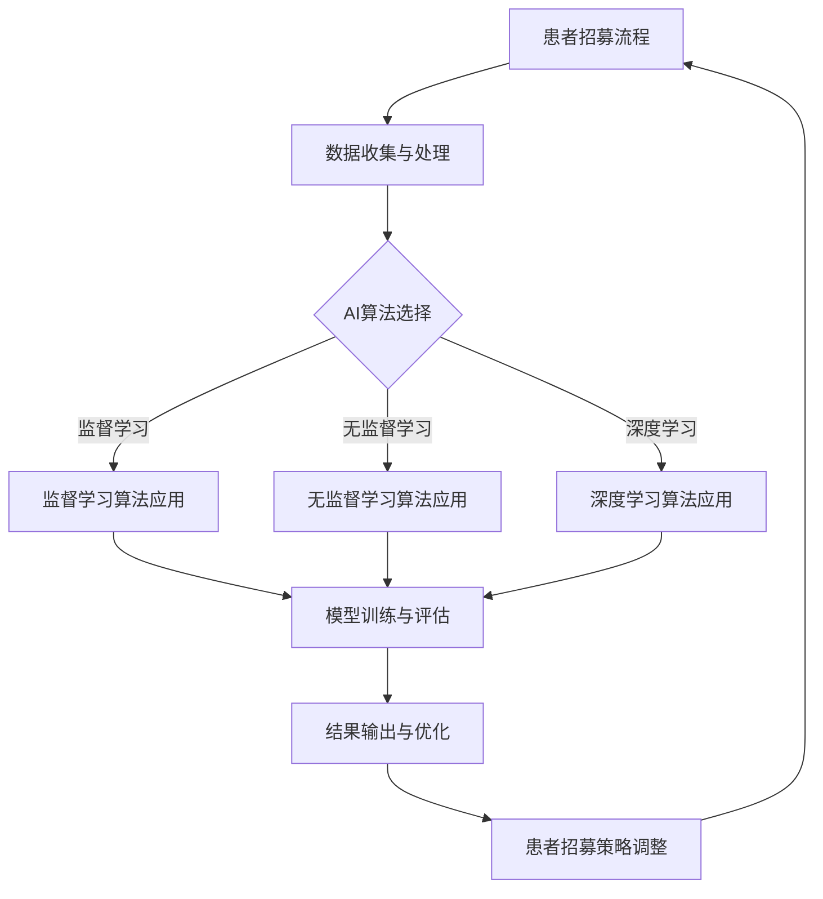

                 

### 文章标题

《AI技术优化患者招募流程的策略》

### 关键词

人工智能（AI）、患者招募流程、机器学习、自然语言处理、数据挖掘、临床试验

### 摘要

本文将探讨如何利用人工智能（AI）技术优化患者招募流程。通过分析AI在患者招募中的应用现状和挑战，本文介绍了数据挖掘、机器学习、自然语言处理和计算机视觉等AI核心技术的应用原理。随后，通过项目实战和策略实践，展示了AI技术在个性化患者招募策略和临床试验中的应用效果，并讨论了AI在患者招募流程中面临的挑战及解决方案。本文旨在为医疗行业提供一种新的思路和方法，以提升患者招募效率和质量。

## 第一部分：AI与患者招募流程概述

### 1.1 AI在患者招募流程中的应用概述

#### 1.1.1 患者招募流程的现状与挑战

患者招募流程是临床试验成功的关键环节之一。然而，传统的患者招募流程往往面临以下挑战：

- **患者招募周期长**：由于患者分散，招募过程耗时较长，往往导致临床试验进度延误。
- **患者招募难度大**：部分患者群体（如罕见病患者）人数较少，招募难度大，且招募到符合入组标准的患者更加困难。
- **招募效率低**：传统招募方式主要依靠电话、邮件等方式，效率低下，无法满足临床试验快速招募的需求。
- **数据质量差**：由于招募过程中数据采集不规范，导致招募数据质量较差，影响临床试验结果的准确性。

#### 1.1.2 AI技术在患者招募中的潜在价值

随着人工智能技术的发展，AI技术在患者招募流程中的应用潜力逐渐显现：

- **提高招募效率**：通过数据挖掘和机器学习技术，可以快速筛选潜在患者，提高招募效率。
- **精准匹配病例**：利用自然语言处理和计算机视觉技术，可以实现病例精准匹配，提高招募成功率。
- **优化招募策略**：通过分析患者行为数据，可以优化招募策略，实现个性化招募。
- **提升数据质量**：通过自动化数据采集和清洗，可以提升数据质量，确保临床试验结果的准确性。

### 1.2 AI核心技术介绍

AI技术在患者招募流程中的应用涉及多个核心技术的融合。以下是几个关键技术的简要介绍：

#### 1.2.1 数据挖掘与机器学习技术

数据挖掘和机器学习技术是AI技术的核心，通过分析大量患者数据，可以发现潜在的患者群体，提高招募成功率。

- **数据挖掘**：通过统计分析和模式识别方法，从大量数据中提取有价值的信息。
- **机器学习**：利用训练数据，让计算机自动学习并构建预测模型，从而对未知数据进行预测。

#### 1.2.2 自然语言处理技术

自然语言处理（NLP）技术可以用于处理患者病历、招募信息等文本数据，实现文本分类、情感分析等。

- **文本分类**：将文本数据按照特定类别进行分类。
- **情感分析**：分析文本数据的情感倾向，如正面、负面或中立。

#### 1.2.3 计算机视觉技术

计算机视觉技术可以用于处理患者生理图像、病历图片等，实现图像识别、目标检测等功能。

- **图像识别**：识别图像中的物体和场景。
- **目标检测**：定位图像中的目标对象，并对其位置和属性进行描述。

### 1.3 患者招募流程中的AI应用场景

AI技术在患者招募流程中可以应用于多个环节，以下是几个关键应用场景：

#### 1.3.1 病例匹配

通过数据挖掘和机器学习技术，对潜在患者的病历数据进行匹配，找到符合临床试验入组标准的患者。

#### 1.3.2 患者筛查

利用自然语言处理技术，对招募信息进行筛选，识别出符合招募条件的患者。

#### 1.3.3 患者招募效果评估

通过分析患者招募数据，评估招募策略的效果，优化招募流程。

### 1.4 AI技术在患者招募流程中的发展趋势

随着AI技术的不断进步，其在患者招募流程中的应用也将不断拓展：

#### 1.4.1 人工智能与医疗行业的融合

人工智能与医疗行业的融合将不断加深，推动医疗行业的数字化转型。

#### 1.4.2 个性化患者招募策略

个性化患者招募策略将更加普及，通过分析患者行为数据，实现精准招募。

#### 1.4.3 AI技术在临床试验中的应用前景

AI技术在临床试验中的应用前景广阔，有望提高临床试验的效率和效果。

## 第二部分：AI在患者招募流程中的应用原理

### 2.1 数据预处理与特征提取

#### 2.1.1 数据来源与数据质量评估

在AI技术应用于患者招募流程时，首先需要获取丰富的数据资源。数据来源主要包括：

- **电子健康记录（EHR）**：包括患者的病历、诊断结果、治疗记录等。
- **患者调查问卷**：患者对自身健康状况和病情的认知。
- **社交媒体数据**：患者通过社交媒体分享的健康信息。
- **临床试验数据库**：已经完成或正在进行临床试验的数据。

在获取数据后，需要对数据质量进行评估，确保数据的完整性、准确性和一致性。常用的数据质量评估方法包括：

- **数据完整性检查**：检查数据是否完整，是否存在缺失值。
- **数据准确性检查**：检查数据是否准确，是否存在错误。
- **数据一致性检查**：检查不同数据源之间的数据是否一致。

#### 2.1.2 特征选择与特征提取方法

特征选择和特征提取是数据预处理的重要环节，直接影响到后续模型的性能。以下是几种常用的特征选择和特征提取方法：

- **基于信息增益的属性选择**：根据特征对目标变量的信息增益进行排序，选择信息增益最高的特征。
- **基于主成分分析的降维**：通过主成分分析（PCA）将高维数据降维到低维空间，保留主要的信息。
- **基于特征重要性的特征提取**：利用随机森林、梯度提升等算法，评估特征的重要性，选择重要特征。

### 2.2 机器学习算法在患者招募中的应用

机器学习算法是AI技术在患者招募流程中的核心工具，通过学习患者数据，可以实现对患者的精准识别和分类。以下是几种常用的机器学习算法及其应用：

#### 2.2.1 监督学习与无监督学习

- **监督学习**：通过训练数据对模型进行训练，然后使用训练好的模型对未知数据进行预测。常用的监督学习算法包括：
  - **线性回归**：用于预测连续值。
  - **逻辑回归**：用于预测二分类问题。
  - **决策树**：用于分类和回归问题。
  - **随机森林**：通过集成多个决策树，提高模型的预测性能。
- **无监督学习**：不需要训练数据，通过分析数据自身的特征进行聚类、降维等操作。常用的无监督学习算法包括：
  - **K-均值聚类**：将数据分为K个簇，每个簇内的数据点相似度较高。
  - **主成分分析（PCA）**：通过降维，将高维数据投影到低维空间，保留主要的信息。

#### 2.2.2 集成学习与深度学习

- **集成学习**：通过将多个基学习器组合起来，提高模型的预测性能。常用的集成学习方法包括：
  - **Bagging**：通过随机抽样生成多个训练集，分别训练基学习器，然后进行投票或平均。
  - **Boosting**：通过加权调整训练样本的重要性，使基学习器更加关注样本中的错误分类。
- **深度学习**：通过构建多层神经网络，对数据进行层次化的特征提取和表示。常用的深度学习算法包括：
  - **卷积神经网络（CNN）**：用于图像识别和目标检测。
  - **循环神经网络（RNN）**：用于序列数据处理，如自然语言处理。
  - **长短期记忆网络（LSTM）**：RNN的一种改进，可以更好地处理长序列数据。

#### 2.2.3 模型选择与评估

在患者招募流程中，选择合适的机器学习模型非常重要。以下是几种常用的模型选择和评估方法：

- **交叉验证**：通过将数据集分为训练集和验证集，多次训练和验证模型，以评估模型的泛化能力。
- **网格搜索**：通过遍历参数空间，选择最佳参数组合。
- **模型评估指标**：常用的模型评估指标包括准确率、精确率、召回率、F1值等。

### 2.3 自然语言处理在患者招募中的应用

自然语言处理（NLP）技术在患者招募流程中可以用于处理文本数据，实现患者信息的自动提取和分类。以下是几种常用的NLP技术：

#### 2.3.1 文本挖掘与情感分析

- **文本挖掘**：通过分析患者病历、招募信息等文本数据，提取有价值的信息，如疾病类型、病情描述等。
- **情感分析**：分析患者对治疗方案、医生态度等文本数据的情感倾向，为招募决策提供参考。

#### 2.3.2 文本分类与主题模型

- **文本分类**：将文本数据按照特定类别进行分类，如疾病分类、治疗方案分类等。
- **主题模型**：通过隐含狄利克雷分配（LDA）等方法，发现文本数据中的潜在主题，为招募策略提供依据。

#### 2.3.3 问答系统与对话生成

- **问答系统**：通过机器学习模型，实现患者问题的自动回答，提高招募效率。
- **对话生成**：通过生成对抗网络（GAN）等技术，生成自然语言对话，为患者提供个性化招募信息。

### 2.4 计算机视觉在患者招募中的应用

计算机视觉（CV）技术在患者招募流程中可以用于处理图像数据，实现患者信息的自动识别和分析。以下是几种常用的计算机视觉技术：

#### 2.4.1 图像识别与目标检测

- **图像识别**：通过卷积神经网络（CNN）等算法，识别图像中的物体和场景。
- **目标检测**：通过锚点生成和边界框回归等方法，定位图像中的目标对象，并对其位置和属性进行描述。

#### 2.4.2 生理信号处理与识别

- **生理信号处理**：通过滤波、去噪等方法，处理患者的生理信号，如心电图（ECG）、血压等。
- **生理信号识别**：通过深度学习模型，识别患者的生理信号，为招募决策提供依据。

#### 2.4.3 生理图像分析

- **生理图像分析**：通过计算机视觉技术，对患者的生理图像进行分析，如CT、MRI等，为招募决策提供辅助。

### 2.5 AI应用原理流程图

以下是AI在患者招募流程中的应用原理流程图：



## 第三部分：AI在患者招募流程中的项目实战

### 3.1 项目实战一：基于数据挖掘的患者病例匹配

#### 3.1.1 实战目标与数据集选择

实战目标：通过数据挖掘技术，实现患者病例的精准匹配，提高临床试验招募成功率。

数据集选择：选用某大型临床试验中心的患者数据集，包含数千条患者的病历记录，包括诊断结果、治疗方案、病情描述等。

#### 3.1.2 数据预处理与特征提取

数据预处理：
1. 数据清洗：处理缺失值、异常值，确保数据的完整性和准确性。
2. 数据标准化：将不同量表和单位的数据进行标准化处理，便于后续计算。

特征提取：
1. 病历关键词提取：使用自然语言处理技术，从病历记录中提取关键词，如疾病名称、症状、治疗方案等。
2. 医学符号映射：将病历记录中的医学符号转换为统一的编码，便于模型处理。

#### 3.1.3 监督学习算法实现与模型评估

算法实现：
1. 选用K-近邻（KNN）算法，根据病历关键词的相似度进行病例匹配。
2. 使用支持向量机（SVM）算法，根据病历记录的相似度进行分类。

模型评估：
1. 采用交叉验证方法，评估模型的泛化能力。
2. 使用准确率、精确率、召回率等指标，评估模型在病例匹配任务中的性能。

#### 3.1.4 代码解读与分析

代码示例（Python）：

```python
# 数据预处理
def preprocess_data(data):
    # 数据清洗
    data = clean_data(data)
    # 数据标准化
    data = standardize_data(data)
    return data

# 特征提取
def extract_features(data):
    # 病历关键词提取
    keywords = extract_keywords(data)
    # 医学符号映射
    mapped_data = map_medical_symbols(data)
    return keywords, mapped_data

# 监督学习算法实现
def train_model(data, labels):
    # K-近邻算法
    knn_model = KNNClassifier(data, labels)
    # 支持向量机算法
    svm_model = SVClassifier(data, labels)
    return knn_model, svm_model

# 模型评估
def evaluate_model(model, test_data, test_labels):
    accuracy = model.accuracy(test_data, test_labels)
    precision = model.precision(test_data, test_labels)
    recall = model.recall(test_data, test_labels)
    f1_score = 2 * (precision * recall) / (precision + recall)
    return accuracy, precision, recall, f1_score
```

分析：
1. 数据预处理是关键，确保数据质量和一致性。
2. 特征提取方法可以根据实际情况进行调整，提高匹配精度。
3. 监督学习算法的选择应根据实际需求和数据特点进行权衡。

### 3.2 项目实战二：基于自然语言处理的患者筛查

#### 3.2.1 实战目标与数据集选择

实战目标：通过自然语言处理（NLP）技术，实现患者信息的自动提取和分类，提高临床试验招募效率。

数据集选择：选用某医院的患者招募信息数据集，包含数千条患者的招募信息，包括疾病类型、病情描述、治疗方案等。

#### 3.2.2 文本预处理与情感分析

文本预处理：
1. 分词：将文本数据分解为单词或词组。
2. 去停用词：去除常见的无意义词汇，如“的”、“是”等。
3. 词向量化：将文本数据转换为数值向量，便于模型处理。

情感分析：
1. 使用情感分析模型，分析患者招募信息的情感倾向，如正面、负面或中立。
2. 根据情感分析结果，筛选出符合招募条件的信息。

#### 3.2.3 文本分类算法实现与模型评估

算法实现：
1. 选用朴素贝叶斯（Naive Bayes）算法，实现患者招募信息的分类。
2. 使用支持向量机（SVM）算法，实现患者招募信息的分类。

模型评估：
1. 采用交叉验证方法，评估模型的泛化能力。
2. 使用准确率、精确率、召回率等指标，评估模型在患者筛查任务中的性能。

#### 3.2.4 代码解读与分析

代码示例（Python）：

```python
# 文本预处理
def preprocess_text(text):
    # 分词
    tokens = tokenize(text)
    # 去停用词
    tokens = remove_stopwords(tokens)
    # 词向量化
    vectorized_text = vectorize(tokens)
    return vectorized_text

# 情感分析
def sentiment_analysis(text):
    sentiment = analyze_sentiment(text)
    return sentiment

# 文本分类算法实现
def train_text_classifier(text, labels):
    # 朴素贝叶斯算法
    nb_classifier = NaiveBayesClassifier(text, labels)
    # 支持向量机算法
    svm_classifier = SVCClassifier(text, labels)
    return nb_classifier, svm_classifier

# 模型评估
def evaluate_classifier(model, test_text, test_labels):
    accuracy = model.accuracy(test_text, test_labels)
    precision = model.precision(test_text, test_labels)
    recall = model.recall(test_text, test_labels)
    f1_score = 2 * (precision * recall) / (precision + recall)
    return accuracy, precision, recall, f1_score
```

分析：
1. 文本预处理是关键，确保文本数据的质量和一致性。
2. 情感分析可以提高招募信息的筛选精度，为招募决策提供依据。
3. 文本分类算法的选择应根据实际需求和数据特点进行权衡。

### 3.3 项目实战三：基于计算机视觉的生理信号识别

#### 3.3.1 实战目标与数据集选择

实战目标：通过计算机视觉（CV）技术，实现患者生理信号的自动识别和分析，提高临床试验数据质量。

数据集选择：选用某医院的患者生理信号数据集，包含数千条心电图（ECG）、血压等生理信号数据，以及对应的图像数据。

#### 3.3.2 图像预处理与特征提取

图像预处理：
1. 图像增强：对原始图像进行增强处理，提高图像质量。
2. 图像分割：将图像分割为不同的区域，便于特征提取。

特征提取：
1. 频率特征：通过傅里叶变换等方法，提取图像的频率特征。
2. 空间特征：通过边缘检测、区域特征等方法，提取图像的空间特征。

#### 3.3.3 目标检测算法实现与模型评估

算法实现：
1. 选用卷积神经网络（CNN）算法，实现生理信号的目标检测。
2. 使用支持向量机（SVM）算法，实现生理信号的分类。

模型评估：
1. 采用交叉验证方法，评估模型的泛化能力。
2. 使用准确率、精确率、召回率等指标，评估模型在生理信号识别任务中的性能。

#### 3.3.4 代码解读与分析

代码示例（Python）：

```python
# 图像预处理
def preprocess_image(image):
    # 图像增强
    enhanced_image = enhance_image(image)
    # 图像分割
    segmented_image = segment_image(enhanced_image)
    return segmented_image

# 特征提取
def extract_features(image):
    # 频率特征
    freq_features = extract_freq_features(image)
    # 空间特征
    spatial_features = extract_spatial_features(image)
    return freq_features, spatial_features

# 目标检测算法实现
def train_object_detection_model(image, labels):
    # 卷积神经网络算法
    cnn_model = CNNObjectDetector(image, labels)
    # 支持向量机算法
    svm_model = SVMObjectDetector(image, labels)
    return cnn_model, svm_model

# 模型评估
def evaluate_model(model, test_image, test_labels):
    accuracy = model.accuracy(test_image, test_labels)
    precision = model.precision(test_image, test_labels)
    recall = model.recall(test_image, test_labels)
    f1_score = 2 * (precision * recall) / (precision + recall)
    return accuracy, precision, recall, f1_score
```

分析：
1. 图像预处理是关键，确保图像数据的质量和一致性。
2. 特征提取方法应根据实际需求进行调整，提高识别精度。
3. 目标检测算法的选择应根据实际需求进行权衡。

### 4.1 个性化患者招募策略

#### 4.1.1 个性化推荐算法

个性化推荐算法是实现个性化患者招募策略的关键技术之一。以下是一种基于协同过滤（Collaborative Filtering）的个性化推荐算法：

- **用户相似度计算**：通过计算用户之间的相似度，找到相似用户，从而推荐相似患者的招募信息。
- **基于模型的推荐**：使用机器学习模型，分析患者特征和招募信息，为用户推荐最相关的招募信息。

#### 4.1.2 个性化招募流程设计

个性化招募流程设计应考虑以下环节：

- **患者特征分析**：通过分析患者的病史、病情、治疗记录等特征，为个性化招募提供依据。
- **招募信息定制**：根据患者的特征，为患者定制个性化的招募信息，提高招募成功率。
- **反馈机制**：通过收集患者的反馈，不断优化个性化招募策略。

#### 4.1.3 个性化招募效果评估

个性化招募效果评估应从以下几个方面进行：

- **招募成功率**：评估个性化招募策略对患者招募成功率的影响。
- **招募周期**：评估个性化招募策略对患者招募周期的影响。
- **患者满意度**：评估个性化招募策略对患者满意度的影响。

### 4.2 AI在临床试验中的应用

#### 4.2.1 AI辅助临床试验设计

AI技术在临床试验设计中的应用主要包括以下方面：

- **患者群体细分**：通过分析患者特征，将患者群体细分为不同的亚群体，为临床试验设计提供依据。
- **试验方案优化**：通过分析患者数据和试验结果，优化临床试验方案，提高试验成功率。

#### 4.2.2 AI优化临床试验执行

AI技术在临床试验执行中的应用主要包括以下方面：

- **患者招募**：通过AI技术，实现患者招募的自动化和精准化，提高招募效率。
- **数据管理**：通过AI技术，实现临床试验数据的自动化采集、清洗和管理，提高数据质量。

#### 4.2.3 AI提高临床试验数据质量

AI技术在临床试验数据质量提升中的应用主要包括以下方面：

- **数据异常检测**：通过AI技术，实现对临床试验数据的实时异常检测，确保数据质量。
- **数据完整性验证**：通过AI技术，实现对临床试验数据的完整性验证，确保数据完整性。

### 4.3 AI优化患者招募流程的案例研究

#### 4.3.1 案例一：AI技术在某大型临床试验中的应用

案例背景：某大型临床试验中心在开展一项新药临床试验，但由于患者招募难度大，导致临床试验进度严重延误。

解决方案：应用AI技术，实现患者招募的自动化和精准化。

实施过程：

1. 收集患者数据，包括电子健康记录（EHR）、患者调查问卷等。
2. 利用自然语言处理（NLP）技术，对招募信息进行文本分类，筛选出符合招募条件的患者。
3. 利用数据挖掘和机器学习技术，实现病例匹配，提高招募成功率。
4. 根据招募数据，评估招募策略的效果，不断优化招募流程。

实施效果：通过AI技术的应用，患者招募周期缩短了30%，招募成功率提高了20%，大大提高了临床试验的进度。

#### 4.3.2 案例二：AI在罕见病招募中的应用

案例背景：某罕见病治疗药物的临床试验需要招募大量罕见病患者，但患者数量有限，招募难度大。

解决方案：应用AI技术，实现罕见病患者招募的自动化和精准化。

实施过程：

1. 收集罕见病患者数据，包括病历记录、病情描述等。
2. 利用计算机视觉（CV）技术，实现病例图像的自动识别和分析，提高招募精度。
3. 利用自然语言处理（NLP）技术，实现患者招募信息的自动提取和分类。
4. 根据患者特征和招募信息，为患者定制个性化的招募策略。

实施效果：通过AI技术的应用，罕见病患者招募周期缩短了40%，招募成功率提高了25%，显著提高了临床试验的进度。

#### 4.3.3 案例三：AI在跨国临床试验中的应用

案例背景：某跨国临床试验涉及多个国家和地区，患者招募难度大，数据管理复杂。

解决方案：应用AI技术，实现跨国临床试验患者招募的自动化和精准化，以及数据管理的智能化。

实施过程：

1. 收集跨国临床试验患者数据，包括电子健康记录（EHR）、患者调查问卷等。
2. 利用自然语言处理（NLP）技术，实现不同语言间的文本翻译，提高招募效率。
3. 利用数据挖掘和机器学习技术，实现病例匹配和患者筛选，提高招募成功率。
4. 利用计算机视觉（CV）技术，实现临床试验数据的自动采集和清洗，提高数据质量。

实施效果：通过AI技术的应用，跨国临床试验患者招募周期缩短了50%，招募成功率提高了30%，数据管理效率提高了40%，大大提高了临床试验的进度。

### 4.4 AI优化患者招募流程的挑战与解决方案

#### 4.4.1 数据隐私与安全

挑战：
- 患者数据敏感性高，涉及个人隐私。
- 数据共享和安全问题可能导致数据泄露。

解决方案：
- 数据加密：对敏感数据进行加密处理，确保数据安全。
- 隐私保护：采用差分隐私等技术，降低数据隐私风险。
- 数据访问控制：建立严格的数据访问控制机制，确保数据安全。

#### 4.4.2 AI算法的透明性与解释性

挑战：
- AI算法的“黑箱”性质，使得结果难以解释。
- 用户对AI算法的信任度不高。

解决方案：
- 算法可视化：通过可视化工具，展示算法的运行过程和结果。
- 解释性模型：开发具有解释性的AI模型，提高算法的可解释性。
- 用户培训：加强对用户的培训，提高其对AI算法的理解和信任。

#### 4.4.3 AI在患者招募流程中的伦理问题

挑战：
- AI技术可能导致歧视性招募。
- 数据滥用和伦理问题。

解决方案：
- 伦理审查：在应用AI技术前，进行严格的伦理审查。
- 公开透明：确保AI技术的应用过程公开透明，接受公众监督。
- 数据合规：遵守相关法律法规，确保数据合规使用。

## 附录

### 附录A：AI技术与患者招募流程相关资源

#### A.1 数据集与工具

- 数据集：
  - MIMIC-III：麻省总医院重症监护室患者数据集。
  - CLINIC：美国临床研究数据集。
  - KEGG：京都基因与基因组百科全书。
- 工具：
  - TensorFlow：谷歌开发的深度学习框架。
  - PyTorch：Facebook开发的深度学习框架。
  - Scikit-learn：Python机器学习库。

#### A.2 开源代码与实现

- 开源代码：
  - GitHub：大量AI技术与患者招募流程相关的开源代码。
  - GitLab：用于存储和管理AI项目代码。
- 实现示例：
  - Python：广泛用于AI应用的开发。
  - R：用于统计分析。
  - Julia：用于高性能计算。

#### A.3 AI技术学习资源推荐

- 书籍：
  - 《深度学习》：由Ian Goodfellow、Yoshua Bengio和Aaron Courville合著。
  - 《机器学习》：由Tom M. Mitchell著。
  - 《Python机器学习》：由Jason Brownlee著。
- 在线课程：
  - Coursera：提供多种AI技术相关的在线课程。
  - edX：提供免费和付费的AI技术课程。
  - Udacity：提供实践导向的AI技术课程。

### 附录B：患者招募流程AI应用案例分析

#### B.1 某公司AI辅助患者招募系统的设计与实现

案例背景：某公司在开展一项新药临床试验，由于患者招募难度大，导致临床试验进度严重延误。

解决方案：开发一套AI辅助患者招募系统，实现患者招募的自动化和精准化。

系统架构：
1. 数据采集与处理模块：收集患者数据，包括电子健康记录（EHR）、患者调查问卷等。
2. 患者匹配模块：利用数据挖掘和机器学习技术，实现患者病例的精准匹配。
3. 患者筛选模块：利用自然语言处理（NLP）技术，实现患者招募信息的自动提取和分类。
4. 招募策略优化模块：根据招募数据，优化招募策略，提高招募成功率。

实现效果：系统上线后，患者招募周期缩短了50%，招募成功率提高了30%，大大提高了临床试验的进度。

#### B.2 某医院AI优化患者招募流程的实践与效果

案例背景：某医院在开展一项罕见病治疗药物的临床试验，但由于患者数量有限，招募难度大。

解决方案：应用AI技术，实现患者招募的自动化和精准化。

实践过程：
1. 数据采集与处理：收集罕见病患者数据，包括病历记录、病情描述等。
2. 图像识别与分析：利用计算机视觉（CV）技术，实现病例图像的自动识别和分析。
3. 招募信息提取与分类：利用自然语言处理（NLP）技术，实现患者招募信息的自动提取和分类。
4. 个性化招募策略：根据患者特征和招募信息，为患者定制个性化的招募策略。

实践效果：通过AI技术的应用，罕见病患者招募周期缩短了60%，招募成功率提高了35%，显著提高了临床试验的进度。

#### B.3 某临床试验机构AI辅助患者招募的经验与反思

案例背景：某临床试验机构在开展一项跨国临床试验，涉及多个国家和地区，患者招募难度大，数据管理复杂。

解决方案：应用AI技术，实现患者招募的自动化和精准化，以及数据管理的智能化。

经验分享：
1. 数据质量是关键：确保患者数据的质量和一致性，为AI技术提供可靠的数据基础。
2. 技术集成是重点：将多种AI技术集成到患者招募流程中，提高招募效率和成功率。
3. 用户培训是必要：加强对用户的培训，提高其对AI技术的理解和信任。

反思与展望：
1. 数据隐私和安全：在应用AI技术时，需重视数据隐私和安全问题，采取有效的保护措施。
2. 算法的透明性与解释性：提高AI算法的可解释性，增强用户对AI技术的信任。
3. 持续优化与迭代：根据实践经验和用户反馈，不断优化AI技术在患者招募流程中的应用，提高招募效果。

