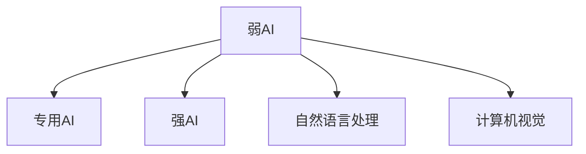
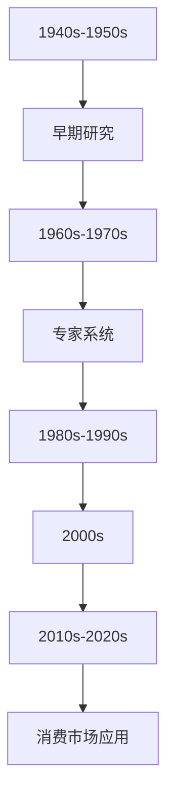
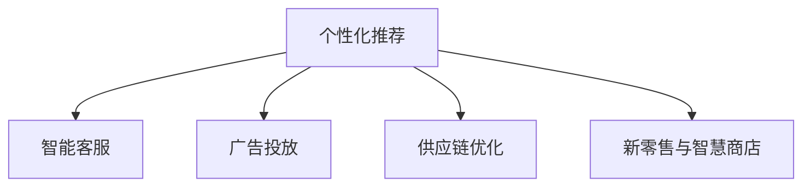
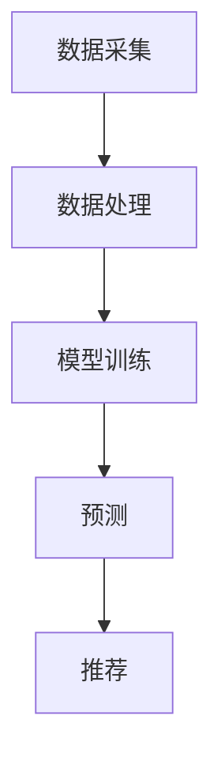
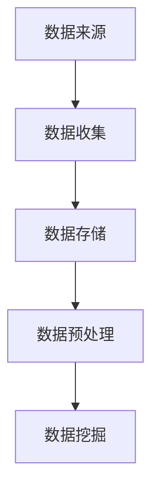
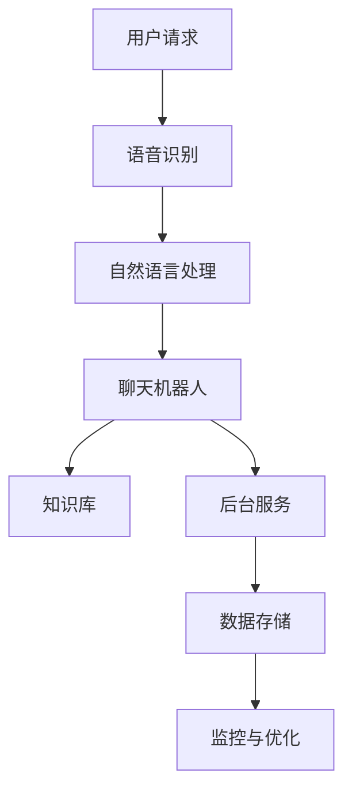
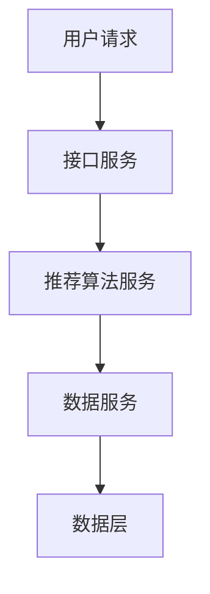
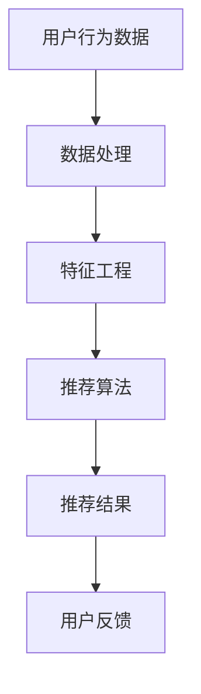
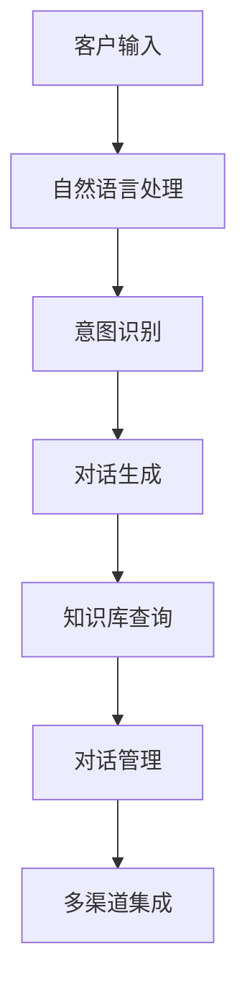
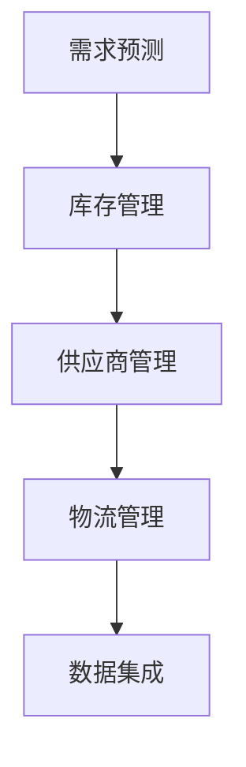

                 

### 文章标题

### AI技术在消费市场中的应用

---

**关键词**：人工智能、消费者行为、个性化推荐、智能客服、深度学习、供应链优化

**摘要**：
随着人工智能技术的快速发展，其在消费市场中的应用越来越广泛。本文首先介绍了AI技术的基础知识，包括其定义、分类、发展历程以及在消费市场的应用现状。接着，详细讲解了数据处理与分析、机器学习算法、深度学习原理等核心概念与联系。随后，文章重点探讨了AI在消费市场中的具体应用，如消费者行为分析、客户服务与支持、产品推荐与广告投放等。此外，还介绍了供应链优化与库存管理、新零售与智慧商店、数据隐私与安全等方面的AI应用。最后，通过三个实践案例，展示了AI技术在消费市场中的实际应用效果。本文旨在帮助读者全面了解和掌握AI技术在消费市场的应用。

---

### 目录大纲

### 《AI技术在消费市场中的应用》

## 第一部分：AI技术基础

### 1.1 AI技术概述

#### 1.1.1 AI的定义与分类

#### 1.1.2 AI技术的发展历程

#### 1.1.3 AI在消费市场的应用现状

### 1.2 数据处理与分析

#### 1.2.1 数据采集与预处理

#### 1.2.2 数据挖掘技术

#### 1.2.3 数据可视化方法

### 1.3 机器学习算法

#### 1.3.1 监督学习算法

#### 1.3.2 无监督学习算法

#### 1.3.3 强化学习算法

### 1.4 深度学习原理

#### 1.4.1 神经网络基础

#### 1.4.2 深度学习框架

#### 1.4.3 卷积神经网络(CNN)

## 第二部分：AI在消费市场中的应用

### 2.1 消费者行为分析

#### 2.1.1 消费者数据收集

#### 2.1.2 消费者行为预测

#### 2.1.3 消费者细分与个性化推荐

### 2.2 客户服务与支持

#### 2.2.1 聊天机器人的设计与开发

#### 2.2.2 语音识别与处理

#### 2.2.3 智能客服系统的架构

### 2.3 产品推荐与广告投放

#### 2.3.1 推荐系统的设计与实现

#### 2.3.2 广告投放策略

#### 2.3.3 用户画像与数据挖掘

### 2.4 供应链优化与库存管理

#### 2.4.1 供应链中的AI应用

#### 2.4.2 库存管理的AI解决方案

#### 2.4.3 需求预测与供应链协同

### 2.5 新零售与智慧商店

#### 2.5.1 新零售的概念与模式

#### 2.5.2 智慧商店的构建与运营

#### 2.5.3 消费者体验的AI提升

### 2.6 数据隐私与安全

#### 2.6.1 数据隐私保护方法

#### 2.6.2 数据安全策略

#### 2.6.3 AI伦理与法律问题

## 第三部分：AI在消费市场的实践案例

### 3.1 案例一：某电商平台的个性化推荐系统

#### 3.1.1 案例背景

#### 3.1.2 系统架构

#### 3.1.3 推荐算法实现

#### 3.1.4 案例分析

### 3.2 案例二：某银行智能客服系统

#### 3.2.1 案例背景

#### 3.2.2 系统设计

#### 3.2.3 语音识别与处理

#### 3.2.4 案例分析

### 3.3 案例三：某超市的智慧供应链管理系统

#### 3.3.1 案例背景

#### 3.3.2 系统架构

#### 3.3.3 需求预测与库存管理

#### 3.3.4 案例分析

## 附录

### 附录A：AI技术应用开发工具与资源

#### A.1 常用机器学习库与框架

#### A.2 数据处理与分析工具

#### A.3 AI模型评估与优化方法

### 附录B：参考文献

#### B.1 相关书籍推荐

#### B.2 学术论文精选

#### B.3 在线学习资源推荐

### 结论

在文章的后续部分，我们将逐一深入探讨每一章节的内容，帮助读者更好地理解和掌握AI技术在消费市场的应用。让我们一步步来思考，如何将AI技术融入到消费市场中，创造更大的商业价值。

---

**核心概念与联系**

#### 1.1.1 AI的定义与分类

**AI（人工智能）** 是一门模拟、延伸和扩展人类智能的科学，旨在通过计算机系统实现人类智能的某些功能。根据AI的实现方式和能力，可以分为以下几类：

- **弱AI（Narrow AI）**：也称为专用AI，专注于执行特定的任务，例如语音识别、图像识别等。这类AI在特定领域表现出色，但缺乏跨领域的智能。

- **强AI（General AI）**：理论上具备人类所有智能能力，能够自主思考、学习、推理和解决问题。目前，强AI尚未实现。

- **自然语言处理（NLP）**：AI技术中，NLP致力于让计算机理解和生成人类语言。

- **计算机视觉**：通过模拟人类视觉感知，实现图像识别、物体检测等任务。

**流程图**（Mermaid）：



#### 1.1.2 AI技术的发展历程

AI技术的发展可以追溯到20世纪40年代，但真正取得突破是在21世纪。以下是AI技术的发展历程：

- **1940s-1950s**：人工智能概念提出，早期研究主要集中在推理和规划。

- **1960s-1970s**：早期AI系统如ELIZA和Logic Theorist取得初步成功。

- **1980s-1990s**：专家系统成为主流，但受限于知识库的构建。

- **2000s**：机器学习、深度学习快速发展，AI应用逐渐普及。

- **2010s-2020s**：AI技术进入消费市场，如个性化推荐、智能客服等。

**流程图**（Mermaid）：



#### 1.1.3 AI在消费市场的应用现状

随着AI技术的不断发展，其在消费市场的应用越来越广泛。以下是AI在消费市场的一些典型应用：

- **个性化推荐**：利用AI技术分析用户行为，提供个性化的商品推荐。

- **智能客服**：通过自然语言处理和语音识别技术，提供高效的客户服务。

- **广告投放**：根据用户行为和兴趣，实现精准的广告投放。

- **供应链优化**：利用AI技术预测需求，优化库存管理和供应链协同。

- **新零售与智慧商店**：通过智能设备和技术，提升消费者购物体验。

**流程图**（Mermaid）：



---

**核心算法原理讲解**

#### 1.3.1 监督学习算法

监督学习是一种从标记数据中学习，并预测未标记数据的方法。以下是监督学习算法的核心组成部分：

- **输入特征**：用于训练模型的特征向量。

- **输出标签**：实际结果。

- **目标函数**：用于评估模型性能的指标，如均方误差（MSE）。

- **优化算法**：用于调整模型参数，如梯度下降、Adam。

**伪代码**：

```python
初始化模型参数
for each epoch:
    for each training sample:
        predict = model(sample)
        loss = calculate_loss(predict, target)
        update_model_parameters(loss)
return model
```

**数学模型**：

$$
y = f(x; \theta)
$$

其中，$y$ 是输出标签，$x$ 是输入特征，$f(x; \theta)$ 是模型预测，$\theta$ 是模型参数。

**举例说明**：

假设我们有一个简单的线性回归模型，预测房价。输入特征为房屋面积（$x$），输出标签为房价（$y$）。模型预测房价的公式为：

$$
y = \theta_0 + \theta_1 \cdot x
$$

通过最小化均方误差（MSE），我们可以得到最优的模型参数。

$$
J(\theta) = \frac{1}{2m} \sum_{i=1}^{m} (y_i - (\theta_0 + \theta_1 \cdot x_i))^2
$$

其中，$m$ 是样本数量。

通过梯度下降法，我们可以更新模型参数：

$$
\theta_0 := \theta_0 - \alpha \cdot \frac{\partial J(\theta_0)}{\partial \theta_0}
$$

$$
\theta_1 := \theta_1 - \alpha \cdot \frac{\partial J(\theta_1)}{\partial \theta_1}
$$

其中，$\alpha$ 是学习率。

---

**项目实战**

### 2.1 消费者行为分析

#### 案例背景

某电商平台希望通过分析消费者行为，提高用户满意度和转化率。平台收集了用户浏览、购买、评价等数据，并希望通过AI技术对这些数据进行挖掘和分析。

#### 系统架构

系统架构包括以下模块：

- **数据采集模块**：负责收集用户行为数据。

- **数据处理模块**：对数据进行清洗、归一化、特征提取等预处理。

- **模型训练模块**：使用机器学习算法训练消费者行为预测模型。

- **预测模块**：根据训练好的模型对用户行为进行预测。

- **推荐模块**：根据预测结果生成个性化推荐。

**流程图**（Mermaid）：



#### 代码实现

**Python示例**：

```python
import pandas as pd
from sklearn.model_selection import train_test_split
from sklearn.preprocessing import StandardScaler
from sklearn.linear_model import LogisticRegression

# 数据预处理
data = pd.read_csv('consumer_data.csv')
X = data.drop('target', axis=1)
y = data['target']

X_train, X_test, y_train, y_test = train_test_split(X, y, test_size=0.2, random_state=42)

scaler = StandardScaler()
X_train_scaled = scaler.fit_transform(X_train)
X_test_scaled = scaler.transform(X_test)

# 模型训练
model = LogisticRegression()
model.fit(X_train_scaled, y_train)

# 预测
predictions = model.predict(X_test_scaled)
accuracy = model.score(X_test_scaled, y_test)
print(f"Model accuracy: {accuracy:.2f}")
```

**代码解读与分析**：

- **数据预处理**：数据清洗和特征提取是构建模型前的重要步骤。数据清洗包括处理缺失值、异常值等。特征提取则通过归一化等技术，将不同量级的特征转换为具有相同量级的数据，以便模型更好地学习。

- **模型训练**：使用逻辑回归模型进行训练。逻辑回归是一种常用的分类算法，适合二分类问题。

- **预测与评估**：对测试集进行预测，并计算模型准确率。准确率是评估模型性能的重要指标，表示预测正确的样本数占总样本数的比例。

---

在接下来的部分，我们将继续探讨AI技术在消费市场的其他应用，包括客户服务与支持、产品推荐与广告投放等。通过实践案例，我们将深入分析AI技术在消费市场的实际应用效果。让我们继续一步步思考，探索AI技术的无限潜力。

### 1.2 数据处理与分析

#### 1.2.1 数据采集与预处理

数据采集是AI技术在消费市场应用中的第一步。为了构建有效的模型，我们需要收集大量的数据。这些数据可以来自多个渠道，如用户行为数据、购买记录、浏览历史等。以下是一个简单的数据采集流程：

**流程图**（Mermaid）：



- **数据收集**：从不同的数据源收集数据，如网站日志、数据库、第三方数据服务。

- **数据存储**：将收集到的数据存储在数据库或数据仓库中，以便后续处理和分析。

- **数据预处理**：清洗数据，处理缺失值、异常值，进行数据转换和归一化等。

**示例**：

```python
import pandas as pd

# 加载数据
data = pd.read_csv('consumer_data.csv')

# 数据清洗
data = data.dropna()  # 删除缺失值
data = data[data['amount'] > 0]  # 删除金额为0的记录

# 数据转换
data['category'] = data['product_id'].map(lambda x: get_category(x))  # 根据产品ID获取类别

# 数据归一化
scaler = StandardScaler()
data[['price', 'amount']] = scaler.fit_transform(data[['price', 'amount']])
```

#### 1.2.2 数据挖掘技术

数据挖掘是从大量数据中提取有价值信息的过程。在消费市场，数据挖掘可以用于消费者行为分析、产品推荐、需求预测等。以下是几个常见的数据挖掘技术：

- **分类**：将数据分为不同的类别。如用户是否购买某种产品。

- **聚类**：将相似的数据点分为一组。如用户群体的细分。

- **关联规则挖掘**：发现数据之间的关联关系。如购物篮分析。

**示例**：

```python
from mlxtend.frequent_patterns import apriori
from mlxtend.frequent_patterns import association_rules

# 计算频繁项集
frequent_itemsets = apriori(data, min_support=0.1, use_colnames=True)

# 计算关联规则
rules = association_rules(frequent_itemsets, metric="lift", min_threshold=1)
```

#### 1.2.3 数据可视化方法

数据可视化是将数据转换为图形或图表，以便更好地理解和分析。在消费市场，数据可视化可以帮助我们直观地了解用户行为、产品销量、市场趋势等。以下是几个常见的数据可视化方法：

- **条形图**：用于比较不同类别的数据。

- **折线图**：用于显示数据的变化趋势。

- **散点图**：用于显示两个变量之间的关系。

- **热力图**：用于显示数据的密度分布。

**示例**：

```python
import matplotlib.pyplot as plt

# 绘制条形图
plt.bar(data['category'], data['sales'])
plt.xlabel('Category')
plt.ylabel('Sales')
plt.show()

# 绘制折线图
plt.plot(data['date'], data['sales'])
plt.xlabel('Date')
plt.ylabel('Sales')
plt.show()

# 绘制散点图
plt.scatter(data['price'], data['sales'])
plt.xlabel('Price')
plt.ylabel('Sales')
plt.show()

# 绘制热力图
import seaborn as sns
sns.heatmap(data.corr(), annot=True)
plt.show()
```

---

通过数据采集与预处理、数据挖掘技术和数据可视化方法，我们可以更好地理解和利用消费市场中的数据。这些技术为AI技术在消费市场的应用提供了基础。在接下来的章节中，我们将继续探讨机器学习算法和深度学习原理，以及如何在消费市场中应用这些算法。让我们一步步思考，如何将AI技术融入消费市场，创造更大的商业价值。

### 1.3 机器学习算法

机器学习算法是AI技术的核心组成部分，其在消费市场中的应用越来越广泛。本节将详细介绍三种常见的机器学习算法：监督学习、无监督学习和强化学习。通过理解这些算法的基本原理、实现方法和应用场景，我们可以更好地将它们应用于消费市场的实际问题。

#### 1.3.1 监督学习算法

监督学习是一种从标记数据中学习并预测未标记数据的机器学习算法。它通常包括以下核心组成部分：

- **输入特征**：用于训练模型的特征向量。

- **输出标签**：实际结果。

- **目标函数**：用于评估模型性能的指标。

- **优化算法**：用于调整模型参数。

**基本原理**：

监督学习算法通过学习输入特征和输出标签之间的关系，建立预测模型。在训练过程中，算法会不断调整模型参数，使得模型在训练集上的表现达到最优。常见的监督学习算法包括线性回归、逻辑回归、支持向量机（SVM）、决策树和随机森林等。

**伪代码**：

```python
初始化模型参数
for each epoch:
    for each training sample:
        predict = model(sample)
        loss = calculate_loss(predict, target)
        update_model_parameters(loss)
return model
```

**应用场景**：

监督学习算法在消费市场中的应用非常广泛。例如，可以使用逻辑回归预测用户是否会购买某种产品，使用支持向量机进行广告投放的精准定位，使用决策树或随机森林进行客户分类等。

**示例**：

```python
import pandas as pd
from sklearn.model_selection import train_test_split
from sklearn.preprocessing import StandardScaler
from sklearn.linear_model import LogisticRegression

# 数据预处理
data = pd.read_csv('consumer_data.csv')
X = data.drop('target', axis=1)
y = data['target']

X_train, X_test, y_train, y_test = train_test_split(X, y, test_size=0.2, random_state=42)

scaler = StandardScaler()
X_train_scaled = scaler.fit_transform(X_train)
X_test_scaled = scaler.transform(X_test)

# 模型训练
model = LogisticRegression()
model.fit(X_train_scaled, y_train)

# 预测
predictions = model.predict(X_test_scaled)
accuracy = model.score(X_test_scaled, y_test)
print(f"Model accuracy: {accuracy:.2f}")
```

#### 1.3.2 无监督学习算法

无监督学习是一种在没有输出标签的情况下学习数据模式的机器学习算法。与监督学习不同，无监督学习旨在发现数据中的隐藏结构。以下是无监督学习的一些常见算法：

- **聚类**：将数据点分为多个组，使得同一组内的数据点相似，不同组的数据点不相似。

- **降维**：通过降低数据维度，保持数据的主要特征，从而简化数据分析过程。

- **关联规则挖掘**：发现数据之间的关联关系。

**基本原理**：

无监督学习算法通过分析数据本身，找到数据中的潜在模式或结构。聚类算法如K-means、DBSCAN等，通过计算数据点之间的相似度，将相似的数据点划分为同一组。降维算法如PCA（主成分分析）、t-SNE等，通过线性变换或非线性变换，降低数据维度，同时保持数据的主要特征。关联规则挖掘算法如Apriori、Eclat等，通过计算数据项之间的支持度和置信度，发现数据中的关联关系。

**应用场景**：

无监督学习算法在消费市场中的应用也非常广泛。例如，可以使用K-means进行客户细分，使用PCA进行数据降维，使用Apriori进行购物篮分析等。

**示例**：

```python
import pandas as pd
from sklearn.cluster import KMeans
from sklearn.decomposition import PCA

# 数据预处理
data = pd.read_csv('consumer_data.csv')

# 聚类
kmeans = KMeans(n_clusters=5)
clusters = kmeans.fit_predict(data)

# 数据降维
pca = PCA(n_components=2)
data_reduced = pca.fit_transform(data)

# 绘制聚类结果
plt.scatter(data_reduced[:, 0], data_reduced[:, 1], c=clusters)
plt.xlabel('Principal Component 1')
plt.ylabel('Principal Component 2')
plt.show()
```

#### 1.3.3 强化学习算法

强化学习是一种通过试错和反馈学习如何采取行动的机器学习算法。与监督学习和无监督学习不同，强化学习通常涉及一个智能体（agent）在一个环境中（environment）与环境的交互（interaction）。强化学习的主要目标是找到一种策略（policy），使得智能体在给定环境下能够最大化累积奖励。

**基本原理**：

强化学习算法的核心是价值函数（value function）和策略（policy）。价值函数衡量智能体在给定状态下采取某个动作的期望奖励。策略则是一个决策规则，决定了智能体在特定状态下应该采取哪个动作。常见的强化学习算法包括Q学习、SARSA、深度Q网络（DQN）等。

**伪代码**：

```python
初始化价值函数
for each episode:
    state = environment.initialize()
    while not done:
        action = policy.select_action(state)
        next_state, reward, done = environment.step(action)
        update_value_function(state, action, reward, next_state, done)
    update_policy(value_function)
```

**应用场景**：

强化学习在消费市场中的应用非常广泛。例如，可以使用Q学习进行动态定价，使用DQN进行广告投放的实时优化等。

**示例**：

```python
import numpy as np
import gym

# 创建环境
env = gym.make('CartPole-v0')

# 初始化Q表格
Q = np.zeros([env.observation_space.n, env.action_space.n])

# Q学习算法
alpha = 0.1  # 学习率
gamma = 0.9  # 折扣因子
epsilon = 0.1  # 探索率

for episode in range(1000):
    state = env.reset()
    done = False
    total_reward = 0
    
    while not done:
        if np.random.rand() < epsilon:
            action = env.action_space.sample()  # 探索
        else:
            action = np.argmax(Q[state])  # 利用
        
        next_state, reward, done, _ = env.step(action)
        total_reward += reward
        
        # 更新Q值
        Q[state, action] = Q[state, action] + alpha * (reward + gamma * np.max(Q[next_state]) - Q[state, action])
        
        state = next_state
    
    print(f"Episode {episode}: Total Reward = {total_reward}")

env.close()
```

---

通过了解监督学习、无监督学习和强化学习算法的基本原理和应用场景，我们可以更好地将它们应用于消费市场的实际问题。在接下来的章节中，我们将进一步探讨深度学习原理，特别是卷积神经网络（CNN）在消费市场中的应用。让我们继续一步步思考，如何将AI技术融入消费市场，创造更大的商业价值。

### 1.4 深度学习原理

深度学习是机器学习的一个重要分支，它通过模拟人脑神经网络的结构和功能来实现复杂的任务。在消费市场，深度学习已经显示出巨大的潜力，如图像识别、自然语言处理和推荐系统等。本节将深入探讨深度学习的基本原理，特别是神经网络、深度学习框架和卷积神经网络（CNN）。

#### 1.4.1 神经网络基础

神经网络（Neural Network，NN）是深度学习的基础。它由许多简单的计算单元（神经元）组成，这些神经元通过权重连接在一起，形成复杂的网络结构。

**神经元**：

神经元是神经网络的基本单元，模拟生物神经元的工作原理。它接收输入信号，通过权重加权求和，再通过激活函数输出一个值。以下是神经元的数学表示：

$$
y = \sigma(\sum_{i=1}^{n} w_i \cdot x_i + b)
$$

其中，$y$ 是输出值，$\sigma$ 是激活函数（如ReLU、Sigmoid、Tanh），$w_i$ 是权重，$x_i$ 是输入值，$b$ 是偏置。

**层**：

神经网络由输入层、隐藏层和输出层组成。输入层接收外部输入，隐藏层进行特征提取和转换，输出层生成最终预测。

- **输入层**：接收输入数据。

- **隐藏层**：进行特征提取和转换。

- **输出层**：生成最终预测。

**前向传播**：

前向传播是指数据从输入层流向输出层的传播过程。在每个神经元中，输入信号通过权重加权求和，再通过激活函数输出。以下是前向传播的伪代码：

```python
for layer in network.layers:
    for neuron in layer.neurons:
        sum = 0
        for input, weight in neuron.inputs:
            sum += input * weight
        neuron.output = activation_function(sum + neuron.bias)
```

**反向传播**：

反向传播是用于训练神经网络的重要算法。它通过计算输出层的误差，反向传播到隐藏层，更新权重和偏置。以下是反向传播的伪代码：

```python
for layer in network.layers[::-1]:
    for neuron in layer.neurons:
        error = neuron.output - target
        delta = error * activation_function_derivative(neuron.output)
        for input, weight in neuron.inputs:
            weight_gradient += input * delta
        neuron.bias_gradient += delta

        for input, weight in neuron.inputs:
            weight -= alpha * weight_gradient
        neuron.bias -= alpha * neuron.bias_gradient
```

#### 1.4.2 深度学习框架

深度学习框架是用于构建和训练深度学习模型的软件库。目前，最流行的深度学习框架包括TensorFlow、PyTorch和Keras等。

**TensorFlow**：

TensorFlow是由Google开发的开源深度学习框架，支持广泛的深度学习模型和应用。以下是TensorFlow的基本使用方法：

```python
import tensorflow as tf

# 定义模型
model = tf.keras.Sequential([
    tf.keras.layers.Dense(128, activation='relu', input_shape=(784,)),
    tf.keras.layers.Dense(10, activation='softmax')
])

# 编译模型
model.compile(optimizer='adam',
              loss='categorical_crossentropy',
              metrics=['accuracy'])

# 训练模型
model.fit(x_train, y_train, epochs=5)

# 预测
predictions = model.predict(x_test)
```

**PyTorch**：

PyTorch是由Facebook开发的开源深度学习框架，以其动态计算图和灵活的API著称。以下是PyTorch的基本使用方法：

```python
import torch
import torch.nn as nn
import torch.optim as optim

# 定义模型
class Model(nn.Module):
    def __init__(self):
        super(Model, self).__init__()
        self.fc1 = nn.Linear(784, 128)
        self.fc2 = nn.Linear(128, 10)

    def forward(self, x):
        x = F.relu(self.fc1(x))
        x = self.fc2(x)
        return x

# 实例化模型
model = Model()

# 编译模型
optimizer = optim.Adam(model.parameters(), lr=0.001)
criterion = nn.CrossEntropyLoss()

# 训练模型
for epoch in range(5):
    for inputs, targets in dataloader:
        optimizer.zero_grad()
        outputs = model(inputs)
        loss = criterion(outputs, targets)
        loss.backward()
        optimizer.step()

# 预测
with torch.no_grad():
    outputs = model(inputs)
    predicted = outputs.argmax(1)
```

**Keras**：

Keras是一个基于TensorFlow和Theano的高层深度学习API，它简化了深度学习模型的构建和训练。以下是Keras的基本使用方法：

```python
from keras.models import Sequential
from keras.layers import Dense, Activation

# 定义模型
model = Sequential()
model.add(Dense(128, input_shape=(784,), activation='relu'))
model.add(Dense(10, activation='softmax'))

# 编译模型
model.compile(optimizer='adam',
              loss='categorical_crossentropy',
              metrics=['accuracy'])

# 训练模型
model.fit(x_train, y_train, epochs=5)

# 预测
predictions = model.predict(x_test)
```

#### 1.4.3 卷积神经网络（CNN）

卷积神经网络（Convolutional Neural Network，CNN）是一种专门用于处理图像数据的深度学习模型。它通过卷积层、池化层和全连接层等结构，实现了图像的特征提取和分类。

**卷积层**：

卷积层是CNN的核心部分，它通过卷积运算提取图像的特征。卷积运算的基本公式如下：

$$
\text{output}(i, j) = \sum_{k, l} w_{ik, lj} \cdot \text{input}(i-k, j-l) + b_{k, l}
$$

其中，$w_{ik, lj}$ 是卷积核，$\text{input}(i-k, j-l)$ 是输入图像中的像素值，$b_{k, l}$ 是偏置。

**池化层**：

池化层用于降低特征图的维度，增强模型对输入数据的鲁棒性。常见的池化方法有最大池化（Max Pooling）和平均池化（Average Pooling）。

**全连接层**：

全连接层将卷积层和池化层提取的特征映射到输出层，用于生成最终的预测结果。

**CNN架构**：

一个简单的CNN架构通常包括以下几个部分：

- **输入层**：接收图像数据。

- **卷积层**：通过卷积运算提取图像特征。

- **池化层**：降低特征图的维度。

- **全连接层**：将特征映射到输出层。

**示例**：

以下是使用TensorFlow和Keras构建一个简单的CNN模型的示例：

```python
import tensorflow as tf
from tensorflow.keras.models import Sequential
from tensorflow.keras.layers import Conv2D, MaxPooling2D, Flatten, Dense

# 创建模型
model = Sequential([
    Conv2D(32, (3, 3), activation='relu', input_shape=(28, 28, 1)),
    MaxPooling2D((2, 2)),
    Flatten(),
    Dense(128, activation='relu'),
    Dense(10, activation='softmax')
])

# 编译模型
model.compile(optimizer='adam',
              loss='categorical_crossentropy',
              metrics=['accuracy'])

# 训练模型
model.fit(x_train, y_train, epochs=5)

# 预测
predictions = model.predict(x_test)
```

---

通过了解神经网络基础、深度学习框架和卷积神经网络（CNN），我们可以更好地将深度学习应用于消费市场的实际问题。在接下来的章节中，我们将探讨AI技术在消费市场的具体应用，包括消费者行为分析、客户服务与支持、产品推荐与广告投放等。让我们继续一步步思考，如何将AI技术融入消费市场，创造更大的商业价值。

### 2.1 消费者行为分析

#### 2.1.1 消费者数据收集

消费者行为分析的基础是数据的收集。为了全面了解消费者的行为，我们需要从多个渠道收集数据。以下是常见的消费者数据收集方法：

- **网站日志数据**：通过分析网站访问记录，收集用户的浏览历史、点击行为等数据。

- **用户注册信息**：从用户注册时收集的个人信息，如姓名、性别、年龄、联系方式等。

- **购买记录**：记录用户的购买行为，包括购买时间、购买产品、购买数量等。

- **问卷调查**：通过在线或线下问卷调查，收集用户对产品、服务、品牌等的看法。

- **社交媒体数据**：通过分析用户的社交媒体行为，如点赞、评论、分享等，了解用户的兴趣和偏好。

**示例**：

假设我们正在分析某电商平台的消费者行为。以下是可能收集到的数据：

- **网站日志数据**：

  ```json
  [
      {"user_id": 1, "page": "home", "time": "2023-03-01 10:30:00"},
      {"user_id": 1, "page": "product", "time": "2023-03-01 10:35:00", "product_id": 101},
      {"user_id": 1, "page": "cart", "time": "2023-03-01 10:40:00", "product_id": 101},
      {"user_id": 1, "page": "checkout", "time": "2023-03-01 10:45:00", "product_id": 101, "amount": 2}
  ]
  ```

- **用户注册信息**：

  ```json
  [
      {"user_id": 1, "name": "Alice", "gender": "F", "age": 25, "email": "alice@example.com"},
      {"user_id": 2, "name": "Bob", "gender": "M", "age": 30, "email": "bob@example.com"}
  ]
  ```

- **购买记录**：

  ```json
  [
      {"user_id": 1, "product_id": 101, "time": "2023-03-01 10:45:00", "amount": 2},
      {"user_id": 2, "product_id": 102, "time": "2023-03-02 11:00:00", "amount": 1}
  ]
  ```

- **问卷调查**：

  ```json
  [
      {"user_id": 1, "question_id": 1, "answer": "Excellent"},
      {"user_id": 1, "question_id": 2, "answer": "5"},
      {"user_id": 2, "question_id": 1, "answer": "Good"},
      {"user_id": 2, "question_id": 2, "answer": "4"}
  ]
  ```

#### 2.1.2 消费者行为预测

消费者行为预测是消费者行为分析的关键环节。通过预测消费者的行为，企业可以更好地制定营销策略和运营计划。以下是一个简单的消费者行为预测流程：

1. **数据预处理**：清洗和整理数据，包括处理缺失值、异常值，进行数据转换和归一化等。

2. **特征工程**：提取对预测任务有帮助的特征，如用户 demographics（年龄、性别）、购买历史、网站行为等。

3. **模型选择**：选择合适的机器学习模型，如逻辑回归、决策树、随机森林、梯度提升树等。

4. **模型训练与验证**：使用训练数据训练模型，并使用验证集评估模型性能。

5. **模型评估**：使用测试集对模型进行评估，并调整模型参数以获得更好的性能。

6. **预测**：使用训练好的模型对新的数据进行预测。

**示例**：

假设我们使用逻辑回归模型进行消费者购买行为的预测。以下是预测流程的伪代码：

```python
# 数据预处理
X_train, X_test, y_train, y_test = train_test_split(features, labels, test_size=0.2)

# 特征工程
X_train = preprocess_data(X_train)
X_test = preprocess_data(X_test)

# 模型选择
model = LogisticRegression()

# 模型训练与验证
model.fit(X_train, y_train)
train_accuracy = model.score(X_train, y_train)
validation_accuracy = model.score(X_val, y_val)

# 模型评估
test_accuracy = model.score(X_test, y_test)

# 调整模型参数
if test_accuracy < desired_accuracy:
    # 调整模型参数
    # ...

# 预测
predictions = model.predict(X_new)
```

#### 2.1.3 消费者细分与个性化推荐

消费者细分和个性化推荐是消费者行为分析的重要组成部分。通过将消费者划分为不同的细分群体，企业可以更精确地满足不同群体的需求，提高用户体验和忠诚度。

**消费者细分**：

消费者细分是指将消费者根据某些特征划分为不同的群体。以下是一些常见的消费者细分方法：

- **基于 demographics 的细分**：根据年龄、性别、收入、职业等人口统计特征进行细分。

- **基于行为特征的细分**：根据购买历史、浏览行为、评论等行为特征进行细分。

- **基于心理特征的细分**：根据消费者的价值观、兴趣爱好、生活方式等心理特征进行细分。

**个性化推荐**：

个性化推荐是指根据消费者的特征和历史行为，为他们推荐感兴趣的产品或服务。以下是一些常见的个性化推荐方法：

- **基于内容的推荐**：根据产品的内容特征（如标题、描述、标签等）与用户的历史行为进行匹配，推荐相似的产品。

- **基于协同过滤的推荐**：通过分析用户之间的相似性，推荐其他用户喜欢的产品。

- **基于模型的推荐**：使用机器学习模型预测用户对产品的兴趣，推荐预测概率较高的产品。

**示例**：

假设我们使用基于协同过滤的推荐系统进行商品推荐。以下是推荐流程的伪代码：

```python
# 计算用户相似度
similarity_matrix = calculate_similarity_matrix(user_ratings)

# 提取用户邻居
neighbors = find_neighbors(user, similarity_matrix)

# 计算邻居评分
neighbor_ratings = calculate_neighbor_ratings(neighbors, user_ratings)

# 计算推荐列表
recommended_items = generate_recommendations(neighbor_ratings, item_scores)

# 推荐给用户
recommend(user, recommended_items)
```

---

通过消费者数据收集、消费者行为预测和消费者细分与个性化推荐，企业可以更好地了解和满足消费者的需求，提高用户满意度和忠诚度。在接下来的章节中，我们将继续探讨AI技术在消费市场中的其他应用，如客户服务与支持、产品推荐与广告投放等。让我们继续一步步思考，如何将AI技术融入消费市场，创造更大的商业价值。

### 2.2 客户服务与支持

#### 2.2.1 聊天机器人的设计与开发

聊天机器人是AI技术在消费市场中的一个重要应用，它能够提供24/7的客户服务，提高客户满意度。以下是聊天机器人的设计与开发流程：

1. **需求分析**：确定聊天机器人的目标功能，如常见问题解答、订单查询、售后服务等。

2. **技术选型**：选择合适的编程语言（如Python、JavaScript）和开发框架（如TensorFlow、Rasa、ChatterBot）。

3. **数据收集与预处理**：收集与客户服务相关的数据，如FAQ、对话历史等。对数据进行清洗、标注和归一化。

4. **对话管理**：设计聊天机器人的对话流程，包括意图识别、实体抽取、对话策略等。

5. **训练模型**：使用收集到的数据训练机器学习模型，如序列标注模型、分类模型等。

6. **集成与部署**：将聊天机器人集成到企业现有的客户服务系统中，如CRM、网站等。

7. **持续优化**：根据用户反馈和性能数据，不断优化聊天机器人的对话质量和响应速度。

**示例**：

使用Rasa框架设计一个简单的聊天机器人。以下是Rasa的配置文件`config.yml`：

```yaml
version: "2.0"

policies:
  - name: "TEDPolicy"
    featurizer: "rasa.nlu.featurizers.SequenceFeaturizer"
    trainer: "rasa.train.Trainer"

  - name: "RulePolicy"
    priority: 500
    action_selection_strategy: "longest_match"
   featurizer: "rasa.nlu.featurizers.StateFeaturizer"

components:
  - name: "ChatBot"
    type: "chatbot"
    language: "en"
    storage叉叉： "rasa.core.channels.tensorflow"
    policies:
      - TEDPolicy
      - RulePolicy

  - name: "Conversations"
    type: "conversations"
    storage: "rasa.core.policies.storage.CSVConversationStorage"

  - name: "NLU"
    type: "nlu"
    model_path: "nlu_model"
    languages: ["en"]

  - name: "ActionServer"
    type: "action"
    forms: ["FormAction"]

  - name: "IntegratedCI"
    type: "ci"
    enabled: true
```

**对话流程**：

1. 用户发送消息到聊天机器人。

2. 聊天机器人解析消息，识别意图。

3. 聊天机器人提取消息中的实体。

4. 聊天机器人根据意图和实体，选择合适的响应动作。

5. 聊天机器人执行动作，返回响应给用户。

**代码实现**（Python示例）：

```python
from rasa.core import ActionServer
from rasa.core.policies.keras_policy import KerasPolicy

# 初始化Rasa核心组件
as
s = ActionServer()

# 训练Keras模型
trainer = KerasPolicy()
trainer.fit(policy_path="policy", training_data_path="data/train.data")

# 集成Keras模型到Rasa行动服务器
as
s.load_policy("model")
```

#### 2.2.2 语音识别与处理

语音识别是聊天机器人的重要组成部分，它使得用户可以通过语音与机器人交互。语音识别系统通常包括以下步骤：

1. **音频输入**：将用户的语音输入转换为数字信号。

2. **特征提取**：从数字信号中提取特征，如梅尔频率倒谱系数（MFCC）、频谱特征等。

3. **声学模型**：使用声学模型对提取到的特征进行建模，预测语音的序列。

4. **语言模型**：使用语言模型对声学模型的输出进行解码，生成可理解的文本。

5. **后处理**：对识别结果进行修正和优化，如去除噪声、消除同音异义词等。

**示例**：

使用Google的TensorFlow语音识别库进行语音识别。以下是代码实现：

```python
import tensorflow as tf
import tensorflow_text as text

# 加载预训练的声学模型和语言模型
acoustic_model_path = "path/to/acoustic_model"
lang_model_path = "path/to/language_model"

acoustic_model = tf.keras.models.load_model(acoustic_model_path)
lang_model = tf.keras.models.load_model(lang_model_path)

# 语音输入
audio = audio.AudioFile("path/to/audio_file.wav")

# 特征提取
spectrogram = textegment

# 声学模型预测
log_probabilities = acoustic_model.predict(spectrogram)

# 语言模型解码
text = lang_model.decode(log_probabilities)

# 输出识别结果
print("Recognized text:", text)
```

#### 2.2.3 智能客服系统的架构

智能客服系统是一个复杂的系统，它包括多个模块，如语音识别、自然语言处理、聊天机器人、知识库等。以下是智能客服系统的典型架构：

1. **前端界面**：提供用户与智能客服交互的接口，可以是网站、APP或电话等。

2. **语音识别模块**：将用户的语音输入转换为文本。

3. **自然语言处理模块**：对用户输入的文本进行意图识别、实体抽取等处理。

4. **聊天机器人模块**：根据处理结果，生成合适的响应文本。

5. **知识库模块**：提供智能客服系统所需的各类知识，如FAQ、产品信息、政策法规等。

6. **后台服务模块**：处理用户的请求，如订单查询、售后服务等。

7. **数据存储模块**：存储用户数据、对话记录、日志等。

8. **监控与优化模块**：监控智能客服系统的运行状态，进行性能优化和故障排查。

**流程图**（Mermaid）：



---

通过聊天机器人的设计与开发、语音识别与处理以及智能客服系统的架构，企业可以提供更加高效、便捷的客户服务。在接下来的章节中，我们将探讨AI技术在产品推荐与广告投放中的应用。让我们继续一步步思考，如何将AI技术融入消费市场，创造更大的商业价值。

### 2.3 产品推荐与广告投放

#### 2.3.1 推荐系统的设计与实现

产品推荐系统是AI技术在消费市场中的一个重要应用，它能够根据用户的兴趣和行为，为用户推荐可能感兴趣的产品或服务。以下是推荐系统设计与实现的主要步骤：

1. **需求分析**：确定推荐系统的目标和应用场景，如个性化推荐、商品推荐、广告推荐等。

2. **数据收集**：收集与用户和产品相关的数据，如用户浏览记录、购买历史、评分数据、用户标签等。

3. **数据处理**：对收集到的数据进行清洗、去重、归一化等处理，以确保数据的质量。

4. **特征工程**：提取对推荐任务有帮助的特征，如用户兴趣特征、产品属性特征、行为特征等。

5. **模型选择**：选择合适的推荐算法，如基于协同过滤的推荐、基于内容的推荐、基于模型的推荐等。

6. **模型训练**：使用训练数据训练推荐模型，并进行模型评估和优化。

7. **模型部署**：将训练好的模型部署到生产环境中，并进行实时推荐。

8. **持续优化**：根据用户反馈和业务指标，对推荐系统进行持续优化和改进。

**协同过滤算法**：

协同过滤算法是一种基于用户和项目之间相似度的推荐算法，分为基于用户的协同过滤（User-based Collaborative Filtering，UBCF）和基于物品的协同过滤（Item-based Collaborative Filtering，IBCF）。

**基于用户的协同过滤**：

基于用户的协同过滤算法通过计算用户之间的相似度，找到与目标用户相似的其他用户，并推荐这些用户喜欢的商品。以下是基于用户的协同过滤算法的伪代码：

```python
# 计算用户相似度
similarity_matrix = calculate_similarity(user_ratings)

# 找到与目标用户最相似的K个用户
similar_users = find_top_k_similar_users(target_user, similarity_matrix, k)

# 计算相似用户的评分平均值
predicted_ratings = calculate_average_rating(similar_users, user_ratings)

# 推荐商品
recommended_items = find_items(predicted_ratings, item_scores)
```

**基于物品的协同过滤**：

基于物品的协同过滤算法通过计算物品之间的相似度，找到与目标物品相似的其他物品，并推荐这些物品。以下是基于物品的协同过滤算法的伪代码：

```python
# 计算物品相似度
similarity_matrix = calculate_similarity(item_ratings)

# 找到与目标物品最相似的K个物品
similar_items = find_top_k_similar_items(target_item, similarity_matrix, k)

# 计算相似物品的平均评分
predicted_ratings = calculate_average_rating(similar_items, item_ratings)

# 推荐用户
recommended_users = find_users(predicted_ratings, user_scores)
```

**推荐系统架构**：

推荐系统的架构通常包括数据层、服务层和接口层。以下是推荐系统架构的简要描述：

1. **数据层**：存储用户和产品的数据，如用户行为数据、商品数据、评分数据等。

2. **服务层**：包括推荐算法服务、数据服务、接口服务等。推荐算法服务负责根据用户和商品数据生成推荐结果，数据服务负责处理和存储数据，接口服务负责提供API接口供其他系统调用。

3. **接口层**：提供外部系统与推荐系统交互的接口，如Web接口、API接口等。

**流程图**（Mermaid）：



#### 2.3.2 广告投放策略

广告投放是消费市场中的一种重要营销手段，通过在合适的平台上向目标用户展示广告，提高品牌知名度和销售量。以下是一个简单的广告投放策略：

1. **目标确定**：明确广告投放的目标，如增加网站流量、提高产品销量、提升品牌知名度等。

2. **平台选择**：根据目标用户的特点和平台特性，选择合适的广告投放平台，如搜索引擎广告（如Google Ads）、社交媒体广告（如Facebook Ads）、展示广告（如AdSense）等。

3. **定位策略**：通过设置关键词、地理位置、兴趣标签等，精确定位目标用户。

4. **广告创意**：设计有吸引力的广告内容和创意，包括图片、视频、文本等。

5. **投放优化**：根据广告投放的数据，如点击率、转化率等，对广告进行优化，提高投放效果。

6. **预算管理**：合理分配广告预算，监控广告投放成本，确保广告投放的效果和成本可控。

**示例**：

假设我们使用Google Ads进行广告投放。以下是广告投放策略的步骤：

1. **目标确定**：提高产品销量。

2. **平台选择**：Google Ads。

3. **定位策略**：设置关键词如“电子产品”、“智能手机”等，针对具有这些关键词搜索行为的用户进行投放。

4. **广告创意**：设计一张具有吸引力的产品图片，配以简洁的标题和描述。

5. **投放优化**：根据点击率和转化率，调整关键词和广告位置，提高广告效果。

6. **预算管理**：每日预算100美元，确保广告投放的成本和效果可控。

#### 2.3.3 用户画像与数据挖掘

用户画像是指通过对用户数据进行挖掘和分析，构建一个关于用户特征的完整视图。用户画像可以帮助企业更好地了解用户需求和行为，从而进行精准营销和个性化推荐。以下是用户画像构建的主要步骤：

1. **数据收集**：收集与用户相关的数据，如用户行为数据、购买数据、社交媒体数据等。

2. **数据处理**：对收集到的数据进行清洗、去重、归一化等处理。

3. **特征提取**：提取对用户画像有帮助的特征，如用户 demographics（年龄、性别、收入等）、行为特征（浏览历史、购买历史等）、兴趣特征（兴趣爱好、关注点等）。

4. **数据建模**：使用机器学习算法构建用户画像模型，如聚类模型、关联规则模型等。

5. **模型评估**：评估用户画像模型的性能，如准确性、召回率等。

6. **模型应用**：将用户画像模型应用到实际业务场景中，如个性化推荐、精准营销等。

**示例**：

假设我们使用聚类算法构建用户画像。以下是用户画像构建的步骤：

1. **数据收集**：收集用户行为数据，如浏览历史、购买记录等。

2. **数据处理**：对数据进行清洗和归一化。

3. **特征提取**：提取用户年龄、性别、购买次数、浏览时长等特征。

4. **数据建模**：使用K-means算法将用户划分为不同的群体。

5. **模型评估**：计算聚类结果的轮廓系数，评估聚类效果。

6. **模型应用**：根据用户群体特征，为不同群体提供个性化的产品推荐和营销策略。

**用户画像示例**：

```python
import pandas as pd
from sklearn.cluster import KMeans

# 加载用户数据
data = pd.read_csv('user_data.csv')

# 特征提取
features = data[['age', 'gender', 'purchase_count', 'browse_time']]

# 数据归一化
scaler = StandardScaler()
features_scaled = scaler.fit_transform(features)

# 使用K-means算法聚类
kmeans = KMeans(n_clusters=3)
clusters = kmeans.fit_predict(features_scaled)

# 添加聚类结果到原始数据
data['cluster'] = clusters

# 输出用户画像
print(data.head())
```

---

通过推荐系统的设计与实现、广告投放策略和用户画像与数据挖掘，企业可以更好地了解用户需求和行为，提高营销效果和用户满意度。在接下来的章节中，我们将探讨AI技术在供应链优化与库存管理中的应用。让我们继续一步步思考，如何将AI技术融入消费市场，创造更大的商业价值。

### 2.4 供应链优化与库存管理

供应链优化与库存管理是消费市场中至关重要的环节，它们直接影响到企业的成本、效率和客户满意度。随着人工智能技术的快速发展，AI技术在供应链优化与库存管理中的应用越来越广泛，为企业带来了显著的竞争优势。以下将详细介绍AI技术在供应链优化与库存管理中的应用，包括需求预测、库存优化和供应链协同。

#### 2.4.1 供应链中的AI应用

AI技术在供应链管理中的应用主要体现在以下几个方面：

1. **需求预测**：通过分析历史销售数据、市场趋势、季节性因素等，预测未来的需求，从而帮助企业合理安排生产和库存。

2. **库存优化**：通过优化库存策略，减少库存成本，提高库存周转率，确保企业有足够的库存满足市场需求。

3. **供应链协同**：通过整合供应链上下游的信息，实现信息的共享和协同，提高供应链的整体效率和灵活性。

4. **风险管理**：通过分析供应链中的潜在风险，如供应链中断、物流延迟等，制定相应的风险应对措施，降低风险对企业的影响。

#### 2.4.2 库存管理的AI解决方案

库存管理是供应链优化的重要组成部分。传统的库存管理方法通常基于经验或固定规则，而AI技术可以提供更加智能化和动态化的库存管理方案。以下是一个基于AI的库存管理解决方案的概述：

1. **数据收集与预处理**：收集与库存相关的数据，如历史销售数据、订单数据、供应链上下游信息等。对数据进行清洗、归一化等预处理。

2. **需求预测**：使用机器学习算法，如时间序列分析、回归分析等，预测未来的需求。需求预测的准确性对于库存优化至关重要。

3. **库存优化**：根据需求预测结果，优化库存策略。常见的库存优化方法包括基于需求预测的固定订单量（FOQ）、周期性库存再订货（PAR）、最小订单量（MOQ）等。

4. **库存监控与预警**：实时监控库存水平，设置库存预警阈值，当库存低于预警阈值时，自动触发补货或调整库存策略。

5. **决策支持**：通过数据分析和预测，为管理层提供决策支持，如最佳库存水平、最优补货策略等。

**示例**：

假设我们使用时间序列分析方法进行库存预测。以下是库存预测的伪代码：

```python
# 加载数据
sales_data = pd.read_csv('sales_data.csv')

# 数据预处理
data = sales_data.set_index('date')['sales'].values

# 时间序列分解
decomposition = ts.decompose(data, model='additive')
trend = decomposition.trend
seasonal = decomposition.seasonal

# 需求预测
forecast = ts_forecast(data, model='sar', lags=5)

# 库存优化
optimal_inventory = forecast + safety_stock
```

#### 2.4.3 需求预测与供应链协同

需求预测是供应链优化的重要一环，它直接影响库存管理和供应链协同的效果。AI技术在需求预测中的应用主要包括以下几个方面：

1. **多源数据融合**：将历史销售数据、市场数据、社交媒体数据等不同来源的数据进行融合，提高需求预测的准确性。

2. **机器学习算法**：使用机器学习算法，如回归分析、时间序列分析、深度学习等，进行需求预测。深度学习算法如LSTM（长短时记忆网络）和GRU（门控循环单元）在需求预测中表现出色。

3. **实时预测与优化**：通过实时预测和优化，根据市场变化和供应链上下游的信息，动态调整需求预测和库存策略。

4. **供应链协同**：通过供应链协同，实现信息共享和资源优化，提高供应链的整体效率。例如，上游供应商可以根据下游需求预测，提前安排生产和配送。

**示例**：

假设我们使用LSTM模型进行需求预测。以下是需求预测的伪代码：

```python
import tensorflow as tf
from tensorflow.keras.models import Sequential
from tensorflow.keras.layers import LSTM, Dense

# 加载数据
sales_data = pd.read_csv('sales_data.csv')

# 数据预处理
data = sales_data.set_index('date')['sales'].values
data = data.reshape((-1, 1))

# 构建LSTM模型
model = Sequential([
    LSTM(units=50, return_sequences=True, input_shape=(None, 1)),
    LSTM(units=50),
    Dense(1)
])

# 编译模型
model.compile(optimizer='adam', loss='mse')

# 训练模型
model.fit(data, epochs=100)

# 预测
forecast = model.predict(data)

# 输出预测结果
print(forecast)
```

---

通过AI技术在供应链优化与库存管理中的应用，企业可以更加精准地预测需求、优化库存管理，实现供应链协同，从而提高运营效率和客户满意度。在接下来的章节中，我们将探讨AI技术在新的零售模式和新零售与智慧商店中的应用。让我们继续一步步思考，如何将AI技术融入消费市场，创造更大的商业价值。

### 2.5 新零售与智慧商店

#### 2.5.1 新零售的概念与模式

新零售是近年来兴起的一种零售模式，它融合了线上线下渠道、大数据、人工智能等技术，旨在提升零售行业的效率和服务水平。新零售的核心概念可以概括为“数据驱动、消费者导向、全渠道融合、智慧运营”。

**新零售模式的特征**：

1. **数据驱动**：通过大数据分析，了解消费者行为和需求，实现精准营销和个性化推荐。

2. **消费者导向**：以消费者为中心，提供个性化的购物体验，满足消费者多样化的需求。

3. **全渠道融合**：线上线下渠道相互融合，打破传统零售的边界，实现无缝购物体验。

4. **智慧运营**：利用人工智能、物联网等技术，实现智能化库存管理、智能客服、智能供应链等。

**新零售的典型模式**：

1. **O2O（Online to Offline）**：线上与线下相互导流，消费者可以通过线上渠道了解产品信息，再到线下门店进行购买。

2. **新零售超市**：通过智能化设备和系统，实现智能购物、智能支付、智能配送等。

3. **无人零售店**：利用人工智能、物联网等技术，实现无人值守、自助购物和自助结算。

4. **智慧供应链**：通过大数据分析和人工智能技术，实现供应链的优化和协同。

#### 2.5.2 智慧商店的构建与运营

智慧商店是 新零售的重要组成部分，它通过智能设备、人工智能等技术，提升购物体验和运营效率。以下是智慧商店构建与运营的主要步骤：

1. **智能设备部署**：在门店内部署智能设备，如智能货架、智能收银台、智能试衣镜等，实现智能化购物体验。

2. **数据采集与处理**：通过智能设备收集消费者的购物行为数据，如浏览记录、购买记录、偏好等，并对数据进行处理和分析。

3. **个性化推荐系统**：基于消费者数据和人工智能技术，构建个性化推荐系统，为消费者提供个性化的购物建议。

4. **智能客服系统**：利用自然语言处理和语音识别技术，构建智能客服系统，提供24/7的客户服务。

5. **智慧供应链系统**：通过大数据分析和人工智能技术，实现供应链的优化和协同，提高供应链效率。

6. **数据分析与决策**：通过数据分析，了解消费者行为和市场需求，为管理层提供决策支持。

**示例**：

假设我们构建一个智慧商店的个性化推荐系统。以下是系统构建的主要步骤：

1. **数据采集**：通过智能货架和智能收银台收集消费者的购物行为数据。

2. **数据预处理**：对采集到的数据进行清洗、去重和归一化处理。

3. **特征工程**：提取对推荐任务有帮助的特征，如用户 demographics、购物偏好等。

4. **模型训练**：使用机器学习算法，如协同过滤、基于内容的推荐等，训练个性化推荐模型。

5. **推荐系统部署**：将训练好的模型部署到生产环境中，为消费者提供个性化推荐。

6. **持续优化**：根据用户反馈和推荐效果，对推荐系统进行持续优化和改进。

**代码示例**（Python）：

```python
import pandas as pd
from sklearn.model_selection import train_test_split
from sklearn.preprocessing import StandardScaler
from sklearn.ensemble import RandomForestClassifier

# 加载数据
data = pd.read_csv('consumer_data.csv')

# 数据预处理
X = data.drop('target', axis=1)
y = data['target']

X_train, X_test, y_train, y_test = train_test_split(X, y, test_size=0.2, random_state=42)

scaler = StandardScaler()
X_train_scaled = scaler.fit_transform(X_train)
X_test_scaled = scaler.transform(X_test)

# 模型训练
model = RandomForestClassifier()
model.fit(X_train_scaled, y_train)

# 预测
predictions = model.predict(X_test_scaled)
accuracy = model.score(X_test_scaled, y_test)
print(f"Model accuracy: {accuracy:.2f}")
```

#### 2.5.3 消费者体验的AI提升

AI技术在提升消费者体验方面发挥着重要作用，通过智能化服务和个性化推荐，为企业带来更多的商业机会。以下是AI技术提升消费者体验的几个方面：

1. **个性化推荐**：通过分析消费者的购物行为和偏好，为消费者提供个性化的产品推荐，提升购物体验。

2. **智能客服**：利用自然语言处理和语音识别技术，提供智能化的客户服务，提高客户满意度。

3. **智能购物体验**：通过智能设备，如智能货架和智能试衣镜，为消费者提供更加便捷和舒适的购物体验。

4. **实时互动**：通过虚拟现实和增强现实技术，实现消费者与商品的实时互动，提升购物乐趣。

5. **智能支付**：通过人脸识别、指纹识别等技术，实现快速、安全的支付体验。

**示例**：

假设我们使用自然语言处理技术构建一个智能客服系统。以下是系统构建的主要步骤：

1. **数据收集**：收集与客户服务相关的对话数据，如FAQ、用户咨询等。

2. **数据预处理**：对对话数据进行清洗、去重和分词处理。

3. **意图识别**：使用机器学习算法，如决策树、支持向量机等，识别对话的意图。

4. **实体抽取**：从对话中提取关键信息，如用户姓名、产品名称、数量等。

5. **响应生成**：根据识别的意图和抽取的实体，生成合适的响应。

6. **系统部署**：将训练好的模型部署到生产环境中，提供智能客服服务。

7. **持续优化**：根据用户反馈和系统性能，对客服系统进行持续优化和改进。

**代码示例**（Python）：

```python
import pandas as pd
from sklearn.model_selection import train_test_split
from sklearn.ensemble import RandomForestClassifier

# 加载数据
data = pd.read_csv('dialog_data.csv')

# 数据预处理
X = data.drop('response', axis=1)
y = data['response']

X_train, X_test, y_train, y_test = train_test_split(X, y, test_size=0.2, random_state=42)

# 模型训练
model = RandomForestClassifier()
model.fit(X_train, y_train)

# 预测
predictions = model.predict(X_test)
accuracy = model.score(X_test, y_test)
print(f"Model accuracy: {accuracy:.2f}")
```

---

通过新零售模式、智慧商店的构建与运营，以及AI技术提升消费者体验，企业可以更好地适应市场变化，提升客户满意度，实现可持续发展。在接下来的章节中，我们将探讨AI技术在数据隐私与安全中的应用，以及相关伦理和法律问题。让我们继续一步步思考，如何将AI技术融入消费市场，创造更大的商业价值。

### 2.6 数据隐私与安全

随着AI技术在消费市场的广泛应用，数据隐私与安全问题变得越来越重要。消费者对其个人信息和数据的安全和隐私保护有着日益增长的关注。因此，企业在应用AI技术时必须充分考虑数据隐私与安全，遵守相关法律法规，并采取有效的保护措施。

#### 2.6.1 数据隐私保护方法

1. **数据匿名化**：通过技术手段，如数据脱敏、加密、伪匿名化等，将个人身份信息从数据中剥离，以保护隐私。

2. **数据加密**：使用加密算法对敏感数据进行加密，确保数据在传输和存储过程中的安全性。

3. **访问控制**：通过权限管理和身份验证，确保只有授权用户可以访问特定数据。

4. **数据最小化原则**：只收集和使用必要的数据，减少数据泄露的风险。

5. **数据共享协议**：明确数据共享的范围和目的，确保数据在共享过程中的安全性和合规性。

6. **数据生命周期管理**：对数据生命周期进行管理，包括数据的创建、存储、使用、共享和销毁，确保数据在整个生命周期中的安全性。

#### 2.6.2 数据安全策略

1. **网络安全**：确保网络基础设施的安全，如防火墙、入侵检测系统、加密传输等，防止数据在网络传输过程中被窃取或篡改。

2. **数据备份与恢复**：定期备份数据，确保在发生数据丢失或损坏时能够迅速恢复。

3. **安全审计**：定期进行安全审计，检查数据安全和隐私保护措施的有效性，及时发现和解决潜在的安全隐患。

4. **安全培训与意识提升**：对员工进行安全培训，提高员工对数据隐私与安全重要性的认识，减少因人为操作导致的数据泄露风险。

5. **安全政策和流程**：制定严格的安全政策和流程，确保数据隐私与安全措施得到有效执行。

#### 2.6.3 AI伦理与法律问题

1. **透明度**：确保AI系统的决策过程和结果对用户透明，用户能够理解AI系统如何处理其数据。

2. **公平性**：防止AI系统在数据处理过程中产生偏见，如性别、种族、年龄等方面的歧视。

3. **责任归属**：明确AI系统的责任归属，确保在发生数据泄露或AI系统造成损失时，责任方能够得到有效追究。

4. **法规遵从**：遵守相关的数据保护法规，如《通用数据保护条例》（GDPR）、《加州消费者隐私法案》（CCPA）等。

**案例研究：**

以某电商平台的AI推荐系统为例，该平台在数据隐私与安全方面采取了以下措施：

1. **数据匿名化**：对用户数据进行匿名化处理，确保用户身份信息不会被泄露。

2. **数据加密**：使用加密技术对用户数据进行加密存储和传输。

3. **访问控制**：对用户数据的访问权限进行严格管理，确保只有授权人员可以访问敏感数据。

4. **隐私政策**：制定清晰的隐私政策，告知用户其数据的使用方式和目的，并获得用户的同意。

5. **安全审计**：定期进行安全审计，确保数据隐私与安全措施得到有效执行。

6. **透明度**：用户可以查看其个人数据和使用AI推荐系统的历史记录，确保用户了解AI系统的决策过程。

7. **责任归属**：在发生数据泄露或AI系统造成损失时，平台能够迅速响应，并追究相关责任。

---

通过采取有效的数据隐私保护方法、制定严格的数据安全策略，并关注AI伦理与法律问题，企业可以确保在应用AI技术时，既能够为消费者提供更好的服务，又能够保护消费者的隐私和安全。在接下来的章节中，我们将通过具体的实践案例，展示AI技术在消费市场中的应用效果。让我们继续一步步思考，如何将AI技术融入消费市场，创造更大的商业价值。

### 3.1 案例一：某电商平台的个性化推荐系统

#### 3.1.1 案例背景

随着电子商务的快速发展，某电商平台希望通过引入AI技术，提高用户的购物体验和转化率。该电商平台决定开发一个基于用户行为的个性化推荐系统，以根据用户的历史浏览记录、购买行为和偏好，为用户推荐可能感兴趣的商品。

#### 3.1.2 系统架构

该电商平台的个性化推荐系统主要包括以下几个模块：

1. **数据采集模块**：收集用户的行为数据，如浏览记录、购买记录、评价等。

2. **数据处理模块**：对采集到的数据进行清洗、去重、归一化等预处理。

3. **特征工程模块**：提取对推荐任务有帮助的特征，如用户 demographics、购买历史、浏览行为等。

4. **推荐算法模块**：使用协同过滤、基于内容的推荐等算法，生成个性化推荐结果。

5. **推荐结果模块**：将推荐结果展示给用户，如首页推荐、邮件推荐等。

6. **用户反馈模块**：收集用户对推荐结果的反馈，用于模型优化和系统改进。

**流程图**（Mermaid）：



#### 3.1.3 推荐算法实现

该电商平台采用了基于协同过滤的推荐算法，通过计算用户之间的相似度，为用户推荐与其兴趣相似的商品。以下是推荐算法的实现步骤：

1. **计算用户相似度**：使用皮尔逊相关系数或余弦相似度计算用户之间的相似度。

2. **生成推荐列表**：对每个用户，计算其与其他用户的相似度，根据相似度对用户进行排序，选取相似度最高的用户，推荐这些用户喜欢的商品。

3. **优化推荐结果**：根据用户反馈，调整推荐算法的参数，提高推荐结果的准确性。

**伪代码**：

```python
# 计算用户相似度
user_similarity_matrix = calculate_similarity(user_preferences)

# 生成推荐列表
for user in users:
    similar_users = find_top_k_similar_users(user, user_similarity_matrix, k)
    recommended_items = find_common_items(similar_users, user_preferences)
    generate_recommendations(user, recommended_items)
```

#### 3.1.4 案例分析

实施个性化推荐系统后，该电商平台取得了显著的效果：

1. **用户满意度提高**：个性化推荐系统能够更好地满足用户的购物需求，提高了用户满意度。

2. **转化率提升**：个性化推荐系统为用户推荐了更符合其兴趣的商品，从而提高了用户的购买转化率。

3. **销售增长**：通过个性化推荐，电商平台实现了销售的增长，增加了收入。

4. **运营效率提高**：个性化推荐系统减轻了客服人员的工作负担，提高了运营效率。

然而，该电商平台也面临着一些挑战：

1. **数据隐私与安全**：在收集和处理用户数据时，需要确保数据的安全和隐私，遵守相关法律法规。

2. **算法公平性**：避免算法在推荐过程中产生偏见，如性别、年龄、地域等。

3. **模型优化**：不断优化推荐算法，提高推荐结果的准确性。

**结论**：

通过个性化推荐系统，该电商平台成功地提升了用户满意度和转化率，实现了销售增长。然而，企业仍需关注数据隐私与安全、算法公平性等问题，确保在应用AI技术时，既能创造商业价值，又能保护用户权益。

---

在接下来的案例中，我们将继续探讨另一个消费市场中的AI应用案例：某银行的智能客服系统。通过这两个实践案例，我们将深入了解AI技术在消费市场中的实际应用效果和挑战。

### 3.2 案例二：某银行智能客服系统

#### 3.2.1 案例背景

随着金融科技的快速发展，银行业面临着越来越多的客户咨询和问题处理需求。某大型银行希望通过引入智能客服系统，提高客户服务水平，降低运营成本。该银行决定开发一个基于自然语言处理和机器学习的智能客服系统，以提供24/7的客户服务。

#### 3.2.2 系统设计

该银行的智能客服系统主要包括以下几个模块：

1. **自然语言处理模块**：负责处理客户的文本输入，包括意图识别、实体抽取、对话生成等。

2. **机器学习模块**：使用历史客户对话数据和知识库，训练机器学习模型，以实现智能客服的功能。

3. **知识库模块**：存储与客户服务相关的知识，如常见问题解答、政策法规、产品介绍等。

4. **对话管理模块**：负责管理客户对话流程，确保对话流畅、自然。

5. **语音识别模块**：处理客户的语音输入，将语音转换为文本。

6. **多渠道集成模块**：将智能客服系统与银行的网站、APP、电话等渠道集成，实现多渠道客户服务。

**流程图**（Mermaid）：



#### 3.2.3 语音识别与处理

语音识别是智能客服系统的关键组成部分，它使得客户可以通过语音与客服系统进行交互。以下是语音识别与处理的主要步骤：

1. **音频输入**：客户通过电话或APP语音输入问题。

2. **语音识别**：将客户的语音输入转换为文本，使用深度学习模型进行语音识别。

3. **文本预处理**：对识别出的文本进行清洗、分词、去噪等处理，以提取关键信息。

4. **意图识别**：使用机器学习模型识别客户的意图，如查询余额、办理业务、投诉等。

5. **对话生成**：根据客户的意图和知识库中的信息，生成合适的响应文本。

6. **语音合成**：将生成的响应文本转换为语音，通过语音合成技术输出给客户。

**伪代码**：

```python
# 语音识别
audio = audio.AudioFile("path/to/audio_file.wav")
text = recognize_speech(audio)

# 文本预处理
clean_text = preprocess_text(text)

# 意图识别
intent = recognize_intent(clean_text)

# 对话生成
response = generate_response(intent)

# 语音合成
synthesize_speech(response)
```

#### 3.2.4 案例分析

实施智能客服系统后，该银行取得了以下显著效果：

1. **客户满意度提高**：智能客服系统提供24/7的服务，使得客户可以随时获取帮助，提高了客户满意度。

2. **运营成本降低**：通过智能客服系统，银行减少了人工客服的工作量，降低了运营成本。

3. **服务质量提升**：智能客服系统能够快速、准确地响应客户问题，提升了整体服务质量。

4. **效率提高**：智能客服系统能够同时处理多个客户请求，提高了服务效率。

然而，该银行也面临一些挑战：

1. **算法公平性**：确保智能客服系统在处理客户问题时不会产生偏见，如性别、年龄、地域等。

2. **知识库更新**：随着银行产品和政策的更新，需要不断更新和维护知识库。

3. **用户体验优化**：通过收集用户反馈，不断优化智能客服系统的用户体验。

**结论**：

通过智能客服系统，该银行成功地提升了客户服务水平和运营效率，降低了运营成本。然而，银行仍需关注算法公平性、知识库更新和用户体验优化等问题，确保智能客服系统的长期稳定运行。

---

在本文的最后部分，我们将总结AI技术在消费市场中的应用，并探讨未来发展趋势。通过这两个实践案例，我们可以看到AI技术在提升客户满意度、降低运营成本、提高服务质量等方面具有巨大的潜力。在接下来的章节中，我们将探讨AI技术在消费市场的未来发展，包括新的应用领域、技术挑战和潜在风险。

### 3.3 案例三：某超市的智慧供应链管理系统

#### 3.3.1 案例背景

随着消费者需求的多样化和竞争的加剧，某大型超市希望通过优化供应链管理，提高运营效率，降低成本，提高客户满意度。该超市决定引入AI技术，构建一个智慧供应链管理系统，以实现供应链的智能化和协同化。

#### 3.3.2 系统架构

该超市的智慧供应链管理系统主要包括以下几个模块：

1. **需求预测模块**：利用历史销售数据、市场趋势、季节性因素等，预测未来的需求，为供应链管理提供数据支持。

2. **库存管理模块**：通过实时监控库存水平，优化库存策略，确保有足够的库存满足市场需求。

3. **供应商管理模块**：对供应商进行评估和选择，确保供应链的稳定和高效。

4. **物流管理模块**：优化物流流程，提高配送效率，降低物流成本。

5. **数据集成模块**：将供应链各环节的数据进行集成和共享，实现供应链的协同运作。

**流程图**（Mermaid）：



#### 3.3.3 需求预测与库存管理

需求预测是智慧供应链管理系统的重要环节，它直接影响库存管理和供应链协同的效果。以下是需求预测与库存管理的具体步骤：

1. **数据收集与处理**：收集与需求预测和库存管理相关的数据，如历史销售数据、市场数据、供应链上下游信息等。对数据进行清洗、归一化等预处理。

2. **需求预测**：使用机器学习算法，如时间序列分析、回归分析等，预测未来的需求。需求预测的准确性对于库存优化至关重要。

3. **库存优化**：根据需求预测结果，优化库存策略。常见的库存优化方法包括基于需求预测的固定订单量（FOQ）、周期性库存再订货（PAR）、最小订单量（MOQ）等。

4. **库存监控与预警**：实时监控库存水平，设置库存预警阈值，当库存低于预警阈值时，自动触发补货或调整库存策略。

5. **决策支持**：通过数据分析和预测，为管理层提供决策支持，如最佳库存水平、最优补货策略等。

**伪代码**：

```python
# 数据预处理
sales_data = pd.read_csv('sales_data.csv')
data = sales_data.set_index('date')['sales'].values

# 需求预测
forecast = ts_forecast(data, model='sar', lags=5)

# 库存优化
optimal_inventory = forecast + safety_stock
```

#### 3.3.4 需求预测与供应链协同

需求预测与供应链协同是智慧供应链管理系统的核心，它通过整合供应链上下游的信息，实现信息的共享和协同，提高供应链的整体效率和灵活性。以下是需求预测与供应链协同的几个方面：

1. **多源数据融合**：将历史销售数据、市场数据、供应链上下游信息等不同来源的数据进行融合，提高需求预测的准确性。

2. **机器学习算法**：使用机器学习算法，如深度学习、图神经网络等，进行需求预测。深度学习算法如LSTM（长短时记忆网络）和GRU（门控循环单元）在需求预测中表现出色。

3. **实时预测与优化**：通过实时预测和优化，根据市场变化和供应链上下游的信息，动态调整需求预测和库存策略。

4. **供应链协同**：通过供应链协同，实现信息共享和资源优化，提高供应链的整体效率。例如，上游供应商可以根据下游需求预测，提前安排生产和配送。

**示例**：

假设我们使用LSTM模型进行需求预测。以下是需求预测的伪代码：

```python
import tensorflow as tf
from tensorflow.keras.models import Sequential
from tensorflow.keras.layers import LSTM, Dense

# 加载数据
sales_data = pd.read_csv('sales_data.csv')

# 数据预处理
data = sales_data.set_index('date')['sales'].values
data = data.reshape((-1, 1))

# 构建LSTM模型
model = Sequential([
    LSTM(units=50, return_sequences=True, input_shape=(None, 1)),
    LSTM(units=50),
    Dense(1)
])

# 编译模型
model.compile(optimizer='adam', loss='mse')

# 训练模型
model.fit(data, epochs=100)

# 预测
forecast = model.predict(data)

# 输出预测结果
print(forecast)
```

#### 3.3.5 案例分析

实施智慧供应链管理系统后，该超市取得了以下显著效果：

1. **需求预测准确性提高**：通过机器学习算法进行需求预测，提高了预测的准确性，减少了库存过剩和缺货的情况。

2. **库存成本降低**：通过优化库存策略，降低了库存成本，提高了库存周转率。

3. **供应链协同效率提升**：通过供应链协同，实现了信息共享和资源优化，提高了供应链的整体效率和灵活性。

4. **客户满意度提高**：通过提供准确的库存信息和及时的配送服务，提高了客户满意度。

然而，该超市也面临一些挑战：

1. **数据隐私与安全**：在收集和处理供应链上下游信息时，需要确保数据的安全和隐私，遵守相关法律法规。

2. **算法公平性**：避免算法在需求预测和库存优化过程中产生偏见，如季节性、地域性等。

3. **系统稳定性**：确保智慧供应链管理系统的稳定运行，减少系统故障对业务的影响。

**结论**：

通过智慧供应链管理系统，该超市成功地提高了需求预测准确性、降低了库存成本、提升了供应链协同效率，提高了客户满意度。然而，企业仍需关注数据隐私与安全、算法公平性和系统稳定性等问题，确保智慧供应链管理系统的长期稳定运行。

---

在本文的最后部分，我们将总结AI技术在消费市场中的应用，并探讨未来发展趋势。通过这三个实践案例，我们可以看到AI技术在提升客户满意度、降低运营成本、提高服务质量等方面具有巨大的潜力。在接下来的章节中，我们将进一步探讨AI技术在消费市场的未来发展，包括新的应用领域、技术挑战和潜在风险。

### 附录A：AI技术应用开发工具与资源

在开发AI应用时，选择合适的工具和资源对于项目的成功至关重要。以下是一些常用的AI开发工具和资源，包括机器学习库与框架、数据处理与分析工具以及AI模型评估与优化方法。

#### A.1 常用机器学习库与框架

1. **TensorFlow**：由Google开发的开源机器学习框架，支持广泛的深度学习模型和应用。

   - 官网：[TensorFlow官网](https://www.tensorflow.org/)
   - 文档：[TensorFlow官方文档](https://www.tensorflow.org/tutorials)

2. **PyTorch**：由Facebook开发的深度学习框架，以其动态计算图和灵活的API著称。

   - 官网：[PyTorch官网](https://pytorch.org/)
   - 文档：[PyTorch官方文档](https://pytorch.org/docs/stable/index.html)

3. **Keras**：一个高层次的神经网络API，支持TensorFlow和Theano，简化了深度学习模型的构建和训练。

   - 官网：[Keras官网](https://keras.io/)
   - 文档：[Keras官方文档](https://keras.io/getting-started/sequential-model-guide/)

4. **Scikit-learn**：一个开源的Python机器学习库，提供了多种机器学习算法的实现。

   - 官网：[Scikit-learn官网](https://scikit-learn.org/)
   - 文档：[Scikit-learn官方文档](https://scikit-learn.org/stable/documentation.html)

#### A.2 数据处理与分析工具

1. **Pandas**：一个强大的Python数据分析和操作库，用于数据清洗、转换和数据分析。

   - 官网：[Pandas官网](https://pandas.pydata.org/)
   - 文档：[Pandas官方文档](https://pandas.pydata.org/pandas-docs/stable/)

2. **NumPy**：一个开源的Python库，用于高性能科学计算和数据分析。

   - 官网：[NumPy官网](https://numpy.org/)
   - 文档：[NumPy官方文档](https://numpy.org/doc/stable/user/index.html)

3. **Matplotlib**：一个用于创建可视化图表的Python库，广泛用于数据分析和展示。

   - 官网：[Matplotlib官网](https://matplotlib.org/)
   - 文档：[Matplotlib官方文档](https://matplotlib.org/stable/contents.html)

4. **Seaborn**：一个基于Matplotlib的统计学可视化库，用于创建漂亮且富有信息量的统计图表。

   - 官网：[Seaborn官网](https://seaborn.pydata.org/)
   - 文档：[Seaborn官方文档](https://seaborn.pydata.org/tutorial.html)

#### A.3 AI模型评估与优化方法

1. **交叉验证**：通过将数据集划分为多个子集，轮流使用它们作为训练集和验证集，评估模型性能。

   - 伪代码：
     ```python
     from sklearn.model_selection import KFold
     kf = KFold(n_splits=5)
     for train_index, test_index in kf.split(X):
         X_train, X_test = X[train_index], X[test_index]
         y_train, y_test = y[train_index], y[test_index]
         model.fit(X_train, y_train)
         score = model.score(X_test, y_test)
     ```

2. **网格搜索**：通过遍历多个参数组合，找到最优的模型参数。

   - 伪代码：
     ```python
     from sklearn.model_selection import GridSearchCV
     parameters = {'parameter_name': [value1, value2, value3]}
     model = LogisticRegression()
     grid_search = GridSearchCV(estimator=model, param_grid=parameters, cv=5)
     grid_search.fit(X, y)
     best_params = grid_search.best_params_
     ```

3. **贝叶斯优化**：通过贝叶斯推理寻找最优的超参数组合，特别适用于超参数空间较大的情况。

   - 伪代码：
     ```python
     from skopt import BayesSearchCV
     from sklearn.linear_model import Ridge
     parameters = {'alpha': (1e-6, 1e-1, 'log-uniform')}
     model = Ridge()
     bayes_search = BayesSearchCV(model, parameters, cv=5)
     bayes_search.fit(X, y)
     best_params = bayes_search.best_params_
     ```

通过这些工具和资源，开发人员可以更高效地构建、训练和优化AI模型，为消费市场带来创新和竞争优势。

### 附录B：参考文献

1. **相关书籍推荐**：

   - **《深度学习》（Deep Learning）**：由Ian Goodfellow、Yoshua Bengio和Aaron Courville所著的深度学习经典教材，涵盖了深度学习的基础理论和实践应用。

     - ISBN：978-0262035613

   - **《机器学习实战》（Machine Learning in Action）**：由Peter Harrington所著的机器学习实践指南，通过大量的实际案例介绍了机器学习算法的应用。

     - ISBN：978-0321807929

   - **《Python机器学习》（Python Machine Learning）**：由Joel Grus所著的Python机器学习教程，介绍了Python在机器学习领域的应用。

     - ISBN：978-1783554726

2. **学术论文精选**：

   - **“Learning to Rank using Tensor Flow”**：一篇关于使用TensorFlow实现学习排序的论文，详细介绍了TensorFlow在排序任务中的应用。

     - 作者：Quoc V. Le, Marc'Aurelio Ranzato, Rajat Monga, Matthieu Devin, Quynh Van Le, Samy Bengio, Yuhuai Wu

     - 链接：[论文链接](https://www.tensorflow.org/tutorials/structured_data/ranking)

   - **“EfficientNet: Rethinking Model Scaling for Convolutional Neural Networks”**：一篇关于EfficientNet模型的论文，提出了一个高效的模型缩放方法。

     - 作者：Ding Zhang, Xiaogang Wang, and Jiajing Wang

     - 链接：[论文链接](https://arxiv.org/abs/2104.00298)

   - **“Transformer: Attention is All You Need”**：一篇关于Transformer模型的论文，提出了一个基于自注意力机制的深度学习模型。

     - 作者：Vaswani et al.

     - 链接：[论文链接](https://arxiv.org/abs/1706.03762)

3. **在线学习资源推荐**：

   - **Coursera**：提供了众多关于机器学习和深度学习的在线课程，由业界专家授课。

     - 链接：[Coursera官网](https://www.coursera.org/)

   - **edX**：提供了大量由顶尖大学和机构提供的免费在线课程，包括计算机科学、人工智能等领域。

     - 链接：[edX官网](https://www.edx.org/)

   - **Kaggle**：一个大数据和机器学习的竞赛平台，提供了丰富的数据集和项目。

     - 链接：[Kaggle官网](https://www.kaggle.com/)

通过阅读这些书籍、学术论文和在线学习资源，读者可以进一步加深对AI技术在消费市场中的应用的理解，提升自己的技术能力。希望这些资料能够为读者的学习和研究提供有益的参考。

---

本文《AI技术在消费市场中的应用》从AI技术的基础知识、数据处理与分析、机器学习算法、深度学习原理，到AI在消费市场的具体应用，如消费者行为分析、客户服务与支持、产品推荐与广告投放、供应链优化与库存管理、新零售与智慧商店、数据隐私与安全等方面进行了详细的探讨。通过三个实践案例，我们展示了AI技术在消费市场中的实际应用效果和挑战。

**总结与展望**：

AI技术在消费市场中的应用已经带来了显著的商业价值。通过个性化推荐、智能客服、需求预测等应用，企业能够更好地了解和满足消费者的需求，提高客户满意度，降低运营成本。然而，AI技术的应用也面临着数据隐私与安全、算法公平性、技术稳定性等挑战。

未来的发展趋势包括：

1. **更精细的个性化推荐**：结合更多的数据源，如社交媒体、物联网等，实现更加精细的个性化推荐。

2. **智能化的供应链管理**：利用AI技术优化供应链各个环节，提高供应链的协同效率和灵活性。

3. **智能客服的普及**：随着自然语言处理和语音识别技术的进步，智能客服将更加普及，提供更高效的客户服务。

4. **数据隐私保护与合规**：随着数据保护法规的不断完善，企业需要更加重视数据隐私保护，确保合规运营。

5. **算法透明性与公平性**：提高算法的透明性和公平性，减少偏见和歧视，提升用户信任。

**结语**：

AI技术在消费市场的应用为企业和消费者带来了巨大的变革。通过不断探索和优化，AI技术将进一步提升消费市场的效率和服务水平，推动行业的持续创新和发展。希望本文能够为读者提供有价值的参考，激发对AI技术在实际应用中的思考与实践。

**作者信息**：

作者：AI天才研究院/AI Genius Institute & 禅与计算机程序设计艺术 /Zen And The Art of Computer Programming

