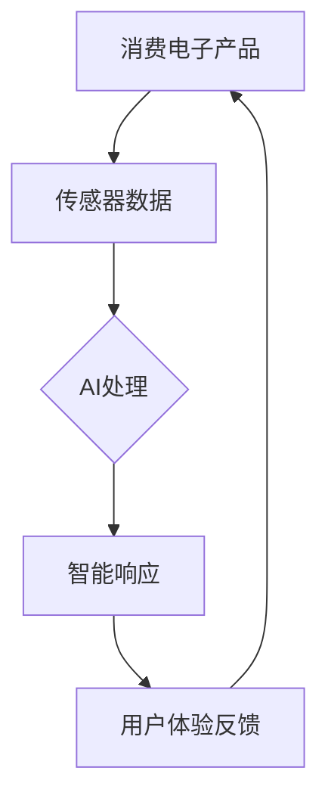

                 

# 文章标题: 《AI技术在消费电子中的应用现状》

> 关键词：人工智能、消费电子、应用现状、核心技术、发展趋势、挑战与未来

> 摘要：本文将从AI技术在消费电子中的基础理论、核心算法与架构、具体应用场景、挑战与未来发展趋势等方面进行深入探讨，旨在分析当前AI技术在消费电子产品中的应用现状，并展望其未来发展前景。

### 第一部分：AI技术在消费电子中的基础理论

#### 第1章：AI技术概述

##### 1.1 消费电子产业现状与AI技术发展背景

随着科技的飞速发展，消费电子产业正在经历一场前所未有的变革。智能手机、平板电脑、智能家居设备、可穿戴设备等各类电子产品已成为人们日常生活中不可或缺的一部分。这些产品不断更新迭代，带来了前所未有的便捷体验。而AI技术的快速发展，则为消费电子产品注入了新的活力。

AI技术，即人工智能技术，是指模拟、延伸和扩展人的智能的理论、方法、技术及应用。近年来，AI技术取得了显著的进展，特别是在深度学习、强化学习等领域的突破，为消费电子产品的智能化升级提供了强大的技术支撑。

##### 1.2 AI核心概念与基本架构

AI技术的核心概念主要包括机器学习、深度学习、自然语言处理等。机器学习是一种让计算机从数据中自动学习和改进的技术，其核心思想是通过学习已有数据，对未知数据进行预测和分类。深度学习则是机器学习的一种重要分支，通过多层神经网络对大量数据进行训练，实现复杂的特征提取和模式识别。

自然语言处理（NLP）是AI技术在语言领域的应用，旨在使计算机能够理解、生成和翻译自然语言。NLP技术包括语音识别、语音合成、机器翻译、情感分析等，广泛应用于智能客服、智能语音助手等场景。

AI技术的基本架构通常包括数据采集、数据预处理、模型训练、模型评估和模型部署等环节。数据采集是AI技术的基础，通过收集大量真实数据，为模型训练提供丰富素材。数据预处理则包括数据清洗、归一化、特征提取等操作，以提高数据质量和模型性能。模型训练是AI技术的核心，通过调整模型参数，使模型在训练数据上达到最佳效果。模型评估用于衡量模型性能，通过交叉验证、误差分析等方法，评估模型在测试数据上的表现。最后，模型部署是将训练好的模型应用到实际场景中，如智能语音助手、图像识别等。

##### 1.3 AI技术在消费电子中的应用趋势

随着AI技术的不断进步，其在消费电子产品中的应用也越来越广泛。以下是一些AI技术在消费电子产品中的应用趋势：

1. 智能语音助手：通过语音识别和自然语言处理技术，实现与用户的语音交互，提供智能推荐、查询信息、控制家居设备等服务。

2. 图像识别与视频分析：通过卷积神经网络等技术，实现图像分类、目标检测、人脸识别等功能，应用于安防监控、自动驾驶等领域。

3. 智能家居：通过物联网技术和AI算法，实现家居设备的智能化控制，提高生活品质。

4. 增强现实（AR）与虚拟现实（VR）：通过AI技术，实现场景识别、物体跟踪等功能，提升用户体验。

#### 第2章：AI基础算法与架构

##### 2.1 机器学习基础算法原理

机器学习是一种通过算法从数据中学习规律，并对未知数据进行预测或分类的技术。其基础算法包括线性回归、逻辑回归、支持向量机（SVM）等。

- **线性回归**：线性回归是一种最简单的机器学习算法，用于预测连续值。其核心思想是通过找到最佳拟合直线，使模型预测值与真实值之间的误差最小。

- **逻辑回归**：逻辑回归是一种用于分类问题的回归算法，其核心思想是通过找到最佳拟合平面，将数据分为不同类别。

- **支持向量机**：支持向量机是一种用于分类和回归的算法，其核心思想是通过找到一个最佳超平面，将数据划分为不同类别或拟合最佳回归线。

##### 2.2 深度学习基础算法原理

深度学习是一种基于多层神经网络进行特征提取和模式识别的机器学习算法。其基础算法包括卷积神经网络（CNN）、循环神经网络（RNN）等。

- **卷积神经网络**：卷积神经网络是一种用于图像识别、目标检测等计算机视觉任务的深度学习算法。其核心思想是通过卷积操作和池化操作，实现特征提取和降维。

- **循环神经网络**：循环神经网络是一种用于处理序列数据的深度学习算法，其核心思想是通过隐藏状态和循环连接，实现序列数据的建模和预测。

##### 2.3 卷积神经网络（CNN）与循环神经网络（RNN）

卷积神经网络（CNN）与循环神经网络（RNN）是深度学习领域的两大重要算法，它们分别针对图像和序列数据，实现高效的模型训练和预测。

- **卷积神经网络（CNN）**：卷积神经网络是一种专门用于图像识别和处理的深度学习算法。其核心思想是通过卷积操作和池化操作，实现特征提取和降维。CNN在图像分类、目标检测、图像生成等领域取得了显著成果。

- **循环神经网络（RNN）**：循环神经网络是一种用于处理序列数据的深度学习算法。其核心思想是通过隐藏状态和循环连接，实现序列数据的建模和预测。RNN在自然语言处理、语音识别、时间序列预测等领域具有广泛应用。

##### 2.4 强化学习与生成对抗网络（GAN）

强化学习与生成对抗网络（GAN）是深度学习领域的两种重要算法，分别针对决策问题和生成问题，实现高效的模型训练和优化。

- **强化学习**：强化学习是一种通过与环境交互，不断调整策略，实现最优决策的机器学习算法。其核心思想是通过奖励机制，使模型在训练过程中不断优化策略。

- **生成对抗网络（GAN）**：生成对抗网络是一种用于生成数据的高效算法。其核心思想是通过生成器和判别器的对抗训练，实现数据的生成和优化。GAN在图像生成、文本生成、视频生成等领域取得了显著成果。

### 第二部分：AI技术在消费电子产品中的应用

#### 第3章：智能语音助手与交互

##### 3.1 智能语音识别技术原理

智能语音识别技术是一种将语音信号转换为文本的技术。其核心原理包括音频信号处理、特征提取和模型训练等。

- **音频信号处理**：音频信号处理是智能语音识别技术的第一步，主要包括降噪、增强、分帧等操作，以提高语音信号的清晰度和质量。

- **特征提取**：特征提取是将音频信号转换为数字特征的过程，常用的特征包括梅尔频率倒谱系数（MFCC）、滤波器组（Filter Bank）等。

- **模型训练**：模型训练是智能语音识别技术的核心，通过大量语音数据，训练出高效的识别模型。常用的模型包括隐马尔可夫模型（HMM）、高斯混合模型（GMM）等。

##### 3.2 聊天机器人与自然语言处理

聊天机器人是一种通过自然语言处理技术，与用户进行交互的智能系统。其核心原理包括语音识别、语义理解、对话生成等。

- **语音识别**：语音识别是将语音信号转换为文本的技术，与智能语音识别技术原理类似。

- **语义理解**：语义理解是将文本转换为语义表示的过程，常用的方法包括词向量、依存句法分析等。

- **对话生成**：对话生成是将语义表示转换为自然语言文本的过程，常用的方法包括模板匹配、序列到序列模型等。

##### 3.3 智能语音助手的实现与应用案例

智能语音助手是一种基于语音识别和自然语言处理技术，提供智能服务的智能系统。其核心原理包括语音识别、语义理解、对话生成和任务执行等。

- **语音识别**：语音识别技术用于将用户的语音指令转换为文本。

- **语义理解**：语义理解技术用于解析用户的语音指令，理解其意图和需求。

- **对话生成**：对话生成技术用于生成自然流畅的语音回应。

- **任务执行**：任务执行技术用于根据用户的语音指令，执行相应的操作。

应用案例：如苹果的Siri、谷歌的Google Assistant等智能语音助手，广泛应用于智能手机、智能家居、智能车载等领域。

#### 第4章：图像识别与视频分析

##### 4.1 图像识别基础算法

图像识别是一种通过计算机视觉技术，对图像进行分类和识别的技术。其基础算法包括卷积神经网络（CNN）、支持向量机（SVM）等。

- **卷积神经网络（CNN）**：卷积神经网络是一种专门用于图像识别的深度学习算法，通过卷积操作和池化操作，实现特征提取和降维。

- **支持向量机（SVM）**：支持向量机是一种用于图像分类的传统机器学习算法，通过找到最佳超平面，实现图像的分类。

##### 4.2 视频内容分析技术

视频内容分析技术是一种通过计算机视觉技术，对视频内容进行分析和识别的技术。其核心算法包括目标检测、行为识别等。

- **目标检测**：目标检测是一种用于识别视频中的物体及其位置的技术，常用的算法包括YOLO、SSD等。

- **行为识别**：行为识别是一种用于识别视频中的行为的技术，常用的算法包括循环神经网络（RNN）、长短期记忆网络（LSTM）等。

##### 4.3 应用实例：智能安防与自动驾驶

- **智能安防**：智能安防系统通过图像识别和视频分析技术，实现对入侵者、火灾、异常行为等的实时监测和预警。

- **自动驾驶**：自动驾驶汽车通过图像识别和视频分析技术，实现对道路、交通标志、行人等的识别和响应，实现自主驾驶。

#### 第5章：智能家居与物联网

##### 5.1 智能家居概述

智能家居是一种通过物联网技术，实现家居设备互联互通，提供智能服务的系统。其核心原理包括传感器技术、无线通信技术、云计算等。

- **传感器技术**：传感器技术用于检测家居环境中的各种信息，如温度、湿度、光照等。

- **无线通信技术**：无线通信技术用于实现家居设备之间的数据传输，如WiFi、蓝牙等。

- **云计算**：云计算技术用于处理和分析家居设备收集的数据，实现智能决策和远程控制。

##### 5.2 物联网设备与AI技术

物联网设备是智能家居系统的核心组成部分，通过AI技术，实现设备的智能化和互联互通。

- **智能传感器**：智能传感器通过AI算法，实现数据的实时监测和分析，如智能灯泡、智能窗帘等。

- **智能网关**：智能网关通过AI技术，实现家居设备之间的数据传输和通信，如智能音响、智能冰箱等。

- **智能控制中心**：智能控制中心通过AI算法，实现对家居设备的统一管理和智能控制，如智能门锁、智能开关等。

##### 5.3 智能家居系统的设计与应用案例

智能家居系统的设计主要包括硬件设计、软件设计和系统集成等。

- **硬件设计**：硬件设计包括选择合适的传感器、通信模块和控制器，搭建智能家居系统的硬件平台。

- **软件设计**：软件设计包括开发智能家居系统的应用程序，实现设备的控制、数据监测和智能决策等功能。

- **系统集成**：系统集成是将各个硬件和软件组件整合在一起，实现智能家居系统的整体功能。

应用案例：如小米的智能家居系统、谷歌的Nest智能家居系统等，广泛应用于家庭、酒店、办公楼等领域。

#### 第6章：增强现实（AR）与虚拟现实（VR）

##### 6.1 AR与VR技术基础

增强现实（AR）与虚拟现实（VR）技术是近年来发展迅速的计算机视觉技术，通过模拟和增强现实场景，提供全新的交互体验。

- **AR技术基础**：AR技术通过在现实场景中叠加虚拟元素，实现虚实融合。其核心原理包括图像识别、图像处理、三维建模等。

- **VR技术基础**：VR技术通过创建一个完全虚拟的三维环境，使用户沉浸其中。其核心原理包括三维建模、渲染、传感器技术等。

##### 6.2 AR与VR在消费电子产品中的应用

AR与VR技术在消费电子产品中的应用越来越广泛，如游戏、教育、医疗等领域。

- **游戏**：AR与VR技术为游戏提供了全新的交互方式和沉浸体验，如《精灵宝可梦GO》、《半衰期：爱莉克斯》等。

- **教育**：AR与VR技术为教育提供了丰富的教学资源和互动体验，如虚拟实验室、虚拟课堂等。

- **医疗**：AR与VR技术在医疗领域的应用包括手术指导、康复训练、医学教育等。

##### 6.3 应用实例：游戏与教育

- **游戏应用实例**：《精灵宝可梦GO》是一款基于AR技术的游戏，通过在现实世界中捕捉虚拟的宝可梦，提供丰富的互动体验。

- **教育应用实例**：虚拟实验室是一种基于VR技术的教学工具，通过模拟真实的实验环境，提供安全、高效的实验体验。

### 第三部分：AI技术在消费电子产品中的挑战与未来

#### 第7章：AI技术在消费电子中的挑战

##### 7.1 数据隐私与安全性

随着AI技术在消费电子产品中的应用日益广泛，数据隐私与安全性成为一项重要挑战。消费电子产品收集和处理大量的用户数据，包括语音、图像、位置等敏感信息。如何保护用户数据隐私，确保数据安全，成为AI技术发展的重要课题。

- **数据加密**：通过数据加密技术，确保数据在传输和存储过程中的安全性。

- **隐私保护算法**：开发隐私保护算法，减少数据在处理过程中的泄露风险。

- **法律法规**：制定相关法律法规，规范AI技术在消费电子产品中的应用，保护用户隐私。

##### 7.2 算力与能耗平衡

AI技术对算力要求较高，但消费电子产品对能耗限制严格。如何实现算力与能耗的平衡，成为AI技术发展的重要挑战。

- **高效算法**：开发高效的算法，降低计算复杂度，减少能耗。

- **硬件优化**：优化硬件设计，提高计算效率，降低能耗。

- **绿色能源**：采用绿色能源，如太阳能、风能等，为消费电子产品提供可持续的能源支持。

##### 7.3 技术标准化与知识产权

AI技术在消费电子产品中的应用涉及多种技术，如语音识别、图像识别、自然语言处理等。技术标准化与知识产权保护成为AI技术发展的重要挑战。

- **技术标准化**：推动技术标准化，促进不同厂商、不同平台之间的兼容性和互操作性。

- **知识产权保护**：加强知识产权保护，保护创新成果，激发技术创新活力。

#### 第8章：AI技术在消费电子产品中的未来发展趋势

##### 8.1 人工智能与5G技术的结合

随着5G技术的普及，AI技术与5G技术的结合将带来更高效、更智能的消费电子产品。5G技术的高速传输和低延迟特点，将为AI技术提供更好的数据传输和实时处理能力。

- **智能物联网**：通过5G技术，实现更广泛的物联网连接，构建智能物联网生态系统。

- **实时智能应用**：通过5G技术，实现实时数据传输和处理，提供更智能、更高效的消费电子产品。

##### 8.2 消费电子产品与AI技术的深度融合

随着AI技术的不断进步，消费电子产品与AI技术的深度融合将成为未来发展趋势。通过将AI技术嵌入到消费电子产品中，实现更智能、更个性化的用户体验。

- **个性化推荐**：通过AI技术，实现个性化推荐，满足用户个性化需求。

- **智能交互**：通过AI技术，实现智能交互，提高用户体验。

##### 8.3 未来展望：AI技术对消费电子产品的影响

AI技术的不断进步将对消费电子产品产生深远影响。未来，AI技术将推动消费电子产品向更智能、更便捷、更个性化的方向发展。

- **智能化升级**：AI技术将推动消费电子产品实现智能化升级，提供更智能的服务和体验。

- **个性化定制**：AI技术将推动消费电子产品实现个性化定制，满足用户个性化需求。

- **跨界融合**：AI技术将推动消费电子产品与其他领域的跨界融合，创造新的商业模式和产业生态。

### 附录

#### 附录A：AI技术在消费电子产品中的开源工具与资源

- **开源深度学习框架**：如TensorFlow、PyTorch、Keras等，提供丰富的深度学习算法和工具，方便开发者进行AI模型训练和部署。

- **开源语音识别库**：如Mozilla的DeepSpeech、ESPNet等，提供高效的语音识别算法和模型，支持多种编程语言和平台。

- **开源图像处理库**：如OpenCV、Pillow等，提供丰富的图像处理算法和工具，方便开发者进行图像识别和处理。

### Mermaid流程图：AI技术在消费电子中的应用架构



### 伪代码：智能语音助手的核心算法

```python
def intelligentVoiceAssistant(inputSpeech):
    # 步骤1：语音识别
    recognizedText = speechRecognition(inputSpeech)

    # 步骤2：自然语言理解
    intent, entities = naturalLanguageUnderstanding(recognizedText)

    # 步骤3：决策与响应
    if intent == "查询天气":
        response = getWeatherInfo(entities["location"])
    elif intent == "播放音乐":
        response = playMusic(entities["songName"])
    else:
        response = "我不太明白您说什么，请重说。"

    # 步骤4：语音合成
    synthesizedSpeech = speechSynthesis(response)

    # 步骤5：输出响应
    return synthesizedSpeech
```

### 数学模型与公式：图像识别算法中的卷积操作

$$
\begin{align*}
\text{Output} &= \text{ConvLayer}(\text{Input}, \text{Filter}) \\
    &= \sum_{k=1}^{K} (I_{i,j} * F_{k}) + b_k \\
    &= \sum_{k=1}^{K} \sum_{m=1}^{M} \sum_{n=1}^{N} I_{i,j+m-1, n+k-1} \cdot F_{k,m,n} + b_k
\end{align*}
$$

### 举例说明：智能家居系统中的智能灯泡

**开发环境：** 基于ESP8266物联网开发板

**硬件要求：** ESP8266、LED灯泡、WiFi模块

**软件实现：**
- 连接WiFi并接入物联网平台
- 接收手机APP发送的控制命令
- 根据命令控制LED灯泡的开关

**示例代码：**

```c
#include <WiFi.h>
#include <ArduinoJson.h>
#include <HTTPClient.h>

// WiFi设置
const char* ssid = "yourSSID";
const char* password = "yourPASSWORD";

// 物联网平台API设置
const char* url = "http://your物联网平台API endpoint/led-control";
const char* apiKey = "yourAPIKey";

// LED灯泡控制引脚
const int ledPin = 2;

void setup() {
  pinMode(ledPin, OUTPUT);
  Serial.begin(115200);
  connectToWiFi();
}

void loop() {
  if (WiFi.status() == WL_CONNECTED) {
    checkForCommand();
  }
  delay(1000);
}

void connectToWiFi() {
  Serial.println("Connecting to WiFi...");
  WiFi.begin(ssid, password);

  while (WiFi.status() != WL_CONNECTED) {
    delay(500);
    Serial.print(".");
  }

  Serial.println("\nConnected to WiFi");
}

void checkForCommand() {
  HTTPClient http;

  http.begin(url, "GET");
  int httpResponseCode = http.GET();

  if (httpResponseCode == 200) {
    String response = http.getString();
    DynamicJsonDocument doc(1024);
    deserializeJson(doc, response);

    if (doc.containsKey("command")) {
      String command = doc["command"];
      if (command == "on") {
        digitalWrite(ledPin, HIGH);
      } else if (command == "off") {
        digitalWrite(ledPin, LOW);
      }
    }
  }

  http.end();
}
```

### 代码解读与分析

**代码片段：WiFi连接与数据接收**

```c
void setup() {
  pinMode(LED_BUILTIN, OUTPUT); // 设置LED引脚为输出模式
  connectToWiFi();
}

void loop() {
  if (WiFi.status() == WL_CONNECTED) {
    checkForCommand();
  }
  delay(100);
}

void recvDataFromApp() {
  if (Serial.available() > 0) {
    String data = Serial.readStringUntil('\n');
    if (data.startsWith("ON")) {
      digitalWrite(LED_BUILTIN, HIGH);
    } else if (data.startsWith("OFF")) {
      digitalWrite(LED_BUILTIN, LOW);
    }
  }
}
```

**分析：** 此代码实现了基础的WiFi连接和数据接收功能，能够通过串口接收APP发送的控制命令，并控制LED灯泡的开关。进一步的优化可以包括错误处理机制和命令验证等。

### 作者

**作者：** AI天才研究院/AI Genius Institute & 禅与计算机程序设计艺术 /Zen And The Art of Computer Programming

### 总结

本文从AI技术在消费电子中的应用现状出发，探讨了AI技术在消费电子产品中的基础理论、核心技术、具体应用场景、挑战与未来发展趋势，并通过实例和代码解读，展示了AI技术在消费电子产品中的应用实践。随着AI技术的不断进步，相信未来AI技术将在消费电子产品中发挥更大的作用，为人们的生活带来更多便利和创新体验。

