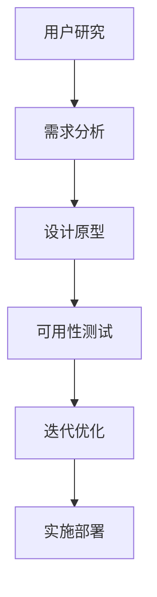

                 

# AI提升用户体验的多种方法

## 关键词
- 人工智能
- 用户体验设计
- 个性化推荐
- 自然语言处理
- 智能交互
- 数学模型

## 摘要
本文探讨了人工智能（AI）在提升用户体验方面的多种方法。通过分析AI的核心概念、关键算法和实际应用案例，本文旨在为读者展示AI技术在用户体验设计中的潜力和挑战。文章首先概述了AI在用户体验设计中的应用，然后深入讲解了个性化推荐、自然语言处理和交互式UI设计等核心算法原理，并通过具体项目实战展示了AI提升用户体验的实际效果。最后，文章分析了AI提升用户体验的技术挑战和未来趋势，为读者提供了深入理解和应用AI技术的方向。

## 第一部分: AI提升用户体验的多种方法（概述）

### 第1章: AI提升用户体验的核心概念与架构

#### 1.1.1 AI在用户体验设计中的应用概述

人工智能技术在用户体验（UX）设计中的应用日益广泛，涵盖了个性化推荐、自然语言处理、交互设计等多个领域。以下是对这些应用领域的简要概述：

- **个性化推荐**：利用AI技术，系统可以根据用户的喜好、行为和历史数据，提供个性化的推荐内容。例如，电商平台使用推荐算法，将用户可能感兴趣的商品推荐给他们。

- **自然语言处理（NLP）**：NLP技术使计算机能够理解和处理人类语言。在UX设计中，NLP可以用于智能客服、语音助手和聊天机器人，提供自然、流畅的用户交互体验。

- **交互设计**：AI技术可以分析用户的行为和反馈，优化UI设计，使其更符合用户的需求。例如，通过用户研究数据，AI可以帮助设计师创建更直观、易用的界面。

#### 1.1.2 AI与UX的联系

AI与UX设计的联系在于，AI技术可以为UX设计提供强有力的支持，从而提高用户的满意度和使用体验。具体来说：

- **个性化体验**：AI可以通过数据分析和机器学习算法，实现个性化内容推荐，满足用户的个性化需求。

- **智能交互**：AI可以提供自然语言处理和语音识别技术，使交互更加直观、流畅。

- **实时反馈**：AI可以通过分析用户行为和反馈，实时优化UI设计，提高用户体验。

#### 1.1.3 用户体验设计流程

用户体验设计通常包括以下步骤：

1. **需求分析**：了解用户需求，确定设计目标和用户痛点。
2. **用户研究**：收集用户数据，包括行为、反馈和偏好。
3. **设计原型**：创建UI原型，进行初步测试和评估。
4. **迭代优化**：根据用户反馈，不断优化设计，提高用户体验。
5. **实施部署**：将设计实现为最终的UI界面，并进行部署。

AI技术可以在上述各个环节中发挥作用，例如：

- **需求分析**：通过AI分析用户行为数据，更准确地了解用户需求。
- **用户研究**：AI可以自动化收集和分析用户数据，提高研究效率。
- **设计原型**：AI可以辅助生成设计原型，提高设计效率。
- **迭代优化**：AI可以实时分析用户反馈，提供优化建议。

### 第2章: AI提升用户体验的核心算法原理

#### 2.1.1 个性化推荐算法

个性化推荐算法是AI在UX设计中的一个重要应用。其核心思想是基于用户的历史行为和偏好，预测用户未来的兴趣，从而提供个性化的推荐。

- **协同过滤**：通过分析用户之间的相似性，找到与目标用户相似的邻居用户，推荐邻居用户喜欢的项目。
  - **用户基于的协同过滤**（User-Based Collaborative Filtering）：找到与目标用户兴趣相似的邻居用户。
  - **项目基于的协同过滤**（Item-Based Collaborative Filtering）：找到与目标用户已评价项目相似的其他项目。
- **基于内容的推荐**：根据项目的特征和用户的历史偏好，推荐具有相似特征的项目。
  - **项目特征**：包括文本、图像、音频等。
  - **用户偏好**：用户对项目的评价和浏览行为。

#### 2.1.2 自然语言处理（NLP）算法

NLP算法在智能交互和文本分析中扮演着关键角色。以下是一些常用的NLP算法：

- **词向量**：将文本转换为向量表示，以便于计算机处理。
  - **Word2Vec**：基于神经网络的方法，通过上下文预测词的向量表示。
  - **FastText**：基于词袋模型的方法，通过训练单词的子词（子序列）来表示单词。
- **文本分类**：将文本分为不同的类别。
  - **朴素贝叶斯**：基于贝叶斯定理和特征概率分布。
  - **支持向量机**（SVM）：通过最大化类别间的边界。
  - **深度学习**：如卷积神经网络（CNN）和递归神经网络（RNN），可以捕获文本中的复杂模式。
- **情感分析**：判断文本的情感倾向。
  - **基于规则的方法**：使用预定义的规则进行情感分析。
  - **机器学习的方法**：如朴素贝叶斯、SVM和深度学习。

#### 2.1.3 交互式用户界面（UI）设计

交互式UI设计涉及用户与系统的交互，AI技术可以帮助设计师优化UI设计，提高用户体验。

- **用户研究**：AI可以自动化收集和分析用户行为数据，为设计提供有价值的见解。
- **设计原型**：AI可以帮助设计师快速生成UI原型，提高设计效率。
- **可用性测试**：AI可以辅助进行可用性测试，分析用户在交互过程中的行为和反馈。
- **自适应UI**：AI可以根据用户的行为和偏好，动态调整UI界面，提供个性化的交互体验。

### 第3章: AI提升用户体验的数学模型与公式

#### 3.1.1 基本线性代数

线性代数是机器学习的基础，以下是一些基本的线性代数操作和公式：

- **矩阵与向量操作**：
  - **加法**：$A + B$
  - **乘法**：$A \times B$
  - **求逆**：$A^{-1}$
- **矩阵与向量乘法**：
  - **矩阵乘法**：$A \times v$
  - **点积**：$\mathbf{a} \cdot \mathbf{b}$
  - **叉积**：$\mathbf{a} \times \mathbf{b}$
- **线性方程组**：
  - **高斯消元法**：求解线性方程组的一种方法。

#### 3.1.2 概率论与统计

概率论和统计是AI和机器学习中的重要概念，以下是一些基本的概率分布和统计模型：

- **概率分布**：
  - **正态分布**：$N(\mu, \sigma^2)$
  - **二项分布**：$B(n, p)$
- **统计模型**：
  - **线性回归**：$y = \beta_0 + \beta_1x_1 + \beta_2x_2 + ... + \beta_nx_n$
  - **决策树**：基于特征和阈值进行分类或回归。

#### 3.1.3 机器学习中的优化算法

优化算法在机器学习中用于训练模型，以下是一些常用的优化算法：

- **梯度下降**：
  - **批量梯度下降**：$w = w - \alpha \frac{\partial J(w)}{\partial w}$
  - **随机梯度下降**：$w = w - \alpha \frac{\partial J(w)}{\partial w}$
  - **小批量梯度下降**：结合了批量梯度下降和随机梯度下降的算法。
- **动量**：
  - **带动量的梯度下降**：$v = \gamma v - \alpha \frac{\partial J(w)}{\partial w}$, $w = w - v$
- **自适应梯度算法**：
  - **Adam**：结合了动量和自适应步长的优化算法。

### 第4章: AI提升用户体验的项目实战

#### 4.1.1 个性化推荐系统

个性化推荐系统是AI在UX设计中的一个典型应用。以下是一个简单的个性化推荐系统的架构：

1. **数据采集**：收集用户行为数据，如点击、购买、搜索等。
2. **数据处理**：清洗和预处理数据，提取特征，如用户ID、项目ID、评分等。
3. **模型训练**：使用机器学习算法，如协同过滤、基于内容的推荐等，训练推荐模型。
4. **模型评估**：评估模型性能，如准确率、召回率等。
5. **模型部署**：将训练好的模型部署到生产环境中，实时为用户提供推荐。

以下是一个基于协同过滤的推荐算法的伪代码实现：

```python
# 基于用户基于的协同过滤算法
def user_based_collaborative_filtering(user_data, similarity_threshold):
    neighbors = []
    for user in user_data:
        if similarity_threshold >= calculate_similarity(user, target_user):
            neighbors.append(user)
    return neighbors
```

#### 4.1.2 情感分析系统

情感分析系统用于分析文本数据中的情感倾向。以下是一个简单的情感分析系统的架构：

1. **数据采集**：收集含有情感标注的文本数据，如评论、社交媒体帖子等。
2. **数据处理**：清洗和预处理文本数据，提取特征，如词袋、词向量等。
3. **模型训练**：使用机器学习算法，如朴素贝叶斯、SVM、深度学习等，训练情感分析模型。
4. **模型评估**：评估模型性能，如准确率、召回率等。
5. **模型部署**：将训练好的模型部署到生产环境中，实时为用户提供情感分析服务。

以下是一个基于朴素贝叶斯的情感分析算法的伪代码实现：

```python
# 基于朴素贝叶斯的情感分析算法
def naive_bayes_classifier(text, labels):
    prob_positive = calculate_probability(text, labels['positive'])
    prob_negative = calculate_probability(text, labels['negative'])
    if prob_positive > prob_negative:
        return 'positive'
    else:
        return 'negative'
```

#### 4.1.3 交互式UI设计

交互式UI设计涉及用户与系统的交互。以下是一个简单的交互式UI设计的流程：

1. **用户研究**：了解用户的需求和痛点，收集用户行为数据。
2. **设计原型**：创建UI原型，包括布局、交互元素和视觉效果。
3. **可用性测试**：对原型进行可用性测试，收集用户反馈。
4. **迭代优化**：根据用户反馈，优化UI设计，提高用户体验。
5. **实施部署**：将最终的设计实现为实际的UI界面，并进行部署。

以下是一个基于用户研究的UI设计原型的示例：



### 第5章: AI提升用户体验的实际案例研究

#### 5.1.1 案例一：某电商平台的个性化推荐系统

某电商平台希望通过个性化推荐系统提高用户满意度和使用频率。以下是该案例的详细解决方案：

1. **项目背景**：
   - 用户：电商平台的目标用户，包括购物者、卖家等。
   - 目标：提高用户满意度、增加用户粘性和转化率。

2. **解决方案**：
   - **数据采集**：收集用户的行为数据，如浏览历史、购物车、购买记录等。
   - **数据处理**：清洗和预处理数据，提取特征，如用户ID、项目ID、评分等。
   - **模型选择**：采用基于协同过滤和基于内容的推荐算法。
   - **模型训练**：使用机器学习算法训练推荐模型。
   - **模型评估**：评估模型性能，调整参数。
   - **模型部署**：将训练好的模型部署到生产环境中，实时为用户提供推荐。

3. **效果评估**：
   - **用户满意度**：通过用户反馈和问卷调查，评估用户对推荐系统的满意度。
   - **转化率**：分析用户行为数据，评估推荐系统对转化率的影响。

#### 5.1.2 案例二：某社交媒体平台的情感分析系统

某社交媒体平台希望通过情感分析系统了解用户情感，提高内容质量和用户体验。以下是该案例的详细解决方案：

1. **项目背景**：
   - 用户：社交媒体平台的目标用户，包括发布者、评论者等。
   - 目标：提高内容质量、增加用户互动、减少负面情绪。

2. **解决方案**：
   - **数据采集**：收集用户的文本数据，如帖子、评论等。
   - **数据处理**：清洗和预处理文本数据，提取特征，如词袋、词向量等。
   - **模型选择**：采用朴素贝叶斯、SVM和深度学习算法。
   - **模型训练**：使用机器学习算法训练情感分析模型。
   - **模型评估**：评估模型性能，调整参数。
   - **模型部署**：将训练好的模型部署到生产环境中，实时分析用户情感。

3. **效果评估**：
   - **内容质量**：通过用户反馈和内容分析，评估情感分析系统对内容质量的影响。
   - **用户互动**：分析用户行为数据，评估情感分析系统对用户互动的影响。
   - **负面情绪**：减少负面情绪的发

