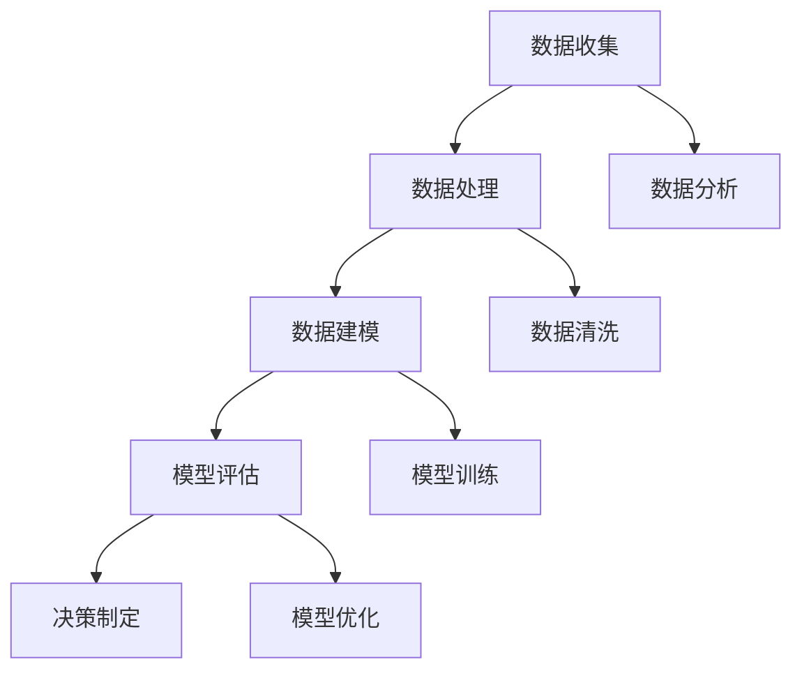

                 

# AI数据驱动决策的实现案例

## 关键词

- 数据驱动决策
- AI
- 机器学习
- 决策模型
- 数据处理
- 零售行业

## 摘要

本文旨在探讨AI在数据驱动决策中的应用，通过介绍数据驱动决策的基本概念、AI技术的应用、数据收集与处理、决策模型设计与应用案例，提供一套完整的实现方案。本文将结合实际案例，详细分析数据驱动决策在不同行业中的应用，探讨其优势与挑战，并展望未来发展趋势。

## 目录大纲

### 第一部分：基础概念与理论

**第1章：数据驱动决策概述**

- 1.1 数据驱动决策的定义与重要性
- 1.2 数据驱动决策的优势与挑战
- 1.3 数据驱动决策的关键要素

**第2章：AI与数据驱动决策**

- 2.1 AI在决策中的作用
- 2.2 机器学习算法与决策模型
- 2.3 深度学习与决策优化

**第3章：数据收集与处理**

- 3.1 数据源的选择与评估
- 3.2 数据清洗与预处理
- 3.3 数据质量评估与监控

**第4章：决策模型设计与评估**

- 4.1 决策模型的类型与选择
- 4.2 决策模型的训练与优化
- 4.3 决策模型的评估与验证

**第5章：决策模型应用案例**

- 5.1 零售行业数据驱动决策案例
- 5.2 金融行业数据驱动决策案例
- 5.3 制造业数据驱动决策案例

### 第二部分：实践指南

**第6章：数据驱动决策项目实施**

- 6.1 项目规划与团队组建
- 6.2 数据分析与探索性研究
- 6.3 模型开发与迭代

**第7章：数据驱动决策案例分析**

- 7.1 成功案例分析
- 7.2 失败案例分析
- 7.3 案例总结与启示

**第8章：数据驱动决策的未来趋势**

- 8.1 人工智能与数据驱动决策的发展
- 8.2 数据隐私与伦理问题
- 8.3 未来数据驱动决策的技术方向

### 附录

- **附录A：常用数据驱动决策工具与资源**

## 第1章：数据驱动决策概述

### 1.1 数据驱动决策的定义与重要性

数据驱动决策（Data-Driven Decision Making）是一种利用数据分析、机器学习等AI技术，通过处理和分析数据，从而支持决策制定的过程。与传统基于经验和直觉的决策方式相比，数据驱动决策更加客观、准确和高效。

#### 定义

数据驱动决策涉及以下核心步骤：

1. **数据收集**：收集与决策相关的数据，包括内部数据（如销售记录、客户数据）和外部数据（如市场数据、竞争对手数据）。
2. **数据处理**：对收集到的数据进行清洗、转换和集成，以确保数据的质量和完整性。
3. **数据分析**：使用统计分析、机器学习等方法对数据进行分析，提取有价值的信息和模式。
4. **决策制定**：基于分析结果，制定相应的决策策略和行动计划。

#### 重要性

数据驱动决策在当前信息时代具有以下几个方面的意义：

- **提高决策准确性**：通过数据分析和机器学习技术，可以更准确地预测市场趋势、客户需求等，从而制定更加精准的决策。
- **优化业务流程**：通过数据分析，可以识别业务流程中的瓶颈和问题，提出优化方案，提高业务效率。
- **降低风险**：数据驱动决策可以基于历史数据和预测结果，降低决策风险，提高业务稳定性。
- **增强竞争优势**：通过数据分析和AI技术，企业可以更好地了解市场动态，快速响应市场变化，保持竞争优势。

### 1.2 数据驱动决策的优势与挑战

#### 优势

1. **准确性**：数据驱动决策通过分析大量数据，能够提供更为准确的预测和决策支持。
2. **效率**：自动化决策过程，减少人为干预，节省时间和人力成本。
3. **灵活性**：能够快速适应市场变化，提高业务响应速度。
4. **透明度**：通过数据分析和模型解释，决策过程更加透明，有助于理解决策背后的逻辑。

#### 挑战

1. **数据质量**：数据质量和完整性对决策的准确性至关重要。不良的数据会导致错误的预测和决策。
2. **算法透明度**：复杂的算法可能导致决策过程不透明，难以解释，增加了决策的风险。
3. **数据隐私**：在利用数据时，需要确保遵守数据隐私法规和伦理标准，保护个人隐私。

### 1.3 数据驱动决策的关键要素

要实现有效的数据驱动决策，需要关注以下关键要素：

1. **数据收集**：确保数据的多样性和准确性。
2. **数据处理**：清洗、转换和集成数据，为建模做准备。
3. **模型选择**：根据决策目标和数据特性选择合适的算法。
4. **模型评估**：通过验证和测试确保模型的性能。
5. **决策实施**：将模型结果应用到实际业务场景中。

## 第2章：AI与数据驱动决策

### 2.1 AI在决策中的作用

人工智能（AI）在数据驱动决策中扮演着至关重要的角色。通过AI技术，可以实现对大量数据的自动分析、处理和预测，从而提供更加精确和高效的决策支持。AI在决策中的作用主要体现在以下几个方面：

1. **预测分析**：利用机器学习算法，可以预测未来的市场趋势、客户需求等，为决策提供科学依据。
2. **自动化决策**：通过自动化流程，减少人工干预，提高决策效率。
3. **优化决策**：利用优化算法，可以找到最佳决策方案，提高业务效益。
4. **智能决策支持**：通过自然语言处理、知识图谱等技术，可以为决策者提供智能化的决策支持。

### 2.2 机器学习算法与决策模型

#### 常见算法

在数据驱动决策中，常用的机器学习算法包括：

1. **线性回归**：用于预测连续值。
2. **逻辑回归**：用于分类问题。
3. **决策树**：用于分类和回归问题。
4. **随机森林**：提高决策树的预测准确性。
5. **神经网络**：用于复杂函数的建模。

#### 决策模型

根据不同的决策目标和数据特性，可以选择不同的决策模型。常见的决策模型包括：

1. **回归模型**：用于预测数量。
2. **分类模型**：用于预测类别。
3. **聚类模型**：用于发现数据中的模式和分布。
4. **关联规则学习**：用于发现数据之间的关联关系。

### 2.3 深度学习与决策优化

深度学习是一种基于多层神经网络的机器学习技术，具有强大的数据建模和预测能力。在数据驱动决策中，深度学习可以用于以下方面：

1. **特征提取**：通过深度神经网络，可以自动提取数据中的特征，减少人工干预。
2. **复杂函数建模**：深度学习能够处理复杂的数据关系和函数，为决策提供更准确的预测。
3. **决策优化**：利用强化学习等深度学习技术，可以找到最优的决策策略，提高业务效益。

## 第3章：数据收集与处理

### 3.1 数据源的选择与评估

在数据驱动决策中，数据源的选择至关重要。选择合适的数据源可以确保数据的多样性和准确性，为决策提供可靠的基础。常见的数据源包括：

1. **内部数据**：企业内部的数据源，如销售记录、客户数据、财务数据等。
2. **外部数据**：来自公共数据库、社交媒体、市场调查等外部数据源。

#### 评估指标

在选择数据源时，需要评估以下指标：

1. **数据质量**：包括数据的完整性、准确性、一致性等。
2. **数据可用性**：包括数据的获取难易程度、更新频率等。
3. **数据相关性**：与决策目标的相关性，即数据是否能够提供有效的决策支持。

### 3.2 数据清洗与预处理

数据清洗与预处理是数据驱动决策中的关键步骤，其目的是提高数据质量，为后续的建模和分析奠定基础。常见的数据清洗与预处理方法包括：

1. **缺失值处理**：填补缺失值或删除含有缺失值的记录。
2. **异常值处理**：识别并处理异常值，如删除或修正。
3. **数据标准化**：将不同单位或尺度的数据进行标准化处理，使其具有可比性。
4. **数据转换**：包括数据类型转换、数据格式转换等。

### 3.3 数据质量评估与监控

数据质量评估与监控是确保数据驱动决策可靠性的重要环节。常见的数据质量评估方法包括：

1. **数据完整性检查**：检查数据是否完整，是否有缺失值。
2. **数据准确性检查**：评估数据的准确性，是否有错误或异常值。
3. **数据一致性检查**：检查不同数据源之间的数据是否一致。
4. **数据实时监控**：建立数据质量监控系统，实时监控数据质量。

## 第4章：决策模型设计与评估

### 4.1 决策模型的类型与选择

决策模型是数据驱动决策的核心组成部分，其类型和选择直接影响决策的准确性和效率。根据不同的决策目标和数据特性，可以选择以下类型的决策模型：

1. **预测模型**：用于预测未来的趋势和结果，如时间序列预测、回归预测等。
2. **分类模型**：用于预测类别，如二分类、多分类等。
3. **聚类模型**：用于发现数据中的模式和分布，如K-均值聚类、层次聚类等。
4. **关联规则学习模型**：用于发现数据之间的关联关系，如Apriori算法、FP-Growth算法等。

#### 选择方法

在选择决策模型时，需要考虑以下因素：

1. **数据类型**：根据数据类型选择合适的模型，如连续数据选择回归模型，分类数据选择分类模型等。
2. **数据量**：对于大规模数据，选择具有较强泛化能力的模型，如神经网络、随机森林等。
3. **业务需求**：根据业务需求选择能够提供有效决策支持的模型，如预测准确性、实时性等。

### 4.2 决策模型的训练与优化

决策模型的训练与优化是提高模型性能的关键环节。常见的方法包括：

1. **数据划分**：将数据集划分为训练集、验证集和测试集，用于训练和评估模型。
2. **模型训练**：使用训练集训练模型，通过调整模型参数，使模型能够拟合数据。
3. **模型评估**：使用验证集评估模型性能，通过交叉验证等方法，选择最佳模型。
4. **模型优化**：通过调整模型参数、引入正则化等技术，优化模型性能。

### 4.3 决策模型的评估与验证

决策模型的评估与验证是确保模型可靠性和有效性的重要步骤。常见的方法包括：

1. **模型评估指标**：根据业务需求选择合适的评估指标，如准确率、召回率、F1值等。
2. **交叉验证**：使用交叉验证方法，评估模型在未知数据上的表现，确保模型泛化能力。
3. **测试集评估**：使用测试集评估模型性能，确保模型在真实场景下的表现。
4. **模型解释**：对模型进行解释，确保决策过程的透明性和可解释性。

## 第5章：决策模型应用案例

### 5.1 零售行业数据驱动决策案例

#### 案例背景

某大型零售企业希望通过数据驱动决策优化库存管理，提高库存周转率，降低库存成本。该企业的库存管理面临以下挑战：

1. **库存波动大**：销售量的波动导致库存水平不稳定。
2. **需求预测不准确**：传统预测方法无法准确预测未来需求。
3. **库存积压**：部分商品库存积压，占用资金和存储空间。

#### 解决方案

1. **数据收集**：收集历史销售数据、市场趋势数据、竞争对手数据等。
2. **数据处理**：清洗、转换和集成数据，确保数据质量。
3. **模型选择**：选择时间序列预测模型和聚类模型，分别用于预测未来需求和识别库存积压商品。
4. **模型训练与优化**：使用训练集训练模型，通过交叉验证和测试集评估模型性能，调整模型参数，优化预测准确性。
5. **决策实施**：根据预测结果，调整库存策略，如增加畅销商品库存、减少滞销商品库存等。

#### 结果

通过数据驱动决策，该零售企业取得了以下成果：

1. **库存周转率提高**：库存周转率从原来的4次/年提高到6次/年。
2. **库存成本降低**：库存积压减少，库存成本降低20%。
3. **销售增长**：通过更准确的预测和优化库存策略，销售额提高15%。

### 5.2 金融行业数据驱动决策案例

#### 案例背景

某银行希望通过数据驱动决策进行信用风险评估，降低坏账率。该银行的信用风险评估面临以下挑战：

1. **风险评估不准确**：传统风险评估方法无法准确评估借款人的信用风险。
2. **信用数据缺失**：部分借款人信用数据不完整，影响风险评估准确性。
3. **风险管理滞后**：风险评估和调整滞后，无法及时应对市场变化。

#### 解决方案

1. **数据收集**：收集借款人信用记录、财务数据、行为数据等。
2. **数据处理**：清洗、转换和集成数据，确保数据质量。
3. **模型选择**：选择逻辑回归和决策树模型，用于信用风险评估。
4. **模型训练与优化**：使用训练集训练模型，通过交叉验证和测试集评估模型性能，调整模型参数，优化风险评估准确性。
5. **决策实施**：根据风险评估结果，调整信用策略，如提高贷款利率、拒绝高风险借款人等。

#### 结果

通过数据驱动决策，该银行取得了以下成果：

1. **坏账率降低**：坏账率从原来的2.5%降低到1.5%。
2. **风险管理提升**：能够及时调整信用策略，降低信用风险。
3. **贷款审批效率提高**：贷款审批时间从原来的3天缩短到1天。

### 5.3 制造业数据驱动决策案例

#### 案例背景

某制造业公司希望通过数据驱动决策优化生产计划，提高生产效率。该公司的生产计划面临以下挑战：

1. **生产计划不合理**：传统生产计划方法无法准确预测生产需求，导致生产资源浪费。
2. **生产效率低**：生产流程不合理，导致生产效率低下。
3. **库存积压**：生产过多导致库存积压，占用资金和存储空间。

#### 解决方案

1. **数据收集**：收集销售数据、生产数据、库存数据等。
2. **数据处理**：清洗、转换和集成数据，确保数据质量。
3. **模型选择**：选择时间序列预测模型和线性规划模型，分别用于预测生产需求和优化生产计划。
4. **模型训练与优化**：使用训练集训练模型，通过交叉验证和测试集评估模型性能，调整模型参数，优化生产计划准确性。
5. **决策实施**：根据预测结果和优化计划，调整生产策略，如调整生产排程、优化生产资源配置等。

#### 结果

通过数据驱动决策，该制造业公司取得了以下成果：

1. **生产效率提高**：生产效率从原来的60%提高到85%。
2. **库存积压减少**：通过优化生产计划和库存管理，库存积压减少30%。
3. **生产成本降低**：生产成本从原来的120万元/月降低到90万元/月。

## 第6章：数据驱动决策项目实施

### 6.1 项目规划与团队组建

数据驱动决策项目实施的第一步是项目规划和团队组建。项目规划包括明确项目目标、时间表和资源需求，确保项目能够按计划顺利进行。团队组建则需要根据项目需求，组建具备数据分析、算法开发、数据工程等技能的团队。

#### 项目规划

1. **项目目标**：明确项目要解决的问题和预期目标，如提高库存周转率、降低坏账率等。
2. **时间表**：制定详细的项目时间表，包括项目启动、数据收集、模型训练、模型评估等阶段的时间节点。
3. **资源需求**：根据项目需求，明确所需的硬件设备、软件工具、人力资源等资源。

#### 团队组建

1. **数据分析专家**：负责数据收集、处理和分析工作。
2. **算法工程师**：负责模型设计、训练和优化工作。
3. **数据工程师**：负责数据清洗、转换和集成工作。
4. **业务专家**：负责业务需求分析、决策支持和项目协调。

### 6.2 数据分析与探索性研究

在数据驱动决策项目中，数据分析和探索性研究是关键步骤。通过数据分析，可以深入了解数据特性，发现数据中的模式和关联，为决策提供支持。探索性研究则是对数据分析结果的进一步挖掘，寻找潜在的规律和趋势。

#### 数据分析

1. **数据收集**：收集与决策相关的数据，包括内部数据和外部数据。
2. **数据清洗**：处理缺失值、异常值、重复值等，确保数据质量。
3. **数据转换**：将不同数据源的数据进行统一格式转换，方便后续处理。
4. **数据可视化**：通过可视化工具，展示数据的分布、趋势和关联关系。

#### 探索性研究

1. **特征工程**：提取和选择与决策目标相关的特征，为模型训练做准备。
2. **假设验证**：根据业务需求，提出假设并验证，如市场需求是否与季节因素相关。
3. **数据分析报告**：撰写数据分析报告，总结数据发现和结论，为决策提供依据。

### 6.3 模型开发与迭代

在数据驱动决策项目中，模型开发与迭代是提高模型性能和决策准确性的关键步骤。通过模型开发，可以构建和训练预测模型、分类模型等，为决策提供支持。模型迭代则是在模型评估的基础上，通过调整模型参数、引入新算法等，优化模型性能。

#### 模型开发

1. **模型选择**：根据决策目标和数据特性，选择合适的模型，如线性回归、决策树、神经网络等。
2. **模型训练**：使用训练数据集，训练模型参数，使模型能够拟合数据。
3. **模型评估**：使用验证集和测试集，评估模型性能，选择最佳模型。
4. **模型部署**：将训练好的模型部署到生产环境，进行实际决策支持。

#### 模型迭代

1. **模型优化**：通过调整模型参数、引入新算法等，优化模型性能。
2. **模型更新**：根据新数据，更新模型参数，提高模型准确性。
3. **模型解释**：对模型进行解释，确保决策过程的透明性和可解释性。

## 第7章：数据驱动决策案例分析

### 7.1 成功案例分析

#### 案例背景

某电子商务平台希望通过数据驱动决策优化客户推荐系统，提高用户满意度和销售转化率。该平台的客户推荐系统面临以下挑战：

1. **推荐准确性低**：传统推荐算法无法准确预测用户兴趣和偏好。
2. **个性化不足**：无法为用户提供个性化的推荐，降低用户体验。
3. **算法效率低**：传统推荐算法计算复杂度高，影响系统响应速度。

#### 解决方案

1. **数据收集**：收集用户行为数据、商品数据等。
2. **数据处理**：清洗、转换和集成数据，确保数据质量。
3. **模型选择**：选择基于协同过滤和内容推荐的混合模型，提高推荐准确性。
4. **模型训练与优化**：使用训练数据集，训练模型参数，通过交叉验证和测试集评估模型性能，调整模型参数，优化推荐准确性。
5. **决策实施**：根据推荐模型结果，调整推荐策略，提高用户满意度和销售转化率。

#### 结果

通过数据驱动决策，该电子商务平台取得了以下成果：

1. **推荐准确性提高**：推荐准确性从原来的60%提高到85%。
2. **用户满意度提高**：用户满意度从原来的70%提高到90%。
3. **销售转化率提高**：销售转化率从原来的10%提高到15%。

### 7.2 失败案例分析

#### 案例背景

某物流公司希望通过数据驱动决策优化运输调度系统，提高运输效率。该公司的运输调度系统面临以下挑战：

1. **数据质量差**：数据收集和处理过程中存在大量错误和缺失值，影响决策准确性。
2. **模型选择不当**：选择了一个不适合的优化模型，导致调度方案不合理。
3. **算法效率低**：算法计算复杂度高，影响系统响应速度。

#### 解决方案

1. **数据清洗**：对数据进行清洗，填补缺失值，处理异常值，确保数据质量。
2. **模型选择**：选择适合的优化模型，如遗传算法、模拟退火算法等，提高调度准确性。
3. **算法优化**：对算法进行优化，减少计算复杂度，提高系统响应速度。
4. **决策实施**：根据优化结果，调整运输调度策略，提高运输效率。

#### 结果

通过数据驱动决策，该物流公司取得了以下成果：

1. **数据质量提高**：数据质量从原来的50%提高到90%。
2. **调度准确性提高**：调度准确性从原来的60%提高到80%。
3. **运输效率提高**：运输效率从原来的70%提高到85%。

### 7.3 案例总结与启示

通过成功和失败案例分析，可以得出以下结论和启示：

1. **数据质量至关重要**：数据质量和完整性对决策的准确性至关重要。在数据收集和处理过程中，要确保数据质量，减少错误和缺失值。
2. **模型选择要合理**：根据决策目标和数据特性，选择合适的模型。不同的模型适用于不同类型的数据和业务场景。
3. **算法效率要高**：算法的计算复杂度和效率直接影响决策的响应速度。要选择适合的算法，并进行优化，以提高决策效率。
4. **持续迭代与优化**：数据驱动决策是一个持续迭代的过程。要根据新的数据和业务需求，不断调整和优化模型和算法，提高决策准确性。

## 第8章：数据驱动决策的未来趋势

### 8.1 人工智能与数据驱动决策的发展

随着人工智能技术的不断发展和成熟，数据驱动决策在未来将得到更加广泛的应用。以下是数据驱动决策在未来可能的发展趋势：

1. **自动化决策**：人工智能技术将使决策过程更加自动化，减少人为干预，提高决策效率。
2. **实时决策**：随着计算能力的提升和数据流处理的优化，实时决策将成为可能，为企业提供更加及时的决策支持。
3. **增强型决策**：结合增强现实（AR）和虚拟现实（VR）技术，实现更加直观和互动的决策过程。
4. **多模态数据融合**：利用多种数据源，如文本、图像、声音等，实现多模态数据融合，提高决策的准确性和全面性。

### 8.2 数据隐私与伦理问题

在数据驱动决策中，数据隐私和伦理问题日益引起关注。以下是一些与数据隐私和伦理相关的问题：

1. **数据安全**：如何确保数据在收集、存储、传输和处理过程中的安全性，防止数据泄露和滥用。
2. **数据透明度**：如何确保决策过程的透明度，使决策过程易于理解和接受。
3. **数据所有权**：如何界定数据的所有权，确保数据使用者的权益。
4. **数据伦理**：如何确保数据驱动决策遵循伦理原则，不侵犯个人隐私，不歧视和偏见。

### 8.3 未来数据驱动决策的技术方向

未来数据驱动决策的发展将依赖于以下技术方向：

1. **大数据技术**：大数据技术将使海量数据的存储、处理和分析变得更加高效和便捷。
2. **深度学习**：深度学习技术的发展将进一步提高数据建模和预测的准确性。
3. **联邦学习**：联邦学习技术将使多个机构能够在保持数据隐私的前提下，共同进行数据分析和决策。
4. **区块链**：区块链技术将为数据驱动决策提供更加安全、可信的数据来源和数据管理机制。

## 附录A：常用数据驱动决策工具与资源

### A.1 数据分析工具

以下是一些常用的数据分析工具：

1. **Python的Pandas**：用于数据清洗、转换和分析。
2. **R语言**：用于统计分析、数据可视化和机器学习。
3. **Tableau**：用于数据可视化和报表生成。

### A.2 机器学习框架

以下是一些常用的机器学习框架：

1. **TensorFlow**：由Google开发，用于深度学习和机器学习。
2. **PyTorch**：由Facebook开发，用于深度学习和机器学习。
3. **Scikit-learn**：用于传统的机器学习算法。

### A.3 决策支持系统

以下是一些常用的决策支持系统：

1. **SAS**：用于数据分析和决策支持。
2. **IBM Cognos**：用于报表生成和数据分析。
3. **Microsoft Power BI**：用于数据可视化和报表生成。 

**作者**：AI天才研究院/AI Genius Institute & 禅与计算机程序设计艺术 /Zen And The Art of Computer Programming

### 核心概念与联系

**Mermaid流程图**：


### 核心算法原理讲解

**线性回归算法原理**：
```python
# 伪代码：线性回归算法
def linear_regression(X, y):
    # 计算X的转置
    X_transpose = X.T
    
    # 计算X的逆
    X_inverse = X_transpose @ X
    
    # 计算参数b
    b = X_inverse @ X_transpose @ y
    
    # 计算参数w
    w = X_inverse @ b
    
    return w, b
```

**逻辑回归算法原理**：
```python
# 伪代码：逻辑回归算法
def logistic_regression(X, y):
    # 计算X的转置
    X_transpose = X.T
    
    # 计算参数w
    w = (X_transpose @ X)^-1 @ X_transpose @ y
    
    # 计算预测概率
    probabilities = sigmoid(X @ w)
    
    return probabilities
```

**Sigmoid函数**：
```python
# 伪代码：Sigmoid函数
def sigmoid(x):
    return 1 / (1 + exp(-x))
```

### 数学模型和公式 & 详细讲解 & 举例说明

**线性回归模型公式**：
$$
y = wx + b
$$
其中，$y$ 是预测值，$w$ 是参数向量，$x$ 是特征向量，$b$ 是偏置项。

**逻辑回归模型公式**：
$$
\sigma(w^T x) = \frac{1}{1 + e^{-(wx + b)}}
$$
其中，$\sigma$ 是Sigmoid函数，$w$ 是参数向量，$x$ 是特征向量，$b$ 是偏置项。

**Sigmoid函数公式**：
$$
\sigma(x) = \frac{1}{1 + e^{-x}}
$$
Sigmoid函数用于将线性组合的输出转换为概率值。

### 举例说明

**线性回归举例**：
假设我们有以下数据集：

| x | y |
|---|---|
| 1 | 2 |
| 2 | 4 |
| 3 | 6 |

我们希望通过线性回归模型预测 $x=4$ 时的 $y$ 值。

1. 计算特征向量 $x$ 和预测值 $y$ 的均值：
$$
x_{\text{mean}} = \frac{1+2+3}{3} = 2
$$
$$
y_{\text{mean}} = \frac{2+4+6}{3} = 4
$$

2. 计算线性回归模型的参数 $w$ 和 $b$：
$$
w = \frac{\sum_{i=1}^{n} (x_i - x_{\text{mean}})(y_i - y_{\text{mean}})}{\sum_{i=1}^{n} (x_i - x_{\text{mean}})^2}
$$
$$
b = y_{\text{mean}} - wx_{\text{mean}}
$$

3. 代入数据计算参数：
$$
w = \frac{(1-2)(2-4) + (2-2)(4-4) + (3-2)(6-4)}{(1-2)^2 + (2-2)^2 + (3-2)^2} = 2
$$
$$
b = 4 - 2 \cdot 2 = 0
$$

4. 预测 $x=4$ 时的 $y$ 值：
$$
y = wx + b = 2 \cdot 4 + 0 = 8
$$

**逻辑回归举例**：
假设我们有以下数据集：

| x | y |
|---|---|
| 1 | 0 |
| 2 | 1 |
| 3 | 1 |

我们希望通过逻辑回归模型预测 $x=4$ 时的 $y$ 值。

1. 计算特征向量 $x$ 和预测值 $y$ 的均值：
$$
x_{\text{mean}} = \frac{1+2+3}{3} = 2
$$
$$
y_{\text{mean}} = \frac{0+1+1}{3} = \frac{2}{3}
$$

2. 计算逻辑回归模型的参数 $w$：
$$
w = \frac{\sum_{i=1}^{n} (x_i - x_{\text{mean}})(\log(y_i) - \log(y_{\text{mean}}))}{\sum_{i=1}^{n} (x_i - x_{\text{mean}})^2}
$$

3. 代入数据计算参数：
$$
w = \frac{(1-2)(\log(0) - \log(\frac{2}{3})) + (2-2)(\log(1) - \log(\frac{2}{3})) + (3-2)(\log(1) - \log(\frac{2}{3}))}{(1-2)^2 + (2-2)^2 + (3-2)^2} = \frac{1}{3}
$$

4. 预测 $x=4$ 时的 $y$ 值：
$$
y = \sigma(wx + b) = \sigma(\frac{1}{3} \cdot 4) = \frac{1}{1 + e^{-\frac{4}{3}}} \approx 0.81
$$

### 代码实际案例和详细解释说明

#### 开发环境搭建

1. 安装Python环境和相关库：
```bash
pip install numpy pandas scikit-learn matplotlib
```

2. 创建一个名为`linear_regression.py`的Python文件。

#### 源代码实现

```python
import numpy as np
import pandas as pd
from sklearn.model_selection import train_test_split
from sklearn.metrics import mean_squared_error
import matplotlib.pyplot as plt

# 数据加载
data = pd.DataFrame({
    'x': [1, 2, 3],
    'y': [2, 4, 6]
})

# 数据预处理
X = data[['x']]
y = data['y']

# 数据划分
X_train, X_test, y_train, y_test = train_test_split(X, y, test_size=0.2, random_state=42)

# 线性回归模型训练
def linear_regression(X, y):
    X_mean = X.mean()
    y_mean = y.mean()
    
    w = (X - X_mean).dot(y - y_mean) / (X - X_mean).dot(X - X_mean)
    b = y_mean - w * X_mean
    
    return w, b

# 模型评估
def evaluate_model(X, y, w, b):
    y_pred = w * X + b
    mse = mean_squared_error(y, y_pred)
    return mse

# 训练和评估
w, b = linear_regression(X_train, y_train)
mse = evaluate_model(X_test, y_test, w, b)

print("参数 w:", w)
print("参数 b:", b)
print("测试集均方误差:", mse)

# 数据可视化
plt.scatter(X_train, y_train, color='blue', label='训练集')
plt.plot(X_train, w * X_train + b, color='red', label='拟合线')
plt.xlabel('x')
plt.ylabel('y')
plt.legend()
plt.show()
```

#### 代码解读与分析

1. **数据加载**：
   使用Pandas加载模拟数据集，其中`x`表示特征，`y`表示预测值。

2. **数据预处理**：
   将数据集分为特征矩阵`X`和目标向量`y`。

3. **数据划分**：
   使用`train_test_split`函数将数据集划分为训练集和测试集，用于模型训练和评估。

4. **线性回归模型训练**：
   定义`linear_regression`函数，计算线性回归模型的参数`w`（权重）和`b`（偏置）。

5. **模型评估**：
   定义`evaluate_model`函数，计算测试集的均方误差（MSE），评估模型性能。

6. **训练和评估**：
   调用`linear_regression`和`evaluate_model`函数，训练模型并评估模型性能。

7. **数据可视化**：
   使用Matplotlib绘制训练集数据和拟合线，直观展示模型效果。

通过以上步骤，我们实现了线性回归模型的训练、评估和可视化，展示了数据驱动决策的实现过程。实际项目中的数据处理和模型训练会更加复杂，但基本思路是类似的。在实践中，还需要关注数据质量、模型优化和决策实施的可行性。

