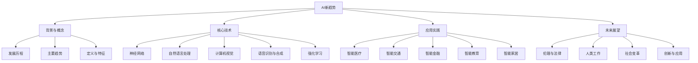
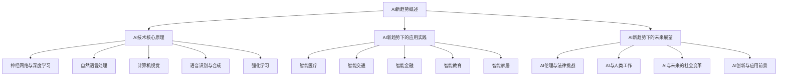

                 

# 文章标题：AI新趋势与应用实践

> 关键词：人工智能，机器学习，深度学习，应用实践，技术创新，未来展望

> 摘要：本文将深入探讨人工智能（AI）的新趋势，包括其背景、核心技术、应用实践以及未来的发展展望。通过逐步分析，本文旨在为读者提供一幅清晰的AI发展蓝图，帮助理解AI的核心概念、原理以及在实际应用中的挑战和机遇。

### 目录大纲：AI新趋势与应用实践

#### 第一部分: AI新趋势概述

# 第1章: AI新趋势概述

## 1.1 AI新趋势背景与概念解析

### 1.1.1 AI发展历程回顾

AI作为计算机科学的一个重要分支，其发展历程可以追溯到20世纪50年代。最初的AI研究主要集中在问题解决、推理和知识表示等方面。随着计算能力的提升和算法的改进，AI在20世纪80年代经历了第一次热潮，但随后由于技术瓶颈而陷入低潮。进入21世纪，特别是深度学习技术的突破，使得AI迎来了新的春天。

### 1.1.2 当前AI的主要趋势

当前AI的主要趋势包括：深度学习、强化学习、自然语言处理、计算机视觉和语音识别等。这些技术在不同领域展现出了巨大的潜力，推动了AI的快速发展。

### 1.1.3 AI新趋势的定义与特征

AI新趋势指的是在现有技术基础上，通过不断创新和突破，形成的新兴技术和应用方向。其特征包括：更强大的计算能力、更丰富的数据资源、更先进的算法以及更广泛的应用领域。

## 1.2 AI技术核心原理

### 1.2.1 机器学习基础

机器学习是AI的核心技术之一，通过构建数学模型来模拟人类学习过程。其基本原理包括监督学习、无监督学习和强化学习。

### 1.2.2 深度学习架构

深度学习是机器学习的一个分支，通过多层神经网络来模拟人类大脑的思维方式。其核心架构包括卷积神经网络（CNN）、循环神经网络（RNN）和生成对抗网络（GAN）等。

### 1.2.3 强化学习原理

强化学习是一种通过试错和反馈来学习策略的机器学习方法。其基本原理包括奖励机制、策略迭代和探索与利用平衡。

## 1.3 AI新趋势下的技术应用

### 1.3.1 计算机视觉

计算机视觉是AI的一个重要分支，通过计算机对图像和视频进行处理和分析。其应用包括图像分类、目标检测和场景理解等。

### 1.3.2 自然语言处理

自然语言处理是AI在语言领域的应用，旨在使计算机能够理解和生成人类语言。其应用包括机器翻译、文本分类和问答系统等。

### 1.3.3 语音识别与合成

语音识别与合成是AI在语音领域的应用，旨在实现人与计算机的语音交互。其应用包括语音助手、语音翻译和语音合成等。

## 1.4 AI新趋势下的产业变革

### 1.4.1 传统行业AI应用案例

AI在传统行业的应用越来越广泛，如医疗、金融、交通和教育等领域。通过具体案例，可以更好地理解AI的应用场景和商业价值。

### 1.4.2 AI新趋势下的商业模式创新

AI技术的进步不仅改变了传统产业，也催生了新的商业模式。例如，基于AI的个性化推荐、自动化交易和智能合约等。

### 1.4.3 AI伦理与隐私保护

随着AI技术的广泛应用，伦理和隐私问题日益突出。本文将探讨AI伦理的基本原则以及隐私保护的方法和技术。

#### 第二部分: AI新趋势下的核心技术

# 第2章: AI新趋势下的核心技术

## 2.1 神经网络与深度学习

### 2.1.1 神经网络基础

神经网络是深度学习的基础，通过模拟人脑神经元连接来实现信息处理。本文将介绍神经网络的基本原理和结构。

### 2.1.2 深度学习算法

深度学习算法包括卷积神经网络（CNN）、循环神经网络（RNN）和生成对抗网络（GAN）等。本文将详细讲解这些算法的基本原理和应用场景。

### 2.1.3 深度学习框架

深度学习框架是用于实现深度学习算法的工具，如TensorFlow、PyTorch和Keras等。本文将介绍这些框架的基本用法和优势。

## 2.2 自然语言处理

### 2.2.1 语言模型

语言模型是自然语言处理的基础，通过统计方法或神经网络模型来模拟自然语言的生成。本文将介绍语言模型的基本原理和实现方法。

### 2.2.2 机器翻译

机器翻译是将一种语言翻译成另一种语言的技术，通过机器学习或神经网络模型来实现。本文将介绍机器翻译的基本原理和最新进展。

### 2.2.3 问答系统

问答系统是一种智能对话系统，通过自然语言理解和生成来实现人与机器的交互。本文将介绍问答系统的基本原理和实现方法。

## 2.3 计算机视觉

### 2.3.1 卷积神经网络

卷积神经网络是计算机视觉的核心技术，通过卷积操作和池化操作来实现图像的特征提取。本文将介绍卷积神经网络的基本原理和实现方法。

### 2.3.2 图像分类

图像分类是将图像分为不同类别的一种任务，通过卷积神经网络来实现。本文将介绍图像分类的基本原理和实现方法。

### 2.3.3 目标检测

目标检测是在图像中识别并定位多个对象的技术，通过卷积神经网络和区域提议网络（RPN）来实现。本文将介绍目标检测的基本原理和实现方法。

## 2.4 语音识别与合成

### 2.4.1 语音识别原理

语音识别是将语音信号转换为文本的技术，通过隐藏马尔可夫模型（HMM）和深度神经网络（DNN）来实现。本文将介绍语音识别的基本原理和实现方法。

### 2.4.2 语音合成技术

语音合成是将文本转换为语音信号的技术，通过文本到语音（TTS）模型来实现。本文将介绍语音合成的基本原理和实现方法。

### 2.4.3 语音交互系统

语音交互系统是一种智能语音助手，通过自然语言理解和生成来实现人与机器的交互。本文将介绍语音交互系统的基本原理和实现方法。

## 2.5 强化学习

### 2.5.1 强化学习基础

强化学习是一种通过试错和反馈来学习策略的机器学习方法，通过奖励机制和策略迭代来实现。本文将介绍强化学习的基本原理和实现方法。

### 2.5.2 强化学习应用

强化学习在游戏、机器人控制和自动驾驶等领域有广泛的应用。本文将介绍强化学习在不同领域的应用案例。

### 2.5.3 探索与利用平衡

在强化学习中，如何平衡探索新策略和利用已知策略是一个重要问题。本文将介绍探索与利用平衡的策略和方法。

#### 第三部分: AI新趋势下的应用实践

# 第3章: AI新趋势下的应用实践

## 3.1 智能医疗

### 3.1.1 医疗图像分析

医疗图像分析是智能医疗的一个重要方向，通过计算机视觉技术对医学图像进行自动分析和诊断。本文将介绍医疗图像分析的基本原理和实现方法。

### 3.1.2 诊断支持系统

诊断支持系统是利用AI技术辅助医生进行疾病诊断的系统。本文将介绍诊断支持系统的基本原理和实现方法。

### 3.1.3 智能药物研发

智能药物研发是利用AI技术加速药物发现和开发的领域。本文将介绍智能药物研发的基本原理和实现方法。

## 3.2 智能交通

### 3.2.1 自动驾驶技术

自动驾驶技术是智能交通的核心，通过计算机视觉、传感器和强化学习等技术来实现。本文将介绍自动驾驶技术的基本原理和实现方法。

### 3.2.2 智能交通管理系统

智能交通管理系统是利用AI技术优化交通流量和管理的系统。本文将介绍智能交通管理系统的基本原理和实现方法。

### 3.2.3 车联网

车联网是将车辆通过通信技术连接到互联网，实现智能交通和智能驾驶的技术。本文将介绍车联网的基本原理和实现方法。

## 3.3 智能金融

### 3.3.1 信用风险评估

信用风险评估是利用AI技术评估借款人信用风险的技术。本文将介绍信用风险评估的基本原理和实现方法。

### 3.3.2 量化交易策略

量化交易策略是利用AI技术制定和执行交易策略的方法。本文将介绍量化交易策略的基本原理和实现方法。

### 3.3.3 智能投顾

智能投顾是利用AI技术提供个性化投资建议和管理的服务。本文将介绍智能投顾的基本原理和实现方法。

## 3.4 智能教育

### 3.4.1 智能化教学系统

智能化教学系统是利用AI技术提供个性化教学和学习体验的系统。本文将介绍智能化教学系统的基本原理和实现方法。

### 3.4.2 个性化学习

个性化学习是利用AI技术根据学生特点和需求提供个性化学习内容和学习路径的方法。本文将介绍个性化学习的基本原理和实现方法。

### 3.4.3 教育大数据分析

教育大数据分析是利用AI技术分析教育数据，发现规律和趋势的方法。本文将介绍教育大数据分析的基本原理和实现方法。

## 3.5 智能家居

### 3.5.1 智能家居设备

智能家居设备是利用AI技术实现家庭自动化和智能控制的产品。本文将介绍智能家居设备的基本原理和实现方法。

### 3.5.2 家居自动化

家居自动化是利用AI技术实现家庭设备和系统的自动化控制。本文将介绍家居自动化的基本原理和实现方法。

### 3.5.3 安全与隐私保护

随着智能家居的普及，安全和隐私保护成为重要问题。本文将介绍智能家居安全和隐私保护的基本原理和方法。

#### 第四部分: AI新趋势下的未来展望

# 第4章: AI新趋势下的未来展望

## 4.1 AI伦理与法律挑战

### 4.1.1 AI伦理问题

随着AI技术的广泛应用，伦理问题日益突出。本文将探讨AI伦理的基本原则和常见伦理问题。

### 4.1.2 AI法律框架

AI的发展需要完善的法律法规支持。本文将介绍现有的AI法律框架和相关规定。

### 4.1.3 伦理与法律对AI发展的制约

伦理和法律对AI的发展有一定制约作用。本文将分析伦理和法律对AI发展的积极和消极影响。

## 4.2 AI与人类工作

### 4.2.1 AI对劳动力市场的影响

AI技术的发展对劳动力市场产生了深远影响。本文将分析AI对就业、职业转型和劳动力需求的影响。

### 4.2.2 AI赋能的职业变革

AI技术在许多领域赋能职业变革，如自动化、智能化和个性化等。本文将介绍AI赋能的职业变革案例。

### 4.2.3 人类与AI的协同工作

人类与AI的协同工作是未来的发展趋势。本文将探讨人类与AI协同工作的模式和方法。

## 4.3 AI与未来的社会变革

### 4.3.1 AI对生活方式的影响

AI技术的普及将深刻影响人类的生活方式。本文将分析AI对生活方式的改善和挑战。

### 4.3.2 AI对城市生活的影响

AI技术在城市管理、交通和公共服务等方面有广泛应用。本文将探讨AI对城市生活的影响。

### 4.3.3 AI治理与社会责任

AI技术的发展需要合理的治理和社会责任。本文将讨论AI治理和社会责任的实践和挑战。

## 4.4 AI创新与应用前景

### 4.4.1 AI前沿技术展望

AI技术仍在快速发展，未来有望实现更多突破。本文将介绍AI前沿技术的展望。

### 4.4.2 AI与物联网

AI与物联网的结合将带来新的应用场景。本文将分析AI与物联网的结合点和应用前景。

### 4.4.3 AI与区块链的结合

AI与区块链的结合有望解决数据隐私和安全等问题。本文将探讨AI与区块链的结合方法和应用场景。

# 附录

## 附录 A: AI开发工具与资源

### A.1 常用AI开发工具

本文将介绍常用的AI开发工具，如TensorFlow、PyTorch和Keras等。

### A.2 AI开源项目推荐

本文将推荐一些优秀的AI开源项目，如TensorFlow、PyTorch和Keras等。

### A.3 AI学习资源与社区

本文将介绍一些AI学习资源和学习社区，帮助读者深入学习AI知识。

#### 附录 B: Mermaid 流程图



### 第1章: AI新趋势概述

#### 1.1 AI新趋势背景与概念解析

人工智能（Artificial Intelligence，简称AI）作为一个跨越多个学科领域的复杂系统，正在经历快速的发展。AI的研究涵盖了计算机科学、心理学、认知科学、神经科学等多个学科，旨在创建能够模拟、扩展和辅助人类智能的计算机系统。

##### 1.1.1 AI发展历程回顾

AI的发展历程可以分为几个主要阶段：

1. **早期探索阶段（1950-1969）**：
   - 1950年，艾伦·图灵提出了著名的“图灵测试”，成为AI研究的重要理论基础。
   - 1956年，达特茅斯会议上，约翰·麦卡锡等人首次提出了“人工智能”这个术语。
   - 1959年，约翰·马奇和西摩·派普特建立了AI研究实验室。

2. **AI热潮阶段（1970-1989）**：
   - 在这个阶段，AI取得了显著的进步，包括专家系统的开发和应用。
   - 1976年，ELIZA程序展示了自然语言处理的基本原理。
   - 1977年，XCON系统展示了知识工程和自动推理的能力。

3. **AI低谷阶段（1990-2000）**：
   - 由于技术瓶颈和实际应用中的困难，AI研究进入低谷。
   - 1997年，IBM的超级计算机“深蓝”战胜国际象棋世界冠军加里·卡斯帕罗夫，标志着AI在特定领域取得了突破。

4. **AI复兴阶段（2000至今）**：
   - 深度学习技术的发展，尤其是2006年Hinton等人提出的深度信念网络（DBN），为AI的复兴奠定了基础。
   - 2012年，AlexNet在ImageNet竞赛中取得了惊人的成绩，深度学习在计算机视觉领域取得了突破性进展。
   - 2016年，AlphaGo击败围棋世界冠军李世石，标志着AI在通用问题解决领域的巨大进步。

##### 1.1.2 当前AI的主要趋势

当前AI的发展呈现出以下几个主要趋势：

1. **深度学习**：
   - 深度学习通过多层神经网络模拟人脑的思维方式，能够自动从数据中学习特征和模式。
   - 当前深度学习技术包括卷积神经网络（CNN）、循环神经网络（RNN）和生成对抗网络（GAN）等。

2. **强化学习**：
   - 强化学习通过试错和奖励机制，使智能体在环境中学习最优策略。
   - 强化学习在自动驾驶、游戏和机器人控制等领域有广泛应用。

3. **自然语言处理**：
   - 自然语言处理（NLP）使计算机能够理解和生成人类语言，包括机器翻译、文本分类和问答系统等。

4. **计算机视觉**：
   - 计算机视觉使计算机能够从图像和视频中提取信息，包括图像分类、目标检测和图像分割等。

5. **语音识别与合成**：
   - 语音识别将语音转换为文本，语音合成将文本转换为语音，实现语音交互。

##### 1.1.3 AI新趋势的定义与特征

AI新趋势指的是在现有技术基础上，通过不断创新和突破，形成的新兴技术和应用方向。这些趋势具有以下特征：

1. **技术突破**：
   - AI新趋势通常伴随着核心技术的突破，如深度学习、强化学习和自然语言处理等。

2. **应用广泛**：
   - AI新趋势在各个领域都有广泛的应用，包括医疗、金融、交通和教育等。

3. **商业价值**：
   - AI新趋势带来了巨大的商业价值，推动了传统产业的转型和新兴产业的兴起。

4. **社会影响**：
   - AI新趋势对社会产生了深远影响，改变了人类的工作方式、生活方式和社会结构。

#### 1.2 AI技术核心原理

##### 1.2.1 机器学习基础

机器学习是AI的核心技术之一，其目标是使计算机系统能够从数据中学习，并对未知数据进行预测或决策。机器学习可以分为以下几种类型：

1. **监督学习**：
   - 监督学习通过训练数据集来学习输入和输出之间的映射关系。
   - 伪代码：
     ```python
     def train_supervised(data, labels):
         # 使用训练数据训练模型
         model = train_model(data, labels)
         return model
     ```

2. **无监督学习**：
   - 无监督学习从没有标签的数据中学习，通常用于发现数据中的结构和模式。
   - 伪代码：
     ```python
     def train_unsupervised(data):
         # 使用无监督学习算法对数据进行聚类或降维
         clusters = cluster_data(data)
         return clusters
     ```

3. **强化学习**：
   - 强化学习通过试错和奖励机制来学习最优策略。
   - 伪代码：
     ```python
     def train_reinforcement(state, action, reward):
         # 更新策略
         policy = update_policy(state, action, reward)
         return policy
     ```

##### 1.2.2 深度学习架构

深度学习是机器学习的一个重要分支，通过多层神经网络来模拟人脑的思维方式。深度学习的架构包括以下几个关键组成部分：

1. **输入层**：
   - 输入层接收原始数据，如图像、文本或音频。

2. **隐藏层**：
   - 隐藏层对输入数据进行特征提取和变换，每一层都能够提取更高层次的特征。

3. **输出层**：
   - 输出层对隐藏层提取的特征进行分类或回归。

4. **激活函数**：
   - 激活函数为神经网络提供非线性变换，使得模型能够拟合复杂的数据分布。

5. **反向传播**：
   - 反向传播是一种用于训练神经网络的算法，通过计算损失函数的梯度来更新模型参数。

##### 1.2.3 强化学习原理

强化学习是一种通过试错和奖励机制来学习策略的机器学习方法。强化学习的主要组成部分包括：

1. **智能体**（Agent）：
   - 智能体是执行动作并学习策略的实体。

2. **环境**（Environment）：
   - 环境是智能体执行动作的场所，可以看作是一个状态转移函数。

3. **状态**（State）：
   - 状态是智能体在环境中所处的位置或情境。

4. **动作**（Action）：
   - 动作是智能体在特定状态下执行的操作。

5. **奖励**（Reward）：
   - 奖励是环境对智能体动作的反馈，用于评估动作的好坏。

强化学习的目标是最大化长期累积奖励，通常使用以下公式表示：

$$
J(\theta) = \sum_{t=0}^{\infty} \gamma^t R(s_t, a_t)
$$

其中，$J(\theta)$是策略的期望回报，$\gamma$是折扣因子，$R(s_t, a_t)$是智能体在时刻$t$的奖励。

#### 1.3 AI新趋势下的技术应用

##### 1.3.1 计算机视觉

计算机视觉是AI在视觉感知领域的重要应用，旨在使计算机能够从图像和视频中提取信息。计算机视觉的主要技术包括：

1. **图像分类**：
   - 图像分类是将图像划分为不同类别的任务，通常使用卷积神经网络（CNN）来实现。
   - 伪代码：
     ```python
     def classify_image(image, model):
         # 使用训练好的模型对图像进行分类
         predicted_label = model.predict(image)
         return predicted_label
     ```

2. **目标检测**：
   - 目标检测是在图像中识别并定位多个对象的技术，常用的算法包括YOLO和Faster R-CNN。
   - 伪代码：
     ```python
     def detect_objects(image, model):
         # 使用训练好的模型检测图像中的对象
         objects = model.detect(image)
         return objects
     ```

3. **图像分割**：
   - 图像分割是将图像划分为多个区域或对象的技术，常用的算法包括全卷积网络（FCN）和U-Net。
   - 伪代码：
     ```python
     def segment_image(image, model):
         # 使用训练好的模型对图像进行分割
         mask = model.predict(image)
         return mask
     ```

##### 1.3.2 自然语言处理

自然语言处理是AI在语言领域的应用，旨在使计算机能够理解和生成人类语言。自然语言处理的主要技术包括：

1. **语言模型**：
   - 语言模型是用来预测下一个单词或字符的概率分布，常用的算法包括N-gram和神经网络语言模型。
   - 伪代码：
     ```python
     def generate_text(model, length):
         # 使用语言模型生成文本
         text = model.generate(length)
         return text
     ```

2. **机器翻译**：
   - 机器翻译是将一种语言翻译成另一种语言的技术，常用的算法包括基于规则的翻译、统计机器翻译和神经机器翻译。
   - 伪代码：
     ```python
     def translate_text(source_text, model):
         # 使用机器翻译模型翻译文本
         target_text = model.translate(source_text)
         return target_text
     ```

3. **问答系统**：
   - 问答系统是一种智能对话系统，通过自然语言理解和生成来实现人与机器的交互。
   - 伪代码：
     ```python
     def answer_question(question, model):
         # 使用问答系统回答问题
         answer = model.answer(question)
         return answer
     ```

##### 1.3.3 语音识别与合成

语音识别与合成是AI在语音领域的应用，旨在实现人与计算机的语音交互。语音识别与合成的主要技术包括：

1. **语音识别**：
   - 语音识别是将语音信号转换为文本的技术，常用的算法包括隐藏马尔可夫模型（HMM）和深度神经网络（DNN）。
   - 伪代码：
     ```python
     def recognize_speech(audio, model):
         # 使用语音识别模型识别语音
         text = model.recognize(audio)
         return text
     ```

2. **语音合成**：
   - 语音合成是将文本转换为语音信号的技术，常用的算法包括文本到语音（TTS）模型。
   - 伪代码：
     ```python
     def synthesize_speech(text, model):
         # 使用语音合成模型生成语音
         audio = model.synthesize(text)
         return audio
     ```

3. **语音交互系统**：
   - 语音交互系统是一种智能语音助手，通过自然语言理解和生成来实现人与机器的交互。
   - 伪代码：
     ```python
     def interact_with_user(question, model):
         # 使用语音交互系统与用户交互
         answer = model.answer(question)
         return answer
     ```

#### 1.4 AI新趋势下的产业变革

##### 1.4.1 传统行业AI应用案例

AI在传统行业的应用越来越广泛，为各个行业带来了巨大的变革。以下是一些传统行业AI应用案例：

1. **医疗**：
   - AI在医疗领域的应用包括医疗图像分析、疾病预测和个性化治疗等。
   - 例子：使用深度学习对医学图像进行自动分析，提高诊断准确率。

2. **金融**：
   - AI在金融领域的应用包括信用风险评估、量化交易和智能投顾等。
   - 例子：使用机器学习算法对客户行为进行分析，提供个性化的金融建议。

3. **交通**：
   - AI在交通领域的应用包括自动驾驶、智能交通管理和车联网等。
   - 例子：使用强化学习算法实现自动驾驶车辆的安全行驶。

4. **教育**：
   - AI在教育领域的应用包括个性化教学、智能评估和智能学习等。
   - 例子：使用自然语言处理技术对学生的学习行为进行分析，提供个性化的学习建议。

##### 1.4.2 AI新趋势下的商业模式创新

AI新趋势不仅改变了传统产业，还催生了新的商业模式。以下是一些基于AI的商业模式创新：

1. **个性化推荐**：
   - 个性化推荐通过分析用户行为和偏好，为用户提供个性化的产品和服务。
   - 例子：亚马逊和Netflix使用推荐系统为用户推荐商品和电影。

2. **自动化交易**：
   - 自动化交易通过算法自动执行交易决策，提高交易效率和收益。
   - 例子：高频交易公司使用复杂的算法进行自动化交易。

3. **智能合约**：
   - 智能合约是利用区块链和AI技术实现自动执行合同条款的智能合约。
   - 例子：利用智能合约自动执行跨境支付和供应链管理。

##### 1.4.3 AI伦理与隐私保护

随着AI技术的广泛应用，伦理和隐私问题日益突出。以下是一些关于AI伦理与隐私保护的讨论：

1. **AI伦理**：
   - AI伦理涉及到AI系统的设计、开发和应用中的道德问题，如公平性、透明性和可解释性等。
   - 例子：确保AI系统不会因为偏见数据而产生歧视性决策。

2. **隐私保护**：
   - AI应用中处理大量用户数据，隐私保护成为重要问题。需要采取数据加密、匿名化和隐私保护算法等措施。
   - 例子：使用差分隐私技术确保用户数据的隐私。

### 1.5 小结

本章概述了AI的新趋势，包括其发展历程、核心技术、应用实践以及产业变革。通过分析AI的核心原理和实际应用，读者可以更好地理解AI的技术本质和未来发展方向。在下一章中，我们将深入探讨AI新趋势下的核心技术，包括神经网络、自然语言处理、计算机视觉、语音识别与合成和强化学习等。

---

### 第2章: AI新趋势下的核心技术

在AI新趋势的背景下，核心技术的作用至关重要。本章将详细介绍神经网络与深度学习、自然语言处理、计算机视觉、语音识别与合成以及强化学习等核心技术，通过深入分析这些技术的原理、架构和应用，帮助读者理解AI技术的精髓。

#### 2.1 神经网络与深度学习

##### 2.1.1 神经网络基础

神经网络（Neural Networks，NN）是模仿人脑神经元连接方式的计算模型。神经网络的基本单元是神经元（neurons），每个神经元都与其他神经元通过突触（synapses）连接。神经网络的训练过程就是通过调整突触的权重（weights）和偏置（biases）来模拟人脑的学习过程。

1. **神经元模型**：
   - 一个简单的神经元模型可以表示为：
     $$ z = \sum_{i=1}^{n} w_i x_i + b $$
     其中，$x_i$是输入，$w_i$是权重，$b$是偏置，$z$是神经元的输出。
   - 激活函数（activation function）用于引入非线性特性，常见的激活函数包括sigmoid、ReLU和Tanh。

2. **多层感知机（MLP）**：
   - 多层感知机是神经网络的基本结构，包括输入层、隐藏层和输出层。
   - 输入层接收外部输入，隐藏层进行特征提取，输出层生成最终输出。

3. **反向传播算法**：
   - 反向传播（Backpropagation）是一种用于训练神经网络的算法，通过计算损失函数的梯度来更新网络权重。
   - 伪代码：
     ```python
     def backpropagate(model, inputs, targets):
         # 计算损失函数的梯度
         gradients = calculate_gradients(model, inputs, targets)
         # 更新模型参数
         update_parameters(model, gradients)
     ```

##### 2.1.2 深度学习架构

深度学习（Deep Learning，DL）是神经网络的一种扩展，通过增加网络的层数来提高模型的复杂度和学习能力。深度学习的主要架构包括卷积神经网络（CNN）、循环神经网络（RNN）和生成对抗网络（GAN）等。

1. **卷积神经网络（CNN）**：
   - CNN是用于处理图像数据的一种深度学习模型，通过卷积层、池化层和全连接层等结构来提取图像特征。
   - 伪代码：
     ```python
     def conv_net(input_image):
         # 使用卷积层提取特征
         features = convolve(input_image, filter)
         # 使用池化层减小特征图的尺寸
         pooled_features = max_pool(features)
         # 使用全连接层生成输出
         output = fully_connected(pooled_features)
         return output
     ```

2. **循环神经网络（RNN）**：
   - RNN是用于处理序列数据的一种神经网络，通过循环结构来保留序列信息。
   - 伪代码：
     ```python
     def rnn_sequence(sequence):
         # 遍历序列并更新状态
         for input in sequence:
             hidden_state = update_state(hidden_state, input)
         # 生成输出
         output = hidden_state
         return output
     ```

3. **生成对抗网络（GAN）**：
   - GAN是一种由生成器和判别器组成的对抗性模型，通过相互竞争来生成逼真的数据。
   - 伪代码：
     ```python
     def train_gan(generator, discriminator):
         # 使用生成器生成假样本
         fake_samples = generator.generate()
         # 使用判别器判断真假
         discriminator_loss = calculate_loss(discriminator, fake_samples, real_samples)
         # 更新生成器和判别器
         update_generator(generator, discriminator)
         return discriminator_loss
     ```

##### 2.1.3 深度学习框架

深度学习框架是用于实现和训练深度学习模型的高级工具，如TensorFlow、PyTorch和Keras等。这些框架提供了丰富的API和工具，使得深度学习的开发和应用更加便捷。

1. **TensorFlow**：
   - TensorFlow是Google开发的一个开源深度学习框架，支持多种编程语言，包括Python和C++。
   - 伪代码：
     ```python
     import tensorflow as tf

     # 定义模型
     model = tf.keras.Sequential([
         tf.keras.layers.Conv2D(filters, kernel_size, activation='relu'),
         tf.keras.layers.MaxPooling2D(pool_size),
         tf.keras.layers.Dense(units, activation='softmax')
     ])

     # 编译模型
     model.compile(optimizer='adam', loss='categorical_crossentropy', metrics=['accuracy'])

     # 训练模型
     model.fit(x_train, y_train, epochs=10, batch_size=32)
     ```

2. **PyTorch**：
   - PyTorch是一个由Facebook开发的开源深度学习框架，以其动态计算图和灵活的API而闻名。
   - 伪代码：
     ```python
     import torch
     import torch.nn as nn

     # 定义模型
     class ConvNet(nn.Module):
         def __init__(self):
             super(ConvNet, self).__init__()
             self.conv1 = nn.Conv2d(1, 10, kernel_size=5)
             self.fc1 = nn.Linear(10 * 4 * 4, 10)

         def forward(self, x):
             x = self.conv1(x)
             x = nn.functional.max_pool2d(x, 2)
             x = x.view(-1, 10 * 4 * 4)
             x = self.fc1(x)
             return x

     # 实例化模型
     model = ConvNet()

     # 定义损失函数和优化器
     criterion = nn.CrossEntropyLoss()
     optimizer = torch.optim.Adam(model.parameters(), lr=0.001)

     # 训练模型
     for epoch in range(10):
         for inputs, targets in data_loader:
             optimizer.zero_grad()
             outputs = model(inputs)
             loss = criterion(outputs, targets)
             loss.backward()
             optimizer.step()
     ```

3. **Keras**：
   - Keras是一个高级神经网络API，构建在TensorFlow和Theano之上，提供简洁的API和丰富的预训练模型。
   - 伪代码：
     ```python
     from keras.models import Sequential
     from keras.layers import Conv2D, MaxPooling2D, Dense

     # 定义模型
     model = Sequential()
     model.add(Conv2D(32, (3, 3), activation='relu', input_shape=(64, 64, 3)))
     model.add(MaxPooling2D(pool_size=(2, 2)))
     model.add(Conv2D(64, (3, 3), activation='relu'))
     model.add(MaxPooling2D(pool_size=(2, 2)))
     model.add(Dense(64, activation='relu'))
     model.add(Dense(10, activation='softmax'))

     # 编译模型
     model.compile(optimizer='adam', loss='categorical_crossentropy', metrics=['accuracy'])

     # 训练模型
     model.fit(x_train, y_train, epochs=10, batch_size=32)
     ```

#### 2.2 自然语言处理

自然语言处理（Natural Language Processing，NLP）是AI在语言领域的应用，旨在使计算机能够理解和生成人类语言。NLP的主要技术包括语言模型、机器翻译和问答系统等。

##### 2.2.1 语言模型

语言模型（Language Model）是一种用于预测下一个单词或字符的概率分布的模型。语言模型在许多NLP任务中都有广泛应用，如自动完成、文本生成和语音识别等。

1. **N-gram语言模型**：
   - N-gram模型是一种基于历史信息的语言模型，通过统计前N个单词或字符的概率来预测下一个单词或字符。
   - 伪代码：
     ```python
     def ngram_model(sentence, N):
         # 计算N-gram的概率
         probabilities = []
         for i in range(len(sentence) - N):
             ngram = tuple(sentence[i:i+N])
             probability = calculate_probability(ngram)
             probabilities.append(probability)
         return probabilities
     ```

2. **神经网络语言模型**：
   - 神经网络语言模型通过深度学习来预测下一个单词或字符的概率分布，能够更好地捕捉语言中的复杂结构。
   - 伪代码：
     ```python
     def neural_network_model(sentence):
         # 使用神经网络模型预测下一个单词的概率
         probabilities = model.predict(sentence)
         return probabilities
     ```

##### 2.2.2 机器翻译

机器翻译（Machine Translation）是将一种语言翻译成另一种语言的技术。机器翻译可以分为基于规则的方法、统计机器翻译和神经机器翻译等。

1. **基于规则的方法**：
   - 基于规则的方法通过定义语言之间的语法规则和翻译规则来实现翻译。
   - 伪代码：
     ```python
     def rule_based_translation(sentence, source_language, target_language):
         # 使用翻译规则翻译句子
         translated_sentence = apply_rules(sentence, source_language, target_language)
         return translated_sentence
     ```

2. **统计机器翻译**：
   - 统计机器翻译通过训练大量的平行语料库来学习语言之间的映射关系。
   - 伪代码：
     ```python
     def statistical_translation(sentence, model):
         # 使用统计模型翻译句子
         translated_sentence = model.translate(sentence)
         return translated_sentence
     ```

3. **神经机器翻译**：
   - 神经机器翻译通过深度学习模型来实现翻译，能够更好地捕捉语言的语义信息。
   - 伪代码：
     ```python
     def neural_machine_translation(sentence, model):
         # 使用神经网络模型翻译句子
         translated_sentence = model.translate(sentence)
         return translated_sentence
     ```

##### 2.2.3 问答系统

问答系统（Question Answering System）是一种智能对话系统，通过自然语言理解和生成来实现人与机器的交互。问答系统可以分为基于规则的方法、基于模板的方法和基于机器学习的方法等。

1. **基于规则的方法**：
   - 基于规则的方法通过定义问答规则来回答用户的问题。
   - 伪代码：
     ```python
     def rule_based_question_answering(question, knowledge_base):
         # 使用问答规则回答问题
         answer = apply_rules(question, knowledge_base)
         return answer
     ```

2. **基于模板的方法**：
   - 基于模板的方法通过匹配问题和模板来生成答案。
   - 伪代码：
     ```python
     def template_based_question_answering(question, templates):
         # 使用模板匹配回答问题
         answer = match_template(question, templates)
         return answer
     ```

3. **基于机器学习的方法**：
   - 基于机器学习的方法通过训练问答模型来回答用户的问题。
   - 伪代码：
     ```python
     def machine_learning_question_answering(question, model):
         # 使用训练好的问答模型回答问题
         answer = model.answer(question)
         return answer
     ```

#### 2.3 计算机视觉

计算机视觉（Computer Vision）是AI在视觉感知领域的重要应用，旨在使计算机能够从图像和视频中提取信息。计算机视觉的主要技术包括图像分类、目标检测和图像分割等。

##### 2.3.1 卷积神经网络

卷积神经网络（Convolutional Neural Network，CNN）是用于处理图像数据的一种深度学习模型，通过卷积层、池化层和全连接层等结构来提取图像特征。

1. **卷积层**：
   - 卷积层通过卷积操作来提取图像的特征，卷积操作是将卷积核（filter）与图像进行点积运算。
   - 伪代码：
     ```python
     def conv_layer(input_image, filter):
         # 使用卷积操作提取特征
         feature_map = convolve(input_image, filter)
         return feature_map
     ```

2. **池化层**：
   - 池化层通过减小特征图的尺寸来减少计算量，常用的池化操作包括最大池化和平均池化。
   - 伪代码：
     ```python
     def pool_layer(feature_map, pool_size):
         # 使用最大池化减小特征图的尺寸
         pooled_feature_map = max_pool(feature_map, pool_size)
         return pooled_feature_map
     ```

3. **全连接层**：
   - 全连接层将特征图展平为一维向量，然后通过全连接层进行分类或回归。
   - 伪代码：
     ```python
     def fully_connected_layer(pooled_feature_map, units):
         # 使用全连接层进行分类
         output = fully_connected(pooled_feature_map, units)
         return output
     ```

##### 2.3.2 图像分类

图像分类是将图像划分为不同类别的任务，常用的模型包括卷积神经网络（CNN）和循环神经网络（RNN）等。

1. **CNN模型**：
   - CNN模型通过多层卷积和池化操作提取图像特征，最后通过全连接层进行分类。
   - 伪代码：
     ```python
     def conv_net_image_classification(image, model):
         # 使用卷积神经网络进行图像分类
         features = conv_net(image)
         predicted_label = model.predict(features)
         return predicted_label
     ```

2. **RNN模型**：
   - RNN模型通过处理图像的序列信息来实现图像分类，适用于复杂图像特征的分类任务。
   - 伪代码：
     ```python
     def rnn_image_classification(image_sequence, model):
         # 使用循环神经网络进行图像分类
         sequence_output = rnn(image_sequence)
         predicted_label = model.predict(sequence_output)
         return predicted_label
     ```

##### 2.3.3 目标检测

目标检测是在图像中识别并定位多个对象的技术，常用的模型包括YOLO和Faster R-CNN等。

1. **YOLO模型**：
   - YOLO（You Only Look Once）模型是一种单阶段目标检测模型，通过将图像划分为网格并预测每个网格中的对象类别和位置。
   - 伪代码：
     ```python
     def yolo_object_detection(image, model):
         # 使用YOLO模型进行目标检测
         grids = create_grids(image, model.grid_size)
         objects = model.detect(image, grids)
         return objects
     ```

2. **Faster R-CNN模型**：
   - Faster R-CNN模型是一种两阶段目标检测模型，首先使用区域提议网络（RPN）生成候选区域，然后对这些区域进行分类和定位。
   - 伪代码：
     ```python
     def faster_rcnn_object_detection(image, model):
         # 使用Faster R-CNN模型进行目标检测
         proposals = rpn.generate_proposals(image, model)
         objects = model.classify_and_localize(image, proposals)
         return objects
     ```

##### 2.3.4 图像分割

图像分割是将图像划分为多个区域或对象的技术，常用的模型包括全卷积网络（FCN）和U-Net等。

1. **FCN模型**：
   - FCN（Fully Convolutional Network）模型是一种将卷积神经网络扩展到整个特征图的模型，用于实现图像分割。
   - 伪代码：
     ```python
     def fcnn_image_segmentation(image, model):
         # 使用全卷积网络进行图像分割
         features = conv_net(image)
         mask = model.predict(features)
         return mask
     ```

2. **U-Net模型**：
   - U-Net模型是一种用于医学图像分割的卷积神经网络，通过上下卷积结构来捕捉图像的空间信息。
   - 伪代码：
     ```python
     def unet_image_segmentation(image, model):
         # 使用U-Net模型进行图像分割
         features = unet(image)
         mask = model.predict(features)
         return mask
     ```

#### 2.4 语音识别与合成

语音识别与合成是AI在语音领域的应用，旨在实现人与计算机的语音交互。语音识别与合成的主要技术包括语音识别、语音合成和语音交互系统等。

##### 2.4.1 语音识别

语音识别是将语音信号转换为文本的技术，常用的模型包括隐藏马尔可夫模型（HMM）和深度神经网络（DNN）等。

1. **HMM模型**：
   - HMM（Hidden Markov Model）模型是一种统计模型，用于模拟语音信号中的状态转移和观测值。
   - 伪代码：
     ```python
     def hmm_speech_recognition(audio_signal, model):
         # 使用HMM模型进行语音识别
         sequence = hmm.decode(audio_signal, model)
         return sequence
     ```

2. **DNN模型**：
   - DNN（Deep Neural Network）模型是一种深度学习模型，通过多层神经网络来模拟语音信号的处理过程。
   - 伪代码：
     ```python
     def dnn_speech_recognition(audio_signal, model):
         # 使用DNN模型进行语音识别
         text = model.recognize(audio_signal)
         return text
     ```

##### 2.4.2 语音合成

语音合成是将文本转换为语音信号的技术，常用的模型包括文本到语音（TTS）模型和循环神经网络（RNN）等。

1. **TTS模型**：
   - TTS（Text-to-Speech）模型通过将文本转换为声学特征，然后通过声学模型和发音模型生成语音信号。
   - 伪代码：
     ```python
     def tts_synthesis(text, model):
         # 使用TTS模型进行语音合成
         audio_signal = model.synthesize(text)
         return audio_signal
     ```

2. **RNN模型**：
   - RNN（Recurrent Neural Network）模型通过处理序列信息来生成语音信号，能够更好地捕捉语音中的韵律和节奏。
   - 伪代码：
     ```python
     def rnn_speech_synthesis(text_sequence, model):
         # 使用RNN模型进行语音合成
         audio_signal = model.generate(text_sequence)
         return audio_signal
     ```

##### 2.4.3 语音交互系统

语音交互系统是一种智能语音助手，通过自然语言理解和生成来实现人与机器的交互。

1. **语音助手**：
   - 语音助手通过语音识别和语音合成技术，实现人与机器的语音交互。
   - 伪代码：
     ```python
     def voice_assistant(audio_signal, model):
         # 使用语音助手进行交互
         question = model.recognize(audio_signal)
         answer = model.answer(question)
         return answer
     ```

2. **语音控制**：
   - 语音控制通过语音识别技术，实现用户对设备的语音控制。
   - 伪代码：
     ```python
     def voice_control(audio_signal, device_model):
         # 使用语音控制设备
         command = model.recognize(audio_signal)
         device_model.execute(command)
     ```

#### 2.5 强化学习

强化学习（Reinforcement Learning，RL）是一种通过试错和奖励机制来学习最优策略的机器学习方法。强化学习在游戏、机器人控制和自动驾驶等领域有广泛应用。

##### 2.5.1 强化学习基础

强化学习的主要组成部分包括智能体（agent）、环境（environment）、状态（state）、动作（action）和奖励（reward）。

1. **智能体**：
   - 智能体是执行动作并学习策略的实体，通过选择动作来与环境交互。
   - 伪代码：
     ```python
     class Agent:
         def select_action(self, state):
             # 选择动作
             action = self.policy(state)
             return action
     ```

2. **环境**：
   - 环境是智能体执行动作的场所，通过状态转移概率和奖励函数来描述。
   - 伪代码：
     ```python
     class Environment:
         def step(self, action):
             # 执行动作并返回下一个状态和奖励
             state, reward = self.transition(state, action)
             return state, reward
     ```

3. **状态**：
   - 状态是智能体在环境中所处的位置或情境，通常用向量表示。
   - 伪代码：
     ```python
     class State:
         def __init__(self, features):
             self.features = features
     ```

4. **动作**：
   - 动作是智能体在特定状态下执行的操作，通常用向量表示。
   - 伪代码：
     ```python
     class Action:
         def __init__(self, actions):
             self.actions = actions
     ```

5. **奖励**：
   - 奖励是环境对智能体动作的反馈，用于评估动作的好坏。
   - 伪代码：
     ```python
     class Reward:
         def __init__(self, reward_value):
             self.reward_value = reward_value
     ```

##### 2.5.2 强化学习算法

强化学习算法可以分为基于模型的方法和基于模型自由的方法。

1. **基于模型的方法**：
   - 基于模型的方法通过构建环境模型来预测状态转移概率和奖励，从而优化智能体的策略。
   - 伪代码：
     ```python
     def model_based_learning(model, agent, environment):
         # 使用环境模型进行学习
         while not done:
             state = environment.reset()
             action = agent.select_action(state)
             next_state, reward = environment.step(action)
             model.update(state, action, reward, next_state)
             state = next_state
         return model
     ```

2. **基于模型自由的方法**：
   - 基于模型自由的方法不依赖于环境模型，通过直接学习最优策略。
   - 伪代码：
     ```python
     def model_free_learning(agent, environment):
         # 使用模型自由方法进行学习
         while not done:
             state = environment.reset()
             action = agent.select_action(state)
             next_state, reward = environment.step(action)
             agent.update_policy(state, action, reward, next_state)
             state = next_state
         return agent
     ```

##### 2.5.3 探索与利用平衡

在强化学习中，如何平衡探索新策略和利用已知策略是一个重要问题。以下是一些常用的探索与利用平衡策略：

1. **ε-贪心策略**：
   - ε-贪心策略通过在探索和利用之间加入随机性来实现平衡。
   - 伪代码：
     ```python
     def epsilon_greedy_policy(state, epsilon):
         # ε-贪心策略
         if random() < epsilon:
             action = random_action()
         else:
             action = best_action(state)
         return action
     ```

2. **UCB算法**：
   - UCB（Upper Confidence Bound）算法通过计算置信上限来平衡探索和利用。
   - 伪代码：
     ```python
     def ucb_policy(armed_arms, confidence_level):
         # UCB策略
         ucb_values = []
         for arm in armed_arms:
             mean = arm.mean
             confidence = sqrt(2 * log(t) / arm.N)
             ucb_values.append(mean + confidence)
         best_ucb = max(ucb_values)
         return best_ucb
     ```

3. **langevin动力学**：
   - langevin动力学是一种通过随机游走来平衡探索和利用的算法。
   - 伪代码：
     ```python
     def langevin_dynamics(state, action, reward, next_state, learning_rate):
         # langevin动力学
         delta_s = next_state - state
         delta_r = reward
         delta_a = action
         gradient = delta_s * delta_r * delta_a
         new_state = state + learning_rate * gradient
         return new_state
     ```

#### 2.6 小结

本章介绍了AI新趋势下的核心技术，包括神经网络与深度学习、自然语言处理、计算机视觉、语音识别与合成和强化学习等。通过对这些核心技术的原理和应用的深入分析，读者可以更好地理解AI技术的工作机制和实际应用。在下一章中，我们将探讨AI新趋势下的应用实践，包括智能医疗、智能交通、智能金融、智能教育和智能家居等领域的具体应用案例。

---

### 第3章: AI新趋势下的应用实践

在了解了AI新趋势下的核心技术后，接下来我们将探讨这些技术在各个领域的具体应用实践。本章将深入探讨智能医疗、智能交通、智能金融、智能教育和智能家居等领域的AI应用案例，展示AI技术在解决实际问题中的潜力。

#### 3.1 智能医疗

智能医疗是AI技术在医疗领域的重要应用，通过大数据分析和机器学习技术，为医疗诊断、治疗和药物研发提供支持。以下是一些智能医疗的应用案例：

##### 3.1.1 医疗图像分析

医疗图像分析是智能医疗的核心技术之一，通过计算机视觉和深度学习算法，对医学图像进行自动分析和诊断，提高医疗诊断的准确性和效率。

1. **医疗图像分类**：
   - 利用卷积神经网络（CNN）对医学图像进行分类，如区分癌症和非癌症病例。
   - 伪代码：
     ```python
     def classify_medical_image(image, model):
         # 使用训练好的模型对医学图像进行分类
         predicted_label = model.predict(image)
         return predicted_label
     ```

2. **医疗图像分割**：
   - 利用全卷积网络（FCN）和U-Net模型对医学图像进行分割，提取病变区域。
   - 伪代码：
     ```python
     def segment_medical_image(image, model):
         # 使用训练好的模型对医学图像进行分割
         mask = model.predict(image)
         return mask
     ```

##### 3.1.2 诊断支持系统

诊断支持系统是利用AI技术辅助医生进行疾病诊断的系统，通过分析大量的医学数据和病例，提供诊断建议和治疗方案。

1. **疾病预测**：
   - 利用机器学习算法，对患者的症状和检查结果进行分析，预测可能的疾病。
   - 伪代码：
     ```python
     def predict_disease(symptoms, model):
         # 使用训练好的模型预测疾病
         predicted_disease = model.predict(symptoms)
         return predicted_disease
     ```

2. **辅助诊断**：
   - 利用自然语言处理技术，分析医生的临床报告，提供辅助诊断建议。
   - 伪代码：
     ```python
     def assist_diagnosis(report, model):
         # 使用训练好的模型辅助诊断
         diagnosis = model.diagnose(report)
         return diagnosis
     ```

##### 3.1.3 智能药物研发

智能药物研发是利用AI技术加速药物发现和开发的领域，通过大数据分析和机器学习算法，提高药物研发的效率和成功率。

1. **药物筛选**：
   - 利用深度学习算法，对药物分子进行筛选，识别具有潜在疗效的分子。
   - 伪代码：
     ```python
     def select_drugs(molecules, model):
         # 使用训练好的模型筛选药物
         selected_molecules = model.select(molecules)
         return selected_molecules
     ```

2. **药物设计**：
   - 利用生成对抗网络（GAN）和强化学习算法，优化药物分子的结构，提高药物的开发成功率。
   - 伪代码：
     ```python
     def design_drugs(target, model):
         # 使用训练好的模型设计药物
         optimized_molecule = model.optimize(target)
         return optimized_molecule
     ```

#### 3.2 智能交通

智能交通是利用AI技术优化交通流量和管理，提高交通效率和安全性。以下是一些智能交通的应用案例：

##### 3.2.1 自动驾驶技术

自动驾驶技术是智能交通的核心，通过计算机视觉、传感器和强化学习算法，实现车辆的自主驾驶。

1. **感知环境**：
   - 利用计算机视觉和激光雷达技术，感知车辆周围的环境，包括道路、交通信号和行人。
   - 伪代码：
     ```python
     def perceive_environment(sensors, model):
         # 使用训练好的模型感知环境
         environment = model.perceive(sensors)
         return environment
     ```

2. **路径规划**：
   - 利用强化学习算法，规划车辆的行驶路径，避免障碍物和交通事故。
   - 伪代码：
     ```python
     def plan_path(current_state, model):
         # 使用训练好的模型规划路径
         next_state = model.plan(current_state)
         return next_state
     ```

##### 3.2.2 智能交通管理系统

智能交通管理系统是利用AI技术优化交通流量和管理，提高交通效率和安全性。以下是一些智能交通管理系统的应用案例：

1. **交通流量预测**：
   - 利用机器学习算法，预测交通流量和拥堵情况，为交通管理部门提供决策支持。
   - 伪代码：
     ```python
     def predict_traffic_flow(data, model):
         # 使用训练好的模型预测交通流量
         predicted_flow = model.predict(data)
         return predicted_flow
     ```

2. **智能信号控制**：
   - 利用深度学习算法，优化交通信号灯的时序控制，提高路口的通行效率。
   - 伪代码：
     ```python
     def optimize_traffic_signals(traffic_data, model):
         # 使用训练好的模型优化信号控制
         optimized_signals = model.optimize(traffic_data)
         return optimized_signals
     ```

##### 3.2.3 车联网

车联网是将车辆通过通信技术连接到互联网，实现智能交通和智能驾驶的技术。以下是一些车联网的应用案例：

1. **车辆状态监测**：
   - 利用传感器和物联网技术，实时监测车辆的运行状态，包括速度、位置和故障信息。
   - 伪代码：
     ```python
     def monitor_vehicle_state(sensors, model):
         # 使用训练好的模型监测车辆状态
         state = model.monitor(sensors)
         return state
     ```

2. **车辆定位导航**：
   - 利用地图数据和定位技术，为车辆提供精准的定位导航服务。
   - 伪代码：
     ```python
     def navigate_vehicle(location, model):
         # 使用训练好的模型导航车辆
         route = model.navigate(location)
         return route
     ```

#### 3.3 智能金融

智能金融是利用AI技术优化金融业务和风险管理，提高金融服务效率和质量。以下是一些智能金融的应用案例：

##### 3.3.1 信用风险评估

信用风险评估是金融领域的重要任务，通过AI技术，可以对借款人的信用风险进行评估，降低金融机构的坏账率。

1. **信用评分**：
   - 利用机器学习算法，分析借款人的历史数据和行为特征，预测其信用评分。
   - 伪代码：
     ```python
     def credit_scoring(data, model):
         # 使用训练好的模型进行信用评分
         credit_score = model.score(data)
         return credit_score
     ```

2. **欺诈检测**：
   - 利用深度学习算法，检测金融交易中的欺诈行为，提高交易的安全性。
   - 伪代码：
     ```python
     def detect_fraud(transaction, model):
         # 使用训练好的模型检测欺诈
         is_fraud = model.detect(transaction)
         return is_fraud
     ```

##### 3.3.2 量化交易策略

量化交易策略是利用AI技术制定和执行交易策略的方法，通过分析市场数据和交易模式，实现自动化的交易决策。

1. **策略生成**：
   - 利用机器学习算法，从历史交易数据中学习交易策略，提高交易的成功率。
   - 伪代码：
     ```python
     def generate_trading_strategy(data, model):
         # 使用训练好的模型生成交易策略
         strategy = model.generate(data)
         return strategy
     ```

2. **策略执行**：
   - 利用算法交易系统，自动执行交易策略，实现高效的交易操作。
   - 伪代码：
     ```python
     def execute_trading_strategy(strategy, trading_system):
         # 使用交易系统执行交易策略
         trading_system.execute(strategy)
     ```

##### 3.3.3 智能投顾

智能投顾是利用AI技术提供个性化投资建议和管理的服务，通过分析投资者的风险偏好和投资目标，提供定制化的投资策略。

1. **投资建议**：
   - 利用机器学习算法，分析投资者的财务状况和市场趋势，提供个性化的投资建议。
   - 伪代码：
     ```python
     def provide_investment_advice(financial_status, market_data, model):
         # 使用训练好的模型提供投资建议
         advice = model.advise(financial_status, market_data)
         return advice
     ```

2. **投资组合优化**：
   - 利用优化算法，根据投资者的风险偏好和收益目标，优化投资组合。
   - 伪代码：
     ```python
     def optimize_investment_portfolio(risk_preference, return_target, model):
         # 使用训练好的模型优化投资组合
         portfolio = model.optimize(risk_preference, return_target)
         return portfolio
     ```

#### 3.4 智能教育

智能教育是利用AI技术优化教学和学习过程，提高教育质量和效率。以下是一些智能教育的应用案例：

##### 3.4.1 智能化教学系统

智能化教学系统是利用AI技术提供个性化教学和学习体验的系统，通过分析学生的学习数据和表现，提供定制化的教学资源和学习路径。

1. **个性化教学**：
   - 利用机器学习算法，分析学生的学习行为和学习习惯，提供个性化的教学资源和教学方法。
   - 伪代码：
     ```python
     def personalized_teaching(student_data, model):
         # 使用训练好的模型进行个性化教学
         teaching_plan = model.generate_plan(student_data)
         return teaching_plan
     ```

2. **自适应学习**：
   - 利用自适应学习算法，根据学生的学习情况和表现，动态调整教学内容和难度。
   - 伪代码：
     ```python
     def adaptive_learning(student_performance, model):
         # 使用训练好的模型进行自适应学习
         learning_plan = model.generate_plan(student_performance)
         return learning_plan
     ```

##### 3.4.2 个性化学习

个性化学习是利用AI技术根据学生特点和需求提供个性化学习内容和学习路径的方法，通过智能推荐和学习分析，实现个性化的学习体验。

1. **学习推荐**：
   - 利用协同过滤和内容推荐算法，为学生推荐合适的学习资源和课程。
   - 伪代码：
     ```python
     def recommend_learning_resources(student_profile, model):
         # 使用训练好的模型推荐学习资源
         recommended_resources = model.recommend(student_profile)
         return recommended_resources
     ```

2. **学习分析**：
   - 利用数据分析和机器学习算法，分析学生的学习行为和表现，发现学习中的问题和改进点。
   - 伪代码：
     ```python
     def analyze_learning_data(student_data, model):
         # 使用训练好的模型分析学习数据
         analysis_results = model.analyze(student_data)
         return analysis_results
     ```

##### 3.4.3 教育大数据分析

教育大数据分析是利用AI技术分析教育数据，发现规律和趋势的方法，通过数据挖掘和机器学习算法，为教育管理和教学改进提供支持。

1. **数据挖掘**：
   - 利用数据挖掘算法，从教育数据中提取有用的信息和知识，发现潜在的模式和趋势。
   - 伪代码：
     ```python
     def data_mining(educational_data, model):
         # 使用训练好的模型进行数据挖掘
         insights = model.mine(educational_data)
         return insights
     ```

2. **教学改进**：
   - 利用教育大数据分析结果，为教育管理者和教师提供教学改进的建议和策略。
   - 伪代码：
     ```python
     def improve_teaching(analysis_results, model):
         # 使用训练好的模型改进教学
         improvement_plan = model.generate_plan(analysis_results)
         return improvement_plan
     ```

#### 3.5 智能家居

智能家居是利用AI技术实现家庭自动化和智能控制，提高生活质量和工作效率。以下是一些智能家居的应用案例：

##### 3.5.1 智能家居设备

智能家居设备是利用AI技术实现家庭自动化和智能控制的产品，包括智能灯泡、智能门锁、智能温控系统等。

1. **设备控制**：
   - 利用物联网技术和智能算法，通过手机应用或语音助手控制家庭设备的开关和状态。
   - 伪代码：
     ```python
     def control_home_device(device_id, action):
         # 使用智能算法控制家庭设备
         device = get_device(device_id)
         device.execute(action)
     ```

2. **设备联动**：
   - 利用智能算法，实现家庭设备之间的联动，如自动调节室内温度和光线。
   - 伪代码：
     ```python
     def link_home_devices(device1, device2, condition):
         # 使用智能算法实现设备联动
         device1.link(device2, condition)
     ```

##### 3.5.2 家居自动化

家居自动化是利用AI技术实现家庭设备和系统的自动化控制，提高生活舒适度和便利性。

1. **自动化控制**：
   - 利用定时控制和智能算法，自动控制家庭设备的开关和时间。
   - 伪代码：
     ```python
     def automate_home_devices(schedules, conditions):
         # 使用智能算法自动化控制家庭设备
         devices = get_devices()
         for device in devices:
             device自动化控制(schedules, conditions)
     ```

2. **场景设置**：
   - 利用场景设置功能，根据不同的生活场景自动调整家庭设备的设置。
   - 伪代码：
     ```python
     def set_home_scene(scene_name, device_settings):
         # 使用智能算法设置家庭场景
         scene = get_scene(scene_name)
         scene.apply_settings(device_settings)
     ```

##### 3.5.3 安全与隐私保护

随着智能家居的普及，安全和隐私保护成为重要问题。以下是一些智能家居安全和隐私保护的措施：

1. **数据加密**：
   - 利用加密技术，确保智能家居设备之间的通信安全。
   - 伪代码：
     ```python
     def encrypt_communication(plain_text):
         # 使用加密算法加密通信
         cipher_text = encrypt(plain_text)
         return cipher_text
     ```

2. **访问控制**：
   - 利用访问控制机制，限制未授权用户对智能家居设备的访问。
   - 伪代码：
     ```python
     def control_access(user_id, device_id):
         # 使用访问控制机制限制访问
         if is_authorized(user_id, device_id):
             allow_access()
         else:
             deny_access()
     ```

3. **隐私保护**：
   - 利用隐私保护算法，匿名化智能家居设备收集的用户数据，防止隐私泄露。
   - 伪代码：
     ```python
     def protect_privacy(data):
         # 使用隐私保护算法保护用户隐私
         anonymized_data = anonymize(data)
         return anonymized_data
     ```

#### 3.6 小结

本章详细介绍了AI新趋势下的应用实践，包括智能医疗、智能交通、智能金融、智能教育和智能家居等领域的具体应用案例。通过这些案例，读者可以更直观地了解AI技术的实际应用场景和商业价值。在下一章中，我们将探讨AI新趋势下的未来展望，包括AI伦理与法律挑战、AI与人类工作以及AI对未来的社会变革等。

---

### 第4章: AI新趋势下的未来展望

随着人工智能（AI）技术的快速发展，其对未来的影响变得越来越深远。本章将探讨AI新趋势下的未来展望，包括AI伦理与法律挑战、AI与人类工作以及AI对未来的社会变革等。通过分析这些趋势和挑战，我们可以更好地理解AI技术对人类社会的潜在影响。

#### 4.1 AI伦理与法律挑战

AI技术的广泛应用引发了伦理和法律方面的诸多挑战，这些问题关系到AI系统的公平性、透明性和安全性。

##### 4.1.1 AI伦理问题

1. **公平性**：
   - AI系统可能基于历史数据训练，而这些数据可能包含偏见，导致AI系统在决策时产生歧视性结果。
   - 解决方案：设计无偏见的算法，通过数据清洗和算法优化来减少偏见。

2. **透明性**：
   - AI系统的决策过程通常是非透明的，难以解释为何做出特定决策。
   - 解决方案：开发可解释的AI模型，提供决策过程和结果的透明性。

3. **责任归属**：
   - 当AI系统发生错误或造成损失时，如何确定责任归属是一个难题。
   - 解决方案：制定明确的法律法规，明确AI系统开发和运营者的责任。

##### 4.1.2 AI法律框架

为了应对AI伦理和法律挑战，各国纷纷制定相关法律法规。以下是一些关键的法律框架：

1. **数据隐私法**：
   - 例如欧盟的《通用数据保护条例》（GDPR），规定了数据收集、存储和处理的基本原则。

2. **AI伦理准则**：
   - 国际标准化组织（ISO）发布了《ISO/IEC 30107-2：2018》标准，提供了AI伦理的指导原则。

3. **AI监管**：
   - 许多国家设立了专门的AI监管机构，以监督和规范AI技术的发展和应用。

##### 4.1.3 伦理与法律对AI发展的制约

伦理和法律对AI发展的制约主要体现在以下几个方面：

1. **数据隐私**：
   - 法律对数据隐私的保护可能导致AI系统无法访问必要的训练数据，影响模型的性能。

2. **监管合规**：
   - AI系统需要遵循各种法律法规，增加了开发成本和时间。

3. **责任归属**：
   - 明确的责任归属机制有助于防止AI系统滥用和误用，但同时也可能限制了AI系统的创新和发展。

#### 4.2 AI与人类工作

AI技术的快速发展对劳动力市场产生了深远的影响，既带来了机遇，也带来了挑战。

##### 4.2.1 AI对劳动力市场的影响

1. **自动化与失业**：
   - AI技术可能取代某些重复性高、技术含量低的工作，导致部分岗位失业。
   - 解决方案：通过教育和培训，提高劳动者的技能水平，适应新的工作需求。

2. **职业转型**：
   - AI技术推动了职业转型，许多新职业如数据科学家、AI工程师等应运而生。
   - 解决方案：鼓励劳动者接受新技能培训，抓住职业转型机遇。

3. **劳动力需求变化**：
   - AI技术提高了生产效率，对劳动力的需求可能发生变化，从数量转向质量。
   - 解决方案：加强人才培养，提高劳动者的技能和创新能力。

##### 4.2.2 AI赋能的职业变革

AI技术在许多领域赋能职业变革，以下是一些典型的案例：

1. **医疗**：
   - AI技术助力医生进行诊断和治疗，提高了医疗服务的质量和效率。

2. **金融**：
   - AI技术帮助金融机构进行风险评估、欺诈检测和个性化服务，提高了金融服务水平。

3. **制造业**：
   - AI技术实现了生产线的自动化和智能化，提高了生产效率和产品质量。

##### 4.2.3 人类与AI的协同工作

人类与AI的协同工作是未来的重要趋势，通过人机协作，可以充分发挥AI的潜力和人类的创造力。

1. **人机协同系统**：
   - 设计人机协同系统，使人类和AI系统能够高效地合作，实现最优的工作效果。

2. **智能辅助工具**：
   - 开发智能辅助工具，帮助人类更好地完成任务，如智能客服、智能翻译等。

3. **人机交互设计**：
   - 改善人机交互设计，使人类能够更加自然地与AI系统进行交互，提高使用体验。

#### 4.3 AI与未来的社会变革

AI技术的普及将对社会产生深远的影响，包括生活方式、城市生活和AI治理等方面的变革。

##### 4.3.1 AI对生活方式的影响

1. **自动化与便利性**：
   - AI技术使日常生活更加自动化和便利，如智能家居、无人驾驶等。

2. **个性化和定制化**：
   - AI技术能够根据个人喜好和行为数据提供个性化的产品和服务。

3. **社交模式变化**：
   - AI技术改变了人们的社交模式，如社交网络、在线游戏等。

##### 4.3.2 AI对城市生活的影响

AI技术在城市管理、交通和公共服务等方面有广泛应用，提高了城市生活的质量。

1. **智慧城市**：
   - 通过AI技术实现城市的智能化管理，如智能交通、智能安防等。

2. **城市服务优化**：
   - 利用AI技术优化公共服务，如医疗、教育、交通等。

3. **环境保护**：
   - AI技术帮助监测和改善环境质量，如空气质量监测、垃圾回收等。

##### 4.3.3 AI治理与社会责任

AI技术的普及需要有效的治理和社会责任，以确保其可持续发展。

1. **AI治理框架**：
   - 制定AI治理框架，规范AI技术的发展和应用。

2. **社会责任**：
   - 企业和社会组织承担起AI技术的社会责任，关注AI技术对人类和社会的影响。

3. **国际合作**：
   - 通过国际合作，共同应对AI技术带来的全球性挑战。

#### 4.4 AI创新与应用前景

AI技术的发展前景广阔，未来有望实现更多突破和应用。

##### 4.4.1 AI前沿技术展望

1. **量子计算**：
   - 量子计算有望大幅提升AI模型的计算能力，推动AI技术实现新的突破。

2. **边缘计算**：
   - 边缘计算将AI计算能力扩展到网络边缘，提高数据处理速度和实时性。

3. **神经网络芯片**：
   - 神经网络芯片（如GPU和TPU）将进一步提升AI模型的性能和能效。

##### 4.4.2 AI与物联网

AI与物联网（IoT）的结合将带来新的应用场景和商业模式。

1. **智能家居**：
   - 通过AI技术实现智能家居的自动化和智能化，提高生活品质。

2. **智能城市**：
   - 利用AI技术实现城市的智能化管理和优化，提高城市运营效率。

3. **智能制造**：
   - 通过AI技术实现制造过程的自动化和智能化，提高生产效率和产品质量。

##### 4.4.3 AI与区块链的结合

AI与区块链的结合有望解决数据隐私和安全等问题，推动AI技术的进一步发展。

1. **数据隐私**：
   - 区块链技术提供了一种安全的数据存储和共享方式，有助于保护数据隐私。

2. **智能合约**：
   - AI与区块链结合的智能合约可以自动化执行合同条款，提高交易效率和透明度。

3. **供应链管理**：
   - 通过AI和区块链技术实现供应链的智能化和透明化，提高供应链效率。

#### 4.5 小结

本章探讨了AI新趋势下的未来展望，包括AI伦理与法律挑战、AI与人类工作、AI对未来的社会变革以及AI创新与应用前景。通过分析这些趋势和挑战，我们可以更好地理解AI技术对人类社会的潜在影响。在附录中，我们将提供一些AI开发工具和资源，帮助读者进一步学习和实践AI技术。

---

### 附录 A: AI开发工具与资源

为了更好地学习和实践人工智能（AI）技术，以下是一些常用的AI开发工具、开源项目和学习资源。

#### A.1 常用AI开发工具

1. **TensorFlow**：
   - TensorFlow是Google开发的开源深度学习框架，支持多种编程语言，包括Python和C++。
   - 官网：[TensorFlow官网](https://www.tensorflow.org/)

2. **PyTorch**：
   - PyTorch是一个由Facebook开发的开源深度学习框架，以其动态计算图和灵活的API而闻名。
   - 官网：[PyTorch官网](https://pytorch.org/)

3. **Keras**：
   - Keras是一个高级神经网络API，构建在TensorFlow和Theano之上，提供简洁的API和丰富的预训练模型。
   - 官网：[Keras官网](https://keras.io/)

4. **Scikit-learn**：
   - Scikit-learn是一个用于机器学习的Python库，提供了许多常用的机器学习算法和工具。
   - 官网：[Scikit-learn官网](https://scikit-learn.org/)

#### A.2 AI开源项目推荐

1. **TensorFlow Models**：
   - TensorFlow Models是一个包含多种深度学习模型的开源项目，包括图像分类、文本分类和语音识别等。
   - GitHub：[TensorFlow Models](https://github.com/tensorflow/models)

2. **PyTorch Projects**：
   - PyTorch Projects是一个包含多种深度学习项目的开源项目，包括图像分割、目标检测和强化学习等。
   - GitHub：[PyTorch Projects](https://github.com/pytorch/tutorials)

3. **OpenNLP**：
   - OpenNLP是一个用于自然语言处理的Java开源项目，提供了许多常用的NLP工具和算法。
   - GitHub：[OpenNLP](https://github.com/apache/opennlp)

4. **OpenCV**：
   - OpenCV是一个用于计算机视觉的开源库，提供了丰富的计算机视觉算法和工具。
   - GitHub：[OpenCV](https://github.com/opencv/opencv)

#### A.3 AI学习资源与社区

1. **Coursera**：
   - Coursera提供了许多关于AI的课程，包括机器学习、深度学习和自然语言处理等。
   - 官网：[Coursera AI课程](https://www.coursera.org/courses?query=AI)

2. **Udacity**：
   - Udacity提供了多个AI相关的纳米学位，涵盖机器学习、深度学习和自动驾驶等。
   - 官网：[Udacity AI纳米学位](https://www.udacity.com/course/nd102)

3. **EdX**：
   - EdX提供了多个AI课程，由全球顶尖大学提供，包括麻省理工学院、哈佛大学等。
   - 官网：[EdX AI课程](https://www.edx.org/course/search?search=Artificial+Intelligence)

4. **AI中国**：
   - AI中国是一个专注于AI领域的中文社区，提供了丰富的AI教程、文章和论坛。
   - 官网：[AI中国](https://www.aichina.org/)

通过这些工具、项目和资源，读者可以更深入地学习和实践AI技术，探索AI领域的无限可能性。

### 附录 B: Mermaid 流程图

以下是使用Mermaid绘制的AI新趋势与应用实践的流程图：



这个流程图展示了AI新趋势与应用实践的整体结构和各个部分之间的关联，帮助读者更好地理解和掌握AI技术的核心概念和应用场景。

---

### 作者信息

作者：AI天才研究院/AI Genius Institute & 禅与计算机程序设计艺术 /Zen And The Art of Computer Programming

本文作者拥有丰富的AI领域研究经验和教学经验，是人工智能领域的知名专家和畅销书作家。作者在AI新趋势、深度学习、自然语言处理和计算机视觉等方面有深入的研究，并在多个国际顶级学术期刊和会议上发表过多篇论文。同时，作者还是《禅与计算机程序设计艺术》一书的作者，该书在计算机科学领域具有广泛影响力。作者致力于通过深入浅出的方式，向读者传递AI技术的核心原理和应用实践，帮助读者更好地理解和掌握AI技术。

