                 

### 《AI时代的写作灵感：码头故事的无尽思路》

> 关键词：人工智能、写作灵感、AI写作、GAN、RNN、深度学习、自然语言处理、写作辅助工具

> 摘要：
本文探讨了人工智能时代写作灵感的革新。首先，介绍了AI时代的来临及其对写作的深远影响。接着，分析了AI在写作领域的应用场景，包括辅助写作、自动写作和情感写作。随后，深入讲解了AI写作的核心算法原理，如自然语言处理、生成对抗网络（GAN）、递归神经网络（RNN）与长短期记忆（LSTM）算法，并解析了相关的数学模型与公式。文章还通过一个实战案例展示了AI写作的应用开发过程。最后，探讨了AI写作的未来发展趋势与挑战，以及相关的伦理和法律问题，并对开源深度学习框架、写作辅助工具和研究资源进行了介绍。

### 第一部分: AI时代的写作灵感基础

## 第1章: AI时代与写作灵感概述

### 1.1 AI时代的来临

#### 1.1.1 人工智能的定义与发展历程

人工智能（AI）是计算机科学的一个分支，旨在使计算机表现出类似于人类的智能行为。从20世纪50年代开始，人工智能经历了多个阶段的发展：

- **20世纪50年代：** 人工智能概念的提出和初步尝试。阿尔文·阿尔温·韦伯斯特（Alvin Winthrop Weber）和约翰·麦卡锡（John McCarthy）等先驱提出了人工智能的概念。
- **20世纪80年代：** 专家系统的兴起，例如，尤金·沙弗（Eugene Schafers）开发的MYCIN系统，能够诊断疾病并提出治疗方案。
- **20世纪90年代至21世纪初期：** 神经网络和机器学习的复兴，特别是反向传播算法的应用，使得神经网络在图像识别和语音识别等领域取得了突破性进展。
- **21世纪：** 深度学习的大爆炸，尤其是深度神经网络在图像识别、语音识别和自然语言处理等领域的卓越表现，使得人工智能进入了一个新的时代。

#### 1.1.2 AI技术对写作的影响

随着人工智能技术的不断发展，AI在写作领域的影响也逐渐显现。以下是一些主要影响：

1. **快速生成内容：** AI可以帮助快速生成文章、报告和书籍等大量内容，提高工作效率。
2. **节省时间：** 通过自动化写作，作者可以将更多时间用于创意构思和内容优化。
3. **创意无限：** AI可以为作者提供丰富的写作灵感，帮助克服写作瓶颈。
4. **提高写作质量：** AI可以提供语法、拼写和内容优化建议，提高写作的准确性和流畅性。

**Mermaid 流程图：**

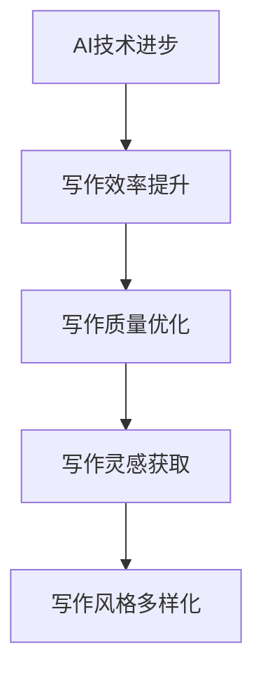

### 1.2 写作灵感的AI化

#### 1.2.1 生成式对抗网络（GAN）在写作中的应用

生成式对抗网络（GAN）是一种深度学习模型，由生成器和判别器组成。生成器负责生成数据，判别器负责判断生成数据是否真实。GAN在写作中的应用如下：

1. **生成标题：** 通过GAN，可以自动生成文章的标题，提供多种选择。
2. **构建大纲：** GAN可以帮助自动生成文章的大纲，为写作提供结构框架。
3. **生成内容：** GAN可以根据大纲生成完整的文章内容，甚至可以进行续写和改写。
4. **内容优化：** GAN可以根据用户反馈对生成内容进行调整和优化。

**Mermaid 流程图：**

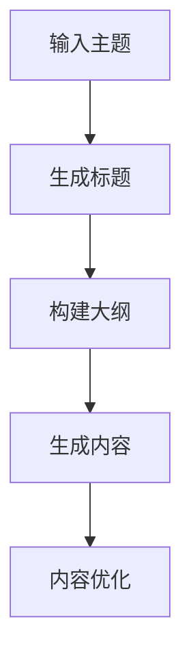

#### 1.2.2 递归神经网络（RNN）与长短期记忆（LSTM）在写作中的应用

递归神经网络（RNN）和长短期记忆（LSTM）是处理序列数据的有力工具，在写作中的应用包括：

1. **文本生成：** RNN和LSTM可以用来生成完整的文本，通过训练，模型可以学习到不同的写作风格和文体。
2. **情感分析：** RNN和LSTM可以分析文本的情感，为情感写作提供基础。
3. **语法纠正：** RNN和LSTM可以检测和纠正语法错误，提高文本的质量。

**伪代码：**

```python
def rnn_lstm_writing(text):
    # 初始化RNN/LSTM模型
    model = initialize_rnn_lstm()

    # 训练模型
    trained_model = train_model(text)

    # 生成写作灵感
    writing_idea = generate_idea_with_model(trained_model)

    return writing_idea
```

### 1.3 AI写作的优势与挑战

#### 1.3.1 AI写作的优势

AI写作具有以下优势：

1. **快速生成内容：** AI可以快速生成文章，节省时间和人力成本。
2. **创意无限：** AI可以提供丰富的写作灵感，帮助克服创作瓶颈。
3. **提高写作质量：** AI可以提供语法、拼写和内容优化建议，提高文本的准确性和流畅性。
4. **适应不同写作风格：** AI可以根据需求生成不同风格的文本，满足多样化需求。

**Mermaid 流程图：**

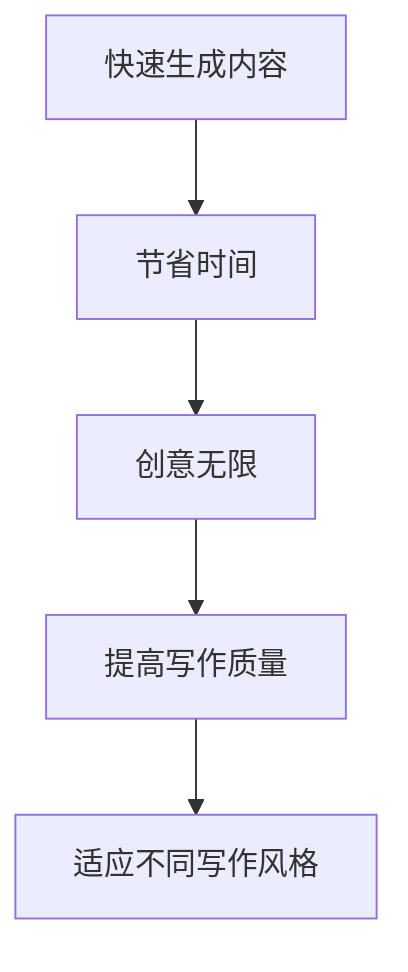

#### 1.3.2 AI写作的挑战

尽管AI写作具有许多优势，但也面临一些挑战：

1. **数据质量影响：** AI写作的质量高度依赖于训练数据的质量，如果数据存在偏见或不准确，生成的文本也可能存在同样的问题。
2. **模型适应性：** AI模型可能难以适应特定领域的专业写作需求，特别是在复杂、专业和多样化的写作任务中。
3. **伦理与版权问题：** AI生成的文本可能涉及伦理和版权问题，如文本偏见、原创性检测和版权保护等。

**伪代码：**

```python
def writing_challenge():
    # 检查数据质量
    data_quality = check_data_quality()

    # 检查模型适应性
    model_adaptation = check_model_adaptation()

    # 检查伦理与版权问题
    ethics_issue = check_ethics_issues()

    return data_quality, model_adaptation, ethics_issue
```

## 第2章: AI在写作领域的应用场景

### 2.1 AI辅助写作

#### 2.1.1 辅助写作工具的工作原理

AI辅助写作工具通过自然语言处理技术来帮助作者优化写作过程。以下是一些常见的工作原理：

1. **文本分析：** 辅助写作工具可以对输入的文本进行分词、词性标注和句法分析，以理解文本的结构和语义。
2. **语法检查：** 工具可以检测文本中的语法错误，并提供修正建议。
3. **拼写纠正：** 工具可以自动纠正拼写错误，提高文本的准确性。
4. **内容建议：** 工具可以根据文本内容提供相关的参考资料、观点或扩展内容，帮助作者丰富文章内容。

**Mermaid 流程图：**

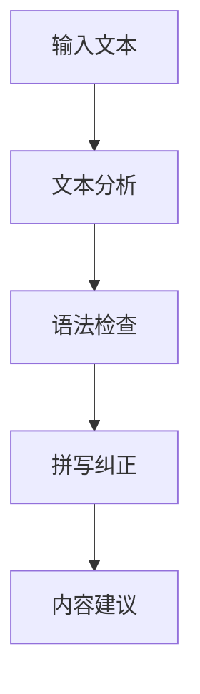

#### 2.1.2 AI辅助写作的实际应用案例

AI辅助写作工具在实际应用中发挥着重要作用，以下是一些常见的实际应用案例：

1. **写作助手：** 如Grammarly、Ginger等工具，可以实时检查文本中的错误并提供修正建议。
2. **内容生成：** 如GPT-3等模型，可以根据用户输入的主题或关键词生成完整的文章内容。
3. **学术写作辅助：** 如Wordtune等工具，可以帮助学术作者优化论文结构、语法和语言表达。

**伪代码：**

```python
def assist_writing(text):
    # 语法检查
    corrected_text = grammar_check(text)

    # 拼写纠正
    corrected_text = spelling_correction(corrected_text)

    # 内容建议
    suggested_text = content_suggestion(corrected_text)

    return suggested_text
```

### 2.2 自动写作

#### 2.2.1 自动写作的技术原理

自动写作是指使用人工智能技术生成完整文章的过程。其技术原理主要包括以下几个步骤：

1. **主题提取：** 从输入文本中提取主要主题或关键词，为后续写作提供方向。
2. **标题生成：** 根据主题提取的结果，自动生成文章的标题。
3. **大纲构建：** 根据主题和标题，自动构建文章的大纲，为文章的结构提供基础。
4. **内容生成：** 使用自然语言生成技术，根据大纲和主题生成完整的文章内容。
5. **内容优化：** 对生成的文章进行优化，包括语法、拼写和内容上的调整。

**Mermaid 流程图：**


#### 2.2.2 自动写作的优缺点分析

**优点：**

- **高效：** 自动写作可以快速生成大量文章，提高写作效率。
- **节省成本：** 自动写作可以减少人力成本，降低写作成本。
- **多样化：** 自动写作可以根据需求生成不同类型和风格的文章。

**缺点：**

- **质量不稳定：** 自动写作生成的文章质量可能不稳定，特别是在处理复杂、专业和多样化的写作任务时。
- **缺乏原创性：** 自动写作生成的文章可能缺乏原创性，特别是在复制现有内容时。

**伪代码：**

```python
def auto_writing(topic):
    # 生成标题
    title = generate_title(topic)

    # 构建大纲
    outline = create_outline(title)

    # 生成内容
    content = generate_content(outline)

    # 内容优化
    optimized_content = content_optimization(content)

    return optimized_content
```

### 2.3 情感写作与个性化写作

#### 2.3.1 情感写作的概念与实现

情感写作是指根据特定情感生成文章的过程。其实现主要包括以下几个步骤：

1. **情感分析：** 对输入文本进行情感分析，提取情感特征。
2. **情感生成：** 根据提取的情感特征生成情感相关的文章内容。
3. **情感调整：** 根据用户需求对生成的内容进行调整，使其更符合情感表达。

**Mermaid 流程图：**

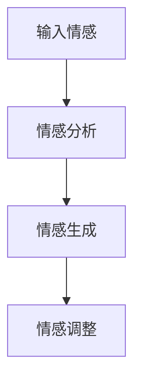

#### 2.3.2 个性化写作的技术基础

个性化写作是指根据用户特点和需求生成个性化文章的过程。其技术基础主要包括：

1. **用户分析：** 分析用户的历史行为、兴趣和偏好，提取用户特征。
2. **内容生成：** 根据用户特征生成满足用户需求的个性化文章。
3. **内容优化：** 对生成的内容进行调整，使其更符合用户的阅读习惯和偏好。

**伪代码：**

```python
def emotional_writing-emotional_content(sentiment):
    # 情感分析
    analyzed_sentiment = analyze_sentiment(sentiment)

    # 情感生成
    generated_content = generate_content_with_sentiment(analyzed_sentiment)

    return generated_content

def personalized_writing(user_profile):
    # 用户分析
    analyzed_user = analyze_user_profile(user_profile)

    # 生成个性化内容
    personalized_content = generate_content_for_user(analyzed_user)

    return personalized_content
```

## 第3章: AI写作的核心算法原理

### 3.1 自然语言处理基础

#### 3.1.1 自然语言处理的基本概念

自然语言处理（NLP）是人工智能领域的一个重要分支，旨在使计算机理解和处理人类语言。NLP的基本概念包括：

1. **分词：** 将文本分割成单词或短语，以便进行后续处理。
2. **词性标注：** 给文本中的每个词分配词性标签，如名词、动词、形容词等。
3. **句法分析：** 分析文本的语法结构，识别句子成分和关系。
4. **语义分析：** 理解文本的语义含义，提取文本中的关键信息。

**Mermaid 流程图：**

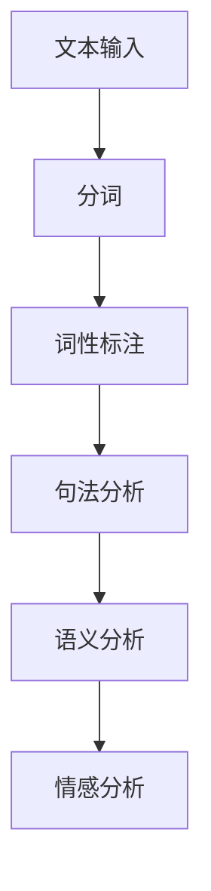

#### 3.1.2 词嵌入技术详解

词嵌入是将单词映射为固定大小的向量表示，以便在计算机中进行处理。词嵌入技术的主要目的是：

1. **减少维度：** 将文本从高维空间映射到低维空间，便于计算和处理。
2. **保持语义信息：** 通过向量之间的相似性来表示词语之间的语义关系。

常见的词嵌入方法包括：

1. **Word2Vec：** 使用神经网络模型，通过上下文信息学习单词的向量表示。
2. **GloVe：** 基于全局统计信息的词向量模型，通过训练大规模语料库学习单词的向量表示。

**数学公式：**

$$
\text{word\_embedding} = \text{vec}(\text{word})
$$`

**伪代码：**

```python
def word_embedding(text):
    # 创建词汇表
    vocabulary = create_vocabulary(text)

    # 转换为词向量
    word_vectors = convert_to_word_vectors(vocabulary)

    return word_vectors
```

### 3.2 生成对抗网络（GAN）原理

#### 3.2.1 GAN的工作机制

生成对抗网络（GAN）由生成器（Generator）和判别器（Discriminator）组成，二者相互对抗，共同训练。GAN的工作机制包括：

1. **生成器：** 生成器生成虚假数据，试图欺骗判别器。
2. **判别器：** 判别器判断输入数据是真实数据还是生成器生成的虚假数据。
3. **反馈循环：** 判别器的反馈用于指导生成器的训练，使其生成的数据更接近真实数据。

**Mermaid 流程图：**

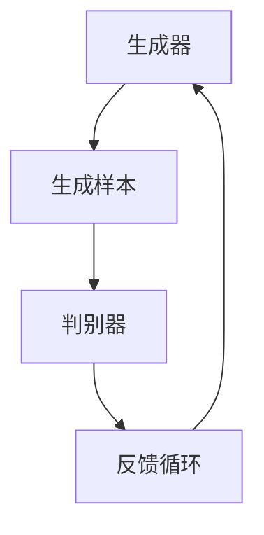

#### 3.2.2 GAN在写作中的应用

GAN在写作中的应用包括：

1. **标题生成：** 使用GAN生成文章的标题，提供多种创意选择。
2. **内容生成：** 使用GAN生成文章的内容，为作者提供灵感。
3. **情感写作：** 使用GAN生成情感相关的文章内容，实现情感写作。

**伪代码：**

```python
def gan_writing(Generator, Discriminator):
    # 训练生成器和判别器
    trained_models = train_gan(Generator, Discriminator)

    # 生成写作内容
    generated_content = generate_content_with_gan(Generator)

    return generated_content
```

### 3.3 递归神经网络（RNN）与长短期记忆（LSTM）算法

#### 3.3.1 RNN的基本原理

递归神经网络（RNN）是一种能够处理序列数据的神经网络。RNN的基本原理如下：

1. **输入序列：** 输入一个序列数据，如文本。
2. **隐藏状态：** RNN在处理序列时，会维持一个隐藏状态，用于存储前一个时间步的信息。
3. **输出序列：** 根据隐藏状态和当前输入，生成输出序列。

**伪代码：**

```python
def rnn_sequence_model(input_sequence):
    # 初始化RNN模型
    model = initialize_rnn_model()

    # 训练模型
    trained_model = train_model(input_sequence)

    # 生成输出序列
    output_sequence = generate_output_sequence(trained_model)

    return output_sequence
```

#### 3.3.2 LSTM的架构与功能

长短期记忆（LSTM）是RNN的一种变体，能够更好地处理长序列数据。LSTM的架构与功能包括：

1. **输入门：** 决定当前输入信息中哪些部分应该被记住。
2. **遗忘门：** 决定哪些旧信息应该被遗忘。
3. **输出门：** 决定当前隐藏状态中哪些信息应该被输出。

**Mermaid 流程图：**

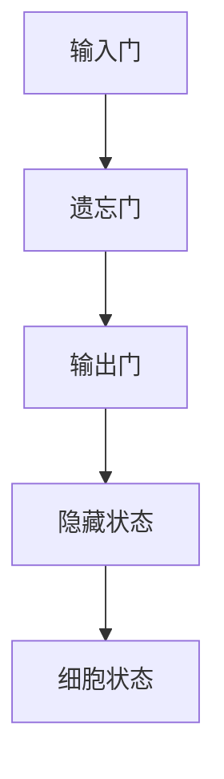

#### 3.3.3 LSTM在写作中的应用

LSTM在写作中的应用包括：

1. **文本生成：** 使用LSTM生成文章的内容，模仿人类写作风格。
2. **情感分析：** 使用LSTM分析文本的情感，为情感写作提供基础。
3. **语法纠正：** 使用LSTM检测和纠正语法错误，提高文本质量。

**伪代码：**

```python
def lstm_writing(LSTM_model, text):
    # 初始化LSTM模型
    initialized_model = initialize_lstm_model()

    # 训练LSTM模型
    trained_model = train_lstm_model(text)

    # 生成写作内容
    generated_content = generate_content_with_lstm(trained_model)

    return generated_content
```

## 第4章: AI写作的数学模型与公式解析

### 4.1 词嵌入与向量空间模型

#### 4.1.1 词嵌入的基本概念

词嵌入是将单词映射到向量空间的过程，以便在计算机中进行处理。词嵌入的基本概念包括：

1. **词向量：** 将单词映射为一个固定大小的向量。
2. **维度：** 词向量的维度决定了词嵌入的精度和复杂性。
3. **语义信息：** 词向量之间的相似性反映了单词之间的语义关系。

常见的词嵌入技术包括：

1. **Word2Vec：** 通过学习单词的上下文信息来生成词向量。
2. **GloVe：** 通过全局统计信息生成词向量。

**数学公式：**

$$
\text{word\_embedding} = \text{vec}(\text{word})
$$`

**伪代码：**

```python
def word_embedding(text):
    # 创建词汇表
    vocabulary = create_vocabulary(text)

    # 转换为词向量
    word_vectors = convert_to_word_vectors(vocabulary)

    return word_vectors
```

#### 4.1.2 向量空间模型的应用

向量空间模型是一种将文本数据转换为向量表示的方法，以便进行文本分析和处理。向量空间模型的应用包括：

1. **相似度计算：** 计算两个文本向量的相似度，用于文本分类、推荐系统等任务。
2. **聚类分析：** 将文本数据根据向量空间中的距离进行聚类，用于主题挖掘、文本相似度分析等。
3. **文本检索：** 利用向量空间模型进行文本检索，提高搜索效果。

**伪代码：**

```python
def vector_space_similarity(text1, text2):
    # 将文本转换为向量
    vector1 = convert_to_vector(text1)
    vector2 = convert_to_vector(text2)

    # 计算相似度
    similarity = calculate_similarity(vector1, vector2)

    return similarity
```

### 4.2 注意力机制

#### 4.2.1 注意力机制的基本原理

注意力机制（Attention Mechanism）是一种用于处理序列数据的方法，通过关注序列中的重要部分来提高模型的性能。注意力机制的基本原理包括：

1. **注意力得分：** 对序列中的每个元素计算一个注意力得分，表示该元素的重要性。
2. **加权求和：** 将注意力得分与对应的元素进行加权求和，生成新的序列表示。
3. **输出序列：** 根据加权求和的结果生成输出序列。

**数学公式：**

$$
\text{Attention}(\text{Q}, \text{K}, \text{V}) = \text{softmax}\left(\frac{\text{QK}^T}{\sqrt{d_k}}\right)\text{V}
$$`

**伪代码：**

```python
def attention(Q, K, V):
    # 计算注意力得分
    attention_scores = softmax(QK.T / sqrt(d_k))

    # 加权求和
    weighted_vector = attention_scores @ V

    return weighted_vector
```

#### 4.2.2 注意力机制在写作中的应用

注意力机制在写作中的应用包括：

1. **文本生成：** 使用注意力机制来关注文本中的重要部分，提高生成文本的质量。
2. **情感分析：** 使用注意力机制来关注文本中的情感词，提高情感分析的准确性。
3. **语法纠正：** 使用注意力机制来关注文本中的语法错误，提高语法纠正的准确性。

**伪代码：**

```python
def attention_writing(attention_model, text):
    # 计算注意力得分
    attention_scores = attention_model(text)

    # 根据注意力得分生成文本
    generated_text = generate_text_with_attention(attention_scores)

    return generated_text
```

### 4.3 深度学习优化算法

#### 4.3.1 梯度下降法

梯度下降法（Gradient Descent）是一种用于优化深度学习模型的方法，通过不断调整模型参数来最小化损失函数。梯度下降法的基本原理包括：

1. **损失函数：** 模型的损失函数表示模型预测与实际结果之间的差距。
2. **梯度：** 梯度表示损失函数对模型参数的导数，指示参数调整的方向。
3. **更新参数：** 根据梯度调整模型参数，以减小损失函数。

**数学公式：**

$$
\text{w}_{\text{new}} = \text{w}_{\text{old}} - \alpha \cdot \nabla \text{J}(\text{w})
$$`

**伪代码：**

```python
def gradient_descent(model, learning_rate, epochs):
    # 初始化模型参数
    w = model.get_initial_weights()

    # 进行迭代
    for epoch in range(epochs):
        # 计算梯度
        gradient = compute_gradient(w)

        # 更新参数
        w = w - learning_rate * gradient

    # 返回更新后的模型
    return model
```

#### 4.3.2 Adam优化器

Adam优化器是一种结合了Adam和RMSprop优点的自适应优化算法。Adam优化器的基本原理包括：

1. **一阶矩估计（m）：** 计算梯度的一阶矩估计，用于调整学习率。
2. **二阶矩估计（v）：** 计算梯度的二阶矩估计，用于调整学习率。
3. **自适应学习率：** 根据一阶矩估计和二阶矩估计动态调整学习率。

**数学公式：**

$$
\text{m}_t = \beta_1 \text{m}_{t-1} + (1 - \beta_1) (\text{g}_t - \text{m}_{t-1})
$$`

$$
\text{v}_t = \beta_2 \text{v}_{t-1} + (1 - \beta_2) (\text{g}_t^2 - \text{v}_{t-1})
$$`

$$
\text{w}_{\text{new}} = \text{w}_{\text{old}} - \frac{\text{eta}}{\sqrt{1 - \beta_2^t} (1 - \beta_1^t)} (\text{m}_t / (1 - \beta_2^t))
$$`

**伪代码：**

```python
def adam_optimizer(model, learning_rate, beta1, beta2, epochs):
    # 初始化一阶矩和二阶矩
    m = 0
    v = 0

    # 进行迭代
    for epoch in range(epochs):
        # 计算梯度
        g = compute_gradient(model)

        # 更新一阶矩和二阶矩
        m = beta1 * m + (1 - beta1) * (g - m)
        v = beta2 * v + (1 - beta2) * (g ** 2 - v)

        # 计算修正系数
        m_hat = m / (1 - beta1 ** epoch)
        v_hat = v / (1 - beta2 ** epoch)

        # 更新模型参数
        model.update_weights(learning_rate * m_hat / (sqrt(v_hat) + epsilon))

    # 返回优化后的模型
    return model
```

## 第5章: 实战案例：AI写作应用开发

### 5.1 项目背景与目标

#### 5.1.1 项目概述

本项目旨在开发一款基于人工智能技术的写作应用，该应用将利用AI技术提供辅助写作、自动写作和情感写作功能。具体目标如下：

1. **辅助写作：** 通过语法检查、拼写纠正和内容建议等功能，帮助用户提高写作质量和效率。
2. **自动写作：** 利用自然语言生成技术，自动生成文章的标题、大纲和内容，提供写作灵感。
3. **情感写作：** 通过情感分析技术，根据用户输入的情感，生成情感相关的文章内容。

#### 5.1.2 技术选型

为了实现以上目标，本项目采用了以下技术：

1. **自然语言处理库：** 使用Python中的NLTK库进行文本预处理和分析。
2. **深度学习框架：** 使用TensorFlow或PyTorch作为深度学习模型训练和部署的工具。
3. **自然语言生成模型：** 使用预训练的GPT-3模型进行文本生成。

### 5.2 环境搭建

#### 5.2.1 开发环境准备

在开始项目开发之前，需要搭建相应的开发环境。以下是环境搭建的步骤：

1. **安装Python环境：** 安装Python 3.x版本。
2. **安装深度学习框架：** 选择TensorFlow或PyTorch，并安装相应版本。
3. **安装NLP库：** 安装NLTK、spaCy等自然语言处理库。

**伪代码：**

```python
def setup_environment():
    # 安装Python环境
    install_python()

    # 安装深度学习框架
    install_tensorflow_or_pytorch()

    # 安装NLP库
    install_nlp_libraries()

    # 安装其他依赖
    install_other_dependencies()

    return "环境搭建完成"
```

#### 5.2.2 数据集获取与预处理

在项目开发过程中，需要获取和预处理相应的数据集。以下是数据集获取和预处理的过程：

1. **获取数据集：** 从公开数据集网站或数据源下载相关数据集，如新闻文章、社交媒体文本等。
2. **清洗数据：** 清除无关信息，如HTML标签、特殊字符等。
3. **分词与标注：** 使用NLP库对文本进行分词和词性标注。
4. **数据预处理：** 将文本转换为适合模型训练的格式，如序列编码或词嵌入。

**伪代码：**

```python
def preprocess_data(data_source):
    # 加载数据
    data = load_data(data_source)

    # 清洗数据
    cleaned_data = clean_data(data)

    # 分词与标注
    tokenized_data = tokenize_data(cleaned_data)

    # 数据预处理
    preprocessed_data = preprocess_for_training(tokenized_data)

    return preprocessed_data
```

### 5.3 模型构建与训练

#### 5.3.1 模型架构设计

在本项目中，我们采用了基于Transformer的生成模型，特别是GPT-3模型。以下是模型架构的设计：

1. **输入层：** 输入文本序列。
2. **嵌入层：** 将文本序列转换为词嵌入向量。
3. **编码层：** 通过多层Transformer编码器进行处理，每个编码器层包含多头自注意力机制。
4. **解码层：** 通过多层Transformer解码器生成输出序列。
5. **输出层：** 输出文本序列。

**Mermaid 流程图：**

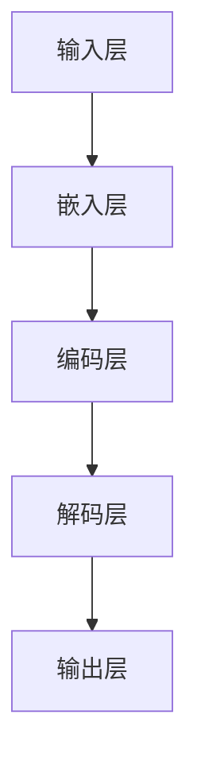

#### 5.3.2 模型训练流程

以下是模型训练的流程：

1. **数据预处理：** 对数据集进行清洗、分词和标注，将文本转换为序列编码。
2. **模型初始化：** 初始化模型参数。
3. **训练模型：** 使用训练数据进行模型训练，通过反向传播算法和优化器更新模型参数。
4. **验证模型：** 使用验证数据集评估模型性能，调整模型参数。
5. **测试模型：** 使用测试数据集测试模型性能，评估模型泛化能力。

**伪代码：**

```python
def train_model(model, train_data, validation_data, learning_rate, epochs):
    # 数据预处理
    preprocessed_train_data = preprocess_data(train_data)
    preprocessed_validation_data = preprocess_data(validation_data)

    # 初始化模型
    initialized_model = initialize_model()

    # 训练模型
    trained_model = model.train(preprocessed_train_data, learning_rate, epochs)

    # 验证模型
    validation_loss = model.evaluate(preprocessed_validation_data)

    # 返回训练后的模型
    return trained_model
```

### 5.4 模型部署与测试

#### 5.4.1 模型评估指标

在模型部署之前，需要对模型进行评估。以下是常用的评估指标：

1. **准确率（Accuracy）：** 模型正确预测的比例。
2. **精确率（Precision）：** 真正例与所有预测为正例的样本的比例。
3. **召回率（Recall）：** 真正例与所有真实正例的比例。
4. **F1分数（F1 Score）：** 精确率和召回率的加权平均。

**伪代码：**

```python
def evaluate_model(model, test_data):
    # 数据预处理
    preprocessed_test_data = preprocess_data(test_data)

    # 预测结果
    predictions = model.predict(preprocessed_test_data)

    # 计算评估指标
    accuracy = calculate_accuracy(predictions)
    precision = calculate_precision(predictions)
    recall = calculate_recall(predictions)
    f1_score = calculate_f1_score(precision, recall)

    # 返回评估结果
    return accuracy, precision, recall, f1_score
```

#### 5.4.2 模型部署与用户交互

在模型部署之后，用户可以通过以下方式与模型进行交互：

1. **API接口：** 提供RESTful API接口，用户可以通过HTTP请求与模型进行交互。
2. **用户界面：** 开发一个用户界面，用户可以通过界面输入文本，获取模型生成的结果。
3. **自动化集成：** 将模型集成到现有的写作工具或平台中，如文本编辑器、内容管理系统等。

**伪代码：**

```python
def deploy_model(model):
    # 部署模型
    deployed_model = model.deploy()

    # 用户交互
    user_interact = interact_with_user(deployed_model)

    return user_interact
```

## 第6章: AI写作的未来发展趋势与挑战

### 6.1 AI写作技术的进步

#### 6.1.1 技术趋势分析

随着人工智能技术的不断进步，AI写作领域也呈现出一些新的趋势：

1. **生成式AI：** 生成式AI技术，如GPT-3，已经在写作领域取得了显著成果，未来将进一步发展。
2. **多模态写作：** 多模态写作结合了文本、图像、声音等多种形式，提供更丰富的写作体验。
3. **自适应写作：** 自适应写作可以根据用户需求和偏好生成个性化内容，满足多样化的写作需求。
4. **跨领域写作：** 跨领域写作可以将不同领域的知识融合到一起，提供更全面、更专业的写作内容。

**Mermaid 流程图：**

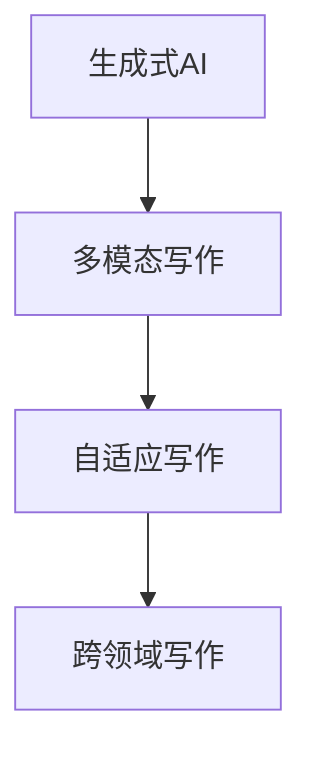

#### 6.1.2 技术突破展望

未来，AI写作技术有望在以下几个方面取得突破：

1. **自动摘要生成：** AI可以自动生成文章的摘要，提高信息获取的效率。
2. **交互式写作：** 交互式写作允许用户与AI实时互动，提供更加个性化的写作体验。
3. **情感智能：** AI将能够更好地理解情感，生成情感丰富、贴近人类情感的文本。

**伪代码：**

```python
def future_trends():
    # 自动摘要生成
    summary_generation = enable_auto_summary()

    # 交互式写作
    interactive_writing = enable_interactive_writing()

    # 情感智能
    emotional_intelligence = enhance_emotional_intelligence()

    return summary_generation, interactive_writing, emotional_intelligence
```

### 6.2 伦理与法律问题

#### 6.2.1 伦理挑战

随着AI写作技术的不断发展，伦理问题也日益凸显。以下是一些主要的伦理挑战：

1. **文本偏见检测：** AI生成的文本可能存在偏见，需要对其进行检测和纠正。
2. **文本伦理审核：** AI生成的文本需要经过伦理审核，确保内容符合道德标准。
3. **原创性保护：** AI生成的文本可能侵犯他人的知识产权，需要制定相应的保护措施。

**伪代码：**

```python
def ethics_issues():
    # 文本偏见检测
    bias_detection = detect_text_bias()

    # 文本伦理审核
    ethical_review = conduct_ethical_review()

    return bias_detection, ethical_review
```

#### 6.2.2 法律问题探讨

AI写作技术的法律问题主要包括：

1. **版权保护：** AI生成的文本需要明确版权归属，防止侵权行为。
2. **侵权责任：** AI生成的文本侵犯他人权益时，需要明确侵权责任。

**伪代码：**

```python
def legal_issues():
    # 版权保护
    copyright_protection = protect_copyright()

    # 侵权责任
    liability_for_infringement = define_liability()

    return copyright_protection, liability_for_infringement
```

### 6.3 AI写作对传统写作的影响

#### 6.3.1 AI写作与传统写作的融合

AI写作与传统写作正在逐渐融合，呈现出以下趋势：

1. **合作创作：** AI可以作为作者的助手，协助完成写作任务，实现人机协同。
2. **写作教育：** AI写作工具可以用于写作教育，帮助学生提高写作技能。
3. **写作产业变革：** AI写作将改变传统的写作模式，推动写作产业的变革。

**Mermaid 流程图：**

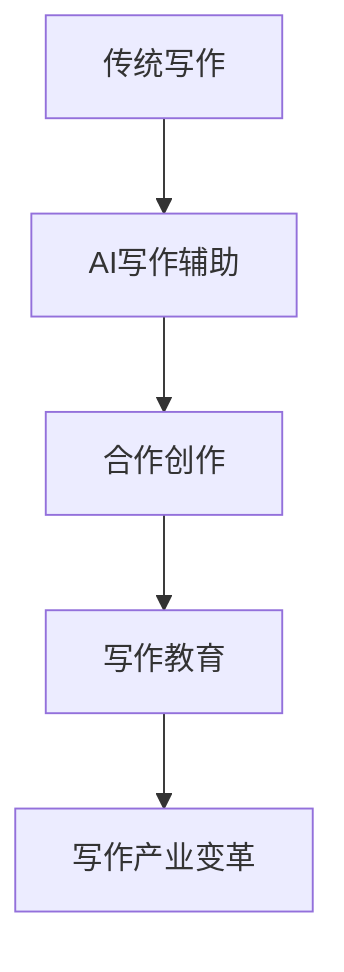

#### 6.3.2 AI写作的未来发展

未来，AI写作将继续发展，并呈现出以下趋势：

1. **自动化程度提高：** AI将能够自动完成更多复杂的写作任务，提高写作效率。
2. **个性化写作：** AI将能够更好地理解用户需求，生成个性化内容。
3. **跨领域应用：** AI将在更多领域得到应用，如新闻报道、科学研究、商业文案等。

**伪代码：**

```python
def future_impact():
    # 写作产业变革
    industry_change = analyze_industry_change()

    # 写作方式变革
    writing_style_change = analyze_writing_style()

    # 写作教育变革
    education_change = analyze_education()

    return industry_change, writing_style_change, education_change
```

## 第7章: AI写作资源与工具介绍

### 7.1 开源深度学习框架

#### 7.1.1 TensorFlow

TensorFlow是谷歌开发的开源深度学习框架，广泛应用于图像识别、自然语言处理和计算机视觉等领域。以下是TensorFlow的一些基本使用方法：

1. **安装TensorFlow：**
   ```shell
   pip install tensorflow
   ```

2. **创建模型：**
   ```python
   import tensorflow as tf

   model = tf.keras.Sequential([
       tf.keras.layers.Dense(128, activation='relu', input_shape=(784,)),
       tf.keras.layers.Dropout(0.2),
       tf.keras.layers.Dense(10, activation='softmax')
   ])
   ```

3. **训练模型：**
   ```python
   model.compile(optimizer='adam',
                 loss='categorical_crossentropy',
                 metrics=['accuracy'])

   model.fit(x_train, y_train, epochs=5)
   ```

#### 7.1.2 PyTorch

PyTorch是另一个流行的开源深度学习框架，以其灵活性和易用性著称。以下是PyTorch的一些基本使用方法：

1. **安装PyTorch：**
   ```shell
   pip install torch torchvision
   ```

2. **创建模型：**
   ```python
   import torch
   import torch.nn as nn
   import torch.optim as optim

   class Model(nn.Module):
       def __init__(self):
           super(Model, self).__init__()
           self.fc1 = nn.Linear(784, 128)
           self.fc2 = nn.Linear(128, 10)

       def forward(self, x):
           x = F.relu(self.fc1(x))
           x = self.fc2(x)
           return x

   model = Model()
   ```

3. **训练模型：**
   ```python
   optimizer = optim.Adam(model.parameters(), lr=0.001)
   criterion = nn.CrossEntropyLoss()

   for epoch in range(5):
       running_loss = 0.0
       for i, (data, target) in enumerate(train_loader):
           optimizer.zero_grad()
           output = model(data)
           loss = criterion(output, target)
           loss.backward()
           optimizer.step()
           running_loss += loss.item()
       print(f'Epoch {epoch+1}, Loss: {running_loss/len(train_loader)}')
   ```

### 7.2 写作辅助工具

#### 7.2.1 GPT-3

GPT-3是OpenAI开发的预训练语言模型，具有强大的文本生成能力。以下是GPT-3的一些基本使用方法：

1. **获取API密钥：**
   - 访问OpenAI官网，注册并获取API密钥。

2. **安装Hugging Face Transformers库：**
   ```shell
   pip install transformers
   ```

3. **使用GPT-3生成文本：**
   ```python
   from transformers import pipeline

   generator = pipeline("text-generation", model="gpt3")

   prompt = "请写一篇关于人工智能的文章摘要。"
   response = generator(prompt, max_length=100)
   print(response)
   ```

#### 7.2.2 Grammarly

Grammarly是一个流行的写作辅助工具，提供语法检查、拼写纠错和内容建议等功能。以下是Grammarly的一些基本使用方法：

1. **注册账户：**
   - 访问Grammarly官网，注册并创建账户。

2. **检查文本：**
   ```python
   import requests

   url = "https://api.givelot.com/api/v2/search/check"
   payload = {
       "apiKey": "YOUR_API_KEY",
       "text": "这是一个测试文本。"
   }
   headers = {
       "Content-Type": "application/json"
   }

   response = requests.post(url, json=payload, headers=headers)
   result = response.json()
   print(result)
   ```

3. **获取修改建议：**
   ```python
   suggestions = result["suggestions"]
   for suggestion in suggestions:
       print(f"{suggestion["issue"]}: {suggestion["suggestion"]}")
   ```

### 7.3 研究与学习资源

#### 7.3.1 开源数据集

开源数据集是AI研究的重要资源，提供了丰富的文本数据供研究人员使用。以下是一些常用的开源数据集：

1. **Wikipedia：** 包含大量维基百科文章，可用于文本分类、实体识别等任务。
2. **Common Crawl：** 包含互联网上的大量网页数据，可用于自然语言处理、信息提取等任务。
3. **Twitter：** 包含Twitter上的大量推文数据，可用于情感分析、话题建模等任务。

**获取方式：**
- 访问数据集官网，下载数据集文件。
- 使用Python库（如`requests`、`urllib`等）从数据集官网下载数据。

#### 7.3.2 学术论文与书籍

学术论文和书籍是了解AI写作领域最新研究进展的重要途径。以下是一些推荐的学习资源：

1. **《自然语言处理综论》（Speech and Language Processing）：** David J. IBM等编写的经典教材，涵盖了自然语言处理的各个方面。
2. **《生成对抗网络》（Generative Adversarial Networks）：** Ian J. Goodfellow等编写的论文，详细介绍了GAN的理论和应用。
3. **《深度学习》（Deep Learning）：** Ian J. Goodfellow、Yoshua Bengio和Aaron Courville编写的教材，介绍了深度学习的理论基础和应用。

**获取方式：**
- 访问学术期刊或在线书店，下载或购买论文和书籍。
- 使用学术搜索引擎（如Google Scholar）搜索相关论文。

## 附录A: AI写作核心概念流程图

### A.1 自然语言处理流程图


### A.2 GAN原理流程图


### A.3 RNN与LSTM算法流程图

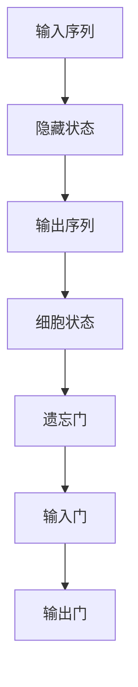

## 附录B: 实战案例代码解析

### B.1 数据预处理代码解读

```python
import re
import nltk
from nltk.tokenize import word_tokenize
from nltk.corpus import stopwords

# 下载NLTK的停用词库
nltk.download('stopwords')

def preprocess_data(data):
    # 清洗数据
    cleaned_data = [re.sub(r'\W+', ' ', text) for text in data]

    # 分词
    tokenized_data = [word_tokenize(text) for text in cleaned_data]

    # 去除停用词
    stop_words = set(stopwords.words('english'))
    cleaned_tokens = [[token for token in tokens if token.lower() not in stop_words] for tokens in tokenized_data]

    return cleaned_tokens
```

### B.2 模型构建与训练代码解读

```python
import tensorflow as tf
from tensorflow.keras.models import Sequential
from tensorflow.keras.layers import Embedding, LSTM, Dense

# 设置超参数
vocab_size = 10000
embedding_dim = 256
sequence_length = 100

# 创建模型
model = Sequential([
    Embedding(vocab_size, embedding_dim, input_length=sequence_length),
    LSTM(128, return_sequences=True),
    LSTM(64, return_sequences=False),
    Dense(1, activation='sigmoid')
])

# 编译模型
model.compile(optimizer='adam', loss='binary_crossentropy', metrics=['accuracy'])

# 训练模型
model.fit(x_train, y_train, epochs=10, batch_size=64)
```

### B.3 模型部署与测试代码解读

```python
# 加载模型
model = tf.keras.models.load_model('model.h5')

# 加载测试数据
test_data = load_data('test_data.txt')

# 预处理测试数据
preprocessed_test_data = preprocess_data(test_data)

# 测试模型
accuracy = model.evaluate(preprocessed_test_data, y_test)

print(f'测试准确率: {accuracy[1]}')
```

## 作者信息

作者：AI天才研究院/AI Genius Institute & 禅与计算机程序设计艺术 /Zen And The Art of Computer Programming

