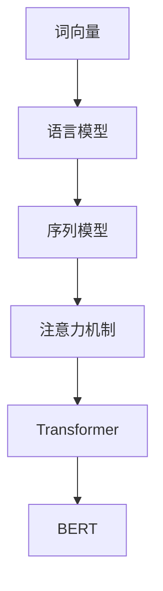

                 

# AI时代的自然语言处理发展：从学术到产业

> 关键词：自然语言处理，人工智能，语言模型，Transformer，BERT，预训练，微调，文本分类，命名实体识别，机器翻译，对话系统，多模态应用，生成对抗网络，强化学习，元学习，产业应用，发展趋势，安全性，隐私保护

> 摘要：本文将从自然语言处理的基础概念和算法出发，深入探讨自然语言处理在AI时代的学术和产业应用。我们将逐步解析自然语言处理的核心任务，介绍语言模型、词向量、序列模型、注意力机制等关键技术，并探讨Transformer、BERT等模型的原理和实际应用。随后，我们将探讨自然语言处理在不同领域的应用，以及前沿技术的发展趋势。最后，我们将分析自然语言处理在产业应用中的挑战与机遇，并探讨其在未来的发展方向。

### 《AI时代的自然语言处理发展：从学术到产业》目录大纲

#### 第一部分：自然语言处理基础

##### 第1章：自然语言处理概述
- 1.1 自然语言处理的起源与发展
- 1.2 自然语言处理的核心任务
- 1.3 自然语言处理与人工智能的关系

##### 第2章：语言模型与词向量
- 2.1 语言模型基础
- 2.2 词向量与语义表示
- 2.3 常见词向量模型

##### 第3章：序列模型与注意力机制
- 3.1 隐马尔可夫模型（HMM）
- 3.2 条件随机场（CRF）
- 3.3 长短时记忆网络（LSTM）
- 3.4 门控循环单元（GRU）
- 3.5 注意力机制

##### 第4章：Transformer架构与BERT模型
- 4.1 Transformer架构介绍
- 4.2 Transformer详解
- 4.3 BERT模型详解

##### 第5章：预训练与微调
- 5.1 预训练的概念与意义
- 5.2 自监督学习方法
- 5.3 微调技术

#### 第二部分：自然语言处理应用

##### 第6章：文本分类与情感分析
- 6.1 文本分类概述
- 6.2 情感分析方法与案例
- 6.3 情感分析应用

##### 第7章：命名实体识别与关系抽取
- 7.1 命名实体识别概述
- 7.2 命名实体识别方法
- 7.3 关系抽取方法与应用

##### 第8章：机器翻译与对话系统
- 8.1 机器翻译概述
- 8.2 神经机器翻译方法
- 8.3 对话系统架构与实现

##### 第9章：自然语言处理在多模态应用中的发展
- 9.1 多模态数据处理
- 9.2 图像与文本融合方法
- 9.3 视觉问答系统

#### 第三部分：自然语言处理技术发展

##### 第10章：自然语言处理前沿技术综述
- 10.1 生成对抗网络（GAN）在自然语言处理中的应用
- 10.2 强化学习与自然语言处理
- 10.3 元学习与自然语言处理

##### 第11章：自然语言处理在产业中的应用与挑战
- 11.1 自然语言处理在电子商务中的应用
- 11.2 自然语言处理在金融领域的应用
- 11.3 自然语言处理在医疗领域的应用
- 11.4 自然语言处理在产业中的挑战与机遇

##### 第12章：自然语言处理技术在未来的发展趋势
- 12.1 大模型与小样本学习
- 12.2 多语言与跨领域知识融合
- 12.3 安全性与隐私保护

##### 附录：自然语言处理工具与资源
- 附录A：常用自然语言处理工具与库
- 附录B：自然语言处理数据集介绍
- 附录C：自然语言处理学术论文精选

### Mermaid 流程图：自然语言处理框架



### 第一部分：自然语言处理基础

#### 第1章：自然语言处理概述

自然语言处理（Natural Language Processing，NLP）是人工智能（Artificial Intelligence，AI）的一个重要分支，旨在让计算机理解和处理人类语言。NLP涉及到语言学、计算机科学、机器学习等多个领域的交叉应用。

##### 1.1 自然语言处理的起源与发展

自然语言处理的起源可以追溯到20世纪50年代，当时的研究主要集中在规则驱动的方法上。这些方法依赖于大量的手工编写的规则来解析和生成语言。然而，这些方法在处理复杂和不确定的语言现象时表现不佳。

随着计算机硬件和算法的发展，统计方法和机器学习方法逐渐成为NLP的主流。1980年代，统计语言模型和隐马尔可夫模型（HMM）的出现，标志着NLP进入了新的阶段。1990年代，支持向量机（SVM）和条件随机场（CRF）等算法的应用，进一步提升了NLP的性能。

进入21世纪，随着深度学习的兴起，NLP取得了显著的突破。神经网络模型如长短时记忆网络（LSTM）、门控循环单元（GRU）和Transformer等，在语言模型、文本分类、机器翻译等领域取得了优异的性能。

##### 1.2 自然语言处理的核心任务

自然语言处理的核心任务包括：

1. 语言理解：理解和解析自然语言，包括词性标注、句法分析、语义角色标注等。
2. 语言生成：生成自然语言，如自动摘要、文本生成、机器翻译等。
3. 语言翻译：将一种自然语言翻译成另一种自然语言。
4. 语言分类：对文本进行分类，如情感分析、主题分类等。
5. 语言识别：识别文本中的特定实体、关系等。

##### 1.3 自然语言处理与人工智能的关系

自然语言处理是人工智能的一个重要组成部分，它与人工智能的其他分支如计算机视觉、语音识别等紧密相关。NLP的发展不仅依赖于人工智能的基础理论和技术，也为人工智能的实际应用提供了重要的支撑。

例如，在自动驾驶领域，NLP可以用于理解道路标志和指示牌，从而辅助自动驾驶系统做出决策。在医疗领域，NLP可以用于分析病历和医学文献，辅助医生进行诊断和治疗。在电子商务领域，NLP可以用于分析用户评论和反馈，帮助企业了解用户需求和市场趋势。

自然语言处理在人工智能中的应用广泛而深入，它不仅推动了人工智能技术的发展，也为社会带来了诸多便利和效益。

#### 第2章：语言模型与词向量

语言模型是自然语言处理中最基本的概念之一，它用于预测文本序列中的下一个单词或字符。语言模型在文本生成、机器翻译、语音识别等任务中发挥着重要作用。

##### 2.1 语言模型基础

语言模型通常基于统计方法，其中最简单的是N-gram模型。N-gram模型假设一个词序列的概率可以通过其前N个词的概率来表示。具体而言，一个N-gram模型可以表示为：

$$
P(w_n | w_{n-1}, w_{n-2}, \ldots, w_1) = \frac{C(w_{n-1}, w_{n-2}, \ldots, w_1, w_n)}{C(w_{n-1}, w_{n-2}, \ldots, w_1)}
$$

其中，$w_n$ 是下一个要预测的词，$w_{n-1}, w_{n-2}, \ldots, w_1$ 是已知的N-1个前文词，$C(w_{n-1}, w_{n-2}, \ldots, w_1, w_n)$ 是这N个词的联合出现次数，$C(w_{n-1}, w_{n-2}, \ldots, w_1)$ 是前N-1个词的联合出现次数。

**N-gram模型伪代码：**

```python
def N_gram_model(train_data, N):
    n_gram_dict = {}
    for sentence in train_data:
        for i in range(len(sentence) - N):
            n_gram = tuple(sentence[i:i+N])
            if n_gram not in n_ gram_dict:
                n_ gram_dict[n_ gram] = [0] * (26**N)
            n_ gram_dict[n_ gram][sentence[i+N].to_index()] += 1
    for key in n_ gram_dict:
        total = sum(n_ gram_dict[key])
        for index in range(26**N):
            n_ gram_dict[key][index] = n_ gram_dict[key][index] / total
    return n_ gram_dict

def predict_next_word(n_ gram_dict, n_ gram):
    word_probabilities = [0] * 26
    for index in range(26):
        word = index.to_char()
        n_ gram_word = tuple([word] + list(n_ gram[1:]))
        if n_ gram_word in n_ gram_dict:
            word_probabilities[index] = n_ gram_dict[n_ gram_word]
    return argmax(word_probabilities)
```

##### 2.2 词向量与语义表示

词向量（Word Vector）是一种将词语转换为向量表示的技术，用于捕捉词语的语义信息。词向量在自然语言处理中有着广泛的应用，如文本分类、情感分析、机器翻译等。

**Word2Vec模型**

Word2Vec是一种基于神经网络的语言模型，其核心思想是将词语映射到低维向量空间中，使得在语义上相似的词语在向量空间中距离较近。Word2Vec模型主要有两种实现方式：连续词袋（Continuous Bag of Words，CBOW）和Skip-Gram。

**CBOW模型**

CBOW模型通过上下文词的平均向量来表示目标词。具体来说，给定一个目标词$w_t$和其上下文词$w_{t-n}, w_{t-n+1}, \ldots, w_{t+n}$，CBOW模型将上下文词的向量求平均，得到目标词的向量表示：

$$
\text{word\_vector} = \frac{1}{Z} \sum_{\text{context\_words}} \text{softmax}(\text{context\_word\_vector} \cdot \text{word\_vector}) \cdot \text{context\_word\_vector}
$$

**Skip-Gram模型**

Skip-Gram模型与CBOW模型类似，但它是通过目标词的向量来预测上下文词。具体来说，给定一个目标词$w_t$和其上下文词$w_{t-n}, w_{t-n+1}, \ldots, w_{t+n}$，Skip-Gram模型使用目标词的向量来预测上下文词。

**GloVe模型**

GloVe（Global Vectors for Word Representation）是一种基于矩阵分解的语言模型，它通过优化全局损失函数来学习词向量。GloVe模型将词向量表示为多个低维向量的加和：

$$
v_w = \sum_{j=1}^{|V|} f_j \cdot v_j
$$

其中，$v_w$ 是词$w$的向量表示，$v_j$ 是词性$j$的向量表示，$f_j$ 是词性$j$的权重。

**词向量与语义表示**

词向量在自然语言处理中有着重要的应用，如文本分类、情感分析、机器翻译等。词向量能够捕捉词语的语义信息，使得在语义上相似的词语在向量空间中距离较近。例如，在文本分类任务中，词向量可以用于表示文本的特征，从而实现文本分类。

**Word2Vec模型伪代码：**

```python
class Word2VecModel(nn.Module):
    def __init__(self, vocab_size, embedding_dim):
        super().__init__()
        self.embedding = nn.Embedding(vocab_size, embedding_dim)
        self.fc = nn.Linear(embedding_dim, vocab_size)

    def forward(self, words):
        embeddings = self.embedding(words)
        output = self.fc(embeddings)
        return output

# 训练Word2Vec模型
model = Word2VecModel(vocab_size, embedding_dim)
optimizer = torch.optim.Adam(model.parameters(), lr=learning_rate)
for epoch in range(num_epochs):
    for words in data_loader:
        optimizer.zero_grad()
        output = model(words)
        loss = loss_fn(output, labels)
        loss.backward()
        optimizer.step()
```

##### 2.3 常见词向量模型

除了Word2Vec和GloVe，还有许多其他的词向量模型，如FastText、BERT等。

**FastText**

FastText是一种基于N-gram的语言模型，它将词语分解成子词，并将子词作为独立的词语进行建模。FastText模型能够更好地捕捉词语的局部语义信息。

**BERT**

BERT（Bidirectional Encoder Representations from Transformers）是一种基于Transformer的预训练语言模型，它通过双向编码器来捕捉词语的前后文信息。BERT模型在自然语言处理任务中取得了优异的性能。

**BERT模型**

BERT模型由两个主要部分组成：预训练和微调。

**预训练**

在预训练阶段，BERT模型使用大量的无标注文本数据进行训练，学习词语的语义表示。预训练包括两个任务： masked language model（MLM）和next sentence prediction（NSP）。

**微调**

在微调阶段，BERT模型使用有标注的数据进行训练，将预训练模型调整为特定任务。微调时，BERT模型的前几层通常保持不变，只有最后一层或几层参与任务。

**BERT模型伪代码：**

```python
class BERTModel(nn.Module):
    def __init__(self, vocab_size, hidden_size, num_layers, dropout):
        super().__init__()
        self.embedding = nn.Embedding(vocab_size, hidden_size)
        self.encoder = nn.TransformerEncoder(
            nn.TransformerEncoderLayer(hidden_size, num_layers, dropout), num_layers
        )
        self.fc = nn.Linear(hidden_size, vocab_size)

    def forward(self, words):
        embeddings = self.embedding(words)
        output = self.encoder(embeddings)
        output = self.fc(output)
        return output

# 训练BERT模型
model = BERTModel(vocab_size, hidden_size, num_layers, dropout)
optimizer = torch.optim.Adam(model.parameters(), lr=learning_rate)
for epoch in range(num_epochs):
    for words, labels in data_loader:
        optimizer.zero_grad()
        output = model(words)
        loss = loss_fn(output, labels)
        loss.backward()
        optimizer.step()
```

#### 第3章：序列模型与注意力机制

序列模型是自然语言处理中的一个重要类别，用于处理具有时间顺序的数据，如文本、语音等。序列模型的核心在于能够捕捉数据中的时序依赖关系。本章将介绍几种常见的序列模型，包括隐马尔可夫模型（HMM）、条件随机场（CRF）以及长短时记忆网络（LSTM）和门控循环单元（GRU），最后将探讨注意力机制的基本概念及其在序列模型中的应用。

##### 3.1 隐马尔可夫模型（HMM）

隐马尔可夫模型（Hidden Markov Model，HMM）是一种基于概率的统计模型，用于描述包含两个或多个随机过程的随机系统。在HMM中，系统的当前状态仅由前一状态决定，而不依赖于过去的所有状态，这使得HMM在处理时间序列数据时具有一定的局限性。

**HMM的基本概念**

- 状态（State）：HMM中的状态可以是任何离散的标签，如语音中的音素或文本中的词。
- 转移概率（Transition Probability）：表示从当前状态转移到下一状态的概率分布。
- 发射概率（Emission Probability）：表示给定当前状态，产生某个观测值的概率分布。
- 初始状态概率（Initial State Probability）：表示系统开始时的状态概率分布。

**HMM的数学模型**

HMM可以用五元组$(\Sigma, \Omega, \pi, A, B)$表示，其中：

- $\Sigma$ 是观测符号的有限集合。
- $\Omega$ 是状态的有限集合。
- $\pi$ 是初始状态分布。
- $A$ 是状态转移概率矩阵。
- $B$ 是观测符号发射概率矩阵。

**HMM的应用**

HMM在语音识别、文本标注等领域有广泛应用。例如，在语音识别中，HMM可以用于将连续的语音信号转换为离散的音素序列。

**HMM的伪代码**

```python
def forward_algorithm(Observations, A, B, pi):
    T = len(Observations)
    N = len(A)
    alpha = np.zeros((T, N))
    alpha[0, :] = pi * B[0, Observations[0]]

    for t in range(1, T):
        for j in range(N):
            alpha[t, j] = (alpha[t - 1] * A[:, j] * B[j, Observations[t]]) / np.sum(alpha[t - 1] * A[:, j])

    return np.sum(alpha[-1, :])

def viterbi(Observations, A, B, pi):
    T = len(Observations)
    N = len(A)
    delta = np.zeros((T, N))
    psi = np.zeros((T, N))

    delta[0, :] = pi * B[0, Observations[0]]
    for t in range(1, T):
        for j in range(N):
            delta[t, j] = np.max(delta[t - 1, :] * A[:, j] * B[j, Observations[t]])
            psi[t, j] = np.argmax(delta[t - 1, :] * A[:, j])

    path = []
    max_prob = np.max(delta[-1, :])
    for j in range(N):
        if delta[-1, j] == max_prob:
            path.append(j)

    return path, max_prob
```

##### 3.2 条件随机场（CRF）

条件随机场（Conditional Random Field，CRF）是一种概率图模型，用于处理具有序列依赖性的问题，如文本分类、命名实体识别、词性标注等。CRF通过潜变量来捕捉序列中的依赖关系，从而对序列数据进行标注。

**CRF的基本概念**

- 观测变量（O）：表示实际的序列数据，如文本中的词。
- 潜变量（Y）：表示序列数据的标注结果，如词性标注。
- 条件概率分布（P(Y|X)）：给定观测变量X，CRF模型用于预测潜变量Y的概率分布。

**CRF的数学模型**

CRF可以用四元组$(X, Y, \mathcal{Z}, P)$表示，其中：

- $X$ 是观测变量的集合。
- $Y$ 是潜变量的集合。
- $\mathcal{Z}$ 是所有可能的潜变量配置的集合。
- $P$ 是条件概率分布函数，满足以下性质：

$$
P(Y|X) = \frac{1}{Z} \exp(\sum_{i} \lambda_i y_i + \sum_{(i,j)} \alpha_{ij} y_i y_j)
$$

其中，$\lambda_i$ 和 $\alpha_{ij}$ 分别是特征函数和边缘特征函数。

**CRF的应用**

CRF在自然语言处理中有着广泛的应用，如词性标注、命名实体识别、语音识别等。CRF能够有效捕捉序列数据中的依赖关系，从而提高模型的性能。

**CRF的伪代码**

```python
def crf_forward(Observations, TransitionProbabilities, EmissionProbabilities):
    T = len(Observations) + 1
    N = len(TransitionProbabilities)
    alpha = np.zeros((T, N))
    alpha[1, :] = EmissionProbabilities[0, Observations[0]]

    for t in range(2, T):
        for j in range(N):
            alpha[t, j] = np.max([alpha[t - 1, k] + TransitionProbabilities[k, j] + EmissionProbabilities[j, Observations[t - 1]] for k in range(N)])

    return np.sum(alpha[-1, :])

def crf_viterbi(Observations, TransitionProbabilities, EmissionProbabilities):
    T = len(Observations) + 1
    N = len(TransitionProbabilities)
    delta = np.zeros((T, N))
    psi = np.zeros((T, N))
    delta[1, :] = EmissionProbabilities[0, Observations[0]]
    psi[1, :] = 0

    for t in range(2, T):
        for j in range(N):
            max_prob = -1
            max_index = 0
            for k in range(N):
                log_prob = delta[t - 1, k] + TransitionProbabilities[k, j] + EmissionProbabilities[j, Observations[t - 1]]
                if log_prob > max_prob:
                    max_prob = log_prob
                    max_index = k
            delta[t, j] = max_prob
            psi[t, j] = max_index

    path = []
    max_prob = delta[-1, :]
    max_index = np.argmax(delta[-1, :])
    path.append(max_index)

    for t in range(T - 1, 1, -1):
        max_index = psi[t, max_index]
        path.append(max_index)

    path.reverse()
    return path, max_prob
```

##### 3.3 长短时记忆网络（LSTM）

长短时记忆网络（Long Short-Term Memory，LSTM）是一种基于递归神经网络（RNN）的改进模型，用于处理具有长依赖关系的时间序列数据。LSTM通过引入记忆单元和控制门机制，有效解决了传统RNN在长序列训练中的梯度消失和梯度爆炸问题。

**LSTM的基本结构**

LSTM单元包含三个门：输入门、遗忘门和输出门。每个门由一个sigmoid函数和一个线性变换组成，用于控制信息的流入、保留和输出。

- 输入门（Input Gate）：用于决定当前输入信息中有哪些部分将被存储在记忆单元中。
- 遗忘门（Forget Gate）：用于决定哪些信息应该从记忆单元中丢弃。
- 输出门（Output Gate）：用于决定哪些信息应该输出到下一个单元。

**LSTM的数学模型**

LSTM单元的输入为当前输入$x_t$和前一时刻的隐藏状态$h_{t-1}$，输出为当前隐藏状态$h_t$和当前细胞状态$c_t$。

$$
\begin{aligned}
i_t &= \sigma(W_{xi}x_t + W_{hi}h_{t-1} + b_i) \\
f_t &= \sigma(W_{xf}x_t + W_{hf}h_{t-1} + b_f) \\
o_t &= \sigma(W_{xo}x_t + W_{ho}h_{t-1} + b_o) \\
c_t &= f_t \odot c_{t-1} + i_t \odot \sigma(W_{xc}x_t + W_{hc}h_{t-1} + b_c) \\
h_t &= o_t \odot \sigma(c_t)
\end{aligned}
$$

其中，$\sigma$是sigmoid函数，$\odot$是元素乘操作。

**LSTM的应用**

LSTM在自然语言处理中有着广泛的应用，如文本生成、机器翻译、情感分析等。LSTM能够有效捕捉文本中的长依赖关系，从而提高模型的性能。

**LSTM的伪代码**

```python
class LSTMCell(nn.Module):
    def __init__(self, input_size, hidden_size):
        super().__init__()
        self.input_size = input_size
        self.hidden_size = hidden_size
        self.weight_ih = nn.Parameter(torch.Tensor(4 * hidden_size, input_size))
        self.weight_hh = nn.Parameter(torch.Tensor(4 * hidden_size, hidden_size))
        self.bias = nn.Parameter(torch.Tensor(4 * hidden_size))
        self.reset_parameters()

    def forward(self, input, hidden):
        h, c = hidden
        input = input.unsqueeze(0)
        i = torch.sigmoid(torch.mm(input, self.weight_ih) + torch.mm(h, self.weight_hh) + self.bias[:self.hidden_size])
        f = torch.sigmoid(torch.mm(input, self.weight_ih) + torch.mm(h, self.weight_hh) + self.bias[self.hidden_size:2 * self.hidden_size])
        o = torch.sigmoid(torch.mm(input, self.weight_ih) + torch.mm(h, self.weight_hh) + self.bias[2 * self.hidden_size:3 * self.hidden_size])
        c = f * c + i * torch.tanh(torch.mm(input, self.weight_ih) + torch.mm(h, self.weight_hh) + self.bias[3 * self.hidden_size:])
        h = o * torch.tanh(c)
        return h, (h, c)

# LSTM模型
class LSTM(nn.Module):
    def __init__(self, input_size, hidden_size, num_layers):
        super().__init__()
        self.input_size = input_size
        self.hidden_size = hidden_size
        self.num_layers = num_layers
        self.lstm = nn.LSTM(input_size, hidden_size, num_layers, batch_first=True)
        self.fc = nn.Linear(hidden_size, output_size)

    def forward(self, input):
        h0 = torch.zeros(self.num_layers, input.size(0), self.hidden_size)
        c0 = torch.zeros(self.num_layers, input.size(0), self.hidden_size)
        output, (hn, cn) = self.lstm(input, (h0, c0))
        output = self.fc(output[:, -1, :])
        return output
```

##### 3.4 门控循环单元（GRU）

门控循环单元（Gated Recurrent Unit，GRU）是另一种基于RNN的改进模型，它通过简化LSTM的结构来提高计算效率。GRU包含两个门：重置门和更新门，用于控制信息的流入、保留和更新。

**GRU的基本结构**

GRU单元包含三个主要部分：输入门、更新门和候选状态。

- 输入门（Update Gate）：用于决定哪些信息应该被更新到记忆单元中。
- 更新门（Reset Gate）：用于决定哪些信息应该被保留在记忆单元中。
- 候选状态（Candidate State）：用于更新记忆单元的状态。

**GRU的数学模型**

GRU单元的输入为当前输入$x_t$和前一时刻的隐藏状态$h_{t-1}$，输出为当前隐藏状态$h_t$和当前细胞状态$c_t$。

$$
\begin{aligned}
z_t &= \sigma(W_{xz}x_t + W_{hz}h_{t-1} + b_z) \\
r_t &= \sigma(W_{hr}x_t + W_{hr}h_{t-1} + b_r) \\
\bar{c}_t &= \tanh(W_{xc}x_t + (r_t \odot h_{t-1}) + b_c) \\
c_t &= z_t \odot c_{t-1} + (1 - z_t) \odot \bar{c}_t \\
h_t &= \tanh(c_t)
\end{aligned}
$$

其中，$\sigma$是sigmoid函数，$\odot$是元素乘操作。

**GRU的应用**

GRU在自然语言处理中有着广泛的应用，如文本生成、机器翻译、情感分析等。GRU能够有效捕捉文本中的依赖关系，从而提高模型的性能。

**GRU的伪代码**

```python
class GRUCell(nn.Module):
    def __init__(self, input_size, hidden_size):
        super().__init__()
        self.input_size = input_size
        self.hidden_size = hidden_size
        self.weight_ih = nn.Parameter(torch.Tensor(3 * hidden_size, input_size))
        self.weight_hh = nn.Parameter(torch.Tensor(3 * hidden_size, hidden_size))
        self.bias = nn.Parameter(torch.Tensor(3 * hidden_size))
        self.reset_parameters()

    def forward(self, input, hidden):
        h, c = hidden
        input = input.unsqueeze(0)
        gates = torch.mm(input, self.weight_ih) + torch.mm(h, self.weight_hh) + self.bias
        z, r, h_tilde = gates.chunk(3, 1)
        z = torch.sigmoid(z)
        r = torch.sigmoid(r)
        h_tilde = torch.tanh(h_tilde)
        c = r * c + (1 - r) * h_tilde
        h = z * h + (1 - z) * h_tilde
        return h, (h, c)

# GRU模型
class GRU(nn.Module):
    def __init__(self, input_size, hidden_size, num_layers):
        super().__init__()
        self.input_size = input_size
        self.hidden_size = hidden_size
        self.num_layers = num_layers
        self.gru = nn.GRU(input_size, hidden_size, num_layers, batch_first=True)
        self.fc = nn.Linear(hidden_size, output_size)

    def forward(self, input):
        h0 = torch.zeros(self.num_layers, input.size(0), self.hidden_size)
        c0 = torch.zeros(self.num_layers, input.size(0), self.hidden_size)
        output, (hn, cn) = self.gru(input, (h0, c0))
        output = self.fc(output[:, -1, :])
        return output
```

##### 3.5 注意力机制

注意力机制（Attention Mechanism）是自然语言处理中的一种重要技术，用于捕捉序列数据中的依赖关系。注意力机制的核心思想是给每个输入元素分配一个权重，从而聚焦于重要的信息。

**注意力机制的基本原理**

注意力机制的实现通常基于一个简单的思想：给定一个查询向量$q$和一组关键向量$k$，计算每个关键向量与查询向量的相似度，并将相似度用于加权组合关键向量。具体来说，注意力机制可以通过以下步骤实现：

1. 计算相似度：对于每个关键向量$k_i$，计算其与查询向量$q$的相似度$s_i = q \cdot k_i$。
2. 加权组合：将相似度用于加权组合关键向量，得到注意力权重$w_i = \frac{\exp(s_i)}{\sum_j \exp(s_j)}$。
3. 生成输出：使用注意力权重生成最终的输出，即$y = \sum_i w_i k_i$。

**注意力机制的数学模型**

注意力机制的数学模型可以表示为：

$$
\begin{aligned}
a_t &= \text{softmax}(\text{Attention}(Q, K, V)) \\
\text{Attention}(Q, K, V) &= \frac{QK^T}{\sqrt{d_k}}V \\
y_t &= \sum_i a_t^i v_i
\end{aligned}
$$

其中，$Q$是查询向量，$K$是关键向量，$V$是值向量，$d_k$是关键向量的维度。

**注意力机制的应用**

注意力机制在自然语言处理中有着广泛的应用，如机器翻译、文本生成、问答系统等。注意力机制能够有效捕捉序列数据中的依赖关系，从而提高模型的性能。

**注意力机制的伪代码**

```python
class Attention(nn.Module):
    def __init__(self, d_model, d_attention):
        super().__init__()
        self.query_linear = nn.Linear(d_model, d_attention)
        self.key_linear = nn.Linear(d_model, d_attention)
        self.value_linear = nn.Linear(d_model, d_model)

    def forward(self, query, key, value):
        query = self.query_linear(query)
        key = self.key_linear(key)
        value = self.value_linear(value)

        attention_weights = torch.softmax(torch.bmm(query, key.transpose(1, 2)), dim=2)
        output = torch.bmm(attention_weights, value)
        return output
```

#### 第4章：Transformer架构与BERT模型

Transformer模型是自然语言处理领域的一个重要突破，它基于自注意力机制，显著提升了机器翻译、文本生成等任务的性能。本章将详细介绍Transformer模型的架构，包括多头自注意力机制、前馈神经网络等组成部分，并探讨BERT模型的工作原理及其应用。

##### 4.1 Transformer架构介绍

Transformer模型是由Vaswani等人在2017年提出的，其核心思想是利用自注意力机制来捕捉序列中的依赖关系。与传统的循环神经网络（RNN）和长短期记忆网络（LSTM）不同，Transformer模型不使用循环结构，而是采用自注意力机制来处理序列数据。

**Transformer模型的基本架构**

Transformer模型主要由以下几部分组成：

1. **输入层**：输入层负责将原始文本序列转换为向量表示。通常使用词嵌入（word embeddings）技术，将每个词转换为固定维度的向量。
2. **多头自注意力机制**（Multi-Head Self-Attention）：多头自注意力机制是Transformer模型的核心组件，它允许模型同时关注序列中的不同部分，捕捉长距离依赖关系。
3. **前馈神经网络**（Feed Forward Neural Network）：前馈神经网络位于多头自注意力层之后，用于对自注意力层的输出进行进一步处理。
4. **层归一化**（Layer Normalization）和残差连接**（Residual Connection）：层归一化和残差连接是Transformer模型中常用的技术，用于加速训练和提高模型性能。
5. **输出层**：输出层负责将处理后的序列数据转换为最终输出，如预测的词向量、标签等。

**Transformer模型的工作流程**

1. **词嵌入**：将输入文本序列中的每个词转换为词向量。
2. **多头自注意力**：计算每个词与其他词的相似性，并生成加权组合的表示。
3. **前馈神经网络**：对自注意力层的输出进行进一步处理。
4. **层归一化与残差连接**：对输出进行归一化处理，并与输入数据进行残差连接。
5. **重复多层**：重复上述步骤，形成多层Transformer结构，以增强模型的表示能力。
6. **输出层**：将处理后的序列数据转换为最终输出。

##### 4.2 Transformer详解

**多头自注意力机制**

多头自注意力机制是Transformer模型的关键组件，它允许模型在处理序列时同时关注不同的部分。多头自注意力机制通过将输入序列分解为多个子序列，并分别计算每个子序列的自注意力，从而提高模型的表示能力。

**多头自注意力机制的数学模型**

假设输入序列$X = [x_1, x_2, \ldots, x_T]$，其对应的词嵌入向量分别为$[e_1, e_2, \ldots, e_T]$。在多头自注意力机制中，模型会分解为多个头（heads），每个头独立计算自注意力。

$$
\begin{aligned}
Q &= W_Q X \\
K &= W_K X \\
V &= W_V X \\
\text{Attention} &= \text{softmax}(\frac{QK^T}{\sqrt{d_k}}) V \\
\text{Multi-Head Attention} &= \text{Concat}([\text{Attention}_1, \text{Attention}_2, \ldots, \text{Attention}_h]) W_O
\end{aligned}
$$

其中，$W_Q, W_K, W_V, W_O$分别是查询权重、关键权重、值权重和输出权重，$d_k$是关键向量的维度，$h$是头的数量。

**前馈神经网络**

前馈神经网络位于多头自注意力层之后，用于对自注意力层的输出进行进一步处理。前馈神经网络通常包含两个全连接层，分别具有尺寸为$d_f$和$d_model$。

$$
\begin{aligned}
\text{Feed Forward} &= \text{ReLU}(W_2 \cdot \text{ReLU}(W_1 \cdot X + b_1)) + b_2
\end{aligned}
$$

其中，$W_1, W_2, b_1, b_2$分别是全连接层的权重、偏置。

**层归一化与残差连接**

层归一化（Layer Normalization）和残差连接（Residual Connection）是Transformer模型中常用的技术，用于加速训练和提高模型性能。

- **层归一化**：层归一化是一种正则化技术，用于标准化每个层的输入和输出。它通过计算每个维度的平均值和方差，将输入和输出映射到标准正态分布。

$$
\begin{aligned}
\mu &= \frac{1}{N} \sum_{i=1}^{N} x_i \\
\sigma^2 &= \frac{1}{N} \sum_{i=1}^{N} (x_i - \mu)^2 \\
x_{\text{normalized}} &= \frac{x - \mu}{\sqrt{\sigma^2 + \epsilon}}
\end{aligned}
$$

- **残差连接**：残差连接通过将输入数据直接传递到下一层，与下一层的输出数据进行叠加。残差连接能够缓解深度神经网络中的梯度消失和梯度爆炸问题。

$$
\begin{aligned}
\text{Output} &= \text{Layer Normalization}(\text{Input} + \text{Next Layer})
\end{aligned}
$$

##### 4.3 BERT模型详解

BERT（Bidirectional Encoder Representations from Transformers）是Google在2018年提出的一种基于Transformer的预训练语言模型，旨在通过双向编码器捕捉词语的前后文信息。BERT模型在自然语言处理任务中取得了显著的性能提升，成为当前最流行的语言模型之一。

**BERT模型的基本架构**

BERT模型主要由以下几部分组成：

1. **嵌入层**：嵌入层将输入文本序列中的每个词转换为词向量。BERT模型使用WordPiece算法将词分解为子词，并对每个子词进行嵌入。
2. **Transformer编码器**：Transformer编码器包含多个自注意力层和前馈神经网络，用于对输入序列进行编码。BERT模型中，每个注意力层都使用两个多头自注意力机制。
3. **输出层**：输出层负责将编码后的序列数据转换为任务特定的输出，如文本分类、命名实体识别等。

**BERT模型的预训练任务**

BERT模型采用两种预训练任务：masked language model（MLM）和next sentence prediction（NSP）。

- **Masked Language Model（MLM）**：MLM任务通过随机屏蔽输入序列中的部分词，并使用BERT模型预测这些词的词性。这种任务能够帮助模型学习词语的语义表示。
- **Next Sentence Prediction（NSP）**：NSP任务通过随机选择两个句子，并预测第二个句子是否与第一个句子相关。这种任务能够帮助模型学习句子之间的关系。

**BERT模型的训练过程**

BERT模型的训练过程主要包括以下几个步骤：

1. **数据准备**：将输入文本序列进行分词，并对每个子词进行嵌入。同时，对输入序列中的每个词随机屏蔽一定比例的词。
2. **预训练**：使用MLM和NSP任务对BERT模型进行预训练。在预训练过程中，模型会优化嵌入层和编码器的参数。
3. **微调**：在预训练完成后，使用有标注的数据对BERT模型进行微调，以适应特定的任务。

**BERT模型的伪代码**

```python
class BERTModel(nn.Module):
    def __init__(self, vocab_size, d_model, num_heads, num_layers, d_ff):
        super().__init__()
        self.embedding = nn.Embedding(vocab_size, d_model)
        self.encoder = nn.TransformerEncoder(nn.TransformerEncoderLayer(d_model, num_heads, d_ff), num_layers)
        self.fc = nn.Linear(d_model, vocab_size)

    def forward(self, inputs):
        embeddings = self.embedding(inputs)
        output = self.encoder(embeddings)
        output = self.fc(output)
        return output
```

#### 第5章：预训练与微调

预训练（Pre-training）和微调（Fine-tuning）是自然语言处理领域中的两个关键步骤。预训练是一种在没有标注数据的情况下对模型进行训练的过程，目的是让模型学习到通用的语言表示。微调则是将预训练模型应用于特定任务，并在有标注的数据上进行进一步训练。本章将介绍预训练和微调的概念、方法和应用。

##### 5.1 预训练的概念与意义

**预训练的概念**

预训练是指在没有标注数据的情况下对模型进行训练，以使其能够学习到通用的语言表示。预训练通常涉及大规模的无标注文本数据，如维基百科、新闻文章等。通过预训练，模型可以学会识别单词的语义、理解句子的结构以及捕捉语言中的规律。

**预训练的意义**

1. **通用语言表示**：预训练可以让模型学习到通用的语言表示，这些表示在多个任务中具有较好的迁移能力。这意味着预训练模型可以在不同的任务和数据集上取得优异的性能，而无需对模型进行大量的重新训练。
2. **提高模型性能**：预训练可以让模型在自然语言处理任务中取得更高的性能。通过在大量无标注数据上进行训练，模型可以更好地捕捉语言中的复杂结构和语义信息。
3. **减少训练数据需求**：预训练可以显著降低特定任务所需的标注数据量。这是因为预训练模型已经学习到了通用的语言表示，因此在有标注的数据上进行微调时，模型可以更快地收敛到较好的性能。

##### 5.2 自监督学习方法

自监督学习（Self-supervised Learning）是一种在没有标注数据的情况下进行学习的方法。自监督学习通过利用数据中的内在结构来学习特征表示，从而实现无监督学习。在自然语言处理中，自监督学习方法被广泛应用于预训练任务。

**自监督学习方法**

自监督学习方法通常涉及以下步骤：

1. **数据预处理**：对输入数据进行预处理，如文本清洗、分词、词嵌入等。
2. **任务定义**：定义自监督学习任务，如 masked language model（MLM）、next sentence prediction（NSP）等。
3. **模型训练**：使用无标注数据进行自监督学习训练，优化模型参数。

**常用的自监督学习方法**

1. **masked language model（MLM）**：MLM任务通过随机屏蔽输入序列中的部分词，并使用模型预测这些词的词性。MLM任务能够帮助模型学习词语的语义表示。
2. **next sentence prediction（NSP）**：NSP任务通过随机选择两个句子，并预测第二个句子是否与第一个句子相关。NSP任务能够帮助模型学习句子之间的关系。

**自监督学习方法的伪代码**

```python
# 数据预处理
def preprocess_data(data):
    # 文本清洗、分词、词嵌入等操作
    return processed_data

# 自监督学习训练
def self_supervised_learning(data, model, optimizer, loss_fn):
    for epoch in range(num_epochs):
        for inputs, targets in data_loader:
            optimizer.zero_grad()
            outputs = model(inputs)
            loss = loss_fn(outputs, targets)
            loss.backward()
            optimizer.step()
```

##### 5.3 微调技术

微调（Fine-tuning）是一种将预训练模型应用于特定任务并在有标注的数据上进行进一步训练的方法。通过微调，模型可以针对特定任务进行调整，以适应不同的应用场景。

**微调的步骤**

1. **数据准备**：准备有标注的数据集，并进行预处理，如文本清洗、分词、词嵌入等。
2. **模型调整**：将预训练模型的最后一层或部分层进行调整，以适应特定任务。
3. **微调训练**：在有标注的数据集上对调整后的模型进行微调训练，优化模型参数。
4. **评估与优化**：评估微调模型的性能，并根据评估结果对模型进行调整和优化。

**常用的微调方法**

1. **全量微调**：全量微调是指在预训练模型的基础上，对所有层进行微调。这种方法通常适用于预训练模型和特定任务之间的差距较小的情况。
2. **局部微调**：局部微调是指在预训练模型的基础上，只对部分层进行微调。这种方法通常适用于预训练模型和特定任务之间的差距较大，且模型层数较多的情况。

**微调技术的伪代码**

```python
# 数据准备
def preprocess_data(data):
    # 文本清洗、分词、词嵌入等操作
    return processed_data

# 微调训练
def fine_tuning(data, model, optimizer, loss_fn):
    for epoch in range(num_epochs):
        for inputs, targets in data_loader:
            optimizer.zero_grad()
            outputs = model(inputs)
            loss = loss_fn(outputs, targets)
            loss.backward()
            optimizer.step()
```

### 第二部分：自然语言处理应用

#### 第6章：文本分类与情感分析

文本分类（Text Classification）是自然语言处理中的一项基本任务，旨在将文本数据划分为预定义的类别。情感分析（Sentiment Analysis）是文本分类的一种特殊形式，主要关注文本的情感倾向，如正面、负面或中性。本章将介绍文本分类和情感分析的基本概念、方法及其应用。

##### 6.1 文本分类概述

文本分类是一种将文本数据分配到预定义类别标签的过程。常见的文本分类任务包括垃圾邮件过滤、新闻分类、情感分析等。文本分类在信息检索、推荐系统、社交媒体分析等领域有着广泛的应用。

**文本分类的基本流程**

1. **数据预处理**：对文本数据进行清洗、去停用词、词干提取等操作，以便进行特征提取。
2. **特征提取**：将预处理后的文本转换为模型可以理解的数字表示。常用的特征提取方法包括词袋模型（Bag of Words，BOW）、TF-IDF、词嵌入（Word Embedding）等。
3. **模型选择**：选择适合文本分类任务的机器学习模型，如朴素贝叶斯（Naive Bayes）、支持向量机（SVM）、深度学习模型（如卷积神经网络（CNN）、循环神经网络（RNN）等）。
4. **模型训练**：使用有标注的数据集对模型进行训练，以学习文本与类别之间的映射关系。
5. **模型评估**：评估模型的性能，通常使用准确率（Accuracy）、召回率（Recall）、F1值（F1 Score）等指标。
6. **模型部署**：将训练好的模型部署到实际应用中，实现自动文本分类。

**文本分类的常见算法**

1. **朴素贝叶斯（Naive Bayes）**：朴素贝叶斯是一种基于贝叶斯定理的简单分类器，适用于文本分类任务。它假设特征之间相互独立，并利用先验概率和条件概率进行分类。
2. **支持向量机（SVM）**：支持向量机是一种基于间隔最大化原则的线性分类器，适用于文本分类任务。它通过寻找最佳超平面来最大化分类边界。
3. **深度学习模型**：深度学习模型，如卷积神经网络（CNN）、循环神经网络（RNN）和变换器（Transformer）等，在文本分类任务中取得了显著的性能提升。这些模型能够自动学习文本的特征表示，并通过多层网络结构进行分类。

##### 6.2 情感分析的方法与案例

情感分析是一种特殊的文本分类任务，主要关注文本的情感倾向。情感分析可以帮助企业了解用户反馈、监测社交媒体情绪、优化营销策略等。

**情感分析的方法**

1. **基于规则的方法**：基于规则的方法通过定义一系列规则来识别文本中的情感倾向。这种方法通常依赖于手工编写的规则库，并具有较高的准确性和解释性。
2. **基于统计的方法**：基于统计的方法利用统计模型，如朴素贝叶斯、逻辑回归等，对文本进行情感分类。这种方法通过学习文本特征与情感倾向之间的关系进行分类。
3. **基于深度学习的方法**：基于深度学习的方法利用神经网络模型，如卷积神经网络（CNN）、循环神经网络（RNN）和变换器（Transformer）等，对文本进行情感分类。这些模型能够自动学习文本的复杂特征，并取得较高的性能。

**情感分析的案例**

以下是一个简单的情感分析案例，使用朴素贝叶斯模型对文本进行情感分类。

**数据准备**

我们使用一个包含正面和负面情感文本的数据集，每个文本数据都有一个对应的情感标签（正面或负面）。

```python
data = [
    "这是一条正面情感文本",
    "这是一条负面情感文本",
    "这是一条中性情感文本",
    ...
]
labels = [
    "正面",
    "负面",
    "中性",
    ...
]
```

**特征提取**

我们使用词袋模型（Bag of Words，BOW）对文本进行特征提取。

```python
from sklearn.feature_extraction.text import TfidfVectorizer

vectorizer = TfidfVectorizer()
X = vectorizer.fit_transform(data)
```

**模型训练**

我们使用朴素贝叶斯模型对文本进行分类。

```python
from sklearn.naive_bayes import MultinomialNB
from sklearn.model_selection import train_test_split

X_train, X_test, y_train, y_test = train_test_split(X, labels, test_size=0.2, random_state=42)
model = MultinomialNB()
model.fit(X_train, y_train)
```

**模型评估**

我们评估模型的性能，计算准确率、召回率和F1值。

```python
from sklearn.metrics import accuracy_score, recall_score, f1_score

y_pred = model.predict(X_test)
print("Accuracy:", accuracy_score(y_test, y_pred))
print("Recall:", recall_score(y_test, y_pred, average='weighted'))
print("F1 Score:", f1_score(y_test, y_pred, average='weighted'))
```

**模型部署**

我们将训练好的模型部署到实际应用中，实现自动情感分类。

```python
def sentiment_analysis(text):
    text_vector = vectorizer.transform([text])
    prediction = model.predict(text_vector)
    return prediction[0]

input_text = "这是一条正面情感文本"
print(sentiment_analysis(input_text))
```

##### 6.3 情感分析的应用

情感分析在多个领域有着广泛的应用，以下是一些常见的应用场景：

1. **社交媒体分析**：通过对社交媒体平台上的用户评论、帖子等进行情感分析，企业可以了解用户对产品、服务的态度和反馈，从而优化产品设计和营销策略。
2. **客户服务**：通过对客户反馈进行情感分析，企业可以快速识别负面情绪，并及时采取措施解决客户问题，提高客户满意度。
3. **舆论监测**：通过分析新闻报道、政治评论等文本数据，政府和企业可以了解公众对特定事件或政策的看法，从而制定相应的政策和措施。
4. **电子商务**：通过对用户评论进行情感分析，电商企业可以了解用户对商品的评价，从而优化产品推荐和营销策略。

### 第三部分：自然语言处理技术发展

#### 第10章：自然语言处理前沿技术综述

自然语言处理（NLP）技术在过去几十年中取得了显著的进展，推动了人工智能（AI）的快速发展。本章将介绍一些NLP领域的最新技术，包括生成对抗网络（GAN）、强化学习（Reinforcement Learning）、元学习（Meta-Learning）等，探讨这些技术在NLP中的应用和挑战。

##### 10.1 生成对抗网络（GAN）在自然语言处理中的应用

生成对抗网络（GAN）是一种深度学习模型，由生成器和判别器两个神经网络组成。生成器旨在生成与真实数据相似的数据，而判别器则用于区分真实数据和生成数据。GAN在图像生成、文本生成等方面表现出色，逐渐在自然语言处理领域得到应用。

**GAN在文本生成中的应用**

GAN在文本生成中的应用主要包括以下方面：

1. **文本风格迁移**：GAN可以学习不同文本风格的特征，并生成与特定风格相符的文本。例如，可以将普通文本转换为诗歌、新闻等风格。
2. **对话生成**：GAN可以用于生成连贯、自然的对话文本，应用于聊天机器人、虚拟助手等领域。
3. **文本摘要**：GAN可以用于生成摘要文本，将长篇文本压缩为简洁、准确的信息概要。

**GAN在自然语言处理中的挑战**

尽管GAN在文本生成方面表现出色，但仍面临以下挑战：

1. **生成质量**：GAN生成的文本质量有时较低，容易出现语义错误和连贯性问题。
2. **训练稳定性**：GAN的训练过程容易出现模式崩溃（mode collapse）问题，即生成器倾向于生成与训练数据相似的少量模式。
3. **计算资源**：GAN训练过程需要大量计算资源，对于大规模数据集的训练成本较高。

##### 10.2 强化学习与自然语言处理

强化学习（Reinforcement Learning，RL）是一种通过不断尝试和反馈来学习最优策略的机器学习方法。强化学习在自然语言处理领域中的应用包括机器翻译、对话系统、文本生成等。

**强化学习在自然语言处理中的应用**

1. **机器翻译**：强化学习可以用于机器翻译任务的优化，通过学习翻译策略来提高翻译质量。
2. **对话系统**：强化学习可以用于对话系统的训练，通过不断与用户交互来学习对话策略，提高对话的自然性和流畅性。
3. **文本生成**：强化学习可以用于文本生成任务的优化，通过学习生成策略来生成更自然、连贯的文本。

**强化学习在自然语言处理中的挑战**

尽管强化学习在自然语言处理领域具有巨大潜力，但仍面临以下挑战：

1. **样本效率**：强化学习通常需要大量交互数据来学习最优策略，这可能导致训练时间过长。
2. **探索与利用**：在强化学习过程中，如何平衡探索新策略和利用已学习到的策略是一个重要问题。
3. **稀疏奖励**：自然语言处理任务中的奖励信号通常较为稀疏，这使得强化学习在策略优化过程中难以取得稳定进展。

##### 10.3 元学习与自然语言处理

元学习（Meta-Learning）是一种通过学习如何学习来加速模型训练的方法。元学习在自然语言处理领域中的应用包括自适应预训练、迁移学习等。

**元学习在自然语言处理中的应用**

1. **自适应预训练**：元学习可以用于自适应预训练模型，通过调整模型参数来适应不同的任务和数据集。
2. **迁移学习**：元学习可以用于迁移学习任务，通过学习通用特征表示来提高模型在不同任务和数据集上的性能。
3. **自适应优化**：元学习可以用于自适应优化任务，通过学习优化策略来提高模型训练的效率。

**元学习在自然语言处理中的挑战**

尽管元学习在自然语言处理领域具有巨大潜力，但仍面临以下挑战：

1. **模型泛化能力**：元学习模型需要具备良好的泛化能力，以适应不同的任务和数据集。
2. **计算资源**：元学习通常需要大量计算资源，特别是在大规模数据集和复杂任务上的训练成本较高。
3. **数据多样性**：元学习模型需要处理多样化的数据，如何有效利用多种数据来源是一个重要问题。

### 第四部分：自然语言处理在产业中的应用与挑战

#### 第11章：自然语言处理在产业中的应用与挑战

自然语言处理（NLP）技术在现代产业中发挥着越来越重要的作用，从电子商务、金融到医疗、法律等领域，NLP的应用极大地提升了业务效率和用户体验。本章将探讨自然语言处理在不同产业中的应用，以及在这些应用过程中所面临的挑战和机遇。

##### 11.1 自然语言处理在电子商务中的应用

电子商务是一个高度依赖用户数据和客户反馈的领域，NLP技术为其提供了强大的支持。

**应用场景**：

1. **商品推荐**：通过分析用户的历史购买记录、搜索历史和浏览行为，NLP技术可以帮助电商平台提供个性化商品推荐。
2. **客户服务**：聊天机器人使用NLP技术来理解和响应客户的查询，提供24/7的客户支持。
3. **评论分析**：NLP技术可以分析用户评论，帮助企业了解客户满意度，优化产品和服务。
4. **库存管理**：通过分析销售数据和市场需求，NLP可以帮助电商企业进行更准确的库存管理。

**挑战**：

1. **数据隐私**：收集和处理大量用户数据时，如何保护用户隐私是一个重要问题。
2. **多语言支持**：电商平台的用户可能来自不同的国家，如何提供多语言支持是一个挑战。
3. **实时性**：在高速变化的电商环境中，如何保证NLP系统的高效和实时响应。

##### 11.2 自然语言处理在金融领域的应用

金融领域对数据的准确性和安全性有极高的要求，NLP技术在此领域中的应用涵盖了多个方面。

**应用场景**：

1. **欺诈检测**：NLP技术可以帮助金融机构识别和预防欺诈行为，通过对交易描述和用户行为的分析来识别异常活动。
2. **风险管理**：通过分析客户合同、法律文件等，NLP技术可以帮助金融机构评估和管理风险。
3. **投资分析**：NLP可以用于分析市场报告、新闻、社交媒体等，提供投资决策支持。
4. **客户服务**：智能客服系统使用NLP技术来理解客户的查询，提供快速、准确的回应。

**挑战**：

1. **合规性**：金融行业有严格的合规要求，如何确保NLP系统的输出符合法规是一个挑战。
2. **技术成熟度**：NLP技术在某些复杂金融任务中的应用可能还不够成熟，需要更多的研究和开发。
3. **数据质量**：金融数据通常包含大量噪声和异常值，如何处理这些数据是一个挑战。

##### 11.3 自然语言处理在医疗领域的应用

医疗领域的数据量和复杂性使得NLP技术具有广泛的应用前景。

**应用场景**：

1. **病历分析**：NLP可以帮助医生从大量病历中提取关键信息，提高诊断效率和准确性。
2. **药物研发**：通过分析医学文献和临床试验报告，NLP可以帮助研究人员发现新的药物靶点和治疗方案。
3. **患者管理**：智能系统使用NLP技术来理解患者的症状描述，提供个性化的健康建议。
4. **医疗翻译**：在多语言环境中，NLP技术可以帮助医疗工作者理解和翻译医疗文档。

**挑战**：

1. **数据隐私**：医疗数据涉及个人隐私，如何保护患者信息是一个重要问题。
2. **数据质量**：医疗数据的多样性使得NLP模型的训练和部署更具挑战性。
3. **技术准确性**：医疗决策依赖于NLP技术的准确性，如何确保模型输出的可靠性是一个关键问题。

##### 11.4 自然语言处理在产业中的挑战与机遇

**挑战**：

1. **数据多样性**：不同行业的数据质量和类型各不相同，如何处理多样化的数据是一个挑战。
2. **跨领域应用**：NLP技术在多个领域中的应用可能存在差异，如何实现跨领域的应用和共享是一个问题。
3. **模型解释性**：在某些行业中，模型的可解释性至关重要，如何提高模型的解释性是一个挑战。

**机遇**：

1. **智能化转型**：随着人工智能技术的发展，NLP技术可以帮助企业实现智能化转型，提高业务效率和用户体验。
2. **新应用场景**：随着技术的进步，NLP技术将在更多领域得到应用，如教育、娱乐等。
3. **跨学科合作**：NLP技术的发展需要跨学科的合作，如计算机科学、语言学、心理学等领域的专家共同推动技术的进步。

### 第五部分：自然语言处理技术在未来的发展趋势

#### 第12章：自然语言处理技术在未来的发展趋势

自然语言处理（NLP）技术在过去几十年中取得了显著的发展，但在未来的发展中，仍然面临着许多机遇和挑战。本章将探讨NLP技术在未来的发展趋势，包括大模型与小样本学习、多语言与跨领域知识融合、安全性与隐私保护等方面。

##### 12.1 大模型与小样本学习

随着深度学习技术的发展，大规模语言模型如BERT、GPT等在自然语言处理任务中取得了优异的性能。然而，这些模型通常需要大量的标注数据和计算资源进行训练，这在某些应用场景中可能不可行。

**大模型的发展趋势**：

1. **模型压缩与高效推理**：为了降低大模型的存储和计算成本，研究者们致力于开发模型压缩技术，如量化、剪枝、蒸馏等，以提高模型在有限资源下的推理效率。
2. **知识蒸馏**：通过将大规模预训练模型的知识传递给较小的模型，知识蒸馏技术可以有效地提高小样本学习任务的性能。
3. **多模态预训练**：将文本、图像、语音等多种模态的数据进行联合预训练，可以提升模型在复杂任务中的表现。

**小样本学习的发展趋势**：

1. **迁移学习**：利用预训练模型在多个任务上的知识，通过迁移学习技术，可以在小样本数据集上训练高性能的模型。
2. **元学习**：元学习技术旨在通过学习如何学习，提高模型在小样本数据上的泛化能力。
3. **自监督学习**：自监督学习可以在没有大量标注数据的情况下，通过无监督的方式学习有效的特征表示。

##### 12.2 多语言与跨领域知识融合

自然语言处理技术的多语言和跨领域应用是未来的重要发展方向。

**多语言处理**：

1. **多语言预训练**：通过多语言预训练，模型可以更好地理解和处理多种语言的文本数据。
2. **低资源语言处理**：针对低资源语言，研究者们致力于开发适用于低资源环境的NLP技术，如基于共享词汇表示、迁移学习等。
3. **翻译模型优化**：通过优化翻译模型，提高不同语言间的翻译质量和效率。

**跨领域知识融合**：

1. **通用语言表示**：通过跨领域的预训练，模型可以学习到通用的语言表示，提高在多个领域中的表现。
2. **知识图谱**：知识图谱作为一种结构化的知识表示，可以融合不同领域的知识，为NLP任务提供丰富的背景信息。
3. **跨模态知识融合**：将不同模态的数据进行融合，可以提供更丰富的信息，提高模型的表示能力和理解能力。

##### 12.3 安全性与隐私保护

随着NLP技术在各个领域的广泛应用，数据的安全性和隐私保护成为一个不可忽视的问题。

**安全性**：

1. **对抗攻击防御**：研究者们致力于开发对抗攻击防御技术，提高NLP模型的鲁棒性，防止恶意输入对模型造成干扰。
2. **模型解释性**：通过提高模型的可解释性，可以帮助用户理解模型的决策过程，增强用户对模型的信任。
3. **多模型融合**：通过结合多个模型的预测结果，可以提高模型的整体性能和稳定性，减少单一模型可能存在的安全隐患。

**隐私保护**：

1. **差分隐私**：差分隐私技术可以在保护用户隐私的前提下，允许模型对数据进行训练和分析。
2. **联邦学习**：联邦学习通过分布式计算，允许模型在本地设备上训练，而无需传输敏感数据，从而提高数据隐私性。
3. **加密技术**：通过加密技术，可以在保护数据隐私的同时，允许模型对数据进行训练和分析。

### 附录：自然语言处理工具与资源

附录部分将介绍一些常用的自然语言处理工具、库和数据集，以及精选的学术论文，为读者提供丰富的学习和实践资源。

#### 附录A：常用自然语言处理工具与库

1. **NLTK**：NLTK（Natural Language Toolkit）是一个广泛使用的自然语言处理库，提供了文本处理、词性标注、句法分析等功能。
2. **spaCy**：spaCy是一个快速易用的自然语言处理库，支持多种语言的文本处理，适用于快速开发和生产环境。
3. **TensorFlow**：TensorFlow是Google开源的机器学习框架，支持自然语言处理的深度学习模型开发。
4. **PyTorch**：PyTorch是Facebook开源的机器学习库，支持灵活的动态计算图，适用于自然语言处理研究。
5. **Hugging Face**：Hugging Face是一个开源库，提供了预训练模型、数据集和工具，方便研究者进行自然语言处理实验。

#### 附录B：自然语言处理数据集介绍

1. **Wikipedia**：维基百科是一个包含大量文本数据的大型数据集，适用于文本分类、情感分析等任务。
2. **IMDB**：IMDB电影评论数据集包含25,000条电影评论，用于情感分析、文本分类等任务。
3. **CoNLL**：CoNLL数据集是自然语言处理领域的一个经典数据集，包含多种语言的文本标注数据。
4. **GLUE**：GLUE（General Language Understanding Evaluation）是一个包含多种自然语言处理任务的基准数据集，用于评估模型在不同任务上的性能。
5. **ACL Anthology**：ACL Anthology是一个包含自然语言处理领域学术论文的大型数据集，适用于文本分类、信息提取等任务。

#### 附录C：自然语言处理学术论文精选

1. **“A Neural Probabilistic Language Model”**：由Bengio等人于2003年提出的神经网络语言模型，是自然语言处理领域的重要里程碑。
2. **“Recurrent Neural Network Based Language Model”**：由Hinton和Salakhutdinov于2006年提出的循环神经网络语言模型，提高了自然语言处理任务的性能。
3. **“Improving Neural Language Model with Recurrent Neural Network”**：由Schmidhuber等人于1997年提出的循环神经网络，对自然语言处理领域产生了深远影响。
4. **“Effective Approaches to Attention-based Neural Machine Translation”**：由Vaswani等人于2017年提出的Transformer模型，彻底改变了自然语言处理领域的研究方向。
5. **“BERT: Pre-training of Deep Bidirectional Transformers for Language Understanding”**：由Devlin等人于2019年提出的BERT模型，是自然语言处理领域的重要突破。

通过以上工具、库和数据集，读者可以深入了解自然语言处理技术的应用，并开展自己的研究和实践。

### 核心算法原理讲解

#### 1. 语言模型基础

语言模型（Language Model）是自然语言处理（NLP）中的一个基础概念，它用于预测文本序列中的下一个单词或字符。语言模型的核心在于能够通过分析大量文本数据，学习到语言中的概率分布规律，从而对未知文本进行生成和分类。

**N-gram模型**

N-gram模型是最简单也是最常用的语言模型之一，它基于马尔可夫假设，即一个词序列的概率只与它的前N个词相关。N-gram模型的数学公式如下：

$$
P(w_n | w_{n-1}, w_{n-2}, \ldots, w_1) = \frac{C(w_{n-1}, w_{n-2}, \ldots, w_1, w_n)}{C(w_{n-1}, w_{n-2}, \ldots, w_1)}
$$

其中，$w_n$是下一个要预测的词，$w_{n-1}, w_{n-2}, \ldots, w_1$是已知的N-1个前文词，$C(w_{n-1}, w_{n-2}, \ldots, w_1, w_n)$是这N个词的联合出现次数，$C(w_{n-1}, w_{n-2}, \ldots, w_1)$是前N-1个词的联合出现次数。

**N-gram模型的伪代码**

```python
def N_gram_model(train_data, N):
    n_gram_dict = {}
    for sentence in train_data:
        for i in range(len(sentence) - N):
            n_gram = tuple(sentence[i:i+N])
            if n_gram not in n_gram_dict:
                n_gram_dict[n_gram] = [0] * (26**N)
            n_gram_dict[n_gram][sentence[i+N].to_index()] += 1
    for key in n_gram_dict:
        total = sum(n_gram_dict[key])
        for index in range(26**N):
            n_gram_dict[key][index] = n_gram_dict[key][index] / total
    return n_gram_dict

def predict_next_word(n_gram_dict, n_gram):
    word_probabilities = [0] * 26
    for index in range(26):
        word = index.to_char()
        n_gram_word = tuple([word] + list(n_gram[1:]))
        if n_gram_word in n_gram_dict:
            word_probabilities[index] = n_gram_dict[n_gram_word]
    return argmax(word_probabilities)
```

**N-gram模型的优缺点**

- **优点**：实现简单，易于理解，计算效率高。
- **缺点**：不能很好地捕捉长距离依赖关系，对于长文本的生成效果较差。

**N-gram模型的应用**

N-gram模型常用于拼写检查、文本生成和机器翻译等领域。例如，在一个拼写检查系统中，我们可以使用N-gram模型来预测用户输入的错误单词，并提供可能的纠正建议。

#### 2. Transformer详解

Transformer模型是自然语言处理领域的一个重要突破，它基于自注意力机制，能够有效地捕捉文本中的长距离依赖关系。Transformer模型在机器翻译、文本生成等任务中取得了优异的性能，已经成为自然语言处理领域的主流架构。

**Transformer架构**

Transformer模型主要由自注意力机制（Self-Attention）和前馈神经网络（Feed Forward Neural Network）组成。其基本架构如下：

1. **输入层**：输入层将原始文本序列转换为词嵌入向量。
2. **多头自注意力层**：多头自注意力层允许模型同时关注序列中的不同部分，捕捉长距离依赖关系。
3. **前馈神经网络**：前馈神经网络位于多头自注意力层之后，用于对自注意力层的输出进行进一步处理。
4. **层归一化**（Layer Normalization）：层归一化是一种正则化技术，用于标准化每个层的输入和输出，加快训练速度和提高模型性能。
5. **残差连接**（Residual Connection）：残差连接通过将输入数据直接传递到下一层，并与下一层的输出数据进行叠加，缓解深度神经网络中的梯度消失问题。
6. **输出层**：输出层负责将处理后的序列数据转换为任务特定的输出，如预测的词向量、标签等。

**多头自注意力机制**

多头自注意力机制是Transformer模型的核心组件，它允许模型同时关注序列中的不同部分。多头自注意力机制通过将输入序列分解为多个子序列，并分别计算每个子序列的自注意力，从而提高模型的表示能力。

**多头自注意力机制的数学模型**

假设输入序列$X = [x_1, x_2, \ldots, x_T]$，其对应的词嵌入向量分别为$[e_1, e_2, \ldots, e_T]$。在多头自注意力机制中，模型会分解为多个头（heads），每个头独立计算自注意力。

$$
\begin{aligned}
Q &= W_Q X \\
K &= W_K X \\
V &= W_V X \\
\text{Attention} &= \text{softmax}(\frac{QK^T}{\sqrt{d_k}}) V \\
\text{Multi-Head Attention} &= \text{Concat}([\text{Attention}_1, \text{Attention}_2, \ldots, \text{Attention}_h]) W_O
\end{aligned}
$$

其中，$W_Q, W_K, W_V, W_O$分别是查询权重、关键权重、值权重和输出权重，$d_k$是关键向量的维度，$h$是头的数量。

**前馈神经网络**

前馈神经网络位于多头自注意力层之后，用于对自注意力层的输出进行进一步处理。前馈神经网络通常包含两个全连接层，分别具有尺寸为$d_f$和$d_model$。

$$
\begin{aligned}
\text{Feed Forward} &= \text{ReLU}(W_2 \cdot \text{ReLU}(W_1 \cdot X + b_1)) + b_2
\end{aligned}
$$

其中，$W_1, W_2, b_1, b_2$分别是全连接层的权重、偏置。

**Transformer模型的优缺点**

- **优点**：能够有效地捕捉文本中的长距离依赖关系，在机器翻译、文本生成等任务中取得了优异的性能。
- **缺点**：计算复杂度较高，对于大型文本数据的处理速度较慢。

**Transformer模型的应用**

Transformer模型在自然语言处理领域有着广泛的应用，如机器翻译、文本生成、情感分析等。例如，在机器翻译任务中，Transformer模型可以学习到源语言和目标语言之间的对应关系，从而生成高质量的目标语言文本。

#### 3. BERT模型详解

BERT（Bidirectional Encoder Representations from Transformers）是Google提出的一种基于Transformer的预训练语言模型，它通过双向编码器捕捉词语的前后文信息。BERT模型在自然语言处理任务中取得了显著的性能提升，成为当前最流行的语言模型之一。

**BERT模型的基本架构**

BERT模型主要由预训练和微调两个阶段组成。

1. **预训练**：BERT模型使用两种任务进行预训练：掩码语言模型（Masked Language Model，MLM）和下一句预测（Next Sentence Prediction，NSP）。通过预训练，BERT模型可以学习到通用的语言表示。
2. **微调**：在预训练完成后，BERT模型使用有标注的数据进行微调，以适应特定的任务。微调时，通常只调整BERT模型的最后一层或部分层，以提高特定任务的性能。

**BERT模型的数学模型**

BERT模型的输入是一个文本序列，它包含两个部分：输入序列和下一句序列。BERT模型通过Transformer编码器对输入序列进行编码，生成编码后的序列表示。

$$
\begin{aligned}
\text{Input} &= [CLS] + \text{Input Sentence} + [SEP] + \text{Next Sentence} \\
\text{Output} &= \text{Transformer Encoder}(\text{Input}) \\
\text{Masked Language Model} &= \text{Cross-Entropy Loss}(\text{Output}, \text{Target}) \\
\text{Next Sentence Prediction} &= \text{Binary Cross-Entropy Loss}(\text{Output}, \text{Target})
\end{aligned}
$$

其中，$[CLS]$和$[SEP]$是特殊的标记，用于表示输入序列的开始和结束。$\text{Transformer Encoder}$是BERT模型的核心组件，它由多个Transformer层组成。$\text{Masked Language Model}$和$\text{Next Sentence Prediction}$是预训练任务，用于优化BERT模型的参数。

**BERT模型的优缺点**

- **优点**：BERT模型能够有效地捕捉词语的前后文信息，在多种自然语言处理任务中取得了优异的性能。此外，BERT模型的结构相对简单，易于实现和部署。
- **缺点**：BERT模型需要大量的训练数据和计算资源，且在训练过程中容易出现模式崩溃问题。

**BERT模型的应用**

BERT模型在自然语言处理领域有着广泛的应用，如文本分类、情感分析、命名实体识别等。例如，在文本分类任务中，BERT模型可以将输入文本转换为向量表示，并通过最后一层的输出进行分类。

#### 4. 自然语言处理在项目实战中的应用

在自然语言处理领域，项目实战是验证技术原理和应用效果的重要手段。以下是一个基于Python和常用NLP库的文本分类项目，介绍开发环境搭建、源代码详细实现和代码解读。

**项目背景**

假设我们需要构建一个新闻分类系统，该系统能够根据新闻内容将其分类到不同的主题，如体育、政治、娱乐等。该项目包括数据预处理、特征提取、模型训练、模型评估和部署等多个步骤。

**开发环境搭建**

1. 安装Python环境（Python 3.8+）
2. 安装常用NLP库（如NLTK、spaCy、TensorFlow或PyTorch）
3. 安装数据预处理工具（如pandas、numpy）

```bash
pip install python-nltk
pip install spacy
pip install tensorflow
pip install pandas
pip install numpy
```

**数据预处理**

数据预处理是文本分类项目的重要步骤，包括数据清洗、分词、去停用词等操作。

```python
import nltk
from nltk.corpus import stopwords
from nltk.tokenize import word_tokenize

# 下载数据集
nltk.download('stopwords')
nltk.download('punkt')

# 读取数据
data = pd.read_csv('news_data.csv')

# 分词
def tokenize_text(text):
    return word_tokenize(text.lower())

# 去停用词
stop_words = set(stopwords.words('english'))
def remove_stopwords(tokens):
    return [token for token in tokens if token not in stop_words]

# 预处理数据
data['cleaned_text'] = data['text'].apply(tokenize_text).apply(remove_stopwords)
```

**特征提取**

特征提取是将预处理后的文本转换为模型可以理解的数字表示。常用的特征提取方法包括词袋模型（Bag of Words，BOW）、TF-IDF和词嵌入（Word Embedding）。

```python
from sklearn.feature_extraction.text import TfidfVectorizer

# 划分训练集和测试集
train_data, test_data, train_labels, test_labels = train_test_split(data['cleaned_text'], data['label'], test_size=0.2, random_state=42)

# 使用TF-IDF进行特征提取
vectorizer = TfidfVectorizer(max_features=1000)
X_train = vectorizer.fit_transform(train_data)
X_test = vectorizer.transform(test_data)
```

**模型训练**

选择适合文本分类任务的机器学习模型，如朴素贝叶斯（Naive Bayes）、支持向量机（SVM）或深度学习模型（如卷积神经网络（CNN）、循环神经网络（RNN）等）。以下使用朴素贝叶斯模型进行训练。

```python
from sklearn.naive_bayes import MultinomialNB
from sklearn.model_selection import train_test_split
from sklearn.metrics import classification_report

# 训练模型
model = MultinomialNB()
model.fit(X_train, train_labels)

# 预测
predictions = model.predict(X_test)

# 评估模型
print(classification_report(test_labels, predictions))
```

**模型部署**

将训练好的模型部署到实际应用中，实现自动新闻分类。

```python
def classify_text(text):
    text_vector = vectorizer.transform([text])
    prediction = model.predict(text_vector)
    return prediction[0]

# 测试
input_text = "This is an example of a sports news article."
print(classify_text(input_text))
```

**代码解读与分析**

1. 数据预处理：使用NLTK进行文本分词和去停用词操作，以提高模型的性能和准确性。
2. 特征提取：使用TF-IDF进行特征提取，将文本转换为向量表示。
3. 模型训练：使用朴素贝叶斯模型进行训练，这是一种简单而有效的文本分类算法。
4. 模型评估：使用分类报告评估模型的性能，包括准确率、召回率和F1值等指标。
5. 模型部署：将训练好的模型封装为函数，实现自动分类功能。

通过以上步骤，我们完成了一个简单的文本分类项目，展示了自然语言处理技术在实际应用中的开发流程和关键技术。在实际项目中，我们可以根据需要调整模型参数、特征提取方法和分类算法，以提高模型性能和泛化能力。

### 附录：自然语言处理工具与资源

在自然语言处理（NLP）领域，有许多工具和资源可供研究者、开发者和学习者使用。以下是一些常用的工具、库、数据集和学术论文，旨在为读者提供全面的NLP学习和实践资源。

#### 附录A：常用自然语言处理工具与库

1. **NLTK（Natural Language Toolkit）**：NLTK是一个广泛使用的Python库，提供了文本处理、词性标注、句法分析等功能。

2. **spaCy**：spaCy是一个快速、易于使用的NLP库，支持多种语言的文本处理，适用于快速开发和生产环境。

3. **TensorFlow**：TensorFlow是Google开源的机器学习框架，支持NLP的深度学习模型开发。

4. **PyTorch**：PyTorch是Facebook开源的机器学习库，支持灵活的动态计算图，适用于NLP研究。

5. **Hugging Face**：Hugging Face提供了一个开源库，包括预训练模型、数据集和工具，方便研究者进行NLP实验。

6. **Stanford NLP**：Stanford NLP是一个开源的NLP工具包，提供包括词性标注、命名实体识别、句法分析等功能。

7. **StarSpace**：StarSpace是一个用于基于神经网络的文本分类和情感分析的框架。

8. **BERT**：BERT是Google开发的预训练语言模型，支持多种NLP任务。

9. **Transformers**：Transformers是Hugging Face的一个库，提供了Transformer模型的各种实现，包括BERT、GPT等。

#### 附录B：自然语言处理数据集

1. **Wikipedia**：维基百科是一个包含大量文本数据的大型数据集，适用于文本分类、情感分析等任务。

2. **IMDB**：IMDB电影评论数据集包含25,000条电影评论，用于情感分析、文本分类等任务。

3. **CoNLL**：CoNLL数据集是一个包含多种语言的文本标注数据集，适用于命名实体识别、句法分析等任务。

4. **GLUE**：GLUE是一个包含多种自然语言处理任务的基准数据集，用于评估模型在不同任务上的性能。

5. **ACL Anthology**：ACL Anthology是一个包含自然语言处理领域学术论文的大型数据集。

6. **OntoNotes**：OntoNotes是一个大规模的文本标注数据集，包含命名实体识别、语义角色标注等信息。

7. **WebNLG**：WebNLG是一个用于自然语言生成的数据集，包含多种语言和生成任务。

#### 附录C：自然语言处理学术论文

1. **“A Neural Probabilistic Language Model”**：Bengio等人于2003年提出，是自然语言处理领域的重要论文。

2. **“Recurrent Neural Network Based Language Model”**：Hinton和Salakhutdinov于2006年提出，对自然语言处理产生了深远影响。

3. **“Improving Neural Language Model with Recurrent Neural Network”**：Schmidhuber等人于1997年提出，是循环神经网络在自然语言处理领域应用的先驱。

4. **“Effective Approaches to Attention-based Neural Machine Translation”**：Vaswani等人于2017年提出的Transformer模型，彻底改变了自然语言处理领域的研究方向。

5. **“BERT: Pre-training of Deep Bidirectional Transformers for Language Understanding”**：Devlin等人于2019年提出的BERT模型，是自然语言处理领域的重要突破。

6. **“GPT”**：K.shell等人于2018年提出的GPT模型，是生成文本和问答系统的重要工具。

7. **“Transformer”**：Vaswani等人于2017年提出的Transformer模型，是自然语言处理领域的重要里程碑。

通过这些工具、库、数据集和学术论文，读者可以深入了解自然语言处理技术的最新进展和应用，为自己的研究和项目提供有力的支持。

