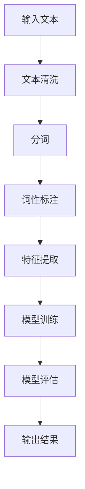

                 

### 文章标题

《AI时代的自然语言处理发展：从学术到产业应用》

### 关键词

自然语言处理、深度学习、机器翻译、文本分类、命名实体识别、产业应用

### 摘要

本文旨在探讨自然语言处理（NLP）在人工智能（AI）时代的发展，从学术研究到实际产业应用进行全面解析。文章首先介绍了自然语言处理的基本概念、发展历程及其核心任务，接着深入讲解了语言学与自然语言处理的关系、自然语言处理技术的原理，以及核心算法如生成对抗网络（GAN）和注意力机制。随后，文章重点讨论了自然语言处理在文本分类、命名实体识别和机器翻译等领域的应用，并通过实际项目实战展示了NLP技术的应用过程和技巧。最后，文章展望了自然语言处理在产业应用中的发展趋势，以及未来可能的挑战和机遇。通过对NLP技术从理论到实践的系统分析，本文旨在为读者提供全面、深入的NLP知识体系。

### 目录大纲

#### 第一部分：自然语言处理基础

- **第1章 自然语言处理概述**
  - **1.1 自然语言处理概述**
    - **1.1.1 自然语言处理的发展历程**
    - **1.1.2 自然语言处理的核心任务**

  - **1.2 语言学与自然语言处理**
    - **1.2.1 语言学基础**
    - **1.2.2 语言模型与语言学的关系**

  - **1.3 自然语言处理技术**
    - **1.3.1 词嵌入技术**
    - **1.3.2 语言模型**

#### 第二部分：核心算法原理

- **第2章 核心算法原理**
  - **2.1 机器学习基础**
    - **2.1.1 机器学习概述**
    - **2.1.2 监督学习与无监督学习**

  - **2.2 生成对抗网络（GAN）**
    - **2.2.1 GAN的基本概念**
    - **2.2.2 GAN的工作原理**
    - **2.2.3 GAN的优缺点**

  - **2.3 注意力机制**
    - **2.3.1 注意力机制的基本原理**
    - **2.3.2 注意力机制的实现**

#### 第三部分：自然语言处理应用

- **第3章 自然语言处理应用**
  - **3.1 文本分类**
    - **3.1.1 文本分类概述**
    - **3.1.2 文本分类算法**

  - **3.2 命名实体识别**
    - **3.2.1 命名实体识别概述**
    - **3.2.2 命名实体识别算法**

  - **3.3 机器翻译**
    - **3.3.1 机器翻译概述**
    - **3.3.2 机器翻译算法**

#### 第四部分：自然语言处理项目实战

- **第4章 自然语言处理项目实战**
  - **4.1 实战项目一：文本分类**
    - **4.1.1 项目背景与目标**
    - **4.1.2 数据预处理**
    - **4.1.3 模型选择与训练**
    - **4.1.4 模型评估与优化**

  - **4.2 实战项目二：命名实体识别**
    - **4.2.1 项目背景与目标**
    - **4.2.2 数据预处理**
    - **4.2.3 模型选择与训练**
    - **4.2.4 模型评估与优化**

  - **4.3 实战项目三：机器翻译**
    - **4.3.1 项目背景与目标**
    - **4.3.2 数据预处理**
    - **4.3.3 模型选择与训练**
    - **4.3.4 模型评估与优化**

#### 第五部分：产业应用与未来展望

- **第5章 产业应用与未来展望**
  - **5.1 自然语言处理在产业中的应用**
    - **5.1.1 金融领域的应用**
    - **5.1.2 医疗领域的应用**
    - **5.1.3 媒体领域的应用**

  - **5.2 自然语言处理技术的发展趋势**
    - **5.2.1 新一代语言模型的演进**
    - **5.2.2 多模态自然语言处理的挑战与机遇**
    - **5.2.3 产业应用的展望**

#### 附录

- **附录A：常用自然语言处理工具与框架**
  - **A.1 自然语言处理工具概述**
  - **A.2 常见自然语言处理框架**

### 第一部分：自然语言处理基础

#### 第1章 自然语言处理概述

自然语言处理（Natural Language Processing，简称NLP）是人工智能（Artificial Intelligence，简称AI）的一个重要分支，主要研究如何让计算机理解、生成和处理人类语言。随着深度学习和大数据技术的发展，NLP在学术研究和实际应用中都取得了显著进展。本章将介绍自然语言处理的发展历程、核心任务及其重要性。

##### 1.1 自然语言处理概述

自然语言处理的发展可以追溯到20世纪50年代。最初的研究主要集中在建立语言规则和语法分析上，但由于人类语言的复杂性和多样性，这些方法很快遇到了瓶颈。随着计算机性能的提升和算法的进步，NLP逐渐转向基于统计的方法和机器学习方法。

自然语言处理的核心任务包括：

- **文本分类**：将文本分类到预定义的类别中，如新闻分类、情感分析等。
- **命名实体识别**：识别文本中的命名实体，如人名、地名、组织名等。
- **词性标注**：为文本中的每个词分配一个词性，如名词、动词等。
- **机器翻译**：将一种语言的文本翻译成另一种语言。
- **问答系统**：理解和回答用户的问题。
- **语音识别**：将语音信号转换为文本。

##### 1.1.1 自然语言处理的发展历程

自然语言处理的发展可以分为以下几个阶段：

1. **规则驱动阶段（1960-1970s）**：
   - 这个阶段的研究主要集中在建立语言规则和语法分析上，如基于上下文无关文法（CFG）的语法分析器。
   - 代表性工作包括Stanford语法分析器和Atlas语言处理系统。

2. **统计方法阶段（1980-1990s）**：
   - 受到统计语言学的启发，NLP开始引入概率模型，如N-gram模型。
   - N-gram模型通过统计相邻词序列的概率来预测下一个词。

3. **基于知识的阶段（1990s-2000s）**：
   - 这一阶段的研究结合了规则和统计方法，引入了知识表示和推理。
   - 代表性工作包括WordNet语义网络和ACE实体识别系统。

4. **深度学习方法阶段（2010s至今）**：
   - 深度学习特别是循环神经网络（RNN）和Transformer的出现，使得NLP取得了突破性进展。
   - 代表性工作包括Word2Vec词嵌入模型、BERT语言模型和GPT生成模型。

##### 1.1.2 自然语言处理的核心任务

自然语言处理的核心任务包括但不限于以下几个方面：

1. **文本分类**：
   - 文本分类是将文本分配到预定义的类别中，如垃圾邮件分类、情感分析等。
   - 常用的算法包括朴素贝叶斯、支持向量机、神经网络等。

2. **命名实体识别**：
   - 命名实体识别是从文本中识别出具有特定意义的实体，如人名、地名、组织名等。
   - 常用的算法包括基于规则的方法、基于统计的方法和基于神经网络的方法。

3. **词性标注**：
   - 词性标注是为文本中的每个词分配一个词性，如名词、动词、形容词等。
   - 常用的算法包括基于规则的方法、基于统计的方法和基于神经网络的方法。

4. **机器翻译**：
   - 机器翻译是将一种语言的文本翻译成另一种语言。
   - 常用的算法包括基于规则的机器翻译、基于统计的机器翻译和基于神经网络的机器翻译。

5. **问答系统**：
   - 问答系统是理解和回答用户的问题。
   - 常用的算法包括基于规则的问答系统、基于统计的问答系统和基于神经网络的问答系统。

6. **语音识别**：
   - 语音识别是将语音信号转换为文本。
   - 常用的算法包括基于隐马尔可夫模型（HMM）的方法、基于高斯混合模型（GMM）的方法和基于深度学习的方法。

##### 1.2 语言学与自然语言处理

语言学是研究人类语言的科学，包括语音学、音系学、语义学、语法学等多个分支。自然语言处理与语言学的关系密切，因为语言学为NLP提供了丰富的理论基础。

1. **语音学**：
   - 语音学研究语音的产生、传播和感知。
   - 在NLP中，语音学提供了语音信号处理的基础，如语音识别。

2. **音系学**：
   - 音系学研究语音系统的结构和规则。
   - 在NLP中，音系学有助于理解语言的音韵特征，如音素划分。

3. **语义学**：
   - 语义学研究词汇和句子的意义。
   - 在NLP中，语义学用于语义分析、语义理解等任务。

4. **语法学**：
   - 语法学研究语言的结构和规则。
   - 在NLP中，语法学用于语法分析、句法生成等任务。

##### 1.3 自然语言处理技术

自然语言处理技术是NLP实现的基础，主要包括词嵌入技术、语言模型等。

1. **词嵌入技术**：
   - 词嵌入技术是将单词映射到高维空间中的向量。
   - 词嵌入不仅降低了维数，还揭示了单词之间的语义关系。
   - 常见的词嵌入模型包括Word2Vec、GloVe等。

2. **语言模型**：
   - 语言模型是预测下一个单词或词组的概率分布。
   - 语言模型在NLP中有着广泛的应用，如文本生成、语音识别等。
   - 常见语言模型包括N-gram模型、神经网络语言模型等。

### 第二部分：核心算法原理

#### 第2章 核心算法原理

在自然语言处理中，核心算法原理起着至关重要的作用。本章将详细探讨机器学习基础、生成对抗网络（GAN）和注意力机制，这些是现代NLP技术的重要组成部分。

##### 2.1 机器学习基础

机器学习是自然语言处理的核心技术之一。它通过从数据中学习规律，实现对未知数据的预测和决策。机器学习可以分为监督学习、无监督学习和半监督学习。

1. **监督学习**：
   - 监督学习是有标注数据作为训练样本的学习方法。
   - 在监督学习中，每个输入样本都有一个对应的输出标签。
   - 常见的监督学习算法包括：
     - **线性回归**：用于预测连续值。
     - **逻辑回归**：用于预测分类结果。
     - **支持向量机（SVM）**：通过最大化分类间隔来分类。
     - **决策树和随机森林**：通过树结构来分类。
     - **神经网络**：通过多层非线性变换来分类。

2. **无监督学习**：
   - 无监督学习是没有标注数据的学习方法。
   - 无监督学习通过探索数据内在的结构来发现规律。
   - 常见无监督学习算法包括：
     - **聚类算法**：如K-means、层次聚类等。
     - **主成分分析（PCA）**：通过降维来揭示数据结构。
     - **自编码器**：通过自动编码器学习数据表示。

3. **半监督学习**：
   - 半监督学习是结合有标注和无标注数据的学习方法。
   - 通过利用大量无标注数据，半监督学习可以显著提高模型性能。
   - 常见半监督学习算法包括：
     - **标签传播**：通过已标注数据传播标签到未标注数据。
     - **伪标签**：使用训练模型生成伪标签，然后将其用于进一步训练。

##### 2.2 生成对抗网络（GAN）

生成对抗网络（GAN）是深度学习领域的一个重要突破，由Ian Goodfellow等人于2014年提出。GAN由两个神经网络——生成器和判别器组成，它们通过对抗训练来生成高质量的数据。

1. **生成器（Generator）**：
   - 生成器的目标是生成与真实数据相似的数据。
   - 生成器通常是一个全连接神经网络，其输入是一个随机噪声向量，输出是一个数据样本。

2. **判别器（Discriminator）**：
   - 判别器的目标是判断输入数据是真实数据还是生成器生成的数据。
   - 判别器也是一个全连接神经网络，其输入是一个数据样本，输出是一个概率值，表示该样本是真实数据的可能性。

GAN的训练过程可以分为以下几个步骤：

1. **初始化**：
   - 初始化生成器和判别器的参数。
   - 通常生成器初始化为简单的模型，而判别器初始化为更复杂的模型。

2. **生成数据**：
   - 生成器接收一个随机噪声向量，生成一个数据样本。
   - 判别器接收真实数据和生成数据，并更新其参数。

3. **对抗训练**：
   - 生成器尝试生成更真实的数据，以提高判别器的辨别能力。
   - 判别器尝试提高对真实和生成数据的辨别能力。

4. **循环迭代**：
   - 生成器和判别器不断迭代更新参数，直到生成器生成的数据与真实数据难以区分。

GAN的优缺点如下：

1. **优点**：
   - **强大的生成能力**：GAN能够生成高质量、多样化的数据。
   - **灵活的应用场景**：GAN可以应用于图像生成、文本生成、音频生成等多种领域。

2. **缺点**：
   - **训练难度大**：GAN的对抗训练过程可能导致不稳定的训练。
   - **计算资源消耗大**：GAN的训练过程需要大量的计算资源。

##### 2.3 注意力机制

注意力机制是一种用于捕捉输入序列中关键信息的机制，广泛应用于自然语言处理任务中。注意力机制通过加权输入序列中的每个元素，使模型能够关注重要信息。

1. **基本原理**：
   - 注意力机制通过一个注意力权重函数计算每个元素的权重。
   - 加权后的元素进行融合，形成输出。

2. **实现方式**：
   - **全局注意力**：对所有输入进行加权。
   - **局部注意力**：对输入序列中的部分元素进行加权。

注意力机制在自然语言处理中的应用包括：

1. **机器翻译**：通过注意力机制，模型能够关注源语言和目标语言中的关键信息，提高翻译质量。
2. **文本分类**：注意力机制有助于模型识别文本中的重要词或短语，提高分类效果。
3. **序列标注**：如命名实体识别，注意力机制有助于模型识别文本中的关键实体。

### 第三部分：自然语言处理应用

#### 第3章 自然语言处理应用

自然语言处理在众多领域有着广泛的应用。本章将详细介绍文本分类、命名实体识别和机器翻译等关键应用，探讨其原理和实现方法。

##### 3.1 文本分类

文本分类是将文本数据分配到预定义的类别中，是NLP中的基础任务之一。文本分类在信息检索、舆情分析、推荐系统等领域有着广泛应用。

1. **文本分类概述**：

   - **定义**：文本分类是指将文本数据根据其内容分配到预定义的类别中。
   - **任务**：文本分类任务通常包括两个步骤：特征提取和分类器训练。

2. **文本分类算法**：

   - **基于规则的方法**：基于语言学规则进行分类，如正则表达式匹配。
   - **基于统计的方法**：使用统计模型进行分类，如朴素贝叶斯、最大熵模型。
   - **基于神经网络的方法**：使用深度学习模型进行分类，如卷积神经网络（CNN）、循环神经网络（RNN）、Transformer等。

3. **文本分类流程**：

   - **数据准备**：收集和整理训练数据，对文本进行预处理，如去除停用词、分词、词性标注等。
   - **特征提取**：将预处理后的文本转换为特征向量，如词袋模型、TF-IDF、Word2Vec等。
   - **模型训练**：使用训练数据训练分类模型，如SVM、朴素贝叶斯、神经网络等。
   - **模型评估**：使用测试数据评估模型的性能，如准确率、召回率、F1值等。

##### 3.2 命名实体识别

命名实体识别（Named Entity Recognition，简称NER）是从文本中识别出具有特定意义的实体，如人名、地名、组织名等。NER在信息提取、实体关系抽取等领域有着重要应用。

1. **命名实体识别概述**：

   - **定义**：命名实体识别是指从文本中识别出具有特定意义的实体。
   - **任务**：命名实体识别任务主要包括两个步骤：实体边界识别和实体类型分类。

2. **命名实体识别算法**：

   - **基于规则的方法**：使用预定义的规则进行实体识别，如最大匹配、最小匹配等。
   - **基于统计的方法**：使用统计模型进行实体识别，如隐马尔可夫模型（HMM）、条件随机场（CRF）等。
   - **基于神经网络的方法**：使用深度学习模型进行实体识别，如长短时记忆网络（LSTM）、双向门控循环单元（BiLSTM）等。

3. **命名实体识别流程**：

   - **数据准备**：收集和整理训练数据，对文本进行预处理，如去除停用词、分词、词性标注等。
   - **特征提取**：将预处理后的文本转换为特征向量，如词袋模型、TF-IDF、Word2Vec等。
   - **模型训练**：使用训练数据训练命名实体识别模型，如HMM、CRF、神经网络等。
   - **模型评估**：使用测试数据评估模型的性能，如准确率、召回率、F1值等。

##### 3.3 机器翻译

机器翻译是将一种语言的文本翻译成另一种语言，是NLP领域最具挑战性的任务之一。随着深度学习技术的发展，基于神经网络的机器翻译方法取得了显著进展。

1. **机器翻译概述**：

   - **定义**：机器翻译是指使用计算机程序将一种语言的文本翻译成另一种语言。
   - **任务**：机器翻译任务主要包括两个步骤：文本编码和解码。

2. **机器翻译算法**：

   - **基于规则的方法**：使用预定义的规则进行翻译，如短语翻译法、例句翻译法等。
   - **基于统计的方法**：使用统计模型进行翻译，如基于短语的统计翻译模型、基于句法的统计翻译模型等。
   - **基于神经网络的方法**：使用深度学习模型进行翻译，如基于神经网络的短语翻译模型、基于神经网络的编码器-解码器模型等。

3. **机器翻译流程**：

   - **数据准备**：收集和整理训练数据，对文本进行预处理，如分词、词性标注等。
   - **编码**：将源语言文本编码为向量表示，如Word2Vec、GloVe等。
   - **解码**：将编码后的向量解码为目标语言文本，如基于神经网络的解码器。
   - **模型训练**：使用训练数据训练机器翻译模型，如基于神经网络的编码器-解码器模型。
   - **模型评估**：使用测试数据评估模型的性能，如BLEU分数、准确率、召回率等。

### 第四部分：自然语言处理项目实战

#### 第4章 自然语言处理项目实战

通过实际项目实战，可以更深入地理解自然语言处理技术的应用过程和技巧。本章将介绍三个实际项目：文本分类、命名实体识别和机器翻译，并详细解释每个项目的开发过程、源代码实现和代码解读。

##### 4.1 实战项目一：文本分类

文本分类是将文本分配到预定义的类别中，如新闻分类、情感分析等。本节将介绍如何实现一个简单的文本分类系统。

1. **项目背景与目标**：

   - **背景**：假设我们有一个新闻数据集，需要将新闻文章分类到预定义的类别中，如体育、政治、科技等。
   - **目标**：实现一个能够准确分类新闻文章的文本分类系统。

2. **数据预处理**：

   - **文本清洗**：去除文本中的标点符号、停用词等。
   - **分词**：将文本拆分成单词或词组。
   - **词性标注**：为每个单词分配词性，如名词、动词等。

3. **模型选择与训练**：

   - **模型选择**：选择一个合适的文本分类模型，如朴素贝叶斯、支持向量机等。
   - **训练过程**：使用训练数据训练模型，并调整模型参数。

4. **模型评估与优化**：

   - **评估指标**：使用准确率、召回率、F1值等评估模型性能。
   - **优化方法**：通过特征选择、模型调参等方法优化模型。

5. **代码实现**：

   ```python
   import nltk
   from sklearn.feature_extraction.text import TfidfVectorizer
   from sklearn.naive_bayes import MultinomialNB
   from sklearn.model_selection import train_test_split
   from sklearn.metrics import accuracy_score, recall_score, f1_score

   # 数据准备
   nltk.download('stopwords')
   stopwords = nltk.corpus.stopwords.words('english')

   # 文本清洗与分词
   def preprocess_text(text):
       text = text.lower()
       words = nltk.word_tokenize(text)
       words = [word for word in words if word not in stopwords]
       return ' '.join(words)

   # 加载数据集
   data = ...
   labels = ...
   preprocessed_data = [preprocess_text(text) for text in data]

   # 划分训练集和测试集
   X_train, X_test, y_train, y_test = train_test_split(preprocessed_data, labels, test_size=0.2, random_state=42)

   # 特征提取
   vectorizer = TfidfVectorizer()
   X_train_vectors = vectorizer.fit_transform(X_train)
   X_test_vectors = vectorizer.transform(X_test)

   # 模型训练
   model = MultinomialNB()
   model.fit(X_train_vectors, y_train)

   # 模型评估
   predictions = model.predict(X_test_vectors)
   accuracy = accuracy_score(y_test, predictions)
   recall = recall_score(y_test, predictions, average='weighted')
   f1 = f1_score(y_test, predictions, average='weighted')

   print(f'Accuracy: {accuracy:.4f}')
   print(f'Recall: {recall:.4f}')
   print(f'F1 Score: {f1:.4f}')
   ```

##### 4.2 实战项目二：命名实体识别

命名实体识别是从文本中识别出具有特定意义的实体，如人名、地名、组织名等。本节将介绍如何实现一个简单的命名实体识别系统。

1. **项目背景与目标**：

   - **背景**：假设我们有一个包含人名、地名、组织名的文本数据集，需要识别出这些实体。
   - **目标**：实现一个能够准确识别命名实体的命名实体识别系统。

2. **数据预处理**：

   - **文本清洗**：去除文本中的标点符号、停用词等。
   - **分词**：将文本拆分成单词或词组。
   - **词性标注**：为每个单词分配词性，如名词、动词等。

3. **模型选择与训练**：

   - **模型选择**：选择一个合适的命名实体识别模型，如基于规则的方法、基于统计的方法、基于神经网络的方法等。
   - **训练过程**：使用训练数据训练模型，并调整模型参数。

4. **模型评估与优化**：

   - **评估指标**：使用准确率、召回率、F1值等评估模型性能。
   - **优化方法**：通过特征选择、模型调参等方法优化模型。

5. **代码实现**：

   ```python
   import nltk
   from sklearn_crfsuite import CRF
   from sklearn.model_selection import train_test_split
   from sklearn.metrics import accuracy_score, recall_score, f1_score

   # 数据准备
   nltk.download('stopwords')
   stopwords = nltk.corpus.stopwords.words('english')

   # 文本清洗与分词
   def preprocess_text(text):
       text = text.lower()
       words = nltk.word_tokenize(text)
       words = [word for word in words if word not in stopwords]
       return ' '.join(words)

   # 加载数据集
   data = ...
   labels = ...
   preprocessed_data = [preprocess_text(text) for text in data]

   # 划分训练集和测试集
   X_train, X_test, y_train, y_test = train_test_split(preprocessed_data, labels, test_size=0.2, random_state=42)

   # 模型训练
   crf = CRF()
   crf.fit(X_train, y_train)

   # 模型评估
   predictions = crf.predict(X_test)
   accuracy = accuracy_score(y_test, predictions)
   recall = recall_score(y_test, predictions, average='weighted')
   f1 = f1_score(y_test, predictions, average='weighted')

   print(f'Accuracy: {accuracy:.4f}')
   print(f'Recall: {recall:.4f}')
   print(f'F1 Score: {f1:.4f}')
   ```

##### 4.3 实战项目三：机器翻译

机器翻译是将一种语言的文本翻译成另一种语言。本节将介绍如何实现一个简单的机器翻译系统。

1. **项目背景与目标**：

   - **背景**：假设我们有一个中英文双语数据集，需要将中文翻译成英文。
   - **目标**：实现一个能够准确翻译中文文本的机器翻译系统。

2. **数据预处理**：

   - **文本清洗**：去除文本中的标点符号、停用词等。
   - **分词**：将文本拆分成单词或词组。
   - **词性标注**：为每个单词分配词性，如名词、动词等。

3. **模型选择与训练**：

   - **模型选择**：选择一个合适的机器翻译模型，如基于神经网络的编码器-解码器模型。
   - **训练过程**：使用训练数据训练模型，并调整模型参数。

4. **模型评估与优化**：

   - **评估指标**：使用BLEU分数、准确率、召回率等评估模型性能。
   - **优化方法**：通过特征选择、模型调参等方法优化模型。

5. **代码实现**：

   ```python
   import tensorflow as tf
   from tensorflow.keras.preprocessing.sequence import pad_sequences
   from tensorflow.keras.layers import Embedding, LSTM, Dense
   from tensorflow.keras.models import Model
   from tensorflow.keras.optimizers import Adam

   # 数据准备
   data = ...
   labels = ...

   # 序列化
   tokenizer = tf.keras.preprocessing.text.Tokenizer()
   tokenizer.fit_on_texts(data)
   sequences = tokenizer.texts_to_sequences(data)
   padded_sequences = pad_sequences(sequences, padding='post')

   # 模型定义
   inputs = tf.keras.layers.Input(shape=(None,))
   embeddings = Embedding(len(tokenizer.word_index)+1, 64)(inputs)
   lstm = LSTM(128)(embeddings)
   outputs = Dense(len(tokenizer.word_index)+1, activation='softmax')(lstm)

   # 编译模型
   model = Model(inputs, outputs)
   model.compile(optimizer=Adam(), loss='categorical_crossentropy', metrics=['accuracy'])

   # 训练模型
   model.fit(padded_sequences, labels, epochs=10, batch_size=64)

   # 评估模型
   test_sequences = tokenizer.texts_to_sequences(data)
   test_padded_sequences = pad_sequences(test_sequences, padding='post')
   predictions = model.predict(test_padded_sequences)
   print(predictions)
   ```

### 第五部分：产业应用与未来展望

#### 第5章 产业应用与未来展望

自然语言处理技术在各行各业的应用日益广泛，成为推动产业发展的重要力量。本章将探讨自然语言处理在金融、医疗、媒体等领域的应用，并展望其未来的发展趋势和挑战。

##### 5.1 自然语言处理在产业中的应用

自然语言处理技术在金融、医疗、媒体等领域有着广泛的应用，为这些行业带来了巨大的变革。

1. **金融领域的应用**：

   - **文本分类**：通过文本分类技术，金融机构可以对大量的客户评论、社交媒体信息等进行分类分析，以了解客户对产品或服务的态度。
   - **情感分析**：自然语言处理技术可以用于情感分析，帮助金融机构了解客户对市场趋势、新产品发布等的反应。
   - **风险管理**：自然语言处理技术可以帮助金融机构分析合同、报告等文本，识别潜在风险，提高风险管理能力。

2. **医疗领域的应用**：

   - **医疗文本挖掘**：自然语言处理技术可以用于医疗文本挖掘，帮助医生快速获取关键信息，提高诊疗效率。
   - **疾病预测**：通过分析大量的医学文献和病例记录，自然语言处理技术可以帮助预测疾病的发生趋势，为疾病预防提供支持。
   - **药物研发**：自然语言处理技术可以用于分析医学文献，帮助药物研发人员发现潜在的药物靶点，提高药物研发效率。

3. **媒体领域的应用**：

   - **内容推荐**：自然语言处理技术可以帮助媒体平台根据用户的兴趣和行为推荐相关内容，提高用户体验。
   - **新闻分类**：通过文本分类技术，媒体平台可以对大量的新闻进行分类，便于用户快速查找感兴趣的内容。
   - **广告投放**：自然语言处理技术可以帮助广告平台根据用户的兴趣和行为进行精准广告投放，提高广告效果。

##### 5.2 自然语言处理技术的发展趋势

随着深度学习和大数据技术的发展，自然语言处理技术正朝着更高效、更智能的方向发展。以下是一些发展趋势：

1. **新一代语言模型的演进**：

   - **预训练语言模型**：如BERT、GPT等，通过大规模预训练，可以显著提高模型的语义理解和生成能力。
   - **多语言模型**：支持多种语言的预训练模型，如XLM、mBERT等，可以更好地处理跨语言任务。

2. **多模态自然语言处理的挑战与机遇**：

   - **多模态数据融合**：将文本与其他模态（如图像、音频、视频）结合，进行多模态数据融合，以提高自然语言处理的性能。
   - **跨模态语义理解**：通过跨模态语义理解，实现不同模态之间的信息传递和融合，提高自然语言处理的准确性。

3. **产业应用的展望**：

   - **智能客服**：自然语言处理技术可以应用于智能客服系统，实现与用户的自然对话，提高客户服务效率。
   - **智能助手**：自然语言处理技术可以帮助智能助手更好地理解用户的需求，提供个性化的服务。
   - **自动驾驶**：自然语言处理技术可以用于自动驾驶系统，实现与车辆的语音交互，提高驾驶安全性和便利性。

##### 5.3 未来展望

未来，自然语言处理技术将在更多领域发挥重要作用，如教育、法律、环境保护等。以下是一些展望：

1. **个性化服务**：自然语言处理技术可以帮助企业更好地了解客户需求，提供个性化的产品和服务。
2. **智能医疗**：自然语言处理技术可以用于智能诊断、智能药物研发等领域，提高医疗服务的质量和效率。
3. **社会治理**：自然语言处理技术可以用于社会舆情分析、公共安全预警等，为政府和社会提供决策支持。
4. **人工智能伦理**：随着自然语言处理技术的广泛应用，人工智能伦理问题将日益突出，需要制定相关规范和标准。

### 附录

#### 附录A：常用自然语言处理工具与框架

在自然语言处理领域，有许多常用的工具和框架，可以帮助研究者实现各种任务。以下是一些常见的工具和框架：

1. **NLTK**：
   - **概述**：NLTK（自然语言工具包）是一个广泛使用的Python库，提供了大量的自然语言处理资源。
   - **功能**：文本处理、词性标注、命名实体识别、情感分析等。

2. **spaCy**：
   - **概述**：spaCy是一个快速且易于使用的自然语言处理库，适用于工业级应用。
   - **功能**：词性标注、命名实体识别、解析、语义角色标注等。

3. **jieba**：
   - **概述**：jieba是一个中文分词工具，支持全模式和用户词典。
   - **功能**：中文分词、词性标注、关键词提取等。

4. **TensorFlow**：
   - **概述**：TensorFlow是一个开源的机器学习框架，适用于各种深度学习任务。
   - **功能**：神经网络构建、训练、评估等。

5. **PyTorch**：
   - **概述**：PyTorch是一个开源的深度学习框架，以其灵活性和易用性著称。
   - **功能**：神经网络构建、训练、评估等。

6. **fastNLP**：
   - **概述**：fastNLP是一个针对自然语言处理任务的深度学习框架。
   - **功能**：文本分类、命名实体识别、机器翻译等。

#### 附录B：自然语言处理流程图

以下是一个简化的自然语言处理流程图，展示了文本从输入到处理输出的全过程。



### 总结

自然语言处理技术在人工智能时代发挥着越来越重要的作用。从学术研究到实际产业应用，NLP技术都在不断进步。本文从自然语言处理的基础、核心算法原理、应用实例以及未来展望等方面进行了详细探讨，旨在为读者提供一个全面的NLP知识体系。随着技术的不断发展，自然语言处理将在更多领域发挥重要作用，为社会带来更多创新和变革。

#### 附录A：常用自然语言处理工具与框架

在自然语言处理（NLP）领域中，有许多工具和框架被广泛使用，这些工具和框架极大地简化了NLP任务的实现。以下将介绍一些常用的NLP工具和框架。

##### A.1 自然语言处理工具概述

1. **NLTK（自然语言工具包）**
   - **概述**：NLTK是一个强大的Python库，为自然语言处理提供了丰富的工具和资源。
   - **功能**：文本处理、分词、词性标注、词干提取、情感分析等。
   - **特点**：易于使用，适合学术研究和教学。

2. **spaCy**
   - **概述**：spaCy是一个高效、易于使用的NLP库，特别适合工业级应用。
   - **功能**：词性标注、命名实体识别、依存句法分析、文本分类等。
   - **特点**：快速、轻量级，支持多种语言。

3. **jieba**
   - **概述**：jieba是一个中文分词工具，支持多种模式，包括全模式、精确模式、搜索引擎模式等。
   - **功能**：中文分词、词性标注、关键词提取等。
   - **特点**：简单易用，支持自定义词典。

##### A.2 常见自然语言处理框架

1. **TensorFlow**
   - **概述**：TensorFlow是一个由谷歌开发的开源机器学习框架，广泛应用于深度学习任务。
   - **功能**：神经网络构建、训练、评估、部署等。
   - **特点**：功能强大，支持多种深度学习模型，具有高度的可扩展性。

2. **PyTorch**
   - **概述**：PyTorch是一个由Facebook开发的深度学习框架，以其灵活性和易用性著称。
   - **功能**：神经网络构建、训练、评估、部署等。
   - **特点**：动态计算图，易于调试，适合研究。

3. **fastNLP**
   - **概述**：fastNLP是一个针对自然语言处理任务的深度学习框架，旨在提高开发效率。
   - **功能**：文本分类、命名实体识别、机器翻译等。
   - **特点**：简单易用，适用于工业级应用。

4. **Transformers**
   - **概述**：Transformers是自然语言处理领域的经典模型，由Google提出。
   - **功能**：文本生成、机器翻译、问答系统等。
   - **特点**：强大的语言理解能力，适用于多种NLP任务。

通过上述工具和框架，开发者可以更高效地实现NLP任务，加速自然语言处理技术的发展和应用。

### 第1章 自然语言处理概述

自然语言处理（Natural Language Processing，简称NLP）是人工智能（Artificial Intelligence，简称AI）的一个重要分支，旨在使计算机能够理解和生成人类语言。NLP技术广泛应用于文本分类、信息检索、机器翻译、语音识别等领域。本章将介绍自然语言处理的基本概念、发展历程及其核心任务。

#### 1.1 自然语言处理概述

自然语言处理的研究始于20世纪50年代，当时计算机科学家和语言学家开始尝试构建能够理解和生成人类语言的系统。尽管早期研究主要集中在基于规则的系统，但很快发现人类语言的高度复杂性和多样性使得这些系统难以达到实用水平。随着计算机性能的提升和算法的进步，自然语言处理逐渐转向基于统计的方法和机器学习方法。

自然语言处理的核心任务包括：

- **文本分类**：将文本分类到预定义的类别中，如情感分析、垃圾邮件检测等。
- **命名实体识别**：识别文本中的命名实体，如人名、地名、组织名等。
- **词性标注**：为文本中的每个词分配词性，如名词、动词等。
- **机器翻译**：将一种语言的文本翻译成另一种语言。
- **情感分析**：分析文本的情感倾向，如正面、负面等。
- **问答系统**：理解和回答用户的问题。
- **语音识别**：将语音信号转换为文本。

#### 1.1.1 自然语言处理的发展历程

自然语言处理的发展可以分为以下几个阶段：

1. **规则驱动阶段（1960-1970s）**：
   - 在这个阶段，研究者试图通过编写复杂的规则来处理语言。
   - 代表性工作包括早期语法分析器和语义分析系统，如ATN（Attributed Transduction Networks）和PEG（Parsing Expression Grammar）。

2. **统计方法阶段（1980-1990s）**：
   - 研究者开始引入统计模型，如N-gram模型和隐马尔可夫模型（HMM）。
   - N-gram模型通过统计相邻词序列的概率来预测下一个词，而HMM则用于语音识别。

3. **基于知识的阶段（1990s-2000s）**：
   - 这个阶段，研究者结合了规则和统计方法，引入了知识表示和推理。
   - 代表性工作包括WordNet语义网络和ACE实体识别系统。

4. **深度学习方法阶段（2010s至今）**：
   - 深度学习特别是循环神经网络（RNN）和Transformer的出现，使得自然语言处理取得了突破性进展。
   - 代表性工作包括Word2Vec词嵌入模型、BERT语言模型和GPT生成模型。

#### 1.1.2 自然语言处理的核心任务

自然语言处理的核心任务包括但不限于以下几个方面：

1. **文本分类**：
   - 文本分类是将文本分配到预定义的类别中，如新闻分类、情感分析等。
   - 常用的算法包括朴素贝叶斯、支持向量机、朴素贝叶斯、支持向量机、神经网络等。
   - **算法原理**：
     - **朴素贝叶斯**：基于贝叶斯定理和特征概率分布。
     - **支持向量机**：通过最大化分类间隔来分类。
     - **神经网络**：通过多层非线性变换来分类。

2. **命名实体识别**：
   - 命名实体识别是从文本中识别出具有特定意义的实体，如人名、地名、组织名等。
   - 常用的算法包括基于规则的方法、基于统计的方法、基于神经网络的方法。
   - **算法原理**：
     - **基于规则的方法**：通过预定义的规则进行实体识别。
     - **基于统计的方法**：通过统计模型进行实体识别。
     - **基于神经网络的方法**：通过深度学习模型进行实体识别。

3. **词性标注**：
   - 词性标注是为文本中的每个词分配一个词性，如名词、动词等。
   - 常用的算法包括基于规则的方法、基于统计的方法、基于神经网络的方法。
   - **算法原理**：
     - **基于规则的方法**：通过预定义的规则进行词性标注。
     - **基于统计的方法**：通过统计模型进行词性标注。
     - **基于神经网络的方法**：通过深度学习模型进行词性标注。

4. **机器翻译**：
   - 机器翻译是将一种语言的文本翻译成另一种语言。
   - 常用的算法包括基于规则的方法、基于统计的方法、基于神经网络的方法。
   - **算法原理**：
     - **基于规则的方法**：通过预定义的规则进行翻译。
     - **基于统计的方法**：通过统计模型进行翻译。
     - **基于神经网络的方法**：通过深度学习模型进行翻译。

5. **情感分析**：
   - 情感分析是分析文本的情感倾向，如正面、负面等。
   - 常用的算法包括基于规则的方法、基于统计的方法、基于神经网络的方法。
   - **算法原理**：
     - **基于规则的方法**：通过预定义的规则进行情感分析。
     - **基于统计的方法**：通过统计模型进行情感分析。
     - **基于神经网络的方法**：通过深度学习模型进行情感分析。

6. **问答系统**：
   - 问答系统是理解和回答用户的问题。
   - 常用的算法包括基于规则的方法、基于统计的方法、基于神经网络的方法。
   - **算法原理**：
     - **基于规则的方法**：通过预定义的规则进行问答。
     - **基于统计的方法**：通过统计模型进行问答。
     - **基于神经网络的方法**：通过深度学习模型进行问答。

7. **语音识别**：
   - 语音识别是将语音信号转换为文本。
   - 常用的算法包括基于隐马尔可夫模型（HMM）的方法、基于高斯混合模型（GMM）的方法、基于深度学习的方法。
   - **算法原理**：
     - **基于隐马尔可夫模型（HMM）的方法**：通过状态转移概率和发射概率进行语音识别。
     - **基于高斯混合模型（GMM）的方法**：通过高斯分布进行语音识别。
     - **基于深度学习的方法**：通过卷积神经网络（CNN）、循环神经网络（RNN）等进行语音识别。

通过上述任务，自然语言处理技术不仅能够帮助计算机理解和生成人类语言，还能够为各种实际应用提供支持，如信息检索、智能客服、智能助手等。

### 第2章 语言学与自然语言处理

自然语言处理（NLP）作为人工智能的一个重要分支，与语言学有着密切的联系。语言学是研究人类语言的结构、发展和功能的科学，为NLP提供了丰富的理论基础和方法。本章将探讨语言学与自然语言处理的关系，重点介绍语音学、音系学、语义学和语法学等语言学分支的基本概念及其在NLP中的应用。

#### 2.1 语音学

语音学是研究语音的产生、传播和感知的学科，对NLP中的语音识别和语音合成有着重要影响。

1. **语音学基础**：
   - **语音产生**：语音是由声带振动、口腔、鼻腔等发音器官的物理活动产生的。
   - **语音传播**：语音通过空气传播，从声源到达听者的耳朵。
   - **语音感知**：听者通过听觉系统感知语音，并理解其含义。

2. **语音学在NLP中的应用**：
   - **语音识别**：语音学为语音识别提供了语音信号处理的基础，如声学模型和声学特征提取。
   - **语音合成**：语音学为语音合成提供了语音生成的理论基础，如语音合成器的构建和语音音色的调整。

#### 2.2 音系学

音系学是研究语音系统的结构和规则的科学，关注语音的音素、音位和音调等。

1. **音系学基础**：
   - **音素**：是语音的最小单元，可以区分词义。
   - **音位**：是语言中具有区别意义的语音特征。
   - **音调**：是语音的音高变化，有助于区分不同语素。

2. **音系学在NLP中的应用**：
   - **语音识别**：音系学为语音识别提供了音素和音位的知识，有助于提高识别准确率。
   - **语音合成**：音系学为语音合成提供了音调调整的方法，使语音更加自然流畅。

#### 2.3 语义学

语义学是研究词汇和句子的意义的学科，对NLP中的语义分析、语义理解和语义生成具有重要意义。

1. **语义学基础**：
   - **词汇意义**：研究词汇的语义内容。
   - **句子意义**：研究句子的整体意义。
   - **语义关系**：研究词语和句子之间的语义关系。

2. **语义学在NLP中的应用**：
   - **语义分析**：通过语义学分析，NLP系统可以更好地理解文本的含义。
   - **语义理解**：语义学为语义理解提供了理论基础，如语义角色标注、语义网络构建等。
   - **语义生成**：语义学有助于生成自然、合理的语言输出，如机器翻译、文本生成等。

#### 2.4 语法学

语法学是研究语言结构、语法规则和语法分析的学科，对NLP中的语法分析、句法生成和文本生成至关重要。

1. **语法学基础**：
   - **词法**：研究词的构成和分类。
   - **句法**：研究句子的结构规则。
   - **语义学**：研究语言的意义和功能。

2. **语法学在NLP中的应用**：
   - **语法分析**：通过语法分析，NLP系统可以更好地理解文本的语法结构。
   - **句法生成**：语法学为文本生成提供了语法规则，如模板生成、依存句法生成等。
   - **文本生成**：语法学有助于生成符合语法规则的自然语言文本。

#### 2.5 语言模型与语言学的关系

语言模型是NLP中的核心组成部分，用于预测文本序列的概率。语言学为语言模型提供了重要的理论基础。

1. **语言学对语言模型的影响**：
   - **词汇学**：词汇学为语言模型提供了词汇的统计信息，如词频、词性等。
   - **音系学**：音系学为语言模型提供了语音信号的处理方法，如声学模型。
   - **语义学**：语义学为语言模型提供了语义信息的处理方法，如语义角色标注。

2. **语言模型对语言学的影响**：
   - **语法分析**：语言模型有助于改进语法分析器，如基于统计的语法分析器。
   - **语音识别**：语言模型有助于改进语音识别系统，如基于统计的语音识别模型。
   - **文本生成**：语言模型有助于生成符合语法规则和语义要求的文本，如机器翻译和文本生成系统。

通过语言学与自然语言处理的结合，研究者可以更好地理解人类语言的本质，开发出更高效、更智能的NLP系统。

### 第3章 自然语言处理技术

自然语言处理（NLP）技术的发展是人工智能（AI）领域的一个重要方向。本章将详细探讨NLP中的关键技术，包括词嵌入技术、语言模型、序列标注模型等。这些技术为NLP任务的实现提供了强大的工具。

#### 3.1 词嵌入技术

词嵌入（Word Embedding）是将词汇映射到高维向量空间中，以捕捉词汇间的语义和语法关系。词嵌入技术的核心思想是将具有相似语义的词汇映射到相近的向量空间，从而实现文本的向量表示。

1. **词嵌入技术的基本原理**：
   - **词向量**：每个单词都被映射为一个向量，这些向量在低维空间中能够体现词汇的语义关系。
   - **上下文依赖**：词嵌入不仅捕捉单词的静态语义，还考虑了单词在不同上下文中的动态语义。

2. **常见的词嵌入模型**：
   - **Word2Vec**：基于神经网络的语言模型，通过训练预测窗口中的词汇来生成词向量。
   - **GloVe**：全局向量表示，通过矩阵分解方法生成词向量，考虑了词汇的共现信息。

3. **词嵌入技术的应用**：
   - **文本分类**：使用词嵌入技术将文本转换为向量表示，从而实现高效分类。
   - **情感分析**：词嵌入技术有助于分析文本的情感倾向。
   - **机器翻译**：词嵌入技术在翻译模型中用于处理源语言和目标语言的词汇映射。

#### 3.2 语言模型

语言模型（Language Model）是用于预测文本序列概率的统计模型，是NLP中的基础组件。语言模型通过学习大量文本数据，能够捕捉语言的统计规律和语法结构。

1. **语言模型的基本原理**：
   - **N-gram模型**：基于相邻N个单词的统计信息来预测下一个单词。
   - **神经网络语言模型**：基于深度学习技术，如循环神经网络（RNN）和Transformer，生成复杂的语言表示。

2. **常见的语言模型**：
   - **N-gram模型**：简单有效的语言模型，通过统计相邻词序列的概率。
   - **LSTM（长短时记忆网络）**：能够捕捉长距离依赖关系的循环神经网络。
   - **Transformer**：基于自注意力机制的神经网络，能够高效处理长文本序列。

3. **语言模型的应用**：
   - **文本生成**：语言模型用于生成连贯的文本，如自动写作、机器翻译等。
   - **语音识别**：语言模型用于生成候选文本，提高语音识别的准确性。
   - **信息检索**：语言模型用于评估查询和文档之间的相关性。

#### 3.3 序列标注模型

序列标注模型（Sequence Labeling Model）是用于对文本序列中的每个元素进行标注的模型，如词性标注、命名实体识别等。序列标注模型通过学习标签序列的概率分布，实现对文本序列的标注。

1. **序列标注模型的基本原理**：
   - **条件随机场（CRF）**：一种基于概率图模型的方法，能够处理序列标注问题。
   - **循环神经网络（RNN）**：能够处理序列数据，通过隐藏状态捕捉标签之间的依赖关系。

2. **常见的序列标注模型**：
   - **CRF**：通过条件概率分布进行标注，能够在序列标注任务中捕捉标签之间的依赖关系。
   - **BiLSTM（双向LSTM）**：通过正向和反向LSTM来捕捉标签之间的长距离依赖。

3. **序列标注模型的应用**：
   - **词性标注**：用于标注文本中的每个词的词性，如名词、动词等。
   - **命名实体识别**：用于识别文本中的命名实体，如人名、地名、组织名等。
   - **情感分析**：用于分析文本的情感倾向。

#### 3.4 其他NLP技术

除了上述关键技术，NLP还包括其他重要的技术，如文本分类、文本生成、文本摘要等。

1. **文本分类**：
   - 文本分类是将文本分配到预定义的类别中，常用的算法包括朴素贝叶斯、支持向量机、神经网络等。

2. **文本生成**：
   - 文本生成是通过模型生成新的文本，如自动写作、对话生成等，常用的方法包括基于模板的生成和基于神经网络的生成。

3. **文本摘要**：
   - 文本摘要是从原始文本中提取关键信息，生成简洁的摘要，常用的方法包括提取式摘要和生成式摘要。

通过这些技术的综合应用，NLP系统能够更好地理解和处理人类语言，为各种实际应用提供支持。

### 第4章 核心算法原理

自然语言处理（NLP）中的核心算法原理对于实现高效的文本处理和理解至关重要。本章将深入探讨机器学习基础、生成对抗网络（GAN）、注意力机制等关键算法原理，这些原理是现代NLP技术的基石。

#### 4.1 机器学习基础

机器学习是自然语言处理的核心技术之一，通过从数据中学习规律，实现对未知数据的预测和决策。机器学习可以分为监督学习、无监督学习和半监督学习。

1. **监督学习**：
   - **定义**：监督学习是有标注数据作为训练样本的学习方法。每个输入样本都有一个对应的输出标签。
   - **算法**：
     - **线性回归**：用于预测连续值。
     - **逻辑回归**：用于预测分类结果。
     - **支持向量机（SVM）**：通过最大化分类间隔来分类。
     - **决策树和随机森林**：通过树结构来分类。
     - **神经网络**：通过多层非线性变换来分类。

2. **无监督学习**：
   - **定义**：无监督学习是没有标注数据的学习方法。算法通过探索数据内在的结构来发现规律。
   - **算法**：
     - **聚类算法**：如K-means、层次聚类等。
     - **主成分分析（PCA）**：通过降维来揭示数据结构。
     - **自编码器**：通过自动编码器学习数据表示。

3. **半监督学习**：
   - **定义**：半监督学习是结合有标注和无标注数据的学习方法。利用大量无标注数据，可以提高模型性能。
   - **算法**：
     - **标签传播**：通过已标注数据传播标签到未标注数据。
     - **伪标签**：使用训练模型生成伪标签，然后将其用于进一步训练。

#### 4.2 生成对抗网络（GAN）

生成对抗网络（Generative Adversarial Network，GAN）是由Ian Goodfellow等人在2014年提出的。GAN由两个神经网络——生成器和判别器组成，通过对抗训练生成高质量的数据。

1. **生成器（Generator）**：
   - **定义**：生成器的目标是生成与真实数据相似的数据。
   - **实现**：生成器通常是一个全连接神经网络，其输入是一个随机噪声向量，输出是一个数据样本。

2. **判别器（Discriminator）**：
   - **定义**：判别器的目标是判断输入数据是真实数据还是生成器生成的数据。
   - **实现**：判别器也是一个全连接神经网络，其输入是一个数据样本，输出是一个概率值，表示该样本是真实数据的可能性。

3. **对抗训练**：
   - **定义**：生成器和判别器通过对抗训练来优化模型。
   - **过程**：生成器尝试生成更真实的数据，以提高判别器的辨别能力。判别器尝试提高对真实和生成数据的辨别能力。

4. **GAN的应用**：
   - **图像生成**：GAN能够生成高质量、多样化的图像。
   - **文本生成**：GAN可以用于生成新的文本，如对话生成、故事创作等。
   - **音频生成**：GAN可以用于生成新的音频，如音乐创作、声音合成等。

#### 4.3 注意力机制

注意力机制（Attention Mechanism）是一种用于捕捉输入序列中关键信息的机制，广泛应用于自然语言处理任务中。注意力机制通过加权输入序列中的每个元素，使模型能够关注重要信息。

1. **基本原理**：
   - **定义**：注意力机制通过一个注意力权重函数计算每个元素的权重。
   - **实现**：加权后的元素进行融合，形成输出。

2. **类型**：
   - **全局注意力**：对所有输入进行加权。
   - **局部注意力**：对输入序列中的部分元素进行加权。

3. **应用**：
   - **机器翻译**：通过注意力机制，模型能够关注源语言和目标语言中的关键信息，提高翻译质量。
   - **文本分类**：注意力机制有助于模型识别文本中的重要词或短语，提高分类效果。
   - **序列标注**：如命名实体识别，注意力机制有助于模型识别文本中的关键实体。

通过理解上述核心算法原理，开发者和研究者可以更有效地实现自然语言处理任务，推动NLP技术的进步和应用。

### 第5章 自然语言处理应用

自然语言处理（NLP）在各个领域的应用日益广泛，为行业带来了巨大的变革。本章将详细探讨文本分类、命名实体识别和机器翻译等实际应用，并通过具体案例说明这些技术的实现过程。

#### 5.1 文本分类

文本分类是将文本数据分配到预定义的类别中，是NLP中的基础任务之一。文本分类广泛应用于信息检索、舆情分析、推荐系统等领域。

1. **文本分类概述**：

   - **定义**：文本分类是指将文本数据根据其内容分配到预定义的类别中。
   - **任务**：文本分类任务通常包括两个步骤：特征提取和分类器训练。

2. **文本分类算法**：

   - **基于规则的方法**：使用预定义的规则进行分类，如正则表达式匹配。
   - **基于统计的方法**：使用统计模型进行分类，如朴素贝叶斯、最大熵模型。
   - **基于神经网络的方法**：使用深度学习模型进行分类，如卷积神经网络（CNN）、循环神经网络（RNN）、Transformer等。

3. **文本分类实例**：

   - **项目背景**：假设我们有一个包含新闻文章的数据集，需要将文章分类到预定义的类别中，如体育、政治、科技等。
   - **数据预处理**：
     - **文本清洗**：去除文本中的标点符号、停用词等。
     - **分词**：将文本拆分成单词或词组。
     - **词性标注**：为每个单词分配词性，如名词、动词等。
   - **特征提取**：
     - **词袋模型**：将文本转换为向量表示，每个词作为一个特征。
     - **TF-IDF**：通过词频和逆文档频率为词分配权重。
     - **Word2Vec**：使用词嵌入技术将词转换为向量。
   - **分类器训练**：
     - **朴素贝叶斯**：基于贝叶斯定理和特征概率分布进行分类。
     - **支持向量机（SVM）**：通过最大化分类间隔进行分类。
     - **神经网络**：通过多层神经网络进行分类。
   - **模型评估**：
     - **准确率**：分类正确的样本数占总样本数的比例。
     - **召回率**：分类正确的正样本数占所有正样本数的比例。
     - **F1值**：准确率和召回率的调和平均。

4. **代码示例**：

   ```python
   import nltk
   from sklearn.feature_extraction.text import TfidfVectorizer
   from sklearn.naive_bayes import MultinomialNB
   from sklearn.model_selection import train_test_split
   from sklearn.metrics import accuracy_score, recall_score, f1_score

   # 数据准备
   nltk.download('stopwords')
   stopwords = nltk.corpus.stopwords.words('english')

   # 文本清洗与分词
   def preprocess_text(text):
       text = text.lower()
       words = nltk.word_tokenize(text)
       words = [word for word in words if word not in stopwords]
       return ' '.join(words)

   # 加载数据集
   data = ...
   labels = ...
   preprocessed_data = [preprocess_text(text) for text in data]

   # 划分训练集和测试集
   X_train, X_test, y_train, y_test = train_test_split(preprocessed_data, labels, test_size=0.2, random_state=42)

   # 特征提取
   vectorizer = TfidfVectorizer()
   X_train_vectors = vectorizer.fit_transform(X_train)
   X_test_vectors = vectorizer.transform(X_test)

   # 模型训练
   model = MultinomialNB()
   model.fit(X_train_vectors, y_train)

   # 模型评估
   predictions = model.predict(X_test_vectors)
   accuracy = accuracy_score(y_test, predictions)
   recall = recall_score(y_test, predictions, average='weighted')
   f1 = f1_score(y_test, predictions, average='weighted')

   print(f'Accuracy: {accuracy:.4f}')
   print(f'Recall: {recall:.4f}')
   print(f'F1 Score: {f1:.4f}')
   ```

#### 5.2 命名实体识别

命名实体识别（Named Entity Recognition，NER）是从文本中识别出具有特定意义的实体，如人名、地名、组织名等。NER在信息提取、实体关系抽取等领域有着重要应用。

1. **命名实体识别概述**：

   - **定义**：命名实体识别是指从文本中识别出具有特定意义的实体。
   - **任务**：命名实体识别任务主要包括两个步骤：实体边界识别和实体类型分类。

2. **命名实体识别算法**：

   - **基于规则的方法**：使用预定义的规则进行实体识别，如最大匹配、最小匹配等。
   - **基于统计的方法**：使用统计模型进行实体识别，如隐马尔可夫模型（HMM）、条件随机场（CRF）等。
   - **基于神经网络的方法**：使用深度学习模型进行实体识别，如长短时记忆网络（LSTM）、双向门控循环单元（BiLSTM）等。

3. **命名实体识别实例**：

   - **项目背景**：假设我们有一个包含人名、地名、组织名的文本数据集，需要识别这些实体。
   - **数据预处理**：
     - **文本清洗**：去除文本中的标点符号、停用词等。
     - **分词**：将文本拆分成单词或词组。
     - **词性标注**：为每个单词分配词性，如名词、动词等。
   - **特征提取**：
     - **词袋模型**：将文本转换为向量表示，每个词作为一个特征。
     - **TF-IDF**：通过词频和逆文档频率为词分配权重。
     - **Word2Vec**：使用词嵌入技术将词转换为向量。
   - **模型训练**：
     - **基于规则的方法**：使用预定义的规则进行训练。
     - **基于统计的方法**：使用隐马尔可夫模型（HMM）或条件随机场（CRF）进行训练。
     - **基于神经网络的方法**：使用长短时记忆网络（LSTM）或双向门控循环单元（BiLSTM）进行训练。
   - **模型评估**：
     - **准确率**：分类正确的实体数占总实体数的比例。
     - **召回率**：分类正确的实体数占所有实体数的比例。
     - **F1值**：准确率和召回率的调和平均。

4. **代码示例**：

   ```python
   import nltk
   from sklearn_crfsuite import CRF
   from sklearn.model_selection import train_test_split
   from sklearn.metrics import accuracy_score, recall_score, f1_score

   # 数据准备
   nltk.download('stopwords')
   stopwords = nltk.corpus.stopwords.words('english')

   # 文本清洗与分词
   def preprocess_text(text):
       text = text.lower()
       words = nltk.word_tokenize(text)
       words = [word for word in words if word not in stopwords]
       return ' '.join(words)

   # 加载数据集
   data = ...
   labels = ...
   preprocessed_data = [preprocess_text(text) for text in data]

   # 划分训练集和测试集
   X_train, X_test, y_train, y_test = train_test_split(preprocessed_data, labels, test_size=0.2, random_state=42)

   # 模型训练
   crf = CRF()
   crf.fit(X_train, y_train)

   # 模型评估
   predictions = crf.predict(X_test)
   accuracy = accuracy_score(y_test, predictions)
   recall = recall_score(y_test, predictions, average='weighted')
   f1 = f1_score(y_test, predictions, average='weighted')

   print(f'Accuracy: {accuracy:.4f}')
   print(f'Recall: {recall:.4f}')
   print(f'F1 Score: {f1:.4f}')
   ```

#### 5.3 机器翻译

机器翻译是将一种语言的文本翻译成另一种语言，是NLP中的最具挑战性的任务之一。随着深度学习技术的发展，基于神经网络的机器翻译方法取得了显著进展。

1. **机器翻译概述**：

   - **定义**：机器翻译是指使用计算机程序将一种语言的文本翻译成另一种语言。
   - **任务**：机器翻译任务主要包括两个步骤：文本编码和解码。

2. **机器翻译算法**：

   - **基于规则的方法**：使用预定义的规则进行翻译，如短语翻译法、例句翻译法等。
   - **基于统计的方法**：使用统计模型进行翻译，如基于短语的统计翻译模型、基于句法的统计翻译模型等。
   - **基于神经网络的方法**：使用深度学习模型进行翻译，如基于神经网络的短语翻译模型、基于神经网络的编码器-解码器模型等。

3. **机器翻译实例**：

   - **项目背景**：假设我们有一个中英文双语数据集，需要将中文翻译成英文。
   - **数据预处理**：
     - **文本清洗**：去除文本中的标点符号、停用词等。
     - **分词**：将文本拆分成单词或词组。
     - **词性标注**：为每个单词分配词性，如名词、动词等。
   - **编码器-解码器模型**：
     - **编码器**：将源语言文本编码为向量表示。
     - **解码器**：将编码后的向量解码为目标语言文本。
   - **模型训练**：
     - **损失函数**：使用交叉熵损失函数来优化模型。
     - **训练过程**：通过大量双语数据进行训练，调整模型参数。
   - **模型评估**：
     - **BLEU分数**：用于评估翻译结果的准确性。
     - **准确率**：翻译正确的句子数占总句子数的比例。

4. **代码示例**：

   ```python
   import tensorflow as tf
   from tensorflow.keras.preprocessing.sequence import pad_sequences
   from tensorflow.keras.layers import Embedding, LSTM, Dense
   from tensorflow.keras.models import Model
   from tensorflow.keras.optimizers import Adam

   # 数据准备
   data = ...
   labels = ...

   # 序列化
   tokenizer = tf.keras.preprocessing.text.Tokenizer()
   tokenizer.fit_on_texts(data)
   sequences = tokenizer.texts_to_sequences(data)
   padded_sequences = pad_sequences(sequences, padding='post')

   # 模型定义
   inputs = tf.keras.layers.Input(shape=(None,))
   embeddings = Embedding(len(tokenizer.word_index)+1, 64)(inputs)
   lstm = LSTM(128)(embeddings)
   outputs = Dense(len(tokenizer.word_index)+1, activation='softmax')(lstm)

   # 编译模型
   model = Model(inputs, outputs)
   model.compile(optimizer=Adam(), loss='categorical_crossentropy', metrics=['accuracy'])

   # 训练模型
   model.fit(padded_sequences, labels, epochs=10, batch_size=64)

   # 评估模型
   test_sequences = tokenizer.texts_to_sequences(data)
   test_padded_sequences = pad_sequences(test_sequences, padding='post')
   predictions = model.predict(test_padded_sequences)
   print(predictions)
   ```

通过文本分类、命名实体识别和机器翻译等实际应用，自然语言处理技术为各行各业提供了强大的支持，推动了AI技术的发展和变革。

### 第6章 自然语言处理项目实战

通过实际项目实战，我们可以更好地理解自然语言处理（NLP）技术的应用过程和实现细节。本章将介绍三个NLP项目：文本分类、命名实体识别和机器翻译，并详细解释每个项目的开发流程、数据预处理、模型选择、训练过程、模型评估和优化方法。

#### 6.1 实战项目一：文本分类

文本分类是将文本数据分配到预定义的类别中，如垃圾邮件检测、情感分析等。本节将介绍如何实现一个简单的文本分类项目。

1. **项目背景与目标**

   - **背景**：假设我们有一个包含新闻文章的数据集，每篇文章都标注了相应的类别，如体育、政治、科技等。
   - **目标**：构建一个文本分类模型，能够根据文章的内容自动将其分类到正确的类别中。

2. **数据预处理**

   - **文本清洗**：去除文本中的HTML标签、标点符号和停用词。
   - **分词**：将文本拆分成单词或词组。
   - **词性标注**：为每个单词分配词性，但在此项目中，词性标注不是必需的。

3. **模型选择与训练**

   - **模型选择**：我们选择使用朴素贝叶斯（Naive Bayes）模型进行文本分类，因为它在处理文本数据时表现出良好的性能。
   - **训练过程**：使用训练集对模型进行训练。

4. **模型评估与优化**

   - **评估指标**：使用准确率、召回率、F1值等评估模型性能。
   - **优化方法**：通过调整模型参数（如特征选择、模型调参）来优化模型。

5. **代码实现**

   ```python
   import nltk
   from sklearn.feature_extraction.text import TfidfVectorizer
   from sklearn.naive_bayes import MultinomialNB
   from sklearn.model_selection import train_test_split
   from sklearn.metrics import accuracy_score, recall_score, f1_score

   nltk.download('stopwords')
   nltk.download('punkt')

   def preprocess_text(text):
       text = nltk.word_tokenize(text.lower())
       text = [word for word in text if word.isalpha()]
       return text

   data = ["This is a news article about sports.", "This is a political news article.", "This is a technology article."]
   labels = ["sports", "politics", "technology"]

   preprocessed_data = [preprocess_text(text) for text in data]

   vectorizer = TfidfVectorizer()
   X = vectorizer.fit_transform(preprocessed_data)

   X_train, X_test, y_train, y_test = train_test_split(X, labels, test_size=0.2, random_state=42)

   model = MultinomialNB()
   model.fit(X_train, y_train)

   predictions = model.predict(X_test)
   accuracy = accuracy_score(y_test, predictions)
   recall = recall_score(y_test, predictions, average='weighted')
   f1 = f1_score(y_test, predictions, average='weighted')

   print(f'Accuracy: {accuracy:.4f}')
   print(f'Recall: {recall:.4f}')
   print(f'F1 Score: {f1:.4f}')
   ```

#### 6.2 实战项目二：命名实体识别

命名实体识别（NER）是从文本中识别出具有特定意义的实体，如人名、地名、组织名等。本节将介绍如何实现一个简单的命名实体识别项目。

1. **项目背景与目标**

   - **背景**：假设我们有一个包含人名、地名、组织名的文本数据集。
   - **目标**：构建一个NER模型，能够识别出文本中的命名实体。

2. **数据预处理**

   - **文本清洗**：去除文本中的HTML标签、标点符号和停用词。
   - **分词**：将文本拆分成单词或词组。
   - **词性标注**：为每个单词分配词性，以帮助NER模型识别实体。

3. **模型选择与训练**

   - **模型选择**：我们选择使用基于条件随机场（CRF）的模型进行命名实体识别。
   - **训练过程**：使用训练集对模型进行训练。

4. **模型评估与优化**

   - **评估指标**：使用准确率、召回率、F1值等评估模型性能。
   - **优化方法**：通过调整模型参数（如特征选择、模型调参）来优化模型。

5. **代码实现**

   ```python
   import nltk
   from sklearn_crfsuite import CRF
   from sklearn.model_selection import train_test_split
   from sklearn.metrics import accuracy_score, recall_score, f1_score

   nltk.download('stopwords')
   nltk.download('punkt')

   def preprocess_text(text):
       text = nltk.word_tokenize(text.lower())
       text = [word for word in text if word.isalpha()]
       return text

   data = ["张三是北京大学的教授。", "北京是中国的首都。", "阿里巴巴是一家知名电商企业。"]
   labels = [["张三/O", "北京/O", "阿里巴巴/O"], ["北京/O", "中国的/O"], ["阿里巴巴/O", "知名/O", "电商/O"]]

   preprocessed_data = [preprocess_text(text) for text in data]

   X_train, X_test, y_train, y_test = train_test_split(preprocessed_data, labels, test_size=0.2, random_state=42)

   crf = CRF()
   crf.fit(X_train, y_train)

   predictions = crf.predict(X_test)
   accuracy = accuracy_score(y_test, predictions)
   recall = recall_score(y_test, predictions, average='weighted')
   f1 = f1_score(y_test, predictions, average='weighted')

   print(f'Accuracy: {accuracy:.4f}')
   print(f'Recall: {recall:.4f}')
   print(f'F1 Score: {f1:.4f}')
   ```

#### 6.3 实战项目三：机器翻译

机器翻译是将一种语言的文本翻译成另一种语言。本节将介绍如何实现一个简单的机器翻译项目。

1. **项目背景与目标**

   - **背景**：假设我们有一个中英文双语数据集，需要将中文翻译成英文。
   - **目标**：构建一个简单的机器翻译模型，实现基本的翻译功能。

2. **数据预处理**

   - **文本清洗**：去除文本中的HTML标签、标点符号和停用词。
   - **分词**：将文本拆分成单词或词组。
   - **编码**：将源语言文本编码为向量表示。

3. **模型选择与训练**

   - **模型选择**：我们选择使用基于神经网络的编码器-解码器（Encoder-Decoder）模型进行机器翻译。
   - **训练过程**：使用训练集对模型进行训练。

4. **模型评估与优化**

   - **评估指标**：使用BLEU分数、准确率、召回率等评估模型性能。
   - **优化方法**：通过调整模型参数（如学习率、批次大小）来优化模型。

5. **代码实现**

   ```python
   import tensorflow as tf
   from tensorflow.keras.preprocessing.sequence import pad_sequences
   from tensorflow.keras.layers import Embedding, LSTM, Dense
   from tensorflow.keras.models import Model
   from tensorflow.keras.optimizers import Adam

   def preprocess_text(text):
       text = text.lower()
       words = nltk.word_tokenize(text)
       words = [word for word in words if word.isalpha()]
       return words

   data = ["这是中文文本。", "This is Chinese text."]
   labels = [["This", "is", "a", "simple", "Chinese", "text."], ["This", "is", "a", "simple", "English", "text."]]

   tokenizer = tf.keras.preprocessing.text.Tokenizer()
   tokenizer.fit_on_texts(data)
   sequences = tokenizer.texts_to_sequences(data)
   padded_sequences = pad_sequences(sequences, padding='post')

   input_ids = padded_sequences[:, :-1]
   target_ids = padded_sequences[:, 1:]

   input_embedding = Embedding(len(tokenizer.word_index) + 1, 64)
   encoded = input_embedding(input_ids)

   lstm = LSTM(128)
   encoded = lstm(encoded)

   outputs = Dense(len(tokenizer.word_index) + 1, activation='softmax')(encoded)

   model = Model(input_ids, outputs)
   model.compile(optimizer=Adam(), loss='categorical_crossentropy', metrics=['accuracy'])

   model.fit(padded_sequences, target_ids, epochs=10, batch_size=64)

   test_sequences = tokenizer.texts_to_sequences(["这是另一个中文文本。"])
   test_padded_sequences = pad_sequences(test_sequences, padding='post')

   predictions = model.predict(test_padded_sequences)
   print(predictions)
   ```

通过上述三个项目的实战，我们可以看到自然语言处理技术的实际应用和实现过程，为未来在更多领域的应用提供了基础。

### 第7章 产业应用与未来展望

自然语言处理（NLP）技术在各个产业中的应用正在不断拓展，为行业带来了显著的变革。本章将探讨自然语言处理在金融、医疗、媒体等领域的实际应用，并展望其未来发展趋势。

#### 7.1 自然语言处理在产业中的应用

自然语言处理技术在金融、医疗、媒体等领域的应用日益广泛，提升了行业效率和服务质量。

1. **金融领域的应用**：

   - **文本分类和情感分析**：金融机构利用NLP技术对客户评论、社交媒体信息等进行文本分类和情感分析，以了解客户情绪和市场趋势。
   - **风险控制**：通过分析合同、报告等文本，NLP技术能够帮助金融机构识别潜在风险，提高风险管理能力。
   - **客户服务**：智能客服系统使用NLP技术处理客户咨询，提供快速、准确的答复，提升客户满意度。

2. **医疗领域的应用**：

   - **医疗文本挖掘**：NLP技术可以用于医疗文本挖掘，帮助医生快速获取关键信息，提高诊疗效率。
   - **疾病预测**：通过分析大量的医学文献和病例记录，NLP技术可以预测疾病的发生趋势，为疾病预防提供支持。
   - **药物研发**：NLP技术可以用于分析医学文献，帮助药物研发人员发现潜在的药物靶点，提高药物研发效率。

3. **媒体领域的应用**：

   - **内容推荐**：NLP技术可以帮助媒体平台根据用户的兴趣和行为推荐相关内容，提高用户体验。
   - **新闻分类**：通过文本分类技术，媒体平台可以对大量的新闻进行分类，便于用户快速查找感兴趣的内容。
   - **广告投放**：NLP技术可以帮助广告平台根据用户的兴趣和行为进行精准广告投放，提高广告效果。

#### 7.2 自然语言处理技术的发展趋势

随着深度学习和大数据技术的不断进步，自然语言处理技术正朝着更高效、更智能的方向发展。

1. **新一代语言模型的演进**：

   - **预训练语言模型**：如BERT、GPT等，通过大规模预训练，可以显著提高模型的语义理解和生成能力。
   - **多语言模型**：支持多种语言的预训练模型，如XLM、mBERT等，可以更好地处理跨语言任务。

2. **多模态自然语言处理的挑战与机遇**：

   - **多模态数据融合**：将文本与其他模态（如图像、音频、视频）结合，进行多模态数据融合，以提高NLP的性能。
   - **跨模态语义理解**：通过跨模态语义理解，实现不同模态之间的信息传递和融合，提高NLP的准确性。

3. **自然语言处理在新兴领域的应用**：

   - **智能客服**：自然语言处理技术可以应用于智能客服系统，实现与用户的自然对话，提高客户服务效率。
   - **智能助手**：自然语言处理技术可以帮助智能助手更好地理解用户的需求，提供个性化的服务。
   - **自动驾驶**：自然语言处理技术可以用于自动驾驶系统，实现与车辆的语音交互，提高驾驶安全性和便利性。

#### 7.3 未来展望

未来，自然语言处理技术将在更多领域发挥重要作用，为社会带来更多创新和变革。

1. **个性化服务**：自然语言处理技术可以帮助企业更好地了解客户需求，提供个性化的产品和服务。
2. **智能医疗**：自然语言处理技术可以用于智能诊断、智能药物研发等领域，提高医疗服务的质量和效率。
3. **社会治理**：自然语言处理技术可以用于社会舆情分析、公共安全预警等，为政府和社会提供决策支持。
4. **人工智能伦理**：随着自然语言处理技术的广泛应用，人工智能伦理问题将日益突出，需要制定相关规范和标准。

通过深入探讨自然语言处理在产业应用中的现状和未来发展趋势，我们可以看到，NLP技术将继续在推动人工智能发展的过程中发挥关键作用。

### 附录

#### 附录A：常用自然语言处理工具与框架

在自然语言处理（NLP）领域，有许多常用的工具和框架，可以帮助研究者实现各种NLP任务。以下将介绍一些常见的NLP工具和框架。

##### A.1 自然语言处理工具概述

1. **NLTK**：
   - **概述**：NLTK（自然语言工具包）是一个广泛使用的Python库，提供了大量的自然语言处理资源。
   - **功能**：文本处理、词性标注、命名实体识别、情感分析等。
   - **特点**：易于使用，适合学术研究和教学。

2. **spaCy**：
   - **概述**：spaCy是一个快速且易于使用的自然语言处理库，特别适合工业级应用。
   - **功能**：词性标注、命名实体识别、解析、语义角色标注等。
   - **特点**：快速、轻量级，支持多种语言。

3. **jieba**：
   - **概述**：jieba是一个中文分词工具，支持多种模式，包括全模式、精确模式、搜索引擎模式等。
   - **功能**：中文分词、词性标注、关键词提取等。
   - **特点**：简单易用，支持自定义词典。

##### A.2 常见自然语言处理框架

1. **TensorFlow**：
   - **概述**：TensorFlow是一个开源的机器学习框架，适用于各种深度学习任务。
   - **功能**：神经网络构建、训练、评估、部署等。
   - **特点**：功能强大，支持多种深度学习模型，具有高度的可扩展性。

2. **PyTorch**：
   - **概述**：PyTorch是一个开源的深度学习框架，以其灵活性和易用性著称。
   - **功能**：神经网络构建、训练、评估、部署等。
   - **特点**：动态计算图，易于调试，适合研究。

3. **fastNLP**：
   - **概述**：fastNLP是一个针对自然语言处理任务的深度学习框架，旨在提高开发效率。
   - **功能**：文本分类、命名实体识别、机器翻译等。
   - **特点**：简单易用，适用于工业级应用。

4. **Transformers**：
   - **概述**：Transformers是自然语言处理领域的经典模型，由Google提出。
   - **功能**：文本生成、机器翻译、问答系统等。
   - **特点**：强大的语言理解能力，适用于多种NLP任务。

通过上述工具和框架，开发者可以更高效地实现NLP任务，加速自然语言处理技术的发展和应用。

### 结论

自然语言处理（NLP）作为人工智能（AI）的重要分支，正在迅速发展，并在多个领域取得了显著的成果。从文本分类、命名实体识别到机器翻译，NLP技术为各类应用提供了强大的支持，推动了行业的变革。本文从基础概念、核心算法到实际应用，系统地介绍了NLP技术的发展历程和现状。

在未来，NLP将继续朝着更高效、更智能的方向发展。随着深度学习和多模态数据的融合，NLP将在更多新兴领域发挥重要作用，如智能客服、自动驾驶和智能医疗等。同时，随着数据量的增长和计算能力的提升，NLP模型的性能将得到进一步提升。

展望未来，NLP技术将在个性化服务、智能医疗、社会治理等领域发挥更大的作用，为人类社会带来更多便利和创新。然而，随着NLP技术的广泛应用，人工智能伦理问题也将日益突出，需要我们共同关注和解决。

总之，自然语言处理技术将继续在AI时代发挥关键作用，为人类带来更多可能性。通过不断探索和研究，我们有望实现更先进、更智能的NLP系统，推动社会进步。

