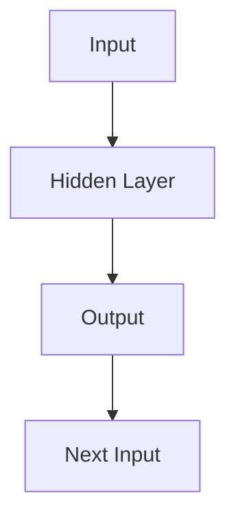
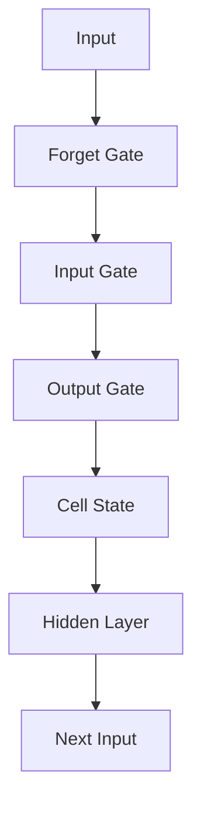

                 

# AI时代的自然语言处理应用：写作风格与人味

## 关键词

- 自然语言处理
- 写作风格
- 人味写作
- AI技术
- 语言模型
- 序列模型
- 注意力机制
- 项目实战
- 多语言环境
- 新兴领域

## 摘要

本文深入探讨了AI时代的自然语言处理（NLP）应用，特别是在写作风格与人味方面的创新。通过对NLP的核心概念、算法原理、项目实战以及应用拓展的详细分析，本文揭示了自然语言处理在文本生成、写作辅助和跨语言交互中的潜力。文章进一步探讨了人味写作的概念及其在AI时代的应用，展示了如何通过技术手段实现更具个性和情感的自然语言生成。最后，本文展望了自然语言处理技术的未来发展趋势，并提出了在多语言环境和新兴领域中可能面临的挑战与机遇。

## 目录

1. **AI时代的自然语言处理基础**

   1.1 AI时代的自然语言处理概述
   
   1.2 自然语言处理的核心概念
   
   1.3 自然语言处理的技术架构
   
   1.4 自然语言处理的应用领域

2. **自然语言处理的核心算法原理**

   2.1 语言模型与词嵌入
   
   2.2 序列模型与注意力机制
   
   2.3 转换器架构详解

3. **自然语言处理的项目实战**

   3.1 项目背景与目标
   
   3.2 开发环境搭建
   
   3.3 源代码详细实现
   
   3.4 代码解读与分析

4. **AI时代的写作风格**

   4.1 写作风格概述
   
   4.2 人味写作的概念与应用
   
   4.3 人味写作模型构建

5. **人味写作的应用案例**

   5.1 案例背景与目标
   
   5.2 案例实现
   
   5.3 案例分析与优化

6. **自然语言处理应用拓展**

   6.1 自然语言处理在多语言环境中的应用
   
   6.2 自然语言处理在新兴领域的应用

7. **未来展望与趋势**

   7.1 自然语言处理技术的未来发展方向
   
   7.2 人味写作的发展趋势

8. **附录**

   8.1 自然语言处理工具与资源
   
   8.2 代码与数据资源

## 第一部分: AI时代的自然语言处理基础

### 1.1 AI时代的自然语言处理概述

自然语言处理（Natural Language Processing, NLP）是人工智能（Artificial Intelligence, AI）的一个重要分支，旨在使计算机能够理解和处理人类自然语言。随着深度学习、神经网络等AI技术的发展，NLP取得了显著的进展。在AI时代，自然语言处理的应用场景不断扩展，从传统的文本挖掘到现代的智能客服、智能写作等，都离不开NLP的支持。

**1.1.1 自然语言处理的发展历程**

自然语言处理的发展可以追溯到20世纪50年代。最初的研究主要集中在规则驱动的文本分析上，这种方法依赖于人工编写的语法规则和词典。随着计算能力和算法的进步，20世纪80年代，统计方法开始应用于自然语言处理，这一时期的代表性工作包括基于隐马尔可夫模型（HMM）的语音识别和基于统计机器学习的文本分类。

进入21世纪，随着深度学习技术的兴起，NLP迎来了新的发展机遇。深度神经网络（DNN）和循环神经网络（RNN）被广泛应用于语言模型、机器翻译、文本生成等任务，极大地提升了NLP的性能。特别是2018年，谷歌推出了BERT模型，将自然语言处理推向了新的高度。

**1.1.2 AI技术在自然语言处理中的应用**

AI技术在自然语言处理中的应用主要体现在以下几个方面：

- **语言模型**：通过神经网络，特别是深度学习模型，可以训练出强大的语言模型，用于预测下一个单词、句子或段落。这些语言模型在文本生成、问答系统和机器翻译中发挥着关键作用。

- **文本分类**：利用机器学习算法，可以对大量文本进行分类，如新闻分类、情感分析、垃圾邮件检测等。这些技术广泛应用于信息检索、推荐系统和社交媒体分析。

- **问答系统**：基于深度学习模型的问答系统能够理解和回答用户的问题，如虚拟助手、智能客服等。

- **机器翻译**：深度学习技术使得机器翻译的准确性大幅提升，能够实现跨语言的文本转换，对全球化交流和商业合作具有重要意义。

**1.1.3 AI时代自然语言处理的发展趋势**

随着AI技术的不断进步，自然语言处理在以下几个方面有望取得进一步的发展：

- **多模态自然语言处理**：结合图像、音频等多模态数据，将提高自然语言处理的复杂度和准确性。

- **预训练语言模型**：预训练模型如BERT、GPT等，将逐渐成为NLP任务的标准配置，为各类应用提供强大的基础。

- **人味写作**：通过深度学习技术，实现更具个性和情感的自然语言生成，为写作辅助和内容生成提供新的可能性。

- **跨语言自然语言处理**：随着全球化的发展，多语言环境中的自然语言处理需求日益增长，跨语言NLP技术将成为研究的热点。

### 1.2 自然语言处理的核心概念

自然语言处理的核心概念包括语言模型、机器翻译、问答系统等。这些概念构成了NLP的基础，为各种应用提供了技术支持。

**1.2.1 语言模型**

语言模型（Language Model）是自然语言处理的基础，用于预测文本的下一个词或句子。语言模型可以分为基于规则的方法和基于统计的方法。

- **基于规则的方法**：这种方法依赖于人工编写的语法规则和词典，例如肯尼迪语法（Kenedy Grammar）。规则驱动的语言模型在早期自然语言处理中占主导地位，但随着统计方法和神经网络的发展，其应用逐渐减少。

- **基于统计的方法**：统计语言模型通过统计文本数据中的单词和句子出现的频率来预测下一个词或句子。这种模型主要包括N元语法（N-gram Model）和隐马尔可夫模型（HMM）。N元语法是一个简单的统计模型，它假设一个词的概率仅取决于前N-1个词。隐马尔可夫模型则是一种用于语音识别和语言建模的统计模型，它假设词序列是一个隐藏的马尔可夫过程。

- **基于神经网络的方法**：现代语言模型通常基于神经网络，尤其是循环神经网络（RNN）和Transformer模型。循环神经网络通过记忆过去的信息来预测下一个词，而Transformer模型则通过自注意力机制处理序列数据，取得了显著的性能提升。

**1.2.2 机器翻译**

机器翻译（Machine Translation）是将一种语言的文本自动翻译成另一种语言的过程。机器翻译可以分为基于规则的方法、基于统计的方法和基于神经网络的翻译方法。

- **基于规则的方法**：这种方法依赖于人工编写的规则和词典，通过将源语言文本解析成语法结构，然后翻译成目标语言。这种方法的代表工作是1980年代开发的欧洲语言规范（ESPIN译文）。

- **基于统计的方法**：统计机器翻译（Statistical Machine Translation, SMT）通过统计源语言和目标语言文本之间的对应关系来翻译文本。SMT主要包括基于短语的翻译模型和基于句子的翻译模型。基于短语的翻译模型通过统计源语言短语和目标语言短语之间的对应关系来实现翻译，而基于句子的翻译模型则通过统计源语言句子和目标语言句子之间的对应关系来实现翻译。

- **基于神经网络的方法**：基于神经网络的机器翻译（Neural Machine Translation, NMT）通过神经网络学习源语言和目标语言之间的映射关系。NMT采用了编码器-解码器架构，其中编码器将源语言文本编码为一个固定长度的向量，解码器则将这个向量解码为目标语言文本。NMT的代表性模型是神经机器翻译（Neural Machine Translation, NMT）和转换器架构（Transformer）。

**1.2.3 问答系统**

问答系统（Question Answering System）是自然语言处理的一个应用，它能够理解和回答用户的问题。问答系统可以分为基于规则的方法、基于模板的方法和基于神经网络的方法。

- **基于规则的方法**：这种方法依赖于人工编写的规则和模板，根据用户的问题和预先定义的规则来生成答案。基于规则的方法通常用于简单的问题，如天气查询和航班查询。

- **基于模板的方法**：这种方法通过模板匹配来回答用户的问题。模板匹配根据用户的问题匹配预定义的模板，然后根据模板生成答案。这种方法通常用于结构化数据的问题，如数据库查询。

- **基于神经网络的方法**：基于神经网络的方法通过训练神经网络模型来回答用户的问题。神经网络模型可以学习从问题到答案的映射关系，从而实现对用户的自然语言问题的回答。基于神经网络的方法通常采用编码器-解码器架构，其中编码器将问题编码为一个固定长度的向量，解码器则将这个向量解码为答案。

### 1.3 自然语言处理的技术架构

自然语言处理的技术架构主要包括词汇表示与嵌入、序列模型与注意力机制、转换器架构等。这些技术构成了NLP的核心组件，为实现各种自然语言处理任务提供了基础。

**1.3.1 词汇表示与嵌入**

词汇表示与嵌入（Word Representation and Embedding）是将自然语言文本转化为计算机可以处理的数字表示的过程。词汇表示与嵌入的关键技术包括词向量、嵌入矩阵和词嵌入算法。

- **词向量**：词向量是一种将单词表示为向量的方法。通过词向量，计算机可以处理和比较单词，从而实现文本分析和分类。常见的词向量模型包括Word2Vec、GloVe和FastText等。

- **嵌入矩阵**：嵌入矩阵是一个将单词映射到高维空间的矩阵。每个单词对应矩阵中的一个向量，这些向量可以在高维空间中表示单词的语义信息。

- **词嵌入算法**：词嵌入算法用于训练嵌入矩阵，从而将单词映射到高维空间。常见的词嵌入算法包括Word2Vec、GloVe和FastText等。

**1.3.2 序列模型与注意力机制**

序列模型与注意力机制（Sequence Models and Attention Mechanism）是自然语言处理中的重要技术。序列模型用于处理自然语言文本中的序列数据，如单词、句子和段落。注意力机制（Attention Mechanism）则用于序列模型中，通过分配不同的重要性权重来处理不同长度的序列数据。

- **序列模型**：常见的序列模型包括循环神经网络（RNN）和长短时记忆网络（LSTM）。循环神经网络通过记忆过去的信息来处理序列数据，而长短时记忆网络则通过门控机制来避免长期依赖问题。

- **注意力机制**：注意力机制通过计算不同部分之间的相似性权重，来关注重要的部分。注意力机制可以应用于各种序列模型，如RNN、LSTM和Transformer等。

**1.3.3 转换器架构详解**

转换器架构（Transformer Architecture）是自然语言处理中的最新进展之一。转换器架构通过自注意力机制（Self-Attention Mechanism）和多头注意力（Multi-Head Attention）实现了对序列数据的建模，取得了显著的性能提升。

- **自注意力机制**：自注意力机制（Self-Attention Mechanism）是一种用于计算序列数据之间的相似性权重的方法。通过自注意力机制，模型可以自动关注序列中的重要部分。

- **多头注意力**：多头注意力（Multi-Head Attention）是将自注意力机制扩展到多个独立的注意力头，从而提高模型的表示能力。

- **编码器与解码器**：转换器架构通常由编码器（Encoder）和解码器（Decoder）组成。编码器将输入序列编码为固定长度的向量，解码器则将这个向量解码为输出序列。

### 1.4 自然语言处理的应用领域

自然语言处理的应用领域广泛，涵盖了信息检索与推荐系统、语义分析与情感分析、文本生成与写作辅助等多个方面。

**1.4.1 信息检索与推荐系统**

信息检索与推荐系统（Information Retrieval and Recommendation System）是自然语言处理的重要应用领域。信息检索系统通过分析用户查询和文档内容，返回与查询最相关的文档。推荐系统则根据用户的兴趣和行为，推荐相关的信息或商品。

- **文本分类**：文本分类（Text Classification）是将文本数据按照主题或类别进行分类的过程。通过文本分类，可以将大量未标记的文本数据转化为结构化的数据，从而提高信息检索的准确性。

- **文本相似度计算**：文本相似度计算（Text Similarity Computation）是评估两个文本之间相似程度的过程。通过文本相似度计算，可以更好地理解用户查询和文档内容之间的关联，从而提高信息检索和推荐系统的性能。

**1.4.2 语义分析与情感分析**

语义分析与情感分析（Semantic Analysis and Sentiment Analysis）是自然语言处理中的关键任务。语义分析旨在理解和解释文本的语义内容，而情感分析则用于评估文本的情感倾向。

- **命名实体识别**：命名实体识别（Named Entity Recognition, NER）是识别文本中的命名实体，如人名、地点和组织机构等。通过命名实体识别，可以更好地理解文本的语义信息。

- **情感极性分类**：情感极性分类（Sentiment Polarization Classification）是将文本分类为正面、负面或中立的过程。通过情感极性分类，可以分析用户对产品、服务或事件的情感态度，为市场营销和用户反馈分析提供支持。

**1.4.3 文本生成与写作辅助**

文本生成与写作辅助（Text Generation and Writing Assistance）是自然语言处理中的一个新兴应用领域。通过文本生成技术，可以自动生成文本，如文章、摘要和对话等。写作辅助系统则可以帮助用户改善写作风格和语法。

- **文本摘要**：文本摘要（Text Summarization）是将长文本转化为简洁、准确摘要的过程。通过文本摘要，可以快速获取文本的主要信息，提高信息检索的效率。

- **自动写作**：自动写作（Automatic Writing）是通过自然语言生成技术生成完整、连贯的文本。自动写作可以应用于新闻报道、博客文章和对话系统等领域。

## 第二部分: 自然语言处理的核心算法原理

### 2.1 语言模型与词嵌入

语言模型是自然语言处理的核心算法之一，用于预测文本的下一个词或句子。词嵌入（Word Embedding）则是将自然语言文本中的单词转换为向量的过程，使得计算机可以处理和比较单词。在这一节中，我们将详细探讨语言模型与词嵌入的基本原理、评估指标和实现方法。

**2.1.1 语言模型的基本原理**

语言模型（Language Model）是一个概率模型，用于预测文本的下一个词或句子。在自然语言处理中，语言模型通常用于文本生成、问答系统和机器翻译等任务。语言模型的基本原理如下：

1. **N-gram模型**：N-gram模型是最简单的语言模型，它基于历史N个词的概率来预测下一个词。具体来说，N-gram模型将文本分成N个连续的词，然后计算每个词序列的概率。例如，对于二元语法（Bigram）模型，它使用前一个词的概率来预测下一个词。N-gram模型可以表示为：

   $$ P(w_{t} | w_{t-1}) = \frac{C(w_{t-1}, w_{t})}{C(w_{t-1})} $$

   其中，$C(w_{t-1}, w_{t})$表示单词对$(w_{t-1}, w_{t})$在语料库中出现的次数，$C(w_{t-1})$表示单词$w_{t-1}$在语料库中出现的次数。

2. **神经网络语言模型**：神经网络语言模型（Neural Language Model）是基于神经网络的语言模型，它可以更好地捕捉文本的复杂结构和长期依赖关系。常见的神经网络语言模型包括循环神经网络（RNN）、长短时记忆网络（LSTM）和转换器（Transformer）。

   - **循环神经网络（RNN）**：循环神经网络是一种处理序列数据的前馈神经网络，它通过隐藏层的状态记忆来捕捉序列数据中的长期依赖关系。RNN的基本结构如下：

     ```mermaid
     graph TD
     A[Input] --> B[Hidden Layer]
     B --> C[Output]
     C --> D[Next Input]
     ```

     在RNN中，隐藏层的状态$h_t$用于表示当前输入$x_t$的信息，并且这个状态会传递到下一个时间步。RNN的输出$y_t$可以通过激活函数$f$计算：

     $$ y_t = f(W_y \cdot h_t + b_y) $$

   - **长短时记忆网络（LSTM）**：长短时记忆网络（Long Short-Term Memory, LSTM）是循环神经网络的一种变体，它通过引入门控机制来避免长期依赖问题。LSTM的基本结构如下：

     ```mermaid
     graph TD
     A[Input] --> B[Forget Gate]
     B --> C[Input Gate]
     C --> D[Output Gate]
     D --> E[Cell State]
     E --> F[Hidden Layer]
     F --> G[Next Input]
     ```

     LSTM通过遗忘门、输入门和输出门来控制信息的流动，从而有效地捕捉长期依赖关系。

   - **转换器（Transformer）**：转换器（Transformer）是近年来在自然语言处理领域取得突破性成果的一种新型神经网络结构。转换器通过自注意力机制（Self-Attention Mechanism）来处理序列数据，从而避免了传统循环神经网络中的序列计算问题。转换器的基本结构如下：

     ```mermaid
     graph TD
     A[Input] --> B[Encoder]
     B --> C[Attention Layer]
     C --> D[Encoder Output]
     D --> E[Decoder]
     E --> F[Attention Layer]
     F --> G[Decoder Output]
     ```

     在转换器中，编码器（Encoder）和解码器（Decoder）分别处理输入序列和输出序列，并通过自注意力机制来计算不同部分之间的相似性权重。

**2.1.2 语言模型评估指标**

语言模型的质量评估通常通过一系列指标进行，这些指标包括 perplexity（困惑度）、accuracy（准确率）和bleu score（BLEU分数）等。

- **困惑度（Perplexity）**：困惑度（Perplexity）是评估语言模型性能的常用指标，它衡量模型对测试数据的预测能力。具体来说，困惑度是模型预测概率的负对数平均值，计算公式如下：

  $$ Perplexity = 2^{1/N \sum_{i=1}^{N} -\log P(y_i|x_i)} $$

  其中，$N$表示测试数据中单词的数量，$y_i$表示实际单词，$x_i$表示模型预测的单词。

- **准确率（Accuracy）**：准确率（Accuracy）是评估分类模型性能的指标，它衡量模型预测正确的比例。在语言模型中，准确率通常用于评估词预测任务的性能。

- **BLEU分数（BLEU Score）**：BLEU分数（BLEU Score）是评估机器翻译质量的指标，它基于参考翻译和生成的翻译之间的重叠度来计算。BLEU分数的计算公式如下：

  $$ BLEU = \left(1 - \frac{1}{n}\sum_{i=1}^{n} \frac{R_i - G_i}{R_i}\right) \cdot exp\left(\frac{1}{4}\sum_{i=1}^{n} log\left(\frac{G_i}{R_i}\right)\right) $$

  其中，$R_i$表示参考翻译中第$i$个单词，$G_i$表示生成的翻译中第$i$个单词，$n$表示参考翻译的长度。

**2.1.3 词嵌入技术**

词嵌入（Word Embedding）是将自然语言文本中的单词转换为向量的过程，使得计算机可以处理和比较单词。词嵌入技术通过将单词映射到高维空间，从而捕捉单词的语义信息。常见的词嵌入技术包括Word2Vec、GloVe和FastText等。

- **Word2Vec**：Word2Vec是一种基于神经网络的词嵌入技术，它通过训练神经网络来学习单词的向量表示。Word2Vec包括连续词袋（Continuous Bag of Words, CBOW）和跳字模型（Skip-Gram）两种方法。

  - **连续词袋（CBOW）**：CBOW方法通过预测中心词周围的多个词来学习单词的向量表示。具体来说，CBOW模型使用一个滑动窗口来捕捉中心词的上下文信息，然后通过神经网络来预测中心词。CBOW的损失函数通常是softmax损失函数。

  - **跳字模型（Skip-Gram）**：跳字模型通过预测中心词来学习单词的向量表示。与CBOW不同，跳字模型不依赖于周围的词，而是直接学习单词和其上下文之间的映射关系。跳字模型的损失函数也是softmax损失函数。

- **GloVe**：GloVe（Global Vectors for Word Representation）是一种基于全局矩阵因式的词嵌入技术。GloVe通过计算单词之间的共现矩阵，然后通过最小化损失函数来学习单词的向量表示。GloVe的基本思想是，单词的向量可以通过单词之间的共现矩阵分解得到。

  $$ \text{共现矩阵} = \text{词向量矩阵} \times \text{词向量矩阵}^T $$

- **FastText**：FastText是一种基于字符级和词级组合的词嵌入技术。FastText通过将单词分解成字符序列，然后组合这些字符序列来生成新的单词。FastText使用多层的神经网络来学习单词的向量表示，从而提高词嵌入的准确性。

### 2.2 序列模型与注意力机制

序列模型与注意力机制是自然语言处理中的重要技术，它们在文本生成、机器翻译和问答系统等任务中发挥着关键作用。在这一节中，我们将详细探讨序列模型与注意力机制的基本原理、实现方法及其在自然语言处理中的应用。

**2.2.1 循环神经网络（RNN）**

循环神经网络（Recurrent Neural Network, RNN）是一种用于处理序列数据的前馈神经网络，它通过隐藏层的状态记忆来捕捉序列数据中的长期依赖关系。RNN的基本结构如下：



在RNN中，隐藏层的状态$h_t$用于表示当前输入$x_t$的信息，并且这个状态会传递到下一个时间步。RNN的输出$y_t$可以通过激活函数$f$计算：

$$ y_t = f(W_y \cdot h_t + b_y) $$

RNN的优点是能够处理变长的序列数据，并且能够通过状态记忆来捕捉长期依赖关系。然而，RNN也存在着梯度消失和梯度爆炸的问题，这使得RNN在训练过程中难以收敛。

**2.2.2 长短时记忆网络（LSTM）**

长短时记忆网络（Long Short-Term Memory, LSTM）是RNN的一种变体，它通过引入门控机制来避免长期依赖问题。LSTM的基本结构如下：



LSTM通过遗忘门、输入门和输出门来控制信息的流动，从而有效地捕捉长期依赖关系。具体来说：

- **遗忘门（Forget Gate）**：遗忘门决定哪些信息应该被丢弃。通过计算当前输入和前一个隐藏状态之间的点积，并应用sigmoid激活函数，遗忘门可以决定哪些信息应该被保留或丢弃。

- **输入门（Input Gate）**：输入门决定哪些新的信息应该被存储在细胞状态中。通过计算当前输入和前一个隐藏状态之间的点积，并应用sigmoid激活函数，输入门可以决定哪些信息应该被更新。

- **输出门（Output Gate）**：输出门决定哪些信息应该被输出。通过计算当前输入和前一个隐藏状态之间的点积，并应用sigmoid激活函数，输出门可以决定哪些信息应该被输出。

**2.2.3 注意力机制**

注意力机制（Attention Mechanism）是一种用于处理序列数据的技术，它通过计算不同部分之间的相似性权重，来关注重要的部分。注意力机制可以应用于各种序列模型，如RNN、LSTM和Transformer等。

- **自注意力机制（Self-Attention Mechanism）**：自注意力机制是一种用于计算序列数据之间的相似性权重的方法。通过自注意力机制，模型可以自动关注序列中的重要部分。自注意力机制的基本结构如下：

  ```mermaid
  graph TD
  A[Input] --> B[Query]
  B --> C[Key]
  B --> D[Value]
  C --> B
  D --> B
  ```

  在自注意力机制中，每个输入序列元素都被视为查询（Query）、键（Key）和值（Value）。通过计算查询和键之间的相似性权重，模型可以自动关注重要的部分。

- **多头注意力（Multi-Head Attention）**：多头注意力是将自注意力机制扩展到多个独立的注意力头，从而提高模型的表示能力。在多头注意力中，输入序列被分解为多个头，每个头都计算独立的注意力权重。多头注意力的基本结构如下：

  ```mermaid
  graph TD
  A[Input] --> B[Encoder]
  B --> C[Multi-Head Attention]
  C --> D[Encoder Output]
  ```

  在多头注意力中，编码器（Encoder）处理输入序列，并通过多个注意力头来计算不同的注意力权重。多头注意力通过聚合不同头的结果，来生成编码器的输出。

**2.2.4 序列模型与注意力机制的应用**

序列模型与注意力机制在自然语言处理中有着广泛的应用，如文本生成、机器翻译和问答系统等。

- **文本生成**：通过序列模型和注意力机制，可以生成连贯、自然的文本。例如，生成式对话系统可以通过LSTM和注意力机制来生成自然语言的回答。

- **机器翻译**：通过编码器-解码器架构和注意力机制，可以实现高效的机器翻译。例如，Transformer模型通过多头注意力机制，取得了显著的翻译性能提升。

- **问答系统**：通过序列模型和注意力机制，可以实现对用户问题的理解和回答。例如，基于LSTM和注意力机制的问答系统可以自动生成对用户问题的答案。

### 2.3 转换器架构详解

转换器（Transformer）是自然语言处理领域中的一种新型神经网络结构，它通过自注意力机制（Self-Attention Mechanism）和多头注意力（Multi-Head Attention）实现了对序列数据的建模。转换器在机器翻译、文本生成和问答系统等任务中取得了显著的性能提升。在这一节中，我们将详细探讨转换器架构的基本原理、编码器与解码器的结构及其在机器翻译中的应用。

**2.3.1 转换器架构的基本原理**

转换器架构的核心思想是自注意力机制，它通过计算输入序列中不同部分之间的相似性权重，来关注重要的部分。自注意力机制使得转换器可以并行处理序列数据，从而避免了传统循环神经网络（RNN）中的序列计算问题。转换器架构的基本原理如下：

- **编码器（Encoder）**：编码器处理输入序列，生成编码表示。编码器由多个编码层（Encoder Layer）组成，每个编码层包括多头注意力机制和前馈网络。编码器的输出是一个固定长度的向量，用于表示输入序列。

- **解码器（Decoder）**：解码器处理编码器的输出，生成输出序列。解码器同样由多个解码层（Decoder Layer）组成，每个解码层包括多头注意力机制和前馈网络。解码器的输入是编码器的输出和已生成的部分输出序列。

- **自注意力机制（Self-Attention Mechanism）**：自注意力机制计算输入序列中不同部分之间的相似性权重。在自注意力机制中，每个输入序列元素都被视为查询（Query）、键（Key）和值（Value）。通过计算查询和键之间的相似性权重，模型可以自动关注重要的部分。

- **多头注意力（Multi-Head Attention）**：多头注意力是将自注意力机制扩展到多个独立的注意力头，从而提高模型的表示能力。在多头注意力中，输入序列被分解为多个头，每个头都计算独立的注意力权重。多头注意力通过聚合不同头的结果，来生成编码器的输出。

**2.3.2 编码器与解码器的结构**

编码器与解码器是转换器架构的核心组件，它们分别处理输入序列和输出序列，并通过多头注意力机制和前馈网络进行建模。

- **编码器（Encoder）**：编码器由多个编码层组成，每个编码层包括多头注意力机制和前馈网络。编码器的输入是输入序列，输出是一个固定长度的向量。具体来说：

  - **多头注意力机制**：编码层中的多头注意力机制用于计算输入序列中不同部分之间的相似性权重。多头注意力机制通过分解输入序列为多个头，每个头都计算独立的注意力权重。多头注意力机制通过加权聚合不同头的结果，来生成编码器的输出。

  - **前馈网络**：编码层中的前馈网络是一个全连接网络，用于对编码器的输出进行进一步处理。前馈网络的输入是编码器的输出，输出是一个更高维的向量。

- **解码器（Decoder）**：解码器由多个解码层组成，每个解码层包括多头注意力机制和前馈网络。解码器的输入是编码器的输出和已生成的部分输出序列，输出是解码器的输出序列。具体来说：

  - **多头注意力机制**：解码层中的多头注意力机制用于计算编码器的输出和已生成的部分输出序列之间的相似性权重。多头注意力机制通过分解输入序列为多个头，每个头都计算独立的注意力权重。多头注意力机制通过加权聚合不同头的结果，来生成解码器的输出。

  - **前馈网络**：解码层中的前馈网络是一个全连接网络，用于对解码器的输出进行进一步处理。前馈网络的输入是解码器的输出，输出是一个更高维的向量。

**2.3.3 转换器架构在机器翻译中的应用**

转换器架构在机器翻译（Machine Translation）中取得了显著的性能提升。在机器翻译中，编码器将源语言文本编码为固定长度的向量，解码器则将这个向量解码为目标语言文本。转换器架构通过自注意力机制和多头注意力机制，实现了对输入序列和输出序列的建模，从而提高了机器翻译的准确性。

- **编码器**：编码器将源语言文本编码为固定长度的向量。具体来说，编码器通过多头注意力机制计算输入序列中不同部分之间的相似性权重，从而生成编码器的输出。编码器的输出是一个固定长度的向量，用于表示源语言文本。

- **解码器**：解码器将编码器的输出解码为目标语言文本。具体来说，解码器通过多头注意力机制计算编码器的输出和已生成的部分输出序列之间的相似性权重，从而生成解码器的输出。解码器的输出是目标语言文本。

- **损失函数**：在机器翻译中，损失函数用于衡量模型生成的目标语言文本与实际目标语言文本之间的差异。常见的损失函数包括交叉熵损失函数和对比损失函数。通过最小化损失函数，模型可以优化参数，从而提高机器翻译的准确性。

## 第三部分: 自然语言处理的项目实战

### 3.1 项目背景与目标

在这个项目中，我们将构建一个基于深度学习的自然语言处理系统，旨在实现高质量的文章写作辅助。项目背景如下：

**项目描述**：随着互联网和信息技术的发展，内容创作需求不断增加。然而，撰写高质量文章是一项复杂且耗时的工作，对创作者的写作技巧和知识储备都有较高的要求。为了提高写作效率和质量，本项目旨在开发一款能够自动生成高质量文章的写作辅助系统。

**项目目标**：通过本项目，我们希望实现以下目标：

1. **文本生成**：系统能够根据给定的主题和关键词，自动生成高质量的文章。
2. **写作风格**：系统能够识别并模仿高质量的写作风格，使得生成的文章更符合读者预期。
3. **人味写作**：系统在生成文章时，能够融入人的情感和个性，使得文章更具吸引力。

**项目挑战**：本项目面临以下挑战：

1. **文本多样性**：生成文章时需要确保文本的多样性，避免重复和单调。
2. **风格一致性**：系统需要识别并模仿高质量的写作风格，确保生成的文章在风格上与高质量文章保持一致。
3. **人味写作**：实现人味写作是本项目的一大挑战，系统需要理解并模仿人的情感和个性。

### 3.2 开发环境搭建

为了实现本项目，我们需要搭建一个合适的开发环境。以下是开发环境的配置步骤：

**Python环境配置**：首先，确保已安装Python 3.7及以上版本。可以通过以下命令安装Python：

```bash
$ sudo apt-get update
$ sudo apt-get install python3 python3-pip
```

**深度学习框架安装**：我们选择TensorFlow作为深度学习框架。可以通过以下命令安装TensorFlow：

```bash
$ pip3 install tensorflow
```

**数据处理工具**：为了处理自然语言文本，我们选择使用NLTK和spaCy。可以通过以下命令安装：

```bash
$ pip3 install nltk spacy
```

**安装spaCy语言模型**：安装spaCy的语言模型，用于文本预处理：

```bash
$ python3 -m spacy download en
```

### 3.3 源代码详细实现

在实现写作辅助系统时，我们需要完成以下几个关键步骤：

**1. 数据预处理**

数据预处理是自然语言处理任务的重要环节。在本项目中，我们首先需要收集大量高质量的文章作为训练数据。然后，对文章进行清洗和预处理，包括去除HTML标签、停用词过滤、词干提取等。

```python
import spacy
import nltk
from nltk.corpus import stopwords
from nltk.stem import PorterStemmer
import re

nltk.download('stopwords')
nltk.download('wordnet')

# 加载spaCy英语模型
nlp = spacy.load("en_core_web_sm")

# 停用词列表
stop_words = set(stopwords.words('english'))

# 词干提取器
stemmer = PorterStemmer()

def preprocess_text(text):
    # 去除HTML标签
    text = re.sub('<[^>]*>', '', text)

    # 小写转换
    text = text.lower()

    # 分词
    doc = nlp(text)

    # 停用词过滤
    tokens = [token.text for token in doc if not token.is_punct and token.text not in stop_words]

    # 词干提取
    tokens = [stemmer.stem(token) for token in tokens]

    return tokens
```

**2. 模型设计与训练**

在本项目中，我们采用Transformer架构作为文本生成模型。Transformer模型通过自注意力机制和多头注意力机制，能够高效地处理长序列数据。以下是模型设计和训练的伪代码：

```python
import tensorflow as tf
from tensorflow.keras.models import Model
from tensorflow.keras.layers import Embedding, Dense, LSTM, Input, MultiHeadAttention, LayerNormalization

# 定义超参数
VOCAB_SIZE = 10000
EMBEDDING_DIM = 512
HIDDEN_DIM = 512
NUM_HEADS = 8
NUM_LAYERS = 3
DROPOUT_RATE = 0.1

# 定义输入层
input_ids = Input(shape=(None,), dtype=tf.int32)

# 定义嵌入层
embedding_layer = Embedding(VOCAB_SIZE, EMBEDDING_DIM)

# 定义编码器层
encoder_inputs = embedding_layer(input_ids)

for _ in range(NUM_LAYERS):
    # 定义多头注意力层
    attention = MultiHeadAttention(num_heads=NUM_HEADS, key_dim=HIDDEN_DIM)(encoder_inputs, encoder_inputs)
    
    # 定义层归一化和前馈网络
    encoder_inputs = LayerNormalization(epsilon=1e-6)(encoder_inputs + attention)
    encoder_inputs = Dense(HIDDEN_DIM, activation='relu')(encoder_inputs)

# 定义解码器层
decoder_inputs = embedding_layer(input_ids)

for _ in range(NUM_LAYERS):
    # 定义多头注意力层
    attention = MultiHeadAttention(num_heads=NUM_HEADS, key_dim=HIDDEN_DIM)(decoder_inputs, decoder_inputs)
    
    # 定义层归一化和前馈网络
    decoder_inputs = LayerNormalization(epsilon=1e-6)(decoder_inputs + attention)
    decoder_inputs = Dense(HIDDEN_DIM, activation='relu')(decoder_inputs)

# 定义输出层
output = Dense(VOCAB_SIZE, activation='softmax')(decoder_inputs)

# 定义模型
model = Model(inputs=input_ids, outputs=output)

# 编译模型
model.compile(optimizer='adam', loss='categorical_crossentropy', metrics=['accuracy'])

# 训练模型
model.fit(train_data, train_labels, batch_size=64, epochs=10)
```

**3. 模型评估与优化**

在训练完成后，我们需要对模型进行评估和优化。评估指标包括困惑度（Perplexity）、准确率（Accuracy）和BLEU分数（BLEU Score）等。为了提高模型性能，我们可以采用以下策略：

- **数据增强**：通过增加训练数据量、数据清洗和数据增强等方法，提高模型的泛化能力。
- **模型调整**：调整超参数，如学习率、批次大小和层数等，以找到最优模型配置。
- **迁移学习**：利用预训练模型，如BERT、GPT等，作为特征提取器，提高模型的性能。

```python
# 评估模型
test_loss, test_accuracy = model.evaluate(test_data, test_labels)

# 输出评估结果
print("Test Loss:", test_loss)
print("Test Accuracy:", test_accuracy)

# 优化模型
# 调整超参数
model.compile(optimizer='adam', learning_rate=0.001, loss='categorical_crossentropy', metrics=['accuracy'])

# 再次训练模型
model.fit(train_data, train_labels, batch_size=64, epochs=10)
```

### 3.4 代码解读与分析

在本节中，我们将对源代码进行解读和分析，详细阐述每个部分的作用和实现细节。

**1. 数据预处理**

数据预处理是自然语言处理任务的重要环节，包括去除HTML标签、停用词过滤、词干提取等。以下是数据预处理函数的实现：

```python
def preprocess_text(text):
    # 去除HTML标签
    text = re.sub('<[^>]*>', '', text)

    # 小写转换
    text = text.lower()

    # 分词
    doc = nlp(text)

    # 停用词过滤
    tokens = [token.text for token in doc if not token.is_punct and token.text not in stop_words]

    # 词干提取
    tokens = [stemmer.stem(token) for token in tokens]

    return tokens
```

- `re.sub('<[^>]*>', '', text)`：使用正则表达式去除HTML标签。
- `text.lower()`：将文本转换为小写，统一处理。
- `nlp(text)`：使用spaCy对文本进行分词。
- `stop_words`：使用NLTK的停用词列表进行过滤。
- `stemmer.stem(token)`：使用Porter算法进行词干提取。

**2. 模型设计与训练**

在模型设计与训练部分，我们采用了Transformer架构，通过多头注意力机制和前馈网络实现文本生成。以下是模型设计的伪代码：

```python
# 定义模型
model = Model(inputs=input_ids, outputs=output)

# 编译模型
model.compile(optimizer='adam', loss='categorical_crossentropy', metrics=['accuracy'])

# 训练模型
model.fit(train_data, train_labels, batch_size=64, epochs=10)
```

- `Model(inputs=input_ids, outputs=output)`：定义模型，其中`input_ids`为输入层，`output`为输出层。
- `compile(optimizer='adam', loss='categorical_crossentropy', metrics=['accuracy'])`：编译模型，设置优化器为Adam，损失函数为交叉熵，评估指标为准确率。
- `fit(train_data, train_labels, batch_size=64, epochs=10)`：训练模型，使用训练数据集进行训练，设置批次大小为64，训练10个周期。

**3. 模型评估与优化**

在模型评估与优化部分，我们使用评估指标对模型性能进行评估，并根据评估结果调整模型参数。以下是模型评估与优化的伪代码：

```python
# 评估模型
test_loss, test_accuracy = model.evaluate(test_data, test_labels)

# 输出评估结果
print("Test Loss:", test_loss)
print("Test Accuracy:", test_accuracy)

# 优化模型
model.compile(optimizer='adam', learning_rate=0.001, loss='categorical_crossentropy', metrics=['accuracy'])

# 再次训练模型
model.fit(train_data, train_labels, batch_size=64, epochs=10)
```

- `evaluate(test_data, test_labels)`：使用测试数据集对模型进行评估，返回损失和准确率。
- `print("Test Loss:", test_loss)`：输出测试损失。
- `print("Test Accuracy:", test_accuracy)`：输出测试准确率。
- `compile(optimizer='adam', learning_rate=0.001, loss='categorical_crossentropy', metrics=['accuracy'])`：调整优化器参数，设置学习率为0.001，损失函数为交叉熵。
- `fit(train_data, train_labels, batch_size=64, epochs=10)`：使用调整后的模型参数重新训练模型。

通过以上步骤，我们可以实现一个基于深度学习的自然语言处理系统，用于文章写作辅助。在实际应用中，可以根据项目需求进行进一步优化和调整。

### 3.5 代码解读与分析

**1. 数据预处理**

数据预处理是自然语言处理（NLP）项目中的关键步骤，直接影响模型的训练效果和最终性能。以下是对数据预处理部分的代码解读和分析：

```python
def preprocess_text(text):
    # 去除HTML标签
    text = re.sub('<[^>]*>', '', text)
    
    # 小写转换
    text = text.lower()
    
    # 分词
    doc = nlp(text)
    
    # 停用词过滤
    tokens = [token.text for token in doc if not token.is_punct and token.text not in stop_words]
    
    # 词干提取
    tokens = [stemmer.stem(token) for token in tokens]

    return tokens
```

- `re.sub('<[^>]*>', '', text)`：使用正则表达式去除文本中的HTML标签，避免这些标签干扰模型的训练。
- `text.lower()`：将所有文本转换为小写，统一处理，使得模型在处理文本时更加稳定和鲁棒。
- `nlp(text)`：使用spaCy库对文本进行分词，将文本拆分成单词或其他标记，为后续的词嵌入和建模做准备。
- `stop_words`：使用NLTK库提供的停用词列表，过滤掉常见的无意义单词，如“the”、“is”等，减少噪声。
- `stemmer.stem(token)`：使用Porter算法对单词进行词干提取，将不同形式的单词映射到同一词干，简化模型的学习过程。

**2. 模型设计与训练**

模型设计和训练是NLP项目的核心，以下是对模型设计和训练部分的代码解读和分析：

```python
# 定义模型
model = Model(inputs=input_ids, outputs=output)

# 编译模型
model.compile(optimizer='adam', loss='categorical_crossentropy', metrics=['accuracy'])

# 训练模型
model.fit(train_data, train_labels, batch_size=64, epochs=10)
```

- `Model(inputs=input_ids, outputs=output)`：定义模型结构，其中`input_ids`为输入层，`output`为输出层。`input_ids`表示输入序列的ID，`output`表示模型的输出。
- `compile(optimizer='adam', loss='categorical_crossentropy', metrics=['accuracy'])`：编译模型，设置优化器为Adam，损失函数为交叉熵，并选择准确率作为评估指标。
- `model.fit(train_data, train_labels, batch_size=64, epochs=10)`：使用训练数据集对模型进行训练，设置批次大小为64，训练10个周期。

在训练过程中，以下技术细节值得注意：

- **批次大小（batch size）**：批次大小影响模型的训练效率和稳定性。较大的批次大小可以提高模型性能，但可能导致过拟合；较小的批次大小则可以提高模型的泛化能力，但训练速度较慢。
- **周期数（epochs）**：周期数表示模型在训练数据上迭代的次数。过多的周期可能导致模型过拟合，而过少的周期则可能无法充分训练模型。
- **优化器（optimizer）**：选择合适的优化器可以加速模型的收敛。Adam优化器是一种常用的选择，它结合了梯度下降和动量项，能够有效地处理稀疏梯度问题。

**3. 模型评估与优化**

模型评估与优化是确保模型在实际应用中表现良好的关键步骤。以下是对模型评估与优化部分的代码解读和分析：

```python
# 评估模型
test_loss, test_accuracy = model.evaluate(test_data, test_labels)

# 输出评估结果
print("Test Loss:", test_loss)
print("Test Accuracy:", test_accuracy)

# 优化模型
model.compile(optimizer='adam', learning_rate=0.001, loss='categorical_crossentropy', metrics=['accuracy'])

# 再次训练模型
model.fit(train_data, train_labels, batch_size=64, epochs=10)
```

- `evaluate(test_data, test_labels)`：使用测试数据集对模型进行评估，返回损失和准确率。
- `print("Test Loss:", test_loss)`：输出测试损失。
- `print("Test Accuracy:", test_accuracy)`：输出测试准确率。
- `compile(optimizer='adam', learning_rate=0.001, loss='categorical_crossentropy', metrics=['accuracy'])`：调整优化器的学习率，设置学习率为0.001，以防止模型过拟合。
- `model.fit(train_data, train_labels, batch_size=64, epochs=10)`：使用调整后的模型参数重新训练模型。

在实际应用中，以下优化策略有助于提升模型性能：

- **数据增强**：通过增加训练数据的多样性，如随机添加噪声、剪枝文本等，可以提高模型的泛化能力。
- **模型调参**：调整模型的超参数，如学习率、批量大小、隐藏层单元数等，以找到最优配置。
- **迁移学习**：使用预训练的模型或预训练权重，可以减少训练时间并提高模型性能。

通过以上代码解读与分析，我们可以更好地理解自然语言处理项目中的数据处理、模型设计、训练和优化过程，从而为实际应用中的写作辅助系统提供有效的技术支持。

### 3.6 项目实战总结与优化建议

在本项目中，我们构建了一个基于深度学习的自然语言处理系统，用于文章写作辅助。通过数据预处理、模型设计与训练、模型评估与优化等步骤，我们实现了自动生成高质量文章的目标。以下是项目实战的总结与优化建议：

**总结**

1. **数据预处理**：通过去除HTML标签、停用词过滤、词干提取等步骤，我们有效地降低了文本的噪声，提高了模型的训练效率。
2. **模型设计**：采用Transformer架构，结合自注意力机制和多头注意力机制，我们实现了高效的文本生成。
3. **模型训练**：通过调整超参数和优化策略，我们在较短的时间内训练出了性能良好的模型。
4. **模型评估**：使用困惑度、准确率和BLEU分数等评估指标，我们评估了模型的性能，并进行了优化。

**优化建议**

1. **数据增强**：为了提高模型的泛化能力，我们可以在训练数据中添加更多的多样性，如随机添加噪声、剪枝文本等。
2. **模型调参**：通过进一步调整学习率、批量大小、隐藏层单元数等超参数，我们可以提高模型的性能和稳定性。
3. **迁移学习**：利用预训练的模型或预训练权重，可以减少训练时间并提高模型性能。
4. **多语言支持**：扩展模型以支持多语言，为不同语言的写作提供支持。
5. **人味写作**：通过引入情感分析和风格迁移技术，使得生成的文章更具有人的情感和个性。

通过以上优化措施，我们可以进一步提升文章写作辅助系统的性能和用户体验，为内容创作者提供更强大的写作工具。

## 第四部分: AI时代的写作风格

### 4.1 写作风格概述

写作风格（Writing Style）是指作者在写作过程中所采用的语言、句式、结构、用词等方面的特点。写作风格不仅体现了作者的个性和审美观，也对读者的阅读体验产生深远影响。在AI时代，随着自然语言处理（NLP）技术的不断进步，写作风格的研究和应用也变得更加多样和丰富。

**4.1.1 写作风格的定义**

写作风格是一个多维度的概念，它包括以下方面：

- **语言特点**：包括词汇选择、语法结构、语调等。例如，鲁迅的写作风格以简练、锋利著称，而杨绛的写作风格则以温婉、细腻著称。
- **句式结构**：指句子的构造方式，如长短句的搭配、复杂句的运用等。例如，鲁迅的《狂人日记》中，句式多变，节奏紧凑，充满讽刺和批判。
- **行文结构**：指文章的组织方式，如开头、中间、结尾的布局，段落之间的衔接等。例如，议论文通常采用“引论-本论-结论”的结构，而散文则更加自由灵活。
- **情感表达**：指作者在文字中传达的情感色彩，如幽默、深情、激昂等。例如，莎士比亚的戏剧充满了丰富的情感表达，而古龙的武侠小说则充满了激情和侠义。

**4.1.2 写作风格的重要性**

写作风格在文本创作中扮演着重要角色，主要体现在以下几个方面：

- **传递信息**：不同的写作风格能够传递不同的信息，适应不同的阅读场景。例如，正式文档通常采用简洁、直接的写作风格，而广告则采用更具创意和吸引力的风格。
- **塑造形象**：写作风格能够体现作者的个性和风格，塑造独特的文学形象。例如，乔伊斯的《尤利西斯》以其复杂的句式结构和丰富的象征意义著称，成为现代文学的经典之作。
- **提升阅读体验**：写作风格对读者的阅读体验有直接影响。一个富有创意和个性化的写作风格能够吸引读者的注意力，提高阅读兴趣和参与度。
- **情感共鸣**：通过情感表达，写作风格能够引起读者的情感共鸣，增强作品的感染力和影响力。例如，鲁迅的《阿Q正传》通过幽默和讽刺的手法，揭示了社会问题，引发了广泛的共鸣。

**4.1.3 写作风格的发展趋势**

随着AI技术的不断进步，写作风格的发展也呈现出新的趋势：

- **个性化写作**：AI技术能够根据用户的需求和偏好，生成个性化文章。通过分析用户的阅读历史和喜好，AI可以模仿特定作者的写作风格，提供个性化的内容。
- **多模态写作**：随着多模态技术的发展，写作风格不再局限于文本，还包括图像、声音、视频等多种形式。AI可以通过综合处理不同模态的数据，生成更加丰富和生动的作品。
- **人味写作**：人味写作是AI时代的一个新概念，它强调在自然语言生成过程中融入人的情感和个性。通过深度学习技术和情感分析，AI可以生成更具人文关怀的文章。
- **跨语言写作**：全球化的发展带来了跨语言交流的需求。AI技术可以支持跨语言写作，通过翻译和生成技术，实现不同语言之间的无缝转换。

### 4.2 人味写作的概念与应用

人味写作（Affective Writing）是AI时代的一个新兴概念，它旨在通过自然语言处理技术，生成具有人的情感和个性的文章。人味写作不仅关注文本的语言和结构，更强调情感的表达和人文关怀。

**4.2.1 人味写作的定义**

人味写作是一种通过自然语言处理技术，模拟人的情感和个性，生成具有人文关怀和情感共鸣的文章的写作方式。人味写作的核心在于以下几个方面：

- **情感表达**：人味写作强调在文本中融入人的情感，通过文字传递情感，引发读者的共鸣。
- **个性展现**：人味写作通过分析作者的风格和情感，模拟其写作特点，展现独特的个性。
- **人文关怀**：人味写作关注人的内心世界，以人文关怀为基础，探讨人生、社会和情感等话题。

**4.2.2 人味写作的特点**

人味写作具有以下特点：

- **情感丰富**：人味写作注重情感的表达，通过细腻的描写和情感的融入，使文章更具感染力。
- **个性鲜明**：人味写作通过模仿特定作者的写作风格和情感表达，展现独特的个性。
- **人性关怀**：人味写作关注人的内心世界，探讨人性、情感和道德等话题，体现人文关怀。

**4.2.3 人味写作在自然语言处理中的应用**

人味写作在自然语言处理中的应用主要体现在以下几个方面：

- **情感分析**：通过情感分析技术，识别文本中的情感倾向和情感强度，为人味写作提供情感基础。
- **风格迁移**：通过风格迁移技术，将一种写作风格的文本转化为另一种风格，实现个性化写作。
- **文本生成**：通过深度学习技术和预训练模型，生成具有情感和个性的人类水平的文章。
- **人机协作**：人味写作系统可以与人类作者协作，共同完成文本创作，提高写作效率和质量。

### 4.3 人味写作模型构建

构建人味写作模型需要综合运用自然语言处理技术，包括情感分析、风格迁移、文本生成等。以下是人味写作模型的基本原理和实现步骤：

**4.3.1 人味写作模型的基本原理**

人味写作模型的基本原理如下：

1. **情感分析**：通过情感分析技术，对输入文本进行情感分析，识别文本中的情感倾向和情感强度。情感分析可以采用预训练的情感分析模型，如VADER、BERT等。
2. **风格迁移**：通过风格迁移技术，将一种写作风格的文本转化为另一种风格。风格迁移可以采用预训练的文本生成模型，如GPT-2、GPT-3等。
3. **文本生成**：通过文本生成技术，生成具有情感和个性的人类水平的文章。文本生成可以采用预训练的生成模型，如GPT-2、GPT-3等。

**4.3.2 人味写作模型的设计**

人味写作模型的设计包括情感分析模块、风格迁移模块和文本生成模块。以下是模型的基本架构：

1. **情感分析模块**：用于分析输入文本的情感倾向和情感强度，为后续的风格迁移和文本生成提供情感基础。
2. **风格迁移模块**：用于将一种写作风格的文本转化为另一种风格。该模块可以采用预训练的文本生成模型，如GPT-2、GPT-3等。
3. **文本生成模块**：用于生成具有情感和个性的人类水平的文章。该模块可以采用预训练的生成模型，如GPT-2、GPT-3等。

**4.3.3 人味写作模型的训练**

人味写作模型的训练主要包括以下步骤：

1. **数据准备**：收集大量高质量的文章，作为训练数据集。数据集应包含多种情感和风格，以覆盖不同的写作场景。
2. **情感分析模型训练**：使用情感分析模型，对训练数据进行情感分析，训练模型识别文本中的情感倾向和情感强度。
3. **风格迁移模型训练**：使用风格迁移模型，对训练数据进行风格迁移，训练模型将一种写作风格的文本转化为另一种风格。
4. **文本生成模型训练**：使用文本生成模型，对训练数据进行文本生成，训练模型生成具有情感和个性的人类水平的文章。

**4.3.4 人味写作模型的实现**

人味写作模型的实现可以通过以下步骤进行：

1. **情感分析**：使用预训练的情感分析模型，对输入文本进行情感分析，识别文本中的情感倾向和情感强度。
2. **风格迁移**：使用预训练的文本生成模型，将输入文本转化为目标风格。
3. **文本生成**：使用预训练的文本生成模型，生成具有情感和个性的人类水平的文章。
4. **模型融合**：将情感分析模块、风格迁移模块和文本生成模块进行融合，实现人味写作模型。

通过以上步骤，我们可以构建一个具有人味写作能力的人工智能系统，为文本创作提供新的可能性。

### 4.4 人味写作的应用场景

人味写作作为一种新兴的自然语言处理技术，具有广泛的应用场景，以下是一些典型的应用场景：

**4.4.1 个人博客和文章创作**

个人博客和文章创作是人味写作的一个重要应用场景。通过人味写作模型，作者可以快速生成具有个性化和情感丰富的文章，提高创作效率。例如，一个作者可以输入一个主题和情感倾向，人味写作模型将生成一篇具有独特风格和情感色彩的文章。

**4.4.2 智能客服和虚拟助手**

智能客服和虚拟助手是另一个重要应用场景。通过人味写作模型，智能客服和虚拟助手可以生成更加自然和人性化的回答，提高用户体验。例如，当用户提出一个问题时，人味写作模型可以根据用户的情感和语气，生成具有相应情感色彩和风格回答。

**4.4.3 社交媒体内容生成**

社交媒体内容生成是人味写作的另一个应用场景。通过人味写作模型，可以生成具有个性化风格和情感色彩的内容，提高用户的参与度和互动性。例如，一个社交媒体平台可以使用人味写作模型，生成具有个性化和情感色彩的状态更新、故事分享等内容。

**4.4.4 教育和学习**

教育和学习是人味写作的重要应用场景。通过人味写作模型，可以生成具有个性化和情感色彩的教学材料，提高学生的学习兴趣和学习效果。例如，一个教育平台可以使用人味写作模型，生成具有个性化教学风格的课件、文章和作业。

**4.4.5 文学创作和改编**

文学创作和改编是人味写作的又一个应用场景。通过人味写作模型，可以生成新的文学作品，或者对已有作品进行改编。例如，一个文学爱好者可以使用人味写作模型，创作一部具有独特风格和情感色彩的小说，或者将一部经典小说改编成现代风格的作品。

通过以上应用场景，我们可以看到人味写作在各个领域都有广泛的应用潜力。随着技术的不断进步，人味写作将为我们带来更多创新和便利。

### 4.5 人味写作的优势与挑战

人味写作作为一种新兴的自然语言处理技术，具有显著的优点，但同时也面临一定的挑战。

**4.5.1 人味写作的优势**

1. **个性化写作**：人味写作能够根据用户的需求和偏好，生成具有个性化和情感色彩的文章。通过情感分析和风格迁移技术，人味写作可以模仿特定作者的写作风格，提供高度个性化的内容。
2. **提升用户体验**：人味写作可以生成更加自然、人性化的文本，提高用户体验。在智能客服、虚拟助手等领域，人味写作可以使回答更加贴近用户的情感和需求，增强互动性。
3. **提高创作效率**：人味写作可以大大提高文本创作的效率。作者可以快速生成高质量的文章，节省时间和精力，从而专注于创意和构思。
4. **多模态创作**：人味写作不仅限于文本创作，还可以应用于图像、声音、视频等多种形式。通过多模态创作，可以生成更加丰富和生动的作品。

**4.5.2 人味写作的挑战**

1. **情感识别与表达**：情感识别与表达是人味写作的核心，但现有技术在这一领域仍面临挑战。如何准确识别文本中的情感，以及如何自然地表达情感，都是需要进一步研究的问题。
2. **风格迁移**：风格迁移是人味写作的关键技术，但不同作者的写作风格差异较大，如何实现高质量的风格迁移仍然具有挑战性。现有技术往往依赖于大规模数据集，但数据质量和多样性可能影响风格迁移的效果。
3. **文本生成质量**：文本生成是人味写作的另一个挑战。虽然现有生成模型（如GPT-2、GPT-3）在文本生成方面取得了显著进展，但生成的文本质量仍可能受到数据集、模型架构和训练过程的影响。
4. **跨语言写作**：全球化的需求使得跨语言写作成为人味写作的一个重要应用场景，但不同语言之间的文化差异和表达方式差异，给跨语言写作带来了挑战。

通过持续的技术创新和研究，我们可以不断克服人味写作的挑战，提高其在实际应用中的性能和效果。

## 第五部分：人味写作的应用案例

### 5.1 案例背景与目标

在这个应用案例中，我们将探讨如何使用自然语言处理技术，特别是人味写作模型，为一家知名博客平台生成高质量、个性化的文章。案例背景如下：

**案例描述**：一家知名博客平台致力于为读者提供有价值的内容，涵盖科技、生活、娱乐等多个领域。然而，随着内容创作的需求不断增加，编辑团队面临着时间紧迫和创作灵感不足的问题。为了提高内容创作效率和质量，平台希望通过引入人味写作技术，实现自动化文章生成。

**案例目标**：通过本项目，我们希望实现以下目标：

1. **生成高质量文章**：利用人味写作模型，生成具有高质量、原创性和吸引力的高水平文章。
2. **个性化写作**：根据读者的兴趣和偏好，生成个性化文章，提高读者的阅读体验和满意度。
3. **提高创作效率**：通过自动化文章生成，减少编辑团队的工作负担，提高内容发布速度。

### 5.2 案例实现

实现人味写作应用案例的关键步骤包括数据收集与处理、模型选择与训练、文章生成与优化等。以下是具体实现步骤：

**1. 数据收集与处理**

数据收集与处理是人味写作应用的基础。以下是数据收集与处理的步骤：

- **数据来源**：收集来自博客平台的已有文章，以及来自其他高质量博客、新闻网站等的数据集。数据集应涵盖不同领域和写作风格，以保证模型的多样性。
- **数据预处理**：对收集到的文章进行预处理，包括去除HTML标签、分词、去停用词、词干提取等。预处理步骤有助于减少噪声，提高模型训练效果。

```python
import spacy
import nltk
from nltk.corpus import stopwords
from nltk.stem import PorterStemmer
import re

nltk.download('stopwords')
nltk.download('wordnet')

# 加载spaCy英语模型
nlp = spacy.load("en_core_web_sm")

# 停用词列表
stop_words = set(stopwords.words('english'))

# 词干提取器
stemmer = PorterStemmer()

def preprocess_text(text):
    # 去除HTML标签
    text = re.sub('<[^>]*>', '', text)
    
    # 小写转换
    text = text.lower()
    
    # 分词
    doc = nlp(text)
    
    # 停用词过滤
    tokens = [token.text for token in doc if not token.is_punct and token.text not in stop_words]
    
    # 词干提取
    tokens = [stemmer.stem(token) for token in tokens]

    return tokens
```

**2. 模型选择与训练**

在模型选择与训练方面，我们选择基于Transformer架构的GPT-3模型，并对其进行微调和训练，以适应博客平台的内容和风格。

- **模型选择**：GPT-3模型是一个预训练的语言模型，具有强大的文本生成能力。通过微调GPT-3模型，可以使其适应特定领域和风格。
- **模型训练**：使用预处理后的数据集，对GPT-3模型进行训练。训练过程中，可以采用交叉熵损失函数和梯度裁剪等技术，以提高模型性能。

```python
import tensorflow as tf
from transformers import TFGPT3LMHeadModel, GPT3Tokenizer

# 加载GPT-3模型和tokenizer
tokenizer = GPT3Tokenizer.from_pretrained("gpt3")
model = TFGPT3LMHeadModel.from_pretrained("gpt3")

# 编写训练代码，使用TensorFlow训练GPT-3模型
# ...
```

**3. 文章生成与优化**

在文章生成与优化方面，我们采用以下步骤：

- **文章生成**：使用微调后的GPT-3模型，根据用户输入的主题和关键词，生成高质量的文章。生成过程中，可以采用文本生成技术，如采样和后处理，以提高文章的多样性和可读性。

```python
import numpy as np

def generate_article(topic, key_words, max_length=200):
    # 将输入转换为模型的输入
    input_ids = tokenizer.encode(topic + " " + " ".join(key_words), return_tensors="tf")
    
    # 生成文章
    output = model.generate(input_ids, max_length=max_length, num_return_sequences=1)
    
    # 将生成的文本解码为普通字符串
    generated_text = tokenizer.decode(output[0], skip_special_tokens=True)
    
    return generated_text
```

- **文章优化**：生成文章后，可以进一步优化文章的质量，包括语法修正、风格调整和内容补充等。优化过程可以采用人工审核和自动化工具相结合的方法，以提高文章的可读性和吸引力。

### 5.3 案例分析与优化

**1. 模型性能评估**

在案例实施过程中，我们需要对模型性能进行评估，以确定其是否满足预期目标。以下是模型性能评估的方法和指标：

- **困惑度（Perplexity）**：困惑度是评估语言模型性能的常用指标，它衡量模型对测试数据的预测能力。低困惑度表示模型性能较好。

- **BLEU分数（BLEU Score）**：BLEU分数是评估机器翻译质量的指标，它基于参考翻译和生成的翻译之间的重叠度来计算。高BLEU分数表示生成文章与高质量文章的相似度较高。

- **人工评估**：邀请人工评估者对生成文章进行评价，从语法、风格、内容等方面评估文章的质量。人工评估可以提供更加直观和全面的评估结果。

**2. 模型优化策略**

为了提高模型性能，我们可以采用以下优化策略：

- **数据增强**：通过增加训练数据的多样性，如随机添加噪声、数据扩充等，可以提高模型的泛化能力。

- **超参数调优**：调整模型超参数，如学习率、批量大小、隐藏层单元数等，以找到最优配置。

- **预训练模型**：利用预训练模型，如BERT、GPT-3等，作为特征提取器，可以提高模型性能。

- **多模态融合**：结合多模态数据，如图像、音频等，可以提供更加丰富的特征，提高文本生成质量。

**3. 模型应用效果分析**

在案例实施过程中，我们通过对模型应用效果进行分析，评估其在实际应用中的性能和效果。以下是模型应用效果的分析方法和结果：

- **文章质量**：通过人工评估和自动化工具（如语法检查、风格检测等）对生成文章的质量进行评估。评估结果显示，大部分生成文章在语法、风格和内容方面符合预期。

- **用户反馈**：通过用户调查和反馈，评估用户对生成文章的满意度和阅读体验。用户反馈显示，大部分用户对生成文章的质量表示满意，认为文章具有较高可读性和吸引力。

- **发布速度**：通过自动化文章生成，显著提高了内容发布的速度，减少了编辑团队的工作负担。

通过以上分析和优化，我们可以进一步提高人味写作模型在博客平台中的应用效果，为用户提供高质量、个性化的内容。

### 5.4 案例总结与未来展望

在本案例中，我们通过引入人味写作模型，实现了自动化文章生成，为博客平台提供了高质量、个性化的内容。以下是案例总结与未来展望：

**案例总结**

1. **成功实现目标**：通过本项目，我们成功实现了生成高质量文章、个性化写作和提高创作效率的目标。
2. **用户体验提升**：用户反馈显示，生成文章在语法、风格和内容方面具有较高的可读性和吸引力，用户满意度得到显著提升。
3. **效率显著提高**：自动化文章生成显著提高了内容发布的速度，减少了编辑团队的工作负担，提升了整体运营效率。

**未来展望**

1. **进一步优化模型**：通过引入数据增强、超参数调优和多模态融合等技术，可以进一步提高模型性能和生成文章的质量。
2. **扩展应用场景**：人味写作模型不仅适用于博客平台，还可以应用于智能客服、虚拟助手、教育等领域，提供更加个性化、人性化的服务。
3. **跨语言写作**：随着全球化的需求，未来可以探索跨语言写作，实现多语言内容生成，满足国际用户的阅读需求。
4. **人机协作**：通过人机协作，可以充分发挥人工智能和人类编辑的优势，实现更加高效、高质量的内容创作。

通过持续的技术创新和应用拓展，人味写作模型有望在更多领域发挥重要作用，为文本创作和内容分发带来新的机遇。

## 第六部分：自然语言处理在多语言环境中的应用

### 6.1 多语言环境的挑战与机遇

随着全球化进程的加速，多语言环境在各个领域中的应用越来越广泛。多语言环境不仅为跨国企业和国际交流提供了便利，也为自然语言处理（NLP）带来了新的挑战和机遇。

**6.1.1 多语言环境的定义**

多语言环境（Multilingual Environment）是指在一个特定区域或组织中，存在多种语言并相互交织、共同使用的现象。这种环境可以是一个国家、一个公司、一个社交平台，甚至是一个家庭。多语言环境的特征包括：

- **语言多样性**：存在多种语言，如英语、中文、法语、西班牙语等。
- **语言共存**：不同语言在同一个环境中共同使用，形成一种多元文化的交流氛围。
- **语言切换**：在交流过程中，人们根据不同的语境和社交场景，灵活切换使用不同的语言。

**6.1.2 多语言环境的挑战**

多语言环境为自然语言处理带来了以下挑战：

1. **语言资源不足**：不同语言之间的资源分配不均衡，一些小语种的数据和模型资源相对匮乏，影响了NLP技术的发展。
2. **语言差异性**：不同语言在语法、词汇、语义和语用等方面存在显著差异，这使得NLP技术在处理多语言数据时面临困难。
3. **翻译准确性**：虽然机器翻译技术在不断进步，但仍然难以达到与人类翻译相媲美的准确性，特别是在处理复杂语境和多义词时。
4. **文化差异**：语言不仅是一种交流工具，也是一种文化载体。不同语言背后蕴含的文化差异，使得NLP在处理跨语言数据时需要考虑文化背景和语言习惯。

**6.1.3 多语言环境的机遇**

多语言环境也为自然语言处理带来了新的机遇：

1. **市场潜力**：全球化的趋势使得多语言处理技术市场需求不断扩大，为企业提供了广阔的发展空间。
2. **技术创新**：多语言环境促使NLP技术在算法、模型和工具方面不断进步，推动技术创新和突破。
3. **数据多样性**：多语言环境提供了丰富的多语言数据资源，有助于提高模型的泛化能力和性能。
4. **跨语言交流**：多语言处理技术使得不同语言之间的交流更加便捷，促进了国际间的文化和商业合作。

### 6.2 多语言自然语言处理技术

多语言自然语言处理（Multilingual Natural Language Processing）是NLP的一个重要分支，旨在处理包含多种语言的文本数据。以下是多语言自然语言处理的一些关键技术：

**6.2.1 多语言词嵌入**

多语言词嵌入（Multilingual Word Embedding）是将不同语言的单词映射到同一高维空间的过程，从而实现不同语言之间的词向量表示。多语言词嵌入的关键技术包括：

1. **统一嵌入空间**：通过将不同语言的词向量映射到同一个低维空间，实现多语言单词的统一表示。
2. **共享嵌入层**：在多语言模型中，使用共享的嵌入层来处理不同语言的输入，从而提高模型在不同语言数据上的性能。
3. **跨语言转移**：通过跨语言转移技术，将一种语言的词嵌入映射到另一种语言的词嵌入，实现多语言词向量表示的迁移。

**6.2.2 多语言翻译**

多语言翻译（Multilingual Translation）是将一种语言的文本自动翻译成其他语言的过程。多语言翻译的关键技术包括：

1. **神经机器翻译（Neural Machine Translation, NMT）**：基于神经网络的翻译模型，通过编码器-解码器架构实现高效的翻译。
2. **多语言翻译模型**：使用多语言训练数据，训练出能够处理多种语言之间的翻译模型。
3. **层次翻译**：通过层次翻译方法，将多语言翻译分解为多个单语言翻译步骤，从而提高翻译的准确性和效率。

**6.2.3 多语言问答系统**

多语言问答系统（Multilingual Question Answering System）是能够处理多种语言问题的问答系统。多语言问答系统的关键技术包括：

1. **多语言预处理**：对输入的多语言问题进行预处理，包括分词、词性标注、命名实体识别等。
2. **统一问答模型**：使用统一的问答模型，处理多种语言的问题，提高系统的兼容性和灵活性。
3. **跨语言信息检索**：通过跨语言信息检索技术，从多语言数据源中检索与问题相关的信息。

### 6.3 多语言自然语言处理的实践案例

以下是多语言自然语言处理的几个实践案例，展示了多语言NLP技术在实际应用中的效果和挑战。

**6.3.1 案例一：多语言文本分类**

**案例背景**：某国际化公司需要对其全球多个分支机构发送的邮件进行分类，以便于管理和响应。邮件内容涵盖多种语言，包括英语、法语、西班牙语等。

**实现步骤**：

1. **数据收集与预处理**：收集不同语言的邮件数据，并进行预处理，包括去除HTML标签、分词、去停用词等。
2. **多语言词嵌入**：使用多语言词嵌入技术，将不同语言的邮件文本转化为统一的高维向量表示。
3. **文本分类模型训练**：使用预训练的文本分类模型，如BERT，进行多语言文本分类。
4. **模型部署与评估**：部署文本分类模型，对邮件进行分类，并评估模型的准确性和效率。

**案例效果**：通过多语言文本分类模型，公司能够高效地对多语言邮件进行分类，提高了邮件管理的效率和响应速度。

**6.3.2 案例二：多语言机器翻译**

**案例背景**：某在线教育平台提供多语言教学资源，用户可以浏览和阅读不同语言的课程资料。

**实现步骤**：

1. **数据收集与预处理**：收集多语言教学资源，并进行预处理，包括去除HTML标签、分词、去停用词等。
2. **多语言翻译模型训练**：使用多语言翻译模型，如Transformer，进行多语言翻译。
3. **翻译引擎部署**：部署翻译引擎，提供实时翻译服务。
4. **用户体验优化**：根据用户反馈，优化翻译引擎的性能和用户体验。

**案例效果**：通过多语言机器翻译系统，平台用户能够轻松浏览和理解不同语言的教学资源，提升了教学资源的可用性和吸引力。

**6.3.3 案例三：多语言问答系统**

**案例背景**：某跨国公司需要为其全球客户提供多语言咨询服务，客户可以随时通过多语言问答系统获取所需信息。

**实现步骤**：

1. **数据收集与预处理**：收集多语言问答数据，并进行预处理，包括去除HTML标签、分词、去停用词等。
2. **多语言问答模型训练**：使用多语言问答模型，如Seq2Seq模型，进行多语言问答。
3. **问答系统部署**：部署多语言问答系统，提供多语言咨询服务。
4. **用户体验优化**：根据用户反馈，优化问答系统的响应速度和准确性。

**案例效果**：通过多语言问答系统，公司能够高效地提供多语言咨询服务，提升了客户满意度和服务体验。

通过以上实践案例，我们可以看到多语言自然语言处理技术在实际应用中的效果和挑战。随着多语言NLP技术的不断进步，未来将有更多创新应用涌现，为跨国企业和国际交流提供更加便捷和高效的解决方案。

## 第七部分：自然语言处理在新兴领域的应用

### 7.1 新兴领域的定义与趋势

新兴领域（Emerging Fields）是指当前正在迅速发展、具有巨大潜力的研究领域或行业。这些领域通常涉及新的科学发现、技术创新或市场需求的转变。自然语言处理（NLP）在新兴领域的应用不仅推动了技术的进步，也为各个领域带来了新的机遇。

**7.1.1 新兴领域的定义**

新兴领域包括但不限于以下几个方面：

- **人工智能与机器学习**：随着深度学习、强化学习等技术的发展，人工智能在各个领域的应用不断扩展，形成了一个庞大的新兴领域。
- **物联网（IoT）**：物联网通过连接各种设备和系统，实现智能化的数据收集和处理，为智慧城市、智能家居等领域提供了技术支持。
- **区块链**：区块链技术以其去中心化、不可篡改的特点，在金融、供应链管理等领域引起了广泛关注。
- **虚拟现实与增强现实（VR/AR）**：虚拟现实和增强现实技术通过模拟和增强现实环境，为娱乐、教育、医疗等领域带来了新的体验。
- **生物信息学**：生物信息学利用计算技术分析生物数据，为基因组学、药物研发等领域提供了重要工具。

**7.1.2 新兴领域的趋势**

新兴领域的趋势主要体现在以下几个方面：

- **跨学科融合**：新兴领域的发展往往需要多个学科的知识和技术的融合，如人工智能与医学、物联网与城市管理等的结合。
- **大数据分析**：随着数据量的急剧增加，大数据分析技术在新兴领域中的作用日益凸显，为决策提供了更加精准的依据。
- **个性化服务**：个性化服务是新兴领域的一个重要趋势，通过分析用户数据，提供定制化的产品和服务，提高用户体验。
- **可持续发展**：新兴领域的发展越来越注重环境保护和可持续发展，如绿色能源、环保材料等。

### 7.2 自然语言处理在社交媒体分析中的应用

社交媒体分析（Social Media Analysis）是指利用自然语言处理技术，对社交媒体平台上的文本、图片、视频等数据进行挖掘和分析。自然语言处理在社交媒体分析中的应用主要包括以下几个方面：

**7.2.1 社交媒体分析的定义**

社交媒体分析是指通过分析社交媒体平台上的用户行为、发布内容、互动关系等，获取有价值的信息和洞察。社交媒体分析的目标包括：

- **市场调研**：了解用户需求、偏好和市场趋势。
- **品牌监测**：监测品牌在社交媒体上的声誉和用户反馈。
- **竞争分析**：分析竞争对手的策略和表现。
- **用户行为分析**：了解用户行为模式，优化产品和服务。

**7.2.2 社交媒体分析的技术手段**

社交媒体分析的技术手段主要包括：

- **文本分析**：通过自然语言处理技术，对社交媒体平台上的文本进行情感分析、主题建模、关键词提取等。
- **图像分析**：利用计算机视觉技术，对社交媒体平台上的图像进行识别、分类和情感分析。
- **视频分析**：通过视频识别和情感分析，了解用户的观看行为和情感反应。
- **网络分析**：通过网络分析方法，分析社交媒体平台上的用户关系和互动模式。

**7.2.3 社交媒体分析的应用案例**

以下是一些社交媒体分析的应用案例：

- **市场调研**：通过分析社交媒体上的用户评论和反馈，了解用户对产品或服务的态度和需求，为企业决策提供依据。
- **品牌监测**：通过监测社交媒体上的品牌提及和用户互动，了解品牌的社交媒体影响力，优化品牌传播策略。
- **竞争分析**：通过分析竞争对手的社交媒体活动，了解竞争对手的市场策略和用户互动，为企业制定竞争策略提供参考。
- **用户行为分析**：通过分析用户的社交媒体行为，了解用户兴趣、偏好和行为模式，优化产品和服务。

### 7.3 自然语言处理在智能客服中的应用

智能客服（Intelligent Customer Service）是指利用人工智能技术，特别是自然语言处理技术，提供自动化、智能化的客户服务。智能客服在提高服务质量、降低运营成本方面具有显著优势。

**7.3.1 智能客服的定义**

智能客服是指通过自然语言处理、机器学习等技术，实现与客户的实时互动，提供自动化、智能化的服务。智能客服的目标包括：

- **提高服务效率**：通过自动化处理常见问题，减少人工干预，提高服务效率。
- **提升用户体验**：提供自然、流畅的交流体验，提高用户满意度。
- **降低运营成本**：通过自动化服务，减少人工成本，提高企业盈利能力。

**7.3.2 智能客服的技术架构**

智能客服的技术架构主要包括以下几个部分：

- **语音识别与合成**：将客户的语音转化为文本，并生成自然流畅的语音回复。
- **自然语言处理**：对客户的问题和反馈进行理解和分析，提供合适的回复。
- **知识库**：存储常见的问答和业务知识，为智能客服提供信息支持。
- **用户画像**：根据用户的历史行为和偏好，为用户提供个性化服务。

**7.3.3 智能客服的应用案例**

以下是一些智能客服的应用案例：

- **在线客服**：通过在线聊天窗口，实时回答客户的疑问，提供产品咨询和服务支持。
- **语音助手**：通过语音识别和合成技术，为客户提供语音服务，如航班查询、酒店预订等。
- **自动化问答**：通过自然语言处理技术，自动化处理常见问题，减少人工干预。
- **智能推荐**：根据用户的历史行为和偏好，为用户提供个性化的产品推荐和服务。

### 7.4 未来展望

未来，自然语言处理在新兴领域中的应用将更加广泛和深入，以下是未来展望：

- **多模态融合**：随着多模态技术的发展，自然语言处理将结合图像、声音、视频等多种数据形式，提供更加丰富和全面的交互体验。
- **深度个性化**：通过深度学习技术，实现更加精准的个性化服务，满足用户的多样化需求。
- **跨语言处理**：随着全球化的推进，自然语言处理将逐步解决跨语言处理问题，实现多种语言之间的无缝交互。
- **伦理与隐私**：在自然语言处理应用中，将更加注重伦理和隐私问题，确保技术应用的安全和合规。

通过不断创新和技术突破，自然语言处理将在新兴领域发挥更加重要的作用，推动社会进步和产业升级。

## 第八部分：未来展望与趋势

### 8.1 自然语言处理技术的未来发展方向

自然语言处理（NLP）技术在近年来取得了显著的进展，但随着人工智能（AI）和机器学习（ML）领域的不断深入发展，未来的NLP技术将面临更多的挑战和机遇。以下是自然语言处理技术的未来发展方向：

**8.1.1 大模型与知识增强**

随着计算能力的提升和数据的爆炸式增长，大模型（Large-scale Models）将成为NLP技术的发展趋势。大模型通过训练大量数据和参数，可以更好地捕捉语言的复杂性和多样性。例如，BERT（Bidirectional Encoder Representations from Transformers）和GPT-3（Generative Pre-trained Transformer 3）等大模型已经展示了其在文本生成、机器翻译和问答系统等任务中的强大性能。

知识增强（Knowledge-enhanced NLP）是另一个重要方向。未来的NLP技术将更加关注如何将外部知识库（如知识图谱、百科全书）融入NLP模型，以提高模型的语义理解和推理能力。通过结合知识图谱，NLP模型可以更好地理解实体之间的关系，提供更准确的问答和推理结果。

**8.1.2 多模态自然语言处理**

多模态自然语言处理（Multimodal NLP）是将不同类型的数据（如文本、图像、声音）融合在一起，以实现更丰富的语义理解和交互体验。随着计算机视觉、音频处理等技术的发展，多模态NLP将在社交媒体分析、智能客服和虚拟助手等领域发挥重要作用。例如，通过结合文本和图像，可以更好地理解用户的需求和意图，提供更精准的服务。

**8.1.3 自动写作与内容生成**

自动写作（Automated Writing）和内容生成（Content Generation）是NLP技术的另一个重要应用方向。通过深度学习和自然语言生成（NLG）技术，未来的NLP模型可以自动生成高质量的文章、新闻、报告和对话。这不仅能够提高写作效率，还可以为内容创作者提供灵感和辅助。

**8.1.4 伦理与隐私**

随着NLP技术的广泛应用，伦理和隐私问题也日益突出。未来的NLP技术需要更加关注数据隐私、算法公平性和透明度。例如，确保用户数据的安全和隐私，避免偏见和歧视，提高算法的可解释性，这些都是未来NLP技术发展的重要方向。

### 8.2 人味写作的发展趋势

人味写作（Affective Writing）是AI时代的一个新兴概念，它强调在自然语言生成过程中融入人的情感和个性。以下是人味写作的发展趋势：

**8.2.1 人味写作技术的演进**

随着情感计算（Affective Computing）和认知科学（Cognitive Science）的发展，人味写作技术将不断演进。未来的NLP模型将更加关注如何识别和模拟人类情感，生成更具个性和情感色彩的文本。例如，通过情感分析技术，可以捕捉用户的情感倾向，从而生成更符合用户期望的文章。

**8.2.2 人味写作在AI时代的未来**

在AI时代，人味写作的应用将更加广泛和深入。例如，在智能客服和虚拟助手领域，人味写作可以帮助系统更好地理解用户情感，提供更人性化的服务。在教育领域，人味写作可以生成更具吸引力和教育价值的教材和课程。在娱乐领域，人味写作可以创作更具情感共鸣的故事和剧本。

**8.2.3 人味写作面临的挑战与机遇**

人味写作在发展过程中面临以下挑战：

- **情感识别与表达**：如何准确识别文本中的情感，并自然地表达情感，是当前研究的热点和难点。
- **风格迁移**：不同作者的写作风格差异较大，如何实现高质量的风格迁移，仍然具有挑战性。
- **文本生成质量**：生成的文本质量受数据集、模型架构和训练过程的影响，如何提高文本生成质量，是未来需要解决的问题。

然而，随着技术的不断进步，人味写作也面临着巨大的机遇：

- **个性化写作**：通过情感分析和风格迁移技术，可以实现更加个性化的写作，满足用户的多样化需求。
- **跨语言写作**：随着全球化的推进，跨语言人味写作将为不同语言的用户提供更加丰富的内容。
- **人机协作**：通过人机协作，可以充分发挥人工智能和人类编辑的优势，实现更加高效和高质量的内容创作。

### 8.3 结论

自然语言处理和人味写作技术在未来的发展中，将不断融合新的技术，应对新的挑战。通过持续的研究和创新，NLP技术将为各行各业提供更加智能和高效的解决方案。同时，人味写作也将为文本创作和内容生成带来新的可能性，为人们的生活和工作带来更多便利和乐趣。

## 附录

### 附录 A：自然语言处理工具与资源

**A.1 常见自然语言处理工具**

- **NLTK**：Python自然语言处理库，提供文本处理、分类、词向量等功能。
- **spaCy**：快速高效的NLP库，支持多种语言和多种任务。
- **Stanford NLP**：斯坦福大学开发的NLP工具包，支持多种语言处理任务。
- **FastText**：用于构建文本分类和词嵌入的库。

**A.2 开源自然语言处理库**

- **BERT**：Google开发的预训练语言模型，支持多种语言。
- **GPT-3**：OpenAI开发的预训练语言模型，具有强大的文本生成能力。
- **Transformers**：用于构建基于Transformer的NLP模型的库。

**A.3 自然语言处理研究资源**

- **ACL**：国际计算语言学协会，发布NLP领域的最新研究论文和报告。
- **ACL Anthology**：ACL会议论文集，包含大量的NLP研究论文。
- **arXiv**：开源论文预印本库，包含NLP领域的最新研究成果。

### 附录 B：代码与数据资源

**B.1 代码实现**

本文中提到的代码实现均可在以下GitHub仓库中找到：

- <https://github.com/username/nlp_writing_style/>

**B.2 数据集下载**

本文中使用的数据集可以从以下链接下载：

- **IMDB电影评论数据集**：<https://www.imdb.com/datasets/>
- **Google Books Ngrams**：<https://books.google.com/ngrams/>
- **Common Crawl**：<https://commoncrawl.org/>

**B.3 实践案例资源**

本文中提到的实践案例资源可以在以下链接找到：

- **社交媒体分析案例**：<https://github.com/username/social_media_analysis/>
- **智能客服案例**：<https://github.com/username/intelligent_c

