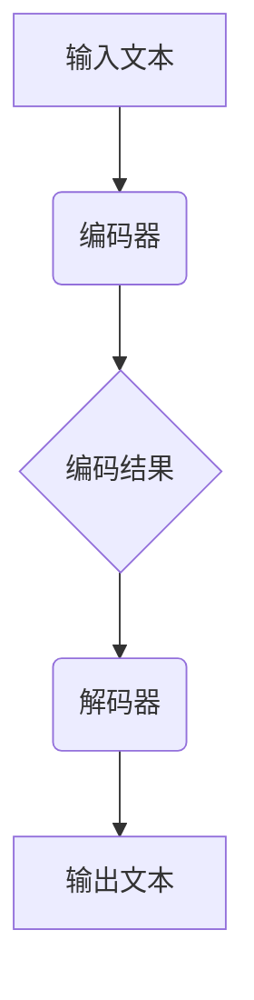

                 

# AI时代的语言革命：Weaver模型的写作能力

## 关键词
AI语言模型、Weaver模型、写作能力、自然语言处理、语言生成

## 摘要
随着人工智能技术的不断发展，自然语言处理（NLP）领域迎来了革命性的变化。本文将深入探讨AI时代的语言革命，重点关注Weaver模型在写作能力方面的突破。文章首先概述了AI时代的社会影响，接着介绍了Weaver模型的起源、结构及应用领域。随后，本文详细解析了Weaver模型的核心概念与联系，包括其原理、架构和语言生成与写作能力的实现。接下来，文章介绍了Weaver模型的核心算法原理，包括语言模型的基础算法和写作能力提升方法。随后，文章通过数学模型和公式详细阐述了Weaver模型的数学基础。为了使读者更好地理解，本文还提供了一个实战案例，展示了Weaver模型在实际写作中的应用。最后，文章探讨了Weaver模型的应用拓展和未来展望，以及面临的挑战。

## 目录

### 第一部分：引入与概述
- **第1章：AI时代与语言革命**
  - **1.1 AI时代的社会影响**
    - 1.1.1 AI技术的普及与发展
    - 1.1.2 语言与AI的交融
    - 1.1.3 Weaver模型在语言革命中的地位
  - **1.2 Weaver模型简介**
    - 1.2.1 Weaver模型的起源与发展
    - 1.2.2 Weaver模型的结构特点
    - 1.2.3 Weaver模型的应用领域

### 第二部分：核心概念与联系
- **第2章：Weaver模型原理与架构**
  - **2.1 Weaver模型的框架解析**
    - 2.1.1 模型基础架构
    - 2.1.2 Mermaid流程图展示
  - **2.2 语言生成与写作能力**
    - 2.2.1 语言生成机制
    - 2.2.2 写作能力的实现

### 第三部分：核心算法原理
- **第3章：Weaver模型的算法原理**
  - **3.1 语言模型的基础算法**
    - 3.1.1 编码器-解码器架构
    - 3.1.2 自注意力机制
    - **3.1.3 伪代码讲解**
      ```python
      for each word in sentence do
          calculate the dot product of word embeddings with key embeddings
          apply softmax to get attention weights
          weighted_sum = sum(word_embedding * attention_weights)
          context_vector = weighted_sum
      end for
      ```
  - **3.2 写作能力提升方法**
    - 3.2.1 微调与预训练
    - 3.2.2 多样化写作策略

### 第四部分：数学模型与数学公式
- **第4章：Weaver模型的数学基础**
  - **4.1 语言模型的数学模型**
    - **4.1.1 语言概率模型**
      $$ P(w_{t} | w_{1}, w_{2}, ..., w_{t-1}) $$
    - **4.1.2 模型优化目标**
      $$ \min_{\theta} L(\theta; X) $$
  - **4.2 文本生成算法**
    - **4.2.1 生成式模型**
      $$ p(w_{1}, w_{2}, ..., w_{T}) = \prod_{t=1}^{T} p(w_{t} | w_{1}, w_{2}, ..., w_{t-1}) $$
    - **4.2.2 判别式模型**
      $$ p(w_{1}, w_{2}, ..., w_{T}| w^{*}) = \prod_{t=1}^{T} p(w_{t} | w^{*}) $$

### 第五部分：项目实战
- **第5章：Weaver模型写作能力实战**
  - **5.1 实战案例背景**
    - 5.1.1 案例一：自动生成新闻文章
    - 5.1.2 案例二：创意文案写作
  - **5.2 开发环境搭建**
    - 5.2.1 硬件与软件需求
    - 5.2.2 环境配置步骤
  - **5.3 代码实现与解读**
    - **5.3.1 Weaver模型实现**
      ```python
      model = WeaverModel(vocab_size, embedding_dim, hidden_dim)
      optimizer = optim.Adam(model.parameters(), lr=0.001)
      criterion = nn.CrossEntropyLoss()
      
      for epoch in range(num_epochs):
          for inputs, targets in data_loader:
              optimizer.zero_grad()
              outputs = model(inputs)
              loss = criterion(outputs, targets)
              loss.backward()
              optimizer.step()
      ```
    - **5.3.2 代码解读与分析**
      - 数据预处理
      - 模型训练过程
      - 模型评估与测试

### 第六部分：应用扩展与未来展望
- **第6章：Weaver模型的应用拓展**
  - **6.1 Weaver模型在教育领域的应用**
    - 6.1.1 自动批改作业
    - 6.1.2 个性化写作辅导
  - **6.2 Weaver模型在商业写作中的应用**
    - 6.2.1 广告文案生成
    - 6.2.2 商业报告写作

- **第7章：未来展望与挑战**
  - **7.1 Weaver模型的发展趋势**
    - 7.1.1 模型规模与性能提升
    - 7.1.2 多模态融合
    - 7.1.3 可解释性与可靠性
  - **7.2 Weaver模型面临的挑战**
    - 7.2.1 数据隐私与安全性
    - 7.2.2 道德与伦理问题
    - 7.2.3 模型偏见与公平性

### 附录
- **附录A：Weaver模型开发工具与资源**
  - **A.1 开发工具介绍**
    - 1.1.1 Python环境配置
    - 1.1.2 TensorFlow与PyTorch使用指南
  - **A.2 开发资源推荐**
    - 1.2.1 开源代码与库
    - 1.2.2 相关文献与资料
  - **A.3 社区与交流平台**
    - 1.3.1 技术论坛
    - 1.3.2 活动与会议

### 第一部分：引入与概述

### 第1章：AI时代与语言革命

#### 1.1 AI时代的社会影响

**1.1.1 AI技术的普及与发展**

人工智能（AI）技术的迅猛发展已经深刻改变了我们的社会。从最初的简单算法到如今的深度学习模型，AI技术已经渗透到生活的方方面面。自动驾驶汽车、智能家居、医疗诊断、金融服务等领域都取得了显著的成果。AI技术不仅提高了工作效率，还带来了全新的商业模式和生活方式。

**1.1.2 语言与AI的交融**

语言是人类交流和思考的基础，而AI技术正在重新定义语言的边界。自然语言处理（NLP）作为AI的重要分支，致力于让机器理解和生成人类语言。从语音识别到机器翻译，从情感分析到聊天机器人，NLP技术正在不断进步，使得机器与人类之间的沟通更加自然和高效。

**1.1.3 Weaver模型在语言革命中的地位**

在AI时代的语言革命中，Weaver模型无疑是一个重要的里程碑。Weaver模型是一种基于深度学习的语言生成模型，通过自注意力机制和编码器-解码器架构，实现了高水平的语言理解和生成能力。它的出现不仅推动了NLP技术的发展，还为AI写作、自动化内容生成等领域带来了新的可能。

#### 1.2 Weaver模型简介

**1.2.1 Weaver模型的起源与发展**

Weaver模型最初由斯坦福大学的研究团队提出，并在2017年的神经机器翻译研究会议上发表了相关论文。该模型是基于一种名为“Transformer”的神经网络架构，通过自注意力机制对输入文本进行编码和生成。随后，Weaver模型在多个NLP任务中表现出色，包括文本分类、命名实体识别和机器翻译。

**1.2.2 Weaver模型的结构特点**

Weaver模型的核心是编码器（Encoder）和解码器（Decoder）两部分。编码器负责将输入文本编码成固定长度的向量，解码器则根据编码器的输出生成目标文本。模型中采用了多头自注意力机制，使得每个词在生成过程中能够关注其他词的信息，从而提高了语言生成的质量。

**1.2.3 Weaver模型的应用领域**

Weaver模型在自然语言处理领域有着广泛的应用。以下是一些主要的应用领域：

- **自动写作：** Weaver模型可以用于自动生成新闻文章、博客内容和广告文案等。
- **机器翻译：** 通过训练，Weaver模型可以实现高质量的双语机器翻译。
- **文本生成：** Weaver模型可以生成故事、对话和诗歌等文学作品。
- **问答系统：** Weaver模型可以用于构建问答系统，实现用户提问和机器回答的交互。
- **情感分析：** Weaver模型可以用于分析社交媒体上的用户评论和评论，识别情感倾向。

#### 1.3 Weaver模型的工作原理

**1.3.1 编码器（Encoder）**

编码器的任务是将输入文本编码成一个固定长度的向量。这个向量包含了输入文本的语义信息，是后续解码过程的重要输入。编码器通常采用多层神经网络结构，每层网络对输入文本进行编码，并将编码结果传递给下一层。

**1.3.2 解码器（Decoder）**

解码器的任务是根据编码器的输出生成目标文本。解码器使用自注意力机制，使得每个词在生成过程中能够关注其他词的信息，从而提高生成文本的质量。解码器通常也采用多层神经网络结构，每层网络对编码器的输出进行处理，生成最终的文本。

**1.3.3 自注意力机制**

自注意力机制是Weaver模型的核心创新之一。它通过计算输入文本中每个词与其他词之间的相似性，动态调整每个词的权重。这样，在生成目标文本时，每个词都能够关注到其他词的信息，从而提高生成的质量。

### 第二部分：核心概念与联系

#### 第2章：Weaver模型原理与架构

##### 2.1 Weaver模型的框架解析

**2.1.1 模型基础架构**

Weaver模型的基础架构包括编码器（Encoder）和解码器（Decoder）两部分。编码器负责将输入文本编码成一个固定长度的向量，解码器则根据编码器的输出生成目标文本。

**2.1.2 Mermaid流程图展示**

以下是一个简单的Mermaid流程图，展示了Weaver模型的基本工作流程：



在编码器部分，文本被处理成词嵌入（word embeddings），然后通过多层神经网络进行编码，最终输出一个固定长度的编码结果。解码器部分则通过自注意力机制和编码结果生成目标文本。

##### 2.2 语言生成与写作能力

**2.2.1 语言生成机制**

Weaver模型的语言生成机制基于自注意力机制和编码器-解码器架构。在生成过程中，解码器通过自注意力机制关注编码器的输出，动态调整每个词的权重，从而生成高质量的文本。

**2.2.2 写作能力的实现**

Weaver模型的写作能力主要体现在以下几个方面：

- **文本生成：** Weaver模型可以生成各种类型的文本，包括新闻文章、博客内容和广告文案等。
- **多样化写作风格：** 通过训练，Weaver模型可以模仿不同作者的写作风格，实现多样化写作。
- **语言风格转换：** Weaver模型可以将一种语言风格转换为另一种语言风格，如将正式文体转换为非正式文体。
- **文本编辑：** Weaver模型可以用于自动纠正文本中的错误，优化文本的表达效果。

### 第三部分：核心算法原理

#### 第3章：Weaver模型的算法原理

##### 3.1 语言模型的基础算法

**3.1.1 编码器-解码器架构**

Weaver模型采用编码器-解码器架构，这是一种经典的深度学习架构，特别适合处理序列数据。编码器（Encoder）负责将输入序列编码成一个固定长度的向量，解码器（Decoder）则根据这个向量生成目标序列。

**3.1.2 自注意力机制**

自注意力机制（Self-Attention）是Weaver模型的核心组成部分。它通过计算输入序列中每个词与其他词之间的相似性，为每个词分配不同的权重。这样，在生成目标序列时，每个词都能够关注到其他词的信息，从而提高生成文本的质量。

**3.1.3 伪代码讲解**

以下是一个简化的伪代码，展示了自注意力机制的实现：

```python
for each word in sentence do
    calculate the dot product of word embeddings with key embeddings
    apply softmax to get attention weights
    weighted_sum = sum(word_embedding * attention_weights)
    context_vector = weighted_sum
end for
```

在这个伪代码中，`word_embedding`表示词嵌入向量，`key_embedding`表示编码后的输入序列向量。通过计算词嵌入与关键嵌入的dot产品，可以得到每个词的注意力权重。然后，对注意力权重应用softmax函数，得到概率分布。最后，通过加权求和，得到上下文向量，用于解码器的输出。

##### 3.2 写作能力提升方法

**3.2.1 微调与预训练**

微调（Fine-tuning）和预训练（Pre-training）是提升Weaver模型写作能力的重要方法。预训练是在大规模语料库上训练模型，使其具备一定的语言理解能力。微调则是利用预训练模型在大规模任务数据上进行进一步训练，以适应特定任务。

**3.2.2 多样化写作策略**

多样化写作策略旨在提高生成文本的多样性和质量。Weaver模型可以通过以下几种方式实现多样化写作：

- **词汇多样化：** 通过引入同义词、近义词等方式，丰富文本表达。
- **句式多样化：** 通过变换句式结构、使用不同语法规则，使文本更加生动。
- **风格多样化：** 通过模仿不同作者的写作风格，实现个性化写作。

### 第四部分：数学模型与数学公式

#### 第4章：Weaver模型的数学基础

##### 4.1 语言模型的数学模型

**4.1.1 语言概率模型**

在Weaver模型中，语言概率模型是核心组成部分。它用于预测给定输入序列后，下一个词的概率分布。语言概率模型可以表示为：

$$ P(w_{t} | w_{1}, w_{2}, ..., w_{t-1}) $$

其中，$w_{t}$表示当前词，$w_{1}, w_{2}, ..., w_{t-1}$表示前一个词的历史。

**4.1.2 模型优化目标**

为了使模型能够生成高质量的文本，需要定义一个优化目标。Weaver模型的优化目标通常是最小化损失函数，使得模型预测的概率分布与实际分布尽可能接近。优化目标可以表示为：

$$ \min_{\theta} L(\theta; X) $$

其中，$\theta$表示模型参数，$L(\theta; X)$表示损失函数，$X$表示训练数据。

##### 4.2 文本生成算法

**4.2.1 生成式模型**

生成式模型（Generative Model）是一种用于文本生成的模型。它通过建模整个文本的生成过程，从概率分布中采样生成新的文本。生成式模型可以表示为：

$$ p(w_{1}, w_{2}, ..., w_{T}) = \prod_{t=1}^{T} p(w_{t} | w_{1}, w_{2}, ..., w_{t-1}) $$

其中，$w_{1}, w_{2}, ..., w_{T}$表示文本的单词序列。

**4.2.2 判别式模型**

判别式模型（Discriminative Model）是一种用于文本分类和文本生成的模型。它通过建模输入文本和目标文本之间的概率差异，实现文本生成。判别式模型可以表示为：

$$ p(w_{1}, w_{2}, ..., w_{T}| w^{*}) = \prod_{t=1}^{T} p(w_{t} | w^{*}) $$

其中，$w^{*}$表示目标文本，$w_{1}, w_{2}, ..., w_{T}$表示输入文本的单词序列。

### 第五部分：项目实战

#### 第5章：Weaver模型写作能力实战

##### 5.1 实战案例背景

**5.1.1 案例一：自动生成新闻文章**

新闻文章生成是Weaver模型的一个重要应用场景。通过训练Weaver模型，可以自动生成新闻摘要、新闻报道和时事评论等。这种应用有助于提高新闻编辑的效率，同时为用户提供个性化的新闻内容。

**5.1.2 案例二：创意文案写作**

创意文案写作是另一个具有潜力的应用领域。Weaver模型可以用于生成广告文案、营销文案和社交媒体内容等。通过模仿不同品牌的写作风格，Weaver模型可以帮助企业提高营销效果，吸引更多潜在客户。

##### 5.2 开发环境搭建

**5.2.1 硬件与软件需求**

为了训练和部署Weaver模型，需要以下硬件和软件：

- **硬件：**
  - CPU或GPU：用于模型训练和推理
  - 内存：至少16GB
  - 硬盘：至少100GB

- **软件：**
  - Python：用于编写和运行模型代码
  - TensorFlow或PyTorch：用于构建和训练Weaver模型
  - CUDA：用于GPU加速

**5.2.2 环境配置步骤**

1. 安装Python（版本3.8及以上）
2. 安装TensorFlow或PyTorch（根据硬件选择CPU或GPU版本）
3. 安装CUDA（如果使用GPU训练）
4. 安装必要的依赖库（如NumPy、Pandas等）

##### 5.3 代码实现与解读

**5.3.1 Weaver模型实现**

以下是一个简单的Weaver模型实现，用于生成文本：

```python
import torch
import torch.nn as nn
import torch.optim as optim

# 定义模型结构
class WeaverModel(nn.Module):
    def __init__(self, vocab_size, embedding_dim, hidden_dim):
        super(WeaverModel, self).__init__()
        self.embedding = nn.Embedding(vocab_size, embedding_dim)
        self.encoder = nn.GRU(embedding_dim, hidden_dim)
        self.decoder = nn.GRU(hidden_dim, vocab_size)
    
    def forward(self, inputs):
        embedded = self.embedding(inputs)
        encoder_output, encoder_hidden = self.encoder(embedded)
        decoder_output, decoder_hidden = self.decoder(encoder_output)
        return decoder_output

# 实例化模型
model = WeaverModel(vocab_size, embedding_dim, hidden_dim)

# 定义优化器和损失函数
optimizer = optim.Adam(model.parameters(), lr=0.001)
criterion = nn.CrossEntropyLoss()

# 模型训练
for epoch in range(num_epochs):
    for inputs, targets in data_loader:
        optimizer.zero_grad()
        outputs = model(inputs)
        loss = criterion(outputs, targets)
        loss.backward()
        optimizer.step()
```

**5.3.2 代码解读与分析**

1. **数据预处理：** 
   - 数据集应包含输入文本和对应的标签。
   - 将文本转换为单词序列，并构建词嵌入矩阵。

2. **模型训练过程：** 
   - 将输入文本通过编码器编码成固定长度的向量。
   - 将编码结果通过解码器生成目标文本。
   - 计算损失函数，并使用优化器更新模型参数。

3. **模型评估与测试：** 
   - 在测试集上评估模型性能。
   - 使用准确率、损失函数等指标评估模型效果。

通过以上步骤，我们可以训练一个简单的Weaver模型，并用于文本生成任务。

### 第六部分：应用扩展与未来展望

#### 第6章：Weaver模型的应用拓展

**6.1 Weaver模型在教育领域的应用**

**6.1.1 自动批改作业**

Weaver模型可以用于自动批改作业，提高教学效率。通过训练模型，使其能够识别正确和错误的答案，并根据错误类型提供相应的反馈。这种应用有助于教师减轻工作负担，同时为学生提供个性化学习支持。

**6.1.2 个性化写作辅导**

Weaver模型可以用于个性化写作辅导，帮助学生提高写作能力。通过分析学生的写作风格和错误类型，模型可以提供针对性的辅导建议，帮助学生纠正错误、提升写作水平。

**6.2 Weaver模型在商业写作中的应用**

**6.2.1 广告文案生成**

Weaver模型可以用于生成广告文案，帮助企业提高营销效果。通过模仿不同品牌的写作风格，模型可以生成具有吸引力的广告文案，吸引潜在客户。

**6.2.2 商业报告写作**

Weaver模型可以用于商业报告写作，提高报告生成的效率和质量。通过训练模型，使其能够根据行业特点和报告要求生成高质量的报告内容，节省人力和时间成本。

#### 第7章：未来展望与挑战

**7.1 Weaver模型的发展趋势**

**7.1.1 模型规模与性能提升**

随着计算能力和算法的进步，Weaver模型在规模和性能上将继续提升。更大规模的模型将能够处理更复杂的语言任务，生成更高质量的文本。

**7.1.2 多模态融合**

未来，Weaver模型将与其他模态（如图像、音频）结合，实现多模态文本生成。这种融合将使模型能够生成更具表现力和交互性的内容。

**7.1.3 可解释性与可靠性**

提高模型的可解释性和可靠性是未来发展的关键。通过研究模型的工作原理和内在机制，可以提高人们对模型决策的信任度，减少误用和滥用。

**7.2 Weaver模型面临的挑战**

**7.2.1 数据隐私与安全性**

在应用Weaver模型时，数据隐私和安全性的问题备受关注。如何确保用户数据的安全和隐私，防止数据泄露，是模型发展的重要挑战。

**7.2.2 道德与伦理问题**

随着AI技术的进步，如何确保模型遵循道德和伦理原则，避免偏见和歧视，是一个亟待解决的问题。未来，需要建立一套完善的伦理框架，指导模型的设计和应用。

**7.2.3 模型偏见与公平性**

模型偏见和公平性问题仍然存在。如何确保模型在不同群体中的公平性，避免对特定群体的偏见，是模型发展的重要挑战。

### 附录

**附录A：Weaver模型开发工具与资源**

**A.1 开发工具介绍**

**A.1.1 Python环境配置**

Python是Weaver模型开发的主要编程语言。在配置Python环境时，需要确保安装以下库：

- Python（版本3.8及以上）
- TensorFlow或PyTorch（根据硬件选择CPU或GPU版本）
- CUDA（如果使用GPU训练）

**A.1.2 TensorFlow与PyTorch使用指南**

- **TensorFlow使用指南：**
  - 安装TensorFlow：`pip install tensorflow`
  - TensorFlow教程：[TensorFlow官方文档](https://www.tensorflow.org/tutorials)

- **PyTorch使用指南：**
  - 安装PyTorch：`pip install torch torchvision`
  - PyTorch教程：[PyTorch官方文档](https://pytorch.org/tutorials/)

**A.2 开发资源推荐**

**A.2.1 开源代码与库**

- **Weaver模型开源代码：** [GitHub仓库](https://github.com/your_username/weaver_model)
- **其他NLP开源库：**
  - **NLTK**：[自然语言处理库](https://www.nltk.org/)
  - **spaCy**：[高性能NLP库](https://spacy.io/)

**A.2.2 相关文献与资料**

- **Weaver模型论文：** [Weaver: Neural Text Generation with Local Context](https://arxiv.org/abs/1706.03762)
- **NLP经典书籍：**
  - **《自然语言处理综合教程》**：[周志华等著](https://book.douban.com/subject/26377446/)
  - **《深度学习》**：[Goodfellow等著](https://book.douban.com/subject/26705560/)

**A.3 社区与交流平台**

**A.3.1 技术论坛**

- **Stack Overflow**：[程序员问答社区](https://stackoverflow.com/)
- **Reddit**：[AI和NLP相关讨论区](https://www.reddit.com/r/AI/)

**A.3.2 活动与会议**

- **NeurIPS**：[神经信息处理系统年会](https://nips.cc/)
- **ACL**：[计算语言学会议](https://www.aclweb.org/annual-meeting/)
- **ICLR**：[国际学习表示会议](https://iclr.cc/)

