                 

# AI时空建模的关键技术步骤解析

## 关键词
- AI时空建模，时空数据，深度学习，时空嵌入，时空神经网络，应用案例

## 摘要
AI时空建模是一种结合人工智能和时空数据分析的技术，旨在处理和分析包含时间和空间维度的数据。本文详细解析了AI时空建模的关键技术步骤，包括时空数据表示、时空数据建模方法、时空嵌入技术、时空神经网络、时空序列建模和时空图神经网络。通过实际应用案例的分析，本文展示了AI时空建模在智能交通、气象预测等领域的应用，并对相关工具与资源进行了总结。

## 目录大纲

### 第一部分：AI时空建模基础

### 第1章：AI时空建模概述
#### 1.1 AI时空建模的定义与意义
#### 1.2 时空数据的特点与应用场景
#### 1.3 AI时空建模的发展历程

### 第2章：时空数据表示
#### 2.1 时空数据的基本结构
#### 2.2 时空数据可视化方法
#### 2.3 时空数据的预处理

### 第3章：时空数据建模方法
#### 3.1 时空数据分析方法
#### 3.2 时空数据聚合方法
#### 3.3 时空数据预测方法

### 第二部分：AI时空建模关键技术

### 第4章：时空嵌入技术
#### 4.1 时空嵌入的概念与原理
#### 4.2 时空嵌入模型的类型
#### 4.3 时空嵌入模型的实现与优化

### 第5章：时空神经网络
#### 5.1 时空神经网络的基本结构
#### 5.2 常见的时空神经网络模型
#### 5.3 时空神经网络的训练与优化

### 第6章：时空序列建模
#### 6.1 时空序列数据的特性
#### 6.2 时空序列模型的构建
#### 6.3 时空序列模型的训练与评估

### 第7章：时空图神经网络
#### 7.1 时空图神经网络的基本原理
#### 7.2 时空图神经网络的应用场景
#### 7.3 时空图神经网络的实现与优化

### 第三部分：AI时空建模应用案例

### 第8章：AI时空建模在智能交通领域的应用
#### 8.1 智能交通系统概述
#### 8.2 智能交通中的时空数据来源
#### 8.3 智能交通中的时空建模方法

### 第9章：AI时空建模在气象预测中的应用
#### 9.1 气象预测中的时空数据来源
#### 9.2 气象预测中的时空建模方法
#### 9.3 气象预测中的时空模型评估

### 第10章：AI时空建模在其他领域的应用
#### 10.1 其他领域的时空数据来源
#### 10.2 其他领域的时空建模方法
#### 10.3 其他领域的时空模型评估

### 附录

### 附录A：AI时空建模工具与资源
#### A.1 主流AI时空建模框架对比
#### A.2 AI时空建模开源工具与库
#### A.3 AI时空建模相关论文与资料

### 结束语
本文通过详细解析AI时空建模的关键技术步骤和应用案例，旨在为读者提供对这一领域的深入理解。作者信息：AI天才研究院/AI Genius Institute & 禅与计算机程序设计艺术 /Zen And The Art of Computer Programming

---

### 第1章: AI时空建模概述

#### 1.1 AI时空建模的定义与意义

AI时空建模是一种利用人工智能技术处理和分析包含时间和空间维度数据的建模方法。其核心概念是结合时空数据分析与机器学习技术，构建数学模型以解析和预测时空现象。

**核心概念与联系**

- **AI技术**：包括机器学习、深度学习等，用于建立模型和分析数据。
- **时空数据**：包含时间和空间维度的数据，例如交通流量、气象数据等。
- **建模**：通过建立数学模型来描述和预测时空现象。

**Mermaid流程图**

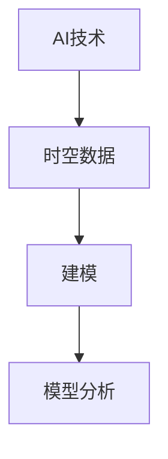

**核心算法原理讲解**

AI时空建模的基本原理包括以下几个步骤：

1. **数据收集**：收集包含时间和空间维度的数据。
2. **数据预处理**：对数据进行清洗、归一化等处理，以适应模型训练。
3. **模型选择**：选择适合时空数据的机器学习算法，如神经网络、深度学习模型等。
4. **模型训练**：使用历史数据进行模型训练，调整模型参数。
5. **模型评估**：通过交叉验证等方法评估模型性能。
6. **模型应用**：将训练好的模型应用于实际场景中，进行预测和分析。

**数学模型和公式**

$$
f(\mathbf{x}, t) = \mathbf{h}(\mathbf{x}, t)
$$

- **$\mathbf{x}$**：时空数据向量。
- **$t$**：时间维度。
- **$f(\mathbf{x}, t)$**：模型预测的时空状态。
- **$\mathbf{h}(\mathbf{x}, t)$**：时空嵌入函数。

**举例说明**

假设我们有一组交通流量数据，包括时间和对应的交通流量值。通过AI时空建模，我们可以预测未来某个时间点的交通流量。具体步骤如下：

1. **数据收集**：收集一段时间内的交通流量数据。
2. **数据预处理**：对数据进行归一化处理。
3. **模型选择**：选择一个循环神经网络（RNN）模型。
4. **模型训练**：使用历史数据进行训练，调整模型参数。
5. **模型评估**：通过交叉验证评估模型性能。
6. **模型应用**：预测未来某个时间点的交通流量。

通过这种方式，AI时空建模可以帮助交通管理部门优化交通信号控制、预测交通拥堵，从而提高交通效率。

#### 1.2 时空数据的特点与应用场景

时空数据具有多维度、动态性、连续性和时效性的特点。这些特点使得时空数据在多个领域都有广泛的应用。

**核心算法原理讲解**

- **多维度**：时空数据通常包含时间、位置、速度等多维信息。
- **动态性**：时空数据随时间变化，表现出动态特性。
- **连续性**：时空数据在时间和空间上通常是连续的。
- **时效性**：时空数据的有效性随时间变化，需要实时更新。

**应用场景**

- **智能交通**：通过时空建模预测交通流量，优化交通信号控制。
- **气象预测**：利用时空数据预测天气变化，提前预警极端天气。
- **城市规划**：分析时空数据，优化城市基础设施布局。
- **环境监测**：监测时空数据，评估环境污染程度，制定环保措施。

**数学模型和公式**

时空数据的表示可以通过以下公式实现：

$$
\mathbf{x}(t) = \begin{pmatrix}
x_1(t) \\
x_2(t) \\
\vdots \\
x_n(t)
\end{pmatrix}
$$

- **$\mathbf{x}(t)$**：时空数据向量。
- **$x_i(t)$**：第i维时空数据。

**举例说明**

在智能交通领域，时空数据可以用于以下应用：

1. **交通流量预测**：通过分析历史交通流量数据，预测未来某一时间点的交通流量。
2. **路况分析**：利用时空数据监测道路拥堵情况，提供最佳路线推荐。

这些应用可以帮助交通管理部门提高交通管理效率，减少交通拥堵。

#### 1.3 AI时空建模的发展历程

AI时空建模的发展历程可以追溯到20世纪90年代，当时研究人员开始探索如何将人工智能技术应用于时空数据分析。近年来，随着深度学习和大数据技术的发展，AI时空建模取得了显著进展。

**核心算法原理讲解**

- **早期研究**：主要基于规则的方法和简单的统计方法。
- **近年发展**：深度学习、图神经网络等技术在时空建模中的应用。

**应用实例**

1. **智能交通**：利用深度学习模型预测交通流量，优化交通信号控制。
2. **气象预测**：使用循环神经网络（RNN）和卷积神经网络（CNN）预测天气变化。
3. **城市规划**：利用时空数据优化城市基础设施布局，提高城市宜居性。

**数学模型和公式**

AI时空建模的发展可以概括为以下步骤：

1. **数据收集**：收集时空数据。
2. **数据预处理**：清洗、归一化等处理。
3. **模型选择**：选择合适的机器学习算法。
4. **模型训练**：使用历史数据进行训练。
5. **模型评估**：通过交叉验证等方法评估模型性能。
6. **模型应用**：应用于实际场景，进行预测和分析。

通过这些步骤，AI时空建模可以解决现实世界中的各种时空问题。

### 第2章：时空数据表示

时空数据表示是AI时空建模的基础，它涉及到如何有效地组织和展示包含时间和空间维度的数据。正确的时空数据表示方法能够帮助我们更好地理解数据特性，从而为后续的建模和分析提供支持。

#### 2.1 时空数据的基本结构

时空数据的基本结构通常包括时间维度、位置维度以及其他相关的属性。这些维度的组合决定了时空数据的多维特性。

**核心概念与联系**

- **时间维度**：表示数据的时序特性，如日期、时间戳等。
- **位置维度**：表示数据的空间位置，如经纬度、地理位置等。
- **属性维度**：其他与时间和位置相关的属性，如速度、温度、湿度等。

**Mermaid流程图**

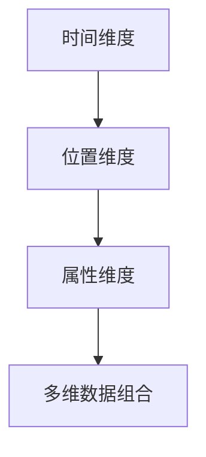

**核心算法原理讲解**

时空数据的基本结构可以通过以下方式表示：

- **时间序列**：以时间为序排列的数据点，如交通流量随时间的变化。
- **空间网格**：将空间划分为网格，每个网格表示特定的空间区域。
- **时空矩阵**：将时间和空间维度组合在一起，形成多维矩阵。

**数学模型和公式**

时空数据的基本结构可以用以下数学模型表示：

$$
X = \begin{bmatrix}
x_{11} & x_{12} & \cdots & x_{1n} \\
x_{21} & x_{22} & \cdots & x_{2n} \\
\vdots & \vdots & \ddots & \vdots \\
x_{m1} & x_{m2} & \cdots & x_{mn}
\end{bmatrix}
$$

- **$X$**：时空数据矩阵。
- **$x_{ij}$**：第i个位置在第j个时间点的数据值。

**举例说明**

假设我们有一组交通流量数据，包含时间、位置和流量三个维度。这组数据可以表示为一个时空矩阵，其中每个元素表示一个特定位置在特定时间点的流量。

1. **时间维度**：2019-01-01 00:00:00, 2019-01-01 01:00:00, ..., 2019-01-01 23:00:00
2. **位置维度**：北京东直门，北京西直门，北京朝阳门，...
3. **属性维度**：流量（辆/小时）

时空矩阵示例：

$$
X = \begin{bmatrix}
100 & 120 & 150 & 80 \\
80 & 100 & 130 & 90 \\
\vdots & \vdots & \vdots & \vdots \\
70 & 100 & 140 & 110
\end{bmatrix}
$$

在这个例子中，每个元素表示在特定位置和时间点的交通流量。

#### 2.2 时空数据可视化方法

时空数据的可视化方法可以帮助我们直观地理解数据的分布和变化。常见的时空数据可视化方法包括时空图、热力图、时间序列图等。

**核心算法原理讲解**

- **时空图**：将时间和空间维度以图形的形式展示，通常用于交通流量、城市环境等数据的可视化。
- **热力图**：用颜色强度表示数据的热度，通常用于天气、交通流量等数据的可视化。
- **时间序列图**：用线条或柱状图表示随时间变化的数据，通常用于气象预测、股票分析等数据的可视化。

**可视化示例**

1. **时空图**：展示一段时间内不同位置的交通流量分布。

```mermaid
gantt
    dateFormat  YYYY-MM-DD
    title 时空图示例
    A1[时间维度] :start>=2019-01-01,  end>=2019-01-02
    B1[北京东直门] :start>=A1,  duration=24h
    B2[北京西直门] :start>=A1,  duration=24h
    B3[北京朝阳门] :start>=A1,  duration=24h
```

2. **热力图**：展示某一时刻不同位置的气温分布。

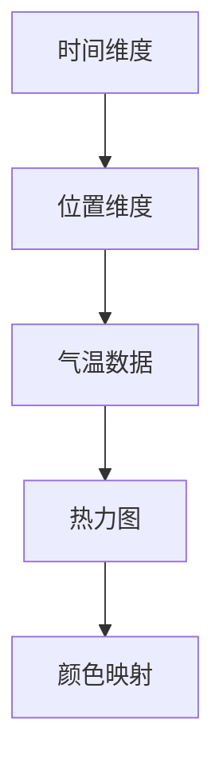

3. **时间序列图**：展示一段时间内温度的变化。

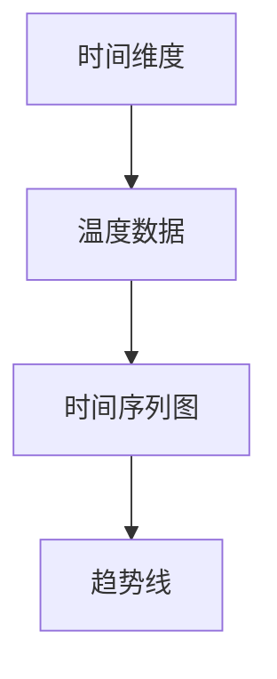

这些可视化方法能够帮助我们更好地理解和分析时空数据，从而为后续的建模提供依据。

#### 2.3 时空数据的预处理

时空数据的预处理是数据建模的重要步骤，它涉及到数据清洗、归一化、数据增强等操作。正确的预处理方法能够提高模型的性能和泛化能力。

**核心算法原理讲解**

- **数据清洗**：去除数据中的噪声和异常值，保证数据的准确性和一致性。
- **归一化**：将不同维度和量级的数据转换到同一尺度，便于模型训练。
- **数据增强**：通过数据扩充、变换等方法增加训练数据集的多样性。

**预处理步骤**

1. **数据清洗**：去除缺失值、重复值和异常值。
2. **归一化**：使用标准差归一化、最小-最大归一化等方法进行数据归一化。
3. **数据增强**：通过数据变换、合成等方法增加训练数据集的多样性。

**数学模型和公式**

- **归一化**：

$$
x_{\text{norm}} = \frac{x - \mu}{\sigma}
$$

- **标准差归一化**：

$$
x_{\text{norm}} = \frac{x - \bar{x}}{s}
$$

- **数据增强**：

$$
x_{\text{aug}} = f(x)
$$

其中，$x$表示原始数据，$x_{\text{norm}}$表示归一化后的数据，$x_{\text{aug}}$表示增强后的数据，$f(x)$表示数据增强函数。

**举例说明**

假设我们有一组交通流量数据，包括时间、位置和流量三个维度。对这组数据预处理的具体步骤如下：

1. **数据清洗**：去除缺失值和异常值。
2. **归一化**：对时间、位置和流量三个维度分别进行归一化。
3. **数据增强**：通过时间变换、位置变换等方法增加训练数据集的多样性。

通过这些预处理步骤，我们可以得到更干净、一致和多样化的训练数据，从而提高模型的性能。

### 第3章：时空数据建模方法

时空数据建模是AI时空建模的核心步骤，它涉及到如何构建数学模型以分析和预测时空数据。本章将介绍几种常见的时空数据建模方法，包括时空数据分析方法、时空数据聚合方法和时空数据预测方法。

#### 3.1 时空数据分析方法

时空数据分析方法用于提取时空数据的特征和模式，为后续的建模和预测提供支持。以下是一些常见的时空数据分析方法：

**核心算法原理讲解**

- **描述性统计分析**：计算数据的均值、方差、相关性等基本统计量。
- **聚类分析**：将时空数据分为多个类别，以揭示数据中的聚类结构。
- **关联规则挖掘**：发现数据中的频繁模式和关联关系。

**描述性统计分析**

描述性统计分析是一种简单但有效的数据分析方法，用于提取数据的基本特征。以下是一些常用的描述性统计量：

- **均值**：数据集的平均值。
- **方差**：数据集的离散程度。
- **标准差**：方差的平方根，表示数据的波动性。
- **最大值和最小值**：数据集的最大值和最小值。
- **中位数和众数**：数据集的中间值和出现次数最多的值。

**数学模型和公式**

- **均值**：

$$
\bar{x} = \frac{1}{n} \sum_{i=1}^{n} x_i
$$

- **方差**：

$$
\sigma^2 = \frac{1}{n} \sum_{i=1}^{n} (x_i - \bar{x})^2
$$

- **标准差**：

$$
\sigma = \sqrt{\sigma^2}
$$

**举例说明**

假设我们有一组交通流量数据，包括每天的流量值。通过描述性统计分析，我们可以计算这组数据的均值、方差和标准差。

1. **计算均值**：

$$
\bar{x} = \frac{1}{n} \sum_{i=1}^{n} x_i
$$

2. **计算方差**：

$$
\sigma^2 = \frac{1}{n} \sum_{i=1}^{n} (x_i - \bar{x})^2
$$

3. **计算标准差**：

$$
\sigma = \sqrt{\sigma^2}
$$

通过这些统计量，我们可以了解交通流量的基本特征，例如平均值表示每天的平均流量，方差和标准差表示流量的波动性。

**聚类分析**

聚类分析是一种无监督学习方法，用于将时空数据分为多个类别。以下是一些常见的聚类算法：

- **K均值聚类**：基于距离度量，将数据分为K个聚类。
- **层次聚类**：基于层次结构，逐步合并或分裂聚类。
- **基于密度的聚类**：基于数据点的密度，形成聚类。

**数学模型和公式**

- **K均值聚类**：

$$
\text{找到聚类中心} \mu_k = \frac{1}{n_k} \sum_{i=1}^{n} x_i
$$

$$
\text{分配数据点} x_i \text{到最近的聚类中心} \mu_k
$$

$$
\text{更新聚类中心} \mu_k = \frac{1}{n_k} \sum_{i=1}^{n} x_i
$$

- **层次聚类**：

$$
\text{初始化} \{C_1, C_2, \ldots, C_n\}
$$

$$
\text{合并最相似的聚类} C_i \text{和} C_j
$$

$$
\text{分裂最紧密的聚类} C_i
$$

**举例说明**

假设我们有一组交通流量数据，将其分为两个聚类。通过K均值聚类，我们可以计算每个聚类的中心点，并分配每个数据点到最近的聚类中心。

1. **初始化聚类中心**：

$$
\mu_1 = (x_{11}, x_{12}, \ldots, x_{1n}), \mu_2 = (x_{21}, x_{22}, \ldots, x_{2n})
$$

2. **分配数据点**：

$$
x_i \text{分配到最近的聚类中心} \mu_k
$$

3. **更新聚类中心**：

$$
\mu_1 = \frac{1}{n_1} \sum_{i=1}^{n} x_i, \mu_2 = \frac{1}{n_2} \sum_{i=1}^{n} x_i
$$

通过这些步骤，我们可以将交通流量数据分为两个聚类，每个聚类代表不同时间段或区域的流量特征。

**关联规则挖掘**

关联规则挖掘是一种用于发现数据中频繁模式和关联关系的方法。以下是一些常见的关联规则挖掘算法：

- **Apriori算法**：基于支持度和置信度，发现频繁项集和关联规则。
- **FP-Growth算法**：基于频繁模式树，高效地发现频繁项集和关联规则。

**数学模型和公式**

- **支持度**：

$$
s(x, y) = \frac{\text{包含} x \text{和} y \text{的项集数量}}{\text{总的项集数量}}
$$

- **置信度**：

$$
c(x \rightarrow y) = \frac{s(x \cup y)}{s(x)}
$$

**举例说明**

假设我们有一组交易数据，包含不同的商品。通过Apriori算法，我们可以发现哪些商品经常一起购买，从而为商店的营销策略提供依据。

1. **计算支持度**：

$$
s(x, y) = \frac{\text{包含} x \text{和} y \text{的项集数量}}{\text{总的项集数量}}
$$

2. **计算置信度**：

$$
c(x \rightarrow y) = \frac{s(x \cup y)}{s(x)}
$$

通过这些计算，我们可以发现哪些商品之间的关联性最强，从而制定相关的营销策略。

#### 3.2 时空数据聚合方法

时空数据聚合方法用于将多个时空数据点合并为一个聚合结果，以减少数据的冗余和提高计算效率。以下是一些常见的时空数据聚合方法：

**核心算法原理讲解**

- **空间聚合**：对空间区域内的数据进行合并，如计算区域内交通流量的总和。
- **时间聚合**：对时间序列数据进行合并，如计算一天内交通流量的平均值。

**空间聚合**

空间聚合通常用于计算空间区域内数据的相关统计量，如平均值、最大值、最小值等。以下是一些常用的空间聚合方法：

- **平均值**：计算区域内所有数据点的平均值。
- **最大值**：计算区域内所有数据点的最大值。
- **最小值**：计算区域内所有数据点的最小值。
- **总和**：计算区域内所有数据点的总和。

**数学模型和公式**

- **平均值**：

$$
\bar{x} = \frac{1}{n} \sum_{i=1}^{n} x_i
$$

- **最大值**：

$$
\max(x_1, x_2, \ldots, x_n)
$$

- **最小值**：

$$
\min(x_1, x_2, \ldots, x_n)
$$

- **总和**：

$$
\sum_{i=1}^{n} x_i
$$

**举例说明**

假设我们有一组交通流量数据，包含不同位置的数据点。通过空间聚合，我们可以计算每个区域内交通流量的平均值。

1. **计算平均值**：

$$
\bar{x} = \frac{1}{n} \sum_{i=1}^{n} x_i
$$

2. **计算最大值**：

$$
\max(x_1, x_2, \ldots, x_n)
$$

3. **计算最小值**：

$$
\min(x_1, x_2, \ldots, x_n)
$$

4. **计算总和**：

$$
\sum_{i=1}^{n} x_i
$$

通过这些计算，我们可以得到每个区域内交通流量的基本统计量，从而为后续的建模提供依据。

**时间聚合**

时间聚合通常用于计算时间序列数据的相关统计量，如平均值、最大值、最小值等。以下是一些常用的时间聚合方法：

- **平均值**：计算一段时间内的平均值。
- **最大值**：计算一段时间内的最大值。
- **最小值**：计算一段时间内的最小值。
- **总和**：计算一段时间内的总和。

**数学模型和公式**

- **平均值**：

$$
\bar{x}(t) = \frac{1}{n} \sum_{i=1}^{n} x_i(t)
$$

- **最大值**：

$$
\max(x_1(t), x_2(t), \ldots, x_n(t))
$$

- **最小值**：

$$
\min(x_1(t), x_2(t), \ldots, x_n(t))
$$

- **总和**：

$$
\sum_{i=1}^{n} x_i(t)
$$

**举例说明**

假设我们有一组交通流量数据，包含每天的交通流量。通过时间聚合，我们可以计算每天的平均交通流量。

1. **计算平均值**：

$$
\bar{x}(t) = \frac{1}{n} \sum_{i=1}^{n} x_i(t)
$$

2. **计算最大值**：

$$
\max(x_1(t), x_2(t), \ldots, x_n(t))
$$

3. **计算最小值**：

$$
\min(x_1(t), x_2(t), \ldots, x_n(t))
$$

4. **计算总和**：

$$
\sum_{i=1}^{n} x_i(t)
$$

通过这些计算，我们可以得到每天的交通流量特征，从而为交通管理提供依据。

#### 3.3 时空数据预测方法

时空数据预测方法用于预测未来的时空数据值，以便为决策提供支持。以下是一些常见的时空数据预测方法：

**核心算法原理讲解**

- **回归模型**：通过建立回归模型预测未来的时空数据值。
- **循环神经网络（RNN）**：通过时间序列分析预测未来的时空数据值。
- **卷积神经网络（CNN）**：通过空间特征提取预测未来的时空数据值。

**回归模型**

回归模型是一种常见的预测方法，用于预测连续的时空数据值。以下是一些常用的回归模型：

- **线性回归**：通过线性关系预测未来的时空数据值。
- **多项式回归**：通过多项式关系预测未来的时空数据值。
- **非线性回归**：通过非线性关系预测未来的时空数据值。

**数学模型和公式**

- **线性回归**：

$$
y = \beta_0 + \beta_1 x
$$

- **多项式回归**：

$$
y = \beta_0 + \beta_1 x + \beta_2 x^2 + \ldots + \beta_n x^n
$$

- **非线性回归**：

$$
y = \beta_0 + \beta_1 \cdot f(x)
$$

其中，$y$表示预测值，$x$表示输入特征，$\beta_0, \beta_1, \ldots, \beta_n$表示模型参数。

**举例说明**

假设我们有一组交通流量数据，使用线性回归模型预测未来某个时间点的交通流量。具体步骤如下：

1. **数据收集**：收集历史交通流量数据。
2. **数据预处理**：对数据进行归一化处理。
3. **模型选择**：选择线性回归模型。
4. **模型训练**：使用历史数据进行训练，调整模型参数。
5. **模型评估**：通过交叉验证评估模型性能。
6. **模型应用**：使用训练好的模型预测未来交通流量。

通过这种方式，我们可以预测未来某个时间点的交通流量，从而为交通管理提供依据。

**循环神经网络（RNN）**

循环神经网络（RNN）是一种适用于时间序列数据预测的神经网络模型。以下是一些常见的RNN模型：

- **简单的RNN**：通过循环结构将前一时间步的输出反馈到当前时间步。
- **长短时记忆网络（LSTM）**：通过门控机制解决简单RNN的长期依赖问题。
- **门控循环单元（GRU）**：通过门控机制简化LSTM结构。

**数学模型和公式**

- **简单的RNN**：

$$
h_t = \sigma(W_h h_{t-1} + W_x x_t + b)
$$

- **长短时记忆网络（LSTM）**：

$$
i_t = \sigma(W_i h_{t-1} + W_x x_t + b_i) \\
f_t = \sigma(W_f h_{t-1} + W_x x_t + b_f) \\
o_t = \sigma(W_o h_{t-1} + W_x x_t + b_o) \\
c_t = f_t \odot c_{t-1} + i_t \odot \sigma(W_c h_{t-1} + W_x x_t + b_c) \\
h_t = o_t \odot \sigma(c_t)
$$

- **门控循环单元（GRU）**：

$$
z_t = \sigma(W_z h_{t-1} + W_x x_t + b_z) \\
r_t = \sigma(W_r h_{t-1} + W_x x_t + b_r) \\
h_t = \text{tanh}(W_h (r_t \odot h_{t-1} + (1 - z_t) \odot x_t) + b_h) \\
z_t = \sigma(W_z h_{t-1} + W_x x_t + b_z) \\
h_t' = z_t \odot h_t + (1 - z_t) \odot h_{t-1}
$$

其中，$h_t$表示当前时间步的隐藏状态，$x_t$表示当前时间步的输入，$c_t$表示当前时间步的细胞状态，$i_t, f_t, o_t$表示输入门、遗忘门和输出门，$r_t$表示重置门。

**举例说明**

假设我们有一组交通流量数据，使用LSTM模型预测未来某个时间点的交通流量。具体步骤如下：

1. **数据收集**：收集历史交通流量数据。
2. **数据预处理**：对数据进行归一化处理。
3. **模型选择**：选择LSTM模型。
4. **模型训练**：使用历史数据进行训练，调整模型参数。
5. **模型评估**：通过交叉验证评估模型性能。
6. **模型应用**：使用训练好的模型预测未来交通流量。

通过这种方式，我们可以预测未来某个时间点的交通流量，从而为交通管理提供依据。

**卷积神经网络（CNN）**

卷积神经网络（CNN）是一种适用于空间特征提取的神经网络模型。以下是一些常见的CNN模型：

- **简单的卷积神经网络**：通过卷积操作提取空间特征。
- **残差卷积神经网络（ResNet）**：通过残差连接提高模型性能。
- **注意力机制卷积神经网络（Attention CNN）**：通过注意力机制提高模型对关键特征的识别能力。

**数学模型和公式**

- **简单的卷积神经网络**：

$$
h_t = \sigma(W_h h_{t-1} + W_x x_t + b)
$$

- **残差卷积神经网络（ResNet）**：

$$
h_t = \sigma(W_h h_{t-1} + W_x x_t + b) + h_{t-1}
$$

- **注意力机制卷积神经网络（Attention CNN）**：

$$
h_t = \text{Attention}(W_a h_{t-1} + W_x x_t + b_a) \odot h_{t-1}
$$

其中，$h_t$表示当前时间步的隐藏状态，$x_t$表示当前时间步的输入，$W_h, W_x, b$表示权重和偏置，$\text{Attention}$表示注意力机制。

**举例说明**

假设我们有一组交通流量数据，使用ResNet模型预测未来某个时间点的交通流量。具体步骤如下：

1. **数据收集**：收集历史交通流量数据。
2. **数据预处理**：对数据进行归一化处理。
3. **模型选择**：选择ResNet模型。
4. **模型训练**：使用历史数据进行训练，调整模型参数。
5. **模型评估**：通过交叉验证评估模型性能。
6. **模型应用**：使用训练好的模型预测未来交通流量。

通过这种方式，我们可以预测未来某个时间点的交通流量，从而为交通管理提供依据。

### 第4章：时空嵌入技术

时空嵌入技术是一种将高维时空数据映射到低维空间的方法，旨在保持时空数据的结构信息。时空嵌入技术在多个领域，如推荐系统、交通流量预测、城市规划等，都有广泛应用。本章将介绍时空嵌入技术的概念、原理和应用。

#### 4.1 时空嵌入的概念与原理

时空嵌入技术将高维的时空数据映射到低维空间，使得数据在新的空间中保持其原有的结构信息。这种嵌入方法使得数据处理和分析变得更加高效，同时也能够降低计算复杂度。

**核心概念与联系**

- **时空数据**：包含时间和空间维度的数据。
- **嵌入空间**：低维空间，用于表示时空数据。
- **嵌入向量**：低维空间中的向量，用于表示原始时空数据。

**Mermaid流程图**

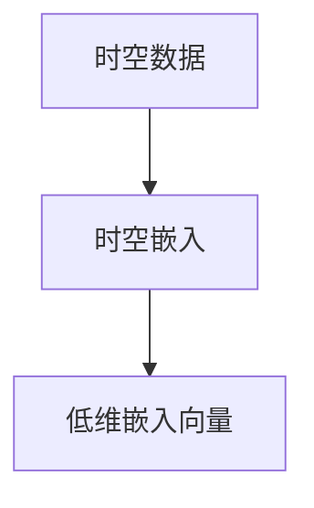

**核心算法原理讲解**

时空嵌入技术的核心思想是通过映射函数将高维时空数据映射到低维空间，使得低维空间中的嵌入向量能够保留时空数据的重要结构信息。以下是时空嵌入的基本步骤：

1. **数据收集**：收集包含时间和空间维度的时空数据。
2. **数据预处理**：对时空数据进行清洗、归一化等处理。
3. **嵌入模型选择**：选择合适的嵌入模型，如基于距离的嵌入、基于线性模型的嵌入等。
4. **模型训练**：使用历史时空数据训练嵌入模型。
5. **嵌入**：将时空数据映射到低维空间，生成嵌入向量。
6. **嵌入向量分析**：对生成的嵌入向量进行分析，提取时空数据的结构信息。

**数学模型和公式**

时空嵌入的基本公式如下：

$$
\mathbf{z} = f(\mathbf{x}, \mathbf{W})
$$

- **$\mathbf{z}$**：低维嵌入向量。
- **$\mathbf{x}$**：高维时空数据。
- **$\mathbf{W}$**：权重矩阵。

**举例说明**

假设我们有一组交通流量数据，包括时间和对应的流量值。通过时空嵌入技术，我们可以将这些高维数据映射到低维空间，以便于后续的分析和处理。

1. **数据收集**：收集历史交通流量数据。
2. **数据预处理**：对数据进行清洗、归一化等处理。
3. **模型选择**：选择一个基于线性模型的嵌入模型。
4. **模型训练**：使用历史数据进行训练，调整模型参数。
5. **嵌入**：将交通流量数据映射到低维空间，生成嵌入向量。
6. **嵌入向量分析**：对嵌入向量进行分析，提取交通流量的分布特征。

通过这种方式，我们可以将高维的交通流量数据转换为低维的嵌入向量，从而提高数据处理和分析的效率。

#### 4.2 时空嵌入模型的类型

时空嵌入模型可以分为基于距离的嵌入、基于线性模型的嵌入和基于非线性模型的嵌入等不同类型。每种模型都有其独特的原理和应用场景。

**核心算法原理讲解**

- **基于距离的嵌入**：通过计算时空数据之间的距离来生成嵌入向量。常见的距离度量方法包括欧几里得距离、余弦相似度等。
- **基于线性模型的嵌入**：使用线性模型将高维时空数据映射到低维空间。常见的线性模型包括线性回归、线性判别分析等。
- **基于非线性模型的嵌入**：使用非线性模型将高维时空数据映射到低维空间。常见的非线性模型包括神经网络、深度学习模型等。

**基于距离的嵌入**

基于距离的嵌入通过计算时空数据之间的距离来生成嵌入向量。以下是一些常用的距离度量方法：

- **欧几里得距离**：

$$
d(\mathbf{x}, \mathbf{y}) = \sqrt{\sum_{i=1}^{n} (x_i - y_i)^2}
$$

- **余弦相似度**：

$$
\text{sim}(\mathbf{x}, \mathbf{y}) = \frac{\mathbf{x} \cdot \mathbf{y}}{\|\mathbf{x}\| \|\mathbf{y}\|}
$$

其中，$\mathbf{x}$和$\mathbf{y}$是时空数据向量，$d(\mathbf{x}, \mathbf{y})$表示欧几里得距离，$\text{sim}(\mathbf{x}, \mathbf{y})$表示余弦相似度。

**举例说明**

假设我们有两组交通流量数据$\mathbf{x}$和$\mathbf{y}$，使用欧几里得距离计算它们之间的距离。

$$
d(\mathbf{x}, \mathbf{y}) = \sqrt{\sum_{i=1}^{n} (x_i - y_i)^2}
$$

通过这种方式，我们可以计算两组数据之间的距离，从而为后续的分析提供依据。

**基于线性模型的嵌入**

基于线性模型的嵌入使用线性模型将高维时空数据映射到低维空间。以下是一个简单的线性嵌入模型：

$$
\mathbf{z} = \mathbf{W} \mathbf{x} + \mathbf{b}
$$

- **$\mathbf{z}$**：低维嵌入向量。
- **$\mathbf{W}$**：权重矩阵。
- **$\mathbf{x}$**：高维时空数据。
- **$\mathbf{b}$**：偏置向量。

**举例说明**

假设我们有一组交通流量数据$\mathbf{x}$，使用线性嵌入模型将其映射到低维空间。

$$
\mathbf{z} = \mathbf{W} \mathbf{x} + \mathbf{b}
$$

通过这种方式，我们可以将高维的交通流量数据转换为低维的嵌入向量，从而提高数据处理和分析的效率。

**基于非线性模型的嵌入**

基于非线性模型的嵌入使用非线性模型将高维时空数据映射到低维空间。以下是一个简单的非线性嵌入模型：

$$
\mathbf{z} = \sigma(\mathbf{W} \mathbf{x} + \mathbf{b})
$$

- **$\mathbf{z}$**：低维嵌入向量。
- **$\sigma$**：非线性激活函数，如Sigmoid函数、ReLU函数等。
- **$\mathbf{W}$**：权重矩阵。
- **$\mathbf{x}$**：高维时空数据。
- **$\mathbf{b}$**：偏置向量。

**举例说明**

假设我们有一组交通流量数据$\mathbf{x}$，使用ReLU函数作为非线性激活函数的嵌入模型。

$$
\mathbf{z} = \sigma(\mathbf{W} \mathbf{x} + \mathbf{b}) = \max(0, \mathbf{W} \mathbf{x} + \mathbf{b})
$$

通过这种方式，我们可以将高维的交通流量数据转换为低维的嵌入向量，从而提高数据处理和分析的效率。

#### 4.3 时空嵌入模型的实现与优化

实现和优化时空嵌入模型是时空嵌入技术的重要环节。以下介绍几种常见的时空嵌入模型实现方法和优化技巧。

**核心算法原理讲解**

- **实现方法**：包括数据预处理、模型选择、模型训练和嵌入向量生成等步骤。
- **优化技巧**：包括模型参数调整、数据增强、模型融合等。

**实现方法**

1. **数据预处理**：对时空数据进行清洗、归一化等处理，以提高模型的鲁棒性。
2. **模型选择**：选择合适的时空嵌入模型，如基于距离的嵌入、基于线性模型的嵌入或基于非线性模型的嵌入。
3. **模型训练**：使用历史时空数据训练嵌入模型，调整模型参数。
4. **嵌入向量生成**：将训练好的模型应用于新的时空数据，生成嵌入向量。

**优化技巧**

1. **模型参数调整**：通过调整模型参数，如权重矩阵和偏置向量，提高模型的性能和泛化能力。
2. **数据增强**：通过数据扩充、变换等方法增加训练数据集的多样性，以提高模型的鲁棒性。
3. **模型融合**：将多个嵌入模型的结果进行融合，以提高嵌入向量的质量和稳定性。

**举例说明**

假设我们有一组交通流量数据，使用基于线性模型的嵌入技术实现时空嵌入。

1. **数据预处理**：对交通流量数据进行清洗、归一化处理。
2. **模型选择**：选择一个基于线性模型的嵌入模型。
3. **模型训练**：使用历史数据进行训练，调整模型参数。
4. **嵌入向量生成**：将训练好的模型应用于新的交通流量数据，生成嵌入向量。

通过这种方式，我们可以将交通流量数据映射到低维空间，从而提高数据处理和分析的效率。

### 第5章：时空神经网络

时空神经网络（Spacetime Neural Networks，STNN）是一种结合时空数据和深度学习技术的神经网络模型，用于处理和分析包含时间和空间维度的数据。时空神经网络通过构建时空嵌入和时空交互机制，能够有效捕捉时空数据的动态特性和空间相关性。本章将介绍时空神经网络的基本结构、常见模型和训练与优化方法。

#### 5.1 时空神经网络的基本结构

时空神经网络的基本结构通常包含输入层、时空嵌入层、时空交互层和输出层。以下是时空神经网络的基本组成部分：

**核心概念与联系**

- **输入层**：接收时空数据，包括时间和空间维度。
- **时空嵌入层**：将高维时空数据映射到低维空间，提取时空特征。
- **时空交互层**：通过时空交互机制捕捉时空数据之间的关联性。
- **输出层**：生成时空预测结果。

**Mermaid流程图**

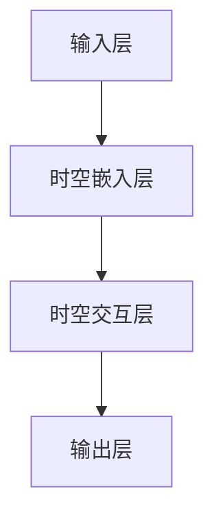

**核心算法原理讲解**

时空神经网络的基本工作流程如下：

1. **输入数据**：时空神经网络接收包含时间和空间维度的数据。
2. **时空嵌入**：通过时空嵌入层将高维时空数据映射到低维空间，提取时空特征。
3. **时空交互**：通过时空交互层捕捉时空数据之间的关联性，如时间依赖性和空间相关性。
4. **输出预测**：将处理后的数据传递到输出层，生成时空预测结果。

**数学模型和公式**

时空神经网络的基本数学模型可以表示为：

$$
\mathbf{h}_t = f(\mathbf{x}_t, \mathbf{h}_{t-1}, \mathbf{W})
$$

其中，$\mathbf{h}_t$表示第t个时间步的隐藏状态，$\mathbf{x}_t$表示第t个时间步的输入数据，$\mathbf{W}$表示模型权重参数，$f$表示时空交互函数。

**举例说明**

假设我们有一组交通流量数据，使用时空神经网络进行流量预测。具体步骤如下：

1. **输入数据**：将交通流量数据输入到时空神经网络。
2. **时空嵌入**：通过时空嵌入层将交通流量数据映射到低维空间，提取时空特征。
3. **时空交互**：通过时空交互层捕捉交通流量数据之间的关联性。
4. **输出预测**：将处理后的数据传递到输出层，生成未来某个时间点的交通流量预测结果。

通过这种方式，时空神经网络能够有效地预测交通流量，为交通管理提供决策支持。

#### 5.2 常见的时空神经网络模型

时空神经网络模型种类繁多，每种模型都有其独特的结构和应用场景。以下是几种常见的时空神经网络模型：

**核心算法原理讲解**

- **时空卷积神经网络（ST-CNN）**：结合时空卷积和全连接层，用于时空特征提取和预测。
- **循环神经网络（RNN）**：适用于时间序列数据，通过循环结构捕捉时间依赖性。
- **长短时记忆网络（LSTM）**：扩展RNN，通过门控机制解决长期依赖问题。
- **门控循环单元（GRU）**：简化LSTM结构，提高计算效率。

**时空卷积神经网络（ST-CNN）**

时空卷积神经网络结合了时空卷积和卷积神经网络（CNN）的结构，能够有效地提取时空特征。以下是其基本结构：

**核心概念与联系**

- **时空卷积层**：通过时空卷积操作提取时空特征。
- **全连接层**：对提取的特征进行分类和预测。

**Mermaid流程图**

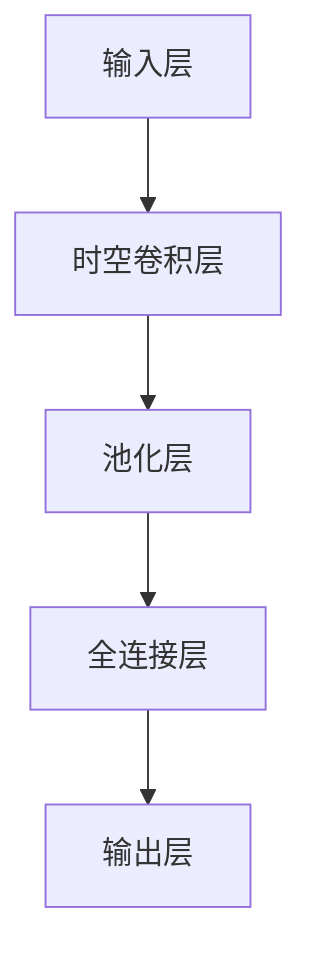

**数学模型和公式**

时空卷积神经网络的基本数学模型可以表示为：

$$
\mathbf{h}_t = \text{ReLU}(\mathbf{W}_{\text{conv}} \ast \mathbf{x}_t + \mathbf{b}_{\text{conv}})
$$

$$
\mathbf{y} = \mathbf{W}_{\text{fc}} \mathbf{h}_T + \mathbf{b}_{\text{fc}}
$$

其中，$\mathbf{h}_t$表示第t个时间步的隐藏状态，$\mathbf{x}_t$表示第t个时间步的输入数据，$\mathbf{W}_{\text{conv}}$和$\mathbf{b}_{\text{conv}}$表示时空卷积层的权重和偏置，$\mathbf{W}_{\text{fc}}$和$\mathbf{b}_{\text{fc}}$表示全连接层的权重和偏置，$\ast$表示卷积操作，$\text{ReLU}$表示ReLU激活函数。

**举例说明**

假设我们有一组交通流量数据，使用时空卷积神经网络进行流量预测。具体步骤如下：

1. **输入数据**：将交通流量数据输入到时空卷积神经网络。
2. **时空卷积**：通过时空卷积层提取时空特征。
3. **池化**：使用池化层对特征进行降维。
4. **全连接层**：对提取的特征进行分类和预测。
5. **输出预测**：生成未来某个时间点的交通流量预测结果。

通过这种方式，时空卷积神经网络能够有效地提取时空特征并进行流量预测。

**循环神经网络（RNN）**

循环神经网络（RNN）是一种适用于时间序列数据的神经网络模型，通过循环结构捕捉时间依赖性。以下是其基本结构：

**核心概念与联系**

- **隐藏层**：通过循环结构将前一时间步的输出反馈到当前时间步。
- **输入门、遗忘门和输出门**：用于控制信息的输入、遗忘和输出。

**Mermaid流程图**

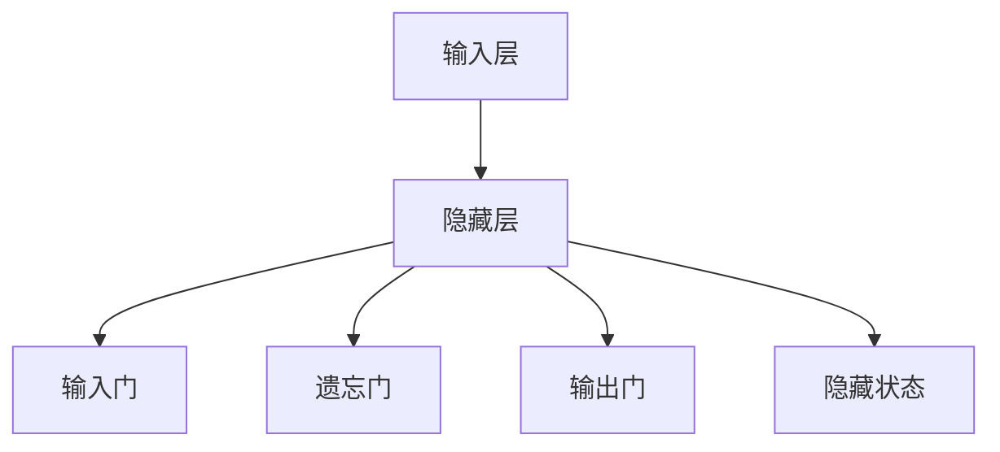

**数学模型和公式**

循环神经网络的基本数学模型可以表示为：

$$
\mathbf{h}_t = \text{ReLU}(\mathbf{W}_h \mathbf{h}_{t-1} + \mathbf{W}_x \mathbf{x}_t + \mathbf{b}_h)
$$

$$
\mathbf{o}_t = \text{softmax}(\mathbf{W}_o \mathbf{h}_t + \mathbf{b}_o)
$$

其中，$\mathbf{h}_t$表示第t个时间步的隐藏状态，$\mathbf{x}_t$表示第t个时间步的输入数据，$\mathbf{W}_h, \mathbf{W}_x, \mathbf{b}_h, \mathbf{W}_o, \mathbf{b}_o$分别表示权重和偏置，$\text{ReLU}$表示ReLU激活函数，$\text{softmax}$表示softmax激活函数。

**举例说明**

假设我们有一组交通流量数据，使用循环神经网络进行流量预测。具体步骤如下：

1. **输入数据**：将交通流量数据输入到循环神经网络。
2. **隐藏层**：通过循环结构将前一时间步的输出反馈到当前时间步。
3. **输入门、遗忘门和输出门**：控制信息的输入、遗忘和输出。
4. **输出预测**：生成未来某个时间点的交通流量预测结果。

通过这种方式，循环神经网络能够有效地捕捉交通流量的时间依赖性，并进行流量预测。

**长短时记忆网络（LSTM）**

长短时记忆网络（LSTM）是循环神经网络的扩展，通过门控机制解决长期依赖问题。以下是其基本结构：

**核心概念与联系**

- **输入门、遗忘门和输出门**：用于控制信息的输入、遗忘和输出。
- **细胞状态**：用于存储和传递长期依赖信息。

**Mermaid流程图**


**数学模型和公式**

长短时记忆网络的基本数学模型可以表示为：

$$
i_t = \sigma(\mathbf{W}_i \mathbf{h}_{t-1} + \mathbf{U}_i \mathbf{x}_t + \mathbf{b}_i) \\
f_t = \sigma(\mathbf{W}_f \mathbf{h}_{t-1} + \mathbf{U}_f \mathbf{x}_t + \mathbf{b}_f) \\
o_t = \sigma(\mathbf{W}_o \mathbf{h}_{t-1} + \mathbf{U}_o \mathbf{x}_t + \mathbf{b}_o) \\
c_t = f_t \odot c_{t-1} + i_t \odot \text{tanh}(\mathbf{W}_c \mathbf{h}_{t-1} + \mathbf{U}_c \mathbf{x}_t + \mathbf{b}_c) \\
h_t = o_t \odot \text{tanh}(c_t)
$$

其中，$i_t, f_t, o_t$分别表示输入门、遗忘门和输出门，$c_t$表示细胞状态，$\sigma$表示sigmoid激活函数，$\text{tanh}$表示双曲正切激活函数，$\mathbf{W}_i, \mathbf{U}_i, \mathbf{b}_i, \mathbf{W}_f, \mathbf{U}_f, \mathbf{b}_f, \mathbf{W}_o, \mathbf{U}_o, \mathbf{b}_o, \mathbf{W}_c, \mathbf{U}_c, \mathbf{b}_c$分别表示权重和偏置。

**举例说明**

假设我们有一组交通流量数据，使用长短时记忆网络进行流量预测。具体步骤如下：

1. **输入数据**：将交通流量数据输入到长短时记忆网络。
2. **隐藏层**：通过门控机制处理输入数据，生成细胞状态。
3. **输出层**：生成未来某个时间点的交通流量预测结果。

通过这种方式，长短时记忆网络能够有效地解决长期依赖问题，并进行流量预测。

**门控循环单元（GRU）**

门控循环单元（GRU）是长短时记忆网络的简化版本，通过合并输入门和遗忘门，提高计算效率。以下是其基本结构：

**核心概念与联系**

- **更新门**：用于控制信息的输入和遗忘。
- **重置门**：用于控制信息的输入和遗忘。

**Mermaid流程图**

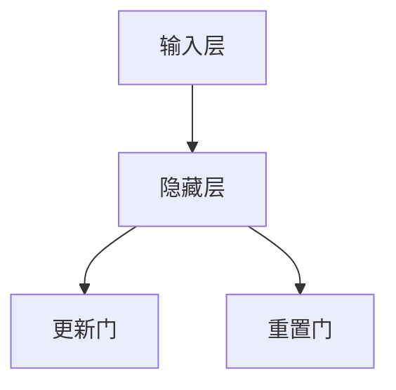

**数学模型和公式**

门控循环单元的基本数学模型可以表示为：

$$
z_t = \sigma(\mathbf{W}_z \mathbf{h}_{t-1} + \mathbf{U}_z \mathbf{x}_t + \mathbf{b}_z) \\
r_t = \sigma(\mathbf{W}_r \mathbf{h}_{t-1} + \mathbf{U}_r \mathbf{x}_t + \mathbf{b}_r) \\
h_t = \text{tanh}((1 - z_t) \odot \mathbf{h}_{t-1} + r_t \odot \text{tanh}(\mathbf{W}_h \mathbf{h}_{t-1} + \mathbf{U}_h \mathbf{x}_t + \mathbf{b}_h))
$$

其中，$z_t$和$r_t$分别表示更新门和重置门，$\mathbf{W}_z, \mathbf{U}_z, \mathbf{b}_z, \mathbf{W}_r, \mathbf{U}_r, \mathbf{b}_r, \mathbf{W}_h, \mathbf{U}_h, \mathbf{b}_h$分别表示权重和偏置。

**举例说明**

假设我们有一组交通流量数据，使用门控循环单元进行流量预测。具体步骤如下：

1. **输入数据**：将交通流量数据输入到门控循环单元。
2. **隐藏层**：通过更新门和重置门处理输入数据，生成隐藏状态。
3. **输出层**：生成未来某个时间点的交通流量预测结果。

通过这种方式，门控循环单元能够有效地简化计算，同时保持捕捉长期依赖的能力，进行流量预测。

#### 5.3 时空神经网络的训练与优化

训练和优化时空神经网络是提高模型性能的关键步骤。以下介绍几种常见的训练与优化方法：

**核心算法原理讲解**

- **反向传播算法**：用于训练神经网络，通过梯度下降方法调整模型参数。
- **正则化技术**：用于防止模型过拟合，提高泛化能力。
- **超参数调整**：用于调整模型结构，提高模型性能。

**反向传播算法**

反向传播算法是一种用于训练神经网络的算法，通过计算输出误差的梯度来调整模型参数。以下是反向传播算法的基本步骤：

1. **前向传播**：计算输入数据经过神经网络后的输出。
2. **计算误差**：计算输出误差，如均方误差（MSE）或交叉熵损失。
3. **反向传播**：计算梯度，并使用梯度下降方法更新模型参数。
4. **迭代训练**：重复前向传播和反向传播步骤，直到模型收敛。

**数学模型和公式**

反向传播算法的基本数学模型可以表示为：

$$
\delta_{\mathbf{z}_l} = \frac{\partial L}{\partial \mathbf{z}_l}
$$

$$
\frac{\partial L}{\partial \mathbf{w}_{l,k}} = \sum_{i} \delta_{\mathbf{a}_{l-1,i}} \mathbf{a}_{l-1,i}
$$

$$
\frac{\partial L}{\partial \mathbf{b}_{l}} = \sum_{i} \delta_{\mathbf{a}_{l-1,i}}
$$

其中，$\delta_{\mathbf{z}_l}$表示第l层的输出误差，$\mathbf{z}_l$表示第l层的输出，$L$表示损失函数，$\mathbf{w}_{l,k}$和$\mathbf{b}_{l}$分别表示权重和偏置。

**举例说明**

假设我们有一组交通流量数据，使用反向传播算法训练时空神经网络。具体步骤如下：

1. **前向传播**：将交通流量数据输入到时空神经网络，计算输出。
2. **计算误差**：计算输出误差，如均方误差（MSE）。
3. **反向传播**：计算梯度，并使用梯度下降方法更新模型参数。
4. **迭代训练**：重复前向传播和反向传播步骤，直到模型收敛。

通过这种方式，反向传播算法能够有效地训练时空神经网络，提高模型性能。

**正则化技术**

正则化技术是一种用于防止模型过拟合的方法，通过添加正则化项到损失函数中，限制模型复杂度。以下是一些常见的正则化技术：

- **L1正则化**：通过添加L1范数项到损失函数中。
- **L2正则化**：通过添加L2范数项到损失函数中。
- **Dropout**：通过随机丢弃部分神经元，降低模型复杂度。

**数学模型和公式**

- **L1正则化**：

$$
L_{\text{reg}} = \lambda_1 \sum_{i=1}^{n} \sum_{j=1}^{m} |w_{ij}|
$$

- **L2正则化**：

$$
L_{\text{reg}} = \lambda_2 \sum_{i=1}^{n} \sum_{j=1}^{m} w_{ij}^2
$$

其中，$w_{ij}$表示权重，$\lambda_1$和$\lambda_2$分别表示正则化参数。

**举例说明**

假设我们有一组交通流量数据，使用L2正则化训练时空神经网络。具体步骤如下：

1. **前向传播**：将交通流量数据输入到时空神经网络，计算输出。
2. **计算误差**：计算输出误差，如均方误差（MSE）。
3. **反向传播**：计算梯度，并使用梯度下降方法更新模型参数，同时考虑L2正则化项。
4. **迭代训练**：重复前向传播和反向传播步骤，直到模型收敛。

通过这种方式，L2正则化能够有效地防止模型过拟合，提高泛化能力。

**超参数调整**

超参数调整是提高模型性能的重要步骤，通过调整模型超参数，如学习率、批量大小、正则化参数等，可以优化模型性能。以下是一些常见的超参数调整方法：

- **网格搜索**：通过遍历超参数空间，找到最佳超参数组合。
- **贝叶斯优化**：通过贝叶斯优化算法，自动调整超参数。

**数学模型和公式**

超参数调整可以通过以下公式进行：

$$
\mathbf{p} = \arg\min_{\mathbf{p}} L(\mathbf{p}) + \lambda R(\mathbf{p})
$$

其中，$L(\mathbf{p})$表示损失函数，$R(\mathbf{p})$表示正则化项，$\lambda$表示正则化参数。

**举例说明**

假设我们有一组交通流量数据，使用网格搜索调整时空神经网络超参数。具体步骤如下：

1. **定义超参数空间**：确定学习率、批量大小、正则化参数等超参数的取值范围。
2. **网格搜索**：遍历超参数空间，计算不同超参数组合下的模型性能。
3. **选择最佳超参数**：选择模型性能最佳的超参数组合。
4. **模型训练**：使用最佳超参数训练时空神经网络。

通过这种方式，网格搜索能够有效地找到最佳超参数组合，提高模型性能。

### 第6章：时空序列建模

时空序列建模是AI时空建模的重要组成部分，它涉及如何利用时空数据序列来分析和预测未来时空状态。本章将详细介绍时空序列数据的特性、时空序列模型的构建方法以及模型的训练与评估过程。

#### 6.1 时空序列数据的特性

时空序列数据具有时间和空间维度，因此其特性包括：

**核心概念与联系**

- **时间序列**：数据点按时间顺序排列，每个数据点包含时间和空间信息。
- **动态性**：时空序列数据随时间变化，反映时空现象的动态特征。
- **相关性**：时空序列数据中的不同数据点之间可能存在相关性，如交通流量随时间和位置的变化。

**Mermaid流程图**

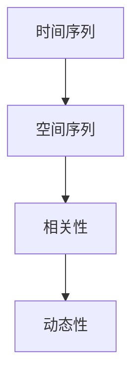

**核心算法原理讲解**

时空序列数据具有以下特点：

- **时间依赖性**：当前时间点的状态受到过去时间点状态的影响。
- **空间依赖性**：不同位置的数据点之间存在空间相关性。
- **时空交互**：时空序列数据中的时间和空间维度相互影响。

**举例说明**

假设我们有一组交通流量数据序列，包含时间和对应的交通流量值。这个数据序列反映了交通流量随时间和位置的变化，其特性如下：

- **时间依赖性**：某一时间点的交通流量受到过去一段时间内交通流量的影响。
- **空间依赖性**：不同时间点的交通流量可能受到同一位置过去一段时间内交通流量的影响。
- **时空交互**：某一时间点的交通流量不仅受到过去一段时间内交通流量的影响，还受到同一时间点其他位置交通流量的影响。

通过理解这些特性，我们可以更好地构建和训练时空序列模型。

#### 6.2 时空序列模型的构建

构建时空序列模型是为了捕捉时空序列数据的动态特性和空间相关性，从而进行有效的预测。以下是几种常见的时空序列模型构建方法：

**核心算法原理讲解**

- **时间序列分析模型**：如ARIMA模型、SARIMA模型等，用于分析时间序列数据的统计特性。
- **深度学习模型**：如循环神经网络（RNN）、长短时记忆网络（LSTM）、门控循环单元（GRU）等，用于捕捉时空序列数据的复杂特征。

**时间序列分析模型**

时间序列分析模型主要用于处理不含空间维度的纯时间序列数据，但可以通过扩展来处理时空序列数据。以下是一些常见的时间序列分析模型：

- **ARIMA模型**：自回归积分滑动平均模型，通过自回归、差分和滑动平均操作分析时间序列数据。
- **SARIMA模型**：季节性自回归积分滑动平均模型，在ARIMA模型的基础上加入季节性因素。

**数学模型和公式**

- **ARIMA模型**：

$$
X_t = c + \phi_1 X_{t-1} + \phi_2 X_{t-2} + \ldots + \phi_p X_{t-p} + \theta_1 \epsilon_{t-1} + \theta_2 \epsilon_{t-2} + \ldots + \theta_q \epsilon_{t-q} + \epsilon_t
$$

- **SARIMA模型**：

$$
X_t = c + \phi_1 X_{t-1} + \phi_2 X_{t-2} + \ldots + \phi_p X_{t-p} + (1 - \phi_1 L - \phi_2 L^2 - \ldots - \phi_p L^p) (\theta_1 L^s + \theta_2 L^{2s} + \ldots + \theta_q L^{qs}) \epsilon_t
$$

其中，$X_t$表示时间序列数据，$\epsilon_t$表示白噪声，$c$表示常数项，$\phi_1, \phi_2, \ldots, \phi_p$和$\theta_1, \theta_2, \ldots, \theta_q$分别表示自回归项和滑动平均项的系数，$L$表示滞后算子，$s$表示季节性周期。

**举例说明**

假设我们有一组交通流量数据序列，使用ARIMA模型进行建模。具体步骤如下：

1. **数据预处理**：对交通流量数据进行平稳性检验，可能需要进行差分操作。
2. **模型参数估计**：通过最大似然估计等方法估计ARIMA模型的参数。
3. **模型拟合**：使用估计的参数拟合ARIMA模型。
4. **模型评估**：通过残差分析和AIC/BIC准则评估模型性能。
5. **模型预测**：使用拟合的模型预测未来交通流量。

通过这种方式，ARIMA模型能够捕捉交通流量数据的统计特性，进行流量预测。

**深度学习模型**

深度学习模型能够通过学习大量数据自动提取时空序列的复杂特征，以下是一些常用的深度学习模型：

- **循环神经网络（RNN）**：通过循环结构捕捉时间依赖性。
- **长短时记忆网络（LSTM）**：扩展RNN，通过门控机制解决长期依赖问题。
- **门控循环单元（GRU）**：简化LSTM结构，提高计算效率。

**数学模型和公式**

- **循环神经网络（RNN）**：

$$
h_t = \text{ReLU}(\mathbf{W}_h \mathbf{h}_{t-1} + \mathbf{W}_x \mathbf{x}_t + \mathbf{b}_h)
$$

- **长短时记忆网络（LSTM）**：

$$
i_t = \sigma(\mathbf{W}_i \mathbf{h}_{t-1} + \mathbf{U}_i \mathbf{x}_t + \mathbf{b}_i) \\
f_t = \sigma(\mathbf{W}_f \mathbf{h}_{t-1} + \mathbf{U}_f \mathbf{x}_t + \mathbf{b}_f) \\
o_t = \sigma(\mathbf{W}_o \mathbf{h}_{t-1} + \mathbf{U}_o \mathbf{x}_t + \mathbf{b}_o) \\
c_t = f_t \odot c_{t-1} + i_t \odot \text{tanh}(\mathbf{W}_c \mathbf{h}_{t-1} + \mathbf{U}_c \mathbf{x}_t + \mathbf{b}_c) \\
h_t = o_t \odot \text{tanh}(c_t)
$$

- **门控循环单元（GRU）**：

$$
z_t = \sigma(\mathbf{W}_z \mathbf{h}_{t-1} + \mathbf{U}_z \mathbf{x}_t + \mathbf{b}_z) \\
r_t = \sigma(\mathbf{W}_r \mathbf{h}_{t-1} + \mathbf{U}_r \mathbf{x}_t + \mathbf{b}_r) \\
h_t = \text{tanh}((1 - z_t) \odot \mathbf{h}_{t-1} + r_t \odot \text{tanh}(\mathbf{W}_h \mathbf{h}_{t-1} + \mathbf{U}_h \mathbf{x}_t + \mathbf{b}_h))
$$

其中，$h_t$表示第t个时间步的隐藏状态，$\mathbf{x}_t$表示第t个时间步的输入数据，$\mathbf{W}_h, \mathbf{W}_x, \mathbf{b}_h, \mathbf{W}_i, \mathbf{U}_i, \mathbf{b}_i, \mathbf{W}_f, \mathbf{U}_f, \mathbf{b}_f, \mathbf{W}_o, \mathbf{U}_o, \mathbf{b}_o, \mathbf{W}_c, \mathbf{U}_c, \mathbf{b}_c, \mathbf{W}_z, \mathbf{U}_z, \mathbf{b}_z, \mathbf{W}_r, \mathbf{U}_r, \mathbf{b}_r, \mathbf{W}_h, \mathbf{U}_h, \mathbf{b}_h$分别表示权重和偏置，$\sigma$表示sigmoid激活函数，$\text{ReLU}$表示ReLU激活函数，$\text{tanh}$表示双曲正切激活函数。

**举例说明**

假设我们有一组交通流量数据序列，使用LSTM模型进行建模。具体步骤如下：

1. **数据预处理**：对交通流量数据进行归一化处理。
2. **模型构建**：定义LSTM模型结构，包括输入层、隐藏层和输出层。
3. **模型训练**：使用历史交通流量数据序列训练LSTM模型，调整模型参数。
4. **模型评估**：通过交叉验证等方法评估模型性能。
5. **模型预测**：使用训练好的LSTM模型预测未来交通流量。

通过这种方式，LSTM模型能够捕捉交通流量数据的复杂特征，进行流量预测。

#### 6.3 时空序列模型的训练与评估

训练和评估时空序列模型是模型构建的重要步骤，以下介绍几种常见的训练与评估方法：

**核心算法原理讲解**

- **训练方法**：包括前向传播、反向传播和梯度下降等。
- **评估方法**：包括均方误差（MSE）、平均绝对误差（MAE）等指标。

**训练方法**

- **前向传播**：计算模型输入经过神经网络后的输出。
- **反向传播**：计算输出误差的梯度，并更新模型参数。
- **梯度下降**：使用梯度下降方法调整模型参数，最小化损失函数。

**数学模型和公式**

- **前向传播**：

$$
\mathbf{z}_l = \mathbf{W}_l \mathbf{h}_{l-1} + \mathbf{b}_l
$$

- **反向传播**：

$$
\delta_{\mathbf{z}_l} = \frac{\partial L}{\partial \mathbf{z}_l}
$$

$$
\frac{\partial L}{\partial \mathbf{w}_{l,k}} = \sum_{i} \delta_{\mathbf{a}_{l-1,i}} \mathbf{a}_{l-1,i}
$$

$$
\frac{\partial L}{\partial \mathbf{b}_{l}} = \sum_{i} \delta_{\mathbf{a}_{l-1,i}}
$$

其中，$\mathbf{z}_l$表示第l层的输出，$\mathbf{h}_{l-1}$表示第l-1层的输出，$L$表示损失函数，$\mathbf{w}_{l,k}$和$\mathbf{b}_{l}$分别表示权重和偏置，$\delta_{\mathbf{z}_l}$表示第l层的输出误差。

**举例说明**

假设我们有一组交通流量数据序列，使用LSTM模型进行训练。具体步骤如下：

1. **前向传播**：将交通流量数据序列输入到LSTM模型，计算输出。
2. **计算误差**：计算输出误差，如均方误差（MSE）。
3. **反向传播**：计算梯度，并使用梯度下降方法更新模型参数。
4. **迭代训练**：重复前向传播和反向传播步骤，直到模型收敛。

通过这种方式，LSTM模型能够通过训练学习到交通流量数据的特征，进行流量预测。

**评估方法**

- **均方误差（MSE）**：

$$
MSE = \frac{1}{n} \sum_{i=1}^{n} (y_i - \hat{y}_i)^2
$$

- **平均绝对误差（MAE）**：

$$
MAE = \frac{1}{n} \sum_{i=1}^{n} |y_i - \hat{y}_i|
$$

其中，$y_i$表示实际交通流量，$\hat{y}_i$表示预测交通流量，$n$表示数据点的数量。

**举例说明**

假设我们有一组交通流量数据序列，使用LSTM模型进行评估。具体步骤如下：

1. **数据划分**：将数据集划分为训练集和测试集。
2. **模型训练**：使用训练集数据训练LSTM模型。
3. **模型评估**：使用测试集数据评估模型性能，计算MSE或MAE。
4. **模型优化**：根据评估结果调整模型参数，优化模型性能。

通过这种方式，我们可以评估LSTM模型在交通流量预测方面的性能。

### 第7章：时空图神经网络

时空图神经网络（Spacetime Graph Neural Networks，ST-GNN）是一种结合图神经网络和时空数据分析的模型，用于处理和分析包含时间和空间维度的数据。时空图神经网络通过构建时空图结构，能够有效地捕捉时空数据的动态特性和空间相关性。本章将介绍时空图神经网络的基本原理、应用场景和实现与优化方法。

#### 7.1 时空图神经网络的基本原理

时空图神经网络（ST-GNN）的基本原理是将时空数据表示为图结构，并通过图神经网络进行特征学习和预测。以下是时空图神经网络的基本组成部分：

**核心概念与联系**

- **时空图**：表示时空数据的图结构，包括节点、边和属性。
- **节点**：表示时空数据中的个体，如交通流量数据点。
- **边**：表示节点之间的时空关系，如时间依赖性和空间相关性。
- **属性**：表示节点的属性特征，如交通流量值。

**Mermaid流程图**

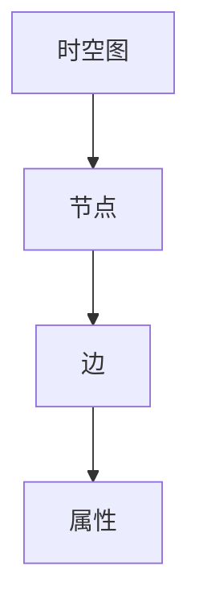

**核心算法原理讲解**

时空图神经网络的基本工作流程如下：

1. **图构建**：将时空数据表示为图结构，包括节点、边和属性。
2. **特征学习**：通过图神经网络学习节点和边上的特征。
3. **预测生成**：使用学习到的特征进行时空预测。

**数学模型和公式**

时空图神经网络的基本数学模型可以表示为：

$$
\mathbf{h}_t = \text{GNN}(\mathbf{G}, \mathbf{h}_{t-1}, \mathbf{W})
$$

$$
\mathbf{y}_t = f(\mathbf{h}_t, \mathbf{W}_y)
$$

其中，$\mathbf{h}_t$表示第t个时间步的节点特征，$\mathbf{G}$表示时空图，$\mathbf{W}$表示图神经网络权重，$f$表示预测函数。

**举例说明**

假设我们有一组交通流量数据，使用时空图神经网络进行流量预测。具体步骤如下：

1. **图构建**：将交通流量数据表示为图结构，每个交通流量数据点作为节点，时间依赖性和空间相关性作为边。
2. **特征学习**：通过图神经网络学习节点和边上的特征。
3. **预测生成**：使用学习到的特征预测未来某个时间点的交通流量。

通过这种方式，时空图神经网络能够有效地捕捉交通流量的动态特性和空间相关性，进行流量预测。

#### 7.2 时空图神经网络的应用场景

时空图神经网络在多个领域都有广泛的应用，以下介绍几个典型的应用场景：

**核心算法原理讲解**

- **智能交通**：通过时空图神经网络预测交通流量，优化交通信号控制。
- **社会网络分析**：通过时空图神经网络分析用户行为和社交关系。
- **环境监测**：通过时空图神经网络监测环境变化，预测污染物扩散。

**智能交通**

智能交通是时空图神经网络的一个重要应用场景。通过时空图神经网络，可以预测交通流量，优化交通信号控制，减少交通拥堵。以下是一个应用案例：

1. **数据收集**：收集交通流量数据，包括时间和位置信息。
2. **图构建**：将交通流量数据表示为图结构，每个交通流量点作为节点，时间依赖性和空间相关性作为边。
3. **特征学习**：通过时空图神经网络学习节点和边上的特征。
4. **预测生成**：使用学习到的特征预测未来某个时间点的交通流量。

通过这种方式，时空图神经网络能够有效地预测交通流量，为交通管理提供决策支持。

**社会网络分析**

社会网络分析是另一个典型的应用场景。通过时空图神经网络，可以分析用户行为和社交关系，了解社会网络的动态变化。以下是一个应用案例：

1. **数据收集**：收集用户行为数据，包括时间、位置和互动信息。
2. **图构建**：将用户行为数据表示为图结构，每个用户作为节点，互动行为作为边。
3. **特征学习**：通过时空图神经网络学习节点和边上的特征。
4. **预测生成**：使用学习到的特征预测未来用户行为和社交关系。

通过这种方式，时空图神经网络能够有效地分析社会网络，了解用户行为和社交关系的动态变化。

**环境监测**

环境监测是时空图神经网络的另一个重要应用场景。通过时空图神经网络，可以监测环境变化，预测污染物扩散，为环境保护提供决策支持。以下是一个应用案例：

1. **数据收集**：收集环境数据，包括时间和位置信息。
2. **图构建**：将环境数据表示为图结构，每个环境数据点作为节点，时间依赖性和空间相关性作为边。
3. **特征学习**：通过时空图神经网络学习节点和边上的特征。
4. **预测生成**：使用学习到的特征预测未来某个时间点的环境变化。

通过这种方式，时空图神经网络能够有效地监测环境变化，预测污染物扩散，为环境保护提供决策支持。

#### 7.3 时空图神经网络的实现与优化

实现和优化时空图神经网络是提高模型性能的重要步骤。以下介绍几种常见的时空图神经网络实现方法和优化技巧。

**核心算法原理讲解**

- **实现方法**：包括数据预处理、图构建、模型训练和预测生成等步骤。
- **优化技巧**：包括模型参数调整、数据增强、模型融合等。

**实现方法**

1. **数据预处理**：对时空数据进行清洗、归一化等处理，以提高模型的鲁棒性。
2. **图构建**：将时空数据表示为图结构，包括节点、边和属性。
3. **模型训练**：使用历史时空数据训练时空图神经网络，调整模型参数。
4. **预测生成**：使用训练好的模型预测未来时空数据。

**优化技巧**

1. **模型参数调整**：通过调整模型参数，如权重矩阵和偏置向量，提高模型的性能和泛化能力。
2. **数据增强**：通过数据扩充、变换等方法增加训练数据集的多样性，以提高模型的鲁棒性。
3. **模型融合**：将多个时空图神经网络模型的结果进行融合，以提高预测的准确性。

**举例说明**

假设我们有一组交通流量数据，使用时空图神经网络进行流量预测。具体步骤如下：

1. **数据预处理**：对交通流量数据进行清洗、归一化处理。
2. **图构建**：将交通流量数据表示为图结构，每个交通流量点作为节点，时间依赖性和空间相关性作为边。
3. **模型训练**：使用历史数据进行训练，调整模型参数。
4. **预测生成**：使用训练好的模型预测未来交通流量。

通过这种方式，时空图神经网络能够有效地预测交通流量，为交通管理提供决策支持。

### 第8章：AI时空建模在智能交通领域的应用

智能交通系统（Intelligent Transportation Systems，ITS）利用信息技术、数据通信传输技术、电子传感技术等来提高交通效率，减少交通事故，提高出行安全。AI时空建模在智能交通系统中扮演着重要角色，通过预测交通流量、优化交通信号控制、预测交通事件等，实现更智能、更高效的交通管理。本章将详细介绍AI时空建模在智能交通领域的应用。

#### 8.1 智能交通系统概述

智能交通系统是一个复杂的集成系统，旨在通过信息技术提高交通效率、减少拥堵、降低污染、提升安全性。智能交通系统通常包括以下几个关键组成部分：

**核心概念与联系**

- **交通信号控制**：通过优化交通信号灯的时序，提高交通流量。
- **交通监测**：利用传感器、摄像头等设备实时监测交通状态。
- **通信系统**：实现车辆与基础设施、车辆与车辆之间的通信。
- **信息发布**：向驾驶员提供实时交通信息，引导合理出行。

**Mermaid流程图**

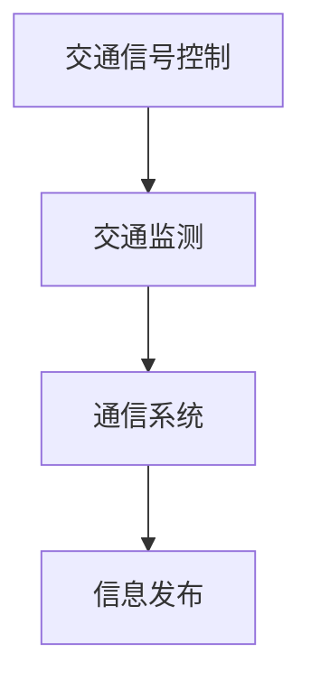

**核心算法原理讲解**

智能交通系统的基本工作流程如下：

1. **数据收集**：通过传感器、摄像头等设备收集交通流量、速度、拥堵等信息。
2. **数据处理**：对收集到的数据进行处理、分析和建模。
3. **决策生成**：根据分析结果生成交通信号控制策略、交通事件预警等。
4. **执行控制**：通过交通信号灯、信息显示屏等设备执行控制策略。
5. **反馈优化**：根据实际交通情况反馈，不断优化交通信号控制策略。

**举例说明**

假设在某个交叉口，通过摄像头和传感器收集交通流量数据。具体步骤如下：

1. **数据收集**：摄像头和传感器实时收集车辆数量、速度等信息。
2. **数据处理**：对收集到的数据进行分析，判断交通状态。
3. **决策生成**：根据当前交通状态，生成交通信号控制策略。
4. **执行控制**：交通信号灯根据控制策略调整信号灯状态。
5. **反馈优化**：根据实际交通流量情况，不断调整控制策略。

通过这种方式，智能交通系统能够实时监测交通状态，优化交通信号控制，提高交通效率。

#### 8.2 智能交通中的时空数据来源

智能交通系统依赖于多种时空数据的来源，这些数据包括交通流量、速度、拥堵情况等。以下是一些常见的数据来源：

**核心算法原理讲解**

- **交通流量数据**：来自交通传感器、摄像头等设备，反映车辆数量和流量变化。
- **速度数据**：来自车辆导航系统、GPS等设备，反映车辆行驶速度。
- **拥堵数据**：来自交通监控中心、道路传感器等设备，反映道路拥堵情况。
- **气象数据**：来自气象站、气象雷达等设备，影响交通状况。

**数据来源分析**

1. **交通流量数据**：交通传感器安装在道路交叉口、路段等位置，通过检测车辆数量、速度等参数，实时收集交通流量数据。这些数据可以通过传感器网络传输到交通监控中心进行处理和分析。

2. **速度数据**：车辆导航系统和GPS设备可以实时记录车辆的位置和速度信息。这些数据可以通过无线通信网络传输到交通监控中心，用于分析交通状况。

3. **拥堵数据**：交通监控中心通过摄像头和道路传感器监测道路状况，识别拥堵区域。这些数据可以通过视频监控系统和传感器网络传输到交通监控中心，用于实时交通状态分析。

4. **气象数据**：气象站和气象雷达设备可以实时监测气象情况，包括温度、湿度、风速等参数。这些数据可以通过无线通信网络传输到交通监控中心，用于预测交通状况。

**数据可视化示例**

为了更好地理解和分析智能交通系统中的时空数据，可以通过以下数据可视化方法：

- **热力图**：用颜色强度表示交通流量密度，红色表示高流量区域，蓝色表示低流量区域。
- **时间序列图**：用线条或柱状图表示交通流量、速度等参数随时间的变化。
- **地图可视化**：在地图上显示交通流量、拥堵情况等，通过地图上的图标或颜色变化进行可视化。

通过这些数据可视化方法，可以直观地了解交通状况，为交通管理和决策提供依据。

#### 8.3 智能交通中的时空建模方法

智能交通系统中的时空建模方法用于预测交通流量、优化交通信号控制、预测交通事件等。以下介绍几种常见的时空建模方法：

**核心算法原理讲解**

- **回归模型**：通过建立回归模型预测交通流量、速度等参数。
- **循环神经网络（RNN）**：通过时间序列分析预测交通流量、速度等参数。
- **卷积神经网络（CNN）**：通过空间特征提取预测交通流量、速度等参数。
- **时空图神经网络（ST-GNN）**：通过构建时空图结构，预测交通流量、速度等参数。

**回归模型**

回归模型是一种简单的时空建模方法，通过建立回归方程预测交通流量、速度等参数。以下是一些常见的回归模型：

- **线性回归**：通过线性关系预测交通流量、速度等参数。
- **多项式回归**：通过多项式关系预测交通流量、速度等参数。
- **非线性回归**：通过非线性关系预测交通流量、速度等参数。

**数学模型和公式**

- **线性回归**：

$$
y = \beta_0 + \beta_1 x
$$

- **多项式回归**：

$$
y = \beta_0 + \beta_1 x + \beta_2 x^2 + \ldots + \beta_n x^n
$$

- **非线性回归**：

$$
y = \beta_0 + \beta_1 \cdot f(x)
$$

其中，$y$表示预测值，$x$表示输入特征，$\beta_0, \beta_1, \ldots, \beta_n$表示模型参数。

**举例说明**

假设我们有一组交通流量数据，使用线性回归模型预测未来某个时间点的交通流量。具体步骤如下：

1. **数据收集**：收集历史交通流量数据。
2. **数据预处理**：对数据进行归一化处理。
3. **模型选择**：选择线性回归模型。
4. **模型训练**：使用历史数据进行训练，调整模型参数。
5. **模型评估**：通过交叉验证评估模型性能。
6. **模型应用**：使用训练好的模型预测未来交通流量。

通过这种方式，我们可以预测未来某个时间点的交通流量，从而为交通管理提供依据。

**循环神经网络（RNN）**

循环神经网络（RNN）是一种适用于时间序列数据预测的神经网络模型，通过循环结构捕捉时间依赖性。以下是一些常见的RNN模型：

- **简单的RNN**：通过循环结构将前一时间步的输出反馈到当前时间步。
- **长短时记忆网络（LSTM）**：通过门控机制解决简单RNN的长期依赖问题。
- **门控循环单元（GRU）**：简化LSTM结构，提高计算效率。

**数学模型和公式**

- **简单的RNN**：

$$
h_t = \sigma(W_h h_{t-1} + W_x x_t + b)
$$

- **长短时记忆网络（LSTM）**：

$$
i_t = \sigma(W_i h_{t-1} + W_x x_t + b_i) \\
f_t = \sigma(W_f h_{t-1} + W_x x_t + b_f) \\
o_t = \sigma(W_o h_{t-1} + W_x x_t + b_o) \\
c_t = f_t \odot c_{t-1} + i_t \odot \sigma(W_c h_{t-1} + W_x x_t + b_c) \\
h_t = o_t \odot \sigma(c_t)
$$

- **门控循环单元（GRU）**：

$$
z_t = \sigma(W_z h_{t-1} + W_x x_t + b_z) \\
r_t = \sigma(W_r h_{t-1} + W_x x_t + b_r) \\
h_t = \text{tanh}(W_h (r_t \odot h_{t-1} + (1 - z_t) \odot x_t) + b_h) \\
z_t = \sigma(W_z h_{t-1} + W_x x_t + b_z) \\
h_t' = z_t \odot h_t + (1 - z_t) \odot h_{t-1}
$$

其中，$h_t$表示当前时间步的隐藏状态，$x_t$表示当前时间步的输入，$c_t$表示当前时间步的细胞状态，$i_t, f_t, o_t$表示输入门、遗忘门和输出门，$r_t$表示重置门。

**举例说明**

假设我们有一组交通流量数据，使用LSTM模型预测未来某个时间点的交通流量。具体步骤如下：

1. **数据收集**：收集历史交通流量数据。
2. **数据预处理**：对数据进行归一化处理。
3. **模型选择**：选择LSTM模型。
4. **模型训练**：使用历史数据进行训练，调整模型参数。
5. **模型评估**：通过交叉验证评估模型性能。
6. **模型应用**：使用训练好的模型预测未来交通流量。

通过这种方式，LSTM模型能够有效地捕捉交通流量的时间依赖性，进行流量预测。

**卷积神经网络（CNN）**

卷积神经网络（CNN）是一种适用于图像处理和空间特征提取的神经网络模型，通过卷积操作提取空间特征。以下是一些常见的CNN模型：

- **简单的卷积神经网络**：通过卷积操作提取空间特征。
- **残差卷积神经网络（ResNet）**：通过残差连接提高模型性能。
- **注意力机制卷积神经网络（Attention CNN）**：通过注意力机制提高模型对关键特征的识别能力。

**数学模型和公式**

- **简单的卷积神经网络**：

$$
h_t = \sigma(W_h h_{t-1} + W_x x_t + b)
$$

- **残差卷积神经网络（ResNet）**：

$$
h_t = \sigma(W_h h_{t-1} + W_x x_t + b) + h_{t-1}
$$

- **注意力机制卷积神经网络（Attention CNN）**：

$$
h_t = \text{Attention}(W_a h_{t-1} + W_x x_t + b_a) \odot h_{t-1}
$$

其中，$h_t$表示当前时间步的隐藏状态，$x_t$表示当前时间步的输入，$W_h, W_x, b$表示权重和偏置，$\text{Attention}$表示注意力机制。

**举例说明**

假设我们有一组交通流量数据，使用ResNet模型预测未来某个时间点的交通流量。具体步骤如下：

1. **数据收集**：收集历史交通流量数据。
2. **数据预处理**：对数据进行归一化处理。
3. **模型选择**：选择ResNet模型。
4. **模型训练**：使用历史数据进行训练，调整模型参数。
5. **模型评估**：通过交叉验证评估模型性能。
6. **模型应用**：使用训练好的模型预测未来交通流量。

通过这种方式，ResNet模型能够有效地提取交通流量数据的时空特征，进行流量预测。

**时空图神经网络（ST-GNN）**

时空图神经网络（ST-GNN）是一种结合图神经网络和时空数据分析的模型，通过构建时空图结构，能够有效地捕捉时空数据的动态特性和空间相关性。以下是其基本结构和实现方法：

**核心算法原理讲解**

- **图构建**：将时空数据表示为图结构，包括节点、边和属性。
- **特征学习**：通过图神经网络学习节点和边上的特征。
- **预测生成**：使用学习到的特征进行时空预测。

**数学模型和公式**

时空图神经网络的基本数学模型可以表示为：

$$
\mathbf{h}_t = \text{GNN}(\mathbf{G}, \mathbf{h}_{t-1}, \mathbf{W})
$$

$$
\mathbf{y}_t = f(\mathbf{h}_t, \mathbf{W}_y)
$$

其中，$\mathbf{h}_t$表示第t个时间步的节点特征，$\mathbf{G}$表示时空图，$\mathbf{W}$表示图神经网络权重，$f$表示预测函数。

**举例说明**

假设我们有一组交通流量数据，使用时空图神经网络进行流量预测。具体步骤如下：

1. **图构建**：将交通流量数据表示为图结构，每个交通流量点作为节点，时间依赖性和空间相关性作为边。
2. **特征学习**：通过时空图神经网络学习节点和边上的特征。
3. **预测生成**：使用学习到的特征预测未来某个时间点的交通流量。

通过这种方式，时空图神经网络能够有效地捕捉交通流量的动态特性和空间相关性，进行流量预测。

### 第9章：AI时空建模在气象预测中的应用

气象预测是AI时空建模的重要应用领域，通过分析时空数据，可以预测天气变化，提供提前预警，从而减少自然灾害对人类生活的影响。本章将详细介绍AI时空建模在气象预测中的应用，包括气象预测中的时空数据来源、建模方法以及模型评估。

#### 9.1 气象预测中的时空数据来源

气象预测依赖于大量的时空数据，这些数据来自各种气象监测设备和预测模型。以下是气象预测中常见的数据来源：

**核心算法原理讲解**

- **地面气象站**：提供温度、湿度、气压、风速等气象参数。
- **气象雷达**：检测降水、风暴等天气现象。
- **卫星数据**：提供全球范围内的气象信息，包括温度、湿度、云层分布等。
- **数值天气预报模型**：通过数学模型模拟大气运动，预测天气变化。

**数据来源分析**

1. **地面气象站**：地面气象站分布在全球各地，实时监测温度、湿度、气压、风速等气象参数。这些数据通过无线电通信传输到气象中心，用于天气预报和气候研究。

2. **气象雷达**：气象雷达用于检测降水、风暴等天气现象。雷达波反射回来的信号被用于计算降水强度、风暴范围等参数。这些数据通过雷达系统传输到气象中心，用于实时监测和预警。

3. **卫星数据**：气象卫星提供全球范围内的气象信息，包括温度、湿度、云层分布等。卫星数据通过遥感技术获取，经过处理后传输到气象中心，用于天气预报和气候研究。

4. **数值天气预报模型**：数值天气预报模型通过数学模型模拟大气运动，预测天气变化。这些模型依赖于大量的气象数据，通过计算机模拟生成天气预报结果。

**数据可视化示例**

为了更好地理解和分析气象预测中的时空数据，可以通过以下数据可视化方法：

- **时间序列图**：用线条或柱状图表示气象参数随时间的变化，如温度、湿度等。
- **热力图**：用颜色强度表示气象参数的空间分布，如温度、湿度等。
- **地图可视化**：在地图上显示气象参数的空间分布，通过图标或颜色变化进行可视化。

通过这些数据可视化方法，可以直观地了解气象参数的时空分布，为气象预测提供依据。

#### 9.2 气象预测中的时空建模方法

气象预测中的时空建模方法用于分析气象数据，预测未来天气变化。以下介绍几种常见的时空建模方法：

**核心算法原理讲解**

- **回归模型**：通过建立回归模型预测气象参数。
- **循环神经网络（RNN）**：通过时间序列分析预测气象参数。
- **卷积神经网络（CNN）**：通过空间特征提取预测气象参数。
- **时空图神经网络（ST-GNN）**：通过构建时空图结构，预测气象参数。

**回归模型**

回归模型是一种简单的气象预测方法，通过建立回归方程预测气象参数。以下是一些常见的回归模型：

- **线性回归**：通过线性关系预测气象参数。
- **多项式回归**：通过多项式关系预测气象参数。
- **非线性回归**：通过非线性关系预测气象参数。

**数学模型和公式**

- **线性回归**：

$$
y = \beta_0 + \beta_1 x
$$

- **多项式回归**：

$$
y = \beta_0 + \beta_1 x + \beta_2 x^2 + \ldots + \beta_n x^n
$$

- **非线性回归**：

$$
y = \beta_0 + \beta_1 \cdot f(x)
$$

其中，$y$表示预测值，$x$表示输入特征，$\beta_0, \beta_1, \ldots, \beta_n$表示模型参数。

**举例说明**

假设我们有一组气象数据，使用线性回归模型预测未来某个时间点的温度。具体步骤如下：

1. **数据收集**：收集历史气象数据。
2. **数据预处理**：对数据进行归一化处理。
3. **模型选择**：选择线性回归模型。
4. **模型训练**：使用历史数据进行训练，调整模型参数。
5. **模型评估**：通过交叉验证评估模型性能。
6. **模型应用**：使用训练好的模型预测未来温度。

通过这种方式，我们可以预测未来某个时间点的温度，从而为气象预测提供依据。

**循环神经网络（RNN）**

循环神经网络（RNN）是一种适用于时间序列数据预测的神经网络模型，通过循环结构捕捉时间依赖性。以下是一些常见的RNN模型：

- **简单的RNN**：通过循环结构将前一时间步的输出反馈到当前时间步。
- **长短时记忆网络（LSTM）**：通过门控机制解决简单RNN的长期依赖问题。
- **门控循环单元（GRU）**：简化LSTM结构，提高计算效率。

**数学模型和公式**

- **简单的RNN**：

$$
h_t = \sigma(W_h h_{t-1} + W_x x_t + b)
$$

- **长短时记忆网络（LSTM）**：

$$
i_t = \sigma(W_i h_{t-1} + W_x x_t + b_i) \\
f_t = \sigma(W_f h_{t-1} + W_x x_t + b_f) \\
o_t = \sigma(W_o h_{t-1} + W_x x_t + b_o) \\
c_t = f_t \odot c_{t-1} + i_t \odot \sigma(W_c h_{t-1} + W_x x_t + b_c) \\
h_t = o_t \odot \sigma(c_t)
$$

- **门控循环单元（GRU）**：

$$
z_t = \sigma(W_z h_{t-1} + W_x x_t + b_z) \\
r_t = \sigma(W_r h_{t-1} + W_x x_t + b_r) \\
h_t = \text{tanh}(W_h (r_t \odot h_{t-1} + (1 - z_t) \odot x_t) + b_h) \\
z_t = \sigma(W_z h_{t-1} + W_x x_t + b_z) \\
h_t' = z_t \odot h_t + (1 - z_t) \odot h_{t-1}
$$

其中，$h_t$表示当前时间步的隐藏状态，$x_t$表示当前时间步的输入，$c_t$表示当前时间步的细胞状态，$i_t, f_t, o_t$表示输入门、遗忘门和输出门，$r_t$表示重置门。

**举例说明**

假设我们有一组气象数据，使用LSTM模型预测未来某个时间点的温度。具体步骤如下：

1. **数据收集**：收集历史气象数据。
2. **数据预处理**：对数据进行归一化处理。
3. **模型选择**：选择LSTM模型。
4. **模型训练**：使用历史数据进行训练，调整模型参数。
5. **模型评估**：通过交叉验证评估模型性能。
6. **模型应用**：使用训练好的模型预测未来温度。

通过这种方式，LSTM模型能够有效地捕捉气象数据的时间依赖性，进行温度预测。

**卷积神经网络（CNN）**

卷积神经网络（CNN）是一种适用于图像处理和空间特征提取的神经网络模型，通过卷积操作提取空间特征。以下是一些常见的CNN模型：

- **简单的卷积神经网络**：通过卷积操作提取空间特征。
- **残差卷积神经网络（ResNet）**：通过残差连接提高模型性能。
- **注意力机制卷积神经网络（Attention CNN）**：通过注意力机制提高模型对关键特征的识别能力。

**数学模型和公式**

- **简单的卷积神经网络**：

$$
h_t = \sigma(W_h h_{t-1} + W_x x_t + b)
$$

- **残差卷积神经网络（ResNet）**：

$$
h_t = \sigma(W_h h_{t-1} + W_x x_t + b) + h_{t-1}
$$

- **注意力机制卷积神经网络（Attention CNN）**：

$$
h_t = \text{Attention}(W_a h_{t-1} + W_x x_t + b_a) \odot h_{t-1}
$$

其中，$h_t$表示当前时间步的隐藏状态，$x_t$表示当前时间步的输入，$W_h, W_x, b$表示权重和偏置，$\text{Attention}$表示注意力机制。

**举例说明**

假设我们有一组气象数据，使用ResNet模型预测未来某个时间点的温度。具体步骤如下：

1. **数据收集**：收集历史气象数据。
2. **数据预处理**：对数据进行归一化处理。
3. **模型选择**：选择ResNet模型。
4. **模型训练**：使用历史数据进行训练，调整模型参数。
5. **模型评估**：通过交叉验证评估模型性能。
6. **模型应用**：使用训练好的模型预测未来温度。

通过这种方式，ResNet模型能够有效地提取气象数据的空间特征，进行温度预测。

**时空图神经网络（ST-GNN）**

时空图神经网络（ST-GNN）是一种结合图神经网络和时空数据分析的模型，通过构建时空图结构，能够有效地捕捉时空数据的动态特性和空间相关性。以下是其基本结构和实现方法：

**核心算法原理讲解**

- **图构建**：将时空数据表示为图结构，包括节点、边和属性。
- **特征学习**：通过图神经网络学习节点和边上的特征。
- **预测生成**：使用学习到的特征进行时空预测。

**数学模型和公式**

时空图神经网络的基本数学模型可以表示为：

$$
\mathbf{h}_t = \text{GNN}(\mathbf{G}, \mathbf{h}_{t-1}, \mathbf{W})
$$

$$
\mathbf{y}_t = f(\mathbf{h}_t, \mathbf{W}_y)
$$

其中，$\mathbf{h}_t$表示第t个时间步的节点特征，$\mathbf{G}$表示时空图，$\mathbf{W}$表示图神经网络权重，$f$表示预测函数。

**举例说明**

假设我们有一组气象数据，使用时空图神经网络进行温度预测。具体步骤如下：

1. **图构建**：将气象数据表示为图结构，每个气象数据点作为节点，时间依赖性和空间相关性作为边。
2. **特征学习**：通过时空图神经网络学习节点和边上的特征。
3. **预测生成**：使用学习到的特征预测未来某个时间点的温度。

通过这种方式，时空图神经网络能够有效地捕捉气象数据的动态特性和空间相关性，进行温度预测。

#### 9.3 气象预测中的时空模型评估

评估气象预测模型的性能是确保模型准确性和可靠性的关键步骤。以下介绍几种常见的评估方法和指标：

**核心算法原理讲解**

- **评估方法**：包括交叉验证、时间序列分割等。
- **评估指标**：包括均方误差（MSE）、平均绝对误差（MAE）等。

**评估方法**

1. **交叉验证**：将数据集划分为多个子集，每次使用一个子集作为验证集，其余子集作为训练集，评估模型性能。
2. **时间序列分割**：将数据集划分为训练集和测试集，分别评估模型在训练集和测试集上的性能。

**评估指标**

1. **均方误差（MSE）**：

$$
MSE = \frac{1}{n} \sum_{i=1}^{n} (y_i - \hat{y}_i)^2
$$

2. **平均绝对误差（MAE）**：

$$
MAE = \frac{1}{n} \sum_{i=1}^{n} |y_i - \hat{y}_i|
$$

其中，$y_i$表示实际气象参数，$\hat{y}_i$表示预测气象参数，$n$表示数据点的数量。

**举例说明**

假设我们有一组气象数据，使用LSTM模型进行温度预测。具体步骤如下：

1. **数据划分**：将数据集划分为训练集和测试集。
2. **模型训练**：使用训练集数据训练LSTM模型。
3. **模型评估**：使用测试集数据评估模型性能，计算MSE或MAE。
4. **模型优化**：根据评估结果调整模型参数，优化模型性能。

通过这种方式，我们可以评估LSTM模型在温度预测方面的性能。

### 第10章：AI时空建模在其他领域的应用

AI时空建模技术不仅广泛应用于智能交通和气象预测领域，还延伸到了其他众多领域，如城市规划、环境监测、智慧城市等。这些领域中的时空数据具有独特的特点和需求，AI时空建模技术通过定制化的模型和应用，为这些领域提供了强大的数据分析和预测能力。本章将介绍AI时空建模在其他领域的应用，包括时空数据来源、建模方法和模型评估。

#### 10.1 其他领域的时空数据来源

不同领域的时空数据来源和特性各有不同，以下是几个常见领域中的时空数据来源：

**核心算法原理讲解**

- **城市规划**：来自地理信息系统（GIS）、遥感图像、人口统计数据等。
- **环境监测**：来自传感器网络、气象站、卫星遥感等。
- **智慧城市**：来自交通监控、摄像头、物联网设备等。
- **城市规划**：来自历史建筑数据、土地利用数据、交通流量数据等。

**数据来源分析**

1. **城市规划**：城市规划需要分析土地利用、人口分布、交通流量等数据。这些数据来自地理信息系统（GIS）、遥感图像、人口统计数据等。GIS提供地理空间信息，遥感图像提供土地利用情况，人口统计数据提供人口分布信息。

2. **环境监测**：环境监测需要实时监测空气、水质、土壤等环境参数。这些数据来自传感器网络、气象站、卫星遥感等。传感器网络分布在城市各个角落，实时监测环境参数，气象站提供气象数据，卫星遥感提供大范围的环境监测数据。

3. **智慧城市**：智慧城市需要整合各种城市数据，如交通流量、公共安全、能源消耗等。这些数据来自交通监控、摄像头、物联网设备等。交通监控提供实时交通流量数据，摄像头提供公共安全监控数据，物联网设备提供能源消耗数据。

4. **城市规划**：城市规划还需要分析历史建筑数据、土地利用数据、交通流量数据等。历史建筑数据提供城市规划的历史背景，土地利用数据提供土地利用情况，交通流量数据提供交通状况。

**数据可视化示例**

为了更好地理解和分析其他领域中的时空数据，可以通过以下数据可视化方法：

- **热力图**：用颜色强度表示人口密度、交通流量等。
- **时间序列图**：用线条或柱状图表示气象参数、能源消耗等随时间的变化。
- **地图可视化**：在地图上显示环境监测点、交通流量等。

通过这些数据可视化方法，可以直观地了解其他领域中的时空数据分布和变化，为决策提供依据。

#### 10.2 其他领域的时空建模方法

其他领域的时空建模方法需要根据领域的特性和需求，选择合适的模型和方法。以下介绍几种常见的时空建模方法：

**核心算法原理讲解**

- **回归模型**：通过建立回归模型预测时空参数。
- **循环神经网络（RNN）**：通过时间序列分析预测时空参数。
- **卷积神经网络（CNN）**：通过空间特征提取预测时空参数。
- **时空图神经网络（ST-GNN）**：通过构建时空图结构，预测时空参数。

**回归模型**

回归模型是一种简单但有效的时空建模方法，通过建立回归方程预测时空参数。以下是一些常见的回归模型：

- **线性回归**：通过线性关系预测时空参数。
- **多项式回归**：通过多项式关系预测时空参数。
- **非线性回归**：通过非线性关系预测时空参数。

**数学模型和公式**

- **线性回归**：

$$
y = \beta_0 + \beta_1 x
$$

- **多项式回归**：

$$
y = \beta_0 + \beta_1 x + \beta_2 x^2 + \ldots + \beta_n x^n
$$

- **非线性回归**：

$$
y = \beta_0 + \beta_1 \cdot f(x)
$$

其中，$y$表示预测值，$x$表示输入特征，$\beta_0, \beta_1, \ldots, \beta_n$表示模型参数。

**举例说明**

假设我们有一组城市规划数据，使用线性回归模型预测未来某个时间点的土地利用面积。具体步骤如下：

1. **数据收集**：收集历史土地利用数据。
2. **数据预处理**：对数据进行归一化处理。
3. **模型选择**：选择线性回归模型。
4. **模型训练**：使用历史数据进行训练，调整模型参数。
5. **模型评估**：通过交叉验证评估模型性能。
6. **模型应用**：使用训练好的模型预测未来土地利用面积。

通过这种方式，我们可以预测未来某个时间点的土地利用面积，从而为城市规划提供依据。

**循环神经网络（RNN）**

循环神经网络（RNN）是一种适用于时间序列数据预测的神经网络模型，通过循环结构捕捉时间依赖性。以下是一些常见的RNN模型：

- **简单的RNN**：通过循环结构将前一时间步的输出反馈到当前时间步。
- **长短时记忆网络（LSTM）**：通过门控机制解决简单RNN的长期依赖问题。
- **门控循环单元（GRU）**：简化LSTM结构，提高计算效率。

**数学模型和公式**

- **简单的RNN**：

$$
h_t = \sigma(W_h h_{t-1} + W_x x_t + b)
$$

- **长短时记忆网络（LSTM）**：

$$
i_t = \sigma(W_i h_{t-1} + W_x x_t + b_i) \\
f_t = \sigma(W_f h_{t-1} + W_x x_t + b_f) \\
o_t = \sigma(W_o h_{t-1} + W_x x_t + b_o) \\
c_t = f_t \odot c_{t-1} + i_t \odot \sigma(W_c h_{t-1} + W_x x_t + b_c) \\
h_t = o_t \odot \sigma(c_t)
$$

- **门控循环单元（GRU）**：

$$
z_t = \sigma(W_z h_{t-1} + W_x x_t + b_z) \\
r_t = \sigma(W_r h_{t-1} + W_x x_t + b_r) \\
h_t = \text{tanh}(W_h (r_t \odot h_{t-1} + (1 - z_t) \odot x_t) + b_h) \\
z_t = \sigma(W_z h_{t-1} + W_x x_t + b_z) \\
h_t' = z_t \odot h_t + (1 - z_t) \odot h_{t-1}
$$

其中，$h_t$表示当前时间步的隐藏状态，$x_t$表示当前时间步的输入，$c_t$表示当前时间步的细胞状态，$i_t, f_t, o_t$表示输入门、遗忘门和输出门，$r_t$表示重置门。

**举例说明**

假设我们有一组环境监测数据，使用LSTM模型预测未来某个时间点的空气质量指数（AQI）。具体步骤如下：

1. **数据收集**：收集历史空气质量指数数据。
2. **数据预处理**：对数据进行归一化处理。
3. **模型选择**：选择LSTM模型。
4. **模型训练**：使用历史数据进行训练，调整模型参数。
5. **模型评估**：通过交叉验证评估模型性能。
6. **模型应用**：使用训练好的模型预测未来空气质量指数。

通过这种方式，LSTM模型能够有效地捕捉空气质量指数的时间依赖性，进行AQI预测。

**卷积神经网络（CNN）**

卷积神经网络（CNN）是一种适用于图像处理和空间特征提取的神经网络模型，通过卷积操作提取空间特征。以下是一些常见的CNN模型：

- **简单的卷积神经网络**：通过卷积操作提取空间特征。
- **残差卷积神经网络（ResNet）**：通过残差连接提高模型性能。
- **注意力机制卷积神经网络（Attention CNN）**：通过注意力机制提高模型对关键特征的识别能力。

**数学模型和公式**

- **简单的卷积神经网络**：

$$
h_t = \sigma(W_h h_{t-1} + W_x x_t + b)
$$

- **残差卷积神经网络（ResNet）**：

$$
h_t = \sigma(W_h h_{t-1} + W_x x_t + b) + h_{t-1}
$$

- **注意力机制卷积神经网络（Attention CNN）**：

$$
h_t = \text{Attention}(W_a h_{t-1} + W_x x_t + b_a) \odot h_{t-1}
$$

其中，$h_t$表示当前时间步的隐藏状态，$x_t$表示当前时间步的输入，$W_h, W_x, b$表示权重和偏置，$\text{Attention}$表示注意力机制。

**举例说明**

假设我们有一组遥感图像数据，使用ResNet模型预测某个区域的植被覆盖率。具体步骤如下：

1. **数据收集**：收集遥感图像数据。
2. **数据预处理**：对遥感图像进行归一化处理。
3. **模型选择**：选择ResNet模型。
4. **模型训练**：使用历史遥感图像数据训练模型，调整模型参数。
5. **模型评估**：通过交叉验证评估模型性能。
6. **模型应用**：使用训练好的模型预测遥感图像区域的植被覆盖率。

通过这种方式，ResNet模型能够有效地提取遥感图像的空间特征，进行植被覆盖率预测。

**时空图神经网络（ST-GNN）**

时空图神经网络（ST-GNN）是一种结合图神经网络和时空数据分析的模型，通过构建时空图结构，能够有效地捕捉时空数据的动态特性和空间相关性。以下是其基本结构和实现方法：

**核心算法原理讲解**

- **图构建**：将时空数据表示为图结构，包括节点、边和属性。
- **特征学习**：通过图神经网络学习节点和边上的特征。
- **预测生成**：使用学习到的特征进行时空预测。

**数学模型和公式**

时空图神经网络的基本数学模型可以表示为：

$$
\mathbf{h}_t = \text{GNN}(\mathbf{G}, \mathbf{h}_{t-1}, \mathbf{W})
$$

$$
\mathbf{y}_t = f(\mathbf{h}_t, \mathbf{W}_y)
$$

其中，$\mathbf{h}_t$表示第t个时间步的节点特征，$\mathbf{G}$表示时空图，$\mathbf{W}$表示图神经网络权重，$f$表示预测函数。

**举例说明**

假设我们有一组环境监测数据，使用时空图神经网络进行空气质量指数（AQI）预测。具体步骤如下：

1. **图构建**：将环境监测数据表示为图结构，每个监测点作为节点，时间依赖性和空间相关性作为边。
2. **特征学习**：通过时空图神经网络学习节点和边上的特征。
3. **预测生成**：使用学习到的特征预测未来某个时间点的空气质量指数。

通过这种方式，时空图神经网络能够有效地捕捉环境监测数据的动态特性和空间相关性，进行AQI预测。

#### 10.3 其他领域的时空模型评估

评估时空模型在其他领域的性能是确保模型准确性和可靠性的关键步骤。以下介绍几种常见的评估方法和指标：

**核心算法原理讲解**

- **评估方法**：包括交叉验证、时间序列分割等。
- **评估指标**：包括均方误差（MSE）、平均绝对误差（MAE）等。

**评估方法**

1. **交叉验证**：将数据集划分为多个子集，每次使用一个子集作为验证集，其余子集作为训练集，评估模型性能。
2. **时间序列分割**：将数据集划分为训练集和测试集，分别评估模型在训练集和测试集上的性能。

**评估指标**

1. **均方误差（MSE）**：

$$
MSE = \frac{1}{n} \sum_{i=1}^{n} (y_i - \hat{y}_i)^2
$$

2. **平均绝对误差（MAE）**：

$$
MAE = \frac{1}{n} \sum_{i=1}^{n} |y_i - \hat{y}_i|
$$

其中，$y_i$表示实际时空参数，$\hat{y}_i$表示预测时空参数，$n$表示数据点的数量。

**举例说明**

假设我们有一组城市规划数据，使用LSTM模型预测未来某个时间点的土地利用面积。具体步骤如下：

1. **数据划分**：将数据集划分为训练集和测试集。
2. **模型训练**：使用训练集数据训练LSTM模型。
3. **模型评估**：使用测试集数据评估模型性能，计算MSE或MAE。
4. **模型优化**：根据评估结果调整模型参数，优化模型性能。

通过这种方式，我们可以评估LSTM模型在土地利用面积预测方面的性能。

### 附录A：AI时空建模工具与资源

AI时空建模涉及多个技术和工具，为了提高建模的效率和准确性，开发者可以使用一系列开源工具和资源。以下是一些主要的AI时空建模工具和资源的介绍。

#### A.1 主流AI时空建模框架对比

在AI时空建模领域，有几个主流的框架和库被广泛使用。以下是对几个主要框架的对比：

- **TensorFlow**：由Google开发，是一个高度灵活的开源机器学习框架，支持多种神经网络结构，适用于大规模数据处理和模型训练。
- **PyTorch**：由Facebook开发，以其动态计算图和易用性著称，特别适合研究和开发复杂的神经网络模型。
- **Keras**：一个高级神经网络API，易于使用，可以与TensorFlow和Theano等后端兼容。

**Mermaid流程图**

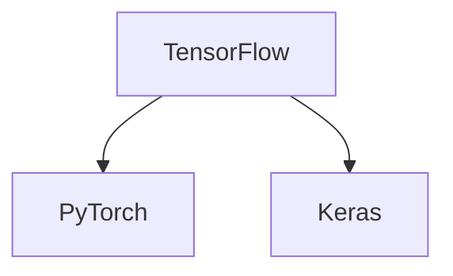

**框架对比**

- **适用场景**：TensorFlow适用于需要大规模数据处理和优化的场景；PyTorch适用于研究和新模型开发；Keras适用于快速原型开发和模型验证。
- **易用性**：Keras提供了最简单的API，适合初学者和快速开发；TensorFlow和PyTorch提供了更多的定制和优化选项。
- **性能**：TensorFlow和PyTorch在性能上相当，但具体取决于硬件和优化。

#### A.2 AI时空建模开源工具与库

以下是一些常用的开源工具和库，用于AI时空建模：

- **TensorFlow**：提供了丰富的API和预训练模型，适用于各种机器学习和深度学习任务。
- **PyTorch**：支持动态计算图，适合

