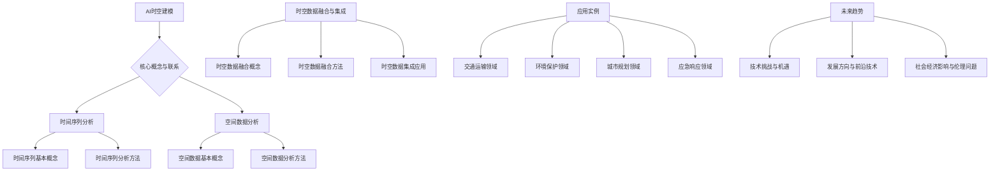

                 

## 文章标题: AI时空建模的未来技术趋势

### 关键词：AI时空建模、时空数据、时间序列分析、空间数据分析、数据融合

> 摘要：本文深入探讨了AI时空建模的基础概念、技术发展趋势、关键算法原理及其应用实例。通过逐步分析，本文揭示了AI时空建模在未来技术领域的重要性和潜在影响，为相关研究人员和实践者提供了有价值的参考。

### 目录大纲：AI时空建模的未来技术趋势

1. 第一部分: AI时空建模基础
   1.1. AI时空建模概述
       - AI时空建模的定义与重要性
       - 时空数据的类型与处理方法
       - AI时空建模的发展历程
       - AI时空建模的应用领域
   1.2. 时空数据管理
       - 时空数据模型
       - 时空数据存储与访问
       - 时空数据隐私保护
   1.3. 时间序列分析
       - 时间序列基本概念
       - 时间序列分析方法
       - 时间序列预测与评估
   1.4. 空间数据分析
       - 空间数据基本概念
       - 空间数据分析方法
       - 空间数据可视化
   1.5. 时空数据融合与集成
       - 时空数据融合概念
       - 时空数据融合方法
       - 时空数据集成应用

2. 第二部分: AI时空建模应用实例
   2.1. 交通运输领域
       - 实时交通流量预测
       - 交通拥堵检测与预警
   2.2. 环境保护领域
       - 空气质量预测与监测
       - 水质监测与预警
   2.3. 城市规划领域
       - 城市增长预测
       - 土地利用规划
   2.4. 应急响应领域
       - 地震预警与救援
       - 洪水预警与防洪减灾

3. 第三部分: AI时空建模的未来趋势
   3.1. 技术挑战与机遇
       - 计算资源挑战
       - 数据质量问题
       - 实时性需求
   3.2. 发展方向与前沿技术
       - 多模态时空数据融合
       - 图神经网络在时空建模中的应用
       - 强化学习在时空决策中的应用
   3.3. 社会经济影响与伦理问题
       - AI时空建模的社会影响
       - 数据隐私与伦理问题

4. 附录
   4.1. AI时空建模工具与资源
       - 开源时空数据库
       - 时空数据分析与建模工具
       - 在线教程与学习资源

### Mermaid 流程图



### 核心算法原理讲解

在本部分，我们将深入探讨时间序列分析和空间数据分析中的核心算法原理，并通过伪代码和数学模型进行详细阐述。

#### 时间序列分析方法

##### 传统时间序列分析方法

1. **移动平均法（MA）**：

   移动平均法是一种简单的时间序列分析方法，用于平滑数据并减少随机波动。

   $$\text{MA}\left(t\right) = \frac{1}{n}\sum_{i=1}^{n} X\left(t-i\right)$$

   其中，$X\left(t\right)$ 表示时间序列在时刻 $t$ 的值，$n$ 是窗口大小。

2. **指数平滑法（ES）**：

   指数平滑法通过给近期数据更高的权重来改进移动平均法。

   $$\text{ES}\left(t\right) = \alpha X\left(t\right) + \left(1-\alpha\right) \text{ES}\left(t-1\right)$$

   其中，$\alpha$ 是平滑系数，通常取值在 $0$ 到 $1$ 之间。

##### 现代时间序列分析方法

1. **自回归模型（AR）**：

   自回归模型通过历史值来预测未来值。

   $$X\left(t\right) = c + \phi_1 X\left(t-1\right) + \phi_2 X\left(t-2\right) + \ldots + \phi_p X\left(t-p\right) + \varepsilon\left(t\right)$$

   其中，$c$ 是常数项，$\phi_1, \phi_2, \ldots, \phi_p$ 是自回归系数，$\varepsilon\left(t\right)$ 是误差项。

2. **移动平均模型（MA）**：

   移动平均模型通过误差项的移动平均来预测未来值。

   $$X\left(t\right) = \varepsilon\left(t\right) + \theta_1 \varepsilon\left(t-1\right) + \theta_2 \varepsilon\left(t-2\right) + \ldots + \theta_q \varepsilon\left(t-q\right)$$

3. **自回归移动平均模型（ARMA）**：

   自回归移动平均模型结合了自回归模型和移动平均模型。

   $$X\left(t\right) = c + \phi_1 X\left(t-1\right) + \ldots + \phi_p X\left(t-p\right) + \varepsilon\left(t\right) + \theta_1 \varepsilon\left(t-1\right) + \ldots + \theta_q \varepsilon\left(t-q\right)$$

##### 长短期记忆网络（LSTM）

LSTM 是一种特殊的循环神经网络，用于处理序列数据，特别适合时间序列预测。

1. **输入门（Input Gate）**：

   $$i_t = \sigma(W_{ix}x_t + W_{ih}h_{t-1} + b_i)$$

   其中，$i_t$ 是输入门的状态，$x_t$ 是输入序列，$h_{t-1}$ 是前一个隐藏状态，$W_{ix}, W_{ih}, b_i$ 是权重和偏置。

2. **遗忘门（Forget Gate）**：

   $$f_t = \sigma(W_{fx}x_t + W_{fh}h_{t-1} + b_f)$$

   其中，$f_t$ 是遗忘门的状态，用于控制哪些信息需要被遗忘。

3. **输出门（Output Gate）**：

   $$o_t = \sigma(W_{ox}x_t + W_{oh}h_{t-1} + b_o)$$

   其中，$o_t$ 是输出门的状态，用于控制哪些信息需要输出。

4. **单元状态（Cell State）**：

   $$C_t = f_t \odot C_{t-1} + i_t \odot \text{sigmoid}(W_{cx}x_t + W_{ch}h_{t-1} + b_c)$$

   其中，$C_t$ 是单元状态，$\odot$ 表示逐元素乘积。

5. **隐藏状态（Hidden State）**：

   $$h_t = o_t \odot \text{tanh}(C_t)$$

   其中，$h_t$ 是隐藏状态，用于预测和输出。

#### 空间数据分析方法

1. **地理信息系统（GIS）**：

   地理信息系统是一种用于存储、分析和管理地理数据的工具。

2. **空间插值与曲面拟合**：

   空间插值用于估计未知空间位置的数据值，常用的方法有反距离权重法（IDW）和样条插值法。

   $$z_i = \sum_{j=1}^{n} w_{ij} z_j$$

   其中，$z_i$ 和 $z_j$ 分别是已知和未知位置的数据值，$w_{ij}$ 是权重。

3. **空间聚类与分类**：

   空间聚类用于将空间数据分为不同的簇，常用的方法有K-均值聚类和层次聚类。

### 项目实战

在本部分，我们将通过一个交通流量预测的项目实战，展示如何使用LSTM模型进行时间序列预测。

#### 开发环境搭建

- **Python 3.x**
- **PyTorch**
- **scikit-learn**
- **Matplotlib**

#### 数据预处理

1. **数据清洗**：去除无效数据、缺失值填充
2. **特征提取**：时间特征（小时、星期）、空间特征（区域、距离）

#### 模型选择与训练

1. **LSTM模型**：输入序列长度为24小时，输出序列长度为24小时
2. **参数调整**：隐藏层单元数、学习率、批量大小

#### 代码实现

```python
import torch
import torch.nn as nn
import torch.optim as optim
from sklearn.preprocessing import MinMaxScaler
from sklearn.metrics import mean_squared_error

# 数据预处理
scaler = MinMaxScaler()
X, y = preprocess_data(data)

# 模型定义
class LSTMModel(nn.Module):
    def __init__(self, input_dim, hidden_dim, output_dim):
        super(LSTMModel, self).__init__()
        self.lstm = nn.LSTM(input_dim, hidden_dim, batch_first=True)
        self.fc = nn.Linear(hidden_dim, output_dim)
    
    def forward(self, x):
        x, _ = self.lstm(x)
        x = self.fc(x[:, -1, :])
        return x

# 模型训练
model = LSTMModel(input_dim=X.shape[2], hidden_dim=50, output_dim=1)
optimizer = optim.Adam(model.parameters(), lr=0.001)
criterion = nn.MSELoss()

for epoch in range(num_epochs):
    model.train()
    for i in range(len(X) - sequence_length):
        inputs = X[i:i + sequence_length]
        targets = y[i + sequence_length]
        optimizer.zero_grad()
        outputs = model(inputs)
        loss = criterion(outputs, targets)
        loss.backward()
        optimizer.step()

    if epoch % 10 == 0:
        print(f'Epoch [{epoch+1}/{num_epochs}], Loss: {loss.item()}')

# 模型评估
model.eval()
with torch.no_grad():
    y_pred = model(X)
    mse = mean_squared_error(y, y_pred)
    print(f'MSE: {mse}')
```

#### 代码解读与分析

1. **数据预处理**：使用MinMaxScaler对数据进行归一化处理，以便于模型的训练。
2. **模型定义**：定义LSTM模型，包括输入层、隐藏层和输出层。
3. **模型训练**：使用梯度下降优化算法训练模型，通过反向传播计算梯度并更新模型参数。
4. **模型评估**：使用评估指标MSE计算模型预测误差，并打印结果。

通过以上项目实战，我们展示了如何使用LSTM模型进行时间序列预测，为实际应用提供了技术参考。

### 总结与展望

AI时空建模作为人工智能领域的热点研究方向，具有广泛的应用前景。本文从基础概念、技术趋势、核心算法和实际应用等方面进行了全面阐述，揭示了AI时空建模在未来技术领域的重要性和潜力。在未来的发展中，AI时空建模将面临计算资源、数据质量和实时性等方面的挑战，同时也将迎来多模态时空数据融合、图神经网络和强化学习等前沿技术的应用。此外，AI时空建模的伦理问题和数据隐私保护也亟待解决。总之，AI时空建模将在推动科技进步和社会发展中发挥重要作用。

