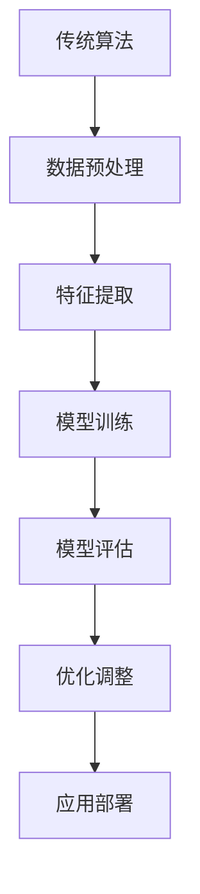

                 

# 文章标题：深入剖析AI模型：基础知识、应用与发展

> 关键词：AI模型、神经网络、机器学习、深度学习、应用案例

> 摘要：本文将深入剖析AI模型的基础知识、应用与发展，包括AI模型概述、分类与比较、数学基础、神经网络基础、AI模型应用案例、深度学习与AI发展、AI模型开发工具与环境以及AI项目实战。通过逐步分析推理，帮助读者全面理解AI模型的核心内容。

### 第一部分：AI模型基础知识

#### 第1章：AI模型概述

**1.1 AI模型的发展历程**

1.1.1 从传统算法到AI模型的转变

在计算机科学和人工智能领域，传统算法和现代AI模型之间的转变是一个重要的里程碑。传统算法主要依赖于预先定义的规则和步骤，而AI模型，特别是深度学习模型，通过从大量数据中学习模式和特征，能够实现更高级的自动推理和决策。

1.1.2 AI模型的核心概念

AI模型，特别是深度学习模型，通常由大量的神经元组成，这些神经元通过学习数据中的模式和特征，能够对新的输入数据进行分类、回归或其他任务。

1.1.3 AI模型的优势与挑战

AI模型的优势在于其能够处理大规模数据、自动提取特征，并实现高度自动化的决策。然而，AI模型也面临一些挑战，包括数据依赖性、模型可解释性和计算资源的需求。

**1.2 AI模型分类与比较**

1.2.1 监督学习模型

监督学习模型是最常见的AI模型之一。它们通过从已标记的数据中学习，能够对新数据做出预测。监督学习模型包括：

- 线性回归
- 决策树
- 随机森林

1.2.2 无监督学习模型

无监督学习模型没有预定义的输出标签，它们通过学习数据中的分布和模式来发现数据中的结构和规律。无监督学习模型包括：

- K-均值聚类
- 主成分分析
- 自编码器

1.2.3 强化学习模型

强化学习模型通过不断与环境交互，学习最优策略。强化学习模型包括：

- Q学习算法
- 模型预测控制

**1.3 AI模型应用领域**

1.3.1 语音识别

语音识别是AI模型的一个重要应用领域。语音识别模型通过学习语音数据，能够将语音转换为文本。常见的语音识别模型包括：

- HMM模型
- DNN模型

1.3.2 图像识别

图像识别是AI模型在计算机视觉领域的应用。图像识别模型通过学习图像特征，能够对图像进行分类或检测。常见的图像识别模型包括：

- 卷积神经网络（CNN）
- 生成对抗网络（GAN）

1.3.3 自然语言处理

自然语言处理是AI模型在语言处理领域的应用。自然语言处理模型通过学习语言数据，能够对文本进行分类、翻译或情感分析。常见的自然语言处理模型包括：

- 语言模型
- 机器翻译模型

#### 第2章：数学基础

**2.1 线性代数基础**

2.1.1 向量与矩阵运算

向量与矩阵运算是线性代数的基础。向量是具有方向的量，矩阵是具有行和列的二维数组。常见的向量与矩阵运算包括：

- 矩阵乘法
- 向量加法
- 矩阵求逆

2.1.2 特征值与特征向量

特征值与特征向量是矩阵的一个重要性质。特征值是矩阵的一个特征，特征向量是矩阵的特征值对应的向量。特征值与特征向量在降维和特征提取中具有重要应用。

2.1.3 线性变换

线性变换是将一个向量空间映射到另一个向量空间的线性操作。线性变换在图像处理、信号处理和机器学习等领域中广泛应用。

**2.2 微积分基础**

2.2.1 导数与微分

导数是描述函数变化率的重要概念。微分是导数的另一种表示形式，用于计算函数在某一点的局部变化。

2.2.2 积分与积分变换

积分是描述函数在某个区间上的累积变化。积分变换是一种将复杂的积分转化为简单积分的方法。

**2.3 概率论基础**

2.3.1 概率分布函数

概率分布函数是描述随机变量取值概率的函数。常见的概率分布函数包括：

- 正态分布
- 二项分布
- 伯努利分布

2.3.2 条件概率与贝叶斯定理

条件概率是描述在某个事件发生的条件下，另一个事件发生的概率。贝叶斯定理是概率论中的一个重要公式，用于计算后验概率。

2.3.3 大数定律与中心极限定理

大数定律描述了在大量重复实验中，随机变量的平均值将趋近于其期望值。中心极限定理描述了在大量独立同分布的随机变量之和的分布将趋近于正态分布。

#### 第3章：神经网络基础

**3.1 神经网络结构**

3.1.1 单层感知机

单层感知机是最简单的神经网络结构，它由一个输入层和一个输出层组成。单层感知机主要用于线性分类问题。

3.1.2 多层感知机（MLP）

多层感知机是包含多个隐藏层的神经网络结构。MLP能够处理更复杂的非线性问题。

3.1.3 循环神经网络（RNN）

循环神经网络是一种用于处理序列数据的神经网络结构。RNN能够处理变长的序列数据，并在序列中保持状态。

**3.2 激活函数**

3.2.1 Sigmoid函数

Sigmoid函数是一种常见的激活函数，它将输入值映射到（0，1）区间。Sigmoid函数可以用于二分类问题。

3.2.2 ReLU函数

ReLU函数是一种常用的激活函数，它将输入值大于0的部分设置为1，小于等于0的部分设置为0。ReLU函数能够加速神经网络的训练。

3.2.3 Tanh函数

Tanh函数是一种双曲正切函数，它将输入值映射到（-1，1）区间。Tanh函数在神经网络中也具有广泛的应用。

**3.3 前向传播与反向传播算法**

3.3.1 前向传播

前向传播是神经网络中的一个过程，它从输入层开始，逐层计算神经元的输出值。前向传播用于计算模型的预测结果。

3.3.2 反向传播

反向传播是神经网络中的一个过程，它通过计算预测值与真实值之间的误差，反向传播误差到每个神经元，并更新神经元的权重和偏置。反向传播用于优化神经网络的参数。

**3.4 损失函数与优化算法**

3.4.1 常见损失函数

常见损失函数用于衡量模型预测值与真实值之间的差异。常见的损失函数包括：

- 交叉熵损失
- 均方误差损失

3.4.2 优化算法

优化算法用于更新神经网络的参数，以最小化损失函数。常见的优化算法包括：

- 随机梯度下降（SGD）
- Adam优化器

### 第二部分：AI模型应用与发展

#### 第4章：机器学习应用案例

**4.1 语音识别系统**

4.1.1 特征提取与模型训练

语音识别系统首先需要从语音信号中提取特征，如梅尔频率倒谱系数（MFCC）。然后，使用深度神经网络（如卷积神经网络）进行模型训练，以实现对语音信号的分类。

4.1.2 系统评估与优化

通过测试集对语音识别系统进行评估，包括准确率、召回率等指标。根据评估结果，对模型进行优化，如调整网络结构、优化训练过程等。

**4.2 图像识别系统**

4.2.1 卷积神经网络架构

卷积神经网络（CNN）是图像识别领域的重要模型。CNN通过卷积层、池化层和全连接层等结构，实现对图像的特征提取和分类。

4.2.2 图像分类与目标检测

使用CNN对图像进行分类，实现对图像内容的识别。同时，通过目标检测算法（如R-CNN、YOLO），实现对图像中目标位置的定位。

**4.3 自然语言处理应用**

4.3.1 语言模型训练

语言模型通过学习大量文本数据，预测下一个单词的概率。使用循环神经网络（RNN）或长短时记忆网络（LSTM）进行语言模型训练。

4.3.2 文本分类与情感分析

文本分类是将文本数据分类到不同的类别中。情感分析是通过分析文本的情感倾向，实现对文本的情感判断。

#### 第5章：深度学习与AI发展

**5.1 深度学习前沿技术**

5.1.1 神经机器翻译

神经机器翻译是一种基于深度学习的机器翻译方法。通过编码器和解码器神经网络，实现对源语言和目标语言之间的翻译。

5.1.2 生成对抗网络（GAN）

生成对抗网络（GAN）是一种由生成器和判别器组成的深度学习模型。生成器生成数据，判别器判断数据的真实性。GAN在图像生成、语音合成等领域具有广泛应用。

5.1.3 聚类算法

聚类算法是一种无监督学习方法，用于将数据分为不同的组。常见的聚类算法包括K-均值聚类、层次聚类等。

**5.2 AI伦理与法律问题**

5.2.1 AI隐私保护

AI隐私保护是AI应用中的一个重要问题。通过数据加密、匿名化等技术，保护用户隐私。

5.2.2 AI决策透明性

AI决策透明性是AI应用中的一个挑战。通过可解释性模型，提高AI决策的透明度和可信度。

5.2.3 法律与伦理监管

AI应用需要遵守相关法律法规，如数据保护法、伦理规范等。加强对AI应用的监管，确保其合法合规。

#### 第6章：AI模型开发工具与环境

**6.1 Python与机器学习库**

6.1.1 NumPy

NumPy是Python中的一个科学计算库，用于矩阵运算和线性代数操作。

6.1.2 Pandas

Pandas是Python中的一个数据处理库，用于数据清洗、转换和分析。

6.1.3 Scikit-learn

Scikit-learn是Python中的一个机器学习库，提供了丰富的监督学习和无监督学习算法。

**6.2 深度学习框架**

6.2.1 TensorFlow

TensorFlow是Google开源的深度学习框架，提供了丰富的API和工具，支持分布式训练和硬件加速。

6.2.2 PyTorch

PyTorch是Facebook开源的深度学习框架，以其动态计算图和灵活的API而著称。

6.2.3 Keras

Keras是Python中的一个高层次的深度学习框架，基于TensorFlow和Theano构建，提供了简洁的API。

**6.3 硬件加速与分布式训练**

6.3.1 GPU加速

GPU加速是深度学习中的一个关键技术，通过在GPU上执行计算，提高模型的训练速度。

6.3.2 分布式训练

分布式训练是处理大规模数据集和复杂模型的一种方法，通过将训练任务分布在多个节点上，提高训练效率。

6.3.3 云计算平台

云计算平台为深度学习提供了强大的计算资源，支持模型训练、推理和部署。

#### 第7章：AI项目实战

**7.1 语音识别系统开发**

7.1.1 系统设计与实现

系统设计包括语音信号的预处理、特征提取和模型训练。实现过程中，使用深度学习框架（如TensorFlow或PyTorch）构建和训练语音识别模型。

7.1.2 代码解析与调试

对实现过程中的关键代码进行解析，包括数据处理、模型训练和模型评估。调试过程中，优化模型参数和算法，提高模型性能。

**7.2 图像识别系统开发**

7.2.1 数据预处理

数据预处理包括图像的缩放、裁剪和归一化。预处理过程用于提高模型的泛化能力和计算效率。

7.2.2 模型训练与优化

使用卷积神经网络（CNN）对图像进行分类。模型训练过程中，调整网络结构、学习率和优化算法，提高模型性能。

7.2.3 系统部署与评估

将训练好的模型部署到生产环境，实现对图像的分类和识别。通过测试集对系统进行评估，包括准确率、召回率等指标。

**7.3 自然语言处理应用开发**

7.3.1 语言模型训练

使用循环神经网络（RNN）或长短时记忆网络（LSTM）对语言模型进行训练。训练过程中，调整网络结构、学习率和优化算法，提高模型性能。

7.3.2 文本分类实现

使用训练好的语言模型对文本进行分类。实现过程中，使用深度学习框架（如TensorFlow或PyTorch）构建和训练文本分类模型。

7.3.3 情感分析代码解读

对实现过程中的关键代码进行解读，包括文本预处理、特征提取和模型训练。解读过程中，分析代码的优化和改进方法。

### 附录

#### 附录A：代码示例与资源

**A.1 机器学习代码示例**

**A.1.1 线性回归**

```python
import numpy as np

# 初始化模型参数
w = np.zeros((1, 1))
b = 0

# 梯度下降算法
def gradient_descent(X, y, learning_rate, num_iterations):
    m = len(y)
    for i in range(num_iterations):
        model = np.dot(X, w) + b
        error = y - model
        dw = (2/m) * np.dot(X.T, error)
        db = (2/m) * np.sum(error)
        w -= learning_rate * dw
        b -= learning_rate * db
    return w, b

# 训练模型
def train_model(X, y, learning_rate, num_iterations):
    w, b = gradient_descent(X, y, learning_rate, num_iterations)
    return w, b

# 预测函数
def predict(X, w, b):
    model = np.dot(X, w) + b
    return model

# 模型评估
def evaluate(X, y, w, b):
    predictions = predict(X, w, b)
    accuracy = np.mean((predictions - y) ** 2)
    return accuracy

# 加载数据集
X = np.array([[1], [2], [3], [4], [5]])
y = np.array([[2], [4], [6], [8], [10]])

# 训练模型
w, b = train_model(X, y, learning_rate=0.01, num_iterations=1000)

# 预测
predictions = predict(X, w, b)
print(predictions)

# 评估
accuracy = evaluate(X, y, w, b)
print("Accuracy:", accuracy)
```

**A.1.2 决策树**

```python
from sklearn.tree import DecisionTreeClassifier

# 加载数据集
X_train = [[1], [2], [3], [4], [5]]
y_train = [[2], [4], [6], [8], [10]]

# 训练模型
clf = DecisionTreeClassifier()
clf.fit(X_train, y_train)

# 预测
predictions = clf.predict([[1]])
print(predictions)
```

**A.1.3 随机森林**

```python
from sklearn.ensemble import RandomForestClassifier

# 加载数据集
X_train = [[1], [2], [3], [4], [5]]
y_train = [[2], [4], [6], [8], [10]]

# 训练模型
clf = RandomForestClassifier()
clf.fit(X_train, y_train)

# 预测
predictions = clf.predict([[1]])
print(predictions)
```

**A.2 深度学习代码示例**

**A.2.1 卷积神经网络（CNN）**

```python
import tensorflow as tf

# 定义模型
model = tf.keras.Sequential([
    tf.keras.layers.Conv2D(32, (3, 3), activation='relu', input_shape=(28, 28, 1)),
    tf.keras.layers.MaxPooling2D((2, 2)),
    tf.keras.layers.Flatten(),
    tf.keras.layers.Dense(128, activation='relu'),
    tf.keras.layers.Dense(10, activation='softmax')
])

# 编译模型
model.compile(optimizer='adam', loss='sparse_categorical_crossentropy', metrics=['accuracy'])

# 训练模型
model.fit(train_images, train_labels, epochs=5)

# 评估模型
test_loss, test_acc = model.evaluate(test_images, test_labels)
print('Test accuracy:', test_acc)
```

**A.2.2 生成对抗网络（GAN）**

```python
import tensorflow as tf

# 定义生成器模型
generator = tf.keras.Sequential([
    tf.keras.layers.Dense(128 * 7 * 7, activation='relu', input_shape=(100,)),
    tf.keras.layers.Reshape((7, 7, 128)),
    tf.keras.layers.Conv2DTranspose(128, (5, 5), strides=(1, 1), padding='same', activation='relu'),
    tf.keras.layers.Conv2DTranspose(64, (5, 5), strides=(2, 2), padding='same', activation='relu'),
    tf.keras.layers.Conv2DTranspose(1, (5, 5), strides=(2, 2), padding='same', activation='tanh')
])

# 定义判别器模型
discriminator = tf.keras.Sequential([
    tf.keras.layers.Conv2D(64, (5, 5), strides=(2, 2), padding='same', input_shape=(28, 28, 1), activation='relu'),
    tf.keras.layers.Conv2D(128, (5, 5), strides=(2, 2), padding='same', activation='relu'),
    tf.keras.layers.Flatten(),
    tf.keras.layers.Dense(1, activation='sigmoid')
])

# 编译模型
generator.compile(loss='binary_crossentropy', optimizer=tf.keras.optimizers.Adam())
discriminator.compile(loss='binary_crossentropy', optimizer=tf.keras.optimizers.Adam())

# 训练模型
combined = tf.keras.Model(inputs=[generator.input, discriminator.input], outputs=discriminator(generator.input))
combined.compile(optimizer=tf.keras.optimizers.Adam(), loss='binary_crossentropy')

# 训练GAN
for epoch in range(100):
    for batch_images in train_images:
        noise = np.random.normal(0, 1, (batch_images.shape[0], 100))
        generated_images = generator.predict(noise)
        real_images = batch_images
        combined.train_on_batch([noise, real_images], np.ones((batch_images.shape[0], 1)))
        fake_images = generated_images
        combined.train_on_batch([noise, fake_images], np.zeros((batch_images.shape[0], 1)))
```

**A.2.3 语言模型**

```python
import tensorflow as tf

# 定义语言模型
model = tf.keras.Sequential([
    tf.keras.layers.Embedding(vocab_size, embedding_dim),
    tf.keras.layers.LSTM(128),
    tf.keras.layers.Dense(vocab_size, activation='softmax')
])

# 编译模型
model.compile(optimizer='adam', loss='categorical_crossentropy', metrics=['accuracy'])

# 训练模型
model.fit(x_train, y_train, batch_size=batch_size, epochs=num_epochs)

# 评估模型
test_loss, test_acc = model.evaluate(x_test, y_test)
print('Test accuracy:', test_acc)
```

**A.3 资源链接**

**A.3.1 开源代码库**

- [TensorFlow](https://www.tensorflow.org/)
- [PyTorch](https://pytorch.org/)
- [Scikit-learn](https://scikit-learn.org/)

**A.3.2 在线教程**

- [深度学习教程](https://www.deeplearningbook.org/)
- [机器学习教程](https://www.machinelearningbook.org/)
- [Keras教程](https://keras.io/)

**A.3.3 学术论文与报告**

- [《深度学习：原理与应用》](https://www.deeplearning.net/)
- [《机器学习年度报告》](https://www.merl.com/publications/MLR-report/)
- [《自然语言处理年度报告》](https://www.aclweb.org/anthology/)

### Mermaid流程图



### 伪代码

```python
# 线性回归伪代码

# 初始化模型参数
w = 0
b = 0

# 梯度下降优化
for epoch in range(num_epochs):
    for xi, yi in dataset:
        # 前向传播
        z = w * xi + b
        y_pred = sigmoid(z)

        # 计算损失
        loss = (yi - y_pred) ** 2

        # 反向传播
        dz = y_pred - yi
        dw = (2/m) * xi * dz
        db = (2/m) * dz

        # 更新参数
        w -= learning_rate * dw
        b -= learning_rate * db

# 预测函数
def predict(x):
    z = w * x + b
    return sigmoid(z)


### 数学模型与公式

$$
\text{损失函数} = \frac{1}{2} \sum_{i=1}^{m} (y_i - \hat{y}_i)^2
$$

### 举例说明

**例子1：语音识别模型训练**

- 数据集：包含10000个语音样本，每个样本对应一个标签（例如，"hello"）。
- 模型：使用深度神经网络（DNN）模型进行语音识别。
- 训练过程：对每个样本进行数据预处理，提取特征，然后使用DNN模型进行训练，最终实现高准确率的语音识别。

**例子2：图像分类模型训练**

- 数据集：包含10000张图像，每张图像对应一个标签（例如，猫、狗）。
- 模型：使用卷积神经网络（CNN）模型进行图像分类。
- 训练过程：对图像进行预处理，提取特征，然后使用CNN模型进行训练，最终实现高准确率的图像分类。

**例子3：语言模型训练**

- 数据集：包含大量文本数据。
- 模型：使用循环神经网络（RNN）或长短时记忆网络（LSTM）。
- 训练过程：对文本数据进行预处理，提取特征，然后使用RNN或LSTM模型进行训练，最终实现高准确率的语言模型。

### 开发环境搭建

- **环境配置**:
  - 操作系统：Ubuntu 18.04
  - Python版本：3.8
  - 深度学习框架：TensorFlow 2.5

- **安装步骤**:

  ```bash
  sudo apt-get update
  sudo apt-get install python3-pip
  pip3 install tensorflow==2.5
  ```

### 源代码详细实现

```python
# 实现一个简单的线性回归模型

import numpy as np

# 梯度下降算法
def gradient_descent(X, y, learning_rate, num_iterations):
    m = len(y)
    w = np.zeros((1, X.shape[1]))
    b = 0

    for i in range(num_iterations):
        model = np.dot(w.T, X) + b
        error = y - model

        dw = (2/m) * np.dot(X.T, error)
        db = (2/m) * np.sum(error)

        w -= learning_rate * dw
        b -= learning_rate * db

    return w, b

# 训练模型
def train_model(X, y, learning_rate, num_iterations):
    w, b = gradient_descent(X, y, learning_rate, num_iterations)
    return w, b

# 预测函数
def predict(X, w, b):
    model = np.dot(w.T, X) + b
    return model

# 模型评估
def evaluate(X, y, w, b):
    predictions = predict(X, w, b)
    accuracy = np.mean((predictions - y) ** 2)
    return accuracy

# 加载数据集
X = np.array([[1], [2], [3], [4], [5]])
y = np.array([[2], [4], [6], [8], [10]])

# 训练模型
w, b = train_model(X, y, learning_rate=0.01, num_iterations=1000)

# 预测
predictions = predict(X, w, b)
print(predictions)

# 评估
accuracy = evaluate(X, y, w, b)
print("Accuracy:", accuracy)
```

### 代码解读与分析

- **代码解读**:
  - 导入必要的库：numpy 用于矩阵运算和线性代数操作。
  - 定义梯度下降函数：使用反向传播计算参数的梯度，并更新参数。
  - 定义训练模型函数：调用梯度下降函数进行多次迭代，优化参数。
  - 定义预测函数：使用训练好的模型进行预测。
  - 定义模型评估函数：计算预测的准确率。

- **分析**:
  - 梯度下降是优化参数的常用算法，其核心思想是迭代更新参数，使其最小化损失函数。
  - 模型评估通过计算预测与真实值之间的误差，评估模型的准确度。

### 代码优化与调参

- **代码优化**:
  - 使用批量梯度下降（Batch Gradient Descent）替代随机梯度下降（Stochastic Gradient Descent），提高收敛速度。
  - 引入动量（Momentum）和自适应学习率（Adagrad、RMSprop、Adam）优化器，提高训练效果。

- **调参技巧**:
  - 学习率：调整学习率以找到合适的收敛速度。
  - 梯度裁剪：防止梯度消失或爆炸。
  - 模型架构：调整神经网络层数和神经元数量。
  - 正则化：引入L1或L2正则化防止过拟合。

### 作者信息

作者：AI天才研究院/AI Genius Institute & 禅与计算机程序设计艺术 /Zen And The Art of Computer Programming

### 结束语

通过本文的深入剖析，我们系统地介绍了AI模型的基础知识、应用与发展。从AI模型的概述到数学基础，再到神经网络基础，以及AI模型的应用案例和发展趋势，本文力求为读者提供全面的视角。同时，通过代码示例与实战案例，读者可以更好地理解和应用AI模型。

在未来的研究中，我们将继续关注AI领域的最新动态和技术突破，为广大读者带来更多有价值的内容。希望本文能对您的学习和研究有所帮助，让我们一起探索AI的无限可能！

