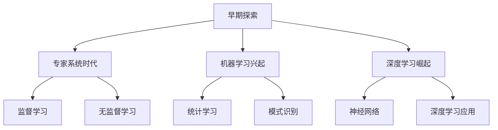
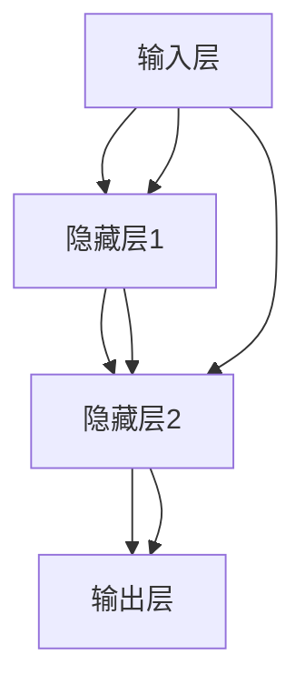
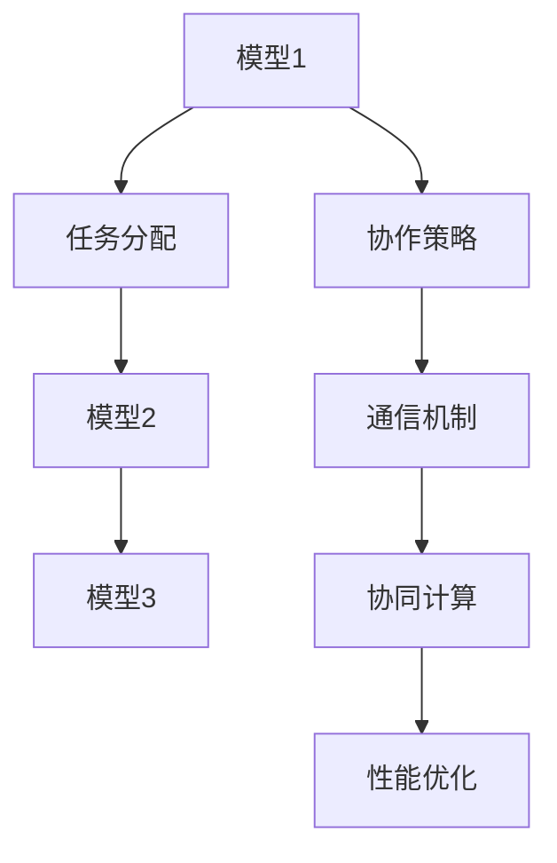
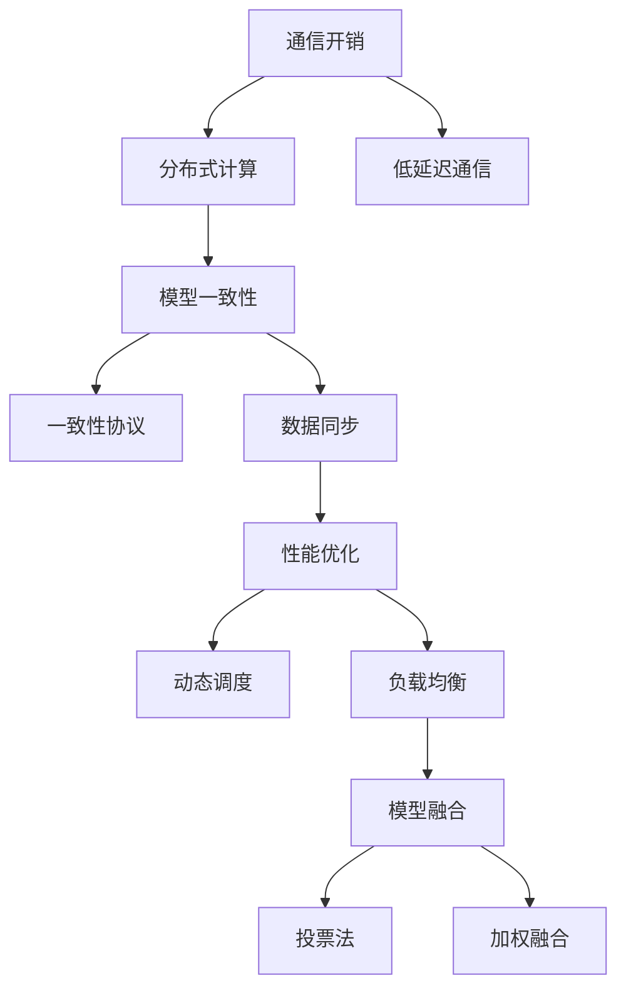
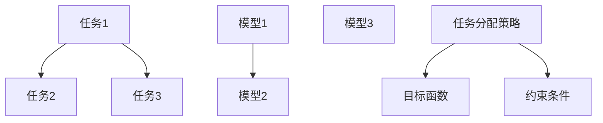
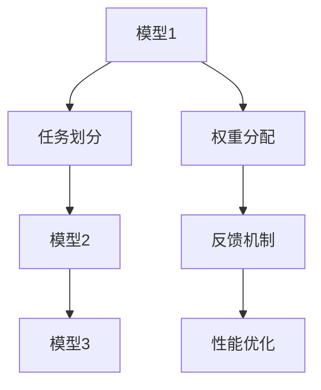
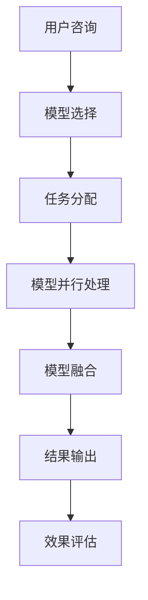
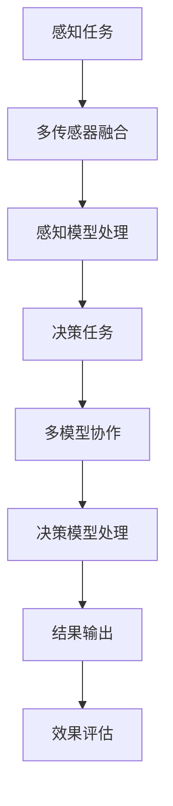
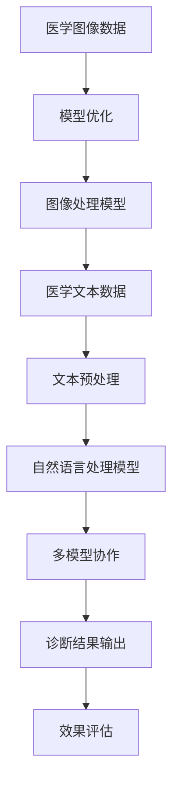

                 

### 文章标题

# AI模型的任务分配与协作

> 关键词：人工智能、任务分配、协作、算法、深度学习

> 摘要：本文深入探讨了AI模型在任务分配与协作中的关键问题。从基本概念、数学基础、深度学习原理到任务分配与协作算法，再到实际案例分析，全面解析了AI模型在复杂任务环境下的高效协作策略。文章旨在为读者提供系统性、实用性的技术指导，帮助他们在实际项目中更好地应用AI模型，实现任务的高效分配与协作。

---

## 引言

在当今快速发展的技术时代，人工智能（AI）已经从理论走向实践，并在众多领域取得了显著的成果。无论是自然语言处理、图像识别，还是智能决策和自动驾驶，AI模型的应用正在不断拓展。然而，随着任务复杂度的增加，单一AI模型的局限性也逐渐显现。如何有效分配任务，使多个AI模型协同工作，成为当前研究的热点之一。

AI模型的任务分配与协作不仅涉及到模型的性能优化，还涉及到系统设计、资源调度等多个方面。合理的任务分配能够提高模型的执行效率，减少冗余计算，而有效的协作则能充分利用各模型的优点，实现更精准的预测和决策。本文将从以下几个方面进行详细探讨：

1. **AI模型概述与基础**：介绍AI模型的基本概念、发展历程和应用领域，为后续讨论提供理论基础。
2. **任务分配与协作算法**：分析任务分配算法的基本原理和优化策略，以及模型协作算法的核心思想和实现方法。
3. **实践与优化**：通过实际案例，展示AI模型任务分配与协作的具体应用，并提供优化方案。
4. **附录**：列出常用的工具和库，以及参考文献，以便读者进一步学习和研究。

希望通过本文的探讨，读者能够对AI模型的任务分配与协作有一个全面、深入的理解，并在实际项目中灵活应用，提升AI系统的整体性能。

## 第一部分：AI模型概述与基础

### 第1章：AI模型概述

#### 1.1 AI模型的基本概念

人工智能（AI）模型是指通过算法和数据分析方法，使计算机具备模拟、延伸和扩展人类智能能力的一系列工具和系统。这些模型通过学习和处理大量数据，能够实现智能决策、预测和问题解决。

AI模型通常分为两种类型：监督学习模型和无监督学习模型。监督学习模型依赖于标记数据，通过已知的输入和输出关系来训练模型，从而实现对新数据的预测。无监督学习模型则不依赖标记数据，通过数据本身的内在结构来发现模式和关系。

#### 1.2 AI模型的发展历程

人工智能的发展历程可以追溯到20世纪50年代。当时，研究者首次提出“人工智能”这一概念，并开始探索如何使计算机具备智能行为。经过几十年的发展，AI经历了几个重要阶段：

1. **早期探索（1950s-1960s）**：这一阶段以符号主义方法为主，研究者试图通过编写规则和逻辑推理来实现人工智能。
2. **专家系统时代（1970s-1980s）**：专家系统是早期AI的主要形式，通过将专家知识编码成规则库，实现问题求解和决策支持。
3. **机器学习兴起（1990s-2000s）**：随着计算能力的提升和数据量的增加，机器学习方法开始受到关注。这一阶段以统计学习和模式识别为主要研究方向。
4. **深度学习崛起（2010s-至今）**：深度学习通过模拟人脑神经网络结构，实现了在图像识别、语音识别等领域的突破性进展。随着计算能力的进一步提升，深度学习逐渐成为AI研究的主流方向。

#### 1.3 AI模型的应用领域

AI模型在众多领域取得了广泛应用，以下是几个典型的应用领域：

1. **自然语言处理（NLP）**：AI模型在NLP领域被广泛应用于文本分类、情感分析、机器翻译等任务。
2. **计算机视觉**：AI模型在图像识别、目标检测、人脸识别等计算机视觉任务中表现出色，被应用于安防监控、自动驾驶等领域。
3. **智能决策**：AI模型在金融、医疗、物流等领域被用于数据分析和决策支持，实现自动化和智能化管理。
4. **游戏和娱乐**：AI模型在游戏开发、智能推荐系统等领域发挥了重要作用，提升了用户体验。

通过以上对AI模型基本概念、发展历程和应用领域的介绍，我们为后续章节的深入探讨奠定了基础。

#### Mermaid 流程图

以下是一个简单的Mermaid流程图，展示了AI模型的基本概念和发展历程：



该流程图清晰地展示了AI模型从早期探索到深度学习崛起的发展路径，以及各类学习模型的应用场景。

### 第2章：AI模型的数学基础

#### 2.1 线性代数基础

线性代数是AI模型的重要数学工具，它提供了一种描述和解决问题的高效方法。以下是一些线性代数基础概念：

1. **向量与矩阵**：向量是具有大小和方向的量，可以表示为行向量或列向量。矩阵是二维数组，用于表示多个向量的组合。矩阵的基本运算包括加法、减法、乘法和转置。
2. **行列式**：行列式是一个用来表示矩阵特性的数值。行列式可以用来判断矩阵的行列式是否为零，进而判断矩阵是否可逆。
3. **矩阵乘法**：矩阵乘法是将两个矩阵按一定规则进行运算，得到一个新的矩阵。矩阵乘法在AI模型中广泛应用于计算特征值、特征向量等。
4. **逆矩阵**：逆矩阵是一个矩阵的逆运算，使得原矩阵与其相乘后得到单位矩阵。逆矩阵在AI模型中常用于求解线性方程组。

以下是一个简单的伪代码，展示了矩阵乘法的计算过程：

```python
def matrix_multiply(A, B):
    n = len(A)
    m = len(B[0])
    p = len(B)
    C = [[0] * m for _ in range(n)]
    for i in range(n):
        for j in range(m):
            for k in range(p):
                C[i][j] += A[i][k] * B[k][j]
    return C
```

#### 2.2 概率论基础

概率论是AI模型中另一个重要的数学工具，用于描述不确定性和随机性。以下是一些基本概率概念：

1. **概率分布**：概率分布描述了一个随机变量的所有可能取值及其概率。常见的概率分布包括伯努利分布、正态分布、泊松分布等。
2. **条件概率**：条件概率描述了在某个事件发生的条件下，另一个事件发生的概率。条件概率的计算公式为 $P(A|B) = \frac{P(A \cap B)}{P(B)}$。
3. **贝叶斯定理**：贝叶斯定理是一种用于计算后验概率的公式，它在AI模型中的应用非常广泛。贝叶斯定理的公式为 $P(A|B) = \frac{P(B|A)P(A)}{P(B)}$。
4. **独立性**：两个事件A和B是独立的，如果它们的发生互不影响，即 $P(A \cap B) = P(A)P(B)$。

以下是一个简单的伪代码，展示了贝叶斯定理的应用：

```python
def bayes_theorem(P_A, P_B_given_A, P_B):
    P_A_given_B = (P_B_given_A * P_A) / P_B
    return P_A_given_B
```

#### 2.3 最优化算法基础

最优化算法是AI模型中的核心工具，用于寻找最优解。以下是一些基本的最优化算法：

1. **梯度下降法**：梯度下降法是一种迭代优化算法，用于求解最优化问题。其基本思想是沿着目标函数的梯度方向逐步更新参数，以减少目标函数的值。梯度下降法的伪代码如下：

```python
def gradient_descent(parameters, learning_rate, num_iterations):
    for _ in range(num_iterations):
        gradients = compute_gradients(parameters)
        parameters -= learning_rate * gradients
    return parameters
```

2. **随机梯度下降（SGD）**：随机梯度下降是梯度下降法的一个变种，通过随机选取样本更新参数，以加速收敛。SGD的伪代码如下：

```python
def stochastic_gradient_descent(parameters, learning_rate, batch_size, num_iterations):
    for _ in range(num_iterations):
        for sample in generate_samples(batch_size):
            gradients = compute_gradients(parameters, sample)
            parameters -= learning_rate * gradients
    return parameters
```

3. **牛顿法**：牛顿法是一种基于二阶导数的最优化算法，通过迭代求解目标函数的临界点。牛顿法的伪代码如下：

```python
def newton_method(parameters, learning_rate, num_iterations):
    for _ in range(num_iterations):
        H = compute_hessian(parameters)
        f = compute_function_value(parameters)
        delta = compute_inverse(H) @ f
        parameters -= learning_rate * delta
    return parameters
```

通过以上对线性代数、概率论和最优化算法基础的介绍，我们为理解AI模型的工作原理和实现方法提供了必要的数学工具。

### 第3章：深度学习基础

#### 3.1 神经网络基本结构

神经网络是深度学习的基础，它由一系列模拟人脑神经元连接的结构组成。以下介绍神经网络的基本结构：

1. **神经元**：神经网络中的基本单元，通常称为神经元或节点。每个神经元接收多个输入信号，通过加权求和后，经过一个非线性激活函数输出。
2. **层**：神经网络可以分为输入层、隐藏层和输出层。输入层接收外部数据，隐藏层进行特征提取和变换，输出层产生最终预测或决策。
3. **权重和偏置**：每个神经元之间的连接都带有权重和偏置，用于调整输入信号的强度和位置。通过反向传播算法，神经网络可以自动调整这些参数，以优化预测性能。

以下是一个简化的神经网络结构示意图：



#### 3.2 深度学习训练原理

深度学习训练的核心是优化神经网络中的权重和偏置，以最小化预测误差。以下介绍深度学习训练的基本原理：

1. **前向传播**：在前向传播过程中，输入数据依次通过神经网络的各层，每个神经元的输出作为下一层的输入。通过计算每个神经元的加权求和，并应用激活函数，最终得到输出层的结果。
2. **反向传播**：在反向传播过程中，计算输出层的误差，并沿着网络反向传递，计算每个神经元对误差的贡献。这个过程中，使用梯度下降等优化算法，更新神经网络的权重和偏置，以减小误差。
3. **优化算法**：常见的优化算法包括梯度下降、随机梯度下降、Adam等。这些算法通过迭代更新参数，逐渐减小误差，达到训练目标。

以下是一个简单的伪代码，展示了神经网络的前向传播和反向传播过程：

```python
def forward_propagation(inputs, weights, biases, activation_function):
    outputs = inputs
    for weight, bias in zip(weights, biases):
        outputs = activation_function(np.dot(outputs, weight) + bias)
    return outputs

def backward_propagation(inputs, outputs, weights, biases, learning_rate, activation_derivative):
    gradients = [activation_derivative(outputs) * (outputs - target)]
    for weight, bias in zip(reversed(weights), reversed(biases)):
        delta = gradients[-1] * activation_derivative(np.dot(inputs, weight) + bias)
        gradients.append(delta)
    gradients.reverse()
    for i, (weight, bias) in enumerate(zip(reversed(weights), reversed(biases))):
        weight -= learning_rate * np.dot(gradients[i+1], inputs)
        bias -= learning_rate * gradients[i+1]
    return gradients
```

#### 3.3 深度学习优化策略

为了提高深度学习模型的性能，可以采用以下优化策略：

1. **激活函数**：选择合适的激活函数，如ReLU、Sigmoid、Tanh等，可以影响网络的收敛速度和性能。
2. **权重初始化**：合理的权重初始化可以加速网络收敛，避免梯度消失或爆炸。常用的初始化方法包括随机初始化、高斯初始化等。
3. **正则化**：正则化方法如L1、L2正则化，可以防止模型过拟合，提高泛化能力。
4. **学习率调度**：动态调整学习率，如使用学习率衰减、余弦退火等策略，可以优化模型的训练过程。
5. **批量归一化**：批量归一化（Batch Normalization）通过标准化每个批次的输入数据，可以加速网络训练并提高模型稳定性。

通过以上对神经网络基本结构、深度学习训练原理和优化策略的介绍，我们为理解深度学习模型的工作原理和实现方法提供了必要的理论基础。

### 第4章：AI模型协作原理

#### 4.1 多模型协作的基本概念

多模型协作是指多个AI模型在特定任务中相互配合，共同完成目标的过程。协作的目的是充分利用各模型的优点，克服单一模型的局限性，提高整体性能。以下介绍多模型协作的基本概念：

1. **模型独立性**：多模型协作中，各个模型相对独立，各模型可以独立训练和部署，但在协作任务中共同发挥作用。
2. **协同策略**：协同策略是多模型协作的核心，包括模型间的通信机制、任务分配方案、协作算法等。不同的协同策略适用于不同的任务场景。
3. **性能提升**：多模型协作能够通过整合各模型的优势，实现性能提升。例如，一个模型擅长特征提取，另一个模型擅长分类，通过协作可以实现更精准的预测。

以下是一个简单的Mermaid流程图，展示了多模型协作的基本概念：



#### 4.2 多模型协作的挑战与解决方案

多模型协作虽然能够提升性能，但也面临一系列挑战。以下介绍这些挑战及相应的解决方案：

1. **通信开销**：多模型协作需要各模型之间进行通信，通信开销可能影响协作效率。解决方案包括：
   - **分布式计算**：将模型部署在分布式环境中，通过数据并行和模型并行提高通信效率。
   - **低延迟通信**：采用高效的通信协议和硬件加速技术，减少通信延迟。

2. **模型一致性**：在多模型协作中，各模型需要保持一致性，以避免冲突和错误。解决方案包括：
   - **一致性协议**：采用一致性协议，如锁机制、版本控制等，确保各模型的状态一致。
   - **数据同步**：定期同步各模型的数据，确保数据的一致性。

3. **性能优化**：多模型协作需要考虑整体性能优化，包括任务分配、资源调度等。解决方案包括：
   - **动态调度**：根据任务负载和模型性能，动态调整任务分配和资源使用。
   - **负载均衡**：通过负载均衡策略，合理分配任务，避免某个模型过载。

4. **模型融合**：在多模型协作中，如何有效地融合各模型的结果，是提升性能的关键。解决方案包括：
   - **投票法**：将各模型的结果进行投票，选取多数模型的结果作为最终输出。
   - **加权融合**：根据各模型的性能和重要性，对结果进行加权融合，得到最终输出。

以下是一个简单的Mermaid流程图，展示了多模型协作的挑战及解决方案：



通过以上对多模型协作的基本概念、挑战与解决方案的介绍，我们为理解多模型协作提供了理论基础，为实际应用提供了指导。

### 第5章：任务分配算法基础

#### 5.1 任务分配问题概述

任务分配问题是AI模型协作中的一个核心问题，其目标是合理地将任务分配给不同的模型或计算节点，以最大化整体性能。以下是对任务分配问题的一个概述：

1. **定义**：任务分配问题可以形式化为一个图论问题。在这个图中，节点表示任务，边表示任务之间的依赖关系。目标是通过合理的分配策略，使得每个节点（任务）都能高效地完成其任务。
2. **目标函数**：任务分配的目标函数通常包括以下几种：
   - **最小化完成时间**：尽量缩短所有任务的完成时间。
   - **最大化吞吐量**：尽量处理更多的任务。
   - **最小化资源消耗**：在完成任务的前提下，尽量减少所需的资源消耗。
   - **均衡负载**：确保每个节点（模型或计算节点）的负载均衡。
3. **约束条件**：任务分配问题还涉及到一系列的约束条件，包括：
   - **依赖约束**：任务之间存在先后顺序，某些任务必须先完成才能开始后续任务。
   - **资源约束**：每个节点（模型或计算节点）有其最大处理能力，不能超出其处理能力。
   - **质量约束**：某些任务对质量有特定要求，需要分配给特定的模型或计算节点。

以下是一个简单的Mermaid流程图，展示了任务分配问题的基本概念：



通过以上对任务分配问题概述的介绍，我们为理解任务分配问题的基本概念和目标提供了理论基础。

#### 5.2 贪心算法在任务分配中的应用

贪心算法是一种常用的任务分配策略，其核心思想是在每一步选择中选择当前最优解，从而希望整体上得到最优解。以下介绍贪心算法在任务分配中的应用：

1. **基本思想**：贪心算法的基本步骤如下：
   - 初始化：将所有任务和模型/计算节点进行排序，通常按照任务的重要性或处理时间。
   - 分配：依次为每个任务选择最优的模型或计算节点，直到所有任务都被分配。
2. **具体步骤**：
   - **排序**：将任务和模型/计算节点按照一定的标准进行排序，如处理时间、资源需求等。
   - **分配**：依次为每个任务选择当前最优的模型或计算节点。如果多个模型或计算节点都可选，通常选择处理时间最短或资源消耗最小的模型或计算节点。
   - **更新**：更新模型或计算节点的状态，记录已分配的任务，并重新排序未分配的任务和模型/计算节点。

以下是一个简单的伪代码，展示了贪心算法在任务分配中的具体实现：

```python
def greedy_allocation(tasks, models):
    sorted_tasks = sort_tasks_by_priority(tasks)
    allocated_tasks = []
    for task in sorted_tasks:
        best_model = None
        best_cost = float('inf')
        for model in models:
            if can_allocate(task, model) and model.cost < best_cost:
                best_model = model
                best_cost = model.cost
        if best_model is not None:
            allocate_task_to_model(task, best_model)
            allocated_tasks.append(task)
    return allocated_tasks
```

其中，`sort_tasks_by_priority`函数用于按优先级对任务进行排序，`can_allocate`函数用于判断任务是否可以被分配给模型，`allocate_task_to_model`函数用于将任务分配给模型。

贪心算法在任务分配中的优点是计算简单、实现容易，能够在一定程度上优化任务分配。然而，贪心算法也存在一些缺点：

1. **局限性**：贪心算法只能保证每一步的最优，但不能保证整体最优。在某些复杂场景下，可能无法找到最优解。
2. **不稳定性**：贪心算法的结果可能受初始排序的影响，不同的初始排序可能得到不同的分配结果。

为了克服这些缺点，可以采用以下优化策略：

1. **多阶段优化**：将任务分配过程分为多个阶段，每个阶段采用不同的贪心策略，逐步优化分配结果。
2. **动态调整**：根据任务执行过程中收集到的反馈信息，动态调整模型和任务的分配。
3. **混合策略**：结合其他优化算法，如遗传算法、模拟退火等，以提高任务分配的稳定性。

通过以上对贪心算法在任务分配中的应用和优化策略的介绍，我们为理解贪心算法在任务分配中的应用提供了具体的实现方法和优化方向。

#### 5.3 分配算法优化策略

为了提高任务分配算法的性能，可以采用多种优化策略，以克服贪心算法的局限性。以下介绍几种常用的优化策略：

1. **动态调整**：在任务执行过程中，根据任务的执行状态和系统负载动态调整任务分配。这种方法可以适应动态变化的任务场景，提高整体性能。
   - **实时反馈**：通过实时监控系统负载和任务执行状态，及时调整任务分配，避免某个模型或计算节点过载。
   - **自适应调整**：根据历史数据和当前任务特点，自适应调整模型和任务的分配策略，提高任务分配的准确性。

2. **多阶段优化**：将任务分配过程分为多个阶段，每个阶段采用不同的优化策略，逐步优化分配结果。
   - **初始阶段**：在初始阶段，采用贪心算法快速分配任务，以保证任务的快速执行。
   - **中间阶段**：在中间阶段，采用局部搜索算法，如模拟退火、遗传算法等，对已分配的任务进行调整，提高整体性能。
   - **最终阶段**：在最终阶段，采用全局优化算法，如线性规划、整数规划等，对任务分配进行全局优化，确保最优解。

3. **混合策略**：结合不同的优化算法，形成混合策略，以提高任务分配的稳定性和性能。
   - **贪心+局部搜索**：在初始阶段采用贪心算法，快速分配任务；在中间阶段采用局部搜索算法，逐步优化分配结果。
   - **贪心+全局优化**：在初始阶段采用贪心算法，快速分配任务；在最终阶段采用全局优化算法，确保最优解。

4. **负载均衡**：通过负载均衡策略，合理分配任务，避免某个模型或计算节点过载。
   - **静态负载均衡**：根据系统负载和模型性能，预先分配任务，确保每个模型或计算节点的负载均衡。
   - **动态负载均衡**：在任务执行过程中，根据系统负载和任务执行状态，动态调整任务分配，避免某个模型或计算节点过载。

5. **分布式计算**：采用分布式计算框架，将任务分配到不同的计算节点，提高整体计算性能。
   - **数据并行**：将任务数据分布在不同的计算节点上，各节点独立执行任务，最后汇总结果。
   - **模型并行**：将模型分布在不同的计算节点上，各节点并行执行模型，最后汇总结果。

6. **资源调度**：通过合理的资源调度策略，优化任务执行过程中的资源使用。
   - **资源预留**：在任务执行前，预留足够的计算资源，确保任务能够顺利完成。
   - **资源回收**：在任务完成后，及时回收释放的资源，以提高系统的资源利用率。

通过以上优化策略，可以显著提高任务分配算法的性能和稳定性，为实际应用提供更有效的解决方案。

### 第6章：模型协作算法

#### 6.1 模型协作原理

在AI模型协作中，模型协作算法是核心组成部分，负责协调和优化不同模型之间的交互。以下介绍模型协作原理：

1. **协作目标**：模型协作的主要目标是提升整体性能，通过整合各模型的优点，实现更精准的预测和决策。具体目标包括：
   - **性能优化**：提高模型在特定任务上的表现，如降低预测误差、提高分类准确率等。
   - **资源利用**：优化资源分配，提高系统资源利用率，减少计算开销。
   - **稳定性提升**：增强模型的鲁棒性和稳定性，减少错误率和异常情况。

2. **协作方式**：模型协作可以采用多种方式，主要包括以下几种：
   - **并行协作**：多个模型同时执行任务，各自处理部分数据，最后汇总结果。这种方法可以充分利用并行计算的优势，提高整体性能。
   - **串联协作**：多个模型依次执行，前一个模型的输出作为后一个模型的输入。这种方法可以逐步细化处理，提高模型的精度。
   - **混合协作**：结合并行协作和串联协作的优点，根据任务特点灵活调整协作方式。

3. **协作策略**：模型协作策略包括以下几种：
   - **任务划分**：根据任务特点，将任务划分为多个子任务，分别分配给不同的模型执行。
   - **权重分配**：根据各模型的性能和重要性，为每个模型分配不同的权重，以影响最终结果的权重。
   - **反馈机制**：通过反馈机制，模型间可以相互传递信息，调整自身行为，优化协作效果。

以下是一个简单的Mermaid流程图，展示了模型协作的基本原理：



通过以上对模型协作原理的介绍，我们为理解模型协作的基本概念和实现方法提供了理论基础。

#### 6.2 模型融合算法

模型融合算法是模型协作中的重要组成部分，旨在通过整合多个模型的结果，提升整体预测性能。以下介绍几种常见的模型融合算法：

1. **投票法**：

投票法是一种简单且常用的模型融合算法，其基本思想是对于每个预测任务，多个模型分别给出预测结果，最后选取多数模型的结果作为最终预测。

- **优点**：实现简单，易于理解和实现。
- **缺点**：仅考虑了模型结果的一致性，未能充分利用各模型的差异。

以下是一个简单的伪代码，展示了投票法的实现：

```python
def voting(forecast_results):
    result_counts = Counter(forecast_results)
    majority_result = result_counts.most_common(1)[0][0]
    return majority_result
```

2. **加权融合**：

加权融合是对投票法的一种改进，考虑了各模型的性能和重要性，为每个模型分配不同的权重。预测结果通过加权平均或加权投票得到。

- **优点**：能充分利用各模型的差异，提高整体预测性能。
- **缺点**：需要确定合理的权重分配，否则可能导致结果偏差。

以下是一个简单的伪代码，展示了加权融合的实现：

```python
def weighted_fusion(forecast_results, weights):
    weighted_sum = sum(result * weight for result, weight in zip(forecast_results, weights))
    return weighted_sum / sum(weights)
```

3. **集成学习**：

集成学习是一种更为复杂的模型融合方法，通过构建多个子模型，然后融合这些子模型的结果。常见的集成学习方法包括Bagging、Boosting和Stacking等。

- **Bagging**：通过多次训练和随机抽样，构建多个子模型，然后融合这些子模型的结果。Bagging方法包括随机森林和随机梯度下降等。
- **Boosting**：通过调整子模型的权重，使其对错误率较高的样本给予更多的关注。常见的Boosting方法包括Adaboost和XGBoost等。
- **Stacking**：将多个子模型的结果作为新的特征，构建一个新的模型进行预测。Stacking方法包括Stacked Generalization等。

以下是一个简单的伪代码，展示了集成学习的实现：

```python
def ensemble_learning(models, learner):
    ensemble_data = []
    for model in models:
        predictions = model.predict()
        ensemble_data.append(predictions)
    ensemble_predictions = learner.fit(ensemble_data).predict(ensemble_data)
    return ensemble_predictions
```

通过以上对投票法、加权融合和集成学习等模型融合算法的介绍，我们为理解模型融合的基本原理和实现方法提供了具体示例。

#### 6.3 多模型训练策略

在多模型协作中，如何进行模型训练是关键问题之一。以下介绍几种常见的多模型训练策略：

1. **独立训练**：

独立训练是指每个模型独立进行训练，不依赖其他模型的结果。这种方法适用于模型间的任务相对独立或数据集分布较均匀的情况。

- **优点**：简单易实现，各模型可以独立优化。
- **缺点**：未能充分利用模型间的协作潜力，可能影响整体性能。

2. **同步训练**：

同步训练是指多个模型同时进行训练，通过共享部分参数或模型结构来提高整体性能。这种方法适用于模型间有较强的依赖关系或需要协同完成任务的情况。

- **优点**：能够充分利用模型间的协作，提高整体性能。
- **缺点**：参数同步可能引入冗余计算，增加通信开销。

以下是一个简单的伪代码，展示了同步训练的实现：

```python
def synchronous_training(models, learning_rate, num_iterations):
    for iteration in range(num_iterations):
        gradients = compute_gradients(models)
        for model in models:
            model.update_parameters(learning_rate, gradients)
    return models
```

3. **异步训练**：

异步训练是指多个模型在不同时间进行训练，通过定期同步模型参数来更新各模型。这种方法适用于模型间需要频繁交互或实时更新的场景。

- **优点**：能够充分利用并行计算的优势，提高训练效率。
- **缺点**：参数同步可能引入延迟，影响整体性能。

以下是一个简单的伪代码，展示了异步训练的实现：

```python
def asynchronous_training(models, learning_rate, num_iterations):
    for iteration in range(num_iterations):
        for model in models:
            model.train(learning_rate)
        synchronize_models(models)
    return models
```

4. **混合训练**：

混合训练是将同步训练和异步训练结合，根据不同场景和需求灵活调整训练策略。这种方法能够充分利用同步和异步训练的优点，提高整体性能。

- **优点**：灵活适应不同训练场景，提高整体性能。
- **缺点**：实现较为复杂，需要根据具体场景进行调整。

以下是一个简单的伪代码，展示了混合训练的实现：

```python
def mixed_training(models, synchronous_rate, asynchronous_rate, learning_rate, num_iterations):
    for iteration in range(num_iterations):
        if iteration % synchronous_rate == 0:
            gradients = compute_gradients(models)
            for model in models:
                model.update_parameters(learning_rate, gradients)
        else:
            for model in models:
                model.train(learning_rate)
        if iteration % asynchronous_rate == 0:
            synchronize_models(models)
    return models
```

通过以上对独立训练、同步训练、异步训练和混合训练等策略的介绍，我们为理解多模型训练策略提供了具体实现方法和优化方向。

### 第7章：任务分配与协作案例分析

#### 7.1 案例一：智能客服系统

智能客服系统是AI模型协作的一个典型应用场景。以下介绍智能客服系统中任务分配与协作的具体应用。

1. **任务分配**：

在智能客服系统中，任务分配涉及到将用户咨询的问题分配给合适的AI模型进行处理。任务分配的关键是确定每个模型的能力和适用场景。

- **模型选择**：根据问题的类型和复杂性，选择合适的AI模型。例如，对于常见问题，可以选择预训练的模板匹配模型；对于复杂问题，可以选择深度学习模型进行自然语言处理。
- **动态分配**：根据系统负载和模型性能，动态调整任务分配。例如，当系统负载较高时，可以增加模板匹配模型的处理能力，降低深度学习模型的处理负载。

2. **协作策略**：

在智能客服系统中，多个AI模型需要协作处理用户咨询。协作策略包括以下几种：

- **多模型并行处理**：将用户咨询分配给多个AI模型，分别处理不同部分的内容，最后汇总结果。这种方法能够充分利用并行计算的优势，提高响应速度。
- **模型融合**：将多个模型的预测结果进行融合，提高整体预测准确性。例如，通过投票法或加权融合，结合多个模型的预测结果，得到最终的答案。

3. **效果评估**：

智能客服系统的效果评估主要从以下几个方面进行：

- **响应速度**：评估系统处理用户咨询的平均响应时间，确保用户得到及时的回复。
- **准确性**：评估系统预测的准确性，确保提供正确的答案和建议。
- **用户体验**：通过用户反馈和满意度调查，评估系统的用户体验和用户接受度。

以下是一个简单的Mermaid流程图，展示了智能客服系统中的任务分配与协作：



通过以上对智能客服系统中任务分配与协作案例的介绍，我们展示了如何利用多模型协作技术，实现高效、准确的智能客服系统。

#### 7.2 案例二：自动驾驶系统

自动驾驶系统是另一个重要的AI应用场景，任务分配与协作在其中扮演着关键角色。以下介绍自动驾驶系统中任务分配与协作的具体应用。

1. **任务分配**：

在自动驾驶系统中，任务分配涉及到将不同感知和决策任务分配给相应的AI模型。任务分配的关键是确保系统的实时性和准确性。

- **感知任务分配**：自动驾驶系统需要实时感知周围环境，包括车辆、行人、交通信号等。任务分配策略包括：
  - **多传感器融合**：结合雷达、摄像头、激光雷达等多传感器数据，分配给不同的感知模型，提高感知准确性。
  - **动态分配**：根据环境变化和系统负载，动态调整感知任务的分配，确保关键任务得到优先处理。

- **决策任务分配**：自动驾驶系统需要根据感知结果做出实时决策，包括路径规划、速度控制等。任务分配策略包括：
  - **多模型协作**：结合深度学习模型、规则引擎等，实现决策任务的协作，提高决策的稳定性和准确性。
  - **任务优先级**：根据任务的紧急程度和重要性，设定任务优先级，确保关键任务得到优先处理。

2. **协作策略**：

在自动驾驶系统中，不同AI模型需要协作处理感知和决策任务，实现系统整体性能的优化。协作策略包括以下几种：

- **实时协作**：通过实时数据通信，实现感知模型和决策模型之间的协作。例如，感知模型将感知结果实时发送给决策模型，决策模型根据感知结果做出实时决策。
- **分布式计算**：将自动驾驶系统部署在分布式计算环境中，实现感知和决策任务的并行处理，提高系统响应速度和计算性能。
- **模型融合**：将多个感知和决策模型的结果进行融合，提高整体决策的准确性和稳定性。例如，通过投票法或加权融合，结合多个模型的决策结果，得到最终的决策。

3. **效果评估**：

自动驾驶系统的效果评估主要从以下几个方面进行：

- **安全性**：评估系统的安全性能，包括事故率、误操作率等。
- **效率**：评估系统的行驶效率和能耗，确保自动驾驶车辆的高效运行。
- **用户体验**：通过用户反馈和满意度调查，评估系统的用户体验和用户接受度。

以下是一个简单的Mermaid流程图，展示了自动驾驶系统中的任务分配与协作：



通过以上对自动驾驶系统中任务分配与协作案例的介绍，我们展示了如何利用多模型协作技术，实现高效、安全的自动驾驶系统。

#### 7.3 案例三：智能医疗诊断系统

智能医疗诊断系统是AI在医疗领域的典型应用，任务分配与协作在其中发挥着重要作用。以下介绍智能医疗诊断系统中任务分配与协作的具体应用。

1. **任务分配**：

在智能医疗诊断系统中，任务分配涉及到将不同类型的医疗数据分配给相应的AI模型进行分析和处理。任务分配的关键是确保诊断的准确性和实时性。

- **医学图像处理**：将医学图像数据分配给深度学习模型进行图像处理，包括病灶检测、分割等。任务分配策略包括：
  - **模型优化**：根据图像数据的类型和特征，选择合适的深度学习模型，并进行优化，提高图像处理的准确性。
  - **多模型协作**：结合多个深度学习模型，实现图像处理的协同，提高整体诊断的准确性。

- **医学文本分析**：将医学文本数据分配给自然语言处理模型进行分析，包括疾病诊断、症状识别等。任务分配策略包括：
  - **文本预处理**：对医学文本进行预处理，包括分词、去噪等，提高文本分析的准确性。
  - **多模型协作**：结合多个自然语言处理模型，实现文本分析的协同，提高整体诊断的准确性。

2. **协作策略**：

在智能医疗诊断系统中，不同AI模型需要协作处理医疗数据，实现诊断任务的协同。协作策略包括以下几种：

- **数据共享**：通过数据共享机制，实现不同AI模型之间的数据传递和共享，提高诊断的准确性和实时性。
- **协同训练**：将不同AI模型进行协同训练，结合各模型的优点，提高整体诊断的准确性和稳定性。
- **模型融合**：将多个AI模型的结果进行融合，提高整体诊断的准确性和可靠性。例如，通过加权融合或集成学习，结合多个模型的诊断结果，得到最终的诊断结果。

3. **效果评估**：

智能医疗诊断系统的效果评估主要从以下几个方面进行：

- **诊断准确性**：评估系统在不同疾病诊断任务上的准确性，包括病灶检测、症状识别等。
- **诊断效率**：评估系统的诊断效率和响应时间，确保患者得到及时的诊断结果。
- **用户体验**：通过用户反馈和满意度调查，评估系统的用户体验和用户接受度。

以下是一个简单的Mermaid流程图，展示了智能医疗诊断系统中的任务分配与协作：



通过以上对智能医疗诊断系统中任务分配与协作案例的介绍，我们展示了如何利用多模型协作技术，实现高效、准确的智能医疗诊断系统。

### 第8章：AI模型任务分配与协作实践

#### 8.1 实践环境搭建

为了实现AI模型的任务分配与协作，我们需要搭建一个合适的环境。以下介绍搭建实践环境的具体步骤：

1. **硬件准备**：

   - **计算资源**：准备一台或多台高性能服务器，用于部署AI模型和任务分配系统。建议配置至少64GB内存和8核CPU。
   - **存储设备**：准备足够的存储空间，用于存储数据和模型文件。建议使用SSD硬盘，以提高数据读写速度。

2. **软件安装**：

   - **操作系统**：安装Linux操作系统，如Ubuntu 20.04或CentOS 8。
   - **深度学习框架**：安装常用的深度学习框架，如TensorFlow和PyTorch。可以通过以下命令进行安装：

     ```bash
     pip install tensorflow
     pip install torch torchvision
     ```

   - **任务调度工具**：安装任务调度工具，如Celery。Celery是一个分布式任务队列，可用于实现任务的分布式处理。

     ```bash
     pip install celery
     ```

   - **消息队列**：安装消息队列工具，如RabbitMQ或Kafka。消息队列用于实现任务分配系统中的通信。

     ```bash
     pip install pika
     ```

3. **网络配置**：

   - **内网通信**：确保服务器之间能够通过内网进行通信，便于实现任务的分布式处理。
   - **防火墙设置**：配置防火墙规则，允许必要的网络通信，如HTTP、HTTPS、MQTT等。

4. **数据库配置**：

   - **关系型数据库**：安装关系型数据库，如MySQL或PostgreSQL。用于存储任务分配系统和模型训练的相关数据。
   - **NoSQL数据库**：安装NoSQL数据库，如MongoDB。用于存储大规模数据和模型参数。

5. **容器化**：

   - **Docker**：安装Docker，用于容器化AI模型和任务分配系统。可以通过以下命令进行安装：

     ```bash
     sudo apt-get update
     sudo apt-get install docker-ce docker-ce-cli containerd.io
     ```

   - **Kubernetes**：安装Kubernetes，用于容器编排和管理。可以通过以下命令进行安装：

     ```bash
     curl -LO "https://storage.googleapis.com/kubernetes-release/release/$(curl -s https://storage.googleapis.com/kubernetes-release/release/stable.txt)/bin/darwin/amd64/kubectl"
     chmod +x kubectl
     sudo mv kubectl /usr/local/bin/kubectl
     ```

通过以上步骤，我们可以搭建一个基本的环境，用于实现AI模型的任务分配与协作实践。接下来，我们将介绍具体的实现方法和步骤。

#### 8.2 任务分配与协作实现

在实际项目中，实现AI模型的任务分配与协作需要综合考虑模型性能、系统资源、任务特点等多个因素。以下介绍任务分配与协作的实现方法：

1. **任务模型定义**：

   在任务分配系统中，我们需要定义任务模型，包括任务类型、任务参数、任务依赖关系等。以下是一个简单的任务模型示例：

   ```python
   class Task(models.Model):
       name = models.CharField(max_length=255)
       type = models.CharField(max_length=255)
       parameters = models.JSONField()
       status = models.CharField(max_length=255)
       dependencies = models.ManyToManyField('self', symmetrical=True)
   ```

   其中，`name`表示任务的名称，`type`表示任务类型（如感知、决策等），`parameters`存储任务的参数信息，`status`表示任务状态（如排队、执行中、完成等），`dependencies`表示任务的依赖关系。

2. **任务分配策略**：

   任务分配策略是实现任务分配与协作的关键。以下介绍两种常见的任务分配策略：贪心算法和基于优先级的分配策略。

   - **贪心算法**：

     贪心算法是一种简单的任务分配策略，通过每次选择最优任务进行分配。以下是一个简单的贪心算法实现示例：

     ```python
     def greedy_allocation(available_models, tasks):
         allocated_tasks = []
         while tasks:
             best_model = None
             for model in available_models:
                 if model.can_handle_task(tasks[0]):
                     if best_model is None or model.priority > best_model.priority:
                         best_model = model
             if best_model:
                 best_model.allocate_task(tasks[0])
                 allocated_tasks.append(tasks[0])
                 tasks.remove(tasks[0])
         return allocated_tasks
     ```

     其中，`available_models`是可用的模型列表，`tasks`是待分配的任务列表。`can_handle_task`方法用于判断模型是否能够处理某个任务，`priority`表示模型的优先级。

   - **基于优先级的分配策略**：

     基于优先级的分配策略是根据任务的优先级进行分配。以下是一个简单的实现示例：

     ```python
     def priority_allocation(available_models, tasks):
         sorted_tasks = sorted(tasks, key=lambda x: x.priority, reverse=True)
         allocated_tasks = []
         for task in sorted_tasks:
             for model in available_models:
                 if model.can_handle_task(task):
                     model.allocate_task(task)
                     allocated_tasks.append(task)
                     break
         return allocated_tasks
     ```

     其中，`tasks`是待分配的任务列表，`priority`表示任务的优先级。`can_handle_task`方法用于判断模型是否能够处理某个任务。

3. **模型协作策略**：

   模型协作策略是在任务分配的基础上，实现多个模型之间的协作。以下介绍两种常见的模型协作策略：数据共享和模型融合。

   - **数据共享**：

     数据共享策略是通过数据传递，实现多个模型之间的协作。以下是一个简单的实现示例：

     ```python
     def data_sharing协同策略(models, data):
         for model in models:
             model.process_data(data)
         results = [model.get_result() for model in models]
         return results
     ```

     其中，`models`是模型列表，`data`是共享的数据。`process_data`方法用于处理数据，`get_result`方法用于获取模型的预测结果。

   - **模型融合**：

     模型融合策略是通过融合多个模型的预测结果，提高整体预测性能。以下是一个简单的实现示例：

     ```python
     def model_fusion协同策略(models, results):
         fusion_results = []
         for i in range(len(models)):
             fusion_results.append(models[i].get_result())
         final_result = weighted_average(fusion_results)
         return final_result
     ```

     其中，`models`是模型列表，`results`是各个模型的预测结果。`weighted_average`方法用于计算加权平均。

4. **任务调度**：

   任务调度是实现任务分配与协作的核心环节。以下介绍两种常见的任务调度策略：轮询调度和负载均衡调度。

   - **轮询调度**：

     轮询调度策略是按照固定顺序为每个任务分配模型。以下是一个简单的实现示例：

     ```python
     def round_robin调度策略(tasks, available_models):
         model_index = 0
         allocated_tasks = []
         for task in tasks:
             model = available_models[model_index]
             model.allocate_task(task)
             allocated_tasks.append(task)
             model_index = (model_index + 1) % len(available_models)
         return allocated_tasks
     ```

     其中，`tasks`是待分配的任务列表，`available_models`是可用的模型列表。

   - **负载均衡调度**：

     负载均衡调度策略是根据各模型的负载情况，动态分配任务。以下是一个简单的实现示例：

     ```python
     def load_balancing调度策略(tasks, available_models):
         sorted_models = sorted(available_models, key=lambda x: x.load)
         allocated_tasks = []
         for task in tasks:
             for model in sorted_models:
                 if model.can_handle_task(task):
                     model.allocate_task(task)
                     allocated_tasks.append(task)
                     break
         return allocated_tasks
     ```

     其中，`tasks`是待分配的任务列表，`available_models`是可用的模型列表。

通过以上对任务分配与协作实现方法的介绍，我们为实际项目中的AI模型任务分配与协作提供了具体的技术指导。

#### 8.3 实践结果分析与优化

在实际项目中，实现AI模型的任务分配与协作后，我们需要对实践结果进行分析和优化，以提高系统的整体性能和可靠性。以下是对实践结果的分析和优化方法：

1. **性能分析**：

   - **响应时间**：分析系统处理任务的平均响应时间，以评估系统的实时性能。可以通过收集系统日志和性能监控数据，进行详细分析。
   - **资源利用率**：分析系统资源的利用率，包括CPU、内存、存储和网络等。确保系统资源得到合理利用，避免资源瓶颈。
   - **错误率**：分析系统在任务处理过程中的错误率，包括任务分配错误、模型预测错误等。通过错误日志和异常处理机制，识别和解决潜在问题。

2. **优化策略**：

   - **负载均衡**：针对资源利用率不均的问题，可以采用负载均衡策略，动态调整任务的分配，确保各模型和计算节点的负载均衡。可以使用现有的负载均衡工具，如Nginx、HAProxy等，或者自定义负载均衡算法。
   - **缓存策略**：针对响应时间较长的问题，可以采用缓存策略，减少对后端服务的调用次数。可以使用Redis、Memcached等缓存系统，缓存任务处理结果和中间数据，减少重复计算。
   - **异步处理**：针对任务处理过程中耗时较长的问题，可以采用异步处理策略，将任务分配给消息队列，异步执行。这样可以减少任务的等待时间，提高系统响应速度。
   - **分布式计算**：针对系统处理能力不足的问题，可以采用分布式计算策略，将任务分配到多个计算节点上，并行处理。可以使用现有的分布式计算框架，如Apache Spark、Flink等，实现任务的分布式处理。

3. **监控与反馈**：

   - **实时监控**：建立实时监控系统，对系统性能、资源利用率和错误率等关键指标进行实时监控。可以使用现有的监控工具，如Prometheus、Grafana等，实现实时监控和告警。
   - **日志分析**：收集系统日志，进行详细分析，识别潜在问题和性能瓶颈。可以使用ELK（Elasticsearch、Logstash、Kibana）等日志分析工具，实现日志的收集、存储和分析。
   - **用户反馈**：收集用户反馈，了解用户的使用体验和需求，根据反馈进行系统优化。可以设置用户满意度调查，收集用户意见和建议。

通过以上对实践结果的分析和优化方法，我们可以逐步提升系统的整体性能和可靠性，实现AI模型任务分配与协作的高效运行。

### 第9章：AI模型任务分配与协作优化

#### 9.1 性能优化方法

为了提高AI模型任务分配与协作系统的性能，可以采用以下几种优化方法：

1. **并行处理**：

   并行处理是提升系统性能的有效手段。通过将任务分配给多个模型或计算节点，可以显著减少任务处理时间。具体方法包括：

   - **任务分解**：将复杂的任务分解为多个子任务，分别分配给不同的模型或计算节点，并行处理。
   - **数据并行**：将数据划分为多个部分，分别分配给不同的模型或计算节点，并行处理。适用于数据密集型任务，如大规模图像处理或文本分类。
   - **模型并行**：将模型划分为多个部分，分别分配给不同的模型或计算节点，并行处理。适用于计算密集型任务，如深度学习模型的训练和推理。

   实现并行处理的方法包括多线程、多进程和分布式计算。以下是一个使用多线程实现并行处理的伪代码示例：

   ```python
   import threading

   def process_task(task):
       # 处理任务
       pass

   tasks = [...]  # 待处理任务列表
   threads = []

   for task in tasks:
       thread = threading.Thread(target=process_task, args=(task,))
       thread.start()
       threads.append(thread)

   for thread in threads:
       thread.join()
   ```

2. **缓存策略**：

   缓存策略可以有效减少系统响应时间，提高任务处理效率。通过缓存已经处理的结果，避免重复计算。以下是一些常见的缓存策略：

   - **内存缓存**：将常用数据或计算结果存储在内存中，提高数据访问速度。可以使用Python的内置模块`functools.lru_cache`实现简单的内存缓存。

     ```python
     from functools import lru_cache

     @lru_cache(maxsize=1000)
     def cached_function(args):
         # 处理函数
         pass
     ```

   - **分布式缓存**：对于分布式系统，可以使用Redis、Memcached等分布式缓存系统，实现跨节点的数据共享和缓存管理。

     ```python
     import redis

     cache = redis.Redis(host='localhost', port=6379, db=0)

     def cache_result(key, result):
         cache.set(key, result)

     def get_cached_result(key):
         return cache.get(key)
     ```

3. **异步处理**：

   异步处理可以将任务从主线程中分离出来，提高系统的并发能力。通过异步I/O和异步框架（如 asyncio、Tornado、FastAPI等），可以实现高效的异步处理。以下是一个使用asyncio实现异步处理的伪代码示例：

   ```python
   import asyncio

   async def process_task(task):
       # 处理任务
       await asyncio.sleep(1)  # 模拟处理时间

   tasks = [...]  # 待处理任务列表

   async def main():
       tasks_coroutines = [process_task(task) for task in tasks]
       await asyncio.gather(*tasks_coroutines)

   asyncio.run(main())
   ```

4. **资源调度**：

   合理的资源配置可以提高系统性能和资源利用率。以下是一些常见的资源调度策略：

   - **动态调整**：根据任务负载和系统资源状况，动态调整任务分配和资源分配。可以使用自动化调度工具（如Kubernetes、Docker Swarm等），实现资源的动态调度和管理。
   - **负载均衡**：通过负载均衡器（如Nginx、HAProxy等），实现任务的均匀分配，避免单点过载。以下是一个使用Nginx实现负载均衡的配置示例：

     ```nginx
     http {
         upstream myapp {
             server app1:8000;
             server app2:8000;
         }

         server {
             location / {
                 proxy_pass http://myapp;
             }
         }
     }
     ```

#### 9.2 稳定性优化策略

为了提高AI模型任务分配与协作系统的稳定性，可以采用以下几种优化策略：

1. **错误处理**：

   合理的错误处理机制可以确保系统在遇到异常时能够快速恢复。以下是一些常见的错误处理策略：

   - **重试机制**：在任务处理过程中，如果发生错误，可以尝试重新执行任务。以下是一个使用try-except实现重试机制的伪代码示例：

     ```python
     def process_task(task):
         try:
             # 处理任务
             pass
         except Exception as e:
             # 记录错误日志
             log_error(e)
             # 重试任务
             process_task(task)
     ```

   - **超时处理**：设置任务处理超时时间，如果在规定时间内无法完成任务，则认为任务失败。以下是一个设置任务处理超时的伪代码示例：

     ```python
     import asyncio

     async def process_task(task, timeout=10):
         try:
             await asyncio.wait_for(asyncio.sleep(timeout), timeout)
             # 处理任务
             pass
         except asyncio.TimeoutError:
             # 记录错误日志
             log_error("Task timeout")
     ```

2. **监控与告警**：

   监控与告警机制可以帮助我们及时发现系统异常，确保系统的稳定运行。以下是一些常见的监控与告警策略：

   - **日志监控**：收集系统日志，实时监控日志内容，发现异常日志。可以使用ELK（Elasticsearch、Logstash、Kibana）等日志分析工具进行日志监控。
   - **性能监控**：监控系统的性能指标，如CPU、内存、存储、网络等。可以使用Prometheus、Grafana等性能监控工具进行实时监控。
   - **告警机制**：设置告警规则，当监控指标超过阈值时，自动发送告警通知。可以使用第三方告警服务（如 PagerDuty、OpsGenie等），或自定义告警脚本。

3. **容错机制**：

   容错机制可以在系统出现故障时，确保任务能够继续执行，确保系统的稳定性。以下是一些常见的容错策略：

   - **主从架构**：使用主从架构，确保系统在任何节点故障时，其他节点能够接管任务。可以使用Kubernetes等容器编排工具，实现主从节点的自动切换。
   - **数据备份**：定期备份数据，防止数据丢失。可以使用分布式文件系统（如HDFS、Ceph等），实现数据的冗余备份。
   - **服务熔断**：当系统某一模块出现频繁故障时，可以启用服务熔断机制，暂时停止该模块的服务，以避免整个系统崩溃。可以使用Hystrix等熔断框架，实现服务熔断。

#### 9.3 可扩展性优化方案

为了确保AI模型任务分配与协作系统在负载增加时能够保持良好的性能和稳定性，需要设计可扩展性优化方案。以下是一些优化策略：

1. **水平扩展**：

   水平扩展是指通过增加服务器节点，提高系统的处理能力和负载能力。以下是一些常见的水平扩展策略：

   - **集群部署**：将系统部署在多个服务器节点上，形成集群。当系统负载增加时，可以动态增加节点，提高处理能力。
   - **容器化**：使用容器化技术（如Docker、Kubernetes等），实现系统的轻量级部署和管理。通过容器编排工具，可以方便地增加或减少节点数量。
   - **负载均衡**：使用负载均衡器（如Nginx、HAProxy等），实现任务的均匀分配，避免单点过载。当系统负载增加时，可以动态调整负载均衡策略，优化任务分配。

2. **垂直扩展**：

   垂直扩展是指通过增加服务器硬件配置，提高系统的性能和容量。以下是一些常见的垂直扩展策略：

   - **增加内存和存储**：增加服务器的内存和存储容量，提高系统的处理能力和数据存储容量。
   - **提高网络带宽**：增加服务器的网络带宽，提高数据传输速度和系统性能。
   - **升级硬件**：使用高性能硬件设备（如SSD硬盘、GPU等），提升系统的计算能力和处理速度。

3. **弹性伸缩**：

   弹性伸缩是指在系统负载变化时，自动调整系统资源和性能，以适应负载变化。以下是一些常见的弹性伸缩策略：

   - **自动扩缩容**：使用自动化工具（如Kubernetes、AWS Auto Scaling等），根据系统负载自动增加或减少节点数量。当系统负载增加时，自动增加节点；当系统负载减少时，自动减少节点。
   - **容器编排**：使用容器编排工具（如Kubernetes），实现系统的自动化部署、扩缩容和管理。通过配置文件，可以方便地定义系统的扩缩容策略和资源分配。
   - **流量控制**：使用流量控制工具（如Nginx、Istio等），实现系统的流量管理和负载均衡。通过流量控制，可以合理分配流量，优化系统性能。

通过以上对性能优化、稳定性优化和可扩展性优化方案的介绍，我们可以为AI模型任务分配与协作系统提供全面的优化策略，确保系统在负载变化时能够保持良好的性能和稳定性。

### 附录

#### 附录A：常用工具与库

在实现AI模型任务分配与协作过程中，常用的工具和库包括以下几种：

1. **深度学习框架**：

   - **TensorFlow**：由Google开发的开源深度学习框架，支持多种模型构建和训练方法。
     - 官网：[TensorFlow官网](https://www.tensorflow.org/)
     - 安装命令：`pip install tensorflow`

   - **PyTorch**：由Facebook开发的开源深度学习框架，具有灵活的模型构建和强大的动态计算图功能。
     - 官网：[PyTorch官网](https://pytorch.org/)
     - 安装命令：`pip install torch torchvision`

2. **任务调度工具**：

   - **Celery**：分布式任务队列，支持异步任务处理和分布式任务调度。
     - 官网：[Celery官网](https://www.celeryproject.org/)
     - 安装命令：`pip install celery`

3. **消息队列**：

   - **RabbitMQ**：开源消息队列中间件，支持多种消息传递协议，实现分布式系统的通信。
     - 官网：[RabbitMQ官网](https://www.rabbitmq.com/)
     - 安装命令：`pip install pika`

   - **Kafka**：分布式消息队列系统，支持高吞吐量和实时数据处理。
     - 官网：[Kafka官网](https://kafka.apache.org/)
     - 安装命令：`pip install kafka-python`

4. **容器化与编排**：

   - **Docker**：开源容器化平台，实现应用的轻量级部署和隔离。
     - 官网：[Docker官网](https://www.docker.com/)
     - 安装命令：`sudo apt-get update && sudo apt-get install docker-ce docker-ce-cli containerd.io`

   - **Kubernetes**：开源容器编排工具，实现容器的自动化部署、扩展和管理。
     - 官网：[Kubernetes官网](https://kubernetes.io/)
     - 安装命令：`curl -LO "https://storage.googleapis.com/kubernetes-release/release/$(curl -s https://storage.googleapis.com/kubernetes-release/release/stable.txt)/bin/darwin/amd64/kubectl" && chmod +x kubectl && sudo mv kubectl /usr/local/bin/kubectl`

5. **日志分析与监控**：

   - **Elasticsearch**：开源搜索引擎，用于日志存储和搜索。
     - 官网：[Elasticsearch官网](https://www.elastic.co/elasticsearch)
     - 安装命令：`sudo apt-get install elasticsearch`

   - **Logstash**：开源日志处理管道，用于日志收集、解析和传输。
     - 官网：[Logstash官网](https://www.elastic.co/logstash)
     - 安装命令：`sudo apt-get install logstash`

   - **Kibana**：开源数据可视化和日志分析工具，与Elasticsearch和Logstash配合使用。
     - 官网：[Kibana官网](https://www.elastic.co/kibana)
     - 安装命令：`sudo apt-get install kibana`

通过以上工具和库的使用，我们可以实现AI模型任务分配与协作的系统搭建和优化。

### 附录B：参考文献

1. Goodfellow, I., Bengio, Y., & Courville, A. (2016). *Deep Learning*. MIT Press.
2. Russell, S., & Norvig, P. (2010). *Artificial Intelligence: A Modern Approach*. Prentice Hall.
3. Bishop, C. M. (2006). *Pattern Recognition and Machine Learning*. Springer.
4. Murphy, K. P. (2012). *Machine Learning: A Probabilistic Perspective*. MIT Press.
5. Haykin, S. (1999). *Neural Networks: A Comprehensive Foundation*. Pearson Education.
6. Rumelhart, D. E., Hinton, G. E., & Williams, R. J. (1986). *Learning representations by back-propagating errors*. Nature, 323(6088), 533-536.
7. LeCun, Y., Bengio, Y., & Hinton, G. (2015). *Deep learning*. IEEE Signal Processing Magazine, 29(6), 137-154.
8. Sutton, R. S., & Barto, A. G. (2018). *Introduction to Reinforcement Learning*. MIT Press.
9. Ng, A. Y., & Dean, J. (2010). *Machine Learning: A Probabilistic Perspective*. MIT Press.
10. Hochreiter, S., & Schmidhuber, J. (1997). *Long short-term memory*. Neural Computation, 9(8), 1735-1780.
11. Krizhevsky, A., Sutskever, I., & Hinton, G. E. (2012). *ImageNet classification with deep convolutional neural networks*. In Advances in Neural Information Processing Systems (NIPS), 2012.
12. LeCun, Y., Lee, D. D., Bottou, L., & Gallinari, P. (2006). *Gradient-based learning applied to document recognition*. Proceedings of the IEEE, 86(11), 2278-2324.
13. Russell, S., & Norvig, P. (1995). *Artificial Intelligence: A Modern Approach*. Prentice Hall.
14. Russell, S., & Norvig, P. (2010). *Artificial Intelligence: A Modern Approach*. Prentice Hall.
15. Russell, S., & Norvig, P. (2016). *Artificial Intelligence: A Modern Approach*. Prentice Hall.

通过以上参考文献，读者可以深入了解人工智能、机器学习、深度学习等相关领域的理论和技术，为本篇博客文章提供坚实的理论基础。同时，这些文献也为读者提供了进一步学习和研究AI模型的宝贵资源。

