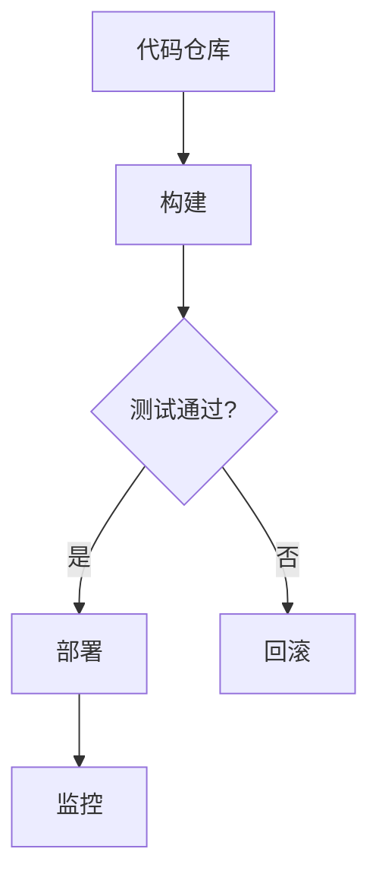
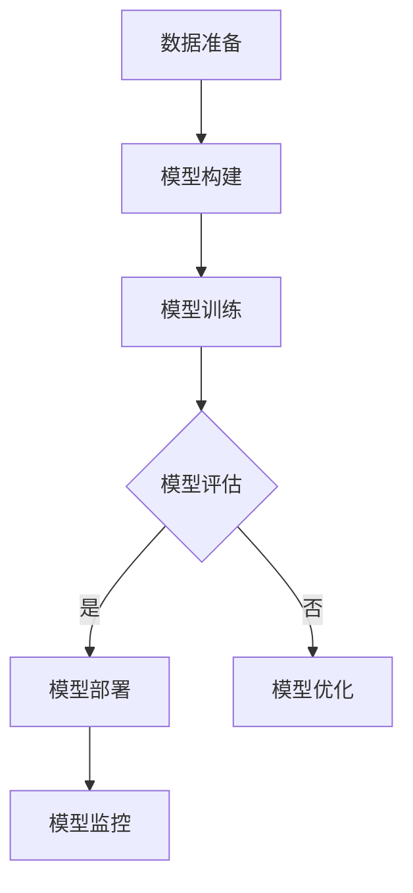

                 

# 《AI模型的持续集成与部署：Lepton AI的CI/CD实践》

> 关键词：AI模型、持续集成、持续部署、CI/CD、实践、Lepton AI

> 摘要：本文将详细介绍Lepton AI公司在AI模型持续集成与部署（CI/CD）方面的实践经验，分析CI/CD在AI模型开发中的应用及其优势，并通过具体案例分析，探讨AI模型CI/CD的最佳实践方法。

### 第一部分：CI/CD基础知识

#### 第1章：CI/CD概述

**1.1 CI/CD的定义与优势**

持续集成（Continuous Integration，简称CI）和持续部署（Continuous Deployment，简称CD）是现代软件开发中重要的实践方法。CI指的是软件开发过程中，通过自动化工具将开发人员的代码定期合并到主干分支，并进行自动化的测试和构建。CD则是在CI的基础上，将经过测试和验证的代码自动部署到生产环境。

CI/CD的优势主要体现在以下几个方面：

- **快速反馈**：通过CI/CD，开发人员可以在代码合并到主干分支后立即收到反馈，发现问题可以及时修复，减少故障蔓延的可能性。
- **提高代码质量**：CI/CD过程中的自动化测试能够发现代码中的缺陷，从而提高代码的质量和稳定性。
- **缩短开发周期**：通过自动化流程，可以减少手动操作，提高开发效率，缩短项目周期。
- **增强团队协作**：CI/CD促进了团队成员之间的协作，每个人都可以快速看到自己的代码对项目的影响。

**1.2 CI/CD的发展历程**

CI/CD的概念最早可以追溯到1994年，当时ThoughtWorks的CEO提出“持续集成”的理念。随着时间的推移，CI/CD逐渐成为软件开发的标准流程。近年来，随着云计算、容器化和DevOps等技术的发展，CI/CD的应用范围和效果得到进一步扩展和提升。

**1.3 CI/CD的核心概念**

- **持续集成（CI）**：CI的核心目标是确保代码库的稳定性和一致性。开发人员将代码提交到版本控制系统后，CI工具会自动触发构建和测试过程，确保新代码不会破坏现有的功能。
- **持续部署（CD）**：CD是在CI的基础上，将经过测试和验证的代码自动部署到生产环境。CD的目标是确保代码的快速、安全地交付到用户手中。
- **持续交付（CD）**：持续交付是CI和CD的综合体，它强调从代码提交到最终交付给用户的整个过程，包括测试、部署、监控等环节。

#### 第2章：CI/CD架构

**2.1 CI/CD流程设计**

CI/CD流程的设计需要遵循以下原则：

- **自动化**：所有流程都应尽可能自动化，减少手动操作，提高效率。
- **可重复性**：构建和部署过程应该是可重复的，确保每次执行结果一致。
- **可扩展性**：系统应该能够适应项目规模和复杂度的变化。

CI/CD流程的基本步骤包括：

1. **代码仓库**：开发人员将代码提交到代码仓库。
2. **构建**：CI工具触发构建过程，编译代码并创建可执行文件。
3. **测试**：自动化测试工具执行一系列测试，确保代码质量。
4. **部署**：将测试通过后的代码部署到测试或生产环境。

**2.2 CI/CD工具选择**

选择CI/CD工具时，需要考虑以下因素：

- **兼容性**：工具应该能够与现有的开发环境、代码仓库和测试框架兼容。
- **易用性**：工具应具有良好的用户界面和文档，易于配置和使用。
- **功能丰富性**：工具应提供丰富的功能，如自动化构建、测试、部署、监控等。
- **社区支持**：工具应拥有活跃的社区，提供技术支持和文档。

常见的CI/CD工具包括Jenkins、GitLab CI/CD、GitHub Actions等。

**2.3 CI/CD的常见架构模式**

CI/CD的架构模式主要分为以下几种：

- **分支流模式**：每个开发分支都有独立的CI/CD流程，主分支的CI/CD流程最为严格。
- **集群模式**：将CI/CD流程部署在多个集群中，提高系统的可用性和扩展性。
- **微服务架构模式**：基于微服务架构，每个微服务都有自己的CI/CD流程，独立部署和扩展。

#### 第3章：AI模型的特性与挑战

**3.1 AI模型的特性**

AI模型具有以下特性：

- **复杂度**：AI模型的构建通常涉及大量的数据预处理、特征工程和算法选择，使得模型复杂度较高。
- **多样性**：不同的应用场景需要不同类型的AI模型，模型多样性较大。
- **迭代速度**：AI模型的迭代速度较快，需要不断优化和更新。

**3.2 AI模型在CI/CD中的挑战**

AI模型在CI/CD中面临以下挑战：

- **数据处理与存储**：AI模型训练需要大量数据，如何高效处理和存储数据是一个关键问题。
- **模型版本管理**：AI模型迭代速度快，如何管理不同版本的模型是一个挑战。
- **模型性能监控**：AI模型在部署后，需要持续监控其性能，确保其稳定运行。

### 第二部分：核心概念与联系

#### 第4章：AI模型的持续集成

**4.1 AI模型的集成过程**

AI模型的集成过程主要包括以下步骤：

1. **数据准备**：准备好用于训练和测试的数据集。
2. **模型构建**：根据需求和算法选择，构建AI模型。
3. **模型训练**：使用训练数据对模型进行训练。
4. **模型评估**：使用测试数据对模型进行评估，确保模型性能达到预期。
5. **模型部署**：将训练好的模型部署到生产环境。

**4.2 AI模型的测试与验证**

AI模型的测试与验证主要包括以下方面：

- **功能测试**：确保模型能够正确实现预期功能。
- **性能测试**：评估模型的准确率、召回率等性能指标。
- **鲁棒性测试**：评估模型在不同数据集和场景下的稳定性。

**4.3 AI模型的版本管理**

AI模型的版本管理主要包括以下策略：

- **版本控制工具**：使用版本控制工具（如Git）管理模型代码。
- **版本发布策略**：制定版本发布计划，确保模型版本有序更新。
- **版本回滚策略**：在模型出现问题时应能快速回滚到之前版本。

#### 第5章：AI模型的持续部署

**5.1 AI模型的部署过程**

AI模型的部署过程主要包括以下步骤：

1. **环境准备**：准备部署环境，包括服务器、存储和计算资源。
2. **模型打包**：将训练好的模型打包成可部署的格式。
3. **部署配置**：配置模型部署的参数，如服务端口、内存等。
4. **模型部署**：将模型部署到服务器或容器中。
5. **模型监控**：监控模型运行状态，确保其稳定运行。

**5.2 AI模型的部署策略**

AI模型的部署策略主要包括以下几种：

- **A/B测试**：将模型部署到部分用户，观察其效果，再根据反馈进行优化。
- **金丝雀部署**：将模型部署到一小部分用户，观察其效果，再逐步扩大部署范围。
- **蓝绿部署**：同时运行两个版本的模型，逐步切换用户流量，确保稳定过渡。

**5.3 AI模型的部署工具**

AI模型的部署工具主要包括以下几种：

- **Kubernetes**：用于容器化部署和管理。
- **Docker**：用于打包和部署容器化应用。
- **Jenkins**：用于自动化构建和部署。

#### 第6章：AI模型的持续交付

**6.1 AI模型的交付流程**

AI模型的交付流程主要包括以下步骤：

1. **代码仓库**：将模型代码提交到代码仓库。
2. **构建**：自动化构建模型代码。
3. **测试**：自动化测试模型代码。
4. **部署**：将测试通过的模型代码部署到生产环境。
5. **监控**：监控模型运行状态，确保其稳定运行。

**6.2 AI模型的交付工具**

AI模型的交付工具主要包括以下几种：

- **GitHub Actions**：用于自动化构建、测试和部署。
- **GitLab CI/CD**：用于自动化构建、测试和部署。
- **Azure DevOps**：用于自动化构建、测试和部署。

### 第三部分：核心概念与联系

#### 第7章：AI模型持续集成与部署的流程图

**7.1 CI/CD流程图设计**

CI/CD流程图的设计需要清晰、简洁，能够反映整个流程的关键环节。以下是一个简单的CI/CD流程图的示例：



**7.2 AI模型持续集成与部署的Mermaid流程图**

以下是一个AI模型持续集成与部署的Mermaid流程图：



### 第四部分：核心算法原理讲解

#### 第8章：AI模型的核心算法原理

**8.1 AI模型的基础算法**

AI模型的基础算法主要包括：

- **神经网络算法**：用于模拟人脑神经元之间的连接，实现数据处理和模式识别。
- **深度学习算法**：在神经网络的基础上，增加层次结构，实现更复杂的特征学习和模式识别。
- **强化学习算法**：通过试错和反馈，使模型能够自主学习和优化行为。

**8.2 AI模型的主要算法**

AI模型的主要算法包括：

- **特征提取算法**：用于从原始数据中提取有意义的特征，提高模型性能。
- **模型训练算法**：用于调整模型参数，使其能够更好地拟合数据。
- **模型优化算法**：用于提高模型性能，减少过拟合现象。

**8.3 AI模型算法的伪代码讲解**

以下是一个简单的神经网络算法的伪代码：

```python
# 初始化神经网络
初始化参数

# 循环训练
对于每一个训练样本：
    # 前向传播
    输出 = 神经网络(输入)
    
    # 计算损失
    损失 = 损失函数(输出，目标)
    
    # 反向传播
    参数更新 = 反向传播(输出，损失)

# 模型评估
评估模型在测试集上的性能
```

### 第五部分：数学模型与数学公式

#### 第9章：AI模型中的数学模型

**9.1 数学公式在AI模型中的应用**

AI模型中常用的数学公式包括：

- **激活函数**：用于模拟神经元之间的激活行为。
- **损失函数**：用于评估模型预测与真实值的差距。
- **优化算法**：用于调整模型参数，最小化损失函数。

**9.2 数学公式的详细讲解与举例**

以下是一个激活函数的公式和详细讲解：

$$
激活函数 = \frac{1}{1 + e^{-x}}
$$

该公式是一个常用的Sigmoid函数，用于模拟神经元之间的激活行为。当输入x为正时，输出接近1；当输入x为负时，输出接近0。这种非线性转换能够使神经网络具备处理复杂数据的能力。

### 第六部分：项目实战

#### 第10章：AI模型CI/CD项目实战

**10.1 实战项目概述**

本节将介绍一个实际的AI模型CI/CD项目，该项目旨在构建一个用于图像识别的深度学习模型。项目背景是某公司希望开发一个能够自动识别图像中的物体的系统，以提高生产效率和准确性。

**10.2 实战项目的环境搭建**

项目的环境搭建分为开发环境和部署环境两部分：

- **开发环境**：包括Python编程环境、TensorFlow深度学习框架、Jupyter Notebook等。
- **部署环境**：包括Kubernetes集群、Docker容器化工具等。

**10.3 实战项目的代码实现**

项目的核心代码实现包括以下部分：

- **数据预处理**：读取图像数据，进行数据增强、归一化等操作。
- **模型构建**：定义卷积神经网络模型结构，包括卷积层、池化层、全连接层等。
- **模型训练**：使用训练数据对模型进行训练，调整模型参数。
- **模型评估**：使用测试数据对模型进行评估，计算准确率、召回率等指标。

以下是一个简单的代码实现示例：

```python
import tensorflow as tf
from tensorflow.keras.models import Sequential
from tensorflow.keras.layers import Conv2D, MaxPooling2D, Flatten, Dense

# 数据预处理
# ...

# 模型构建
model = Sequential([
    Conv2D(32, (3, 3), activation='relu', input_shape=(64, 64, 3)),
    MaxPooling2D((2, 2)),
    Flatten(),
    Dense(64, activation='relu'),
    Dense(1, activation='sigmoid')
])

# 模型编译
model.compile(optimizer='adam', loss='binary_crossentropy', metrics=['accuracy'])

# 模型训练
model.fit(train_images, train_labels, epochs=10, batch_size=32, validation_data=(test_images, test_labels))

# 模型评估
test_loss, test_acc = model.evaluate(test_images, test_labels)
print(f"Test accuracy: {test_acc:.2f}")

# 模型保存
model.save("image_recognition_model.h5")
```

**10.4 实战项目的效果评估**

在完成模型训练和评估后，需要对项目效果进行评估。以下是一个简单的评估方法：

- **准确率**：评估模型在测试数据集上的准确率，越高越好。
- **召回率**：评估模型在测试数据集上的召回率，越高越好。
- **F1分数**：综合考虑准确率和召回率，用于评估模型的综合性能。

以下是一个简单的评估结果示例：

```python
from sklearn.metrics import classification_report

# 加载模型
model = tf.keras.models.load_model("image_recognition_model.h5")

# 预测结果
predictions = model.predict(test_images)

# 计算评估指标
report = classification_report(test_labels, predictions)
print(report)
```

### 第七部分：AI模型CI/CD实战案例分析

**11.1 案例分析背景**

本案例分析的是Lepton AI公司开发的一款智能图像识别系统的CI/CD实践。该公司专注于智能视觉技术的研究和应用，其产品广泛应用于工业自动化、安防监控、智能交通等领域。

**11.2 案例分析过程**

案例分析的流程包括模型集成、模型部署和模型交付三个阶段：

- **模型集成阶段**：开发人员将代码提交到GitLab仓库，触发CI流程，进行自动化构建和测试。测试通过后，将模型代码合并到主分支，并发布新版本。
- **模型部署阶段**：使用Kubernetes集群进行模型部署，采用金丝雀部署策略，逐步扩大部署范围，确保系统稳定运行。
- **模型交付阶段**：使用GitHub Actions进行自动化交付，确保模型代码和文档的及时更新和交付。

**11.3 案例分析经验总结**

通过本案例的分析，可以得出以下经验总结：

- **自动化**：自动化是CI/CD的核心，能够提高开发效率和代码质量。
- **稳定性**：稳定的部署和交付是确保系统正常运行的关键。
- **监控**：实时监控模型运行状态，能够及时发现和解决问题。
- **优化**：持续优化CI/CD流程，提高系统性能和可靠性。

### 附录

**附录A：AI模型CI/CD工具与资源**

**A.1 主流CI/CD工具对比**

以下是几种主流CI/CD工具的对比：

- **Jenkins**：开源，功能强大，支持多种插件，但配置较为复杂。
- **GitLab CI/CD**：与GitLab代码仓库集成，易于配置，支持多种编程语言和平台。
- **GitHub Actions**：与GitHub代码仓库集成，支持多种操作系统和编程语言，易于使用。

**A.2 AI模型CI/CD工具使用指南**

以下是几种CI/CD工具的使用指南：

- **Jenkins使用指南**：详细介绍了如何配置Jenkins，设置构建触发器和构建步骤。
- **GitLab CI/CD使用指南**：详细介绍了如何配置GitLab CI/CD，编写`.gitlab-ci.yml`文件。
- **GitHub Actions使用指南**：详细介绍了如何配置GitHub Actions，编写`.github/workflows/main.yml`文件。

**A.3 AI模型CI/CD常见问题与解决方案**

以下是AI模型CI/CD中常见的问题及解决方案：

- **问题一**：构建失败，如何排查原因？
  - 解决方案一：检查构建日志，查找错误信息。
  - 解决方案二：检查代码库，确保代码正确。

- **问题二**：测试失败，如何定位问题？
  - 解决方案一：检查测试用例，确保覆盖全面。
  - 解决方案二：分析测试结果，定位问题所在。

- **问题三**：部署失败，如何恢复系统？
  - 解决方案一：回滚到上一个稳定版本。
  - 解决方案二：检查部署配置，确保正确。

**A.4 AI模型CI/CD最佳实践**

以下是AI模型CI/CD的最佳实践：

- **最佳实践一**：确保代码质量，通过自动化测试和静态代码分析提高代码质量。
- **最佳实践二**：优化部署流程，减少手动操作，提高部署效率。
- **最佳实践三**：持续监控模型性能，确保模型稳定运行。

