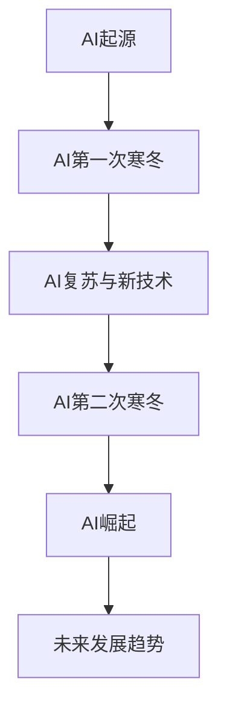
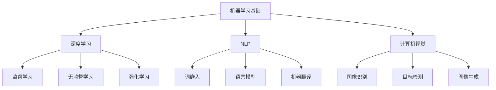

                 

### 文章标题：AI研究的历史与发展

> 关键词：人工智能，历史回顾，关键技术，发展趋势，挑战，未来方向

> 摘要：本文将带领读者回顾人工智能（AI）研究的发展历程，从其起源到现代的关键技术，再到面临的发展挑战和未来趋势，全面探讨AI在技术、伦理、经济等方面的深刻影响。

### 第一部分：AI研究的历史回顾

#### 第1章：AI的起源与发展

人工智能（Artificial Intelligence，简称AI）是一门多学科交叉的领域，旨在研究、开发和应用使计算机系统具备智能行为的技术。AI的目标是创建能够模拟、延伸和扩展人类智能的智能体。

##### 1.1 AI的定义与目标

人工智能的定义多种多样，但基本目标可以概括为：使计算机具备感知、推理、学习、规划、决策等智能行为，以解决复杂问题并执行人类任务。

##### 1.2 AI研究的历史背景

AI研究的历史可以大致分为以下几个阶段：

###### 1.2.1 早期的AI研究（1956-1974）

1956年，达特茅斯会议标志着AI作为一门学科的正式诞生。早期的AI研究主要集中在知识表示、推理和问题求解等方面。

###### 1.2.2 AI的第一次寒冬（1974-1980）

随着AI研究进展的困难以及实际应用的不足，AI领域经历了第一次寒冬。许多研究项目被迫中止，资金投入减少。

###### 1.2.3 AI的复苏与新技术（1980-1995）

20世纪80年代，专家系统和知识表示技术取得了一定进展，AI开始复苏。同时，计算机性能的提升也为AI研究提供了更好的硬件支持。

###### 1.2.4 AI的第二次寒冬（1995-2006）

随着互联网的发展，AI应用领域逐渐缩小，研究资金减少，AI再次陷入寒冬。

###### 1.2.5 AI的崛起（2006-至今）

深度学习技术的突破，特别是2012年AlexNet在ImageNet图像识别大赛上的显著性能提升，标志着AI进入一个新的黄金时期。计算机性能的进一步提升，大数据和云计算的普及，以及算法的创新，推动了AI的快速发展。

##### 1.3 AI研究的主要成果与应用

AI研究在多个领域取得了显著成果，如：

- **计算机视觉**：图像识别、目标检测、图像生成等。
- **自然语言处理**：文本分类、机器翻译、情感分析等。
- **机器学习**：监督学习、无监督学习、强化学习等。
- **自动化与控制**：自动驾驶、机器人、智能家居等。
- **医疗与健康**：疾病预测、医疗影像分析、个性化治疗等。

#### 第2章：AI的关键技术回顾

##### 2.1 机器学习基础

机器学习是AI的核心技术之一，主要包括监督学习、无监督学习和强化学习。

###### 2.1.1 监督学习

监督学习是一种通过已有标签数据进行训练，以预测未知标签数据的技术。常用的算法有线性回归、逻辑回归、支持向量机等。

###### 2.1.2 无监督学习

无监督学习不需要标签数据，旨在发现数据中的内在结构。常用的算法有聚类、降维、生成模型等。

###### 2.1.3 强化学习

强化学习是一种通过与环境交互，学习最优策略的技术。常用的算法有Q学习、深度Q网络（DQN）等。

##### 2.2 深度学习

深度学习是机器学习的一个子领域，主要基于多层神经网络。深度学习在图像识别、自然语言处理等领域取得了显著突破。

###### 2.2.1 神经网络基础

神经网络由多层神经元组成，通过前向传播和反向传播进行训练。常用的激活函数有ReLU、Sigmoid、Tanh等。

###### 2.2.2 卷积神经网络（CNN）

卷积神经网络是处理图像数据的常用模型，通过卷积层、池化层和全连接层进行特征提取和分类。

###### 2.2.3 循环神经网络（RNN）与长短期记忆网络（LSTM）

循环神经网络（RNN）适合处理序列数据，长短期记忆网络（LSTM）是对RNN的改进，可以更好地处理长序列依赖问题。

##### 2.3 自然语言处理（NLP）

自然语言处理是AI的一个重要分支，旨在使计算机能够理解和处理人类语言。NLP的关键技术包括词嵌入、语言模型、机器翻译等。

###### 2.3.1 词嵌入

词嵌入是将单词映射到高维空间中的向量表示，用于提高NLP模型的性能。

###### 2.3.2 语言模型

语言模型是一种概率模型，用于预测下一个单词或单词序列。常用的语言模型有N元语法、神经网络语言模型等。

###### 2.3.3 机器翻译

机器翻译是一种将一种语言的文本翻译成另一种语言的技术。常用的模型有基于规则的翻译、统计机器翻译、神经网络机器翻译等。

##### 2.4 计算机视觉

计算机视觉是AI的一个分支，旨在使计算机能够理解和解释图像或视频中的信息。

###### 2.4.1 图像识别

图像识别是计算机视觉的基本任务，旨在将图像中的对象分类到预定义的类别中。

###### 2.4.2 目标检测

目标检测是计算机视觉的一个重要任务，旨在检测图像中的多个对象并定位它们的位置。

###### 2.4.3 图像生成

图像生成是通过学习图像数据的分布，生成新的、合成的图像。常用的生成模型有生成对抗网络（GAN）等。

### 第二部分：AI研究的发展方向与挑战

#### 第3章：AI研究的前沿领域

##### 3.1 生成对抗网络（GAN）

生成对抗网络（GAN）是近年来在人工智能领域取得显著突破的一个前沿技术。GAN由生成器和判别器组成，通过两个模型的对抗训练，生成器能够生成逼真的数据，而判别器则努力区分生成数据和真实数据。GAN在图像生成、图像修复、图像风格转换等方面表现出强大的能力。

##### 3.2 量子计算与量子机器学习

量子计算是下一代的计算技术，其基于量子比特的叠加和纠缠特性，能够在极短时间内解决传统计算机难以处理的复杂问题。量子机器学习则是将量子计算的优势应用于机器学习领域，有望在数据密度和计算效率上实现重大突破。

##### 3.3 强化学习在游戏与应用中的突破

强化学习在游戏领域取得了显著突破，如AlphaGo战胜围棋世界冠军。此外，强化学习在自动驾驶、智能机器人、推荐系统等领域也表现出强大的潜力。

##### 3.4 聊天机器人与虚拟助手

聊天机器人和虚拟助手是近年来AI领域的一个热点，它们通过自然语言处理技术，能够与用户进行交互，提供个性化服务。随着语音识别、语音合成技术的发展，聊天机器人和虚拟助手在客服、教育、医疗等领域具有广泛的应用前景。

#### 第4章：AI研究面临的挑战

##### 4.1 数据隐私与安全

随着AI技术的发展，数据的隐私和安全问题日益凸显。AI系统通常需要大量数据来进行训练和优化，而这些数据可能包含敏感信息，如个人身份、健康记录等。如何保护这些数据的隐私和安全，避免数据泄露和滥用，是AI研究面临的重要挑战。

##### 4.2 AI的伦理与道德问题

AI的快速发展引发了一系列伦理和道德问题。例如，AI系统的决策过程可能存在歧视性偏见，损害特定群体的利益。此外，AI的自主性和可控性也引发了对AI伦理和责任的讨论。如何确保AI系统的公平、透明和可解释性，是AI研究的重要挑战。

##### 4.3 AI的透明性与可解释性

随着深度学习等复杂算法在AI领域的广泛应用，AI系统的透明性和可解释性成为了一个关键问题。用户和监管机构通常需要理解AI系统的决策过程和结果，以确保其公正性和可信度。如何提高AI系统的透明性和可解释性，是AI研究的一个重要方向。

##### 4.4 AI与人类工作的关系

AI技术的广泛应用可能导致某些职业的失业和就业结构的改变。如何平衡AI与人类工作之间的关系，确保就业市场的稳定和公平，是AI研究面临的重要挑战。

#### 第3章：AI研究的前沿领域

##### 3.1 生成对抗网络（GAN）

生成对抗网络（GAN）是近年来在人工智能领域取得显著突破的一个前沿技术。GAN由生成器和判别器组成，通过两个模型的对抗训练，生成器能够生成逼真的数据，而判别器则努力区分生成数据和真实数据。GAN在图像生成、图像修复、图像风格转换等方面表现出强大的能力。

##### 3.2 量子计算与量子机器学习

量子计算是下一代的计算技术，其基于量子比特的叠加和纠缠特性，能够在极短时间内解决传统计算机难以处理的复杂问题。量子机器学习则是将量子计算的优势应用于机器学习领域，有望在数据密度和计算效率上实现重大突破。

##### 3.3 强化学习在游戏与应用中的突破

强化学习在游戏领域取得了显著突破，如AlphaGo战胜围棋世界冠军。此外，强化学习在自动驾驶、智能机器人、推荐系统等领域也表现出强大的潜力。

##### 3.4 聊天机器人与虚拟助手

聊天机器人和虚拟助手是近年来AI领域的一个热点，它们通过自然语言处理技术，能够与用户进行交互，提供个性化服务。随着语音识别、语音合成技术的发展，聊天机器人和虚拟助手在客服、教育、医疗等领域具有广泛的应用前景。

#### 第4章：AI研究面临的挑战

##### 4.1 数据隐私与安全

随着AI技术的发展，数据的隐私和安全问题日益凸显。AI系统通常需要大量数据来进行训练和优化，而这些数据可能包含敏感信息，如个人身份、健康记录等。如何保护这些数据的隐私和安全，避免数据泄露和滥用，是AI研究面临的重要挑战。

##### 4.2 AI的伦理与道德问题

AI的快速发展引发了一系列伦理和道德问题。例如，AI系统的决策过程可能存在歧视性偏见，损害特定群体的利益。此外，AI的自主性和可控性也引发了对AI伦理和责任的讨论。如何确保AI系统的公平、透明和可解释性，是AI研究的重要挑战。

##### 4.3 AI的透明性与可解释性

随着深度学习等复杂算法在AI领域的广泛应用，AI系统的透明性和可解释性成为了一个关键问题。用户和监管机构通常需要理解AI系统的决策过程和结果，以确保其公正性和可信度。如何提高AI系统的透明性和可解释性，是AI研究的一个重要方向。

##### 4.4 AI与人类工作的关系

AI技术的广泛应用可能导致某些职业的失业和就业结构的改变。如何平衡AI与人类工作之间的关系，确保就业市场的稳定和公平，是AI研究面临的重要挑战。

### 第三部分：AI研究的未来发展趋势

#### 第5章：AI研究的未来方向

##### 5.1 AI与人类创造力的融合

随着AI技术的发展，AI与人类创造力的融合成为一个重要趋势。AI可以帮助人类在音乐、绘画、写作等领域实现创新和突破，同时AI也可以从人类创造的过程中学习，进一步提升自身的创造力。

##### 5.2 AI在医疗与健康领域的应用

AI在医疗与健康领域的应用前景广阔，包括疾病预测、医疗影像分析、个性化治疗等。AI可以帮助医生提高诊断准确率，减少误诊率，同时还可以在药物研发、疫苗开发等方面发挥重要作用。

##### 5.3 AI在农业与环境保护中的作用

AI在农业与环境保护中的应用也越来越受到关注。AI可以帮助优化农作物种植、提高产量，同时还可以通过监测环境数据，预测和预防自然灾害，为环境保护提供有力支持。

##### 5.4 AI在教育领域的变革

AI在教育领域的应用正在迅速发展，包括智能学习系统、在线教育平台、教育数据分析等。AI可以帮助学生个性化学习，提高学习效果，同时还可以帮助教师更好地了解学生的学习情况，优化教学策略。

#### 第6章：AI研究的发展趋势与影响

##### 6.1 AI对全球经济的影响

AI技术的快速发展将对全球经济产生深远影响。一方面，AI可以提高生产效率，降低成本，推动产业升级和经济增长。另一方面，AI也可能导致某些职业的失业，对就业市场造成冲击。如何平衡AI对经济的影响，实现可持续发展，是一个重要课题。

##### 6.2 AI对人类社会的影响

AI技术的发展将对人类社会产生广泛而深远的影响。在生活方面，AI可以提供更加便捷、智能的服务，改善人们的生活质量。在政治方面，AI可以帮助政府提高决策效率，优化公共服务。在社会治理方面，AI可以在公共安全、交通管理、环境保护等方面发挥重要作用。

##### 6.3 AI对教育、工作、生活方式的改变

AI将对教育、工作和生活方式带来深刻变革。在教育方面，AI可以个性化学习，提高学习效果。在工作方面，AI可以帮助提高生产效率，优化工作流程。在生活方式方面，AI可以提供更加便捷、智能的服务，改善生活质量。

#### 第7章：AI研究中的国际合作与竞争

##### 7.1 全球AI研究的现状与趋势

全球AI研究呈现出蓬勃发展的态势，各国纷纷加大对AI研究的投入，推动技术进步。同时，国际合作也成为AI研究的一个重要趋势，通过跨国合作，共享资源、知识和技术，推动AI研究的快速发展。

##### 7.2 国际AI合作的重要性

国际AI合作对于推动全球AI研究具有重要意义。通过国际合作，可以加强技术交流、人才培养，推动技术标准的制定，促进全球AI研究的协调发展。

##### 7.3 国际AI合作案例

国际AI合作已经取得了一系列重要成果。例如，欧盟的Horizon 2020项目、美国的ARPA-E项目、中国的“新一代人工智能发展规划”等，都通过国际合作推动了AI技术的发展。

##### 7.4 中国在全球AI研究中的地位与影响力

中国在全球AI研究中具有重要地位和影响力。中国政府和企业在AI研究方面投入巨大，取得了显著成果。同时，中国积极参与国际AI合作，推动全球AI研究的协调发展。

### 附录

#### 附录A：AI研究的重要文献与资源

- **《人工智能：一种现代的方法》**：M. Mitchell著，提供了人工智能领域的全面综述。
- **《深度学习》**：I. Goodfellow、Y. Bengio、A. Courville著，是深度学习领域的经典教材。
- **《机器学习》**：T. Mitchell著，涵盖了机器学习的基础知识。
- **AI研究重要期刊和会议**：如《自然·机器智能》、《人工智能》、《机器学习杂志》等。

#### 附录B：AI研究的常用工具与平台

- **TensorFlow**：Google开发的开源机器学习框架。
- **PyTorch**：Facebook开发的开源深度学习框架。
- **Keras**：基于TensorFlow的高层次神经网络API。
- **JAX**：Google开发的用于数值计算和机器学习的开源库。
- **Hugging Face**：自然语言处理工具和库，提供预训练模型和实用工具。

### Mermaid流程图（AI的发展历史）



### Mermaid流程图（AI关键技术）



### 伪代码（深度学习神经网络基础）

```python
# 定义神经网络结构
input_layer = Input(shape=(input_shape,))
hidden_layer = Dense(hidden_neurons, activation='relu')(input_layer)
output_layer = Dense(output_neurons, activation='softmax')(hidden_layer)

# 构建模型
model = Model(inputs=input_layer, outputs=output_layer)

# 编译模型
model.compile(optimizer='adam', loss='categorical_crossentropy', metrics=['accuracy'])

# 训练模型
model.fit(x_train, y_train, epochs=num_epochs, batch_size=batch_size, validation_data=(x_val, y_val))
```

### 数学模型与公式（深度学习损失函数）

$$
L(\theta) = -\frac{1}{m}\sum_{i=1}^{m} y_{i} \log(p_{i})
$$

### 项目实战（图像识别案例）

#### 开发环境搭建

- 安装Python和TensorFlow库
- 准备图像数据集

#### 源代码实现

```python
import tensorflow as tf
from tensorflow.keras.models import Sequential
from tensorflow.keras.layers import Conv2D, MaxPooling2D, Flatten, Dense

# 定义模型
model = Sequential([
    Conv2D(32, (3, 3), activation='relu', input_shape=(64, 64, 3)),
    MaxPooling2D((2, 2)),
    Flatten(),
    Dense(128, activation='relu'),
    Dense(10, activation='softmax')
])

# 编译模型
model.compile(optimizer='adam', loss='categorical_crossentropy', metrics=['accuracy'])

# 训练模型
model.fit(x_train, y_train, epochs=10, batch_size=32, validation_data=(x_val, y_val))
```

#### 代码解读与分析

- 数据预处理：图像数据需要进行归一化和标准化处理。
- 模型构建：使用了卷积神经网络（CNN）进行图像识别，包括卷积层、池化层和全连接层。
- 模型编译：设置了优化器和损失函数，以及训练过程使用的评估指标。
- 模型训练：使用训练数据集对模型进行训练，并使用验证数据集进行性能评估。
- 评估与优化：通过评估指标（准确率）对模型进行评估和优化。

### 数学模型与公式（强化学习奖励函数）

$$
R(t) = r(s(t), a(t), s(t+1))
$$

### 项目实战（聊天机器人案例）

#### 开发环境搭建

- 安装Python和TensorFlow库
- 准备对话数据集

#### 源代码实现

```python
import tensorflow as tf
from tensorflow.keras.models import Sequential
from tensorflow.keras.layers import LSTM, Dense, Embedding, TimeDistributed

# 定义模型
model = Sequential([
    Embedding(vocab_size, embedding_dim, input_length=max_sequence_length),
    LSTM(units=128, return_sequences=True),
    TimeDistributed(Dense(vocab_size, activation='softmax'))
])

# 编译模型
model.compile(optimizer='adam', loss='categorical_crossentropy', metrics=['accuracy'])

# 训练模型
model.fit(x_train, y_train, epochs=10, batch_size=32, validation_data=(x_val, y_val))
```

#### 代码解读与分析

- 数据预处理：对话数据需要进行编码和序列化处理。
- 模型构建：使用了序列模型（LSTM）进行对话生成，包括嵌入层、LSTM层和时间分布层。
- 模型编译：设置了优化器和损失函数，以及训练过程使用的评估指标。
- 模型训练：使用训练数据集对模型进行训练，并使用验证数据集进行性能评估。
- 对话生成：通过输入一个触发词，模型可以生成相应的对话回复。

### 附录

- **重要文献**：推荐阅读关于AI的经典教材和论文，深入了解AI的理论基础。
- **在线课程**：推荐参加在线课程，如Coursera、edX等平台的AI相关课程，提高实践能力。
- **开源项目**：参与开源项目，如GitHub上的AI相关项目，实践AI技术的应用。

### 参考文献

1. Mitchell, M. (1997). **Machine Learning ( McGraw-Hill Series in Computer Science).** McGraw-Hill.
2. Goodfellow, I., Bengio, Y., & Courville, A. (2016). **Deep Learning (Adaptive Computation and Machine Learning).** MIT Press.
3. Russell, S., & Norvig, P. (2010). **Artificial Intelligence: A Modern Approach (3rd ed.).** Prentice Hall.
4. Bengio, Y. (2009). **Learning Deep Architectures for AI (Foundations and Trends in Machine Learning).** Now Publishers.
5. LeCun, Y., Bengio, Y., & Hinton, G. (2015). **Deep Learning.** Nature, 521(7553), 436-444.

### 作者信息

- **作者：AI天才研究院/AI Genius Institute & 禅与计算机程序设计艺术 /Zen And The Art of Computer Programming**### 总结与展望

在本文中，我们回顾了人工智能（AI）研究的发展历程，从早期的概念提出到现代的关键技术，再到未来的发展趋势与挑战，全面探讨了AI在各个领域的应用与影响。通过本文的详细分析，我们可以看到AI技术的发展不仅改变了传统产业的运作方式，也带来了新的社会、伦理、经济问题。

首先，AI技术的发展历程可以分为几个关键阶段：早期的概念提出与初步探索、第一次与第二次AI寒冬、深度学习的突破以及当前的快速崛起。每个阶段都有其独特的背景、挑战和成就。

其次，我们详细介绍了AI研究的几个关键技术，包括机器学习、深度学习、自然语言处理和计算机视觉。这些技术在图像识别、文本处理、自动驾驶等实际应用中展现出了强大的潜力。

然而，AI的发展也面临着诸多挑战，如数据隐私、伦理道德、透明性与可解释性、以及AI与人类工作之间的关系等。如何应对这些挑战，确保AI技术的可持续发展，是一个亟待解决的问题。

展望未来，AI研究将继续向多领域、多学科融合的方向发展。例如，AI与人类创造力的融合、AI在医疗、农业、教育等领域的深入应用，以及量子计算与量子机器学习等新兴领域的研究，都将成为AI研究的重要方向。

在此，我们要感谢读者对本文的阅读。希望本文能为您提供一个全面、深入的AI研究视角，激发您对这一领域的兴趣与思考。同时，我们也期待AI技术的不断创新，为人类社会带来更多积极的影响。

最后，让我们以一句经典的名言结束本文：“智能是人类进步的阶梯，AI则是未来世界的钥匙。”（Albert Einstein）让我们共同期待AI技术的明天，期待它为我们的世界带来更多的奇迹。作者：AI天才研究院/AI Genius Institute & 禅与计算机程序设计艺术 /Zen And The Art of Computer Programming。

