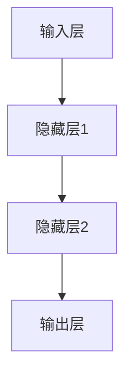
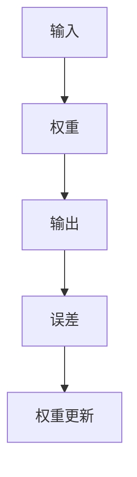
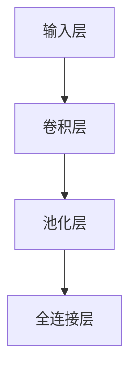
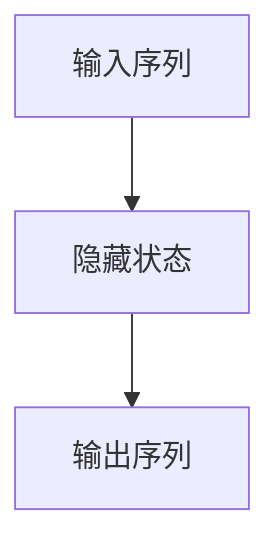
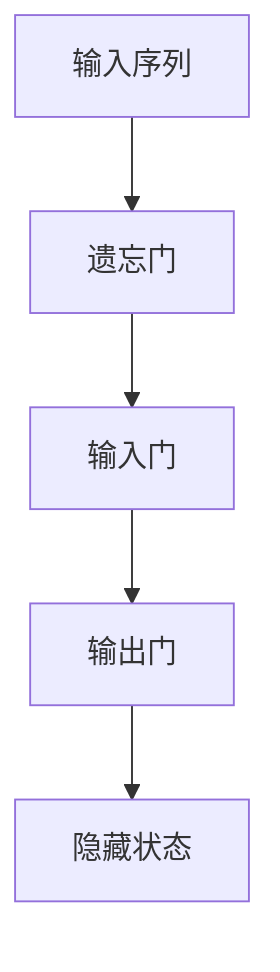
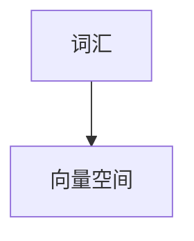
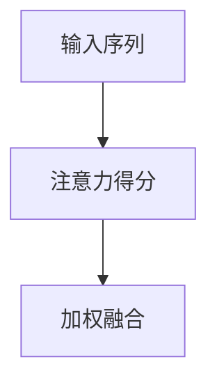
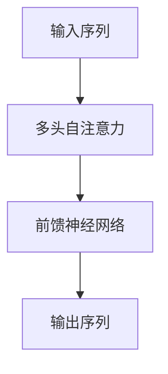

                 

# AI程序员的崛起

> 关键词：人工智能，程序员，深度学习，自然语言处理，计算机视觉，强化学习

> 摘要：本文将探讨AI程序员的崛起及其重要性。通过分析AI技术对程序员职业的影响，介绍AI程序员所需的核心技术，编程范式变革，以及深度学习、自然语言处理、计算机视觉和强化学习等领域的核心技术原理。此外，本文还将探讨AI程序员的实践应用和职业发展，以及他们所面临的挑战和解决方案。

## 第一部分: AI程序员的崛起基础

### 第1章: AI程序员的崛起概述

#### 1.1 AI程序员崛起的背景和意义

##### 1.1.1 人工智能时代的发展趋势

随着计算机科学和大数据技术的快速发展，人工智能（AI）已经成为当今科技领域的热点。从最初的自动化技术到如今的智能系统，人工智能正在深刻地改变我们的生活方式。AI技术的发展不仅推动了科技创新，还引发了社会和经济的变革。在这个背景下，程序员需要不断适应新的技术趋势，提升自身的技能，以应对AI时代的挑战。

##### 1.1.2 AI技术对程序员的职业影响

人工智能技术的进步使得程序员的工作方式发生了巨大变化。传统程序员的工作主要是编写和维护软件，而AI程序员则需要具备更深入的算法知识和数据分析能力。他们不仅要理解AI算法的原理，还要能够将这些算法应用于实际问题中，解决复杂的问题。AI技术的应用使得程序员在各个领域都扮演着越来越重要的角色。

##### 1.1.3 AI程序员应具备的能力和素质

AI程序员需要具备以下能力和素质：

1. **数学和统计学基础**：理解线性代数、微积分和概率论等数学知识，以及如何将这些知识应用于AI算法中。
2. **编程能力**：熟练掌握至少一种编程语言，如Python、Java或C++。
3. **算法和数据分析能力**：了解常见的机器学习算法和数据挖掘技术，能够有效地处理和分析大数据。
4. **解决问题的能力**：能够从复杂的问题中提取关键信息，设计出有效的解决方案。
5. **持续学习的态度**：人工智能领域的发展非常迅速，AI程序员需要具备持续学习的态度，不断更新自己的知识和技能。

#### 1.2 AI程序员的核心技术

AI程序员需要掌握的核心技术包括深度学习、自然语言处理、计算机视觉和强化学习。以下是对这些技术的简要介绍：

##### 1.2.1 深度学习基础

深度学习是人工智能的一个重要分支，它通过模拟人脑的神经网络结构来实现对数据的自动学习和理解。深度学习已经在图像识别、语音识别、自然语言处理等领域取得了显著的成果。

##### 1.2.2 自然语言处理

自然语言处理（NLP）是人工智能的一个分支，旨在使计算机能够理解和处理自然语言。NLP技术包括词嵌入、序列模型、注意力机制和转换器架构等。

##### 1.2.3 计算机视觉

计算机视觉是人工智能的另一个重要分支，它致力于使计算机能够理解和解析视觉信息。计算机视觉技术包括图像处理、特征提取、目标检测和图像分类等。

##### 1.2.4 强化学习

强化学习是一种通过试错和反馈来学习如何做出最优决策的机器学习方法。强化学习在游戏、自动驾驶和机器人等领域有广泛的应用。

#### 1.3 AI程序员的编程范式变革

传统的编程范式主要依赖于明确的指令和逻辑，而AI编程则更多地依赖于数据和算法。AI程序员需要掌握以下编程范式：

##### 1.3.1 从传统编程到AI编程的转变

传统编程注重编写明确的代码来解决问题，而AI编程则更多地依赖于数据和算法。AI程序员需要通过数据预处理、特征工程和模型训练等步骤来构建AI系统。

##### 1.3.2 AI编程范式的发展

随着AI技术的不断发展，AI编程范式也在不断演变。从最初的机器学习框架（如scikit-learn）到深度学习框架（如TensorFlow和PyTorch），AI编程范式逐渐成熟。

##### 1.3.3 AI编程的优势与挑战

AI编程的优势在于能够解决复杂的问题，提高生产效率。然而，AI编程也面临着数据隐私、算法透明性和可解释性等挑战。

### 第2章: 深度学习与神经网络基础

#### 2.1 深度学习原理

##### 2.1.1 神经网络的基本结构

神经网络是深度学习的基础，它由一系列相互连接的神经元组成。每个神经元接收多个输入信号，通过激活函数产生输出。

##### 2.1.2 前向传播与反向传播算法

前向传播是将输入数据通过神经网络进行传递，计算出输出结果。反向传播则是通过计算误差，更新网络的权重和偏置，以优化模型性能。

##### 2.1.3 激活函数与优化算法

激活函数用于确定神经元的激活状态，常见的激活函数包括sigmoid、ReLU和Tanh。优化算法用于调整网络的权重和偏置，以最小化误差。常见的优化算法包括梯度下降、Adam和RMSprop。

$$
\text{激活函数：} f(x) = \frac{1}{1 + e^{-x}}
$$

$$
\text{优化算法：} w_{\text{new}} = w_{\text{old}} - \alpha \cdot \nabla E(w)
$$

#### 2.2 卷积神经网络

##### 2.2.1 卷积神经网络的基本概念

卷积神经网络（CNN）是一种用于处理图像数据的神经网络。它通过卷积层和池化层来提取图像特征。

##### 2.2.2 卷积神经网络在图像处理中的应用

卷积神经网络在图像分类、目标检测和图像生成等领域有广泛应用。例如，VGG、ResNet和Inception等模型都是基于卷积神经网络实现的。

##### 2.2.3 卷积神经网络的变种

卷积神经网络有多种变种，如残差网络（ResNet）、密集连接网络（DenseNet）和注意力机制网络（Attention Mechanism）。这些变种进一步提升了卷积神经网络在图像处理任务中的性能。

#### 2.3 循环神经网络与长短时记忆网络

##### 2.3.1 循环神经网络的工作原理

循环神经网络（RNN）是一种用于处理序列数据的神经网络。它通过隐藏状态来维持对之前信息的记忆。

##### 2.3.2 长短时记忆网络的基本原理

长短时记忆网络（LSTM）是RNN的一种变体，它通过门控机制来控制信息的流入和流出，从而解决RNN的梯度消失问题。

##### 2.3.3 循环神经网络在自然语言处理中的应用

循环神经网络在自然语言处理（NLP）领域有广泛应用，如文本分类、情感分析和机器翻译。LSTM和双向LSTM（BiLSTM）是NLP任务中的常见模型。

## 第二部分: AI程序员的实践应用

### 第3章: 自然语言处理技术概览

#### 3.1 词嵌入技术

##### 3.1.1 词嵌入的基本概念

词嵌入是一种将词汇映射到高维向量空间的技术。它能够捕捉词汇之间的语义关系，从而在NLP任务中提高模型的性能。

##### 3.1.2 常见的词嵌入算法

常见的词嵌入算法包括Word2Vec、GloVe和FastText。这些算法通过优化损失函数来学习词汇的向量表示。

$$
\text{Word2Vec：} \min_{\theta} \sum_{i=1}^{N} (-1) \cdot \log(p_{\theta}(w_i))
$$

##### 3.1.3 词嵌入在自然语言处理中的应用

词嵌入在文本分类、情感分析和机器翻译等任务中有广泛应用。通过词嵌入，模型能够更好地捕捉词汇的语义信息，提高NLP任务的性能。

#### 3.2 序列模型与注意力机制

##### 3.2.1 序列模型的基本原理

序列模型是一种用于处理序列数据的神经网络模型。它通过隐藏状态来捕捉序列中的时间依赖关系。

##### 3.2.2 注意力机制的工作原理

注意力机制是一种用于捕捉序列中重要信息的机制。它通过计算不同位置的重要性得分，然后将这些得分与输入数据进行加权融合。

##### 3.2.3 注意力机制在自然语言处理中的应用

注意力机制在机器翻译、文本摘要和语音识别等任务中有广泛应用。它能够提高模型对关键信息的捕捉能力，从而提高任务性能。

#### 3.3 转换器架构详解

##### 3.3.1 转换器架构的基本概念

转换器架构（Transformer）是一种基于自注意力机制的序列到序列模型。它通过多头自注意力机制和前馈神经网络来处理序列数据。

##### 3.3.2 转换器架构在自然语言处理中的应用

转换器架构在机器翻译、文本摘要和问答系统等任务中有广泛应用。它通过自注意力机制捕捉序列中的长距离依赖关系，从而提高模型的性能。

##### 3.3.3 转换器架构的变体与优化

为了进一步提高转换器架构的性能，研究人员提出了许多变体和优化方法，如BERT、GPT和T5等。这些变体在自然语言处理任务中取得了显著的成果。

## 第三部分: AI程序员的职业发展

### 第4章: 计算机视觉应用实践

#### 4.1 计算机视觉基础

##### 4.1.1 计算机视觉的基本概念

计算机视觉是使计算机能够理解和解析视觉信息的技术。它包括图像处理、特征提取和目标检测等子领域。

##### 4.1.2 图像处理的基础算法

图像处理是计算机视觉的基础，它包括图像增强、滤波、边缘检测和分割等算法。

##### 4.1.3 特征提取与特征匹配

特征提取是将图像转换为向量表示的技术。特征匹配则是通过比较特征向量来识别图像中的目标。

#### 4.2 目标检测与图像分类

##### 4.2.1 目标检测的基本方法

目标检测是计算机视觉中的重要任务，它旨在识别图像中的多个目标。常用的目标检测算法包括滑动窗口、区域建议和网络结构（如SSD、YOLO和Faster R-CNN）。

##### 4.2.2 图像分类的基本方法

图像分类是计算机视觉的另一个重要任务，它旨在将图像分类为不同的类别。常用的图像分类算法包括基于传统机器学习（如SVM和KNN）和深度学习（如卷积神经网络和转换器架构）的方法。

##### 4.2.3 实际案例解析

在实际应用中，计算机视觉技术被广泛应用于人脸识别、自动驾驶和医疗图像分析等领域。本文将结合实际案例解析这些技术的应用。

#### 4.3 人脸识别与图像生成

##### 4.3.1 人脸识别的基本原理

人脸识别是一种基于计算机视觉和机器学习的技术，它通过分析人脸图像中的特征来识别个体。

##### 4.3.2 图像生成的基本方法

图像生成是一种基于生成对抗网络（GAN）的技术，它能够生成逼真的图像。常见的图像生成模型包括DCGAN、StyleGAN和Progressive GAN。

##### 4.3.3 实际案例解析

本文将结合实际案例解析人脸识别和图像生成技术在现实世界中的应用，如智能安防系统和虚拟现实游戏。

### 第5章: 自然语言处理应用实践

#### 5.1 文本分类与情感分析

##### 5.1.1 文本分类的基本方法

文本分类是将文本数据分类为不同类别（如正面/负面评论）的技术。常用的文本分类算法包括朴素贝叶斯、支持向量机和深度学习（如卷积神经网络和转换器架构）。

##### 5.1.2 情感分析的基本方法

情感分析是一种基于文本分类的技术，它旨在识别文本中的情感倾向（如正面、负面或中性）。常用的情感分析算法包括基于规则的方法和机器学习方法。

##### 5.1.3 实际案例解析

本文将结合实际案例解析文本分类和情感分析技术在社交媒体分析、客户反馈分析和市场研究中的应用。

#### 5.2 机器翻译与对话系统

##### 5.2.1 机器翻译的基本方法

机器翻译是一种将一种语言文本翻译成另一种语言的技术。常用的机器翻译算法包括基于规则的方法、统计机器翻译和神经机器翻译。

##### 5.2.2 对话系统的基本原理

对话系统是一种能够与用户进行自然语言交互的系统。它包括语音识别、自然语言理解和对话生成等模块。

##### 5.2.3 实际案例解析

本文将结合实际案例解析机器翻译和对话系统在在线客服、智能助手和虚拟助手中的应用。

#### 5.3 文本生成与自动摘要

##### 5.3.1 文本生成的基本方法

文本生成是一种基于生成模型的技术，它能够生成高质量的文本。常用的文本生成模型包括生成对抗网络（GAN）和转换器架构。

##### 5.3.2 自动摘要的基本方法

自动摘要是一种将长文本转换为简洁摘要的技术。常用的自动摘要方法包括基于提取的方法和基于生成的摘要方法。

##### 5.3.3 实际案例解析

本文将结合实际案例解析文本生成和自动摘要技术在新闻摘要、文档摘要和社交媒体中的应用。

### 第6章: 强化学习应用实践

#### 6.1 强化学习基础

##### 6.1.1 强化学习的基本概念

强化学习是一种通过试错和反馈来学习最优策略的机器学习方法。它由环境、代理、状态、动作和奖励组成。

##### 6.1.2 强化学习的基本算法

强化学习的基本算法包括Q学习、SARSA和Deep Q Network（DQN）。

##### 6.1.3 强化学习的应用场景

强化学习在游戏、自动驾驶、机器人控制等领域有广泛应用。

#### 6.2 强化学习在游戏中的应用

##### 6.2.1 游戏中的强化学习算法

在游戏领域中，强化学习算法被用于训练智能体进行游戏对战。常见的游戏包括棋类游戏、电子游戏和电子竞技。

##### 6.2.2 游戏中的实际案例解析

本文将结合实际案例解析强化学习在电子游戏（如Atari游戏）和电子竞技（如Dota 2）中的应用。

##### 6.2.3 游戏开发中的技术挑战

游戏开发中面临的技术挑战包括实时性、可扩展性和模型解释性。本文将探讨如何应对这些挑战。

#### 6.3 强化学习在自动驾驶中的应用

##### 6.3.1 自动驾驶中的强化学习算法

在自动驾驶领域，强化学习算法被用于训练自动驾驶系统进行决策和控制。常见的算法包括DQN、Deep Deterministic Policy Gradient（DDPG）和Actor-Critic方法。

##### 6.3.2 自动驾驶中的实际案例解析

本文将结合实际案例解析强化学习在自动驾驶中的应用，如自动驾驶汽车和无人机。

##### 6.3.3 自动驾驶开发中的技术挑战

自动驾驶开发中的技术挑战包括环境复杂性、安全性验证和数据隐私。本文将探讨如何应对这些挑战。

### 第三部分: AI程序员的职业发展

#### 第7章: AI程序员的职业规划

##### 7.1 AI程序员职业发展路径

AI程序员的职业发展路径可以分为初级程序员、中级工程师、高级工程师和AI科学家。每个阶段都有不同的技能要求和职业发展目标。

##### 7.1.1 从初级程序员到资深AI工程师

初级程序员需要掌握基础编程知识和数据结构，逐渐转向学习机器学习和深度学习技术，成为AI工程师。

##### 7.1.2 从AI工程师到AI科学家

AI工程师需要不断积累项目经验，参与前沿研究，成为AI科学家。他们需要具备独立研究能力和创新思维。

##### 7.1.3 从AI科学家到AI创业家

AI科学家可以创办自己的AI公司，推动AI技术的应用和发展。他们需要具备商业意识和团队管理能力。

#### 7.2 AI程序员的能力提升

##### 7.2.1 持续学习与技能提升

AI程序员需要持续学习，掌握最新的技术动态和工具。他们可以通过在线课程、专业书籍和参与技术社群来提升技能。

##### 7.2.2 技术社群与交流

加入技术社群和参加技术交流会议可以帮助AI程序员扩展视野，了解行业动态，结识同行。

##### 7.2.3 跨领域知识融合

跨领域知识融合可以帮助AI程序员更好地理解和应用AI技术。例如，将AI技术应用于金融、医疗和制造等领域。

#### 第8章: AI程序员的职业挑战与解决方案

##### 8.1 AI程序员的职业挑战

AI程序员的职业挑战包括技术变革、职业道德和社会责任。他们需要不断适应新技术，遵守职业道德规范，关注社会责任。

##### 8.1.1 技术变革带来的挑战

技术变革带来的挑战包括不断更新的技术标准和快速变化的市场需求。AI程序员需要具备快速学习和适应能力。

##### 8.1.2 职业道德与社会责任

AI程序员的职业道德和社会责任包括确保数据安全和隐私，避免偏见和歧视，以及关注AI技术的道德影响。

##### 8.1.3 跨领域沟通与协作

跨领域沟通与协作是AI程序员的重要技能。他们需要与不同领域的专家合作，共同解决复杂问题。

##### 8.2 解决方案与建议

##### 8.2.1 技术学习与持续进步

AI程序员应该通过在线课程、研讨会和实战项目来持续学习和进步。他们需要关注最新的技术动态和趋势。

##### 8.2.2 跨领域知识积累

AI程序员应该积极学习跨领域知识，如心理学、社会学和经济学。这有助于他们更好地理解和应用AI技术。

##### 8.2.3 社会责任与伦理教育

AI程序员应该关注社会责任和伦理问题，参加相关研讨会和培训课程，提高自己的道德意识和责任感。

### 附录

#### 附录 A: AI 程序员开发工具与资源

##### A.1 主流AI开发框架

TensorFlow、PyTorch、Keras和PyTorch Lightning是主流的AI开发框架。它们提供了丰富的API和工具，方便AI程序员的开发和实验。

##### A.2 AI编程实战资源

- 数据集获取与处理：Kaggle、UCI机器学习库和Google Dataset Search是常用的数据集获取平台。
- 模型训练与优化：Hyperparameter optimization libraries如Hyperopt和optuna提供了自动搜索最优超参数的功能。
- 代码实战与项目教程：GitHub、Coursera和Udacity提供了大量的AI编程实战项目和教程。

##### A.3 开发环境搭建与配置

- 系统要求：安装支持Python的操作系统（如Linux或macOS）。
- Python环境：安装Python 3.7或更高版本，并配置pip和virtualenv。
- AI库安装：使用pip安装TensorFlow、PyTorch、NumPy、Pandas等AI库。

#### 附录 B: AI编程参考书籍与论文

##### B.1 推荐书籍

- 《深度学习》（Goodfellow, Bengio, Courville）：经典深度学习教材，适合初学者和高级读者。
- 《Python深度学习》（François Chollet）：结合实战案例介绍深度学习技术的优秀书籍。
- 《自然语言处理综论》（Daniel Jurafsky, James H. Martin）：全面介绍自然语言处理基础和应用的经典教材。

##### B.2 推荐论文

- “A Theoretically Grounded Application of Dropout in Recurrent Neural Networks”
- “Multi-Task Deep Neural Networks for Image Recognition and Description”
- “Unsupervised Representation Learning with Deep Convolutional Generative Adversarial Networks”

