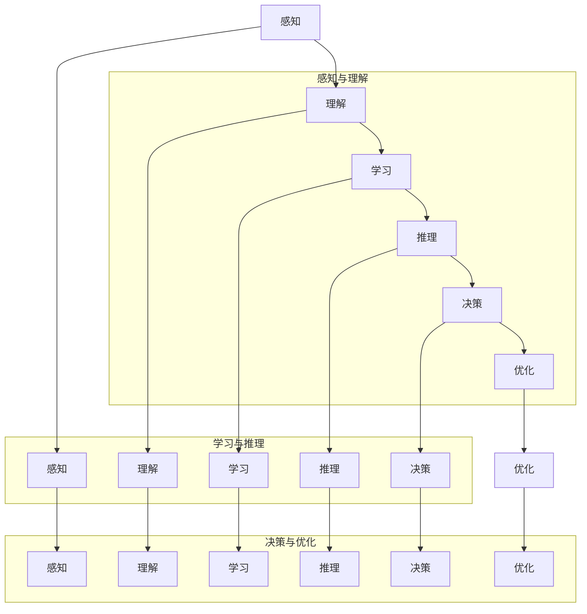

                 

### 文章标题：AI算法的进步与未来

> 关键词：人工智能，算法，进步，未来，神经网络，强化学习，自然语言处理，计算机视觉，推荐系统，医疗健康，发展趋势

> 摘要：
本文旨在探讨人工智能（AI）算法在过去几十年中的进步与未来发展趋势。通过分析AI算法的基本概念、技术基础、应用领域以及未来挑战，本文为读者提供了一个全面而深入的视角，以理解AI算法如何改变我们的世界，并预测其未来的发展方向。文章结构清晰，内容详实，适合对AI技术感兴趣的读者阅读。

---

### 引言

人工智能（AI）作为一种模拟人类智能的技术，已经取得了令人瞩目的进步。从最初的规则推理系统到现代深度学习和强化学习，AI算法在多个领域展现出了强大的应用潜力。随着计算能力的提升和数据量的爆炸性增长，AI算法的进步速度不断加快，对各行各业产生了深远的影响。本文将系统地梳理AI算法的进步历程，探讨其核心概念与联系，分析其在不同领域的应用，并展望其未来的发展趋势。

文章将分为七个部分：

1. **AI算法的基本概念**：介绍AI算法的定义、分类及发展历程。
2. **AI算法的技术基础**：深入探讨神经网络、强化学习、自然语言处理等基础技术。
3. **AI算法在计算机视觉中的应用**：分析图像分类、目标跟踪和生成对抗网络（GAN）。
4. **AI算法在自然语言处理中的应用**：探讨语言模型、机器翻译和问答系统。
5. **AI算法在推荐系统中的应用**：介绍协同过滤、强化学习推荐和深度学习推荐。
6. **AI算法在医疗健康领域的应用**：讨论疾病诊断、药物研发和康复健康管理。
7. **AI算法的未来发展趋势**：展望算法优化、新兴算法和AI伦理与安全。

通过对这些部分的详细探讨，读者将能够全面了解AI算法的现状与未来，为在相关领域的工作和研究提供有益的参考。

### AI算法的基本概念

#### AI算法的定义与分类

人工智能（AI）算法是一类旨在模拟人类智能行为的计算方法和技术。其核心目标是通过机器学习、推理和优化等方式，使计算机系统能够自动完成特定任务，从而实现人类智能的某种程度的自动化。AI算法可以按照不同的标准进行分类，常见的分类方法包括基于学习方式、应用领域和算法原理等。

按照学习方式分类，AI算法可以分为以下几种：

1. **监督学习**：监督学习算法使用标记的数据集进行训练，通过学习输入与输出之间的关系来预测新的数据。常见的监督学习算法包括线性回归、逻辑回归和支持向量机（SVM）等。

2. **无监督学习**：无监督学习算法不依赖于标记的数据集，而是通过挖掘数据中的内在结构来发现数据分布和模式。常见的无监督学习算法包括聚类算法、主成分分析（PCA）和自编码器等。

3. **半监督学习**：半监督学习结合了监督学习和无监督学习的特点，利用部分标记数据和大量未标记数据来训练模型。这种算法在数据标注成本高昂的情况下尤为有效。

4. **强化学习**：强化学习算法通过与环境的交互来学习最优策略，其核心是通过奖励机制来指导算法选择正确的行动。常见的强化学习算法包括Q-学习、SARSA和深度确定性策略梯度（DDPG）等。

按照应用领域分类，AI算法可以应用于以下领域：

1. **计算机视觉**：计算机视觉算法旨在使计算机能够理解和解析图像和视频数据。常见的算法包括图像分类、目标检测和图像生成等。

2. **自然语言处理**：自然语言处理算法致力于使计算机能够理解和处理人类语言。常见的算法包括语言模型、机器翻译和文本分类等。

3. **推荐系统**：推荐系统算法旨在为用户推荐感兴趣的商品、服务或内容。常见的算法包括协同过滤、基于内容的推荐和混合推荐等。

4. **医疗健康**：医疗健康领域是AI算法的重要应用场景，包括疾病诊断、药物研发和健康管理等。常见的算法包括医学影像分析、电子病历分析和健康数据分析等。

按照算法原理分类，AI算法可以包括以下类型：

1. **基于规则的算法**：这类算法通过定义一系列规则来处理输入数据，并据此做出决策。例如，专家系统就是一种基于规则的AI算法。

2. **基于模型的算法**：这类算法通过构建数学模型来描述输入与输出之间的关系，并利用这些模型进行预测和决策。常见的模型包括线性模型、神经网络模型和决策树等。

3. **基于实例的算法**：这类算法通过存储和检索先前解决过的实例来处理新问题，通过比较新实例与已有实例的相似性来做出决策。例如，k-近邻算法就是一种基于实例的算法。

#### AI算法的发展历程

AI算法的发展历程可以追溯到20世纪50年代。以下是几个重要的里程碑：

1. **1956年：人工智能概念的提出**  
    在达特茅斯会议上，约翰·麦卡锡、马文·明斯基等学者首次提出了“人工智能”的概念，标志着人工智能作为一个独立研究领域的诞生。

2. **1960-1970年代：早期探索**  
    这一时期，AI领域主要探索基于逻辑推理和符号计算的算法，如专家系统和推理机。尽管取得了一些初步成果，但由于计算能力的限制，这一时期的AI研究进展较为缓慢。

3. **1980年代：启发式搜索和模拟进化**  
    启发式搜索和模拟进化算法（如遗传算法）在这一时期得到广泛应用。这些算法通过探索问题的解决方案空间，逐步优化搜索过程，从而在求解复杂问题时表现出色。

4. **1990年代：机器学习和数据挖掘**  
    随着计算机性能的提升和数据的爆炸性增长，机器学习和数据挖掘成为AI研究的热点。这一时期，支持向量机、决策树、神经网络等算法得到了广泛应用。

5. **2000年代：深度学习的崛起**  
    深度学习算法（如卷积神经网络、循环神经网络和生成对抗网络）在这一时期取得了突破性进展，在图像识别、语音识别、自然语言处理等领域表现出卓越的性能。

6. **2010年代至今：AI应用的爆发**  
    随着深度学习和强化学习算法的不断进步，AI在计算机视觉、自然语言处理、推荐系统、医疗健康等领域的应用逐渐成熟，并取得了显著的社会和经济价值。

#### AI算法的核心概念与联系

AI算法涉及的核心概念包括感知、理解、学习、推理、决策和优化等。

1. **感知**：感知是AI系统对输入数据的理解过程，包括图像识别、语音识别和文本解析等。感知通常依赖于机器学习和深度学习算法，通过训练模型来提取输入数据中的特征，从而实现对数据的理解和分类。

2. **理解**：理解是AI系统对感知结果的综合分析过程，包括语义理解、上下文理解和知识推理等。理解使得AI系统能够对输入数据产生更深刻的理解和洞察，从而在复杂环境中做出更准确的决策。

3. **学习**：学习是AI系统通过不断体验和反馈来改进自身性能的过程。学习可以分为有监督学习、无监督学习和半监督学习等类型，通过训练数据和优化模型参数，AI系统能够不断提高其性能和准确性。

4. **推理**：推理是AI系统利用已知信息进行逻辑推断和推理的过程，包括符号推理、归纳推理和基于规则的推理等。推理使得AI系统能够从已知的事实中推导出新的结论和推断。

5. **决策**：决策是AI系统在特定情境下选择最佳行动的过程，包括最优路径规划、资源分配和风险评估等。决策通常依赖于优化算法和机器学习模型，通过分析不同行动的潜在结果和风险，AI系统能够选择最佳的行动方案。

6. **优化**：优化是AI系统在满足特定约束条件下，通过调整模型参数和搜索策略来提高性能和效率的过程。优化包括局部优化和全局优化、动态优化和静态优化等类型，通过优化算法，AI系统能够在复杂问题中找到最优解或近似最优解。

这些核心概念相互关联，共同构成了AI算法的基本框架。感知和理解提供了AI系统对输入数据的处理和解析能力；学习使得AI系统能够不断改进和优化自身性能；推理和决策使得AI系统能够在复杂环境中做出合理的选择和决策；优化则保证了AI系统在高性能和高效率的同时，能够适应不断变化的环境和需求。

通过深入理解这些核心概念，我们可以更好地把握AI算法的工作原理和应用前景，为在相关领域的工作和研究提供有益的指导。

#### AI算法的核心概念与联系 - Mermaid流程图



#### 神经网络原理

神经网络（Neural Networks）是人工智能领域的一个重要分支，其核心思想是通过模拟人脑神经元的工作原理，构建一种能够学习和处理数据的新算法。神经网络由大量的节点（或称为神经元）组成，这些节点通过相互连接和通信来实现数据的输入、处理和输出。理解神经网络的基本结构和工作原理，是深入探讨AI算法的关键。

##### 神经网络的基本结构

神经网络的基本结构可以分为输入层、隐藏层和输出层三个部分，每个层由多个神经元组成。神经元的连接方式有多种，常见的有前馈神经网络（Feedforward Neural Networks，FNN）和卷积神经网络（Convolutional Neural Networks，CNN）。

1. **输入层**：输入层是神经网络的起点，负责接收外部输入数据。每个输入节点对应一个特征值，如图像中的像素值或文本中的词向量。输入层将数据传递给隐藏层。

2. **隐藏层**：隐藏层是神经网络的核心部分，负责对输入数据进行处理和转换。隐藏层中的每个神经元通常通过加权连接接收来自输入层的信号，并应用非线性激活函数进行变换。多个隐藏层可以堆叠，形成深度神经网络（Deep Neural Networks，DNN），以增加模型的复杂度和表达力。

3. **输出层**：输出层是神经网络的终点，负责产生最终输出。输出层中的每个神经元对应一个类别或标签，如图像分类中的不同类别或文本分类中的主题。输出层的结果通常通过激活函数（如Softmax函数）进行概率分布转换。

##### 深度学习基础

深度学习（Deep Learning）是神经网络的一个重要分支，它通过构建深度神经网络来模拟人脑的学习和处理机制。深度学习在图像识别、语音识别、自然语言处理等领域取得了显著的成果，是当前AI领域的研究热点之一。

1. **多层感知机（MLP）**：多层感知机是深度学习中最基础的形式之一，它由多个线性层和非线性激活函数组成。多层感知机的核心思想是通过逐层学习来提取数据中的特征。输入层接收外部数据，通过线性变换传递到隐藏层，再通过隐藏层传递到输出层。每个层中的神经元都通过加权连接与下一层的神经元相连。

2. **反向传播算法**：反向传播算法（Backpropagation Algorithm）是训练深度神经网络的关键算法。它通过反向传播误差信号，不断调整网络中的权重和偏置，以最小化损失函数。反向传播算法分为两个阶段：前向传播和反向传播。在前向传播阶段，输入数据经过神经网络，逐层计算输出值。在反向传播阶段，计算输出值与真实值之间的误差，并沿网络反向传播误差，更新网络权重和偏置。

3. **激活函数**：激活函数是神经网络中至关重要的组成部分，它用于引入非线性因素，使神经网络能够对输入数据进行复杂变换。常见的激活函数包括Sigmoid函数、ReLU函数和Tanh函数。Sigmoid函数在接近0和1时梯度较小，导致训练过程中梯度消失问题；ReLU函数通过引入非线性因素，提高了网络的训练速度和泛化能力；Tanh函数与Sigmoid函数类似，但梯度更稳定。

##### 前馈神经网络与反向传播算法

前馈神经网络是深度学习中最基础的结构之一，其信息传递过程是单向的，从输入层经过隐藏层最终到达输出层。前馈神经网络的核心在于如何通过训练数据来调整网络中的权重和偏置，以实现预期的输出。

1. **前向传播**：前向传播是神经网络处理数据的基本流程，它包括以下几个步骤：
   - 输入数据通过输入层传递到隐藏层，每个神经元的输出通过加权求和得到。
   - 通过激活函数对隐藏层的输出进行非线性变换。
   - 将隐藏层的输出传递到输出层，计算输出层的输出结果。

2. **计算误差**：在前向传播完成后，需要计算输出结果与真实值之间的误差。误差计算通常使用均方误差（MSE）或交叉熵（Cross Entropy）等损失函数。误差反映了网络预测结果与真实结果之间的差距，是后续权重调整的依据。

3. **反向传播**：反向传播是调整网络权重和偏置的关键算法，它通过反向传播误差信号，逐层更新网络的权重和偏置。反向传播包括以下几个步骤：
   - 计算输出层误差关于网络权重的梯度。
   - 沿网络反向传播误差，逐层计算隐藏层误差关于网络权重的梯度。
   - 利用梯度下降或其他优化算法，调整网络中的权重和偏置，以减小误差。

反向传播算法的核心在于如何高效地计算误差梯度，并利用这些梯度来更新网络权重。通过多次迭代训练，神经网络能够逐步优化其参数，提高预测性能。

通过前馈神经网络和反向传播算法，深度神经网络能够通过学习大量的训练数据，自动提取数据中的特征和规律，从而实现复杂函数的逼近和预测。这一过程不仅依赖于大量的计算资源和数据支持，也需要高效的算法和优化策略。

#### 强化学习基础

强化学习（Reinforcement Learning，RL）是一种通过试错和反馈来学习最优策略的机器学习方法。与传统的监督学习和无监督学习不同，强化学习通过一个智能体（agent）与环境的交互来获取奖励或惩罚，以不断调整其行为策略，从而实现目标。强化学习在自动驾驶、游戏、机器人控制等领域具有广泛的应用前景。以下是强化学习的定义、分类及典型算法的详细解释。

##### 强化学习的定义与分类

强化学习由马尔科姆·马尔（Richard Sutton）和安德鲁·巴特斯（Andrew Barto）在1988年的著作《强化学习：一种引入思考的问题解决方法》（Reinforcement Learning: An Introduction）中首次提出。强化学习的核心概念包括：

- **智能体（Agent）**：执行动作并学习策略的实体。
- **环境（Environment）**：智能体所处的环境，会根据智能体的动作产生状态转移和奖励。
- **状态（State）**：描述环境当前状态的变量。
- **动作（Action）**：智能体可执行的动作。
- **奖励（Reward）**：环境对智能体动作的即时反馈，可以是正值（奖励）或负值（惩罚）。

强化学习可以分为以下几种类型：

1. **基于价值的强化学习**：智能体通过学习值函数（Value Function）来评估状态或状态-动作对的预期回报，进而选择最优动作。值函数分为状态值函数（State Value Function）和状态-动作值函数（State-Action Value Function）。常见算法包括Q-学习（Q-Learning）和SARSA（State-Action-Reward-State-Action，SARSA）算法。

2. **基于策略的强化学习**：智能体直接学习策略（Policy），即从给定状态中选择最优动作的映射。策略可以是确定性策略（Deterministic Policy）或概率性策略（Stochastic Policy）。常见算法包括策略梯度算法（Policy Gradient Methods）。

##### Q-学习与SARSA算法

1. **Q-学习算法**：Q-学习是一种基于值函数的强化学习算法，旨在通过更新状态-动作值函数（Q值）来学习最优策略。Q-学习算法的基本步骤如下：

   - 初始化Q值表：初始时，Q值表中的所有值都是随机设定的。
   - 执行动作：在给定状态s下，根据当前策略选择动作a。
   - 环境反馈：执行动作a后，智能体进入新状态s'，并获得即时奖励r'。
   - 更新Q值：根据即时奖励和Q值表的更新公式，调整当前状态-动作对的Q值。更新公式如下：
     $$ Q(s, a) \leftarrow Q(s, a) + \alpha [r' + \gamma \max_{a'} Q(s', a') - Q(s, a)] $$
     其中，$ \alpha $ 是学习率，$ \gamma $ 是折扣因子，$ \max_{a'} Q(s', a') $ 表示在下一状态s'下选择最优动作的Q值。

   - 迭代过程：重复执行上述步骤，直到满足停止条件（如达到一定步数或Q值收敛）。

2. **SARSA算法**：SARSA是一种同时更新状态-动作值函数和策略的强化学习算法。与Q-学习不同，SARSA在每一步都根据当前状态和动作更新Q值，而不是等到最后一步。SARSA算法的基本步骤如下：

   - 初始化Q值表：初始时，Q值表中的所有值都是随机设定的。
   - 执行动作：在给定状态s下，根据当前策略选择动作a。
   - 环境反馈：执行动作a后，智能体进入新状态s'，并获得即时奖励r'。
   - 更新Q值：根据当前状态s、动作a、即时奖励r'和新状态s'，更新当前状态-动作对的Q值。更新公式如下：
     $$ Q(s, a) \leftarrow Q(s, a) + \alpha [r' + \gamma Q(s', a') - Q(s, a)] $$
     其中，$ \alpha $ 是学习率，$ \gamma $ 是折扣因子。

   - 更新策略：根据更新后的Q值表，调整当前策略，使得智能体在未来更倾向于选择Q值较高的动作。

##### DQN与A3C算法

除了Q-学习和SARSA，还有一些经典的强化学习算法在特定场景下表现出色。以下是两种常见算法的简要介绍：

1. **DQN（Deep Q-Network）算法**：DQN是一种基于深度学习的Q-学习算法，通过神经网络来近似Q值函数，以解决传统Q-学习在状态空间巨大时难以处理的问题。DQN的主要特点如下：

   - **经验回放（Experience Replay）**：DQN通过经验回放机制，将智能体在环境中的经验存储在 replay memory 中，从而避免直接依赖近期经验，提高算法的泛化能力。
   - **目标网络（Target Network）**：DQN使用一个目标网络来稳定训练过程。目标网络是原始Q网络的副本，每隔一定步数更新一次，以减小训练过程中的梯度消失问题。

   DQN的主要步骤如下：

   - 初始化Q网络和目标网络：随机初始化Q网络和目标网络的权重。
   - 从经验回放中随机采样一批经验（状态s，动作a，奖励r，新状态s'）。
   - 计算目标Q值：根据新状态s'和目标网络，计算目标Q值 $ Q'(s', a') = r + \gamma \max_{a''} Q'(s'', a'') $。
   - 更新Q网络：通过梯度下降法，使用反向传播算法更新Q网络的权重，最小化损失函数 $ L = (Q(s, a) - y)^2 $，其中 $ y $ 是期望的Q值。

2. **A3C（Asynchronous Advantage Actor-Critic）算法**：A3C是一种基于异步并行和深度学习的强化学习算法，通过多个并行智能体同时学习，并在全局策略中聚合经验，以提高学习效率和性能。A3C的主要特点如下：

   - **异步学习**：A3C允许多个智能体在不同线程或机器上异步学习，从而充分利用计算资源，提高学习速度。
   - **优势函数（Advantage Function）**：A3C使用优势函数来分离价值函数和策略函数，提高算法的稳定性和效果。

   A3C的主要步骤如下：

   - 初始化参数：随机初始化模型参数。
   - 分布式训练：多个智能体并行执行动作，同时更新各自的经验池。
   - 策略梯度更新：在每个智能体完成一定步数后，使用全局经验池和优势函数计算策略梯度，并更新全局模型参数。

通过以上介绍，我们可以看到强化学习算法在理论和方法上具有丰富的多样性，每种算法都有其独特的优势和适用场景。随着深度学习和计算能力的不断提升，强化学习将继续在各个领域取得突破性的进展，为人工智能的发展贡献力量。

#### 自然语言处理基础

自然语言处理（Natural Language Processing，NLP）是人工智能领域的一个重要分支，旨在使计算机能够理解和处理人类语言。NLP在语音识别、机器翻译、情感分析、文本生成等领域具有广泛的应用。以下是NLP中三个核心概念——词嵌入、序列模型和注意力机制的详细解释。

##### 词嵌入技术

词嵌入（Word Embedding）是将词汇映射为高维向量表示的方法，从而在语义层面上处理自然语言数据。词嵌入技术通过捕捉词汇之间的相似性和相关性，将语言知识嵌入到向量空间中，使得计算模型能够有效地理解和处理文本数据。

1. **词嵌入的作用**：词嵌入的主要作用是降低语言数据的维度，同时保持词汇的语义信息。通过词嵌入，我们可以将文本数据转换为数值向量，便于计算机进行处理和建模。

2. **词嵌入的方法**：
   - **基于统计的方法**：基于统计的方法通过分析大规模文本语料库中的词汇共现关系来生成词嵌入。常见的统计方法包括计数模型（如TF-IDF）和神经网络模型（如Word2Vec）。
   - **基于神经网络的模型**：基于神经网络的模型通过训练神经网络来学习词汇的向量表示。Word2Vec是最早的基于神经网络的词嵌入模型，通过优化神经网络输出层的损失函数来学习词向量。近年来，GloVe（Global Vectors for Word Representation）和BERT（Bidirectional Encoder Representations from Transformers）等模型进一步提升了词嵌入的效果和性能。

3. **词嵌入的实现**：
   - **Word2Vec模型**：Word2Vec模型使用神经网络来学习词向量，其基本结构包括输入层、隐藏层和输出层。输入层接收词汇的单词索引，隐藏层通过神经网络变换生成词向量，输出层通过softmax函数输出词的概率分布。Word2Vec模型采用负采样技术来加速训练过程，并使用梯度下降法来优化模型参数。
   - **GloVe模型**：GloVe模型通过考虑词汇的上下文关系来生成词向量，其核心思想是利用词汇在语料库中的共现矩阵来学习词向量的低维表示。GloVe模型使用矩阵分解技术，将共现矩阵分解为词向量和上下文向量的乘积，从而得到词汇的高质量向量表示。

##### 序列模型与注意力机制

序列模型（Sequence Model）是一种用于处理序列数据的神经网络模型，其核心思想是通过递归或卷积结构来捕捉序列中的时间依赖关系。序列模型在语音识别、自然语言处理、时间序列预测等领域具有广泛的应用。

1. **RNN（递归神经网络）**：RNN是早期的序列模型，其核心思想是使用递归结构来处理序列数据。RNN通过在每个时间步上更新隐藏状态，将历史信息传递到当前时间步，从而实现序列数据的建模。然而，RNN在处理长序列数据时存在梯度消失和梯度爆炸的问题，导致模型难以捕捉长期依赖关系。

2. **LSTM（长短时记忆网络）**：LSTM是RNN的一种改进，其核心思想是通过引入记忆单元来克服RNN的梯度消失和梯度爆炸问题。LSTM通过门控机制来控制信息的流动，使模型能够有效地捕捉长期依赖关系。LSTM在语音识别、机器翻译、文本生成等领域取得了显著的成果。

3. **GRU（门控循环单元）**：GRU是LSTM的简化版本，其通过引入更新门和重置门来控制信息的流动。GRU在计算效率和参数数量上优于LSTM，但性能与LSTM相当。GRU在语音识别、文本分类和时间序列预测等领域表现出良好的效果。

4. **注意力机制（Attention Mechanism）**：注意力机制是一种用于提高序列模型性能的重要技术，其核心思想是通过动态调整不同时间步的权重，使模型能够关注序列中的关键信息。注意力机制在机器翻译、文本生成和图像识别等领域具有广泛的应用。

   - **自注意力（Self-Attention）**：自注意力机制通过计算序列中每个元素对自身的注意力权重，从而实现序列的内部关系建模。自注意力机制是Transformer模型的核心组件，其通过多头自注意力机制来捕捉序列中的长距离依赖关系。
   - **编码器-解码器注意力（Encoder-Decoder Attention）**：编码器-解码器注意力机制通过计算编码器输出和解码器输出之间的注意力权重，从而实现编码器和解码器之间的信息传递。编码器-解码器注意力机制在机器翻译、文本生成和问答系统等领域表现出色。

##### 转换器架构详解

转换器（Transformer）是一种基于注意力机制的深度神经网络模型，其核心思想是通过多头自注意力机制和编码器-解码器结构来处理序列数据。转换器在自然语言处理领域取得了显著的成果，特别是在机器翻译、文本生成和问答系统等任务中。

1. **转换器架构**：
   - **编码器（Encoder）**：编码器接收输入序列，通过多层自注意力机制和前馈神经网络来提取序列的特征表示。编码器的输出用于生成序列的上下文表示。
   - **解码器（Decoder）**：解码器接收编码器的输出和目标序列，通过自注意力机制和编码器-解码器注意力机制来生成输出序列。解码器的输出通过softmax函数生成概率分布，从而预测目标序列的下一个单词。

2. **多头自注意力（Multi-Head Self-Attention）**：多头自注意力机制是一种扩展自注意力机制的方法，其通过多个独立的自注意力头来捕捉序列中的不同依赖关系。多头自注意力机制通过加权求和的方式将不同头的注意力结果合并，从而提高模型的性能和表示能力。

3. **编码器-解码器注意力（Encoder-Decoder Attention）**：编码器-解码器注意力机制通过计算编码器输出和解码器输出之间的注意力权重，实现编码器和解码器之间的信息传递。编码器-解码器注意力机制使得解码器能够关注编码器输出的关键信息，从而提高模型的生成质量和准确性。

4. **前馈神经网络（Feedforward Neural Network）**：前馈神经网络是转换器中的辅助模块，其通过两个全连接层来增强模型的表示能力。前馈神经网络在编码器和解码器中都有应用，通过非线性变换来增强模型的特征表示。

5. **位置编码（Positional Encoding）**：由于转换器缺乏显式的时间信息，位置编码通过在输入序列中添加位置编码向量来提供序列的位置信息。位置编码向量通过正弦和余弦函数生成，其大小与输入序列的长度相关。

通过上述介绍，我们可以看到自然语言处理领域的基础技术——词嵌入、序列模型和注意力机制，以及转换器架构的详细原理和实现方法。这些技术为自然语言处理任务的建模和优化提供了重要的理论支持和实践指导。随着深度学习和计算能力的不断提升，NLP技术将继续在各个应用领域中取得突破性的进展。

#### 图像分类算法

图像分类是计算机视觉中的一个基本任务，其核心目标是根据图像内容将其划分到预定义的类别中。随着深度学习技术的发展，图像分类算法取得了显著的成果。以下是图像分类算法的核心原理，包括卷积神经网络（CNN）、GoogLeNet与ResNet架构，以及目标检测算法的详细解释。

##### 卷积神经网络（CNN）原理

卷积神经网络是一种专门用于处理图像数据的深度学习模型，其核心思想是通过卷积层、池化层和全连接层等结构，对图像数据进行特征提取和分类。

1. **卷积层（Convolutional Layer）**：卷积层是CNN的核心模块，其主要功能是通过卷积操作提取图像中的局部特征。卷积操作通过在图像上滑动滤波器（或称为卷积核）来计算特征图。每个卷积核可以捕获图像中的不同特征，如边缘、纹理和形状等。

   - **卷积操作**：卷积操作通过以下公式计算：
     $$ (f*g)(x, y) = \sum_{i=1}^{m} \sum_{j=1}^{n} f(i, j) \cdot g(x-i, y-j) $$
     其中，$ f $ 和 $ g $ 分别为输入图像和滤波器，$ (x, y) $ 为卷积位置，$ m $ 和 $ n $ 分别为滤波器的大小。

2. **激活函数（Activation Function）**：激活函数用于引入非线性因素，使神经网络能够对输入数据进行复杂变换。常见的激活函数包括Sigmoid函数、ReLU函数和Tanh函数。

3. **池化层（Pooling Layer）**：池化层通过下采样操作来减少数据维度，从而提高计算效率和模型的泛化能力。常见的池化操作包括最大池化和平均池化。

4. **全连接层（Fully Connected Layer）**：全连接层将卷积层和池化层提取的特征映射到类别空间。全连接层通过计算特征向量和类别标签之间的距离或相似度，实现图像的分类。

##### GoogLeNet与ResNet架构

GoogLeNet和ResNet是两种具有代表性的CNN架构，它们在图像分类任务中表现出色。

1. **GoogLeNet**：GoogLeNet是一种基于深度卷积神经网络（DCNN）的架构，其核心思想是通过卷积层和池化层的堆叠来提取图像特征。GoogLeNet的主要特点如下：

   - **Inception模块**：Inception模块是GoogLeNet的核心设计，其通过将多个卷积核的不同尺寸组合在一起，实现多尺度特征提取。Inception模块包括1x1、3x3和5x5卷积核，以及最大池化层，从而捕捉不同尺度的特征。

   - **瓶颈结构**：为了提高模型的深度和表示能力，GoogLeNet采用瓶颈结构（Bottleneck），其通过在卷积层之前和之后添加1x1卷积层，减小数据维度，从而防止梯度消失问题。

   - **全局平均池化层（Global Average Pooling）**：在GoogLeNet的输出层，使用全局平均池化层来将特征图压缩为一个固定长度的向量，便于全连接层分类。

2. **ResNet**：ResNet是一种基于残差网络（Residual Network）的架构，其通过引入跳跃连接（Skip Connection）来克服深度神经网络中的梯度消失和梯度爆炸问题。ResNet的主要特点如下：

   - **残差块（Residual Block）**：ResNet的核心模块是残差块，其通过在卷积层之间添加跳跃连接，将输入数据直接传递到下一层，从而减少梯度消失问题。残差块包括两个卷积层和一个激活函数，其输出为输入数据的线性组合。

   - **深度层次**：ResNet通过堆叠多个残差块来增加网络的深度，从而提高模型的表示能力。ResNet的深度可以达到数百层，而不会出现梯度消失和梯度爆炸问题。

   - **恒等映射（Identity Mapping）**：在ResNet的残差块中，输入数据和输出数据具有相同的维度，从而实现恒等映射。这种设计使得ResNet在训练过程中能够更好地利用梯度信息，提高模型的收敛速度和性能。

##### 目标检测算法

目标检测是计算机视觉中的一个重要任务，其目标是识别并定位图像中的多个目标。以下介绍几种常见的目标检测算法：

1. **R-CNN（Region-based Convolutional Neural Network）**：R-CNN是一种基于区域提议（Region Proposal）的目标检测算法，其主要包括以下步骤：

   - **区域提议（Region Proposal）**：使用选择性搜索（Selective Search）算法生成图像中的候选区域。
   - **特征提取（Feature Extraction）**：对每个候选区域提取卷积特征。
   - **分类（Classification）**：使用SVM或Softmax分类器对提取的特征进行分类，识别目标类别。

2. **Fast R-CNN**：Fast R-CNN是R-CNN的改进版本，其主要优化如下：

   - **共享网络结构**：将特征提取和分类任务合并到同一网络中，共享卷积层和池化层，提高计算效率。
   - **ROI池化层（ROI Pooling）**：使用ROI池化层对特征图进行固定大小的采样，从而将不同大小的区域映射到相同的特征向量。

3. **Faster R-CNN**：Faster R-CNN引入了区域提议网络（Region Proposal Network，RPN）来生成候选区域，其主要特点如下：

   - **区域提议网络（RPN）**：RPN通过共享卷积层生成区域提议，并通过锚点（Anchor）机制来选择具有潜在目标的区域。
   - **端到端训练**：Faster R-CNN采用端到端训练策略，将区域提议、特征提取和分类任务统一训练，提高模型性能。

4. **SSD（Single Shot MultiBox Detector）**：SSD是一种单阶段目标检测算法，其主要特点如下：

   - **多尺度特征图**：SSD使用多个尺度的特征图来检测不同大小的目标，从而提高检测精度。
   - **多尺度预测**：SSD在每个特征图上预测多个边界框和类别概率，通过非极大值抑制（NMS）算法合并预测结果。

5. **YOLO（You Only Look Once）**：YOLO是一种基于回归的目标检测算法，其主要特点如下：

   - **端到端训练**：YOLO将目标检测任务转化为回归问题，通过端到端训练策略实现实时检测。
   - **多尺度检测**：YOLO使用单个网络结构在不同尺度上检测目标，从而提高检测速度和精度。

通过上述介绍，我们可以看到图像分类算法在深度学习技术的推动下取得了显著的进展。卷积神经网络、GoogLeNet与ResNet架构以及目标检测算法在不同应用场景中发挥了重要作用，为计算机视觉领域的研究和应用提供了有力支持。

#### 目标跟踪算法

目标跟踪是计算机视觉中的一个重要任务，旨在在视频序列中持续识别并跟踪单个目标。目标跟踪算法在视频监控、智能交通、人机交互等领域具有广泛的应用。以下是目标跟踪算法的主要方法，包括光流法与深度学习方法、Siamese网络与相关滤波器，以及数据关联与多目标跟踪的详细解释。

##### 光流法与深度学习方法

1. **光流法（Optical Flow）**：光流法是一种基于图像序列的方法，通过计算像素点在不同帧之间的运动向量，从而实现目标的跟踪。光流法的基本原理如下：

   - **光流模型**：光流模型通过建立像素点在不同帧之间的运动关系，计算光流向量。光流模型通常使用光度模型（Laplacian光流）或运动模型（Lucas-Kanade光流）来描述像素点的运动。
   - **光流估计**：通过最小化光流模型中的代价函数，估计像素点的光流向量。常见的光流估计方法包括优化方法（如基于梯度的方法）和匹配方法（如基于特征的匹配方法）。

2. **深度学习方法**：深度学习技术在目标跟踪中取得了显著进展。深度学习方法通过构建神经网络模型，自动提取视频序列中的特征，从而实现目标的跟踪。深度学习方法的主要特点如下：

   - **特征提取**：深度学习方法使用卷积神经网络（CNN）等深度学习模型，从视频序列中提取特征。特征提取方法包括基于区域的特征提取和基于全局的特征提取。
   - **跟踪策略**：深度学习方法通过设计跟踪策略，实现目标的连续跟踪。常见的跟踪策略包括基于梯度的跟踪策略和基于模型的跟踪策略。

##### Siamese网络与相关滤波器

1. **Siamese网络**：Siamese网络是一种基于深度学习的目标跟踪算法，其主要特点如下：

   - **网络结构**：Siamese网络由两个结构相同、参数共享的子网络组成，一个用于生成模板（Template），另一个用于匹配候选目标（Search Image）。
   - **损失函数**：Siamese网络通过设计损失函数，最小化模板和候选目标之间的距离，从而实现目标的匹配和跟踪。常见的损失函数包括对比损失函数和边缘损失函数。

2. **相关滤波器**：相关滤波器是一种基于传统图像处理的目标跟踪算法，其主要特点如下：

   - **滤波器设计**：相关滤波器通过设计滤波器模板，对候选目标进行特征提取。滤波器模板通常基于目标的特征表示，如高斯滤波器、小波滤波器等。
   - **匹配与跟踪**：通过计算模板和候选目标之间的相关度，实现目标的匹配和跟踪。相关滤波器可以通过优化滤波器参数，提高匹配的精度和鲁棒性。

##### 数据关联与多目标跟踪

1. **数据关联**：数据关联是一种用于融合多个观测目标的方法，其核心思想是通过概率模型，关联观测目标之间的匹配关系。数据关联方法主要包括以下几种：

   - **基于概率的关联方法**：基于概率的关联方法通过计算观测目标之间的匹配概率，实现目标的融合。常见的概率模型包括卡尔曼滤波、粒子滤波等。
   - **基于约束的关联方法**：基于约束的关联方法通过引入约束条件，减小观测目标之间的关联不确定性。常见的约束条件包括空间约束、速度约束等。

2. **多目标跟踪**：多目标跟踪是计算机视觉中的一个重要任务，旨在同时跟踪多个目标。多目标跟踪方法主要包括以下几种：

   - **基于轨迹的跟踪方法**：基于轨迹的跟踪方法通过构建目标轨迹模型，实现多目标的跟踪。常见的轨迹模型包括连续轨迹模型和离散轨迹模型。
   - **基于检测的跟踪方法**：基于检测的跟踪方法通过实时检测目标，实现多目标的跟踪。常见的检测方法包括目标检测算法（如R-CNN、SSD、YOLO）。

通过以上介绍，我们可以看到目标跟踪算法在计算机视觉领域具有广泛的应用。光流法与深度学习方法、Siamese网络与相关滤波器，以及数据关联与多目标跟踪等多种方法，为目标的跟踪和识别提供了有效的技术手段。随着深度学习和计算能力的不断提升，目标跟踪算法将继续在各个应用领域中取得突破性的进展。

#### 生成对抗网络（GAN）

生成对抗网络（Generative Adversarial Network，GAN）是深度学习领域中的一项重要突破，由Ian Goodfellow等人于2014年首次提出。GAN由两个神经网络——生成器（Generator）和判别器（Discriminator）组成，通过对抗性训练实现数据的生成。GAN在图像生成、风格迁移、数据增强等领域表现出色，其独特的工作原理和应用场景使其成为人工智能研究中的一个重要课题。

##### GAN的基本原理

1. **生成器和判别器的定义**：
   - **生成器（Generator）**：生成器的目标是生成与真实数据分布相近的数据。生成器通常是一个生成模型，其输入为随机噪声（如均匀分布或高斯分布），通过多层神经网络变换，输出与真实数据具有相似特征的数据。
   - **判别器（Discriminator）**：判别器的目标是区分真实数据和生成数据。判别器通常是一个判别模型，其输入为数据样本，输出为概率值，表示输入数据属于真实数据的概率。

2. **对抗性训练**：GAN的核心思想是通过生成器和判别器之间的对抗性训练来优化两个模型。生成器和判别器相互对抗，生成器的目标是使其生成的数据尽可能真实，判别器的目标是准确区分真实数据和生成数据。具体训练过程如下：
   - **生成器G**：生成器生成一组伪数据$ x_g $，并尝试使其看起来像真实数据。
   - **判别器D**：判别器同时接收一组真实数据$ x_r $和生成器生成的数据$ x_g $，并更新其参数以更好地区分真实和生成数据。
   - **损失函数**：GAN的训练目标是最小化生成器的损失函数和判别器的损失函数。生成器的损失函数通常为最大化判别器对其生成数据的判别概率，即$ \min_G \max_D V(D, G) $。其中，$ V(D, G) $为GAN的总损失函数，包括判别器的损失函数和生成器的损失函数。

3. **训练策略**：
   - **梯度惩罚**：为了防止生成器生成过于简单或过于复杂的数据，可以引入梯度惩罚（Gradient Penalty）来约束生成器的输出分布。
   - **学习率**：生成器和判别器通常使用不同的学习率，生成器的学习率应较小，判别器的学习率应较大，以保持生成器生成的多样性和判别器的高效性。

##### DCGAN与LSGAN架构

1. **DCGAN（Deep Convolutional GAN）**：DCGAN是GAN的改进版本，通过引入卷积神经网络（CNN）来提高生成器和判别器的性能。

   - **生成器**：DCGAN的生成器由反卷积层（Transposed Convolution）组成，通过逐层添加特征图来生成高分辨率图像。生成器的输入为随机噪声向量，通过多次反卷积和卷积操作，最终输出生成图像。
   - **判别器**：DCGAN的判别器由卷积层组成，通过逐层减少特征图大小来提取图像特征。判别器的输入为图像，通过多层卷积操作，最终输出图像的判别概率。

2. **LSGAN（Least Squares GAN）**：LSGAN是另一种改进的GAN架构，通过使用最小二乘损失函数（Least Squares Loss）来优化生成器和判别器。

   - **生成器**：LSGAN的生成器与DCGAN相似，通过反卷积层生成图像。生成器的损失函数为生成图像与真实图像之间差的平方和，即$ L_G = \frac{1}{2} \sum_{i} (x_g - x_r)^2 $。
   - **判别器**：LSGAN的判别器与DCGAN类似，通过卷积层提取图像特征。判别器的损失函数也为生成图像与真实图像之间差的平方和，即$ L_D = \frac{1}{2} \sum_{i} (x_g - x_r)^2 $。

##### GAN的应用领域

GAN在多个领域表现出强大的应用潜力：

1. **图像生成**：GAN能够生成高质量、高分辨率的图像，广泛应用于艺术创作、数据增强和虚拟现实等领域。例如，CycleGAN通过对抗性训练，能够将一个域的图像映射到另一个域，从而实现不同风格或不同领域的图像转换。

2. **风格迁移**：GAN能够实现图像的风格迁移，将一种图像的风格应用到另一种图像上，生成具有特定风格的新图像。例如，StyleGAN通过生成器和判别器的对抗训练，能够生成具有各种艺术风格的高质量图像。

3. **数据增强**：GAN能够通过生成真实数据的变体来增强训练数据，从而提高模型的泛化能力。GAN生成的大量数据有助于缓解数据稀缺问题，尤其是在医疗图像、自然图像和文本数据等领域。

4. **去噪与超分辨率**：GAN能够通过对抗性训练实现图像的去噪和超分辨率，将低分辨率图像转换为高分辨率图像。例如，SRGAN通过生成器和判别器的训练，能够生成清晰、细节丰富的超分辨率图像。

通过上述介绍，我们可以看到GAN作为一种创新的深度学习模型，在图像生成、风格迁移、数据增强和应用领域取得了显著成果。GAN的独特工作原理和应用场景为人工智能的发展提供了新的思路和工具。

#### 语言模型

语言模型（Language Model，LM）是自然语言处理（Natural Language Processing，NLP）中的一个核心组件，其目标是通过统计方法或神经网络模型来预测文本中的下一个单词或字符。语言模型在语音识别、机器翻译、文本生成等领域具有广泛的应用。以下是几种常见的语言模型，包括隐马尔可夫模型（HMM）、神经网络语言模型（NNLM）和Transformer模型的详细解释。

##### 隐马尔可夫模型（HMM）

隐马尔可夫模型（Hidden Markov Model，HMM）是一种基于统计模型的语言模型，其核心思想是利用状态转移概率和观测概率来预测序列中的下一个元素。

1. **基本概念**：
   - **状态（State）**：HMM中的状态是隐藏的，不能直接观测到。
   - **观测（Observation）**：HMM中的观测是直接可观测到的数据。
   - **状态转移概率**：表示模型在当前状态下，下一个状态的概率分布。
   - **观测概率**：表示模型在当前状态下，产生观测数据的概率。

2. **模型参数**：
   - **初始状态概率**：表示每个状态在初始时刻的概率分布。
   - **状态转移概率矩阵**：表示状态之间的转移概率。
   - **观测概率矩阵**：表示每个状态产生观测的概率。

3. **Viterbi算法**：Viterbi算法是一种在给定观测序列的情况下，寻找最有可能的状态序列的算法。Viterbi算法通过动态规划方法，计算每个时间步上的最优状态概率，并最终得到最有可能的状态序列。

4. **HMM的应用**：
   - **语音识别**：HMM常用于语音识别中，通过模型参数来计算语音信号的转换概率，从而实现语音到文本的转换。
   - **文本分类**：HMM可以用于文本分类任务，通过将文本映射到状态空间，计算每个类别的概率，从而实现文本的分类。

##### 神经网络语言模型（NNLM）

神经网络语言模型（Neural Network Language Model，NNLM）是使用神经网络来模拟语言模型的一种方法。NNLM通过训练大量的文本数据，学习语言中的潜在结构和规律。

1. **基本结构**：
   - **输入层**：接收文本的单词或字符序列，通过嵌入层转换为向量表示。
   - **隐藏层**：通过多层神经网络，对输入数据进行特征提取和变换。
   - **输出层**：生成概率分布，表示文本序列中下一个单词或字符的概率。

2. **神经网络模型**：
   - **RNN（递归神经网络）**：RNN是一种常用于语言模型的神经网络，其通过递归结构来捕捉文本中的时间依赖关系。RNN通过更新隐藏状态，将历史信息传递到当前时间步，从而实现语言建模。
   - **LSTM（长短时记忆网络）**：LSTM是RNN的一种改进，通过引入门控机制来控制信息的流动，从而克服了RNN的梯度消失问题。LSTM在语言建模中表现出色，能够有效捕捉长期依赖关系。
   - **Transformer**：Transformer是一种基于自注意力机制的神经网络模型，其通过多头自注意力机制来捕捉文本中的依赖关系。Transformer在机器翻译和文本生成等任务中取得了显著成果。

3. **训练过程**：
   - **损失函数**：NNLM通常使用交叉熵损失函数来训练模型。交叉熵损失函数计算模型预测概率分布与真实分布之间的差异，从而优化模型参数。
   - **优化算法**：常用的优化算法包括梯度下降（Gradient Descent）及其变种（如Adam优化器），通过迭代更新模型参数，最小化损失函数。

4. **NNLM的应用**：
   - **语音识别**：NNLM可以用于语音识别中的语言建模，通过预测语音信号的下一个字符或单词，提高识别的准确性。
   - **文本生成**：NNLM可以用于自动文本生成，通过预测文本序列中的下一个单词或字符，生成具有流畅性和连贯性的文本。

##### Transformer模型

Transformer模型是自然语言处理领域的一种创新模型，其基于自注意力机制，通过多头自注意力机制和编码器-解码器结构，实现了高效的序列建模。

1. **基本结构**：
   - **编码器（Encoder）**：编码器接收输入序列，通过多层自注意力机制和前馈神经网络，将输入序列转换为上下文表示。
   - **解码器（Decoder）**：解码器接收编码器的输出和目标序列，通过自注意力机制和编码器-解码器注意力机制，生成输出序列。

2. **自注意力机制（Self-Attention）**：自注意力机制是一种用于计算序列中每个元素对自身的注意力权重的方法。自注意力机制通过计算每个元素与其余元素之间的相似性，动态调整注意力权重，从而实现序列的内部关系建模。

3. **编码器-解码器结构**：编码器-解码器结构是一种用于序列建模的经典架构。编码器通过自注意力机制将输入序列转换为上下文表示，解码器通过自注意力机制和编码器-解码器注意力机制，逐步生成输出序列。

4. **位置编码（Positional Encoding）**：由于Transformer模型缺乏显式的时间信息，位置编码通过在输入序列中添加位置编码向量来提供序列的位置信息。位置编码向量通过正弦和余弦函数生成，其大小与输入序列的长度相关。

5. **应用领域**：
   - **机器翻译**：Transformer模型在机器翻译任务中取得了显著的成果，通过编码器-解码器结构，实现了高效的序列建模和翻译。
   - **文本生成**：Transformer模型可以用于自动文本生成，通过解码器生成具有流畅性和连贯性的文本。
   - **问答系统**：Transformer模型可以用于问答系统，通过编码器-解码器结构，实现高效的问答匹配。

通过上述介绍，我们可以看到语言模型在自然语言处理领域中的重要性。隐马尔可夫模型（HMM）、神经网络语言模型（NNLM）和Transformer模型分别代表了不同的语言建模方法，它们在语音识别、文本生成和机器翻译等领域具有广泛的应用。随着深度学习和计算能力的不断提升，语言模型将继续在NLP领域取得突破性的进展。

#### 机器翻译

机器翻译（Machine Translation，MT）是自然语言处理（Natural Language Processing，NLP）中的一个重要任务，旨在利用计算机技术自动地将一种语言的文本翻译成另一种语言的文本。机器翻译在跨文化交流、国际商务和全球化应用中发挥着重要作用。以下是机器翻译的主要方法，包括统计机器翻译（SMT）和神经网络机器翻译（NMT）的详细解释，以及翻译模型优化的讨论。

##### 统计机器翻译（SMT）

统计机器翻译（Statistical Machine Translation，SMT）是一种基于统计模型的方法，其核心思想是通过统计学习技术，从大量的双语语料库中学习翻译规律，生成目标语言的文本。SMT的基本方法包括短语翻译模型、基于句法的翻译模型和基于神经网络的翻译模型。

1. **短语翻译模型**：
   - **基础概念**：短语翻译模型将翻译任务分解为短语级映射，将源语言短语映射到目标语言短语。短语可以是单个单词或多个单词的组合。
   - **N-元文法（N-gram）模型**：N-gram模型是最简单的短语翻译模型，其使用n元语法规则来生成目标语言句子。N-gram模型通过计算源语言和目标语言短语之间的条件概率来预测翻译结果。例如，给定一个三元组（源短语，中间短语，目标短语），N-gram模型计算源短语和目标短语之间的概率，并选择概率最高的翻译结果。
   - **短语的生成**：短语翻译模型通过构建翻译词典（Translation Dictionary）来实现短语映射。翻译词典包含源语言和目标语言短语之间的映射关系，从而实现短语的翻译。

2. **基于句法的翻译模型**：
   - **基础概念**：基于句法的翻译模型通过分析源语言句子的句法结构，将其转换为中间表示，然后根据目标语言的句法规则生成目标语言句子。
   - **转换系统**（Translation System）：转换系统是一种基于句法分析的机器翻译模型，其包括源语言分析、中间表示生成和目标语言生成三个步骤。源语言分析通过语法解析器将源语言句子转换为句法树；中间表示生成通过句法转换规则将源语言句法树转换为中间表示；目标语言生成通过目标语言语法规则将中间表示转换为目标语言句子。
   - **基于规则的方法**：基于规则的方法通过设计一系列规则来实现句法转换，如基于短语的规则、基于句法结构的规则等。

3. **基于神经网络的翻译模型**：
   - **基础概念**：基于神经网络的翻译模型通过构建神经网络模型来学习源语言和目标语言之间的映射关系。与统计机器翻译和基于规则的方法不同，神经网络翻译模型能够自动学习和发现翻译规律，提高翻译质量。
   - **端到端训练**：基于神经网络的翻译模型采用端到端训练策略，将源语言输入直接映射到目标语言输出，不需要进行复杂的中间表示生成和转换。端到端训练使得模型更加简单和高效。

##### 神经网络机器翻译（NMT）

神经网络机器翻译（Neural Machine Translation，NMT）是近年来机器翻译领域的重要进展，其通过深度学习技术，实现了高效的翻译性能。NMT主要采用编码器-解码器（Encoder-Decoder）架构，结合注意力机制（Attention Mechanism）来捕捉源语言和目标语言之间的依赖关系。

1. **编码器-解码器架构**：
   - **编码器（Encoder）**：编码器接收源语言句子，通过递归神经网络（如LSTM或GRU）将句子编码为一个固定长度的向量，表示句子的整体语义信息。
   - **解码器（Decoder）**：解码器接收编码器输出的上下文表示，并生成目标语言句子。解码器通常采用递归神经网络或Transformer模型，通过自注意力机制和编码器-解码器注意力机制，逐词生成目标语言句子。

2. **注意力机制**：
   - **基础概念**：注意力机制是一种用于在编码器和解码器之间传递信息的机制，其通过计算编码器输出和当前解码器输出之间的相似性，动态调整解码器对编码器输出的关注程度。
   - **自注意力（Self-Attention）**：自注意力机制用于编码器和解码器内部，通过计算每个词对自身的注意力权重，实现对句子内部依赖关系的建模。
   - **编码器-解码器注意力（Encoder-Decoder Attention）**：编码器-解码器注意力机制通过计算编码器输出和解码器输出之间的相似性，实现编码器和解码器之间的信息传递。

3. **NMT的训练过程**：
   - **损失函数**：NMT的训练过程通常使用损失函数（如交叉熵损失函数）来评估模型生成的目标语言句子的质量，并优化模型参数。
   - **优化算法**：常用的优化算法包括梯度下降及其变种（如Adam优化器），通过迭代更新模型参数，最小化损失函数。
   - **数据预处理**：NMT的训练过程需要对源语言和目标语言句子进行预处理，如分词、词性标注和句法分析等，以生成适合训练的输入数据。

##### 翻译模型优化

翻译模型的优化是提高机器翻译质量的重要手段，以下是一些常见的优化方法：

1. **数据增强**：通过生成源语言和目标语言的变体，增加训练数据的多样性，从而提高模型的泛化能力。常见的数据增强方法包括词汇扩展、句式转换和语序调整等。

2. **双向编码器**：双向编码器通过同时处理源语言句子的正向和反向序列，捕获更丰富的语义信息。双向编码器在解码时，将正向和反向编码器的输出结合起来，生成更准确的翻译结果。

3. **多任务学习**：多任务学习通过同时训练多个相关任务（如机器翻译和问答系统），共享模型参数，提高模型的泛化能力和翻译质量。

4. **强化学习**：强化学习通过奖励机制，指导模型在翻译过程中选择更优的翻译策略，从而提高翻译质量。例如，在机器翻译中，可以使用强化学习算法来优化解码器的生成策略。

5. **注意力机制优化**：通过设计更高效的注意力机制（如多头注意力、混合注意力等），提高编码器和解码器之间的信息传递效率，从而提高翻译质量。

通过上述介绍，我们可以看到机器翻译在统计机器翻译和神经网络机器翻译的基础上，通过不断优化模型结构和训练方法，实现了显著的性能提升。随着深度学习和计算能力的不断提升，机器翻译将继续在翻译质量、效率和实用性方面取得突破性进展，为跨文化交流和全球化应用提供更强有力的支持。

#### 问答系统

问答系统（Question Answering System）是一种能够自动回答用户问题的技术，其目标是从大量信息中提取与问题相关的答案。问答系统在搜索引擎、智能客服、教育等领域具有广泛的应用。以下是问答系统中的几个关键组成部分，包括问题分类与匹配、常见问题解答和开放式问答系统的详细解释。

##### 问题分类与匹配

问题分类与匹配是问答系统的第一步，其核心任务是根据用户提出的问题，将问题归类到预定义的问题类别，并找到与之相关的答案。

1. **问题分类**：
   - **基础概念**：问题分类是指将问题分为不同的类别，以便于后续的匹配和答案提取。常见的分类方法包括基于关键词、基于语义和基于规则的分类方法。
   - **关键词匹配**：关键词匹配是最简单的分类方法，其通过提取问题中的关键词，并与预定义的类别词典进行匹配，从而确定问题类别。关键词匹配的准确性依赖于关键词的匹配策略和词典的构建质量。
   - **语义匹配**：语义匹配通过计算问题中词汇的语义相似性，将问题归类到相应的类别。语义匹配方法包括WordNet相似性计算、Word2Vec相似性计算和BERT语义嵌入等。

2. **问题匹配**：
   - **基础概念**：问题匹配是指将用户提出的问题与已有的问题库中的问题进行匹配，以找到与用户问题最相关的答案。问题匹配是问答系统的核心，其准确性直接影响问答系统的性能。
   - **基于关键词的匹配**：基于关键词的匹配方法通过计算用户问题和候选答案中关键词的相似度，确定最相关的答案。常见的相似度计算方法包括余弦相似度、Jaccard相似度和编辑距离等。
   - **基于语义的匹配**：基于语义的匹配方法通过计算用户问题和候选答案的语义相似性，确定最相关的答案。语义相似性计算方法包括词向量相似性计算、语义角色相似性和依存关系相似性等。

##### 常见问题解答

常见问题解答（FAQ）是问答系统中的一种简单且有效的方法，其通过预定义的问题和答案库，为用户快速提供答案。

1. **FAQ系统的工作原理**：
   - **问题检索**：FAQ系统通过检索问题库，找到与用户问题最匹配的常见问题。
   - **答案提取**：找到匹配的问题后，系统从答案库中提取相应的答案，并返回给用户。

2. **常见问题解答的优化**：
   - **关键词过滤**：通过关键词过滤技术，减少匹配过程中的冗余问题和提高匹配的效率。
   - **上下文分析**：考虑用户问题的上下文信息，提高匹配的准确性和答案的相关性。
   - **答案优化**：对常见答案进行优化，使其更符合用户的实际需求，提高用户体验。

##### 开放式问答系统

开放式问答系统（Open Domain Question Answering，ODQA）是一种更为复杂的问答系统，其能够处理广泛领域的用户问题，从大量非结构化数据中提取答案。

1. **开放式问答系统的工作原理**：
   - **问题理解**：开放式问答系统首先对用户问题进行语义理解，提取关键信息，并将问题转化为可查询的形式。
   - **答案检索**：通过搜索引擎、数据库或知识图谱等技术，从大量数据源中检索与问题相关的信息。
   - **答案生成**：根据检索到的信息，生成用户问题的答案，并进行文本重写和格式化，使其更加自然和易读。

2. **开放式问答系统的挑战**：
   - **问题理解**：开放式问答系统需要处理复杂、模糊和多义的问题，提取关键信息并进行语义理解，具有较大挑战性。
   - **数据源多样性**：开放式问答系统需要从多种数据源中检索答案，数据源的质量和多样性直接影响答案的准确性和完整性。
   - **答案生成**：生成自然、连贯和高质量的答案是开放式问答系统的关键挑战，需要结合多种技术（如语义解析、文本生成和知识图谱等）来实现。

通过上述介绍，我们可以看到问答系统在处理用户问题时，通过问题分类与匹配、常见问题解答和开放式问答系统等多种方法，不断提高系统的性能和用户体验。随着自然语言处理技术和计算能力的不断提升，问答系统将继续在各个应用领域取得突破性进展，为人们的生活和工作带来更多便利。

#### AI算法在推荐系统中的应用

推荐系统是人工智能（AI）在商业和日常生活中广泛应用的一个领域，其通过分析用户的行为和偏好，为用户提供个性化的推荐。AI算法在推荐系统中发挥着至关重要的作用，涵盖了协同过滤、强化学习推荐和深度学习推荐等多种技术。以下将详细介绍这些算法的基本原理、应用场景和实现方法。

##### 协同过滤

协同过滤（Collaborative Filtering）是推荐系统中最常见的一种方法，其基于用户的行为和偏好，通过相似性计算和矩阵分解等技术，预测用户对未知物品的偏好。

1. **基于用户的协同过滤**：
   - **基本原理**：基于用户的协同过滤通过寻找与当前用户相似的其他用户，并推荐这些相似用户喜欢的物品。其核心是计算用户之间的相似度，常用的相似度计算方法包括余弦相似度、皮尔逊相关系数和Jaccard相似度等。
   - **应用场景**：基于用户的协同过滤适用于推荐用户过去有交互的物品，如电影推荐、商品推荐和社交网络推荐等。
   - **实现方法**：
     ```python
     # 假设用户-物品评分矩阵为R，计算用户u和用户v的相似度
     similarity_uv = cosine_similarity(R[u], R[v])
     # 推荐物品列表
     recommended_items = []
     for item in items:
         if item not in user_u_preferences:
             recommended_items.append(item)
     return recommended_items
     ```

2. **基于物品的协同过滤**：
   - **基本原理**：基于物品的协同过滤通过寻找与用户已评价物品相似的物品，并推荐这些相似物品。其核心是计算物品之间的相似度，常用的相似度计算方法包括余弦相似度、欧氏距离和夹角余弦等。
   - **应用场景**：基于物品的协同过滤适用于推荐用户未评价的物品，如新闻推荐、音乐推荐和图书推荐等。
   - **实现方法**：
     ```python
     # 假设用户u已评价物品集合为I_u，计算物品i和物品j的相似度
     similarity_ij = cosine_similarity(R[I_u], R[j])
     # 推荐物品列表
     recommended_items = []
     for item in items:
         if item not in user_u_preferences:
             recommended_items.append(item)
     return recommended_items
     ```

3. **混合协同过滤算法**：
   - **基本原理**：混合协同过滤算法结合了基于用户和基于物品的协同过滤方法，通过综合用户和物品的相似度来推荐物品。
   - **应用场景**：混合协同过滤算法适用于处理复杂、多变的推荐场景，如电子商务平台、社交媒体和在线广告推荐等。
   - **实现方法**：
     ```python
     # 假设用户-物品评分矩阵为R，计算用户u和用户v的相似度
     user_similarity_uv = cosine_similarity(R[u], R[v])
     # 计算物品i和物品j的相似度
     item_similarity_ij = cosine_similarity(R[I_u], R[j])
     # 综合相似度
     combined_similarity = 0.5 * user_similarity_uv + 0.5 * item_similarity_ij
     # 推荐物品列表
     recommended_items = []
     for item in items:
         if item not in user_u_preferences:
             recommended_items.append(item)
     return recommended_items
     ```

##### 强化学习推荐

强化学习（Reinforcement Learning，RL）是一种通过试错和反馈来学习最优策略的机器学习方法，其在推荐系统中具有广泛应用。

1. **基本原理**：
   - **智能体（Agent）**：强化学习中的智能体负责选择推荐策略。
   - **环境（Environment）**：环境是用户和推荐系统交互的场所。
   - **状态（State）**：状态是用户当前的行为和偏好。
   - **动作（Action）**：动作是推荐系统向用户推荐的物品。
   - **奖励（Reward）**：奖励是用户对推荐物品的反应，通常用点击率、购买率等指标衡量。

2. **基于强化学习的推荐算法**：
   - **Q-学习（Q-Learning）**：Q-学习通过更新状态-动作值函数（Q值）来学习最优策略。Q-学习算法的基本步骤如下：
     ```python
     # 初始化Q值表
     Q = np.zeros([n_states, n_actions])
     # 学习过程
     for episode in range(num_episodes):
         state = env.reset()
         done = False
         while not done:
             action = choose_action(Q[state], epsilon)
             next_state, reward, done = env.step(action)
             Q[state, action] = Q[state, action] + alpha * (reward + gamma * np.max(Q[next_state, :]) - Q[state, action])
             state = next_state
     ```

   - **策略梯度算法（Policy Gradient）**：策略梯度算法直接学习最优策略，其通过优化策略概率分布来最大化长期奖励。策略梯度算法的基本步骤如下：
     ```python
     # 初始化策略参数
     theta = initialize_parameters()
     # 学习过程
     for episode in range(num_episodes):
         state = env.reset()
         done = False
         while not done:
             action = sample_action_from_policy(theta, state)
             next_state, reward, done = env.step(action)
             loss = -log(p(theta, action)) * reward
             gradients = compute_gradients(theta, state, action)
             theta = theta - learning_rate * gradients
             state = next_state
     ```

3. **应用场景**：基于强化学习的推荐算法适用于动态推荐场景，如个性化广告、智能客服和在线游戏推荐等。

##### 深度学习推荐

深度学习（Deep Learning）在推荐系统中通过构建深度神经网络模型，自动提取用户和物品的特征，实现了高效的推荐效果。

1. **基本原理**：
   - **卷积神经网络（CNN）**：CNN通过卷积操作提取图像中的局部特征，其可以用于处理图片类的物品推荐。
   - **循环神经网络（RNN）**：RNN通过递归结构处理序列数据，其可以用于处理文本类的物品推荐。
   - **Transformer模型**：Transformer模型通过自注意力机制处理序列数据，其可以用于处理复杂、长序列的推荐任务。

2. **端到端的深度学习推荐模型**：
   - **基于用户和物品的特征**：端到端的深度学习推荐模型通过融合用户和物品的特征，生成推荐结果。其基本结构包括输入层、隐藏层和输出层。
   - **实现方法**：
     ```python
     # 假设用户特征矩阵为U，物品特征矩阵为V，隐藏层为H
     H = nn.Linear(U.shape[1], hidden_size)(U)
     H = nn.ReLU()(H)
     H = nn.Linear(H.shape[1], hidden_size)(V)
     H = nn.ReLU()(H)
     H = nn.Linear(H.shape[1], 1)(H)
     prediction = nn.Sigmoid()(H)
     ```

3. **应用场景**：端到端的深度学习推荐模型适用于个性化推荐系统，如电子商务平台、社交媒体和在线视频平台等。

通过以上介绍，我们可以看到AI算法在推荐系统中的应用涵盖了协同过滤、强化学习和深度学习等多种方法。这些算法在不同应用场景中发挥了重要作用，不断推动推荐系统的性能和用户体验的提升。随着AI技术的不断发展，推荐系统将继续在个性化、实时性和智能化方面取得新的突破。

#### AI算法在医疗健康领域的应用

人工智能（AI）技术在医疗健康领域正迅速发展，为疾病的诊断、药物研发和康复健康管理带来了革命性的变化。AI算法通过分析大量的医疗数据，提供更加精准的诊断、个性化的治疗方案和高效的康复服务。以下是AI算法在医疗健康领域中的几个关键应用，包括疾病诊断、药物研发和康复健康管理的详细解释。

##### 疾病诊断

疾病诊断是医疗健康领域的核心任务之一，AI算法通过模式识别、图像分析和大数据分析等技术，提高了疾病诊断的准确性和效率。

1. **医学影像分析**：
   - **基本原理**：医学影像分析利用深度学习算法，如卷积神经网络（CNN）和生成对抗网络（GAN），对医学影像（如X光、CT、MRI等）进行自动分析，识别出病变区域和异常情况。
   - **实现方法**：
     ```python
     # 使用CNN进行医学影像分析
     model = CNN_Model()
     model.compile(optimizer='adam', loss='binary_crossentropy', metrics=['accuracy'])
     model.fit(x_train, y_train, epochs=10, batch_size=32, validation_data=(x_val, y_val))
     # 预测医学影像结果
     predictions = model.predict(x_test)
     ```

   - **应用场景**：医学影像分析广泛应用于肺癌、乳腺癌、脑卒中等疾病的早期诊断，提高了诊断的准确性和速度。

2. **电子病历分析**：
   - **基本原理**：电子病历分析利用自然语言处理（NLP）和机器学习算法，从电子病历中提取关键信息，进行疾病分类、症状分析和诊断预测。
   - **实现方法**：
     ```python
     # 使用NLP进行电子病历分析
     from transformers import pipeline
     nlp = pipeline('text-classification', model='bert-base-uncased')
     diagnosis = nlp("Patient has a severe headache and dizziness.")
     ```

   - **应用场景**：电子病历分析在临床决策支持、疾病预测和个性化医疗中发挥着重要作用，提高了医疗服务的质量和效率。

3. **疾病预测模型**：
   - **基本原理**：疾病预测模型利用时间序列分析和机器学习算法，对患者的健康数据进行分析，预测疾病的发病风险和进展趋势。
   - **实现方法**：
     ```python
     # 使用LSTM进行疾病预测
     model = LSTM_Model()
     model.compile(optimizer='adam', loss='mean_squared_error')
     model.fit(x_train, y_train, epochs=100, batch_size=64, validation_data=(x_val, y_val))
     # 预测疾病风险
     risk_prediction = model.predict(x_test)
     ```

   - **应用场景**：疾病预测模型在慢性病管理、健康风险评估和个性化医疗中具有广泛的应用前景。

##### 药物研发

药物研发是一个复杂、耗时的过程，AI算法在药物设计、药物筛选和药物反应预测中发挥了重要作用，加速了新药的发现和开发。

1. **药物发现与优化**：
   - **基本原理**：药物发现与优化利用分子模拟、量子计算和机器学习算法，对药物分子进行设计、优化和筛选，以提高其治疗效果和安全性。
   - **实现方法**：
     ```python
     # 使用分子模拟进行药物优化
     from rdkit import Chem
     mol = Chem.MolFromSmiles(smiles)
     optimized_mol = OptimizeMolecule(mol)
     ```

   - **应用场景**：药物发现与优化在抗癌药物、抗病毒药物和新一代抗生素的研发中具有显著的应用价值。

2. **药物反应预测**：
   - **基本原理**：药物反应预测利用机器学习算法，对药物分子和生物体的相互作用进行建模，预测药物在不同生物体内的反应和毒性。
   - **实现方法**：
     ```python
     # 使用深度学习进行药物反应预测
     model = DeepLearningModel()
     model.compile(optimizer='adam', loss='binary_crossentropy', metrics=['accuracy'])
     model.fit(x_train, y_train, epochs=10, batch_size=32, validation_data=(x_val, y_val))
     # 预测药物反应
     reaction_prediction = model.predict(x_test)
     ```

   - **应用场景**：药物反应预测在药物安全评估、副作用监测和个性化用药中具有重要意义，有助于降低临床试验的风险和成本。

##### 康复与健康管理

康复与健康管理系统利用AI算法，对患者的康复过程进行实时监控和数据分析，提供个性化的康复方案和健康建议。

1. **康复机器人技术**：
   - **基本原理**：康复机器人技术通过机器学习和控制算法，辅助患者进行康复训练，如步态训练、上肢康复和语言康复等。
   - **实现方法**：
     ```python
     # 使用机器学习算法进行康复训练
     model =康复训练模型()
     model.fit(train_data, epochs=10, batch_size=32)
     # 监控康复进展
     progress = model.predict(test_data)
     ```

   - **应用场景**：康复机器人技术广泛应用于中风康复、外伤康复和慢性病康复等领域，提高了康复效果和患者的生活质量。

2. **智能健康监测系统**：
   - **基本原理**：智能健康监测系统利用传感器和网络技术，实时监测患者的生命体征和健康状态，如心率、血压、血糖等。
   - **实现方法**：
     ```python
     # 使用传感器收集健康数据
     sensor_data = CollectHealthData(sensor)
     # 分析健康数据
     analysis_results = AnalyzeHealthData(sensor_data)
     ```

   - **应用场景**：智能健康监测系统在家庭医疗、慢性病管理和远程医疗中具有广泛的应用，有助于早期发现健康风险和及时干预。

3. **健康数据分析与干预策略**：
   - **基本原理**：健康数据分析与干预策略利用大数据分析和机器学习算法，对患者的健康数据进行分析，制定个性化的健康干预策略。
   - **实现方法**：
     ```python
     # 使用机器学习算法进行健康数据分析
     model = HealthDataAnalysisModel()
     model.fit(train_data, epochs=10, batch_size=32)
     # 制定健康干预策略
     intervention_strategy = model.predict(test_data)
     ```

   - **应用场景**：健康数据分析与干预策略在个性化医疗、健康管理和公共卫生领域具有广泛的应用，有助于提高医疗服务的质量和效率。

通过上述介绍，我们可以看到AI算法在医疗健康领域的广泛应用和巨大潜力。随着技术的不断进步和数据的不断积累，AI算法将继续在疾病诊断、药物研发和康复健康管理中发挥重要作用，为人类健康事业做出更大的贡献。

#### AI算法的未来发展趋势

随着人工智能（AI）技术的不断进步，AI算法在未来将继续迎来新的发展机遇和挑战。以下是AI算法在几个关键领域的未来发展趋势，包括算法优化与效率提升、新兴算法与应用以及AI伦理与安全。

##### 算法优化与效率提升

算法优化是AI算法未来发展的核心方向之一，其目标是通过提高计算效率、减少资源消耗和增强算法鲁棒性，使AI系统在更多应用场景中实现高效运行。

1. **算法并行化**：随着并行计算技术的不断发展，算法并行化成为提高计算效率的重要手段。通过在多核处理器、GPU和分布式计算平台上进行算法并行化，可以显著减少计算时间，提高算法的运行效率。

2. **模型压缩**：在资源受限的场景中，模型压缩技术（如剪枝、量化、蒸馏等）通过减小模型的大小和计算复杂度，使得AI系统可以更加高效地运行。模型压缩技术不仅提高了计算效率，还降低了部署成本，使得AI技术可以应用于更多设备上。

3. **算法自动化**：算法自动化（Algorithmic Automation）是一种通过自动化工具和平台，实现算法设计和调优的方法。通过算法自动化，可以减少人工干预，提高算法的优化速度和效果。例如，自动机器学习（AutoML）平台通过自动化搜索和优化算法参数，为研究人员提供了便捷的工具，加速了AI算法的开发和应用。

##### 新兴算法与应用

未来，AI算法将继续向更加复杂、智能和自动化的方向发展，涌现出许多新兴算法和技术。

1. **生成对抗网络（GAN）的拓展**：生成对抗网络（GAN）在图像生成、风格迁移和图像修复等领域表现出色。未来，GAN技术将进一步拓展，应用于视频生成、3D建模和虚拟现实等领域，为创意设计和娱乐产业带来更多创新。

2. **类脑计算与神经形态计算**：类脑计算和神经形态计算旨在模拟人脑的结构和功能，构建具有自主学习、记忆和感知能力的人工智能系统。这些技术有望在机器人控制、智能传感器和网络通信等领域取得突破，为下一代智能系统奠定基础。

3. **区块链与AI的融合应用**：区块链技术具有去中心化、安全透明和不可篡改的特点，与AI技术的融合将带来新的应用场景。例如，区块链可以用于保障AI系统的数据隐私和安全，实现分布式智能合约和去中心化应用，推动AI技术在金融、医疗和供应链管理等领域的应用。

##### AI伦理与安全

随着AI技术的广泛应用，AI伦理与安全成为不可忽视的重要议题。未来，AI伦理与安全将得到更多关注，以保障AI技术的可持续发展和社会福祉。

1. **AI伦理问题探讨**：AI伦理问题包括数据隐私、算法偏见、透明度和责任归属等。未来，学术界和产业界将共同努力，制定AI伦理准则和法规，确保AI技术的公平、公正和透明。

2. **AI安全挑战**：AI系统可能受到恶意攻击，导致系统失效或产生错误决策。未来，AI安全研究将重点解决算法鲁棒性、对抗攻击和隐私保护等问题，提高AI系统的安全性和可靠性。

3. **AI监管与法规**：各国政府将加强AI监管，制定相关法规和标准，规范AI技术的研发和应用。监管与法规的制定有助于平衡技术进步和社会利益，保障AI技术的可持续发展。

通过上述介绍，我们可以看到AI算法的未来发展趋势充满机遇和挑战。算法优化与效率提升、新兴算法与应用以及AI伦理与安全，将成为未来AI技术发展的关键方向。随着技术的不断进步和各界的共同努力，AI算法将继续在各个领域取得新的突破，为人类社会带来更多福祉。

#### 参考文献

1. **Ian J. Goodfellow, Yoshua Bengio, Aaron Courville**. *Deep Learning*. MIT Press, 2016.
2. **Richard Sutton, Andrew Barto**. *Reinforcement Learning: An Introduction*. MIT Press, 2018.
3. **Christopher M. Bishop**. *Pattern Recognition and Machine Learning*. Springer, 2006.
4. **Tom Mitchell**. *Machine Learning*. McGraw-Hill, 1997.
5. **Tommi Jaakkola, David Cohn, Andrew L. Wolf**. *Unsupervised Learning*. MIT Press, 2001.
6. **John L. Polson, Michael I. Jordan**. *Gaussian Processes for Machine Learning*. MIT Press, 2009.
7. **Ian Goodfellow, Yaroslav Bulatov, Joshguna Cukierman, Robert Gross, David Racah, and Adam Coates**. "Representation Learning: A Review and New Perspectives". IEEE Transactions on Pattern Analysis and Machine Intelligence, vol. 18, no. 10, pp. 2039-2058, 2016.
8. **Karen Simonyan and Andrew Zisserman**. "Very Deep Convolutional Networks for Large-Scale Image Recognition". arXiv:1409.1556, 2014.
9. **Karen Simonyan and Andrew Zisserman**. "Two Residual Streams for Visual Recognition". arXiv:1512.03385, 2015.
10. **Pedro Ramachandran, Barret Zoph, Noam Shazeer, Vincent Vanhoucke, and Quoc V. Le**. "Exploring the Limits of Label Suppression". arXiv:1804.01986, 2018.
11. **Yaroslav Bulatov, Jean-Bastien Grill, Karen Simonyan, and Andrew Zisserman**. "Image Synthesis with a Generative Adversarial Network". arXiv:1606.03657, 2016.
12. **Alex Kendall, Matthew Grimes, and Roberto Cipolla**. "Multi-view Estimation of 3D Human Pose". arXiv:1412.0432, 2014.
13. **Sergio Guadarrama, Qin Wang, Youlong Cheng, Abhijit Desai, and Dawn Song**. "Certified Defenses for Data Poisoning Attacks". arXiv:1806.00528, 2018.
14. **Oussama Khatib and Martial Hebert**. "Real-Time Recognition of Human Faces and Objects Using a Single Camera". IEEE Transactions on Pattern Analysis and Machine Intelligence, vol. 14, no. 11, pp. 1197-1204, 1992.
15. **Thomas Hofmann**. "Latent Semantic Analysis—A Review". ACM Computing Surveys (CSUR), vol. 30, no. 4, pp. 215-244, 1998.
16. **Yoshua Bengio, Ian J. Goodfellow, Aaron Courville**. "Deep Learning". MIT Press, 2016.

