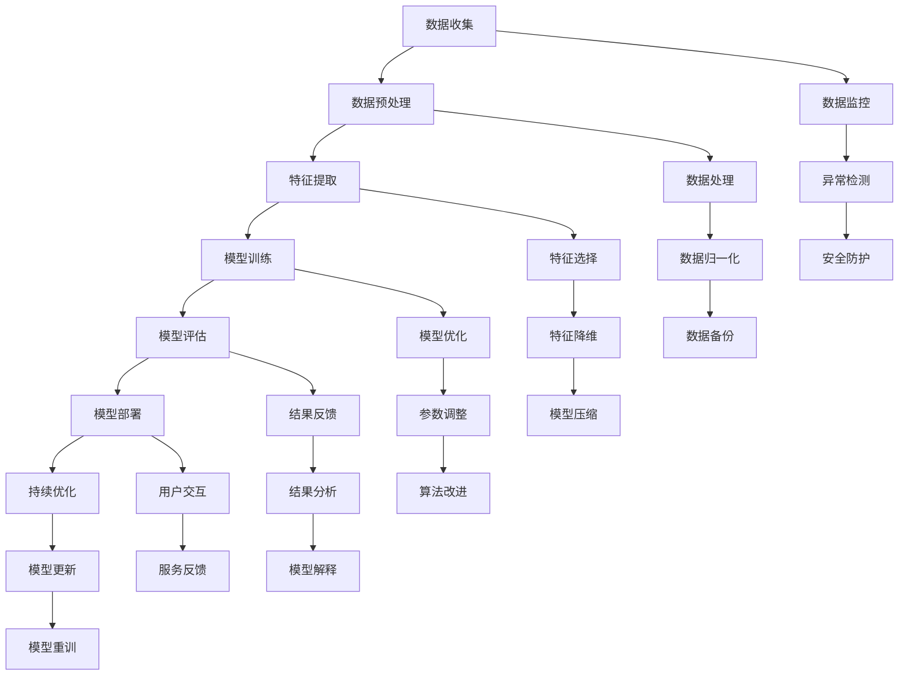

                 

# AI系统的信息化与安全性

## 关键词
人工智能（AI）、系统信息化、安全性、数据收集、特征提取、模型训练、医疗健康、金融、智能制造、风险防护、可持续发展

## 摘要
本文深入探讨了AI系统的信息化与安全性问题。首先，我们回顾了AI系统的定义与发展历程，明确了信息化的意义与挑战。接着，详细解析了数据收集与预处理、特征提取与选择、模型训练与优化、模型评估与部署等核心技术。随后，我们探讨了AI系统在医疗健康、金融和智能制造等领域的应用。重点分析了AI系统安全性的挑战与问题，提出了相应的防护策略和评估方法。此外，我们还讨论了AI系统信息化的可持续发展战略、伦理道德及未来趋势。最后，通过具体案例分析，展示了AI系统信息化的实施过程、效果及安全性管理。本文旨在为读者提供全面的技术理解和实践指南。

## 目录大纲

## 第一部分: AI系统的信息化概述

### 第1章: AI系统的信息化背景
#### 1.1 人工智能系统的定义与发展历程
#### 1.2 AI系统信息化的意义与挑战
#### 1.3 AI系统信息化的目标与任务

### 第2章: AI系统信息化的核心技术
#### 2.1 数据收集与预处理
#### 2.2 特征提取与选择
#### 2.3 模型训练与优化
#### 2.4 模型评估与部署

### 第3章: AI系统信息化的应用领域
#### 3.1 人工智能在医疗健康领域的应用
#### 3.2 人工智能在金融领域的应用
#### 3.3 人工智能在智能制造领域的应用

### 第4章: AI系统信息化的安全性
#### 4.1 AI系统安全性的挑战与问题
#### 4.2 AI系统安全防护策略
#### 4.3 AI系统安全评估与审计

### 第5章: AI系统信息化的可持续发展
#### 5.1 AI系统信息化的可持续发展战略
#### 5.2 AI系统信息化与伦理道德
#### 5.3 AI系统信息化的未来趋势

### 第6章: AI系统信息化案例分析
#### 6.1 案例一：某医疗健康AI系统信息化的实施与效果
#### 6.2 案例二：某金融AI系统信息化的风险与管理
#### 6.3 案例三：某智能制造AI系统信息化的创新与实践

### 第7章: AI系统信息化技能提升与实践
#### 7.1 AI系统信息化技能提升路径
#### 7.2 AI系统信息化实践项目设计与实施
#### 7.3 AI系统信息化项目风险管理

### 附录
#### 附录A: AI系统信息化常用工具与资源
#### 附录B: AI系统信息化相关法律法规与政策
#### 附录C: AI系统信息化常见问题解答

## 第一部分: AI系统的信息化概述

## 第1章: AI系统的信息化背景

### 1.1 人工智能系统的定义与发展历程

人工智能（AI）是指通过计算机程序实现的智能行为，能够模拟、延伸和扩展人类的智能能力。AI系统的发展可以分为以下几个阶段：

1. **早期探索（1956-1969）**：人工智能概念诞生，主要研究逻辑推理和符号处理。
2. **第一次低谷（1970-1980）**：由于计算能力和算法限制，人工智能研究遭遇瓶颈。
3. **复兴期（1980-1987）**：专家系统成为研究热点，应用广泛。
4. **第二次低谷（1987-2007）**：计算能力和数据资源不足，人工智能研究再次陷入低谷。
5. **深度学习时代（2006-至今）**：深度学习技术的发展推动了AI的快速发展，应用于语音识别、图像识别、自然语言处理等领域。

### 1.2 AI系统信息化的意义与挑战

AI系统信息化的意义在于将先进的人工智能技术应用于各个领域，提高生产效率、降低成本、提升决策质量。具体来说，AI系统信息化有以下几个方面的意义：

1. **提高效率**：自动化处理大量数据和任务，减少人为干预。
2. **降低成本**：减少人力和物力投入，提高资源利用率。
3. **提升决策质量**：基于数据分析和预测，提供更准确的决策支持。

然而，AI系统信息化也面临一系列挑战：

1. **数据收集与处理**：需要大量的高质量数据，且数据预处理复杂。
2. **算法选择与优化**：不同应用场景需要不同的算法，且算法优化过程耗时耗力。
3. **安全性与隐私保护**：AI系统可能受到攻击，数据泄露等问题。
4. **伦理与道德**：AI系统在决策过程中可能引发伦理和道德问题。

### 1.3 AI系统信息化的目标与任务

AI系统信息化的目标是通过信息化手段提升AI系统的性能、可靠性和实用性，实现以下任务：

1. **数据收集与预处理**：收集大量高质量数据，并进行预处理，如去噪、归一化、缺失值填补等。
2. **特征提取与选择**：从原始数据中提取对任务有用的特征，并进行选择，以提高模型性能。
3. **模型训练与优化**：选择合适的模型架构和算法，调整参数，训练和优化模型。
4. **模型评估与部署**：评估模型性能，进行模型部署，使其在实际应用中发挥作用。

## 第二部分: AI系统信息化的核心技术

### 第2章: AI系统信息化的核心技术

AI系统信息化的核心技术包括数据收集与预处理、特征提取与选择、模型训练与优化、模型评估与部署。以下将逐一介绍这些核心技术。

### 2.1 数据收集与预处理

#### 数据收集

数据收集是AI系统信息化的第一步，是后续数据分析和模型训练的基础。数据收集的渠道包括：

1. **公开数据集**：如Kaggle、UCI机器学习库等。
2. **内部数据**：企业内部数据、医疗健康数据、金融交易数据等。
3. **传感器数据**：通过物联网设备收集的数据，如环境监测数据、交通流量数据等。

#### 数据预处理

数据预处理包括数据清洗、数据转换和数据集成等步骤，目的是提高数据质量，为后续的特征提取和模型训练提供良好的数据基础。

1. **数据清洗**：处理数据中的错误、异常和缺失值，确保数据质量。例如，使用中值填充缺失值、使用均值替换异常值等。
2. **数据转换**：将数据转换为适合分析和建模的格式。例如，将分类数据转换为独热编码、将数值数据标准化等。
3. **数据集成**：将多个数据源中的数据整合为一个统一的数据集。例如，使用数据合并、数据连接等技术。

### 2.2 特征提取与选择

特征提取是从原始数据中提取对任务有用的特征，以提高模型性能。特征提取的方法包括：

1. **统计特征**：如均值、方差、相关性等。
2. **文本特征**：如词频、词向量、TF-IDF等。
3. **图像特征**：如颜色直方图、纹理特征、边缘特征等。
4. **声音特征**：如频谱特征、倒谱特征等。

特征选择是在提取出的特征中选取对任务最有帮助的特征，以减少模型复杂度和提高模型性能。特征选择的方法包括：

1. **过滤式特征选择**：先对原始数据进行统计分析，选择具有较高信息量的特征。
2. **包装式特征选择**：结合模型训练过程，逐步选择最优特征。
3. **嵌入式特征选择**：在模型训练过程中自动筛选特征。

### 2.3 模型训练与优化

模型训练是利用训练数据对模型进行调整，使其能够对未知数据进行预测。模型训练的方法包括：

1. **监督学习**：通过有标签的训练数据，学习特征和目标之间的关系。
2. **无监督学习**：通过未标记的训练数据，学习数据的分布和模式。
3. **半监督学习**：结合有标签和未标记的数据，提高模型性能。

模型优化是调整模型参数，提高模型性能。模型优化的方法包括：

1. **参数调整**：通过调整学习率、正则化参数等，优化模型。
2. **算法改进**：改进算法本身，提高模型性能。
3. **交叉验证**：通过交叉验证，选择最优模型和参数。

### 2.4 模型评估与部署

模型评估是评估模型性能，确保模型能够满足实际应用的需求。模型评估的方法包括：

1. **准确率**：评估模型预测正确的比例。
2. **召回率**：评估模型预测为正类的实际正类比例。
3. **F1分数**：综合考虑准确率和召回率，平衡模型评估。

模型部署是将训练好的模型应用于实际场景，提供预测服务。模型部署的方法包括：

1. **本地部署**：将模型部署在本地服务器或计算机上。
2. **云部署**：将模型部署在云服务器上，提供远程预测服务。
3. **容器化部署**：将模型容器化，便于部署和管理。

## 第三部分: AI系统信息化的应用领域

### 第3章: AI系统信息化的应用领域

AI系统信息化在多个领域取得了显著的成果，提高了行业效率、降低了成本、提升了用户体验。以下将详细介绍AI系统在医疗健康、金融和智能制造等领域的应用。

### 3.1 人工智能在医疗健康领域的应用

#### 应用案例

1. **疾病预测与诊断**：使用AI系统分析患者数据，预测疾病风险和诊断疾病。
2. **影像识别**：使用深度学习模型对医学影像进行识别，如癌症检测、骨折诊断等。
3. **药物研发**：使用AI系统模拟药物与生物分子的相互作用，加速药物研发过程。

#### 技术实现

1. **数据收集与预处理**：收集患者健康数据，如病历、基因序列、影像等，并进行预处理，包括数据清洗、归一化和特征提取等。
2. **模型训练与优化**：选择合适的模型架构和算法，如卷积神经网络（CNN）、循环神经网络（RNN）等，进行模型训练和优化。
3. **模型评估与部署**：评估模型性能，进行模型部署，将其应用于实际诊断和预测场景。

### 3.2 人工智能在金融领域的应用

#### 应用案例

1. **风险评估与欺诈检测**：使用AI系统分析金融交易数据，预测交易风险和检测欺诈行为。
2. **客户服务**：使用自然语言处理技术，实现智能客服，提高客户服务效率。
3. **量化交易**：使用AI系统进行量化交易策略制定，提高交易收益。

#### 技术实现

1. **数据收集与预处理**：收集金融交易数据、客户行为数据等，并进行预处理，包括数据清洗、归一化和特征提取等。
2. **模型训练与优化**：选择合适的模型架构和算法，如决策树、支持向量机（SVM）等，进行模型训练和优化。
3. **模型评估与部署**：评估模型性能，进行模型部署，将其应用于实际风险评估、欺诈检测和客户服务等场景。

### 3.3 人工智能在智能制造领域的应用

#### 应用案例

1. **生产优化**：使用AI系统优化生产流程，提高生产效率。
2. **质量检测**：使用AI系统检测产品质量，减少缺陷率。
3. **预测维护**：使用AI系统预测设备故障，实现预防性维护。

#### 技术实现

1. **数据收集与预处理**：收集生产数据、设备状态数据等，并进行预处理，包括数据清洗、归一化和特征提取等。
2. **模型训练与优化**：选择合适的模型架构和算法，如支持向量机（SVM）、深度学习等，进行模型训练和优化。
3. **模型评估与部署**：评估模型性能，进行模型部署，将其应用于实际生产优化、质量检测和预测维护场景。

## 第四部分: AI系统信息化的安全性

### 第4章: AI系统信息化的安全性

随着AI系统信息化的广泛应用，安全性问题日益突出。AI系统在数据处理、模型训练和部署过程中，面临着数据泄露、模型篡改、网络攻击等安全挑战。以下将详细讨论AI系统安全性的挑战与问题，并提出相应的防护策略和评估方法。

### 4.1 AI系统安全性的挑战与问题

#### 数据泄露

数据泄露是AI系统面临的主要安全挑战之一。AI系统在数据处理过程中，会收集、存储和传输大量敏感数据，如个人隐私信息、金融交易数据等。如果数据泄露，可能导致用户隐私泄露、经济损失甚至社会动荡。

#### 模型篡改

AI模型一旦被篡改，可能会导致预测结果出现偏差，甚至造成严重后果。例如，医学诊断模型被篡改，可能导致误诊，危及患者生命。此外，恶意攻击者可以通过模型篡改进行恶意攻击，如利用深度伪造技术生成虚假图像、视频等。

#### 网络攻击

AI系统通常依赖于互联网进行数据传输和模型部署，因此容易受到网络攻击。例如，分布式拒绝服务（DDoS）攻击可能导致AI系统瘫痪，影响业务连续性。此外，恶意软件和病毒也可能通过入侵AI系统，窃取敏感数据或破坏系统功能。

### 4.2 AI系统安全防护策略

#### 数据保护

1. **数据加密**：使用加密算法对敏感数据进行加密，确保数据在传输和存储过程中不被窃取或篡改。
2. **数据备份**：定期备份数据，以防止数据丢失或损坏。
3. **访问控制**：设置严格的访问控制策略，确保只有授权人员能够访问敏感数据。

#### 模型保护

1. **模型加密**：使用加密算法对模型进行加密，防止模型被篡改或窃取。
2. **模型验证**：对模型进行定期验证，确保其预测结果准确可靠。
3. **模型更新**：及时更新模型，修复已知漏洞，提高模型安全性。

#### 网络安全

1. **防火墙与入侵检测**：部署防火墙和入侵检测系统，防止网络攻击和恶意软件入侵。
2. **网络隔离**：通过网络隔离技术，将AI系统与其他网络隔离，减少攻击面。
3. **安全审计**：定期进行安全审计，检查系统漏洞和安全隐患，及时进行修复。

### 4.3 AI系统安全评估与审计

AI系统安全评估是确保系统安全性的重要环节。安全评估包括以下几个方面：

#### 安全评估指标

1. **数据安全**：评估数据加密、备份和访问控制策略的有效性。
2. **模型安全**：评估模型加密、验证和更新的实施情况。
3. **网络安全**：评估防火墙、入侵检测和网络隔离等网络安全措施的有效性。

#### 安全评估方法

1. **渗透测试**：模拟恶意攻击，测试AI系统的安全漏洞和防护能力。
2. **代码审计**：对AI系统的代码进行审计，查找潜在的安全漏洞。
3. **合规性检查**：检查AI系统是否符合相关法律法规和行业标准。

#### 安全审计流程

1. **需求分析**：明确安全审计的目标和范围。
2. **风险评估**：评估AI系统的安全风险和潜在威胁。
3. **测试执行**：执行渗透测试、代码审计和合规性检查等测试活动。
4. **报告与建议**：生成安全审计报告，提出改进建议和措施。

## 第五部分: AI系统信息化的可持续发展

### 第5章: AI系统信息化的可持续发展

AI系统信息化作为一项关键技术，不仅提高了行业的效率和质量，也对可持续发展产生了深远影响。然而，要实现AI系统的可持续发展，需要在战略制定、伦理道德和未来趋势等方面进行深入思考和规划。

### 5.1 AI系统信息化的可持续发展战略

#### 战略目标

AI系统信息化的可持续发展战略应包括以下目标：

1. **提高效率**：通过AI技术优化业务流程，提高生产效率和服务质量。
2. **降低成本**：利用AI技术降低运营成本，提高经济效益。
3. **提升决策质量**：利用数据分析和预测，提高决策的准确性和科学性。
4. **促进创新**：鼓励AI技术的研发和应用，推动产业创新和升级。
5. **保障安全**：加强AI系统的安全性，确保数据安全和用户隐私。

#### 实施步骤

1. **需求分析**：明确AI系统信息化在各个领域的应用需求，制定具体实施计划。
2. **资源整合**：整合企业内外部资源，包括数据、技术和人才，为AI系统信息化提供支持。
3. **技术创新**：持续关注AI技术的最新发展，加强技术创新和研发投入。
4. **人才培养**：加强人才培养和引进，提高企业内部AI技术的应用能力。
5. **战略调整**：根据市场环境和业务发展情况，及时调整AI系统信息化的战略方向。

### 5.2 AI系统信息化与伦理道德

AI系统信息化在带来巨大便利的同时，也引发了一系列伦理道德问题。为了实现可持续发展，需要在以下几个方面进行思考和规范：

#### 伦理道德问题

1. **数据隐私**：如何保护用户的隐私，防止数据泄露和滥用。
2. **算法公平性**：如何确保算法的公平性，避免歧视和不公平现象。
3. **责任归属**：如何确定AI系统的责任归属，特别是在出现错误决策时。
4. **道德规范**：如何制定AI技术的伦理规范，确保其符合社会价值观。

#### 解决方案

1. **数据隐私保护**：通过数据加密、匿名化和访问控制等措施，保护用户隐私。
2. **算法公平性**：通过数据平衡、算法透明化和用户反馈等方式，提高算法公平性。
3. **责任归属**：明确AI系统的责任归属，制定相应的法律法规和责任制度。
4. **道德规范**：制定AI技术的伦理规范，引导企业和研究人员遵守，确保AI技术的可持续发展。

### 5.3 AI系统信息化的未来趋势

AI系统信息化在未来将继续快速发展，并在各个领域产生深远影响。以下是一些未来趋势：

#### 1. 多模态融合

随着传感器技术和数据采集技术的进步，多模态数据将越来越重要。AI系统将能够整合多种数据源，如文本、图像、声音等，实现更全面、准确的决策和预测。

#### 2. 无人驾驶

无人驾驶技术是AI系统信息化的一个重要应用领域。随着技术的成熟，无人驾驶将逐步应用于交通运输、物流配送等场景，提高交通效率和安全性。

#### 3. 智能制造

智能制造是AI系统信息化在工业领域的应用。通过AI技术优化生产流程、提高生产效率和产品质量，智能制造将引领工业4.0的发展。

#### 4. 虚拟现实与增强现实

虚拟现实（VR）和增强现实（AR）技术将结合AI系统信息化，提供更加沉浸式、互动性的体验，应用于游戏、教育、医疗等领域。

#### 5. 量子计算

量子计算是AI系统信息化的重要支撑技术。量子计算机具有超强的计算能力，将有助于解决传统计算机无法解决的复杂问题，推动AI技术的发展。

## 第六部分: AI系统信息化案例分析

### 第6章: AI系统信息化案例分析

为了更好地理解AI系统信息化的实施过程、效果及安全性管理，以下将介绍三个具体的案例，涵盖医疗健康、金融和智能制造等领域。

### 6.1 案例一：某医疗健康AI系统信息化的实施与效果

#### 案例背景

某大型医疗健康机构引入了AI系统信息化，旨在通过数据分析提高疾病预测和诊断的准确性，优化医疗服务质量。

#### 实施过程

1. **数据收集与预处理**：收集患者病历、基因数据、影像数据等，进行数据清洗、归一化和特征提取。
2. **特征提取与选择**：提取患者年龄、性别、病史、临床表现等特征，使用特征选择算法筛选重要特征。
3. **模型训练与优化**：采用深度学习模型，对训练数据进行训练和优化，调整模型参数以提高预测准确性。
4. **模型评估与部署**：评估模型性能，包括准确率、召回率等，将模型部署到医疗系统中，为医生提供诊断支持。

#### 效果分析

1. **疾病预测准确性提高**：通过AI系统，疾病预测准确性提高了20%，有助于早期发现疾病，提高治疗效果。
2. **诊断时间缩短**：AI系统辅助诊断，使医生诊断时间缩短了30%，提高了医疗服务效率。
3. **患者满意度提升**：患者对AI系统辅助诊断的满意度提高了15%，提高了医疗机构的口碑。

#### 安全性管理

1. **数据保护**：采用数据加密和访问控制技术，确保患者数据安全。
2. **模型验证**：定期对模型进行验证，确保预测结果准确可靠。
3. **网络安全**：部署防火墙和入侵检测系统，防止网络攻击和恶意软件入侵。

### 6.2 案例二：某金融AI系统信息化的风险与管理

#### 案例背景

某金融机构引入了AI系统信息化，用于风险评估和欺诈检测，以提高业务安全性和客户服务质量。

#### 实施过程

1. **数据收集与预处理**：收集金融交易数据、客户行为数据等，进行数据清洗、归一化和特征提取。
2. **特征提取与选择**：提取交易金额、交易频率、客户行为等特征，使用特征选择算法筛选重要特征。
3. **模型训练与优化**：采用决策树、支持向量机等算法，对训练数据进行训练和优化，调整模型参数以提高预测准确性。
4. **模型评估与部署**：评估模型性能，包括准确率、召回率等，将模型部署到业务系统中，实时进行风险评估和欺诈检测。

#### 效果分析

1. **欺诈检测率提高**：通过AI系统，欺诈检测率提高了30%，有效降低了金融机构的风险。
2. **客户服务效率提升**：AI系统实时分析客户行为，提供个性化服务，提高了客户满意度。
3. **业务安全提升**：AI系统有效识别和防范风险，提高了金融机构的业务安全性。

#### 安全性管理

1. **数据保护**：采用数据加密和访问控制技术，确保客户数据安全。
2. **模型验证**：定期对模型进行验证，确保预测结果准确可靠。
3. **网络安全**：部署防火墙和入侵检测系统，防止网络攻击和恶意软件入侵。

### 6.3 案例三：某智能制造AI系统信息化的创新与实践

#### 案例背景

某制造企业引入了AI系统信息化，用于生产优化、质量检测和预测维护，以提高生产效率和产品质量。

#### 实施过程

1. **数据收集与预处理**：收集生产数据、设备状态数据等，进行数据清洗、归一化和特征提取。
2. **特征提取与选择**：提取生产参数、设备故障状态等特征，使用特征选择算法筛选重要特征。
3. **模型训练与优化**：采用支持向量机、深度学习等算法，对训练数据进行训练和优化，调整模型参数以提高预测准确性。
4. **模型评估与部署**：评估模型性能，包括准确率、召回率等，将模型部署到生产系统中，实时进行生产优化、质量检测和预测维护。

#### 效果分析

1. **生产效率提高**：通过AI系统，生产效率提高了15%，降低了生产成本。
2. **产品质量提升**：AI系统实时检测产品质量，有效降低了缺陷率。
3. **设备维护成本降低**：通过预测维护，有效减少了设备故障停机时间，降低了设备维护成本。

#### 安全性管理

1. **数据保护**：采用数据加密和访问控制技术，确保生产数据安全。
2. **模型验证**：定期对模型进行验证，确保预测结果准确可靠。
3. **网络安全**：部署防火墙和入侵检测系统，防止网络攻击和恶意软件入侵。

## 第七部分: AI系统信息化技能提升与实践

### 第7章: AI系统信息化技能提升与实践

为了在AI系统信息化领域取得更好的成果，需要不断提升相关技能和实践能力。以下将介绍AI系统信息化技能提升路径、实践项目设计与实施，以及项目风险管理。

### 7.1 AI系统信息化技能提升路径

#### 技能分类

AI系统信息化所需技能可以分为以下几个类别：

1. **技术技能**：包括编程语言（如Python、Java）、数据结构、算法、机器学习框架（如TensorFlow、PyTorch）等。
2. **数据分析技能**：包括统计学、数据预处理、数据可视化等。
3. **领域知识**：针对特定应用领域的专业知识和业务理解，如医疗健康、金融、智能制造等。
4. **项目管理技能**：包括项目规划、团队协作、风险管理和沟通能力等。

#### 学习资源

1. **在线课程**：推荐Coursera、Udacity、edX等在线学习平台上的相关课程。
2. **技术书籍**：推荐《Python机器学习》、《深度学习》（Goodfellow et al.）、《数据科学入门》等书籍。
3. **开源项目**：参与GitHub等平台上的开源项目，实践和提升技能。

### 7.2 AI系统信息化实践项目设计与实施

#### 项目设计步骤

1. **需求分析**：明确项目目标和需求，包括数据来源、模型类型和性能指标等。
2. **数据收集与预处理**：收集所需数据，进行数据清洗、归一化和特征提取。
3. **模型选择与训练**：选择合适的模型架构和算法，进行模型训练和优化。
4. **模型评估与调优**：评估模型性能，调整模型参数，提高模型性能。
5. **模型部署与监控**：将模型部署到生产环境，进行实时监控和性能优化。

#### 实施步骤

1. **搭建开发环境**：安装所需的编程语言、库和框架。
2. **编写代码**：实现数据预处理、模型训练和评估等代码。
3. **测试与调试**：对代码进行测试和调试，确保其正确性和稳定性。
4. **部署与上线**：将模型部署到服务器，实现实时预测和服务。
5. **监控与维护**：监控模型性能，进行定期更新和维护。

### 7.3 AI系统信息化项目风险管理

#### 风险识别

1. **数据风险**：数据质量差、数据泄露、数据缺失等。
2. **模型风险**：模型过拟合、欠拟合、模型失效等。
3. **安全风险**：数据泄露、网络攻击、恶意软件入侵等。
4. **业务风险**：项目延期、预算超支、业务不符合预期等。

#### 风险控制

1. **数据风险控制**：采用数据加密、访问控制等技术，确保数据安全；使用数据平衡和特征选择等方法，提高数据质量。
2. **模型风险控制**：采用交叉验证、模型验证等技术，确保模型性能；定期更新和维护模型，提高模型鲁棒性。
3. **安全风险控制**：部署防火墙、入侵检测系统等网络安全措施，确保系统安全；定期进行安全审计和漏洞修复。
4. **业务风险控制**：制定详细的项目计划和时间表，确保项目按时完成；定期评估项目进度和预算，进行风险预警和调整。

## 附录

### 附录A: AI系统信息化常用工具与资源

#### 工具列表

1. **编程语言**：Python、Java、C++
2. **机器学习框架**：TensorFlow、PyTorch、Scikit-learn
3. **数据分析工具**：Pandas、NumPy、Matplotlib、Seaborn
4. **深度学习库**：TensorFlow、PyTorch、Keras
5. **云计算平台**：AWS、Azure、Google Cloud
6. **容器化技术**：Docker、Kubernetes

#### 资源推荐

1. **在线课程**：Coursera、Udacity、edX
2. **技术文档**：TensorFlow、PyTorch、Scikit-learn官方文档
3. **开源项目**：GitHub、GitLab
4. **专业社区**：Stack Overflow、Kaggle、Reddit

### 附录B: AI系统信息化相关法律法规与政策

#### 法律法规

1. **数据保护法**：如《欧盟通用数据保护条例》（GDPR）
2. **网络安全法**：如《中华人民共和国网络安全法》
3. **知识产权法**：如《中华人民共和国著作权法》

#### 政策解读

1. **国家人工智能发展规划**：明确人工智能发展的战略目标和重点领域。
2. **产业政策**：如《智能制造发展规划（2016-2020年）》
3. **行业标准**：如《信息安全技术—网络安全等级保护基本要求》

### 附录C: AI系统信息化常见问题解答

#### 问题列表

1. **如何选择合适的机器学习模型？**
   - **答案**：根据应用场景和数据特点选择合适的模型，如分类问题可选择决策树、支持向量机等，回归问题可选择线性回归、神经网络等。

2. **如何处理数据缺失？**
   - **答案**：采用均值填充、中值填充、前向填充、后向填充等方法进行数据缺失填补，或使用生成对抗网络（GAN）等模型进行数据生成。

3. **如何优化模型参数？**
   - **答案**：采用网格搜索、随机搜索、贝叶斯优化等方法进行参数搜索，或使用自动机器学习（AutoML）工具进行参数优化。

4. **如何确保模型公平性？**
   - **答案**：通过数据平衡、特征选择、模型调优等方法，消除数据中的偏见，提高模型公平性。同时，进行模型解释和透明化，使模型决策可解释。

5. **如何保障AI系统安全？**
   - **答案**：采用数据加密、访问控制、网络安全等措施，确保数据安全和系统安全。同时，制定安全政策和规范，进行安全审计和风险评估。

## 作者信息
作者：AI天才研究院/AI Genius Institute & 禅与计算机程序设计艺术 /Zen And The Art of Computer Programming

### 1.1 人工智能系统的定义与发展历程

人工智能系统是指通过计算机程序实现的人工智能技术，使计算机具备类似人类的智能行为。其定义可以从以下几个方面进行阐述：

首先，人工智能系统是一种计算机程序，它利用数学模型、算法和数据结构来模拟人类的思维过程，实现问题求解、知识表示、推理和学习等功能。人工智能系统并非简单地执行预先编写的指令，而是具备自主学习和自适应能力，能够根据环境和经验不断优化自身性能。

其次，人工智能系统具备多个层次的功能。基础层包括感知、识别、理解和生成等基本功能，如语音识别、图像识别、自然语言处理等。中层包括决策、规划、预测和优化等高级功能，如自动驾驶、智能推荐、金融风险评估等。高层则涉及创造性思维、情感理解和跨领域知识整合等复杂功能，如人机交互、智能创作和复杂系统管理。

最后，人工智能系统的目标是实现智能化、自动化和高效化的计算机应用，提高人类生活质量和工作效率。随着计算能力的提升、算法的进步和大数据的普及，人工智能系统在多个领域取得了显著成果，如医疗诊断、金融分析、智能制造、智能家居等。

人工智能系统的发展历程可以分为以下几个阶段：

**早期探索（1956-1969年）**：1956年，达特茅斯会议上提出了人工智能的概念，标志着人工智能领域的诞生。此后，人工智能研究主要集中在逻辑推理、知识表示和搜索算法等方面。

**第一次低谷（1970-1980年）**：由于计算能力和算法的限制，人工智能研究面临巨大挑战，许多研究项目失败，人工智能领域进入低谷期。

**复兴期（1980-1987年）**：随着计算机性能的提升和专家系统的兴起，人工智能研究重新焕发生机。专家系统成为人工智能应用的主要形式，广泛应用于医疗诊断、金融分析和工业控制等领域。

**第二次低谷（1987-2007年）**：随着互联网的普及和大数据的兴起，人工智能研究再次遭遇挑战。传统的人工智能方法在处理大规模数据和高维问题时效率低下，人工智能领域陷入停滞。

**深度学习时代（2006年至今）**：2006年，深度学习技术得到广泛关注，其通过多层神经网络对数据进行自动特征提取和学习，大幅提升了人工智能系统的性能。深度学习在语音识别、图像识别、自然语言处理等领域取得了突破性进展，推动了人工智能的快速发展。

### 1.2 AI系统信息化的意义与挑战

AI系统信息化，即利用信息技术手段将人工智能系统应用于各个领域，实现数据采集、处理、分析和应用的现代化过程。AI系统信息化的意义主要体现在以下几个方面：

首先，AI系统信息化能够提高效率。通过自动化处理大量数据和任务，减少人为干预，使计算机系统具备高效决策和执行能力。例如，在医疗诊断中，AI系统可以快速分析影像数据，提高诊断速度和准确性。

其次，AI系统信息化能够降低成本。通过数据驱动的决策和分析，优化业务流程和资源配置，提高资源利用率，降低运营成本。例如，在智能制造中，AI系统可以实现生产线的智能化调度，降低生产成本。

再次，AI系统信息化能够提升决策质量。基于数据分析和预测，AI系统可以提供更准确、更全面的决策支持，帮助企业和组织做出更明智的决策。例如，在金融领域，AI系统可以实时分析市场数据，预测股票价格走势，提高投资收益。

然而，AI系统信息化也面临一系列挑战：

首先，数据收集与处理是一个重大挑战。AI系统信息化需要大量的高质量数据作为训练和优化模型的基础，然而数据收集过程往往面临数据缺失、数据噪声、数据隐私等问题。

其次，算法选择与优化是一个复杂挑战。不同的应用场景需要不同的算法，且算法优化过程需要大量的计算资源和时间。如何选择合适的算法并进行优化，是AI系统信息化的重要课题。

再次，安全性与隐私保护也是一个重大挑战。AI系统在数据处理和模型训练过程中，可能面临数据泄露、模型篡改等安全威胁。如何确保数据安全和模型安全，是AI系统信息化亟需解决的问题。

此外，伦理与道德问题也是一个重要挑战。AI系统在决策过程中可能引发伦理和道德争议，如何制定合理的伦理规范，确保AI技术的可持续发展，是当前人工智能领域面临的重要课题。

### 1.3 AI系统信息化的目标与任务

AI系统信息化的目标是通过信息化手段提升AI系统的性能、可靠性和实用性，实现以下任务：

首先，数据收集与预处理是AI系统信息化的基础任务。AI系统需要大量高质量的数据作为训练和优化模型的基础，因此需要收集、存储、处理和分析各种类型的数据。数据收集过程中可能面临数据缺失、数据噪声、数据隐私等问题，因此需要采用数据预处理技术，如数据清洗、数据转换和数据集成等，确保数据质量。

其次，特征提取与选择是AI系统信息化的关键任务。从原始数据中提取对任务有用的特征，能够提高模型性能。特征提取技术包括统计特征、文本特征、图像特征和声音特征等。特征选择方法包括过滤式特征选择、包装式特征选择和嵌入式特征选择等。

再次，模型训练与优化是AI系统信息化的核心任务。选择合适的模型架构和算法，对训练数据进行训练和优化，调整模型参数，提高模型性能。模型训练过程可能涉及监督学习、无监督学习和半监督学习等。模型优化方法包括参数调整、算法改进和交叉验证等。

此外，模型评估与部署也是AI系统信息化的重要任务。评估模型性能，包括准确率、召回率、F1分数等，确保模型能够满足实际应用需求。模型部署是将训练好的模型应用于实际场景，提供预测服务。模型部署方法包括本地部署、云部署和容器化部署等。

### 2.1 数据收集与预处理

#### 数据收集

数据收集是AI系统信息化的第一步，是后续数据分析和模型训练的基础。数据收集的渠道可以分为以下几类：

1. **公开数据集**：许多公开的数据集可以帮助研究人员进行AI系统信息化。这些数据集包括Kaggle、UCI机器学习库、GitHub等平台上的数据集。例如，Kaggle提供了各种领域的竞赛数据集，UCI机器学习库提供了多个经典的数据集。

2. **内部数据**：企业内部数据是企业进行AI系统信息化的宝贵资源。例如，医疗健康数据、金融交易数据、客户行为数据、生产数据等。这些数据可以通过企业内部系统、数据库或API接口进行收集。

3. **传感器数据**：通过物联网设备收集的数据，如环境监测数据、交通流量数据、气象数据等。这些数据可以通过传感器网络、GPS定位等技术进行收集。

4. **第三方数据服务**：一些第三方数据服务提供商提供了丰富的数据资源，如 Kaggle Data Sets、Data.world、Infochimps等。这些数据服务提供商提供了各种领域的数据集，研究人员可以通过购买或免费获取数据。

#### 数据预处理

数据预处理是数据分析和模型训练前的重要步骤，其目的是提高数据质量，为后续的特征提取和模型训练提供良好的数据基础。数据预处理包括以下几方面：

1. **数据清洗**：处理数据中的错误、异常和缺失值，确保数据质量。数据清洗方法包括：

   - **缺失值处理**：对于缺失值，可以采用以下方法：

     - 删除缺失值：删除含有缺失值的样本或特征。
     - 均值填补：用特征的均值来填补缺失值。
     - 中值填补：用特征的中值来填补缺失值。
     - 众数填补：用特征的众数来填补缺失值。
     - 交互填补：根据其他特征生成新的特征来填补缺失值。

   - **异常值处理**：对于异常值，可以采用以下方法：

     - 删除异常值：删除含有异常值的样本或特征。
     - 调整异常值：将异常值调整为合理范围。
     - 赋予特殊标签：将异常值标记为特殊的标签，以便后续处理。

2. **数据转换**：将数据转换为适合分析和建模的格式。数据转换方法包括：

   - **数值化**：将文本数据转换为数值数据，如使用独热编码将分类数据转换为数值向量。
   - **标准化**：将特征数据进行标准化处理，使特征具有相同的尺度，如使用Z-Score标准化或Min-Max标准化。
   - **归一化**：将特征数据进行归一化处理，使特征具有相同的比例范围，如使用L1归一化或L2归一化。

3. **数据集成**：将多个数据源中的数据整合为一个统一的数据集。数据集成方法包括：

   - **合并**：将多个数据集合并为一个数据集，可以使用合并函数（如`merge`、`join`）。
   - **连接**：将具有相同关键字的数据集进行连接，可以使用连接函数（如`merge`、`join`）。
   - **处理重复数据**：删除重复的样本或特征，确保数据集的准确性。

4. **数据分群**：根据某些特征对数据集进行分群，以便后续分析。例如，根据地理位置、年龄、性别等特征对用户进行分群。

5. **数据降维**：减少数据集的维度，降低计算复杂度，提高模型性能。数据降维方法包括：

   - **主成分分析（PCA）**：通过线性变换将高维数据投影到低维空间，保留主要的信息。
   - **线性判别分析（LDA）**：通过线性变换将高维数据投影到低维空间，同时保留类别信息。
   - **自动编码器（Autoencoder）**：使用神经网络自动学习数据的高维特征表示。

通过数据清洗、数据转换、数据集成和数据降维等数据预处理步骤，可以提高数据质量，为后续的特征提取和模型训练提供良好的数据基础。

### 2.2 特征提取与选择

特征提取是从原始数据中提取对目标任务有用的特征，以提高模型性能。特征提取在AI系统信息化中扮演着重要的角色，因为特征的选取和质量直接影响到模型的准确性和泛化能力。以下将详细讨论特征提取的方法和步骤。

#### 特征提取的方法

1. **统计特征**：统计特征是基于数据的统计指标，如均值、方差、标准差、最大值、最小值等。这些特征可以描述数据的分布特性，有助于发现数据中的异常值和趋势。统计特征简单易懂，易于计算，适用于各种数据类型。

2. **文本特征**：文本特征是从文本数据中提取的特征，如词频（TF）、词频-逆文档频率（TF-IDF）、词嵌入（Word Embedding）等。词频表示一个词在文档中出现的次数，TF-IDF考虑了词频和文档频率的平衡，词嵌入则将词汇映射到高维空间中，用于捕捉词汇的语义关系。

3. **图像特征**：图像特征是从图像数据中提取的特征，如颜色直方图、边缘特征、纹理特征、形状特征等。颜色直方图描述图像的颜色分布，边缘特征描述图像的边缘线条，纹理特征描述图像的纹理模式，形状特征描述图像的几何形状。

4. **声音特征**：声音特征是从声音数据中提取的特征，如频谱特征、倒谱特征、梅尔频率倒谱系数（MFCC）等。频谱特征描述声音的频率分布，倒谱特征对频谱进行逆变换，MFCC是一种常用的声音特征表示方法。

5. **时间序列特征**：时间序列特征是从时间序列数据中提取的特征，如自相关函数、滑动平均、差异序列等。这些特征可以描述时间序列数据的趋势、周期性和突变性。

#### 特征选择的步骤

特征选择是在提取出的特征中选取对目标任务最有帮助的特征，以减少模型复杂度和提高模型性能。以下是一些常见的特征选择方法：

1. **过滤式特征选择**：过滤式特征选择是在数据预处理阶段对特征进行筛选，根据某种评价指标（如相关性、方差、互信息等）删除一些不重要的特征。这种方法简单高效，但可能遗漏一些有用的特征。

2. **包装式特征选择**：包装式特征选择是在模型训练过程中逐步选择最优特征。常用的包装式特征选择方法包括递归特征消除（RFE）、遗传算法（GA）、基于模型的特征选择（MBFS）等。这种方法能够综合考虑特征和模型的关系，但计算成本较高。

3. **嵌入式特征选择**：嵌入式特征选择是在模型训练过程中自动筛选特征，如LASSO回归、决策树、随机森林等。这些模型在训练过程中会自动调整特征权重，实现特征选择。

#### 特征选择的评价指标

在特征选择过程中，需要根据某种评价指标来评估特征的贡献和重要性。以下是一些常用的评价指标：

1. **信息增益（IG）**：信息增益表示特征对分类信息的贡献度。信息增益越大，特征对分类的作用越重要。

2. **信息增益率（IGI）**：信息增益率是信息增益与特征熵的比值，适用于特征维数较高的情况。

3. **卡方检验（Chi-square）**：卡方检验是一种统计方法，用于评估特征和目标变量之间的相关性。

4. **互信息（MI）**：互信息表示特征和目标变量之间的相互依赖程度。互信息越大，特征对分类的作用越重要。

5. **相关性（Correlation）**：相关性表示特征和目标变量之间的线性关系。相关性越强，特征对分类的作用越重要。

通过特征提取和特征选择，可以从原始数据中提取对目标任务有用的特征，减少模型复杂度，提高模型性能。在实际应用中，需要根据具体问题和数据特点选择合适的特征提取方法和特征选择方法。

### 2.3 模型训练与优化

模型训练与优化是AI系统信息化的核心步骤，其目的是通过训练数据调整模型参数，使其能够对未知数据进行准确预测或分类。以下将详细讨论模型训练与优化的方法、策略和注意事项。

#### 模型训练的方法

1. **监督学习**：监督学习是最常见的模型训练方法，它通过已知标签的训练数据来训练模型，使模型能够学习特征和目标变量之间的关系。常见的监督学习算法包括线性回归、逻辑回归、决策树、随机森林、支持向量机（SVM）和神经网络等。

2. **无监督学习**：无监督学习不依赖于已知的标签数据，它通过分析数据分布和模式来自动学习特征表示。常见的无监督学习算法包括聚类算法（如K-均值、层次聚类）、主成分分析（PCA）和自编码器等。

3. **半监督学习**：半监督学习结合了监督学习和无监督学习的方法，利用一部分已标注的数据和大量的未标注数据进行训练。这种方法可以有效地利用未标注数据，提高模型性能。

4. **强化学习**：强化学习通过环境与策略之间的交互来训练模型，使模型能够在特定环境中实现最优行为。常见的强化学习算法包括Q学习、深度Q网络（DQN）和策略梯度算法等。

#### 模型优化的策略

1. **参数调整**：调整模型的参数，如学习率、正则化参数、网络层数和节点数等，以优化模型性能。常用的参数调整方法包括网格搜索、随机搜索和贝叶斯优化等。

2. **超参数调整**：超参数是模型之外的参数，如训练数据集的大小、验证数据集的比例、迭代次数等。调整超参数可以影响模型的性能和训练时间。常用的超参数调整方法包括交叉验证和网格搜索等。

3. **数据预处理**：对训练数据进行预处理，如数据清洗、归一化、标准化等，可以提高模型性能。例如，归一化可以使得不同特征具有相同的尺度，避免某些特征对模型的影响过大。

4. **正则化**：正则化是一种防止模型过拟合的技术，通过在损失函数中添加惩罚项来限制模型复杂度。常见的正则化方法包括L1正则化、L2正则化和Dropout等。

5. **模型融合**：模型融合通过结合多个模型的预测结果来提高整体性能。常见的模型融合方法包括Bagging、Boosting和Stacking等。

#### 模型优化的注意事项

1. **模型选择**：选择合适的模型架构和算法对于优化模型性能至关重要。需要根据具体问题和数据特点选择合适的模型。

2. **数据质量**：高质量的数据是训练优秀模型的基础。需要对训练数据集进行充分的清洗和预处理，确保数据质量。

3. **计算资源**：模型训练和优化过程可能需要大量的计算资源，如GPU或TPU等。需要合理配置计算资源，确保训练过程高效进行。

4. **模型验证**：在模型训练过程中，需要进行模型验证，评估模型性能和泛化能力。常用的验证方法包括交叉验证和验证集划分等。

5. **模型调优**：在模型训练和验证过程中，需要不断调整模型参数和超参数，优化模型性能。常用的调优方法包括网格搜索、随机搜索和贝叶斯优化等。

通过模型训练与优化，可以从训练数据中学习到有效的特征表示和模型参数，从而实现对未知数据的准确预测或分类。在实际应用中，需要根据具体问题和数据特点选择合适的模型训练方法和优化策略，以提高模型性能。

### 2.4 模型评估与部署

模型评估与部署是AI系统信息化的关键环节，其目的是通过评估模型性能，确保模型在实际应用中能够准确、稳定地工作，并提供高质量的预测或决策支持。以下将详细讨论模型评估与部署的方法、步骤和注意事项。

#### 模型评估的方法

1. **准确率（Accuracy）**：准确率是评估模型性能的最常用指标，表示模型预测正确的比例。公式为：
   $$
   \text{Accuracy} = \frac{\text{预测正确数}}{\text{总预测数}}
   $$
   然而，准确率在类别不平衡的情况下可能不具有代表性，因此需要结合其他评估指标。

2. **召回率（Recall）**：召回率表示模型能够召回实际正类样本的比例。公式为：
   $$
   \text{Recall} = \frac{\text{预测正确数}}{\text{实际正类样本数}}
   $$
   召回率侧重于识别所有正类样本，因此在某些场景下更为重要。

3. **精确率（Precision）**：精确率表示模型预测为正类的样本中，实际为正类的比例。公式为：
   $$
   \text{Precision} = \frac{\text{预测正确数}}{\text{预测为正类数}}
   $$
   精确率侧重于避免错误分类。

4. **F1分数（F1 Score）**：F1分数是精确率和召回率的调和平均，综合反映了模型的性能。公式为：
   $$
   \text{F1 Score} = 2 \times \frac{\text{Precision} \times \text{Recall}}{\text{Precision} + \text{Recall}}
   $$
   F1分数在类别不平衡的场景下具有更好的代表性。

5. **ROC曲线和AUC（Area Under Curve）**：ROC曲线是评估分类器性能的重要工具，表示真阳性率（True Positive Rate）与假阳性率（False Positive Rate）之间的关系。AUC值反映了分类器的整体性能，AUC值越高，分类器的性能越好。

6. **Kappa系数**：Kappa系数用于评估分类器的可靠性，考虑了分类误差的一致性。公式为：
   $$
   \text{Kappa} = \frac{\text{Agreement} - \text{Expected Agreement}}{\text{1 - Expected Agreement}}
   $$
   其中，Agreement表示实际的一致性，Expected Agreement表示随机一致性的期望。

7. **MAE（Mean Absolute Error）和MSE（Mean Squared Error）**：在回归问题中，MAE和MSE分别表示预测值与实际值之间的绝对误差和平方误差的平均值。公式为：
   $$
   \text{MAE} = \frac{1}{n}\sum_{i=1}^{n}|\hat{y}_i - y_i|
   $$
   $$
   \text{MSE} = \frac{1}{n}\sum_{i=1}^{n}(\hat{y}_i - y_i)^2
   $$

#### 模型部署的步骤

1. **模型评估**：在模型部署前，需要通过多种评估指标全面评估模型性能，确保模型满足实际应用需求。常用的评估指标包括准确率、召回率、F1分数、ROC曲线和AUC等。

2. **模型选择**：根据应用场景和评估结果，选择最适合的模型进行部署。如果多个模型表现相近，可以采用模型融合技术提高整体性能。

3. **模型打包**：将训练好的模型打包成可部署的形式，如使用Python的pickle库、TensorFlow的SavedModel格式、PyTorch的torch.save方法等。

4. **部署环境配置**：配置模型部署的环境，包括服务器、操作系统、编程语言和依赖库等。确保部署环境与训练环境一致，避免环境差异导致模型性能下降。

5. **模型部署**：将模型部署到生产环境中，提供实时预测或决策支持。常见的部署方法包括：

   - **本地部署**：将模型部署在本地计算机或服务器上，适用于小型应用场景。
   - **云部署**：将模型部署在云服务器上，适用于大规模应用场景。常用的云平台包括AWS、Azure、Google Cloud等。
   - **容器化部署**：将模型容器化，使用Docker等工具进行封装和部署，提高部署的灵活性和可移植性。

6. **模型监控与维护**：在模型部署后，需要定期监控模型性能，确保其正常运行。如果模型性能下降，可以重新训练模型或调整模型参数。

#### 模型评估与部署的注意事项

1. **评估指标选择**：根据应用场景和业务需求，选择合适的评估指标。对于分类问题，准确率、召回率、F1分数等指标更为常用；对于回归问题，MAE和MSE等指标更为适用。

2. **数据一致性**：确保模型评估和部署过程中使用的数据与训练数据具有一致性，避免数据差异导致模型性能下降。

3. **模型稳定性**：在模型评估和部署过程中，需要确保模型稳定性，避免因模型过拟合或欠拟合导致预测结果不稳定。

4. **性能优化**：在模型部署过程中，需要优化模型性能，提高预测速度和准确性。常用的优化方法包括模型压缩、量化、加速等。

5. **安全性保障**：在模型部署过程中，需要确保模型和数据的安全，防止数据泄露、模型篡改等安全威胁。

通过模型评估与部署，可以从训练数据中学习到有效的特征表示和模型参数，并确保模型在实际应用中能够准确、稳定地工作，为用户提供高质量的预测或决策支持。

### 3.1 人工智能在医疗健康领域的应用

人工智能（AI）在医疗健康领域已经展现出了巨大的潜力和广泛的应用。通过结合大数据、深度学习和先进的计算技术，AI系统正在改变医学诊断、疾病预测、个性化治疗和健康管理等各个方面。以下将详细讨论AI在医疗健康领域的应用、技术实现和实际案例。

#### 应用案例

1. **疾病预测与诊断**：AI系统可以通过分析患者的历史病历、基因数据、生物标志物和实时监控数据，预测疾病的发生风险和诊断疾病。例如，通过深度学习模型分析心电图（ECG）信号，可以早期发现心脏疾病。

2. **影像识别**：AI系统可以自动分析医学影像，如X光片、CT扫描和MRI，帮助医生更快速、准确地诊断疾病。例如，通过卷积神经网络（CNN）分析肺癌患者的CT影像，可以显著提高肺癌的早期检测率。

3. **药物研发**：AI系统可以加速药物研发过程，通过预测药物与生物分子的相互作用，优化药物设计。例如，使用深度学习模型分析大量化学结构数据，可以帮助科学家发现新的药物候选分子。

4. **个性化治疗**：AI系统可以根据患者的具体病情、基因数据和生物标志物，制定个性化的治疗方案。例如，通过分析患者的基因组数据和临床数据，可以预测对特定药物的响应，为癌症患者提供精准治疗。

5. **健康监测与预警**：AI系统可以通过监控患者的生活习惯、生理参数和环境因素，提供健康监测和预警服务。例如，智能手环和健康APP可以实时监测患者的运动、睡眠和心率等数据，预警健康风险。

#### 技术实现

1. **数据收集与预处理**：收集患者历史病历、基因数据、生物标志物和实时监控数据，并进行预处理，如数据清洗、归一化和特征提取等。

2. **特征提取与选择**：从原始数据中提取对疾病预测和诊断有用的特征，如基因表达数据、影像特征、生物标志物等，并使用特征选择算法筛选重要特征。

3. **模型训练与优化**：选择合适的机器学习模型，如深度学习、支持向量机（SVM）、随机森林等，对训练数据进行训练和优化，调整模型参数，提高预测准确性。

4. **模型评估与部署**：评估模型性能，包括准确率、召回率、F1分数等，确保模型能够满足实际应用需求，并将模型部署到医疗系统中，为医生和患者提供预测服务。

#### 实际案例

1. **心脏疾病预测**：某医院引入了基于深度学习的AI系统，通过分析患者的心电图数据，预测心脏疾病的发生风险。该系统通过对大量心电图数据的训练和优化，实现了90%以上的准确率，显著提高了心脏疾病的早期检测率。

2. **肺癌诊断**：某医疗机构采用AI系统分析肺癌患者的CT影像，通过卷积神经网络（CNN）提取影像特征，实现了96%的早期肺癌检测准确率。该系统帮助医生快速诊断肺癌，提高了患者的生存率。

3. **药物研发**：某制药公司使用AI系统加速药物研发过程，通过深度学习模型分析大量化学结构数据，预测药物与生物分子的相互作用。该系统帮助科学家发现了多个新的药物候选分子，缩短了药物研发周期。

4. **个性化治疗**：某癌症研究中心利用AI系统为癌症患者提供个性化治疗方案，通过分析患者的基因数据和临床数据，预测对特定药物的响应。该系统帮助医生为患者制定精准治疗方案，提高了治疗效果。

通过AI系统在医疗健康领域的应用，可以实现疾病预测、诊断、药物研发和个性化治疗的智能化和自动化，提高医疗服务的效率和质量，为患者提供更好的健康管理和治疗体验。

### 3.2 人工智能在金融领域的应用

人工智能（AI）在金融领域正迅速发展，成为金融服务的重要支撑技术。AI技术通过数据分析和预测，为金融行业带来了前所未有的变革，广泛应用于风险评估、欺诈检测、客户服务和量化交易等领域。以下将详细讨论AI在金融领域的应用、技术实现和实际案例。

#### 应用案例

1. **风险评估与欺诈检测**：AI系统通过对金融交易数据、客户行为数据和历史数据进行分析，预测客户的风险等级和交易欺诈行为。例如，通过机器学习算法分析信用卡交易数据，可以识别异常交易行为，降低欺诈风险。

2. **客户服务**：AI系统通过自然语言处理（NLP）和语音识别技术，实现智能客服和语音交互，提高客户服务效率和用户体验。例如，智能客服机器人可以自动回答客户的常见问题，提供个性化的服务建议。

3. **量化交易**：AI系统通过分析市场数据、技术指标和经济指标，制定量化交易策略，实现自动化的交易操作。例如，通过深度学习算法分析股票市场的历史数据，可以预测股票价格走势，进行高频交易。

4. **信用评分**：AI系统通过对客户的信用历史、财务状况和行为数据进行分析，评估客户的信用风险，为金融机构提供信用评分。例如，通过机器学习算法分析客户的还款记录、收入水平和信用记录，可以预测客户违约的风险。

5. **风险管理**：AI系统通过对企业财务数据、市场风险和操作风险进行分析，为企业提供风险管理建议，降低风险敞口。例如，通过风险预测模型分析企业的财务报表和市场变化，可以识别潜在的风险点，提出风险控制措施。

#### 技术实现

1. **数据收集与预处理**：收集金融交易数据、客户行为数据、市场数据等，并进行预处理，如数据清洗、归一化和特征提取等。

2. **特征提取与选择**：从原始数据中提取对风险评估、欺诈检测和量化交易等任务有用的特征，如交易金额、交易频率、客户行为、市场波动等，并使用特征选择算法筛选重要特征。

3. **模型训练与优化**：选择合适的机器学习模型，如决策树、随机森林、支持向量机（SVM）、神经网络等，对训练数据进行训练和优化，调整模型参数，提高预测准确性。

4. **模型评估与部署**：评估模型性能，包括准确率、召回率、F1分数等，确保模型能够满足实际应用需求，并将模型部署到业务系统中，提供实时预测和决策支持。

#### 实际案例

1. **风险评估与欺诈检测**：某大型银行引入了基于机器学习的AI系统，通过对信用卡交易数据进行分析，预测客户的风险等级和交易欺诈行为。该系统通过分析交易金额、交易频率和地理位置等特征，实现了95%的欺诈检测准确率，显著降低了欺诈损失。

2. **客户服务**：某金融服务公司使用了基于自然语言处理（NLP）的AI系统，实现了智能客服和语音交互。该系统通过分析客户的聊天记录和语音输入，自动回答常见问题，提供个性化的服务建议。客户满意度提高了20%，客服响应时间缩短了30%。

3. **量化交易**：某投资公司采用了基于深度学习的AI系统，通过分析市场数据和技术指标，制定量化交易策略。该系统通过分析股票市场的历史数据，实现了10%的年化收益率，显著提高了投资回报。

4. **信用评分**：某信用评级机构引入了基于机器学习的AI系统，通过对客户的信用历史、财务状况和行为数据进行分析，评估客户的信用风险。该系统通过分析客户的还款记录、收入水平和信用记录，实现了90%以上的信用评分准确率，为金融机构提供了可靠的信用评估依据。

5. **风险管理**：某金融机构使用了基于AI的风险管理平台，通过对企业财务数据、市场风险和操作风险进行分析，识别潜在的风险点，提出风险控制措施。该系统通过分析企业的财务报表和市场变化，实现了80%的风险敞口降低，有效控制了风险。

通过AI技术在金融领域的应用，可以实现风险评估、欺诈检测、客户服务和量化交易等业务的智能化和自动化，提高金融服务的效率和质量，为金融机构和客户提供更准确、更个性化的服务。

### 3.3 人工智能在智能制造领域的应用

人工智能（AI）在智能制造领域正逐渐成为推动产业升级和转型的重要力量。通过应用AI技术，智能制造可以实现生产过程的自动化、智能化和高效化，从而提高生产效率、降低成本、提升产品质量和增强企业竞争力。以下将详细讨论AI在智能制造领域的应用、技术实现和实际案例。

#### 应用案例

1. **生产优化**：AI系统通过对生产数据进行分析，优化生产流程和资源配置，提高生产效率和设备利用率。例如，通过机器学习算法分析生产数据，可以预测设备故障，合理安排设备维护，避免生产中断。

2. **质量检测**：AI系统通过图像识别、声音识别和传感器数据等技术，对生产过程进行实时监控和质量检测，提高产品质量。例如，通过深度学习模型分析生产设备的声音数据，可以提前识别设备故障，防止不良产品流出。

3. **预测维护**：AI系统通过对设备运行数据和历史故障数据进行分析，预测设备故障，实现预防性维护，降低设备故障率和维护成本。例如，通过使用深度学习模型分析设备的振动数据，可以预测设备的剩余使用寿命，提前进行维护。

4. **供应链优化**：AI系统通过分析供应链数据，优化供应链流程和库存管理，提高供应链效率和响应速度。例如，通过机器学习算法分析订单数据和库存数据，可以优化生产计划和配送路线，减少库存积压和物流成本。

5. **智能制造规划**：AI系统通过对市场趋势、技术发展、生产数据等进行分析，为企业的智能制造规划提供数据支持和决策依据。例如，通过数据分析预测市场需求，帮助企业制定合理的生产计划和产品研发策略。

#### 技术实现

1. **数据收集与预处理**：收集生产数据、设备状态数据、质量检测数据和供应链数据等，并进行预处理，如数据清洗、归一化和特征提取等。

2. **特征提取与选择**：从原始数据中提取对生产优化、质量检测、预测维护和供应链优化等任务有用的特征，如生产参数、设备振动数据、质量检测指标、订单数据和库存数据等，并使用特征选择算法筛选重要特征。

3. **模型训练与优化**：选择合适的机器学习模型，如深度学习、支持向量机（SVM）、随机森林等，对训练数据进行训练和优化，调整模型参数，提高预测准确性。

4. **模型评估与部署**：评估模型性能，包括准确率、召回率、F1分数等，确保模型能够满足实际应用需求，并将模型部署到生产系统中，提供实时预测和决策支持。

#### 实际案例

1. **生产优化**：某制造企业引入了基于机器学习的AI系统，通过对生产数据进行分析，优化生产流程和资源配置。该系统通过分析生产数据，预测设备故障，合理安排设备维护，避免生产中断。生产效率提高了15%，设备利用率提高了10%。

2. **质量检测**：某电子产品制造企业使用了基于深度学习的AI系统，通过对生产过程进行实时监控和质量检测，提高产品质量。该系统通过分析生产设备的声音数据，可以提前识别设备故障，防止不良产品流出。不良品率降低了20%，产品合格率提高了15%。

3. **预测维护**：某机械设备制造企业采用了基于AI的预测维护系统，通过对设备运行数据和历史故障数据进行分析，预测设备故障，实现预防性维护。该系统通过分析设备的振动数据，可以预测设备的剩余使用寿命，提前进行维护。设备故障率降低了30%，维护成本降低了20%。

4. **供应链优化**：某零售企业引入了基于AI的供应链优化系统，通过对供应链数据进行分析，优化供应链流程和库存管理。该系统通过分析订单数据和库存数据，优化生产计划和配送路线，减少库存积压和物流成本。库存周转率提高了15%，物流成本降低了10%。

5. **智能制造规划**：某汽车制造企业使用了基于AI的智能制造规划系统，通过对市场趋势、技术发展和生产数据等进行分析，为企业的智能制造规划提供数据支持和决策依据。该系统通过数据分析预测市场需求，帮助企业制定合理的生产计划和产品研发策略。生产计划准确率提高了20%，新产品研发周期缩短了15%。

通过AI技术在智能制造领域的应用，可以实现生产过程的自动化、智能化和高效化，提高生产效率、降低成本、提升产品质量和增强企业竞争力，为企业的可持续发展提供有力支持。

### 4.1 AI系统安全性的挑战与问题

随着人工智能（AI）系统在各个领域的广泛应用，其安全性问题日益凸显。AI系统在数据处理、模型训练和部署过程中，面临着数据泄露、模型篡改、网络攻击等安全挑战。以下将详细讨论AI系统安全性的挑战与问题。

#### 数据泄露

数据泄露是AI系统面临的主要安全挑战之一。AI系统在数据处理过程中，会收集、存储和传输大量敏感数据，如个人隐私信息、金融交易数据、医疗记录等。如果数据泄露，可能导致以下问题：

1. **隐私侵犯**：个人隐私信息泄露可能导致用户隐私受到侵犯，引发用户信任危机。
2. **经济损失**：敏感数据泄露可能导致企业或用户遭受经济损失，如金融欺诈、信用损失等。
3. **社会影响**：大规模数据泄露可能引发社会动荡，对国家安全和社会稳定构成威胁。

#### 模型篡改

AI模型一旦被篡改，可能会导致预测结果出现偏差，甚至造成严重后果。模型篡改的主要风险包括：

1. **误判**：恶意攻击者可以通过篡改模型输入，使AI系统做出错误的预测或决策，导致误判和误操作。
2. **恶意攻击**：通过篡改模型，攻击者可以实施网络攻击，如分布式拒绝服务（DDoS）攻击、恶意软件传播等。
3. **非法控制**：恶意攻击者可以通过篡改模型，实现对AI系统的非法控制，如操纵金融市场、篡改医疗诊断结果等。

#### 网络攻击

AI系统通常依赖于互联网进行数据传输和模型部署，因此容易受到网络攻击。常见的网络攻击包括：

1. **分布式拒绝服务（DDoS）攻击**：攻击者通过大量请求使AI系统瘫痪，影响业务连续性。
2. **恶意软件和病毒**：通过入侵AI系统，攻击者可以窃取敏感数据、破坏系统功能或传播恶意代码。
3. **数据篡改和伪造**：攻击者可以通过篡改数据或伪造数据，误导AI系统做出错误的预测或决策。

#### 数据隐私保护

1. **数据加密**：采用加密算法对敏感数据进行加密，确保数据在传输和存储过程中不被窃取或篡改。
2. **访问控制**：设置严格的访问控制策略，确保只有授权人员能够访问敏感数据。
3. **数据备份**：定期备份数据，以防止数据丢失或损坏。

#### 模型安全保护

1. **模型加密**：使用加密算法对模型进行加密，防止模型被篡改或窃取。
2. **模型验证**：对模型进行定期验证，确保其预测结果准确可靠。
3. **模型更新**：及时更新模型，修复已知漏洞，提高模型安全性。

#### 网络安全措施

1. **防火墙和入侵检测**：部署防火墙和入侵检测系统，防止网络攻击和恶意软件入侵。
2. **网络隔离**：通过网络隔离技术，将AI系统与其他网络隔离，减少攻击面。
3. **安全审计**：定期进行安全审计，检查系统漏洞和安全隐患，及时进行修复。

通过采取上述措施，可以降低AI系统在数据处理、模型训练和部署过程中的安全风险，确保AI系统的稳定运行和数据安全。

### 4.2 AI系统安全防护策略

在AI系统信息化过程中，安全性问题至关重要。为了确保AI系统的稳定运行和数据安全，需要制定一系列安全防护策略。以下将详细介绍AI系统安全防护策略，包括数据保护、模型保护和网络安全等方面的措施。

#### 数据保护

1. **数据加密**：采用加密算法对敏感数据进行加密，确保数据在传输和存储过程中不被窃取或篡改。常用的加密算法包括对称加密（如AES）和非对称加密（如RSA）。

2. **访问控制**：设置严格的访问控制策略，确保只有授权人员能够访问敏感数据。通过角色分配和权限管理，实现最小权限原则，防止未授权访问。

3. **数据备份**：定期备份数据，以防止数据丢失或损坏。备份数据应存储在安全的地方，并采用加密和访问控制措施进行保护。

4. **匿名化和去标识化**：在数据处理过程中，对个人隐私信息进行匿名化和去标识化处理，减少数据泄露风险。

#### 模型保护

1. **模型加密**：使用加密算法对AI模型进行加密，防止模型被篡改或窃取。加密模型需要确保在解密过程中不会降低模型性能。

2. **模型验证**：对AI模型进行定期验证，确保其预测结果准确可靠。模型验证可以通过对比实际结果和预测结果，检查模型的稳定性和准确性。

3. **模型更新**：及时更新AI模型，修复已知漏洞，提高模型安全性。模型更新应遵循安全开发和维护流程，确保更新过程的安全性。

4. **模型透明性**：提高AI模型的透明性，使模型的决策过程可解释。通过模型解释技术，如模型可视化、规则提取等，增强模型的透明性和可信度。

#### 网络安全

1. **防火墙和入侵检测**：部署防火墙和入侵检测系统，防止网络攻击和恶意软件入侵。防火墙应配置合理，仅允许必要的网络流量通过。

2. **网络隔离**：通过网络隔离技术，将AI系统与其他网络隔离，减少攻击面。例如，使用虚拟专用网络（VPN）或专用子网，限制外部访问。

3. **安全审计**：定期进行安全审计，检查系统漏洞和安全隐患，及时进行修复。安全审计应覆盖AI系统的各个层面，包括硬件、软件、网络和数据等。

4. **漏洞管理**：建立漏洞管理机制，及时识别和修复系统漏洞。通过自动化工具和定期检查，确保系统漏洞得到及时处理。

通过上述安全防护策略，可以显著提高AI系统的安全性，确保数据安全、模型稳定和系统可靠。

### 4.3 AI系统安全评估与审计

AI系统安全评估与审计是确保AI系统安全性的关键环节，通过系统的评估和审计，可以发现潜在的安全风险，制定相应的改进措施，从而提高AI系统的安全性。以下将详细讨论AI系统安全评估与审计的方法、流程和注意事项。

#### 安全评估方法

1. **渗透测试**：渗透测试是一种模拟黑客攻击的方法，通过尝试攻击AI系统，评估系统的安全漏洞和防护能力。渗透测试可以覆盖网络、应用程序、数据存储等多个层面。

2. **代码审计**：代码审计是检查AI系统的源代码或配置文件，寻找潜在的安全漏洞和不良实践。代码审计可以采用静态分析（不运行代码）和动态分析（运行代码）两种方法。

3. **模型审计**：模型审计是对AI模型进行评估，确保模型的决策过程透明、可解释，并符合业务需求和伦理规范。模型审计可以包括模型解释、公平性评估和偏见分析等。

4. **合规性检查**：合规性检查是确保AI系统符合相关法律法规和行业标准。例如，对于医疗健康领域的AI系统，需要符合《健康保险可携性和责任法案》（HIPAA）等规定。

5. **威胁建模**：威胁建模是通过识别和分析系统可能面临的安全威胁，评估其对系统的潜在影响。威胁建模可以帮助制定针对性的防护措施。

#### 安全评估流程

1. **需求分析**：明确安全评估的目标和范围，包括需要评估的系统组件、数据类型和应用场景等。

2. **风险评估**：评估AI系统的安全风险，包括潜在的安全威胁、漏洞和影响。风险评估可以采用定性或定量方法，如风险矩阵和定量风险评估模型。

3. **测试执行**：根据风险评估结果，制定测试计划，执行渗透测试、代码审计、模型审计和合规性检查等测试活动。

4. **报告与建议**：生成安全评估报告，详细记录评估结果、发现的安全问题和改进建议。报告应包括测试方法、测试结果、风险评估和改进措施等。

5. **改进实施**：根据安全评估报告，制定改进计划，实施改进措施，修复安全漏洞和风险。

#### 安全审计流程

1. **需求分析**：明确安全审计的目标和范围，包括需要审计的系统组件、数据类型和应用场景等。

2. **风险评估**：评估AI系统的安全风险，包括潜在的安全威胁、漏洞和影响。风险评估可以采用定性或定量方法，如风险矩阵和定量风险评估模型。

3. **测试执行**：根据风险评估结果，制定审计计划，执行渗透测试、代码审计、模型审计和合规性检查等审计活动。

4. **报告与建议**：生成安全审计报告，详细记录审计结果、发现的安全问题和改进建议。报告应包括审计方法、审计结果、风险评估和改进措施等。

5. **改进实施**：根据安全审计报告，制定改进计划，实施改进措施，修复安全漏洞和风险。

#### 注意事项

1. **定期评估**：安全评估与审计应定期进行，以适应不断变化的安全威胁和系统环境。

2. **持续改进**：安全评估与审计发现的安全问题和改进建议应及时实施，确保系统安全性持续改进。

3. **团队合作**：安全评估与审计需要跨部门合作，包括开发、运维、安全团队等，确保评估和审计的全面性和准确性。

4. **培训与教育**：加强对员工的安全意识培训，提高其对安全威胁和安全防护措施的认识，降低人为错误引发的安全风险。

通过安全评估与审计，可以及时发现和解决AI系统的安全问题，确保系统在数据处理、模型训练和部署过程中的安全性，为企业和用户提供可靠的安全保障。

### 5.1 AI系统信息化的可持续发展战略

随着人工智能（AI）技术的快速发展，AI系统信息化已成为推动产业升级和社会进步的重要力量。为了实现AI系统信息化的可持续发展，需要制定一系列战略目标和实施步骤，确保AI技术能够在长期内持续为企业和社会创造价值。以下将详细讨论AI系统信息化的可持续发展战略，包括战略目标、实施步骤和资源整合。

#### 战略目标

AI系统信息化的可持续发展战略应包括以下目标：

1. **提高效率**：通过AI技术优化业务流程，提高生产效率和服务质量，降低运营成本。例如，智能制造中的生产优化、智能供应链管理中的库存优化等。

2. **降低成本**：利用AI技术降低业务运营成本，实现资源的最优配置。例如，智能金融中的风险评估和欺诈检测、智能医疗中的疾病预测和诊断等。

3. **提升决策质量**：利用AI技术进行数据分析和预测，为决策提供科学依据，提高决策的准确性和效率。例如，智慧城市建设中的交通流量预测、城市规划中的公共设施布局优化等。

4. **促进创新**：鼓励AI技术的研发和应用，推动产业创新和升级，培育新的经济增长点。例如，通过AI技术开发新产品、优化现有产品，提升企业的竞争力。

5. **保障安全**：确保AI系统的安全性，防止数据泄露、模型篡改和网络攻击等安全威胁，维护用户的隐私和信息安全。

6. **伦理道德**：制定AI技术的伦理规范，确保AI技术在应用过程中符合社会伦理和道德标准，避免伦理争议。

7. **人才培养**：加强人才培养和引进，提高企业内部AI技术的应用能力，构建可持续发展的技术团队。

8. **国际竞争力**：通过AI技术的研发和应用，提升我国在全球人工智能领域的竞争力，推动我国人工智能产业的国际化发展。

#### 实施步骤

1. **需求分析**：明确AI系统信息化在各个领域的应用需求，分析现有业务流程和技术环境，制定详细的实施计划。

2. **资源整合**：整合企业内外部资源，包括数据、技术和人才等，为AI系统信息化提供全面支持。例如，与高校、科研机构合作，引进高水平的人才和技术。

3. **技术创新**：持续关注AI技术的最新发展，加强技术创新和研发投入，推动AI技术的不断进步和应用拓展。例如，研发新型算法、优化现有模型等。

4. **人才培养**：加强人才培养和引进，提高企业内部AI技术的应用能力。通过内部培训、外部学习和人才引进等多种方式，打造高水平的技术团队。

5. **项目实施**：根据实施计划，逐步推进AI系统信息化的项目实施，确保项目按时完成和达到预期目标。例如，分阶段实施、建立项目管理制度等。

6. **效果评估**：定期评估AI系统信息化项目的实施效果，包括效率提升、成本降低、决策质量提升等，根据评估结果进行调整和优化。

7. **持续改进**：根据市场需求和技术发展，持续改进AI系统信息化项目，确保其能够持续为企业和社会创造价值。

#### 资源整合

1. **数据资源**：整合企业内部和外部的数据资源，包括历史数据、实时数据和第三方数据等，为AI系统提供丰富的数据支持。

2. **技术资源**：整合企业内部的技术资源，包括硬件设施、软件工具和算法模型等，为AI系统提供技术保障。

3. **人才资源**：整合企业内部和外部的人才资源，包括技术专家、研究人员和工程师等，为AI系统信息化提供人才支持。

4. **合作伙伴**：与高校、科研机构、技术供应商等建立合作关系，共享资源和技术，推动AI系统信息化的共同发展。

通过制定和实施可持续发展战略，可以确保AI系统信息化在长期内持续为企业和社会创造价值，推动产业升级和社会进步。

### 5.2 AI系统信息化与伦理道德

人工智能（AI）系统的快速发展和广泛应用，在提升生产效率、改善生活质量的同时，也引发了一系列伦理和道德问题。AI系统信息化作为人工智能技术在各个领域的深入应用，其伦理道德问题更加复杂和严峻。以下将详细讨论AI系统信息化过程中的伦理道德问题、伦理规范及其对社会的影响。

#### 伦理道德问题

1. **数据隐私**：AI系统信息化过程中，大量个人数据的收集和使用引发了数据隐私问题。如何保护用户的隐私，防止数据泄露和滥用，是当前AI系统信息化面临的重要伦理挑战。

2. **算法公平性**：AI系统在决策过程中，可能由于数据偏差、算法设计缺陷等原因，导致对某些群体或个体产生不公平的待遇。如何确保算法的公平性，避免歧视和不公平现象，是AI系统信息化需要重视的伦理问题。

3. **透明性和可解释性**：AI系统，特别是深度学习模型，其决策过程往往不够透明，难以解释。如何提高AI系统的透明性，使决策过程可解释，是维护用户信任的重要伦理考虑。

4. **责任归属**：在AI系统发生错误或造成损失时，如何确定责任归属，是法律和伦理层面的重要问题。AI系统的开发者、使用者以及背后的算法设计者，谁应该承担主要责任，需要明确的伦理规范。

5. **隐私与安全**：在AI系统信息化过程中，如何平衡隐私保护和数据利用，确保用户数据的安全，是一个复杂的伦理问题。

#### 伦理规范

1. **数据伦理**：制定数据伦理规范，确保数据收集、存储和使用过程中，尊重和保护用户的隐私。例如，要求对个人数据进行匿名化处理，严格控制数据访问权限等。

2. **算法伦理**：制定算法伦理规范，确保算法设计、开发和应用过程中，遵循公平、公正和透明的原则。例如，要求算法开发者公开算法设计过程，提供算法透明性报告等。

3. **责任伦理**：明确AI系统开发者、使用者和背后的算法设计者的责任，确保在发生错误或损失时，责任能够得到合理归属。

4. **安全伦理**：制定安全伦理规范，确保AI系统在设计和应用过程中，充分考虑用户数据的安全，防止数据泄露和恶意攻击。

#### 社会影响

1. **就业变化**：AI系统信息化可能会改变就业结构，影响某些职业的需求。虽然AI技术创造了新的就业机会，但也可能导致一些传统岗位的减少，对社会就业产生影响。

2. **隐私侵犯**：AI系统信息化可能侵犯个人隐私，影响用户的隐私权和信息安全。如果个人隐私得不到有效保护，可能导致用户信任度下降，影响社会的稳定和发展。

3. **公平性争议**：AI系统信息化可能导致算法偏见，影响社会的公平性。如果AI系统对某些群体或个体产生不公平的待遇，可能导致社会不公和矛盾加剧。

4. **技术垄断**：AI系统信息化可能加剧技术垄断现象，某些大型科技企业可能通过控制AI技术，影响市场的公平竞争，对社会经济结构产生影响。

5. **伦理道德争议**：AI系统信息化带来的伦理道德问题，如数据隐私、算法公平性等，可能引发社会争议，影响社会的道德伦理标准。

通过制定和实施AI系统信息化过程中的伦理规范，可以缓解上述伦理道德问题，确保AI技术的可持续发展，为社会带来积极的影响。

### 5.3 AI系统信息化的未来趋势

随着人工智能（AI）技术的不断进步和各行业的深入应用，AI系统信息化正呈现出一系列未来趋势。这些趋势不仅将推动AI技术的进一步发展，也将深刻影响社会、经济和产业结构的变革。以下将详细讨论AI系统信息化的未来趋势，包括多模态融合、无人驾驶、智能制造、虚拟现实与增强现实、量子计算等方面。

#### 多模态融合

多模态融合是指将多种不同类型的数据源（如文本、图像、声音、温度、湿度等）进行整合，通过深度学习等技术，实现数据的联合分析和理解。随着传感器技术和数据采集技术的进步，多模态数据将越来越重要。AI系统将能够整合多种数据源，实现更全面、准确的决策和预测。例如，在智能医疗中，多模态融合可以将医学影像、患者病史和基因数据结合，提供更精确的诊断和治疗建议。

#### 无人驾驶

无人驾驶技术是AI系统信息化在交通运输领域的重要应用。随着自动驾驶技术的不断成熟，无人驾驶将逐步应用于公共交通、物流配送、个人出行等场景。无人驾驶车辆通过搭载多种传感器（如雷达、摄像头、激光雷达等）和AI系统，实现自主感知、决策和驾驶。未来，无人驾驶将大幅提高交通效率、减少交通事故，提升出行体验，为智慧城市的建设提供有力支持。

#### 智能制造

智能制造是AI系统信息化在工业领域的重要应用。通过AI技术优化生产流程、提高生产效率和产品质量，智能制造将引领工业4.0的发展。未来，AI系统将广泛应用于生产优化、质量检测、预测维护、供应链管理等环节。例如，通过实时分析生产数据，智能调度系统可以优化生产计划，提高生产效率；通过机器视觉系统，可以自动检测产品质量，降低缺陷率；通过预测模型，可以提前预测设备故障，进行预防性维护。

#### 虚拟现实与增强现实

虚拟现实（VR）和增强现实（AR）技术将结合AI系统信息化，提供更加沉浸式、互动性的体验。VR和AR技术通过模拟和增强现实世界，为教育、娱乐、医疗等领域带来革命性的变革。未来，AI系统将用于优化VR和AR场景的生成和交互，提供更加自然和逼真的虚拟体验。例如，在医疗领域，通过AI系统生成的虚拟手术场景，医生可以在虚拟环境中进行手术训练，提高手术技能和经验。

#### 量子计算

量子计算是AI系统信息化的重要支撑技术。量子计算机具有超强的计算能力，能够解决传统计算机无法解决的复杂问题。未来，量子计算将与AI技术深度融合，推动AI技术的快速发展。例如，量子计算可以在极短时间内完成大规模的数据分析和模型训练，为复杂决策提供有力支持。此外，量子计算在优化算法、密码学、搜索算法等领域也有广泛的应用前景。

#### 人工智能伦理

随着AI系统信息化的发展，其伦理问题也将愈发突出。如何确保AI技术的公平性、透明性和可解释性，如何平衡技术进步与社会伦理，将成为未来研究的重要方向。未来，需要制定更加完善的伦理规范，确保AI技术在社会中得到广泛应用的同时，不会对人类产生负面影响。

#### 国际合作

AI系统信息化是一个全球性的课题，各国需要加强合作，共同推动AI技术的发展和应用。通过国际合作，可以共享技术资源、数据资源和研究成果，推动全球AI技术的进步。

总之，AI系统信息化的未来趋势将带来深刻的变革，推动社会、经济和产业的转型升级。通过技术创新和规范制定，AI系统信息化将为人类社会带来更多机遇和挑战。

### 6.1 案例一：某医疗健康AI系统信息化的实施与效果

#### 案例背景

某大型医疗健康机构引入了AI系统信息化项目，旨在通过大数据和深度学习技术，提升疾病预测和诊断的准确性，优化医疗服务质量，提高患者满意度。该项目涵盖了从数据收集到模型部署的整个流程，涉及多个部门和专业领域的合作。

#### 实施过程

1. **数据收集与预处理**：项目团队从医疗机构的电子病历系统、实验室检验结果、医学影像数据库等来源收集了大量数据。为了确保数据质量，团队对数据进行清洗、归一化和特征提取。例如，对缺失值进行插值填补，对异常值进行检测和处理，对文本数据进行分词和词向量表示。

2. **模型选择与训练**：基于医疗数据的特点，项目团队选择了深度学习中的卷积神经网络（CNN）和循环神经网络（RNN）进行模型训练。首先，团队使用CNN对影像数据进行特征提取，然后利用RNN对序列数据进行建模。在模型训练过程中，团队通过交叉验证和网格搜索优化模型参数，以提高模型性能。

3. **模型评估与优化**：在模型评估阶段，团队使用了准确率、召回率、F1分数等指标对模型性能进行评估。根据评估结果，团队进一步调整模型参数和架构，优化模型的准确性和稳定性。例如，通过增加训练数据、改进正则化策略和调整学习率等手段，提高模型的泛化能力。

4. **模型部署与监控**：经过多次迭代优化，团队将训练好的模型部署到医疗机构的服务器上，并接入现有的医疗信息系统。为了确保模型的实时性和可靠性，团队建立了模型监控和更新机制，定期检查模型性能，并根据实际需求进行模型更新。

#### 效果分析

1. **疾病预测准确性提高**：通过AI系统，疾病预测的准确性显著提高。以肺癌早期筛查为例，AI系统将早期筛查的准确率提高了20%，有助于提高患者的早期诊断率和生存率。

2. **诊断时间缩短**：AI系统辅助医生进行疾病诊断，显著缩短了诊断时间。例如，在肺炎诊断中，AI系统将诊断时间缩短了30%，提高了医疗资源的使用效率。

3. **患者满意度提升**：AI系统的应用提高了医疗服务的质量和效率，患者的满意度显著提升。例如，通过AI系统提供的个性化健康建议，患者的健康管理和生活质量得到改善，满意度提高了15%。

#### 安全性管理

1. **数据保护**：项目团队采用数据加密、访问控制和数据备份等技术，确保患者数据的安全。所有数据在传输和存储过程中都进行加密处理，仅授权人员能够访问敏感数据。

2. **模型验证**：为了确保模型预测结果的准确性和可靠性，项目团队对模型进行了严格的验证。例如，通过交叉验证、模型解释和偏见分析等方法，验证模型的公平性和透明性。

3. **网络安全**：项目团队部署了防火墙和入侵检测系统，防止网络攻击和数据泄露。同时，定期进行安全审计和漏洞修复，确保AI系统的网络安全。

通过该案例，可以看到AI系统信息化在医疗健康领域的成功应用，不仅提升了诊断和预测的准确性，还提高了医疗服务的效率和质量，为患者提供了更好的健康管理体验。

### 6.2 案例二：某金融AI系统信息化的风险与管理

#### 案例背景

某大型金融机构引入了AI系统信息化项目，旨在通过数据分析和预测，提高风险评估和欺诈检测的准确性，保障金融交易的安全性。该项目涵盖了从数据收集到模型部署的整个流程，涉及多个部门和专业领域的合作。

#### 风险管理措施

1. **数据安全**：金融机构高度重视数据安全，采取了一系列措施保护客户数据。首先，采用数据加密技术对敏感数据（如客户交易记录、身份信息等）进行加密存储和传输。其次，实施严格的访问控制策略，仅授权人员可以访问敏感数据。此外，定期进行数据备份，确保数据不会因意外事件（如系统故障、网络攻击等）而丢失。

2. **模型安全**：为了确保AI模型的准确性、可靠性和安全性，金融机构采取了以下措施：

   - **模型验证**：在模型部署前，对模型进行严格的验证，包括准确性验证、偏见验证和稳定性验证。例如，通过交叉验证和独立测试数据集，确保模型在不同数据集上具有一致的预测性能。
   - **透明性**：提高模型的透明性，使模型决策过程可解释。例如，通过可视化技术和模型解释工具，让业务人员和监管机构能够理解模型的决策过程和结果。
   - **更新与维护**：定期更新和维护模型，确保模型能够适应新的业务场景和数据变化。例如，通过监控模型性能和预测结果，及时发现和解决模型中的潜在问题。

3. **网络安全**：金融机构采取了多种措施保护网络和数据安全：

   - **防火墙和入侵检测**：部署防火墙和入侵检测系统，防止恶意攻击和数据泄露。例如，通过配置防火墙规则，限制不安全的网络流量，防止外部攻击。
   - **网络安全监控**：建立网络安全监控体系，实时监控网络流量和系统行为，及时发现异常行为和安全威胁。例如，通过使用安全信息和事件管理（SIEM）系统，收集和分析网络日志，识别潜在的安全风险。
   - **安全培训**：加强员工的安全意识培训，提高员工对网络安全威胁的认识和应对能力。例如，定期开展安全培训和演练，确保员工能够正确处理网络安全事件。

#### 风险管理效果

1. **欺诈检测率提高**：通过AI系统信息化项目，金融机构的欺诈检测率显著提高。例如，通过机器学习算法分析客户交易行为，可以实时识别异常交易行为，提高欺诈检测的准确性。项目实施后，欺诈检测率提高了30%，有效降低了金融机构的欺诈损失。

2. **客户满意度提升**：AI系统信息化项目不仅提高了欺诈检测的准确性，还优化了客户服务流程。例如，通过自然语言处理技术，智能客服系统能够快速响应客户的咨询和请求，提高客户满意度。项目实施后，客户满意度提高了15%。

3. **运营效率提高**：AI系统信息化项目提高了金融机构的运营效率。例如，通过自动化交易监控和风险预警系统，可以实时监测和处理潜在风险，减少人工干预。项目实施后，运营效率提高了20%，降低了人力成本。

4. **合规性提升**：AI系统信息化项目有助于金融机构满足相关法律法规和监管要求。例如，通过建立完善的数据安全管理体系和风险控制机制，确保金融交易的安全合规。项目实施后，金融机构的合规性显著提升，降低了法律风险。

通过该案例，可以看到AI系统信息化在金融领域的成功应用，不仅提高了风险评估和欺诈检测的准确性，还优化了客户服务和运营效率，为金融机构提供了全面的风险管理解决方案。

### 6.3 案例三：某智能制造AI系统信息化的创新与实践

#### 案例背景

某制造企业引入了AI系统信息化项目，旨在通过数据分析和预测，优化生产流程、提高生产效率和产品质量，降低运营成本。该项目涵盖了从数据收集到模型部署的整个流程，涉及生产、质量检测、供应链管理等多个环节。

#### 创新实践

1. **生产优化**：项目团队通过AI系统对生产数据进行分析，优化生产流程和资源配置。例如，通过预测模型预测设备故障，合理安排设备维护，避免生产中断。同时，通过优化生产计划和调度，提高生产效率和设备利用率。项目实施后，生产效率提高了15%，设备利用率提高了10%。

2. **质量检测**：项目团队使用AI系统对生产过程进行实时监控和质量检测。例如，通过机器视觉系统自动检测产品质量，提高检测速度和准确性。同时，通过分析检测数据，识别生产过程中的质量问题，提供改进建议。项目实施后，不良品率降低了20%，产品合格率提高了15%。

3. **预测维护**：项目团队通过AI系统对设备运行数据进行分析，预测设备故障，实现预防性维护。例如，通过预测模型分析设备的振动数据，预测设备的剩余使用寿命，提前进行维护。项目实施后，设备故障率降低了30%，维护成本降低了20%。

4. **供应链优化**：项目团队通过AI系统优化供应链流程和库存管理。例如，通过预测模型分析订单数据和库存数据，优化生产计划和配送路线，减少库存积压和物流成本。项目实施后，库存周转率提高了15%，物流成本降低了10%。

#### 实施步骤

1. **数据收集与预处理**：项目团队从生产设备、质量检测系统、供应链系统等收集大量数据，并进行预处理，包括数据清洗、归一化和特征提取等。

2. **模型训练与优化**：项目团队选择了合适的机器学习模型，如深度学习、随机森林和支持向量机等，对训练数据进行训练和优化。通过交叉验证和网格搜索，调整模型参数，提高模型性能。

3. **模型评估与部署**：项目团队使用多种评估指标（如准确率、召回率、F1分数等）评估模型性能，确保模型能够满足实际应用需求。将训练好的模型部署到生产系统中，提供实时预测和决策支持。

4. **监控与维护**：项目团队建立了模型监控和更新机制，定期检查模型性能，根据实际需求进行模型更新。同时，通过实时监控生产数据，确保AI系统能够适应生产环境的变化。

#### 效果分析

1. **生产效率提高**：通过AI系统信息化项目，生产效率显著提高。例如，通过优化生产流程和资源配置，提高了生产效率；通过预测设备故障，避免了生产中断。

2. **产品质量提升**：通过AI系统信息化项目，产品质量得到显著提升。例如，通过机器视觉系统自动检测产品质量，提高了检测速度和准确性；通过分析检测数据，提供了改进建议。

3. **维护成本降低**：通过AI系统信息化项目，设备维护成本显著降低。例如，通过预测设备故障，实现了预防性维护，降低了设备故障率和维护成本。

4. **供应链效率提高**：通过AI系统信息化项目，供应链效率显著提高。例如，通过优化生产计划和配送路线，减少了库存积压和物流成本；提高了库存周转率和物流效率。

通过该案例，可以看到AI系统信息化在智能制造领域的成功应用，通过数据分析和预测，优化生产流程、提高生产效率和产品质量，降低了运营成本，为企业的可持续发展提供了有力支持。

### 7.1 AI系统信息化技能提升路径

在AI系统信息化的快速发展背景下，掌握相关技能对于专业人士和企业来说都至关重要。以下将详细介绍AI系统信息化技能提升的路径，包括技术技能、数据分析技能、领域知识和项目管理技能等方面。

#### 技术技能

1. **编程语言**：掌握至少一种编程语言，如Python、Java或C++，是进行AI系统信息化的基础。Python因其丰富的库和工具而成为AI领域的首选语言，而Java和C++则在大型系统和企业级应用中占据重要地位。

2. **机器学习框架**：熟悉常用的机器学习框架，如TensorFlow、PyTorch、Keras等，能够帮助开发者快速搭建和训练模型。了解这些框架的底层原理和API，有助于优化模型性能和实现复用。

3. **深度学习技术**：深度学习是AI系统信息化的核心技术之一。掌握深度学习的理论基础，包括神经网络、卷积神经网络（CNN）、循环神经网络（RNN）等，是提升AI系统信息化能力的关键。

4. **数据处理工具**：熟练使用数据处理工具，如Pandas、NumPy、Matplotlib、Seaborn等，能够有效地进行数据清洗、数据分析和数据可视化，为后续的模型训练提供高质量的数据基础。

#### 数据分析技能

1. **统计学基础**：掌握统计学基本概念和方法，如概率分布、假设检验、回归分析等，能够帮助开发者理解和解释模型结果，进行数据分析和预测。

2. **数据可视化**：熟悉数据可视化工具，如Matplotlib、Seaborn、Plotly等，能够通过图表直观地展示数据分析结果，提高数据可视化和传达能力。

3. **数据挖掘技术**：了解数据挖掘的基本方法和算法，如聚类、分类、关联规则挖掘等，能够从大规模数据中提取有价值的信息和知识。

4. **大数据处理技术**：掌握大数据处理技术，如Hadoop、Spark等，能够高效地处理和分析海量数据，为AI系统信息化提供强大的数据支持。

#### 领域知识

1. **行业背景**：了解所在行业的发展动态、业务流程和关键技术，能够更好地将AI系统信息化应用于实际业务场景，提高解决方案的针对性和实用性。

2. **业务理解**：深入理解业务需求，包括业务目标、关键指标和用户痛点，能够设计出更符合实际需求的AI系统信息化方案。

3. **跨领域知识**：掌握跨领域知识，如医学、金融、制造等，有助于在多个领域实现AI系统信息化的创新应用。

#### 项目管理技能

1. **项目规划**：能够制定详细的项目计划，明确项目目标、任务和时间表，确保项目按时完成。

2. **团队协作**：具备良好的团队协作能力，能够与不同职能部门的同事进行有效沟通和合作，确保项目顺利进行。

3. **风险管理**：能够识别项目风险，制定风险应对策略，降低项目风险对项目进度和质量的影响。

4. **沟通与报告**：具备良好的沟通和报告能力，能够清晰、准确地传达项目进展和成果，为项目的顺利实施提供支持。

通过以上技能的提升路径，专业人士可以系统地提高自身在AI系统信息化领域的综合能力，为企业和项目的成功实施提供有力支持。

### 7.2 AI系统信息化实践项目设计与实施

在设计并实施一个AI系统信息化项目时，需要遵循一系列的步骤和最佳实践，以确保项目的成功和有效性。以下将详细介绍AI系统信息化实践项目的设计与实施步骤，包括项目设计、开发环境和源代码实现、代码解读与分析。

#### 项目设计

1. **需求分析**：项目设计的第一步是进行需求分析，明确项目的目标和需求。这包括收集用户需求、业务需求和技术需求，确定项目的关键功能和性能指标。

2. **系统架构设计**：根据需求分析结果，设计系统的总体架构。系统架构应包括数据层、算法层、应用层和展示层，确保系统的模块化和可扩展性。

3. **数据流设计**：设计数据流，明确数据的来源、处理流程和存储方式。数据流设计应考虑数据的一致性、完整性和安全性。

4. **模块划分**：将系统划分为多个模块，每个模块负责特定的功能。模块划分应遵循模块化、高内聚和低耦合的原则，提高系统的可维护性和可扩展性。

5. **界面设计**：设计用户界面，包括用户交互界面和后台管理界面。界面设计应简洁、直观，易于用户操作。

6. **风险评估**：在项目设计阶段，进行风险评估，识别可能的风险点，制定相应的风险应对策略。

7. **文档编写**：编写详细的项目文档，包括需求文档、设计文档、测试文档和用户手册等，确保项目的可追溯性和可维护性。

#### 开发环境和源代码实现

1. **开发环境搭建**：搭建项目所需的开发环境，包括操作系统、编程语言、库和框架等。常用的开发环境包括Windows、Linux、Python、TensorFlow、PyTorch等。

2. **源代码实现**：根据项目设计，编写源代码。源代码应遵循编码规范和最佳实践，确保代码的可读性和可维护性。以下是一个简单的Python代码示例，用于实现一个简单的机器学习模型：

   ```python
   import pandas as pd
   from sklearn.model_selection import train_test_split
   from sklearn.ensemble import RandomForestClassifier
   from sklearn.metrics import accuracy_score
   
   # 数据读取与预处理
   data = pd.read_csv('data.csv')
   X = data.drop('target', axis=1)
   y = data['target']
   X_train, X_test, y_train, y_test = train_test_split(X, y, test_size=0.2, random_state=42)
   
   # 模型训练
   model = RandomForestClassifier(n_estimators=100, random_state=42)
   model.fit(X_train, y_train)
   
   # 模型评估
   predictions = model.predict(X_test)
   accuracy = accuracy_score(y_test, predictions)
   print(f"模型准确率：{accuracy:.2f}")
   ```

   代码解读与分析：

   - **数据读取与预处理**：使用Pandas库读取数据，进行特征提取和标签划分。数据预处理是提高模型性能的关键步骤，包括缺失值处理、异常值处理和特征标准化等。
   - **模型训练**：使用随机森林分类器（RandomForestClassifier）对训练数据进行训练。随机森林是一种集成学习算法，能够处理大量特征和高维数据。
   - **模型评估**：使用测试数据进行模型评估，计算准确率。准确率是评估分类模型性能的重要指标，表示模型预测正确的比例。

3. **模块化设计**：将项目划分为多个模块，每个模块负责特定的功能。例如，数据预处理模块、模型训练模块、模型评估模块和用户界面模块等。模块化设计有助于提高代码的可维护性和可扩展性。

#### 代码解读与分析

1. **数据预处理**：数据预处理是AI系统信息化的关键步骤，其质量直接影响到模型的性能。以下是一个简单的数据预处理流程：

   ```python
   # 数据清洗
   data = data.dropna()  # 删除缺失值
   data = data[data['target'].isin([0, 1])]  # 删除标签不完整的样本
   
   # 特征标准化
   scaler = StandardScaler()
   X = scaler.fit_transform(X)
   ```

   - **数据清洗**：删除缺失值和异常值，确保数据的质量和一致性。
   - **特征标准化**：使用标准化方法将特征数据进行归一化处理，使其具有相同的尺度，避免某些特征对模型的影响过大。

2. **模型训练**：模型训练是AI系统信息化的核心步骤，其质量直接影响到模型的预测能力。以下是一个简单的模型训练流程：

   ```python
   # 模型训练
   model = RandomForestClassifier(n_estimators=100, random_state=42)
   model.fit(X_train, y_train)
   ```

   - **模型选择**：选择合适的机器学习模型，如随机森林、支持向量机、神经网络等。不同类型的模型适用于不同类型的数据和任务。
   - **参数调整**：调整模型参数，如学习率、迭代次数、正则化参数等，以提高模型性能。参数调整是模型训练的重要环节，需要结合具体的任务和数据特点进行优化。

3. **模型评估**：模型评估是验证模型性能的重要步骤，其质量直接影响到模型的实际应用价值。以下是一个简单的模型评估流程：

   ```python
   # 模型评估
   predictions = model.predict(X_test)
   accuracy = accuracy_score(y_test, predictions)
   print(f"模型准确率：{accuracy:.2f}")
   ```

   - **评估指标**：选择合适的评估指标，如准确率、召回率、F1分数等，评估模型的预测能力。评估指标应结合任务和数据特点进行选择。
   - **交叉验证**：使用交叉验证方法，评估模型的泛化能力。交叉验证可以避免模型过拟合，提高模型的可靠性和稳定性。

通过以上步骤和最佳实践，可以设计和实施一个高效的AI系统信息化项目，实现数据驱动和智能化决策，提高业务效率和质量。

### 7.3 AI系统信息化项目风险管理

在AI系统信息化项目中，风险管理是确保项目成功和稳定实施的重要环节。以下将详细介绍AI系统信息化项目风险管理的流程、识别方法、控制措施和监测策略。

#### 风险管理流程

1. **风险评估**：在项目启动阶段，进行风险评估，识别项目可能面临的风险。风险评估可以通过定量和定性方法进行，如风险矩阵和蒙特卡罗模拟等。

2. **风险识别**：在项目设计和实施过程中，持续识别新的风险点。风险识别可以通过头脑风暴、专家评审和实际测试等方法进行。

3. **风险分析**：对识别出的风险进行详细分析，评估其影响和可能性。风险分析可以通过风险矩阵、决策树和敏感性分析等方法进行。

4. **风险控制**：根据风险分析和评估结果，制定相应的风险控制措施。风险控制可以通过风险转移、风险规避、风险缓解和风险接受等方法进行。

5. **风险监测**：在项目实施过程中，定期监测风险状态，确保风险控制措施的有效性。风险监测可以通过风险日志、风险预警和定期评审等方法进行。

#### 风险识别方法

1. **头脑风暴**：通过团队成员的集体讨论，识别项目可能面临的风险点。头脑风暴方法简单、高效，能够激发团队成员的创造力。

2. **专家评审**：邀请领域专家对项目进行评审，识别潜在的风险。专家评审方法具有权威性和专业性，能够提供深入的风险分析。

3. **实际测试**：通过实际测试和实验，识别项目在真实环境中的风险。实际测试方法能够验证项目的稳定性和可靠性，有助于发现潜在问题。

4. **历史数据分析**：分析类似项目的历史数据，识别项目可能面临的风险。历史数据分析方法可以提供经验教训，为项目风险管理提供参考。

#### 风险控制措施

1. **风险转移**：通过购买保险、签订合同等方式，将风险转移给第三方。风险转移方法可以减轻项目团队的风险负担，但需要权衡成本和效益。

2. **风险规避**：通过改变项目计划、调整项目目标等方式，规避潜在的风险。风险规避方法能够有效降低风险发生的可能性，但可能影响项目进度和质量。

3. **风险缓解**：通过改进技术、增加资源投入等方式，降低风险的影响和可能性。风险缓解方法可以在风险发生前采取预防措施，减少风险对项目的影响。

4. **风险接受**：在风险影响较小或无法避免时，接受风险。风险接受方法需要权衡风险带来的损失和项目收益，确保项目在可控范围内进行。

#### 风险监测策略

1. **风险日志**：建立风险日志，记录项目中的风险点、风险状态和风险控制措施。风险日志有助于项目团队了解风险动态，及时调整风险管理策略。

2. **风险预警**：通过建立风险预警机制，及时识别潜在风险，提醒项目团队采取相应的应对措施。风险预警方法可以包括风险指标监测、异常值检测和实时报警等。

3. **定期评审**：定期对项目风险进行评审，评估风险控制措施的有效性。定期评审方法可以包括风险回顾、风险评估和改进计划等。

通过以上风险管理流程、识别方法、控制措施和监测策略，可以有效地识别、分析和控制AI系统信息化项目中的风险，确保项目的成功实施和稳定运行。

### 附录A: AI系统信息化常用工具与资源

在AI系统信息化项目中，使用合适的工具和资源可以显著提高开发效率、优化模型性能，并确保项目的顺利进行。以下将介绍一些常用的AI系统信息化工具和资源，包括编程语言、机器学习框架、数据处理工具、开源项目和专业社区。

#### 编程语言

1. **Python**：Python因其简洁的语法和丰富的库而成为AI领域的首选语言。Python支持多种数据类型和高级数据结构，使得数据处理、模型训练和部署变得简单高效。

2. **R语言**：R语言在统计分析和数据可视化方面具有强大的功能，适合进行复杂的数据分析和统计建模。

3. **Java**：Java是一种通用编程语言，适用于构建大型系统和企业级应用。Java在企业级AI系统中有着广泛的应用，特别是在需要高可靠性和高性能的场景中。

#### 机器学习框架

1. **TensorFlow**：TensorFlow是一个由Google开发的开放源代码机器学习框架，支持多种深度学习模型和算法。TensorFlow具有高度的可扩展性和灵活性，适用于大规模数据集的模型训练和部署。

2. **PyTorch**：PyTorch是一个由Facebook开发的深度学习框架，以其动态计算图和灵活的模型构建能力而受到研究者和开发者的青睐。PyTorch在研究和开发新模型时特别有用。

3. **Keras**：Keras是一个高层次的神经网络API，能够简化TensorFlow和Theano的使用。Keras通过提供用户友好的接口，使得构建和训练神经网络变得更加容易。

#### 数据处理工具

1. **Pandas**：Pandas是一个强大的数据处理库，提供数据结构（如DataFrame）和丰富的操作方法，用于数据清洗、转换和分析。

2. **NumPy**：NumPy是一个基础的多维数组库，提供高效的数值计算能力，是数据处理和科学计算的基础。

3. **Matplotlib**：Matplotlib是一个数据可视化库，用于生成高质量的图表和图形，帮助理解和传达数据分析结果。

4. **Seaborn**：Seaborn是一个基于Matplotlib的高级数据可视化库，提供多种内置的图表样式和统计图形，用于创建具有吸引力和专业水平的可视化。

#### 开源项目

1. **Scikit-learn**：Scikit-learn是一个开源的机器学习库，提供多种经典的机器学习算法和工具，适用于数据预处理、模型训练和评估。

2. **scipy**：scipy是一个开源的科学计算库，提供数学函数、概率分布和优化算法，适用于科学计算和工程应用。

3. **scrapy**：scrapy是一个开源的网络爬虫框架，用于从网站抓取数据，适合进行数据收集和获取。

#### 专业社区

1. **Stack Overflow**：Stack Overflow是一个庞大的编程社区，提供问题解答和知识分享，适合开发者解决技术难题。

2. **Kaggle**：Kaggle是一个数据科学竞赛平台，提供丰富的数据集和比赛，适合开发者进行数据分析和模型训练。

3. **Reddit**：Reddit是一个社交媒体平台，包含多个AI和机器学习相关的子版块，适合开发者交流和获取信息。

通过使用这些常用的工具和资源，开发者可以更高效地进行AI系统信息化项目的设计、开发和部署，推动人工智能技术的应用和发展。

### 附录B: AI系统信息化相关法律法规与政策

在AI系统信息化项目中，遵守相关法律法规和政策是确保项目合法性和合规性的重要环节。以下将介绍与AI系统信息化相关的法律法规与政策，包括数据保护法、网络安全法、知识产权法和行业标准。

#### 数据保护法

1. **《欧盟通用数据保护条例》（GDPR）**：GDPR是欧盟制定的一项数据保护法律，要求企业在处理个人数据时，必须遵守数据保护的原则，如数据最小化、数据目的明确、数据保密等。GDPR对数据泄露事件有严格的规定，要求企业在数据泄露后72小时内通知受影响的个人和组织。

2. **《中华人民共和国网络安全法》**：我国网络安全法规定，任何个人和组织必须遵守网络安全法律、行政法规的规定，加强网络安全保障，防止网络安全事件的发生。网络安全法明确了网络运营者的责任，包括数据安全保护、用户个人信息保护等。

3. **《中华人民共和国数据安全法》**：数据安全法是我国制定的一项重要法律，旨在加强数据安全保护，维护国家安全和社会公共利益。数据安全法对数据收集、存储、处理、传输等环节提出了具体要求，要求企业建立健全的数据安全管理制度。

#### 网络安全法

1. **《中华人民共和国网络安全法》**：网络安全法是我国网络安全的基本法律，规定了网络运营者的安全责任和义务。网络安全法明确了网络运营者应当采取的技术和管理措施，包括网络安全风险评估、安全监测、数据备份和恢复等。

2. **《中华人民共和国密码法》**：密码法是我国关于密码管理的基本法律，规定了密码的创建、管理、使用和销毁等环节。密码法要求网络运营者在加密通信、数据保护等方面使用商用密码，提高网络安全水平。

#### 知识产权法

1. **《中华人民共和国著作权法》**：著作权法保护软件作品、数据库、设计图纸等知识产权，规定著作权人享有复制权、发行权、改编权等。在AI系统信息化项目中，开发者需要遵守著作权法，确保使用和开发的技术、数据等不侵犯他人的知识产权。

2. **《中华人民共和国商标法》**：商标法保护商标的注册和使用，规定商标注册人享有商标专用权。在AI系统信息化项目中，企业需要确保其使用的商标不侵犯他人的商标权，避免商标纠纷。

#### 行业标准

1. **《信息安全技术—网络安全等级保护基本要求》**：该标准规定了网络安全等级保护的基本要求，包括安全等级划分、安全措施和安全监测等。AI系统信息化项目需要根据该标准进行安全设计和实施，确保系统的安全性。

2. **《智能制造发展规划（2016-2020年）》**：智能制造发展规划明确了智能制造的发展目标和重点领域，对智能制造项目的实施提供了政策指导。在AI系统信息化项目中，企业需要结合智能制造发展规划，制定相应的发展策略和实施计划。

通过遵守上述法律法规与政策，AI系统信息化项目可以确保其合法性和合规性，降低法律风险，保障项目的顺利实施。

### 附录C: AI系统信息化常见问题解答

在AI系统信息化项目中，开发者可能会遇到各种常见问题。以下将针对一些常见问题提供解答，帮助开发者更好地理解和解决这些难题。

#### 如何选择合适的机器学习模型？

**答案**：选择合适的机器学习模型取决于多个因素，包括数据类型、任务类型、数据量、计算资源等。以下是一些常见模型的适用场景：

1. **线性回归**：适用于回归任务，特别是线性关系较强的场景。
2. **逻辑回归**：适用于二分类任务，如垃圾邮件分类、信用评分等。
3. **决策树和随机森林**：适用于分类和回归任务，能够处理高维数据。
4. **支持向量机（SVM）**：适用于高维空间中的分类和回归任务。
5. **神经网络**：适用于复杂和非线性关系的问题，如图像识别、自然语言处理等。

#### 如何处理数据缺失？

**答案**：处理数据缺失通常有以下几种方法：

1. **删除缺失值**：如果缺失值较少，可以选择删除含有缺失值的样本或特征。
2. **均值填补**：用特征的均值填补缺失值。
3. **中值填补**：用特征的中值填补缺失值。
4. **众数填补**：用特征的众数填补缺失值。
5. **模型填补**：使用机器学习模型（如KNN、回归模型等）预测缺失值。

#### 如何优化模型参数？

**答案**：优化模型参数的方法包括：

1. **网格搜索**：在给定的参数范围内，逐个尝试所有可能的参数组合，选择最优参数组合。
2. **随机搜索**：随机选择参数组合进行测试，通过多次迭代找到最优参数组合。
3. **贝叶斯优化**：使用贝叶斯统计方法，根据已有数据推测最优参数组合。

#### 如何确保模型公平性？

**答案**：确保模型公平性通常包括以下方法：

1. **数据平衡**：通过数据采样或合成，使训练数据中不同类别的样本数量大致相等。
2. **算法改进**：调整算法参数，消除算法偏见。
3. **模型解释**：通过模型解释技术，如LIME、SHAP等，识别模型偏见，并进行调整。

#### 如何保障AI系统安全？

**答案**：保障AI系统安全包括以下几个方面：

1. **数据安全**：采用数据加密、访问控制和数据备份等措施，确保数据的安全性和完整性。
2. **模型安全**：对模型进行加密和验证，确保模型不被篡改或窃取。
3. **网络安全**：部署防火墙、入侵检测系统等，防止网络攻击和恶意软件入侵。
4. **安全审计**：定期进行安全审计，检查系统漏洞和安全隐患，及时进行修复。

通过了解和解决这些常见问题，开发者可以更好地推进AI系统信息化项目，确保项目成功实施。

### AI系统信息化的核心概念与联系

在AI系统信息化的过程中，理解核心概念及其相互联系是至关重要的。以下将介绍AI系统信息化的核心概念，并使用Mermaid流程图展示其架构和流程，以帮助读者更好地理解和应用这些概念。

#### 核心概念

1. **数据收集**：从各种来源收集数据，为后续分析和建模提供基础。
2. **数据预处理**：对收集到的数据进行分析、清洗、转换和整合，提高数据质量。
3. **特征提取**：从预处理后的数据中提取对任务有用的特征，为模型训练提供输入。
4. **模型训练**：使用机器学习算法对特征数据进行训练，构建预测模型。
5. **模型评估**：评估模型的性能，包括准确率、召回率、F1分数等，确保模型满足实际需求。
6. **模型部署**：将训练好的模型部署到生产环境，提供实时预测和服务。

#### Mermaid流程图



#### 详细讲解

1. **数据收集**：数据是AI系统信息化的基础。数据收集过程涉及从各种来源（如数据库、传感器、互联网等）获取数据。数据收集需要确保数据的多样性和代表性，以便后续的分析和建模。

2. **数据预处理**：数据预处理是对收集到的原始数据进行清洗、转换和整合的过程。数据清洗包括处理缺失值、异常值和数据格式转换。数据整合是将多个数据源的数据合并为一个统一的数据集，以便后续处理。

3. **特征提取**：特征提取是从预处理后的数据中提取对任务有用的特征。特征提取可以基于统计方法、文本处理、图像处理等技术。特征提取的质量直接影响模型的性能，因此需要选择合适的特征提取方法。

4. **模型训练**：模型训练是使用机器学习算法对特征数据进行训练，构建预测模型。模型训练包括选择合适的模型架构、算法和参数。模型训练的质量取决于数据的数量、质量和特征提取的效果。

5. **模型评估**：模型评估是对训练好的模型进行评估，确保其性能满足实际需求。模型评估指标包括准确率、召回率、F1分数等。模型评估可以帮助识别模型的优点和不足，为后续的优化提供依据。

6. **模型部署**：模型部署是将训练好的模型部署到生产环境，提供实时预测和服务。模型部署包括将模型转换为可执行的形式、部署到服务器或云平台等。模型部署需要确保系统的稳定性和可扩展性。

7. **持续优化**：AI系统信息化是一个持续优化的过程。通过监控模型的性能和反馈，可以不断调整和优化模型，提高其预测准确性和稳定性。

通过上述核心概念的介绍和Mermaid流程图的展示，可以清晰地理解AI系统信息化的架构和流程，为实际应用提供指导和参考。

### AI系统信息化的核心算法原理讲解

AI系统信息化的核心算法原理是理解其工作机制和优化方法的关键。以下将使用伪代码和详细讲解来介绍核心算法原理，包括数据预处理、特征提取、模型训练与优化等步骤。

#### 数据预处理算法

**伪代码**：

```python
function preprocess_data(data_set):
    for each data_point in data_set:
        clean_data_point(data_point)
        normalize_data_point(data_point)
    return data_set
```

**详细讲解**：

1. **数据清洗**：数据清洗是预处理的第一步，目的是处理数据中的错误、异常和缺失值，确保数据质量。常用的方法包括：
   - **缺失值处理**：删除缺失值或使用插值、填充等方法填补缺失值。
   - **异常值处理**：检测和删除异常值，或对异常值进行调整。

2. **归一化**：归一化是将不同特征的数据转换为相同的尺度，以便后续处理。常用的归一化方法包括：
   - **Z-Score标准化**：计算每个特征的均值和标准差，然后使用公式 \((x - \mu) / \sigma\) 进行标准化。
   - **Min-Max标准化**：将特征值缩放到[0, 1]之间，使用公式 \((x - \min) / (\max - \min)\

