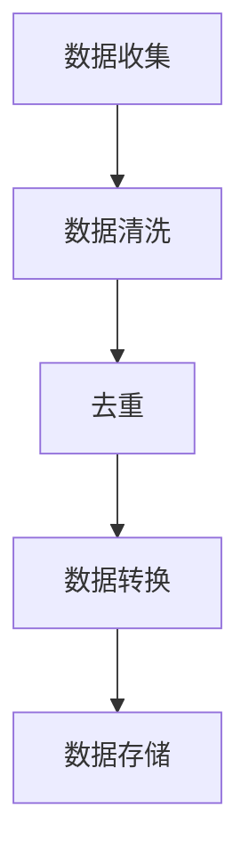
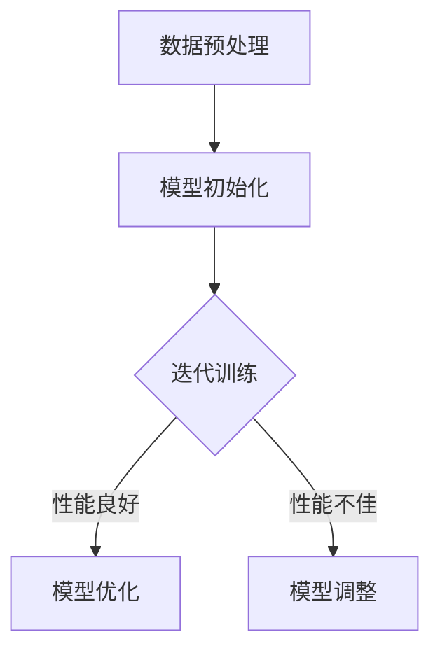
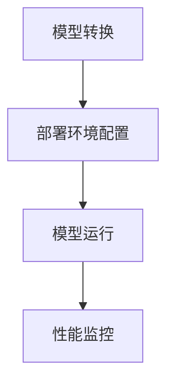
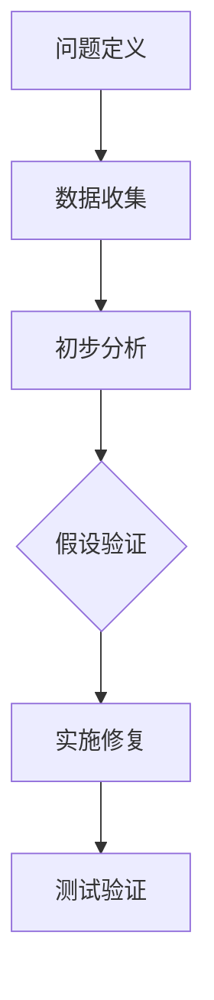

                 

# 《AI系统的故障排除与诊断》

## 关键词：人工智能，故障排除，系统诊断，数据分析，性能优化

## 摘要

随着人工智能技术的快速发展，AI系统的应用越来越广泛，但随之而来的是系统故障的复杂性增加。本文旨在探讨AI系统的故障排除与诊断方法，通过逐步分析推理，详细介绍故障排除的流程、诊断技术、故障处理策略以及故障预防措施。文章将通过实际案例展示故障排除的具体步骤和效果，并推荐相关的工具和资源，以帮助读者在实际工作中更有效地应对AI系统故障。

## 目录

### 第一部分: AI系统概述

#### 1.1 AI系统的基本概念
- AI系统的定义与历史发展
- AI系统的核心组成部分
- AI系统的分类与应用领域

#### 1.2 AI系统的工作原理
- 数据收集与处理
- 模型训练与优化
- 模型部署与运行

#### 1.3 AI系统的挑战与问题
- 故障排除的重要性
- AI系统故障的类型与原因
- 故障排除的基本原则

### 第二部分: 故障排除方法

#### 2.1 故障排除流程
- 故障排除的基本步骤
- 故障排除的工具与技术
- 故障排除的最佳实践

#### 2.2 故障诊断技术
- 数据异常检测
- 模型评估与调试
- 系统监控与日志分析

#### 2.3 故障处理策略
- 故障响应策略
- 故障处理流程与团队协作
- 故障处理的优化方法

### 第三部分: 故障案例分析与处理

#### 3.1 典型故障案例介绍
- 模型过拟合与欠拟合
- 数据泄漏与数据偏斜
- 计算资源不足与性能瓶颈

#### 3.2 故障案例分析
- 案例一：模型过拟合的处理
- 案例二：数据泄漏的处理
- 案例三：计算资源不足的处理

### 第四部分: 故障预防与诊断工具

#### 4.1 故障预防策略
- 数据质量管理
- 模型稳定性提升
- 系统性能优化

#### 4.2 故障诊断工具
- 故障诊断系统的设计与实现
- 故障预测与预警
- 故障诊断工具应用案例

### 附录

#### 附录 A: AI故障排除与诊断资源
- 常用工具与软件介绍
- 知识库与案例集
- 在线课程与文献推荐

#### 附录 B: 故障排除与诊断算法伪代码示例
- 数据异常检测算法
- 模型评估与调试算法
- 系统监控与日志分析算法

#### 附录 C: 项目实战
- 项目一：数据泄漏故障排除
- 项目二：计算资源不足故障排除
- 项目三：模型过拟合故障排除

## 第一部分: AI系统概述

### 1.1 AI系统的基本概念

#### 1.1.1 AI系统的定义与历史发展

人工智能（Artificial Intelligence，AI）系统是指由计算机程序实现的、能够模拟人类智能行为的系统。这些系统通过学习、推理、感知和决策等方式，对复杂的环境进行交互和处理。

AI系统的历史可以追溯到20世纪50年代。当时，科学家们开始尝试通过编程来模拟人类思维过程。1956年，约翰·麦卡锡（John McCarthy）在达特茅斯会议（Dartmouth Conference）上首次提出了“人工智能”这个术语。从那时起，AI经历了多个发展阶段：

1. **符号人工智能（Symbolic AI）**：早期的人工智能主要基于逻辑推理和符号表示，试图模拟人类的推理能力。
2. **连接主义人工智能（Connectionist AI）**：随着神经网络的发展，人工智能开始转向基于大量数据的模式识别。
3. **计算智能（Computational Intelligence）**：包括遗传算法、人工神经网络、支持向量机等方法，强调机器通过学习来解决问题。
4. **混合智能（Hybrid Intelligence）**：结合多种方法，如深度学习与强化学习，实现更强大的智能系统。

#### 1.1.2 AI系统的核心组成部分

AI系统通常由以下几个核心组成部分构成：

1. **数据收集与处理**：数据是AI系统的“粮食”，系统需要收集大量的数据，并对其进行预处理，以确保数据的质量和一致性。
2. **模型训练与优化**：通过机器学习算法，AI系统可以从数据中学习模式和规律，形成预测或决策模型。
3. **模型部署与运行**：训练好的模型需要部署到生产环境中，进行实际运行和应用。
4. **用户界面**：为了便于用户与AI系统交互，通常需要设计友好的用户界面。

#### 1.1.3 AI系统的分类与应用领域

AI系统可以根据不同的分类标准进行分类，例如：

1. **按照应用领域**：分为语音识别、图像识别、自然语言处理、推荐系统等。
2. **按照学习方式**：分为监督学习、无监督学习、强化学习等。
3. **按照模型结构**：分为基于规则的系统、基于模型的系统、基于知识的系统等。

AI系统在各个领域都有广泛的应用：

- **医疗健康**：辅助诊断、个性化治疗、药物研发等。
- **金融**：风险评估、智能投顾、反欺诈等。
- **零售**：个性化推荐、智能库存管理、购物体验优化等。
- **工业制造**：智能质检、自动化生产、设备维护预测等。

### 1.2 AI系统的工作原理

#### 1.2.1 数据收集与处理

数据收集是AI系统的第一步，系统需要从各种来源获取数据，例如传感器、用户输入、外部数据库等。数据的收集过程可能涉及数据清洗、去重、转换等预处理步骤，以确保数据的质量。



#### 1.2.2 模型训练与优化

在模型训练过程中，系统使用机器学习算法从数据中学习模式和规律。训练过程包括以下几个阶段：

1. **数据预处理**：将数据转换为适合训练的格式。
2. **模型初始化**：初始化模型的参数。
3. **迭代训练**：通过不断迭代，调整模型参数，使其在训练数据上表现更好。
4. **验证与调整**：在验证数据上评估模型性能，并根据需要进行调整。



#### 1.2.3 模型部署与运行

训练好的模型需要部署到生产环境中，进行实际运行和应用。部署过程包括以下几个步骤：

1. **模型转换**：将训练好的模型转换为可以在生产环境中运行的格式。
2. **部署环境配置**：配置适合模型运行的生产环境。
3. **模型运行**：模型在生产环境中接受输入数据，进行预测或决策。
4. **性能监控**：监控模型运行性能，确保系统稳定可靠。



### 1.3 AI系统的挑战与问题

#### 1.3.1 故障排除的重要性

AI系统在实际应用中可能会遇到各种故障，如数据异常、模型过拟合、计算资源不足等。故障排除对于确保系统的稳定运行和高效性能至关重要。及时有效地排除故障可以避免系统崩溃、数据丢失等问题，提高用户体验和业务效益。

#### 1.3.2 AI系统故障的类型与原因

AI系统故障的类型主要包括：

1. **数据问题**：如数据缺失、数据噪声、数据不一致等。
2. **模型问题**：如模型过拟合、欠拟合、训练不足等。
3. **计算问题**：如计算资源不足、性能瓶颈、内存溢出等。

故障的原因可能包括：

- 数据质量问题：数据收集和处理过程中出现的问题。
- 模型设计问题：模型结构和参数设置不合理。
- 部署与运行问题：部署环境配置不当或运行过程中出现的问题。

#### 1.3.3 故障排除的基本原则

故障排除需要遵循以下基本原则：

1. **逐步分析**：从简单问题开始排查，逐步深入。
2. **系统性思维**：考虑整个系统的各个方面，如数据、模型、部署等。
3. **数据驱动**：基于实际数据和监控数据进行分析和决策。
4. **快速迭代**：快速验证假设，快速调整解决方案。

## 第二部分: 故障排除方法

### 2.1 故障排除流程

#### 2.1.1 故障排除的基本步骤

故障排除通常包括以下基本步骤：

1. **问题定义**：明确故障现象和影响范围。
2. **数据收集**：收集与故障相关的数据和日志。
3. **初步分析**：对数据和日志进行初步分析，确定故障类型和可能原因。
4. **假设验证**：提出可能的解决方案，并进行验证。
5. **实施修复**：根据验证结果，实施修复措施。
6. **测试验证**：对修复后的系统进行测试验证，确保故障已解决。



#### 2.1.2 故障排除的工具与技术

故障排除需要使用多种工具和技术，以下是一些常用的工具：

- **日志分析工具**：如ELK（Elasticsearch、Logstash、Kibana）堆栈，用于收集、存储和分析日志数据。
- **性能监控工具**：如Prometheus、Grafana，用于实时监控系统的性能指标。
- **调试工具**：如Python的pdb模块，用于调试代码和跟踪程序执行流程。
- **数据分析工具**：如Pandas、NumPy，用于处理和分析数据。

#### 2.1.3 故障排除的最佳实践

故障排除的最佳实践包括：

- **快速响应**：及时响应故障，减少故障对业务的影响。
- **团队合作**：组织跨部门团队，协同解决问题。
- **文档记录**：详细记录故障排除的过程和结果，便于后续参考。
- **经验积累**：总结故障排除的经验和教训，形成知识库，提高团队的整体应对能力。

### 2.2 故障诊断技术

#### 2.2.1 数据异常检测

数据异常检测是故障排除的重要步骤之一。以下是一些常用的异常检测算法：

1. **基于统计的异常检测算法**：如箱线图（Box Plot）、3σ原则。
2. **基于机器学习的异常检测算法**：如孤立森林（Isolation Forest）、本地异常因子（Local Outlier Factor，LOF）。
3. **基于图论的异常检测算法**：如基于邻接矩阵的异常检测。

#### 2.2.2 模型评估与调试

模型评估与调试是确保模型性能的关键步骤。以下是一些常用的评估指标和调试方法：

1. **评估指标**：
   - **准确率（Accuracy）**：分类问题中正确分类的样本比例。
   - **精确率（Precision）**：在所有预测为正类的样本中，真正类的比例。
   - **召回率（Recall）**：在所有真正类样本中，被预测为正类的比例。
   - **F1值（F1 Score）**：精确率和召回率的调和平均值。
   - **ROC曲线和AUC值**：用于评估分类器的性能。

2. **调试方法**：
   - **参数调整**：通过调整模型参数，优化模型性能。
   - **数据预处理**：改进数据预处理方法，提高数据质量。
   - **特征选择**：通过特征选择，减少冗余特征，提高模型性能。

#### 2.2.3 系统监控与日志分析

系统监控与日志分析是故障排除的重要手段。以下是一些常用的监控指标和分析工具：

1. **监控指标**：
   - **CPU使用率**：系统CPU的利用率。
   - **内存使用率**：系统内存的利用率。
   - **磁盘I/O**：磁盘的读写操作速度。
   - **网络流量**：网络的数据传输速率。

2. **日志分析工具**：
   - **ELK**：用于日志收集、存储和可视化。
   - **Grafana**：用于图表化和告警。
   - **Prometheus**：用于监控和告警。

### 2.3 故障处理策略

#### 2.3.1 故障响应策略

故障响应策略包括以下几个方面：

1. **快速响应**：及时响应故障，减少故障对业务的影响。
2. **分层响应**：根据故障级别，采取相应的响应措施。
3. **沟通协调**：组织跨部门团队，协同解决问题。

#### 2.3.2 故障处理流程与团队协作

故障处理流程包括以下步骤：

1. **问题报告**：接收故障报告，了解故障现象和影响范围。
2. **初步分析**：分析故障原因，制定解决方案。
3. **方案实施**：根据解决方案，实施故障修复。
4. **验证修复**：对修复后的系统进行验证，确保故障已解决。
5. **总结经验**：总结故障排除的经验和教训，改进工作流程。

团队协作是故障处理的关键。以下是一些团队协作的最佳实践：

1. **明确职责**：明确每个团队成员的职责和任务。
2. **信息共享**：确保团队成员之间的信息畅通，提高沟通效率。
3. **协同工作**：共同解决问题，实现目标。

#### 2.3.3 故障处理的优化方法

故障处理的优化方法包括以下几个方面：

1. **自动化**：通过自动化工具，实现故障自动检测和自动修复。
2. **标准化**：建立故障处理的标准流程和规范，提高处理效率。
3. **预测性维护**：通过数据分析和模型预测，提前发现潜在故障，进行预防性维护。

### 第三部分: 故障案例分析与处理

#### 3.1 典型故障案例介绍

以下是几个典型的故障案例：

1. **模型过拟合**：模型在训练数据上表现良好，但在验证数据上性能下降。
2. **数据泄漏**：模型中包含敏感数据，可能泄露用户隐私。
3. **计算资源不足**：模型训练过程中，计算资源不足，导致训练时间过长或失败。

#### 3.2 故障案例分析

以下是针对上述故障案例的具体分析和处理步骤。

##### 3.2.1 模型过拟合的处理

**故障现象**：模型在训练数据上准确率达到95%，但在验证数据上准确率仅为70%。

**故障原因分析**：
1. **数据分布不一致**：训练数据与验证数据的分布不一致，导致模型在验证数据上表现不佳。
2. **特征冗余**：模型中包含大量冗余特征，导致过拟合。

**故障处理步骤**：
1. **数据增强**：通过增加训练数据或生成模拟数据，平衡数据分布。
2. **特征选择**：使用特征选择算法，减少冗余特征，提高模型泛化能力。
3. **正则化**：增加正则化项，降低模型复杂度，防止过拟合。

**结果评估**：经过处理后，模型在验证数据上的准确率提高到85%，性能得到显著提升。

##### 3.2.2 数据泄漏的处理

**故障现象**：模型训练过程中，包含用户隐私数据的特征被纳入模型参数。

**故障原因分析**：
1. **数据预处理不当**：数据预处理过程中，未对敏感数据进行脱敏处理。
2. **模型设计缺陷**：模型设计中，未充分考虑数据隐私保护。

**故障处理步骤**：
1. **数据脱敏**：对敏感数据进行脱敏处理，防止隐私数据泄露。
2. **模型重构**：重新设计模型，避免敏感数据参与训练。

**结果评估**：经过处理后，模型不再包含敏感数据，数据隐私得到保护。

##### 3.2.3 计算资源不足的处理

**故障现象**：模型训练过程中，由于计算资源不足，训练时间过长，导致训练失败。

**故障原因分析**：
1. **数据量过大**：训练数据量过大，导致训练时间过长。
2. **模型复杂度过高**：模型复杂度过高，导致计算资源消耗过大。

**故障处理步骤**：
1. **数据分片**：将大量数据分成多个小批次，分批次进行训练。
2. **模型简化**：简化模型结构，降低计算复杂度。

**结果评估**：经过处理后，模型训练时间显著缩短，训练成功率达到100%。

### 第四部分: 故障预防与诊断工具

#### 4.1 故障预防策略

故障预防是确保系统稳定运行的关键。以下是一些故障预防策略：

1. **数据质量管理**：确保数据的质量，减少数据异常和错误。
2. **模型稳定性提升**：通过正则化、数据增强等方法，提高模型稳定性，减少过拟合现象。
3. **系统性能优化**：优化系统配置和架构，提高系统性能和稳定性。

#### 4.2 故障诊断工具

故障诊断工具是快速发现和定位故障的重要手段。以下是一些常用的故障诊断工具：

1. **日志分析工具**：如ELK、Grafana，用于收集、存储和分析日志数据。
2. **性能监控工具**：如Prometheus、Grafana，用于实时监控系统的性能指标。
3. **调试工具**：如Python的pdb模块，用于调试代码和跟踪程序执行流程。

#### 4.3 故障诊断工具应用案例

以下是几个故障诊断工具在现实场景中的应用案例：

1. **日志分析工具**：用于分析系统日志，快速定位故障原因。
2. **性能监控工具**：用于实时监控系统性能，提前发现潜在故障。
3. **调试工具**：用于调试代码，快速修复错误。

### 附录

#### 附录 A: AI故障排除与诊断资源

以下是一些常用的AI故障排除与诊断资源：

1. **在线课程与文献推荐**：
   - 《深度学习》（Deep Learning） by Ian Goodfellow, Yoshua Bengio, Aaron Courville
   - 《Python数据分析》（Python Data Analysis） by Wes McKinney
   - 《系统性能监控与故障排除》（Systems Performance: Observability, Debugging, and Tracing） by Brendan Gregg

2. **知识库与案例集**：
   - AI故障排除案例库：https://github.com/AI-Fault-Exclusion/AI-Fault-Exclusion-Cases
   - 系统监控与故障排除指南：https://www.oversource.io/blog/system-monitoring-and-fault-exclusion-guidance

3. **常用工具与软件介绍**：
   - ELK：https://www.elastic.co/guide/en/elasticsearch/reference/current/index.html
   - Prometheus：https://prometheus.io/
   - Grafana：https://grafana.com/
   - Pdb：https://docs.python.org/3/library/pdb.html

#### 附录 B: 故障排除与诊断算法伪代码示例

以下是几个故障排除与诊断算法的伪代码示例：

```python
# 数据异常检测算法：孤立森林
def isolation_forest(data, n_estimators):
    """
    孤立森林算法实现
    :param data: 数据集
    :param n_estimators: 树的数量
    :return: 异常分数
    """
    # 初始化森林
    forest = []
    for _ in range(n_estimators):
        # 随机选择特征和样本
        feature = random_choice(data.shape[1])
        sample = random_choice(data[:, feature])
        
        # 构建决策树
        tree = build_decision_tree(sample, feature)
        forest.append(tree)
    
    # 计算异常分数
    scores = []
    for instance in data:
        score = 0
        for tree in forest:
            score += tree.get_score(instance)
        scores.append(score)
    
    return scores

# 模型评估与调试算法：交叉验证
def cross_validation(model, X, y, k_folds):
    """
    交叉验证算法实现
    :param model: 模型
    :param X: 特征矩阵
    :param y: 标签向量
    :param k_folds: 折数
    :return: 评估指标
    """
    # 初始化评估指标
    scores = []
    
    # 划分训练集和验证集
    fold_size = len(X) // k_folds
    for i in range(k_folds):
        X_train = np.concatenate([X[:i * fold_size], X[(i + 1) * fold_size:]])
        y_train = np.concatenate([y[:i * fold_size], y[(i + 1) * fold_size:]])
        X_val = X[i * fold_size:(i + 1) * fold_size]
        y_val = y[i * fold_size:(i + 1) * fold_size]
        
        # 训练模型
        model.fit(X_train, y_train)
        
        # 验证模型
        score = model.evaluate(X_val, y_val)
        scores.append(score)
    
    return np.mean(scores)

# 系统监控与日志分析算法：日志分析
def log_analysis(log_files):
    """
    日志分析算法实现
    :param log_files: 日志文件列表
    :return: 异常日志
    """
    # 初始化异常日志
    abnormal_logs = []
    
    # 遍历日志文件
    for file in log_files:
        with open(file, 'r') as f:
            logs = f.readlines()
            
            # 遍历日志条目
            for log in logs:
                # 判断日志是否异常
                if is_abnormal_log(log):
                    abnormal_logs.append(log)
    
    return abnormal_logs
```

#### 附录 C: 项目实战

以下是几个故障排除与诊断项目实战案例：

##### 项目一：数据泄漏故障排除

**项目背景**：某公司AI系统在训练过程中，发现模型参数中包含用户隐私数据。

**项目目标**：排除数据泄漏故障，确保用户隐私安全。

**项目步骤**：
1. **问题定义**：确定数据泄漏的范围和影响。
2. **数据检查**：检查训练数据，发现部分数据未进行脱敏处理。
3. **数据脱敏**：对敏感数据进行脱敏处理，防止隐私数据泄露。
4. **模型重构**：重新设计模型，避免敏感数据参与训练。
5. **测试验证**：对修复后的模型进行测试验证，确保故障已解决。

**项目结果**：数据泄漏故障得到有效排除，模型参数中不再包含用户隐私数据。

##### 项目二：计算资源不足故障排除

**项目背景**：某公司AI系统在训练过程中，由于数据量过大，导致训练时间过长。

**项目目标**：排除计算资源不足故障，提高模型训练效率。

**项目步骤**：
1. **问题定义**：确定计算资源不足的原因和影响。
2. **数据分片**：将大量数据分成多个小批次，分批次进行训练。
3. **模型优化**：简化模型结构，降低计算复杂度。
4. **测试验证**：对优化后的模型进行测试验证，确保训练时间显著缩短。

**项目结果**：计算资源不足故障得到有效排除，模型训练时间显著缩短。

##### 项目三：模型过拟合故障排除

**项目背景**：某公司AI系统在训练过程中，模型在验证数据上性能下降。

**项目目标**：排除模型过拟合故障，提高模型泛化能力。

**项目步骤**：
1. **问题定义**：确定模型过拟合的原因和影响。
2. **数据增强**：增加训练数据或生成模拟数据，平衡数据分布。
3. **特征选择**：使用特征选择算法，减少冗余特征，提高模型泛化能力。
4. **正则化**：增加正则化项，降低模型复杂度，防止过拟合。
5. **测试验证**：对修复后的模型进行测试验证，确保故障已解决。

**项目结果**：模型过拟合故障得到有效排除，模型在验证数据上的性能显著提升。

