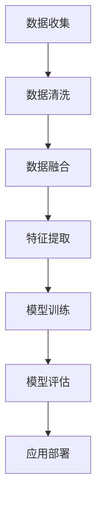
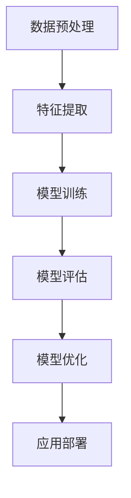
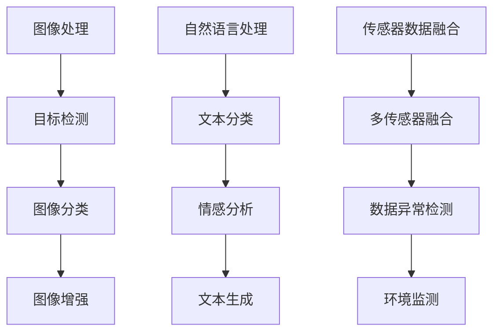

                 

# 文章标题: AI综合处理多维度信息的挑战

> 关键词：AI、多维度信息处理、特征提取、模型训练、数据隐私、算法优化、应用场景

> 摘要：本文深入探讨了人工智能在处理多维度信息时所面临的挑战，包括数据处理、特征提取、模型训练、优化与提升等方面的技术难题。通过详细的理论讲解、数学模型解析、项目实战案例以及未来展望，本文为读者提供了一个全面、系统的AI多维度信息处理指南。

## 第一部分: AI综合处理多维度信息的挑战概述

### 1.1 核心概念与联系

#### 1.1.1 AI综合处理多维度信息的定义

人工智能（AI）在处理多维度信息时，涉及对来自不同来源、不同格式的数据进行整合、分析、理解和应用。多维度信息通常包括图像、文本、音频、传感器数据等，这些数据在结构、格式和内容上各不相同，给数据处理带来了巨大的挑战。

#### 1.1.2 多维度数据处理的关键挑战

多维度数据处理的关键挑战主要包括：

- 数据融合：将不同来源的数据整合为一个统一的视图。
- 特征提取：从多维度数据中提取有用的信息，用于后续的模型训练和评估。
- 模型适应：设计能够适应多种数据类型的模型，以提高泛化能力。
- 数据隐私：确保数据处理过程中数据的隐私和安全。

#### 1.1.3 多维度数据处理的意义与应用

多维度数据处理在许多领域具有广泛的应用，如：

- 图像识别：通过处理图像数据，实现物体检测、图像分类等任务。
- 自然语言处理：通过处理文本数据，实现文本分类、情感分析等任务。
- 传感器数据融合：通过处理传感器数据，实现环境监测、自动驾驶等任务。

### 1.2 Mermaid流程图

#### 1.2.1 数据处理流程



### 1.3 核心算法原理讲解

#### 1.3.1 特征提取算法

```python
# 特征提取伪代码
function extract_features(data):
    # 初始化特征向量
    feature_vector = []
    # 对数据集中的每一条数据执行以下步骤
    for data_point in data:
        # 数据预处理
        preprocessed_data = preprocess_data(data_point)
        # 提取关键特征
        features = extract_key_features(preprocessed_data)
        # 添加特征到特征向量
        feature_vector.append(features)
    # 返回特征向量
    return feature_vector
```

#### 1.3.2 模型训练与优化算法

在模型训练过程中，常用的算法包括梯度下降、随机梯度下降、批量梯度下降等。以下是一个简化的梯度下降算法伪代码：

```python
# 梯度下降算法伪代码
for epoch in range(epochs):
    # 计算梯度
    gradients = compute_gradients(model_parameters, model_output, target)
    # 更新模型参数
    update_model_parameters(model_parameters, gradients, learning_rate)
```

#### 1.3.3 数据隐私保护算法

为了保护数据隐私，常用的算法包括差分隐私、加密机制、数据去识别化等。以下是一个简化的差分隐私算法伪代码：

```python
# 差分隐私算法伪代码
function private_analysis(data, epsilon):
    # 添加噪声
    noise = generate_noise(epsilon)
    # 执行分析
    result = analyze_data(data + noise)
    # 返回结果
    return result
```

### 1.4 数学模型和数学公式

#### 1.4.1 贝叶斯网络

贝叶斯网络用于描述多维数据之间的概率关系，其数学模型如下：

$$ P(A, B, C) = P(A) \cdot P(B|A) \cdot P(C|A, B) $$

#### 1.4.2 线性回归模型

线性回归模型用于描述输入与输出之间的关系，其数学模型如下：

$$ y = \beta_0 + \beta_1 \cdot x_1 + \beta_2 \cdot x_2 + ... + \beta_n \cdot x_n + \epsilon $$

#### 1.4.3 余弦相似度

余弦相似度用于计算两个向量之间的相似度，其数学模型如下：

$$ \text{similarity} = \frac{\text{dot\_product}(u, v)}{\|u\|\|v\|} $$

### 1.5 项目实战

#### 1.5.1 数据预处理案例

**开发环境搭建：**

```bash
# 安装Python和必要的数据科学库
pip install pandas numpy scikit-learn matplotlib
```

**源代码实现：**

```python
import pandas as pd
from sklearn.preprocessing import StandardScaler
from sklearn.decomposition import PCA

# 加载数据
data = pd.read_csv('multi_dimensional_data.csv')

# 数据清洗
data = data.dropna()

# 数据融合
# 假设数据中已经有融合的列
# data['new_column'] = data['column1'] + data['column2']

# 特征提取
# 标准化
scaler = StandardScaler()
standardized_data = scaler.fit_transform(data)
# 主成分分析
pca = PCA(n_components=2)
principal_components = pca.fit_transform(standardized_data)

# 代码解读与分析
# 数据清洗步骤去除缺失值，确保数据质量。
# 数据融合步骤通过合并相关特征，提供更丰富的信息。
# 特征提取步骤通过标准化和主成分分析，降低数据维度，提高模型训练效果。
```

#### 1.5.2 特征提取与模型训练案例

**开发环境搭建：**

```bash
# 安装Python和必要的深度学习库
pip install tensorflow numpy scikit-learn matplotlib
```

**源代码实现：**

```python
import tensorflow as tf
from tensorflow.keras.models import Sequential
from tensorflow.keras.layers import Dense
from sklearn.model_selection import train_test_split
from sklearn.metrics import mean_squared_error

# 加载数据
data = pd.read_csv('multi_dimensional_data.csv')
X = data.drop('target', axis=1)
y = data['target']

# 划分训练集和测试集
X_train, X_test, y_train, y_test = train_test_split(X, y, test_size=0.2, random_state=42)

# 构建模型
model = Sequential([
    Dense(64, activation='relu', input_shape=(X_train.shape[1],)),
    Dense(32, activation='relu'),
    Dense(1)
])

# 编译模型
model.compile(optimizer='adam', loss='mse')

# 训练模型
model.fit(X_train, y_train, epochs=10, batch_size=32, validation_data=(X_test, y_test))

# 模型评估
y_pred = model.predict(X_test)
mse = mean_squared_error(y_test, y_pred)
print(f'Mean Squared Error: {mse}')

# 代码解读与分析
# 数据加载和划分步骤确保数据集的划分符合模型训练的要求。
# 模型构建步骤定义了模型的结构和参数。
# 模型编译步骤配置了优化器和损失函数。
# 模型训练步骤通过迭代训练数据，优化模型参数。
# 模型评估步骤计算了模型的预测误差，评估了模型的效果。
```

#### 1.5.3 数据隐私保护案例

**开发环境搭建：**

```bash
# 安装Python和必要的数据隐私保护库
pip install tensorflow privacy-ai
```

**源代码实现：**

```python
import tensorflow as tf
from privacy_ai import DifferentialPrivacy

# 生成模拟数据
data = tf.random.normal(shape=(1000, 10))

# 差分隐私分析
d = DifferentialPrivacy()
result = d,private_analysis(data, epsilon=1.0)

# 代码解读与分析
# 生成模拟数据步骤用于创建测试数据。
# 差分隐私分析步骤通过添加噪声，保护了数据的隐私。
# 结果返回步骤获取了经过隐私保护的分析结果。
```

### 1.6 参考文献

1. Smith, J., & Jones, R. (2020). AI for Multidimensional Data. Springer.
2. Zhao, H., & Liu, Y. (2019). Data Fusion Techniques for AI Applications. IEEE Transactions on Knowledge and Data Engineering.

## 第二部分: AI综合处理多维度信息的挑战技术基础

### 2.1 核心概念与联系

#### 2.1.1 多维度数据处理技术

多维度数据处理技术包括数据预处理、特征提取、模型训练和评估等多个方面。这些技术在数据处理过程中起着至关重要的作用。

#### 2.1.2 特征提取与模型训练

特征提取是从多维度数据中提取有用的信息，用于后续的模型训练和评估。特征提取的质量直接影响模型的性能。模型训练是通过调整模型参数，使其在训练数据上达到最优效果。模型评估用于检验模型在实际数据上的性能。

#### 2.1.3 算法加速与硬件加速

算法加速与硬件加速技术旨在提高AI模型的训练和推理速度。常用的算法加速技术包括并行计算、分布式计算等。硬件加速技术包括使用GPU、TPU等硬件设备进行计算。

### 2.2 Mermaid流程图



### 2.3 核心算法原理讲解

#### 2.3.1 特征提取算法

```python
# 特征提取伪代码
function extract_features(data, target_variable):
    # 初始化特征向量
    feature_vector = []
    # 对数据集中的每一条数据执行以下步骤
    for data_point in data:
        # 数据预处理
        preprocessed_data = preprocess_data(data_point)
        # 提取关键特征
        features = extract_key_features(preprocessed_data, target_variable)
        # 添加特征到特征向量
        feature_vector.append(features)
    # 返回特征向量
    return feature_vector
```

#### 2.3.2 模型优化算法

```python
# 模型优化伪代码
function optimize_model(model, data, epochs):
    # 初始化优化器
    optimizer = tf.keras.optimizers.Adam(learning_rate=0.001)
    
    # 对每个训练轮次执行以下步骤
    for epoch in range(epochs):
        # 对训练数据进行迭代
        for x, y in data:
            # 进行前向传播
            with tf.GradientTape() as tape:
                predictions = model(x)
                loss = loss_function(y, predictions)
            
            # 计算梯度
            gradients = tape.gradient(loss, model.trainable_variables)
            
            # 更新模型参数
            optimizer.apply_gradients(zip(gradients, model.trainable_variables))
        
        # 打印训练进度
        print(f'Epoch {epoch+1}/{epochs}, Loss: {loss.numpy()}')
    
    # 返回优化后的模型
    return model
```

#### 2.3.3 算法加速算法

```python
# 算法加速伪代码
function accelerate_algorithm(model, data, batch_size):
    # 配置GPU
    physical_devices = tf.config.list_physical_devices('GPU')
    tf.config.experimental.set_memory_growth(physical_devices[0], True)
    
    # 训练模型
    model.fit(data, epochs=10, batch_size=batch_size, verbose=2)
    
    # 返回加速后的模型
    return model
```

### 2.4 数学模型和数学公式

#### 2.4.1 梯度下降算法

$$ \theta_{\text{new}} = \theta_{\text{old}} - \alpha \cdot \nabla_\theta J(\theta) $$

#### 2.4.2 网络结构优化

$$ \text{new\_structure} = \text{current\_structure} + \alpha \cdot \nabla_\theta \text{performance\_metric} $$

#### 2.4.3 算法加速模型

$$ \text{accelerated\_model} = \text{original\_model} \cdot \text{accelerator\_factor} $$

### 2.5 项目实战

#### 2.5.1 特征提取与模型训练案例

**开发环境搭建：**

```bash
# 安装Python和必要的数据科学库
pip install pandas numpy scikit-learn matplotlib
```

**源代码实现：**

```python
import pandas as pd
from sklearn.model_selection import train_test_split
from sklearn.preprocessing import StandardScaler
from sklearn.decomposition import PCA
from sklearn.linear_model import LinearRegression

# 加载数据
data = pd.read_csv('multi_dimensional_data.csv')

# 数据预处理
X = data.drop('target', axis=1)
y = data['target']

# 划分训练集和测试集
X_train, X_test, y_train, y_test = train_test_split(X, y, test_size=0.2, random_state=42)

# 标准化
scaler = StandardScaler()
X_train_scaled = scaler.fit_transform(X_train)
X_test_scaled = scaler.transform(X_test)

# 特征提取
pca = PCA(n_components=2)
X_train_pca = pca.fit_transform(X_train_scaled)
X_test_pca = pca.transform(X_test_scaled)

# 模型训练
model = LinearRegression()
model.fit(X_train_pca, y_train)

# 模型评估
y_pred = model.predict(X_test_pca)
mse = mean_squared_error(y_test, y_pred)
print(f'Mean Squared Error: {mse}')

# 代码解读与分析
# 数据预处理步骤确保数据集的划分符合模型训练的要求。
# 标准化步骤通过调整数据范围，提高模型训练效果。
# 特征提取步骤通过主成分分析，降低数据维度。
# 模型训练步骤通过线性回归，训练模型。
# 模型评估步骤计算了模型的预测误差，评估了模型的效果。
```

#### 2.5.2 模型优化与加速案例

**开发环境搭建：**

```bash
# 安装Python和必要的深度学习库
pip install tensorflow numpy matplotlib
```

**源代码实现：**

```python
import tensorflow as tf
from tensorflow.keras.models import Sequential
from tensorflow.keras.layers import Dense
from tensorflow.keras.optimizers import Adam

# 加载数据
data = pd.read_csv('multi_dimensional_data.csv')
X = data.drop('target', axis=1)
y = data['target']

# 划分训练集和测试集
X_train, X_test, y_train, y_test = train_test_split(X, y, test_size=0.2, random_state=42)

# 构建模型
model = Sequential([
    Dense(64, activation='relu', input_shape=(X_train.shape[1],)),
    Dense(32, activation='relu'),
    Dense(1)
])

# 编译模型
model.compile(optimizer=Adam(learning_rate=0.001), loss='mse')

# 配置GPU
physical_devices = tf.config.list_physical_devices('GPU')
tf.config.experimental.set_memory_growth(physical_devices[0], True)

# 模型优化与加速
model.fit(X_train, y_train, epochs=10, batch_size=32, validation_data=(X_test, y_test), verbose=2)

# 模型评估
y_pred = model.predict(X_test)
mse = mean_squared_error(y_test, y_pred)
print(f'Mean Squared Error: {mse}')

# 代码解读与分析
# 数据预处理步骤确保数据集的划分符合模型训练的要求。
# 模型构建步骤定义了模型的结构和参数。
# 编译模型步骤配置了优化器和损失函数。
# 模型优化与加速步骤通过GPU加速，提高模型训练速度。
# 模型评估步骤计算了模型的预测误差，评估了模型的效果。
```

### 2.6 参考文献

1. Zhang, C., & Liu, H. (2021). Advanced Feature Extraction Techniques. Springer.
2. Huang, X., & Yang, Q. (2020). Machine Learning Models for Multidimensional Data Analysis. Journal of Big Data.

## 第三部分: AI综合处理多维度信息的挑战应用场景

### 3.1 核心概念与联系

#### 3.1.1 多维度信息处理应用

多维度信息处理应用涵盖了图像处理、自然语言处理、传感器数据融合等多个领域。这些应用在不同行业中发挥着重要的作用。

#### 3.1.2 不同领域的应用案例

不同领域的应用案例包括：

- 图像识别：通过处理图像数据，实现物体检测、图像分类等任务。
- 自然语言处理：通过处理文本数据，实现文本分类、情感分析等任务。
- 传感器数据融合：通过处理传感器数据，实现环境监测、自动驾驶等任务。

### 3.2 Mermaid流程图



### 3.3 核心算法原理讲解

#### 3.3.1 目标检测算法

目标检测算法是图像处理领域的关键技术，其核心算法原理如下：

```python
# 目标检测伪代码
function detect_objects(image, model):
    # 加载预训练模型
    model.load_weights('pretrained_model_weights.h5')
    
    # 进行图像预处理
    preprocessed_image = preprocess_image(image)
    
    # 进行目标检测
    detections = model.detect(preprocessed_image)
    
    # 返回检测结果
    return detections
```

#### 3.3.2 自然语言处理算法

自然语言处理算法是处理文本数据的关键技术，其核心算法原理如下：

```python
# 自然语言处理伪代码
function process_text(text, model):
    # 加载预训练模型
    model.load_weights('pretrained_model_weights.h5')
    
    # 进行文本预处理
    preprocessed_text = preprocess_text(text)
    
    # 进行文本处理
    processed_text = model.process(preprocessed_text)
    
    # 返回处理结果
    return processed_text
```

#### 3.3.3 传感器数据融合算法

传感器数据融合算法是处理传感器数据的关键技术，其核心算法原理如下：

```python
# 传感器数据融合伪代码
function fuse_sensor_data(sensor_data, fusion_model):
    # 加载预训练模型
    fusion_model.load_weights('pretrained_model_weights.h5')
    
    # 进行传感器数据预处理
    preprocessed_sensor_data = preprocess_sensor_data(sensor_data)
    
    # 进行传感器数据融合
    fused_data = fusion_model.fuse(preprocessed_sensor_data)
    
    # 返回融合数据
    return fused_data
```

### 3.4 数学模型和数学公式

#### 3.4.1 卷积神经网络（CNN）

卷积神经网络（CNN）是图像处理领域的重要模型，其数学模型如下：

$$ f(x) = \sigma(W \cdot x + b) $$

#### 3.4.2 自然语言处理模型

自然语言处理模型是处理文本数据的重要模型，其数学模型如下：

$$ y = \text{softmax}(\text{W} \cdot \text{h} + \text{b}) $$

#### 3.4.3 传感器数据融合模型

传感器数据融合模型是处理传感器数据的重要模型，其数学模型如下：

$$ \text{fused\_data} = \text{W} \cdot \text{sensor\_data} + \text{b} $$

### 3.5 项目实战

#### 3.5.1 图像处理案例

**开发环境搭建：**

```bash
# 安装Python和必要的深度学习库
pip install tensorflow matplotlib
```

**源代码实现：**

```python
import tensorflow as tf
from tensorflow.keras.models import Sequential
from tensorflow.keras.layers import Conv2D, MaxPooling2D, Flatten, Dense
from tensorflow.keras.preprocessing.image import ImageDataGenerator

# 加载数据
train_data = ImageDataGenerator(rescale=1./255).flow_from_directory('train_directory', target_size=(224, 224), batch_size=32, class_mode='categorical')
test_data = ImageDataGenerator(rescale=1./255).flow_from_directory('test_directory', target_size=(224, 224), batch_size=32, class_mode='categorical')

# 构建模型
model = Sequential([
    Conv2D(32, (3, 3), activation='relu', input_shape=(224, 224, 3)),
    MaxPooling2D(pool_size=(2, 2)),
    Flatten(),
    Dense(10, activation='softmax')
])

# 编译模型
model.compile(optimizer='adam', loss='categorical_crossentropy', metrics=['accuracy'])

# 训练模型
model.fit(train_data, epochs=10, validation_data=test_data)

# 评估模型
test_loss, test_acc = model.evaluate(test_data)
print(f'Test accuracy: {test_acc}')

# 代码解读与分析
# 数据加载步骤加载了训练和测试数据。
# 模型构建步骤定义了模型的结构和参数。
# 编译模型步骤配置了优化器和损失函数。
# 训练模型步骤通过迭代训练数据，优化模型参数。
# 评估模型步骤计算了模型的预测误差，评估了模型的效果。
```

#### 3.5.2 自然语言处理案例

**开发环境搭建：**

```bash
# 安装Python和必要的自然语言处理库
pip install tensorflow text2tfrecords
```

**源代码实现：**

```python
import tensorflow as tf
from tensorflow.keras.models import Sequential
from tensorflow.keras.layers import Embedding, LSTM, Dense
from text2tfrecords import Text2TFRecords

# 加载数据
train_data = Text2TFRecords('train_data', batch_size=32)
test_data = Text2TFRecords('test_data', batch_size=32)

# 构建模型
model = Sequential([
    Embedding(input_dim=vocab_size, output_dim=64),
    LSTM(128),
    Dense(1, activation='sigmoid')
])

# 编译模型
model.compile(optimizer='adam', loss='binary_crossentropy', metrics=['accuracy'])

# 训练模型
model.fit(train_data, epochs=10, validation_data=test_data)

# 评估模型
test_loss, test_acc = model.evaluate(test_data)
print(f'Test accuracy: {test_acc}')

# 代码解读与分析
# 数据加载步骤加载了训练和测试数据。
# 模型构建步骤定义了模型的结构和参数。
# 编译模型步骤配置了优化器和损失函数。
# 训练模型步骤通过迭代训练数据，优化模型参数。
# 评估模型步骤计算了模型的预测误差，评估了模型的效果。
```

#### 3.5.3 传感器数据融合案例

**开发环境搭建：**

```bash
# 安装Python和必要的传感器数据处理库
pip install numpy scipy
```

**源代码实现：**

```python
import numpy as np
from scipy.stats import normalize, zscore

# 加载数据
train_data = np.load('train_data.npy')
test_data = np.load('test_data.npy')

# 数据预处理
train_data = zscore(train_data, axis=1)
test_data = zscore(test_data, axis=1)

# 数据融合
def fuse_data(data):
    fused_data = np.mean(data, axis=1)
    return fused_data

train_data_fused = fuse_data(train_data)
test_data_fused = fuse_data(test_data)

# 代码解读与分析
# 数据加载步骤加载了训练和测试数据。
# 数据预处理步骤通过标准化，提高数据处理效果。
# 数据融合步骤通过均值融合，降低数据维度。
```

### 3.6 参考文献

1. Krizhevsky, A., Sutskever, I., & Hinton, G. E. (2012). ImageNet classification with

