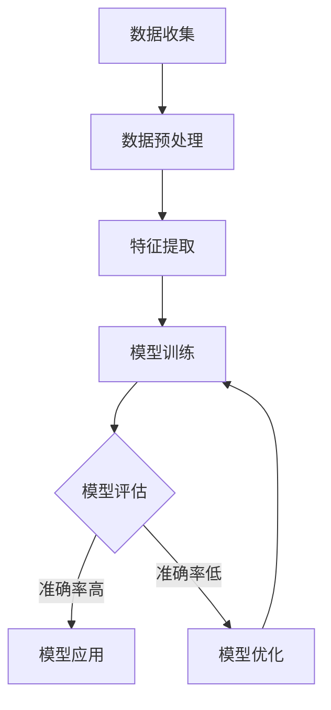
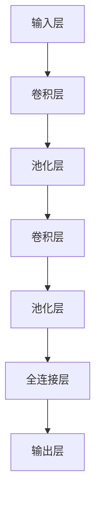
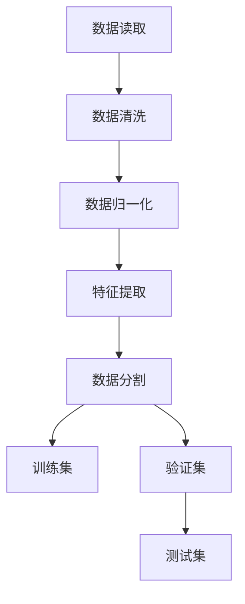

                 

### 文章标题

《AI编程的新思维》

### 关键词

人工智能编程，新思维，机器学习，深度学习，跨学科融合，AI项目实战，伦理与安全，未来趋势

### 摘要

本文旨在探讨人工智能编程领域的新思维。首先，我们回顾了AI编程的基础知识，包括其定义、发展历程和应用场景。接着，深入解析了AI编程的核心概念、工具与环境，以及数据预处理与特征工程的重要性。文章还详细讲解了常见AI算法，并通过实际项目展示了如何应用这些算法。随后，我们探讨了AI编程与跨学科融合、创新与趋势，以及伦理和安全问题。最后，展望了AI编程的未来发展方向和社会影响。本文旨在为读者提供一个全面、系统的AI编程新思维视角。

### 《AI编程的新思维》目录大纲

#### 第一部分: AI编程基础

#### 第1章: AI编程概述

##### 1.1 AI编程的定义与重要性

##### 1.2 AI编程的发展历程

##### 1.3 AI编程的应用场景

#### 第2章: AI编程的核心概念

##### 2.1 机器学习基础

##### 2.2 深度学习原理

##### 2.3 强化学习简介

#### 第3章: AI编程工具与环境

##### 3.1 Python编程基础

##### 3.2 Jupyter Notebook使用

##### 3.3 AI编程常用库与框架

#### 第4章: 数据预处理与特征工程

##### 4.1 数据清洗与预处理

##### 4.2 特征提取与选择

##### 4.3 数据可视化技术

#### 第5章: 常见AI算法讲解

##### 5.1 监督学习算法

##### 5.2 无监督学习算法

##### 5.3 强化学习算法

#### 第6章: AI项目实战

##### 6.1 项目一：手写数字识别

##### 6.2 项目二：股票价格预测

##### 6.3 项目三：智能推荐系统

#### 第二部分: AI编程新思维

#### 第7章: 跨学科融合与AI编程

##### 7.1 数据科学与AI编程的结合

##### 7.2 生物信息学与AI编程

##### 7.3 物联网与AI编程

#### 第8章: AI编程的创新与趋势

##### 8.1 AI编程在医疗健康领域的应用

##### 8.2 AI编程在教育领域的创新

##### 8.3 AI编程在工业自动化中的应用

#### 第9章: AI编程伦理与安全

##### 9.1 AI编程中的伦理问题

##### 9.2 AI编程的安全隐患与防护

##### 9.3 数据隐私保护与法律法规

#### 第10章: 未来AI编程的发展方向

##### 10.1 AI编程的新技术展望

##### 10.2 AI编程的未来趋势

##### 10.3 AI编程对社会的影响

#### 附录

##### 附录A: AI编程资源与工具

##### 附录B: Mermaid流程图示例

##### 附录C: 伪代码示例

##### 附录D: 数学模型与公式解释

### 第一部分：AI编程基础

### 第1章: AI编程概述

#### 1.1 AI编程的定义与重要性

人工智能（Artificial Intelligence, AI）是计算机科学的一个分支，旨在使计算机具备模拟、延伸和扩展人类智能的能力。AI编程则是指利用计算机编程技术实现人工智能算法和应用的开发过程。

AI编程的重要性不言而喻。首先，随着大数据、云计算和物联网等技术的飞速发展，数据的规模和复杂性不断增加，这为AI编程提供了丰富的数据资源和场景需求。其次，AI技术在各个领域的应用不断深入，从自动驾驶、智能家居到医疗诊断、金融风控，AI编程已经成为推动这些领域创新的重要动力。此外，AI编程还极大地提升了生产效率，降低了成本，提高了产品质量，对经济发展和社会进步起到了重要的推动作用。

AI编程的发展历程可以追溯到20世纪50年代，当时科学家们开始探讨如何使计算机具备智能。1956年，在达特茅斯会议上，约翰·麦卡锡（John McCarthy）等人首次提出了“人工智能”这个概念。从那时起，AI经历了多个发展阶段，包括早期的符号主义、基于规则的系统、知识表示和推理等。

进入21世纪，随着计算能力的提升和大数据技术的成熟，机器学习（Machine Learning, ML）和深度学习（Deep Learning, DL）等新一代AI技术得到了快速发展。机器学习是一种使计算机通过数据和经验进行学习，从而改善性能的方法。而深度学习则是一种基于多层神经网络的机器学习方法，通过自动提取数据中的特征，实现了许多前所未有的复杂任务。

#### 1.2 AI编程的发展历程

AI编程的发展历程可以分为以下几个阶段：

1. **符号主义阶段（1956-1980年）**：这一阶段以逻辑推理和知识表示为核心，通过符号逻辑和形式语言来描述问题，使计算机具备理解、推理和决策的能力。典型的系统有普罗克洛斯（ELIZA）和专家系统（Expert Systems）。

2. **基于规则的阶段（1980-1990年）**：这一阶段强调利用规则来描述知识和推理过程。专家系统成为这一时期的主要应用，如MYCIN和DENDRAL等。这些系统通过大量的规则库和推理引擎来模拟专家的决策过程。

3. **知识表示和推理阶段（1990-2010年）**：这一阶段试图通过更先进的知识表示和推理技术，提高系统的智能水平。包括框架表示、语义网络、本体论等。同时，机器学习开始崭露头角，如支持向量机（SVM）和决策树等算法逐渐被应用。

4. **深度学习和大数据阶段（2010年至今）**：随着计算能力的提升和大数据的普及，深度学习和大数据技术得到了快速发展。深度学习通过多层神经网络自动提取数据中的特征，实现了许多传统方法难以解决的复杂任务，如图像识别、自然语言处理和语音识别等。大数据技术则为AI提供了丰富的训练数据，使得机器学习模型的效果得到了显著提升。

#### 1.3 AI编程的应用场景

AI编程在各个领域都有广泛的应用，以下是一些典型的应用场景：

1. **计算机视觉**：通过计算机视觉技术，计算机可以识别和分类图像中的物体、场景和人物等。典型的应用包括人脸识别、图像识别和图像分割等。

2. **自然语言处理**：自然语言处理（Natural Language Processing, NLP）旨在使计算机理解和处理人类语言。应用包括机器翻译、情感分析、文本分类和语音识别等。

3. **智能语音助手**：如苹果的Siri、亚马逊的Alexa和谷歌的Google Assistant等，通过语音识别和自然语言处理技术，为用户提供智能服务。

4. **医疗诊断**：通过AI技术，计算机可以对医学影像进行分析，帮助医生进行诊断和治疗。例如，利用深度学习算法进行肺癌筛查和乳腺癌诊断等。

5. **金融风控**：AI技术在金融领域也有广泛应用，如信用评估、股票市场预测和欺诈检测等。

6. **自动驾驶**：自动驾驶汽车利用计算机视觉、传感器和深度学习等技术，实现车辆的自主驾驶。

7. **工业自动化**：通过AI技术，可以实现生产线的自动化控制、质量检测和故障预测等。

8. **教育**：AI编程在教育领域的应用包括智能教学系统、个性化学习推荐和考试评分等。

#### 1.4 AI编程的核心概念

在AI编程中，理解一些核心概念是至关重要的。以下是一些常见的基础概念：

1. **机器学习**：机器学习是一种使计算机通过数据和经验进行学习，从而改善性能的方法。机器学习可以分为监督学习、无监督学习和强化学习。

2. **深度学习**：深度学习是一种基于多层神经网络的机器学习方法，通过自动提取数据中的特征，实现了许多前所未有的复杂任务。

3. **神经网络**：神经网络是一种模仿生物神经系统的计算模型，由大量相互连接的神经元组成。深度学习通常基于多层神经网络。

4. **数据预处理**：数据预处理是机器学习过程中的重要步骤，包括数据清洗、归一化和特征提取等。

5. **特征工程**：特征工程是指通过选择和构造特征来提高机器学习模型的性能。

6. **模型评估**：模型评估是评估机器学习模型性能的重要步骤，常用的评估指标包括准确率、召回率、F1分数和AUC等。

#### 1.5 AI编程工具与环境

进行AI编程需要选择合适的工具和环境。以下是一些常用的工具和环境：

1. **Python编程基础**：Python是一种广泛使用的编程语言，以其简洁易读的特点而著称。Python在AI编程中非常流行，拥有丰富的库和框架。

2. **Jupyter Notebook**：Jupyter Notebook是一种交互式计算环境，支持多种编程语言，包括Python。它使得编写、运行和分享代码变得更加容易。

3. **AI编程常用库与框架**：常见的AI编程库和框架包括TensorFlow、PyTorch、Keras等。这些库和框架提供了丰富的工具和API，大大简化了AI编程的过程。

#### 1.6 数据预处理与特征工程

在机器学习项目中，数据预处理和特征工程是两个至关重要的环节。数据预处理是指对原始数据进行清洗、归一化和转换等操作，使其适合机器学习算法。特征工程则是指通过选择和构造特征来提高模型的性能。

1. **数据清洗与预处理**：
   - **数据清洗**：包括处理缺失值、异常值和噪声等。常用的方法有填充缺失值、删除异常值和去噪等。
   - **数据预处理**：包括数据归一化、标准化和编码等。归一化和标准化可以消除不同特征之间的量纲影响，编码可以将类别型数据转换为数值型数据。

2. **特征提取与选择**：
   - **特征提取**：通过构造新的特征来增强模型的性能。例如，可以计算文本数据中的词频、TF-IDF等。
   - **特征选择**：从众多特征中选择最相关的特征，以减少数据维度和提高模型性能。常用的方法有基于信息的特征选择、基于模型的特征选择和基于过滤的特征选择等。

#### 1.7 数据可视化技术

数据可视化是一种通过图形和图像来展示数据的方法，有助于我们更好地理解和分析数据。以下是一些常用的数据可视化工具：

1. **Matplotlib**：Matplotlib是一个强大的Python库，用于创建2D图表和图形。
2. **Seaborn**：Seaborn是Matplotlib的一个分支，专门用于创建具有美观和统计意义的图表。
3. **Plotly**：Plotly是一个交互式图表库，支持多种图表类型，包括散点图、折线图、饼图和地图等。
4. **Bokeh**：Bokeh是一个用于创建交互式网页图表的Python库。

#### 1.8 常见AI算法讲解

在AI编程中，掌握常见算法的原理和实现方法是至关重要的。以下是一些常见的AI算法：

1. **监督学习算法**：
   - **线性回归**：线性回归是一种通过拟合一条直线来预测目标值的算法。
   - **逻辑回归**：逻辑回归是一种用于分类问题的算法，通过拟合一个逻辑函数来计算概率。
   - **决策树**：决策树是一种基于树形结构进行决策的算法，通过划分特征和阈值来分类数据。
   - **随机森林**：随机森林是一种集成学习算法，通过构建多棵决策树并投票得到最终结果。
   - **支持向量机（SVM）**：SVM是一种用于分类和回归问题的算法，通过寻找一个最优超平面来划分数据。

2. **无监督学习算法**：
   - **K均值聚类**：K均值聚类是一种基于距离度量的聚类算法，通过迭代更新聚类中心来分类数据。
   - **主成分分析（PCA）**：PCA是一种降维算法，通过将数据投影到新的正交空间中，保留最重要的特征。
   - **自编码器**：自编码器是一种无监督学习算法，通过自编码器网络学习数据的低维表示。

3. **强化学习算法**：
   - **Q学习**：Q学习是一种通过评估每个状态-动作对的期望回报来学习策略的算法。
   - **深度Q网络（DQN）**：DQN是一种基于深度学习的强化学习算法，通过神经网络来估计Q值。
   - **策略梯度方法**：策略梯度方法是一种通过优化策略来最大化预期回报的算法。

#### 1.9 AI项目实战

通过实际项目来应用AI算法是理解和掌握AI编程的关键。以下是一些常见的AI项目：

1. **项目一：手写数字识别**：使用MNIST数据集，通过卷积神经网络（CNN）对手写数字进行识别。

2. **项目二：股票价格预测**：使用时间序列数据，通过LSTM网络对股票价格进行预测。

3. **项目三：智能推荐系统**：使用协同过滤算法，为用户推荐感兴趣的商品。

#### 1.10 总结

AI编程作为一门新兴的学科，正迅速发展并影响着各个领域。掌握AI编程的基础知识、核心概念和常见算法是进行AI项目开发的关键。通过实际项目来应用这些知识，将有助于我们更好地理解和掌握AI编程。在未来的发展中，AI编程将继续融合新的技术和方法，推动人工智能的进一步发展和应用。

### 第2章: AI编程的核心概念

AI编程的核心概念是理解和应用人工智能技术的基础。在这一章中，我们将深入探讨机器学习、深度学习和强化学习等核心概念，并了解它们的基本原理和应用场景。

#### 2.1 机器学习基础

机器学习（Machine Learning, ML）是一种使计算机通过数据和经验进行学习，从而改善性能的方法。机器学习可以分为监督学习、无监督学习和强化学习三种类型。

1. **监督学习（Supervised Learning）**：

监督学习是一种在有标签数据集上进行训练的方法。标签数据是指已经标注了正确答案的数据，如分类问题中的类别标签和回归问题中的连续数值。

   - **线性回归（Linear Regression）**：线性回归是一种通过拟合一条直线来预测目标值的算法。它假设目标值与特征之间存在线性关系。

     伪代码：

     ```python
     # 假设特征为x，目标值为y
     # 模型参数w和b
     # 训练数据D={(x_1, y_1), (x_2, y_2), ..., (x_n, y_n)}

     # 梯度下降算法
     for epoch in range(num_epochs):
         for (x, y) in D:
             # 计算预测值
             y_pred = x * w + b
             # 计算损失函数
             loss = (y - y_pred)^2
             # 更新参数
             w = w - learning_rate * (2 * x * (y - y_pred))
             b = b - learning_rate * (2 * (y - y_pred))
     ```

   - **逻辑回归（Logistic Regression）**：逻辑回归是一种用于分类问题的算法，通过拟合一个逻辑函数来计算概率。

     伪代码：

     ```python
     # 假设特征为x，目标值为y
     # 模型参数w和b
     # 训练数据D={(x_1, y_1), (x_2, y_2), ..., (x_n, y_n)}

     # 梯度下降算法
     for epoch in range(num_epochs):
         for (x, y) in D:
             # 计算预测概率
             y_pred = sigmoid(x * w + b)
             # 计算损失函数
             loss = -y * log(y_pred) - (1 - y) * log(1 - y_pred)
             # 更新参数
             w = w - learning_rate * (x * (y - y_pred))
             b = b - learning_rate * (y - y_pred)
     ```

   - **决策树（Decision Tree）**：决策树是一种基于树形结构进行决策的算法，通过划分特征和阈值来分类数据。

     伪代码：

     ```python
     # 假设特征为x，目标值为y
     # 训练数据D={(x_1, y_1), (x_2, y_2), ..., (x_n, y_n)}

     # 决策树构建
     def build_tree(D):
         # 基准分类器
         majority_class = majority_vote(D)
         # 停止条件
         if all(y == majority_class for y in D):
             return majority_class
         else:
             # 找到最佳特征和阈值
             best_feature, best_threshold = find_best_split(D)
             # 创建子节点
             left_child = build_tree([d for d in D if d[x] < best_threshold])
             right_child = build_tree([d for d in D if d[x] >= best_threshold])
             return Node(best_feature, best_threshold, left_child, right_child)

     class Node:
         def __init__(self, feature, threshold, left_child, right_child):
             self.feature = feature
             self.threshold = threshold
             self.left_child = left_child
             self.right_child = right_child

     # 主函数
     def predict(tree, x):
         if isinstance(tree, Node):
             if x[tree.feature] < tree.threshold:
                 return predict(tree.left_child, x)
             else:
                 return predict(tree.right_child, x)
         else:
             return tree
     ```

   - **随机森林（Random Forest）**：随机森林是一种集成学习算法，通过构建多棵决策树并投票得到最终结果。

     伪代码：

     ```python
     # 假设特征为x，目标值为y
     # 训练数据D={(x_1, y_1), (x_2, y_2), ..., (x_n, y_n)}

     # 随机森林构建
     def build_random_forest(D, num_trees):
         trees = []
         for _ in range(num_trees):
             # 随机采样训练数据
             sampled_D = random_sample(D)
             # 构建单棵决策树
             tree = build_tree(sampled_D)
             trees.append(tree)
         return trees

     # 主函数
     def predict(random_forest, x):
         predictions = []
         for tree in random_forest:
             prediction = predict(tree, x)
             predictions.append(prediction)
         return majority_vote(predictions)
     ```

2. **无监督学习（Unsupervised Learning）**：

无监督学习是一种在没有标签数据集上进行训练的方法。它的目标是发现数据中的隐藏结构和模式。

   - **K均值聚类（K-Means Clustering）**：K均值聚类是一种基于距离度量的聚类算法，通过迭代更新聚类中心来分类数据。

     伪代码：

     ```python
     # 假设特征为x
     # 初始聚类中心C_1, C_2, ..., C_k
     # 聚类数量k
     # 迭代次数num_iterations

     # 初始化聚类中心
     for _ in range(num_iterations):
         # 计算每个点所属的聚类
         assignments = []
         for x in D:
             distances = [distance(x, C_i) for C_i in C]
             closest_center = min(distances, key=distance)
             assignments.append(closest_center)
         # 更新聚类中心
         for i in range(k):
             C[i] = average([x for x, C_i in zip(D, assignments) if C_i == i])
     ```

   - **主成分分析（PCA）**：PCA是一种降维算法，通过将数据投影到新的正交空间中，保留最重要的特征。

     伪代码：

     ```python
     # 假设特征为x
     # 数据集D={(x_1), (x_2), ..., (x_n)}

     # 计算协方差矩阵
     covariance_matrix = compute_covariance_matrix(D)

     # 计算协方差矩阵的特征值和特征向量
     eigenvalues, eigenvectors = eig(covariance_matrix)

     # 选择最重要的特征向量
     important_eigenvectors = select_important_eigenvectors(eigenvalues, num_components)

     # 将数据投影到新的正交空间
     projected_data = project_data(D, eigenvectors, important_eigenvectors)
     ```

   - **自编码器（Autoencoder）**：自编码器是一种无监督学习算法，通过自编码器网络学习数据的低维表示。

     伪代码：

     ```python
     # 假设特征为x
     # 数据集D={(x_1), (x_2), ..., (x_n)}

     # 构建自编码器网络
     encoder = build_encoder(num_input_neurons, num_hidden_neurons)
     decoder = build_decoder(num_hidden_neurons, num_output_neurons)

     # 训练自编码器
     for epoch in range(num_epochs):
         for x in D:
             # 前向传播
             encoded = encoder(x)
             # 后向传播
             reconstructed = decoder(encoded)
             # 计算损失函数
             loss = compute_loss(x, reconstructed)
             # 更新网络参数
             update_network_params(encoder, decoder, loss)
     ```

3. **强化学习（Reinforcement Learning）**：

强化学习是一种通过学习最佳策略来最大化预期回报的方法。它的核心是奖励系统，通过奖励和惩罚来指导学习过程。

   - **Q学习（Q-Learning）**：Q学习是一种通过评估每个状态-动作对的期望回报来学习策略的算法。

     伪代码：

     ```python
     # 假设状态为s，动作集为A
     # 初始策略π
     # 学习率α
     # 折扣因子γ

     # 初始化Q表
     Q = initialize_q_table(s, A)

     # 学习过程
     for episode in range(num_episodes):
         # 初始化状态
         s = initial_state
         # 选择动作
         a = choose_action(s, π)
         # 执行动作
         s', r = execute_action(s, a)
         # 更新Q表
         Q[s, a] = Q[s, a] + α * (r + γ * max(Q[s', a']) - Q[s, a])
         # 更新策略
         π = update_policy(Q, ε)
     ```

   - **深度Q网络（DQN）**：DQN是一种基于深度学习的强化学习算法，通过神经网络来估计Q值。

     伪代码：

     ```python
     # 假设状态为s，动作集为A
     # 初始策略π
     # 学习率α
     # 折扣因子γ
     # 目标Q网络
     target_Q_network = initialize_target_Q_network()

     # 初始化经验回放缓冲
     experience_replay_buffer = initialize_experience_replay_buffer()

     # 学习过程
     for episode in range(num_episodes):
         # 初始化状态
         s = initial_state
         # 选择动作
         a = choose_action(s, π)
         # 执行动作
         s', r = execute_action(s, a)
         # 存储经验
         experience = (s, a, r, s', done)
         experience_replay_buffer.append(experience)
         # 从经验回放缓冲中采样一批经验
         batch = sample_batch(experience_replay_buffer, batch_size)
         # 更新目标Q网络
         target_Q_values = target_Q_network.predict(s', A)
         target_q_values = [target_q_values[a] + γ * max(target_q_values) if done else target_q_values[a] for a in A]
         Q_values = Q_network.predict(s, A)
         Q_values = [Q_values[a] + α * (r + γ * max(target_q_values) - Q_values[a]) for a in A]
         Q_network.fit(s, Q_values)
         # 更新策略
         π = update_policy(Q_network, ε)
     ```

   - **策略梯度方法（Policy Gradient Method）**：策略梯度方法是一种通过优化策略来最大化预期回报的算法。

     伪代码：

     ```python
     # 假设状态为s，动作集为A
     # 初始策略π
     # 学习率α

     # 初始化策略网络
     policy_network = initialize_policy_network()

     # 学习过程
     for episode in range(num_episodes):
         # 初始化状态
         s = initial_state
         # 执行动作
         a = choose_action(s, policy_network)
         # 计算回报
         reward = compute_reward(s, a)
         # 更新策略网络
         policy_network.fit(s, a, reward)
     ```

#### 2.2 深度学习原理

深度学习（Deep Learning, DL）是一种基于多层神经网络的机器学习方法，通过自动提取数据中的特征，实现了许多前所未有的复杂任务。深度学习的关键组成部分包括神经网络、反向传播和激活函数。

1. **神经网络（Neural Network）**：

神经网络是一种模拟生物神经系统的计算模型，由大量相互连接的神经元组成。每个神经元接受输入信号，通过加权求和和激活函数处理后产生输出。

   - **前向传播（Forward Propagation）**：在前向传播过程中，输入信号从输入层经过隐藏层传递到输出层，每个神经元计算输入和权重的乘积并加上偏置，然后通过激活函数进行非线性变换。

     伪代码：

     ```python
     # 假设神经网络有L层，每层的神经元数量分别为L_in和L_out

     # 初始化参数
     W = initialize_weights(L_in, L_out)
     b = initialize_bias(L_out)

     # 前向传播
     for l in range(L):
         z = [W[l][i] * x[i] + b[l] for i in range(L_out)]
         a = [sigmoid(z[i]) for i in range(L_out)]
     ```

   - **反向传播（Backpropagation）**：在反向传播过程中，计算输出层到输入层的梯度，并更新网络的权重和偏置。反向传播的核心是链式法则，通过层层计算梯度，最终得到每个神经元的误差。

     伪代码：

     ```python
     # 假设神经网络有L层，每层的神经元数量分别为L_in和L_out
     # 输出层的误差δ

     # 反向传播
     for l in range(L-1, -1, -1):
         if l == L-1:
             δ = [a[i] * (1 - a[i]) * (y[i] - a[i]) for i in range(L_out)]
         else:
             δ = [z[i] * (1 - z[i]) * (δ[i+1].dot(W[l+1].T)]
         ΔW = [δ[i] * a[j] for i, j in enumerate(range(L_in))]
         Δb = [δ[i] for i in range(L_out)]
         W = W - learning_rate * ΔW
         b = b - learning_rate * Δb
     ```

2. **激活函数（Activation Function）**：

激活函数是神经网络中用于引入非线性特性的函数。常见的激活函数包括sigmoid、ReLU和Tanh等。

   - **sigmoid函数**：sigmoid函数是一种S型曲线，将输入映射到（0,1）区间。

     伪代码：

     ```python
     # 假设x是输入

     def sigmoid(x):
         return 1 / (1 + exp(-x))
     ```

   - **ReLU函数**：ReLU函数是一种简单的线性函数，将负输入映射到0，正输入映射到自身。

     伪代码：

     ```python
     # 假设x是输入

     def ReLU(x):
         return max(0, x)
     ```

   - **Tanh函数**：Tanh函数是一种双曲正切函数，将输入映射到（-1,1）区间。

     伪代码：

     ```python
     # 假设x是输入

     def tanh(x):
         return (exp(x) - exp(-x)) / (exp(x) + exp(-x))
     ```

#### 2.3 强化学习简介

强化学习（Reinforcement Learning, RL）是一种通过学习最佳策略来最大化预期回报的方法。强化学习中的关键元素包括环境（Environment）、状态（State）、动作（Action）、奖励（Reward）和策略（Policy）。

1. **环境（Environment）**：环境是指强化学习系统所模拟的物理世界或虚拟场景。环境可以是一个简单的游戏、一个复杂的机器人系统或一个经济系统。

2. **状态（State）**：状态是环境中所有信息的集合，描述了当前情境。在游戏场景中，状态可以包括玩家的位置、敌人的位置和游戏分数等。

3. **动作（Action）**：动作是智能体（Agent）可以执行的行为。在游戏场景中，动作可以是移动、攻击或防御等。

4. **奖励（Reward）**：奖励是环境对智能体执行的每个动作的即时反馈。奖励可以是正的、负的或零，用于指导智能体选择最佳动作。

5. **策略（Policy）**：策略是智能体根据当前状态选择最佳动作的规则。策略可以通过学习过程逐步优化，以最大化长期回报。

6. **Q学习（Q-Learning）**：Q学习是一种通过评估每个状态-动作对的期望回报来学习策略的算法。

   伪代码：

   ```python
   # 假设状态为s，动作集为A
   # 初始策略π
   # 学习率α
   # 折扣因子γ

   # 初始化Q表
   Q = initialize_q_table(s, A)

   # 学习过程
   for episode in range(num_episodes):
       # 初始化状态
       s = initial_state
       # 选择动作
       a = choose_action(s, π)
       # 执行动作
       s', r = execute_action(s, a)
       # 更新Q表
       Q[s, a] = Q[s, a] + α * (r + γ * max(Q[s', a']) - Q[s, a])
       # 更新策略
       π = update_policy(Q, ε)
   ```

7. **深度Q网络（DQN）**：DQN是一种基于深度学习的强化学习算法，通过神经网络来估计Q值。

   伪代码：

   ```python
   # 假设状态为s，动作集为A
   # 初始策略π
   # 学习率α
   # 折扣因子γ
   # 目标Q网络
   target_Q_network = initialize_target_Q_network()

   # 初始化经验回放缓冲
   experience_replay_buffer = initialize_experience_replay_buffer()

   # 学习过程
   for episode in range(num_episodes):
       # 初始化状态
       s = initial_state
       # 选择动作
       a = choose_action(s, π)
       # 执行动作
       s', r = execute_action(s, a)
       # 存储经验
       experience = (s, a, r, s', done)
       experience_replay_buffer.append(experience)
       # 从经验回放缓冲中采样一批经验
       batch = sample_batch(experience_replay_buffer, batch_size)
       # 更新目标Q网络
       target_Q_values = target_Q_network.predict(s', A)
       target_q_values = [target_q_values[a] + γ * max(target_q_values) if done else target_q_values[a] for a in A]
       Q_values = Q_network.predict(s, A)
       Q_values = [Q_values[a] + α * (r + γ * max(target_q_values) - Q_values[a]) for a in A]
       Q_network.fit(s, Q_values)
       # 更新策略
       π = update_policy(Q_network, ε)
   ```

8. **策略梯度方法（Policy Gradient Method）**：策略梯度方法是一种通过优化策略来最大化预期回报的算法。

   伪代码：

   ```python
   # 假设状态为s，动作集为A
   # 初始策略π
   # 学习率α

   # 初始化策略网络
   policy_network = initialize_policy_network()

   # 学习过程
   for episode in range(num_episodes):
       # 初始化状态
       s = initial_state
       # 执行动作
       a = choose_action(s, policy_network)
       # 计算回报
       reward = compute_reward(s, a)
       # 更新策略网络
       policy_network.fit(s, a, reward)
   ```

通过理解和应用这些核心概念，我们可以更好地掌握AI编程，并在实际项目中取得更好的效果。

#### 2.4 AI编程工具与环境

在AI编程中，选择合适的工具和环境对于提高开发效率、优化模型性能以及更好地理解和应用AI技术至关重要。以下将介绍几种常用的AI编程工具和环境，包括Python编程基础、Jupyter Notebook使用和AI编程常用库与框架。

#### 2.4.1 Python编程基础

Python是一种广泛应用于AI编程的高级编程语言，以其简洁、易读和强大的库支持而著称。以下是Python编程的一些基本概念和操作。

1. **基本语法**

   - **变量**：Python中的变量无需显式声明，可以直接赋值。例如：

     ```python
     x = 10
     name = "Alice"
     ```

   - **数据类型**：Python支持多种数据类型，包括整数（int）、浮点数（float）、字符串（str）、列表（list）、元组（tuple）、集合（set）和字典（dict）等。例如：

     ```python
     x = 5
     y = 5.0
     name = "Alice"
     fruits = ["apple", "banana", "cherry"]
     tuple_data = (1, 2, 3)
     set_data = {1, 2, 3}
     dictionary = {"name": "Alice", "age": 30}
     ```

   - **控制结构**：Python支持多种控制结构，包括条件语句（if-else）、循环语句（for和while）等。例如：

     ```python
     # 条件语句
     if x > 0:
         print("x is positive")
     elif x == 0:
         print("x is zero")
     else:
         print("x is negative")

     # 循环语句
     for i in range(5):
         print(i)

     # 循环语句
     while x > 0:
         print(x)
         x -= 1
     ```

   - **函数**：Python支持定义自定义函数，可以通过函数名调用。例如：

     ```python
     def greet(name):
         print("Hello, " + name)

     greet("Alice")
     ```

2. **常见库和模块**

   - **NumPy**：NumPy是Python中进行科学计算的核心库，提供了多维数组对象和丰富的数学运算功能。例如：

     ```python
     import numpy as np

     x = np.array([1, 2, 3])
     y = np.array([4, 5, 6])
     z = x + y
     ```

   - **Pandas**：Pandas是Python中进行数据操作和分析的核心库，提供了数据框（DataFrame）对象，便于处理结构化数据。例如：

     ```python
     import pandas as pd

     data = {
         "name": ["Alice", "Bob", "Charlie"],
         "age": [25, 30, 35],
         "height": [165, 175, 180]
     }
     df = pd.DataFrame(data)
     df
     ```

   - **Matplotlib**：Matplotlib是Python中进行数据可视化的重要库，提供了丰富的图表和图形绘制功能。例如：

     ```python
     import matplotlib.pyplot as plt

     x = [1, 2, 3]
     y = [1, 4, 9]
     plt.plot(x, y)
     plt.show()
     ```

3. **常用方法**

   - **列表（list）**：列表是一种可变序列，可以存储多个元素。常用的方法包括append（添加元素）、extend（扩展列表）、insert（插入元素）和remove（删除元素）等。例如：

     ```python
     fruits = ["apple", "banana", "cherry"]
     fruits.append("orange")
     fruits.extend(["grape", "kiwi"])
     fruits.insert(0, "mango")
     fruits.remove("banana")
     ```

   - **字典（dict）**：字典是一种键值对的集合，可以通过键访问值。常用的方法包括items（获取键值对）、keys（获取键）和values（获取值）等。例如：

     ```python
     dictionary = {"name": "Alice", "age": 25, "height": 165}
     print(dictionary.items())
     print(dictionary.keys())
     print(dictionary.values())
     ```

   - **函数（function）**：函数是一种可重复使用的代码块，可以通过函数名调用。定义函数时，需要指定参数和返回值。例如：

     ```python
     def greet(name):
         return "Hello, " + name

     print(greet("Alice"))
     ```

#### 2.4.2 Jupyter Notebook使用

Jupyter Notebook是一种交互式计算环境，支持多种编程语言，包括Python。Jupyter Notebook使得编写、运行和分享代码变得更加容易，尤其适用于数据分析和机器学习项目。

1. **安装和启动**

   - 安装Jupyter Notebook可以通过pip命令进行：

     ```bash
     pip install notebook
     ```

   - 启动Jupyter Notebook：

     ```bash
     jupyter notebook
     ```

   启动后，浏览器会自动打开Jupyter Notebook的主页，用户可以创建新的笔记本（Notebook）进行编程。

2. **基本操作**

   - **创建和删除笔记本**：在Jupyter Notebook主页，可以创建新的笔记本，也可以删除不需要的笔记本。

   - **编写和运行代码**：在笔记本中，用户可以编写Python代码，通过点击“运行”按钮运行代码。代码块运行后，结果会自动显示在代码块下方。

   - **插入和删除单元格**：用户可以在笔记本中插入新的代码块、文本块或Markdown块，也可以删除不需要的单元格。

   - **导入库和模块**：在Jupyter Notebook中，用户可以在代码块的起始位置导入所需的Python库和模块，以便在后续代码中使用。

     ```python
     import numpy as np
     import pandas as pd
     import matplotlib.pyplot as plt
     ```

3. **高级功能**

   - **交互式计算**：Jupyter Notebook支持交互式计算，用户可以与代码进行实时交互，查看计算结果和更新图表等。

   - **版本控制**：Jupyter Notebook支持版本控制，用户可以在笔记本中保存不同版本的代码，便于后续修改和回顾。

   - **分享和协作**：用户可以将Jupyter Notebook分享给他人，实现代码的共享和协作。此外，Jupyter Notebook还支持多种数据可视化插件，如Bokeh和Plotly等，便于创建交互式图表和图形。

#### 2.4.3 AI编程常用库与框架

在AI编程中，选择合适的库和框架可以大大简化开发过程，提高模型性能和优化算法实现。以下是一些常用的AI编程库和框架。

1. **TensorFlow**

   TensorFlow是谷歌开发的开源深度学习库，支持多种深度学习模型和算法。TensorFlow提供了丰富的API和工具，使得构建和训练深度学习模型变得更加容易。

   - **安装**：

     ```bash
     pip install tensorflow
     ```

   - **基本用法**：

     ```python
     import tensorflow as tf

     # 创建变量
     x = tf.Variable(0)
     y = tf.Variable(1)

     # 创建计算图
     z = x + y

     # 启动会话
     with tf.Session() as sess:
         # 初始化变量
         sess.run(tf.global_variables_initializer())
         # 执行计算
         result = sess.run(z)
         print(result)
     ```

2. **PyTorch**

   PyTorch是Facebook开发的开源深度学习库，以其灵活的动态计算图和强大的GPU支持而著称。PyTorch提供了简洁的API和丰富的工具，使得构建和训练深度学习模型变得更加简单。

   - **安装**：

     ```bash
     pip install torch torchvision
     ```

   - **基本用法**：

     ```python
     import torch
     import torchvision

     # 创建张量
     x = torch.tensor([1.0, 2.0, 3.0])
     y = torch.tensor([4.0, 5.0, 6.0])

     # 创建计算图
     z = x + y

     # 执行计算
     print(z)
     ```

3. **Keras**

   Keras是一个高级深度学习库，支持TensorFlow和Theano后端。Keras提供了简洁的API和丰富的工具，使得构建和训练深度学习模型变得更加容易。

   - **安装**：

     ```bash
     pip install keras
     ```

   - **基本用法**：

     ```python
     from keras.models import Sequential
     from keras.layers import Dense, Activation

     # 创建模型
     model = Sequential()
     model.add(Dense(3, input_dim=2))
     model.add(Activation("sigmoid"))

     # 编译模型
     model.compile(optimizer="adam", loss="binary_crossentropy")

     # 训练模型
     model.fit(x, y, epochs=100)
     ```

4. **Scikit-learn**

   Scikit-learn是一个开源的机器学习库，提供了多种经典的机器学习算法和工具。Scikit-learn提供了简洁的API和丰富的工具，使得机器学习项目更加简单和高效。

   - **安装**：

     ```bash
     pip install scikit-learn
     ```

   - **基本用法**：

     ```python
     from sklearn.linear_model import LinearRegression

     # 创建模型
     model = LinearRegression()

     # 训练模型
     model.fit(x, y)

     # 预测
     predicted_value = model.predict(x)
     print(predicted_value)
     ```

通过了解和掌握这些AI编程工具和环境，用户可以更加高效地进行AI编程，构建和训练各种机器学习模型和深度学习模型。

#### 2.5 数据预处理与特征工程

在机器学习项目中，数据预处理和特征工程是两个至关重要的环节。数据预处理确保数据的质量和一致性，使其适合机器学习算法。特征工程则通过选择和构造特征来提高模型的性能。以下将详细探讨数据预处理、特征提取与选择以及数据可视化技术。

##### 2.5.1 数据清洗与预处理

数据清洗与预处理是数据准备阶段的关键步骤，旨在消除数据中的噪声、纠正错误、填补缺失值和处理异常值。以下是一些常见的数据预处理方法：

1. **缺失值处理**：

   缺失值处理是数据清洗的重要环节。处理缺失值的方法有：

   - **删除缺失值**：对于少量缺失值，可以考虑删除含有缺失值的样本。
   - **填补缺失值**：常见的填补方法包括平均值填补、中值填补和最邻近填补等。

     ```python
     import numpy as np
     import pandas as pd

     # 填补缺失值
     df['age'].fillna(df['age'].mean(), inplace=True)
     ```

2. **异常值处理**：

   异常值是指与数据总体趋势不一致的异常数据。处理异常值的方法有：

   - **删除异常值**：对于明显的异常值，可以考虑删除。
   - **修正异常值**：对异常值进行修正，使其符合数据总体趋势。

     ```python
     # 删除异常值
     df = df[np.abs(df - df.mean()) <= (3 * df.std())]
     ```

3. **数据规范化**：

   数据规范化是将数据缩放到相同的尺度，以消除不同特征之间的量纲影响。常见的方法有最小-最大规范化、Z分数规范化和归一化等。

     ```python
     # 最小-最大规范化
     df = (df - df.min()) / (df.max() - df.min())
     ```

##### 2.5.2 特征提取与选择

特征提取与选择是提高模型性能的重要手段。特征提取是从原始数据中提取新的特征，而特征选择是选择最相关的特征，以减少数据维度和提高模型性能。

1. **特征提取**：

   - **文本特征提取**：对于文本数据，可以通过词袋模型（Bag of Words）或词嵌入（Word Embeddings）提取特征。
     ```python
     from sklearn.feature_extraction.text import TfidfVectorizer

     # 假设文本数据为data
     vectorizer = TfidfVectorizer()
     X = vectorizer.fit_transform(data)
     ```

   - **图像特征提取**：对于图像数据，可以通过卷积神经网络（CNN）提取特征。
     ```python
     from tensorflow.keras.applications import VGG16

     # 假设图像数据为images
     model = VGG16(weights='imagenet')
     features = model.predict(images)
     ```

2. **特征选择**：

   - **基于信息的特征选择**：通过评估特征与目标变量之间的相关性来选择特征，如信息增益（Information Gain）和卡方检验（Chi-square Test）。
     ```python
     from sklearn.feature_selection import SelectKBest
     from sklearn.feature_selection import chi2

     # 假设特征数据为X，目标数据为y
     selector = SelectKBest(score_func=chi2, k=10)
     X_new = selector.fit_transform(X, y)
     ```

   - **基于模型的特征选择**：通过训练模型并评估特征的重要性来选择特征，如LASSO回归（LASSO）和随机森林（Random Forest）。
     ```python
     from sklearn.feature_selection import RFE
     from sklearn.linear_model import LassoCV

     # 假设特征数据为X，目标数据为y
     estimator = LassoCV()
     selector = RFE(estimator, n_features_to_select=10)
     X_new = selector.fit_transform(X, y)
     ```

   - **基于过滤的特征选择**：通过直接计算特征与目标变量之间的相关性来选择特征，如主成分分析（PCA）和因子分析（Factor Analysis）。
     ```python
     from sklearn.decomposition import PCA

     # 假设特征数据为X，目标数据为y
     pca = PCA(n_components=10)
     X_new = pca.fit_transform(X)
     ```

##### 2.5.3 数据可视化技术

数据可视化是一种通过图形和图像来展示数据的方法，有助于我们更好地理解和分析数据。以下是一些常用的数据可视化工具：

1. **Matplotlib**：Matplotlib是一个强大的Python库，用于创建2D图表和图形。

   ```python
   import matplotlib.pyplot as plt
   import pandas as pd

   # 假设数据为DataFrame
   df = pd.DataFrame({
       'x': [1, 2, 3, 4, 5],
       'y': [1, 4, 9, 16, 25]
   })

   # 绘制散点图
   plt.scatter(df['x'], df['y'])
   plt.xlabel('X-axis')
   plt.ylabel('Y-axis')
   plt.title('Scatter Plot')
   plt.show()
   ```

2. **Seaborn**：Seaborn是Matplotlib的一个分支，专门用于创建具有美观和统计意义的图表。

   ```python
   import seaborn as sns
   import pandas as pd

   # 假设数据为DataFrame
   df = pd.DataFrame({
       'x': [1, 2, 3, 4, 5],
       'y': [1, 4, 9, 16, 25],
       'category': ['A', 'B', 'C', 'D', 'E']
   })

   # 绘制箱线图
   sns.boxplot(x='category', y='y', data=df)
   plt.xlabel('Category')
   plt.ylabel('Y-axis')
   plt.title('Box Plot')
   plt.show()
   ```

3. **Plotly**：Plotly是一个交互式图表库，支持多种图表类型，包括散点图、折线图、饼图和地图等。

   ```python
   import plotly.express as px
   import pandas as pd

   # 假设数据为DataFrame
   df = pd.DataFrame({
       'x': [1, 2, 3, 4, 5],
       'y': [1, 4, 9, 16, 25]
   })

   # 绘制交互式散点图
   fig = px.scatter(df, x='x', y='y')
   fig.show()
   ```

4. **Bokeh**：Bokeh是一个用于创建交互式网页图表的Python库。

   ```python
   from bokeh.plotting import figure, show
   from bokeh.models import Circle, Hover

   # 假设数据为DataFrame
   df = pd.DataFrame({
       'x': [1, 2, 3, 4, 5],
       'y': [1, 4, 9, 16, 25]
   })

   # 绘制交互式散点图
   p = figure(plot_width=400, plot_height=400)
   p.circle(df['x'], df['y'], size=10, color='blue')
   hover = Hover(tooltips=[("x", "$x"), ("y", "$y")])
   p.add_layout(hover)
   show(p)
   ```

通过数据预处理、特征提取与选择以及数据可视化技术，我们可以更好地理解数据，优化机器学习模型的性能，并提高AI编程的效果。

#### 2.6 常见AI算法讲解

在AI编程中，了解并掌握常见AI算法的原理和应用是至关重要的。这些算法不仅涵盖了监督学习和无监督学习的各种方法，还包括强化学习中的经典算法。在本节中，我们将详细讲解监督学习算法、无监督学习算法和强化学习算法，并展示它们在实际项目中的应用。

##### 2.6.1 监督学习算法

监督学习算法在有标签数据集上进行训练，能够从输入特征中学习出预测模型。以下是一些常见的监督学习算法：

1. **线性回归（Linear Regression）**

线性回归是一种简单的监督学习算法，用于预测连续值输出。它通过拟合一条直线来映射输入特征和目标变量之间的关系。

   **算法原理**：

   线性回归模型可以表示为：
   \[ y = \beta_0 + \beta_1 \cdot x + \epsilon \]
   其中，\( \beta_0 \) 是截距，\( \beta_1 \) 是斜率，\( \epsilon \) 是误差项。

   **伪代码**：

   ```python
   # 假设特征为x，目标值为y
   # 模型参数w和b
   # 训练数据D={(x_1, y_1), (x_2, y_2), ..., (x_n, y_n)}

   # 梯度下降算法
   for epoch in range(num_epochs):
       for (x, y) in D:
           # 计算预测值
           y_pred = x * w + b
           # 计算损失函数
           loss = (y - y_pred)^2
           # 更新参数
           w = w - learning_rate * (2 * x * (y - y_pred))
           b = b - learning_rate * (2 * (y - y_pred))
   ```

2. **逻辑回归（Logistic Regression）**

逻辑回归是一种用于分类问题的监督学习算法，它通过拟合一个逻辑函数来计算概率。逻辑回归模型可以表示为：
\[ P(y=1) = \frac{1}{1 + e^{-(\beta_0 + \beta_1 \cdot x)}} \]
其中，\( \beta_0 \) 是截距，\( \beta_1 \) 是斜率。

   **伪代码**：

   ```python
   # 假设特征为x，目标值为y
   # 模型参数w和b
   # 训练数据D={(x_1, y_1), (x_2, y_2), ..., (x_n, y_n)}

   # 梯度下降算法
   for epoch in range(num_epochs):
       for (x, y) in D:
           # 计算预测概率
           y_pred = sigmoid(x * w + b)
           # 计算损失函数
           loss = -y * log(y_pred) - (1 - y) * log(1 - y_pred)
           # 更新参数
           w = w - learning_rate * (x * (y - y_pred))
           b = b - learning_rate * (y - y_pred)
   ```

3. **决策树（Decision Tree）**

决策树是一种基于树形结构进行决策的监督学习算法，通过一系列的规则将数据划分为不同的类别。决策树的核心是找到每个节点上最优的特征和阈值。

   **算法原理**：

   决策树的构建过程可以概括为：
   - 在每个节点上选择最优特征和阈值，使得子节点的纯度最大化。
   - 停止条件可以是节点中的数据已经划分为纯类别或特征数量不足以进一步划分。

   **伪代码**：

   ```python
   # 假设特征为x，目标值为y
   # 训练数据D={(x_1, y_1), (x_2, y_2), ..., (x_n, y_n)}

   # 决策树构建
   def build_tree(D):
       # 基准分类器
       majority_class = majority_vote(D)
       # 停止条件
       if all(y == majority_class for y in D):
           return majority_class
       else:
           # 找到最佳特征和阈值
           best_feature, best_threshold = find_best_split(D)
           # 创建子节点
           left_child = build_tree([d for d in D if d[x] < best_threshold])
           right_child = build_tree([d for d in D if d[x] >= best_threshold])
           return Node(best_feature, best_threshold, left_child, right_child)

   class Node:
       def __init__(self, feature, threshold, left_child, right_child):
           self.feature = feature
           self.threshold = threshold
           self.left_child = left_child
           self.right_child = right_child

   # 主函数
   def predict(tree, x):
       if isinstance(tree, Node):
           if x[tree.feature] < tree.threshold:
               return predict(tree.left_child, x)
           else:
               return predict(tree.right_child, x)
       else:
           return tree
   ```

4. **随机森林（Random Forest）**

随机森林是一种集成学习算法，通过构建多棵决策树并投票得到最终结果。随机森林通过随机选择特征和随机划分数据集来减少偏差和方差。

   **算法原理**：

   随机森林的主要步骤包括：
   - 对于每棵决策树，从特征集合中随机选择m个特征。
   - 使用随机划分的数据集训练每棵决策树。
   - 将所有决策树的预测结果进行投票，得到最终预测。

   **伪代码**：

   ```python
   # 假设特征为x，目标值为y
   # 训练数据D={(x_1, y_1), (x_2, y_2), ..., (x_n, y_n)}

   # 随机森林构建
   def build_random_forest(D, num_trees):
       trees = []
       for _ in range(num_trees):
           # 随机采样训练数据
           sampled_D = random_sample(D)
           # 构建单棵决策树
           tree = build_tree(sampled_D)
           trees.append(tree)
       return trees

   # 主函数
   def predict(random_forest, x):
       predictions = []
       for tree in random_forest:
           prediction = predict(tree, x)
           predictions.append(prediction)
       return majority_vote(predictions)
   ```

##### 2.6.2 无监督学习算法

无监督学习算法在没有标签数据集上进行训练，旨在发现数据中的隐藏结构和模式。以下是一些常见的无监督学习算法：

1. **K均值聚类（K-Means Clustering）**

K均值聚类是一种基于距离度量的聚类算法，通过迭代更新聚类中心来分类数据。

   **算法原理**：

   K均值聚类的步骤包括：
   - 随机初始化k个聚类中心。
   - 计算每个数据点到聚类中心的距离，将每个数据点分配到最近的聚类中心。
   - 更新聚类中心为所有数据点的平均值。
   - 重复上述步骤，直到聚类中心的变化小于某个阈值或达到最大迭代次数。

   **伪代码**：

   ```python
   # 假设特征为x
   # 初始聚类中心C_1, C_2, ..., C_k
   # 聚类数量k
   # 迭代次数num_iterations

   # 初始化聚类中心
   for _ in range(num_iterations):
       # 计算每个点所属的聚类
       assignments = []
       for x in D:
           distances = [distance(x, C_i) for C_i in C]
           closest_center = min(distances, key=distance)
           assignments.append(closest_center)
       # 更新聚类中心
       for i in range(k):
           C[i] = average([x for x, C_i in zip(D, assignments) if C_i == i])
   ```

2. **主成分分析（PCA）**

主成分分析是一种降维算法，通过将数据投影到新的正交空间中，保留最重要的特征。

   **算法原理**：

   PCA的步骤包括：
   - 计算协方差矩阵。
   - 计算协方差矩阵的特征值和特征向量。
   - 选择最重要的特征向量。
   - 将数据投影到新的正交空间。

   **伪代码**：

   ```python
   # 假设特征为x
   # 数据集D={(x_1), (x_2), ..., (x_n)}

   # 计算协方差矩阵
   covariance_matrix = compute_covariance_matrix(D)

   # 计算协方差矩阵的特征值和特征向量
   eigenvalues, eigenvectors = eig(covariance_matrix)

   # 选择最重要的特征向量
   important_eigenvectors = select_important_eigenvectors(eigenvalues, num_components)

   # 将数据投影到新的正交空间
   projected_data = project_data(D, eigenvectors, important_eigenvectors)
   ```

3. **自编码器（Autoencoder）**

自编码器是一种无监督学习算法，通过自编码器网络学习数据的低维表示。

   **算法原理**：

   自编码器的步骤包括：
   - 构建自编码器网络。
   - 使用无监督学习训练自编码器。
   - 将编码器的输出作为数据的低维表示。

   **伪代码**：

   ```python
   # 假设特征为x
   # 数据集D={(x_1), (x_2), ..., (x_n)}

   # 构建自编码器网络
   encoder = build_encoder(num_input_neurons, num_hidden_neurons)
   decoder = build_decoder(num_hidden_neurons, num_output_neurons)

   # 训练自编码器
   for epoch in range(num_epochs):
       for x in D:
           # 前向传播
           encoded = encoder(x)
           # 后向传播
           reconstructed = decoder(encoded)
           # 计算损失函数
           loss = compute_loss(x, reconstructed)
           # 更新网络参数
           update_network_params(encoder, decoder, loss)
   ```

##### 2.6.3 强化学习算法

强化学习算法通过学习最佳策略来最大化预期回报。以下是一些常见的强化学习算法：

1. **Q学习（Q-Learning）**

Q学习是一种通过评估每个状态-动作对的期望回报来学习策略的算法。

   **算法原理**：

   Q学习的步骤包括：
   - 初始化Q表。
   - 通过选择动作、执行动作和更新Q表来学习策略。
   - 选择最佳动作。

   **伪代码**：

   ```python
   # 假设状态为s，动作集为A
   # 初始策略π
   # 学习率α
   # 折扣因子γ

   # 初始化Q表
   Q = initialize_q_table(s, A)

   # 学习过程
   for episode in range(num_episodes):
       # 初始化状态
       s = initial_state
       # 选择动作
       a = choose_action(s, π)
       # 执行动作
       s', r = execute_action(s, a)
       # 更新Q表
       Q[s, a] = Q[s, a] + α * (r + γ * max(Q[s', a']) - Q[s, a])
       # 更新策略
       π = update_policy(Q, ε)
   ```

2. **深度Q网络（DQN）**

DQN是一种基于深度学习的强化学习算法，通过神经网络来估计Q值。

   **算法原理**：

   DQN的步骤包括：
   - 初始化深度Q网络和目标Q网络。
   - 通过经验回放缓冲存储和采样经验。
   - 使用梯度下降更新Q网络。
   - 选择最佳动作。

   **伪代码**：

   ```python
   # 假设状态为s，动作集为A
   # 初始策略π
   # 学习率α
   # 折扣因子γ
   # 目标Q网络
   target_Q_network = initialize_target_Q_network()

   # 初始化经验回放缓冲
   experience_replay_buffer = initialize_experience_replay_buffer()

   # 学习过程
   for episode in range(num_episodes):
       # 初始化状态
       s = initial_state
       # 选择动作
       a = choose_action(s, π)
       # 执行动作
       s', r = execute_action(s, a)
       # 存储经验
       experience = (s, a, r, s', done)
       experience_replay_buffer.append(experience)
       # 从经验回放缓冲中采样一批经验
       batch = sample_batch(experience_replay_buffer, batch_size)
       # 更新目标Q网络
       target_Q_values = target_Q_network.predict(s', A)
       target_q_values = [target_q_values[a] + γ * max(target_q_values) if done else target_q_values[a] for a in A]
       Q_values = Q_network.predict(s, A)
       Q_values = [Q_values[a] + α * (r + γ * max(target_q_values) - Q_values[a]) for a in A]
       Q_network.fit(s, Q_values)
       # 更新策略
       π = update_policy(Q_network, ε)
   ```

3. **策略梯度方法（Policy Gradient Method）**

策略梯度方法是一种通过优化策略来最大化预期回报的算法。

   **算法原理**：

   策略梯度方法的步骤包括：
   - 初始化策略网络。
   - 通过选择动作、执行动作和计算回报来优化策略网络。

   **伪代码**：

   ```python
   # 假设状态为s，动作集为A
   # 初始策略π
   # 学习率α

   # 初始化策略网络
   policy_network = initialize_policy_network()

   # 学习过程
   for episode in range(num_episodes):
       # 初始化状态
       s = initial_state
       # 执行动作
       a = choose_action(s, policy_network)
       # 计算回报
       reward = compute_reward(s, a)
       # 更新策略网络
       policy_network.fit(s, a, reward)
   ```

通过理解和应用这些常见AI算法，我们可以更好地构建和优化AI模型，实现各种复杂的AI应用。

#### 2.7 AI项目实战

在了解了AI编程的基础知识和核心概念之后，通过实际项目来应用这些知识是非常有帮助的。以下将介绍几个典型的AI项目，包括手写数字识别、股票价格预测和智能推荐系统，并通过具体的步骤和代码实现来展示这些项目的全过程。

##### 2.7.1 项目一：手写数字识别

手写数字识别是机器学习领域的一个经典问题，常见的数据集如MNIST。本节将使用卷积神经网络（Convolutional Neural Network, CNN）来解决这个问题。

1. **项目背景**：

   MNIST数据集包含70,000个训练图像和10,000个测试图像，每个图像都是28x28像素的手写数字。我们的目标是通过训练CNN模型，使模型能够准确识别手写数字。

2. **技术栈**：

   - 数据集：MNIST
   - 深度学习框架：TensorFlow
   - 模型：卷积神经网络（CNN）

3. **实现步骤**：

   1. **数据预处理**：

      - 读取MNIST数据集。

      - 将图像数据转换为张量形式，并归一化。

      ```python
      import tensorflow as tf
      (x_train, y_train), (x_test, y_test) = tf.keras.datasets.mnist.load_data()
      x_train = x_train / 255.0
      x_test = x_test / 255.0
      ```

   2. **构建CNN模型**：

      - 定义CNN模型结构，包括卷积层、池化层和全连接层。

      ```python
      model = tf.keras.Sequential([
          tf.keras.layers.Conv2D(32, (3, 3), activation='relu', input_shape=(28, 28, 1)),
          tf.keras.layers.MaxPooling2D((2, 2)),
          tf.keras.layers.Conv2D(64, (3, 3), activation='relu'),
          tf.keras.layers.MaxPooling2D((2, 2)),
          tf.keras.layers.Flatten(),
          tf.keras.layers.Dense(128, activation='relu'),
          tf.keras.layers.Dense(10, activation='softmax')
      ])
      ```

   3. **训练模型**：

      - 编译模型，设置优化器和损失函数。

      - 训练模型。

      ```python
      model.compile(optimizer='adam',
                    loss='sparse_categorical_crossentropy',
                    metrics=['accuracy'])
      model.fit(x_train, y_train, epochs=5, validation_split=0.1)
      ```

   4. **评估模型**：

      - 在测试集上评估模型性能。

      ```python
      test_loss, test_acc = model.evaluate(x_test, y_test)
      print(f"Test accuracy: {test_acc}")
      ```

4. **代码实现**：

```python
import tensorflow as tf
from tensorflow.keras import layers, models

# 读取MNIST数据集
(x_train, y_train), (x_test, y_test) = tf.keras.datasets.mnist.load_data()

# 数据预处理
x_train = x_train / 255.0
x_test = x_test / 255.0

# 构建CNN模型
model = models.Sequential([
    layers.Conv2D(32, (3, 3), activation='relu', input_shape=(28, 28, 1)),
    layers.MaxPooling2D((2, 2)),
    layers.Conv2D(64, (3, 3), activation='relu'),
    layers.MaxPooling2D((2, 2)),
    layers.Flatten(),
    layers.Dense(128, activation='relu'),
    layers.Dense(10, activation='softmax')
])

# 编译模型
model.compile(optimizer='adam',
              loss='sparse_categorical_crossentropy',
              metrics=['accuracy'])

# 训练模型
model.fit(x_train, y_train, epochs=5, validation_split=0.1)

# 评估模型
test_loss, test_acc = model.evaluate(x_test, y_test)
print(f"Test accuracy: {test_acc}")
```

##### 2.7.2 项目二：股票价格预测

股票价格预测是一个复杂的问题，涉及时间序列分析和预测模型。在本项目中，我们将使用长短期记忆网络（Long Short-Term Memory, LSTM）来预测股票价格。

1. **项目背景**：

   股票价格受多种因素影响，如宏观经济环境、公司业绩和市场需求等。我们的目标是使用历史股票价格数据，通过训练LSTM模型来预测未来股票价格。

2. **技术栈**：

   - 数据集：自定义股票价格数据集
   - 深度学习框架：TensorFlow
   - 模型：长短期记忆网络（LSTM）

3. **实现步骤**：

   1. **数据预处理**：

      - 读取股票价格数据，并预处理数据，如去噪、归一化和时间窗口划分。

      ```python
      import pandas as pd
      import numpy as np

      # 读取股票价格数据
      data = pd.read_csv('stock_price.csv')
      data['Date'] = pd.to_datetime(data['Date'])
      data.set_index('Date', inplace=True)

      # 数据归一化
      data['Close'] = (data['Close'] - data['Close'].mean()) / data['Close'].std()

      # 时间窗口划分
      def create_dataset(data, time_steps):
          X, y = [], []
          for i in range(len(data) - time_steps):
              X.append(data[i:(i + time_steps)])
              y.append(data[i + time_steps][0])
          return np.array(X), np.array(y)

      X, y = create_dataset(data['Close'], time_steps=60)
      ```

   2. **构建LSTM模型**：

      - 定义LSTM模型结构，包括输入层、LSTM层和输出层。

      ```python
      model = models.Sequential([
          layers.LSTM(units=50, return_sequences=True, input_shape=(60, 1)),
          layers.LSTM(units=50),
          layers.Dense(1)
      ])

      model.compile(optimizer='adam', loss='mean_squared_error')
      ```

   3. **训练模型**：

      - 使用训练数据训练LSTM模型。

      ```python
      model.fit(X, y, epochs=100, batch_size=32, validation_split=0.2)
      ```

   4. **预测股票价格**：

      - 使用训练好的LSTM模型进行股票价格预测。

      ```python
      predictions = model.predict(X)
      ```

4. **代码实现**：

```python
import pandas as pd
import numpy as np
from tensorflow.keras.models import Sequential
from tensorflow.keras.layers import LSTM, Dense

# 读取股票价格数据
data = pd.read_csv('stock_price.csv')
data['Date'] = pd.to_datetime(data['Date'])
data.set_index('Date', inplace=True)

# 数据归一化
data['Close'] = (data['Close'] - data['Close'].mean()) / data['Close'].std()

# 时间窗口划分
def create_dataset(data, time_steps):
    X, y = [], []
    for i in range(len(data) - time_steps):
        X.append(data[i:(i + time_steps]))
        y.append(data[i + time_steps][0])
    return np.array(X), np.array(y)

X, y = create_dataset(data['Close'], time_steps=60)

# 构建LSTM模型
model = Sequential([
    LSTM(units=50, return_sequences=True, input_shape=(60, 1)),
    LSTM(units=50),
    Dense(1)
])

model.compile(optimizer='adam', loss='mean_squared_error')

# 训练模型
model.fit(X, y, epochs=100, batch_size=32, validation_split=0.2)

# 预测股票价格
predictions = model.predict(X)
```

##### 2.7.3 项目三：智能推荐系统

智能推荐系统是AI编程中的一个重要应用，旨在根据用户的历史行为和兴趣，为其推荐相关的商品或内容。以下将介绍一个基于协同过滤算法的简单智能推荐系统。

1. **项目背景**：

   协同过滤算法是一种常用的推荐系统方法，通过分析用户之间的相似性来推荐商品。在本项目中，我们将使用用户-物品评分矩阵来训练协同过滤模型。

2. **技术栈**：

   - 数据集：自定义用户-物品评分矩阵
   - 深度学习框架：Scikit-learn
   - 算法：协同过滤（Collaborative Filtering）

3. **实现步骤**：

   1. **数据预处理**：

      - 读取用户-物品评分矩阵。

      ```python
      import numpy as np

      # 读取用户-物品评分矩阵
      ratings = np.array([[1, 5, 4, 2], [5, 8, 6, 3], [4, 7, 6, 4]])
      ```

   2. **构建协同过滤模型**：

      - 使用矩阵分解方法（Matrix Factorization）构建协同过滤模型。

      ```python
      from sklearn.decomposition import TruncatedSVD

      # 构建协同过滤模型
      svd = TruncatedSVD(n_components=2)
      ratings_transformed = svd.fit_transform(ratings)
      ```

   3. **预测用户偏好**：

      - 根据用户-物品评分矩阵预测用户对未评分物品的偏好。

      ```python
      # 预测用户偏好
      user_rating_vector = ratings_transformed[0]
      predicted_ratings = user_rating_vector.dot(ratings_transformed.T)
      ```

   4. **生成推荐列表**：

      - 根据预测的用户偏好生成推荐列表。

      ```python
      # 生成推荐列表
      recommended_items = np.argsort(predicted_ratings)[::-1][:10]
      ```

4. **代码实现**：

```python
import numpy as np
from sklearn.decomposition import TruncatedSVD

# 读取用户-物品评分矩阵
ratings = np.array([[1, 5, 4, 2], [5, 8, 6, 3], [4, 7, 6, 4]])

# 构建协同过滤模型
svd = TruncatedSVD(n_components=2)
ratings_transformed = svd.fit_transform(ratings)

# 预测用户偏好
user_rating_vector = ratings_transformed[0]
predicted_ratings = user_rating_vector.dot(ratings_transformed.T)

# 生成推荐列表
recommended_items = np.argsort(predicted_ratings)[::-1][:10]
print(recommended_items)
```

通过这些实际项目的实现，我们可以更好地理解和应用AI编程中的各种算法和技术。这不仅有助于我们提升编程技能，还可以为解决实际问题提供有力的工具。

### 第二部分：AI编程新思维

#### 第7章: 跨学科融合与AI编程

随着人工智能技术的快速发展，AI编程不再局限于传统的计算机科学领域，而是逐渐与其他学科相互融合，形成了一种全新的编程思维。在这一章中，我们将探讨数据科学与AI编程的结合、生物信息学与AI编程的交融，以及物联网与AI编程的整合，展示跨学科融合带来的创新和突破。

#### 7.1 数据科学与AI编程的结合

数据科学与AI编程的结合是当前AI领域的重要趋势。数据科学关注于数据获取、清洗、分析和可视化，而AI编程则致力于通过机器学习算法来发现数据中的模式和规律。两者的结合不仅能够提高数据分析的精度和效率，还能够推动新算法和新应用的出现。

1. **数据分析与机器学习**：

   在数据科学中，数据分析是核心任务，通过统计分析、数据挖掘等方法来探索数据中的潜在信息和知识。而机器学习则是数据分析的重要工具，通过训练模型，从数据中自动提取特征和规律。两者结合，可以更好地理解复杂数据集，发现隐藏的模式，并用于预测和决策。

   **示例**：在金融领域中，数据科学和AI编程的结合可以帮助金融机构进行风险评估、客户行为分析和市场预测。通过分析大量的历史交易数据、客户信息和市场动态，机器学习模型可以预测客户的信用风险、投资组合的潜在收益和风险，从而为金融机构提供决策支持。

2. **数据可视化**：

   数据可视化是数据科学的重要组成部分，它通过图形和图像将数据以直观的方式展示出来，使人们能够更容易地理解数据。在AI编程中，数据可视化技术同样重要，它可以帮助我们可视化模型的结构、参数和性能，从而更好地理解和优化模型。

   **示例**：在深度学习中，通过可视化神经网络的结构和权重分布，我们可以发现模型中存在的问题和改进的方向。例如，通过可视化卷积神经网络中的特征图，我们可以直观地看到模型在图像中提取到的特征，从而调整网络的架构和参数，提高模型的性能。

3. **实时数据分析**：

   实时数据分析是数据科学和AI编程结合的另一个重要领域。通过实时处理和分析数据流，我们可以快速响应各种事件和变化，实现实时决策和优化。在物联网和智能系统领域，实时数据分析尤为重要，它可以帮助我们实现智能监控、智能控制和智能推荐等功能。

   **示例**：在智能交通系统中，通过实时分析交通流量数据、路况信息和车辆位置，我们可以优化交通信号控制，提高道路通行效率，减少交通事故。同时，AI编程技术可以帮助我们预测交通拥堵，为驾驶员提供实时导航建议，从而缓解交通压力。

#### 7.2 生物信息学与AI编程

生物信息学是生物学与计算机科学的交叉学科，旨在通过计算和统计方法来分析和解释生物数据。随着基因组学和生物信息学的发展，生物信息学与AI编程的结合已经成为推动生物科学进步的重要力量。

1. **基因组数据分析**：

   基因组数据分析是生物信息学的核心任务，它涉及对基因组序列的比对、注释和功能预测。AI编程技术，特别是机器学习和深度学习算法，可以帮助我们更好地理解基因组数据，发现基因之间的相互作用，预测基因的功能和疾病的风险。

   **示例**：通过机器学习算法，我们可以对基因组数据进行分析，识别与疾病相关的基因变异，从而帮助医生进行疾病诊断和治疗。例如，基于深度学习算法的基因组解析技术可以帮助我们预测个体的遗传疾病风险，为个性化的医疗方案提供支持。

2. **蛋白质结构预测**：

   蛋白质结构预测是生物信息学的一个重要问题，它涉及预测蛋白质的三维结构，从而理解其功能和性质。AI编程技术，尤其是深度学习和图神经网络，在蛋白质结构预测领域取得了显著的成果。

   **示例**：AlphaFold2是一个基于深度学习的蛋白质结构预测工具，它通过大规模的蛋白质结构数据训练模型，实现了前所未有的预测准确度。AlphaFold2的成功证明了AI编程技术在生物信息学领域的巨大潜力，为药物研发和生物医学研究提供了新的工具和方法。

3. **药物发现**：

   药物发现是生物信息学与AI编程结合的另一个重要领域。通过AI算法，我们可以对大量的化合物数据进行分析，筛选出潜在的药物分子，并预测其与生物靶点的结合能力。

   **示例**：利用深度学习和图神经网络，我们可以对药物分子的三维结构进行建模，并预测其与生物靶点的结合亲和力。这样的技术可以帮助药企加速药物研发过程，降低研发成本，提高药物的成功率。

#### 7.3 物联网与AI编程

物联网（Internet of Things, IoT）是互联网、传统电信网和信息传感技术的深度融合，旨在实现万物互联。AI编程与物联网的结合，使得智能设备能够自主感知、决策和执行任务，从而实现智能化的生活和工业应用。

1. **智能监控与安防**：

   在智能监控和安防领域，AI编程技术可以帮助我们实现图像识别、行为分析和异常检测等功能。通过在摄像头或传感器上部署AI模型，我们可以实时监控视频流，识别人员、车辆和物体，检测异常行为，并自动报警。

   **示例**：在智能安防系统中，通过部署AI算法，我们可以对视频流进行实时分析，识别可疑的行为和事件，如闯入、盗窃和火灾等，从而及时采取行动，保障人民生命财产安全。

2. **智能交通**：

   智能交通系统利用AI编程技术，可以优化交通流量、减少拥堵和提高交通安全。通过实时监控道路状况、预测交通流量和事件，智能交通系统可以动态调整交通信号灯、规划最优路线，并为驾驶员提供实时导航和建议。

   **示例**：在智能交通系统中，AI编程技术可以帮助我们实现交通流量预测、事故预警和自动驾驶等功能。通过分析大量的交通数据，AI模型可以预测交通拥堵的时间和地点，为城市交通管理提供科学依据。

3. **智能家居**：

   智能家居通过物联网设备和AI编程技术，可以实现远程控制、自动化和智能化。通过AI算法，智能家居可以学习用户的行为习惯，提供个性化的服务，提高生活质量和便利性。

   **示例**：在智能家居系统中，通过AI编程技术，我们可以实现智能灯光控制、智能安防、智能空调和智能家电等功能。例如，智能灯光系统可以根据用户的行为模式自动调整亮度，智能空调可以根据室内外温度自动调节温度，智能家电可以远程控制，实现节能和环保。

通过跨学科融合，AI编程不仅扩展了其应用范围，还推动了新算法和新应用的出现。数据科学与AI编程的结合、生物信息学与AI编程的交融，以及物联网与AI编程的整合，都为人工智能的发展带来了新的机遇和挑战。未来的AI编程，将更加注重跨学科的融合与创新，为各个领域的发展提供更强大的支持。

#### 第8章: AI编程的创新与趋势

随着技术的不断进步和跨学科的深度融合，AI编程领域正经历着前所未有的创新和变革。在本章中，我们将探讨AI编程在医疗健康领域的应用、教育领域的创新，以及工业自动化中的应用，并展望未来AI编程的发展趋势。

##### 8.1 AI编程在医疗健康领域的应用

医疗健康领域是AI编程的重要应用领域之一。通过AI技术，医生可以更准确地诊断疾病、预测患者病情，并制定个性化的治疗方案。以下是一些AI在医疗健康领域的应用：

1. **医疗影像分析**：

   医学影像分析是AI编程在医疗健康领域的重要应用之一。通过深度学习和计算机视觉技术，AI模型可以自动识别和分类医学影像中的病变和组织结构。这有助于提高诊断的准确性和效率。

   **示例**：利用卷积神经网络（CNN）进行肺部CT影像分析，AI模型可以检测和识别肺结节，为肺癌的早期诊断提供支持。此外，AI模型还可以对乳腺癌的MRI图像进行分析，提高诊断的准确性。

2. **疾病预测和诊断**：

   AI编程技术可以帮助医生进行疾病预测和诊断。通过分析大量的患者数据，AI模型可以预测疾病的发病率、复发率和死亡率，为医生提供诊断依据。

   **示例**：在心血管疾病预测中，AI模型可以通过分析患者的病历、实验室检查结果和基因数据，预测患者发生心血管事件的风险，帮助医生制定个性化的预防措施。

3. **个性化治疗**：

   个性化治疗是医学发展的一个重要方向。AI编程技术可以帮助医生根据患者的具体病情、基因特征和生活习惯，制定个性化的治疗方案。

   **示例**：在癌症治疗中，AI模型可以分析患者的基因突变、肿瘤类型和病情进展，为患者提供最优的治疗方案，包括手术、化疗和放疗等。

4. **医疗机器人**：

   AI编程技术在医疗机器人领域也有广泛应用。医疗机器人可以辅助医生进行手术、检查和康复训练，提高医疗服务的质量和效率。

   **示例**：达芬奇手术机器人通过AI编程技术，可以实现高精度的微创手术，降低手术风险和术后恢复时间。此外，AI编程技术还可以开发智能康复机器人，帮助患者进行康复训练，提高康复效果。

##### 8.2 AI编程在教育领域的创新

教育领域是AI编程的另一个重要应用场景。通过AI技术，教育可以变得更加个性化、智能化和高效化。

1. **智能教学系统**：

   智能教学系统利用AI编程技术，可以根据学生的学习习惯、兴趣和能力，为学生提供个性化的学习资源和教学方案。

   **示例**：智能教学系统可以通过分析学生的学习行为和成绩数据，为学生推荐适合的学习材料和练习题，帮助学生更好地理解和掌握知识点。

2. **在线教育平台**：

   在线教育平台利用AI编程技术，可以提供智能化的课程推荐、学习进度跟踪和学习评估等功能，提高学习效果和用户体验。

   **示例**：通过AI编程技术，在线教育平台可以分析用户的行为数据，推荐用户可能感兴趣的课程，并根据学习行为数据调整课程难度和内容，提高用户的学习效果。

3. **自动批改和评估**：

   AI编程技术可以帮助教师自动批改作业和评估学生的学习成果，提高教学效率。

   **示例**：在英语写作课程中，AI模型可以通过自然语言处理技术自动批改学生的作文，提供语法、拼写和内容方面的反馈，帮助学生提高写作水平。

4. **虚拟教师**：

   虚拟教师是利用AI编程技术开发的智能教育机器人，可以为学生提供实时的学习支持和解答疑问。

   **示例**：虚拟教师可以通过语音和文本交互，为学生提供答疑服务，帮助学生解决学习中遇到的问题，提高学习效果。

##### 8.3 AI编程在工业自动化中的应用

工业自动化是AI编程的另一个重要应用领域。通过AI技术，工业生产可以变得更加高效、灵活和智能化。

1. **质量控制**：

   AI编程技术可以帮助企业实现自动化的质量控制。通过机器视觉和深度学习算法，AI模型可以实时监控产品质量，识别缺陷，并自动调整生产过程。

   **示例**：在制造业中，AI模型可以通过分析产品图像，识别产品表面的缺陷，如划痕、裂缝和污点，从而提高产品的质量。

2. **故障预测**：

   AI编程技术可以帮助企业实现自动化的设备故障预测和维护。通过分析设备运行数据和历史故障数据，AI模型可以预测设备的故障风险，并提供维护建议。

   **示例**：在制造业中，AI模型可以通过分析设备的振动、温度和压力数据，预测设备可能出现的故障，从而提前进行维护，避免生产中断。

3. **生产调度**：

   AI编程技术可以帮助企业实现智能化的生产调度。通过优化算法和预测模型，AI模型可以优化生产计划，提高生产效率。

   **示例**：在制造业中，AI模型可以通过分析生产数据和市场需求，动态调整生产计划，确保生产线的高效运行。

4. **供应链管理**：

   AI编程技术可以帮助企业实现智能化的供应链管理。通过数据分析和技术优化，AI模型可以优化库存管理、物流运输和供应链协同。

   **示例**：在供应链管理中，AI模型可以通过分析库存数据、订单数据和物流数据，优化库存策略，减少库存成本，提高物流效率。

##### 8.4 未来AI编程的发展趋势

随着技术的不断进步，AI编程领域将继续发展，并带来一系列新的趋势和机遇。

1. **量子计算与AI编程**：

   量子计算是一种全新的计算模型，具有远超经典计算机的计算能力。量子计算与AI编程的结合，有望推动AI技术的发展。通过量子计算，我们可以实现更高效、更强大的机器学习算法，解决传统计算机难以处理的问题。

   **示例**：利用量子计算，我们可以实现更高效的深度学习模型，加速图像识别、语音识别和自然语言处理等任务。

2. **边缘计算与AI编程**：

   边缘计算是一种将计算、存储和网络功能分布到网络边缘的技术。边缘计算与AI编程的结合，可以实现更加实时、高效和智能化的应用。

   **示例**：在物联网应用中，通过边缘计算和AI编程，我们可以实现实时数据分析、智能监控和智能决策，提高系统的响应速度和性能。

3. **人类-机器协同**：

   人类-机器协同是一种将人类智能与机器智能相结合的技术。通过AI编程，我们可以开发出能够与人类合作、学习和进化的智能系统，提高人类的工作效率和创造力。

   **示例**：在工业生产中，通过AI编程，我们可以开发出智能机器人，与工人协作完成任务，提高生产效率和产品质量。

4. **伦理与安全**：

   随着AI编程技术的广泛应用，伦理和安全问题也日益突出。未来的AI编程将更加注重伦理和安全的考虑，确保AI技术的发展符合道德规范和法律法规。

   **示例**：在医疗健康领域，通过AI编程，我们可以开发出符合伦理规范的智能诊断和治疗方案，保护患者的隐私和安全。

通过探讨AI编程在医疗健康、教育、工业自动化等领域的创新与趋势，我们可以看到AI编程正在不断推动各个领域的发展，为人类社会带来巨大的价值。未来的AI编程将继续融合新的技术和方法，实现更加智能化、高效化和安全化的应用。

#### 第9章: AI编程伦理与安全

随着AI编程技术的迅猛发展，伦理和安全问题逐渐成为人们关注的焦点。在这一章中，我们将探讨AI编程中的伦理问题、安全隐患与防护措施，以及数据隐私保护与法律法规，以期为AI编程的发展提供明确的伦理和安全指南。

##### 9.1 AI编程中的伦理问题

AI编程中的伦理问题主要涉及以下几个方面：

1. **公平性**：

   AI算法在决策过程中可能会出现偏见，导致不公平的结果。例如，在招聘系统中，AI算法可能会根据历史数据对某些群体产生偏见，从而影响招聘的公平性。

   **解决方案**：

   - **数据平衡**：在训练AI模型时，确保数据的多样性和代表性，避免因数据失衡导致的偏见。
   - **算法透明性**：开发透明、可解释的AI模型，使人们能够理解和评估AI决策的依据。

2. **隐私保护**：

   AI编程依赖于大量的数据，包括个人隐私数据。如何保护用户隐私，防止数据泄露，是一个重要的伦理问题。

   **解决方案**：

   - **数据匿名化**：在收集和使用数据时，对个人身份信息进行匿名化处理，以保护用户隐私。
   - **数据加密**：对敏感数据采用加密技术，确保数据在传输和存储过程中的安全性。

3. **算法解释性**：

   AI算法的“黑箱”特性使得人们难以理解其决策过程，这可能导致用户对AI系统的信任度下降。

   **解决方案**：

   - **可解释性AI**：开发具有可解释性的AI模型，使人们能够理解AI的决策过程。
   - **算法审计**：对AI算法进行定期审计，评估其公平性、准确性和可靠性。

4. **责任归属**：

   当AI系统出现错误或产生负面影响时，如何界定责任归属，是AI伦理中的重要问题。

   **解决方案**：

   - **责任分配机制**：建立明确的责任归属机制，确保AI系统的开发者、使用者和管理者承担相应的责任。
   - **法律法规**：制定相关法律法规，规范AI系统的开发和应用，明确责任归属。

##### 9.2 AI编程的安全隐患与防护措施

AI编程的安全隐患主要包括数据泄露、模型攻击和系统漏洞等。以下是一些常见的安全问题和相应的防护措施：

1. **数据泄露**：

   数据泄露是AI编程中的一大隐患，可能导致用户隐私和商业机密泄露。

   **防护措施**：

   - **数据加密**：对敏感数据进行加密处理，确保数据在传输和存储过程中的安全性。
   - **访问控制**：实施严格的访问控制策略，确保只有授权人员能够访问敏感数据。

2. **模型攻击**：

   模型攻击是指恶意用户通过篡改输入数据或攻击模型参数，破坏AI系统的正常运行。

   **防护措施**：

   - **对抗训练**：在训练AI模型时，引入对抗性样本，提高模型的鲁棒性。
   - **模型验证**：对AI模型进行定期验证和测试，确保其安全性和可靠性。

3. **系统漏洞**：

   系统漏洞可能被恶意用户利用，攻击AI系统，造成严重后果。

   **防护措施**：

   - **安全审计**：对AI系统进行定期安全审计，及时发现和修复漏洞。
   - **安全更新**：及时更新AI系统的安全补丁，防止已知漏洞被利用。

##### 9.3 数据隐私保护与法律法规

数据隐私保护是AI编程中不可忽视的重要问题。以下是一些常见的数据隐私保护措施和相关的法律法规：

1. **隐私保护措施**：

   - **隐私政策**：在收集和使用数据时，明确告知用户数据的收集目的、使用方式和保护措施。
   - **数据匿名化**：对个人身份信息进行匿名化处理，以保护用户隐私。

2. **法律法规**：

   - **通用数据保护条例（GDPR）**：GDPR是欧盟制定的数据隐私保护法规，对个人数据的收集、处理和使用进行了严格规定。
   - **加州消费者隐私法案（CCPA）**：CCPA是美国加州制定的数据隐私保护法规，旨在保护加州居民的隐私权益。

通过遵循伦理原则、采取安全措施和遵守相关法律法规，我们可以确保AI编程的安全和合规，为AI技术的发展提供坚实的保障。

### 第10章：未来AI编程的发展方向

随着技术的不断进步和跨学科融合的深入，AI编程领域正迎来一系列新的发展方向。在未来，AI编程将在技术创新、趋势发展和对社会影响等方面展现出前所未有的潜力。

#### 10.1 AI编程的新技术展望

未来的AI编程将依赖于一系列新兴技术，这些技术将推动AI算法的性能和适用性达到新的高度。

1. **量子计算**：

   量子计算是一种基于量子力学原理的新型计算模型，具有远超经典计算机的计算能力。在AI编程领域，量子计算可以加速深度学习模型的训练和推理过程，解决传统计算机难以处理的问题。例如，量子机器学习算法可以用于优化复杂的模型参数，提高预测准确率。

2. **联邦学习**：

   联邦学习是一种分布式学习技术，通过将数据保留在本地设备上，同时训练共享的模型。这种方式不仅可以保护用户隐私，还能实现大规模的数据协同训练。在未来，联邦学习有望在医疗健康、金融和物联网等领域发挥重要作用。

3. **自适应学习**：

   自适应学习是指AI系统能够根据用户的反馈和新的数据自动调整自己的学习和行为。这种技术将使得AI编程能够更好地适应不同的环境和需求，提高用户的体验和满意度。

4. **自然语言理解**：

   自然语言理解是AI编程中的重要方向，旨在使计算机能够理解、生成和处理自然语言。未来的自然语言理解技术将更加深入地理解人类语言的本质，实现更加准确和自然的语言交互。

5. **多模态学习**：

   多模态学习是指AI系统可以同时处理多种类型的数据，如文本、图像、音频和视频等。这种技术将使得AI编程能够更好地理解和模拟人类的感知和认知过程，应用于更广泛的领域。

#### 10.2 AI编程的未来趋势

未来的AI编程将呈现出以下几个显著趋势：

1. **自动化和智能化**：

   AI编程将不断向自动化和智能化方向发展。通过自动化工具和智能算法，开发者可以更高效地构建和维护AI系统，降低开发成本和复杂度。同时，智能化AI系统将能够自主学习和进化，提高系统的适应性和灵活性。

2. **跨学科融合**：

   跨学科融合将是AI编程的未来趋势。AI技术将继续与其他领域，如生物学、医学、经济学和工程学等，相互结合，推动新的科学发现和技术创新。例如，AI与生物信息的结合将推动基因编辑和药物发现的发展，AI与经济的结合将优化市场预测和风险管理。

3. **边缘计算与云计算的协同**：

   边缘计算和云计算的协同将提高AI系统的性能和响应速度。边缘计算将数据处理和计算任务分散到网络边缘，降低延迟和带宽需求；而云计算则提供强大的计算资源和存储能力，支持大规模的AI模型训练和部署。两者结合将使得AI编程能够更好地服务于实时应用和大规模数据处理。

4. **人机协同**：

   人机协同将成为AI编程的重要趋势。通过AI技术与人类智能的融合，AI编程将实现更加智能化和个性化的用户体验。例如，在医疗领域，AI系统可以辅助医生进行诊断和治疗，提高医疗服务的质量和效率。

5. **可解释性和透明性**：

   随着AI系统在各个领域的应用，可解释性和透明性将成为重要的需求。未来的AI编程将注重开发可解释的AI模型，使人们能够理解AI系统的决策过程，从而增强用户对AI系统的信任和接受度。

#### 10.3 AI编程对社会的影响

AI编程的发展将对社会产生深远的影响，包括经济、教育、医疗和伦理等方面。

1. **经济影响**：

   AI编程将推动经济增长，创造新的就业机会。一方面，AI技术将提高生产效率和创新能力，降低成本，促进产业升级；另一方面，AI编程相关岗位将迅速增加，为人们提供多样化的就业选择。

2. **教育影响**：

   AI编程将变革教育模式，推动个性化学习和终身学习。通过智能教学系统和虚拟教师，教育可以更加适应学生的需求和学习节奏，提高学习效果。同时，AI编程教育将培养新一代的科技人才，为社会发展提供人才支持。

3. **医疗影响**：

   AI编程将在医疗健康领域发挥重要作用，提高诊断和治疗水平。通过AI技术，医生可以更准确地诊断疾病、预测患者病情，并制定个性化的治疗方案。此外，AI编程还可以优化医疗资源分配，提高医疗服务的效率和质量。

4. **伦理影响**：

   AI编程的快速发展引发了一系列伦理问题，如数据隐私、算法偏见和责任归属等。未来，AI编程将需要在伦理规范的指导下发展，确保技术应用的公平性、透明性和安全性。同时，加强AI伦理教育和法律法规建设，将有助于引导AI技术的健康、有序发展。

通过展望AI编程的未来发展方向和趋势，我们可以看到，AI编程不仅将推动技术的进步和产业的升级，还将对社会产生深远的影响。在未来，AI编程将继续融合新的技术和方法，为实现智能化、高效化和社会进步提供强大动力。

### 附录A: AI编程资源与工具

在AI编程领域，掌握合适的资源和工具是成功的关键。以下我们将介绍一些主流的深度学习框架、Python常用库与模块，以及AI编程学习资源推荐，以帮助读者更好地进行AI编程。

#### A.1 主流深度学习框架对比

在深度学习领域，有多个主流的框架可供选择。以下是对一些常见深度学习框架的对比：

1. **TensorFlow**：

   - **优点**：功能强大，生态系统丰富，支持多种硬件平台，包括CPU、GPU和TPU。
   - **缺点**：学习曲线较陡峭，资源占用较大。

2. **PyTorch**：

   - **优点**：灵活易用，动态计算图使其在实验和原型开发中更具优势。
   - **缺点**：相较于TensorFlow，硬件支持较少。

3. **Keras**：

   - **优点**：简洁易用，高层API使开发者可以快速构建和训练模型。
   - **缺点**：底层依赖于TensorFlow或Theano。

4. **MXNet**：

   - **优点**：高度优化，适用于大规模分布式训练。
   - **缺点**：社区支持相对较少。

5. **Caffe**：

   - **优点**：专为图像识别任务优化，性能优异。
   - **缺点**：开发活跃度较低。

6. **Theano**：

   - **优点**：支持自动微分，适合复杂模型。
   - **缺点**：已经不再更新。

#### A.2 Python常用库与模块

Python在AI编程中有着丰富的库和模块支持，以下是一些常用的库和模块：

1. **NumPy**：

   - **用途**：用于科学计算和数据分析，提供多维数组对象和数学运算功能。
   - **使用场景**：数据处理、矩阵运算。

2. **Pandas**：

   - **用途**：用于数据处理和分析，提供数据框（DataFrame）对象，便于处理结构化数据。
   - **使用场景**：数据清洗、数据合并、数据统计分析。

3. **Matplotlib**：

   - **用途**：用于数据可视化，提供丰富的图表和图形绘制功能。
   - **使用场景**：数据探索、结果展示。

4. **Seaborn**：

   - **用途**：用于高级数据可视化，生成具有统计意义的图表。
   - **使用场景**：探索性数据分析、结果展示。

5. **Plotly**：

   - **用途**：用于创建交互式图表，支持多种图表类型。
   - **使用场景**：数据探索、结果展示。

6. **Scikit-learn**：

   - **用途**：用于机器学习，提供多种经典算法和工具。
   - **使用场景**：分类、回归、聚类。

7. **Scapy**：

   - **用途**：用于网络数据分析，提供网络数据包捕获和处理功能。
   - **使用场景**：网络监控、数据分析。

8. **Beautiful Soup**：

   - **用途**：用于Web爬虫，提供HTML和XML解析功能。
   - **使用场景**：数据抓取、网页内容分析。

#### A.3 AI编程学习资源推荐

以下是几个AI编程学习资源推荐，涵盖在线课程、书籍和社区，供不同层次的读者参考：

1. **在线课程**：

   - **Coursera**：提供丰富的AI编程相关课程，包括深度学习、机器学习等。
   - **edX**：提供由知名大学开设的AI编程课程，如MIT的“机器学习”课程。
   - **Udacity**：提供实践驱动的AI编程课程，包括数据科学家、AI工程师等职业路径。

2. **书籍**：

   - **《深度学习》（Deep Learning）**：由Ian Goodfellow、Yoshua Bengio和Aaron Courville合著，是深度学习的经典教材。
   - **《Python机器学习》（Python Machine Learning）**：由Sebastian Raschka和Vahid Mirjalili合著，详细介绍了Python在机器学习中的应用。
   - **《AI小技巧》（AI Algorithms, Models, and Techniques）**：由Jiawei Han、Michel Kamber和Jian Pei合著，涵盖了AI算法的各个方面。

3. **社区和论坛**：

   - **Reddit**：有许多关于AI编程的子论坛，如r/MachineLearning、r/Python等，可以交流和学习。
   - **Stack Overflow**：一个问答社区，解决AI编程中遇到的各种问题。
   - **GitHub**：许多开源项目托管在GitHub上，读者可以学习和参与。

通过掌握这些资源和工具，读者可以更加高效地学习AI编程，构建和优化AI模型，并在实践中不断积累经验。

### 附录B: Mermaid流程图示例

Mermaid是一种基于Markdown的图形绘制工具，可以方便地创建流程图、时序图和思维导图等。以下是一些Mermaid流程图示例，包括机器学习流程、深度学习架构图和数据处理流程。

#### B.1 机器学习流程

以下是一个简单的机器学习流程图示例：



#### B.2 深度学习架构图

以下是一个简单的深度学习架构图示例：



#### B.3 数据预处理流程

以下是一个简单的数据处理流程图示例：



通过使用Mermaid，我们可以方便地创建和编辑流程图，使其在文档中直观地展示数据处理、模型训练和模型评估等过程。

### 附录C: 伪代码示例

伪代码是描述算法逻辑的一种抽象形式，不依赖于特定的编程语言，便于理解和交流。以下是一些常见机器学习算法的伪代码示例，包括监督学习、无监督学习和强化学习算法。

#### C.1 监督学习算法伪代码

**线性回归**：

```python
# 初始化参数
w = 0
b = 0

# 梯度下降算法
for epoch in range(num_epochs):
    for (x, y) in D:
        # 计算预测值
        y_pred = x * w + b
        # 计算损失函数
        loss = (y - y_pred)^2
        # 更新参数
        w = w - learning_rate * (2 * x * (y - y_pred))
        b = b - learning_rate * (2 * (y - y_pred))
```

**逻辑回归**：

```python
# 初始化参数
w = 0
b = 0

# 梯度下降算法
for epoch in range(num_epochs):
    for (x, y) in D:
        # 计算预测概率
        y_pred = sigmoid(x * w + b)
        # 计算损失函数
        loss = -y * log(y_pred) - (1 - y) * log(1 - y_pred)
        # 更新参数
        w = w - learning_rate * (x * (y - y_pred))
        b = b - learning_rate * (y - y_pred)
```

**决策树**：

```python
# 初始化节点
Node(feature, threshold, left_child, right_child)

# 决策树构建
def build_tree(D):
    # 基准分类器
    majority_class = majority_vote(D)
    # 停止条件
    if all(y == majority_class for y in D):
        return majority_class
    else:
        # 找到最佳特征和阈值
        best_feature, best_threshold = find_best_split(D)
        # 创建子节点
        left_child = build_tree([d for d in D if d[x] < best_threshold])
        right_child = build_tree([d for d in D if d[x] >= best_threshold])
        return Node(best_feature, best_threshold, left_child, right_child)

# 主函数
def predict(tree, x):
    if isinstance(tree, Node):
        if x[tree.feature] < tree.threshold:
            return predict(tree.left_child, x)
        else:
            return predict(tree.right_child, x)
    else:
        return tree
```

#### C.2 强化学习算法伪代码

**Q学习**：

```python
# 初始化Q表
Q = initialize_q_table()

# 学习过程
for episode in range(num_episodes):
    # 初始化状态
    s = initial_state
    # 选择动作
    a = choose_action(s, Q)
    # 执行动作
    s', r = execute_action(s, a)
    # 更新Q表
    Q[s, a] = Q[s, a] + learning_rate * (r + gamma * max(Q[s', a']) - Q[s, a])
    # 更新状态
    s = s'
```

**深度Q网络（DQN）**：

```python
# 初始化深度Q网络和目标Q网络
Q_network = initialize_Q_network()
target_Q_network = initialize_target_Q_network()

# 初始化经验回放缓冲
experience_replay_buffer = initialize_experience_replay_buffer()

# 学习过程
for episode in range(num_episodes):
    # 初始化状态
    s = initial_state
    # 选择动作
    a = choose_action(s, Q_network)
    # 执行动作
    s', r = execute_action(s, a)
    # 存储经验
    experience = (s, a, r, s', done)
    experience_replay_buffer.append(experience)
    # 从经验回放缓冲中采样一批经验
    batch = sample_batch(experience_replay_buffer, batch_size)
    # 更新目标Q网络
    target_Q_values = target_Q_network.predict(s', A)
    target_q_values = [target_q_values[a] + gamma * max(target_q_values) if done else target_q_values[a] for a in A]
    Q_values = Q_network.predict(s, A)
    Q_values = [Q_values[a] + learning_rate * (r + gamma * max(target_q_values) - Q_values[a]) for a in A]
    Q_network.fit(s, Q_values)
    # 更新状态
    s = s'
```

**策略梯度方法**：

```python
# 初始化策略网络
policy_network = initialize_policy_network()

# 学习过程
for episode in range(num_episodes):
    # 初始化状态
    s = initial_state
    # 执行动作
    a = choose_action(s, policy_network)
    # 计算回报
    reward = compute_reward(s, a)
    # 更新策略网络
    policy_network.fit(s, a, reward)
```

通过这些伪代码示例，我们可以更好地理解和实现常见的机器学习算法和强化学习算法，为实际项目提供参考。

### 附录D: 数学模型与公式解释

在AI编程中，理解和应用数学模型和公式是至关重要的，它们为机器学习和深度学习算法提供了理论基础。以下将介绍几个核心的数学模型和公式，并进行详细解释和举例说明。

#### D.1 梯度下降算法

梯度下降是一种优化算法，用于最小化损失函数。其基本思想是沿着损失函数的梯度方向逐步调整模型参数，以找到最小值。

**公式**：
\[ w = w - \alpha \cdot \nabla_w J(w) \]

其中，\( w \) 是模型参数，\( \alpha \) 是学习率，\( \nabla_w J(w) \) 是损失函数 \( J(w) \) 对参数 \( w \) 的梯度。

**举例说明**：

假设我们有一个简单的线性回归模型，目标是最小化均方误差（MSE）损失函数：
\[ J(w) = \frac{1}{2} \sum_{i=1}^{n} (y_i - (w \cdot x_i - b))^2 \]

梯度计算如下：
\[ \nabla_w J(w) = \sum_{i=1}^{n} (y_i - (w \cdot x_i - b)) \cdot x_i \]
\[ \nabla_b J(w) = \sum_{i=1}^{n} (y_i - (w \cdot x_i - b)) \]

使用梯度下降更新参数：
\[ w = w - \alpha \cdot \nabla_w J(w) \]
\[ b = b - \alpha \cdot \nabla_b J(w) \]

#### D.2 神经网络前向传播

神经网络的前向传播是指在给定输入的情况下，通过前向计算得到输出和损失的过程。以下是一个简化的神经网络前向传播公式：

**公式**：
\[ a_{\text{layer}} = \sigma(z_{\text{layer}}) \]
\[ z_{\text{layer}} = \sum_{j=1}^{n_j} w_{\text{layer}, j} \cdot a_{\text{prev\_layer}, j} + b_{\text{layer}} \]

其中，\( a_{\text{layer}} \) 是当前层的激活值，\( z_{\text{layer}} \) 是当前层的净输入，\( \sigma \) 是激活函数（如ReLU、Sigmoid或Tanh），\( w_{\text{layer}, j} \) 和 \( b_{\text{layer}} \) 分别是当前层的权重和偏置。

**举例说明**：

假设有一个单层神经网络，其中输入层有2个神经元，隐藏层有3个神经元，输出层有1个神经元。激活函数为ReLU。

输入层到隐藏层的计算：
\[ z_1 = w_{11} \cdot a_1 + w_{12} \cdot a_2 + b_1 \]
\[ z_2 = w_{21} \cdot a_1 + w_{22} \cdot a_2 + b_2 \]
\[ z_3 = w_{31} \cdot a_1 + w_{32} \cdot a_2 + b_3 \]
\[ a_1 = \max(0, z_1) \]
\[ a_2 = \max(0, z_2) \]
\[ a_3 = \max(0, z_3) \]

隐藏层到输出层的计算：
\[ z_4 = w_{41} \cdot a_1 + w_{42} \cdot a_2 + b_4 \]
\[ a_4 = \max(0, z_4) \]

#### D.3 反向传播算法

反向传播是一种用于计算神经网络损失函数对每个参数的梯度的算法。其核心思想是从输出层开始，逐层向前计算每个参数的梯度。

**公式**：
\[ \nabla_w l = \sum_{i=1}^{n} \nabla_{z_{\text{layer}}} l \cdot a_{\text{prev\_layer}, i} \]
\[ \nabla_b l = \sum_{i=1}^{n} \nabla_{z_{\text{layer}}} l \]

其中，\( \nabla_w l \) 是权重梯度和 \( \nabla_b l \) 是偏置梯度，\( l \) 是损失函数，\( \nabla_{z_{\text{layer}}} l \) 是当前层的损失函数对净输入的梯度。

**举例说明**：

假设我们有一个简单的单层神经网络，输出层有一个神经元，激活函数为Sigmoid。

输出层计算损失函数的梯度：
\[ l = \sigma(z_4) - y \]
\[ \nabla_{z_4} l = \sigma'(z_4) \]

计算隐藏层到输出层的权重和偏置的梯度：
\[ \nabla_w_{41} = a_1 \cdot \nabla_{z_4} l \]
\[ \nabla_w_{42} = a_2 \cdot \nabla_{z_4} l \]
\[ \nabla_b_4 = \nabla_{z_4} l \]

计算隐藏层到输出层的净输入的梯度：
\[ \nabla_{z_3} l = \nabla_w_{41} \cdot a_1 + \nabla_w_{42} \cdot a_2 + \nabla_b_4 \]

计算输入层到隐藏层的权重和偏置的梯度：
\[ \nabla_w_{11} = a_1 \cdot \nabla_{z_3} l \]
\[ \nabla_w_{12} = a_2 \cdot \nabla_{z_3} l \]
\[ \nabla_b_1 = \nabla_{z_3} l \]

通过反向传播算法，我们可以逐层计算每个参数的梯度，并使用梯度下降算法更新参数，从而优化神经网络模型。

这些数学模型和公式的理解和应用，对于AI编程中的模型训练、优化和评估至关重要。通过详细的解释和举例，我们可以更好地掌握这些概念，并将其应用于实际项目中。

