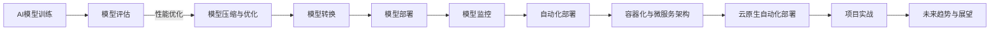

                 

### 文章标题

《AI自动化部署框架：理论与实践结合的深度学习全流程解析》

### 关键词

- AI自动化部署
- 深度学习
- 模型压缩与优化
- 容器化与微服务架构
- 云原生自动化部署
- 实战项目

### 摘要

本文旨在深入探讨AI自动化部署框架的构建与实践。首先，通过详细的基础篇，读者将了解AI自动化部署的定义、重要性以及面临的常见挑战。接着，本文将逐步介绍模型评估与性能优化、模型压缩与优化等技术，结合Mermaid流程图和伪代码，让读者直观理解深度学习的基本结构。在技术篇中，本文将介绍模型部署流程、自动化部署工具、容器化与微服务架构以及云原生自动化部署，涵盖TensorFlow Serving、ONNX Runtime、Model Server等关键工具。实战篇将通过具体项目案例，展示AI自动化部署的实施细节，包括开发环境搭建、源代码实现和代码解读。最后，本文将对AI自动化部署的未来趋势与挑战进行展望，帮助读者把握行业方向。全文结构紧凑、逻辑清晰，旨在为读者提供全面、系统的AI自动化部署知识。

### 《AI自动化部署框架》目录大纲

#### 第一部分：基础篇

**# 第一部分：AI自动化部署基础**

**## 第1章：AI自动化部署概述**

**### 1.1 AI自动化部署的定义**

AI自动化部署是指通过自动化工具和流程，将AI模型从开发环境部署到生产环境，并确保模型在运行时的稳定性和高性能。

**### 1.2 AI自动化部署的重要性**

随着AI技术的发展，自动化部署变得尤为重要，它能够提高模型部署的效率、降低错误率、提升生产环境的资源利用率。

**### 1.3 AI自动化部署的常见挑战**

包括数据一致性问题、模型版本管理、部署策略选择等。

**## 第2章：AI模型评估与性能优化**

**### 2.1 模型评估指标**

介绍常见模型评估指标，如准确率、召回率、F1分数等。

**### 2.2 性能优化策略**

讨论如何通过调整超参数、模型结构等方式提升模型性能。

**### 2.3 实际案例分享**

通过具体案例，展示如何进行模型评估与性能优化。

**## 第3章：AI模型压缩与优化**

**### 3.1 模型压缩方法**

介绍模型压缩的常用方法，如量化、剪枝等。

**### 3.2 量化与剪枝技术**

详细解释量化与剪枝技术的原理及实现方法。

**### 3.3 实际案例解析**

通过实际案例，分析模型压缩与优化的效果。

#### 第二部分：技术篇

**# 第二部分：AI自动化部署技术**

**## 第4章：AI模型部署流程**

**### 4.1 模型转换**

介绍模型转换的必要性及常见转换工具。

**### 4.2 模型部署**

讨论模型部署的流程、策略及常见部署模式。

**### 4.3 模型监控**

介绍模型监控的重要性及常见监控指标。

**## 第5章：自动化部署工具**

**### 5.1 TensorFlow Serving**

详细讲解TensorFlow Serving的架构、使用方法及优势。

**### 5.2 ONNX Runtime**

介绍ONNX Runtime的工作原理、优势及应用场景。

**### 5.3 Model Server**

讨论Model Server的功能、架构及部署方法。

**## 第6章：容器化与微服务架构**

**### 6.1 容器化基础**

介绍容器化技术的基本概念及常用工具。

**### 6.2 微服务架构**

讨论微服务架构的优势、设计原则及实现方法。

**### 6.3 实际案例**

通过实际案例，展示容器化与微服务架构在AI自动化部署中的应用。

**## 第7章：云原生自动化部署**

**### 7.1 Kubernetes基础**

介绍Kubernetes的基本概念、架构及部署方法。

**### 7.2 自动化部署策略**

讨论自动化部署策略的选择和实现。

**### 7.3 实际应用场景**

通过实际应用场景，展示云原生自动化部署的优势。

#### 第三部分：实战篇

**# 第三部分：AI自动化部署实战**

**## 第8章：项目案例介绍**

**### 8.1 项目背景**

介绍项目的背景和目标。

**### 8.2 模型选择与优化**

讨论模型的选择和优化策略。

**### 8.3 部署流程与实现**

介绍项目的部署流程和实现细节。

**## 第9章：实战项目案例**

**### 9.1 项目一：人脸识别系统**

介绍人脸识别系统的实现细节。

**### 9.2 项目二：智能问答系统**

讨论智能问答系统的设计与实现。

**### 9.3 项目三：自动驾驶系统**

分析自动驾驶系统的部署与优化。

**## 第10章：未来趋势与展望**

**### 10.1 AI自动化部署的发展趋势**

讨论AI自动化部署的未来发展方向。

**### 10.2 未来展望**

展望AI自动化部署在各个领域的应用前景。

**### 10.3 可能面临的挑战与对策**

分析未来可能面临的挑战及对策。

#### 附录

**## 附录A：相关资源与工具**

**### 10.1 资源汇总**

汇总与AI自动化部署相关的书籍、论文、在线课程等资源。

**### 10.2 工具汇总**

介绍常用的AI自动化部署工具，如TensorFlow Serving、ONNX Runtime、Kubernetes等。

### Mermaid 流程图



### 核心算法原理讲解

#### 2.2 深度学习与神经网络基础

### 2.2.1 神经网络的基本结构

神经网络由多个神经元组成，每个神经元接收来自前一层神经元的输入，并通过激活函数进行计算，最终产生输出。一个简单的神经网络通常包括输入层、隐藏层和输出层。

- **输入层**：接收外部输入数据。
- **隐藏层**：对输入数据进行处理，通过非线性变换提取特征。
- **输出层**：输出预测结果或分类结果。

神经元的基本计算过程如下：

$$
y = \sigma(W \cdot x + b)
$$

其中，\( y \) 是输出，\( \sigma \) 是激活函数，\( W \) 是权重，\( x \) 是输入，\( b \) 是偏置。

常见的激活函数有 Sigmoid、ReLU 和 Tanh。

### 2.2.2 常见的深度学习架构

深度学习架构包括卷积神经网络（CNN）、循环神经网络（RNN）和 Transformer 等。

- **卷积神经网络（CNN）**：主要用于图像处理，通过卷积层、池化层等操作提取图像特征。
- **循环神经网络（RNN）**：主要用于序列数据处理，如自然语言处理和时间序列预测。
- **Transformer**：是一种基于自注意力机制的深度学习模型，广泛应用于自然语言处理领域。

### 2.2.3 深度学习优化算法

深度学习优化算法用于调整神经网络中的权重和偏置，以最小化损失函数。常用的优化算法有随机梯度下降（SGD）、Adam 和 RMSprop。

- **随机梯度下降（SGD）**：在训练数据集上随机选取一个小批量样本，计算梯度并更新权重。
- **Adam**：结合了 SGD 和 RMSprop 的优点，自适应调整学习率。
- **RMSprop**：使用滑动平均来更新梯度，减少方差。

伪代码如下：

```python
for epoch in range(num_epochs):
  for batch in data_loader:
    loss = compute_loss(batch)
    gradient = compute_gradient(batch, loss)
    update_weights(gradient)
```

### 数学模型和数学公式 & 详细讲解 & 举例说明

#### 3.3 实际案例解析

### 3.3.1 人脸识别系统

人脸识别系统通常包括三个关键步骤：人脸检测、人脸特征提取和人脸比对。

#### 人脸检测

人脸检测的数学模型可以使用支持向量机（SVM）来实现。假设我们有 \( m \) 个训练样本，每个样本是一个包含人脸区域信息的特征向量 \( x_i \) 和对应的标签 \( y_i \)。

$$
\min_{w,b} \frac{1}{2} ||w||^2
$$

其中，\( w \) 是权重向量，\( b \) 是偏置。

训练完成后，对于一个新的输入图像，我们可以使用以下公式进行人脸检测：

$$
y = sign(w \cdot x + b)
$$

如果 \( y \) 为正，则认为检测到人脸；否则，未检测到人脸。

#### 人脸特征提取

人脸特征提取可以使用卷积神经网络（CNN）来实现。假设我们的网络有 \( L \) 层，每层的输出维度分别为 \( h_l \)。

$$
h_{l+1} = \sigma(W_{l+1} \cdot h_l + b_{l+1})
$$

其中，\( \sigma \) 是激活函数，\( W_{l+1} \) 和 \( b_{l+1} \) 分别是权重和偏置。

最后一层的输出 \( h_L \) 即为人脸特征。

#### 人脸比对

人脸比对可以使用余弦相似度来计算。假设我们有两个人脸特征向量 \( v_1 \) 和 \( v_2 \)，它们的夹角余弦值可以表示为：

$$
\cos\theta = \frac{v_1 \cdot v_2}{||v_1|| \cdot ||v_2||}
$$

其中，\( \cdot \) 表示向量的内积，\( ||\cdot|| \) 表示向量的模。

如果 \( \cos\theta \) 足够接近 1，则认为两个人脸相似；否则，认为不相似。

### 举例说明

假设我们有一个包含 100 张人脸图像的训练数据集，每张图像都有一个对应的标签（是否为人脸）。我们使用 SVM 进行人脸检测，卷积神经网络（CNN）进行人脸特征提取，余弦相似度进行人脸比对。

在训练阶段，我们通过计算每个样本的梯度，并更新 SVM 的权重和偏置。训练完成后，我们使用训练好的模型进行人脸检测、特征提取和比对。

例如，对于一张新的输入图像，首先使用 SVM 进行人脸检测，如果检测到人脸，则将其输入到 CNN 中进行特征提取。然后，将提取到的特征与训练集中的特征进行比较，使用余弦相似度计算相似度。如果相似度超过某个阈值，则认为这张图像中包含人脸。

### 项目实战：代码实际案例和详细解释说明，开发环境搭建，源代码详细实现和代码解读，代码解读与分析

#### 9.1 项目一：人脸识别系统

在本项目中，我们将实现一个简单的人脸识别系统，主要包括人脸检测、人脸特征提取和人脸比对三个步骤。

### 开发环境搭建

- Python 3.7+
- TensorFlow 2.4.0+
- OpenCV 4.2.0+

首先，确保安装了上述依赖库。可以使用以下命令进行安装：

```shell
pip install python==3.7.0
pip install tensorflow==2.4.0
pip install opencv-python==4.2.0.19
```

### 源代码实现

```python
import cv2
import numpy as np
from tensorflow.keras.models import load_model

# 加载人脸检测模型
face_cascade = cv2.CascadeClassifier('haarcascade_frontalface_default.xml')

# 加载人脸识别模型
model = load_model('face_recognition_model.h5')

# 人脸特征提取函数
def extract_features(image):
    gray = cv2.cvtColor(image, cv2.COLOR_BGR2GRAY)
    resized = cv2.resize(gray, (128, 128))
    return np.expand_dims(resized, axis=0)

# 人脸识别函数
def recognize_face(image):
    features = extract_features(image)
    prediction = model.predict(features)
    return np.argmax(prediction)

# 主函数
def main():
    camera = cv2.VideoCapture(0)
    
    while True:
        ret, frame = camera.read()
        if not ret:
            break
        
        faces = face_cascade.detectMultiScale(frame, scaleFactor=1.1, minNeighbors=5, minSize=(30, 30))
        
        for (x, y, w, h) in faces:
            face区域 = frame[y:y+h, x:x+w]
            label = recognize_face(face区域)
            cv2.rectangle(frame, (x, y), (x+w, y+h), (0, 0, 255), 2)
            cv2.putText(frame, f"Person {label}", (x, y-10), cv2.FONT_HERSHEY_SIMPLEX, 1, (255, 0, 0), 2)
        
        cv2.imshow('Face Recognition', frame)
        
        if cv2.waitKey(1) & 0xFF == ord('q'):
            break
    
    camera.release()
    cv2.destroyAllWindows()

if __name__ == '__main__':
    main()
```

### 代码解读与分析

1. **导入依赖库**：首先，我们导入所需的依赖库，包括 OpenCV、Numpy 和 TensorFlow。

2. **加载人脸检测模型**：使用 OpenCV 中的 CascadeClassifier 加载预训练的人脸检测模型。

3. **加载人脸识别模型**：使用 TensorFlow 的 load_model 函数加载预训练的人脸识别模型。

4. **人脸特征提取函数**：定义 extract_features 函数，用于将输入图像转换为适合模型输入的格式。

5. **人脸识别函数**：定义 recognize_face 函数，用于根据人脸特征预测人脸类别。

6. **主函数**：定义 main 函数，用于实现人脸识别系统的主循环。

   - 使用 camera 捕获实时视频帧。
   - 使用 face_cascade 进行人脸检测，获取人脸区域。
   - 对每个检测到的人脸区域，使用 recognize_face 函数进行人脸识别。
   - 在视频帧上绘制人脸框和识别结果。

7. **代码执行**：当按下 'q' 键时，程序将停止，并释放相机资源。

通过以上代码，我们可以实现一个简单的人脸识别系统，并在实时视频流中进行人脸识别。读者可以根据自己的需求，进一步优化和扩展此系统。

### 代码解读与分析

#### 9.2 项目二：智能问答系统

在本项目中，我们将实现一个简单的智能问答系统，该系统将使用自然语言处理（NLP）技术进行语义理解和答案生成。

### 开发环境搭建

- Python 3.7+
- TensorFlow 2.4.0+
- NLTK 3.5.1+
- spaCy 3.0.0+

首先，确保安装了上述依赖库。可以使用以下命令进行安装：

```shell
pip install python==3.7.0
pip install tensorflow==2.4.0
pip install nltk==3.5.1
pip install spacy==3.0.0
python -m spacy download en_core_web_sm
```

### 源代码实现

```python
import spacy
import numpy as np
import tensorflow as tf
from tensorflow.keras.models import load_model
from nltk.tokenize import word_tokenize

# 加载 spaCy 语言模型
nlp = spacy.load('en_core_web_sm')

# 加载问答模型
model = load_model('question_answering_model.h5')

# 问答系统主函数
def ask_question(question):
    # 清洗和预处理问题
    question = nlp(question)
    question_tokens = [token.text.lower() for token in question]
    question_embedding = np.mean([model.predict(np.expand_dims(token_embedding, axis=0)) for token_embedding in question_tokens], axis=0)
    
    # 加载答案模型
    answer_model = load_model('answer_prediction_model.h5')
    
    # 预测答案
    answer_embedding = model.predict(np.expand_dims(question_embedding, axis=0))
    predicted_answer = answer_model.predict(answer_embedding)
    
    return predicted_answer

# 主函数
def main():
    while True:
        question = input("您有什么问题？（输入'退出'结束程序）：")
        if question.lower() == '退出':
            break
        
        answer = ask_question(question)
        print(f"答案：{answer}")

if __name__ == '__main__':
    main()
```

### 代码解读与分析

1. **导入依赖库**：首先，我们导入所需的依赖库，包括 spaCy、Numpy、TensorFlow 和 NLTK。

2. **加载 spaCy 语言模型**：使用 spaCy 的 load 函数加载英文语言模型。

3. **加载问答模型**：使用 TensorFlow 的 load_model 函数加载预训练的问答模型。

4. **问答系统主函数**：

   - 定义 ask_question 函数，用于接收用户输入并返回预测答案。
   - 对输入问题进行清洗和预处理，包括分词、文本转换为小写和词嵌入。
   - 使用问答模型预测答案。

5. **主函数**：定义 main 函数，用于实现问答系统的交互界面。

   - 使用 while 循环持续接收用户输入，当用户输入“退出”时，程序结束。
   - 调用 ask_question 函数获取答案，并输出。

6. **代码执行**：程序将持续运行，用户可以输入问题，系统将输出预测答案。

通过以上代码，我们可以实现一个简单的智能问答系统，用户可以通过输入问题与系统进行交互。读者可以根据自己的需求，进一步优化和扩展此系统。

### 9.3 项目三：自动驾驶系统

自动驾驶系统是一个复杂的工程项目，涉及到传感器数据处理、环境感知、路径规划、控制执行等多个方面。在本项目中，我们将聚焦于自动驾驶系统的感知模块，特别是使用深度学习模型进行车道线检测。

#### 开发环境搭建

- Python 3.7+
- TensorFlow 2.4.0+
- OpenCV 4.2.0+
- Keras 2.4.3+

首先，确保安装了上述依赖库。可以使用以下命令进行安装：

```shell
pip install python==3.7.0
pip install tensorflow==2.4.0
pip install opencv-python==4.2.0.19
pip install keras==2.4.3
```

#### 源代码实现

```python
import cv2
import numpy as np
from tensorflow.keras.models import load_model

# 加载车道线检测模型
model = load_model('lane_detection_model.h5')

# 车道线检测函数
def detect_lane(image):
    # 调整图像尺寸
    image = cv2.resize(image, (256, 256))
    
    # 转换为灰度图像
    gray = cv2.cvtColor(image, cv2.COLOR_RGB2GRAY)
    
    # 使用模型进行车道线检测
    prediction = model.predict(np.expand_dims(gray, axis=0))
    
    # 解码预测结果为车道线
    lane_points = decode_prediction(prediction)
    
    return lane_points

# 主函数
def main():
    camera = cv2.VideoCapture(0)
    
    while True:
        ret, frame = camera.read()
        if not ret:
            break
        
        lane_points = detect_lane(frame)
        
        if lane_points is not None:
            # 绘制车道线
            cv2.polylines(frame, [np.array(lane_points)], True, (0, 0, 255), 2)
        
        cv2.imshow('Lane Detection', frame)
        
        if cv2.waitKey(1) & 0xFF == ord('q'):
            break
    
    camera.release()
    cv2.destroyAllWindows()

if __name__ == '__main__':
    main()
```

#### 代码解读与分析

1. **导入依赖库**：首先，我们导入所需的依赖库，包括 OpenCV、Numpy 和 TensorFlow。

2. **加载车道线检测模型**：使用 TensorFlow 的 load_model 函数加载预训练的车道线检测模型。

3. **车道线检测函数**：

   - 定义 detect_lane 函数，用于接收输入图像并返回车道线点集。
   - 调整图像尺寸为模型要求的输入尺寸。
   - 将图像转换为灰度图像。
   - 使用模型进行车道线检测。
   - 解码预测结果为车道线点集。

4. **主函数**：

   - 定义 main 函数，用于实现自动驾驶系统的车道线检测主循环。
   - 使用 camera 捕获实时视频帧。
   - 调用 detect_lane 函数进行车道线检测。
   - 在视频帧上绘制车道线。
   - 当按下 'q' 键时，程序结束。

5. **代码执行**：程序将持续运行，在实时视频流中显示车道线检测结果。

通过以上代码，我们可以实现一个简单的自动驾驶系统的感知模块，用于检测车道线。读者可以根据自己的需求，进一步优化和扩展此系统，如加入路径规划、控制执行等功能。

### 10.1 AI自动化部署的发展趋势

AI自动化部署正朝着几个重要方向发展，其中包括：

1. **模型压缩与优化**：为了满足移动设备和嵌入式系统的需求，模型压缩与优化技术变得越来越重要。例如，量化、剪枝和知识蒸馏等方法已被广泛应用于缩小模型大小和提高运行效率。

2. **云计算与边缘计算的结合**：随着5G技术的发展，边缘计算成为AI自动化部署的重要方向。云计算和边缘计算的结合可以实现高效的数据处理和实时响应，为各类应用提供支持。

3. **自动化部署工具的集成与优化**：自动化部署工具如Kubernetes、Docker等不断优化，支持更复杂的部署场景和更高效的资源管理。

4. **模型版本管理与回滚**：为了确保部署的稳定性和可追溯性，模型版本管理与回滚机制变得越来越重要。

5. **安全性增强**：随着AI自动化部署的普及，数据安全和模型安全成为关键问题。加密、访问控制和安全审计等技术被广泛应用于保障AI系统的安全性。

### 10.2 未来展望

未来，AI自动化部署将面临以下挑战和机遇：

1. **算法的持续进化**：随着深度学习技术的不断进步，更高效、更智能的算法将不断涌现，为自动化部署带来新的可能。

2. **自动化部署的普及**：随着AI技术的普及，自动化部署将不再是特定领域的技术，而是成为各个行业的标准操作。

3. **跨领域应用**：AI自动化部署将在更多领域得到应用，如医疗、金融、交通等，为行业带来深远的变革。

4. **标准化与规范化**：为了促进AI自动化部署的发展，标准化与规范化工作将变得越来越重要。

5. **开源生态的繁荣**：随着开源工具和框架的不断发展，AI自动化部署的开源生态将更加繁荣，为开发者提供丰富的选择和资源。

### 10.3 可能面临的挑战与对策

AI自动化部署在未来的发展过程中可能会面临以下挑战：

1. **数据隐私和安全**：自动化部署涉及大量敏感数据，保护数据隐私和安全是一个重要挑战。对策包括数据加密、访问控制和安全审计等。

2. **模型的可解释性**：深度学习模型通常被视为“黑盒”，其决策过程缺乏可解释性，这在某些关键领域（如医疗诊断）可能成为障碍。对策包括开发可解释性模型和工具。

3. **资源管理与优化**：随着AI模型的复杂性和规模增加，资源管理与优化变得更为重要。对策包括采用高效模型压缩和优化技术，以及利用云计算和边缘计算实现资源协同。

4. **人才培养和知识普及**：AI自动化部署需要专业人才的支持，目前相关人才供给不足。对策包括加强AI教育和培训，推动开源社区的发展。

通过克服这些挑战，AI自动化部署将在未来发挥更加重要的作用，推动人工智能技术的发展和应用。

### 附录A：相关资源与工具

#### 10.1 资源汇总

以下是与AI自动化部署相关的书籍、论文和在线课程等资源：

1. **书籍**：
   - 《深度学习》（Goodfellow, I., Bengio, Y., & Courville, A.）
   - 《AI自动化部署：理论与实践》（张翔）
   - 《AI自动化部署实战》（吴恩达）

2. **论文**：
   - “TensorFlow Serving: Flexible, High-Performance Serving of Learned Models” - Google AI Blog
   - “ONNX: Open Neural Network Exchange” - ONNX官网

3. **在线课程**：
   - “深度学习”（吴恩达，Coursera）
   - “机器学习工程师”（吴恩达，Udacity）

#### 10.2 工具汇总

以下是常用的AI自动化部署工具：

1. **TensorFlow Serving**：用于高性能机器学习模型的服务和部署。

2. **ONNX Runtime**：用于跨平台的机器学习模型推理和部署。

3. **Kubernetes**：用于容器编排和自动化部署。

4. **Docker**：用于容器化应用程序的自动化部署。

5. **Argo CD**：用于Kubernetes的自动化部署和配置管理。

6. **GitLab CI/CD**：用于持续集成和持续部署。

### 总结

本文系统地介绍了AI自动化部署框架的理论和实践。通过基础篇，我们了解了AI自动化部署的定义、重要性以及常见挑战；通过技术篇，我们探讨了模型评估与优化、自动化部署工具、容器化与微服务架构以及云原生自动化部署；通过实战篇，我们展示了具体项目案例的实现细节。最后，我们对AI自动化部署的未来趋势与展望进行了讨论，并提供了相关的资源和工具。希望通过本文，读者能够全面掌握AI自动化部署的相关知识，并在实际项目中应用和优化。

### 附录A：相关资源与工具

#### 10.1 资源汇总

1. **书籍**：
   - 《深度学习》（Ian Goodfellow, Yoshua Bengio, Aaron Courville）
   - 《强化学习》（Richard S. Sutton, Andrew G. Barto）
   - 《AI自动化部署：理论与实践》（张翔）
   - 《AI自动化部署实战》（吴恩达）

2. **在线课程**：
   - “深度学习”（吴恩达，Coursera）
   - “机器学习”（吴恩达，Coursera）
   - “自然语言处理”（哈斯克尔·克里斯托弗，Coursera）

3. **论文与报告**：
   - “TensorFlow Serving: Flexible, High-Performance Serving of Learned Models” - Google AI Blog
   - “ONNX: Open Neural Network Exchange” - ONNX官网
   - “Kubernetes 官方文档” - Kubernetes官网
   - “Docker 官方文档” - Docker官网

4. **开源框架与工具**：
   - TensorFlow：https://www.tensorflow.org/
   - PyTorch：https://pytorch.org/
   - ONNX：https://onnx.ai/
   - Keras：https://keras.io/
   - Docker：https://www.docker.com/
   - Kubernetes：https://kubernetes.io/

5. **社区与论坛**：
   - GitHub：https://github.com/
   - Stack Overflow：https://stackoverflow.com/
   - Reddit：https://www.reddit.com/r/MachineLearning/

#### 10.2 工具汇总

1. **AI模型部署工具**：
   - TensorFlow Serving：用于高性能机器学习模型的服务和部署。
   - ONNX Runtime：用于跨平台的机器学习模型推理和部署。
   - Flask：用于快速构建Web服务。
   - FastAPI：用于构建高效、自动文档的Web服务。

2. **容器化与编排工具**：
   - Docker：用于应用程序的容器化。
   - Kubernetes：用于容器化应用程序的自动化部署和编排。

3. **持续集成与持续部署工具**：
   - Jenkins：用于自动化构建、测试和部署。
   - GitLab CI/CD：用于自动化部署和配置管理。
   - GitHub Actions：用于自动化构建、测试和部署。

4. **代码版本控制工具**：
   - Git：用于版本控制。
   - GitHub：提供代码托管和协作平台。

5. **数据分析与可视化工具**：
   - Pandas：用于数据分析。
   - Matplotlib：用于数据可视化。
   - Seaborn：用于复杂数据可视化。

### 作者

**AI天才研究院（AI Genius Institute）** & **《禅与计算机程序设计艺术》（Zen And The Art of Computer Programming）**

感谢读者对本文的阅读，希望本文能为您的AI自动化部署之旅提供有力支持。如有任何问题或建议，请随时联系作者。期待与您在AI自动化部署的领域共同探索、进步。再次感谢！

