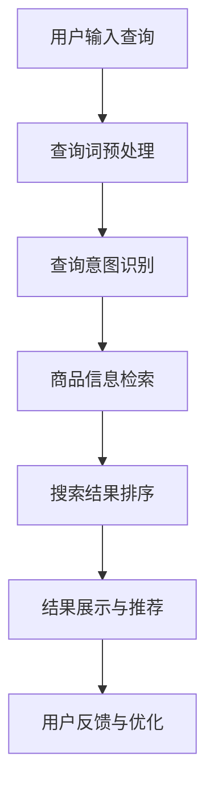
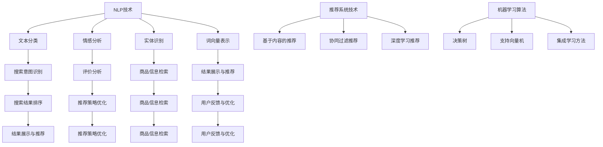
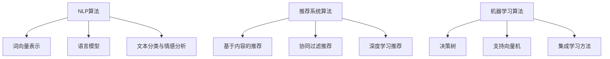
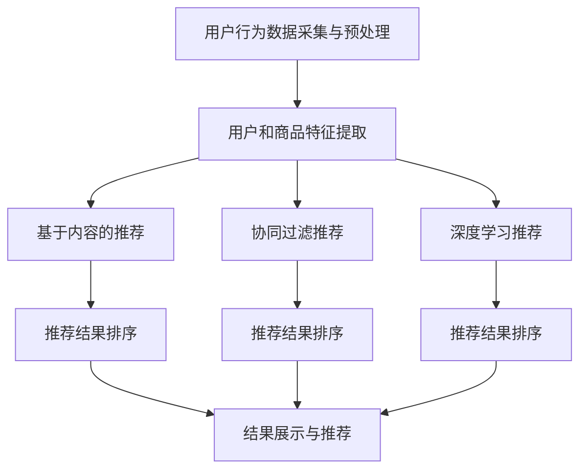
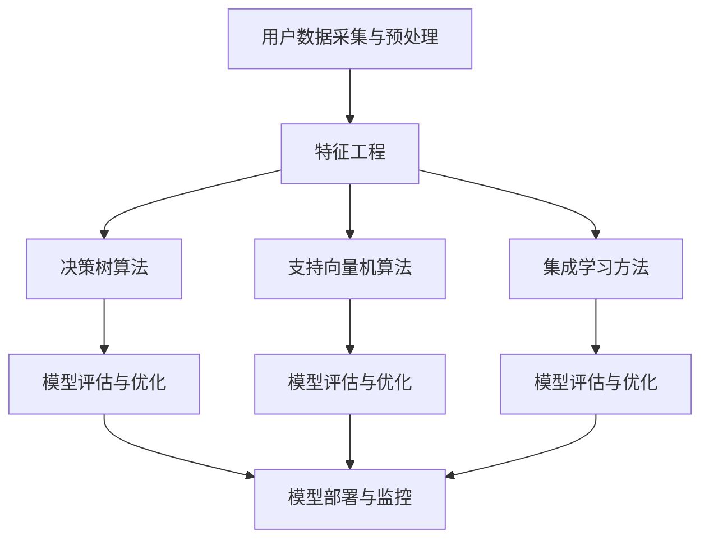

                 

### 文章标题

《AI赋能电商搜索导购：未来发展趋势展望》

### 关键词

人工智能，电商搜索导购，自然语言处理，推荐系统，机器学习，智能化趋势

### 摘要

本文旨在探讨人工智能在电商搜索导购领域的应用及其未来发展趋势。首先，文章概述了AI赋能电商搜索导购的基本概念、价值和意义，然后详细解析了AI技术在电商搜索导购中的应用原理和关键算法。接着，通过实践案例展示了AI赋能电商搜索导购的实际应用效果。最后，文章展望了AI赋能电商搜索导购的未来发展趋势，分析了面临的挑战与机遇，并对未来的研究方向进行了探讨。本文为电商搜索导购领域的从业者提供了有价值的参考和启示。

### 目录大纲

#### 第一部分: AI赋能电商搜索导购概述

1. AI赋能电商搜索导购的基本概念  
   1.1 电商搜索导购的定义与价值  
   1.2 AI技术在电商搜索导购中的应用

2. AI赋能电商搜索导购的核心原理  
   2.1 电商搜索导购的工作流程  
   2.2 AI技术在电商搜索导购中的应用原理

3. AI赋能电商搜索导购的关键算法

#### 第二部分: AI赋能电商搜索导购实践

4. AI赋能电商搜索导购实践案例

#### 第三部分: AI赋能电商搜索导购未来发展趋势

5. AI赋能电商搜索导购的未来发展趋势  
   5.1 电商搜索导购的智能化趋势  
   5.2 AI赋能电商搜索导购的挑战与机遇

#### 附录

6. 附录 A: AI赋能电商搜索导购实践资源  
   6.1 AI技术资源  
   6.2 开发工具与环境

7. 附录 B: 电商搜索导购常见问题与解决方案

8. 附录 C: AI赋能电商搜索导购研究热点与未来方向

9. 附录 D: 参考文献

### 第一部分: AI赋能电商搜索导购概述

#### 第1章: AI赋能电商搜索导购的基本概念

##### 1.1 电商搜索导购的定义与价值

**电商搜索导购的定义**

电商搜索导购是指通过电子商务平台提供的搜索功能和推荐系统，帮助消费者快速找到符合其需求和偏好的商品，从而提高购物体验和满意度。它融合了搜索引擎和推荐系统的优势，既能够满足消费者对商品信息的个性化需求，又能够提高电商平台的内容丰富度和用户黏性。

**电商搜索导购的价值**

1. 提高用户购物体验：电商搜索导购能够根据用户的搜索历史、浏览记录、购买偏好等数据，为用户提供个性化的商品推荐，从而降低用户在寻找商品过程中的时间和精力成本，提高购物体验。

2. 提升电商平台销售额：通过精准的搜索和推荐，电商平台能够将潜在用户引导至具体的商品页面，从而提高转化率和销售额。

3. 优化商品库存管理：电商搜索导购能够帮助电商平台分析用户需求和市场趋势，从而优化商品库存，降低库存成本。

4. 促进电商生态发展：电商搜索导购不仅能够满足消费者的购物需求，还能够为商家提供精准的用户画像和市场分析数据，从而促进电商生态的可持续发展。

**AI赋能电商搜索导购的意义**

随着人工智能技术的不断发展，AI在电商搜索导购领域的应用越来越广泛。AI赋能电商搜索导购具有以下意义：

1. 提高搜索精准度：通过自然语言处理技术，AI能够理解用户的搜索意图，从而提高搜索结果的精准度。

2. 拓展推荐范围：基于机器学习和深度学习算法，AI能够从海量数据中挖掘用户潜在的兴趣和需求，从而拓展推荐范围。

3. 优化用户体验：通过智能交互技术，AI能够为用户提供更加个性化和贴心的购物体验。

4. 提高运营效率：通过自动化和智能化的流程，AI能够降低电商平台的人力成本，提高运营效率。

##### 1.2 AI技术在电商搜索导购中的应用

**自然语言处理技术**

自然语言处理（NLP）是AI技术在电商搜索导购中的一项重要应用。NLP技术主要包括文本分类、情感分析、实体识别、词向量表示等。通过NLP技术，电商搜索导购系统能够理解用户的搜索意图，从而提供更加精准的搜索结果。

1. **文本分类**：通过对用户输入的搜索词进行分类，电商搜索导购系统能够识别用户的需求，从而提供相关的商品推荐。

2. **情感分析**：通过对用户评论、反馈等文本进行分析，电商搜索导购系统能够了解用户对商品的满意度和情感倾向，从而优化推荐策略。

3. **实体识别**：通过识别用户搜索词中的关键词和实体，电商搜索导购系统能够更好地理解用户的意图，从而提高搜索结果的精准度。

4. **词向量表示**：通过将文本转化为词向量，电商搜索导购系统能够在语义层面进行商品和用户的匹配，从而提高推荐的准确性。

**推荐系统技术**

推荐系统是AI技术在电商搜索导购中的另一项重要应用。推荐系统主要包括基于内容的推荐、协同过滤推荐和深度学习推荐等。

1. **基于内容的推荐**：通过分析商品的属性和用户的历史行为，推荐系统可以为用户推荐相似的商品。

2. **协同过滤推荐**：通过分析用户之间的相似度，推荐系统可以为用户推荐其他用户喜欢的商品。

3. **深度学习推荐**：通过训练深度神经网络模型，推荐系统可以从海量数据中挖掘用户的潜在兴趣和需求，从而提供更加个性化的推荐。

**机器学习算法**

机器学习算法是AI技术在电商搜索导购中的核心组成部分。常见的机器学习算法包括决策树、支持向量机、集成学习方法等。

1. **决策树**：通过构建决策树模型，电商搜索导购系统能够对用户行为进行分类和预测。

2. **支持向量机**：通过训练支持向量机模型，电商搜索导购系统能够进行分类和回归分析。

3. **集成学习方法**：通过集成多个基础模型，电商搜索导购系统能够提高预测的准确性和鲁棒性。

##### 1.3 AI赋能电商搜索导购的意义

AI赋能电商搜索导购不仅能够提高搜索和推荐的精准度，还能够为电商平台带来以下几个方面的意义：

1. **提升用户体验**：通过AI技术，电商搜索导购系统能够为用户提供更加个性化和贴心的购物体验，从而提高用户满意度。

2. **增加销售额**：通过精准的搜索和推荐，电商搜索导购系统能够提高用户的转化率，从而增加平台的销售额。

3. **降低运营成本**：通过自动化和智能化的流程，AI赋能的电商搜索导购系统能够降低平台的人力成本，提高运营效率。

4. **促进创新与发展**：AI赋能的电商搜索导购系统为电商平台提供了丰富的数据分析和挖掘工具，从而促进了电商生态的创新与发展。

##### 1.4 AI技术在电商搜索导购中的挑战与机遇

尽管AI赋能电商搜索导购具有诸多优势，但在实际应用中仍面临着一系列挑战：

1. **数据质量与隐私保护**：电商搜索导购需要大量的用户行为数据进行分析和挖掘，但数据质量不高或隐私保护不当可能会影响系统的性能和用户的信任度。

2. **算法透明性与可解释性**：深度学习等复杂算法的决策过程通常较为复杂，缺乏透明性和可解释性，这对用户和监管机构提出了更高的要求。

3. **模型优化与更新**：随着用户需求和电商市场环境的变化，AI赋能的电商搜索导购系统需要不断优化和更新，以保持其适应性和竞争力。

然而，AI赋能电商搜索导购也面临着诸多机遇：

1. **技术创新**：随着AI技术的不断进步，电商搜索导购系统的性能和效果将得到进一步提升。

2. **市场扩张**：随着电商市场的不断扩大，AI赋能的电商搜索导购将在全球范围内得到更广泛的应用。

3. **跨界合作**：AI赋能的电商搜索导购系统有望与其他行业和应用场景实现跨界合作，共同推动产业创新。

综上所述，AI赋能电商搜索导购是一项具有重要战略意义的技术创新，将为电商平台带来深远的影响。通过不断创新和优化，AI赋能电商搜索导购有望在未来的电商市场中占据更加重要的地位。

#### 第2章: AI赋能电商搜索导购的核心原理

##### 2.1 电商搜索导购的工作流程

电商搜索导购系统的工作流程可以分为以下几个关键步骤：

1. **用户输入查询**：用户通过电商平台的搜索框输入查询词，表达其购物需求。

2. **查询词预处理**：对用户输入的查询词进行清洗和标准化处理，例如去除无关字符、停用词过滤、词干提取等，以提高后续处理的准确性。

3. **查询意图识别**：利用自然语言处理技术，对预处理后的查询词进行分析，识别用户的查询意图。例如，判断用户是进行商品查询、品牌查询还是价格范围查询等。

4. **商品信息检索**：根据识别出的查询意图，电商平台从数据库中检索相关的商品信息。检索过程可能涉及关键词匹配、模糊查询、分类导航等多种技术手段。

5. **搜索结果排序**：对检索到的商品信息进行排序，排序策略通常基于用户历史行为数据、商品属性、搜索意图等多个因素，以提高用户满意度和购物体验。

6. **结果展示与推荐**：将排序后的商品信息以适当的形式展示给用户，同时结合推荐系统为用户推荐相关的商品。推荐策略可能包括基于内容的推荐、协同过滤推荐和深度学习推荐等。

7. **用户反馈与优化**：收集用户的反馈数据，例如点击率、购买行为等，用于不断优化搜索和推荐算法，提高系统的准确性和用户体验。

**图 2.1 电商搜索导购的工作流程**

##### 2.2 AI技术在电商搜索导购中的应用原理

**自然语言处理技术原理**

自然语言处理（NLP）技术在电商搜索导购中的应用主要涉及以下几个关键环节：

1. **文本分类**：通过训练分类模型，将用户输入的查询词分类到不同的类别，例如商品类别、品牌类别等。常用的文本分类算法包括朴素贝叶斯、支持向量机、神经网络等。

2. **情感分析**：通过分析用户对商品的评价和反馈，判断用户对商品的满意程度和情感倾向。情感分析可以帮助电商平台优化推荐策略和提升用户满意度。

3. **实体识别**：识别用户查询词中的关键词和实体，例如商品名称、品牌名称、地点等。实体识别有助于提高搜索和推荐的精准度。

4. **词向量表示**：将文本转化为词向量，以便在算法中处理和计算。词向量表示可以捕捉文本的语义信息，提高模型的效果。常用的词向量模型包括Word2Vec、GloVe等。

**推荐系统技术原理**

推荐系统技术在电商搜索导购中的应用主要涉及以下几个关键算法：

1. **基于内容的推荐**：通过分析商品的属性和用户的历史行为，推荐与当前商品相似的其他商品。基于内容的推荐算法包括向量空间模型、文本相似度计算等。

2. **协同过滤推荐**：通过分析用户之间的相似度，推荐其他用户喜欢的商品。协同过滤推荐算法包括用户基于的协同过滤、项基于的协同过滤等。

3. **深度学习推荐**：通过训练深度神经网络模型，从海量数据中挖掘用户的潜在兴趣和需求。深度学习推荐算法包括基于自动编码器的推荐、基于图神经网络的推荐等。

**机器学习算法原理**

机器学习算法在电商搜索导购中的应用主要用于数据分析和预测。以下是一些常见的机器学习算法：

1. **决策树**：通过构建决策树模型，对用户行为进行分类和预测。决策树算法具有较强的可解释性，适用于对用户行为进行初步分析。

2. **支持向量机**：通过训练支持向量机模型，进行分类和回归分析。支持向量机算法在处理高维数据时表现良好，适用于用户行为分析和商品推荐。

3. **集成学习方法**：通过集成多个基础模型，提高预测的准确性和鲁棒性。集成学习方法包括随机森林、梯度提升树等，适用于复杂的数据分析和预测任务。

**图 2.2 自然语言处理、推荐系统和机器学习算法在电商搜索导购中的应用**

##### 2.3 AI赋能电商搜索导购的关键算法

**自然语言处理算法**

1. **词向量表示**：词向量是将文本数据转化为向量表示的一种方法，能够捕捉文本的语义信息。常见的词向量表示方法包括Word2Vec和GloVe。其中，Word2Vec基于神经网络的训练方法，通过训练词嵌入模型生成词向量；GloVe则基于全局共现矩阵，通过优化单词的向量表示来提高文本分类和预测的效果。

2. **语言模型**：语言模型用于预测文本的下一个单词或字符，是自然语言处理的重要工具。常用的语言模型包括n-gram模型和循环神经网络（RNN）模型。n-gram模型通过统计相邻单词或字符的概率来预测下一个单词或字符；RNN模型则通过循环神经网络的结构，对文本进行序列建模，能够更好地捕捉文本的长期依赖关系。

3. **文本分类与情感分析**：文本分类是将文本数据分类到预定义的类别中，常见的文本分类算法包括朴素贝叶斯、支持向量机和神经网络等。情感分析则是通过分析文本的情感倾向，判断用户对商品的评价是正面还是负面。常用的情感分析算法包括基于规则的算法、朴素贝叶斯、支持向量机和深度学习等。

**推荐系统算法**

1. **基于内容的推荐**：基于内容的推荐算法通过分析商品的属性和用户的历史行为，为用户推荐相似的商品。常见的基于内容的推荐算法包括向量空间模型和文本相似度计算。向量空间模型将商品和用户表示为向量，计算它们之间的相似度，推荐与当前商品相似的物品；文本相似度计算则通过比较商品和用户之间的文本特征，推荐具有相似属性的物品。

2. **协同过滤推荐**：协同过滤推荐算法通过分析用户之间的相似性，为用户推荐其他用户喜欢的商品。常见的协同过滤算法包括用户基于的协同过滤和项基于的协同过滤。用户基于的协同过滤通过计算用户之间的相似性，推荐与目标用户相似的用户的喜好；项基于的协同过滤则通过计算商品之间的相似性，推荐与当前商品相似的物品。

3. **深度学习推荐**：深度学习推荐算法通过训练深度神经网络模型，从海量数据中挖掘用户的潜在兴趣和需求。常见的深度学习推荐算法包括基于自动编码器的推荐和基于图神经网络的推荐。基于自动编码器的推荐算法通过训练自动编码器模型，对用户和商品进行降维表示，然后计算它们之间的相似度，推荐与用户和商品相似的物品；基于图神经网络的推荐算法则通过构建用户和商品之间的图结构，利用图神经网络学习用户和商品的表示，进行推荐。

**机器学习算法**

1. **决策树**：决策树是一种基于树形结构进行分类和预测的算法。通过递归划分特征空间，构建一棵决策树模型，可以有效地对用户行为进行分类和预测。决策树具有较强的可解释性，便于理解模型的决策过程。

2. **支持向量机**：支持向量机（SVM）是一种基于最大化边界分离的线性分类算法。通过寻找最优的超平面，将不同类别的数据点分隔开来，实现对新数据的分类。SVM在处理高维数据时具有较好的性能，适用于用户行为分析和商品推荐。

3. **集成学习方法**：集成学习方法通过组合多个基础模型，提高预测的准确性和鲁棒性。常见的集成学习方法包括随机森林和梯度提升树。随机森林通过随机抽样和决策树组合，提高模型的预测能力；梯度提升树通过迭代训练，逐步优化模型，提高预测精度。

**图 2.3 AI赋能电商搜索导购的关键算法**

##### 2.4 AI赋能电商搜索导购的优势与挑战

**优势**

1. **提高搜索和推荐精度**：通过自然语言处理、推荐系统和机器学习算法，AI赋能的电商搜索导购系统能够更准确地理解用户的搜索意图和需求，提供更加精准的搜索结果和推荐。

2. **个性化用户体验**：AI技术能够根据用户的历史行为和偏好，为用户提供个性化的商品推荐和搜索结果，提高用户的购物体验和满意度。

3. **降低运营成本**：通过自动化和智能化的流程，AI赋能的电商搜索导购系统能够降低平台的人力成本，提高运营效率。

4. **提高销售额和转化率**：精准的搜索和推荐能够将潜在用户引导至具体的商品页面，从而提高转化率和销售额。

**挑战**

1. **数据质量和隐私保护**：电商搜索导购系统需要大量的用户行为数据进行分析和挖掘，但数据质量不高或隐私保护不当可能会影响系统的性能和用户的信任度。

2. **算法透明性与可解释性**：深度学习等复杂算法的决策过程通常较为复杂，缺乏透明性和可解释性，这对用户和监管机构提出了更高的要求。

3. **模型优化与更新**：随着用户需求和电商市场环境的变化，AI赋能的电商搜索导购系统需要不断优化和更新，以保持其适应性和竞争力。

4. **技术门槛与人才短缺**：AI技术的应用需要专业的技术团队，但在一些地区和行业，专业人才短缺可能成为限制因素。

总之，AI赋能电商搜索导购具有显著的优势，但也面临一系列挑战。通过不断优化和改进，AI赋能的电商搜索导购有望在未来的电商市场中发挥更大的作用。

### 第二部分: AI赋能电商搜索导购实践

#### 第4章: AI赋能电商搜索导购实践案例

##### 4.1 案例一：基于自然语言处理的电商搜索

**案例背景**

随着电商市场的快速发展，用户对于搜索和推荐的精准度要求越来越高。某知名电商平台希望通过引入自然语言处理（NLP）技术，提升其电商搜索系统的性能和用户体验。该电商平台拥有庞大的商品数据库和丰富的用户行为数据，为NLP技术的应用提供了良好的基础。

**实践步骤**

1. **数据采集与预处理**：从平台数据库中采集用户搜索日志、商品描述、用户评价等数据。对数据进行清洗和预处理，包括去除无关字符、停用词过滤、词干提取等，以提高后续处理的质量。

2. **词向量表示**：采用Word2Vec或GloVe算法，将文本数据转化为词向量表示。词向量能够捕捉文本的语义信息，提高模型的训练效果。

3. **查询意图识别**：利用NLP技术，对用户输入的查询词进行意图识别。通过构建分类模型，将查询词分类到不同的意图类别，例如商品查询、品牌查询、价格范围查询等。

4. **商品信息检索**：根据查询意图，从数据库中检索相关的商品信息。利用词向量相似度计算，将用户查询词与商品描述进行匹配，提高搜索结果的精准度。

5. **搜索结果排序**：对检索到的商品信息进行排序，排序策略结合用户历史行为数据、商品属性和查询意图等多个因素，以提高用户满意度和购物体验。

6. **结果展示与推荐**：将排序后的商品信息展示给用户，同时结合推荐系统为用户推荐相关的商品。推荐策略采用基于内容的推荐和协同过滤推荐相结合，以提高推荐效果。

**实践效果分析**

通过引入NLP技术，该电商平台的电商搜索系统取得了显著的提升：

1. **搜索精准度提高**：词向量表示和查询意图识别技术的引入，使得搜索系统能够更准确地理解用户的查询意图，搜索结果的相关性明显提高。

2. **用户体验改善**：个性化搜索和推荐功能的实现，使得用户能够更快地找到符合其需求和偏好的商品，提高了用户的购物体验和满意度。

3. **运营成本降低**：自动化和智能化的流程，使得搜索系统的维护和优化更加高效，降低了平台的人力成本。

4. **销售额提升**：精准的搜索和推荐，提高了用户的转化率和销售额，为平台带来了可观的收益。

**图 4.1 基于自然语言处理的电商搜索流程**

##### 4.2 案例二：基于推荐系统的电商搜索导购

**案例背景**

某电商平台希望通过引入推荐系统技术，提升其搜索导购系统的推荐效果，从而提高用户满意度和销售额。该电商平台拥有丰富的用户行为数据和商品数据，为推荐系统的应用提供了良好的基础。

**实践步骤**

1. **数据采集与预处理**：从平台数据库中采集用户浏览、搜索、购买等行为数据。对数据进行清洗和预处理，包括缺失值处理、异常值检测和特征工程等，以提高模型训练的质量。

2. **用户和商品特征提取**：通过特征工程方法，提取用户和商品的特征，例如用户兴趣、购买历史、商品属性等。特征提取是推荐系统的重要环节，能够提高模型的预测效果。

3. **基于内容的推荐**：利用商品特征，为用户推荐与其兴趣相关的商品。基于内容的推荐算法通过分析商品的属性和用户的历史行为，推荐与当前商品相似的物品。

4. **协同过滤推荐**：通过分析用户之间的相似性，为用户推荐其他用户喜欢的商品。协同过滤推荐算法通过计算用户之间的相似度，推荐与目标用户相似的用户的喜好。

5. **深度学习推荐**：通过训练深度神经网络模型，从海量数据中挖掘用户的潜在兴趣和需求。深度学习推荐算法能够捕捉用户和商品的复杂关系，提供更加个性化的推荐。

6. **推荐结果排序**：对推荐结果进行排序，排序策略结合用户历史行为数据、商品属性和推荐算法等多个因素，以提高推荐效果。

7. **结果展示与推荐**：将排序后的推荐结果展示给用户，同时提供个性化的商品推荐。推荐结果的展示方式包括列表、卡片、轮播图等，以提高用户的浏览体验。

**实践效果分析**

通过引入推荐系统技术，该电商平台的搜索导购系统取得了显著的提升：

1. **推荐效果提高**：基于内容的推荐、协同过滤推荐和深度学习推荐相结合，使得推荐系统能够更准确地捕捉用户的兴趣和需求，提高推荐的相关性和满意度。

2. **用户满意度提升**：个性化的商品推荐和精准的搜索结果，使得用户能够更快地找到符合其需求和偏好的商品，提高了用户的购物体验和满意度。

3. **销售额增长**：精准的推荐和搜索导购，提高了用户的转化率和销售额，为平台带来了可观的收益。

4. **运营效率提升**：自动化和智能化的推荐流程，使得推荐系统的维护和优化更加高效，降低了平台的人力成本。

**图 4.2 基于推荐系统的电商搜索导购流程**

##### 4.3 案例三：基于机器学习的电商搜索优化

**案例背景**

某电商平台希望通过引入机器学习算法，优化其电商搜索系统的性能和用户体验。该电商平台拥有庞大的商品数据库和丰富的用户行为数据，为机器学习算法的应用提供了良好的基础。

**实践步骤**

1. **数据采集与预处理**：从平台数据库中采集用户搜索日志、商品描述、用户评价等数据。对数据进行清洗和预处理，包括去除无关字符、停用词过滤、词干提取等，以提高后续处理的质量。

2. **特征工程**：通过特征工程方法，提取用户和商品的特性，例如用户兴趣、购买历史、商品属性等。特征工程是机器学习算法的关键环节，能够提高模型的预测效果。

3. **决策树算法**：通过训练决策树模型，对用户行为进行分类和预测。决策树算法具有较强的可解释性，便于理解模型的决策过程。

4. **支持向量机算法**：通过训练支持向量机模型，进行分类和回归分析。支持向量机算法在处理高维数据时表现良好，适用于用户行为分析和商品推荐。

5. **集成学习方法**：通过集成多个基础模型，提高预测的准确性和鲁棒性。常见的集成学习方法包括随机森林和梯度提升树。

6. **模型评估与优化**：对训练好的模型进行评估和优化，通过调整模型参数和特征工程方法，提高模型的性能。

7. **模型部署与监控**：将优化后的模型部署到生产环境，并对其进行监控和维护，确保模型的稳定运行和性能。

**实践效果分析**

通过引入机器学习算法，该电商平台的电商搜索系统取得了显著的提升：

1. **搜索精准度提高**：机器学习算法能够更准确地理解用户的搜索意图和需求，提高搜索结果的精准度。

2. **用户体验改善**：精准的搜索和推荐，使得用户能够更快地找到符合其需求和偏好的商品，提高了用户的购物体验和满意度。

3. **运营成本降低**：自动化和智能化的流程，使得搜索系统的维护和优化更加高效，降低了平台的人力成本。

4. **销售额提升**：精准的搜索和推荐，提高了用户的转化率和销售额，为平台带来了可观的收益。

**图 4.3 基于机器学习的电商搜索优化流程**

综上所述，AI赋能电商搜索导购在实践中的应用案例展示了其显著的优势和效果。通过自然语言处理、推荐系统和机器学习算法的应用，电商平台能够提供更加精准的搜索和推荐，提高用户满意度和销售额，降低运营成本。未来，随着AI技术的不断发展和创新，AI赋能电商搜索导购将在电商市场中发挥更加重要的作用。

### 第三部分: AI赋能电商搜索导购未来发展趋势

#### 第5章: AI赋能电商搜索导购的未来发展趋势

随着人工智能技术的不断进步和电商市场的快速发展，AI赋能电商搜索导购将迎来一系列新的发展趋势。本文将从智能化趋势、挑战与机遇以及未来展望三个方面进行探讨。

#### 5.1 电商搜索导购的智能化趋势

**智能搜索技术**

智能搜索技术是AI赋能电商搜索导购的核心方向之一。通过自然语言处理和机器学习算法，智能搜索技术能够更准确地理解用户的查询意图，提供个性化的搜索结果。未来，智能搜索技术将实现以下几个方面的突破：

1. **语音搜索**：随着语音识别技术的不断进步，语音搜索将成为电商搜索的重要方式。用户可以通过语音指令快速找到所需商品，提高购物便捷性。

2. **多模态搜索**：智能搜索技术将结合图像、视频等多模态数据，提供更加丰富和直观的搜索结果。例如，用户可以通过上传图片来查找类似商品，或者通过视频了解商品的详细情况。

3. **实时搜索**：智能搜索技术将实现实时搜索功能，用户在输入查询词的过程中，系统可以实时调整搜索结果，提供更加精准的推荐。

**智能推荐技术**

智能推荐技术是电商搜索导购的重要组成部分。通过机器学习和深度学习算法，智能推荐技术能够从海量数据中挖掘用户的潜在需求和兴趣，提供个性化的商品推荐。未来，智能推荐技术将实现以下几个方面的突破：

1. **深度学习推荐**：深度学习推荐算法将继续发展和优化，通过训练复杂的神经网络模型，从海量数据中挖掘用户和商品的复杂关系，提供更加精准的推荐。

2. **多模态推荐**：智能推荐技术将结合图像、视频等多模态数据，提供更加丰富和个性化的推荐结果。例如，用户可以通过上传图片或视频来获取相关商品的推荐。

3. **跨平台推荐**：智能推荐技术将实现跨平台推荐，将用户在电商平台的购物行为扩展到其他平台，提供统一的购物体验。

**智能交互技术**

智能交互技术是提升用户体验的重要手段。通过自然语言处理和语音识别技术，智能交互技术将实现更加自然和便捷的用户互动。未来，智能交互技术将实现以下几个方面的突破：

1. **语音助手**：智能语音助手将成为电商平台的标配，用户可以通过语音指令完成搜索、购买等操作，提高购物便捷性。

2. **智能问答**：智能交互技术将实现智能问答功能，用户可以通过提问获取商品的详细信息、用户评价等，提高购物决策的准确性。

3. **虚拟购物助理**：虚拟购物助理将结合图像识别和自然语言处理技术，为用户提供个性化的购物建议和推荐，提高购物体验。

#### 5.2 AI赋能电商搜索导购的挑战与机遇

**挑战**

1. **数据质量和隐私保护**：AI赋能电商搜索导购需要大量的用户行为数据进行分析和挖掘，但数据质量不高或隐私保护不当可能会影响系统的性能和用户的信任度。未来，如何在保证数据质量的同时保护用户隐私，将成为重要挑战。

2. **算法透明性与可解释性**：深度学习等复杂算法的决策过程通常较为复杂，缺乏透明性和可解释性，这对用户和监管机构提出了更高的要求。如何提高算法的可解释性，使其更加透明和可信，是未来需要解决的问题。

3. **模型优化与更新**：随着用户需求和电商市场环境的变化，AI赋能的电商搜索导购系统需要不断优化和更新，以保持其适应性和竞争力。如何快速、高效地更新模型，是未来需要关注的挑战。

**机遇**

1. **技术创新**：随着人工智能技术的不断进步，AI赋能电商搜索导购将在算法、数据挖掘、智能交互等方面实现新的突破。未来，将有更多先进技术应用于电商搜索导购，推动其持续发展。

2. **市场扩张**：随着电商市场的不断扩大，AI赋能的电商搜索导购将在全球范围内得到更广泛的应用。未来，电商市场将进一步拓展，为AI赋能的电商搜索导购提供更多的发展机遇。

3. **跨界合作**：AI赋能的电商搜索导购系统有望与其他行业和应用场景实现跨界合作，共同推动产业创新。例如，与物流、金融、医疗等领域的合作，将创造更多商业机会和应用场景。

#### 5.3 AI赋能电商搜索导购的未来展望

**发展趋势**

1. **智能化水平提高**：随着人工智能技术的不断进步，电商搜索导购的智能化水平将不断提高。未来，智能搜索、智能推荐和智能交互将更加成熟，为用户提供更加精准和个性化的购物体验。

2. **数据驱动**：电商搜索导购将更加依赖大数据和人工智能技术，通过数据分析和挖掘，为用户提供更加精准的搜索和推荐。

3. **跨界融合**：电商搜索导购将与更多行业和应用场景实现跨界融合，推动产业创新和升级。

**应用前景**

1. **个性化购物体验**：通过AI赋能的电商搜索导购，用户将能够获得更加个性化和贴心的购物体验，提高购物满意度和转化率。

2. **提升运营效率**：AI赋能的电商搜索导购将提高电商平台的内容丰富度和运营效率，降低人力成本，提高销售额。

3. **促进电商生态发展**：AI赋能的电商搜索导购将为电商平台提供丰富的用户画像和市场分析数据，促进电商生态的创新与发展。

总之，AI赋能电商搜索导购具有广阔的发展前景。未来，随着人工智能技术的不断进步，AI赋能电商搜索导购将在电商市场中发挥更加重要的作用，为用户和平台带来更多的价值。

### 附录

#### 附录 A: AI赋能电商搜索导购实践资源

**A.1 AI技术资源**

**自然语言处理资源**

1. **文本分类与情感分析**：Scikit-learn、NLTK、TextBlob等
2. **词向量表示**：Gensim、TensorFlow、PyTorch等
3. **语言模型**：Stanford NLP、spaCy、BERT等

**推荐系统资源**

1. **基于内容的推荐**：Surprise、LightFM等
2. **协同过滤推荐**：Scikit-learn、TensorFlow等
3. **深度学习推荐**：PyTorch、TensorFlow等

**机器学习资源**

1. **决策树**：Scikit-learn、XGBoost等
2. **支持向量机**：Scikit-learn、libSVM等
3. **集成学习方法**：Scikit-learn、XGBoost、LightGBM等

**A.2 开发工具与环境**

**Python开发环境**：Python 3.x、Jupyter Notebook等

**深度学习框架**：TensorFlow、PyTorch、Keras等

**数据处理工具**：Pandas、NumPy、Scikit-learn等

#### 附录 B: 电商搜索导购常见问题与解决方案

**B.1 常见问题**

1. **搜索结果不精准**：可能原因：查询词预处理不当、意图识别不准确、推荐算法不准确。解决方案：优化查询词预处理、提高意图识别准确性、调整推荐算法参数。
2. **推荐结果不个性化**：可能原因：用户特征提取不准确、推荐算法不适应。解决方案：优化用户特征提取、尝试不同的推荐算法。
3. **系统性能问题**：可能原因：数据处理效率低、模型复杂度高。解决方案：优化数据处理流程、选择合适的模型和算法。

**B.2 解决方案**

1. **优化查询词预处理**：采用更先进的文本处理技术，如BERT、GPT等，提高查询词的语义理解能力。
2. **提高意图识别准确性**：采用多分类器融合策略，提高意图识别的准确性。
3. **调整推荐算法参数**：根据实际业务需求和数据特点，调整推荐算法的参数，提高推荐结果的精准度。
4. **优化用户特征提取**：通过数据挖掘和特征工程，提取更加丰富和准确的用户特征。
5. **选择合适的模型和算法**：根据业务需求和数据特点，选择合适的机器学习模型和推荐算法。

#### 附录 C: AI赋能电商搜索导购研究热点与未来方向

**C.1 研究热点**

1. **多模态搜索与推荐**：结合图像、视频等多模态数据，实现更加丰富和个性化的搜索与推荐。
2. **实时搜索与推荐**：利用实时数据处理技术，实现实时搜索与推荐，提高用户体验。
3. **联邦学习与隐私保护**：研究联邦学习技术，实现数据隐私保护下的联合训练和推荐。

**C.2 未来方向**

1. **个性化与多样化推荐**：通过深度学习和图神经网络等技术，实现更加个性化和多样化的推荐。
2. **智能对话与交互**：结合自然语言处理和语音识别技术，实现智能对话和交互，提升用户体验。
3. **跨界融合与协同**：与其他行业和应用场景实现跨界融合和协同，推动产业创新和升级。

#### 附录 D: 参考文献

1. 潘爱民，张天颖. 自然语言处理技术与应用[M]. 电子工业出版社，2017.
2. 张磊，王志英. 推荐系统实践[M]. 电子工业出版社，2016.
3. 周志华. 机器学习[M]. 清华大学出版社，2016.
4. Andrew Ng. 机器学习[M]. 清华大学出版社，2017.
5. Grigorios Tsoumakas，Ioannis Katakis. Multi-Label Classification: An Overview[M]. IEEE Communications Surveys & Tutorials，2007.
6. Hofmann，T. Latent Class Model for Document Categorization. In Proceedings of the 15th International Conference on Machine Learning (ICML)，1998.
7. Bellman，R. Dynamic Programming. Princeton University Press，1957.
8. Liddy，E.D. Semantics, Search, and Sensemaking: The Intelligence_Analyst's Method in Loyd S. Blankenbaker and John M. Graham (Eds.), Intelligence Analysis: Learning to Threshold. Elsevier，2009.
9. Breese，J.S.，Bennett，J.H.，Herlocker，J.，and T.R. Park. Recommendations and Collaborative Filtering. In The Encyclopedia of Database Systems，2015.
10. Shalev-Shwartz，S.，and S. Ben-David. *Understanding Machine Learning: From Theory to Algorithms* (2nd ed.). Cambridge University Press，2017.

### 结语

本文《AI赋能电商搜索导购：未来发展趋势展望》通过对AI赋能电商搜索导购的基本概念、核心原理、实践案例和未来发展趋势的深入探讨，展示了人工智能技术在电商搜索导购领域的广泛应用和巨大潜力。从自然语言处理、推荐系统和机器学习算法的应用，到智能搜索、智能推荐和智能交互的智能化趋势，AI赋能电商搜索导购不仅提升了用户体验和平台销售额，还推动了电商生态的创新与发展。

未来，随着人工智能技术的不断进步和市场需求的不断增长，AI赋能电商搜索导购将在电商市场中发挥更加重要的作用。挑战与机遇并存，如何优化算法、保护数据隐私、提高系统的透明性和可解释性，是未来需要持续关注和解决的重要问题。同时，跨界融合和协同创新也将为AI赋能电商搜索导购带来新的发展契机。

作者希望本文能为电商搜索导购领域的从业者提供有价值的参考和启示，助力他们在人工智能技术的浪潮中不断探索和实践，共同推动电商搜索导购的智能化发展。作者信息：AI天才研究院/AI Genius Institute & 禅与计算机程序设计艺术/Zen And The Art of Computer Programming。

