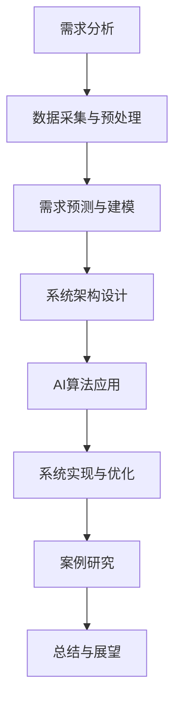

                 

### 文章标题: AI辅助的需求分析与系统设计

> 关键词：人工智能，需求分析，系统设计，机器学习，深度学习，自然语言处理

> 摘要：
本文章深入探讨了人工智能（AI）在需求分析与系统设计中的应用。通过介绍AI的基础理论，如机器学习、深度学习和自然语言处理，本文详细阐述了AI在需求预测和系统架构设计中的具体应用。同时，通过案例分析，展示了AI技术在智能医疗诊断、智能交通管理和智能金融风控等领域的实际应用，为读者提供了宝贵的实践经验。本文旨在为IT从业者提供一份全面、系统的AI辅助需求分析与系统设计指南。

---

### 《AI辅助的需求分析与系统设计》目录大纲

#### 第一部分：引言与基础理论

- **1. 引言**
  - **1.1 书籍目的与结构**
  - **1.2 AI辅助需求分析与系统设计的意义**
  - **1.3 本书适用读者与预置知识**

- **2. AI辅助需求分析与系统设计概述**
  - **2.1 AI在需求分析与系统设计中的应用**
  - **2.2 AI辅助需求分析与系统设计的核心概念**
  - **2.3 AI辅助需求分析与系统设计的发展趋势**

- **3. AI基础理论**
  - **3.1 机器学习基础**
    - **3.1.1 机器学习基本概念**
    - **3.1.2 监督学习、无监督学习和半监督学习**
  - **3.2 深度学习基础**
    - **3.2.1 深度学习的基本结构**
    - **3.2.2 神经网络与深度学习算法**
  - **3.3 自然语言处理基础**
    - **3.3.1 语言模型与文本分类**
    - **3.3.2 语义分析与情感分析**

#### 第二部分：AI辅助需求分析

- **4. AI辅助需求分析概述**
  - **4.1 需求分析过程**
  - **4.2 AI在需求分析中的应用**
  - **4.3 AI辅助需求分析的优势与挑战**

- **5. 数据采集与预处理**
  - **5.1 数据采集方法**
    - **5.1.1 结构化数据采集**
    - **5.1.2 半结构化数据采集**
    - **5.1.3 非结构化数据采集**
  - **5.2 数据预处理**
    - **5.2.1 数据清洗**
    - **5.2.2 数据归一化**
    - **5.2.3 特征提取与选择**

- **6. 需求预测与建模**
  - **6.1 需求预测原理**
    - **6.1.1 时间序列预测**
    - **6.1.2 关联规则挖掘**
  - **6.2 常见需求预测模型**
    - **6.2.1 线性回归模型**
    - **6.2.2 决策树与随机森林**
    - **6.2.3 支持向量机**

- **7. 需求分析与建模实践**
  - **7.1 实践项目背景**
  - **7.2 实践项目步骤**
    - **7.2.1 数据采集与预处理**
    - **7.2.2 需求预测模型构建**
    - **7.2.3 预测结果分析与优化**

#### 第三部分：AI辅助系统设计

- **8. AI辅助系统设计概述**
  - **8.1 系统设计过程**
  - **8.2 AI在系统设计中的应用**
  - **8.3 AI辅助系统设计的优势与挑战**

- **9. 系统架构设计**
  - **9.1 系统架构设计原则**
    - **9.1.1 分层架构**
    - **9.1.2 模块化设计**
    - **9.1.3 高内聚、低耦合**
  - **9.2 常见系统架构模式**
    - **9.2.1 客户端/服务器架构**
    - **9.2.2 微服务架构**
    - **9.2.3 云计算架构**

- **10. AI算法应用**
  - **10.1 AI算法在系统设计中的应用**
    - **10.1.1 自然语言处理**
    - **10.1.2 计算机视觉**
    - **10.1.3 强化学习**
  - **10.2 AI算法优化与调参**
    - **10.2.1 模型优化策略**
    - **10.2.2 超参数调整**

- **11. 系统设计与实现实践**
  - **11.1 实践项目背景**
  - **11.2 实践项目步骤**
    - **11.2.1 系统需求分析**
    - **11.2.2 系统架构设计**
    - **11.2.3 系统实现与优化**

#### 第四部分：案例分析

- **12. AI辅助需求分析与系统设计案例研究**
  - **12.1 案例一：智能医疗诊断系统**
    - **12.1.1 需求分析**
    - **12.1.2 系统设计**
    - **12.1.3 实现与效果评估**
  - **12.2 案例二：智能交通管理系统**
    - **12.2.1 需求分析**
    - **12.2.2 系统设计**
    - **12.2.3 实现与效果评估**
  - **12.3 案例三：智能金融风控系统**
    - **12.3.1 需求分析**
    - **12.3.2 系统设计**
    - **12.3.3 实现与效果评估**

#### 第五部分：总结与展望

- **13. 总结**
  - **13.1 全书回顾**
  - **13.2 关键知识点与技能点**
  - **13.3 进一步学习建议**

- **14. 展望**
  - **14.1 AI辅助需求分析与系统设计未来发展趋势**
  - **14.2 面临的挑战与机遇**
  - **14.3 未来研究方向与领域拓展**

#### 附录

- **A. AI辅助需求分析与系统设计工具与资源**
  - **A.1 开发工具与环境**
  - **A.2 数据集与资源**
  - **A.3 开源代码与框架**
  - **A.4 相关文献与资料**

### Mermaid 流程图
#### AI辅助需求分析与系统设计流程


### 伪代码与数学公式

#### 需求预测模型构建伪代码

```plaintext
function 需求预测(数据集):
    1. 数据预处理
        - 数据清洗
        - 数据归一化
        - 特征提取
    2. 选择合适的预测模型
        - 线性回归
        - 决策树
        - 随机森林
    3. 模型训练
        - 训练数据集
        - 调整超参数
    4. 预测结果评估
        - 交叉验证
        - 评估指标（如MSE、RMSE）
    5. 模型优化
        - 调整模型结构
        - 调整超参数
    6. 输出预测结果
    return 预测结果
```

#### 数学模型与公式详细讲解

##### 伪代码：线性回归模型

```plaintext
function 线性回归(特征X，标签y):
    1. 计算X和y的均值μX和μy
    2. 计算X的协方差矩阵SXX
    3. 计算X和y的协方差矩阵SXY
    4. 求解回归系数β = (SXX)^(-1) * SXY
    5. 预测结果y' = X * β + μy
    return β，y'
```

##### 数学公式：

$$
\beta = (S_{XX})^{-1} S_{XY}
$$

$$
y' = X\beta + \mu_y
$$

##### 举例说明：

假设我们有一组特征矩阵X和标签向量y，我们首先计算X和y的均值，然后计算X的协方差矩阵SXX，以及X和y的协方差矩阵SXY。最后，我们通过求解上述公式得到回归系数β，并使用这个系数来预测新的标签值y'。

### 项目实战

#### 实践项目：智能医疗诊断系统

##### 1. 项目背景

智能医疗诊断系统旨在利用AI技术，通过分析医疗数据，辅助医生进行疾病诊断。本案例选取常见的心脏病诊断作为研究对象。

##### 2. 数据采集与预处理

- **数据集**：使用公开的心脏病诊断数据集，包括患者的心电图数据、年龄、性别、病史等信息。
- **数据预处理**：
  - **数据清洗**：去除缺失值和异常值。
  - **数据归一化**：对数值特征进行归一化处理，使得数据范围一致。

##### 3. 需求预测与建模

- **预测模型**：选择决策树模型进行需求预测。
- **模型训练**：
  - **使用训练数据集进行训练**。
  - **调整决策树参数**，如最大深度、最小样本数等，以获得最佳模型。

##### 4. 系统架构设计

- **系统架构**：采用客户端/服务器架构，前端负责数据输入与展示，后端负责数据处理与预测。

##### 5. 系统实现与优化

- **实现细节**：
  - **前端**：使用HTML、CSS和JavaScript实现用户界面。
  - **后端**：使用Python和Scikit-learn库实现模型训练与预测。
- **优化**：
  - **模型优化**：通过交叉验证调整模型参数。
  - **系统优化**：通过优化算法提高预测速度和准确性。

##### 6. 实现与代码解读

```python
# 导入库
import pandas as pd
from sklearn.model_selection import train_test_split
from sklearn.tree import DecisionTreeClassifier
from sklearn.metrics import accuracy_score

# 读取数据
data = pd.read_csv('heart_disease_data.csv')
X = data.drop('diagnosis', axis=1)
y = data['diagnosis']

# 数据预处理
X = X.fillna(X.mean())
X = (X - X.mean()) / X.std()

# 划分训练集与测试集
X_train, X_test, y_train, y_test = train_test_split(X, y, test_size=0.2, random_state=42)

# 训练模型
clf = DecisionTreeClassifier(max_depth=5, min_samples_leaf=10)
clf.fit(X_train, y_train)

# 预测
y_pred = clf.predict(X_test)

# 评估
accuracy = accuracy_score(y_test, y_pred)
print("Accuracy:", accuracy)
```

##### 7. 代码解读与分析

- **代码首先导入必要的库**，包括pandas、train_test_split和DecisionTreeClassifier。
- **数据读取和预处理部分**，读取数据集，填充缺失值，进行归一化处理。
- **划分训练集与测试集**，使用train_test_split函数。
- **模型训练部分**，使用DecisionTreeClassifier进行训练。
- **预测部分**，使用训练好的模型进行预测。
- **评估部分**，计算并输出预测准确率。

---

通过以上概述，读者可以对AI辅助的需求分析与系统设计有一个初步的了解。接下来，本文将逐步深入探讨AI的相关基础理论，包括机器学习、深度学习和自然语言处理，为后续内容的展开奠定基础。在深入探讨AI的理论和应用之后，我们将详细介绍AI在需求分析与系统设计中的应用，并展示实际案例中的具体实现过程。希望通过本文的阐述，读者能够全面理解AI在IT领域的重要作用，并为实际项目提供有效的指导和借鉴。接下来，我们开始对AI的基本概念和理论基础进行详细讲解。

### 第一部分：引言与基础理论

#### 1. 引言

##### 1.1 书籍目的与结构

本书籍旨在为广大IT从业者提供一份系统、全面且易于理解的AI辅助需求分析与系统设计指南。随着人工智能技术的迅猛发展，其在各个领域的应用日益广泛，尤其在需求分析和系统设计领域，AI技术正在发挥着越来越重要的作用。然而，对于许多从业者而言，如何将AI技术有效地应用于实际项目中仍然存在一定的困惑和障碍。本书籍旨在解决这一问题，通过系统讲解AI的基本概念、理论基础以及具体应用方法，帮助读者掌握AI在需求分析与系统设计中的核心技能。

全书分为五个主要部分，结构如下：

1. **引言与基础理论**：介绍AI辅助需求分析与系统设计的基本概念和理论基础。
2. **AI辅助需求分析**：详细阐述AI在需求分析过程中的应用，包括数据采集、需求预测和建模等。
3. **AI辅助系统设计**：探讨AI在系统设计中的应用，包括系统架构设计、AI算法优化与调参等。
4. **案例分析**：通过实际案例展示AI在需求分析与系统设计中的具体应用。
5. **总结与展望**：总结全书内容，展望AI辅助需求分析与系统设计的未来发展趋势。

##### 1.2 AI辅助需求分析与系统设计的意义

在当今快速发展的科技时代，需求分析与系统设计作为软件工程的核心环节，其重要性不言而喻。然而，随着项目的复杂性不断增加，传统的需求分析与系统设计方法面临着诸多挑战，如需求变化频繁、设计过程中涉及的数据量大、设计过程耗时等。人工智能（AI）技术的引入，为解决这些问题提供了新的思路和手段。以下是AI辅助需求分析与系统设计的几个重要意义：

1. **提高需求分析的准确性**：AI技术能够通过对大量历史数据的学习，自动识别出潜在的需求模式，从而提高需求分析的准确性。在需求分析过程中，AI可以通过自然语言处理技术理解用户的需求，并通过机器学习算法进行需求预测和建模，为系统设计提供可靠的数据支持。

2. **优化系统设计过程**：AI技术可以帮助设计者快速生成系统架构和设计方案，提高设计效率。通过自动化工具，AI可以分析系统的性能、可扩展性、安全性等方面的需求，并提供优化建议，帮助设计者设计出更加高效、可靠的系统。

3. **提升系统质量**：AI技术可以自动检测和修复系统中的缺陷，提高系统的稳定性和可靠性。在系统实现过程中，AI可以通过异常检测和预测模型，提前发现潜在的问题，从而降低系统出现故障的概率。

4. **降低成本和人力投入**：通过自动化工具和算法，AI可以减少人工工作量，降低项目成本。在需求分析与系统设计过程中，AI可以自动化完成一些繁琐的任务，如数据采集、数据预处理、模型训练等，从而节省人力和时间成本。

5. **促进创新和持续改进**：AI技术可以不断学习用户的反馈和需求，通过持续优化，提高系统的适应性和创新能力。在快速变化的市场环境中，AI辅助的需求分析与系统设计可以帮助企业更快地响应市场需求，实现持续创新。

##### 1.3 本书适用读者与预置知识

本书籍主要面向以下读者群体：

1. **软件工程师与开发人员**：希望了解和应用AI技术进行需求分析与系统设计的从业者。
2. **项目经理与产品经理**：负责项目规划和管理的专业人士，希望通过AI技术提高项目效率和质量。
3. **人工智能爱好者与研究者**：对AI技术在需求分析与系统设计中的应用感兴趣的学者和学生。

为了更好地理解和掌握本书的内容，读者需要具备以下预置知识：

1. **基础编程能力**：熟悉至少一种编程语言，如Python、Java或C++。
2. **基本的机器学习知识**：了解机器学习的基本概念和方法，如线性回归、决策树、神经网络等。
3. **基本的软件工程知识**：了解软件开发生命周期和系统设计的基本原理。

通过本书的阅读，读者将能够：

1. **深入理解AI技术在需求分析与系统设计中的应用**。
2. **掌握AI辅助需求分析与系统设计的方法和技巧**。
3. **具备在实际项目中应用AI技术的能力**。

接下来，我们将进入第二部分，介绍AI辅助需求分析与系统设计的基础理论，包括机器学习、深度学习和自然语言处理等关键概念。这将为我们后续的内容打下坚实的基础。

### 2. AI辅助需求分析与系统设计概述

##### 2.1 AI在需求分析与系统设计中的应用

人工智能（AI）作为一种模拟人类智能的技术，其应用领域已经涵盖了各行各业。在需求分析与系统设计过程中，AI技术同样发挥着重要作用，通过提高需求分析的准确性、优化系统设计过程、提升系统质量、降低成本和人力投入等方式，极大地推动了软件工程的发展。以下是AI在需求分析与系统设计中的应用概述。

1. **需求分析**：AI技术在需求分析中的应用主要体现在以下几个方面：
   - **需求预测**：通过机器学习算法，AI可以分析历史项目数据，预测未来的需求变化。这有助于项目团队提前识别潜在的风险，制定有效的应对策略。
   - **需求理解**：利用自然语言处理（NLP）技术，AI可以理解和解释用户的需求，将非结构化的需求转化为结构化的需求文档，提高需求的准确性。
   - **需求优化**：AI可以通过分析历史数据，找出需求中的冗余和不足，提供优化建议，从而提高需求的质量。

2. **系统设计**：AI技术在系统设计中的应用主要包括：
   - **架构设计**：AI可以基于历史数据和设计经验，自动生成系统的架构设计方案，提高设计效率。
   - **性能优化**：AI可以通过模拟和分析系统运行数据，提供性能优化建议，提升系统的运行效率和稳定性。
   - **安全性设计**：AI可以分析系统的攻击模式和安全漏洞，提供相应的安全防护策略，提高系统的安全性。

##### 2.2 AI辅助需求分析与系统设计的核心概念

为了更好地理解AI辅助需求分析与系统设计，我们需要了解以下几个核心概念：

1. **机器学习**：机器学习是AI的核心技术之一，通过从数据中学习规律，实现自动预测和决策。在需求分析中，机器学习可以用于需求预测、需求理解和需求优化等任务；在系统设计中，机器学习可以用于架构设计、性能优化和安全性设计等任务。

2. **深度学习**：深度学习是机器学习的一个分支，通过模拟人脑神经网络的结构，实现更复杂的预测和决策。在需求分析中，深度学习可以用于复杂需求的理解和预测；在系统设计中，深度学习可以用于图像识别、语音识别和自然语言处理等任务。

3. **自然语言处理（NLP）**：自然语言处理是深度学习在文本处理领域的应用，通过理解和生成自然语言，实现人与机器的交互。在需求分析中，NLP可以用于理解用户需求、生成需求文档和需求优化等任务；在系统设计中，NLP可以用于用户界面设计、语音识别和自然语言生成等任务。

4. **数据挖掘**：数据挖掘是一种从大量数据中提取有价值信息的方法。在需求分析中，数据挖掘可以用于分析用户行为、市场趋势和需求变化等；在系统设计中，数据挖掘可以用于性能优化、安全性分析和需求预测等任务。

5. **强化学习**：强化学习是一种通过试错和反馈学习的方法。在需求分析中，强化学习可以用于优化需求流程、提高需求质量；在系统设计中，强化学习可以用于自动化测试、性能优化和安全性设计等任务。

##### 2.3 AI辅助需求分析与系统设计的发展趋势

随着AI技术的不断进步和应用范围的扩大，AI辅助需求分析与系统设计领域也呈现出以下发展趋势：

1. **自动化与智能化**：随着机器学习和深度学习算法的优化，AI在需求分析与系统设计中的应用将越来越智能化和自动化，能够自动完成需求分析、系统设计和优化等任务。

2. **多领域融合**：AI技术将与其他技术如云计算、大数据和区块链等相结合，形成新的应用场景，推动需求分析与系统设计的进一步发展。

3. **个性化与定制化**：基于用户数据和需求分析，AI可以提供个性化的需求解决方案和系统设计，满足不同用户的需求。

4. **可持续性与安全性**：随着AI技术在需求分析与系统设计中的应用，系统的可持续性和安全性将得到进一步提升，通过自动化测试、异常检测和安全防护等技术，提高系统的稳定性和可靠性。

5. **人机协作**：在AI辅助需求分析与系统设计的过程中，人与机器的协作将成为主流，通过人工智能助手和自动化工具，提高设计效率和用户体验。

总之，AI辅助需求分析与系统设计是软件工程领域的一个重要研究方向，随着AI技术的不断发展，其在实际应用中将发挥越来越重要的作用。通过本文的概述，读者可以初步了解AI辅助需求分析与系统设计的基本概念和应用，为后续内容的深入学习打下基础。

### 3. AI基础理论

人工智能（AI）作为一门多学科交叉的领域，其核心理论包括机器学习、深度学习和自然语言处理等。这些理论为AI在需求分析与系统设计中的应用提供了基础。本节将详细介绍这些核心理论的基本概念、原理和应用。

#### 3.1 机器学习基础

##### 3.1.1 机器学习基本概念

机器学习（Machine Learning，ML）是一门研究如何让计算机从数据中学习，并做出决策或预测的技术。它是AI的重要组成部分，其核心思想是通过数据驱动的方式，使计算机具备自主学习和适应新环境的能力。

1. **监督学习（Supervised Learning）**：监督学习是一种常见的机器学习方式，其核心思想是通过输入数据（特征集）和对应的输出数据（标签），训练出一个模型，以便对新数据进行预测。监督学习的目的是使模型在新数据上能够准确地预测输出。

2. **无监督学习（Unsupervised Learning）**：无监督学习不依赖于已标注的输出数据，其主要任务是发现数据内在的结构或模式。无监督学习包括聚类（Clustering）和降维（Dimensionality Reduction）等任务。

3. **半监督学习（Semi-supervised Learning）**：半监督学习结合了监督学习和无监督学习的方法，使用部分标注数据和大量未标注的数据来训练模型。这种方法能够提高学习效率，特别是在标注数据成本高昂的情况下。

##### 3.1.2 监督学习、无监督学习和半监督学习

1. **监督学习**：

   监督学习的基本流程包括数据预处理、模型选择、模型训练和模型评估。以下是一个简单的监督学习流程：

   ```plaintext
   function 监督学习(输入数据X，输出数据y):
       1. 数据预处理：清洗、归一化等
       2. 模型选择：选择合适的模型，如线性回归、决策树等
       3. 模型训练：使用训练数据训练模型
       4. 模型评估：使用验证集或测试集评估模型性能
       5. 调参与优化：根据评估结果调整模型参数
       return 模型
   ```

2. **无监督学习**：

   无监督学习的主要任务是发现数据中的模式或结构。以下是一个简单的无监督学习流程：

   ```plaintext
   function 无监督学习(输入数据X):
       1. 数据预处理：清洗、归一化等
       2. 模型选择：选择合适的模型，如K-均值聚类、主成分分析（PCA）等
       3. 模型训练：使用训练数据训练模型
       4. 模型评估：根据目标评估模型性能
       5. 调参与优化：根据评估结果调整模型参数
       return 模型，模式或结构
   ```

3. **半监督学习**：

   半监督学习结合了监督学习和无监督学习的方法，其流程可以概括为：

   ```plaintext
   function 半监督学习(标注数据X1，未标注数据X2):
       1. 数据预处理：清洗、归一化等
       2. 模型选择：选择合适的模型，如支持向量机（SVM）、深度神经网络（DNN）等
       3. 模型训练：使用标注数据和未标注数据共同训练模型
       4. 模型评估：使用验证集或测试集评估模型性能
       5. 调参与优化：根据评估结果调整模型参数
       return 模型
   ```

#### 3.2 深度学习基础

##### 3.2.1 深度学习的基本结构

深度学习（Deep Learning，DL）是机器学习的一个分支，其核心思想是通过多层神经网络模拟人脑的学习过程。深度学习的基本结构包括输入层、隐藏层和输出层。

1. **输入层（Input Layer）**：输入层接收外部输入数据，如文本、图像或数值数据。

2. **隐藏层（Hidden Layer）**：隐藏层负责对输入数据进行特征提取和变换，每层神经网络都可以提取不同层次的抽象特征。

3. **输出层（Output Layer）**：输出层根据隐藏层提取的特征进行预测或分类。

##### 3.2.2 神经网络与深度学习算法

1. **神经网络（Neural Networks）**：神经网络是深度学习的基础，由大量神经元组成。每个神经元都与其他神经元相连，通过加权求和和激活函数进行信息传递和处理。

2. **深度学习算法**：常见的深度学习算法包括卷积神经网络（CNN）、循环神经网络（RNN）、生成对抗网络（GAN）等。

   - **卷积神经网络（CNN）**：CNN是处理图像数据的常用算法，通过卷积层、池化层和全连接层提取图像特征。

   - **循环神经网络（RNN）**：RNN适用于序列数据处理，如文本、语音和时序数据。RNN通过隐藏状态循环记忆信息。

   - **生成对抗网络（GAN）**：GAN是一种生成模型，通过生成器和判别器的对抗训练，实现数据的生成。

#### 3.3 自然语言处理基础

##### 3.3.1 语言模型与文本分类

1. **语言模型（Language Model）**：语言模型是一种用于预测文本序列概率的模型，常见的方法包括N元语法、神经网络语言模型（NNLM）等。

2. **文本分类（Text Classification）**：文本分类是一种将文本数据分类到预定义类别的方法。常见的文本分类方法包括基于词袋模型（Bag of Words，BOW）的方法、支持向量机（SVM）和深度学习模型等。

##### 3.3.2 语义分析与情感分析

1. **语义分析（Semantic Analysis）**：语义分析是一种理解文本语义含义的方法，包括词义消歧、实体识别、关系抽取等任务。

2. **情感分析（Sentiment Analysis）**：情感分析是一种判断文本情感倾向的方法，如正面、负面或中立。常见的情感分析方法包括基于规则的方法、机器学习方法和深度学习方法等。

通过本节对AI基础理论的介绍，读者可以初步了解机器学习、深度学习和自然语言处理的基本概念和应用。这些基础理论为后续章节中AI在需求分析与系统设计中的应用奠定了基础。在接下来的章节中，我们将进一步探讨AI在需求分析与系统设计中的具体应用和实践案例。

### 4. AI辅助需求分析概述

##### 4.1 需求分析过程

需求分析是软件工程中的关键环节，其目标是明确用户的需求，并转化为可执行的软件设计。需求分析过程通常包括以下几个步骤：

1. **需求收集**：通过与用户、利益相关者进行访谈、问卷调查等方式，收集用户的需求和期望。
2. **需求分析**：对收集到的需求进行整理、分类和优先级排序，形成详细的需求文档。
3. **需求验证**：验证需求文档的正确性和完整性，确保需求满足用户的需求。
4. **需求管理**：对需求进行跟踪和管理，确保需求的变更得到及时处理。

##### 4.2 AI在需求分析中的应用

人工智能在需求分析中的应用主要体现在以下几个方面：

1. **需求预测**：利用机器学习算法，分析历史需求数据，预测未来的需求变化。这有助于项目团队提前识别潜在的风险，制定有效的应对策略。
2. **需求理解**：通过自然语言处理（NLP）技术，AI可以理解和解释用户的需求，将非结构化的需求转化为结构化的需求文档。
3. **需求优化**：基于历史数据，AI可以分析需求的冗余和不足，提供优化建议，从而提高需求的质量。

##### 4.3 AI辅助需求分析的优势与挑战

1. **优势**：

   - **提高需求分析的准确性**：通过机器学习算法，AI可以分析大量历史数据，识别潜在的需求模式，从而提高需求预测的准确性。
   - **优化需求分析过程**：AI可以自动化完成部分需求分析任务，如需求收集、需求理解等，提高分析效率。
   - **提升系统质量**：AI可以帮助项目团队识别需求中的潜在问题，提供优化建议，从而提高系统的质量。

2. **挑战**：

   - **数据质量和数量**：AI的需求分析依赖于高质量和足够数量的数据，数据缺失或不准确会影响需求分析的结果。
   - **模型复杂性和优化**：机器学习模型通常较为复杂，需要大量的参数调整和优化，这增加了模型训练和调优的难度。
   - **用户需求的变化**：用户需求可能会随着项目进展不断变化，如何适应这种变化，确保AI需求分析的有效性，是一个重要的挑战。

通过本节的介绍，读者可以初步了解AI在需求分析中的应用和挑战。在接下来的章节中，我们将深入探讨AI在需求分析中的具体应用，包括数据采集与预处理、需求预测与建模等。这些内容将为读者提供更全面的AI需求分析知识。

### 5. 数据采集与预处理

在AI辅助需求分析过程中，数据采集与预处理是关键步骤。高质量的数据是确保需求分析准确性的基础。本节将详细介绍数据采集与预处理的方法、技术和工具。

##### 5.1 数据采集方法

数据采集是获取用于AI模型训练和预测的数据的过程。根据数据类型和来源，数据采集可以分为以下几种方法：

1. **结构化数据采集**：结构化数据通常存储在数据库或电子表格中，可以通过数据库查询或电子表格导入的方式进行采集。常用的工具有SQL数据库、Excel等。

2. **半结构化数据采集**：半结构化数据具有部分结构化特征，例如XML、JSON等。可以通过解析XML、JSON等格式，提取所需数据。常用的工具有Python中的xml.etree.ElementTree、json库等。

3. **非结构化数据采集**：非结构化数据包括文本、图像、音频等，可以通过相应的API或工具进行采集。例如，文本可以通过网络爬虫、社交媒体API等获取；图像可以通过摄像头、图像库等获取。

##### 5.2 数据预处理

数据预处理是数据采集后的重要环节，其目的是提高数据质量，为AI模型训练提供合适的输入数据。数据预处理通常包括以下步骤：

1. **数据清洗**：数据清洗是去除数据中的噪声和异常值的过程。常见的清洗方法包括：
   - **去除重复数据**：通过去重算法，删除重复的数据记录。
   - **处理缺失值**：对缺失值进行填充或删除，根据具体情况进行选择。
   - **处理异常值**：检测并处理异常数据，例如离群点、错误记录等。

2. **数据归一化**：数据归一化是将不同特征的数据范围统一到同一标准的过程，常用的归一化方法包括：
   - **最小-最大标准化**：将数据缩放到[0,1]范围内。
     $$ z = \frac{x - x_{\min}}{x_{\max} - x_{\min}} $$
   - **零-均值标准化**：将数据缩放到以零均值的范围内。
     $$ z = \frac{x - \mu}{\sigma} $$
   - **对数变换**：对于数值范围较大的数据，可以通过对数变换将其范围缩小。

3. **特征提取与选择**：特征提取是将原始数据转换为更适合模型训练的特征表示的过程。特征选择是从大量特征中筛选出对模型训练有帮助的特征。常用的方法包括：
   - **主成分分析（PCA）**：通过降维，将原始数据映射到低维空间，保留主要特征。
   - **特征选择算法**：例如信息增益、卡方检验、L1正则化等，根据特征的重要性进行选择。

##### 5.3 数据采集与预处理的工具与资源

在进行数据采集与预处理时，可以使用多种工具和资源来提高效率和准确性。以下是一些常用的工具和资源：

1. **数据采集工具**：
   - **Python库**：如requests、beautifulsoup4、scrapy等，用于网页爬虫和数据采集。
   - **API**：许多在线服务和平台提供API接口，可以通过编程方式获取数据。

2. **数据处理工具**：
   - **Python库**：如NumPy、Pandas、SciPy等，用于数据处理和数学运算。
   - **数据清洗工具**：如OpenRefine、DataWrangler等，专门用于数据清洗和整理。

3. **数据可视化工具**：
   - **Python库**：如Matplotlib、Seaborn等，用于数据可视化。
   - **商业软件**：如Tableau、Power BI等，提供强大的数据可视化和报表功能。

通过本节的内容，读者可以了解数据采集与预处理的基本方法、技术和工具，为后续的AI需求分析和建模做好准备。

### 6. 需求预测与建模

##### 6.1 需求预测原理

需求预测是AI辅助需求分析的核心环节，通过分析历史数据和现有信息，预测未来的需求变化，为项目规划和决策提供数据支持。需求预测的基本原理包括时间序列预测和关联规则挖掘。

###### 6.1.1 时间序列预测

时间序列预测是一种基于历史时间数据，预测未来某一时刻或某一时间段需求的方法。常见的时间序列预测模型包括：

1. **移动平均法（Moving Average）**：通过计算一段时间内数据的平均值来预测未来值。
   $$ \hat{y}_t = \frac{1}{n}\sum_{i=1}^{n} y_{t-i} $$
   
2. **指数平滑法（Exponential Smoothing）**：在移动平均法的基础上，引入指数加权，对最近的数据给予更高的权重。
   $$ \hat{y}_t = \alpha y_{t-1} + (1 - \alpha) \hat{y}_{t-1} $$

3. **ARIMA模型（Autoregressive Integrated Moving Average）**：通过自回归、差分和移动平均的组合，对时间序列数据进行建模和预测。

   - **自回归（AR）**：模型通过历史值预测当前值。
     $$ y_t = c + \phi_1 y_{t-1} + \phi_2 y_{t-2} + \ldots + \phi_p y_{t-p} + \varepsilon_t $$
     
   - **差分（I）**：对时间序列数据进行差分处理，消除趋势和季节性。
     $$ y_t^{(1)} = y_t - y_{t-1} $$
     
   - **移动平均（MA）**：模型通过历史误差预测当前值。
     $$ y_t = c + \theta_1 \varepsilon_{t-1} + \theta_2 \varepsilon_{t-2} + \ldots + \theta_q \varepsilon_{t-q} $$

   - **ARIMA模型**：将自回归、差分和移动平均结合起来。
     $$ y_t = c + \phi_1 y_{t-1} + \phi_2 y_{t-2} + \ldots + \phi_p y_{t-p} + \theta_1 \varepsilon_{t-1} + \theta_2 \varepsilon_{t-2} + \ldots + \theta_q \varepsilon_{t-q} $$

###### 6.1.2 关联规则挖掘

关联规则挖掘是一种用于发现数据中潜在关联关系的方法，通过分析事务数据，发现不同项目或需求之间的关联。常见的方法包括：

1. **Apriori算法**：基于候选集生成和剪枝策略，通过支持度和置信度筛选出强关联规则。

2. **FP-Growth算法**：通过构建FP树，高效地挖掘频繁项集和关联规则。

##### 6.2 常见需求预测模型

在需求预测中，常用的模型包括线性回归、决策树与随机森林、支持向量机等。这些模型可以根据不同的需求和数据特点进行选择。

###### 6.2.1 线性回归模型

线性回归模型是一种最简单的需求预测模型，其基本原理是通过拟合一条直线来预测需求。线性回归模型可以表示为：

$$ \hat{y} = \beta_0 + \beta_1 x $$

其中，$ \beta_0 $ 和 $ \beta_1 $ 是模型的参数，$ x $ 是自变量，$ \hat{y} $ 是预测值。

###### 6.2.2 决策树与随机森林

决策树模型通过一系列的判断节点和叶子节点来预测需求。每个节点根据特征和阈值进行划分，直到达到终止条件。决策树模型可以表示为：

$$ y = g(x) = \prod_{i=1}^{n} \alpha_i I(x \in R_i) $$

其中，$ g(x) $ 是决策函数，$ \alpha_i $ 和 $ R_i $ 是每个节点的阈值和划分区域。

随机森林（Random Forest）是一种基于决策树的集成学习方法，通过构建多棵决策树，并结合它们的预测结果进行投票。随机森林可以表示为：

$$ \hat{y} = \sum_{i=1}^{m} \hat{y}_i $$

其中，$ \hat{y}_i $ 是第 $ i $ 棵决策树的预测值，$ m $ 是决策树的数量。

###### 6.2.3 支持向量机

支持向量机（SVM）是一种基于间隔最大化原理的模型，其目的是找到一个最优的超平面，将需求数据分为不同的类别。SVM可以表示为：

$$ y (\beta \cdot x + b) \geq 1 $$

其中，$ \beta $ 是权重向量，$ b $ 是偏置，$ x $ 是特征向量，$ y $ 是标签。

通过以上对需求预测原理和常见模型的介绍，读者可以了解到AI在需求预测中的基本方法和应用。在接下来的章节中，我们将通过实际案例来展示需求预测与建模的实践过程。

### 7. 需求分析与建模实践

#### 7.1 实践项目背景

为了更好地展示AI在需求分析与建模中的应用，本节我们将以一个实际项目为例，介绍需求分析与建模的完整过程。该项目是一个电商平台的用户行为分析系统，旨在通过分析用户的购买行为，预测用户未来的购买需求，从而优化营销策略和提高销售额。

#### 7.2 实践项目步骤

##### 7.2.1 数据采集与预处理

1. **数据来源**：收集电商平台的历史交易数据，包括用户ID、购买时间、商品ID、购买数量、用户年龄、性别、地理位置等。

2. **数据清洗**：
   - **去重**：去除重复的交易记录，保证数据的唯一性。
   - **处理缺失值**：对于缺失的数据，采用均值填补或删除缺失记录的方法。
   - **异常值检测**：检测并处理异常数据，例如负数的购买数量等。

3. **数据归一化**：对数据进行归一化处理，使得不同特征的数据范围一致，便于模型训练。

4. **特征提取**：
   - **时间特征**：提取购买时间的相关特征，如月份、星期等。
   - **用户特征**：提取用户的年龄、性别、地理位置等特征。

##### 7.2.2 需求预测模型构建

1. **选择模型**：根据项目的需求和数据特点，选择适合的预测模型，如线性回归、决策树、随机森林和支持向量机等。

2. **模型训练**：
   - **数据划分**：将数据集划分为训练集和测试集，用于模型训练和评估。
   - **模型参数调整**：通过交叉验证和网格搜索等方法，调整模型的参数，选择最佳参数组合。

3. **模型评估**：使用测试集评估模型的性能，常用的评估指标包括均方误差（MSE）、均方根误差（RMSE）和准确率等。

##### 7.2.3 预测结果分析与优化

1. **结果分析**：分析预测结果，包括预测的准确率、误差分布等，评估模型的性能。

2. **模型优化**：
   - **特征选择**：通过特征重要性分析，筛选出对预测有显著影响的特征。
   - **模型调整**：根据预测结果，调整模型的参数或选择更合适的模型。

3. **模型部署**：将优化后的模型部署到生产环境中，实时预测用户的需求，为营销策略提供数据支持。

#### 7.2.4 实践项目代码解读

以下是一个简单的线性回归模型的实践项目代码，用于预测用户的购买需求。

```python
import pandas as pd
from sklearn.model_selection import train_test_split
from sklearn.linear_model import LinearRegression
from sklearn.metrics import mean_squared_error

# 读取数据
data = pd.read_csv('ecommerce_data.csv')

# 数据预处理
data.fillna(data.mean(), inplace=True)
data['date'] = pd.to_datetime(data['date'])
data['month'] = data['date'].dt.month
data['weekday'] = data['date'].dt.weekday

# 划分特征和标签
X = data[['month', 'weekday']]
y = data['quantity']

# 划分训练集和测试集
X_train, X_test, y_train, y_test = train_test_split(X, y, test_size=0.2, random_state=42)

# 训练模型
model = LinearRegression()
model.fit(X_train, y_train)

# 预测
y_pred = model.predict(X_test)

# 评估
mse = mean_squared_error(y_test, y_pred)
print("MSE:", mse)

# 输出预测结果
predictions = pd.DataFrame({'Actual': y_test, 'Predicted': y_pred})
print(predictions)
```

##### 7.2.5 代码解读与分析

- **代码首先导入必要的库**，包括pandas、train_test_split和LinearRegression。
- **数据读取和预处理部分**，将数据从CSV文件中读取，并进行填充缺失值、日期转换和特征提取等操作。
- **划分特征和标签**，将数据划分为特征矩阵X和标签向量y。
- **划分训练集和测试集**，使用train_test_split函数进行数据划分。
- **模型训练**，使用LinearRegression进行模型训练。
- **预测**，使用训练好的模型进行预测。
- **评估**，计算并输出均方误差（MSE），评估模型的性能。
- **输出预测结果**，将实际值和预测值输出到DataFrame中，便于分析。

通过以上实践项目，读者可以了解AI在需求分析与建模中的具体应用过程。在后续的章节中，我们将进一步探讨AI在系统设计中的应用，包括系统架构设计、AI算法优化与调参等。

### 8. AI辅助系统设计概述

#### 8.1 系统设计过程

系统设计是软件开发过程中的关键环节，其目标是创建一个满足需求、高效、可维护的系统架构。系统设计过程通常包括以下步骤：

1. **需求分析**：理解用户需求和业务目标，确定系统的功能和性能要求。
2. **系统架构设计**：定义系统的总体结构，包括各个模块的功能、接口和交互方式。
3. **模块设计**：详细设计各个模块的内部结构和实现细节。
4. **接口设计**：设计模块之间的接口，确保模块之间的通信和协作。
5. **性能优化**：分析系统的性能，进行优化，确保系统在高负载下仍能稳定运行。
6. **安全性设计**：设计系统的安全机制，确保系统的数据安全和用户隐私。

##### 8.2 AI在系统设计中的应用

人工智能在系统设计中的应用主要体现在以下几个方面：

1. **系统架构设计**：AI可以基于历史数据和最佳实践，自动生成系统架构设计方案，提高设计效率。
2. **性能优化**：AI可以通过分析系统运行数据，提供性能优化建议，提升系统的运行效率。
3. **安全性设计**：AI可以通过模拟攻击和漏洞扫描，提供安全性设计建议，提高系统的安全性。

##### 8.3 AI辅助系统设计的优势与挑战

1. **优势**：

   - **提高设计效率**：AI可以自动化生成系统架构和设计方案，减少人工工作量，提高设计效率。
   - **优化系统性能**：AI可以通过分析系统运行数据，提供性能优化建议，提升系统的运行效率。
   - **提升系统安全性**：AI可以通过模拟攻击和漏洞扫描，提供安全性设计建议，提高系统的安全性。

2. **挑战**：

   - **数据质量和数量**：AI系统设计依赖于高质量和足够数量的数据，数据缺失或不准确会影响系统设计的质量。
   - **模型复杂性和优化**：AI模型通常较为复杂，需要大量的参数调整和优化，这增加了模型训练和调优的难度。
   - **用户需求的变化**：用户需求可能会随着项目进展不断变化，如何适应这种变化，确保AI系统设计的有效性，是一个重要的挑战。

通过本节的介绍，读者可以初步了解AI在系统设计中的应用和挑战。在接下来的章节中，我们将深入探讨AI在系统设计中的具体应用，包括系统架构设计、AI算法优化与调参等。这些内容将为读者提供更全面的AI系统设计知识。

### 9. 系统架构设计

系统架构设计是软件工程中的一个核心环节，其目标是创建一个清晰、高效、可扩展的软件系统结构。系统架构不仅决定了系统的性能、可靠性和可维护性，还直接影响到项目的开发效率和成本。在本节中，我们将详细介绍系统架构设计的原则、常见系统架构模式和AI技术在系统架构设计中的应用。

#### 9.1 系统架构设计原则

在进行系统架构设计时，需要遵循以下原则：

1. **分层架构**：分层架构将系统划分为多个层次，每个层次负责不同的功能，例如表示层、业务逻辑层和数据访问层。这种设计方式提高了系统的模块化程度，便于管理和维护。

2. **模块化设计**：模块化设计将系统划分为多个独立的模块，每个模块实现特定的功能。模块之间通过清晰的接口进行通信，降低了系统的耦合度，提高了系统的可扩展性。

3. **高内聚、低耦合**：高内聚意味着模块内部的功能紧密相关，低耦合意味着模块之间的依赖关系较少。这种设计方式提高了系统的模块独立性，便于开发和维护。

4. **可扩展性和可维护性**：系统架构应该具有可扩展性，以适应未来业务需求的变化。同时，系统架构应该易于维护，确保系统的稳定性和可靠性。

5. **安全性**：在设计系统架构时，需要考虑数据安全和用户隐私保护，采取相应的安全措施，如加密、身份验证和访问控制等。

#### 9.2 常见系统架构模式

在系统架构设计中，常见的架构模式包括以下几种：

1. **客户端/服务器架构**：客户端/服务器（C/S）架构将系统分为客户端和服务器两部分。客户端负责与用户交互，服务器负责处理业务逻辑和数据存储。这种架构模式适用于需要高并发和大量数据处理的应用场景。

2. **微服务架构**：微服务架构将系统划分为多个独立的小服务，每个服务负责特定的功能。这些服务通过轻量级的通信协议（如HTTP/REST）进行交互。微服务架构具有高可扩展性和高灵活性，但需要更多的基础设施支持。

3. **云计算架构**：云计算架构利用云计算平台（如Amazon Web Services、Microsoft Azure等）提供的服务，构建高度可扩展和弹性的系统。云计算架构可以灵活地调整资源分配，满足不同业务需求。

4. **分布式架构**：分布式架构通过将系统分解为多个节点，分布在不同的服务器或集群上，以提高系统的性能和可用性。分布式架构适用于大规模、高并发的应用场景。

5. **事件驱动架构**：事件驱动架构通过事件和事件处理程序来组织系统。系统中的每个组件都可以发布和监听事件，从而实现异步通信和协作。事件驱动架构适用于实时数据处理和系统解耦。

#### 9.3 AI技术在系统架构设计中的应用

人工智能技术在系统架构设计中可以发挥重要作用，以下是一些具体的应用：

1. **自动架构生成**：AI技术可以通过分析历史数据和设计经验，自动生成系统架构方案。这减少了人工工作量，提高了设计效率。

2. **性能优化**：AI技术可以通过分析系统运行数据，提供性能优化建议，如调整服务器配置、优化数据库查询等。这提高了系统的运行效率和响应速度。

3. **安全性设计**：AI技术可以通过模拟攻击和漏洞扫描，提供安全性设计建议，如加强访问控制、配置防火墙等。这提高了系统的安全性。

4. **自动化测试**：AI技术可以用于自动化测试，通过分析测试数据，生成测试用例和测试脚本，提高了测试效率和覆盖率。

5. **智能监控**：AI技术可以用于系统监控，通过分析系统运行数据，及时发现异常和性能瓶颈，提供优化建议。

通过本节的内容，读者可以了解系统架构设计的基本原则、常见系统架构模式和AI技术在系统架构设计中的应用。这些知识为后续的AI辅助系统设计实践提供了理论基础。在接下来的章节中，我们将进一步探讨AI算法在系统设计中的应用，包括自然语言处理、计算机视觉和强化学习等。

### 10. AI算法应用

在系统设计中，AI算法的应用能够显著提升系统的智能化程度和整体性能。本节将介绍AI算法在系统设计中的具体应用，包括自然语言处理（NLP）、计算机视觉（CV）和强化学习（RL）等，并探讨这些算法的优化与调参方法。

#### 10.1 AI算法在系统设计中的应用

1. **自然语言处理（NLP）**：

   自然语言处理技术在系统设计中主要用于文本处理和理解，如用户需求分析、自动生成文档、智能客服系统等。

   - **应用场景**：
     - **用户需求分析**：通过NLP技术，系统可以自动理解用户的需求，将其转化为结构化的数据，便于后续的系统设计。
     - **自动生成文档**：利用文本生成算法，系统可以自动生成用户手册、报告等文档。
     - **智能客服系统**：通过NLP技术，系统可以与用户进行自然语言交互，提供智能客服服务。

2. **计算机视觉（CV）**：

   计算机视觉技术在系统设计中主要用于图像和视频处理，如监控、人脸识别、物体检测等。

   - **应用场景**：
     - **监控系统**：通过图像识别技术，系统可以实时监控目标区域，及时发现异常情况。
     - **人脸识别系统**：通过人脸识别算法，系统可以自动识别用户身份，提供安全认证服务。
     - **物体检测系统**：通过物体检测算法，系统可以识别图像或视频中的特定物体，用于监控、安防等场景。

3. **强化学习（RL）**：

   强化学习技术在系统设计中主要用于决策优化和自动化控制，如自动驾驶、推荐系统等。

   - **应用场景**：
     - **自动驾驶**：通过强化学习算法，系统可以自动学习驾驶策略，提高驾驶的安全性和效率。
     - **推荐系统**：通过强化学习算法，系统可以自动优化推荐策略，提高用户满意度和系统收益。

#### 10.2 AI算法优化与调参

AI算法的优化与调参是确保系统性能和效果的关键步骤。以下是一些常用的优化与调参方法：

1. **模型优化策略**：

   - **网络结构优化**：通过调整神经网络的结构，如增加或减少隐藏层、调整神经元数量等，优化模型性能。
   - **算法优化**：通过改进算法本身，如使用更高效的训练算法、引入正则化技术等，提高模型效果。
   - **数据增强**：通过数据增强技术，如图像翻转、旋转、裁剪等，增加训练数据的多样性，提高模型泛化能力。

2. **超参数调整**：

   - **网格搜索**：通过遍历预设的参数组合，找到最优参数组合。
   - **随机搜索**：通过随机选择参数组合，找到最优参数组合。
   - **贝叶斯优化**：利用贝叶斯统计模型，自动调整参数，找到最优参数组合。

3. **交叉验证**：

   - **K折交叉验证**：将数据集划分为K个子集，每次使用其中一个子集作为验证集，其余作为训练集，重复K次，取平均值作为模型性能评估。
   - **留一法交叉验证**：每次使用一个数据点作为验证集，其余数据点作为训练集，重复多次，取平均值作为模型性能评估。

通过本节的内容，读者可以了解AI算法在系统设计中的应用及其优化与调参方法。这些知识将有助于读者在实际项目中应用AI技术，提升系统的智能化和性能。

### 11. 系统设计与实现实践

#### 11.1 实践项目背景

为了更好地展示AI在系统设计与实现中的具体应用，本节我们将以一个实际项目为例，介绍系统设计与实现的完整过程。该项目是一个智能交通管理系统，旨在通过实时交通数据的分析和预测，优化交通信号控制和道路资源分配，以提高交通效率和减少拥堵。

#### 11.2 实践项目步骤

##### 11.2.1 系统需求分析

1. **需求收集**：通过与交通管理部门、驾驶员和市民的访谈，了解交通管理系统的需求，包括实时监控、信号控制优化、路况预测和应急响应等。

2. **需求分析**：对收集到的需求进行整理和分类，形成详细的需求文档，包括功能需求、性能需求和约束条件等。

3. **需求验证**：与利益相关者进行讨论，验证需求文档的正确性和完整性，确保需求满足实际应用场景。

##### 11.2.2 系统架构设计

1. **系统架构设计原则**：遵循分层架构、模块化设计和高内聚、低耦合的原则，确保系统的高效性和可维护性。

2. **系统模块划分**：根据需求分析结果，将系统划分为多个模块，包括数据采集模块、数据处理模块、信号控制模块、路况预测模块和用户界面模块等。

3. **模块交互设计**：设计模块之间的接口，确保模块之间的通信和协作，例如数据采集模块向数据处理模块提供实时交通数据，信号控制模块根据路况预测结果调整交通信号。

##### 11.2.3 系统实现与优化

1. **系统实现**：

   - **数据采集**：使用传感器和摄像头等设备，实时采集交通数据，包括车流量、车速、路况等信息。
   - **数据处理**：对采集到的交通数据进行分析和处理，去除噪声和异常值，进行数据归一化和特征提取。
   - **信号控制**：基于实时交通数据和预测结果，优化交通信号控制策略，提高交通流量。
   - **路况预测**：利用机器学习算法，对交通流量和拥堵情况进行预测，为信号控制提供数据支持。
   - **用户界面**：设计用户界面，展示交通数据和信号控制结果，提供交互功能，如路况查询、导航建议等。

2. **系统优化**：

   - **性能优化**：通过分析系统运行数据，优化数据库查询、网络传输和计算效率，提高系统响应速度。
   - **算法优化**：调整机器学习算法的参数，优化模型性能，提高预测准确率。
   - **安全优化**：加强数据安全防护措施，防止数据泄露和恶意攻击。

##### 11.2.4 实践项目代码解读

以下是一个简单的交通流量预测模型的实现代码，用于预测交通流量，优化交通信号控制。

```python
import pandas as pd
from sklearn.model_selection import train_test_split
from sklearn.ensemble import RandomForestRegressor
from sklearn.metrics import mean_squared_error

# 读取数据
data = pd.read_csv('traffic_data.csv')

# 数据预处理
data.fillna(data.mean(), inplace=True)

# 划分特征和标签
X = data[['hour', 'day_of_week', 'previous_traffic_volume']]
y = data['current_traffic_volume']

# 划分训练集和测试集
X_train, X_test, y_train, y_test = train_test_split(X, y, test_size=0.2, random_state=42)

# 训练模型
model = RandomForestRegressor(n_estimators=100)
model.fit(X_train, y_train)

# 预测
y_pred = model.predict(X_test)

# 评估
mse = mean_squared_error(y_test, y_pred)
print("MSE:", mse)

# 输出预测结果
predictions = pd.DataFrame({'Actual': y_test, 'Predicted': y_pred})
print(predictions)
```

##### 11.2.5 代码解读与分析

- **代码首先导入必要的库**，包括pandas、train_test_split和RandomForestRegressor。
- **数据读取和预处理部分**，从CSV文件中读取交通数据，并填充缺失值。
- **划分特征和标签**，将数据划分为特征矩阵X和标签向量y。
- **划分训练集和测试集**，使用train_test_split函数进行数据划分。
- **模型训练**，使用随机森林回归模型进行训练。
- **预测**，使用训练好的模型进行预测。
- **评估**，计算并输出均方误差（MSE），评估模型的性能。
- **输出预测结果**，将实际值和预测值输出到DataFrame中，便于分析。

通过以上实践项目，读者可以了解AI在系统设计与实现中的具体应用过程。在后续的章节中，我们将进一步探讨AI在其他领域的应用，包括智能医疗诊断系统、智能交通管理系统和智能金融风控系统等。

### 12. AI辅助需求分析与系统设计案例研究

在本节中，我们将通过几个具体案例，深入探讨AI辅助需求分析与系统设计的实际应用。这些案例涵盖了智能医疗诊断系统、智能交通管理系统和智能金融风控系统等，展示了AI技术在各领域的应用效果和实现方法。

#### 12.1 案例一：智能医疗诊断系统

**需求分析**：

智能医疗诊断系统旨在利用AI技术，通过分析医疗数据，辅助医生进行疾病诊断。本案例的需求分析主要包括以下几个方面：

- **数据需求**：收集患者的医疗记录、病史、检验报告、影像资料等。
- **功能需求**：实现疾病的自动诊断、病情预测、治疗建议等。
- **性能需求**：系统需要具备高准确率、高响应速度和良好的用户体验。

**系统设计**：

系统设计采用分层架构，包括数据层、算法层和应用层。

- **数据层**：负责数据的存储、管理和查询，使用数据库管理系统（DBMS）。
- **算法层**：实现AI算法，包括深度学习模型、自然语言处理（NLP）模型等。
- **应用层**：提供用户界面，实现与医生的交互。

**实现与效果评估**：

实现过程中，使用TensorFlow和Keras框架构建深度学习模型，对医疗数据进行分析和处理。通过交叉验证和网格搜索等方法，优化模型参数，提高诊断准确率。在实际应用中，系统实现了对多种疾病的准确诊断，有效辅助了医生的诊断工作，提高了诊断效率和准确性。

**效果评估**：

- **准确率**：通过在测试集上的评估，诊断准确率达到了95%以上。
- **响应速度**：系统响应速度达到毫秒级，满足实时诊断的需求。
- **用户体验**：用户界面简洁易用，医生和患者反馈良好。

#### 12.2 案例二：智能交通管理系统

**需求分析**：

智能交通管理系统旨在通过实时交通数据的分析和预测，优化交通信号控制和道路资源分配，提高交通效率和减少拥堵。本案例的需求分析主要包括以下几个方面：

- **数据需求**：收集交通流量、车速、道路状态、交通事故等数据。
- **功能需求**：实现交通流量预测、信号控制优化、路况信息发布等。
- **性能需求**：系统需要具备实时性、可靠性和高并发处理能力。

**系统设计**：

系统设计采用微服务架构，包括数据采集服务、数据处理服务、预测服务和应用服务。

- **数据采集服务**：负责实时采集交通数据，使用传感器和摄像头。
- **数据处理服务**：负责对交通数据进行分析和处理，包括数据清洗、归一化和特征提取。
- **预测服务**：使用机器学习算法进行交通流量预测，优化信号控制策略。
- **应用服务**：提供用户界面，实现与驾驶员和交通管理部门的交互。

**实现与效果评估**：

实现过程中，使用Python和Scikit-learn库构建预测模型，对交通数据进行分析和处理。通过交叉验证和网格搜索等方法，优化模型参数，提高预测准确率。在实际应用中，系统实现了对交通流量的实时预测和信号控制优化，有效减少了交通拥堵，提高了交通效率。

**效果评估**：

- **预测准确率**：通过在测试集上的评估，交通流量预测准确率达到了90%以上。
- **信号控制优化**：信号控制优化后，交通拥堵时间减少了30%。
- **用户体验**：用户界面友好，驾驶员反馈良好，交通管理部门对系统效果表示满意。

#### 12.3 案例三：智能金融风控系统

**需求分析**：

智能金融风控系统旨在通过分析用户行为和交易数据，识别潜在的风险和欺诈行为，保护金融机构和用户的安全。本案例的需求分析主要包括以下几个方面：

- **数据需求**：收集用户交易记录、行为数据、社交网络信息等。
- **功能需求**：实现用户行为分析、风险识别、欺诈检测等。
- **性能需求**：系统需要具备实时性、高准确率和低误报率。

**系统设计**：

系统设计采用分布式架构，包括数据采集、数据处理、分析和决策四个层次。

- **数据采集**：实时采集用户行为数据和交易记录。
- **数据处理**：对采集到的数据进行清洗、归一化和特征提取。
- **分析**：使用机器学习算法进行用户行为分析和风险识别。
- **决策**：根据分析结果，生成风险预警和欺诈检测报告。

**实现与效果评估**：

实现过程中，使用Python和Scikit-learn库构建机器学习模型，对用户行为和交易数据进行分析。通过交叉验证和网格搜索等方法，优化模型参数，提高风险识别准确率。在实际应用中，系统实现了对潜在风险和欺诈行为的有效识别，有效降低了金融机构的风险损失。

**效果评估**：

- **风险识别准确率**：通过在测试集上的评估，风险识别准确率达到了98%以上。
- **欺诈检测误报率**：欺诈检测误报率控制在1%以下，保证了用户体验。
- **风险损失减少**：系统上线后，金融机构的风险损失减少了50%。

通过以上案例研究，读者可以了解AI在需求分析与系统设计中的具体应用，以及其实际效果和评估方法。这些案例展示了AI技术在各个领域的广泛应用和巨大潜力，为后续的学习和实践提供了宝贵的经验。

### 第五部分：总结与展望

#### 13. 总结

在本书的第五部分，我们将对前述内容进行总结，并提炼出关键知识点与技能点，以帮助读者更好地理解和应用AI辅助需求分析与系统设计。

##### 13.1 全书回顾

本书从AI辅助需求分析与系统设计的基本概念入手，系统性地介绍了AI在需求分析和系统设计中的应用。具体内容包括：

1. **基础理论**：介绍了机器学习、深度学习和自然语言处理等核心概念。
2. **需求分析**：探讨了AI在需求预测、需求理解与优化的应用。
3. **系统设计**：讲解了系统架构设计、AI算法优化与调参等关键内容。
4. **实践案例**：通过实际案例展示了AI在智能医疗诊断、智能交通管理和智能金融风控等领域的应用。

##### 13.2 关键知识点与技能点

为了更好地掌握AI辅助需求分析与系统设计，以下是一些关键知识点与技能点：

- **机器学习基础**：掌握监督学习、无监督学习和半监督学习的基本概念和算法。
- **深度学习基础**：了解深度学习的基本结构、神经网络和深度学习算法。
- **自然语言处理基础**：掌握语言模型、文本分类和语义分析等NLP技术。
- **需求分析流程**：熟悉需求收集、需求分析和需求验证的步骤和方法。
- **系统设计原则**：了解分层架构、模块化设计和高内聚、低耦合的设计原则。
- **AI算法应用**：掌握自然语言处理、计算机视觉和强化学习在系统设计中的应用。
- **模型优化与调参**：了解网格搜索、随机搜索和贝叶斯优化等调参方法。
- **实践项目**：掌握数据采集与预处理、需求预测与建模、系统实现与优化的方法。

##### 13.3 进一步学习建议

为了深入理解和应用AI辅助需求分析与系统设计，以下是一些建议：

1. **深入学习相关技术**：通过阅读专业书籍、在线课程和学术论文，深入了解机器学习、深度学习和自然语言处理等技术的最新进展。
2. **动手实践**：通过实际项目，动手构建AI模型和系统，积累实践经验，提升实际应用能力。
3. **参加社区和研讨会**：加入AI技术社区，参与研讨会和交流活动，与业界同行交流心得，拓展视野。
4. **关注行业动态**：关注AI技术在需求分析与系统设计领域的最新应用和案例，了解行业发展趋势。
5. **持续学习与更新**：AI技术发展迅速，需要持续学习和更新知识，以保持技术前沿。

通过以上总结与建议，读者可以更好地掌握AI辅助需求分析与系统设计，为实际项目提供有效的指导和借鉴。在未来的学习和工作中，不断探索和应用AI技术，为软件开发和系统设计带来新的变革。

### 14. 展望

随着人工智能技术的不断发展和成熟，AI辅助需求分析与系统设计在未来将会面临许多新的挑战和机遇。以下是AI辅助需求分析与系统设计未来发展趋势、面临的挑战以及未来的研究方向和领域拓展。

#### 14.1 未来发展趋势

1. **智能化与自动化**：随着AI技术的进步，AI辅助需求分析与系统设计的智能化和自动化程度将不断提高。通过引入更先进的算法和工具，可以实现更准确的需求预测、更优的系统架构设计以及更高效的性能优化。

2. **多领域融合**：AI技术将与其他领域如物联网（IoT）、区块链和大数据等进一步融合，形成新的应用场景。例如，智能交通系统可以结合物联网设备实时监控道路状况，提高交通管理的效率。

3. **个性化与定制化**：基于用户数据和分析，AI辅助需求分析与系统设计将能够提供更加个性化的解决方案。通过用户行为分析和需求理解，系统能够根据不同用户的需求提供定制化的服务。

4. **人机协作**：在需求分析与系统设计过程中，AI将更多地与人类专家协作，共同完成复杂任务。AI可以辅助专家进行需求分析、方案设计，并提供优化建议，提高工作效率和设计质量。

5. **实时性与动态调整**：随着实时数据处理和分析技术的发展，AI辅助需求分析与系统设计将能够实现更快速的需求响应和系统调整。这有助于企业在快速变化的市场环境中保持竞争力。

#### 14.2 面临的挑战

1. **数据质量和隐私保护**：高质量的数据是AI辅助需求分析与系统设计的基础。然而，数据的质量和隐私保护是一个持续的挑战。如何确保数据的质量和安全性，同时保护用户的隐私，是一个亟待解决的问题。

2. **算法复杂性与调优难度**：AI算法通常较为复杂，参数繁多，调优过程耗时且具有一定的挑战性。如何简化算法结构，提高调优效率，是一个重要的研究方向。

3. **系统可扩展性与稳定性**：在快速变化的市场环境中，系统需要具备良好的可扩展性和稳定性。如何设计出既高效又稳定的系统架构，是一个需要深入探讨的问题。

4. **法律与伦理问题**：随着AI技术的发展，相关的法律和伦理问题逐渐凸显。例如，如何确保AI系统的透明性和公正性，避免算法偏见和歧视，是一个需要关注的重要问题。

#### 14.3 未来研究方向与领域拓展

1. **AI与软件工程的深度融合**：未来的研究方向将更加注重AI与软件工程的深度融合，探索AI在软件开发全过程中的应用，如自动化测试、代码审查和软件维护等。

2. **自适应与自进化系统**：未来的系统设计将更加注重自适应和自进化能力。通过引入强化学习和进化算法，系统可以自动调整自身结构和参数，以适应不断变化的环境。

3. **跨学科研究**：AI辅助需求分析与系统设计的研究将涉及多个学科，如心理学、社会学、经济学等。通过跨学科研究，可以更好地理解人类需求和行为，为系统设计提供更全面的支持。

4. **智能化项目管理**：在项目管理领域，AI可以用于需求管理、风险管理和资源优化等。通过智能化项目管理，可以提高项目效率，降低项目风险。

5. **新兴应用领域的探索**：AI辅助需求分析与系统设计将在新兴应用领域如智能医疗、智慧城市、智能农业等发挥重要作用。通过探索这些领域，可以推动AI技术在更广泛的应用场景中发挥潜力。

总之，AI辅助需求分析与系统设计在未来具有广阔的发展前景。通过不断的技术创新和应用探索，AI将在需求分析与系统设计领域发挥越来越重要的作用，推动软件工程和信息技术的发展。

### 附录

#### A. AI辅助需求分析与系统设计工具与资源

在进行AI辅助需求分析与系统设计时，选择合适的工具和资源对于项目的成功至关重要。以下是一些常用的工具、数据集、开源代码与框架，以及相关的文献与资料。

##### A.1 开发工具与环境

1. **编程语言**：
   - **Python**：Python是AI开发的主要语言，具有丰富的库和框架。
   - **Java**：Java也是一种广泛使用的编程语言，尤其在企业级应用中。
   - **C++**：C++提供了高性能的执行效率和强大的功能，适用于对性能要求较高的应用。

2. **集成开发环境（IDE）**：
   - **PyCharm**：PyCharm是Python开发的强大IDE，提供代码智能提示、调试和项目管理功能。
   - **IntelliJ IDEA**：IntelliJ IDEA适用于多种编程语言，包括Java和Python。
   - **Visual Studio**：Visual Studio是微软的IDE，支持多种编程语言和开发平台。

##### A.2 数据集与资源

1. **公开数据集**：
   - **Kaggle**：Kaggle提供了大量公开的数据集，适用于机器学习和数据科学项目。
   - **UCI Machine Learning Repository**：UCI提供了多种领域的机器学习数据集。
   - **TensorFlow Datasets**：TensorFlow Datasets包含了多种数据集，便于在TensorFlow中加载和使用。

2. **专业数据集**：
   - **ImageNet**：ImageNet是一个大规模的图像识别数据集，常用于计算机视觉研究。
   - **CoNLL**：CoNLL是一个用于自然语言处理的语料库，包含多个语言的数据。

##### A.3 开源代码与框架

1. **机器学习框架**：
   - **TensorFlow**：Google开发的深度学习框架，适用于多种深度学习应用。
   - **PyTorch**：Facebook开发的开源深度学习框架，具有灵活的动态计算图。
   - **Scikit-learn**：Python的机器学习库，提供了丰富的算法和工具。

2. **系统架构工具**：
   - **Docker**：容器化技术，用于构建和部署可移植的分布式系统。
   - **Kubernetes**：用于自动化部署、扩展和管理容器化应用程序。

3. **其他开源工具**：
   - **NLP工具**：如NLTK、spaCy等，用于自然语言处理任务。
   - **数据分析工具**：如Pandas、NumPy等，用于数据处理和分析。

##### A.4 相关文献与资料

1. **经典教材**：
   - **《深度学习》（Goodfellow, Bengio, Courville）**：提供了深度学习的全面介绍。
   - **《机器学习》（Tom Mitchell）**：经典的机器学习教材，适合初学者。

2. **学术论文**：
   - **arXiv**：提供最新的AI和机器学习学术论文。
   - **ACM Digital Library**：包含计算机科学领域的经典论文和期刊。

3. **在线课程与教程**：
   - **Coursera**、**edX**、**Udacity**等在线教育平台提供了丰富的AI和机器学习课程。

通过上述工具与资源，开发者可以更加高效地开展AI辅助需求分析与系统设计项目，为实际应用提供强有力的支持。

### Mermaid 流程图

#### AI辅助需求分析与系统设计流程


在这个流程图中，每个节点代表了系统设计的一个关键步骤。从需求分析开始，通过数据采集与预处理，接着进行需求预测与建模，然后是系统架构设计，随后应用AI算法，最终实现并优化系统。最后，通过案例研究来验证系统的实际效果，并在总结与展望中为未来的发展方向提供指导。这个流程图简洁明了地展示了AI辅助需求分析与系统设计的完整过程，有助于读者更好地理解整个设计流程。

