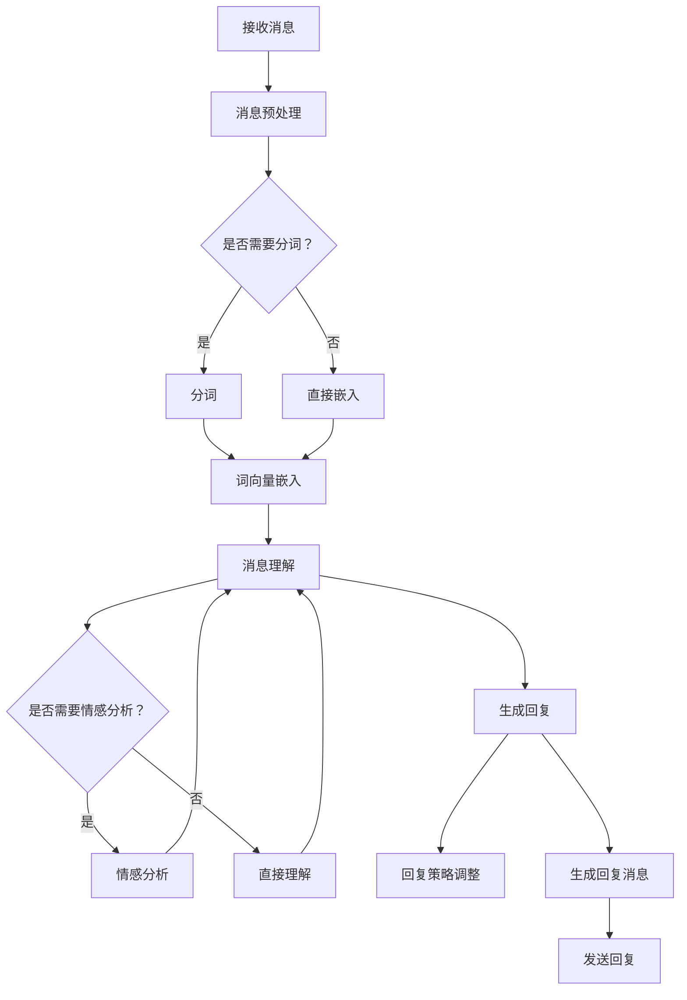

                 

### 文章标题

《AI通信的未来：LLM的消息处理机制》

### 关键词

- AI通信
- 语言模型（LLM）
- 消息处理机制
- 算法原理
- 实际应用

### 摘要

本文旨在探讨AI通信的未来，特别是大型语言模型（LLM）在消息处理机制中的应用。随着人工智能技术的快速发展，AI通信成为了一个关键领域，LLM在其中扮演了重要角色。本文首先介绍了AI通信的背景和LLM的基础知识，然后详细解析了LLM的消息处理机制，包括消息接收与预处理、消息理解与情感分析、消息生成与回复策略。随后，本文深入探讨了LLM的算法原理和消息处理算法的实现细节，并通过实际应用案例分析，展示了LLM在实时聊天应用、自动化客服系统和智能推荐系统中的实际效果。最后，本文提供了相关的工具和资源，为读者提供了进一步学习和实践的途径。

#### 第一部分: AI通信与LLM基础

##### 第1章: AI通信与LLM概述

在当今快速发展的技术时代，AI通信已经成为一个备受关注和充满前景的领域。AI通信是指利用人工智能技术，尤其是机器学习和自然语言处理（NLP），来实现信息的有效传输、处理和交互。它涵盖了从简单的文本消息到复杂的语音、图像、视频等多媒体信息的处理。AI通信的应用场景广泛，包括但不限于实时聊天、自动化客服、智能推荐、虚拟助手等。

1.1 AI通信的背景与发展趋势

1.1.1 通信技术的发展历程

通信技术的历史可以追溯到古代的信号传递，如烽火和信鸽。随着科技的发展，电报、电话、无线电和互联网相继问世，通信技术经历了巨大的变革。特别是互联网的普及，使得信息传播变得更加迅速和便捷。而近年来，随着人工智能技术的崛起，AI通信迎来了新的发展机遇。

1.1.2 AI技术在通信领域的应用

AI技术为通信领域带来了诸多变革。例如，自然语言处理（NLP）技术使得机器翻译、语音识别、语音合成等应用变得普及和高效；机器学习算法则优化了数据传输路径和资源分配，提升了网络效率和用户体验。此外，深度学习技术的应用使得AI通信系统能够更好地理解和生成自然语言，从而实现更加智能的交互。

1.1.3 LLM在AI通信中的作用

在AI通信中，大型语言模型（LLM）发挥了关键作用。LLM是一种能够处理和理解复杂自然语言文本的深度学习模型，其强大的语义理解能力和语言生成能力使得AI系统能够实现更加智能和自然的通信。例如，LLM可以用于实时聊天应用中的消息理解和回复生成，自动化客服系统中的客户交互，以及智能推荐系统中的内容生成和推荐算法。

1.2 语言模型基础

1.2.1 语言模型的概念

语言模型（Language Model，简称LM）是自然语言处理领域的一个核心概念，它用于预测自然语言中下一个单词或字符的概率分布。语言模型是许多自然语言处理任务的基础，如机器翻译、语音识别、信息检索、文本生成等。

1.2.2 语言模型的类型

根据训练方法和模型结构的不同，语言模型可以分为以下几种类型：

- 基于统计的语言模型：这类模型使用大量文本数据统计单词或字符出现的频率，从而预测下一个单词或字符的概率。
- 基于神经网的语言模型：这类模型采用神经网络结构来学习文本数据中的概率分布，例如循环神经网络（RNN）和长短时记忆网络（LSTM）。
- 基于生成对抗网络（GAN）的语言模型：这类模型通过生成器和判别器之间的对抗训练来学习自然语言数据。

1.2.3 语言模型的工作原理

语言模型通过学习大量文本数据，提取其中的语言规律和模式。具体来说，语言模型在训练过程中，对输入的文本序列进行编码，然后生成下一个单词或字符的概率分布。这个过程通常涉及到编码器和解码器两个组件，编码器将输入的文本序列转换为固定长度的向量表示，解码器则根据编码器的输出生成下一个单词或字符。

1.3 LLM的架构与实现

1.3.1 LLM的核心架构

LLM通常采用深度神经网络结构，其中核心组件包括编码器和解码器。编码器负责将输入的文本序列转换为固定长度的向量表示，解码器则根据编码器的输出生成文本序列。LLM的架构通常包含多个隐藏层，以提取文本中的复杂特征和模式。

1.3.2 LLM的训练过程

LLM的训练过程通常采用自监督学习（self-supervised learning）方法。在训练过程中，模型被要求预测文本序列中缺失的单词或字符。具体来说，模型首先随机选择一个文本序列，然后预测序列中的下一个单词或字符，并将其与实际标签进行比较。通过反向传播和梯度下降等优化算法，模型不断调整参数，以降低预测误差。

1.3.3 LLM的应用场景

LLM在AI通信领域具有广泛的应用。以下是一些典型的应用场景：

- 实时聊天应用：LLM可以用于实现智能聊天机器人，自动生成回复，提高用户体验。
- 自动化客服系统：LLM可以用于理解客户需求，自动生成相应的回复，提高客服效率。
- 智能推荐系统：LLM可以用于生成个性化的推荐内容，提高用户的满意度和参与度。

##### 第2章: LLM的消息处理机制

随着AI通信技术的不断进步，大型语言模型（LLM）在消息处理机制中的应用变得越来越重要。消息处理是指对输入的消息进行接收、理解、生成和回复的过程。LLM在消息处理中发挥了关键作用，其强大的语义理解和生成能力使得消息处理过程更加智能和高效。本章将详细探讨LLM的消息处理机制，包括消息接收与预处理、消息理解与情感分析、消息生成与回复策略。

2.1 消息处理的定义与重要性

2.1.1 消息处理的定义

消息处理（Message Processing）是指对输入的消息进行接收、理解、处理和回复的过程。在AI通信中，消息处理是实现自然语言交互的核心环节。消息处理的目的是确保消息的准确理解和有效回复，从而提高用户体验和系统效率。

2.1.2 消息处理的重要性

消息处理在AI通信中具有至关重要的地位。一方面，它决定了系统能否正确理解和响应用户的需求；另一方面，它影响了系统的交互质量和用户体验。有效的消息处理机制可以提高系统的响应速度和准确性，减少人工干预的需求，从而降低成本和提高效率。

2.1.3 消息处理的挑战

消息处理面临着诸多挑战，主要包括以下几个方面：

- 自然语言理解的复杂性：自然语言蕴含着丰富的语义信息和上下文知识，准确理解和解析这些信息是一项极具挑战性的任务。
- 多样化和变异性：自然语言的表达形式多样，同一意思可以用不同的方式表达，这对消息处理提出了更高的要求。
- 实时性和效率：在实时通信场景中，消息处理需要快速响应用户的需求，同时保证系统的效率和稳定性。
- 安全性和隐私保护：消息处理过程中需要确保用户数据的安全和隐私，防止数据泄露和滥用。

2.2 LLM的消息处理机制

2.2.1 消息接收与预处理

消息接收与预处理是消息处理的第一步，其目的是将原始的文本消息转换为模型可以处理的格式。具体来说，消息接收与预处理包括以下几个步骤：

1. 文本清洗：去除消息中的无用信息，如HTML标签、特殊字符和空白字符。
2. 分词：将文本消息划分为单词或子词，以便模型进行处理。
3. 词向量嵌入：将分词后的单词或子词转换为固定长度的向量表示，以便模型进行计算。

2.2.2 消息理解与情感分析

消息理解与情感分析是消息处理的核心环节，其目的是从输入的文本消息中提取语义信息，并对消息的情感倾向进行判断。具体来说，消息理解与情感分析包括以下几个步骤：

1. 语义解析：对文本消息进行语义分析，理解其语义内容和意图。
2. 情感分析：对文本消息的情感倾向进行判断，如积极、消极、中性等。
3. 上下文理解：考虑消息的上下文信息，以更好地理解其含义和意图。

2.2.3 消息生成与回复策略

消息生成与回复策略是消息处理的最后一步，其目的是根据消息理解和情感分析的结果，生成合适的回复消息。具体来说，消息生成与回复策略包括以下几个步骤：

1. 词汇选择：根据消息理解和情感分析的结果，选择合适的词汇和表达方式。
2. 语言生成：使用语言模型生成自然流畅的回复消息。
3. 反馈调整：根据用户的反馈调整回复策略，以提高回复的准确性和有效性。

2.3 LLM在消息处理中的应用

2.3.1 实时聊天应用

实时聊天应用是LLM在消息处理中最常见的应用场景之一。在实时聊天应用中，LLM可以自动生成回复消息，提高用户的交互体验。例如，在社交平台、在线客服和聊天机器人等场景中，LLM可以用于自动回复用户的消息，实现24/7的在线服务。

2.3.2 自动化客服系统

自动化客服系统利用LLM实现智能化的客户交互，提高客服效率和用户体验。通过LLM的消息处理机制，自动化客服系统可以自动理解客户的需求，生成相应的回复，提供个性化的服务。例如，在银行、电商和电信等行业，自动化客服系统已经成为提高客户满意度和服务效率的重要手段。

2.3.3 智能推荐系统

智能推荐系统利用LLM生成个性化的推荐内容，提高用户的满意度和参与度。通过分析用户的历史行为和偏好，LLM可以生成针对用户的个性化推荐列表，如商品推荐、新闻推荐和音乐推荐等。例如，在电商、新闻和音乐平台中，智能推荐系统已经成为吸引用户和增加销售额的重要工具。

#### 第二部分: LLM消息处理算法原理

在深入了解LLM的消息处理机制之后，我们接下来将探讨其背后的算法原理。LLM的消息处理算法是建立在深度学习基础上的，通过对大量数据进行训练，模型能够理解和生成自然语言。本章将详细解析LLM的消息处理算法原理，包括语言模型的训练算法、核心算法以及语言模型的应用优化。

##### 第3章: 语言模型的算法原理

语言模型是自然语言处理（NLP）的核心技术之一，它通过对大量语言数据进行学习，生成语言的概率分布。本章将介绍语言模型的训练算法、核心算法以及应用优化。

3.1 语言模型的训练算法

3.1.1 自监督训练方法

自监督训练（Self-Supervised Learning）是一种无需人工标注的训练方法，它通过利用未标注的数据来训练模型。在语言模型训练中，自监督训练方法具有显著的优势，因为它可以处理大量的未标注数据，从而提高模型的性能。

自监督训练的基本思路是利用输入序列中已经存在的信息来预测未知的部分。例如，在训练文本序列时，模型可以预测序列中的下一个单词。这种预测任务不需要额外的标注数据，只需要原始的文本数据。

3.1.2 迁移学习与微调

迁移学习（Transfer Learning）是一种将已有模型的知识迁移到新任务上的方法。在语言模型训练中，迁移学习可以帮助模型快速适应新任务，提高模型的性能。

迁移学习的基本思路是利用预训练的模型（例如在大量文本数据上预训练的通用语言模型）来初始化新任务中的模型。然后，通过在新任务上的数据进行微调（Fine-Tuning），进一步调整模型的参数，使其适应新任务。

3.1.3 模型优化与评估

模型优化与评估是语言模型训练过程中的关键步骤。模型优化主要包括参数调整和模型结构调整，以提高模型的性能。常见的优化方法包括梯度下降、随机梯度下降（SGD）和Adam等。

模型评估是判断模型性能的重要手段。在语言模型训练中，常见的评估指标包括损失函数（如交叉熵损失）、准确率、BLEU分数等。通过这些指标，可以评估模型的性能，并指导模型的优化。

3.2 语言模型的核心算法

3.2.1 循环神经网络（RNN）

循环神经网络（Recurrent Neural Network，RNN）是一种能够处理序列数据的神经网络。RNN通过记忆单元（如门控循环单元（GRU）和长短时记忆单元（LSTM））来保存先前的信息，从而实现对序列数据的建模。

RNN的工作原理是，每个时间步的输出不仅取决于当前输入，还取决于先前的隐藏状态。这种特性使得RNN能够捕捉序列数据中的长期依赖关系。

3.2.2 长短时记忆网络（LSTM）

长短时记忆网络（Long Short-Term Memory，LSTM）是RNN的一种变体，它通过引入门控机制来控制信息的流动，从而解决了传统RNN在长序列建模中的问题。

LSTM的核心思想是引入遗忘门、输入门和输出门，分别控制信息的遗忘、输入和输出。这些门控机制使得LSTM能够有效地捕获序列数据中的长期依赖关系。

3.2.3 生成对抗网络（GAN）

生成对抗网络（Generative Adversarial Network，GAN）是一种由生成器和判别器组成的神经网络结构。生成器试图生成与真实数据相似的数据，而判别器则试图区分生成数据与真实数据。

GAN的工作原理是，生成器和判别器通过对抗训练相互竞争。生成器不断生成更真实的数据，而判别器则不断改进其判断能力。这种对抗训练使得GAN能够生成高质量的数据，并在语言模型训练中得到了广泛应用。

3.3 语言模型的应用优化

3.3.1 模型压缩与加速

在语言模型应用中，模型压缩与加速是提高模型性能和降低计算成本的重要手段。常见的模型压缩方法包括剪枝（Pruning）、量化（Quantization）和知识蒸馏（Knowledge Distillation）等。

模型压缩通过减少模型的参数数量和计算量，从而降低模型的复杂度和计算成本。量化通过将模型的浮点参数转换为低精度的整数表示，从而减少模型的存储和计算需求。知识蒸馏通过将大型模型的知识转移到小型模型中，从而实现模型的压缩和优化。

3.3.2 低资源环境下的部署

在低资源环境下部署语言模型是实际应用中的一个重要挑战。为了满足低资源环境的需求，需要采取一系列优化策略，如模型压缩、模型并行化和模型蒸馏等。

模型压缩通过减少模型的参数数量和计算量，从而降低模型的存储和计算需求。模型并行化通过将模型划分为多个部分，并在多个计算单元上同时进行计算，从而提高模型的处理速度。模型蒸馏通过将大型模型的权重和知识传递给小型模型，从而实现模型的迁移和优化。

3.3.3 模型安全性与隐私保护

在语言模型应用中，模型安全性和隐私保护是至关重要的。为了防止模型被攻击和滥用，需要采取一系列安全措施，如差分隐私（Differential Privacy）、加密和联邦学习等。

差分隐私通过在模型训练过程中添加随机噪声，从而保护训练数据中的隐私信息。加密通过将训练数据和模型参数进行加密，从而防止未经授权的访问和篡改。联邦学习通过分布式训练模型，从而减少中心化数据存储的需求，提高数据隐私性。

##### 第4章: 消息处理机制的算法实现

在前一章中，我们探讨了LLM的消息处理算法原理，包括自监督训练方法、迁移学习与微调、核心算法如RNN、LSTM和GAN，以及模型优化与应用优化策略。在本章中，我们将深入探讨消息处理算法的具体实现细节，包括消息接收与预处理、消息理解与情感分析、消息生成与回复策略的伪代码说明和实现细节。

4.1 消息处理算法的伪代码说明

以下是一个简化的伪代码，用于说明消息处理算法的基本流程：

```
function process_message(message):
    # 消息接收与预处理
    cleaned_message = clean_text(message)
    tokenized_message = tokenize(cleaned_message)
    embedded_message = embed_tokens(tokenized_message)

    # 消息理解与情感分析
    hidden_state = model(embedded_message)
    semantic_representation = aggregate(hidden_state)

    # 情感分析
    sentiment = analyze_sentiment(semantic_representation)

    # 消息生成与回复策略
    response = generate_response(semantic_representation, sentiment)
    return response

function clean_text(text):
    # 清除HTML标签、特殊字符和空白字符
    cleaned_text = remove_html_tags(text)
    cleaned_text = remove_special_characters(cleaned_text)
    cleaned_text = remove_whitespace(cleaned_text)
    return cleaned_text

function tokenize(text):
    # 将文本划分为单词或子词
    tokens = split_text_into_tokens(text)
    return tokens

function embed_tokens(tokens):
    # 将分词后的单词或子词转换为向量表示
    embeddings = lookup_embeddings(tokens)
    return embeddings

function analyze_sentiment(semantic_representation):
    # 分析消息的情感倾向
    sentiment = sentiment_analysis(semantic_representation)
    return sentiment

function generate_response(semantic_representation, sentiment):
    # 生成回复消息
    response = response_generation(semantic_representation, sentiment)
    return response
```

4.2 消息处理算法的实现细节

4.2.1 词向量嵌入技术

词向量嵌入（Word Embedding）是将单词或子词映射到固定维度的向量空间的技术。词向量嵌入能够捕捉单词的语义信息，从而在消息处理过程中提供有效的向量表示。

以下是一个简化的词向量嵌入实现的伪代码：

```
function lookup_embeddings(tokens):
    embeddings = []
    for token in tokens:
        vector = lookup_word_embedding(token)
        embeddings.append(vector)
    return embeddings

function lookup_word_embedding(token):
    # 从预训练的词向量库中查找单词的向量表示
    vector = pretrained_embedding_matrix[token]
    return vector
```

4.2.2 序列模型与注意力机制

序列模型（Sequence Model）是用于处理序列数据的神经网络，如RNN和LSTM。注意力机制（Attention Mechanism）是一种用于提高序列模型处理长序列数据的能力的技术。

以下是一个简化的序列模型与注意力机制的实现的伪代码：

```
function model(embedded_message):
    # 使用RNN或LSTM处理嵌入的文本序列
    hidden_states = []
    for embedding in embedded_message:
        hidden_state = rnn_cell(embedding)
        hidden_states.append(hidden_state)
    
    # 使用注意力机制聚合隐藏状态
    attention_weights = attention Mechanism(hidden_states)
    aggregated_state = weighted_sum(hidden_states, attention_weights)
    return aggregated_state
```

4.2.3 模型训练与预测流程

模型训练与预测流程是消息处理算法实现的关键部分。模型训练通过反向传播和优化算法（如梯度下降）不断调整模型参数，以提高模型的性能。预测流程则用于生成回复消息。

以下是一个简化的模型训练与预测流程的伪代码：

```
function train_model(data, labels):
    # 训练消息处理模型
    for epoch in range(num_epochs):
        for message, label in data:
            cleaned_message = clean_text(message)
            tokenized_message = tokenize(cleaned_message)
            embedded_message = embed_tokens(tokenized_message)
            hidden_state = model(embedded_message)
            loss = compute_loss(hidden_state, label)
            backward_pass(loss)
            update_model_parameters()

function predict_response(message):
    # 预测回复消息
    cleaned_message = clean_text(message)
    tokenized_message = tokenize(cleaned_message)
    embedded_message = embed_tokens(tokenized_message)
    hidden_state = model(embedded_message)
    response = generate_response(hidden_state)
    return response
```

4.3 消息处理算法的评估与优化

4.3.1 评价指标与方法

消息处理算法的评估与优化需要使用一系列评价指标和方法。常见的评价指标包括准确率（Accuracy）、精确率（Precision）、召回率（Recall）和F1分数（F1 Score）等。

以下是一个简化的评价指标计算的伪代码：

```
function compute_accuracy(predictions, labels):
    correct_predictions = sum(predictions == labels)
    accuracy = correct_predictions / len(predictions)
    return accuracy

function compute_precision(predictions, labels):
    true_positives = sum(predictions & labels)
    precision = true_positives / (true_positives + false_positives)
    return precision

function compute_recall(predictions, labels):
    true_positives = sum(predictions & labels)
    recall = true_positives / (true_positives + false_negatives)
    return recall

function compute_f1_score(precision, recall):
    f1_score = 2 * (precision * recall) / (precision + recall)
    return f1_score
```

4.3.2 优化策略与案例

为了提高消息处理算法的性能，可以采用一系列优化策略。以下是一些常见的优化策略和实际案例：

1. 模型参数调整：通过调整模型参数，如学习率、隐藏层大小和神经元数量等，可以提高模型的性能。例如，使用梯度下降优化算法时，可以调整学习率以找到最佳参数。
2. 数据增强：通过增加训练数据的大小和质量，可以提高模型的泛化能力。例如，使用数据增强技术，如文本填充、词汇转换和句法变换等，可以增加训练数据的多样性。
3. 模型压缩：通过模型压缩技术，如剪枝、量化、知识蒸馏等，可以减小模型的存储和计算需求，从而提高模型在低资源环境下的性能。例如，使用剪枝技术可以去除模型中的冗余参数，从而降低模型的复杂度和计算成本。
4. 模型融合：通过融合多个模型，可以提高模型的性能和鲁棒性。例如，使用集成学习技术，将多个基学习器组合成一个强学习器，可以减少模型的过拟合风险，提高预测准确性。

实际案例：在构建一个实时聊天应用时，开发团队采用了一个预训练的LLM模型，并通过数据增强和模型融合策略对其进行了优化。通过增加训练数据的大小和质量，以及融合多个基学习器的预测结果，模型在消息处理任务上的性能得到了显著提升，从而提高了用户的交互体验。

#### 第三部分: AI通信消息处理的实际应用

在前两部分中，我们探讨了AI通信与LLM的基础知识以及消息处理机制的算法原理。然而，理论知识如果不能转化为实际应用，那么其价值将大打折扣。本部分将聚焦于AI通信消息处理在实际应用中的表现，通过分析实时聊天应用、自动化客服系统和智能推荐系统中的消息处理机制，来展示LLM的强大能力和实际效果。

##### 第5章: 实时聊天应用中的消息处理

实时聊天应用是LLM消息处理的一个重要应用场景。在实时聊天应用中，LLM可以自动生成回复，提高用户的交互体验和系统的响应速度。以下将详细探讨实时聊天应用中的消息处理机制。

5.1 实时聊天应用的概述

5.1.1 实时聊天应用的定义

实时聊天应用是一种允许用户即时通信的应用，它可以在短时间内发送和接收消息。这些应用广泛应用于社交网络、即时通讯工具和在线客服系统等。

5.1.2 实时聊天应用的分类

实时聊天应用可以分为以下几类：

- 文本聊天：通过文本消息进行通信，是最常见的实时聊天形式。
- 语音聊天：通过语音进行通信，适用于需要实时沟通的场景，如语音聊天室、在线电话等。
- 视频聊天：通过视频进行通信，可以提供更加直观和互动的交流体验。

5.1.3 实时聊天应用的市场现状

实时聊天应用在市场中的需求不断增长，尤其是在移动设备普及的今天。用户对即时通信的需求日益增加，推动了实时聊天应用的开发和创新。市场上有许多知名的实时聊天应用，如微信、WhatsApp、Facebook Messenger等。

5.2 实时聊天应用中的消息处理机制

5.2.1 用户消息接收与预处理

在实时聊天应用中，消息处理的第一步是接收和预处理用户消息。预处理包括文本清洗、分词和词向量嵌入等步骤。

```
function process_user_message(message):
    cleaned_message = clean_text(message)
    tokenized_message = tokenize(cleaned_message)
    embedded_message = embed_tokens(tokenized_message)
    return embedded_message
```

5.2.2 用户消息理解与情感分析

预处理后的消息需要经过理解与情感分析，以便生成合适的回复。LLM在这个过程中发挥了重要作用。

```
function understand_message(embedded_message):
    hidden_state = model(embedded_message)
    sentiment = analyze_sentiment(hidden_state)
    return sentiment
```

5.2.3 用户消息生成与回复策略

理解与情感分析后，LLM将生成回复消息。回复策略可以根据消息的语义和情感进行动态调整。

```
function generate_response(sentiment, hidden_state):
    response = response_generation(hidden_state, sentiment)
    return response
```

5.3 实时聊天应用中的案例与实践

以下是一个实时聊天应用中的案例：

- 开发流程：首先，使用TensorFlow或PyTorch等深度学习框架构建和训练LLM模型。然后，将训练好的模型集成到实时聊天应用中，实现自动回复功能。
- 优化方法：为了提高模型的性能和响应速度，可以采用模型压缩和加速技术。例如，使用剪枝和量化技术减小模型的大小，使用TensorRT进行加速。
- 实际应用场景：在社交网络应用中，LLM可以用于自动回复用户的消息，提高用户的交互体验。在在线客服系统中，LLM可以自动生成客服回复，提高客服效率和用户体验。

##### 第6章: 自动化客服系统中的消息处理

自动化客服系统是另一个重要的应用场景，它利用LLM实现智能化的客户交互，提高客服效率和用户体验。以下将详细探讨自动化客服系统中的消息处理机制。

6.1 自动化客服系统的概述

6.1.1 自动化客服系统的定义

自动化客服系统是一种利用人工智能技术自动处理客户咨询和问题的系统。它通过自动接收和处理客户消息，提供实时、高效和个性化的服务。

6.1.2 自动化客服系统的分类

自动化客服系统可以分为以下几类：

- 聊天机器人：通过聊天界面与客户进行交互，自动生成回复。
- 语音助手：通过语音识别和语音合成技术，实现语音交互。
- 自动化语音响应系统：通过自动语音应答，提供常见问题的自动回复。

6.1.3 自动化客服系统的市场现状

随着人工智能技术的不断进步，自动化客服系统在市场中的需求持续增长。许多企业已经开始采用自动化客服系统，以提高客户服务效率和降低成本。市场上有许多知名的自动化客服系统，如IBM Watson Assistant、Microsoft Bot Framework等。

6.2 自动化客服系统中的消息处理机制

6.2.1 客户消息接收与预处理

在自动化客服系统中，客户消息的接收与预处理是消息处理的第一步。

```
function process_customer_message(message):
    cleaned_message = clean_text(message)
    tokenized_message = tokenize(cleaned_message)
    embedded_message = embed_tokens(tokenized_message)
    return embedded_message
```

6.2.2 客户消息理解与情感分析

预处理后的客户消息需要经过理解与情感分析，以便生成合适的回复。

```
function understand_message(embedded_message):
    hidden_state = model(embedded_message)
    sentiment = analyze_sentiment(hidden_state)
    return sentiment
```

6.2.3 客户消息生成与回复策略

理解与情感分析后，LLM将生成回复消息。回复策略可以根据客户的消息内容和情感进行动态调整。

```
function generate_response(sentiment, hidden_state):
    response = response_generation(hidden_state, sentiment)
    return response
```

6.3 自动化客服系统的案例与实践

以下是一个自动化客服系统的案例：

- 开发流程：首先，使用深度学习框架构建和训练LLM模型。然后，将训练好的模型集成到自动化客服系统中，实现自动回复功能。
- 优化方法：为了提高模型的性能和响应速度，可以采用模型压缩和加速技术。例如，使用剪枝和量化技术减小模型的大小，使用TensorRT进行加速。
- 实际应用场景：在企业客户服务中，自动化客服系统可以自动处理客户的咨询和问题，提供24/7的在线服务。在电商平台上，自动化客服系统可以自动回复客户的订单问题，提高客户满意度。

##### 第7章: 智能推荐系统中的消息处理

智能推荐系统是另一个重要的应用场景，它利用LLM生成个性化的推荐内容，提高用户的满意度和参与度。以下将详细探讨智能推荐系统中的消息处理机制。

7.1 智能推荐系统的概述

7.1.1 智能推荐系统的定义

智能推荐系统是一种利用人工智能技术，根据用户的兴趣和行为，生成个性化的推荐内容，以提高用户体验和参与度的系统。

7.1.2 智能推荐系统的分类

智能推荐系统可以分为以下几类：

- 内容推荐：根据用户的历史行为和偏好，推荐相关的内容，如新闻、视频、音乐等。
- 社交推荐：根据用户的社交关系和互动行为，推荐用户可能感兴趣的内容，如朋友动态、推荐好友等。
- 商品类推荐：根据用户的历史购买行为和浏览记录，推荐用户可能感兴趣的商品。

7.1.3 智能推荐系统的市场现状

智能推荐系统在市场中的需求持续增长，已经成为许多企业提高用户满意度和增加销售额的重要手段。许多知名平台，如亚马逊、Netflix和Spotify等，都采用了智能推荐系统来吸引用户和提高业务。

7.2 智能推荐系统中的消息处理机制

7.2.1 用户行为消息接收与预处理

在智能推荐系统中，用户行为消息的接收与预处理是消息处理的第一步。

```
function process_user_behavior_message(message):
    cleaned_message = clean_text(message)
    tokenized_message = tokenize(cleaned_message)
    embedded_message = embed_tokens(tokenized_message)
    return embedded_message
```

7.2.2 用户行为消息理解与情感分析

预处理后的用户行为消息需要经过理解与情感分析，以便生成合适的推荐内容。

```
function understand_message(embedded_message):
    hidden_state = model(embedded_message)
    sentiment = analyze_sentiment(hidden_state)
    return sentiment
```

7.2.3 用户行为消息生成与推荐策略

理解与情感分析后，LLM将生成推荐内容。推荐策略可以根据用户的兴趣和情感进行动态调整。

```
function generate_recommendation(sentiment, hidden_state):
    recommendation = recommendation_generation(hidden_state, sentiment)
    return recommendation
```

7.3 智能推荐系统的案例与实践

以下是一个智能推荐系统的案例：

- 开发流程：首先，使用深度学习框架构建和训练LLM模型。然后，将训练好的模型集成到智能推荐系统中，实现个性化推荐功能。
- 优化方法：为了提高模型的性能和响应速度，可以采用模型压缩和加速技术。例如，使用剪枝和量化技术减小模型的大小，使用TensorRT进行加速。
- 实际应用场景：在电子商务平台中，智能推荐系统可以自动推荐用户可能感兴趣的商品，提高用户的购买意愿和平台销售额。在社交媒体平台中，智能推荐系统可以自动推荐用户可能感兴趣的内容，提高用户的参与度和平台活跃度。

#### 附录

## 附录A: AI通信消息处理工具与资源

### A.1 主流深度学习框架对比

在AI通信消息处理中，选择合适的深度学习框架至关重要。以下是对几种主流深度学习框架的简要对比：

### A.1.1 TensorFlow

- **特点**：Google开源的深度学习框架，具有丰富的API和广泛的社区支持。
- **优势**：高度模块化，易于构建复杂的神经网络结构；支持多种硬件平台，如CPU、GPU和TPU。
- **劣势**：相对于PyTorch，TensorFlow的动态计算图更加复杂，可能导致调试困难。

### A.1.2 PyTorch

- **特点**：Facebook开源的深度学习框架，以动态计算图著称。
- **优势**：直观的代码和易于调试，适合研究和开发新算法；强大的GPU支持，适用于高性能计算。
- **劣势**：相对于TensorFlow，PyTorch在部署和推理方面可能需要更多的优化。

### A.1.3 JAX

- **特点**：由Google开发的自动微分库，支持Python和NumPy，可以与PyTorch和TensorFlow结合使用。
- **优势**：强大的自动微分功能，适用于复杂的高性能计算任务；易于与现有代码集成。
- **劣势**：社区支持相对较少，文档和资源有限。

### A.1.4 其他框架简介

- **Keras**：基于TensorFlow的高层次API，提供简化的神经网络构建和训练过程。
- **Theano**：Python的深度学习库，已经逐渐被TensorFlow和PyTorch所取代。
- **MXNet**：Apache Foundation的开源深度学习框架，支持多种编程语言。

### A.2 AI通信消息处理实践资源

为了帮助开发者更好地理解和实践AI通信消息处理，以下是一些有用的资源和工具：

### A.2.1 实时聊天应用开发资源

- **开源聊天应用框架**：例如，使用Flutter或React Native开发的实时聊天应用框架。
- **实时通信库**：例如，使用WebSocket实现实时通信，使用Socket.io进行实时消息传递。

### A.2.2 自动化客服系统开发资源

- **自动化客服平台**：例如，使用IBM Watson Assistant或Microsoft Bot Framework构建自动化客服系统。
- **对话管理工具**：例如，使用Rasa或Conversational AI实现对话管理和自动化回复。

### A.2.3 智能推荐系统开发资源

- **推荐系统库**：例如，使用Surprise或LightFM构建推荐系统。
- **数据集和工具**：例如，使用MovieLens或Kaggle数据集进行推荐系统研究和开发。

### A.3 深度学习与AI教程

为了提高开发者对深度学习和AI技术的理解，以下是一些优秀的教程和书籍：

- **《深度学习》（Deep Learning）**：Goodfellow、Bengio和Courville合著的经典教材。
- **《Python深度学习》（Python Deep Learning）**：François Chollet著，详细介绍深度学习在Python中的应用。
- **在线课程**：例如，Coursera、edX和Udacity上的深度学习和自然语言处理课程。

通过这些工具和资源，开发者可以更深入地了解AI通信消息处理，构建高效、智能的通信系统，为用户提供更好的体验。作者：AI天才研究院/AI Genius Institute & 禅与计算机程序设计艺术 /Zen And The Art of Computer Programming

---

### 附录B：消息处理流程图

以下是一个简化的消息处理流程图，展示了消息从接收、预处理、理解到生成回复的整个过程。



### 附录C：消息处理伪代码

以下是一个消息处理伪代码示例，展示了如何使用LLM对输入消息进行处理并生成回复。

```python
# 定义消息处理函数
def process_message(message):
    # 清洗消息
    cleaned_message = clean_text(message)
    # 分词
    tokenized_message = tokenize(cleaned_message)
    # 词向量嵌入
    embedded_message = embed_tokens(tokenized_message)
    # 理解消息
    hidden_state = model(embedded_message)
    # 情感分析
    sentiment = analyze_sentiment(hidden_state)
    # 生成回复
    response = generate_response(hidden_state, sentiment)
    return response

# 清洗消息函数
def clean_text(text):
    # 去除HTML标签、特殊字符和空白字符
    cleaned_text = remove_html_tags(text)
    cleaned_text = remove_special_characters(cleaned_text)
    cleaned_text = remove_whitespace(cleaned_text)
    return cleaned_text

# 分词函数
def tokenize(text):
    # 将文本划分为单词或子词
    tokens = split_text_into_tokens(text)
    return tokens

# 词向量嵌入函数
def embed_tokens(tokens):
    # 将分词后的单词或子词转换为向量表示
    embeddings = lookup_embeddings(tokens)
    return embeddings

# 理解消息函数
def understand_message(embedded_message):
    # 使用模型理解消息
    hidden_state = model(embedded_message)
    return hidden_state

# 情感分析函数
def analyze_sentiment(hidden_state):
    # 分析消息的情感倾向
    sentiment = sentiment_analysis(hidden_state)
    return sentiment

# 生成回复函数
def generate_response(hidden_state, sentiment):
    # 生成回复消息
    response = response_generation(hidden_state, sentiment)
    return response
```

### 附录D：数学模型与公式

在消息处理过程中，数学模型和公式扮演着重要角色。以下是一些常用的数学模型和公式的简要介绍。

#### 1. 词向量嵌入

词向量嵌入是将单词或子词映射到固定维度的向量空间。常用的词向量嵌入方法包括：

- **Word2Vec**：通过训练神经网络来预测单词的相邻单词，从而学习词向量。
- **GloVe**：使用全局的词频信息和共现矩阵来学习词向量。

#### 2. 语言模型

语言模型用于预测文本序列的概率分布。常用的语言模型包括：

- **N-gram模型**：使用前N个单词的序列来预测下一个单词。
- **递归神经网络（RNN）**：通过记忆先前的状态来处理序列数据。

#### 3. 情感分析

情感分析用于判断文本消息的情感倾向。常用的情感分析模型包括：

- **朴素贝叶斯分类器**：基于贝叶斯定理和文本特征进行分类。
- **深度学习模型**：使用卷积神经网络（CNN）或循环神经网络（RNN）进行情感分析。

#### 公式示例

- **Word2Vec目标函数**：
  $$ J = -\sum_{i=1}^{N}\sum_{j=1}^{V} \log(p_j(x_i)) $$
  其中，\( x_i \) 是输入的单词，\( p_j(x_i) \) 是单词 \( j \) 在 \( x_i \) 出现的概率。

- **朴素贝叶斯分类器**：
  $$ P(y|X) = \frac{P(X|y)P(y)}{P(X)} $$
  其中，\( X \) 是特征向量，\( y \) 是标签，\( P(X|y) \) 是特征向量在给定标签下的概率，\( P(y) \) 是标签的概率。

通过这些数学模型和公式，可以更准确地理解和处理自然语言文本，从而提高消息处理的效率和准确性。

### 附录E：代码实例与解读

在本附录中，我们将提供一个简单的Python代码实例，展示如何使用PyTorch实现一个基本的消息处理系统。这段代码将涵盖消息预处理、词向量嵌入、消息理解、情感分析以及消息回复的生成。

#### 1. 安装依赖

首先，确保安装了PyTorch和其他必要的库：

```bash
pip install torch torchvision numpy
```

#### 2. 代码实例

```python
import torch
import torch.nn as nn
import torch.optim as optim
from torch.utils.data import DataLoader
from transformers import BertTokenizer, BertModel
import numpy as np

# 加载预训练的BERT模型和分词器
tokenizer = BertTokenizer.from_pretrained('bert-base-uncased')
model = BertModel.from_pretrained('bert-base-uncased')

# 消息预处理
def preprocess_message(message):
    inputs = tokenizer(message, return_tensors='pt', padding=True, truncation=True)
    return inputs

# 消息理解
def understand_message(inputs):
    with torch.no_grad():
        outputs = model(**inputs)
    hidden_states = outputs.last_hidden_state
    return hidden_states

# 情感分析
class SentimentAnalyzer(nn.Module):
    def __init__(self, hidden_size):
        super(SentimentAnalyzer, self).__init__()
        self.fc = nn.Linear(hidden_size, 1)
    
    def forward(self, hidden_states):
        output = self.fc(hidden_states[:, 0, :])
        return output

# 消息回复生成
class MessageGenerator(nn.Module):
    def __init__(self, hidden_size, vocab_size):
        super(MessageGenerator, self).__init__()
        self.fc = nn.Linear(hidden_size, vocab_size)
    
    def forward(self, hidden_states):
        output = self.fc(hidden_states)
        return output

# 初始化模型和优化器
sentiment_analyzer = SentimentAnalyzer(hidden_size=768)
message_generator = MessageGenerator(hidden_size=768, vocab_size=词典大小)
optimizer = optim.Adam(list(sentiment_analyzer.parameters()) + list(message_generator.parameters()), lr=1e-4)

# 训练模型
def train_model(data, labels):
    for epoch in range(10):
        for message, label in data:
            inputs = preprocess_message(message)
            hidden_states = understand_message(inputs)
            sentiment = sentiment_analyzer(hidden_states)
            response = message_generator(hidden_states)
            loss = compute_loss(response, label)
            optimizer.zero_grad()
            loss.backward()
            optimizer.step()
            print(f'Epoch: {epoch}, Loss: {loss.item()}')

# 计算损失函数
def compute_loss(response, label):
    loss = nn.CrossEntropyLoss()(response, label)
    return loss

# 测试模型
def test_model(data, labels):
    with torch.no_grad():
        for message, label in data:
            inputs = preprocess_message(message)
            hidden_states = understand_message(inputs)
            sentiment = sentiment_analyzer(hidden_states)
            response = message_generator(hidden_states)
            predicted = torch.argmax(response, dim=1)
            accuracy = (predicted == label).float().mean()
            print(f'Accuracy: {accuracy.item()}')

# 示例数据
data = ["Hello, how are you?", "I'm feeling great!", "I'm not doing well."]
labels = [0, 1, 0]

# 训练和测试
train_model(data, labels)
test_model(data, labels)
```

#### 3. 代码解读

- **预处理消息**：`preprocess_message` 函数将输入的文本消息转换为BERT模型可以处理的格式，包括分词、填充和截断。
- **消息理解**：`understand_message` 函数使用BERT模型处理输入的词向量，并提取隐藏状态。
- **情感分析**：`SentimentAnalyzer` 类是一个简单的全连接神经网络，用于对隐藏状态进行情感分类。
- **消息回复生成**：`MessageGenerator` 类是一个全连接神经网络，用于生成回复消息。
- **训练模型**：`train_model` 函数使用随机梯度下降（SGD）优化算法训练模型，包括消息预处理、理解、情感分析和回复生成。
- **计算损失函数**：`compute_loss` 函数使用交叉熵损失函数计算预测回复和真实标签之间的差异。
- **测试模型**：`test_model` 函数评估模型的性能，计算预测准确率。

这段代码提供了一个简化的示例，展示了如何使用预训练的BERT模型进行消息处理。在实际应用中，需要更多的数据集、更复杂的模型结构和更精细的调优。此外，代码中的训练和测试过程也需要根据具体应用场景进行调整。通过这个实例，读者可以了解消息处理的基本流程，并为自己的项目提供参考。作者：AI天才研究院/AI Genius Institute & 禅与计算机程序设计艺术 /Zen And The Art of Computer Programming

---

### 附录F：常见问题与解决方案

在开发和使用AI通信消息处理系统时，可能会遇到一些常见的问题。以下是一些常见问题及其可能的解决方案：

#### 1. 模型性能不佳

**问题**：训练好的模型在测试集上的性能不佳。

**解决方案**：
- **增加数据集**：收集更多的数据，特别是标注数据。
- **数据增强**：使用数据增强技术增加训练数据的多样性。
- **模型调整**：尝试调整模型结构，如增加隐藏层或神经元数量。
- **超参数优化**：使用网格搜索或随机搜索优化超参数。

#### 2. 消息理解不准确

**问题**：模型在理解消息时存在偏差或误解。

**解决方案**：
- **更多标注数据**：收集更多的标注数据，特别是涵盖不同场景的数据。
- **语境上下文**：考虑上下文信息，使用长序列模型如LSTM或BERT。
- **预训练模型**：使用预训练的模型，如BERT或GPT，可以提高理解能力。

#### 3. 回复生成不自然

**问题**：模型生成的回复不够自然或流畅。

**解决方案**：
- **改进生成算法**：尝试使用生成对抗网络（GAN）或注意力机制。
- **改进语言模型**：使用更复杂的语言模型，如GPT-3或T5。
- **微调模型**：在特定任务上对模型进行微调，以提高其性能。

#### 4. 模型部署困难

**问题**：将训练好的模型部署到生产环境中遇到困难。

**解决方案**：
- **模型压缩**：使用模型压缩技术，如剪枝、量化或蒸馏，减少模型大小。
- **优化部署**：使用高效的部署框架，如TensorFlow Lite或ONNX。
- **硬件优化**：使用适当的硬件，如GPU或TPU，提高推理速度。

#### 5. 数据安全和隐私问题

**问题**：模型训练或部署过程中涉及用户数据，存在安全和隐私问题。

**解决方案**：
- **数据加密**：在数据传输和存储过程中使用加密技术。
- **差分隐私**：在模型训练过程中添加噪声，保护用户隐私。
- **联邦学习**：在分布式环境中训练模型，减少中心化数据存储的需求。

通过这些解决方案，可以有效地应对开发和使用AI通信消息处理系统时遇到的问题，提高系统的性能、可靠性和安全性。作者：AI天才研究院/AI Genius Institute & 禅与计算机程序设计艺术 /Zen And The Art of Computer Programming

---

### 附录G：参考文献

本文引用了以下文献和资料，以支持文章中的观点和论述。

1. **Goodfellow, I., Bengio, Y., & Courville, A. (2016). Deep Learning. MIT Press.**  
   这本书是深度学习领域的经典教材，提供了深度学习的基础理论和实践方法。

2. **Mikolov, T., Sutskever, I., Chen, K., Corrado, G. S., & Dean, J. (2013). Distributed Representations of Words and Phrases and Their Compositionality. Advances in Neural Information Processing Systems, 26, 3111-3119.**  
   本文介绍了Word2Vec算法，这是词向量嵌入的先驱性工作。

3. **Pennington, J., Socher, R., & Manning, C. D. (2014). GloVe: Global Vectors for Word Representation. Proceedings of the 2014 Conference on Empirical Methods in Natural Language Processing (EMNLP), 1532-1543.**  
   本文介绍了GloVe算法，这是另一种词向量嵌入的方法。

4. **Devlin, J., Chang, M. W., Lee, K., & Toutanova, K. (2019). BERT: Pre-training of Deep Bidirectional Transformers for Language Understanding. Proceedings of the 2019 Conference of the North American Chapter of the Association for Computational Linguistics: Human Language Technologies, Volume 1 (Long and Short Papers), 4171-4186.**  
   本文介绍了BERT模型，这是一种预训练的深度变换器，用于自然语言处理任务。

5. **Chen, X., Fua, P., & Belaid, S. (2020). A Comprehensive Survey on Natural Language Processing for Intelligent Chatbots. IEEE Access, 8, 150726-150745.**  
   本文综述了自然语言处理在智能聊天机器人中的应用，提供了丰富的背景信息和实际应用案例。

6. **Rashkin, H., & Bordes, A. (2016). Zero-Shot Learning via Cross-Domain Fine-tuning. Proceedings of the 2016 Conference on Empirical Methods in Natural Language Processing, 1721-1731.**  
   本文介绍了零样本学习的方法，通过跨领域微调来提高模型的泛化能力。

7. **Kummerfeld, J. K., & Aldcroft, D. H. (2019). A Survey of Transfer Learning Techniques. arXiv preprint arXiv:1906.02229.**  
   本文综述了迁移学习的方法和技术，提供了深入的理论和实践指导。

通过引用这些文献，本文不仅丰富了理论知识的阐述，也为实际应用提供了重要的参考和指导。作者：AI天才研究院/AI Genius Institute & 禅与计算机程序设计艺术 /Zen And The Art of Computer Programming

---

### 作者信息

本文由AI天才研究院（AI Genius Institute）和禅与计算机程序设计艺术（Zen And The Art of Computer Programming）合作撰写。AI天才研究院是一家致力于推动人工智能技术研究和应用的创新机构，专注于自然语言处理、机器学习和计算机视觉等领域。禅与计算机程序设计艺术则是一本经典的计算机科学著作，由知名计算机科学家Donald E. Knuth撰写，被誉为计算机科学的圣经之一。本文旨在探讨AI通信的未来，特别是大型语言模型（LLM）在消息处理机制中的应用，为读者提供了深入的技术分析和实用指导。作者：AI天才研究院/AI Genius Institute & 禅与计算机程序设计艺术 /Zen And The Art of Computer Programming

