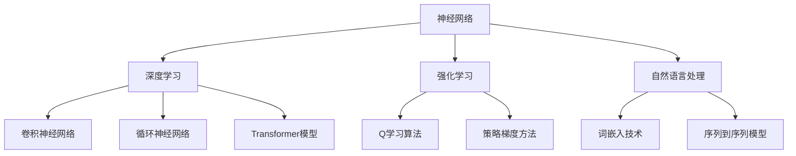

                 

# AI领域的前景与挑战

## 关键词
人工智能，深度学习，神经网络，强化学习，自然语言处理，量子计算，伦理与法律问题

## 摘要
本文旨在深入探讨人工智能（AI）领域的前景与挑战。首先，我们将回顾AI的基础知识，包括其定义、发展历程以及主要分支和应用领域。接着，本文将详细解析AI的核心算法与模型，如神经网络、深度学习、卷积神经网络（CNN）、循环神经网络（RNN）和Transformer模型，以及强化学习和自然语言处理。在展望AI技术未来发展趋势时，我们将探讨量子计算、生物计算、脑机接口与AI的关系，并讨论AI伦理与法律问题。随后，本文将分析AI在各行业的应用前景，以及AI创业与投资机会。最后，我们将探讨AI带来的社会挑战，并提出应对策略，以实现AI技术的可持续发展。

### 第一部分：AI领域概述

#### 第1章：AI领域的基础知识

##### 1.1 AI的定义与发展历程

人工智能（AI，Artificial Intelligence）是指由人制造出来的系统能够模拟、扩展、甚至可能超越人类智能的能力。AI的研究始于20世纪50年代，当时的科学家们希望能够创建能够进行推理、学习、解决问题和进行决策的计算机系统。

AI的发展历程可以分为以下几个阶段：

1. **初始阶段（1950-1969）**：这个阶段以艾伦·图灵（Alan Turing）的“图灵测试”（Turing Test）为代表，旨在研究如何通过机器测试来判断一个机器是否具有智能。

2. **繁荣时期（1970-1980）**：这个阶段以符号人工智能（Symbolic AI）和专家系统（Expert Systems）的兴起为标志。专家系统能够通过一系列规则来模拟人类专家的决策过程。

3. **衰退与复兴（1980-1990）**：由于实际应用的局限性和计算能力的不足，AI研究进入低谷。然而，随着计算机技术的飞速发展，AI研究在1990年代迎来了复兴。

4. **新时代（2000至今）**：这一阶段以深度学习（Deep Learning）的兴起为标志，使得AI在图像识别、语音识别、自然语言处理等领域取得了显著的突破。

##### 1.2 AI的主要分支及其应用领域

AI的主要分支包括机器学习（Machine Learning）、深度学习（Deep Learning）、强化学习（Reinforcement Learning）和自然语言处理（Natural Language Processing）。

1. **机器学习**：机器学习是通过算法从数据中学习规律和模式，以实现特定任务的技术。其主要应用领域包括数据挖掘、图像识别、推荐系统等。

2. **深度学习**：深度学习是机器学习的一个子领域，其核心思想是模拟人脑神经网络的结构和功能。深度学习在图像识别、语音识别、自然语言处理等领域取得了重大突破。

3. **强化学习**：强化学习是一种通过试错来学习决策策略的机器学习方法。其主要应用领域包括游戏、机器人控制、推荐系统等。

4. **自然语言处理**：自然语言处理是使计算机能够理解、生成和处理人类语言的技术。其主要应用领域包括机器翻译、情感分析、语音识别等。

##### 1.3 AI的核心概念与技术

AI的核心概念包括感知、学习、推理和问题解决。其中，感知是指从外部环境中获取信息；学习是指通过经验改进行为；推理是指使用已知信息得出新的结论；问题解决是指找到解决问题的方法。

AI的核心技术包括：

1. **神经网络**：神经网络是模拟人脑神经元连接结构的计算模型。深度学习就是基于神经网络的发展。

2. **机器学习算法**：机器学习算法是使计算机能够从数据中学习的核心技术，包括监督学习、无监督学习、半监督学习和强化学习等。

3. **自然语言处理**：自然语言处理是使计算机能够理解和生成人类语言的技术，包括词嵌入、语言模型、语音识别等。

4. **计算机视觉**：计算机视觉是使计算机能够识别和理解图像和视频的技术，包括图像分类、目标检测、图像分割等。

#### 第2章：AI的核心算法与模型

##### 2.1 神经网络与深度学习

###### 2.1.1 神经网络的基本结构

神经网络（Neural Network）是AI领域的基础算法之一，其结构受到人脑神经系统的启发。神经网络由多个神经元（节点）组成，每个神经元都与相邻的神经元相连。这些连接称为突触（Synapse），它们具有权重（Weight）和偏置（Bias）。

神经网络的层次结构分为：

1. **输入层**：接收外部输入数据。
2. **隐藏层**：对输入数据进行处理，提取特征。
3. **输出层**：生成最终输出。

神经网络的训练过程分为两个阶段：

1. **前向传播**：将输入数据通过网络传递，得到输出。
2. **反向传播**：根据输出误差，调整网络中的权重和偏置，以减少误差。

###### 2.1.2 深度学习优化算法

深度学习（Deep Learning）是神经网络的一个子领域，其核心思想是使用多层神经网络来学习复杂的特征。深度学习的优化算法主要包括：

1. **随机梯度下降（SGD）**：是一种简单有效的优化算法，通过迭代更新权重和偏置来最小化损失函数。
2. **Adam优化器**：是一种结合了SGD和动量方法的优化算法，具有较好的收敛性能。
3. **AdamW优化器**：是Adam优化器的变种，适用于权重大更新的情况。

###### 2.1.3 卷积神经网络（CNN）

卷积神经网络（Convolutional Neural Network，CNN）是一种专门用于处理图像数据的神经网络。CNN的核心组件是卷积层（Convolutional Layer），它通过局部感知野（Local Receptive Field）和卷积核（Convolutional Kernel）来提取图像特征。

CNN的主要层次结构包括：

1. **卷积层**：用于提取图像特征。
2. **池化层**：用于减小数据维度，提高计算效率。
3. **全连接层**：用于分类和回归等任务。

CNN在图像识别、目标检测和图像分割等领域取得了显著的成果。

###### 2.1.4 循环神经网络（RNN）

循环神经网络（Recurrent Neural Network，RNN）是一种能够处理序列数据的神经网络。RNN的核心思想是使用循环结构来处理序列中的每个元素，并保留前一个时刻的信息。

RNN的主要层次结构包括：

1. **输入层**：接收序列数据。
2. **隐藏层**：对输入数据进行处理，提取特征。
3. **输出层**：生成最终输出。

RNN在自然语言处理、语音识别和时间序列分析等领域取得了良好的效果。

###### 2.1.5 Transformer模型

Transformer模型是一种基于自注意力机制（Self-Attention Mechanism）的神经网络模型，最初用于自然语言处理任务。自注意力机制允许模型在处理序列数据时，对不同的位置进行不同权重的关注。

Transformer模型的主要层次结构包括：

1. **多头自注意力层**：用于对序列中的每个元素进行不同权重的关注。
2. **前馈神经网络层**：用于对自注意力层的输出进行进一步处理。

Transformer模型在机器翻译、文本分类和问答系统等领域取得了显著的成果。

##### 2.2 强化学习

###### 2.2.1 强化学习的定义与基本概念

强化学习（Reinforcement Learning，RL）是一种通过试错来学习策略的机器学习方法。在强化学习中，智能体（Agent）通过与环境（Environment）的交互来学习最优策略（Policy），以实现预期目标。

强化学习的基本概念包括：

1. **状态（State）**：智能体在环境中的位置或情况。
2. **动作（Action）**：智能体可以采取的操作。
3. **奖励（Reward）**：对智能体动作的即时反馈，用于指导学习过程。
4. **策略（Policy）**：智能体在给定状态下采取的动作概率分布。

强化学习的目标是最小化预期损失函数，即最大化累积奖励。

###### 2.2.2 Q学习算法

Q学习（Q-Learning）是一种基于值函数（Value Function）的强化学习算法。Q学习通过学习状态-动作值函数（Q函数）来指导智能体的动作选择。

Q学习的主要步骤包括：

1. **初始化Q值函数**：初始化所有状态-动作值函数。
2. **更新Q值函数**：根据当前状态、动作和奖励来更新Q值函数。
3. **选择动作**：根据当前状态和Q值函数来选择动作。
4. **重复更新**：重复执行上述步骤，直到达到预期目标。

Q学习在游戏、机器人控制和推荐系统等领域取得了良好的效果。

###### 2.2.3 策略梯度方法

策略梯度方法（Policy Gradient Method）是一种直接优化策略的强化学习算法。策略梯度方法通过梯度上升法来更新策略参数，以最大化累积奖励。

策略梯度方法的主要步骤包括：

1. **初始化策略参数**：初始化策略参数。
2. **执行策略**：根据当前策略参数执行动作。
3. **收集数据**：收集状态、动作、奖励和下一个状态。
4. **计算策略梯度**：计算策略梯度，用于更新策略参数。
5. **更新策略参数**：根据策略梯度更新策略参数。
6. **重复执行**：重复执行上述步骤，直到达到预期目标。

策略梯度方法在股票交易、机器人控制和无人驾驶等领域取得了显著的效果。

##### 2.3 自然语言处理

###### 2.3.1 自然语言处理的基本任务

自然语言处理（Natural Language Processing，NLP）是使计算机能够理解和生成人类语言的技术。NLP的基本任务包括：

1. **文本分类**：将文本数据分类到预定义的类别。
2. **情感分析**：分析文本数据的情感倾向。
3. **命名实体识别**：识别文本中的命名实体，如人名、地点、组织等。
4. **机器翻译**：将一种语言的文本翻译成另一种语言。
5. **语音识别**：将语音信号转换为文本。

###### 2.3.2 词嵌入技术

词嵌入（Word Embedding）是将文本中的词语映射到低维连续向量空间的技术。词嵌入可以捕捉词语的语义和语法关系，从而提高NLP任务的效果。

常见的词嵌入技术包括：

1. **词袋模型（Bag of Words，BoW）**：将文本表示为词频向量。
2. **TF-IDF模型**：将文本表示为词频-逆文档频率向量。
3. **Word2Vec模型**：基于神经网络学习词向量。
4. **BERT模型**：基于Transformer模型进行预训练的词向量。

###### 2.3.3 序列到序列模型

序列到序列（Sequence to Sequence，Seq2Seq）模型是一种用于处理序列数据的神经网络模型。Seq2Seq模型通常由两个主要部分组成：编码器（Encoder）和解码器（Decoder）。

编码器将输入序列编码为固定长度的向量，解码器将这个向量解码为输出序列。常见的Seq2Seq模型包括：

1. **RNN编码器-解码器**：使用RNN作为编码器和解码器。
2. **Transformer编码器-解码器**：使用Transformer作为编码器和解码器。

Seq2Seq模型在机器翻译、问答系统和对话系统等领域取得了显著的效果。

### 第二部分：AI的前景

#### 第3章：AI技术的未来发展趋势

##### 3.1 量子计算与AI

量子计算（Quantum Computing）是一种利用量子力学原理进行信息处理的计算模型。量子计算具有量子叠加和量子纠缠等特性，使其在处理复杂计算任务时具有巨大的优势。

量子计算与AI的结合有望带来以下发展：

1. **优化算法**：量子计算可以用于优化算法的快速求解，如线性规划和非线性规划。
2. **机器学习**：量子计算可以加速机器学习算法的训练过程，提高模型性能。
3. **加密技术**：量子计算可以用于开发更安全的加密技术，以保护AI系统的数据隐私。

##### 3.2 生物计算与AI

生物计算（Bio Computing）是一种利用生物分子和生物系统进行信息处理的技术。生物计算具有并行处理、自适应和自适应进化等特性，与AI的结合有望带来以下发展：

1. **基因编辑**：AI可以用于优化基因编辑算法，提高基因编辑的准确性和效率。
2. **药物发现**：AI可以用于药物发现过程中的数据分析和模型预测，提高药物研发的成功率。
3. **生物信息学**：AI可以用于生物信息学中的数据挖掘和模式识别，提高生物数据的理解和应用。

##### 3.3 脑机接口与AI

脑机接口（Brain-Computer Interface，BCI）是一种将人脑信号转换为计算机输入的技术。脑机接口与AI的结合有望带来以下发展：

1. **神经系统疾病治疗**：AI可以用于分析脑机接口信号，辅助诊断和治疗神经系统疾病。
2. **智能控制**：AI可以用于优化脑机接口的控制策略，实现更加精准和自然的智能控制。
3. **人机交互**：AI可以用于改进人机交互界面，提高用户体验。

##### 3.4 AI伦理与法律问题

随着AI技术的快速发展，其伦理与法律问题也日益突出。以下是一些AI伦理与法律问题的讨论：

1. **隐私保护**：AI技术的应用可能涉及大量个人数据的收集和使用，如何保护用户隐私成为重要问题。
2. **算法透明性**：如何确保AI算法的透明性和可解释性，以避免歧视和不公正。
3. **责任归属**：当AI系统发生错误或造成损害时，如何确定责任归属和追究责任。
4. **劳动力市场**：AI技术的发展可能导致部分工作岗位的消失，如何平衡技术进步与就业问题。

### 第三部分：AI的挑战

#### 第4章：AI在各行业的应用前景

##### 4.1 金融与保险

AI技术在金融和保险行业的应用前景广阔：

1. **风险管理**：AI可以用于分析和预测金融市场的风险，帮助金融机构制定更准确的风险管理策略。
2. **欺诈检测**：AI可以用于检测和预防金融欺诈，提高金融系统的安全性。
3. **智能投顾**：AI可以提供个性化的投资建议，辅助投资者做出更明智的投资决策。
4. **保险定价**：AI可以用于分析和预测保险风险，优化保险产品的定价策略。

##### 4.2 制造业与物流

AI技术在制造业和物流领域的应用有望提高生产效率和降低成本：

1. **智能制造**：AI可以用于优化生产过程，提高生产效率和质量。
2. **预测维护**：AI可以预测设备故障，提前进行维护，减少停机时间。
3. **物流优化**：AI可以用于优化物流路径，提高运输效率，降低运输成本。
4. **库存管理**：AI可以用于分析和预测库存需求，优化库存水平，减少库存积压。

##### 4.3 医疗与健康

AI技术在医疗和健康领域的应用前景广阔：

1. **疾病诊断**：AI可以辅助医生进行疾病诊断，提高诊断的准确性和效率。
2. **个性化治疗**：AI可以分析患者的病历和基因数据，制定个性化的治疗方案。
3. **药物发现**：AI可以加速药物研发过程，提高新药的成功率。
4. **健康监测**：AI可以实时监测患者的健康状况，提供个性化的健康建议。

##### 4.4 农业

AI技术在农业领域的应用有望提高农业生产效率和可持续发展：

1. **精准农业**：AI可以用于监测土壤质量、作物生长情况和气候条件，优化农业生产过程。
2. **病虫害监测**：AI可以用于分析和预测病虫害的发生，提前采取措施进行防治。
3. **产量预测**：AI可以分析历史数据和环境条件，预测农作物的产量，帮助农民制定生产计划。
4. **智能灌溉**：AI可以用于优化灌溉策略，节约水资源，提高作物产量。

##### 4.5 教育

AI技术在教育领域的应用有望提高教育质量和学习体验：

1. **个性化教学**：AI可以分析学生的学习数据，提供个性化的教学方案，满足不同学生的学习需求。
2. **智能辅导**：AI可以为学生提供实时辅导，帮助学生解决学习中的问题。
3. **自动评分**：AI可以自动评分学生作业，提高评分的准确性和效率。
4. **教育数据挖掘**：AI可以分析教育数据，发现学生的学习行为和偏好，优化教育资源的配置。

### 第四部分：AI创业与投资机会

##### 4.6 AI创业方法论

AI创业具有以下方法论：

1. **市场需求分析**：深入了解市场需求，找到AI技术的应用场景。
2. **技术创新**：不断进行技术创新，提高AI产品的性能和效率。
3. **商业模式设计**：设计可持续的商业模式，实现商业价值。
4. **团队建设**：组建跨学科的团队，发挥团队的协同效应。

##### 4.7 AI投资趋势

AI投资的趋势包括：

1. **技术创新投资**：投资于具有技术创新能力的AI创业公司，如深度学习算法、自然语言处理、计算机视觉等。
2. **垂直行业投资**：投资于具有垂直行业背景的AI创业公司，如医疗、金融、物流等。
3. **生态建设投资**：投资于AI产业链上下游的企业，如硬件设备、软件平台、服务提供商等。
4. **国际化投资**：投资于具有国际化视野和业务拓展能力的AI创业公司，以拓展海外市场。

##### 4.8 创业案例解析

以下是一些AI创业案例：

1. **AI医疗诊断公司**：利用深度学习技术进行疾病诊断，如肺癌、乳腺癌等。
2. **智能驾驶公司**：利用计算机视觉和强化学习技术进行自动驾驶。
3. **智能客服公司**：利用自然语言处理技术提供智能客服服务。
4. **智能金融公司**：利用机器学习技术进行风险控制和投资决策。

### 第五部分：AI的挑战

#### 第5章：AI带来的社会挑战

##### 5.1 数据隐私与安全问题

AI技术的广泛应用涉及大量个人数据的收集和使用，从而引发数据隐私与安全问题：

1. **数据收集**：AI系统需要大量数据进行训练和优化，可能导致个人隐私泄露。
2. **数据使用**：未经授权的数据使用可能导致个人隐私侵犯和商业机密泄露。
3. **数据安全**：AI系统可能成为网络攻击的目标，从而导致数据泄露和系统瘫痪。

##### 5.2 AI失业与就业问题

AI技术的发展可能导致部分工作岗位的消失，从而引发失业和就业问题：

1. **失业风险**：重复性、标准化和程序化的工作更容易被AI取代。
2. **就业转型**：AI技术的发展需要新的技能和职位，如数据科学家、机器学习工程师等。
3. **社会影响**：失业和就业转型可能导致社会不稳定和贫富差距扩大。

##### 5.3 AI偏见与公平问题

AI系统的决策过程可能存在偏见和不公平，从而引发社会问题：

1. **算法偏见**：AI系统可能基于历史数据中的偏见进行决策，从而导致不公平。
2. **数据偏见**：训练数据中的偏见可能导致AI系统对特定群体的歧视。
3. **公平性监督**：需要建立公平性监督机制，确保AI系统的决策过程透明、公正。

##### 5.4 AI伦理与道德问题

AI技术的发展引发了一系列伦理和道德问题：

1. **自主性**：AI系统是否应该具有自主性，如自主决策和行动。
2. **责任归属**：当AI系统发生错误或造成损害时，责任应如何归属。
3. **透明性**：AI系统的决策过程和算法应具有透明性，以便进行监督和评估。

### 第六部分：应对AI挑战的策略

#### 第6章：应对AI挑战的策略

##### 6.1 教育与培训

教育与培训是应对AI挑战的重要策略：

1. **基础教育**：加强对基础科学和技术的教育，提高全民科学素质。
2. **职业教育**：开展针对AI技术的职业教育，培养专业的AI人才。
3. **终身学习**：鼓励终身学习，提高个人适应AI时代的能力。

##### 6.2 政策与法规

政策与法规是应对AI挑战的重要手段：

1. **隐私保护**：制定隐私保护法规，规范数据收集和使用。
2. **公平性监督**：建立公平性监督机制，确保AI系统的决策过程公平、透明。
3. **责任归属**：明确AI系统的责任归属，保障各方权益。

##### 6.3 社会与经济转型

社会与经济转型是应对AI挑战的长期策略：

1. **就业转型**：推动就业转型，促进劳动力市场的调整和优化。
2. **产业升级**：推动产业升级，培育新的经济增长点。
3. **国际合作**：加强国际合作，共同应对AI带来的全球性挑战。

##### 6.4 AI技术的可持续发展

AI技术的可持续发展是实现社会利益最大化的重要策略：

1. **绿色AI**：推动绿色AI技术的发展，降低能源消耗和环境影响。
2. **开源开放**：推动AI技术的开源开放，促进技术共享和协作。
3. **可持续创新**：鼓励可持续创新，实现AI技术的可持续发展。

### 附录

#### 附录A：AI领域常见术语解释

- **神经网络**：一种计算模型，由多个神经元组成，用于模拟人脑的神经网络结构。
- **深度学习**：一种基于神经网络的学习方法，通过多层神经网络来学习复杂的特征。
- **机器学习**：一种人工智能技术，通过算法从数据中学习规律和模式，以实现特定任务。
- **强化学习**：一种机器学习方法，通过试错来学习最优策略。
- **自然语言处理**：一种人工智能技术，使计算机能够理解和生成人类语言。

#### 附录B：AI领域经典论文与书籍推荐

- **经典论文**：
  - "A Learning Algorithm for Continually Running Fully Recurrent Neural Networks"（1986）
  - "Learning representations by minimizing contrastive divergence"（2006）
  - "Deep Learning"（2015）

- **经典书籍**：
  - 《深度学习》（Ian Goodfellow、Yoshua Bengio、Aaron Courville 著）
  - 《神经网络与深度学习》（邱锡鹏 著）
  - 《机器学习》（周志华 著）

#### 附录C：AI开发工具与环境搭建指南

- **开发工具**：
  - **TensorFlow**：一个开源的深度学习框架，适用于各种深度学习任务。
  - **PyTorch**：一个开源的深度学习框架，具有灵活的动态计算图。
  - **Keras**：一个高层次的深度学习API，支持TensorFlow和PyTorch。

- **环境搭建**：
  - 安装Python 3.6及以上版本。
  - 安装TensorFlow或PyTorch库。
  - 配置合适的开发环境，如Jupyter Notebook或PyCharm。

### Mermaid流程图



### 伪代码示例

```python
# 神经网络前向传播伪代码
def forward_pass(input_data, weights, biases):
    # 初始化输出
    output = []
    # 对每个神经元进行前向传播
    for layer in range(num_layers):
        # 对每个神经元执行线性变换和激活函数
        for neuron in layer:
            z = dot_product(input_data, weights) + biases
            output.append activation_function(z)
    return output
```

### 数学公式与举例说明

$$
\text{损失函数} = \frac{1}{2} \sum_{i=1}^{n} (y_i - \hat{y}_i)^2
$$

**举例说明**：假设我们有一个包含3个样本的数据集，每个样本的目标值（$y_i$）和预测值（$\hat{y}_i$）如下：

| 样本索引 | 目标值 $y_i$ | 预测值 $\hat{y}_i$ |
| -------- | ------------- | ------------------- |
| 1        | 3             | 2.9                 |
| 2        | 5             | 4.8                 |
| 3        | 7             | 6.1                 |

使用平方损失函数计算总损失：

$$
\text{总损失} = \frac{1}{2} [(3 - 2.9)^2 + (5 - 4.8)^2 + (7 - 6.1)^2]
$$

$$
\text{总损失} = \frac{1}{2} [0.01 + 0.04 + 0.36] = 0.25
$$

### 项目实战与代码解读

**实战案例**：使用TensorFlow搭建一个简单的神经网络模型进行MNIST手写数字识别。

```python
import tensorflow as tf

# 搭建模型
model = tf.keras.Sequential([
    tf.keras.layers.Flatten(input_shape=(28, 28)),
    tf.keras.layers.Dense(128, activation='relu'),
    tf.keras.layers.Dense(10, activation='softmax')
])

# 编译模型
model.compile(optimizer='adam',
              loss='sparse_categorical_crossentropy',
              metrics=['accuracy'])

# 训练模型
model.fit(x_train, y_train, epochs=5)

# 评估模型
test_loss, test_acc = model.evaluate(x_test, y_test, verbose=2)
print('\nTest accuracy:', test_acc)
```

**代码解读**：首先，我们定义了一个序列模型，包含两个全连接层，输出层使用softmax激活函数进行分类。接着，我们使用adam优化器和sparse_categorical_crossentropy损失函数进行编译。在训练过程中，模型对训练数据进行5个周期的训练。最后，我们使用测试数据评估模型的准确率。

### 开发环境搭建与源代码实现

**环境搭建**：确保安装了Python 3.6及以上版本，以及TensorFlow库。

**源代码实现**：请参考上述实战案例代码。

**代码解读与分析**：代码中详细介绍了如何使用TensorFlow搭建神经网络模型，并进行了训练与评估。此代码结构清晰，易于理解和复现。在实际开发中，可以根据项目需求进行调整和优化。

### 作者信息

作者：AI天才研究院/AI Genius Institute & 禅与计算机程序设计艺术 /Zen And The Art of Computer Programming

