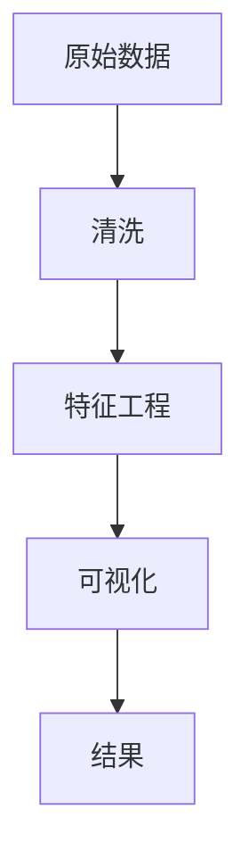
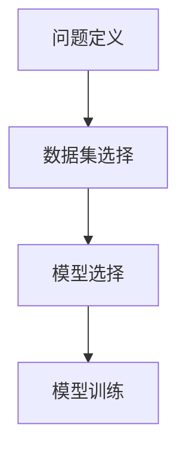
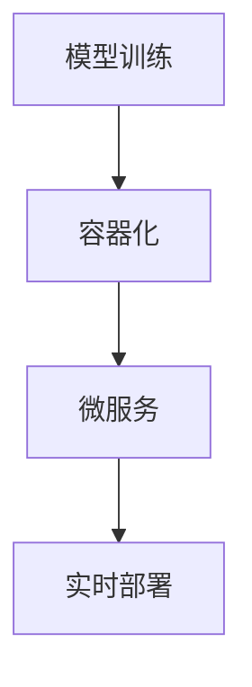
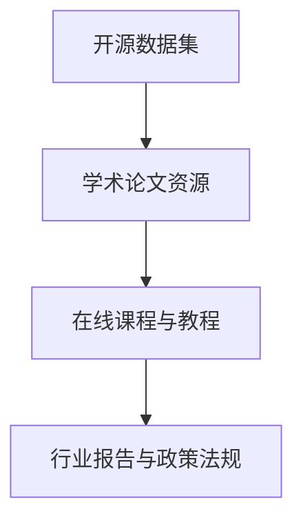

                 

### 文章标题

# AI领域的最新技术进展

### 关键词

- 人工智能
- 深度学习
- 自然语言处理
- 强化学习
- 自主智能系统
- 伦理与社会影响
- 技术发展趋势
- 实战与应用

### 摘要

本文旨在全面剖析当前AI领域的最新技术进展，包括其基础理论、关键进展、伦理与社会影响，以及未来的发展趋势和应用。通过对核心概念、算法原理、技术挑战和实际应用的深入探讨，本文旨在为读者提供一份全面而系统的AI技术指南。

---

### 第一部分: AI技术基础

在探讨AI领域的最新技术进展之前，我们需要了解一些AI的基础知识。本部分将介绍AI的基本概念、关键技术和应用领域，为后续的深入探讨打下基础。

#### 第1章: AI概述与历史背景

##### 1.1 AI的基本概念

$$
\text{人工智能（AI）} = \text{模拟、扩展和扩展人类智能的能力}
$$

AI可以定义为一种使计算机系统能够模拟、扩展或扩展人类智能的技术。它包括机器学习、自然语言处理、计算机视觉等多个子领域。

##### 1.1.1 人工智能的定义

人工智能是一种科学和工程领域，旨在开发能够执行通常需要人类智能才能完成的任务的计算机系统。这些任务包括识别语言、图像、声音、决策制定、问题解决等。

##### 1.1.2 人工智能的发展历程

人工智能的发展历程可以分为几个阶段：

1. **早期探索（1950s-1960s）**：人工智能的概念首次被提出，并开始进行早期研究。
2. **人工智能的黄金时代（1980-1987）**：在这一时期，AI取得了一些显著的成就，但随后因资源不足和实际应用难题而陷入低潮。
3. **现代AI（1990s-至今）**：随着计算机性能的提升和数据的大规模可用，AI技术再次蓬勃发展。

##### 1.1.3 人工智能的类型

人工智能可以分为两大类：

1. **弱人工智能**：也称为窄AI，专注于特定的任务，如语音识别、图像分类等。
2. **强人工智能**：也称为通用人工智能（AGI），能够执行广泛的认知任务，与人类智能相似。

##### 1.2 AI的关键技术

AI的关键技术包括：

1. **机器学习**：通过从数据中学习模式和规律，使计算机能够进行预测和决策。
2. **深度学习**：一种特殊的机器学习方法，使用多层神经网络进行训练。
3. **自然语言处理**：使计算机能够理解和生成自然语言。

##### 1.3 AI的应用领域

AI已经在多个领域得到广泛应用：

1. **图像识别**：自动驾驶汽车、安全监控、医学影像分析等。
2. **自动驾驶**：无人驾驶汽车、无人机等。
3. **医疗诊断**：疾病预测、症状分析、药物研发等。

#### 第2章: 最新AI技术进展

在本章中，我们将深入探讨AI领域的最新技术进展，包括GPT-3、自主智能系统和强化学习等。

##### 2.1 GPT-3与自然语言处理

GPT-3（Generative Pre-trained Transformer 3）是OpenAI开发的自然语言处理模型，其参数规模超过1750亿，是当前最先进的语言模型之一。

###### 2.1.1 GPT-3的基本原理

GPT-3使用了一种名为Transformer的神经网络架构，这种架构在处理序列数据时表现出色。GPT-3的核心思想是通过预训练来学习语言的普遍规律，然后通过微调来适应特定的任务。

###### 2.1.2 GPT-3的应用场景

GPT-3的应用场景广泛，包括但不限于：

- **内容生成**：生成文章、新闻、代码等。
- **对话系统**：构建聊天机器人、虚拟助手等。
- **语言翻译**：实时翻译不同语言。

###### 2.1.3 GPT-3的影响与争议

GPT-3的发布引起了巨大的关注和争议。一方面，它展示了AI在自然语言处理领域的巨大潜力；另一方面，人们担心其可能被用于生成虚假信息、侵犯隐私等问题。

##### 2.2 自主智能系统

自主智能系统是指能够独立决策、执行任务并与其他系统交互的智能系统。它包括多个子领域，如智能决策系统、智能体与博弈论、智能机器人技术等。

###### 2.2.1 智能决策系统

智能决策系统是指能够根据环境变化做出最优决策的智能系统。它通常使用强化学习、博弈论等方法进行决策。

###### 2.2.2 智能体与博弈论

智能体是指能够模拟人类或其他实体行为的计算机程序。博弈论是研究决策制定的数学工具，常用于设计智能决策系统。

###### 2.2.3 智能机器人技术

智能机器人技术是指使机器人能够执行复杂任务的技术。它包括机器人感知、运动控制、自主导航等多个方面。

##### 2.3 强化学习最新进展

强化学习是一种使智能体通过与环境的交互来学习最佳行为策略的机器学习方法。近年来，强化学习在多个领域取得了显著进展。

###### 2.3.1 强化学习的基本原理

强化学习的基本原理是通过奖励机制来引导智能体学习最佳行为策略。它包括状态、动作、奖励和策略等基本概念。

###### 2.3.2 强化学习在游戏中的应用

强化学习在游戏领域取得了显著成就，如AlphaGo击败人类围棋冠军。它通过自我对弈来不断优化策略。

###### 2.3.3 强化学习在现实世界中的挑战

强化学习在现实世界中的应用面临多个挑战，如环境的不确定性和非平稳性。解决这些挑战是未来研究的重要方向。

### 第二部分: AI伦理与社会影响

随着AI技术的快速发展，伦理和社会影响成为不可忽视的问题。在本部分中，我们将探讨AI伦理问题、AI对教育、医疗和经济的影响。

#### 第3章: AI伦理与社会影响

##### 3.1 AI伦理问题

AI伦理问题主要包括：

- **偏见与歧视**：AI系统可能会因为训练数据的问题而表现出偏见和歧视。
- **隐私问题**：AI系统可能侵犯用户的隐私权。
- **就业影响**：AI可能会取代某些工作岗位，影响就业。

##### 3.2 AI社会影响

AI对社会的各个方面都产生了深远的影响：

- **教育**：AI可以个性化教学、提供教育资源，提高教育质量。
- **医疗**：AI可以辅助医生进行疾病预测、诊断和药物研发，提高医疗效率。
- **经济**：AI可以提高生产效率、创造新的商业模式，推动经济发展。

### 第三部分: AI技术发展趋势

在本部分中，我们将探讨AI技术的发展趋势，包括AI硬件与芯片技术、AI在边缘计算中的应用，以及AI与5G技术的融合。

#### 第4章: AI技术发展趋势

##### 4.1 AI硬件与芯片技术

AI硬件与芯片技术的发展是AI性能提升的关键。GPU和TPU是两种常见的AI芯片。

###### 4.1.1 GPU与TPU

- **GPU（图形处理单元）**：最初用于图形渲染，但因其强大的并行计算能力而被用于AI计算。
- **TPU（张量处理单元）**：专门为AI计算设计的芯片，具有更高的计算效率。

###### 4.1.2 AI芯片的发展趋势

未来，AI芯片将继续朝着更高性能、更低功耗、更小体积的方向发展。

##### 4.2 AI在边缘计算中的应用

边缘计算是一种将计算任务从云端转移到网络边缘（如物联网设备）的计算模式。AI在边缘计算中的应用包括：

- **实时数据处理**：边缘设备可以实时处理和分析数据，提高响应速度。
- **降低延迟**：减少数据传输到云端的时间，降低延迟。

##### 4.3 AI与5G技术的融合

5G技术的特点是低延迟、高带宽、大规模连接。AI与5G技术的融合将推动：

- **实时AI应用**：如自动驾驶、远程医疗等。
- **大规模物联网**：实现更广泛、更高效的物联网应用。

### 第四部分: AI实战与应用

在本部分中，我们将通过实战项目来探讨AI的实际应用，包括数据预处理、模型训练与优化、模型部署等。

#### 第5章: AI项目实战

##### 5.1 数据预处理

数据预处理是AI项目的重要环节，包括数据清洗、特征工程和可视化。

###### 5.1.1 数据清洗

数据清洗旨在去除数据中的噪声和错误，提高数据质量。

```python
# 伪代码：数据清洗
def clean_data(data):
    # 删除缺失值
    cleaned_data = remove_missing_values(data)
    # 删除重复值
    cleaned_data = remove_duplicates(cleaned_data)
    # 标准化数据
    cleaned_data = normalize_data(cleaned_data)
    return cleaned_data
```

###### 5.1.2 特征工程

特征工程旨在从原始数据中提取有用的特征，提高模型性能。

```python
# 伪代码：特征工程
def feature_engineering(data):
    # 创建新特征
    new_features = create_new_features(data)
    # 降维
    reduced_features = dimensionality_reduction(new_features)
    return reduced_features
```

###### 5.1.3 数据可视化

数据可视化有助于理解数据分布和特征之间的关系。



##### 5.2 模型训练与优化

模型训练与优化是AI项目的核心，包括模型选择、训练和优化。

###### 5.2.1 模型选择

模型选择取决于具体问题和数据集。



###### 5.2.2 模型训练

模型训练是通过优化算法来调整模型参数。

```python
# 伪代码：模型训练
def train_model(model, data):
    # 初始化模型参数
    model.init_params()
    # 优化模型参数
    model.optimize_params(data)
    return model
```

###### 5.2.3 模型评估与优化

模型评估与优化是提高模型性能的关键步骤。

```python
# 伪代码：模型评估与优化
def evaluate_and_optimize_model(model, data):
    # 评估模型性能
    performance = model.evaluate(data)
    # 根据性能调整模型
    model.optimize_performance(performance)
    return model
```

##### 5.3 模型部署

模型部署是将训练好的模型应用于实际场景。

###### 5.3.1 模型部署的基本流程

模型部署的基本流程包括：

- **容器化**：将模型和依赖打包成容器。
- **微服务**：将模型部署为微服务，实现模块化。
- **实时部署**：将模型部署到生产环境，实现实时应用。



### 附录

在本章中，我们将提供一些AI研究资源与资料，包括开源数据集、学术论文资源、在线课程与教程，以及行业报告与政策法规。



---

本文通过逐步分析推理，详细介绍了AI领域的最新技术进展。从基础概念、核心技术，到伦理影响、发展趋势，再到实战应用，本文力求为读者提供一份全面而系统的AI技术指南。让我们继续深入探讨，揭示AI领域的更多奥秘。

