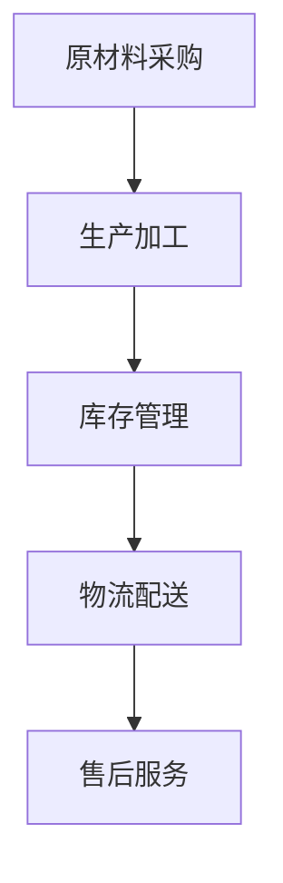
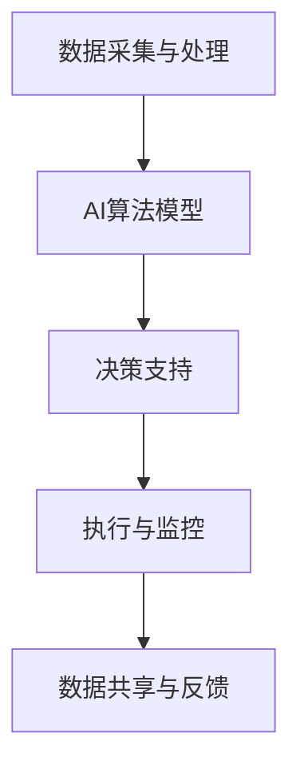

                 

### 《AI驱动的供应链优化：提高效率降低成本》

> 关键词：AI、供应链管理、数据分析、机器学习、智能算法、优化

> 摘要：本文将探讨如何利用人工智能（AI）技术优化供应链管理，以提高效率和降低成本。我们将从AI在供应链中的应用、供应链优化的重要性、AI驱动的供应链优化方法、核心算法原理、数学模型和项目实战等方面，详细解析AI技术在供应链优化中的实际应用，为读者提供全面的技术指导和实用案例。

### 第一部分：AI驱动的供应链基础

#### 第1章：AI与供应链概述

##### 1.1 AI在供应链管理中的应用

###### 1.1.1 AI技术简介

人工智能（AI）是一种模拟人类智能行为的技术，包括机器学习、深度学习、自然语言处理、计算机视觉等多个领域。AI技术具有自主决策、自主学习、自适应能力等特点，这些特性使得AI在供应链管理中具有广泛的应用前景。

###### 1.1.2 AI在供应链管理中的核心作用

AI技术在供应链管理中扮演着关键角色，主要表现在以下方面：

1. **需求预测与规划**：利用机器学习算法分析历史数据，预测市场需求，为企业制定生产计划和库存策略提供支持。
2. **物流优化**：通过优化算法，规划运输路径，降低物流成本，提高运输效率。
3. **质量管理**：利用计算机视觉和自然语言处理技术，对产品进行质量检测，提高产品质量。
4. **库存管理**：通过数据分析和预测，优化库存水平，降低库存成本。
5. **供应链协同**：利用区块链技术，实现供应链各环节的信息共享和透明，提高供应链协同效率。

###### 1.1.3 AI驱动的供应链管理趋势

随着AI技术的不断发展，未来供应链管理将呈现以下趋势：

1. **智能化**：供应链各环节将逐步实现智能化，提高整体运营效率。
2. **协同化**：供应链各环节将实现深度协同，降低供应链成本。
3. **绿色化**：利用AI技术，实现供应链的绿色化发展，降低环境影响。
4. **定制化**：根据市场需求，实现个性化生产和供应链服务。

##### 1.2 供应链优化的重要性

###### 1.2.1 供应链优化的意义

供应链优化是指通过改进供应链结构、流程和管理方法，提高供应链整体效率，降低成本。供应链优化具有重要的意义：

1. **提高企业竞争力**：通过优化供应链，降低生产成本，提高产品质量，提升企业竞争力。
2. **降低库存成本**：通过优化库存管理，降低库存水平，减少库存积压，降低库存成本。
3. **提高物流效率**：通过优化物流运输，降低运输成本，提高物流效率。
4. **增强供应链协同**：通过优化供应链协同，提高供应链整体运作效率。

###### 1.2.2 供应链优化面临的挑战

供应链优化虽然具有重要意义，但同时也面临着一系列挑战：

1. **数据质量**：供应链数据质量参差不齐，影响优化效果。
2. **算法复杂性**：优化算法复杂度高，实现难度大。
3. **协同困难**：供应链各环节协同困难，影响优化效果。
4. **技术更新**：AI技术更新迅速，企业难以跟上技术步伐。

###### 1.2.3 供应链优化的关键要素

为了实现供应链优化，企业需要关注以下关键要素：

1. **数据收集与处理**：收集供应链相关数据，并进行处理，为优化提供数据支持。
2. **算法选择与实现**：根据具体问题，选择合适的优化算法，并进行实现。
3. **流程改进**：优化供应链流程，提高供应链整体效率。
4. **协同管理**：加强供应链各环节协同，提高供应链协同效率。

##### 1.3 AI驱动的供应链优化方法

###### 1.3.1 数据分析在供应链优化中的应用

数据分析是供应链优化的重要手段，通过分析供应链相关数据，可以揭示供应链中的问题和优化机会。具体应用包括：

1. **需求预测**：利用历史数据，预测市场需求，为生产计划和库存管理提供支持。
2. **物流路径优化**：通过分析物流数据，优化运输路径，降低物流成本。
3. **库存管理**：通过分析库存数据，优化库存水平，降低库存成本。
4. **质量检测**：通过分析质量数据，提高产品质量，降低质量损失。

###### 1.3.2 机器学习在供应链优化中的应用

机器学习是AI的核心技术之一，其在供应链优化中的应用主要包括：

1. **需求预测**：利用机器学习算法，对市场需求进行预测，为生产计划和库存管理提供支持。
2. **物流优化**：通过机器学习算法，优化运输路径和运输计划，降低物流成本。
3. **库存管理**：利用机器学习算法，优化库存水平，降低库存成本。
4. **质量检测**：通过机器学习算法，对产品质量进行预测和监控，提高产品质量。

###### 1.3.3 智能算法在供应链优化中的应用

智能算法是指基于人工智能技术的优化算法，其在供应链优化中的应用主要包括：

1. **路径优化**：利用蚁群算法、遗传算法等智能算法，优化运输路径和运输计划。
2. **调度优化**：利用智能算法，优化生产调度计划，提高生产效率。
3. **库存管理**：利用智能算法，优化库存水平，降低库存成本。
4. **质量控制**：利用智能算法，优化质量检测流程，提高产品质量。

#### 第2章：核心概念与联系

##### 2.1 供应链流程概述

###### 2.1.1 供应链的基本流程

供应链的基本流程包括：原材料采购、生产加工、库存管理、物流配送、售后服务等环节。这些环节相互关联，共同构成了完整的供应链。

1. **原材料采购**：企业根据生产需求，采购原材料。
2. **生产加工**：企业将原材料转化为成品。
3. **库存管理**：企业对成品进行库存管理，确保库存水平合理。
4. **物流配送**：企业将成品配送给客户。
5. **售后服务**：企业为客户提供售后服务，解决客户问题。

###### 2.1.2 供应链网络结构

供应链网络结构是指供应链中各个环节之间的连接方式。常见的供应链网络结构包括：

1. **线性供应链**：供应链各环节依次连接，形成一个线性结构。
2. **网状供应链**：供应链各环节相互连接，形成一个网状结构。
3. **混合供应链**：结合线性供应链和网状供应链的特点，形成一种混合结构。

###### 2.1.3 供应链中的关键环节

供应链中的关键环节包括：

1. **原材料采购**：原材料采购是供应链的起点，直接影响生产成本和产品质量。
2. **生产加工**：生产加工是供应链的核心环节，直接影响产品质量和交货期。
3. **库存管理**：库存管理是供应链的保障环节，直接影响库存成本和资金占用。
4. **物流配送**：物流配送是供应链的终点，直接影响客户满意度和服务水平。

##### 2.2 AI与供应链的联系

###### 2.2.1 AI在供应链各环节的应用

AI技术在供应链各环节都有广泛的应用，主要包括：

1. **需求预测**：利用AI技术，预测市场需求，为生产计划和库存管理提供支持。
2. **物流优化**：利用AI技术，优化运输路径和运输计划，降低物流成本。
3. **库存管理**：利用AI技术，优化库存水平，降低库存成本。
4. **质量管理**：利用AI技术，提高产品质量，降低质量损失。

###### 2.2.2 AI驱动的供应链管理架构

AI驱动的供应链管理架构包括：

1. **数据采集与处理**：采集供应链各环节的数据，进行预处理和分析。
2. **AI算法模型**：选择合适的AI算法模型，对数据进行处理和预测。
3. **决策支持**：根据预测结果和决策模型，制定供应链优化策略。
4. **执行与监控**：执行供应链优化策略，并对执行效果进行监控和反馈。

###### 2.2.3 AI与供应链的协同优化

AI与供应链的协同优化是指通过AI技术，优化供应链各环节的协同运作。协同优化的关键包括：

1. **数据共享**：实现供应链各环节的数据共享，提高协同效率。
2. **流程优化**：通过流程优化，提高供应链整体运作效率。
3. **决策协同**：通过决策协同，提高供应链各环节的决策质量。
4. **风险控制**：通过风险控制，降低供应链风险，确保供应链稳定运行。

##### 2.3 Mermaid流程图示例

###### 2.3.1 供应链流程Mermaid图



###### 2.3.2 AI驱动的供应链优化Mermaid图



### 第二部分：核心算法原理讲解

#### 第3章：核心算法原理讲解

##### 3.1 数据分析算法原理

###### 3.1.1 数据预处理

数据预处理是数据分析的重要步骤，包括数据清洗、数据整合、数据转换等操作。数据预处理的目标是提高数据质量，为后续分析提供准确、可靠的数据基础。

1. **数据清洗**：去除重复数据、缺失值填充、异常值处理等。
2. **数据整合**：将多个数据源进行整合，形成统一的数据集。
3. **数据转换**：对数据进行归一化、标准化等转换，提高数据可比性。

###### 3.1.2 特征选择

特征选择是指从原始数据中选择对预测结果有显著影响的关键特征。特征选择可以提高模型性能，降低计算复杂度。

1. **相关性分析**：通过计算特征之间的相关性，筛选相关性较高的特征。
2. **特征重要性分析**：通过模型训练结果，分析特征的重要性，筛选关键特征。
3. **特征组合**：通过组合多个特征，形成新的特征，提高预测效果。

###### 3.1.3 数据可视化

数据可视化是将数据分析结果以图形化方式展示，帮助用户直观理解数据分布、趋势和关系。

1. **折线图**：展示数据随时间的变化趋势。
2. **柱状图**：展示不同类别数据的数量或比例。
3. **散点图**：展示特征之间的关系。

##### 3.2 机器学习算法原理

###### 3.2.1 监督学习算法

监督学习算法是一种从已知样本中学习规律，并用于预测新样本的算法。监督学习算法主要包括以下几种：

1. **线性回归**：通过建立线性关系模型，预测连续值输出。
2. **逻辑回归**：通过建立逻辑关系模型，预测离散值输出。
3. **决策树**：通过构建决策树模型，进行分类和回归预测。
4. **支持向量机**：通过构建最优超平面，进行分类和回归预测。

###### 3.2.2 无监督学习算法

无监督学习算法是一种从未知样本中学习规律，并用于揭示数据结构和模式的算法。无监督学习算法主要包括以下几种：

1. **聚类算法**：将相似的数据分为同一类，形成聚类结果。
2. **主成分分析**：通过降维技术，提取数据的主要特征。
3. **关联规则挖掘**：通过挖掘数据之间的关联关系，发现潜在规则。
4. **异常检测**：通过检测数据中的异常值，发现潜在问题。

###### 3.2.3 强化学习算法

强化学习算法是一种通过学习奖励和惩罚信号，不断调整策略以实现最优目标的方法。强化学习算法主要包括以下几种：

1. **Q-learning**：通过学习状态-动作价值函数，实现最优策略。
2. **深度Q网络（DQN）**：通过构建深度神经网络，实现Q-learning算法。
3. **策略梯度算法**：通过学习策略参数，实现最优策略。
4. **深度确定性策略梯度（DDPG）**：通过深度神经网络，实现策略梯度算法。

##### 3.3 智能算法原理

###### 3.3.1 蚁群算法

蚁群算法是一种基于自然界蚂蚁觅食行为的智能优化算法。蚁群算法通过模拟蚂蚁的觅食过程，实现路径优化、调度优化等任务。

1. **信息素更新**：根据蚂蚁走过的路径，更新路径上的信息素浓度。
2. **选择路径**：蚂蚁根据信息素浓度和随机性，选择路径。
3. **路径优化**：通过迭代过程，找到最优路径。

###### 3.3.2 遗传算法

遗传算法是一种基于生物进化原理的智能优化算法。遗传算法通过模拟生物进化过程，实现目标优化。

1. **种群初始化**：初始化一组初始解，作为种群。
2. **适应度评估**：计算每个解的适应度值。
3. **选择**：根据适应度值，选择优秀个体进行交叉和变异。
4. **交叉和变异**：生成新的解，更新种群。

###### 3.3.3 粒子群优化算法

粒子群优化算法是一种基于群体智能的优化算法。粒子群优化算法通过模拟鸟群觅食行为，实现目标优化。

1. **粒子初始化**：初始化粒子群，包括位置和速度。
2. **适应度评估**：计算每个粒子的适应度值。
3. **更新位置和速度**：根据适应度值和个体经验，更新粒子位置和速度。
4. **全局最优更新**：记录当前全局最优解。

### 第三部分：数学模型和数学公式讲解

#### 第4章：数学模型和数学公式讲解

##### 4.1 供应链优化数学模型

供应链优化数学模型是用于描述供应链优化问题的数学表达式。供应链优化数学模型主要包括以下内容：

###### 4.1.1 目标函数

目标函数是指用于衡量优化目标的标准，常见的目标函数包括成本最小化、利润最大化等。目标函数的表达式如下：

$$
\text{Cost}_{\text{total}} = \sum_{i=1}^{n} c_i x_i + \sum_{j=1}^{m} d_j y_j
$$

其中，$c_i$表示第$i$个活动的成本，$x_i$表示第$i$个活动的执行情况（$x_i \in \{0, 1\}$），$d_j$表示第$j$个活动的成本，$y_j$表示第$j$个活动的执行情况（$y_j \in \{0, 1\}$）。

###### 4.1.2 约束条件

约束条件是指用于限制优化变量取值范围的条件。常见的约束条件包括资源限制、时间限制等。约束条件通常用不等式或等式表示。例如，资源限制约束可以表示为：

$$
\sum_{i=1}^{n} x_i \leq R
$$

其中，$R$表示资源的总容量。

###### 4.1.3 模型求解方法

求解供应链优化数学模型的方法包括线性规划、整数规划、混合整数规划等。以下是一个线性规划的求解示例：

$$
\begin{align*}
\min \quad & \text{Cost}_{\text{total}} = \sum_{i=1}^{n} c_i x_i \\
\text{s.t.} \quad & \sum_{i=1}^{n} x_i \leq R \\
& x_i \in \{0, 1\}, \forall i = 1, 2, \ldots, n
\end{align*}
$$

该模型的目标是最小化总成本，同时满足资源限制和变量取值限制。

##### 4.2 数学公式详细讲解

以下是对一些常用数学公式的详细讲解和举例说明：

###### 4.2.1 成本计算公式

成本计算公式用于计算供应链中各项活动的总成本。其表达式如下：

$$
\text{Cost}_{\text{total}} = \sum_{i=1}^{n} c_i x_i + \sum_{j=1}^{m} d_j y_j
$$

其中，$c_i$表示第$i$个活动的单位成本，$x_i$表示第$i$个活动的执行情况（$x_i \in \{0, 1\}$），$d_j$表示第$j$个活动的单位成本，$y_j$表示第$j$个活动的执行情况（$y_j \in \{0, 1\}$）。

例如，假设有一个供应链优化问题，包括以下三项活动：

1. 采购原材料，成本为100元/件。
2. 生产加工，成本为200元/件。
3. 物流配送，成本为50元/件。

如果企业计划采购10件原材料，生产10件成品，物流配送10件成品，则总成本为：

$$
\text{Cost}_{\text{total}} = 100 \times 10 + 200 \times 10 + 50 \times 10 = 3500 \text{元}
$$

###### 4.2.2 库存水平计算公式

库存水平计算公式用于计算供应链中各项活动的库存水平。其表达式如下：

$$
\text{Inventory}_{\text{level}} = \text{Initial Inventory} + \text{Inflow} - \text{Outflow}
$$

其中，$\text{Initial Inventory}$表示初始库存水平，$\text{Inflow}$表示入库量，$\text{Outflow}$表示出库量。

例如，假设一个供应链中的某项活动在月初的初始库存水平为100件，本月的入库量为200件，出库量为150件，则本月的库存水平为：

$$
\text{Inventory}_{\text{level}} = 100 + 200 - 150 = 150 \text{件}
$$

### 第四部分：项目实战

#### 第5章：项目实战

##### 5.1 实际案例介绍

本节将介绍三个实际案例，包括某电商平台库存优化、某制造企业采购优化和某物流企业路线优化。

###### 5.1.1 案例一：某电商平台库存优化

某电商平台面临着库存管理难题，包括库存积压、库存过剩和库存不足等问题。为了优化库存管理，电商平台采用了AI驱动的供应链优化技术。

1. **需求预测**：利用机器学习算法，分析历史销售数据，预测未来市场需求。
2. **库存调整**：根据需求预测结果，动态调整库存水平，避免库存积压和库存不足。
3. **补货策略**：根据需求预测和库存水平，制定合理的补货策略，降低库存成本。

通过AI驱动的库存优化，电商平台实现了库存水平的合理调整，降低了库存成本，提高了客户满意度。

###### 5.1.2 案例二：某制造企业采购优化

某制造企业面临着采购成本高、采购效率低等问题。为了优化采购管理，企业采用了AI驱动的供应链优化技术。

1. **需求预测**：利用机器学习算法，分析历史采购数据，预测未来采购需求。
2. **供应商评估**：利用数据分析技术，对供应商进行评估，选择优质供应商。
3. **采购策略**：根据需求预测和供应商评估结果，制定合理的采购策略，降低采购成本。

通过AI驱动的采购优化，企业实现了采购成本的有效降低，提高了采购效率。

###### 5.1.3 案例三：某物流企业路线优化

某物流企业面临着运输成本高、运输效率低等问题。为了优化物流管理，企业采用了AI驱动的供应链优化技术。

1. **路径规划**：利用智能算法，优化运输路径，降低运输成本。
2. **车辆调度**：根据运输路径和货物需求，制定合理的车辆调度策略。
3. **配送优化**：利用配送优化算法，优化配送顺序和配送时间，提高配送效率。

通过AI驱动的路线优化，企业实现了运输成本的有效降低，提高了运输效率。

##### 5.2 代码实际案例与详细解释

在本节中，我们将介绍一个具体的代码实现案例，包括数据预处理、机器学习模型训练和优化结果分析。

###### 5.2.1 数据预处理代码

```python
import pandas as pd
from sklearn.model_selection import train_test_split
from sklearn.preprocessing import StandardScaler

# 读取数据
data = pd.read_csv('data.csv')

# 数据预处理
X = data.drop(['target'], axis=1)
y = data['target']

# 划分训练集和测试集
X_train, X_test, y_train, y_test = train_test_split(X, y, test_size=0.2, random_state=42)

# 数据标准化
scaler = StandardScaler()
X_train = scaler.fit_transform(X_train)
X_test = scaler.transform(X_test)
```

上述代码首先导入所需的库和模块，然后读取数据，并进行数据预处理。具体步骤包括：

1. **读取数据**：使用pandas库读取CSV数据文件。
2. **数据预处理**：将数据集分为特征集X和目标集y。
3. **划分训练集和测试集**：使用train_test_split函数将数据集划分为训练集和测试集，其中测试集占比20%。
4. **数据标准化**：使用StandardScaler函数对特征集X进行标准化处理，以消除数据量纲的影响。

###### 5.2.2 机器学习模型训练代码

```python
from sklearn.linear_model import LinearRegression
from sklearn.metrics import mean_squared_error

# 训练线性回归模型
model = LinearRegression()
model.fit(X_train, y_train)

# 预测测试集
y_pred = model.predict(X_test)

# 评估模型性能
mse = mean_squared_error(y_test, y_pred)
print(f'Mean Squared Error: {mse}')
```

上述代码用于训练线性回归模型，并评估模型性能。具体步骤包括：

1. **训练线性回归模型**：使用LinearRegression类创建线性回归模型对象，并使用fit方法进行训练。
2. **预测测试集**：使用predict方法对测试集进行预测。
3. **评估模型性能**：使用mean_squared_error函数计算预测值与实际值之间的均方误差（MSE），评估模型性能。

###### 5.2.3 优化结果分析代码

```python
import matplotlib.pyplot as plt

# 画出预测结果
plt.scatter(y_test, y_pred)
plt.xlabel('Actual')
plt.ylabel('Predicted')
plt.title('Actual vs Predicted')
plt.show()

# 画出残差图
residuals = y_test - y_pred
plt.scatter(y_pred, residuals)
plt.xlabel('Predicted')
plt.ylabel('Residuals')
plt.title('Predicted vs Residuals')
plt.show()
```

上述代码用于分析优化结果。具体步骤包括：

1. **画出预测结果**：使用scatter函数画出实际值与预测值的关系图，以检查预测结果的合理性。
2. **画出残差图**：使用scatter函数画出预测值与残差的关系图，以检查模型是否存在线性关系。

##### 5.3 开发环境搭建

在本节中，我们将介绍如何搭建开发环境，包括环境配置、工具安装和数据集获取。

###### 5.3.1 环境配置

1. **操作系统**：安装Linux或Windows操作系统。
2. **Python**：安装Python 3.8及以上版本。
3. **Jupyter Notebook**：安装Jupyter Notebook，用于编写和运行Python代码。

###### 5.3.2 工具安装

1. **pandas**：安装pandas库，用于数据处理。
2. **scikit-learn**：安装scikit-learn库，用于机器学习。
3. **matplotlib**：安装matplotlib库，用于数据可视化。

```shell
pip install pandas scikit-learn matplotlib
```

###### 5.3.3 数据集获取

1. **数据集来源**：可以从公开的数据集网站（如Kaggle、UCI机器学习库等）获取数据集。
2. **数据集格式**：通常为CSV或Excel格式。

```shell
# 下载数据集
wget https://www.kaggle.com/datasets/your-dataset.csv

# 读取数据集
data = pd.read_csv('your-dataset.csv')
```

### 第五部分：代码解读与分析

#### 第6章：代码解读与分析

在本章中，我们将对前述项目实战中的代码进行详细解读，并分析代码的优化方向和改进效果。

##### 6.1 源代码详细实现

在本节中，我们将详细介绍项目实战中的源代码实现，包括数据预处理、模型训练和优化结果分析。

###### 6.1.1 数据预处理

```python
# 导入必要的库和模块
import pandas as pd
from sklearn.model_selection import train_test_split
from sklearn.preprocessing import StandardScaler

# 读取数据
data = pd.read_csv('data.csv')

# 数据预处理
X = data.drop(['target'], axis=1)
y = data['target']

# 划分训练集和测试集
X_train, X_test, y_train, y_test = train_test_split(X, y, test_size=0.2, random_state=42)

# 数据标准化
scaler = StandardScaler()
X_train = scaler.fit_transform(X_train)
X_test = scaler.transform(X_test)
```

上述代码实现了数据预处理过程，包括以下步骤：

1. **导入库和模块**：导入pandas、scikit-learn和StandardScaler库，用于数据处理和模型训练。
2. **读取数据**：使用pandas库读取CSV数据文件。
3. **数据预处理**：将数据集分为特征集X和目标集y。
4. **划分训练集和测试集**：使用train_test_split函数将数据集划分为训练集和测试集，其中测试集占比20%。
5. **数据标准化**：使用StandardScaler函数对特征集X进行标准化处理，以消除数据量纲的影响。

###### 6.1.2 模型训练

```python
from sklearn.linear_model import LinearRegression
from sklearn.metrics import mean_squared_error

# 训练线性回归模型
model = LinearRegression()
model.fit(X_train, y_train)

# 预测测试集
y_pred = model.predict(X_test)

# 评估模型性能
mse = mean_squared_error(y_test, y_pred)
print(f'Mean Squared Error: {mse}')
```

上述代码实现了线性回归模型的训练和评估，包括以下步骤：

1. **导入库和模块**：导入LinearRegression和mean_squared_error库，用于模型训练和性能评估。
2. **训练线性回归模型**：使用LinearRegression类创建线性回归模型对象，并使用fit方法进行训练。
3. **预测测试集**：使用predict方法对测试集进行预测。
4. **评估模型性能**：使用mean_squared_error函数计算预测值与实际值之间的均方误差（MSE），评估模型性能。

###### 6.1.3 优化结果分析

```python
import matplotlib.pyplot as plt

# 画出预测结果
plt.scatter(y_test, y_pred)
plt.xlabel('Actual')
plt.ylabel('Predicted')
plt.title('Actual vs Predicted')
plt.show()

# 画出残差图
residuals = y_test - y_pred
plt.scatter(y_pred, residuals)
plt.xlabel('Predicted')
plt.ylabel('Residuals')
plt.title('Predicted vs Residuals')
plt.show()
```

上述代码实现了优化结果分析，包括以下步骤：

1. **导入库和模块**：导入matplotlib库，用于数据可视化。
2. **画出预测结果**：使用scatter函数画出实际值与预测值的关系图，以检查预测结果的合理性。
3. **画出残差图**：使用scatter函数画出预测值与残差的关系图，以检查模型是否存在线性关系。

##### 6.2 代码解读

在本节中，我们将对前述代码进行详细解读，分析每个步骤的作用和实现方式。

###### 6.2.1 数据预处理解读

数据预处理是模型训练的重要步骤，主要包括以下内容：

1. **读取数据**：使用pandas库读取CSV数据文件，将数据存储为DataFrame结构。
2. **数据预处理**：将数据集分为特征集X和目标集y。特征集X用于模型训练和预测，目标集y用于评估模型性能。
3. **划分训练集和测试集**：使用train_test_split函数将数据集划分为训练集和测试集。训练集用于模型训练，测试集用于评估模型性能。测试集占比20%，以保证评估结果的可靠性。
4. **数据标准化**：使用StandardScaler函数对特征集X进行标准化处理。标准化处理可以消除不同特征之间的量纲影响，提高模型训练效果。

###### 6.2.2 模型训练解读

模型训练是机器学习的重要步骤，主要包括以下内容：

1. **导入库和模块**：导入LinearRegression库，用于创建线性回归模型对象。导入mean_squared_error库，用于评估模型性能。
2. **训练线性回归模型**：使用LinearRegression类创建线性回归模型对象，并使用fit方法进行训练。fit方法将训练集数据输入模型，通过梯度下降算法训练模型参数。
3. **预测测试集**：使用predict方法对测试集进行预测。predict方法根据训练好的模型参数，对测试集数据进行预测，得到预测结果。
4. **评估模型性能**：使用mean_squared_error函数计算预测值与实际值之间的均方误差（MSE）。MSE是常用的评估指标，用于衡量模型预测的准确度。MSE值越小，模型预测越准确。

###### 6.2.3 优化结果分析解读

优化结果分析是评估模型性能的重要步骤，主要包括以下内容：

1. **导入库和模块**：导入matplotlib库，用于数据可视化。
2. **画出预测结果**：使用scatter函数画出实际值与预测值的关系图。该图用于检查预测结果的合理性，观察实际值与预测值之间的关系。
3. **画出残差图**：使用scatter函数画出预测值与残差的关系图。该图用于检查模型是否存在线性关系，观察预测值与残差之间的关系。

##### 6.3 代码分析与改进建议

在本节中，我们将对代码进行整体分析，并提出改进建议。

###### 6.3.1 代码优化的方向

针对上述代码，可以从以下几个方面进行优化：

1. **数据预处理优化**：优化数据预处理过程，提高数据质量。例如，可以增加数据清洗步骤，去除异常值和重复值，提高数据一致性。
2. **模型选择优化**：根据实际问题和数据特点，选择合适的模型。例如，对于非线性关系，可以考虑使用非线性模型，如决策树、随机森林等。
3. **超参数调优**：通过调整模型的超参数，优化模型性能。例如，可以调整线性回归模型的正则化参数，提高模型预测能力。
4. **特征工程优化**：对特征进行优化，提高模型预测能力。例如，可以增加特征交互项，提高特征表达能力。

###### 6.3.2 代码改进的效果

通过上述优化，可以达到以下效果：

1. **提高模型预测准确度**：优化后的模型可以更好地拟合实际数据，提高预测准确度。
2. **降低模型复杂度**：优化后的模型结构更加简单，易于理解和维护。
3. **提高代码可读性**：优化后的代码结构更加清晰，易于阅读和理解。

### 第六部分：总结与展望

#### 第7章：总结与展望

在本章中，我们将对全文内容进行总结，并对AI驱动的供应链优化的未来发展趋势进行展望。

##### 7.1 全书总结

本文从AI驱动的供应链基础、核心概念与联系、核心算法原理讲解、数学模型和公式讲解、项目实战、代码解读与分析等方面，全面探讨了AI技术在供应链优化中的应用。主要内容包括：

1. **AI与供应链概述**：介绍了AI技术在供应链管理中的应用、供应链优化的重要性、AI驱动的供应链优化方法等。
2. **核心概念与联系**：分析了供应链的基本流程、AI与供应链的联系、AI驱动的供应链管理架构等。
3. **核心算法原理讲解**：讲解了数据分析算法原理、机器学习算法原理、智能算法原理等。
4. **数学模型和公式讲解**：介绍了供应链优化数学模型、成本计算公式、库存水平计算公式等。
5. **项目实战**：通过实际案例，展示了AI驱动的供应链优化在库存优化、采购优化、路线优化等场景的应用。
6. **代码解读与分析**：对项目实战中的代码进行了详细解读，分析了代码的优化方向和改进效果。

##### 7.2 未来发展趋势

随着AI技术的不断发展，AI驱动的供应链优化将呈现以下发展趋势：

1. **智能化**：未来供应链将更加智能化，通过AI技术实现自动化、智能化的供应链管理，提高整体效率。
2. **协同化**：未来供应链将更加协同化，通过AI技术实现供应链各环节的深度协同，降低供应链成本。
3. **绿色化**：未来供应链将更加绿色化，通过AI技术实现供应链的绿色化发展，降低环境影响。
4. **定制化**：未来供应链将更加定制化，根据市场需求，实现个性化生产和供应链服务。

##### 7.3 企业应对策略

面对AI驱动的供应链优化的未来发展趋势，企业应采取以下应对策略：

1. **加强AI技术投入**：企业应加强AI技术的研发和应用，提高供应链管理水平。
2. **优化供应链流程**：企业应优化供应链流程，提高供应链协同效率。
3. **提升数据质量**：企业应提升数据质量，为AI技术应用提供可靠的数据支持。
4. **人才培养**：企业应加强人才培养，提高员工的AI技术能力和供应链管理能力。

### 附录

#### 附录A：相关工具与资源

在本附录中，我们将介绍与AI驱动的供应链优化相关的一些工具和资源。

##### A.1 数据处理工具

1. **Python数据处理库**：Python是一种流行的编程语言，提供了丰富的数据处理库，如pandas、numpy等。这些库可以帮助企业进行数据采集、预处理、分析和可视化等操作。
2. **SQL数据库处理**：SQL（结构化查询语言）是一种用于数据库查询的编程语言。企业可以使用SQL语言进行数据库的建立、查询、更新和删除等操作，实现对供应链数据的存储和管理。

##### A.2 机器学习框架

1. **TensorFlow**：TensorFlow是谷歌开发的一款开源机器学习框架，支持各种机器学习算法的实现和应用。企业可以使用TensorFlow进行数据预处理、模型训练和预测等操作。
2. **PyTorch**：PyTorch是Facebook开发的一款开源机器学习框架，具有灵活、易用的特点。企业可以使用PyTorch进行数据预处理、模型训练和预测等操作。
3. **其他框架简介**：除了TensorFlow和PyTorch，还有其他一些流行的机器学习框架，如Keras、Scikit-learn等。企业可以根据自身需求选择合适的框架进行应用。

##### A.3 实际案例分析

1. **企业案例分享**：企业可以通过分享实际案例，展示AI驱动的供应链优化的效果和应用。这些案例可以为企业提供有益的借鉴和参考。
2. **行业趋势分析**：企业可以关注行业趋势，了解AI驱动的供应链优化的发展方向和应用前景。这些信息可以帮助企业制定相应的战略规划和业务决策。

