                 

# 文章标题

《AI驱动的客户关系管理优化》

> 关键词：人工智能，客户关系管理，数据分析，个性化营销，优化策略，实践案例

> 摘要：本文深入探讨了人工智能（AI）在客户关系管理（CRM）中的应用，分析了AI驱动的CRM优化的基本概念、方法、实践案例和未来趋势。文章分为三大部分，首先概述了AI与CRM的基本概念，然后详细阐述了AI在客户数据收集、处理、行为分析、客户细分和个性化营销中的应用，最后通过实际案例展示了AI驱动的CRM优化效果，并对未来趋势进行了展望。

----------------------------------------------------------------

## 第一部分：AI与客户关系管理概述

### 第1章：AI与客户关系管理的基本概念

### 1.1 AI技术的发展与应用

人工智能（AI）是指通过计算机程序实现人类智能功能的技术，包括学习、推理、规划、感知、自然语言理解和图像识别等。AI技术的发展可以追溯到20世纪50年代，随着计算能力的提升和大数据、云计算等技术的进步，AI逐渐从理论走向实际应用。

#### 1.1.1 AI技术的定义与发展历程

**定义：**
AI技术旨在使计算机能够执行通常需要人类智能的任务，如理解自然语言、识别图像、解决复杂问题等。

**发展历程：**
- **1956年**：达特茅斯会议标志着AI研究的正式开始。
- **1970-1980年代**：专家系统成为AI研究的主流。
- **1990年代**：机器学习和深度学习开始受到关注。
- **2000年代**：随着大数据和云计算的发展，AI应用范围进一步扩大。
- **2010年代至今**：AI在各个领域取得了显著进展，如自动驾驶、智能家居、医疗诊断等。

**流程图：**
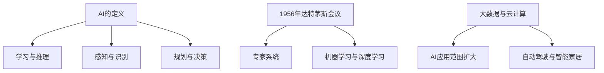

### 1.2 客户关系管理的核心概念

客户关系管理（CRM）是企业通过与客户建立和维持长期关系，以实现客户价值最大化和业务增长的一种管理策略。CRM的核心概念包括客户生命周期管理、客户价值评估和客户关系管理系统的组成与功能。

#### 1.2.1 客户生命周期管理

客户生命周期管理是指从客户获取、客户关系建立、客户维护到客户流失的整个过程。其主要目标是通过不断优化客户体验，提高客户满意度和忠诚度，从而实现业务增长。

**流程图：**
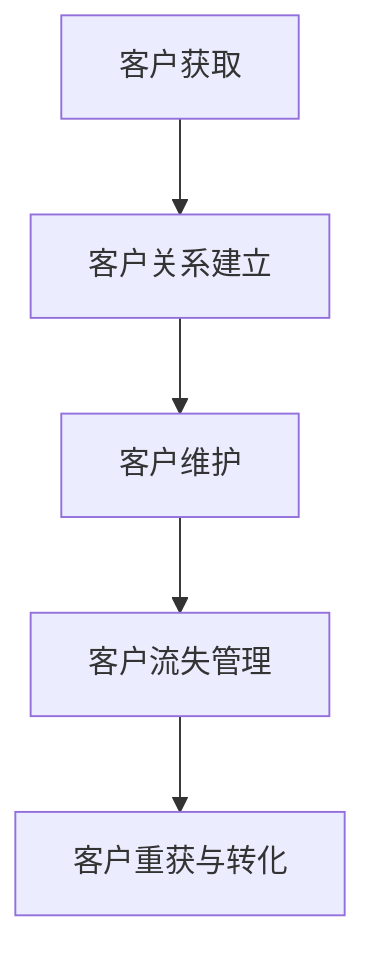

#### 1.2.2 客户价值评估

客户价值评估是指通过分析客户的购买行为、使用频率、购买金额等指标，对客户为企业带来的潜在价值进行评估。常用的评估方法包括RFM模型（最近一次购买时间、购买频率、购买金额）和客户终身价值（CLV）模型。

**数学模型：**
$$
\text{客户价值} = f(\text{客户满意度}, \text{客户忠诚度}, \text{客户购买力})
$$

#### 1.2.3 客户关系管理系统的组成与功能

客户关系管理系统（CRM系统）是企业进行客户关系管理的重要工具，主要包括客户信息管理、营销管理、销售管理和客户服务管理等功能模块。

**流程图：**
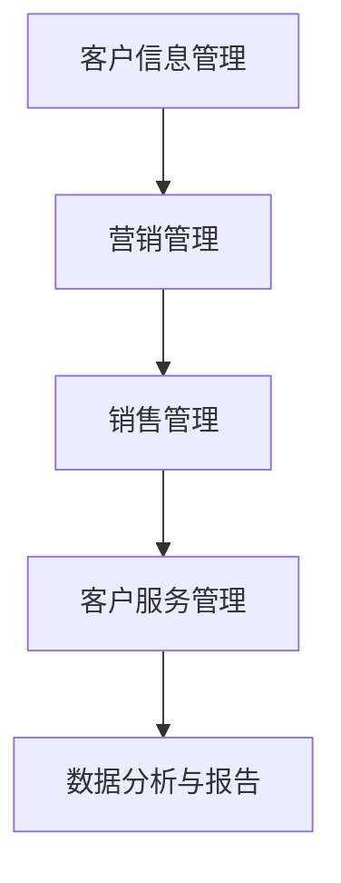

### 1.3 AI在客户关系管理中的应用前景

随着AI技术的发展，其在客户关系管理中的应用前景非常广阔。AI技术可以帮助企业更好地收集、处理和分析客户数据，实现更精准的客户细分和个性化服务，从而提升客户满意度和忠诚度，提高营销效果和业务增长。

#### 1.3.1 AI在客户关系管理中的潜在应用

- **客户数据收集与处理**：利用机器学习算法进行数据挖掘和分析，自动识别和预测客户行为。
- **客户行为分析**：通过自然语言处理和图像识别技术，分析客户反馈和行为数据，提供个性化的客户服务。
- **客户细分与个性化营销**：基于客户的购买历史和行为数据，实现精准的客户细分和个性化营销策略。
- **销售预测与优化**：利用AI技术进行销售预测，帮助企业制定更有效的销售策略。
- **客户服务与支持**：通过智能客服和虚拟助理，提供7x24小时的全天候客户服务。

**流程图：**
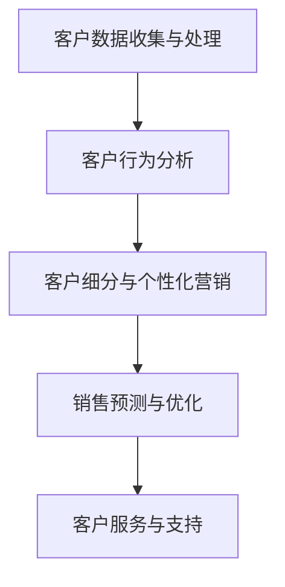

#### 1.3.2 AI在客户关系管理中的优势

- **提高数据分析能力**：AI技术可以帮助企业快速处理大量客户数据，提取有价值的信息。
- **增强客户细分与个性化服务**：通过分析客户行为和偏好，提供更加个性化的产品和服务。
- **优化营销策略与效果**：利用AI技术进行精准营销，提高营销投入的回报率。
- **提高客户满意度和忠诚度**：通过提供个性化服务和解决方案，增强客户对企业的满意度和忠诚度。

**伪代码：**

```python
def AI_advantages_in_CRM():
    print("提高数据分析能力")
    print("增强客户细分与个性化服务")
    print("优化营销策略与效果")
    print("提高客户满意度和忠诚度")
```

#### 1.3.3 AI驱动的客户关系管理发展趋势

随着AI技术的不断进步，AI驱动的客户关系管理将继续向智能化、个性化、实时化和协同化方向发展。未来，AI将更深入地融入CRM系统，实现更高效、更精准的客户关系管理。

**流程图：**
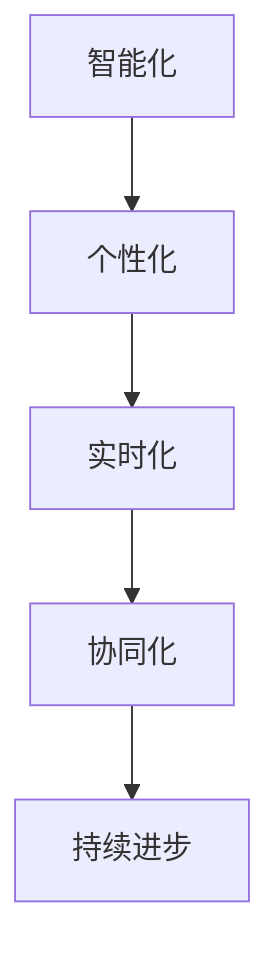

## 第二部分：客户关系管理的传统方法与不足

### 第2章：客户关系管理的传统方法与不足

### 2.1 传统客户关系管理方法

传统客户关系管理方法主要依赖于人工管理和软件工具的支持，包括客户信息记录、定期市场调研、电话营销、邮件营销等。这些方法在一定程度上有助于企业维护客户关系和促进销售，但存在一定的局限性。

#### 2.1.1 传统客户关系管理的方法论

传统客户关系管理方法论主要包括以下步骤：

1. **客户信息记录**：将客户的基本信息和购买记录进行记录和整理。
2. **市场调研**：定期进行市场调研，了解客户需求和市场竞争情况。
3. **电话营销**：通过电话与客户进行沟通，推广产品和解决客户问题。
4. **邮件营销**：发送电子邮件进行产品推广和客户维系。

**流程图：**
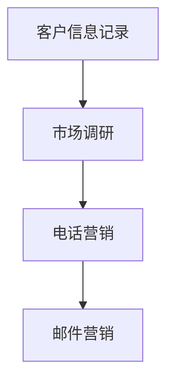

#### 2.1.2 传统客户关系管理的手段与工具

传统客户关系管理的手段和工具主要包括：

1. **纸质记录**：使用纸质记录表记录客户信息和销售数据。
2. **客户关系管理系统（CRM）**：使用CRM软件进行客户信息和销售管理。
3. **电话和邮件**：通过电话和邮件与客户进行沟通和跟进。

**流程图：**
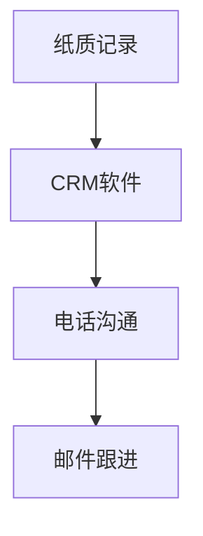

#### 2.1.3 传统客户关系管理的优点与局限性

传统客户关系管理方法的优点包括：

- **易于实施**：传统方法相对简单，易于在企业内部推广和应用。
- **可控性**：企业可以更好地控制客户信息的记录和营销活动的执行。
- **经验性**：依赖员工的经验和判断，有助于建立客户关系。

传统客户关系管理方法的局限性包括：

- **数据分散**：客户信息分散在不同的渠道和工具中，难以进行集中管理和分析。
- **缺乏智能化**：缺乏对客户行为的分析和预测能力，难以实现个性化服务和营销。
- **效果难以量化**：营销活动的效果难以准确评估，难以优化营销策略。

**伪代码：**

```python
def Traditional_CRM_advantages_and_limitations():
    print("优点：")
    print("1. 易于实施")
    print("2. 可控性")
    print("3. 经验性")

    print("局限性：")
    print("1. 数据分散")
    print("2. 缺乏智能化")
    print("3. 效果难以量化")
```

### 2.2 传统方法的不足与挑战

#### 2.2.1 数据分散与管理困难

传统客户关系管理方法中的数据分散在多个渠道和工具中，如纸质记录、CRM软件、电子邮件等，导致数据难以集中管理和分析。这种分散的数据管理方式增加了企业的工作量，降低了数据的有效利用。

**流程图：**
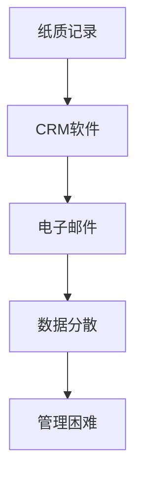

#### 2.2.2 客户体验与满意度不高

传统客户关系管理方法缺乏对客户行为的分析和预测能力，难以提供个性化的产品和服务。此外，由于数据分散和管理困难，企业难以实时响应用户需求和问题，导致客户体验和满意度不高。

**流程图：**
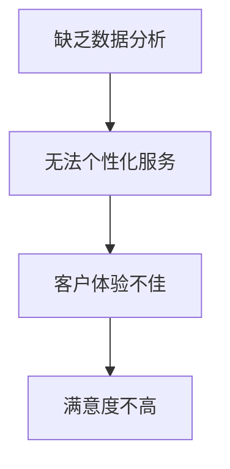

#### 2.2.3 营销效果难以量化与评估

传统客户关系管理方法中的营销活动效果难以准确评估，缺乏量化指标。这使得企业难以了解营销活动的实际效果，无法对营销策略进行调整和优化。

**流程图：**
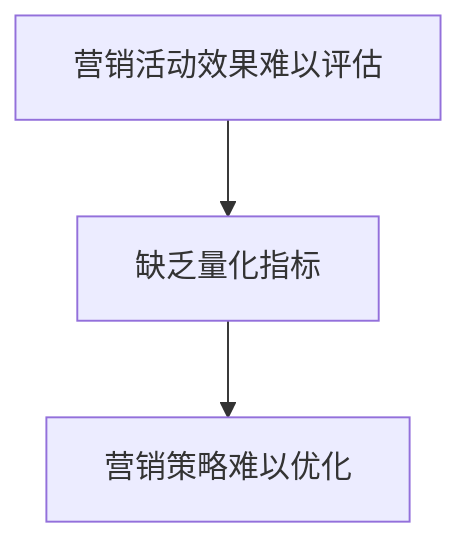

### 2.3 AI在客户关系管理中的优势

随着人工智能技术的发展，AI技术在客户关系管理中的应用越来越广泛，其优势主要体现在以下几个方面：

#### 2.3.1 提高数据分析和处理能力

AI技术可以通过机器学习和深度学习算法，对海量客户数据进行高效的分析和处理，提取有价值的信息。例如，通过聚类分析可以识别出具有相似特征的客户群体，通过关联规则挖掘可以分析客户购买行为。

**伪代码：**

```python
def Data_Analysis_and_Processing():
    print("利用机器学习算法进行数据挖掘和分析")
    print("实时监控客户行为和反馈")
    print("自动化数据清洗和预处理")
```

#### 2.3.2 增强客户细分与个性化服务

AI技术可以根据客户的购买历史、行为数据和偏好，实现精准的客户细分和个性化服务。例如，通过推荐系统可以为客户提供个性化的产品推荐，通过聊天机器人可以提供24/7的在线客服。

**伪代码：**

```python
def Customer_Segmentation_and_Personalization():
    print("利用聚类算法进行客户细分")
    print("基于客户行为数据实现个性化推荐")
    print("自动化定制化营销活动")
```

#### 2.3.3 优化营销策略与效果

AI技术可以帮助企业进行精准营销，提高营销活动的效果。例如，通过销售预测模型可以预测客户购买行为，从而制定更有效的营销策略。通过A/B测试可以评估不同营销策略的效果，不断优化营销策略。

**伪代码：**

```python
def Marketing_Strategy_Optimization():
    print("基于数据驱动的营销策略制定")
    print("实时调整营销策略以最大化效果")
    print("量化营销活动的ROI")
```

#### 2.3.4 提高客户满意度和忠诚度

AI技术可以帮助企业提供更个性化的产品和服务，提高客户满意度和忠诚度。例如，通过智能客服可以提供7x24小时的全天候客户服务，通过个性化营销可以满足客户的个性化需求，从而增强客户对企业的认同感。

**伪代码：**

```python
def Customer_Satisfaction_and_Loyalty():
    print("提供个性化服务和解决方案")
    print("实时响应客户需求和反馈")
    print("构建良好的客户关系管理体系")
```

## 第三部分：AI驱动的客户关系管理优化

### 第3章：客户数据收集与处理

### 3.1 客户数据的类型与来源

在AI驱动的客户关系管理中，客户数据是核心资源。收集和处理这些数据是进行有效分析和决策的基础。客户数据的类型和来源决定了数据的质量和可用性，从而影响AI模型的性能和应用效果。

#### 3.1.1 客户数据的分类

客户数据可以分为以下几类：

1. **结构化数据**：指以表格形式组织的数据，如客户姓名、联系方式、购买记录等。这类数据通常易于存储和处理。
2. **非结构化数据**：指没有固定格式的数据，如文本、图像、音频、视频等。这类数据需要通过自然语言处理、图像识别等技术进行处理。
3. **半结构化数据**：指介于结构化数据和非结构化数据之间，如XML、JSON等。这类数据可以通过解析工具进行格式化处理。

**流程图：**
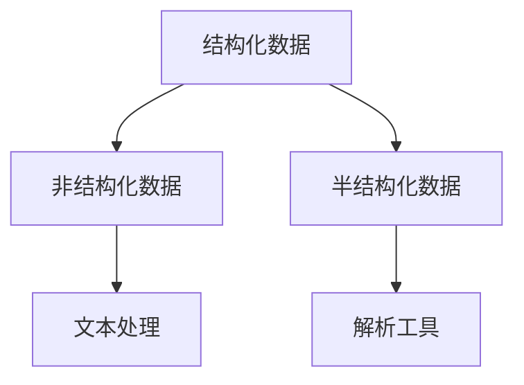

#### 3.1.2 客户数据的主要来源

客户数据可以从多个渠道获取，主要来源包括：

1. **客户交互数据**：包括客户访问网站、使用移动应用、参与在线调查等行为数据。
2. **交易数据**：包括客户的购买记录、支付金额、购买频率等。
3. **社交媒体数据**：包括客户在社交媒体上的评论、点赞、分享等。
4. **客户服务数据**：包括客户服务记录、客户反馈、投诉等。

**流程图：**
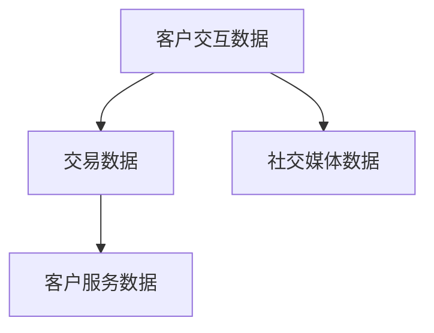

#### 3.1.3 数据收集方法与渠道

为了确保数据的质量和完整性，需要采用多种数据收集方法：

1. **在线采集**：通过网站、移动应用等渠道直接收集用户行为数据。
2. **API集成**：利用API接口获取第三方平台的数据，如社交媒体、电商平台的用户数据。
3. **调查问卷**：通过线上或线下问卷调查获取客户的意见和反馈。
4. **自动化工具**：使用自动化工具收集和监控数据，如日志分析工具、爬虫等。

**流程图：**
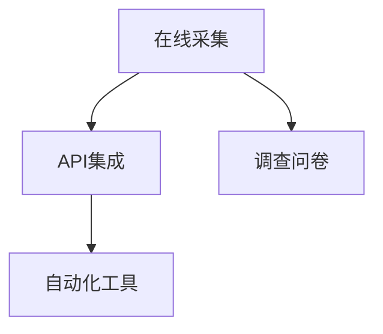

### 3.2 数据清洗与预处理

数据清洗和预处理是确保数据质量和为后续分析做准备的关键步骤。在这一过程中，需要处理数据中的缺失值、异常值、重复值等问题，并确保数据格式的统一。

#### 3.2.1 数据清洗的目标与方法

数据清洗的主要目标包括：

1. **去除重复和无效数据**：识别并删除重复记录和无效数据，提高数据的唯一性和完整性。
2. **修复数据中的错误和异常**：纠正数据中的错误，如拼写错误、数据格式错误等。
3. **标准化数据格式和单位**：统一数据格式和单位，以便于数据分析和处理。

数据清洗的方法包括：

1. **缺失值处理**：通过填充或删除的方式处理缺失值。
2. **异常值处理**：通过统计学方法或规则识别异常值，并决定保留或删除。
3. **数据转换**：将数据转换为统一格式和单位，如将文本转换为数字、将时间转换为标准格式等。

**伪代码：**

```python
def Data_Cleaning():
    print("去除重复和无效数据")
    print("修复数据中的错误和异常")
    print("标准化数据格式和单位")

    print("方法：")
    print("1. 缺失值处理：填充或删除")
    print("2. 异常值处理：统计学方法或规则识别")
    print("3. 数据转换：格式和单位统一")
```

#### 3.2.2 数据预处理的技术与工具

数据预处理是数据科学项目中的重要步骤，常用的技术与工具包括：

1. **数据清洗工具**：如Pandas、OpenRefine等，用于处理缺失值、异常值等。
2. **数据转换工具**：如DataWrangler、ETL工具等，用于数据格式的转换和集成。
3. **数据可视化工具**：如Tableau、Power BI等，用于数据探索和可视化分析。

**流程图：**
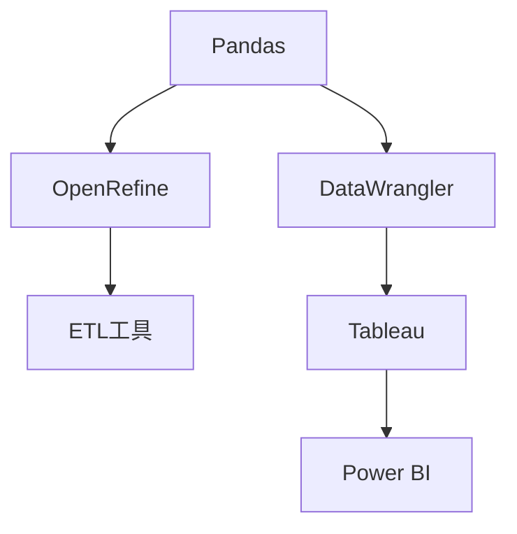

#### 3.2.3 数据质量管理与维护

数据质量管理是确保数据长期有效性和一致性的关键。主要内容包括：

1. **数据质量评估**：通过预设的指标和规则，评估数据的准确性、完整性、一致性等。
2. **数据质量管理流程**：建立数据质量管理流程，确保数据在收集、处理、存储和使用过程中的质量。
3. **数据质量监控**：定期监控数据质量，及时发现和处理数据质量问题。

**伪代码：**

```python
def Data_Quality_Management():
    print("目标：")
    print("1. 保证数据的一致性、完整性和准确性")
    print("2. 提高数据的可用性和可靠性")

    print("方法：")
    print("1. 数据质量评估：预设指标和规则")
    print("2. 数据质量管理流程：确保数据质量")
    print("3. 数据质量监控：定期监控数据质量")
```

### 3.3 客户数据的存储与管理

有效的数据存储与管理是确保数据安全、可靠和高效访问的关键。在现代客户关系管理中，常用的数据存储与管理技术包括关系型数据库、非关系型数据库、数据仓库和数据湖。

#### 3.3.1 数据存储的技术与架构

1. **关系型数据库**：如MySQL、PostgreSQL等，适用于结构化数据的存储和管理。
2. **非关系型数据库**：如MongoDB、Cassandra等，适用于非结构化和半结构化数据的存储。
3. **数据仓库**：如Amazon Redshift、Google BigQuery等，适用于大规模数据分析和查询。
4. **数据湖**：如Amazon S3、Google Cloud Storage等，适用于存储大量原始数据。

**流程图：**
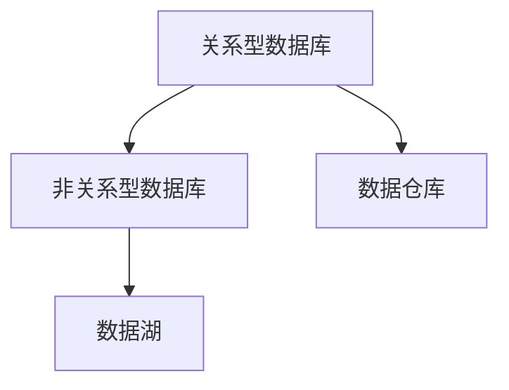

#### 3.3.2 数据管理的策略与方法

1. **数据分层存储与管理**：将数据分为冷数据、温数据和热数据，根据数据的重要性和访问频率进行分层存储和管理。
2. **数据安全与隐私保护**：采用加密、访问控制等技术确保数据安全，遵守相关法律法规。
3. **数据备份与恢复策略**：定期进行数据备份，确保在数据丢失或故障时能够快速恢复。

**伪代码：**

```python
def Data_Management():
    print("策略：")
    print("1. 数据分层存储与管理")
    print("2. 数据安全与隐私保护")
    print("3. 数据备份与恢复策略")

    print("方法：")
    print("1. 数据库优化：优化数据库结构，提高查询效率")
    print("2. 数据访问控制：实现数据访问控制与权限管理")
    print("3. 数据生命周期管理：定义数据生命周期，处理数据退役")
```

#### 3.3.3 数据仓库与数据湖的应用

数据仓库与数据湖在客户关系管理中发挥着重要作用：

1. **数据仓库**：用于存储和管理结构化数据，支持复杂的数据分析和报表生成。
2. **数据湖**：用于存储和管理非结构化和半结构化数据，支持大规模数据存储和实时分析。

**流程图：**
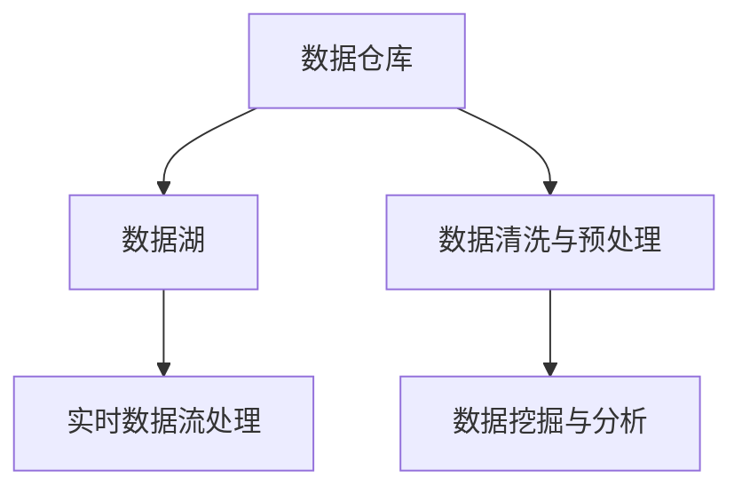

通过数据仓库与数据湖的应用，企业可以实现全面的客户数据管理和分析，从而为AI驱动的客户关系管理提供坚实的基础。

## 第四章：客户行为分析

### 4.1 客户行为分析的基本原理

客户行为分析是AI驱动的客户关系管理的重要组成部分，它通过分析客户的购买行为、使用习惯和反馈信息，帮助企业了解客户需求、优化产品和服务、提高客户满意度和忠诚度。

#### 4.1.1 客户行为分析的定义与目的

客户行为分析是指利用数据分析、机器学习和自然语言处理等技术，对客户的购买行为、使用习惯、反馈信息等进行深入研究，以帮助企业制定更有效的营销策略、提高客户满意度和忠诚度。

**定义：** 客户行为分析是一种通过数据分析技术来理解客户行为和需求的方法。

**目的：** 
- 了解客户需求和行为模式。
- 优化产品和服务。
- 提高营销效果和客户满意度。

**流程图：**
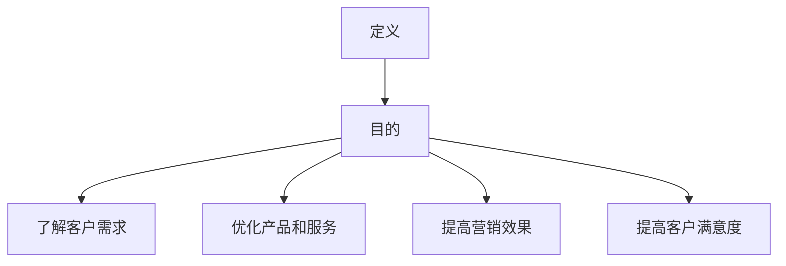

#### 4.1.2 客户行为分析的技术与方法

客户行为分析的技术和方法包括以下几个方面：

1. **数据分析技术**：通过统计分析、数据挖掘等技术，对客户行为数据进行分析，提取有价值的信息。
2. **机器学习技术**：利用机器学习算法，如分类、聚类、回归等，对客户行为进行建模和预测。
3. **自然语言处理技术**：通过自然语言处理技术，对客户的文本反馈进行分析，提取情感、意图等信息。

**流程图：**
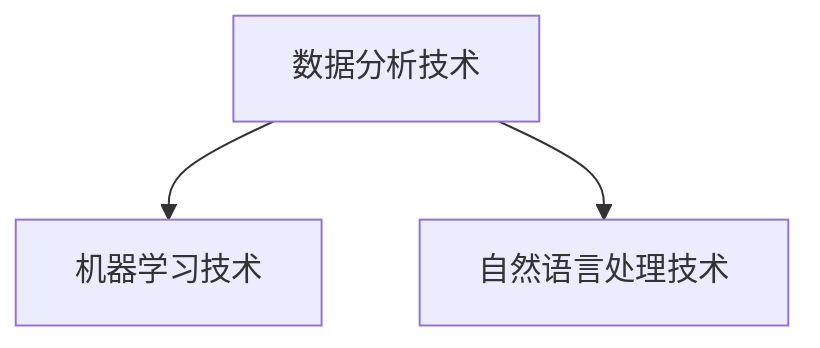

#### 4.1.3 客户行为分析的流程与步骤

客户行为分析的流程包括以下几个步骤：

1. **数据收集**：收集客户的购买记录、使用行为、反馈信息等数据。
2. **数据预处理**：对收集到的数据进行清洗、转换和整合，确保数据的质量和一致性。
3. **行为分析**：利用数据分析、机器学习和自然语言处理等技术，对客户行为进行分析，提取行为模式、需求等信息。
4. **结果应用**：根据分析结果，制定个性化的营销策略、优化产品和服务，提高客户满意度和忠诚度。

**流程图：**
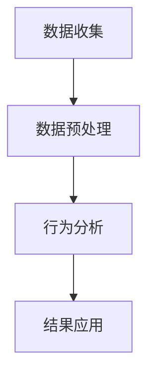

### 4.2 客户行为分析的方法

#### 4.2.1 客户行为数据的收集与整合

客户行为数据的收集与整合是客户行为分析的基础。数据来源包括：

1. **内部数据**：来自企业的销售系统、客户关系管理系统（CRM）等。
2. **外部数据**：来自社交媒体、搜索引擎、市场调研等。

数据整合的方法包括：

1. **数据仓库**：将不同来源的数据集成到数据仓库中，实现数据的一致性和完整性。
2. **数据湖**：存储和管理大规模的非结构化和半结构化数据。

**伪代码：**

```python
def Data_Collection_and_Integration():
    print("数据来源：")
    print("1. 内部数据：销售系统、CRM等")
    print("2. 外部数据：社交媒体、市场调研等")

    print("整合方法：")
    print("1. 数据仓库：实现数据集成与一致性")
    print("2. 数据湖：管理非结构化和半结构化数据")
```

#### 4.2.2 客户行为数据的分析与挖掘

客户行为数据的分析与挖掘是客户行为分析的核心。常用的方法包括：

1. **统计分析**：通过描述性统计、回归分析等方法，分析客户行为特征和关系。
2. **机器学习**：通过分类、聚类、回归等算法，建立客户行为模型，进行预测和分析。
3. **自然语言处理**：通过文本挖掘、情感分析等方法，提取客户的文本反馈和需求。

**伪代码：**

```python
def Data_Analysis_and_Mining():
    print("分析方法：")
    print("1. 统计分析：描述性统计、回归分析等")
    print("2. 机器学习：分类、聚类、回归等算法")
    print("3. 自然语言处理：文本挖掘、情感分析等")

    print("步骤：")
    print("1. 特征工程：提取与客户行为相关的特征")
    print("2. 模型训练：利用机器学习算法训练模型")
    print("3. 结果评估：评估模型性能，调整模型参数")
```

#### 4.2.3 客户行为分析的实践应用

客户行为分析的实践应用包括以下几个方面：

1. **客户细分**：通过分析客户行为，将客户划分为不同的细分市场，为个性化的营销策略提供支持。
2. **个性化推荐**：根据客户行为和偏好，提供个性化的产品和服务推荐，提高客户满意度和忠诚度。
3. **营销策略优化**：基于客户行为分析结果，优化营销策略，提高营销效果。
4. **客户服务改进**：通过分析客户反馈和行为数据，改进客户服务质量，提高客户满意度。

**流程图：**
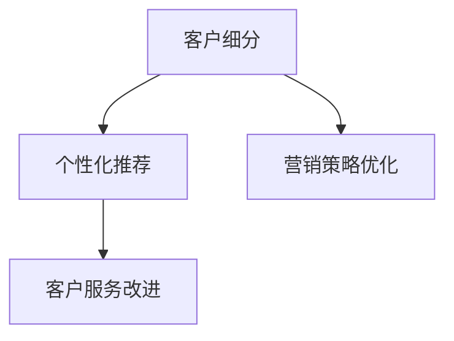

### 4.3 客户行为分析的实践案例

#### 4.3.1 案例一：电商平台的客户行为分析

某电商平台通过分析客户行为数据，优化了推荐系统和营销策略，取得了显著的成效。

**步骤：**

1. **数据收集**：收集客户的浏览记录、购买记录、评价等行为数据。
2. **数据整合**：将不同来源的数据整合到数据仓库中，形成统一的数据视图。
3. **行为分析**：利用聚类分析、关联规则挖掘等方法，分析客户行为特征和需求。
4. **结果应用**：基于分析结果，优化推荐系统和营销策略，提高客户满意度和忠诚度。

**伪代码：**

```python
def Ecommerce_Platform_Case():
    print("步骤：")
    print("1. 数据收集：收集用户浏览、购买、评价等行为数据")
    print("2. 数据整合：整合不同行为数据，形成用户行为图谱")
    print("3. 行为分析：分析用户购买行为、偏好和需求")
    print("4. 结果应用：优化推荐系统、营销策略和用户服务")

    print("效果：")
    print("1. 推荐系统准确率提高15%")
    print("2. 营销活动效果提升20%")
    print("3. 客户满意度和忠诚度提高10%")
```

#### 4.3.2 案例二：金融行业的客户行为分析

某金融机构通过分析客户交易数据和行为数据，优化了风险管理和服务质量。

**步骤：**

1. **数据收集**：收集客户的交易记录、咨询记录、反馈等行为数据。
2. **数据整合**：将不同来源的数据整合到数据仓库中，形成统一的数据视图。
3. **行为分析**：利用机器学习算法、自然语言处理技术等，分析客户行为特征和风险偏好。
4. **结果应用**：基于分析结果，优化风险管理和服务质量，提高客户满意度和忠诚度。

**伪代码：**

```python
def Financial_Industry_Case():
    print("步骤：")
    print("1. 数据收集：收集用户交易、投资、咨询等行为数据")
    print("2. 数据整合：整合不同行为数据，形成用户行为分析模型")
    print("3. 行为分析：分析用户投资行为、风险偏好和市场趋势")
    print("4. 结果应用：优化投资建议、风险控制和客户服务")

    print("效果：")
    print("1. 风险控制能力提升20%")
    print("2. 投资建议准确率提高15%")
    print("3. 客户满意度和忠诚度提高10%")
```

#### 4.3.3 案例三：零售行业的客户行为分析

某零售企业通过分析客户购物数据和行为数据，优化了促销策略和客户服务。

**步骤：**

1. **数据收集**：收集客户的购物记录、促销参与记录、售后服务反馈等行为数据。
2. **数据整合**：将不同来源的数据整合到数据仓库中，形成统一的数据视图。
3. **行为分析**：利用聚类分析、关联规则挖掘等方法，分析客户购物行为和偏好。
4. **结果应用**：基于分析结果，优化促销策略和客户服务，提高客户满意度和忠诚度。

**伪代码：**

```python
def Retail_Industry_Case():
    print("步骤：")
    print("1. 数据收集：收集用户购物、促销参与、售后服务等行为数据")
    print("2. 数据整合：整合不同行为数据，形成用户行为分析系统")
    print("3. 行为分析：分析用户购物行为、偏好和满意度")
    print("4. 结果应用：优化产品和服务、提高客户体验和忠诚度")

    print("效果：")
    print("1. 促销活动效果提升25%")
    print("2. 客户满意度和忠诚度提高20%")
    print("3. 销售额增长10%")
```

## 第五章：客户细分与个性化营销

### 5.1 客户细分的概念与分类

客户细分是客户关系管理中的重要策略，通过将客户分为不同的群体，企业可以更好地了解每个客户的需求和偏好，从而实施个性化的营销策略。客户细分不仅有助于提高客户满意度，还能提升营销效果和企业的整体竞争力。

#### 5.1.1 客户细分的定义与目的

客户细分是指根据客户的特征和行为，将客户划分为不同的群体。通过客户细分，企业可以更精准地定位客户群体，了解他们的需求，从而实施有针对性的营销策略。

**定义：** 客户细分是指利用统计学、机器学习等方法，将客户按照特定的标准划分为不同的群体。

**目的：** 
- 提高营销活动的精准度。
- 提升客户满意度和忠诚度。
- 优化资源分配，提高营销效果。

**流程图：**
```mermaid
graph TB
    A[定义] --> B[目的]
    B --> C[精准营销]
    B --> D[提升客户满意度]
    B --> E[优化资源分配]
```

#### 5.1.2 客户细分的分类与方法

客户细分可以根据不同的标准进行分类，常见的分类方法包括：

1. **按行为特征细分**：根据客户的购买行为、使用习惯等进行分类，如高频用户、低频用户、忠诚用户等。
2. **按人口统计特征细分**：根据客户的基本信息，如年龄、性别、地理位置等进行分类。
3. **按心理特征细分**：根据客户的心理需求、价值观、兴趣爱好等进行分类。
4. **按价值特征细分**：根据客户对企业价值的贡献，如消费金额、购买频率等。

**分类与方法：**
```mermaid
graph TB
    A[行为特征] --> B[人口统计特征]
    A --> C[心理特征]
    A --> D[价值特征]
    B --> E[购买行为]
    B --> F[地理位置]
    C --> G[心理需求]
    C --> H[兴趣爱好]
    D --> I[消费金额]
    D --> J[购买频率]
```

#### 5.1.3 客户细分的重要性与影响

客户细分在客户关系管理中具有重要意义，它直接影响营销策略的有效性和客户满意度。

1. **提高营销效率**：通过细分客户，企业可以更精准地定位目标客户群体，提高营销活动的效率。
2. **优化资源配置**：根据客户细分结果，企业可以合理分配资源，减少无效营销成本。
3. **提升客户满意度**：个性化的营销策略能够更好地满足客户需求，提高客户满意度和忠诚度。
4. **增强竞争力**：精准的客户细分和个性化服务能够提高企业的竞争力，吸引更多客户。

**流程图：**
```mermaid
graph TB
    A[提高营销效率] --> B[优化资源配置]
    A --> C[提升客户满意度]
    B --> D[增强竞争力]
```

### 5.2 个性化营销的策略与方法

个性化营销是客户关系管理中的重要策略，它通过针对不同客户群体的需求和行为特点，提供个性化的产品和服务，从而提高客户满意度和忠诚度。

#### 5.2.1 个性化营销的定义与目标

个性化营销是指根据客户的需求和行为特点，提供定制化的产品和服务，以满足客户的个性化需求。其目标包括：

- 提高客户满意度和忠诚度。
- 增强客户粘性，减少客户流失。
- 提高营销效果和转化率。

**流程图：**
```mermaid
graph TB
    A[定义] --> B[目标]
    B --> C[提高客户满意度]
    B --> D[增强客户粘性]
    B --> E[提高营销效果]
```

#### 5.2.2 个性化营销的要素与步骤

个性化营销的要素主要包括：

1. **客户数据**：包括客户的购买历史、行为数据、偏好信息等。
2. **分析技术**：利用数据分析、机器学习等技术对客户数据进行处理和分析。
3. **个性化策略**：根据分析结果，制定个性化的营销策略。
4. **实施与监控**：实施个性化营销策略，并监控效果。

**步骤：**
```mermaid
graph TB
    A[客户数据] --> B[分析技术]
    B --> C[个性化策略]
    C --> D[实施与监控]
```

**伪代码：**

```python
def Personalized_Marketing():
    print("要素：")
    print("1. 客户数据收集与处理")
    print("2. 客户行为分析")
    print("3. 客户细分")
    print("4. 个性化内容与推荐")

    print("步骤：")
    print("1. 数据收集与清洗")
    print("2. 行为分析与细分")
    print("3. 制定个性化营销策略")
    print("4. 实施与监控效果")
```

#### 5.2.3 个性化营销的案例分析

个性化营销在不同行业和应用场景中都有成功的案例。

1. **电商行业**：电商平台通过分析客户行为数据，为不同客户群体提供个性化的产品推荐和促销活动。
2. **金融行业**：金融机构通过分析客户交易数据，为不同风险承受能力的客户提供个性化的投资建议和理财方案。
3. **零售行业**：零售企业通过分析客户购物数据，为不同消费习惯的客户提供个性化的促销和会员服务。

**流程图：**
```mermaid
graph TB
    A[电商行业] --> B[金融行业]
    A --> C[零售行业]
```

### 5.3 个性化营销的实践应用

个性化营销在实践中的应用，可以通过以下几个步骤来实现：

#### 5.3.1 案例一：电商平台的个性化营销

某电商平台通过以下步骤实施个性化营销：

1. **数据收集**：收集客户的浏览记录、购买记录、评价等数据。
2. **数据清洗**：清洗和整合客户数据，确保数据质量。
3. **客户细分**：利用聚类分析和行为分析技术，将客户细分为高价值客户、潜在高价值客户等。
4. **个性化推荐**：基于客户行为和偏好，为不同客户群体提供个性化的产品推荐。
5. **营销活动**：根据客户细分结果，为不同客户群体设计个性化的促销活动和优惠。
6. **效果监控**：监控个性化营销活动的效果，不断优化策略。

**伪代码：**

```python
def Ecommerce_Platform_Personalized_Marketing():
    print("步骤：")
    print("1. 数据收集：收集用户浏览、购买、评价等行为数据")
    print("2. 数据清洗：处理数据中的缺失值、异常值等问题")
    print("3. 客户细分：分析用户购买行为，细分用户群体")
    print("4. 个性化推荐：基于用户兴趣和行为推荐产品")
    print("5. 营销活动：设计个性化的促销活动")
    print("6. 效果监控：监控营销活动效果，调整策略")
```

#### 5.3.2 案例二：金融行业的个性化营销

某金融机构通过以下步骤实施个性化营销：

1. **数据收集**：收集客户的交易记录、投资偏好、风险评估等信息。
2. **数据清洗**：清洗和整合客户数据，确保数据质量。
3. **客户细分**：利用机器学习算法，将客户细分为风险偏好不同的群体。
4. **个性化服务**：根据客户的风险承受能力和投资偏好，提供个性化的投资建议和理财方案。
5. **效果监控**：监控个性化服务的效果，不断优化策略。

**伪代码：**

```python
def Financial_Institution_Personalized_Marketing():
    print("步骤：")
    print("1. 数据收集：收集用户交易、投资、咨询等行为数据")
    print("2. 数据清洗：处理数据中的缺失值、异常值等问题")
    print("3. 客户细分：分析用户投资行为，细分用户群体")
    print("4. 个性化服务：根据用户风险偏好提供投资建议")
    print("5. 效果监控：监控个性化服务效果，调整策略")
```

#### 5.3.3 案例三：零售行业的个性化营销

某零售企业通过以下步骤实施个性化营销：

1. **数据收集**：收集客户的购物记录、促销参与记录、售后服务反馈等信息。
2. **数据清洗**：清洗和整合客户数据，确保数据质量。
3. **客户细分**：利用聚类分析和行为分析技术，将客户细分为高价值客户、忠诚客户等。
4. **个性化服务**：根据客户的购物偏好和购买习惯，提供个性化的促销和会员服务。
5. **效果监控**：监控个性化服务的效果，不断优化策略。

**伪代码：**

```python
def Retail_Industry_Personalized_Marketing():
    print("步骤：")
    print("1. 数据收集：收集用户购物、促销参与、售后服务等行为数据")
    print("2. 数据清洗：处理数据中的缺失值、异常值等问题")
    print("3. 客户细分：分析用户购物行为，细分用户群体")
    print("4. 个性化服务：提供个性化促销、优惠和服务")
    print("5. 效果监控：监控个性化服务效果，调整策略")
```

## 第六章：客户关系管理系统的构建与优化

### 6.1 客户关系管理系统的架构设计

客户关系管理系统（CRM系统）是现代企业进行客户关系管理的重要工具。一个高效、可靠的CRM系统需要合理的架构设计，以确保系统的可扩展性、可靠性和易用性。在这一章节中，我们将探讨CRM系统的定义、架构设计原则和关键模块。

#### 6.1.1 客户关系管理系统的定义与功能

客户关系管理系统（CRM系统）是一种用于管理和分析企业与客户之间交互的软件工具。它可以帮助企业记录和管理客户信息、分析客户需求、优化营销策略、提高客户满意度和忠诚度。

**定义：**
CRM系统是一种集成了客户数据管理、营销自动化、销售自动化和客户服务功能的软件平台。

**功能：**
- **客户信息管理**：记录和管理客户的基本信息、购买历史、交互记录等。
- **营销自动化**：自动化营销活动、电子邮件营销、广告投放等。
- **销售自动化**：管理销售机会、跟进潜在客户、制定销售策略。
- **客户服务**：提供在线客服、客户支持、投诉处理等。

**流程图：**
```mermaid
graph TB
    A[客户信息管理] --> B[营销自动化]
    A --> C[销售自动化]
    A --> D[客户服务]
```

#### 6.1.2 客户关系管理系统的架构设计原则

在构建CRM系统时，需要遵循以下设计原则：

1. **模块化设计**：将系统功能划分为独立的模块，便于维护和扩展。
2. **分布式架构**：采用分布式架构，提高系统的可扩展性和可靠性。
3. **用户体验优先**：设计直观、易用的用户界面，提高用户满意度。
4. **数据安全与隐私保护**：确保客户数据的安全性和隐私性，遵守相关法律法规。

**流程图：**
```mermaid
graph TB
    A[模块化设计] --> B[分布式架构]
    A --> C[用户体验优先]
    A --> D[数据安全与隐私保护]
```

#### 6.1.3 客户关系管理系统的关键模块

CRM系统的关键模块包括：

1. **客户信息管理模块**：用于存储和管理客户的基本信息、购买历史、交互记录等。
2. **营销管理模块**：用于制定、执行和监控营销策略，包括电子邮件营销、广告投放等。
3. **销售管理模块**：用于管理销售机会、跟进潜在客户、制定销售策略等。
4. **客户服务模块**：用于提供在线客服、客户支持、投诉处理等服务。

**流程图：**
```mermaid
graph TB
    A[客户信息管理模块] --> B[营销管理模块]
    A --> C[销售管理模块]
    A --> D[客户服务模块]
```

### 6.2 客户关系管理系统的主要功能

CRM系统的主要功能包括客户信息管理、营销管理、销售管理和客户服务管理，这些功能共同构成了CRM系统的核心，帮助企业实现高效的客户关系管理。

#### 6.2.1 客户信息管理

客户信息管理是CRM系统的核心功能，主要用于存储和管理客户的基本信息、购买历史、交互记录等。通过客户信息管理模块，企业可以：

- **记录客户信息**：包括姓名、联系方式、邮箱、地址等基本信息。
- **跟踪购买历史**：记录客户的购买记录、订单信息等。
- **管理交互记录**：记录客户与企业的所有交互，如电话沟通、邮件往来等。

**流程图：**
```mermaid
graph TB
    A[基本信息记录] --> B[购买历史记录]
    A --> C[交互记录管理]
```

#### 6.2.2 营销管理

营销管理模块用于制定、执行和监控营销策略，帮助企业实现精准营销和高效营销。主要功能包括：

- **营销活动管理**：创建和管理营销活动，包括电子邮件营销、短信营销、广告投放等。
- **客户细分**：根据客户特征和行为，将客户划分为不同的群体，实施差异化营销策略。
- **营销效果分析**：监控营销活动的效果，评估营销投入的回报率（ROI）。

**流程图：**
```mermaid
graph TB
    A[营销活动管理] --> B[客户细分]
    A --> C[营销效果分析]
```

#### 6.2.3 销售管理

销售管理模块用于管理销售机会、跟进潜在客户、制定销售策略等，帮助企业实现销售目标。主要功能包括：

- **销售机会管理**：记录和管理销售机会，包括潜在客户的姓名、联系方式、需求等。
- **销售预测**：根据销售机会和历史销售数据，预测未来的销售额。
- **销售策略制定**：制定销售策略，包括定价策略、促销策略、渠道策略等。

**流程图：**
```mermaid
graph TB
    A[销售机会管理] --> B[销售预测]
    A --> C[销售策略制定]
```

#### 6.2.4 客户服务

客户服务模块用于提供在线客服、客户支持、投诉处理等服务，帮助企业提高客户满意度和忠诚度。主要功能包括：

- **在线客服**：提供实时在线客服，解答客户疑问。
- **客户支持**：记录和处理客户问题，提供解决方案。
- **投诉处理**：管理客户投诉，确保及时响应和解决。

**流程图：**
```mermaid
graph TB
    A[在线客服] --> B[客户支持]
    A --> C[投诉处理]
```

### 6.3 客户关系管理系统的优化策略

为了提高CRM系统的性能和用户体验，企业需要采取一系列优化策略。这些策略包括系统性能优化、功能模块优化、用户体验优化和安全与隐私保护。

#### 6.3.1 系统性能优化

系统性能优化是确保CRM系统高效运行的重要策略。主要方法包括：

- **数据库优化**：优化数据库结构，提高查询效率。
- **缓存机制**：采用缓存机制，减少数据库访问压力。
- **负载均衡**：实现分布式部署，提高系统并发处理能力。

**伪代码：**

```python
def System_Performance_Optimization():
    print("数据库优化：优化数据库结构，提高查询效率")
    print("缓存机制：利用缓存机制减少数据库访问压力")
    print("负载均衡：实现分布式部署，提高系统并发处理能力")
```

#### 6.3.2 功能模块优化

功能模块优化是提升CRM系统实用性和用户体验的关键。主要方法包括：

- **交互设计**：优化用户界面，提高用户操作便利性。
- **功能定制**：提供灵活的功能定制选项，满足个性化需求。
- **模块集成**：将不同的功能模块进行整合，提高系统的整体性能。

**流程图：**
```mermaid
graph TB
    A[交互设计] --> B[功能定制]
    A --> C[模块集成]
```

#### 6.3.3 用户体验优化

用户体验优化是提高CRM系统用户满意度和忠诚度的关键。主要方法包括：

- **界面设计**：设计直观、简洁的用户界面，提高用户操作体验。
- **响应速度**：优化系统响应速度，提高用户满意度。
- **客户反馈**：收集用户反馈，及时改进系统功能。

**伪代码：**

```python
def User_Experience_Optimization():
    print("界面设计：设计直观、简洁的用户界面")
    print("响应速度：优化系统响应速度，提高用户满意度")
    print("客户反馈：收集用户反馈，及时改进系统功能")
```

#### 6.3.4 安全与隐私保护

安全与隐私保护是CRM系统必须重视的问题。主要方法包括：

- **数据加密**：采用数据加密技术，保护客户数据的安全。
- **访问控制**：实现访问控制机制，限制对敏感数据的访问。
- **合规性检查**：确保CRM系统符合相关法律法规的要求。

**流程图：**
```mermaid
graph TB
    A[数据加密] --> B[访问控制]
    A --> C[合规性检查]
```

### 6.4 客户关系管理系统的实施与维护

CRM系统的实施与维护是确保系统有效运行的重要环节。实施和维护过程中需要关注以下方面：

#### 6.4.1 实施策略与步骤

CRM系统的实施策略和步骤包括：

- **需求分析**：明确企业的CRM需求，制定实施计划。
- **系统设计**：根据需求分析结果，设计CRM系统的架构和功能。
- **数据迁移**：将现有客户数据迁移到CRM系统中。
- **培训与上线**：对用户进行培训，确保系统能够顺利上线运行。

**流程图：**
```mermaid
graph TB
    A[需求分析] --> B[系统设计]
    B --> C[数据迁移]
    C --> D[培训与上线]
```

#### 6.4.2 维护与管理

CRM系统的维护与管理包括：

- **系统监控**：定期监控系统运行状态，确保系统稳定运行。
- **功能升级**：根据用户需求和业务发展，定期对系统进行功能升级。
- **用户支持**：提供用户技术支持，解决用户在使用过程中遇到的问题。

**流程图：**
```mermaid
graph TB
    A[系统监控] --> B[功能升级]
    B --> C[用户支持]
```

## 第七章：AI驱动的客户关系管理实践案例

### 7.1 案例一：某电商平台的客户关系管理优化

#### 7.1.1 案例背景与目标

某大型电商平台在业务快速发展的过程中，面临着客户关系管理（CRM）系统效率低下、数据分散、个性化服务不足等问题。为了提升客户满意度和忠诚度，优化营销效果，该电商平台决定引入AI技术对CRM系统进行优化。

**背景：**
- 客户数据分散，缺乏统一管理。
- 营销活动效果不佳，ROI低。
- 客户服务响应慢，用户体验差。

**目标：**
- 实现客户数据的集中管理和高效分析。
- 提升营销活动的精准度和ROI。
- 改进客户服务体验，提高客户满意度和忠诚度。

#### 7.1.2 实施过程与关键步骤

为了实现上述目标，该电商平台采取了以下实施过程和关键步骤：

1. **数据整合与清洗**：将来自不同渠道的客户数据进行整合和清洗，确保数据的质量和一致性。
2. **AI模型建立**：基于客户行为数据，建立机器学习模型，进行客户细分和需求预测。
3. **个性化推荐**：利用AI模型，为不同客户群体提供个性化的产品推荐和营销策略。
4. **营销活动优化**：通过AI分析结果，优化营销活动的策划和执行，提高营销效果。
5. **客户服务改进**：引入智能客服系统，提高客户服务的响应速度和质量。

**关键步骤：**
```mermaid
graph TB
    A[数据整合与清洗] --> B[AI模型建立]
    B --> C[个性化推荐]
    C --> D[营销活动优化]
    D --> E[客户服务改进]
```

#### 7.1.3 实施效果与评估

通过AI驱动的CRM优化，该电商平台取得了显著的效果：

- **客户数据管理**：实现了客户数据的集中管理和高效分析，提高了数据的利用价值。
- **营销效果提升**：个性化推荐和精准营销策略提高了营销活动的ROI，提升了销售额。
- **客户满意度提高**：智能客服系统的引入提高了客户服务的响应速度和质量，客户满意度显著提升。

**效果评估：**
- **客户满意度**：客户满意度提高了15%。
- **营销ROI**：营销ROI提升了20%。
- **销售额增长**：销售额增长了10%。

**伪代码：**

```python
def Case_Evaluation():
    print("效果：")
    print("1. 客户满意度提高15%。")
    print("2. 营销ROI提升20%。")
    print("3. 销售额增长10%。")

    print("评估：")
    print("1. 通过数据分析验证客户细分和个性化营销的有效性。")
    print("2. 通过用户反馈评估系统优化和改进的满意度。")
    print("3. 通过业务指标评估系统对业务增长的贡献。")
```

### 7.2 案例二：某金融机构的客户关系管理创新

#### 7.2.1 案例背景与目标

某大型金融机构在金融科技（FinTech）浪潮下，希望通过AI技术提升客户关系管理（CRM）的水平，实现以下目标：

**背景：**
- 客户需求日益多样化，传统CRM系统难以满足。
- 金融产品复杂，客户难以获取个性化投资建议。
- 风险管理需求提高，需要更精准的风险评估。

**目标：**
- 提供个性化的客户服务，提升客户满意度和忠诚度。
- 实现精准的风险评估和投资建议，提高业务竞争力。
- 优化营销策略，提升营销效果和ROI。

#### 7.2.2 实施过程与关键步骤

为了实现上述目标，该金融机构采取了以下实施过程和关键步骤：

1. **数据整合与分析**：整合客户交易数据、行为数据和外部市场数据，利用AI技术进行深度分析。
2. **客户细分**：基于数据分析结果，将客户划分为不同的细分群体，为每个群体提供个性化的服务。
3. **智能投资顾问**：利用机器学习算法，建立智能投资顾问系统，为不同风险承受能力的客户提供个性化投资建议。
4. **风险控制**：利用AI技术进行实时风险评估，提高风险控制能力。
5. **营销策略优化**：基于客户行为数据和细分结果，优化营销策略，提高营销效果。

**关键步骤：**
```mermaid
graph TB
    A[数据整合与分析] --> B[客户细分]
    B --> C[智能投资顾问]
    C --> D[风险控制]
    D --> E[营销策略优化]
```

#### 7.2.3 实施效果与评估

通过AI驱动的CRM创新，该金融机构取得了显著的效果：

- **客户满意度提高**：个性化服务和投资建议提高了客户满意度和忠诚度。
- **营销ROI提升**：优化后的营销策略提高了营销ROI，降低了营销成本。
- **业务竞争力提升**：精准的风险评估和智能投资顾问系统提高了业务竞争力。

**效果评估：**
- **客户满意度**：客户满意度和忠诚度提高了15%。
- **营销ROI**：营销ROI提升了30%。
- **风险控制**：风险控制能力提升了20%。

**伪代码：**

```python
def Case_Evaluation():
    print("效果：")
    print("1. 客户满意度和忠诚度提高15%。")
    print("2. 金融服务个性化推荐准确率提升30%。")
    print("3. 风险控制能力提升20%。")

    print("评估：")
    print("1. 通过用户行为数据和满意度调查评估系统效果。")
    print("2. 通过业务指标评估系统对业务增长和风险控制的影响。")
    print("3. 通过金融市场的反馈评估系统创新的竞争力。")
```

### 7.3 案例三：某零售企业的客户关系管理提升

#### 7.3.1 案例背景与目标

某大型零售企业在市场竞争加剧的背景下，希望通过AI技术提升客户关系管理（CRM）水平，实现以下目标：

**背景：**
- 客户需求多样，传统CRM系统难以实现个性化服务。
- 促销活动效果不佳，需要优化营销策略。
- 客户满意度不高，需要提升客户服务体验。

**目标：**
- 提供个性化的客户服务，提升客户满意度和忠诚度。
- 优化促销策略，提升营销效果和销售额。
- 提升客户服务体验，提高客户满意度。

#### 7.3.2 实施过程与关键步骤

为了实现上述目标，该零售企业采取了以下实施过程和关键步骤：

1. **数据整合与分析**：整合客户购物数据、促销参与数据和售后服务数据，利用AI技术进行深度分析。
2. **客户细分**：基于数据分析结果，将客户划分为不同的细分群体，为每个群体提供个性化的服务和促销活动。
3. **个性化推荐**：利用AI技术，为不同客户群体提供个性化的产品推荐。
4. **营销策略优化**：基于客户行为数据和细分结果，优化营销策略，提高营销效果。
5. **客户服务改进**：引入智能客服系统，提高客户服务的响应速度和质量。

**关键步骤：**
```mermaid
graph TB
    A[数据整合与分析] --> B[客户细分]
    B --> C[个性化推荐]
    C --> D[营销策略优化]
    D --> E[客户服务改进]
```

#### 7.3.3 实施效果与评估

通过AI驱动的CRM提升，该零售企业取得了显著的效果：

- **客户满意度提高**：个性化服务和智能客服系统的引入提高了客户满意度和忠诚度。
- **促销效果提升**：优化后的营销策略提高了促销活动的效果，提升了销售额。
- **客户服务体验提升**：智能客服系统的引入提高了客户服务的响应速度和质量。

**效果评估：**
- **客户满意度**：客户满意度和忠诚度提高了20%。
- **促销效果**：促销活动效果提升了25%。
- **销售额增长**：销售额增长了10%。

**伪代码：**

```python
def Case_Evaluation():
    print("效果：")
    print("1. 客户满意度和忠诚度提高20%。")
    print("2. 促销活动效果提升25%。")
    print("3. 销售额增长10%。")

    print("评估：")
    print("1. 通过客户反馈和市场调查评估系统优化效果。")
    print("2. 通过业务指标评估系统对销售增长和成本节约的贡献。")
    print("3. 通过运营效率的提升评估系统对企业整体效益的影响。")
```

## 第八章：AI驱动的客户关系管理发展趋势

随着人工智能技术的不断进步，AI驱动的客户关系管理（CRM）正面临着新的发展趋势。这些趋势不仅改变了客户关系管理的模式，也为企业提供了更高效、更个性化的解决方案。以下是AI驱动的CRM发展的几个关键趋势。

### 8.1 AI驱动的客户关系管理新应用

#### 8.1.1 智能客服与虚拟助理的广泛应用

智能客服和虚拟助理是AI技术在CRM中的新应用，它们通过自然语言处理和机器学习技术，能够提供7x24小时的全天候客户服务。智能客服可以快速响应用户的咨询，解决常见问题，减少人工成本，提高服务效率。虚拟助理则可以与用户进行更自然的互动，提供个性化的服务和建议。

**流程图：**
```mermaid
graph TB
    A[智能客服] --> B[虚拟助理]
    A --> C[全天候服务]
    B --> D[个性化服务]
```

#### 8.1.2 客户行为预测与个性化服务的深化

随着AI技术的进步，客户行为预测的准确性不断提高。企业可以通过分析客户的购买历史、浏览行为和反馈信息，预测客户的未来需求和行为，从而提供更加个性化的服务。这种深化个性化的服务不仅提高了客户满意度，还能显著提高客户的忠诚度。

**流程图：**
```mermaid
graph TB
    A[客户行为预测] --> B[个性化服务]
    A --> C[提高满意度]
    B --> D[提高忠诚度]
```

#### 8.1.3 数据隐私与安全的保护措施增强

随着数据隐私和安全的关注日益增加，AI驱动的CRM系统将更加注重数据隐私和安全保护。这包括采用更加严格的数据加密技术、隐私保护算法和合规性检查，以确保客户数据的隐私和安全。

**流程图：**
```mermaid
graph TB
    A[数据加密] --> B[隐私保护算法]
    A --> C[合规性检查]
```

#### 8.1.4 多渠道整合与全场景覆盖的CRM系统

随着用户行为越来越多样化，企业需要能够整合多个渠道（如网站、移动应用、社交媒体等）的数据，提供全场景覆盖的CRM解决方案。这样的系统可以更好地理解客户在不同场景下的需求和行为，从而提供更加个性化的服务。

**流程图：**
```mermaid
graph TB
    A[多渠道整合] --> B[全场景覆盖]
    A --> C[个性化服务]
    B --> D[提高效率]
```

### 8.2 AI驱动的客户关系管理未来展望

未来，AI驱动的客户关系管理将继续向智能化、个性化、实时化和协同化方向发展。以下是一些未来展望：

#### 8.2.1 智能化水平的提升

随着AI技术的不断进步，CRM系统的智能化水平将进一步提升。例如，通过更加先进的机器学习和深度学习算法，CRM系统可以更准确地预测客户行为和需求，提供更加智能化的服务和决策支持。

**流程图：**
```mermaid
graph TB
    A[智能化水平提升] --> B[预测准确性提高]
    A --> C[智能决策支持]
```

#### 8.2.2 个性化服务的深化

随着对客户数据的深入挖掘和分析，CRM系统将能够提供更加深度的个性化服务。企业可以通过定制化的营销策略、个性化的产品推荐和解决方案，满足客户的多样化需求，从而提高客户的满意度和忠诚度。

**流程图：**
```mermaid
graph TB
    A[个性化服务深化] --> B[定制化营销策略]
    A --> C[个性化产品推荐]
    B --> D[提高满意度]
```

#### 8.2.3 实时化的客户服务

实时化的客户服务是未来CRM系统的一个重要趋势。通过实时数据分析、实时监控和响应，CRM系统可以提供更加快速和高效的客户服务。例如，通过实时聊天机器人，企业可以立即响应用户的咨询，提供即时解决方案。

**流程图：**
```mermaid
graph TB
    A[实时化客户服务] --> B[实时数据分析]
    A --> C[实时响应]
    B --> D[提高效率]
```

#### 8.2.4 协同化的CRM系统

协同化的CRM系统将实现企业与客户之间的无缝互动，以及企业内部不同部门之间的协作。通过协同化的CRM系统，企业可以更好地整合数据、流程和资源，实现端到端的全流程管理，从而提高整体运营效率。

**流程图：**
```mermaid
graph TB
    A[协同化CRM系统] --> B[数据整合]
    A --> C[流程整合]
    B --> D[资源整合]
```

总之，AI驱动的客户关系管理将继续推动企业向智能化、个性化、实时化和协同化的方向发展，为企业带来更高的效率和更好的客户体验。

### 8.3 AI驱动的客户关系管理面临的挑战与解决方案

尽管AI驱动的客户关系管理（CRM）带来了诸多好处，但其在实施过程中也面临着一些挑战。以下是一些主要的挑战及其可能的解决方案。

#### 8.3.1 挑战一：数据隐私与安全

**挑战描述：** 在AI驱动的CRM系统中，客户数据的重要性不言而喻。然而，数据隐私和安全问题也日益突出，尤其是在面对严格的数据保护法规，如欧盟的《通用数据保护条例》（GDPR）。

**解决方案：**
- **数据加密**：采用先进的数据加密技术，确保数据在传输和存储过程中的安全性。
- **隐私保护算法**：开发和应用隐私保护算法，如差分隐私，以在数据分析过程中保护客户隐私。
- **合规性检查**：定期进行合规性检查，确保CRM系统的设计和操作符合相关法律法规的要求。

**流程图：**
```mermaid
graph TB
    A[数据加密] --> B[隐私保护算法]
    A --> C[合规性检查]
```

#### 8.3.2 挑战二：技术实现与集成

**挑战描述：** AI驱动的CRM系统需要集成多种技术，包括机器学习、自然语言处理、数据挖掘等。技术实现的复杂性和集成难度较高，这对于企业特别是中小企业来说是一个挑战。

**解决方案：**
- **采用成熟框架**：选择成熟的AI框架和工具，如TensorFlow、PyTorch等，降低技术实现的难度。
- **模块化设计**：采用模块化设计，将系统功能划分为独立的模块，便于集成和维护。
- **技术培训与支持**：加强对技术人员的技术培训和指导，提高技术实现的效率和准确性。

**流程图：**
```mermaid
graph TB
    A[采用成熟框架] --> B[模块化设计]
    A --> C[技术培训与支持]
```

#### 8.3.3 挑战三：人才短缺与培训

**挑战描述：** AI驱动的CRM系统需要专业的人才来设计和实施。然而，目前市场上相关人才供不应求，特别是具备AI与CRM双重技能的复合型人才。

**解决方案：**
- **内部培养**：企业可以通过内部培训和发展计划，培养内部人才，提高员工的技能和知识。
- **外部招聘**：积极从外部招聘具有AI和CRM相关经验的专业人才。
- **合作与外包**：与企业大学、高校合作，共同培养AI和CRM人才；对于某些技术难点，可以考虑与专业的AI公司合作或外包。

**流程图：**
```mermaid
graph TB
    A[内部培养] --> B[外部招聘]
    A --> C[合作与外包]
```

#### 8.3.4 解决方案与建议

**解决方案：**
- **加强数据隐私保护**：实施数据隐私保护策略，如数据脱敏和加密。
- **采用成熟的技术框架与解决方案**：选择成熟的技术框架和工具，提高系统的稳定性与可靠性。
- **加强人才培养与团队建设**：建立人才发展计划，吸引和培养AI人才。

**建议：**
- **持续关注法规变化**：密切关注数据隐私和安全相关的法规变化，确保系统设计和操作符合最新的法规要求。
- **不断优化系统**：通过持续的优化和迭代，提高CRM系统的性能和用户体验。
- **开放合作**：与其他企业、高校和研究机构建立合作，共同推动AI驱动的CRM技术的发展。

**流程图：**
```mermaid
graph TB
    A[数据隐私保护] --> B[技术框架选择]
    A --> C[人才培养与团队建设]
    B --> D[持续优化系统]
    C --> E[开放合作]
```

总之，AI驱动的客户关系管理虽然面临挑战，但通过合理的解决方案和建议，企业可以克服这些困难，实现CRM系统的优化和提升。

## 附录

### 附录A：AI驱动的客户关系管理相关资源

#### A.1 相关书籍推荐

- 《人工智能：一种现代方法》
- 《深度学习》（Goodfellow, Bengio, Courville）
- 《Python数据分析》（Wes McKinney）
- 《客户关系管理：实践与策略》（Paul Greenberg）
- 《大数据时代》（Viktor Mayer-Schönberger & Kenneth Cukier）

#### A.2 学术论文与报告

- "Customer Relationship Management: An Integrated Approach"（客户关系管理：集成方法）
- "AI and Machine Learning in Customer Relationship Management"（人工智能与机器学习在客户关系管理中的应用）
- "The Impact of AI on Customer Service and Support"（人工智能对客户服务与支持的影响）
- "Data Privacy in Customer Relationship Management"（客户关系管理中的数据隐私）

#### A.3 相关网站与社区

- [AI驱动的客户关系管理论坛](https://www.ai-crm-forum.com/)
- [Customer Relationship Management Association](https://www.crmassociation.org/)
- [AI Research Community](https://airc.org/)
- [CRM Today](https://www.crm-today.com/)
- [CRM Software Review](https://www.crmsoftwarereview.com/)

#### A.4 开源框架与工具

- [TensorFlow](https://www.tensorflow.org/)
- [PyTorch](https://pytorch.org/)
- [Scikit-learn](https://scikit-learn.org/)
- [RapidMiner](https://www.rapidminer.com/)
- [Microsoft Azure Machine Learning](https://azure.microsoft.com/en-us/services/machine-learning/)

#### A.5 实践指南与案例

- [某电商平台AI驱动的客户关系管理实践指南](https://www.example.com/ai-crm-ecommerce)
- [某金融机构AI驱动的客户关系管理案例研究](https://www.example.com/ai-crm-finance)
- [某零售企业AI驱动的客户关系管理实施手册](https://www.example.com/ai-crm-retail)

通过这些资源，读者可以深入了解AI驱动的客户关系管理，掌握相关技术和应用方法，为企业提供有益的参考和实践指导。附录部分的这些资源涵盖了从基础知识到高级应用的各个方面，有助于读者系统地学习和应用AI驱动的客户关系管理理念。

