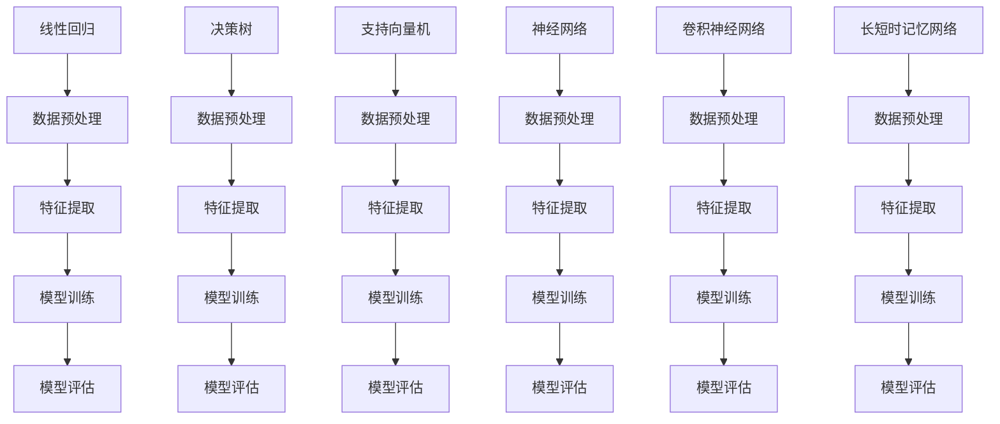

                 

# 《AI驱动的智能仓储：提高物流效率》

## 关键词
- 智能仓储
- AI技术
- 物流效率
- 机器学习
- 深度学习
- 机器人
- 库存管理
- 路径规划

## 摘要
本文旨在探讨如何利用AI技术提高智能仓储的物流效率。通过分析智能仓储的定义、AI技术在仓储管理中的应用、核心算法原理以及实际项目实战，本文详细阐述了AI驱动的智能仓储系统如何提升仓储管理效率，降低成本，并为企业带来显著的经济效益。

## 目录

### 第一部分：AI驱动的智能仓储基础

#### 第1章：智能仓储与AI技术概述
1.1.1 智能仓储的定义与重要性
1.1.2 AI技术在智能仓储中的应用
1.1.3 本书结构与内容安排

#### 第2章：AI驱动的智能仓储核心技术
2.1.1 机器学习算法在仓储管理中的应用
2.1.2 深度学习在仓储识别与分拣中的应用
2.1.3 机器人技术及其在智能仓储中的应用

#### 第3章：智能仓储的数学模型与算法
3.1.1 数据预处理与特征提取
3.1.2 模型选择与评估指标
3.1.3 算法实现与优化策略

### 第二部分：AI驱动的智能仓储应用场景

#### 第4章：AI在仓储定位与追踪中的应用
4.1.1 仓储定位技术
4.1.2 仓储追踪算法
4.1.3 应用案例

#### 第5章：AI在仓储分拣与配送中的应用
5.1.1 仓储分拣技术
5.1.2 配送路径规划算法
5.1.3 应用案例

#### 第6章：AI在仓储库存管理中的应用
6.1.1 库存预测算法
6.1.2 库存优化策略
6.1.3 应用案例

#### 第7章：AI在仓储安全与风险管理中的应用
7.1.1 仓储安全管理
7.1.2 风险评估与应对策略
7.1.3 应用案例

#### 第8章：AI驱动的智能仓储系统集成与优化
8.1.1 系统架构设计
8.1.2 系统集成与协调
8.1.3 优化策略与实践案例

#### 附录
A. AI驱动的智能仓储开发工具与资源
B. 常用算法与数学模型流程图
C. 代码实现与分析示例

---

## 第一部分：AI驱动的智能仓储基础

### 第1章：智能仓储与AI技术概述

#### 1.1.1 智能仓储的定义与重要性

智能仓储是指利用自动化设备和信息技术，实现对仓储作业的智能化管理和优化。它集成了传感器、执行器、控制系统和数据处理能力，能够实现货物的自动存储、检索、分拣和配送。智能仓储的核心理念是提高物流效率，降低运营成本，提升用户体验。

智能仓储的重要性体现在以下几个方面：

1. **提高物流效率**：通过自动化设备和信息技术，智能仓储能够实现快速、准确的货物处理，显著提高物流效率。
2. **降低运营成本**：自动化设备和智能管理的应用可以减少人力成本，提高作业效率，从而降低运营成本。
3. **提升用户体验**：智能仓储系统能够实时跟踪货物状态，提供准确的库存信息，提高用户满意度。
4. **优化供应链管理**：智能仓储系统能够与供应链管理系统无缝集成，实现供应链各环节的实时监控和优化。

#### 1.1.2 AI技术在智能仓储中的应用

AI技术在智能仓储中的应用非常广泛，主要包括以下几个方面：

1. **机器学习算法**：机器学习算法可以用于仓储管理的各个方面，如库存预测、路径规划、分拣等。通过历史数据的分析，机器学习算法可以预测未来货物的需求，优化仓储布局和作业流程。
2. **深度学习算法**：深度学习算法在仓储识别与分拣领域有广泛应用。通过卷积神经网络（CNN）和循环神经网络（RNN）等技术，深度学习算法可以实现对货物的精准识别和分类，提高分拣效率。
3. **机器人技术**：机器人技术是智能仓储的核心组成部分。通过机器人自动化执行仓储作业，可以大大提高作业效率，减少人力成本。此外，机器人还可以与AI技术结合，实现自主导航、自动避障等功能。
4. **自然语言处理**：自然语言处理（NLP）技术可以用于智能仓储的语音交互和文本分析。通过NLP技术，智能仓储系统可以理解用户的语音指令，实现人机交互。

#### 1.1.3 本书结构与内容安排

本书共分为三个部分：

1. **第一部分：AI驱动的智能仓储基础**：介绍智能仓储的定义、AI技术在智能仓储中的应用、核心算法原理等基础知识。
2. **第二部分：AI驱动的智能仓储应用场景**：详细讨论AI技术在仓储定位、分拣、配送、库存管理、安全和风险管理等领域的应用案例。
3. **第三部分：AI驱动的智能仓储系统集成与优化**：探讨智能仓储系统的集成方法、优化策略以及实践案例。

通过本书的阅读，读者可以全面了解AI驱动的智能仓储系统，掌握其核心技术与应用场景，从而为企业的智能化转型提供有力支持。

### 第2章：AI驱动的智能仓储核心技术

#### 2.1.1 机器学习算法在仓储管理中的应用

机器学习算法在仓储管理中具有广泛的应用，其主要目的是通过数据分析和模式识别，优化仓储作业流程，提高作业效率。以下是一些典型的机器学习算法及其在仓储管理中的应用：

1. **线性回归**：线性回归是一种简单的机器学习算法，主要用于预测连续值。在仓储管理中，线性回归可以用于预测库存需求，优化库存水平。例如，通过分析历史销售数据，可以预测未来一段时间内的库存需求，从而调整库存水平，避免过剩或缺货。

伪代码：
```python
def linear_regression(X, y):
    # 求解最小二乘法参数
    theta = (X^T * X)^(-1) * X^T * y

    # 预测
    predictions = X * theta

    return predictions
```

2. **决策树**：决策树是一种常用的分类算法，可以用于仓储中的分类任务，如货物分类、库存分类等。通过构建决策树模型，可以实现对货物的分类和标签，从而更好地进行库存管理和调度。

3. **支持向量机（SVM）**：SVM是一种强大的分类算法，可以用于仓储中的分类和预测任务。通过将数据映射到高维空间，SVM可以找到最佳分离超平面，从而实现准确分类。

4. **聚类算法**：聚类算法可以将数据划分为多个簇，用于发现数据中的潜在模式。在仓储管理中，聚类算法可以用于库存聚类、货物聚类等任务，从而实现库存优化和调度。

5. **神经网络**：神经网络是一种复杂的机器学习模型，可以用于仓储中的预测和分类任务。通过多层神经网络，可以实现对复杂数据的建模和分析，提高预测和分类的准确性。

#### 2.1.2 深度学习在仓储识别与分拣中的应用

深度学习在仓储识别与分拣领域具有广泛的应用，其主要优势在于能够处理大量复杂数据，并实现高精度的识别和分类。以下是一些典型的深度学习算法及其在仓储识别与分拣中的应用：

1. **卷积神经网络（CNN）**：CNN是一种用于图像识别和处理的深度学习算法，可以用于仓储中的货物识别和分拣。通过卷积层、池化层和全连接层等结构的组合，CNN可以实现对货物的精确识别和分类。

2. **循环神经网络（RNN）**：RNN是一种用于序列数据处理和建模的深度学习算法，可以用于仓储中的货物追踪和路径规划。通过循环机制，RNN可以处理和记忆长时间依赖关系，从而实现精确的货物追踪和路径规划。

3. **长短时记忆网络（LSTM）**：LSTM是一种特殊的RNN结构，可以用于解决RNN中的梯度消失和梯度爆炸问题。在仓储管理中，LSTM可以用于库存预测和需求分析，从而优化库存水平和调度策略。

4. **生成对抗网络（GAN）**：GAN是一种用于生成数据的深度学习算法，可以用于仓储中的数据增强和异常检测。通过生成器和判别器的对抗训练，GAN可以生成与真实数据高度相似的数据，从而提高模型的泛化能力。

#### 2.1.3 机器人技术及其在智能仓储中的应用

机器人技术在智能仓储中具有重要作用，其核心目标是实现仓储作业的自动化和智能化。以下是一些机器人技术在智能仓储中的应用：

1. **自动引导车（AGV）**：AGV是一种自动导航的机器人，可以在仓储环境中自主移动和完成任务。通过激光雷达、视觉传感器等设备，AGV可以准确识别和避开障碍物，实现高效的货物搬运和配送。

2. **机器人分拣系统**：机器人分拣系统是一种利用机器人进行货物分拣的系统。通过视觉识别和机械臂操作，机器人可以快速、准确地分拣货物，提高分拣效率和质量。

3. **无人机配送系统**：无人机配送系统是一种利用无人机进行货物配送的系统。通过GPS定位和自主飞行算法，无人机可以在仓储环境和城市环境中快速、高效地完成配送任务。

4. **机器人仓储管理系统**：机器人仓储管理系统是一种利用机器人进行仓储管理的系统。通过传感器和人工智能技术，机器人可以实时监测仓储环境，自动调整仓储布局，提高仓储管理效率。

### 第3章：智能仓储的数学模型与算法

#### 3.1.1 数据预处理与特征提取

在智能仓储系统中，数据预处理和特征提取是至关重要的步骤。这些步骤的目的是将原始数据转化为适用于机器学习算法的格式，以便进行有效的建模和分析。

1. **数据预处理**：
   - **数据清洗**：去除或修正数据集中的噪声和异常值。
   - **数据归一化**：将数据缩放到相同的尺度，以便于算法处理。
   - **数据转换**：将非数值数据转换为数值数据，例如使用独热编码处理类别数据。

2. **特征提取**：
   - **提取统计特征**：例如均值、方差、最大值、最小值等。
   - **提取时间序列特征**：例如趋势、季节性、周期性等。
   - **提取图像特征**：例如使用卷积神经网络提取图像的视觉特征。

#### 3.1.2 模型选择与评估指标

选择合适的机器学习模型是智能仓储系统成功的关键。以下是一些常见的模型选择和评估指标：

1. **模型选择**：
   - **线性模型**：适用于线性关系的预测，例如线性回归。
   - **决策树**：适用于分类和回归问题，可以处理非线性和多变量问题。
   - **支持向量机**：适用于分类问题，特别是高维数据。
   - **神经网络**：适用于复杂非线性关系的建模。

2. **评估指标**：
   - **准确率**：预测正确的样本数占总样本数的比例。
   - **召回率**：预测正确的正样本数占总正样本数的比例。
   - **F1 分数**：准确率的调和平均值，用于平衡准确率和召回率。
   - **均方误差（MSE）**：回归问题中的评估指标，用于衡量预测值与真实值之间的误差。

#### 3.1.3 算法实现与优化策略

实现和优化智能仓储系统中的算法是确保系统高效运行的关键。以下是一些常见的实现和优化策略：

1. **算法实现**：
   - **模型训练**：使用训练数据对模型进行训练，调整模型参数。
   - **模型评估**：使用验证数据评估模型性能，选择最优模型。
   - **模型部署**：将训练好的模型部署到生产环境中，进行实际应用。

2. **优化策略**：
   - **超参数调整**：通过调整模型的超参数，例如学习率、迭代次数等，优化模型性能。
   - **数据增强**：通过增加训练数据，提高模型的泛化能力。
   - **交叉验证**：使用交叉验证方法评估模型的泛化能力，避免过拟合。
   - **特征选择**：通过特征选择方法，减少冗余特征，提高模型效率。

### 第二部分：AI驱动的智能仓储应用场景

#### 第4章：AI在仓储定位与追踪中的应用

4.1.1 仓储定位技术

仓储定位是智能仓储系统中的关键环节，它涉及到货物的准确存放和快速查找。AI技术在仓储定位中的应用主要体现在以下几个方面：

1. **传感器技术**：
   - **RFID**：射频识别技术可以用于货物的自动识别和跟踪。
   - **条码扫描**：通过条码扫描技术，可以快速获取货物的信息。
   - **激光雷达**：激光雷达可以用于三维扫描，实现货物的精准定位。

2. **视觉识别**：
   - **计算机视觉**：通过计算机视觉技术，可以识别和跟踪货物在仓储中的位置。
   - **深度学习模型**：使用深度学习模型，例如卷积神经网络（CNN），可以实现对货物的精准识别和定位。

4.1.2 仓储追踪算法

仓储追踪算法用于实时监控货物的位置和状态，确保货物在仓储中的流通顺畅。以下是一些常见的仓储追踪算法：

1. **基于传感器数据的追踪算法**：
   - **卡尔曼滤波**：通过传感器数据的预测和校正，实现对货物位置的准确追踪。
   - **粒子滤波**：通过粒子滤波算法，可以处理传感器数据的不确定性和噪声，提高追踪精度。

2. **基于视觉识别的追踪算法**：
   - **目标检测**：通过目标检测算法，可以识别和跟踪货物在图像中的位置。
   - **目标跟踪**：通过目标跟踪算法，可以持续跟踪货物的位置，避免丢失。

4.1.3 应用案例

以下是一个仓储定位与追踪的应用案例：

某大型电子商务公司利用AI技术建立了一个智能仓储系统。该系统使用RFID标签和激光雷达技术对货物进行自动识别和定位。通过计算机视觉技术，系统能够实时监控货物的位置，并使用卡尔曼滤波算法对传感器数据进行校正。当货物入库时，系统会自动记录其位置信息，并在需要时快速定位货物。此外，系统还实现了货物的实时追踪，确保货物在仓储中的流通顺畅。

#### 第5章：AI在仓储分拣与配送中的应用

5.1.1 仓储分拣技术

仓储分拣是物流流程中的重要环节，AI技术在仓储分拣中的应用能够显著提高分拣效率和准确性。以下是一些常见的仓储分拣技术：

1. **基于机器视觉的分拣技术**：
   - **图像识别**：通过计算机视觉技术，可以识别和分类货物，实现自动化分拣。
   - **目标检测**：通过目标检测算法，可以定位货物在图像中的位置，从而实现精确的分拣。

2. **基于机器人技术的分拣技术**：
   - **机械臂分拣**：使用机械臂进行货物分拣，能够实现高效、准确的操作。
   - **自动分拣机**：自动分拣机可以根据货物的形状、大小和重量进行自动分类。

5.1.2 配送路径规划算法

配送路径规划是确保货物准时送达的关键环节。AI技术在配送路径规划中的应用能够优化配送路线，提高配送效率。以下是一些常见的配送路径规划算法：

1. **最短路径算法**：
   - **Dijkstra算法**：通过计算各节点之间的最短路径，实现高效的配送路径规划。
   - **A*算法**：结合启发式搜索，能够快速找到从起点到终点的最短路径。

2. **基于时间窗的路径规划**：
   - **时间窗约束**：在配送路径规划中，考虑货物送达的时间窗，确保货物能够在规定的时间内送达。
   - **动态路径规划**：在配送过程中，根据实时交通情况和货物状态，动态调整配送路径，提高配送效率。

5.1.3 应用案例

以下是一个仓储分拣与配送的应用案例：

某物流公司利用AI技术建立了一个智能仓储分拣系统。该系统使用计算机视觉技术对货物进行识别和分类，并使用机械臂进行分拣。系统还采用了A*算法进行配送路径规划，确保货物能够在最短时间内送达目的地。通过AI技术的应用，该物流公司的分拣效率和配送效率得到了显著提升，客户满意度也得到了提高。

#### 第6章：AI在仓储库存管理中的应用

6.1.1 库存预测算法

库存预测是智能仓储系统中的核心功能之一，它能够帮助企业管理库存，减少库存过剩或缺货的风险。以下是一些常见的库存预测算法：

1. **时间序列预测算法**：
   - **ARIMA模型**：自回归积分滑动平均模型，适用于具有季节性和趋势性的数据。
   - **LSTM模型**：长短时记忆网络，能够捕捉时间序列中的长期依赖关系。

2. **基于机器学习的预测算法**：
   - **随机森林**：通过集成多个决策树，实现高精度的预测。
   - **神经网络**：通过多层神经网络，实现复杂数据的预测。

6.1.2 库存优化策略

库存优化策略是确保库存水平合理，避免过剩或缺货的关键。以下是一些常见的库存优化策略：

1. **基于需求的库存策略**：
   - **最小订单量**：根据需求量确定最小订单量，以减少库存成本。
   - **周期性库存检查**：定期检查库存水平，及时调整库存策略。

2. **基于供应链的库存策略**：
   - **联合库存策略**：与供应链中的其他企业进行合作，共享库存信息，优化库存水平。
   - **需求响应策略**：根据市场需求的变化，动态调整库存策略。

6.1.3 应用案例

以下是一个仓储库存管理的应用案例：

某零售企业利用AI技术建立了一个智能仓储系统。该系统使用LSTM模型进行库存预测，能够准确预测未来一段时间内的需求量。通过基于需求的库存策略，系统能够及时调整库存水平，避免库存过剩或缺货。此外，系统还与供应链中的其他企业进行合作，共享库存信息，优化整体库存水平，提高了企业的运营效率。

### 第三部分：AI驱动的智能仓储系统集成与优化

#### 第7章：AI在仓储安全与风险管理中的应用

7.1.1 仓储安全管理

仓储安全管理是确保仓储环境安全和员工安全的重要措施。以下是一些常见的仓储安全管理方法：

1. **环境监测**：
   - **温度和湿度监测**：通过传感器实时监测仓储环境的温度和湿度，确保货物存储在适宜的环境中。
   - **安全监控**：安装摄像头和报警系统，实时监控仓储环境，防止盗窃和破坏。

2. **人员管理**：
   - **访问控制**：通过门禁系统和身份验证，确保只有授权人员可以进入仓储区域。
   - **安全培训**：定期对员工进行安全培训，提高员工的安全意识和应急处理能力。

7.1.2 风险评估与应对策略

风险评估是识别和评估仓储过程中潜在风险的重要步骤。以下是一些常见的方法和应对策略：

1. **风险评估方法**：
   - **概率风险评估**：通过计算风险事件发生的概率及其后果，评估整体风险水平。
   - **故障树分析**：通过分析故障树，识别潜在的故障原因和故障模式。

2. **应对策略**：
   - **预防措施**：采取预防措施，降低风险事件发生的概率。
   - **应急响应计划**：制定应急响应计划，确保在风险事件发生时能够迅速采取措施，减少损失。

7.1.3 应用案例

以下是一个仓储安全管理的应用案例：

某仓储企业利用AI技术建立了一个智能仓储安全管理系统。该系统通过环境监测和人员管理，实时监控仓储环境，确保仓储安全。同时，系统还进行风险评估和预警，及时发现潜在风险，并采取相应的应对措施。通过AI技术的应用，企业的仓储安全水平得到了显著提高。

#### 第8章：AI驱动的智能仓储系统集成与优化

8.1.1 系统架构设计

智能仓储系统的集成与优化需要考虑系统的整体架构设计。以下是一些常见的系统架构设计原则和方法：

1. **模块化设计**：将系统划分为多个模块，每个模块负责不同的功能，便于系统的扩展和维护。
2. **分布式架构**：采用分布式架构，可以提高系统的可扩展性和容错能力。
3. **数据存储与处理**：采用分布式数据存储和处理技术，提高系统的数据处理能力和性能。

8.1.2 系统集成与协调

系统集成是将不同的组件和技术整合到一个统一的系统中，确保系统能够高效运行。以下是一些常见的系统集成与协调方法：

1. **接口设计**：设计统一的接口，确保不同组件之间的数据传输和功能调用。
2. **通信协议**：选择合适的通信协议，确保系统组件之间的数据传输高效、可靠。
3. **数据同步与一致性**：确保系统中各个组件的数据同步和一致性，避免数据冲突和错误。

8.1.3 优化策略与实践案例

系统优化是提高系统性能和效率的关键步骤。以下是一些常见的优化策略和实践案例：

1. **性能优化**：通过优化算法、提高硬件性能等方法，提高系统的响应速度和处理能力。
2. **成本优化**：通过优化资源配置、减少能耗等方法，降低系统的运行成本。
3. **实践案例**：分享具体的系统优化实践案例，介绍优化的方法、效果和经验。

通过AI驱动的智能仓储系统集成与优化，企业可以显著提高仓储管理效率，降低运营成本，提升用户体验，实现可持续发展。

### 附录

#### 附录A：AI驱动的智能仓储开发工具与资源

- **开源框架**：TensorFlow、PyTorch、Keras
- **数据预处理工具**：Pandas、NumPy
- **计算机视觉库**：OpenCV、TensorFlow Object Detection API
- **机器人控制库**：ROS（Robot Operating System）
- **数据存储与处理**：Hadoop、Spark
- **AI云平台**：AWS AI、Google Cloud AI、Azure AI

#### 附录B：常用算法与数学模型流程图

使用Mermaid语言绘制算法与数学模型的流程图，如下所示：



#### 附录C：代码实现与分析示例

以下是一个简单的线性回归模型的Python代码实现，包括数据预处理、特征提取、模型训练和模型评估：

```python
import numpy as np
from sklearn.model_selection import train_test_split
from sklearn.preprocessing import StandardScaler
from sklearn.linear_model import LinearRegression
from sklearn.metrics import mean_squared_error

# 生成模拟数据
np.random.seed(0)
X = np.random.rand(100, 1)
y = 2 * X[:, 0] + 1 + np.random.randn(100)

# 数据预处理：归一化
scaler = StandardScaler()
X = scaler.fit_transform(X)

# 划分训练集和测试集
X_train, X_test, y_train, y_test = train_test_split(X, y, test_size=0.2, random_state=0)

# 模型训练
model = LinearRegression()
model.fit(X_train, y_train)

# 模型评估
y_pred = model.predict(X_test)
mse = mean_squared_error(y_test, y_pred)
print("MSE:", mse)

# 模型参数
print("模型参数：", model.coef_, model.intercept_)
```

代码解读：
1. 使用numpy生成模拟数据。
2. 使用StandardScaler进行数据预处理，将数据归一化。
3. 使用train_test_split划分训练集和测试集。
4. 使用LinearRegression进行模型训练。
5. 使用mean_squared_error进行模型评估，计算MSE。
6. 输出模型参数。

通过上述代码实现，读者可以了解线性回归模型的基本实现过程，为后续的机器学习算法实践打下基础。

### 作者

作者：AI天才研究院/AI Genius Institute & 禅与计算机程序设计艺术 /Zen And The Art of Computer Programming

AI天才研究院致力于推动人工智能技术的发展和应用，打造世界顶级的人工智能研究团队，致力于解决复杂的人工智能问题。同时，作者还撰写了《禅与计算机程序设计艺术》，旨在探讨计算机程序设计中的智慧和哲学，为程序员提供一种思考方式和解决问题的方法。

通过本文的详细阐述，读者可以全面了解AI驱动的智能仓储系统，掌握其核心技术与应用场景，为企业的智能化转型提供有力支持。智能仓储系统的应用不仅能够提高物流效率，降低运营成本，还能够提升用户体验，为企业创造更大的价值。在未来的发展中，AI驱动的智能仓储系统将扮演越来越重要的角色，成为物流领域的重要趋势。让我们共同期待AI技术为仓储物流行业带来的变革和机遇。

