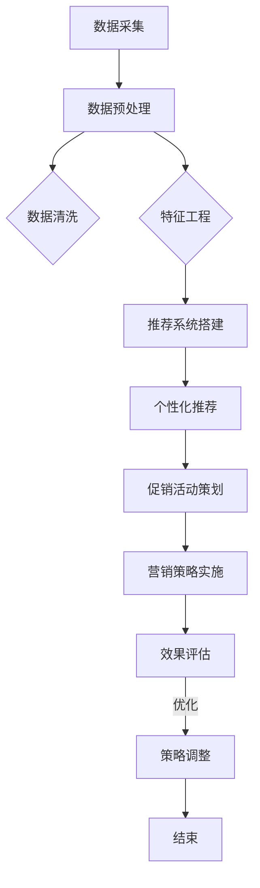

                 

# 《AI驱动的电商促销策略》

## 关键词

- 人工智能
- 电商促销
- 个性化推荐
- 数据分析
- 营销策略
- 大数据

## 摘要

随着电子商务的快速发展，电商促销策略成为企业提高销售额和用户粘性的重要手段。本文将探讨如何利用人工智能（AI）技术来优化电商促销策略。首先，我们将介绍电商促销的基本概念和重要性。接着，分析AI技术在电商促销中的应用，包括数据分析、个性化推荐和营销策略等方面。随后，通过实际案例展示AI驱动的电商促销策略的实战应用，并进行效果评估和优化。最后，展望AI驱动的电商促销策略的发展趋势和未来发展方向，为电商企业提供实施建议。

## 第一部分：电商促销策略基础

### 第1章：电商促销概述

#### 1.1 电商促销的概念与重要性

电商促销是指在电子商务平台上，通过一系列营销手段来吸引用户参与购物活动，提高销售额和用户粘性。促销手段包括折扣、限时抢购、赠品、积分兑换等。电商促销在当前电子商务环境中具有重要意义：

1. **提升销售额**：促销活动能刺激消费者购买欲望，增加销售额。
2. **增加用户粘性**：通过持续的促销活动，提高用户对平台的忠诚度。
3. **品牌推广**：促销活动是品牌推广的重要手段，有助于提高品牌知名度和影响力。
4. **市场占有率**：通过促销策略，企业可以在短时间内抢占市场份额。

#### 1.2 促销策略的分类

电商促销策略主要分为以下几类：

1. **价格促销**：通过降低商品价格来吸引消费者购买，如打折、满减等。
2. **活动促销**：通过举办各种活动来吸引用户，如秒杀、限时抢购等。
3. **赠品促销**：通过赠送赠品来激励消费者购买，如买一送一、赠品兑换等。
4. **积分兑换**：通过积分奖励机制，鼓励用户消费并积累积分，再用于兑换商品或享受优惠。
5. **会员促销**：针对会员提供专属优惠，提高会员忠诚度。

#### 1.3 AI在电商促销中的应用

随着人工智能技术的发展，AI在电商促销中的应用越来越广泛。AI技术能够帮助电商企业更精准地进行市场分析和用户行为预测，从而制定更加有效的促销策略。

1. **数据分析**：利用大数据分析技术，对用户行为、购买习惯等数据进行分析，为企业提供决策支持。
2. **个性化推荐**：通过分析用户数据，构建用户画像，为用户提供个性化推荐，提高用户满意度和转化率。
3. **营销策略优化**：利用机器学习算法，对促销活动效果进行预测和评估，优化营销策略，提高活动效果。
4. **智能客服**：通过自然语言处理技术，提供智能客服服务，提高客户满意度。

### 第2章：AI技术在电商促销中的应用

#### 2.1 数据分析

数据分析是电商促销策略制定的重要环节。通过分析用户数据，企业可以了解用户需求，制定更精准的促销策略。

##### 2.1.1 数据采集与处理

数据采集是数据分析的第一步。企业需要收集用户在平台上的各种行为数据，如浏览记录、购买记录、评价记录等。采集到的数据需要进行处理，包括数据清洗、去重、补全等操作，以保证数据的质量。

##### 2.1.2 数据可视化

数据可视化是将数据以图形化的方式展示出来，帮助企业更直观地了解数据。常见的可视化工具包括Excel、Tableau等。

##### 2.1.3 用户行为分析

用户行为分析是电商促销策略制定的关键。通过分析用户行为，企业可以了解用户在平台上的活动轨迹，预测用户购买行为。常见的用户行为分析指标包括浏览量、点击量、转化率、购买率等。

#### 2.2 个性化推荐

个性化推荐是AI技术在电商促销中的典型应用。通过个性化推荐，企业可以为用户提供更加个性化的商品推荐，提高用户满意度和转化率。

##### 2.2.1 推荐系统概述

推荐系统是一种基于用户行为和商品属性的分析算法，用于向用户推荐感兴趣的商品。推荐系统通常包括用户画像构建、商品特征提取、推荐算法和推荐结果生成等模块。

##### 2.2.2 用户画像构建

用户画像是指对用户特征的描述，包括用户的基本信息、行为习惯、兴趣偏好等。构建用户画像的目的是为了更好地了解用户，为个性化推荐提供依据。

##### 2.2.3 商品推荐算法

商品推荐算法是指根据用户画像和商品特征，为用户推荐感兴趣的商品。常见的推荐算法包括基于协同过滤的推荐算法、基于内容的推荐算法和基于模型的推荐算法。

#### 2.3 营销策略优化

营销策略优化是电商促销策略制定的关键环节。通过机器学习算法，企业可以对促销活动效果进行预测和评估，优化营销策略，提高活动效果。

##### 2.3.1 营销策略概述

营销策略是指企业为了实现营销目标而采取的一系列行动。营销策略包括定价策略、促销策略、渠道策略、品牌策略等。

##### 2.3.2 营销策略优化方法

营销策略优化方法主要包括以下几种：

1. **A/B测试**：通过对不同营销策略的对比测试，找出最优策略。
2. **数据挖掘**：通过数据挖掘技术，分析用户行为和购买习惯，为营销策略提供依据。
3. **机器学习**：通过机器学习算法，对促销活动效果进行预测和评估，优化营销策略。

## 第二部分：AI驱动的电商促销实战

### 第3章：AI驱动的电商促销案例分析

#### 3.1 案例一：某电商平台的大数据分析与个性化推荐

##### 3.1.1 案例背景

某电商平台希望通过大数据分析和个性化推荐来提升用户购物体验和销售额。该平台拥有海量的用户数据，包括用户行为数据、购买记录、评价记录等。

##### 3.1.2 案例分析

1. **数据采集与处理**：
   - 采集用户浏览记录、购买记录、评价记录等数据。
   - 数据清洗，去除重复和错误数据。
   - 特征工程，提取用户和商品的特征。

2. **个性化推荐系统搭建**：
   - 使用协同过滤算法，构建用户和商品的相似度矩阵。
   - 使用基于内容的推荐算法，根据用户和商品的属性进行推荐。

3. **促销活动策划**：
   - 设计限时抢购活动，根据用户购买行为预测热门商品。
   - 设计积分兑换活动，根据用户积分情况推荐商品。

##### 3.1.3 案例效果评估

1. **活动效果评估**：
   - 通过用户反馈和销售额数据评估活动的效果。
   - 分析用户参与度和转化率。

2. **策略优化**：
   - 根据效果评估结果，调整推荐算法和促销策略。
   - 持续优化系统，提高用户购物体验和销售额。

### 第4章：AI驱动的电商促销策略实施

#### 4.1 实施步骤

##### 4.1.1 数据采集与处理

1. **数据采集**：
   - 采集用户行为数据，包括浏览记录、购买记录、评价记录等。
   - 采集商品数据，包括商品属性、价格、销量等。

2. **数据预处理**：
   - 数据清洗，去除重复和错误数据。
   - 数据归一化，处理不同尺度的数据。
   - 特征工程，提取用户和商品的特征。

##### 4.1.2 个性化推荐系统搭建

1. **用户画像构建**：
   - 根据用户行为数据，构建用户画像。
   - 提取用户的基本信息、行为习惯、兴趣偏好等。

2. **商品特征提取**：
   - 根据商品数据，提取商品的特征。
   - 包括商品属性、价格、销量、评价等。

3. **推荐算法选择**：
   - 选择合适的推荐算法，如基于协同过滤的推荐算法、基于内容的推荐算法等。

4. **推荐系统搭建**：
   - 使用Python等编程语言，搭建推荐系统。

##### 4.1.3 促销活动策划

1. **促销活动类型**：
   - 设计各种类型的促销活动，如折扣促销、限时抢购、赠品促销等。

2. **活动策划**：
   - 根据用户行为数据和商品特征，策划促销活动。
   - 设定活动规则，如活动时间、参与条件、优惠力度等。

3. **活动实施**：
   - 在平台上发布促销活动，吸引用户参与。

##### 4.1.4 营销策略实施

1. **社交媒体营销**：
   - 利用社交媒体平台，宣传促销活动，吸引粉丝关注。

2. **内容营销**：
   - 发布与促销活动相关的文章、视频等内容，吸引用户参与。

3. **电子邮件营销**：
   - 发送促销活动邮件，提醒用户参与活动。

#### 4.2 AI驱动的电商促销策略实施效果评估

1. **活动效果评估**：
   - 通过用户反馈和销售额数据评估促销活动的效果。
   - 分析用户参与度和转化率。

2. **策略优化**：
   - 根据效果评估结果，调整推荐算法和促销策略。
   - 持续优化系统，提高用户购物体验和销售额。

## 第三部分：AI驱动的电商促销策略展望

### 第5章：AI驱动的电商促销策略发展趋势

#### 5.1 AI技术在电商促销中的应用趋势

随着人工智能技术的发展，AI在电商促销中的应用趋势将表现为：

1. **智能化**：AI技术将更加智能化，能够自动识别用户需求，提供个性化推荐和服务。
2. **社交化**：AI技术将与社会化媒体相结合，通过社交网络推广促销活动，提高用户参与度。
3. **个性化**：AI技术将更加注重个性化，根据用户画像和购买行为，提供定制化的促销策略。

#### 5.2 AI驱动的电商促销策略未来发展方向

未来，AI驱动的电商促销策略将朝着以下方向发展：

1. **精准化**：通过精准的用户画像和数据分析，提供更精准的推荐和促销策略。
2. **自动化**：实现促销策略的自动化，减少人工干预，提高运营效率。
3. **智能化营销**：结合智能客服和智能广告等技术，实现智能化营销，提高用户满意度。

#### 5.3 AI驱动的电商促销策略实施建议

为了更好地实施AI驱动的电商促销策略，企业可以采取以下措施：

1. **数据利用**：充分利用用户数据和商品数据，进行深入的数据分析，为促销策略提供依据。
2. **系统建设**：搭建完善的AI促销策略系统，包括推荐系统、营销系统等，实现智能化运营。
3. **人才培养**：培养专业的AI人才，提高企业对AI技术的应用能力。
4. **持续优化**：不断优化AI促销策略，根据用户反馈和业务需求，持续改进和升级。

## 附录

### 附录A：AI驱动的电商促销策略常用工具

#### A.1 数据分析工具

##### A.1.1 Python数据分析库

- NumPy：用于数组计算和数据处理。
- Pandas：用于数据清洗、数据操作和数据分析。
- Matplotlib：用于数据可视化。

##### A.1.2 SQL数据分析

- MySQL：开源关系型数据库，用于数据存储和查询。

#### A.2 推荐系统工具

##### A.2.1 基于协同过滤的推荐系统

- LightFM：基于矩阵分解的协同过滤推荐系统。
- Surprise：用于构建和评估推荐系统的Python库。

##### A.2.2 基于内容的推荐系统

- Content-Based Filtering：基于内容的推荐算法。
- LSA（Latent Semantic Analysis）：用于文本数据降维。

##### A.2.3 基于深度学习的推荐系统

- TensorFlow：用于构建深度学习模型的Python库。
- PyTorch：用于构建深度学习模型的Python库。

### 附录B：AI驱动的电商促销策略案例列表

#### B.1 案例一：某电商平台的大数据分析与个性化推荐

##### B.1.1 案例背景

某电商平台希望通过大数据分析和个性化推荐来提升用户购物体验和销售额。

##### B.1.2 案例分析

1. **数据采集与处理**：
   - 采集用户浏览记录、购买记录、评价记录等数据。
   - 数据清洗，去除重复和错误数据。
   - 特征工程，提取用户和商品的特征。

2. **个性化推荐系统搭建**：
   - 使用协同过滤算法，构建用户和商品的相似度矩阵。
   - 使用基于内容的推荐算法，根据用户和商品的属性进行推荐。

3. **促销活动策划**：
   - 设计限时抢购活动，根据用户购买行为预测热门商品。
   - 设计积分兑换活动，根据用户积分情况推荐商品。

##### B.1.3 案例效果评估

1. **活动效果评估**：
   - 通过用户反馈和销售额数据评估活动的效果。
   - 分析用户参与度和转化率。

2. **策略优化**：
   - 根据效果评估结果，调整推荐算法和促销策略。
   - 持续优化系统，提高用户购物体验和销售额。

### 附录C：Mermaid流程图



### 附录D：伪代码示例

```python
# 伪代码：个性化推荐算法
def personalized_recommendation(user_profile, product_data):
    # 步骤1：构建用户画像
    user_features = build_user_features(user_profile)

    # 步骤2：获取相似用户
    similar_users = find_similar_users(user_features, user_data)

    # 步骤3：计算相似用户对商品的评分预测
    predicted_ratings = predict_ratings(similar_users, product_data)

    # 步骤4：生成推荐列表
    recommendation_list = generate_recommendation_list(predicted_ratings)

    return recommendation_list
```

### 附录E：数学公式

$$
\text{用户行为概率分布} = P(x|y)
$$

$$
\text{推荐分数} = f(\text{用户画像}, \text{商品特征})
$$

### 附录F：项目实战

#### 6.1 案例一：某电商平台的大数据分析与个性化推荐

##### 6.1.1 案例背景

某电商平台希望通过大数据分析和个性化推荐来提升用户购物体验和销售额。

##### 6.1.2 案例分析

1. **数据采集与处理**：
   - 采集用户浏览记录、购买记录、评价记录等数据。
   - 数据清洗，去除重复和错误数据。
   - 特征工程，提取用户和商品的特征。

2. **个性化推荐系统搭建**：
   - 使用协同过滤算法，构建用户和商品的相似度矩阵。
   - 使用基于内容的推荐算法，根据用户和商品的属性进行推荐。

3. **促销活动策划**：
   - 设计限时抢购活动，根据用户购买行为预测热门商品。
   - 设计积分兑换活动，根据用户积分情况推荐商品。

##### 6.1.3 案例效果评估

1. **活动效果评估**：
   - 通过用户反馈和销售额数据评估活动的效果。
   - 分析用户参与度和转化率。

2. **策略优化**：
   - 根据效果评估结果，调整推荐算法和促销策略。
   - 持续优化系统，提高用户购物体验和销售额。

### 附录G：开发环境搭建

1. **安装Python环境**
2. **安装相关库**：NumPy、Pandas、Scikit-learn、TensorFlow等
3. **搭建推荐系统**：使用协同过滤和基于内容的推荐算法
4. **搭建促销活动系统**：设计活动流程，实现用户行为预测和商品推荐

### 附录H：源代码详细实现和代码解读

#### 6.1 源代码：个性化推荐系统

```python
import pandas as pd
from sklearn.metrics.pairwise import cosine_similarity

def build_user_features(user_data):
    # 构建用户特征向量
    # 略...

def find_similar_users(user_features, user_data):
    # 查找相似用户
    # 略...

def predict_ratings(similar_users, product_data):
    # 预测评分
    # 略...

def generate_recommendation_list(predicted_ratings):
    # 生成推荐列表
    # 略...

def main():
    # 主函数
    user_data = pd.read_csv('user_data.csv')
    product_data = pd.read_csv('product_data.csv')

    user_features = build_user_features(user_data)
    similar_users = find_similar_users(user_features, user_data)
    predicted_ratings = predict_ratings(similar_users, product_data)
    recommendation_list = generate_recommendation_list(predicted_ratings)

    print(recommendation_list)

if __name__ == '__main__':
    main()
```

#### 6.2 代码解读与分析

1. **数据处理**：
   - 读取用户数据和商品数据，进行数据预处理。

2. **用户特征构建**：
   - 构建用户特征向量，用于计算用户和商品的相似度。

3. **相似用户查找**：
   - 使用协同过滤算法，查找与当前用户相似的用户。

4. **评分预测**：
   - 根据相似用户对商品的评分预测当前用户对商品的评分。

5. **推荐列表生成**：
   - 根据评分预测结果，生成推荐商品列表。

6. **主函数**：
   - 调用各个函数，实现个性化推荐系统的整体流程。

